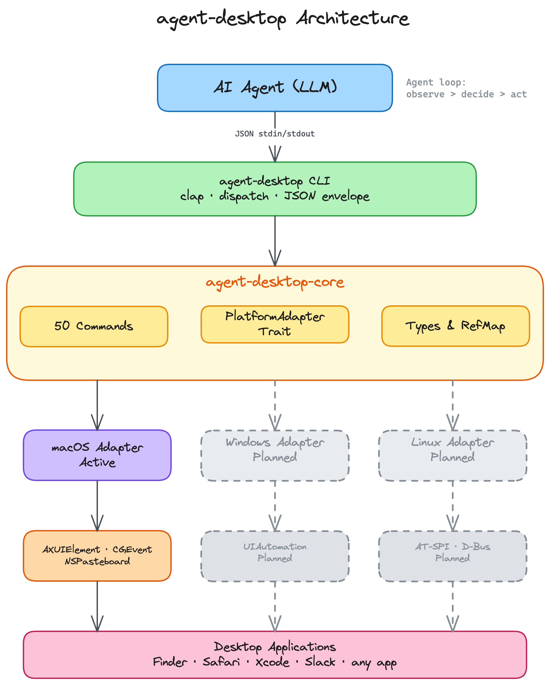

# agent-desktop

**agent-desktop** is a native desktop automation CLI designed for AI agents, built with Rust. It gives structured access to any application through OS accessibility trees — no screenshots, no pixel matching, no browser required.

## Architecture

<p align="center">
  
</p>

## Key Features

- **Native Rust CLI**: Fast, single binary, no runtime dependencies
- **50 commands**: Observation, interaction, keyboard, mouse, clipboard, window management
- **Snapshot & refs**: AI-optimized workflow using deterministic element references (`@e1`, `@e2`)
- **AX-first interactions**: Every action exhausts pure accessibility API strategies before falling back to mouse events
- **Structured JSON output**: Machine-readable responses with error codes and recovery hints
- **Works with any app**: Finder, Safari, System Settings, Xcode, Slack — anything with an accessibility tree

## Installation

### npm (recommended)

```bash
npm install -g agent-desktop        # downloads prebuilt binary automatically
```

Or without installing:

```bash
npx agent-desktop snapshot --app Finder -i
```

### From source

```bash
git clone https://github.com/lahfir/agent-desktop
cd agent-desktop
cargo build --release
cp target/release/agent-desktop /usr/local/bin/
```

Requires Rust 1.78+ and macOS 13.0+.

### Permissions

macOS requires Accessibility permission. Grant it in **System Settings > Privacy & Security > Accessibility** by adding your terminal app, or:

```bash
agent-desktop permissions --request   # trigger system dialog
```

## Core Workflow for AI

```bash
agent-desktop snapshot --app Finder -i   # get interactive elements with refs
agent-desktop click @e3                  # click a button by ref
agent-desktop type @e5 "quarterly report"  # type into a text field
agent-desktop press cmd+s               # keyboard shortcut
agent-desktop snapshot -i               # re-observe after UI changes
```

The snapshot + ref pattern is optimal for LLMs: refs provide deterministic element selection without re-querying the accessibility tree.

```
Agent loop:  snapshot → decide → act → snapshot → decide → act → ...
```

## Commands

### Observation

```bash
agent-desktop snapshot --app Safari -i           # accessibility tree with refs
agent-desktop snapshot --surface menu            # capture open menu
agent-desktop screenshot --app Finder            # PNG screenshot
agent-desktop find --role button --app TextEdit  # search by role, name, value, text
agent-desktop get @e3 value                      # read element property
agent-desktop is @e7 checked                     # check boolean state
agent-desktop list-surfaces --app Notes          # list menus, sheets, popovers, alerts
```

### Interaction

```bash
agent-desktop click @e3                  # smart AX-first click (15-step chain)
agent-desktop double-click @e3           # open files, select words
agent-desktop triple-click @e3           # select lines/paragraphs
agent-desktop right-click @e3            # context menu (returns menu tree inline)
agent-desktop type @e5 "hello world"     # type text into element
agent-desktop set-value @e5 "new value"  # set value directly via AX
agent-desktop clear @e5                  # clear element value
agent-desktop focus @e5                  # set keyboard focus
agent-desktop select @e9 "Option B"      # select option in dropdown/list
agent-desktop toggle @e12                # flip checkbox or switch
agent-desktop check @e12                 # idempotent check
agent-desktop uncheck @e12               # idempotent uncheck
agent-desktop expand @e15                # expand disclosure/tree item
agent-desktop collapse @e15              # collapse disclosure/tree item
agent-desktop scroll @e1 down 3          # scroll (AX-first, 10-step chain)
agent-desktop scroll-to @e20             # scroll element into view
```

### Keyboard

```bash
agent-desktop press cmd+s               # key combo
agent-desktop press cmd+shift+z          # multi-modifier
agent-desktop press escape               # single key
agent-desktop key-down shift             # hold key
agent-desktop key-up shift               # release key
```

### Mouse

```bash
agent-desktop hover @e3                  # move cursor to element
agent-desktop hover --xy 500,300         # move cursor to coordinates
agent-desktop drag @e3 --to @e8          # drag between elements
agent-desktop drag --xy 100,200 --to-xy 400,200  # drag between coordinates
agent-desktop mouse-click --xy 500,300   # click at coordinates
agent-desktop mouse-down --xy 500,300    # press at coordinates
agent-desktop mouse-up --xy 500,300      # release at coordinates
```

### App & Window Management

```bash
agent-desktop launch Safari              # launch app by name
agent-desktop launch com.apple.Safari    # launch by bundle ID
agent-desktop close-app Safari           # quit app
agent-desktop close-app Safari --force   # force quit (SIGKILL)
agent-desktop list-apps                  # list running GUI apps
agent-desktop list-windows               # list visible windows
agent-desktop list-windows --app Finder  # windows for specific app
agent-desktop focus-window w-4521        # bring window to front
agent-desktop resize-window w-4521 800 600  # resize
agent-desktop move-window w-4521 100 100    # move
agent-desktop minimize w-4521            # minimize
agent-desktop maximize w-4521            # maximize
agent-desktop restore w-4521             # restore
```

### Clipboard

```bash
agent-desktop clipboard-get              # read clipboard text
agent-desktop clipboard-set "copied"     # write to clipboard
agent-desktop clipboard-clear            # clear clipboard
```

### Wait

```bash
agent-desktop wait 500                                       # sleep 500ms
agent-desktop wait --element @e3 --timeout 5000              # wait for element
agent-desktop wait --window "Save" --timeout 10000           # wait for window
agent-desktop wait --text "Loading complete" --app Safari    # wait for text
agent-desktop wait --menu --timeout 3000                     # wait for menu
```

### Batch

```bash
agent-desktop batch '[
  {"command": "click", "args": {"ref_id": "@e2"}},
  {"command": "type", "args": {"ref_id": "@e5", "text": "hello"}},
  {"command": "press", "args": {"combo": "return"}}
]' --stop-on-error
```

### System

```bash
agent-desktop status                     # platform, permission state
agent-desktop permissions                # check accessibility permission
agent-desktop permissions --request      # trigger system dialog
agent-desktop version                    # version string
```

## Snapshot Options

```bash
agent-desktop snapshot [OPTIONS]
```

| Flag | Default | Description |
|------|---------|-------------|
| `--app <NAME>` | focused app | Filter to a specific application |
| `--window-id <ID>` | - | Filter to a specific window |
| `-i` / `--interactive-only` | off | Only include interactive elements |
| `--compact` | off | Omit empty structural nodes |
| `--include-bounds` | off | Include pixel bounds (x, y, width, height) |
| `--max-depth <N>` | 10 | Maximum tree depth |
| `--surface <TYPE>` | window | `window`, `focused`, `menu`, `menubar`, `sheet`, `popover`, `alert` |

## JSON Output

Every command returns structured JSON:

```json
{
  "version": "1.0",
  "ok": true,
  "command": "click",
  "data": { "action": "click" }
}
```

Errors include machine-readable codes and recovery hints:

```json
{
  "version": "1.0",
  "ok": false,
  "command": "click",
  "error": {
    "code": "STALE_REF",
    "message": "Element at @e7 no longer matches the last snapshot",
    "suggestion": "Run 'snapshot' to refresh refs, then retry"
  }
}
```

### Error Codes

| Code | Meaning |
|------|---------|
| `PERM_DENIED` | Accessibility permission not granted |
| `ELEMENT_NOT_FOUND` | No element matched the ref or query |
| `APP_NOT_FOUND` | Application not running or no windows |
| `STALE_REF` | Ref is from a previous snapshot |
| `ACTION_FAILED` | The OS rejected the action |
| `TIMEOUT` | Wait condition expired |
| `INVALID_ARGS` | Invalid argument values |

### Exit Codes

`0` success, `1` structured error (JSON on stdout), `2` argument parse error.

## Ref System

`snapshot` assigns refs to interactive elements in depth-first order: `@e1`, `@e2`, `@e3`, etc. Refs are valid until the next snapshot replaces them.

Interactive roles that receive refs: `button`, `textfield`, `checkbox`, `link`, `menuitem`, `tab`, `slider`, `combobox`, `treeitem`, `cell`, `radiobutton`, `incrementor`, `menubutton`, `switch`, `colorwell`, `dockitem`.

Static elements (labels, groups, containers) appear in the tree for context but have no ref.

Stale ref recovery:

```
snapshot → act → STALE_REF? → snapshot again → retry
```

## Platform Support

| | macOS | Windows | Linux |
|---|:---:|:---:|:---:|
| Accessibility tree | **Yes** | Planned | Planned |
| Click / type / keyboard | **Yes** | Planned | Planned |
| Mouse input | **Yes** | Planned | Planned |
| Screenshot | **Yes** | Planned | Planned |
| Clipboard | **Yes** | Planned | Planned |
| App & window management | **Yes** | Planned | Planned |

## Development

```bash
cargo build                               # debug build
cargo build --release                     # optimized (<15MB)
cargo test --lib --workspace              # run tests
cargo clippy --all-targets -- -D warnings # lint (must pass with zero warnings)
```

## License

Apache-2.0
