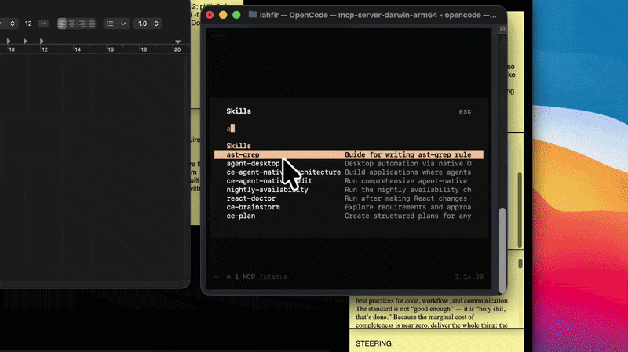

<h1 align="center">AGENT DESKTOP</h1>

<p align="center">
  <strong>OBSERVE. DECIDE. ACT.</strong>
</p>

<p align="center">
  <a href="https://github.com/lahfir/agent-desktop/actions/workflows/ci.yml?query=branch%3Amain"></a>
  <a href="https://github.com/lahfir/agent-desktop/releases"></a>
  <a href="https://www.npmjs.com/package/agent-desktop"></a>
  <a href="https://clawhub.ai/lahfir/agent-desktop"></a>
  <a href="https://skills.sh/lahfir/agent-desktop/agent-desktop"></a>
  <a href="LICENSE"></a>
</p>

<p align="center">
  
</p>

**agent-desktop** is a native desktop automation CLI designed for AI agents, built with Rust. It gives structured access to any application through OS accessibility trees — no screenshots, no pixel matching, no browser required.

## Architecture

<p align="center">
  
</p>

<p align="center">
  
</p>

<a href="https://star-history.com/#lahfir/agent-desktop&Date">
  <picture>
    <source media="(prefers-color-scheme: dark)" srcset="https://api.star-history.com/svg?repos=lahfir/agent-desktop&type=Date&theme=dark">
    <source media="(prefers-color-scheme: light)" srcset="https://api.star-history.com/svg?repos=lahfir/agent-desktop&type=Date">
    
  </picture>
</a>

## Key Features

- **Native Rust CLI**: Fast, single binary, no runtime dependencies
- **C-ABI cdylib** (`libagent_desktop_ffi`): Load once from Python / Swift / Go / Ruby / Node / C instead of forking the CLI per call
- **56 commands**: Observation, interaction, keyboard, mouse, notifications, clipboard, window management, session lifecycle, trace read/export, plus a bundled `skills` doc loader
- **Progressive skeleton traversal**: 78–96% token reduction on dense apps via shallow overview + targeted drill-down
- **Snapshot & refs**: AI-optimized workflow using compact snapshot IDs and deterministic element references (`@e1`, `@e2`)
- **Headless-by-default interactions**: Ref actions use accessibility APIs and block silent focus, cursor, keyboard, or pasteboard side effects
- **Structured JSON output**: Machine-readable responses with error codes and recovery hints
- **Works with any app**: Finder, Safari, System Settings, Xcode, Slack — anything with an accessibility tree

## Installation

### npm (recommended)

```bash
npm install -g agent-desktop        # downloads prebuilt binary automatically
```

Or without installing:

```bash
npx agent-desktop snapshot --app Finder -i
```

### From source

```bash
git clone https://github.com/lahfir/agent-desktop
cd agent-desktop
cargo build --release
cp target/release/agent-desktop /usr/local/bin/
```

Requires Rust 1.85+ and macOS 13.0+.

### Permissions

macOS requires Accessibility permission. Screenshots also require Screen Recording permission. Grant them in **System Settings > Privacy & Security** by adding the app that launches agent-desktop, or:

```bash
agent-desktop permissions --request   # trigger platform permission request path
```

Permission fields are explicit objects, for example:

```json
{
  "accessibility": { "state": "granted" },
  "screen_recording": { "state": "denied", "suggestion": "Grant Screen Recording permission" },
  "automation": { "state": "not_required" }
}
```

## Language bindings (FFI)

Every GitHub Release ships a prebuilt C-ABI cdylib (`libagent_desktop_ffi`) for macOS, Linux, and Windows alongside the CLI tarballs. `dlopen` it and call the functions declared in `agent_desktop.h` for in-process calls instead of fork-exec per command.

```python
import ctypes
lib = ctypes.CDLL("./lib/libagent_desktop_ffi.dylib")
lib.ad_init(1)  # verify ABI major (AD_ABI_VERSION_MAJOR) before any call
adapter = lib.ad_adapter_create()
# observe -> act: ad_snapshot -> parse an @e ref -> ad_execute_by_ref ...
lib.ad_adapter_destroy(adapter)
```

Full consumer guide — entrypoints, ownership, threading, error-handling, build/link, release archives, and verification: **[`skills/agent-desktop-ffi/`](skills/agent-desktop-ffi/)**.

## Core Workflow for AI

For dense apps (Slack, VS Code, Notion), use **progressive skeleton traversal** to minimize token usage:

```bash
# 1. Shallow overview — depth-3 map, truncated containers show children_count
agent-desktop snapshot --skeleton --app Slack -i --compact
# Keep snapshot_id, for example s8f3k2p9

# 2. Drill into a region of interest (named containers get refs as drill targets)
agent-desktop snapshot --root @e3 --snapshot s8f3k2p9 -i --compact

# 3. Act on an element found in the drill-down
agent-desktop click @e12 --snapshot s8f3k2p9

# 4. Re-drill the same region to verify the state change
agent-desktop snapshot --root @e3 --snapshot s8f3k2p9 -i --compact
```

For simple apps, a full snapshot is fine:

```bash
agent-desktop snapshot --app Finder -i   # get interactive elements with refs and snapshot_id
agent-desktop click @e3 --snapshot s8f3k2p9  # click a button by ref
agent-desktop type @e5 --snapshot s8f3k2p9 "quarterly report"  # insert text into a field
agent-desktop press cmd+s               # keyboard shortcut
agent-desktop snapshot -i               # re-observe after UI changes
```

```
Agent loop:  snapshot → decide → act → snapshot → decide → act → ...
```

### Trace viewer (read back a session)

```bash
agent-desktop session start --screenshots    # opt-in replay artifacts (PNG + refmap copies)
agent-desktop snapshot --app Finder -i       # work normally under the active session
agent-desktop click @e5
agent-desktop trace show --limit 500         # bounded JSON timeline for agents
agent-desktop trace export --out run.html    # single-file HTML viewer (works from file://)
```

`trace show` merges all segment files deterministically and requires no permissions. `trace export` embeds the timeline plus screenshots as base64 in one static HTML file. Without `--out`, the HTML is written to the session directory (`~/.agent-desktop/sessions/<id>/trace-<id>.html`), not the current directory; `--out` overrides the path. Treat exported HTML like a screenshot when `artifacts: full` was enabled.

### Shared sessions for multi-agent workflows

Run `session start` once per agent run to create a trace-enabled session (manifest `trace: on` by default) and set the active pointer. Subsequent commands in that run get automatic JSONL segments under `~/.agent-desktop/sessions/<id>/trace/` and share the session's latest-snapshot namespace — no `--trace` on every call.

For concurrent **independent** agents, set `AGENT_DESKTOP_SESSION=<id>` per process instead of relying on the global pointer. When multiple agents share one session id, each agent should act on the `snapshot_id` from its own `snapshot` call; implicit latest is a single-agent convenience.

Bare `--session <id>` without a manifest (no `session start`) still scopes the snapshot namespace only and writes no trace files. Explicit `--snapshot <id>` resolves cross-session.

```bash
agent-desktop session start --name release-fix
agent-desktop snapshot --app Xcode -i --compact          # uses active session + tracing
agent-desktop wait --element @e9 --predicate actionable --timeout 5000
agent-desktop click @e9
agent-desktop click @e9 --snapshot s2                   # pin to a specific observation
agent-desktop session end
agent-desktop session gc
```

## Commands

### Observation

```bash
agent-desktop snapshot --app Safari -i           # accessibility tree with refs
agent-desktop snapshot --surface menu            # capture open menu
agent-desktop screenshot --app Finder            # PNG screenshot
agent-desktop find --role button --app TextEdit  # search by role, name, value, text
agent-desktop get @e3 --snapshot s8f3k2p9 --property value  # read element property
agent-desktop is @e7 --snapshot s8f3k2p9 --property checked # check boolean state
agent-desktop list-surfaces --app Notes          # list menus, sheets, popovers, alerts
```

`get` and `is` resolve the ref once, prefer live platform reads when available, and fall back only when that live read is unsupported by the adapter.

### Interaction

```bash
agent-desktop click @e3                  # semantic AX-first click
agent-desktop double-click @e3           # AXOpen; physical double-click uses --headed mouse-click --count 2
agent-desktop triple-click @e3           # POLICY_DENIED if physical input is disabled
agent-desktop right-click @e3            # open verified context menu
agent-desktop type @e5 "hello world"     # insert text into element
agent-desktop set-value @e5 "new value"  # set value directly via AX
agent-desktop clear @e5                  # clear element value
agent-desktop focus @e5                  # set keyboard focus
agent-desktop select @e9 "Option B"      # select verified dropdown/list option
agent-desktop toggle @e12                # flip checkbox or switch
agent-desktop check @e12                 # idempotent check
agent-desktop uncheck @e12               # idempotent uncheck
agent-desktop expand @e15                # expand disclosure/tree item
agent-desktop collapse @e15              # collapse disclosure/tree item
agent-desktop scroll @e1 --direction down --amount 3  # scroll (AX-first)
agent-desktop scroll-to @e20             # scroll element into view
```

> **(macOS, Phase 1)** Pure cursor gestures have no accessibility equivalent, so `triple-click`, `hover`, and `drag` are always physical; `double-click` is headless via `AXOpen` and only needs `--headed` for gesture-only targets. Windows (UIA) and Linux (AT-SPI) adapters may expose different capabilities. See `skills/agent-desktop/references/commands-interaction.md`.

### Keyboard

```bash
agent-desktop press cmd+s               # key combo
agent-desktop press cmd+shift+z          # multi-modifier
agent-desktop press escape               # single key
agent-desktop key-down shift             # hold key
agent-desktop key-up shift               # release key
```

### Mouse

```bash
agent-desktop --headed hover @e3                  # move cursor to element
agent-desktop --headed hover --xy 500,300         # move cursor to coordinates
agent-desktop --headed drag --from @e3 --to @e8   # drag between elements
agent-desktop --headed drag --from-xy 100,200 --to-xy 400,200  # drag between coordinates
agent-desktop --headed mouse-click --xy 500,300   # click at coordinates
agent-desktop --headed mouse-down --xy 500,300    # press at coordinates
agent-desktop --headed mouse-up --xy 500,300      # release at coordinates
```

### App & Window Management

```bash
agent-desktop launch Safari              # launch app by name
agent-desktop launch com.apple.Safari    # launch by bundle ID
agent-desktop close-app Safari           # quit app
agent-desktop close-app Safari --force   # force quit (SIGTERM, then SIGKILL if needed)
agent-desktop list-apps                  # list running GUI apps
agent-desktop list-windows               # list visible windows
agent-desktop list-windows --app Finder  # windows for specific app
agent-desktop focus-window w-4521        # bring window to front
agent-desktop resize-window w-4521 800 600  # resize
agent-desktop move-window w-4521 100 100    # move
agent-desktop minimize w-4521            # minimize
agent-desktop maximize w-4521            # maximize
agent-desktop restore w-4521             # restore
```

### Notifications *(macOS only)*

```bash
agent-desktop list-notifications                       # list all notifications
agent-desktop list-notifications --app "Slack"         # filter by app
agent-desktop list-notifications --text "deploy" --limit 5  # filter by text
agent-desktop dismiss-notification 1                   # dismiss by index
agent-desktop dismiss-all-notifications                # dismiss all
agent-desktop dismiss-all-notifications --app "Slack"  # dismiss all from app
agent-desktop notification-action 1 --action "Reply"   # click action button
```

### Clipboard

```bash
agent-desktop clipboard-get              # read clipboard text
agent-desktop clipboard-set "copied"     # write to clipboard
agent-desktop clipboard-clear            # clear clipboard
```

### Wait

```bash
agent-desktop wait 500                                       # sleep 500ms
agent-desktop wait --element @e3 --timeout 5000              # wait for element
agent-desktop wait --element @e3 --predicate actionable      # wait until safe to act
agent-desktop wait --element @e5 --predicate value --value ready
agent-desktop wait --window "Save" --timeout 10000           # wait for window
agent-desktop wait --text "Loading complete" --app Safari    # wait for text
agent-desktop wait --text "Done" --count 1 --app Xcode       # wait for exact match count
agent-desktop wait --notification --text "Build Succeeded"   # wait for new matching notification
agent-desktop wait --menu --timeout 3000                     # wait for menu
```

### Batch

```bash
agent-desktop batch '[
  {"command": "click", "args": {"ref_id": "@e2", "snapshot": "<snapshot_id>"}},
  {"command": "type", "args": {"ref_id": "@e5", "snapshot": "<snapshot_id>", "text": "hello"}},
  {"command": "press", "args": {"combo": "return"}}
]' --stop-on-error

agent-desktop --session run-a batch '[
  {"command": "snapshot", "args": {"app": "Finder", "interactive_only": true}},
  {"command": "status", "session": "run-b", "args": {}}
]'
```

### System

```bash
agent-desktop session start [--name LABEL] [--no-trace]  # trace-enabled run (sets active pointer)
agent-desktop session end [id]
agent-desktop session list
agent-desktop session gc [--older-than SECS] [--ended]
agent-desktop status                     # platform, permissions, session_id, tracing, latest snapshot
agent-desktop permissions                # check accessibility/screen-recording/automation
agent-desktop permissions --request      # invoke platform request path
agent-desktop version                    # version string
agent-desktop skills get desktop --full  # bundled agent guidance
```

## Snapshot Options

```bash
agent-desktop snapshot [OPTIONS]
```

| Flag | Default | Description |
|------|---------|-------------|
| `--app <NAME>` | focused app | Filter to a specific application |
| `--window-id <ID>` | - | Filter to a specific window |
| `-i` / `--interactive-only` | off | Only include interactive elements |
| `--compact` | off | Omit empty structural nodes |
| `--include-bounds` | off | Include pixel bounds (x, y, width, height) |
| `--max-depth <N>` | 10 | Maximum tree depth |
| `--skeleton` | off | Shallow 3-level overview; truncated containers show `children_count` and get refs as drill targets |
| `--root <REF>` | - | Start traversal from this ref; merges into existing refmap with scoped invalidation |
| `--snapshot <snapshot_id>` | latest | Snapshot ID to use when resolving `--root` |
| `--surface <TYPE>` | window | `window`, `focused`, `menu`, `menubar`, `sheet`, `popover`, `alert` |

## JSON Output

Every command returns structured JSON:

```json
{
  "version": "2.0",
  "ok": true,
  "command": "click",
  "data": { "action": "click" }
}
```

Errors include machine-readable codes and recovery hints:

```json
{
  "version": "2.0",
  "ok": false,
  "command": "click",
  "error": {
    "code": "STALE_REF",
    "message": "Element at @e7 no longer matches the last snapshot",
    "suggestion": "Run 'snapshot' to refresh refs, then retry"
  }
}
```

### Error Codes

| Code | Meaning |
|------|---------|
| `PERM_DENIED` | Accessibility permission not granted |
| `ELEMENT_NOT_FOUND` | No element matched the ref or query |
| `APP_NOT_FOUND` | Application not running or no windows |
| `STALE_REF` | Ref could not be re-identified in the live UI |
| `AMBIGUOUS_TARGET` | Ref recovery matched multiple plausible targets |
| `SNAPSHOT_NOT_FOUND` | Snapshot ID is missing or expired |
| `POLICY_DENIED` | Physical/headed path blocked by policy |
| `ACTION_FAILED` | The OS rejected the action |
| `PLATFORM_NOT_SUPPORTED` | Adapter method not implemented on this platform |
| `TIMEOUT` | Wait condition expired |
| `INVALID_ARGS` | Invalid argument values |

### Exit Codes

`0` success, `1` structured error (JSON on stdout), `2` argument parse error.

## Ref System

`snapshot` assigns refs to interactive elements in depth-first order: `@e1`, `@e2`, `@e3`, etc. Refs are scoped to a compact `snapshot_id` such as `s8f3k2p9`. Commands can omit `--snapshot` to use the active session's latest snapshot pointer, but passing the ID is more deterministic in multi-step flows and does not require also passing `--session`.

Interactive roles that receive refs: `button`, `textfield`, `checkbox`, `link`, `menuitem`, `tab`, `slider`, `combobox`, `treeitem`, `cell`, `radiobutton`, `incrementor`, `menubutton`, `switch`, `colorwell`, `dockitem`.

Static elements (labels, groups, containers) appear in the tree for context but have no ref.

Reliability contract:

- `session start` creates a manifest-gated session with automatic trace segments and relocates the latest-snapshot namespace. Activation resolves `--session` > `AGENT_DESKTOP_SESSION` > `~/.agent-desktop/current_session` (pointer written only by `session start`).
- Bare `--session <id>` without a manifest scopes snapshots only — no surprise trace files for existing callers.
- Explicit `--snapshot <id>` resolves the saved snapshot directly, including across sessions.
- Ref actions re-identify targets at action time: a moved unique target can proceed, while missing or changed stable identity returns `STALE_REF`.
- Mutable value text is not treated as stable identity, so text fields and timers can keep resolving when the saved window, path, role, and bounds evidence still identify the same element.
- Multiple plausible targets return `AMBIGUOUS_TARGET` instead of choosing arbitrarily.
- Actions run an actionability preflight before dispatch: visibility, stability, enabled state, supported action, policy, and editability.
- `wait --element @e3 --predicate actionable` polls until the target can be acted on.
- With an active trace-enabled session, JSONL segments land under `sessions/<id>/trace/<pid>-*.jsonl` automatically. `--trace <path>` overrides to one file; `--trace-strict` fails on setup and pre-action writes (post-action traces are best-effort).

Stale ref recovery:

```
snapshot → act → STALE_REF or AMBIGUOUS_TARGET? → wait/snapshot again → retry with the new ref
```

## Platform Support

| | macOS | Windows | Linux |
|---|:---:|:---:|:---:|
| Accessibility tree | **Yes** | Planned | Planned |
| Click / type / keyboard | **Yes** | Planned | Planned |
| Mouse input | **Yes** | Planned | Planned |
| Screenshot | **Yes** | Planned | Planned |
| Clipboard | **Yes** | Planned | Planned |
| App & window management | **Yes** | Planned | Planned |
| Notifications | **Yes** | Planned | Planned |

## Development

```bash
cargo build                               # debug build
cargo build --release                     # optimized (<15MB)
cargo test --lib --workspace              # run tests
cargo clippy --all-targets -- -D warnings # lint (must pass with zero warnings)
```

## FAQ

### What is agent-desktop?

agent-desktop is a native desktop automation CLI for AI agents. It lets agents observe and control desktop apps through OS accessibility trees, using structured JSON instead of screenshots, pixel matching, or browser-only automation.

### Does agent-desktop require screenshots or pixel matching?

No. The core workflow reads native accessibility trees and assigns refs to interactive elements. Screenshots are available as a separate command, but agents do not need screenshots or pixel matching to click buttons, type into fields, inspect menus, or navigate app windows.

### How does agent-desktop work?

| Component | Function |
|-----------|----------|
| **Native Rust CLI** | Fast, single binary, no runtime dependencies |
| **C-ABI cdylib** | Load once from Python, Swift, Go, Ruby, Node, or C instead of forking |
| **56 Commands** | Observation, interaction, keyboard, mouse, notifications, clipboard, window management, session lifecycle, trace read/export, and bundled `skills` docs |
| **Snapshot & Refs** | Compact snapshot IDs and deterministic element refs like `@e1`, `@e2` |
| **Structured JSON** | Machine-readable responses with error codes and recovery hints |

### What makes agent-desktop useful for AI agents?

| Feature | Benefit |
|---------|---------|
| **Progressive Skeleton Traversal** | 78–96% token reduction on dense apps |
| **Headless-by-Default Actions** | Ref actions use accessibility APIs and block unintended physical side effects |
| **Snapshot Refs** | Agents act on stable refs within a snapshot instead of guessing coordinates |
| **Recovery Hints** | Errors include machine-readable codes and suggestions for the next agent step |
| **Cross-Language FFI** | Python, Swift, Go, Ruby, Node, C, and C++ hosts can call the native library directly |

### Which platforms are supported?

| Feature | macOS | Windows | Linux |
|---------|:-----:|:-------:|:-----:|
| Accessibility tree | **Yes** | Planned | Planned |
| Click/type/keyboard | **Yes** | Planned | Planned |
| Mouse input | **Yes** | Planned | Planned |
| Screenshot | **Yes** | Planned | Planned |
| Clipboard | **Yes** | Planned | Planned |
| App/window management | **Yes** | Planned | Planned |
| Notifications | **Yes** | Planned | Planned |

### How do I install agent-desktop?

Install the CLI from npm:

```bash
npm install -g agent-desktop
agent-desktop snapshot --app Safari
```

Build the FFI library from source:

```bash
cargo build --release
# Outputs: libagent_desktop_ffi.dylib/.so/.dll
```

### What is the ref system?

`snapshot` assigns refs to interactive elements in depth-first order: `@e1`, `@e2`, `@e3`, etc. Refs are scoped to a compact `snapshot_id` such as `s8f3k2p9`. Commands can omit `--snapshot` to use the active session's latest snapshot pointer, but explicit snapshot IDs are the deterministic path and do not require also passing `--session`.

Interactive roles that receive refs:

`button`, `textfield`, `checkbox`, `link`, `menuitem`, `tab`, `slider`, `combobox`, `treeitem`, `cell`, `radiobutton`, `incrementor`, `menubutton`, `switch`, `colorwell`, `dockitem`.

Stale ref recovery:

```text
snapshot -> act -> STALE_REF? -> snapshot again -> retry
```

### Is agent-desktop free and open source?

Yes. agent-desktop is Apache-2.0 licensed for personal and commercial use.

### Where can I get help?

| Resource | Link |
|----------|------|
| **Repository** | [github.com/lahfir/agent-desktop](https://github.com/lahfir/agent-desktop) |
| **ClawHub Skill** | [clawhub.ai/lahfir/agent-desktop](https://clawhub.ai/lahfir/agent-desktop) |
| **skills.sh Listing** | [skills.sh/lahfir/agent-desktop/agent-desktop](https://skills.sh/lahfir/agent-desktop/agent-desktop) |
| **npm Package** | [npmjs.com/package/agent-desktop](https://www.npmjs.com/package/agent-desktop) |
| **CI Status** | [GitHub Actions](https://github.com/lahfir/agent-desktop/actions/workflows/ci.yml?query=branch%3Amain) |
| **Releases** | [GitHub Releases](https://github.com/lahfir/agent-desktop/releases) |
| **Issues** | [GitHub Issues](https://github.com/lahfir/agent-desktop/issues) |

## License

Apache-2.0
