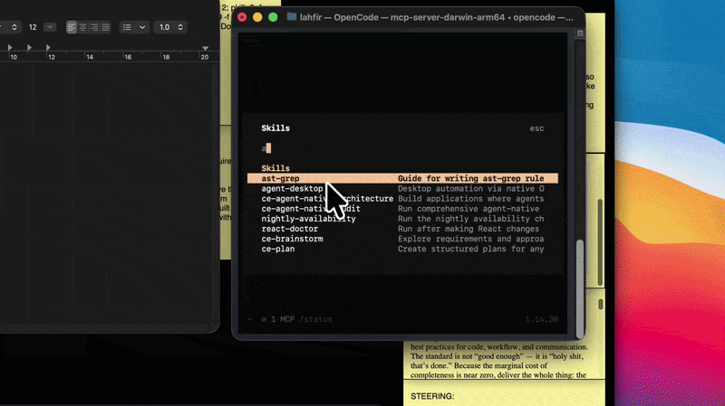
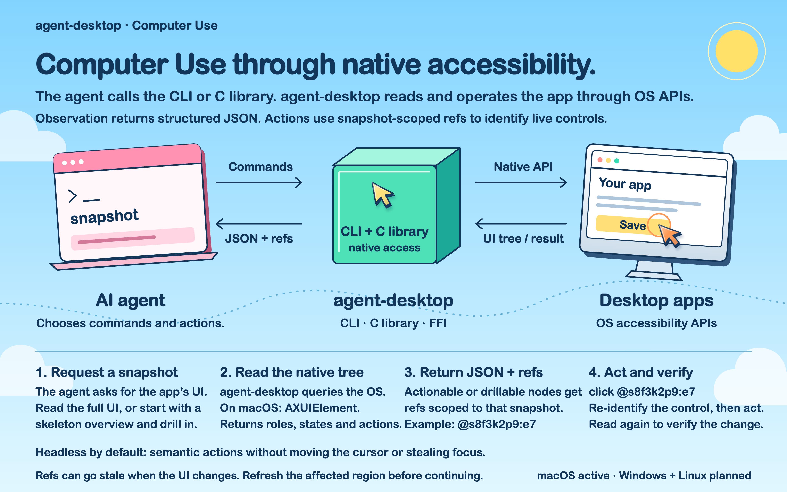

<h1 align="center">AGENT DESKTOP</h1>

<p align="center">
  <strong>OBSERVE. DECIDE. ACT.</strong>
</p>

<p align="center">
  <a href="https://github.com/lahfir/agent-desktop/actions/workflows/ci.yml?query=branch%3Amain"></a>
  <a href="https://github.com/lahfir/agent-desktop/releases"></a>
  <a href="https://www.npmjs.com/package/agent-desktop"></a>
  <a href="https://clawhub.ai/lahfir/agent-desktop"></a>
  <a href="https://skills.sh/lahfir/agent-desktop/agent-desktop"></a>
  <a href="LICENSE"></a>
</p>

<p align="center">
  
</p>

**agent-desktop** is a native desktop automation CLI designed for AI agents, built with Rust. It gives structured access to any application through OS accessibility trees — no screenshots, no pixel matching, no browser required.

## Architecture

<p align="center">
  
</p>

<p align="center">
  
</p>

<a href="https://star-history.com/#lahfir/agent-desktop&Date">
  <picture>
    <source media="(prefers-color-scheme: dark)" srcset="https://api.star-history.com/svg?repos=lahfir/agent-desktop&type=Date&theme=dark">
    <source media="(prefers-color-scheme: light)" srcset="https://api.star-history.com/svg?repos=lahfir/agent-desktop&type=Date">
    
  </picture>
</a>

## Key Features

- **Native Rust CLI**: Fast, single binary, no runtime dependencies
- **C-ABI cdylib** (`libagent_desktop_ffi`): Load once from Python / Swift / Go / Ruby / Node / C instead of forking the CLI per call
- **58 command names, 54 operational commands**: Observation, interaction, keyboard, mouse, notifications, clipboard, window management, session lifecycle, trace read/export, plus a bundled `skills` doc loader. The four held-input names are reserved for a stateful daemon and fail closed in the stateless CLI.
- **Progressive skeleton traversal**: 78–96% token reduction on dense apps via shallow overview + targeted drill-down
- **Snapshot & refs**: AI-optimized workflow using compact snapshot IDs and qualified element references (`@s8f3k2p9:e1`, `@s8f3k2p9:e2`)
- **Headless-by-default interactions**: Ref actions use accessibility APIs and block silent focus, cursor, keyboard, or pasteboard side effects
- **Structured JSON output**: Machine-readable responses with error codes and recovery hints
- **Works with any app**: Finder, Safari, System Settings, Xcode, Slack — anything with an accessibility tree
- **Chromium-app interop via CDP**: `launch --cdp` opens a verified DevTools port so any framework that speaks CDP — Playwright, Puppeteer, `chrome-remote-interface`, agent-browser — can drive the web contents, while native menus, dialogs, and windows stay on the accessibility path

## Installation

### npm (recommended)

```bash
npm install -g agent-desktop        # downloads prebuilt binary automatically
```

Or without installing:

```bash
npx agent-desktop snapshot --app Finder -i
```

### From source

```bash
git clone https://github.com/lahfir/agent-desktop
cd agent-desktop
cargo build --release
cp target/release/agent-desktop /usr/local/bin/
```

Requires Rust 1.89+ and macOS 13.0+.

### Permissions

macOS requires Accessibility permission. Screenshots also require Screen Recording permission, and the Notification Center opener requires Automation permission for System Events. Plain permission checks never prompt. Request missing permissions in a bounded isolated helper with:

```bash
agent-desktop permissions --request   # request missing permissions in an isolated helper
```

Permission fields are explicit objects, for example:

```json
{
  "accessibility": { "state": "granted" },
  "screen_recording": { "state": "denied", "suggestion": "Grant Screen Recording permission" },
  "automation": { "state": "unknown" }
}
```

Automation reports `granted`, `denied`, or `unknown`; `unknown` means macOS would need to prompt or System Events could not be probed without prompting.

## Language bindings (FFI)

Every GitHub Release ships a prebuilt C-ABI cdylib (`libagent_desktop_ffi`) for macOS, Linux, and Windows alongside the CLI tarballs. `dlopen` it and call the functions declared in `agent_desktop.h` for in-process calls instead of fork-exec per command.

```python
import ctypes
lib = ctypes.CDLL("./lib/libagent_desktop_ffi.dylib")
lib.ad_init(3)  # verify ABI major (AD_ABI_VERSION_MAJOR) before any call
adapter = lib.ad_adapter_create()
# observe -> act: ad_snapshot -> parse a qualified ref -> ad_execute_by_ref ...
lib.ad_adapter_destroy(adapter)
```

Full consumer guide — entrypoints, ownership, threading, error-handling, build/link, release archives, and verification: **[`skills/agent-desktop-ffi/`](skills/agent-desktop-ffi/)**.

## Core Workflow for AI

For dense apps (Slack, VS Code, Notion), use **progressive skeleton traversal** to minimize token usage:

```bash
# 1. Shallow overview — depth-3 map, truncated containers show children_count
agent-desktop snapshot --skeleton --app Slack -i --compact
# Keep snapshot_id, for example s8f3k2p9

# 2. Drill into a region of interest (each truncated branch exposes a safe drill ref)
agent-desktop snapshot --root @e3 --snapshot s8f3k2p9 -i --compact

# 3. Act on an element found in the drill-down
agent-desktop click @e12 --snapshot s8f3k2p9

# 4. Re-drill the same region to verify the state change
agent-desktop snapshot --root @e3 --snapshot s8f3k2p9 -i --compact
```

For simple apps, a full snapshot is fine:

```bash
agent-desktop snapshot --app Finder -i   # get interactive elements with refs and snapshot_id
agent-desktop click @e3 --snapshot s8f3k2p9  # click a button by ref
agent-desktop type @e5 --snapshot s8f3k2p9 "quarterly report"  # insert text into a field
agent-desktop press cmd+s               # keyboard shortcut
agent-desktop snapshot -i               # re-observe after UI changes
```

```
Agent loop:  snapshot → decide → act → snapshot → decide → act → ...
```

### Trace viewer (read back a session)

```bash
session_id=$(agent-desktop session start --screenshots | jq -r '.data.session_id')
export AGENT_DESKTOP_SESSION="$session_id"
agent-desktop snapshot --app Finder -i       # work inside the explicit session scope
agent-desktop click @s8f3k2p9:e5
agent-desktop trace show --limit 500         # bounded JSON timeline for agents
agent-desktop trace export --out run.html    # single-file HTML viewer (works from file://)
```

`trace show` merges all segment files deterministically and requires no permissions. `trace export` embeds the timeline plus screenshots as base64 in one static HTML file. Without `--out`, the HTML is written to the session directory (`~/.agent-desktop/sessions/<id>/trace-<id>.html`), not the current directory; `--out` overrides the path. Treat exported HTML like a screenshot when `artifacts: full` was enabled.

### Shared sessions for multi-agent workflows

Run `session start` once per agent run to create a trace-enabled session (manifest `trace: on` by default), then pass the returned ID with global `--session <id>` or `AGENT_DESKTOP_SESSION=<id>`. Commands in that explicit scope get automatic JSONL segments under `~/.agent-desktop/sessions/<id>/trace/` and share the session's latest-snapshot namespace — no `--trace` on every call.

For concurrent **independent** agents, set `AGENT_DESKTOP_SESSION=<id>` per process. When multiple agents share one session ID, each agent should act on the qualified refs from its own `snapshot` call rather than assuming the namespace's latest snapshot is unchanged.

Bare `--session <id>` without a manifest (no `session start`) still scopes the snapshot namespace only and writes no trace files. Snapshot IDs resolve only inside the selected session namespace; they never trigger a cross-session search.

```bash
agent-desktop session start --name release-fix          # note data.session_id
export AGENT_DESKTOP_SESSION=<session_id>
agent-desktop snapshot --app Xcode -i --compact          # uses selected session + tracing
agent-desktop wait --element @s8f3k2p9:e9 --predicate actionable --timeout 5000
agent-desktop click @s8f3k2p9:e9
agent-desktop click @e9 --snapshot s2                    # legacy bare ref, explicitly pinned
agent-desktop session end "$AGENT_DESKTOP_SESSION"
agent-desktop session gc
```

### Agent cursor overlay (macOS)

Enable the presentation-only cursor once for a session. Every eligible headless action in that session inherits the setting; action and batch entries do not take cursor-enable flags.

```bash
agent-desktop --session <session_id> cursor-overlay enable \
  --label "Opening profile menu" --max-words 6
agent-desktop --session <session_id> click @s8f3k2p9:e9
agent-desktop --session <session_id> cursor-overlay disable
```

Enabling immediately shows the persistent cursor with “Hey, let's play with this computer!” The current card remains visible until its description changes; the old card then eases out and the new text eases in. Actions reuse the cursor's last position for the same eased, swinging glide and briefly switch to a hand pointer for click feedback. The solid white card has a 1.5px near-black border and stays at the cursor's bottom-right. The overlay never moves or intercepts the OS pointer and remains until `cursor-overlay disable` or session end. Headed actions temporarily hide it while the real cursor is in use. macOS renders the overlay natively; Windows and Linux inherit the platform adapter's presentation no-op and need only add their native renderer to support the same session contract.

## Driving Chromium apps (CDP)

For a Chromium-based app (Slack, VS Code, Discord, Obsidian, Notion), `launch --cdp` opens a verified Chrome DevTools Protocol endpoint on the web contents. Any framework that speaks CDP can connect — Playwright, Puppeteer, `chrome-remote-interface`, agent-browser — with agent-browser preferred for its ref-based agent workflow and bundled `electron` skill. Native surfaces (menus, dialogs, windows, screenshots) stay on the accessibility path either way.

```bash
agent-desktop launch "Obsidian" --cdp
```

```json
{ "app": "Obsidian", "pid": 4821, "cdp": {
  "port": 9229,
  "http_endpoint": "http://127.0.0.1:9229",
  "websocket_url": "ws://127.0.0.1:9229/devtools/browser/<id>",
  "product": "Chrome/142.0.7444.265"
},
  "suggestion": "Next: run `agent-browser connect 9229` (preferred) or connect any CDP client such as Playwright or Puppeteer. ..." }
```

`--cdp` needs a fresh launch — an already-running target returns `ACTION_FAILED`. Run `close-app` first, confirm the process exited, then `launch --cdp` again.

The endpoint is pinned to `127.0.0.1`. Any local process running as your user can still reach it while it stays open; `close-app` ends the exposure along with the app.

## Commands

### Observation

```bash
agent-desktop snapshot --app Safari -i           # accessibility tree with refs
agent-desktop snapshot --surface menu            # capture open menu
agent-desktop screenshot --app Finder            # PNG screenshot
agent-desktop find --role button --app TextEdit  # search by role, name, value, text
agent-desktop get @e3 --snapshot s8f3k2p9 --property value  # read element property
agent-desktop is @e7 --snapshot s8f3k2p9 --property checked # check boolean state
agent-desktop list-surfaces --app Notes          # list menus, sheets, popovers, alerts
```

`get` and `is` resolve the ref once, prefer live platform reads when available, and fall back only when that live read is unsupported by the adapter.

### Interaction

```bash
agent-desktop click @s8f3k2p9:e3                  # strict headless AX click
agent-desktop --headed click @s8f3k2p9:e3         # physical click, focus/cursor allowed
agent-desktop --headed double-click @s8f3k2p9:e3  # physical double-click
agent-desktop --headed triple-click @s8f3k2p9:e3  # physical triple-click
agent-desktop right-click @s8f3k2p9:e3            # open context menu; inspect effect before retrying
agent-desktop type @s8f3k2p9:e5 "hello world"     # insert text into element
agent-desktop set-value @s8f3k2p9:e5 "new value"  # set value directly via AX
agent-desktop clear @s8f3k2p9:e5                  # clear element value
agent-desktop focus @s8f3k2p9:e5                  # set keyboard focus
agent-desktop select @s8f3k2p9:e9 "Option B"      # select verified dropdown/list option
agent-desktop toggle @s8f3k2p9:e12                # flip checkbox or switch
agent-desktop check @s8f3k2p9:e12                 # idempotent check
agent-desktop uncheck @s8f3k2p9:e12               # idempotent uncheck
agent-desktop expand @s8f3k2p9:e15                # expand disclosure/tree item
agent-desktop collapse @s8f3k2p9:e15              # collapse disclosure/tree item
agent-desktop scroll @s8f3k2p9:e1 --direction down --amount 3  # strict headless AX scroll
agent-desktop scroll-to @s8f3k2p9:e20             # scroll element into view
```

> **(macOS, Phase 1)** Default ref actions are strict headless semantic operations. In headed mode, core focuses the exact ref window before dispatch; pointer commands additionally require a verified target point, while the adapter owns physical delivery. `click`, `right-click`, `type`, `clear`, and `scroll` are physical-first; double/triple-click, hover, and drag are physical-only; expand/collapse and other semantic commands remain semantic. Raw coordinates never imply a target window and therefore never steal focus. See `skills/agent-desktop/references/commands-interaction.md`.

### Keyboard

```bash
agent-desktop press cmd+s               # key combo
agent-desktop press cmd+shift+z          # multi-modifier
agent-desktop press escape               # single key
```

`key-down` and `key-up` are reserved command names and return `ACTION_NOT_SUPPORTED` until a stateful daemon can own the held-key lifetime.

### Mouse

```bash
agent-desktop --headed hover @s8f3k2p9:e3                  # move cursor to element
agent-desktop --headed hover --xy 500,300         # move cursor to coordinates
agent-desktop --headed drag --from @s8f3k2p9:e3 --to @s8f3k2p9:e8   # drag between elements
agent-desktop --headed drag --from-xy 100,200 --to-xy 400,200  # drag between coordinates
agent-desktop --headed mouse-click --xy 500,300   # click at coordinates
```

`mouse-down` and `mouse-up` are likewise reserved; use the atomic `mouse-click` or `drag` commands.

### App & Window Management

```bash
agent-desktop launch Safari              # launch app by name
agent-desktop launch com.apple.Safari    # launch by bundle ID
agent-desktop launch "Obsidian" --cdp    # fresh launch + verified CDP port for web contents
agent-desktop close-app Safari           # quit app
agent-desktop close-app Safari --force   # force quit (SIGTERM, then SIGKILL if needed)
agent-desktop list-apps                  # list running GUI apps
agent-desktop list-windows               # list visible windows
agent-desktop list-windows --app Finder  # windows for specific app
agent-desktop focus-window --window-id w-4521  # bring exact window to front
agent-desktop resize-window --window-id w-4521 --width 800 --height 600
agent-desktop move-window --window-id w-4521 --x 100 --y 100
agent-desktop minimize --window-id w-4521
agent-desktop maximize --window-id w-4521
agent-desktop restore --window-id w-4521
```

### Notifications *(macOS only)*

```bash
agent-desktop --headed list-notifications              # open Notification Center if needed, then list
agent-desktop --headed list-notifications --app "Slack"         # filter by app
agent-desktop --headed list-notifications --text "deploy" --limit 5  # filter by text
agent-desktop --headed dismiss-notification 1 --expected-app "Slack" --expected-title "Deploy complete"
agent-desktop --headed dismiss-all-notifications                # dismiss all
agent-desktop --headed dismiss-all-notifications --app "Slack"  # dismiss all from app
agent-desktop --headed notification-action 1 "Reply" --expected-app "Slack" --expected-title "Deploy complete"
```

Single-notification mutations require an app or title fingerprint from the
same listing. Every mutation requires `--headed` because it opens and focuses
Notification Center. Headless listing can only observe an already-open center;
headed listing may open it and restore the prior frontmost app afterward.

### Clipboard

```bash
agent-desktop clipboard-get              # read clipboard text
agent-desktop clipboard-set "copied"     # write to clipboard
agent-desktop clipboard-clear            # clear clipboard
```

### Wait

```bash
agent-desktop wait 500                                       # sleep 500ms
agent-desktop wait --element @s8f3k2p9:e3 --timeout 5000              # wait for element
agent-desktop wait --element @s8f3k2p9:e3 --predicate actionable      # wait until safe to act
agent-desktop wait --element @s8f3k2p9:e5 --predicate value --value ready
agent-desktop wait --window "Save" --timeout 10000           # wait for window
agent-desktop wait --text "Loading complete" --app Safari    # wait for text
agent-desktop wait --text "Done" --count 1 --app Xcode       # wait for exact match count
agent-desktop wait --notification --text "Build Succeeded"   # wait for new matching notification
agent-desktop wait --menu --timeout 3000                     # wait for menu
```

### Batch

```bash
agent-desktop batch '[
  {"command": "click", "args": {"ref_id": "@e2", "snapshot": "<snapshot_id>"}},
  {"command": "type", "args": {"ref_id": "@e5", "snapshot": "<snapshot_id>", "text": "hello"}},
  {"command": "press", "args": {"combo": "return"}}
]' --stop-on-error

agent-desktop --session run-a batch '[
  {"command": "snapshot", "args": {"app": "Finder", "interactive_only": true}},
  {"command": "status", "session": "run-b", "args": {}}
]'
```

### System

```bash
agent-desktop session start [--name LABEL] [--no-trace]  # create session; pass returned ID explicitly
agent-desktop session end [id]
agent-desktop session list
agent-desktop session gc [--older-than SECS] [--ended]
agent-desktop --session <id> cursor-overlay enable [--label TEXT] [--max-words N]
agent-desktop --session <id> cursor-overlay disable
agent-desktop status                     # platform, permissions, session_id, tracing, latest snapshot
agent-desktop permissions                # check accessibility/screen-recording/automation
agent-desktop permissions --request      # request in the bounded isolated helper
agent-desktop version                    # version string
agent-desktop skills get desktop --full  # bundled agent guidance
```

## Snapshot Options

```bash
agent-desktop snapshot [OPTIONS]
```

| Flag | Default | Description |
|------|---------|-------------|
| `--app <NAME>` | focused app | Filter to a specific application |
| `--window-id <ID>` | - | Filter to a specific window |
| `-i` / `--interactive-only` | off | Only include interactive elements |
| `--compact` | off | Omit empty structural nodes |
| `--include-bounds` | off | Include pixel bounds (x, y, width, height) |
| `--max-depth <N>` | 10 | Maximum tree depth |
| `--skeleton` | off | Shallow 3-level overview; truncated containers show `children_count` and get refs as drill targets |
| `--root <REF>` | - | Start traversal from this ref; merges into existing refmap with scoped invalidation |
| `--snapshot <snapshot_id>` | latest | Snapshot ID to use when resolving `--root` |
| `--surface <TYPE>` | window | `window`, `focused`, `menu`, `menubar`, `sheet`, `popover`, `alert` |

## JSON Output

See the [versioned JSON envelope, error-code, and exit-code contract](docs/json-output.md).

## Ref System

`snapshot` assigns local positions in depth-first order and emits qualified refs such as `@s8f3k2p9:e1`, `@s8f3k2p9:e2`, and `@s8f3k2p9:e3`. A qualified ref embeds the exact snapshot ID and needs no separate `--snapshot`. Legacy bare refs such as `@e3` remain accepted only with an explicit `--snapshot s8f3k2p9`. Snapshot lookup stays inside the selected session namespace.

Interactive roles that receive refs: `button`, `textfield`, `checkbox`, `link`, `menuitem`, `tab`, `slider`, `combobox`, `treeitem`, `cell`, `radiobutton`, `incrementor`, `menubutton`, `switch`, `colorwell`, `dockitem`.

Static elements (labels, groups, containers) appear in the tree for context but have no ref.

Reliability contract:

- `session start` creates and returns a manifest-gated session with automatic trace segments. It does not activate later processes. Activation resolves explicit `--session` first, then `AGENT_DESKTOP_SESSION`; otherwise the command uses the global, non-session namespace.
- Bare `--session <id>` without a manifest scopes snapshots only — no surprise trace files for existing callers.
- Snapshot lookup is confined to the selected namespace. A session-owned snapshot requires the same explicit `--session` or `AGENT_DESKTOP_SESSION` scope.
- Ref actions re-identify targets at action time: a moved unique target can proceed, while missing or changed stable identity returns `STALE_REF`.
- Mutable value text is not treated as stable identity, so text fields and timers can keep resolving when the saved window, path, role, and bounds evidence still identify the same element.
- Multiple plausible targets return `AMBIGUOUS_TARGET` instead of choosing arbitrarily.
- Actions run an actionability preflight before dispatch: visibility, stability, enabled state, supported action, policy, and editability.
- `wait --element @s8f3k2p9:e3 --predicate actionable` polls until the target can be acted on.
- With an active trace-enabled session, JSONL segments land under `sessions/<id>/trace/<pid>-*.jsonl` automatically. `--trace <path>` overrides to one file; `--trace-strict` fails on setup and pre-action writes (post-action traces are best-effort).

Stale ref recovery:

```
snapshot → act → STALE_REF or AMBIGUOUS_TARGET? → wait/snapshot again → retry with the new ref
```

## Platform Support

| | macOS | Windows | Linux |
|---|:---:|:---:|:---:|
| Accessibility tree | **Yes** | Planned | Planned |
| Click / type / keyboard | **Yes** | Planned | Planned |
| Mouse input | **Yes** | Planned | Planned |
| Screenshot | **Yes** | Planned | Planned |
| Clipboard | **Yes** | Planned | Planned |
| App & window management | **Yes** | Planned | Planned |
| Notifications | **Yes** | Planned | Planned |

## Development

```bash
cargo build                               # debug build
cargo build --release                     # optimized (<15MB)
cargo test --lib --workspace              # run tests
cargo clippy --all-targets -- -D warnings # lint (must pass with zero warnings)
```

## FAQ

See the [complete FAQ](docs/faq.md) for architecture, platform support, installation, refs, licensing, and support links.

## License

Apache-2.0
