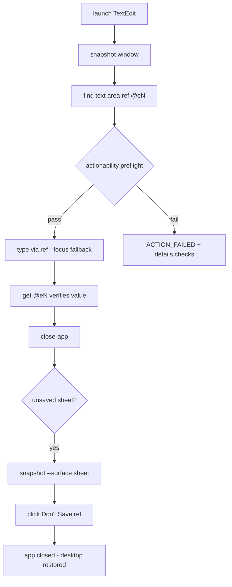
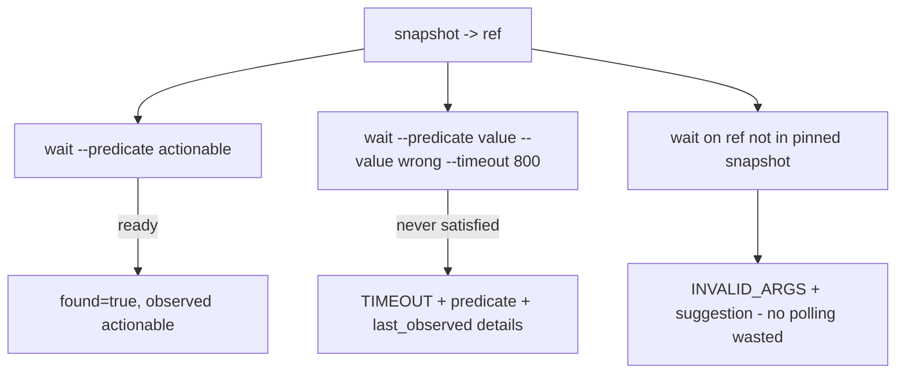
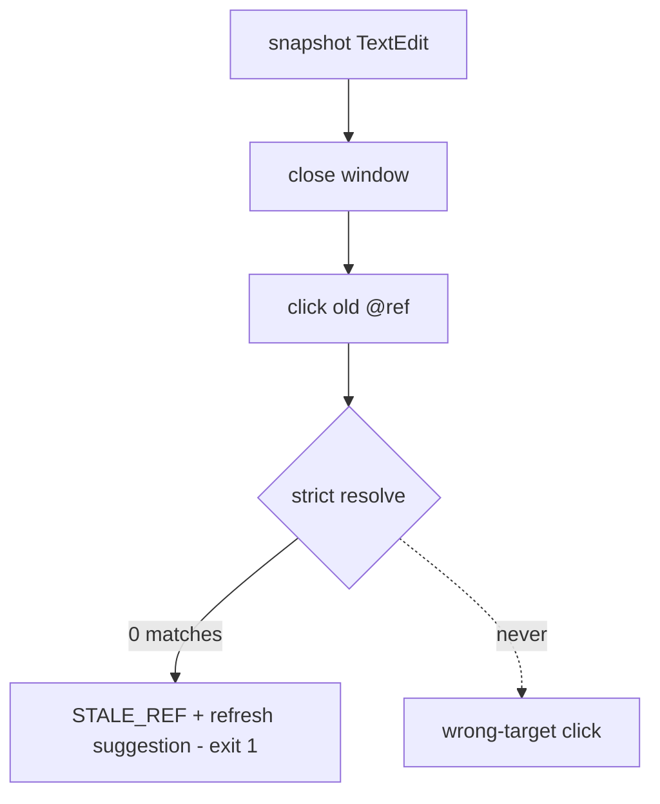
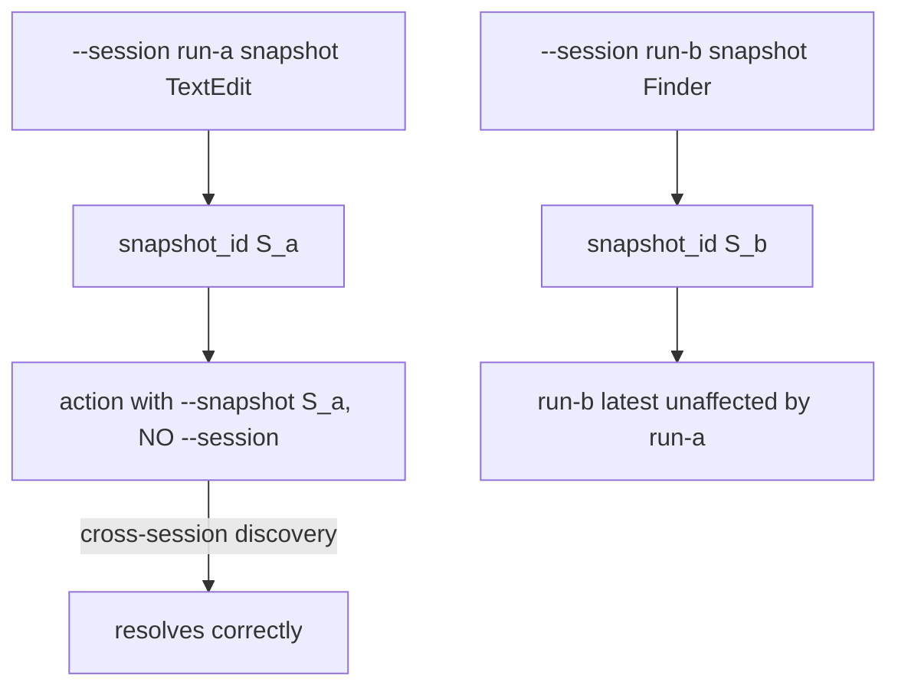
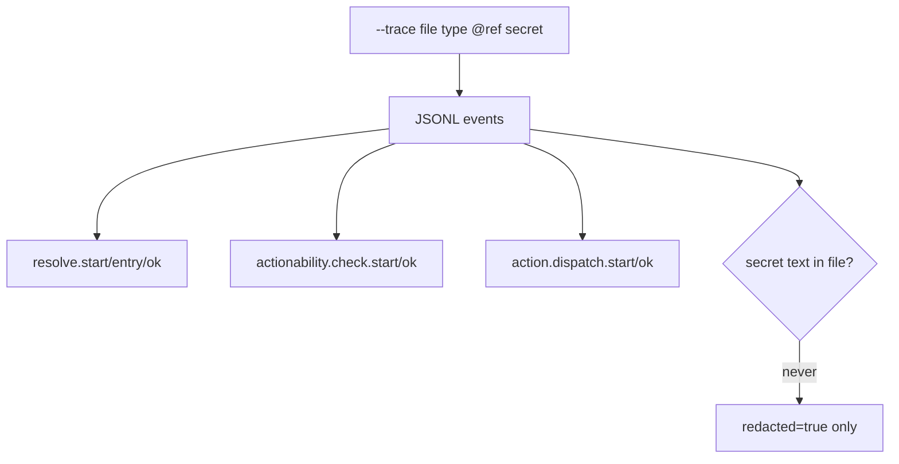
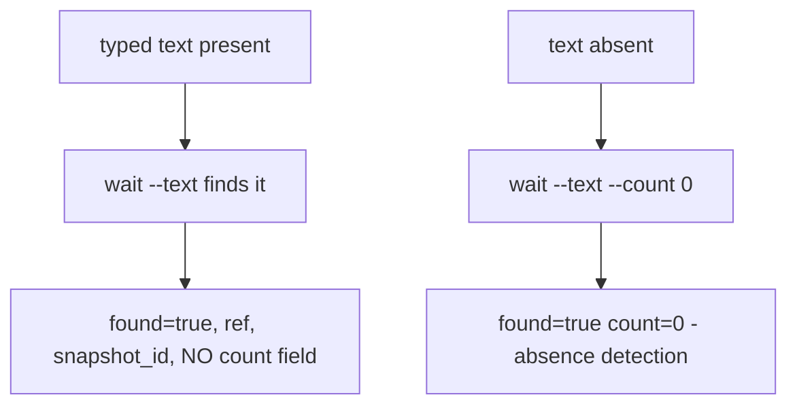
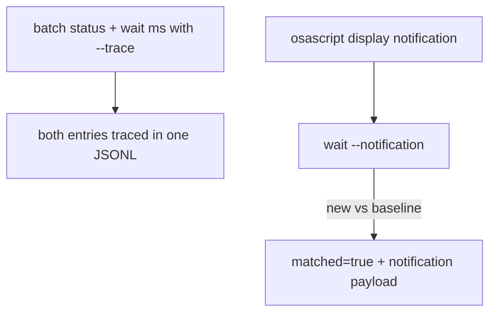

# Dogfood Report — feat/enhanced-reliability

> Diff-scoped QA of `feat/enhanced-reliability` vs `main`. Generated by `/ce-dogfood-beta` on 2026-06-09. This product is a desktop-automation CLI, so the dogfood drives the **branch-built `agent-desktop` binary against real desktop apps** instead of a browser.

## Diff Summary

- Strict, fail-closed ref resolution: 0 matches -> `STALE_REF`, >1 -> `AMBIGUOUS_TARGET`; uncertain fallback never guesses.
- Shared actionability preflight (visible/stable/enabled/supported_action/policy/editable) before every ref action, with structured `error.details.checks`.
- Retrying `wait` predicates (`exists`/`enabled`/`visible`/`actionable`/`value`), wait budget capping macOS resolution, notification-wait baseline retry.
- Session-scoped ref namespaces (`--session`), session-independent explicit snapshot IDs, `--trace` JSONL diagnostics with deep redaction.
- Single-batch AX attribute fetch (bounds + scrollbar capability folded into one IPC per element), consolidated CLI/FFI ref-action pipeline, resolver split, tmp-file hygiene, in-lock snapshot save verification.

## Personas

Inferred — no STRATEGY.md / VISION.md / persona docs exist.

- **P1: AI agent (primary)** — invokes commands mid-loop, parses JSON envelopes, branches on `error.code`, follows `error.suggestion` to self-recover. Cares about determinism, fail-closed behavior, latency per invocation.
- **P2: Agent developer** — integrates the CLI/FFI into an agent harness. Cares about stable contracts, debuggability (`--trace`), and that docs match actual behavior.

## Flows Tested

### F1 — Ref action journey (launch -> observe -> act -> verify -> close)

### F2 — Wait predicates

### F3 — Fail-closed staleness

### F4 — Sessions

### F5 — Trace + redaction

### F6 — Text waits

### F7 — Batch + notification

## Test Matrix & Results

| # | Flow | Journey / Scenario | Status | Issue | Fix | Commit |
|---|------|--------------------|--------|-------|-----|--------|
| S1 | — | Build health: status, permissions, bundled skills freshness | Pending | | | |
| S2 | F1 | TextEdit launch->type->verify->sheet->close | Pending | | | |
| S3 | F2 | wait predicates: actionable pass, value timeout shape, pinned-ref guard | Pending | | | |
| S4 | F3 | Stale ref after window close fails closed | Pending | | | |
| S5 | F4 | Session isolation + cross-session explicit snapshot | Pending | | | |
| S6 | F5 | Trace event sequence + secret redaction | Pending | | | |
| S7 | F6 | wait --text presence + --count 0 absence | Pending | | | |
| S8 | F7 | Batch trace inheritance + notification wait | Pending | | | |

## What Was Fixed

(pending)

## Paper Cuts (by persona)

(pending)

## Decisions for a Human

(pending)

## Learnings

(pending)

## Final Status

(pending)
