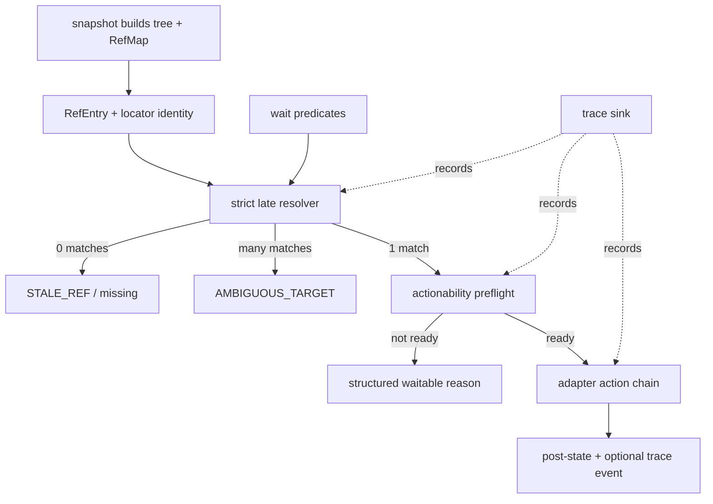

# feat: add Playwright-grade desktop reliability

## Summary

Build a pragmatic reliability foundation for Agent Desktop by borrowing the parts of Playwright that make automation dependable: late target resolution, strict matching, actionability waits, retrying assertions, useful failure traces, and session-safe refs. The work keeps Agent Desktop's role clear: Playwright remains the browser automation tool; Agent Desktop becomes a reliable native desktop automation tool whose behavioral contract can be shared by macOS, Windows, and Linux adapters.

---

## Problem Frame

Agent Desktop already has strong macOS primitives: snapshot-scoped refmaps, rich `RefEntry` identity data, path and bounds based stale-ref recovery, semantic AX action chains, and policy-gated physical fallback. The remaining reliability gap is at the public contract layer. A ref can still behave like a concrete handle that is resolved once and acted on immediately, while Playwright's most reliable surface keeps a target as intent until action time, checks that the target is unique and actionable, and leaves enough trace data to debug failures.

This plan strengthens that contract without building a test runner, a daemon, a visual trace viewer, or a custom selector language. It adds the smallest cross-platform foundation needed for future Windows and Linux adapters to inherit the same semantics instead of inventing platform-local behavior.

---

## Validation Baseline and Success Criteria

Before implementation, capture a small baseline of representative flaky desktop workflows. The baseline should include the command sequence, expected behavior, observed failure, and which acceptance example or conformance test will prove the failure is fixed. If no production incident is available for a category, use a fixture-backed reproduction rather than inventing scope.

Minimum success for the first shipping slice is:

- A moved-but-unique ref resolves late and acts safely without a manual refresh.
- A duplicated target fails as ambiguous without mutating the desktop.
- A disabled or non-actionable target can be waited on with a structured timeout reason.
- Existing one-shot `get` and `is` behavior remains cheap and non-retrying.
- Existing semantic macOS click and text flows continue to pass.

---

## Requirements

### Target Resolution

- R1. Ref-consuming commands must resolve through a late-bound target contract that can re-find an element from snapshot identity, source surface, path, and semantic fields before acting.
- R2. Single-target actions must be strict by default: zero matches is stale or missing, multiple matches is ambiguous, and only exactly one candidate proceeds.
- R3. Stale-ref handling must remain fail-closed. Automatic recovery is allowed only when the resolver finds one high-confidence candidate in the same scoped app/window/surface.

### Action Reliability

- R4. Ref actions must run a shared actionability preflight before mutation: resolved uniquely, evaluated for visibility, enabledness, and stability when native evidence is available, allowed to proceed on unknown checks only when core policy says the action remains safe, and policy-compatible.
- R5. Actionability failures must return structured reasons that agents can use for recovery, not only generic `ACTION_FAILED`.
- R6. Existing headless-first policy must stay intact: semantic AX/UIA/AT-SPI actions remain primary, and focus or cursor movement happens only through explicit policy paths.

### Waiting, Assertions, and Diagnostics

- R7. `wait` must support retrying state and actionability predicates so agents can wait for "enabled", "visible", "value changed", "text present", or "actionable" without manual polling loops.
- R8. One-shot `get` and `is` commands must remain available and cheap; retrying behavior belongs in `wait` predicates rather than a full test-runner abstraction.
- R9. Optional trace output must capture resolver attempts, actionability checks, action-chain steps, post-state, and failure context in a machine-readable artifact.

### Interface and Platform Parity

- R10. Current CLI and FFI ref-consuming action surfaces must use the same core ref, resolver, actionability, and error semantics so reliability does not depend on the calling interface. Future MCP work must inherit that core path when MCP is implemented.
- R11. Concurrent agents must be able to avoid global latest-snapshot collisions through an explicit session-scoped ref namespace while default no-session behavior stays unchanged.
- R12. The work must define a reusable adapter conformance harness for strict resolution, stale-ref recovery, actionability, retrying waits, and session isolation. Windows and Linux adapters must pass that harness before claiming parity.

---

## Key Technical Decisions

- **Keep refs, add locator semantics behind them:** Do not replace `@eN` refs or introduce a new user-facing selector DSL. Extend the core ref pipeline so a ref carries enough locator-like identity for strict late resolution.
- **Strictness is the default:** If a recovery search finds multiple matching candidates, the command fails with a first-class ambiguity error and candidate summaries. Guessing is worse than a retryable failure because desktop actions can mutate real user state.
- **Actionability is shared core policy, with adapter evidence only where needed:** Core owns the vocabulary, result shape, and per-action gate rules. The first pass should build the report from the resolved target, policy, live node fields, bounds, and existing adapter methods. Add new adapter trait surface only when a named check cannot be expressed through existing methods.
- **Extend `wait`, do not build an `expect` framework yet:** Playwright-style retrying assertions are valuable, but a standalone test runner would be YAGNI. Add predicate modes to `wait` and leave `get` / `is` as one-shot commands.
- **Trace JSONL before trace viewer:** Start with structured trace events written to a caller-provided path or failure-retained default. A UI viewer, zip bundle, or screencast can wait until real trace usage proves the need.
- **Session namespace before daemon:** Session-scoped refs solve multi-agent contamination without committing to a future persistent daemon. The default CLI behavior can remain compatible while MCP and advanced callers opt into session IDs.
- **Conformance before adapter expansion:** The plan does not implement Windows or Linux automation. It defines an adapter-facing harness and capability matrix those adapters must satisfy later so platform work does not diverge.

---

## High-Level Technical Design

The resolver remains ref-rooted and snapshot-aware. The new behavior is that ref actions no longer treat the loaded `RefEntry` as enough evidence by itself. They resolve the entry strictly, classify failure, run actionability, then execute through the existing adapter action path.

---

## Scope Boundaries

### Included

- Core resolver contract and strict matching result types.
- macOS implementation of the new resolver and actionability checks using existing AX data.
- Retry-capable `wait` predicate modes.
- Trace event sink sufficient for debugging resolver/actionability failures.
- Session-scoped ref storage namespace.
- FFI parity for `RefEntry` fields that CLI resolution already uses.
- Shared conformance tests and documentation updates.

### Deferred to Follow-Up Work

- Full MCP server implementation.
- MCP parity acceptance gates, once MCP exists, requiring MCP commands to use the same core resolver/session path.
- Persistent daemon, warm caches, and event-driven invalidation.
- Visual trace viewer, screencast recording, and trace zip bundles.
- OCR or vision fallback for inaccessible custom-rendered UIs.
- New public selector language beyond existing `find` inputs and refs.
- Windows and Linux adapter implementation beyond conformance expectations.

---

## Execution Strategy

Ship this in slices so the foundation proves value before wider surface area is added:

1. **Slice 1: CLI/macOS reliability core.** Implement U1-U3 first: strict late resolution, shared actionability, and retrying wait predicates. This is the minimum shippable reliability improvement.
2. **Slice 2: diagnostics and session isolation.** Implement U4 only when Slice 1 exposes failures that need trace artifacts, or when current callers need concurrent no-`--snapshot` isolation. Session IDs must be explicit; no daemon or global process context.
3. **Slice 3: interface and platform hardening.** Implement U5 when FFI consumers need ref-consuming mutations to match CLI behavior. Implement U6 before Windows/Linux adapter work claims parity.

Do not start a later slice just because it is listed here. Each slice must either protect correctness already introduced by earlier units or answer a current consumer need.

---

## Acceptance Examples

- AE1. Given a ref whose element moved within the same source window, when a click command runs, then the resolver re-finds the unique matching element and the action proceeds.
- AE2. Given two matching "Save" buttons in the same window, when a click command targets a stale ref whose identity now matches both, then the command fails with an ambiguity error and does not click either.
- AE3. Given a disabled button, when `wait` asks for it to become actionable, then the command retries until it becomes enabled or returns a timeout with the last actionability reason.
- AE4. Given two agents using different session IDs, when each omits `--snapshot`, then each loads its own latest snapshot and cannot act on the other's latest refs.
- AE5. Given a failed action with trace enabled, when the command exits, then the trace records resolver attempts, candidate count, actionability result, action-chain steps attempted, and final error.
- AE6. Given the same macOS window is discovered through focused, main, and `AXWindows` roots, when strict resolution counts candidates, then native identity deduplication prevents a false ambiguity result.

---

## Implementation Units

### U1. Strict Late Resolution Contract

- **Goal:** Add a core target-resolution contract that preserves ref ergonomics while making strict late resolution explicit.
- **Requirements:** R1, R2, R3, R10
- **Dependencies:** None
- **Files:**
  - `crates/core/src/refs.rs`
  - `crates/core/src/resolved_element.rs`
  - `crates/core/src/error.rs`
  - `crates/core/src/commands/helpers.rs`
  - `crates/macos/src/tree/resolve.rs`
  - `crates/macos/src/tree/resolve_identity.rs`
  - `crates/macos/src/tree/resolve_bounds.rs`
  - `crates/macos/src/tree/resolve_tests.rs`
  - `crates/core/src/commands/helpers_tests.rs`
- **Approach:** Introduce a small core resolution result model: unique target, no target, ambiguous target, and timed out. Add a dedicated ambiguity error code so agents can distinguish "refresh needed" from "target is no longer unique." Reuse the existing `RefEntry` fields rather than creating a new selector object unless implementation needs a tiny helper struct to group matching inputs. macOS keeps its current path fast path and broad search fallback, deduplicates candidates by native element identity, and returns candidate classification instead of first-success-only semantics.
- **Patterns to follow:** Existing scoped-root search in `crates/macos/src/tree/resolve.rs`; identity matching in `crates/macos/src/tree/resolve_identity.rs`; stale-ref error shape in `crates/core/src/error.rs`.
- **Test scenarios:**
  - A valid ref with matching path and identity resolves to exactly one handle.
  - A ref whose path no longer resolves but whose identity uniquely matches elsewhere in the same source window resolves successfully.
  - A ref whose identity matches multiple candidates returns an ambiguity classification and no action is executed.
  - A ref found through duplicate macOS roots is deduplicated to one native candidate before strict count classification.
  - A syntactically invalid ref remains `INVALID_ARGS`, not stale or ambiguous.
  - A valid ref with no candidates returns `STALE_REF` with the existing refresh suggestion.
- **Verification:** Ref-consuming commands can distinguish stale, ambiguous, timeout, and unique resolution without changing their public JSON envelope.

### U2. Shared Actionability Preflight

- **Goal:** Add a small actionability layer before ref actions mutate the desktop.
- **Requirements:** R4, R5, R6
- **Dependencies:** U1
- **Files:**
  - `crates/core/src/action.rs`
  - `crates/core/src/actionability.rs`
  - `crates/core/src/commands/helpers.rs`
  - `crates/macos/src/actions/mod.rs`
  - `crates/macos/src/actions/actionability.rs`
  - `crates/macos/src/actions/dispatch.rs`
  - `crates/macos/src/actions/chain.rs`
  - `crates/macos/src/actions/chain_steps_tests.rs`
  - `crates/core/src/commands/ref_policy_tests.rs`
- **Approach:** Define an `ActionabilityReport` in core with a compact set of checks: unique target, visible or unknown, enabled or unknown, stable or unknown, editable when text input is requested, and policy allowed. Build the first implementation from the resolved target, policy, live state, bounds, available actions, and existing adapter calls. Keep `force` out of the first implementation unless a current command needs it; explicit physical/focus policy already handles most escape hatches.
- **Actionability gate matrix:**

  | Action group | Required evidence | Unknowns allowed | Blocking states |
  | --- | --- | --- | --- |
  | Click/select/toggle | Unique target, policy allowed, semantic action available or physical policy allowed | Visibility/stability unknown when a semantic native action is available | Disabled false, zero-size bounds when bounds exist, policy would require forbidden focus/cursor movement |
  | Text input/set value | Unique target, policy allowed, settable value or editable text evidence | Visibility unknown for headless set-value | Non-editable false, missing settable value when keyboard fallback is policy-denied |
  | Scroll | Unique target or window, policy allowed, scroll action or allowed physical fallback | Enabled/stability unknown | No scroll action and physical fallback denied |
  | Keyboard/app press | App/window target, policy allowed, focus policy satisfied | Element visibility when the command is app-scoped | Required focus cannot be established under policy |

- **Patterns to follow:** `InteractionPolicy` in `crates/core/src/action.rs`; post-state verification in `crates/macos/src/actions/post_state.rs`; chain timeout handling in `crates/macos/src/actions/chain.rs`.
- **Test scenarios:**
  - A disabled element reports `enabled=false` and a structured actionability failure before action dispatch.
  - An element with zero-size bounds reports not visible when bounds are available.
  - A text command against a non-editable target fails actionability before keyboard or clipboard fallback.
  - A headless command that would require cursor movement remains policy denied.
  - A command with unknown visibility but valid semantic AX action can proceed when no stronger evidence exists.
- **Verification:** Existing semantic click and text paths still work, but failures include actionability reasons before falling back to generic action failure.

### U3. Retrying Wait Predicates

- **Goal:** Make Playwright-style retrying assertions available through `wait` without building a separate test framework.
- **Requirements:** R7, R8
- **Dependencies:** U1, U2
- **Files:**
  - `src/cli_args_system.rs`
  - `src/dispatch.rs`
  - `crates/core/src/commands/wait.rs`
  - `crates/core/src/commands/wait_tests.rs`
  - `crates/core/src/search_text.rs`
  - `src/batch.rs`
- **Approach:** Extend `wait` with predicate modes for ref state, ref actionability, live value/text, and match count. Keep `get` and `is` one-shot so simple reads stay cheap and predictable. Predicate results should include elapsed time and the last observed value or actionability reason. Do not add a generic expression language.
- **Wait predicate contract:**

  | Predicate | Required input | Snapshot behavior | Timeout output |
  | --- | --- | --- | --- |
  | `exists` | ref or find query | Fixed `--snapshot` stays fixed; omitted snapshot may refresh through existing throttle | last candidate count and last resolver error |
  | `state` | ref plus state name/value | Re-resolves the ref on each poll | last observed state map and actionability reason if related |
  | `actionable` | ref plus optional action kind | Re-runs strict resolution and U2 gate on each poll | last failed check and policy reason |
  | `value` | ref plus equals/contains operand | Re-resolves and reads live value on each poll | last observed value |
  | `text` | text or query operand | Uses existing text search refresh behavior | last match count and matched surface when present |
  | `match-count` | find query plus count relation | Uses the same fixed/latest snapshot rule as `exists` | last observed count |

  Invalid predicate/input combinations return `INVALID_ARGS`, not timeout.
- **Patterns to follow:** Existing `wait_for_element`, `wait_for_text`, and `LatestRefCache` in `crates/core/src/commands/wait.rs`.
- **Test scenarios:**
  - Waiting for an element to become enabled polls live state and succeeds when the state changes.
  - Waiting for actionability reports the last failed check on timeout.
  - Waiting for text still saves a fresh snapshot when it finds a match.
  - Waiting against a fixed `--snapshot` does not silently switch to a newer snapshot.
  - Waiting without `--snapshot` refreshes latest snapshot metadata only at the existing throttle interval.
- **Verification:** Agents can replace manual sleep-and-poll loops with a single structured `wait` call for state and actionability.

### U4. Trace Events and Session-Scoped RefStore

- **Goal:** Add the smallest useful diagnostics and isolation layer for concurrent agent runs.
- **Requirements:** R9, R11
- **Dependencies:** U1, U2
- **Files:**
  - `src/cli.rs`
  - `src/cli_args.rs`
  - `src/batch.rs`
  - `src/dispatch.rs`
  - `src/main.rs`
  - `crates/core/src/trace.rs`
  - `crates/core/src/refs_store.rs`
  - `crates/core/src/refs_lock.rs`
  - `crates/core/src/commands/helpers.rs`
  - `crates/core/src/commands/snapshot.rs`
  - `crates/core/src/snapshot_ref.rs`
  - `crates/core/src/commands/wait.rs`
  - `crates/core/src/commands/status.rs`
  - `crates/core/src/refs_tests.rs`
  - `crates/core/src/commands/snapshot_tests.rs`
- **Approach:** Add opt-in trace writing as structured JSONL events, not a viewer. Add a session namespace to `RefStore` so callers can isolate `latest_snapshot_id` and snapshot directories by session. Preserve current default behavior when no session is provided.
- **Session contract:** Add a global `--session <id>` CLI option and equivalent batch field. Validate IDs as short filesystem-safe tokens. Map storage to `~/.agent-desktop/sessions/{session_id}/snapshots/...` while preserving the current default path for no-session commands. Thread the session through snapshot creation, drill-down, helper resolution, wait, status, and every omitted-`--snapshot` latest lookup. Do not use process-global session state.
- **Patterns to follow:** Private file writes and lock handling in `crates/core/src/refs.rs` and `crates/core/src/refs_store.rs`; response envelope handling in `src/main.rs`.
- **Test scenarios:**
  - Two session IDs can each save and load independent latest snapshots.
  - Omitting a session ID preserves the current default latest-snapshot path.
  - A failed ambiguous resolution writes trace events for candidate count and final error when tracing is enabled.
  - Trace output never appears in stdout JSON envelopes.
  - Trace writing failure does not turn a successful desktop action into a failed action unless the caller explicitly requested strict trace output.
- **Verification:** Concurrent agent workflows have an isolation mechanism, and failed actions can be diagnosed from trace events without rerunning with verbose stderr.
- **Delivered:** Added `CommandContext`, global `--session`, batch item `session`, session-scoped `RefStore`, opt-in `--trace`, `--trace-strict`, trace events on snapshot/ref/action paths, and tests for session isolation and trace behavior.

### U5. FFI Ref-Action Parity

- **Goal:** Bring FFI ref resolution and ref-consuming mutations up to the same reliability standard as the CLI.
- **Requirements:** R10
- **Dependencies:** U1, U2
- **Files:**
  - `crates/ffi/src/types/ref_entry.rs`
  - `crates/ffi/src/actions/resolve.rs`
  - `crates/ffi/src/actions/execute.rs`
  - `crates/ffi/src/types/action.rs`
  - `crates/ffi/src/types/action_result.rs`
  - `crates/ffi/src/actions/resolve_tests.rs`
  - `crates/ffi/tests/c_abi_actions.rs`
  - `crates/ffi/tests/c_abi_layout.rs`
  - `crates/ffi/include/agent_desktop.h`
  - `scripts/update-ffi-header.sh`
  - `skills/agent-desktop-ffi/SKILL.md`
- **Approach:** Fill the FFI `AdRefEntry` conversion gap for the fields CLI resolution already uses: value, description, bounds, source app/window/title, surface, root ref, path, and path mode. Do not require `states` for resolution parity unless the CLI resolver actually consumes them; if state data becomes necessary for actionability, make that dependency explicit in U2. Add a ref-action entrypoint or shared command wrapper that accepts ref identity plus action/policy and runs strict resolution, actionability, optional trace context, and execution in one path. Keep the existing native-handle execute API documented as low-level if it remains.
- **Patterns to follow:** FFI string conversion in `crates/ffi/src/convert/string.rs`; ABI layout tests in `crates/ffi/tests/c_abi_layout.rs`; existing header update script.
- **Test scenarios:**
  - FFI resolution with value and description can match a target that name-only matching cannot.
  - FFI resolution with bounds hash rejects a candidate with the wrong bounds.
  - Invalid UTF-8 in optional identity fields returns `INVALID_ARGS`.
  - FFI ref-consuming actions run the same preflight as CLI ref-consuming actions.
  - The low-level native-handle action path, if retained, is documented as bypassing ref reliability semantics.
  - C ABI layout tests reflect any struct changes.
  - Header drift check catches stale `agent_desktop.h` after type changes.
- **Verification:** CLI and FFI consumers no longer get materially different stale-ref or actionability behavior for the same target identity.
- **Delivered:** Expanded `AdRefEntry` to carry the full ref identity envelope, switched FFI resolution to strict resolution, added `ad_execute_ref_action_with_policy`, updated the committed C header, and added ABI/conversion/actionability tests.

### U6. Cross-Platform Conformance and Documentation

- **Goal:** Lock the reliability contract before Windows and Linux adapters implement their platform-specific details.
- **Requirements:** R12
- **Dependencies:** U1, U2, U3, U4, U5
- **Files:**
  - `crates/core/src/refs_test_support.rs`
  - `crates/core/src/commands/ref_policy_tests.rs`
  - `crates/core/src/commands/wait_tests.rs`
  - `tests/conformance/README.md`
  - `tests/fixtures/README.md`
  - `tests/fixtures/skeleton-tree.json`
  - `README.md`
  - `skills/agent-desktop/SKILL.md`
  - `skills/agent-desktop/references/workflows.md`
  - `docs/phases.md`
  - `docs/solutions/best-practices/playwright-grade-desktop-reliability-2026-06-02.md`
- **Approach:** Add core and fixture-level conformance tests for resolver strictness, actionability reason shapes, retrying wait predicates, trace event shape, and session isolation. Define an adapter conformance harness that each real platform adapter can opt into with adapter-provided fixtures. Publish a small capability matrix for required, optional, unsupported, and unknown checks. Update docs to describe refs as snapshot-scoped handles backed by strict late resolution, not stable durable element handles.
- **Patterns to follow:** Existing solution docs under `docs/solutions/best-practices/`; existing fixture documentation in `tests/fixtures/README.md`; skill reference organization under `skills/agent-desktop/references/`.
- **Test scenarios:**
  - Mock adapter fixtures prove zero, one, and many candidate resolution outcomes.
  - Mock adapter fixtures prove actionability timeout includes the last failed reason.
  - Fixture snapshots cover a moved-but-unique target and an ambiguous duplicate target.
  - Adapter conformance fixtures prove required checks can pass on a real adapter before that adapter claims parity.
  - Documentation examples show stale, ambiguous, and waitable recovery paths.
  - Windows and Linux stub adapters continue returning supported structured errors until implemented.
- **Verification:** A future Windows or Linux adapter has explicit behavioral tests to satisfy before claiming parity.
- **Delivered:** Added `tests/conformance/README.md`, a reliability solution note, README reliability contract docs, and cross-platform expectations for stale, ambiguous, actionable, session, trace, and FFI behavior.

---

## Risks and Mitigations

- **Risk: Overbuilding a selector framework.** Mitigation: keep the first pass ref-backed and internal; no new public selector DSL unless future usage proves it.
- **Risk: Ambiguity errors feel worse than best-effort clicking.** Mitigation: include candidate summaries and recovery suggestions. For desktop mutation, fail-closed is the safer default.
- **Risk: Actionability checks become platform-inconsistent.** Mitigation: core defines the report vocabulary; adapters report supported, unsupported, or unknown checks explicitly.
- **Risk: Trace output bloats normal CLI usage.** Mitigation: trace is opt-in and never mixed into stdout envelopes.
- **Risk: Session namespaces complicate simple scripts.** Mitigation: default behavior remains unchanged when no session is specified.
- **Risk: FFI struct changes affect consumers.** Mitigation: keep changes tied to existing FFI ABI layout tests and header drift checks; document the reliability rationale.
- **Risk: Later slices expand before the core path proves value.** Mitigation: U4-U6 are gated by the Execution Strategy; U1-U3 must ship and validate the core behavior first.

---

## Documentation and Operational Notes

- Update README and skill docs to explain three target states: fresh ref, stale ref, and ambiguous target.
- Document coordinate and physical commands as lower-confidence fallbacks compared with accessibility-backed refs.
- Add a solution note after implementation so future adapter work understands why strict late resolution and actionability are core semantics, not macOS-only details.
- Keep Playwright comparisons in docs conceptual. Avoid implying Agent Desktop automates browsers or replaces Playwright.

---

## Sources and Research

- Playwright docs: locators, strictness, actionability, auto-waiting, retrying assertions, trace viewer, browser contexts, codegen, and CLI behavior.
- Installed Playwright CLI observed locally as `Version 1.58.0`; command surface included `open`, `codegen`, `install`, `screenshot`, `pdf`, and `show-trace`.
- Current Agent Desktop ref and resolver code: `crates/core/src/refs.rs`, `crates/core/src/refs_store.rs`, `crates/core/src/commands/helpers.rs`, `crates/macos/src/tree/resolve.rs`, `crates/macos/src/tree/resolve_identity.rs`, and `crates/macos/src/tree/resolve_bounds.rs`.
- Current action reliability code: `crates/core/src/action.rs`, `crates/macos/src/actions/chain.rs`, `crates/macos/src/actions/dispatch.rs`, `crates/macos/src/actions/post_state.rs`, and `crates/macos/src/actions/chain_web_steps.rs`.
- Current one-shot and wait behavior: `crates/core/src/commands/get.rs`, `crates/core/src/commands/is_check.rs`, and `crates/core/src/commands/wait.rs`.
- FFI parity gap: `crates/ffi/src/actions/resolve.rs`.
- Cross-platform adapter seam: `crates/core/src/adapter.rs`, `crates/windows/src/adapter.rs`, and `crates/linux/src/adapter.rs`.
