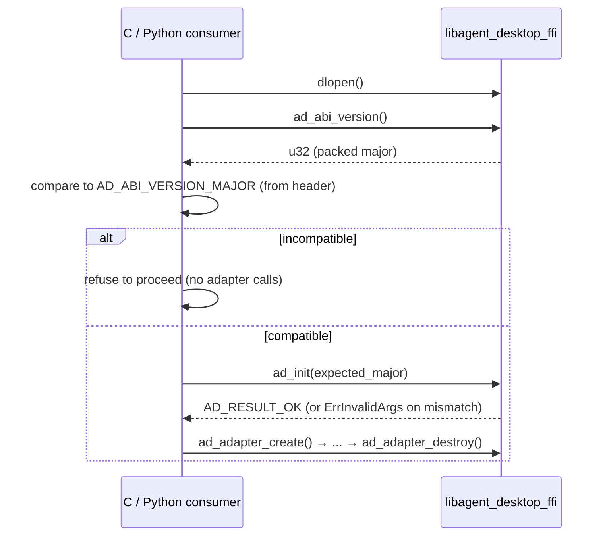
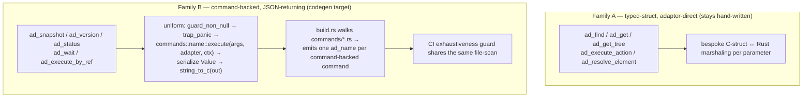

# feat: Complete the FFI surface and cross-platform parity contract

## Summary

`crates/ffi` already ships a real C ABI — a cdylib plus a committed cbindgen header (`crates/ffi/include/agent_desktop.h`) exposing ~60 `ad_*` functions over the core engine. This plan closes the remaining gaps so the FFI is *fully done* on macOS and *ready to light up* on Windows/Linux with zero new FFI code:

1. A load-time **ABI-version handshake** (`ad_abi_version`, `ad_init`) so a consumer detects a header/dylib mismatch instead of corrupting memory.
2. The missing **command-backed entrypoints** — `ad_snapshot` (full refmap → `@e` refs), `ad_execute_by_ref`, `ad_wait`, `ad_version`, `ad_status`.
3. **`ad_set_log_callback`** forwarding `tracing` output to a consumer callback.
4. A **Python ctypes smoke harness** in CI — the first real external consumer.
5. A **`build.rs` codegen migration** that replaces the hand-written command-backed wrappers with one generated `ad_<name>` per command, sharing its file-scan with a CI exhaustiveness guard so CLI↔FFI parity becomes automatic.

It deliberately does **not** implement the Windows or Linux adapters. Instead it bakes the parity *contract* — a CI header-drift gate, per-target `release-ffi` builds, and verified `PLATFORM_NOT_SUPPORTED` passthrough — so those adapters expose the same `ad_*` surface for free when they land.

---

## Problem Frame

The FFI is the in-process path for non-Rust hosts (Python agents, Swift apps, Go services) to drive desktop automation without spawning the CLI or parsing JSON over a pipe. Today it has three classes of gap:

- **Safety:** no runtime way for a consumer to check that the dylib it loaded matches the header it compiled against. The only guard is comparing `ad_*_size()` against the hand-written `AD_*_SIZE` macros — partial and easy to skip.
- **Completeness:** the ref-based observe→act loop that defines the CLI (snapshot → `@e5` ref → action) is not reachable in one call. `ad_get_tree` returns a tree with **no refs** (`ref_id` is always null); there is no `ad_snapshot`, no `ad_execute_by_ref`, no `ad_wait`. There is no `ad_version`/`ad_status`, and `dlopen` consumers cannot see debug output.
- **Maintainability + proof:** the ~60 wrappers are hand-maintained, so CLI/FFI parity is enforced by review, not by construction (drift risk). And nothing outside the repo consumes the ABI — it is built and layout-tested but unproven from another language.

This plan resolves all three while keeping core untouched in spirit: the FFI calls `core` through the `PlatformAdapter` trait, so cross-platform parity is an architectural property, not new per-platform code.

---

## Scope Boundaries

### In scope
- ABI-version handshake (`ad_abi_version`, `ad_init`, `AD_ABI_VERSION_MAJOR`).
- New command-backed entrypoints: `ad_snapshot`, `ad_execute_by_ref`, `ad_wait`, `ad_version`, `ad_status`.
- `ad_adapter_create_with_session` constructor (session plumbing for refmap persistence — KTD5) and a `stub-adapter` cargo feature for CI/passthrough testing (KTD10).
- `ad_set_log_callback` + a `tracing_subscriber` layer.
- Python ctypes smoke harness wired into CI.
- `build.rs` codegen for the command-backed family + a CI exhaustiveness guard + a header-drift gate.
- Cross-platform parity gates: header-drift CI check, per-target `release-ffi` build verification, `PLATFORM_NOT_SUPPORTED` passthrough tests.

### Deferred to Follow-Up Work
- Codegen of the **typed-struct, adapter-direct family** (`ad_find`, `ad_get`, `ad_get_tree`, `ad_execute_action`, `ad_resolve_element`). These need a per-parameter marshaling refactor; this plan leaves them hand-written and only codegens the command-backed family (see KTD2).
- A Swift native-host example (Python is the CI consumer this round).
- Progressive-traversal args (`--skeleton`, `--root @ref`) on `ad_snapshot` — the first cut exposes the full-window snapshot only; the skeleton/drill-down parity is a fast-follow.
- ✅ **DONE (commit `9bf4731` on `chore/ffi-header-toolchain`/PR #67):** Restored the 3 ABI header doc comments lost in the cbindgen regen — added `///` docs on the Rust source (`error.rs` `ad_last_error_details` privacy note + `AdResult` forward-compat note; `actions/execute.rs` behavioral descriptions for the `ad_execute_action*` family) and regenerated the header. Done directly on the integration branch (not a separate post-merge PR) since the fold already required the branch to be live.
- ✅ **DONE (commit `2aebce2`):** DRY — folded `wait.rs`'s local `app_error_to_adapter_error` into the shared `commands::app_error_to_adapter`; one canonical `AppError→AdapterError` conversion across every ffi command.
- **Won't-fix (noted):** `AdWaitArgs::count` is `usize`; on a hypothetical 32-bit target it would shift the `AD_WAIT_ARGS_SIZE=112` layout pin. Only 64-bit targets are supported and the per-platform `const` assert catches it at compile time — revisit only if 32-bit ever ships.

### Out of scope (different product phase)
- **Windows adapter implementation** — Phase 2.
- **Linux adapter implementation** — Phase 3.
- Any new `Action`/`ErrorCode` variants or new CLI commands (those arrive with the cross-platform phases).

---

## Requirements

- **R1** — A consumer can detect header/dylib incompatibility at load time via `ad_abi_version()` + `ad_init(expected_major)`, before any adapter call. *(origin: docs/phases.md §613)*
- **R2** — `ad_snapshot` produces the CLI-format snapshot envelope with `@e` refs and persists the refmap, so a consumer can drive the ref-based observe→act loop.
- **R3** — `ad_execute_by_ref` drives a ref action through the **full strict-resolution ladder** (refmap load → strict resolve → `STALE_REF`/`AMBIGUOUS_TARGET` → live actionability → dispatch → handle release) with **CLI-parity policy** (headless default).
- **R4** — `ad_version`, `ad_status`, and `ad_wait` expose CLI-equivalent behavior over the ABI.
- **R5** — `ad_set_log_callback` forwards `tracing` output to a consumer-supplied callback, thread-safely, without writing to stdout, and never failing a mutation on a trace error.
- **R6** — A Python ctypes harness loads the dylib, validates `ad_abi_version` and every `ad_*_size()` against the header, drives the new entrypoints, and runs as a CI gate.
- **R7** — The command-backed wrappers are generated by `build.rs` from the per-file command set, with a CI exhaustiveness guard that fails when a command file has no FFI wrapper, and per-command `InteractionPolicy` preserved.
- **R8** — The FFI is cross-platform-ready: a CI header-drift gate, per-target `release-ffi` builds, and verified `PLATFORM_NOT_SUPPORTED` passthrough — so Windows/Linux adapters expose the same `ad_*` surface with zero new FFI code.

---

## Key Technical Decisions

- **KTD1 — Expose the ABI version as a runtime getter *and* a cbindgen-emitted constant.** `ad_abi_version() -> u32` is the only mechanism that works for `dlopen` consumers (the caller compiled against its own header copy and can detect a mismatch only at runtime) — confirmed standard by SQLite/libgit2/Botan. Pair it with `AD_ABI_VERSION_MAJOR` emitted *by cbindgen* from a `pub const AD_ABI_VERSION_MAJOR: u32` via `[const] allow_static_const` (→ `static const uint32_t …`), or an `after_includes` `#define` if a preprocessor `#if` form is wanted — **not** hand-maintained. (`[defines]` maps `cfg`→`#ifdef` and does not emit const values.) `ad_init(expected_major)` failing closed is stronger than the field norm (SQLite asserts, libgit2 leaves it to callers) and right for embedding in agents.
- **KTD2 — Codegen targets only the command-backed JSON-returning family (Family B).** These commands return `Result<Value, AppError>`, but their call sites are **not** uniform: `version::execute()` takes no args/adapter, `status::execute_with_report_with_context(adapter, &report, &ctx)` needs a precomputed `PermissionReport`, and the standard form is `execute(args, adapter, &ctx)`. So the generator emits a **per-command call site** (not a single `execute` fn-pointer table), sharing only the output convention (KTD9) and the policy table (KTD6). The typed-struct adapter-direct family (Family A) needs bespoke marshaling and stays hand-written.
- **KTD3 — Introduce a minimal `CommandDescriptor` for Family B; the codegen and the exhaustiveness guard share one command universe** so generator and guard cannot diverge. The universe is the set of `pub mod` command declarations in `crates/core/src/commands/mod.rs` (cross-checked against the `Commands` enum / dispatch arms) — **not** a `commands/*.rs` glob, which would pull in helper/sub-modules (`helpers.rs`, `wait_mode.rs`, `point_resolve.rs`, `*_tests.rs`) and emit phantom wrappers. No runtime registry, no `inventory`/`linkme` (link-GC unreliable for cdylib per docs/phases.md §631).
- **KTD4 — Generated FFI source is committed at a fixed path** (mirroring the committed-header contract), with a CI regenerate-and-diff drift check — not `$OUT_DIR`-only, whose hash-randomized path makes drift checks unreliable. *(learning: deterministic-build-artifact-marker.)*
- **KTD5 — `ad_snapshot` uses a default `CommandContext`; session is opt-in.** `AdAdapter` gains an optional `session_id`; a `NULL`/absent session means the sessionless default context. This is the minimum needed to persist the refmap.
- **KTD6 — Per-command `InteractionPolicy` stays per-command.** The generator must read a per-command policy table (`type_text` → `focus_fallback`, everything else → `headless`); it must never centrally pick a default. FFI headless default mirrors the CLI. *(learnings: keep-ffi-action-policy-aligned-with-cli, preserve-command-policy-semantics.)*
- **KTD7 — The log callback is thread-safe, install-once, best-effort.** `tracing` events fire from arbitrary threads. Install the subscriber once via `OnceLock`; store the swappable callback pointer in an `AtomicPtr` (lock-free, reentrancy-safe) wrapped in a `Send + Sync` newtype — not a `Mutex` (Mutex only if the install allocates under the lock). The pointer's ABI is `unsafe extern "C"` (not `C-unwind`) so a foreign unwind aborts rather than corrupts Rust state. Invocations are best-effort; a trace failure never fails the originating command. *(external: libgit2/Botan install-once; Rust `OnceLock`/`AtomicPtr` idiom.)*
- **KTD8 — Envelope-version discipline.** `ad_abi_version`/`ad_version` are additive (no `ENVELOPE_VERSION` bump). Only bump `ENVELOPE_VERSION` (with a `BREAKING CHANGE:` footer) if `ad_status` alters always-present top-level fields. Tests assert through the `ENVELOPE_VERSION` constant, never a string literal. *(learning: envelope-version-bump-contract.)*
- **KTD9 — Command-backed entrypoints emit the full CLI envelope.** `commands::{name}::execute(...)` returns only the *data payload*; the `{version, ok, command, data}` envelope is applied by `output::Response::ok(command, data)` (the binary's `finish()` path, `pub` in `crates/core/src/output.rs`). Every command-backed `ad_*` must build the `Response` via `Response::ok`/`Response::err` and serialize *that*, not the raw `Value` — otherwise FFI output diverges from the CLI (e.g. `version` would ship `{version,target,os}` instead of the enveloped form U2's test asserts).
- **KTD10 — A `stub-adapter` cargo feature** swaps `build_adapter()` for a not-supported adapter, so the Python CI harness (U9) and the passthrough tests (U10) can exercise the `PLATFORM_NOT_SUPPORTED` path on a macOS runner without AX permission and without a real Windows/Linux adapter.

---

## High-Level Technical Design

### ABI-version handshake (load-time)



### Two-family wrapper split (governs the codegen boundary)



The codegen and the guard read the **same** `crates/core/src/commands/*.rs` set, so a command file that lacks a wrapper fails CI (R7). Family A is explicitly excluded from the walk by a per-command descriptor opt-in.

---

## Output Structure

```
crates/ffi/
├── src/
│   ├── abi_version.rs          # NEW  ad_abi_version, ad_init, AD_ABI_VERSION_MAJOR
│   ├── commands/               # NEW  command-backed entrypoints (hand-written first, then generated)
│   │   ├── snapshot.rs
│   │   ├── version.rs
│   │   ├── status.rs
│   │   ├── execute_by_ref.rs
│   │   └── wait.rs
│   ├── types/wait.rs           # NEW (U7)  AdWaitArgs repr(C) struct
│   ├── log_callback.rs         # NEW  ad_set_log_callback + tracing layer
│   ├── descriptor.rs           # NEW  CommandDescriptor + per-command policy table (codegen phase)
│   └── generated/ffi_commands.rs  # NEW (codegen phase) committed generated wrappers
├── build.rs                    # MODIFIED  add codegen step (codegen phase)
├── include/agent_desktop.h     # MODIFIED  via scripts/update-ffi-header.sh
└── tests/
    └── c_abi_*.rs              # MODIFIED  size + lifecycle + parity tests for new surface
tests/ffi-python/               # NEW  ctypes smoke harness
.github/workflows/ci.yml        # MODIFIED  header-drift gate + python harness job
```

---

## Delivery & PR Strategy

**One PR per unit, against `main`, organized into 5 dependency waves. Parallel *within* a wave, serial *across* waves.** Not every unit depends on the others — the independent ones build and review concurrently; a dependent unit waits only for *its* specific dependency to **merge**, never for the whole plan. (Stacking is rejected — it adds rebase cascades for no benefit on a dependency chain.)

**Dependency waves** (derived from each unit's `Dependencies`):

| Wave | Units (run in parallel) | Unblocked when |
|------|-------------------------|----------------|
| W1 | U1, U2, U3, U8 | immediately — 4 concurrent worktrees |
| W2 | U4, U5, U7 | U3 merged |
| W3 | U6 | U4 merged |
| W4 | U9, U10 | U9: U1+U2+U4 merged · U10: all entrypoints (U1–U8) merged |
| W5 | U11 | U9 + all command-backed entrypoints merged |

Each unit is its own PR/worktree (smallest reviewable diff, max parallelism). Trivial independent units in the *same* wave MAY be bundled into one PR, never across waves. **U8 and U11 always ship alone** (highest miss-risk).

**Per-unit pipeline — local review gate BEFORE the remote PR:**

1. **Worktree:** `git worktree add ../ad-ffi-u<N> -b feat/ffi-u<N>-<slug> main` (off the *latest merged* `main`). `ce-worktree` automates this.
2. **Build:** the builder agent (`ce-work`) implements the unit in that worktree and commits locally. **No push.**
3. **Review (separate agent):** a reviewer audits the worktree diff (`git diff main...HEAD`) — e.g. `ce-code-review mode:agent` (reports findings, does not push). 
4. **Fix:** builder or you apply fixes in the same worktree.
5. **Your visibility:** the worktree is a real local checkout — `cd ../ad-ffi-u<N>`, read the diff, run it, fix anything. Nothing is remote yet.
6. **Promote:** when satisfied → `git push -u origin <branch>` → `gh pr create --base main`.
7. **Merge:** CI runs on the remote PR → green → squash-merge → `git worktree remove ../ad-ffi-u<N>` + delete branch.

**How parallel + reviewable coexist:** within a wave, each unit runs steps 1–7 in its **own worktree at the same time** — you review N worktrees concurrently and they merge independently as each goes green. When a wave's units are all merged, the next wave branches off the updated `main`. So the build is parallel within a wave, dependency order is honored across waves, **nothing merges unreviewed, and nothing is built against unmerged code.**

**Per-PR gate (before step 6):** `cargo fmt --all -- --check`, `cargo clippy --all-targets -- -D warnings`, `cargo test --workspace`, `cargo test -p agent-desktop-ffi` all green; regenerate + commit the header if any `ad_*`/`repr(C)` changed; conventional-commit title; no AI attribution.

---

## Implementation Units

> Phases group the units; dependency order is explicit per unit. The codegen migration (U11) is intentionally last so every wrapper is proven by hand before being mechanized. **Delivery is one PR per unit across 5 dependency waves (parallel within a wave) — see Delivery & PR Strategy.**

### Progress (as of 2026-06-24)

**Phase A — COMPLETE as 9 stacked PRs against `main` (none merged; review-fix pass in flight).**

| Unit | PR | Branch | Base | CI |
|------|----|--------|------|----|
| Foundation (KTD1 self-maintaining header guards + cbindgen pin) | #67 | `chore/ffi-header-toolchain` | `main` | ✅ green |
| U1 ABI handshake | #68 | `feat/ffi-abi-handshake` | #67 | ✅ green |
| U2 `ad_version` | #69 | `feat/ffi-version` | #67 | ✅ green |
| U3 session context | #70 | `feat/ffi-session-context` | #67 | ✅ green |
| U8 `ad_set_log_callback` | #71 | `feat/ffi-log-callback` | #67 | ✅ green |
| U4 `ad_snapshot` | #72 | `feat/ffi-snapshot` | #70 | ✅ green |
| U5 `ad_status` | #73 | `feat/ffi-status` | #70 | ✅ green |
| U7 `ad_wait` | #74 | `feat/ffi-wait` | #70 | ✅ green |
| U6 `ad_execute_by_ref` | #75 | `feat/ffi-execute-by-ref` | #72 | ✅ green |

- Each unit built in its own git worktree, full CI-mirrored local gate run per unit before push.
- `/ce-code-review` pass landed on every branch (1st round); a 2nd per-worktree review-fix swarm is running (triage → validate → fix → re-gate → force-push).
- **Merge order (dependency waves):** #67 → {#68,#69,#70,#71} → {#72,#73,#74} → #75. Restack siblings after each merge (shared `lib.rs`/header/`Cargo.toml`).

**Phase B (U9 Python smoke, U10 parity gates) — NOT STARTED.**
**Phase C (U11 codegen migration) — NOT STARTED.**

### Phase A — ABI safety + entrypoints

*Delivery: units span waves W1–W3 — per-unit PRs, parallel within each wave (W1: U1/U2/U3/U8 · W2: U4/U5/U7 · W3: U6). See Delivery & PR Strategy.*

### U1. ABI-version handshake

**Goal:** Consumers can detect a header/dylib mismatch at load.
**Requirements:** R1.
**Dependencies:** none.
**Files:** `crates/ffi/src/abi_version.rs` (new), `crates/ffi/src/lib.rs` (module decl), `crates/ffi/cbindgen.toml` (add `[const] allow_static_const`), `crates/ffi/include/agent_desktop.h` (regenerate), `crates/ffi/tests/c_abi_lifecycle.rs`, `crates/ffi/tests/c_header_compile.rs`.
**Approach:** `ad_abi_version() -> u32` returns a packed major version (start at `1`). `ad_init(expected_major: u32) -> AdResult` returns `Ok` when compatible, `ErrInvalidArgs` + `set_last_error` otherwise. Emit `AD_ABI_VERSION_MAJOR` from a `pub const` via cbindgen `[const] allow_static_const` (KTD1) — not hand-written — so the header and the getter share one source. No struct → no size guard; document the version-bump rule in a header comment.
**Patterns to follow:** existing `ad_*_size()` runtime-getter pattern; `set_last_error_static` for the mismatch message; `trap_panic` wrapper.
**Test scenarios:**
- `ad_abi_version()` returns the current major (`== AD_ABI_VERSION_MAJOR`).
- `ad_init(current_major)` → `AD_RESULT_OK`.
- `ad_init(current_major + 1)` and `ad_init(0)` → `ErrInvalidArgs`, and `ad_last_error_message()` is non-null.
- `c_header_compile.rs` still compiles with the new `#define`.
**Verification:** A consumer reading `ad_abi_version()` before any adapter call can branch on compatibility; mismatched-major `ad_init` fails closed.

### U2. `ad_version` entrypoint (establishes the JSON-string output pattern)

**Goal:** Expose `version` over the ABI; lock the command-backed output convention reused by U4–U7.
**Requirements:** R4.
**Dependencies:** none.
**Files:** `crates/ffi/src/commands/version.rs` (new), `crates/ffi/src/lib.rs`, header, `crates/ffi/tests/c_abi_lifecycle.rs`.
**Approach:** `ad_version(out: *mut *mut c_char) -> AdResult`. `guard_non_null!(out)`, `trap_panic`, call `commands::version::execute()`, **wrap the payload via `output::Response::ok("version", value)` and serialize the `Response`** (KTD9) — not the raw `Value` — then `string_to_c` → `*out`. No adapter, no context. On error: zero `*out`, `set_last_error`, return code. This `Response::ok` wrapping is the shared output convention U4/U5/U7 reuse. Document `ad_free_string(*out)` ownership.
**Patterns to follow:** `crates/ffi/src/convert/string.rs` (`string_to_c`, 1 MB cap); the entry template from research (`guard_non_null!` outside `trap_panic`).
**Test scenarios:**
- `ad_version(&out)` → `OK`; `out` parses as JSON with `data.version`/`data.target`/`data.os`.
- `ad_version(NULL)` → `ErrInvalidArgs`, no write.
- After success, `ad_free_string(out)` then `ad_last_error_code()` is unchanged (success doesn't clear prior errno per the documented lifetime).
**Verification:** `out` matches `agent-desktop version` JSON byte-for-byte (envelope `version` from `ENVELOPE_VERSION`).

### U3. `CommandContext` + session plumbing on `AdAdapter`

**Goal:** Give context-taking commands (`snapshot`/`status`/`wait`) a `CommandContext`, with opt-in session for refmap persistence.
**Requirements:** R2, R4 (enabler).
**Dependencies:** none.
**Files:** `crates/ffi/src/adapter.rs` (add `session_id: Option<String>` to `AdAdapter`; optional `ad_adapter_create_with_session(session: *const c_char)` or a setter), `crates/core/src/context.rs` (confirm minimal constructor), `crates/ffi/tests/c_abi_lifecycle.rs`.
**Approach:** Add `session_id: Option<String>` to `AdAdapter` (default `None`). Add a **separate constructor** `ad_adapter_create_with_session(session: *const c_char)` — not a setter, which would introduce mutable state that can race with an in-flight `ad_snapshot`. Tri-state decode the session (`NULL` = sessionless, `""` distinct, invalid UTF-8 → `ErrInvalidArgs`). Build a `CommandContext` at each call boundary from `session_id` via `CommandContext::new(...)` (confirm the exact arg list at `crates/core/src/context.rs:16` — session, trace path, trace-strict). Keep `ad_adapter_create()` working unchanged (sessionless).
**Patterns to follow:** tri-state `try_c_to_string` C-string decode (learning: identity-fingerprint §FFI rule); existing `AdAdapter`/`build_adapter()` in `crates/ffi/src/adapter.rs`.
**Execution note:** Confirm `CommandContext` minimal construction against `crates/core/src/context.rs:16` before wiring U4/U5/U7.
**Test scenarios:**
- `ad_adapter_create()` yields a sessionless adapter; context has `session_id() == None`.
- session-string constructor with `"agent-a"` → context `session_id() == Some("agent-a")`.
- invalid-UTF-8 session bytes → `ErrInvalidArgs`, no adapter leaked.
**Verification:** `ad_snapshot`/`ad_status` can construct a valid `CommandContext`; sessionless default path works for the smoke harness.

### U4. `ad_snapshot` — full refmap pipeline

**Goal:** One call yields the CLI-format snapshot with `@e` refs and a persisted refmap.
**Requirements:** R2.
**Dependencies:** U3.
**Files:** `crates/ffi/src/commands/snapshot.rs` (new), `crates/ffi/src/lib.rs`, header, `crates/ffi/tests/c_abi_lifecycle.rs`.
**Approach:** `ad_snapshot(adapter, args..., out: *mut *mut c_char) -> AdResult`. `require_main_thread()`, `guard_non_null!`, `trap_panic`. Call `crates/core/src/snapshot.rs::run_with_context()` with a `CommandContext` from `AdAdapter.session_id` (U3) so `RefStore::for_session(...).save_new_snapshot(...)` writes `~/.agent-desktop/snapshots/{id}/refmap.json`. Serialize the full envelope (`{version, ok, command:"snapshot", data:{app, ref_count, tree, ...}}`) to `*out`. Decide the minimal arg surface (app/surface/max_depth/interactive_only/compact) — flat scalars or a small size-pinned `AdSnapshotArgs` struct.
**Patterns to follow:** `run_with_context` (NOT `transform_tree`, which is `ad_get_tree`'s ref-less path); `convert/string.rs`; struct-size pinning (3 layers) if a struct is introduced.
**Test scenarios:**
- `ad_snapshot` against `MockAdapter` → `OK`; `out` has `data.ref_count >= 1` and tree nodes carry `@e` refs.
- A follow-up `ad_execute_by_ref` (U6) resolves a ref from this snapshot (integration).
- `NULL` adapter / `NULL` out → `ErrInvalidArgs`, no write.
- `PLATFORM_NOT_SUPPORTED` passthrough: stub adapter → envelope `code == "PLATFORM_NOT_SUPPORTED"`.
- Covers refmap persistence: the sessionless default context still persists the refmap and the envelope carries a `snapshot_id` (the refmap is saved regardless of whether a session is set).
**Verification:** Output matches `agent-desktop snapshot` JSON shape; refmap file exists and is loadable by a subsequent ref action.

### U5. `ad_status` entrypoint

**Goal:** Expose adapter health + permission state over the ABI.
**Requirements:** R4.
**Dependencies:** U3.
**Files:** `crates/ffi/src/commands/status.rs` (new), `crates/ffi/src/lib.rs`, header, `crates/ffi/tests/c_abi_lifecycle.rs`.
**Approach:** `ad_status(adapter, out) -> AdResult`. Call `adapter.inner.permission_report()` inline, then `commands::status::execute_with_report_with_context(&*adapter.inner, &report, &ctx)`. Serialize to `*out`. Per KTD8, if the status envelope's always-present top-level fields differ from the CLI status shape, bump `ENVELOPE_VERSION` with a `BREAKING CHANGE:` footer; otherwise no bump.
**Patterns to follow:** `crates/core/src/commands/status.rs:11`; envelope-version assertion via `ENVELOPE_VERSION`.
**Test scenarios:**
- `ad_status` against `MockAdapter` → `OK`; `out` has the status fields and envelope `version == ENVELOPE_VERSION`.
- `NULL` adapter/out → `ErrInvalidArgs`.
- Stub adapter permission nuance: document + assert that `ad_check_permissions` returns `ErrPermDenied (-1)` (not `-8`) on stubs, while other entrypoints return `-8`.
**Verification:** Matches `agent-desktop status`; envelope version asserted through the constant.

### U6. `ad_execute_by_ref` — strict-resolution ref action

**Goal:** Drive a ref action (`@e5` + action) with full CLI parity.
**Requirements:** R3.
**Dependencies:** U4 (needs a refmap to resolve against).
**Files:** `crates/ffi/src/commands/execute_by_ref.rs` (new), `crates/ffi/src/lib.rs`, header, `crates/ffi/tests/c_abi_lifecycle.rs`, `crates/ffi/tests/c_abi_actions.rs`.
**Approach:** `ad_execute_by_ref(adapter, ref_id: *const c_char, action: *const AdAction, out) -> AdResult`. Tri-state decode `ref_id`, then: (1) load `RefStore::for_session(ctx.session_id()).load(...)` to get the `RefEntry`; (2) build the `ActionRequest` with the **action's CLI base policy** (per KTD6: `TypeText` → `focus_fallback`, every other action → `headless`); (3) call `ref_action::execute_entry(adapter, &entry, request)` — the same `pub(crate)` core path the CLI uses (already called from `crates/ffi/src/actions/execute.rs`), which traverses strict resolve → `STALE_REF`/`AMBIGUOUS_TARGET` → live actionability preflight → dispatch → handle release. An explicit `AdPolicyKind` parameter may *elevate* to headed but must never downgrade an action below its CLI base policy. Reuse the existing `AdAction` C struct (already size-pinned).
**Patterns to follow:** `crates/ffi/src/actions/` existing ref-action wrappers; learnings keep-ffi-action-policy-aligned-with-cli + playwright-grade-desktop-reliability (the 7-step ladder).
**Test scenarios:**
- Valid `@e` ref from a U4 snapshot + click action → `OK`; effect observed (integration via MockAdapter scripted resolution).
- Stale/removed ref → `ErrStaleRef`.
- Ambiguous twins → `ErrAmbiguousTarget` with candidate summaries in `details`.
- `NULL`/invalid-UTF-8 `ref_id` → `ErrInvalidArgs` (null ≠ empty ≠ invalid).
- Policy parity: a `TypeText` action with no policy arg defaults to `focus_fallback` (behaving identically to `agent-desktop type`); other actions default to `headless`; an explicit `AD_POLICY_KIND_HEADED` elevates to headed.
- Covers AE(ref-action strict resolution).
**Verification:** Behavior matches `agent-desktop click @e5` including fail-closed on stale/ambiguous and headless-by-default.

### U7. `ad_wait` entrypoint

**Goal:** Expose `wait` (predicates + async appearance) over the ABI.
**Requirements:** R4.
**Dependencies:** U3.
**Files:** `crates/ffi/src/commands/wait.rs` (new), `crates/ffi/src/types/wait.rs` (new C struct), `crates/ffi/src/lib.rs`, header, `crates/ffi/tests/c_abi_layout.rs`, `crates/ffi/tests/c_abi_lifecycle.rs`.
**Approach:** Define a flat `AdWaitArgs` `repr(C)` struct mirroring `WaitModeArgs` (7) + `WaitPredicateArgs` + `timeout_ms` + `app` (~14 fields fully flattened; `Option` modeled as nullable pointers / sentinel). Apply the **3-layer size pinning** (Rust `const` assert + header `_Static_assert` + `c_abi_layout.rs` test) and an `ad_wait_args_size()` getter (mandatory for ctypes). Decode + call `commands::wait::execute(...)`. Heaviest marshaling — do last in this phase. **Document that `ad_wait` blocks the calling thread up to `timeout_ms`** (it sleeps internally); consumers must not call it on a thread they need responsive — on macOS the main-thread requirement compounds this (R-F).
**Patterns to follow:** `crates/ffi/src/types/action.rs` size-guard reference; learning ffi-repr-c-struct-size-pinning.
**Test scenarios:**
- `wait` with a `ms` mode → `OK` after the delay.
- predicate `actionable`/`visible`/`value` → resolves true against a scripted MockAdapter.
- timeout with unmet predicate → `ErrTimeout`, `details` carries last observed state.
- `AdWaitArgs` size/alignment/field-offset assertions pass; `ad_wait_args_size()` equals `sizeof`.
- `NULL` args/out → `ErrInvalidArgs`.
**Verification:** Matches `agent-desktop wait`; struct layout pinned at all three layers.

### U8. `ad_set_log_callback` + tracing layer

**Goal:** `dlopen` consumers can capture debug output.
**Requirements:** R5.
**Dependencies:** none (independent; can land anytime in Phase A).
**Files:** `crates/ffi/src/log_callback.rs` (new), `crates/ffi/src/lib.rs`, `crates/ffi/Cargo.toml` (add `tracing-subscriber` dep), `crates/core/src/trace.rs` (extract shared redaction fn), header, `crates/ffi/tests/c_abi_lifecycle.rs`.
**Approach:** `ad_set_log_callback(cb: Option<extern "C" fn(level: i32, msg: *const c_char)>) -> AdResult`. Add `tracing-subscriber` to `crates/ffi/Cargo.toml` (only `tracing` is transitively present). Store the swappable callback pointer in an `AtomicPtr` behind a `Send + Sync` newtype (KTD7) — `tracing` fires from arbitrary threads. **Install the subscriber exactly once** (`OnceLock`/`Once` on first registration): `set_global_default` is per-process, so subsequent calls only swap the guarded pointer, never re-install. **Redaction:** `sanitize_trace_value` is wired to the file writer, not a subscriber — extract its key-based redaction into a shared `crates/core/src/trace.rs` fn and apply it in the layer's `on_event` before formatting, so the `SENSITIVE_KEYS` fields never reach the callback. Never write to stdout; a callback/trace failure never fails a command. Passing `NULL` unregisters (swaps the pointer to `None`).
**Patterns to follow:** `crates/core/src/trace.rs` subscriber hookup; redaction rules (don't leak secrets to the callback — reuse trace sanitization).
**Execution note:** Resolve the thread/subscriber model against `trace.rs` before fixing the callback signature.
**Test scenarios:**
- Register a callback; a subsequent failing call delivers at least one event with a level + non-null message.
- Callback fired from a non-caller thread does not panic across the boundary (spawn a thread that emits a tracing event).
- `NULL` unregisters; no further callbacks.
- Re-registering a callback (and `NULL` then re-register) swaps the pointer without re-installing the subscriber or erroring.
- Secret-bearing fields (the `SENSITIVE_KEYS` set) are redacted in the **callback output** — asserted against the actual delivered message, not the trace file.
**Verification:** A consumer sees structured debug output; no stdout pollution; mutations still succeed when the callback errors.

### Phase B — Proof + cross-platform parity gates

*Delivery: wave W4 — U9 and U10 in parallel, off `main` after the entrypoints (U1–U8) merge.*

### U9. Python ctypes smoke harness (first external consumer)

**Goal:** Prove the ABI works from a non-Rust host and gate it in CI.
**Requirements:** R6.
**Dependencies:** U1, U2, U4 (minimum: version + abi + snapshot).
**Files:** `tests/ffi-python/smoke.py` (new), `tests/ffi-python/README.md` (new), `.github/workflows/ci.yml` (new job).
**Approach:** `ctypes.CDLL` loads the `release-ffi` dylib. **First call** is `ad_abi_version()`, asserted `== AD_ABI_VERSION_MAJOR`. Validate each `ad_*_size()` against the header sizes, then drive the **AX-independent** surface (`ad_version`, sizes, the handshake) — these need no permission and form the always-green CI gate. For the adapter path, build with the `stub-adapter` feature (KTD10) whose `build_adapter()` returns a not-supported adapter; the harness then drives `ad_adapter_create` → `ad_snapshot` and asserts a clean `PLATFORM_NOT_SUPPORTED` envelope. **Do not** assert `OK` from `ad_snapshot` on a CI runner without AX permission — the real adapter returns `PERM_DENIED (-1)` there; the real-adapter happy path is covered by the local E2E harness, not this CI gate. Declare `restype`/`argtypes` for every symbol. CI builds `--profile release-ffi -p agent-desktop-ffi` (plus `--features stub-adapter` for the adapter leg).
**Patterns to follow:** `crates/ffi/tests/common/mod.rs` extern declarations → ctypes equivalents (`c_int`, `c_char_p`, `c_void_p`); learning ffi-repr-c-struct-size-pinning (ctypes must validate sizes at import).
**Test scenarios:**
- Library loads; `ad_abi_version()` matches header major.
- Every `ad_*_size()` equals the header's `AD_*_SIZE`.
- `ad_version` returns parseable JSON with `data.version`.
- With `--features stub-adapter`, `ad_adapter_create` → `ad_snapshot` → `ad_free_string` → `ad_adapter_destroy` returns a `PLATFORM_NOT_SUPPORTED` envelope — no crash, no leak. (Real-adapter `OK` is exercised by the E2E harness, not this CI gate.)
- Missing-symbol / wrong-arity call surfaces a clear Python error (guards header/binary drift).
**Verification:** CI job is green and fails loudly if a symbol, size, or return contract drifts.

### U10. Cross-platform parity gates

**Goal:** Make the FFI ready for Windows/Linux adapters with zero new FFI code, enforced by CI.
**Requirements:** R8.
**Dependencies:** U1–U8 (gates cover the full surface).
**Files:** `.github/workflows/ci.yml` (header-drift gate), `scripts/update-ffi-header.sh` (reused), `crates/ffi/tests/c_abi_lifecycle.rs` (passthrough tests), `crates/ffi/include/agent_desktop.h` (doc the permission nuance).
**Approach:**
- **Header-drift gate:** a CI step installs a pinned cbindgen (e.g. `0.29.x`) and runs `cbindgen crates/ffi --config crates/ffi/cbindgen.toml --output crates/ffi/include/agent_desktop.h --verify` — cbindgen's native `--verify` exits non-zero when the committed header would differ (cleaner than regen + `git diff`). Pin the cbindgen version so a generator upgrade can't false-positive.
- **Panic-trap guard:** run the FFI integration tests (or a dedicated step) under `--profile release-ffi`, or assert that `release-ffi` keeps `panic = "unwind"` — otherwise a flip to `panic = "abort"` silently defeats every `catch_unwind` trap in the shipped dylib, and the default `test` profile wouldn't catch it.
- **Per-target builds:** confirm `release.yml`'s `build-ffi` matrix already covers macOS×2 + Linux×2 + Windows×1; add a smoke `cargo build --profile release-ffi` per target if not gated on PR.
- **Passthrough tests:** for every new entrypoint, call it against a `not_supported()` adapter path and assert the JSON envelope carries `"code": "PLATFORM_NOT_SUPPORTED"` with a non-empty `suggestion`. Document the `ad_check_permissions` → `ErrPermDenied (-1)` exception (stub `permission_report()` returns `Denied`, not absent).
**Patterns to follow:** learning playwright-grade-desktop-reliability (core owns contract, adapters supply evidence); `error_code_to_result` mapping in `crates/ffi/src/error.rs`.
**Test scenarios:**
- Header-drift gate fails on an intentionally stale header (verified once locally), passes when regenerated.
- Each new `ad_*` entrypoint against a stub/not-supported adapter → `PLATFORM_NOT_SUPPORTED` envelope (except `ad_check_permissions` → documented `-1`).
- `release-ffi` builds on all five targets.
**Verification:** The same `ad_*` surface compiles and returns structured not-supported errors on non-macOS today; when a real adapter lands, the surface lights up unchanged.

### Phase C — Codegen migration (last)

*Delivery: wave W5 — U11 alone, off `main` after W4 merges.*

### U11. `build.rs` codegen for the command-backed family + exhaustiveness guard

**Goal:** Replace the hand-written command-backed wrappers (U2/U4/U5/U6/U7) with generated ones so CLI↔FFI parity is automatic.
**Requirements:** R7.
**Dependencies:** U2, U4, U5, U6, U7 (must be proven by hand first), U9 (harness proves equivalence post-migration).
**Files:** `crates/ffi/src/descriptor.rs` (new `CommandDescriptor` + per-command policy table), `crates/ffi/build.rs` (codegen step), `crates/ffi/src/generated/ffi_commands.rs` (new, committed), `crates/ffi/tests/codegen_exhaustiveness.rs` (new guard), `.github/workflows/ci.yml` (codegen drift gate), `crates/ffi/include/agent_desktop.h` (preserve hand-written `#define`/`_Static_assert` block).
**Approach:** Introduce a minimal `CommandDescriptor` (name, arg-decode, **per-command call-site template**, `policy`) for the command-backed family — *not* a single `execute` fn pointer, since the call sites differ (KTD2: `version` no-arg, `status` precomputes `permission_report`, standard `execute(args,adapter,ctx)`). The generator emits, per command, the matching call site + the KTD9 `Response::ok` wrapping + the KTD6 policy, into a **committed** `generated/ffi_commands.rs` (KTD4), in a deterministic (alphabetical) emit order. The command universe is the `commands/mod.rs` pub-mod set (KTD3), never a `*.rs` glob. Preserve the hand-written header augmentation by splitting the header into a cbindgen section and a manual `#define`/`_Static_assert` section the script concatenates. Add a CI step that reruns codegen and diffs the committed output. Add `codegen_exhaustiveness.rs`: it shares the same `mod.rs`-derived universe and fails when a command-backed module has no generated wrapper, and pins each command→policy mapping.
**Patterns to follow:** learnings exhaustiveness-guards-over-catch-alls (machine-derived command universe + per-case pins), deterministic-build-artifact-marker (committed output, stable drift path), preserve-command-policy-semantics (no central policy).
**Execution note:** Characterize first — assert the hand-written wrappers' outputs are equivalent before and after migration. Because `snapshot_id`/timestamps are non-deterministic (`new_snapshot_id()` = time+random+counter), the harness **masks volatile fields** (snapshot_id, any timestamp) to a sentinel before diffing; equivalence holds on the masked form.
**Test scenarios:**
- Generated `ad_<name>` output equals the hand-written wrapper (volatile fields masked) for `version`/`snapshot`/`status` (characterization).
- The `mod.rs`-derived universe excludes helper modules (`helpers`, `wait_mode`, `point_resolve`) — no phantom `ad_*` wrapper is generated for them.
- Exhaustiveness guard fails when a new command file is added without a descriptor/wrapper.
- Policy pins: `type`-family → `focus_fallback`; all others → `headless`.
- Codegen drift gate fails on a stale committed `generated/ffi_commands.rs`.
- The hand-written `AD_*_SIZE`/`_Static_assert` header block survives regeneration.
**Verification:** Adding a new command-backed CLI command auto-produces its `ad_<name>` (or fails CI), with no hand-edited wrapper and no policy drift.

---

## Cross-Platform Extension (the Windows/Linux question)

**Answer: yes — by construction, with zero new FFI code.** The FFI calls `core`, which dispatches through the `PlatformAdapter` trait. The Windows and Linux crates today carry an empty `impl PlatformAdapter for {Platform}Adapter {}`, so all ~25 trait methods inherit `Err(AdapterError::not_supported(...))` → `ErrorCode::PlatformNotSupported` → `AdResult::ErrPlatformNotSupported (-8)` at the boundary. Every `ad_*` call therefore already returns a structured not-supported error on those platforms. When Phase 2 (Windows) and Phase 3 (Linux) implement the trait, the **same** `ad_*` surface lights up — no per-platform FFI wrappers (docs/phases.md §1034 confirms Phase 3 adds none; §993 notes a Windows FFI cdylib already ships).

This plan makes that future safe rather than assumed:
- **U10 header-drift gate** keeps the one committed header correct across all targets.
- **U10 per-target `release-ffi` builds** prove the cdylib compiles for macOS/Linux/Windows every release.
- **U10 passthrough tests** prove the not-supported envelope is correct *now*, before any adapter exists.
- **One nuance to document:** `ad_check_permissions` returns `ErrPermDenied (-1)` on stub platforms (the default `permission_report()` returns `Denied`, not absent), while every other entrypoint returns `-8`. Cross-platform callers should treat both as "unavailable here."
- **One caveat (R-G):** passthrough is automatic for adapter-method calls, but `ad_snapshot`'s `RefStore` persistence uses `std::fs` + advisory locking, whose semantics differ on Windows. That path is validated when the Windows adapter lands — it is not covered by `not_supported()` passthrough.

---

## Risks & Dependencies

- **R-A — Codegen wipes the hand-written header block.** The `AD_*_SIZE`/`_Static_assert` macros are manual augmentation cbindgen doesn't emit; naive regeneration loses them. *Mitigation:* KTD4 committed output + the U11 split-or-emit strategy + a test that asserts the block survives.
- **R-B — Generator flattens per-command policy.** A catch-all default would silently break `type`'s `focus_fallback`. *Mitigation:* KTD6 explicit policy table + U11 per-case policy pins (learnings).
- **R-C — Log-callback cross-thread unsafety.** `tracing` fires off-thread; a naive global pointer is a data race / use-after-free. *Mitigation:* KTD7 guarded pointer, best-effort, `NULL` unregister; resolve against `trace.rs` first.
- **R-D — `ad_snapshot` refmap persistence.** `run_with_context` saves the refmap unconditionally via `RefStore::for_session(ctx.session_id())` — the **sessionless default context still persists** it under the default namespace (KTD5). The only failure mode is calling a tree path that bypasses `run_with_context`. *Mitigation:* U3 (context plumbing) before U4; never bypass `run_with_context`.
- **R-E — CI lacks cbindgen.** The drift gate needs cbindgen on the runner. *Mitigation:* U10 installs it; if unavailable, gate degrades to the existing `c_header_compile.rs` (catches missing decls, not stale ones) and the risk is noted.
- **R-F — `ad_wait` blocks the calling thread.** It sleeps up to `timeout_ms`; a consumer calling it on a UI/main thread freezes that thread, and macOS's main-thread requirement compounds it. *Mitigation:* U7 documents that callers must run `ad_wait` off any thread they need responsive.
- **R-G — `RefStore` file-locking is not cross-platform-uniform.** `ad_snapshot`'s refmap persistence uses `std::fs` + advisory locking; Windows semantics differ (NTFS vs POSIX). The "zero new FFI code" claim holds for adapter-method passthrough but **not** automatically for `RefStore` paths. *Mitigation:* validate `RefStore` on Windows as part of the Phase 2 adapter work; flagged here so it isn't assumed solved.
- **Dependency:** `CommandContext::new` arg list (`crates/core/src/context.rs:16`) confirmed present; exact minimal construction verified in U3 before U4/U5/U7.

---

## Sources & Research

- **docs/phases.md** — P2-O16 (FFI registry migration + parity expansion, §687), `ad_abi_version` gap (§613, §632), no-`inventory` decision (§631), Phase 3 adds no FFI wrappers (§1034), Windows FFI cdylib already ships (§993).
- **Repo research (this session):** no command registry (hand-match in `src/dispatch/mod.rs`); two wrapper families; header regenerated by `scripts/update-ffi-header.sh` (not in build graph), no CI drift check; `ad_get_tree` is ref-less, `snapshot.rs::run_with_context` is the refmap path; `ad_abi_version` best as a runtime fn; stub passthrough automatic (`-8`) with the `ad_check_permissions` `-1` nuance; `release.yml build-ffi` covers 5 targets.
- **Institutional learnings (`docs/solutions/best-practices/`):** ffi-repr-c-struct-size-pinning (3-layer pinning + mandatory `ad_*_size()` for ctypes), keep-ffi-action-policy-aligned-with-cli (headless default, CI parity gate), preserve-command-policy-semantics (no central policy in shared dispatch), exhaustiveness-guards-over-catch-alls (machine-derived command universe + per-case pins), envelope-version-bump-contract (`ENVELOPE_VERSION` discipline), identity-fingerprint (tri-state C-string decode), playwright-grade-desktop-reliability (strict-resolution ladder + core-owns-contract), deterministic-build-artifact-marker (committed codegen output for stable drift checks).
- **External research (cbindgen docs via Context7 + industry prior art, 2024–2026):** validated the core FFI choices against current practice and named exemplars — **all confirmed**, with refinements folded in (cbindgen-emitted `AD_ABI_VERSION_MAJOR` per KTD1; `cbindgen --verify` drift gate; `OnceLock`/`AtomicPtr` callback per KTD7; the release-ffi panic-trap guard in U10). Exemplars: SQLite / libgit2 / Botan (version macro + runtime getter — `ad_init` fail-closed is *stronger* than their norm); libgit2 / Botan / wgpu-native (opaque handle + create/destroy + paired free); libgit2 / pact_ffi / ffi_helpers / Botan (thread-local errno last-error); libsodium (`*_size()` getters + ctypes size checks); cbindgen `--verify` (committed-header drift gate). Sources: cbindgen 0.29 docs, Rust Nomicon/Reference (panic, `C-unwind`), Effective Rust Item 34, pact_ffi, ffi_helpers, and the libgit2 / SQLite / Botan / libsodium / wgpu-native API references.

---

## Builder Notes (for ce-work)

High-signal execution guidance not fully captured in the units. **The repo is the source of truth — verify against current code; line numbers here drift.**

**Gates — every unit passes before "done":**
- `cargo fmt --all -- --check`, `cargo clippy --all-targets -- -D warnings` (zero warnings), `cargo test --workspace`.
- FFI also: `cargo test -p agent-desktop-ffi` — the `c_abi_layout.rs` / `c_abi_lifecycle.rs` / `c_header_compile.rs` tests MUST stay green; extend them, never break ABI layout.
- Match each unit's test scenarios to real evidence (diff + passing test); do **not** call a unit done from the diff alone.

**FFI gotchas that will bite:**
- Build/run the cdylib with `--profile release-ffi` (panic=unwind). Default `release` is panic=abort → silently breaks every `catch_unwind`/`trap_panic` (U10 panic-trap guard).
- After touching ANY exported `ad_*` symbol or `repr(C)` struct: run `scripts/update-ffi-header.sh`, commit the regenerated `crates/ffi/include/agent_desktop.h` (committed contract; cbindgen is NOT in the build graph).
- New adapter-touching entrypoint: call `require_main_thread()` before any `adapter.inner.*` (macOS); put `guard_non_null!` OUTSIDE the `trap_panic` closure; zero out-params on error; document `ad_free_*` ownership.
- Every new `repr(C)` struct: 3-layer pin — Rust `const` assert + `c_abi_layout.rs` test + `ad_*_size()` getter (ctypes consumer needs the getter). Mirror `crates/ffi/src/types/action.rs`.

**Verified facts — do NOT re-derive or assume:**
- `version::execute()` (and the other command fns) return the DATA payload only — wrap via `output::Response::ok(command, data)` (KTD9) or FFI output won't match the CLI envelope.
- `status` → `execute_with_report_with_context(adapter, &report, &ctx)` (precompute `adapter.inner.permission_report()`).
- `type_text` base policy is `focus_fallback`, not headless (U6 / KTD6).
- Command universe = the `pub mod` set in `crates/core/src/commands/mod.rs`, NOT a `commands/*.rs` glob (helper/`wait_*`/`*_tests` files exist there).
- `crates/ffi/Cargo.toml` lacks `tracing-subscriber` — add `tracing-subscriber.workspace = true` for U8.
- `build_adapter()` always builds the real macOS adapter → CI needs the `stub-adapter` feature (KTD10); never assert `OK` from `ad_snapshot` on a permission-less runner (it returns `PERM_DENIED -1`, not `-8`).

**Confirm-before-coding (verify against code first):**
- `CommandContext::new` exact arg list — `crates/core/src/context.rs`.
- `ad_set_log_callback` subscriber/thread model — `crates/core/src/trace.rs` (extract the shared redaction fn there).

**Sequencing is strict:** U3 → U4/U5/U7; U4 → U6. **Codegen (U11) is LAST** — hand-write, prove, and characterize the entrypoints (with volatile-field masking) before mechanizing; do not start U11 early.

**Repo conventions:** 400 LOC/file hard limit; one command/struct per file; zero `unwrap()` in non-test code; no inline comments (only `///`); conventional commits, **no `Co-Authored-By` / AI attribution**; the pre-commit hook runs fmt/clippy/test — don't bypass it.

**This plan stays local — never `git add` / commit anything under `docs/plans/`.**
