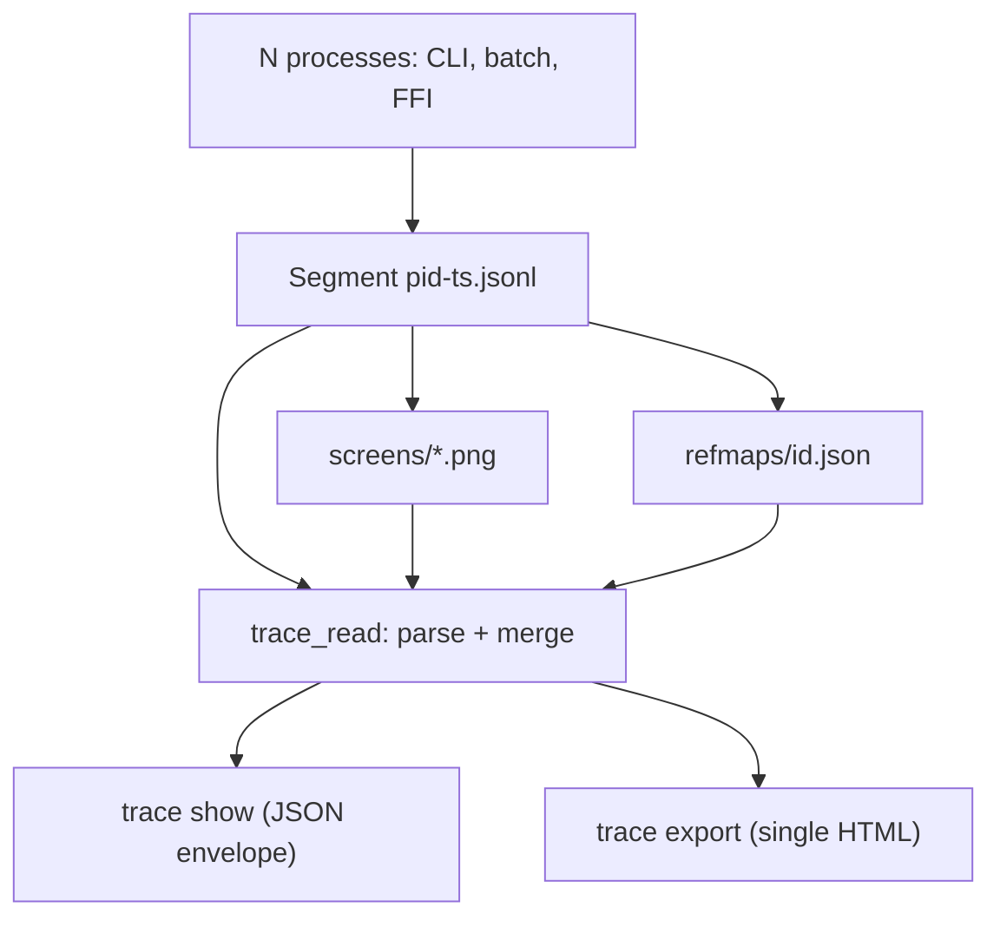
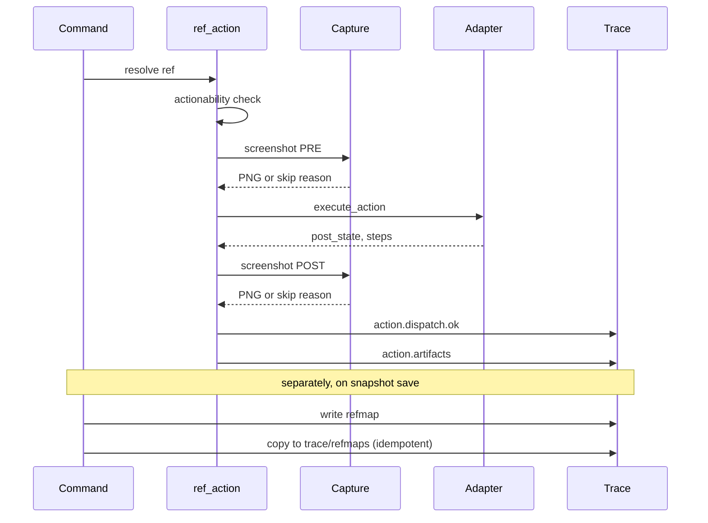

# Trace Viewer and Replay Artifacts - Plan

## Goal Capsule

- **Objective:** Build the trace read-and-replay layer on the session-first foundation: deterministic merged timelines (R1–R5), a versioned and tolerant format contract (R6–R7), replay-complete event enrichment (R8–R9), opt-in screenshot and refmap artifacts (R10–R13), a single-file HTML viewer (R14–R17), and additive, backward-compatible contract safety (R18–R19).
- **Authority:** This plan takes precedence over general repo conventions where the two conflict; repo conventions take precedence over implementer judgment; `CLAUDE.md` rules (the 400 LOC cap, zero `unwrap()`, no inline comments, core/platform isolation) remain non-negotiable regardless of what any unit implies.
- **Execution profile:** Units U1 and U5 are test-first — their enumerated test scenarios are written as failing tests before the implementation they specify. Every unit lands with its full enumerated test list; no scenario is dropped as a shortcut.
- **Stop conditions:** Any change that would require a new `PlatformAdapter` trait method, a new `ErrorCode` variant, an `ENVELOPE_VERSION` bump, or a new external dependency is out of contract (KTD9). Hitting one mid-implementation means stop and surface, not improvise around it.

---

## Product Contract

### Summary

Add the trace read-and-replay layer that the session-first trace architecture (`docs/plans/2026-06-30-001-refactor-session-first-trace-architecture-plan.md`) deferred. `trace show` merges every segment of a session into one deterministic timeline, returned as a bounded JSON envelope agents can consume without exhausting their context window. `trace export` renders that timeline into a single self-contained HTML file — embedded JSON, embedded screenshots, an inline viewer — that opens from `file://` with no server and no network calls.

Two enrichments make replay complete. Every command now emits a `command.start`/`command.end` boundary pair regardless of how it fails, and an opt-in `artifacts: full` session mode captures pre- and post-action screenshots and refmap copies around every ref action. The format itself carries a per-segment `trace.meta` header and an additive-only evolution rule, so a schema-0 trace from v0.4.6 and a future schema-N trace both read cleanly through the same reader.

This plan touches no `PlatformAdapter` trait method, adds no error code, and does not bump `ENVELOPE_VERSION`. Both new commands are additive JSON on top of the existing envelope, wired through CLI, batch, and FFI via the same core command functions.

### Problem Frame

The session-first foundation gives every process a per-segment, lock-free trace sink, but nothing reads it back. Today's event catalog is thin and write-path-only: `ref.resolve.start/entry/ok/error` (`crates/core/src/commands/helpers.rs`), `actionability.check.start/ok/error` plus `action.dispatch.start/ok` (`crates/core/src/ref_action.rs` — `action.dispatch.ok` already carries the full `ActionResult`, including `post_state` and the activation-chain `steps: Vec<ActionStep>`), `input.focus_app` (`crates/core/src/commands/point_resolve.rs`), and `snapshot.root.saved` (`crates/core/src/snapshot_ref.rs`).

There is no `command.start`/`command.end` pair, so a command that fails before ref resolution — a bad argument, a policy denial, a missing session — leaves zero trace of the attempt and no duration. The main snapshot path never emits `snapshot.saved`, so a trace cannot even enumerate which snapshots a session produced. Segments carry no self-description: nothing marks their schema or the binary version that wrote them, so a future format change has no way to warn a reader instead of silently misparsing.

No per-step visual state is captured, so a human reviewing a trace sees JSON event names with no picture of what was on screen. And nothing merges segments into a timeline at all — not a reader, not a viewer, not even a sort-and-concatenate script. A session's trace directory is, today, a pile of unrelated JSONL files.

### Requirements

**Timeline reading**

- R1. `trace show` merges every segment of a session into one deterministic timeline and returns it in the standard JSON envelope, honoring session activation precedence (flag > `AGENT_DESKTOP_SESSION` > `current_session` pointer) and requiring no accessibility or screen-recording permission.
- R2. Merge order is ascending `ts_ms`; equal `ts_ms` breaks ties by `(writer pid, in-file position)`. Within one segment, file order (the `seq` order) is never violated even when `ts_ms` regresses from a wall-clock adjustment — per-process causality is authoritative, and cross-process same-millisecond order is best-effort but deterministic. Output is independent of segment discovery order. Cross-process ordering is guaranteed only for same-millisecond ties; a wall-clock step large enough to separate causally-ordered events in different processes by more than a tie is an undefended, documented best-effort boundary.
- R3. Reader tolerance is a hard contract: a truncated final line from a mid-write crash is skipped and counted; a corrupt line mid-file is skipped and counted; non-object JSON lines are skipped and counted; files in `trace/` that don't match the `<pid>-<procStartTs>.jsonl` segment naming (or `*.tmp`) are ignored with a warning; a line longer than 8MiB is rejected and counted; a segment file that cannot be opened, or whose name resolves to a symlink, is skipped with a counted warning (segment opens use `O_NOFOLLOW`, mirroring the refmap store's open discipline); a `command.start` with no matching `command.end` (a killed process defeats the `Drop` guard) is surfaced as a counted warning and rendered as an open, incomplete group rather than dropped. The reader never errors on malformed content — malformed content degrades to counted warnings in the response. Warnings are machine-readable: each entry carries a closed kind (`foreign_file`, `unreadable_segment`, `symlinked_segment`, `schema_unknown`, `unpaired_command`) plus a human message, so agents branch on kind, not free text.
- R4. Each merged event is annotated with provenance: `writer_pid` and `segment` (the filename stem). The existing `pid` field on events like `ref.resolve.entry` — the target app's pid — is never overwritten.
- R5. Output is bounded for agent context windows: `--limit N` returns the last N events of the merged timeline (default 500; `--limit 0` means all); the response carries `total_events`, `returned_events`, and `truncated: true|false`. `--event <prefix>` filters by event-name prefix before the limit is applied. The tail slice is positional and may split a `command.start`/`command.end` pair; the envelope's `truncated` flag plus the `unpaired_command` warning kind mark the cut, and the viewer renders the affected group as open-incomplete rather than pretending completeness.

**Format contract**

- R6. Every segment opens with a `trace.meta` header event: `schema: 1`, binary version, `os`, `pid`, `proc_start_ms`, `session_id`. Segments without one — every trace from v0.4.6 and earlier — are read as schema 0, fully supported. A schema greater than the reader's known maximum produces a warning and a best-effort parse, never an error.
- R7. Trace format evolution is additive-only: new event types and new optional fields may appear, but existing field meanings never change. Readers ignore unknown event types and unknown fields, passing them through to output verbatim.

**Replay completeness (event enrichment)**

- R8. Every command run through the binary dispatch — CLI and each batch item — and through the five generated FFI command entrypoints (execute-by-ref, snapshot, status, version, wait) emits `command.start` `{command}` and `command.end` `{command, ok, duration_ms}`, plus `code` and `message` on failure. A command that fails preflight, policy, or resolution still yields its boundary pair. If a command panics or is interrupted after start, a guard emits `command.end` with `ok: false, code: INTERNAL` on unwind where recoverable. Hand-written FFI command surfaces stay uninstrumented at the command-boundary level in this plan (see R-G); per-action events still fire for FFI ref actions routed through the shared ref-action seam.
- R9. Snapshot creation is traced: the main snapshot path and wait-produced snapshots emit `snapshot.saved` `{snapshot_id, ref_count, app when known}`; the existing `snapshot.root.saved` on the drill-down path is unchanged, per the additive-only rule.

**Replay artifacts (opt-in)**

- R10. `session start --screenshots` records `artifacts: full` in the session manifest (default `events`). An old binary reading a new manifest ignores the field — `SessionManifest` carries no `deny_unknown_fields`. A new binary reading an old manifest defaults to `events` via `#[serde(default)]`. `status` surfaces the artifacts mode for the active session.
- R11. When tracing is active and `artifacts: full`, every ref action captures a pre-action and post-action screenshot of the acted-on app (`ScreenshotTarget::Window(entry.pid)`, PNG as returned by the existing adapter method), written under `<session>/trace/screens/` with process-collision-free names, as `0600` files in a symlink-guarded `0700` directory. A per-process budget of 128MiB and 200 captures bounds each process's contribution; a session driven by many separate invocations accumulates one allowance per process, so the session-level footprint is not bounded by this mechanism (see System-Wide Impact). Capture failure, budget exhaustion, missing screen-recording permission, or an adapter without screenshot support (the Windows and Linux stubs) skips the capture with a machine-readable reason — it never fails or slows the action beyond the capture attempt itself.
- R12. Each ref action with artifacts enabled emits `action.artifacts` `{ref, screenshot_pre, screenshot_post, skipped reasons when applicable}`, with paths relative to the session's trace directory.
- R13. When `artifacts: full`, every refmap save — a new snapshot, a drill-down re-save, a wait-produced snapshot — also copies the refmap JSON to `<session>/trace/refmaps/<snapshot_id>.json`. The copy is idempotent (first-write-wins, atomic tmp-then-rename) and shares a 64MiB per-process budget with skip-and-count on exhaustion. Snapshot pruning (the 512 cap) can therefore never break replay for a step whose refmap was already copied; a refmap that was budget-skipped and later pruned is gone, and the reader and viewer surface a placeholder plus a count for it, mirroring the screenshot embed-budget handling (R16). Refmap copies are intentionally unredacted, matching Playwright's full-fidelity replay — this is exactly why artifacts are opt-in.

**Human-viewable export**

- R14. `trace export [--out <path>] [--limit N]` writes one self-contained HTML file, defaulting to `--limit 5000` (ten times `trace show`'s tail default, serving the comprehensive human artifact) with `--limit 0` embedding the full timeline — no network fetches, no external files, works from `file://` — with the merged timeline embedded as JSON, screenshots embedded as base64 data URIs, and a viewer UI with inline CSS and JS. The default output path is `trace-<session_id>.html` in the current directory.
- R15. Export is XSS-safe against trace-controlled content — app window titles, element names, and error messages are all attacker-influenceable. Trace JSON is embedded in a ``, when `trace export` runs and the file is opened, then no script executes and the title renders as literal text.
- AE6. Given the 200-capture budget is exhausted mid-session, when a further click runs, then the click succeeds, `action.artifacts` carries `skipped: "budget"`, and `command.end.ok` is true.
- AE7. Given screen-recording permission is denied, or the platform adapter returns not-supported, when a ref action runs with `artifacts: full`, then the action behaves exactly as with `artifacts: events` except for the `action.artifacts` skip reason.
- AE8. Given no active session — no flag, env var, or pointer — when `trace show` runs, then `INVALID_ARGS` returns with a suggestion naming `session start` or `--session`.
- AE9. Given the same session read twice, with segments listed by the OS in different orders, when `trace export` runs twice, then the two HTML files are byte-identical.

---

## Planning Contract

### Key Technical Decisions

- KTD1 — Viewer is the CLI merged timeline plus a single-file HTML export; no server, no GUI mode. `trace show` is the agent surface: envelope JSON bounded by `--limit` tail semantics and a `truncated` flag, so agents never blow their context window. `trace export` is the human surface: one static HTML file, openable anywhere, attachable to an issue. Playwright ships a web-app viewer, but this repo's identity is machine-facing — no GUI, no TUI — so the shareable artifact here is a file, not a program. Playwright 1.59's `npx playwright trace` (`actions --grep`, `action <n>`, `snapshot <n>`) is a stdout-only, no-browser trace reader built for CI and agent loops, and validates `trace show`'s list/filter shape as proven prior art.
- KTD2 — Merge is a k-way heap merge keyed on `(ts_ms, pid, file-position)`; per-segment file order is inviolable. Same-machine processes share a clock, so "skew" reduces to non-monotonic wall time; `seq`/file order preserves in-process causality, and the `(pid, position)` tie-break makes cross-process ties deterministic rather than pretending microsecond truth. Segments sort by filename before merging, which makes the result independent of segment discovery order (R2, AE9).
- KTD3 — Reader tolerance is a hard contract, not best-effort politeness (R3): every malformed shape degrades to a counted warning. The foundation plan's KTD2 promised that readers must tolerate a truncated final line; this plan turns the full tolerance matrix — truncated tail, corrupt line, foreign file, oversized line, non-object line — into an explicit, tested guarantee, because multi-process append-only files will exhibit all of these in real crashes.
- KTD4 — Format versioning is a `trace.meta` header event per segment plus additive-only evolution (R6/R7). An event, rather than a filename suffix or a sidecar file, keeps the format single-channel, survives file copies, costs one line, and lets v0.4.6 traces remain schema 0 with no migration. The reader accepts an unknown schema with a warning — forward-lenient, because traces are diagnostic artifacts and refusing to read one is strictly worse than a best-effort parse. Playwright has no trace-format version contract at all: compatibility is empirically "mostly forward," a 1.32 viewer once rendered old traces as a silent blank panel, and the request for a version-mismatch warning (playwright#21898) is still open. `trace.meta`'s schema field and its warn-not-fail behavior is the direct fix for a gap Playwright users have paid for.
- KTD5 — Command boundary events go through a `CommandContext::command_scope` guard wired at the binary's `dispatch::dispatch` — which covers CLI and every batch item, since batch items reuse the same dispatch with their own child contexts — and at the FFI generated entrypoints (a generator template change in `crates/ffi/build.rs`). One core implementation, two thin integration points; a `Drop` safety net emits a failure `command.end` if a scope is abandoned. `command.start` carries only the command name — the command's own events carry the specifics, and including arguments would drag sensitive payloads through redaction for no replay value.
- KTD6 — Screenshots are opt-in via the manifest's `artifacts: full` (set by `session start --screenshots`), captured only around ref actions at the single shared seam `ref_action::execute_resolved` — pre-capture after the actionability check (before activation — the activation chain, including scroll-into-view, runs inside `execute_action`), post-capture after execution on both the success and failure paths — targeting `ScreenshotTarget::Window(entry.pid)`, the acted-on app. Window-scoped beats full-screen: smaller PNGs (the adapter is PNG-only, and no new image dependency is allowed), less privacy exposure, and capture resolves through the platform's pid-to-window heuristic — on macOS the largest visible window for the pid, not the frontmost as the trait doc-comment stale-claims (U5 corrects the comment) — so smaller same-pid surfaces (menus, sheets, popovers) and the non-largest windows of multi-window apps can be missed (R-C). Cross-app side effects are a documented v1 miss. Budgets of 128MiB and 200 captures per process, enforced by process-local atomic counters, bound volume; every skip carries a reason in `action.artifacts` (R11/R12). Capture is best-effort by construction — an action must never fail because a screenshot did.
- KTD7 — Refmap copies happen at snapshot-save time, not action time. Copying `snapshots/<id>/refmap.json` to `trace/refmaps/<id>.json` when a refmap is saved is naturally idempotent, catches every snapshot an action could later reference, and decouples replay from the 512-snapshot prune — the foundation plan's recorded "copy, Playwright-style" decision, now executed. Copies are raw and unredacted; element names are the replay value, the same way Playwright copies the full DOM, which is exactly why `artifacts: full` is opt-in and the sensitivity is documented (R13). Playwright itself ships no content redaction despite multi-year demand — a request for password-protected traces (playwright#28934) was closed "not planned," and only screenshot masking exists — so agent-desktop's write-time field redaction is already ahead of that prior art; this plan keeps redaction intact for `events` mode and documents the opt-in, unredacted artifacts explicitly rather than following Playwright's precedent of no redaction at all. A per-action full accessibility-tree capture would also visibly slow every action on desktop AX, so this plan skips that: `post_state` plus the activation-chain `steps` already in `action.dispatch.ok`, together with screenshots and refmap copies, reconstruct the step without a second tree walk.
- KTD8 — HTML export embeds data as a JSON `` becomes unrepresentable inside the payload. This makes XSS structurally impossible rather than sanitization-dependent (R15). Viewer assets are three `include_str!` files (HTML, CSS, JS), following the `commands/skills.rs` embedding precedent, with zero new dependencies (core already carries `serde_json` and `base64`). Playwright's own HTML report claims to be "one file" — a base64-zip inside a `` is unrepresentable inside the payload. This is the precise mechanism R15 mandates and KTD8 adopts.
  - Sources: playwright.dev/docs/api/class-tracing; playwright.dev trace-viewer documentation; deepwiki.com/microsoft/playwright (trace.zip and HTML report internals); playwright.dev/docs/test-reporters; github.com/microsoft/playwright issues #21898, #28934, #19992, #29218, #8263; github.com/GoogleChrome/lighthouse `report-generator.js`; the allure-framework discussion #2854; the pytest-html user guide (`self-contained-html` limits).

---

## Implementation Units

### U1. Trace reader engine (`trace_read`)

- **Goal:** A deterministic, tolerant segment discovery and merge engine, as a pure-core module returning a typed result — events as `serde_json::Value` plus per-segment stats and warnings.
- **Requirements:** R1 (engine half), R2, R3, R4, R6 (read side), R7.
- **Dependencies:** None.
- **Files:** NEW `crates/core/src/trace_read/mod.rs` (public API `read_merged(store_trace_dir, ReadOptions) -> MergedTrace`); NEW `crates/core/src/trace_read/segment.rs` (filename parsing for `<pid>-<ts>`, a tolerant line iterator, per-segment stats); NEW `crates/core/src/trace_read/merge.rs` (k-way merge, provenance annotation, event-prefix filter, tail limit); sibling tests `segment_tests.rs` and `merge_tests.rs`; register the module in `crates/core/src/lib.rs`.
- **Approach:** Read lines with `BufRead`, checking explicitly for a final-line trailing newline to detect truncation; guard any line over 8MiB; sort segments by filename, then merge them through a `BinaryHeap` keyed on `(ts_ms, pid, position)`; a missing `ts_ms` sorts as 0 for schema-0 tolerance; `writer_pid`/`segment` annotations are added without clobbering existing event fields; schema is read from a leading `trace.meta` line when present, else defaults to 0; a schema above the reader's known maximum produces a warning string rather than an error. Segment files open with `O_NOFOLLOW` (symlink refusal) mirroring `open_refstore_file`; an unreadable or symlinked segment degrades to a counted warning, never an error.
- **Execution note:** Test-first. Encode R2 and R3 as failing tests before writing the merge implementation.
- **Patterns to follow:** Sibling test files via the `#[path]` attribute pattern, consistent with how `agent-desktop-core` splits large modules from their tests elsewhere.
- **Test scenarios:**
  1. Two segments interleave strictly by `ts_ms`.
  2. A same-millisecond tie across processes orders by `(pid, position)` and is stable across runs.
  3. An in-process `ts_ms` regression keeps `seq` order (AE2).
  4. Discovery-order independence: the same result with the segment list reversed, fed via renamed copies.
  5. A truncated final line — no trailing newline, cut mid-JSON — yields `skipped_lines: 1` with remaining events intact (AE1).
  6. A corrupt middle line is skipped; subsequent lines still parse.
  7. A non-object JSON line (`[1,2]`, `"str"`) is skipped.
  8. An empty file and an empty trace directory yield an empty timeline with zero warnings; a missing trace directory yields a typed error for the command layer to map.
  9. A foreign file (`notes.txt`) and a `123-9.jsonl.tmp` file in `trace/` are ignored — the foreign file with a warning, the `.tmp` file silently.
  10. An oversized line over 8MiB is counted, not loaded.
  11. A `trace.meta` line with `schema: 1` parses into segment stats; an absent meta line reads as schema 0 with no warning (AE4).
  12. A `schema: 2` meta line produces a warning while events still return (AE3).
  13. Unknown event types and unknown fields pass through verbatim (R7).
  14. The `writer_pid` annotation does not clobber an existing `pid` field on `ref.resolve.entry`-shaped events (R4).
  15. The event-prefix filter (`action.`) combines with tail `--limit` semantics: the last N events after filtering, with `total_events` vs `returned_events` and the `truncated` flag both correct.
  16. Filename parsing: a valid `4242-1719900000000.jsonl` is accepted; `abc-1.jsonl` and `1.jsonl` are rejected as foreign.
  17. Multiple `trace.meta` lines mid-file pass through as regular events; only the first line counts toward the segment's schema (supports a shared explicit `--trace` file opened by more than one writer; see R-E).
  18. A segment-named symlink inside `trace/` is skipped with a `symlinked_segment` warning; its target is never read.
  19. A permission-denied segment file is skipped with an `unreadable_segment` warning; remaining segments still merge.
- **Verification:** `cargo test --lib -p agent-desktop-core` green; every new file under 400 LOC; `cargo tree -p agent-desktop-core` unchanged (zero platform imports).

### U2. `trace show` command and full CLI, batch, and FFI wiring

- **Goal:** Expose the reader as `agent-desktop trace show` everywhere other commands exist.
- **Requirements:** R1, R5, R18, R19, KTD11.
- **Dependencies:** U1.
- **Files:** NEW `crates/core/src/commands/trace.rs` (core `TraceAction::Show { limit, event }`, resolving `RefStore::for_session(context.session_id()).trace_dir()` and mapping a missing session or directory to `INVALID_ARGS` with a suggestion) plus sibling `trace_tests.rs`; NEW `src/cli_args/trace.rs` (clap `TraceArgs`/`TraceAction::Show(...)`); `src/cli/mod.rs` (the new variant and its name mapping); `src/dispatch/mod.rs` plus a new sibling extracted arm module (the KTD10 split moves the Session and Trace arms out, keeping dispatch under 400 LOC); `src/command_policy/mod.rs` (add `Trace(_)` to the permissionless `None` arm and to the ref-policy exemption arm); `src/batch/mod.rs` (a `"trace"` parse path with a `deny_unknown_fields` `BatchTraceArgs`); `crates/ffi/build.rs` (a descriptor for `trace show`, regenerated via `scripts/update-ffi-header.sh` if the surface changes); `src/cli/contract_tests.rs` plus a regenerated `src/cli/help_after.txt` golden; `src/tests/conformance.rs`; an FFI conformance test file enumerating commands.
- **Approach:** The envelope's `data` shape is `{session_id, segments: [{segment, pid, schema, event_count, skipped_lines}], total_events, returned_events, truncated, warnings: [], events: [...]}`, with empty `warnings` omitted per the serialization rules. The command works with a bare `--session <id>`: a manifest-less session still has a trace directory only if it was traced, and an absent directory returns the `INVALID_ARGS` guidance. `segments[].event_count` is an integer; per-segment event bodies are never duplicated — only the top-level `events` array (post-filter, post-limit) carries payloads. `warnings` entries are `{kind, message}` objects with the closed kind set from R3.
- **Patterns to follow:** `src/cli_args/session.rs` for the clap argument shape; the existing `session` batch-args handling for `deny_unknown_fields` parsing.
- **Test scenarios:**
  1. Happy path: a seeded session directory (real segment fixtures via a test helper) produces an envelope whose shape is asserted field by field.
  2. No active session anywhere returns `INVALID_ARGS` with a suggestion (AE8).
  3. A session that exists but was never traced (no trace directory) returns `INVALID_ARGS` suggesting `session start`, not a crash.
  4. Session resolution precedence: explicit `--session` beats the env var, which beats the pointer (reusing the `HomeGuard` test pattern).
  5. `--limit`/`--event` flow through to the reader; the default of 500 is documented in help text and asserted in tests.
  6. Policy: `trace show` passes preflight with every permission denied (a `command_policy` unit test).
  7. Batch: `{"command":"trace","args":{"action":"show"}}` runs; an unknown batch arg field is rejected via `deny_unknown_fields`.
  8. CLI contract: `trace` appears in the command list; the help golden is regenerated; argument-parse tests cover `--limit 0` and `--event action.`.
  9. FFI conformance: `trace show` is callable and returns an envelope, mirroring existing FFI command tests.
  10. A committed golden fixture — a mini-session with two segments, one containing a truncated line — produces stable merged JSON in `tests/fixtures/`; one of the two segments carries no `trace.meta` line, so the same committed fixture doubles as the schema-0/v0.4.6 compatibility proof the Definition of Done names.
  11. A tail window that cuts a `command.start`/`command.end` pair yields `truncated: true` plus an `unpaired_command` warning, with the surviving member still present in `events`.
- **Verification:** The full binary contract suite and FFI tests are green; `help_after.txt` is regenerated deliberately, with the diff reviewed rather than accidental.

### U3. Event enrichment: command boundaries, snapshot linkage, segment meta

- **Goal:** A trace alone reconstructs every command: boundaries, duration, outcome, and the snapshot ids it touched.
- **Requirements:** R6 (write side), R8, R9.
- **Dependencies:** None — runs in parallel with U1. U2's `trace show` output benefits once U3 lands, but does not require it first.
- **Files:** The KTD10 split happens first: NEW `crates/core/src/trace_sanitize.rs` (moves `sanitize_trace_value` and its key-token helpers out of `trace.rs`, with a `pub use` in `lib.rs` for the FFI `log_callback` consumer). Then: `crates/core/src/trace.rs` (emits `trace.meta` as the first line of every new segment, including explicit `--trace` files, so the reader treats both sink kinds identically); `crates/core/src/context.rs` (a `command_scope(name) -> CommandScope` guard — an eager start event, a `complete(&Result)` call emitting the end event with `duration_ms` via `Instant`, and a `Drop` that emits an `INTERNAL` end if not completed) plus `context_tests.rs`; `src/dispatch/mod.rs` (wraps the dispatch body in the scope, covering CLI and batch items from one place); `crates/ffi/build.rs` (generated entrypoints open and complete the scope); `crates/core/src/commands/snapshot.rs` (emits `snapshot.saved` after save, including `ref_count` and `app` when known); the other `save_new_snapshot` call sites (`snapshot_ref.rs` already emits `root.saved`; the wait paths gain `snapshot.saved` too) plus their tests.
- **Approach:** Events flow through the existing redaction pipeline unchanged — the message field passes, sensitive keys redact, already proven by the current context tests. `command.start` carries only `{command}` (KTD5). In batch, the outer `batch` command gets its own scope, and each item gets its own through the shared dispatch path, so nesting is reconstructable from `seq` order. Over FFI, boundary events cover the five generated entrypoints only; hand-written FFI surfaces are a documented follow-up (R-G).
- **Patterns to follow:** The existing `write_event`/redaction pipeline already used by `ref.resolve.*` and `actionability.*` events; `snapshot_ref.rs`'s existing `snapshot.root.saved` emission as the template for the new `snapshot.saved` call.
- **Test scenarios:**
  1. Scope happy path: a start/end pair with `duration_ms` present and sane, `ok: true`.
  2. A failing command's end event carries `ok: false` plus `code` and `message` (for example, a forced `INVALID_ARGS`).
  3. A drop without `complete()` emits an `INTERNAL` end exactly once — no double-emit when the scope completes normally.
  4. A no-sink context makes the scope a no-op: no error, no file.
  5. `trace.meta` is the first line of a fresh segment, with schema 1, `pid`, and `session_id` present; an explicit `--trace` file also opens with meta. This adds test scenario 17 to U1: multiple meta lines mid-file are passthrough events, and only the first counts as the segment's schema.
  6. A batch of 3 items produces 1 outer plus 3 inner start/end pairs, with distinct commands and correct nesting by `seq`.
  7. The snapshot command emits `snapshot.saved` carrying the id the envelope returned; the wait-with-snapshot path emits it too.
  8. FFI: a generated entrypoint produces a start/end pair in the session segment, extending the existing FFI trace verification test.
  9. Redaction: an end message containing a window title passes through as a diagnostic message under documented semantics; sensitive keys in any future fields still redact, and the sanitizer's own unit tests survive the file move unchanged.
- **Verification:** Core, binary, and FFI suites are green; `trace.rs` and `dispatch/mod.rs` are both under 400 LOC after their splits; the generated FFI file is regenerated via the script, never hand-edited.

### U4. Artifacts mode: manifest, `session start --screenshots`, and status

- **Goal:** One opt-in knob recorded in the manifest, surfaced everywhere session state is visible.
- **Requirements:** R10.
- **Dependencies:** None.
- **Files:** `crates/core/src/session/manifest.rs` (`#[serde(default)] artifacts: ArtifactsMode` enum with `Full` and `#[default] Events`, plus an `artifacts_full()` helper that respects `ended_at`); `crates/core/src/commands/session.rs` (`Start` gains a `screenshots: bool` mapped to `ArtifactsMode`); `crates/core/src/session/mod.rs` (`StartSessionOptions` gains the field); `src/cli_args/session.rs` (a `--screenshots` flag with help text warning about sensitivity); `src/batch/mod.rs` (`BatchSessionArgs` gains the field); `src/dispatch/mod.rs` (arm plumbing); `crates/core/src/context.rs` (resolves the artifacts mode at construction alongside trace gating, from one manifest read that returns both); `crates/core/src/commands/status.rs` (surfaces `artifacts` for the active session); tests in `session_tests.rs`, `status_tests.rs`, `batch/tests.rs`, plus CLI contract tests and a help golden update.
- **Approach:** `--screenshots` implies nothing about tracing on its own — `--no-trace --screenshots` together is `INVALID_ARGS`, since artifacts require tracing, validated at session start with a clear message.
- **Patterns to follow:** `artifacts_full()` mirrors the existing `trace_enabled()` end-of-session check; `--screenshots` follows the same boolean-flag-to-manifest-field wiring already used for `trace: on`.
- **Test scenarios:**
  1. `session start --screenshots` produces a manifest with `"artifacts":"full"`; without the flag, the field still serializes explicitly as `"events"` (always-serialize, for simpler golden fixtures).
  2. An old manifest JSON with no `artifacts` key deserializes to `Events` (backward compatible).
  3. A manifest with an unknown future key still parses — no `deny_unknown_fields` regression.
  4. `--no-trace --screenshots` together returns `INVALID_ARGS` with a suggestion.
  5. An ended session reports `artifacts_full()` as false after `session end`, mirroring `trace_enabled`.
  6. `status` shows the artifacts mode; an absent session omits the field.
  7. Batch `session start` accepts `screenshots: true`; an unknown field is still rejected.
  8. CLI: the flag parses correctly, and the help golden is updated.
- **Verification:** Core and binary suites are green; a v0.4.6-era session directory round-trips through `session list` untouched.

### U5. Capture pipeline: screenshots and refmap copies (`trace_artifacts`)

- **Goal:** The opt-in artifacts are actually captured, budgeted, and linked from events.
- **Requirements:** R11, R12, R13.
- **Dependencies:** U4 (mode). U1 only for shared naming conventions — a soft dependency, not a hard ordering requirement.
- **Files:** NEW `crates/core/src/trace_artifacts.rs` (hardens `screens/` and `refmaps/` by calling `ensure_trace_dir` — promoted to `pub(crate)` — rather than re-deriving the `0700`/symlink-guard logic; process-local atomic budgets and a capture sequence counter; `capture_action_screenshot(context, adapter, pid, phase) -> ArtifactOutcome` and `copy_refmap_if_full(context, store, snapshot_id)`, both writing through the existing `write_private_file` primitive — which already carries `0600`, `O_NOFOLLOW`, and atomic tmp-then-rename — with a pre-existence check supplying first-write-wins idempotency; no new file-write logic) plus `trace_artifacts_tests.rs`; `crates/core/src/ref_action.rs` (pre/post capture around execution, plus the `action.artifacts` event; stays under 400 LOC — currently 135); refmap-copy calls at every `save_new_snapshot`/`save_existing_snapshot` command seam (`crates/core/src/commands/snapshot.rs`, `snapshot_ref.rs`, and the wait snapshot-save paths — grep for the call sites); `crates/core/src/refs.rs` only if a raw-bytes read helper turns out to be needed; `crates/core/src/adapter.rs` (doc-comment correction only: `ScreenshotTarget::Window` documents largest-visible-window resolution, not "frontmost").
- **Approach:** Capture runs only when `context.trace_enabled() && context.artifacts_full()`. Screenshots go through the existing `adapter.screenshot(Window(entry.pid))`; post-capture fires on the action's success and failure paths alike (`inspect_err`-symmetric, mirroring `check_actionability_with_trace` in the same file) — a failed action is when the screenshot matters most. Every failure path returns a reason string (`"budget"`, `"count_budget"`, `"adapter: <code>"`) that lands in `action.artifacts.skipped`; artifact writes never propagate errors into the action result. The mock adapter gains a screenshot stub returning a small fixed PNG.
- **Execution note:** Test-first for budget and skip semantics — they are the contract.
- **Patterns to follow:** `ensure_trace_dir` (promoted to `pub(crate)`) for directory hardening and `write_private_file` for every artifact write — reuse the proven primitives, do not re-derive them; the existing `serialize_with_size_check` for refmap reserialization rather than a raw-bytes copy; `check_actionability_with_trace`'s `inspect_err` symmetry for failure-path capture.
- **Test scenarios:**
  1. With artifacts full and the mock adapter, pre and post PNGs exist on disk (magic bytes `\x89PNG`), as `0600` files, named with pid, process-start timestamp, sequence, and phase; `action.artifacts` paths resolve relative to the trace directory.
  2. With artifacts at the default `events` mode, zero files and zero `action.artifacts` events are produced, and the action result is identical to today.
  3. Trace off with artifacts full still captures nothing — the trace gate wins.
  4. An adapter screenshot error still lets the action succeed, with skip reason `adapter: ...` (AE7).
  5. Byte budget exhaustion (a tiny test budget via a `cfg(test)` constructor) skips with reason `"budget"`; counters never wrap, using saturating arithmetic.
  6. Count budget exhaustion skips with reason `"count_budget"` (AE6).
  7. A symlinked `screens/` directory makes capture refuse, with a skip reason, never writing through the symlink.
  8. Refmap copy: a snapshot save with artifacts full produces `trace/refmaps/<id>.json` byte-equal to the source refmap; a second save of the same id produces a single copy (idempotent); a concurrent first-write race between two tmp files leaves exactly one winner and no error.
  9. Refmap copy budget exhaustion skips and counts; pruning the source snapshot afterward leaves the copy intact, so replay survives prune (the R13 guarantee).
  10. On an adapter with the default `not_supported` screenshot method (the Windows and Linux stubs), capture cleanly skips — proving cross-platform safety from day one.
  11. Two threads capturing through the same process counters produce distinct filenames, since the capture sequence is atomic.
  12. A failing ref action (`execute_action` returns an error) still produces the post-action screenshot and an `action.artifacts` event when artifacts are full.
  13. Against a multi-window mock, capture resolves per the platform heuristic (largest visible window for the pid) — asserted as the stated contract from R-C.
- **Verification:** Core suite is green; no adapter trait change (`adapter.rs` diff-free); capture adds zero overhead when the mode is `events` (asserted by no directory creation).

### U6. `trace export`: single-file HTML viewer

- **Goal:** The human-facing artifact: timeline, screenshots, and a detail pane in one XSS-safe static file.
- **Requirements:** R14, R15, R16, R17, R19 (export over FFI and batch).
- **Dependencies:** U1, U2 (the command file and its wiring already exist).
- **Files:** NEW `crates/core/src/trace_read/html.rs` (the export builder: merged timeline to an embedded JSON island with `<` escaping; screenshot files to base64 data URIs under the 100MiB embed budget, each resolved path canonicalized and contained within the session trace directory before any read — a path that escapes (traversal, absolute, or symlink) degrades to the placeholder-plus-count path, never an embedded read; the 200MiB JSON guard; deterministic output) plus `html_tests.rs`; NEW assets `crates/core/src/trace_read/viewer.html`, `viewer.css`, `viewer.js` (each under 400 lines, composed via `include_str!`); `crates/core/src/commands/trace.rs` (an `Export` action taking `--out` and `--limit`); the corresponding wiring increments in `src/cli_args/trace.rs`, the batch parser, the FFI descriptor, CLI contract tests, and the help golden.
- **Approach:** Viewer scope is fixed — resist feature creep. A chronological event list uses `command.start` rows as group headers with duration badges and ok/error coloring; a click opens a detail pane with pretty JSON rendered via `textContent`; `action.artifacts` rows show pre/post thumbnails that expand to full size on click; a text filter matches on event name; redacted fields render as `⟨redacted⟩`; a warnings banner surfaces skipped lines, schema warnings, and embed skips; zero network requests; vanilla JS only. The event list renders an explicit empty-state message both for an empty timeline and for a filter matching zero events. A skipped or missing screenshot renders a distinct non-image "screenshot unavailable" placeholder following R17's redacted-field pattern — never a broken `img`. A pruned, budget-skipped refmap renders the same placeholder-plus-count shape (R13). Command status pairs the ok/error coloring with a non-color glyph or text label, so status never relies on color alone. A command group whose start or end fell outside the tail window, or whose writer died before `command.end`, renders as an open, incomplete group labeled as such (R3/R5). An explicit `--limit 0` export is not virtualized and may render slowly for very large sessions — an accepted, documented tradeoff mirroring the JPEG deferral.
- **Patterns to follow:** The `commands/skills.rs` `include_str!` asset-embedding precedent for the three viewer asset files; the existing trace-file hygiene of refusing to write through a symlink, applied to `--out`.
- **Test scenarios:**
  1. Export writes exactly one file; the response `data` reports path, event count, screenshots embedded, and byte size.
  2. The output contains no `src="http`, no `<link href`, and no other external reference (structural assertions).
  3. Hostile strings — the AE5 payloads in a window title, an element name, and an error message — appear only `<`-escaped inside the JSON island; a raw `<script>alert` is absent outside it.
  4. The JSON island round-trips: extracting the island text and parsing it with `serde_json::from_str` reproduces the timeline, proving the escaping didn't corrupt it.
  5. Screenshots embed as `data:image/png;base64,` with a valid base64 charset; a screenshot file missing from disk produces a placeholder entry plus a count, not an error.
  6. Embed budget: an oversized screenshot set skips the later screenshots, counts them in `screenshots_skipped`, and the export still succeeds.
  7. The 200MiB JSON guard returns `INVALID_ARGS` with a `--limit` suggestion.
  8. Determinism: two exports of the same session are byte-identical (AE9).
  9. The default output path is `trace-<session>.html`; an explicit `--out` is honored; the write is plain create-or-truncate but refuses to follow a symlink, matching existing trace-file hygiene.
  10. A redacted field renders its flag correctly: the island JSON keeps `{"redacted": true}` intact, and the viewer maps it — the test asserts the data is intact.
  11. Export with `--limit` embeds only the tail, with a truncated marker in the island's metadata.
  12. A screenshot path containing traversal (`../`) or an absolute path, or resolving through a symlink, yields the placeholder plus a count — the target file's contents never appear in the HTML (companion to scenario 5).
  13. An export whose filter or timeline yields zero events renders the explicit empty-state message.
  14. An unpaired `command.start` renders as an open-incomplete group, not a blank or broken one.
- **Verification:** Core suite is green; asset files are each under 400 lines; the e2e-produced file is opened manually once during implementation as a human smoke test, with automated structural assertions thereafter.

### U7. E2E scenario and docs

- **Goal:** End-to-end proof by independent observation, with every doc surface telling the truth.
- **Requirements:** Closes the loop on R1–R17; updates the documented command count from 55 to 56 — `trace` counts as one command with two actions, consistent with how `session` (four actions: start/end/list/gc) is already counted as one command.
- **Dependencies:** U1–U6.
- **Files:** `tests/e2e/run.sh` gains a scenario: `session start --screenshots`, snapshot the fixture app, click and type via refs, then `trace show` asserts the command pairs, `action.artifacts`, `snapshot.saved`, and that the artifact files exist with PNG magic bytes; then `trace export` gets structural HTML assertions, including the hostile-title fixture case if the fixture app can set a window title containing markup (if not, the unit-level AE5 coverage suffices, and the gap is noted); `skills/agent-desktop/SKILL.md` (the command count in two places, plus Quick Reference rows for `trace show`, `trace export`, and `session start --screenshots`); `skills/agent-desktop/references/commands-system.md` (the full trace command reference: flags, envelope fields, tolerance semantics, and an artifact-sensitivity warning); `CONCEPTS.md` (the Coordination section gains "Trace Timeline", "Trace Schema", and "Replay Artifacts" entries; "Trace Segment" is updated for `trace.meta`); `README.md` (a trace viewer section with the one-line flow: `session start --screenshots`, do the work, `trace export`). Every doc stays consistent with the `artifacts: full|events` naming from the Planning Contract.
- **Test scenarios:** The e2e assertions are the scenarios. Per the repo's observation rule, no step trusts a command's own `ok: true` — the PNGs are stat'd, the HTML is grepped, and the JSON envelope is parsed independently.
- **Verification:** `bash tests/e2e/run.sh` is green in both the headless and `--headed` legs (release build plus AX permission); `agent-desktop skills get` output reflects the new docs (skills are `include_str!`'d, so a rebuild is required); the binary size check still passes under 15MB.

---

## Verification Contract

| Gate | Command | Applies |
|---|---|---|
| Format | `cargo fmt --all -- --check` | all units |
| Lint | `cargo clippy --all-targets -- -D warnings` | all units |
| Core tests | `cargo test --lib -p agent-desktop-core` | U1, U2, U3, U4, U5, U6 |
| Full unit suite | `cargo test --lib --workspace` | all units |
| Binary contract | `cargo test -p agent-desktop` | U2, U3, U4, U6 |
| FFI | `cargo test -p agent-desktop-ffi --tests` | U2, U3, U6 |
| Core isolation | `cargo tree -p agent-desktop-core` contains no platform crates | U1, U2, U3, U4, U5, U6 |
| Size | release binary under 15MB (CI gate) | U6, U7 (embedded assets and skills) |
| E2E | `bash tests/e2e/run.sh` (release build, AX permission) | U7 (and any unit changing action behavior) |

---

## Definition of Done

- All 7 units land with their enumerated test scenarios implemented in full, not a subset; every suite in the Verification Contract is green.
- Every new or changed file is under 400 LOC; no inline comments; zero `unwrap()` outside tests; only `lib.rs` re-exports.
- `trace show` and `trace export` are proven over CLI, batch, and FFI; the permissionless preflight is proven by test.
- A v0.4.6-era session trace reads cleanly, proven by a committed schema-0 fixture.
- Docs (skills, `CONCEPTS.md`, `README.md`) are updated and the command count is consistent; the help golden is regenerated deliberately, not accidentally.
- No abandoned experimental code remains in the final diff.
- The e2e scenario passes in both headless and `--headed` mode.

