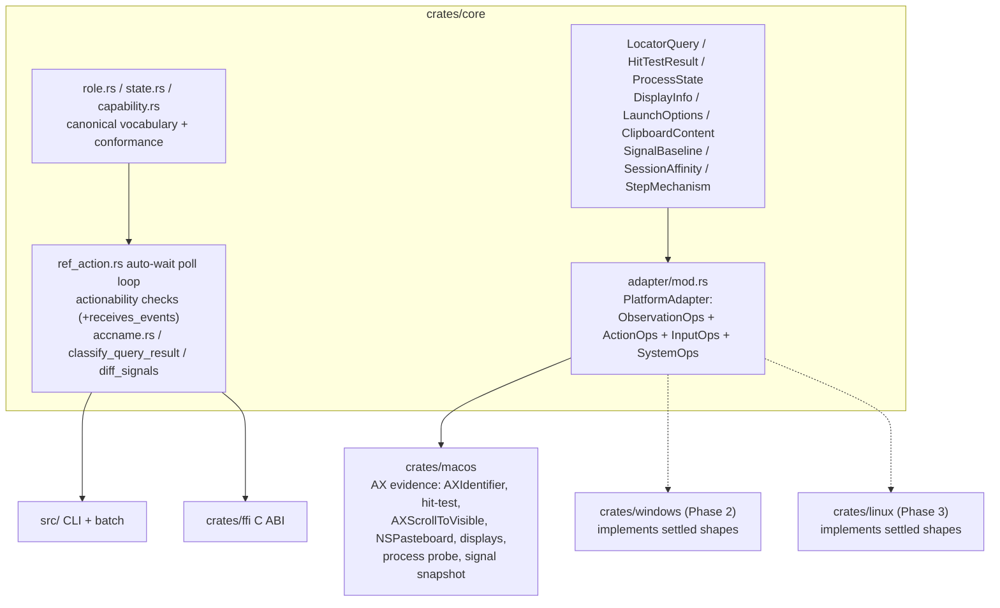
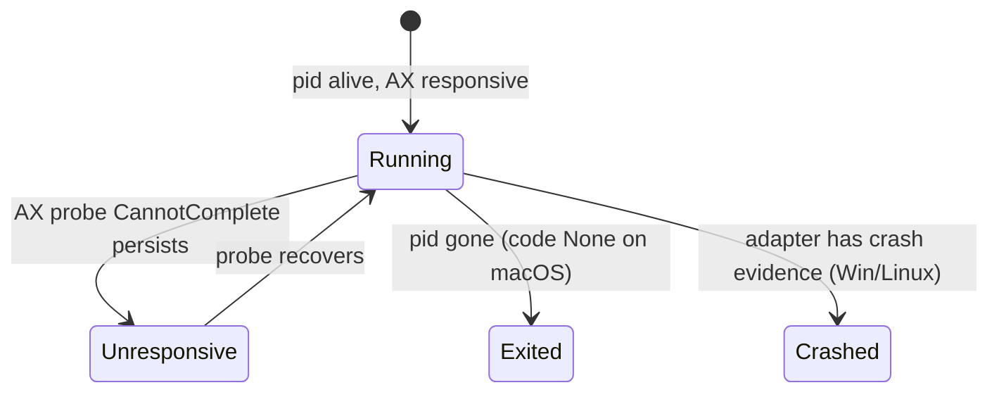

# Playwright-Grade Foundation Contract - Plan

## Goal Capsule

- **Objective:** Land the Tier-1 FOUNDATION-NOW contract from the Playwright-grade gap analysis in `crates/core` — plus the three live correctness defects — so the Windows (UIA) and Linux (AT-SPI2) adapters implement a settled reliability contract instead of redesigning it.
- **Authority hierarchy:** repo `CLAUDE.md` invariants (400 LOC/file, no inline comments, zero `unwrap()` outside tests, core never imports platform crates, conventional commits, additive `not_supported()` trait defaults) override this plan; this plan overrides implementer improvisation; `docs/solutions/` learnings cited per unit are binding constraints.
- **Execution profile:** one feature branch (`feat/foundation-playwright-grade-contract`), one conventional commit per implementation unit, dependency order per the Unit Index. All gates in the Verification Contract green before any unit is considered done.
- **Stop conditions:** stop and surface — do not guess — if (a) a unit requires core to import a platform crate, (b) a wire-contract change goes beyond additive optional fields anywhere other than U8/U14's documented changes, (c) the U0 restructure cannot preserve `&dyn PlatformAdapter` call sites unchanged, or (d) any file cannot stay under 400 LOC without violating the one-command-per-file rule.
- **Tail ownership:** the implementer owns fixture updates, FFI header regeneration via `scripts/update-ffi-header.sh`, and doc touch-ups (`CLAUDE.md` error-code list, `docs/phases.md` pulled-forward notes) inside the unit that causes them.

---

## Product Contract

### Summary

agent-desktop's core contract has three foundational gaps that cap it below best-in-class desktop automation: element identity is snapshot-bound rather than re-resolvable, actionability is checked once instead of awaited, and the role/state/naming vocabulary is too thin for a second adapter to implement compatibly. This plan fixes the three live correctness defects and lands the eighteen Tier-1 foundation items (two of which — display enumeration and the automation-permission wiring — are themselves the fixes behind defect requirements R2/R3) as core contract — new `PlatformAdapter` capability methods (all defaulting to `not_supported()`), new core types, and an enforced vocabulary — with macOS implementing each where it has immediate value. Windows and Linux then inherit reliability by implementing settled shapes.

### Problem Frame

A 15-agent gap analysis (verified against the repo at `52705af`) found: `is --property visible` is unconditionally true because it checks a `"hidden"` state token no code produces, and against snapshot-time state rather than live evidence; `PermissionReport.automation` is hardcoded `NotRequired` while `close_app`'s osascript fallback depends on the Automation TCC gate; `ScreenshotTarget::Screen(usize)` is dead code with no CLI reachability and an index-ignoring macOS impl. Beyond defects: refs go stale with no re-resolving locator alternative, `check_live` runs exactly once per action (`crates/core/src/ref_action.rs`), no occlusion hit-test exists anywhere, the states vocabulary has 5 producer tokens against the 17 both UIA and AT-SPI2 support natively, accessible-name computation is a private macOS function core never sees, three window operations re-resolve by `(pid, title)` even when an unambiguous id was supplied, and the trait has no process-liveness, display-enumeration, launch-environment, session-affinity, or event-baseline concepts. Building Phase 2/3 adapters against this trait would force each to invent incompatible answers — the exact failure the dependency-inversion architecture exists to prevent.

### Requirements

Live correctness defects:

- R1. `is --property visible` reports real visibility: live bounds evidence plus canonical `hidden`/`offscreen` state tokens; an off-screen or hidden element reports `false`.
- R2. Display capture is a complete, honest contract: displays are enumerable, `--screen N` targets a real display, an out-of-range index returns `INVALID_ARGS` naming the available displays, and captures report their `scale_factor` so point↔pixel math (Retina 2×, mixed-scale multi-monitor) is computable from the result rather than guessed.
- R3. `permissions`/`status` report the Automation permission truthfully, without triggering a TCC prompt; osascript-backed paths reclassify authorization failures to `PERM_DENIED` with a recovery suggestion.

Identity spine:

- R4. Elements carry the native automation id (`AXIdentifier` / UIA `AutomationId`) when present, and ref re-identification prioritizes it above name/value/description text.
- R5. Window-scoped operations treat `WindowInfo.id` as the primary key; title is fallback evidence only. Two same-titled windows never cause an id-addressed operation to act on the wrong one.
- R6. A serializable `LocatorQuery` (role, name, description, native id, exactness, state predicates, containment filters, ordinal selection) resolves against the live tree through one adapter method, with the existing 0/1/N strict-resolution classification applied to its results.

Actionability:

- R7. Every ref-addressed action auto-waits for actionability by default under a single bounded budget (CLI default 5000 ms, `--timeout-ms 0` restores single-shot), retrying transient states and propagating permanent errors immediately; budget expiry returns `TIMEOUT` with the last actionability report and a `kind` discriminant.
- R8. Actions on occluded elements are detected before dispatch where the platform can hit-test; unavailable evidence reports `unknown`, never a false failure.
- R9. Element-targeted actions scroll the target into view (best-effort) before the visibility check, uniformly in core rather than per-platform-chain.

Cross-platform contract:

- R10. Every new adapter capability defaults to `Err(not_supported())`; macOS-only surface concepts (`Sheet`, `Popover`) are ratified explicitly via `supported_surfaces()` introspection rather than silently assumed portable.
- R11. Role and state tokens come from canonical core vocabulary modules; conformance tests fail any adapter emitting a token outside the vocabulary. The `is` property set and its evidence sourcing move onto that vocabulary.
- R12. Accessible name/description computation is a core-owned algorithm over adapter-supplied `NameEvidence`; adapters never invent their own precedence.
- R19. Action steps carry a typed delivery tier (`SemanticApi` vs `PhysicalSynthetic`) and a verified flag, so callers can programmatically ask "was this delivered semantically and independently confirmed?"

Lifecycle and environment:

- R13. Process liveness is classifiable (`Running`/`Exited`/`Crashed`/`Unresponsive`); persistent AX unresponsiveness surfaces as a new `APP_UNRESPONSIVE` error code, and ref/app resolution errors carry process state in `details`.
- R14. `launch_app` accepts arguments, environment variables, working directory, and an attach-vs-fail-if-running policy.
- R15. A session-affinity lifecycle hook (`open_session` returning an `AdapterSession`) exists on the trait — defaulted, uncalled by the CLI today — so Windows COM-MTA and Linux D-Bus connection state have a landing zone before Phase 2 starts.

Signals and input vocabulary:

- R16. UI-event detection works by baseline diff: snapshot observable signals, act, diff — surfaced as `wait --event <kind>` (window opened/closed, app launched/terminated, focus changed, surface appeared) without requiring known titles.
- R17. Clipboard content is typed (`Text`/`Image`/`FileUrls`) at the trait and CLI, not string-only.
- R18. Mouse events accept modifier chords, and a wheel-delta primitive exists as a first-class command.

### Acceptance Examples

- AE1. **Covers R1.** Given a window with a zero-sized or `AXHidden` element that holds a ref, when `is --ref @e5 --property visible` runs, then `result` is `false` (today: unconditionally `true`).
- AE2. **Covers R7.** Given a button that becomes enabled 800 ms after a dialog opens, when `click --ref @e3` runs with defaults, then the click succeeds without an explicit `wait` call; with `--timeout-ms 0` it fails immediately with the actionability report.
- AE3. **Covers R7.** Given a permanently disabled button, when `click --ref @e3 --timeout-ms 2000` runs, then the command fails at ~2 s with `TIMEOUT`, `details.kind = "actionability_timeout"`, and the last per-check report.
- AE4. **Covers R5.** Given two windows titled "Untitled" in one app, when a window operation targets the second window's id, then the operation acts on that window (today: first title match wins).
- AE5. **Covers R3.** Given Automation permission denied for System Events, when `close_app` falls back to osascript, then the error is `PERM_DENIED` with a System Settings suggestion, not a generic failure; and `permissions` reports `automation: denied` without prompting.
- AE6. **Covers R16.** Given a click that opens a dialog with unknown title, when `wait --event surface-appeared --app TextEdit` runs after the click, then the event reports the new surface without the caller naming it.
- AE7. **Covers R7.** Given a permanently disabled button, when `click --ref @e3` runs with no timeout flag at all, then the command fails at ~5 s (the untouched default) with `TIMEOUT`, `details.kind = "actionability_timeout"`, and the last per-check report — the exact experience a caller gets by doing nothing.

### Scope Boundaries

**In scope:** the three live defects; the eighteen Tier-1 items (two of them — `list_displays` and the automation-permission wiring — double as the defect fixes behind R2/R3, which is why the non-defect requirement groups sum to sixteen); the `adapter.rs` capability-trait restructure they force; macOS implementations where each unit names them; FFI parity where existing FFI surface is affected; fixture/doc updates caused by these changes.

**Deferred to Follow-Up Work** (Tier-2/3 of the gap analysis — not this plan): visual diff/baselines and any image-codec dependency decision; the shared settled-debounce primitive and `stability_check` Fail-arm redesign; tri-state assertion-path resolution (`ProvenAbsent`); unified negatable `is`/`wait` predicate vocabulary; `toMatchAriaSnapshot`-style tree assertions; `level`/`pos_in_set`/`set_size`, `ValueRange`, relations, text-range actions; canonical key-name vocabulary module; `DragFiles` payload vocabulary; TCC/tray/launcher surfaces; tree-exposure-quality signal and Electron AX forcing; default per-invocation session isolation; `LocatorQuery.relative` steps and action-by-locator CLI; persisted cross-invocation `SignalBaseline` state (v1 is in-invocation only) and FFI exposure of the `wait --event` mode; `--env-file`/stdin secret passing for `launch`; FFI exposure of locator queries and new Family-B commands; `subscribe_events` push delivery (daemon-gated); per-rung trace streaming; window-id threading onto the five `WindowOp` commands.

**Outside this product's identity** (stated non-goals, reaffirmed): no embedded LLM, no GUI/TUI, no browser automation, no macro record/replay (the trace-replay compiler stays rejected — it would also reopen the trace-redaction posture), no daemon in this plan.

---

## Planning Contract

### Key Technical Decisions

- KTD1. **Capability supertraits, forced by the 400-LOC cap.** `crates/core/src/adapter.rs` is at 397/400 LOC with 38 trait methods; this plan adds ~12 methods and ~9 types. Restructure into `crates/core/src/adapter/` — `mod.rs` (`pub trait PlatformAdapter: ObservationOps + ActionOps + InputOps + SystemOps` **plus the blanket `impl<T: ObservationOps + ActionOps + InputOps + SystemOps> PlatformAdapter for T {}` that actually confers the composed trait** — supertraits alone are bounds, not implementations) plus one file per capability trait, mirroring the platform crates' `tree/actions/input/system` foldering. Supertrait methods remain callable on `&dyn PlatformAdapter`, so zero call-site churn; the compiler proves behavior preservation. Supporting types move to their own files per the one-type-per-file convention.
- KTD2. **The vocabulary module is the `visible` defect fix, not a point patch.** The root cause is unenforced vocabulary (a consumed token with zero producers, undetected indefinitely). `crates/core/src/state.rs` (17 canonical tokens + `STATE_VOCABULARY`) and `role.rs` (canonical `Role` enum, `from_str` → `Unknown`, never an error) plus conformance helpers close the class. `is --property visible` moves to live evidence: live bounds non-empty AND not `hidden` AND not `offscreen` (`is` currently reads snapshot-time `RefEntry.states` via `state_from_ref_entry` — a second latent defect this fixes). Wire format stays `Vec<String>`; the enum is the vocabulary authority, not a serialization change.
- KTD3. **Auto-wait defaults ON at the command layer, OFF at the type layer.** `ActionRequest.timeout_ms: Option<u64>` with serde default `None` preserves every existing constructor and wire payload (single-shot). The CLI ref-action surface defaults `--timeout-ms 5000`; FFI `ad_execute_by_ref` adopts the same 5000 ms default per the FFI/CLI-parity learning, with additive `ad_execute_by_ref_timeout(..., i64)` (−1 default, 0 single-shot) for callers needing opt-out. **Why default-on, and why 5000:** the gap analysis's P0 finding is precisely that retry-until-actionable is opt-in today — an opt-in default would preserve the gap; Playwright's equivalent default is 30 s, which is wrong for an LLM-agent consumer whose per-step latency budget is seconds, so 5000 ms covers the common enable/animation/dialog-settle transitions while capping a hard failure's cost at one step. The consumer-owned observe→decide→act loop is unaffected: the loop decides *what* to do next, the budget only gates *whether this one action's target is ready*, and permanent errors (`PERM_DENIED`, `APP_NOT_FOUND`, `ACTION_NOT_SUPPORTED`, `INVALID_ARGS`, `POLICY_DENIED`) still fail instantly, so callers with their own retry wrappers pay the budget only on genuinely transient/ambiguous states — and can set `--timeout-ms 0` to restore fail-fast wholesale. The poll loop re-runs resolve→`check_live` each tick (100 ms) until Pass or deadline; `STALE_REF`/`AMBIGUOUS_TARGET`/actionability-Fail retry within budget; `PERM_DENIED`/`APP_NOT_FOUND`/`ACTION_NOT_SUPPORTED`/`INVALID_ARGS`/`POLICY_DENIED` propagate immediately (mirrors the wait command's established retryable/permanent split). Budget expiry: `TIMEOUT` + `details.kind = "actionability_timeout"` + last `ActionabilityReport`, joining the existing `"wait_timeout"`/`"chain_deadline"` kind convention. The loop wraps resolve+preflight only — it never chooses `InteractionPolicy` and never skips post-condition verification (policy-preservation learning). The macOS chain's internal `AGENT_DESKTOP_CHAIN_TIMEOUT_MS` (post-dispatch) is untouched; `WAIT_RESOLVE_ATTEMPT` (750 ms) becomes the loop's per-tick resolve budget rather than a separate user-facing concept.
- KTD4. **Hit-testing ships as `hit_test(target, point) → HitTestResult`, not raw `element_at_point`.** `HitTestResult { ReachesTarget, InterceptedBy { role, name, bounds }, Unknown }` keeps ancestor-walk identity comparison (macOS `CFEqual` chain walk from `AXUIElementCopyElementAtPosition`) adapter-private, gives core a clean tri-state, and lets AT-SPI2 return `not_supported` honestly. The occluder's `name` rides under the `name` key so trace redaction covers it automatically. Consumed by a new `receives_events` actionability check (Pass/Fail/Unknown) and by ref-targeted pointer actions (`Hover`, `Drag`) which today skip `check_live` entirely; raw coordinate `mouse-*` commands stay raw by design.
- KTD5. **Scroll-into-view is core policy, adapter mechanics.** `Action::requires_scroll_into_view()` (element-targeted variants: `Click*`, `SetValue`, `TypeText`, `Toggle`, `Check`/`Uncheck`, `Select`, `Expand`/`Collapse`, `Clear`, `Hover`, `SetFocus`) + `ActionOps::scroll_into_view(&NativeHandle)` defaulting `not_supported`. Called best-effort before the actionability visibility check; failure or `not_supported` degrades to today's behavior, never fails the action. macOS promotes its existing `AXScrollToVisible` usage (7 occurrences, 5 files) into the trait impl.
- KTD6. **Accessible naming: core algorithm, adapter evidence, principled precedence.** `crates/core/src/accname.rs` computes name/description from `NameEvidence` with documented precedence (explicit label → labelled-by text → native title → static-role value → aggregated child label → placeholder → description last). macOS's private `resolve_element_name` becomes an evidence supplier. This may change some computed names: golden fixtures update consciously via characterization tests written before the migration (execution note on U11). Accepted consequence, stated plainly: a refmap written by a pre-upgrade binary stores names computed by the old algorithm, so acting on those refs after a mid-session upgrade may surface `STALE_REF` until the caller re-snapshots — bounded (one re-snapshot heals it) and accepted, not eliminated.
- KTD7. **`SnapshotSurface` ratified, not generalized.** `Sheet`/`Popover` stay as explicitly macOS-native variants; `SystemOps::supported_surfaces()` (default: `Window, Focused, Menu, Menubar, Alert`; macOS overrides adding `Sheet, Popover`) makes support introspectable via `status`, and requesting an unsupported surface returns `PLATFORM_NOT_SUPPORTED` naming the supported set. Honest vocabulary beats lossy force-fit; Windows/Linux declare what they mean, not what Cocoa meant.
- KTD8. **`ProcessState` is honest about platform limits.** `Exited { code: Option<i32> }` because macOS cannot read exit codes of non-child processes (`open -g -a` detaches); `Crashed` stays in the contract for adapters with real evidence (Windows `GetExitCodeProcess`), macOS emits `Running`/`Exited{None}`/`Unresponsive` initially. `Unresponsive` classification comes from a bounded AX probe (`kAXErrorCannotComplete` persisting beyond one retry). New `ErrorCode::AppUnresponsive` (16th code) → `ENVELOPE_VERSION` bumps (the envelope learning: bump for error-code changes callers branch on), asserted through the constant, and the `CLAUDE.md` error-code list updates in the same unit. Naming reconciliation: this supersedes `docs/phases.md`'s planned Phase-2 `AxMessagingTimeout` at the process-classification level (transport-level timeout classification remains a Phase-2 concern).
- KTD9. **Automation permission via `AEDeterminePermissionToAutomateTarget` with `askUserIfNeeded=false`** — the only probe that answers without triggering a TCC prompt. Mapping: permitted → Granted, not-permitted (−1743) → Denied, System Events not running → Unknown. The osascript fallback path in `close_app` reclassifies −1743 stderr to `PERM_DENIED` following the proven `map_screencapture_error` convention. No new error code (reuse-existing-codes learning); `docs/phases.md`'s planned `AutomationPermissionDenied` is thereby superseded.
- KTD10. **`native_id` (the gap report's name) supersedes `docs/phases.md`'s planned `identifier` field.** macOS reads `kAXIdentifierAttribute` in the existing batch attribute read; auto-generated AppKit identifiers (prefix `_NS`) are treated as absent. Identity priority: `native_id` equality is the strongest match signal (above name/value/description); two present-but-different `native_id`s are a hard non-match. Real-world macOS coverage is unverified (gap report Part VIII) — the field is `Option<String>` and degrades gracefully; its full payoff arrives with UIA `AutomationId`.
- KTD11. **`LocatorQuery` v1 ships without `relative` steps and without action-by-locator.** Fields: role, name, description, native_id, exact, state predicates (vocabulary tokens + bool), has/has_not (boxed subqueries), has_text, nth/first/last. `ObservationOps::resolve_query` returns live handles; core owns `classify_query_result` (0 → not-found, 1 → accept, 2+ → ambiguous-with-candidates), reusing the existing strict-resolution outcome contract. Consumer v1 is the `find` command (whose `FindQuery` becomes a `LocatorQuery` subset); action-by-locator and FFI exposure are deferred with the follow-up list.
- KTD12. **`SignalBaseline` generalizes the proven `NotificationFingerprint` pattern.** Plain-data baseline + pure `diff_signals` in core (testable with adapter doubles, no daemon); `SystemOps::snapshot_signals(&SignalFilter)` supplies windows/apps/focus cheaply, plus alert/sheet surface presence when the filter names an app (bounded cost). Consumer v1 is `wait --event <kind>` (baseline at wait start, poll-diff at the existing wait cadence) in a new `wait_event.rs`; persisted cross-invocation baselines are deferred. Event payloads carry titles under `title` keys — redaction-safe by construction.
- KTD13. **Clipboard trait migrates to typed content; string methods are removed, not wrapped.** `ClipboardContent { Text(String), Image(ImageBuffer), FileUrls(Vec<String>) }`; `get_clipboard_content`/`set_clipboard_content` replace `get_clipboard`/`set_clipboard` (repo-internal trait, all impls updated in one unit). CLI `clipboard-get` gains `--format auto|text|image|file-urls`; image content writes to `--out <path>` (JSON carries path + dimensions, keeping the envelope small). macOS implements all three via `NSPasteboard`, reusing the pasteboard-restore machinery's existing type round-tripping.
- KTD14. **`launch_app` signature changes directly to `(&self, id, &LaunchOptions)`.** The trait is repo-internal and pre-1.0; a `launch_app_with_options` shim would be permanent noise. `LaunchOptions { args, env, cwd, timeout_ms, attach_if_running }`; `attach_if_running: true` preserves today's `open -g -a` semantics; `false` fails with a structured error if the app is already running. CLI gains `--arg` (repeatable), `--env KEY=VAL` (repeatable), `--cwd`, `--no-attach`. FFI `ad_launch_app` keeps its current C signature (constructs default `LaunchOptions` internally — zero ABI change). **Env values are secrets by assumption:** no error message, trace event, or `details` object may ever carry a raw env value — a malformed `--env` entry reports its argument position and at most the key name, never the value (per `docs/solutions/conventions/keep-raw-arguments-out-of-trace-reachable-error-messages.md`); env passing via argv is an inherent CLI exposure (`ps`/shell history), documented on the flag, with an `--env-file`/stdin alternative deferred to follow-up.
- KTD15. **`open_session` lands as a contract-only hook.** `SystemOps::open_session(&SessionAffinity) → Box<dyn AdapterSession>` (Send + Sync, `close(self)`), default `not_supported`, called by nothing in this plan. Its doc comment names the intended owners: Windows COM-MTA apartment thread, Linux D-Bus connection. This resolves the statelessness tension architecturally: the hook exists from day one, behavior changes only when a persistent host (FFI/daemon) opts in.
- KTD16. **`ActionStep` gains `mechanism: Option<StepMechanism>` + `verified: Option<bool>`** (`SemanticApi | PhysicalSynthetic`), serde-skipped when absent — additive for every existing trace/JSON consumer. macOS chain rungs populate mechanism from what each rung already knows (AX action vs CGEvent) and `verified` from the chain's existing effect-verification outcomes. Both fields are shapes, not content — redaction-safe by construction.
- KTD17. **Open questions resolved by fiat (documented, revisitable):** AT-SPI2 hit-testing may ship `not_supported` (the contract permits it); Wayland wheel-as-buttons is an adapter translation problem, so the `Wheel` contract uses line-deltas with an explicit X11/Wayland translation note; sandbox/hardened-runtime AX denial and secure-field synthetic-input behavior stay open questions carried to Tier-2 (they inform `TreeQuality`, which is deferred); the image-codec dependency decision is moot in this plan (visual diff deferred).

### High-Level Technical Design

Contract layering after this plan — core owns vocabulary, types, and policy; adapters own native evidence; consumers are unchanged in shape:



Auto-wait pre-action gate (U8) — the loop wraps resolve+preflight only; dispatch and post-condition verification are untouched:

```mermaid
sequenceDiagram
  participant C as command (click --ref @e3)
  participant L as core poll loop
  participant A as adapter
  C->>L: ActionRequest{action, policy, timeout_ms}
  loop per iteration: 100ms sleep; worst case ~850ms when resolve is slow
    L->>A: resolve_element_strict_with_timeout(entry, tick)
    alt permanent error (PERM_DENIED, APP_NOT_FOUND, ...)
      A-->>C: propagate immediately
    else STALE_REF / AMBIGUOUS_TARGET
      A-->>L: retry next tick
    else resolved
      L->>A: scroll_into_view (best-effort, if action requires)
      L->>A: check_live (visibility, stability, enabled, receives_events, ...)
      alt all Pass
        L->>A: execute_action (policy + post-verify unchanged)
        A-->>C: ActionResult
      else Fail
        A-->>L: retry next tick
      end
    end
  end
  L-->>C: TIMEOUT + kind:"actionability_timeout" + last report
```

`ProcessState` classification (U14):



### Assumptions

- A1. Scope equals the user-supplied Tier-1 list plus the three defects; Tier-2/3 items referenced by Tier-1 designs (settled-debounce, tri-state resolution) are deferred even where a unit touches adjacent code.
- A2. CLI surface additions are in scope exactly where they make a Tier-1 contract observable and testable (`--screen`, `--timeout-ms`, `find` query fields, `wait --event`, clipboard formats, launch flags, `mouse-wheel`, `list-displays`); broader ergonomics are not.
- A3. Flipping auto-wait ON by default is the intended behavior change (it is the P0 finding), acceptable pre-1.0 as a `feat:`; failure paths get slower by design, success paths are unchanged.
- A4. FFI parity obligations are scoped by the alignment learning: behavior parity for the action path (U8), no new Family-B commands, additive Family-A functions only where a unit names them.
- A5. The gap analysis (session artifact, verified against `52705af`) is the requirements source; where scouts found its citations drifted (`FOCUS_CONFIRMATIONS`, `activate.rs`, `resolve_classify.rs::proved_absent`), this plan's citations are the corrected ones.

---

## Implementation Units

### Unit Index

| U-ID | Title | Key files | Depends on |
|---|---|---|---|
| U0 | Capability-supertrait restructure | `crates/core/src/adapter/` (new), `crates/macos/src/adapter.rs` | — |
| U1 | Role/state vocabulary + live `is visible` fix | `crates/core/src/{role,state}.rs` (new), `commands/is_check.rs` | U0 |
| U2 | macOS state-producer expansion | `crates/macos/src/tree/{builder,state_reader}.rs`, `.../post_state.rs` | U1 |
| U3 | Displays: `list_displays` + `--screen` + scale factor | `crates/core/src/display_info.rs` (new), `commands/list_displays.rs` (new), `crates/macos/src/system/{screenshot,display}.rs` | U0 |
| U4 | Automation permission truthfulness | `crates/macos/src/system/permissions.rs`, `.../app_ops.rs` | — |
| U5 | `native_id` end-to-end | `crates/core/src/{refs,node,ref_identity}.rs`, `crates/macos/src/tree/attributes.rs`, `crates/ffi/src/types/ref_entry.rs` | U0 |
| U6 | Window identity as primary key | `crates/core/src/adapter/system.rs`, `crates/macos/src/{adapter.rs,system/window_ops.rs,system/app_ops.rs}` | U0 |
| U7 | `LocatorQuery` + `resolve_query` + `find` | `crates/core/src/locator.rs` (new), `commands/{query,find}.rs`, `crates/macos/src/tree/query.rs` (new) | U0, U1, U5 |
| U8 | Auto-wait pre-action gate | `crates/core/src/{action_request,ref_action}.rs`, `src/cli_args/`, `crates/ffi/src/actions/` | U0 |
| U9 | `hit_test` + `receives_events` | `crates/core/src/hit_test.rs` (new), `adapter/observation.rs`, `actionability/*`, `crates/macos/src/tree/hit_test.rs` (new) | U0, U8 |
| U10 | `scroll_into_view` contract | `crates/core/src/{action,adapter/actions.rs}`, `crates/macos/src/actions/` | U0, U8 |
| U11 | `accname.rs` core naming | `crates/core/src/accname.rs` (new), `crates/macos/src/tree/element.rs` | U0 |
| U12 | `SnapshotSurface` ratification | `crates/core/src/adapter/system.rs`, `commands/status.rs` | U0 |
| U13 | `ActionStep.mechanism`/`verified` | `crates/core/src/action_step.rs`, `crates/macos/src/actions/chain*.rs`, `crates/ffi/src/types/action_step.rs` | — |
| U14 | `ProcessState` + `APP_UNRESPONSIVE` | `crates/core/src/{process_state.rs (new),error.rs}`, `crates/macos/src/system/process.rs` (new) | U0 |
| U15 | `LaunchOptions` | `crates/core/src/launch_options.rs` (new), `crates/macos/src/system/app_ops.rs`, `src/cli_args/` | U0 |
| U16 | `open_session` affinity hook | `crates/core/src/adapter/system.rs`, `session_affinity.rs` (new) | U0 |
| U17 | `SignalBaseline` + `wait --event` | `crates/core/src/{signals.rs (new), commands/wait_event.rs (new)}`, `crates/macos/src/system/signals.rs` (new) | U0 |
| U18 | Typed clipboard content | `crates/core/src/clipboard_content.rs` (new), `crates/macos/src/input/clipboard.rs`, `crates/ffi/src/input/clipboard.rs` | U0 |
| U19 | Mouse modifiers + wheel | `crates/core/src/action.rs`, `crates/macos/src/input/mouse.rs`, `crates/core/src/commands/mouse_wheel.rs` (new) | U0 |

**Phase A — headroom + live defects (U0–U4).** Everything else builds on U0's file-budget headroom and U1's vocabulary — except U4 and U13, which are dependency-free and can land any time.

### U0. Capability-supertrait restructure of the adapter contract

- **Goal:** Split the 397-LOC `crates/core/src/adapter.rs` into `crates/core/src/adapter/` with `PlatformAdapter: ObservationOps + ActionOps + InputOps + SystemOps`, creating file-budget headroom for the ~12 new methods this plan adds. Zero behavior change.
- **Requirements:** enables R4–R18 (every unit that adds adapter surface); enforces the repo 400-LOC invariant. R19 (U13) and R3 (U4) are independent of this restructure.
- **Dependencies:** none.
- **Files:** `crates/core/src/adapter/mod.rs` (new — composed trait + re-exports so `crate::adapter::PlatformAdapter` paths survive), `adapter/observation.rs`, `adapter/actions.rs`, `adapter/input.rs`, `adapter/system.rs` (new — trait per capability, existing 38 methods distributed by domain), supporting types move to `crates/core/src/{screenshot_target,image_buffer,window_filter,live_element}.rs` (new) as needed to keep each file <400; `crates/macos/src/adapter.rs` (impl blocks split per trait, delegating into the existing `tree/actions/input/system` modules); `crates/windows/src/adapter.rs`, `crates/linux/src/adapter.rs` (empty impls become four empty impls each); `src/tests/conformance.rs` and every test double (~55 across 33 files) — each single `impl PlatformAdapter for X {}` block becomes up to four capability-trait impls (only the traits whose methods the double overrides; empty ones where needed), and **no `impl PlatformAdapter` block remains anywhere** — real adapters and doubles alike get the composed trait from the blanket impl, so their existing method overrides move onto the capability traits without conflict.
- **Approach:** method distribution mirrors the platform-crate foldering: tree/element reads + resolution + queries → `ObservationOps`; `execute_action`, live reads, bounds, release → `ActionOps`; mouse/key/drag/clipboard → `InputOps`; windows/apps/permissions/screenshot/notifications/surfaces/wait → `SystemOps`. All defaults keep their exact current bodies. **The composing piece is a blanket impl** — supertraits are bounds, not implementations, so `adapter/mod.rs` must define `impl<T: ObservationOps + ActionOps + InputOps + SystemOps> PlatformAdapter for T {}` (legal: all five traits are crate-local, no orphan-rule conflict). That blanket impl is what makes the four-per-trait impl pattern at every adapter and test-double site satisfy `PlatformAdapter` for `&dyn`/`impl PlatformAdapter` call sites — no fifth impl anywhere, and without it every one of the ~58 construction sites fails E0277. `lib.rs` re-exports preserve every public path.
- **Patterns to follow:** the macOS crate's `tree/actions/input/system` module split; `node.rs`'s grouped-small-types precedent for the extracted type files.
- **Test scenarios:** (1) full workspace test suite passes unchanged — the compiler plus existing tests are the behavior proof; (2) a new conformance test asserts `&dyn PlatformAdapter` exposes every method from all four supertraits (compile-time usage test in `src/tests/conformance.rs`); (3) `cargo tree -p agent-desktop-core` still names no platform crate; (4) every new file <400 LOC (existing CI/file conventions).
- **Verification:** all Verification Contract gates green with zero test-expectation edits outside mechanical `impl` splitting.

### U1. Canonical role/state vocabulary + real `is --property visible`

- **Goal:** Create the enforced role/state vocabulary and fix the `visible` defect by moving `is` onto live evidence.
- **Requirements:** R1, R11.
- **Dependencies:** U0.
- **Files:** `crates/core/src/state.rs` (new — 5 existing + 12 new token constants, `STATE_VOCABULARY`, `assert_states_in_vocabulary` conformance helper), `crates/core/src/role.rs` (new — `Role` enum with `as_str`/`from_str`/`is_interactive`; `roles.rs`'s `INTERACTIVE_ROLES` and `is_toggleable_role`/`is_expandable_role` rebase onto it, string API preserved), `crates/core/src/commands/is_check.rs` + `is_check_tests.rs`, `crates/core/src/commands/wait_predicate.rs` (its `Visible` arm adopts the same evidence).
- **Approach:** `is` resolves the ref and reads live evidence (`get_live_state` + `get_element_bounds`) instead of `state_from_ref_entry`'s snapshot clone; `visible` = bounds present, non-zero, and neither `hidden` nor `offscreen` token; unknown evidence → `applicable: false`-style honest reporting, never a false pass. All token literals in core (`is_check.rs:46-52` match arms, `wait_predicate` checks, capability applicability sets) move to `state::` constants. `IsProperty`/`ElementPredicate` unification stays deferred; both consume the same constants.
- **Patterns to follow:** `capability.rs`'s constants + membership-helper shape (the gap analysis names it the repo's best vocabulary precedent); the existing live-read usage in actionability checks.
- **Test scenarios:** (1) element with `hidden` state → `visible: false`; (2) zero-sized bounds → `false`; (3) `offscreen` token → `false`; (4) visible element → `true`; (5) live-read `not_supported` → applicability honestly degraded, not `true` (per-test adapter double); (6) conformance: every token consumed anywhere in core is in `STATE_VOCABULARY` (grep-derived guard, exhaustiveness-guard learning); (7) `Role::from_str("bogus")` → `Unknown`, `is_interactive` parity with the current 16-role list; (8) `enabled`/`checked`/`focused`/`expanded` behavior unchanged on live state (regression).
- **Verification:** AE1 lands in the e2e harness (`tests/e2e/`, the SwiftUI fixture's home); gates green.

### U2. macOS state-producer expansion onto the vocabulary

- **Goal:** One shared macOS state-reader emits the vocabulary tokens with direct AX evidence, replacing the two hand-duplicated producer sites.
- **Requirements:** R1, R11.
- **Dependencies:** U1.
- **Files:** `crates/macos/src/tree/state_reader.rs` (new — single producer), `crates/macos/src/tree/builder.rs` (inline states assembly at 152-176 delegates), `crates/macos/src/actions/post_state.rs` (`element_state_from_attrs`, lines 65-91, delegates), `crates/macos/src/tree/attributes.rs` (batch read gains the new AX attributes — both `AXUIElementCopyMultipleAttributeValues` call sites live in `element.rs:77-82`/`attributes.rs:154-159`), sibling `_tests.rs` files.
- **Approach:** existing tokens (`focused, disabled, secure, expanded, checked`) plus new producers with direct AX evidence: `selected` (AXSelected), `hidden` (AXHidden), `busy` (AXElementBusy), `modal` (AXModal), `required` (AXRequired where exposed), `indeterminate` (mixed AXValue on toggle roles), `pressed` (button role + boolean AXValue true), `readonly` (editable role whose value attribute is not settable — reuse the capabilities module's settability read), `offscreen` (computed: live bounds fail to intersect the owning window's bounds). `invalid`/`multiselectable`/`haspopup` stay vocabulary-only on macOS (no clean AX evidence — documented in `state.rs`). New attributes join the existing `AXUIElementCopyMultipleAttributeValues` batch (`attributes.rs:154-159`) — no per-attribute fetches.
- **Patterns to follow:** the batch-attribute-read gotcha in `CLAUDE.md`; `state_reader` unification follows the ref-alloc config-struct dedup learning (one shared body, not `_with_X` copies).
- **Test scenarios:** (1) conformance: every emitted token ∈ `STATE_VOCABULARY` (uses U1 helper); (2) both call sites produce identical tokens for identical evidence (dedup regression); (3) mixed-state checkbox → `indeterminate` + not `checked`; (4) hidden element → `hidden`; (5) window-clipped element → `offscreen`; (6) macOS integration: fixture app's known controls produce expected token sets; (7) golden snapshot fixtures updated only where new tokens appear (diff reviewed, no token disappears).
- **Verification:** `cargo test --lib -p agent-desktop-macos` + fixture integration green; AE1 remains green end-to-end.

### U3. Display contract: `list_displays`, honest `--screen`, scale factor

- **Goal:** Complete the dead display-targeting contract end-to-end.
- **Requirements:** R2.
- **Dependencies:** U0.
- **Files:** `crates/core/src/display_info.rs` (new — `DisplayInfo { id, bounds, is_primary, scale }`), `adapter/system.rs` (`list_displays` default `not_supported`), `crates/core/src/image_buffer.rs` (`scale_factor: f64`, serde default 1.0), `crates/core/src/commands/list_displays.rs` + `_tests.rs` (new command), `crates/core/src/commands/screenshot.rs` (validate index), `crates/macos/src/system/display.rs` (new — CoreGraphics active-display enumeration: bounds, main flag, points-vs-pixels scale), `crates/macos/src/system/screenshot.rs` (both `capture_screen` impls pass `-D <n>` to `/usr/sbin/screencapture`; populate `scale_factor`), `src/cli/mod.rs` + `src/cli_args/mod.rs` (`ScreenshotArgs` lives there at lines 154-165 — add `--screen N`; new `list-displays` subcommand args in `system.rs`), `src/dispatch/`; note `resolve_target()` (`commands/screenshot.rs:33-63`) currently never produces `Screen` — the new flag wires it.
- **Approach:** deterministic ordering (primary first, then stable display-id order) documented on the trait method; `--screen` out of range → `INVALID_ARGS` with available displays in `details` (count + ids — shapes, not content). `ImageBuffer.scale_factor` rides this unit deliberately: AX bounds are in points while captures are pixel-scaled, and without the factor on the result every consumer's crop/coordinate math silently breaks on Retina and mixed-scale multi-monitor setups — the exact evidence `list_displays` exists to supply (R2); `AdImageBuffer` is opaque, so FFI exposure is one accessor, no ABI pin. Honest framing: `Screen(usize)` was CLI-unreachable dead code, so this is contract completion, not a behavior fix; the gap report's "wrong screenshot" claim is corrected in the unit's commit message.
- **Patterns to follow:** `list-windows`/`list-apps` command shape (one command per file, registration checklist in `CLAUDE.md`'s Extensibility Pattern); `map_screencapture_error` for shell-error mapping.
- **Test scenarios:** (1) `list-displays` JSON envelope with ≥1 display, primary flagged; (2) `--screen 99` → `INVALID_ARGS` naming available count; (3) `--screen 0` targets primary (integration, macOS); (4) `scale_factor` present and ≥1.0 on captures; (5) adapter double returning 2 displays → command output ordering deterministic; (6) `list_displays` default → `PLATFORM_NOT_SUPPORTED` mapping (stub adapters); (7) FFI: `AdImageBuffer` is deliberately opaque (accessor-only, no `repr(C)` pin) — add an `ad_image_buffer_scale_factor` accessor, no pin sequence fires.
- **Verification:** new command passes CLI contract tests (`src/cli/contract_tests.rs`); gates green.

### U4. Truthful Automation permission

- **Goal:** `PermissionReport.automation` reflects reality; osascript fallbacks classify TCC denials as `PERM_DENIED`.
- **Requirements:** R3.
- **Dependencies:** none.
- **Files:** `crates/macos/src/system/permissions.rs` (add `automation_state()` via `AEDeterminePermissionToAutomateTarget(askUserIfNeeded=false)` against System Events; wire at the two construction sites, lines 63/74), `crates/macos/src/system/app_ops.rs` (`close_app_impl` osascript fallback: reclassify −1743/`errAEEventNotPermitted` stderr → `PERM_DENIED` + System Settings suggestion), notification session paths sharing the osascript pattern, sibling tests.
- **Approach:** probe never prompts (that is the point of `askUserIfNeeded=false`); the call requires building an `AEAddressDesc` target descriptor for System Events first (typeApplicationBundleID) — isolate descriptor construction + probe behind one testable fn. System Events not running → `Unknown`, honestly. Core's `PermissionReport` shape is already correct — this is adapter wiring only. Suggestion text mirrors the screen-recording suggestion's shape.
- **Patterns to follow:** `map_screencapture_error` (`screenshot.rs:105-129`) — the proven stderr-reclassification convention; reuse-existing-error-code learning (no new code).
- **Test scenarios:** (1) report mapping unit tests for permitted/denied/unknown probe outcomes (probe injected via small trait or fn pointer for testability); (2) `close_app` fallback with −1743 stderr → `PERM_DENIED` + suggestion (double-driven); (3) `permissions` command JSON shows real state on macOS (integration, environment-dependent assertions: value ∈ {granted, denied, unknown}, never `not_required`); (4) no TCC prompt during `permissions` (manual verification note, one-time).
- **Verification:** AE5 double-driven test green; gates green.

**Phase B — identity spine (U5–U7).**

### U5. `native_id` end-to-end

- **Goal:** Capture the native automation id and make it the strongest re-identification signal.
- **Requirements:** R4.
- **Dependencies:** U0.
- **Files:** `crates/core/src/node.rs` (`AccessibilityNode.native_id: Option<String>`, serde skip-none), `crates/core/src/refs.rs` (`RefEntry` 17th field, serde default — old refmaps deserialize; current struct has 16), `crates/core/src/ref_identity.rs` (+`_tests`), `crates/macos/src/tree/attributes.rs` (batch read `kAXIdentifierAttribute`; `_NS`-prefixed auto-generated ids → `None`), `crates/core/src/ref_alloc.rs` (thread the field), `crates/ffi/src/types/ref_entry.rs` (`AdRefEntry` is a pinned `repr(C)` mirror — add the field via the full 3-layer size-pin sequence: const assert, `ad_ref_entry_size`, `tests/c_abi_layout.rs` literal) + conversion code + header regen via `scripts/update-ffi-header.sh`, snapshot serialization tests + golden fixtures.
- **Approach:** identity precedence in `identity_matches`: equal present `native_id`s → strongest positive (with pid+role); differing present ids → hard non-match; absent on either side → existing evidence chain unchanged. `has_meaningful_identity` counts it. Snapshot JSON includes it (agents can address by it later; it is already redaction-relevant? — it is a developer-assigned identifier, a shape not user content; no redaction key needed).
- **Patterns to follow:** the existing 14-field `RefEntry` evidence conventions; identity-fingerprint learning ("plumb the handle/fingerprint, fail closed on mismatch").
- **Test scenarios:** (1) same id → match survives name/value/bounds drift (the localization-resilience case); (2) different present ids → non-match even with identical name+role; (3) absent ids → behavior identical to today (regression on existing identity test corpus); (4) `_NS:123`-style id filtered to `None`; (5) old refmap JSON without the field loads (serde default); (6) fixture snapshot includes `native_id` where the SwiftUI fixture sets `accessibilityIdentifier`; (7) refmap size guard unaffected (<1MB write-side check); (8) FFI: `AdRefEntry` 3-layer pin updated in lockstep (const assert + runtime accessor + layout-test literal), FFI resolution path carries the field (CLI/FFI evidence parity).
- **Verification:** ref-identity unit suite + macOS resolve integration green; FFI header drift gate green after regen; gates green.

### U6. Window identity as primary key

- **Goal:** Window-scoped operations resolve by `WindowInfo.id` first; title is fallback evidence only.
- **Requirements:** R5.
- **Dependencies:** U0.
- **Files:** `crates/core/src/adapter/system.rs` (`resolve_window_strict(&self, id: &str)` default `not_supported`), `crates/macos/src/adapter.rs:51` (get_tree default surface), `crates/macos/src/system/window_ops.rs:26` (`window_op`), `crates/macos/src/system/app_ops.rs:90` (`focus_window_impl`) — all three re-resolve id-first via CGWindowList `kCGWindowNumber` match, `(pid, title)` only when the caller supplied no id; `src/tests/conformance.rs` + `tests/conformance/` (new shared contract test), macOS integration test.
- **Approach:** core documents the resolution obligation on the trait (`WindowInfo.id` is an opaque platform string — never assume numeric, per the AT-SPI D-Bus-path note in the gap analysis). **Id match alone is not trusted:** macOS `kCGWindowNumber` values are recycled after windows close, so `resolve_window_strict` corroborates the id-matched row against `pid` (always) and `title` (when the caller's `WindowInfo` carries one) and fails closed with `WINDOW_NOT_FOUND` on mismatch — the same optional-fingerprint-verify-before-acting shape `NotificationIdentity` already uses. The three macOS sites keep their title path only as explicit fallback for id-less flows.
- **Patterns to follow:** identity-fingerprint learning (window lists are its named example); `ContractAdapter` conformance-test shape.
- **Test scenarios:** (1) conformance: two same-titled, different-id windows — operation with id targets the id-matched one (adapter double); (2) id supplied but no longer present → structured `WINDOW_NOT_FOUND`, not silent first-title match; (3) **recycled id: id matches a live window but its pid differs from the caller's `WindowInfo.pid` → `WINDOW_NOT_FOUND` (fail-closed), never a silent action on the impostor window**; (4) title-only flow unchanged (regression); (5) macOS integration: two "Untitled" TextEdit windows, focus/resize by id acts on the right one; (6) `resolve_window_strict` default → `not_supported` on stub adapters.
- **Verification:** AE4 integration test green; gates green.

### U7. `LocatorQuery` + `resolve_query` + `find` integration

- **Goal:** A serializable, live-resolving element query as core contract, consumed by `find`.
- **Requirements:** R6.
- **Dependencies:** U0, U1, U5.
- **Files:** `crates/core/src/locator.rs` + `_tests.rs` (new — `LocatorQuery`, `StatePredicate`, `classify_query_result`), `crates/core/src/adapter/observation.rs` (`resolve_query(&self, &LocatorQuery, scope: Option<&NativeHandle>) → Vec<NativeHandle>` default `not_supported`), `crates/core/src/commands/query.rs` (`FindQuery` becomes a thin constructor of `LocatorQuery`; selector syntax unchanged), `crates/core/src/commands/find.rs` + `_tests.rs` (new flags: `--exact`, `--state token[=bool]` repeatable, `--has-text`, `--native-id`; existing `--nth/--first/--last/--count` map onto query ordinals), `crates/macos/src/tree/query.rs` (new — live traversal matcher reusing the builder's traversal guards and depth caps), `src/cli_args/`.
- **Approach:** matching semantics defined in core and unit-tested against tree fixtures: name/description substring case-insensitive by default, `exact` for equality; `state` predicates evaluate vocabulary tokens against live state; `has`/`has_not` are subtree containment (core-side walk over returned subtrees where the adapter returns candidates); `native_id` exact-match always. `classify_query_result` reuses the strict-resolution outcome contract (0/1/N) and the existing candidate-summary shape — implemented and tested now, wired to actions in Tier-2. `find` keeps snapshot/ref materialization behavior; only its matching backend changes. macOS `resolve_query` walks live AX with the same ancestor-path cycle guard as the snapshot builder.
- **Patterns to follow:** `parse_selector`/`validate_selector` conventions; progressive-snapshot learning (malformed input → `INVALID_ARGS`, never `STALE_REF`); the resolver-deadline sharing rule from the reliability learning.
- **Test scenarios:** (1) role+name exact vs substring; (2) `--state checked=true` filters live state (double with controllable live reads); (3) `has_text` containment matches the row-with-text case; (4) `has`/`has_not` subqueries; (5) `native_id` match ignores renamed labels; (6) `nth/first/last` ordinal determinism (document order); (7) `classify_query_result`: 0 → not-found shape, 1 → accept, 2+ → ambiguous with ≤10 candidate summaries; (8) invalid state token → `INVALID_ARGS` naming the vocabulary; (9) `find` CLI regression corpus unchanged for existing flags; (10) macOS integration: query against fixture app returns stable matches under UI idle.
- **Verification:** `find` conformance suite + macOS integration green; gates green.

**Phase C — actionability (U8–U10).**

### U8. Auto-wait pre-action gate, default on

- **Goal:** Every ref-addressed action retries resolve+actionability under one bounded budget by default; the pre-action timeout fragmentation ends.
- **Requirements:** R7.
- **Dependencies:** U0.
- **Files:** `crates/core/src/action_request.rs` (`timeout_ms: Option<u64>`, serde default), `crates/core/src/ref_action.rs` + `_tests.rs` (the poll loop wraps `check_actionability_with_trace` + resolve inside `execute_resolved`/`execute_entry_with_context` — today `check_live` runs once at `ref_action.rs:66` before dispatch), `crates/core/src/commands/helpers.rs` (shared ref-action arg threading), `src/cli_args/mod.rs` (`RefArgs`, lines 209-219 — used verbatim by 12 ref commands) + `src/cli_args/actions.rs` (the payload-carrying structs that inline their own `ref_id`+`snapshot`: `TypeArgs`, `SetValueArgs`, `SelectArgs`, `ScrollArgs`, plus `HoverArgs`/`DragCliArgs`) — `--timeout-ms` clap default 5000 on each, `crates/core/src/commands/wait_element.rs` (`WAIT_RESOLVE_ATTEMPT` becomes the loop's per-tick resolve budget — one owner), `crates/ffi/src/actions/execute.rs` + `conversion.rs` (default 5000 parity; additive `ad_execute_by_ref_timeout`; `AdAction` pin untouched — timeout rides the new fn's parameter, never the struct), `crates/ffi/include/agent_desktop.h` via `scripts/update-ffi-header.sh`, e2e assertions.
- **Execution note:** start with failing core tests for the loop's retry/permanent/deadline matrix before touching dispatch (the policy-preservation learning makes this the highest-blast-radius unit).
- **Approach:** per KTD3. Iteration cadence, stated honestly: 100 ms sleep between iterations, and each iteration's resolve gets `remaining.min(WAIT_RESOLVE_ATTEMPT)` (750 ms) — so iterations cost ~100 ms when the element resolves fast but is not yet actionable, and up to ~850 ms when resolve itself is slow (element missing), meaning the 5000 ms default yields ~6 attempts in the slow-resolve regime, not 50. Retryable = `STALE_REF`, `AMBIGUOUS_TARGET`, actionability Fail, `TIMEOUT`-from-resolve; permanent = `PERM_DENIED`, `APP_NOT_FOUND`, `ACTION_NOT_SUPPORTED`, `INVALID_ARGS`, `POLICY_DENIED`. **Transient-ambiguity audit:** if any iteration observed `AMBIGUOUS_TARGET` and a later iteration resolves to one match and acts, the success result carries `details.transient_ambiguity: true` (a shape — redaction-safe) so callers can audit or reject an action whose target identity flickered. Deadline → `TIMEOUT`, `details.kind = "actionability_timeout"`, last `ActionabilityReport` attached. **CLI/batch default equivalence is enforced at the arg-struct layer, not assumed:** clap's `default_value_t` does not participate in serde deserialization, and batch decodes JSON into these same structs — so the new field follows the repo's established paired pattern (`ScrollArgs.direction`, `MouseClickArgs.count`): `#[arg(long = "timeout-ms", default_value_t = 5000)]` + `#[serde(default = "default_timeout_ms")]`, with `0` mapping to `ActionRequest.timeout_ms = None` at request build. Batch entries omitting the field therefore auto-wait at 5000 ms too — part of the same documented breaking change. The loop never selects policy and never bypasses per-command post-condition verification. Tests constructing `ActionRequest` directly stay single-shot (`None`); e2e failure-path cases pass `--timeout-ms 0`.
- **Patterns to follow:** wait command's retryable/permanent split and `TIMEOUT` `kind` convention (reliability learning); FFI/CLI policy-alignment learning (mandatory `crates/ffi/src/actions/` review pass).
- **Test scenarios:** (1) target actionable on first check → zero added latency, single check (call-count assert on double); (2) actionable on 3rd tick → succeeds, elapsed ≈ 200–400 ms; (3) permanently Fail → `TIMEOUT` at budget with `kind` + last report; (4) `PERM_DENIED` mid-loop → immediate propagation; (5) `STALE_REF` twice then resolves → succeeds; (6) `AMBIGUOUS_TARGET` persists → `TIMEOUT` carrying candidate summaries; (7) `AMBIGUOUS_TARGET` once then a clean single match → succeeds **with `details.transient_ambiguity: true`**; (8) slow-resolve double consuming its full per-attempt budget each call → attempt count within the 5000 ms budget asserted (~6, the honest worst case); (9) `timeout_ms: None` → exactly one check (wire/back-compat regression); (10) `--timeout-ms 0` maps to `None`; (11) batch JSON entry omitting `timeout_ms` deserializes to 5000 (serde-default parity — the clap default never fires for batch); (12) post-condition verification still runs after a waited success (policy-preservation regression); (13) FFI default parity: `ad_execute_by_ref` waits, `ad_execute_by_ref_timeout(0)` is single-shot; (14) envelope: no version bump (additive optional field only); (15) e2e: AE2, AE3, and AE7 against the fixture app in both headless and `--headed`.
- **Verification:** e2e suite green including the new AE2/AE3 cases; FFI header drift gate green after regeneration.

### U9. `hit_test` + `receives_events` occlusion detection

- **Goal:** Occluded targets are caught before dispatch; ref-targeted pointer actions stop bypassing actionability.
- **Requirements:** R8.
- **Dependencies:** U0, U8.
- **Files:** `crates/core/src/hit_test.rs` (new — `HitTestResult { ReachesTarget, InterceptedBy { role, name, bounds }, Unknown }`), `crates/core/src/adapter/observation.rs` (`hit_test(&self, target: &NativeHandle, point: Point)` default `not_supported`), the actionability check module (+`receives_events` check, Unknown on `not_supported`), `crates/core/src/ref_action.rs` (ref-targeted `Hover`/`Drag` route through `check_live` minus `supported_action`/`editable`), `crates/macos/src/tree/hit_test.rs` (new — `AXUIElementCopyElementAtPosition` + `CFEqual` ancestor walk), sibling tests.
- **Approach:** per KTD4. Check point = center of live bounds. Three-way classification: Pass iff hit element ∈ target's subtree (target or descendant); **hit on the target's own ancestor → Unknown, not Fail** — AX hit-testing commonly resolves to a coarser container on composited/custom-drawn views where no distinct child node is hit-testable, and treating that as occlusion would false-Fail working clicks (this is the Risks section's Unknown-on-weird-evidence rule made explicit); Fail with occluder summary (`role` + `name` keys — redaction-safe) is reserved for hits **outside the target's ancestor chain** (true occluders: modals, overlays, sibling panels); probe error or `not_supported` → Unknown (never false failure, per the reliability learning's evidence rule). Raw coordinate `mouse-*` commands unchanged by design (documented).
- **Patterns to follow:** existing actionability check structure (per-check Pass/Fail/Unknown with reason); ancestor-path traversal guard from the macOS builder.
- **Test scenarios:** (1) unobstructed target → Pass; (2) modal overlay covering center → Fail naming occluder role (out-of-chain hit); (3) hit lands on target's own text child → Pass (descendant rule); (4) hit on target's ancestor → **Unknown, action proceeds** (composited-container case — never a false occlusion Fail); (5) `not_supported` adapter → Unknown, action proceeds; (6) `hover --ref` on disabled/occluded element now fails preflight (previously dispatched blind); (7) occluder name redacted in trace output (`trace_sanitize` regression); (8) macOS integration: sheet over button → click blocked with occluder detail, sheet dismissed → click passes within one auto-wait budget (composes with U8).
- **Verification:** actionability suite + macOS integration green; gates green.

### U10. `scroll_into_view` as core contract

- **Goal:** Element-targeted actions scroll off-screen targets into view uniformly, best-effort, before the visibility check.
- **Requirements:** R9.
- **Dependencies:** U0, U8.
- **Files:** `crates/core/src/action.rs` (`requires_scroll_into_view()` alongside the existing per-variant policy helpers), `crates/core/src/adapter/actions.rs` (`scroll_into_view(&NativeHandle)` default `not_supported`), `crates/core/src/ref_action.rs` (pre-check call inside the U8 loop), `crates/macos/src/actions/` (promote `ax_helpers::ensure_visible` — the real `AXScrollToVisible` invocation, wired today only through `CLICK_CHAIN`'s `pre_scroll` at `chain.rs:42-46` — into the `ActionOps::scroll_into_view` impl; the chain's `pre_scroll` rung delegates to the same fn), sibling tests.
- **Approach:** called once per loop iteration before visibility when the action requires it; any error degrades silently to today's behavior (best-effort, never fails the action); macOS falls back to geometric scroll only where the AX action is unavailable on the container (reuse existing scroll semantics), keeping the fallback inside the adapter per the gesture-capability learning ("the command never decides").
- **Patterns to follow:** `Action` policy-helper style (`requires_cursor_policy`-family); chain `pre_scroll` as the extraction source.
- **Test scenarios:** (1) `requires_scroll_into_view` truth table over all 21 `Action` variants (exhaustive match — compiler-enforced); (2) core calls it before visibility for `Click`, not for `PressKey` (call-order assert via double); (3) `not_supported` → action proceeds to visibility check unchanged; (4) adapter error → logged step, no failure; (5) macOS integration: off-screen row in a scroll area — `click --ref` succeeds where today it fails visibility; (6) chain regression: existing `CLICK_CHAIN` behavior unchanged for on-screen targets.
- **Verification:** e2e scroll-area case green in both modes; gates green.

**Phase D — naming, surfaces, action reporting (U11–U13).**

### U11. Core accessible-name computation

- **Goal:** One core-owned name/description algorithm over adapter-supplied evidence.
- **Requirements:** R12.
- **Dependencies:** U0.
- **Execution note:** characterization-first — snapshot the fixture apps' current computed names into tests before migrating, then diff consciously.
- **Files:** `crates/core/src/accname.rs` + `_tests.rs` (new — `NameEvidence`, `compute_name`, `compute_description`, documented precedence), `crates/core/src/adapter/observation.rs` (`get_live_name_evidence` default `not_supported`), `crates/macos/src/tree/element.rs` (+`attributes.rs`: `resolve_element_name` becomes the evidence supplier feeding `compute_name`), golden fixtures under `tests/fixtures/`, macOS integration tests.
- **Approach:** per KTD6. Precedence: explicit label → labelled-by text → native title → static-role value → aggregated child label → placeholder → description. Evidence fields are all `Option<&str>`; core treats absent evidence as skip-to-next. The live path (`get_live_name_evidence`) serves future retrying name assertions; snapshot-time naming uses the same `compute_name` on evidence gathered during the batch read.
- **Patterns to follow:** vocabulary-module shape from U1 (algorithm + conformance in core, evidence at the adapter); UIA/AT-SPI mapping notes recorded as doc comments on `NameEvidence` fields.
- **Test scenarios:** (1) precedence table — one test per rung proving the earlier rung wins; (2) all-absent evidence → `None` (ref-ability unaffected elsewhere); (3) child-label aggregation joins in document order; (4) characterization: fixture-app names before == after for the common cases, intentional diffs enumerated and approved in the fixture update; (5) `get_live_name_evidence` default → `not_supported`; (6) macOS: evidence supplier returns raw attributes without applying its own precedence (grep-guard: `resolve_element_name` no longer contains fallback chains).
- **Verification:** fixture diffs reviewed and committed with the unit; ref-identity suite unaffected; gates green.

### U12. `SnapshotSurface` platform-neutrality ratification

- **Goal:** `Sheet`/`Popover` become explicitly platform-declared rather than silently assumed portable.
- **Requirements:** R10.
- **Dependencies:** U0.
- **Files:** `crates/core/src/adapter/system.rs` (`supported_surfaces() → &'static [SnapshotSurface]`, default `[Window, Focused, Menu, Menubar, Alert]`), `crates/macos/src/adapter.rs` (override adds `Sheet`, `Popover`), `crates/core/src/commands/snapshot.rs` (unsupported requested surface → `PLATFORM_NOT_SUPPORTED` naming the supported set), `crates/core/src/commands/status.rs` (surface list in `status` output), doc comments on the enum ratifying the semantics per variant + UIA/AT-SPI mapping notes.
- **Approach:** additive; macOS behavior unchanged. The enum stays `#[non_exhaustive]`; the contract text (which variants are universal, which are platform-native) lives on the enum as `///` docs — the ratification the gap analysis demanded before Phase 2.
- **Patterns to follow:** `permission_report`-style introspection surfaced through `status`.
- **Test scenarios:** (1) default trait impl excludes `Sheet`/`Popover`; (2) macOS reports all 7; (3) requesting `--surface sheet` against a double without it → `PLATFORM_NOT_SUPPORTED` with supported list in details; (4) `status` JSON includes `supported_surfaces`; (5) envelope: additive field only, no version bump (assert via `ENVELOPE_VERSION`).
- **Verification:** snapshot/status contract tests green; gates green.

### U13. Typed `ActionStep` delivery tier

- **Goal:** Callers can programmatically distinguish semantic-API delivery from physical synthesis, and whether the effect was verified.
- **Requirements:** R19.
- **Dependencies:** none (core type + macOS chain population).
- **Files:** `crates/core/src/action_step.rs` (+`StepMechanism { SemanticApi, PhysicalSynthetic }`, `mechanism: Option<StepMechanism>`, `verified: Option<bool>`, serde skip-none; note current shape is private `label: String` + `pub outcome: ActionStepOutcome` with `attempted/skipped/succeeded` constructors — extend via builder methods, not field surgery), `crates/macos/src/actions/chain*.rs` (each rung tags its mechanism; verification rungs set `verified` on the step they confirm), `crates/macos/src/actions/dispatch.rs` (direct non-chain paths tag too), `crates/ffi/src/types/action_step.rs` (`AdActionStep` is a pinned `repr(C)` mirror — expose the two fields via the full 3-layer size-pin sequence + header regen; result-shape parity is part of the FFI action path), trace fixture updates.
- **Approach:** labels stay (back-compat); the typed fields are additive. Population is mechanical: AX `AXUIElementPerformAction`/`SetAttributeValue` rungs → `SemanticApi`; CGEvent rungs → `PhysicalSynthetic`; the chain's existing effect-verification outcome writes `verified: Some(bool)` — no new verification logic, only surfacing what the chain already computes (policy-preservation learning: verification behavior itself untouched).
- **Patterns to follow:** existing `ActionStep{label, outcome}` conventions; trace-redaction learning (both new fields are shapes — enum + bool — safe by construction).
- **Test scenarios:** (1) headless click on AX-supporting control → all steps `SemanticApi`, final step `verified: true`; (2) `--headed` physical fallback → the fallback rung tagged `PhysicalSynthetic`; (3) serde: absent fields for legacy steps (round-trip old JSON); (4) trace export includes the fields un-redacted (shape fields, sanitizer regression); (5) chain outcome/step-count regression: no behavior change to rung execution; (6) FFI: `AdActionStep` pin triple updated (const assert + `ad_action_step_size` + layout literal), zeroed-read check extended per the size-pin learning.
- **Verification:** action-result serialization suite + trace viewer fixture green; FFI header drift gate green; gates green.

**Phase E — process, launch, session lifecycle (U14–U16).**

### U14. `ProcessState`, `APP_UNRESPONSIVE`, enriched errors

- **Goal:** Process liveness/hang become classifiable evidence; persistent AX unresponsiveness gets its own error code; resolution errors carry process state.
- **Requirements:** R13.
- **Dependencies:** U0.
- **Files:** `crates/core/src/process_state.rs` (new — enum per KTD8), `crates/core/src/adapter/system.rs` (`process_state(&self, pid)` default `not_supported`), `crates/core/src/error.rs` (`AppUnresponsive` 16th variant + code string `APP_UNRESPONSIVE`), `crates/core/src/output.rs` (`retry_token_for_code` arm; envelope version constant bump), `crates/core/src/ref_action.rs` + app-resolution paths (attach `details.process_state` on `STALE_REF`/`APP_NOT_FOUND` when pid known, best-effort), `crates/macos/src/system/process.rs` (new — `kill(pid,0)` liveness + bounded AX responsiveness probe), macOS `ax_helpers` (persisting `kAXErrorCannotComplete` → `AppUnresponsive` classification), `CLAUDE.md` error-code list, `docs/phases.md` naming-reconciliation note, batch/main envelope tests.
- **Approach:** per KTD8. Enrichment is additive `details` only and never converts a success to failure; **it runs exactly once, when constructing the terminal caller-visible error — never on an internal auto-wait retry tick** (U8's loop and this enrichment share `ref_action.rs`; the probe must not multiply across ~6–50 iterations of an exhausted budget). Classification threshold: the existing one-retry on `CannotComplete` stays, a second consecutive failure within one command classifies. `ENVELOPE_VERSION` bump per the envelope learning, all assertions via the constant.
- **Patterns to follow:** envelope-version learning verbatim; the reliability learning's structured-error conventions (`suggestion` on the new code: "app may be hung; consider close-app --force").
- **Test scenarios:** (1) live pid → `Running`; (2) exited pid → `Exited{code: None}`; (3) AX probe timing out twice → `Unresponsive` + `APP_UNRESPONSIVE` from the action path with suggestion; (4) `STALE_REF` against dead pid carries `details.process_state = "exited"`; (5) enrichment failure (probe errors) → original error unchanged, no panic; (6) probe call count is independent of auto-wait tick count (terminal-only enrichment, asserted via probe-counting double); (7) envelope tests updated through `ENVELOPE_VERSION` (main + batch + unit, per the learning); (8) `retry_token_for_code(APP_UNRESPONSIVE)` yields a sensible recovery token; (9) exit-code 2 arg-error path unaffected.
- **Verification:** full envelope/conformance suites green after the version bump; gates green.

### U15. `LaunchOptions`

- **Goal:** Launching accepts args/env/cwd and an explicit attach-vs-fail policy.
- **Requirements:** R14.
- **Dependencies:** U0.
- **Files:** `crates/core/src/launch_options.rs` (new), `crates/core/src/adapter/system.rs` (`launch_app(&self, id, &LaunchOptions)` — direct signature change per KTD14), `crates/core/src/commands/launch.rs`, `src/cli_args/` (`--arg`, `--env`, `--cwd`, `--no-attach`), `crates/macos/src/system/app_ops.rs` (`open -g -a` gains `--args` pass-through and env/cwd via spawn where `open` cannot carry them — adapter-internal choice), `crates/ffi/src/apps/launch.rs` (internal default construction, C signature unchanged), all launch test doubles.
- **Approach:** `attach_if_running: true` default preserves today's semantics exactly; `false` + already-running → structured error naming the running pid. macOS: plain `open -g -a` path when options are empty (zero regression risk); options present → `NSWorkspace`/spawn path. Struct stays ≤5 fields (God-object rule).
- **Patterns to follow:** config-struct-over-parameter-sprawl (repo naming conventions); `open -g` background-launch semantics preserved.
- **Test scenarios:** (1) empty options → byte-identical launch behavior (double asserts the same adapter call shape); (2) `--env KEY=VAL` parse + invalid form → `INVALID_ARGS` whose `message` and `details` carry position/key-name only — a regression test mirroring the existing `wait_text_timeout_message_omits_raw_text_from_trace_segment` guard asserts the raw value never reaches a trace segment; (3) `--no-attach` with running app → structured failure naming pid; (4) attach default with running app → success (today's behavior); (5) FFI `ad_launch_app` unchanged signature, defaults verified; (6) macOS integration: launch fixture app with a marker arg, assert received (fixture reads argv); (7) trace of a successful `launch` with env set carries no env value anywhere in the segment (sanitizer + message audit).
- **Verification:** launch suite + FFI compile + header drift gate green.

### U16. `open_session` adapter-affinity hook

- **Goal:** The stateful-adapter landing zone exists before Phase 2 starts; nothing calls it yet.
- **Requirements:** R15.
- **Dependencies:** U0.
- **Files:** `crates/core/src/session_affinity.rs` (new — `SessionAffinity { session_id: Option<String> }` extending the manifest vocabulary, and `AdapterSession: Send + Sync { fn close(self: Box<Self>) → Result<(), AdapterError>; }`), `crates/core/src/adapter/system.rs` (`open_session` default `not_supported` + doc naming the COM-MTA/D-Bus owners), conformance test.
- **Approach:** per KTD15 — contract only. The doc comment is the deliverable as much as the signature: it states what state may live inside a session (native connection affinity), what must not (resolved element handles — the RAII learning), and that the CLI path remains stateless.
- **Patterns to follow:** the trait's existing default-body convention; `resolve-then-release` RAII boundary documented in the gap analysis's strengths list.
- **Test scenarios:** (1) default returns `not_supported`; (2) a test double implementing a session (flag-setting `close`) proves the shape is implementable and object-safe; (3) `Box<dyn AdapterSession>` is `Send + Sync` (compile-time assertion); (4) no CLI/dispatch call sites exist (grep guard test, exhaustiveness-guard pattern).
- **Verification:** compile + conformance green; gates green.

**Phase F — signals and input vocabulary (U17–U19).**

### U17. `SignalBaseline`, `diff_signals`, `wait --event`

- **Goal:** Title-agnostic "what appeared/changed" detection as core contract, generalizing the notification fingerprint pattern.
- **Requirements:** R16.
- **Dependencies:** U0.
- **Files:** `crates/core/src/signals.rs` + `_tests.rs` (new — `EventKind { WindowOpened, WindowClosed, AppLaunched, AppTerminated, FocusChangedWindow, SurfaceAppeared{kind}, SurfaceDismissed{kind} }`, `SignalFilter { app, pid }`, `SignalBaseline` plain data, pure `diff_signals`, `UiEvent`), `crates/core/src/adapter/system.rs` (`snapshot_signals` default `not_supported`), `crates/core/src/commands/wait_event.rs` + `_tests.rs` (new — `WaitMode::Event` variant in `wait_mode.rs`, registered in the `WAIT_SUPPORTED` allowlist at `src/main.rs`), `crates/macos/src/system/signals.rs` (new — windows via CGWindowList ids, apps via workspace list, focused window; alert/sheet presence when `filter.app` set), `src/cli_args/system.rs` (`--event <kind>` on wait).
- **Approach:** per KTD12. Baseline is counting-map-shaped like `NotificationFingerprint` (survives reordering); diff is pure and double-testable. `wait --event` snapshots at start, polls at the existing wait cadence, returns first matching events; timeout follows the `wait_timeout` kind convention with the baseline summary (counts only — shapes) in details. Event payloads put window/surface titles under `title` keys (redaction-covered). FFI: `ad_wait` keeps its existing modes — `AdWaitArgs` is a pinned `repr(C)` struct, and the Event mode's FFI exposure is explicitly deferred to the same follow-up batch as locator FFI (recorded in Scope Boundaries), so no pin changes fire in this unit.
- **Patterns to follow:** `wait_for_notification` baseline/diff loop (`wait.rs:233-329`) as the reference implementation; wait-file splitting convention (`wait.rs` is at 349 LOC — new mode lives in its own file); exhaustiveness-guard learning for the `WAIT_SUPPORTED` registration.
- **Test scenarios:** (1) `diff_signals` pure tests: new window id → `WindowOpened`; removed → `WindowClosed`; focus id change → `FocusChangedWindow`; app pid appears/disappears → launched/terminated; sheet appears under app filter → `SurfaceAppeared{Sheet}`; (2) reorder-only baselines → zero events (fingerprint property); (3) duplicate-title windows counted correctly (counting map); (4) `wait --event window-opened` end-to-end with double: appears on 3rd poll → success with event payload; (5) timeout → `TIMEOUT` + `kind:"wait_timeout"` + counts-only details; (6) unknown `--event` value → `INVALID_ARGS` naming kinds; (7) trace: event title redacted (sanitizer regression); (8) macOS integration: open TextEdit document window, `wait --event window-opened --app TextEdit` fires without knowing the title (AE6).
- **Verification:** AE6 integration green; gates green.

### U18. Typed clipboard content

- **Goal:** Clipboard round-trips text, images, and file lists through one typed contract.
- **Requirements:** R17.
- **Dependencies:** U0.
- **Files:** `crates/core/src/clipboard_content.rs` (new), `crates/core/src/adapter/input.rs` (replace `get_clipboard`/`set_clipboard`/`clear_clipboard`-adjacent string surface with `get_clipboard_content`/`set_clipboard_content`; `clear_clipboard` unchanged), `crates/core/src/commands/{clipboard_get,clipboard_set}.rs`, `src/cli_args/` (`--format`, `--out`, `--image`, `--file-url` repeatable), `crates/macos/src/input/clipboard.rs` (NSPasteboard string/PNG/fileURL read+write, reusing the restore machinery's type round-tripping), `crates/ffi/src/input/clipboard.rs` (existing text fns delegate through `ClipboardContent::Text` — C signatures unchanged), sibling tests.
- **Approach:** per KTD13. `clipboard-get --format auto` reports the richest available type; image bytes go to `--out` path (default: temp file under the session dir) written via the `write_private_file` pattern (0600, `O_NOFOLLOW`, atomic rename — clipboard images can hold copied secrets; screenshot's unguarded `std::fs::write` is the wrong precedent for this file class), JSON carries `{type, path, width, height}` — envelope stays small and redaction-safe (paths are shapes). Setting file URLs validates existence up front (`INVALID_ARGS` reporting count + entry indexes only — basenames themselves can be sensitive and `details` reaches traces).
- **Patterns to follow:** `refs.rs::write_private_file` for the image temp file; screenshot's `--out` flag ergonomics; pasteboard-restore machinery as the macOS marshaling reference.
- **Test scenarios:** (1) text round-trip through the typed API (regression vs old string behavior); (2) image set-then-get round-trips pixel dimensions (macOS integration); (3) file-urls set → Finder-paste-shaped pasteboard content (integration, assert via get); (4) `--format text` on image-only clipboard → structured empty/`NOT_FOUND`-style result, not a panic; (5) FFI text fns behave identically pre/post (parity regression); (6) core command tests with double covering all three variants + `auto` preference order; (7) missing `--file-url` path → `INVALID_ARGS` with count + entry-index details only (no path content); (8) default image temp file lands 0600 under the session dir (mode assertion, Unix).
- **Verification:** clipboard suite + FFI parity green; gates green.

### U19. Mouse modifiers + wheel primitive

- **Goal:** Chorded clicks and a first-class wheel-delta command.
- **Requirements:** R18.
- **Dependencies:** U0 (file moves only).
- **Files:** `crates/core/src/action.rs` (`MouseEvent.modifiers: Vec<Modifier>` serde-default-empty; `MouseEventKind::Wheel { delta_x: f64, delta_y: f64 }`), `crates/core/src/commands/mouse_wheel.rs` + `_tests.rs` (new command), existing mouse command files (`--modifiers` flag), `src/cli_args/`, `crates/macos/src/input/mouse.rs` (CGEventFlags from the existing `Modifier` mapping; wheel reuses `synthesize_scroll_at` — the `CGEventCreateScrollWheelEvent` call already in this file at lines 282-296 — invoked directly instead of only via `scroll`'s fallback), FFI `crates/ffi/src/input/mouse.rs` (additive fn carrying modifiers as a bitmask param + wheel deltas; `AdMouseEvent` — a pinned `repr(C)` mirror — stays untouched, so its pin triple stands; header regen), doc note on the enum: deltas are wheel lines; X11 button-4/5/6/7 translation is adapter-side (KTD17).
- **Approach:** modifiers apply to Down/Up/Click kinds by setting event flags for the synthetic event's duration (restore after — no sticky modifier leakage; mirror `KeyCombo` handling). `Wheel` ignores `button`. `mouse-wheel --dx N --dy N [--at X,Y]` is raw-input tier (no ref, no actionability — documented like the other `mouse-*` commands).
- **Patterns to follow:** `MouseEventKind::Click{count}` precedent for kind-level extension; keyboard modifier synthesis for flag handling; one-command-per-file registration checklist.
- **Test scenarios:** (1) serde: legacy `MouseEvent` JSON without `modifiers` deserializes (default empty); (2) `--modifiers cmd,shift` parse + unknown modifier → `INVALID_ARGS`; (3) wheel deltas serialize/dispatch with sign conventions documented (positive = up/left or down/right — pick and test one, document on the type); (4) macOS integration: cmd-click in fixture multi-select list selects additively; (5) wheel scroll moves fixture scroll area (integration, both directions); (6) modifier restore: subsequent unmodified click carries no stale flags; (7) FFI additive fn present in regenerated header; `AdMouseEvent`'s existing pin triple unchanged (asserted — the new fn takes params, not a struct change).
- **Verification:** input suite + e2e wheel/chord cases green; header drift gate green.

---

## Verification Contract

| Gate | Command | Applies to |
|---|---|---|
| Format | `cargo fmt --all -- --check` | every unit |
| Lint | `cargo clippy --all-targets -- -D warnings` | every unit |
| Core/workspace tests | `cargo test --lib --workspace` | every unit |
| Binary conformance | `cargo test -p agent-desktop` | every unit |
| FFI tests | `cargo test -p agent-desktop-ffi --tests` | U3, U8, U15, U18, U19 (and any unit touching `crates/ffi`) |
| Core isolation | `cargo tree -p agent-desktop-core` contains no platform crate names | every unit (CI-enforced) |
| FFI header drift | CI `ffi-header-drift` job (`cbindgen --verify` via pinned 0.29.4); regenerate with `scripts/update-ffi-header.sh` | U8, U19 (any header-affecting unit) |
| Binary size | release binary <15MB (CI check) | final |
| File budget | every touched file <400 LOC (except `@generated`) | every unit |
| E2E | `bash tests/e2e/run.sh` (release build + AX permission, headless and `--headed`) | U1, U2, U8, U9, U10, U17, U19 at minimum; full run before merge |
| Envelope discipline | version assertions via `ENVELOPE_VERSION` constant only; exactly one bump (U14) across the plan | U12, U14 |

Behavioral acceptance: AE1–AE7 each map to a named integration/e2e test landed with its owning unit (AE1→U1/U2, AE2/AE3/AE7→U8, AE4→U6, AE5→U4, AE6→U17).

---

## Definition of Done

- All 20 units merged in dependency order with one conventional commit each (`feat:`/`fix:` per unit intent; U1/U4 carry `fix:`; **U8 carries a `BREAKING CHANGE:` footer** — the default-on auto-wait silently changes every existing untouched call's timing, which meets the repo's breaking bar and must cut a minor version pre-1.0, not a patch).
- Every Verification Contract gate green on the branch tip; full e2e pass in both headless and `--headed` modes.
- R1–R19 each traceable to at least one landed test; AE1–AE6 green.
- All new `PlatformAdapter` surface defaults to `not_supported` and is exercised by at least one default-behavior test (stub-adapter inheritance proof).
- No stray scaffolding: abandoned experiments, dead flags, or superseded helpers removed; `git grep "MockAdapter"` still matches only docs (or docs corrected).
- `CLAUDE.md` error-code list includes `APP_UNRESPONSIVE`; `docs/phases.md` reconciliation notes landed (U14); no other doc drift introduced.
- Follow-up issues filed (or a follow-up list appended to the gap-analysis notes) for every Deferred item this plan touches adjacent to.

---

## System-Wide Impact

- **Behavior change (deliberate):** ref-action failure paths slow to their wait budget by default (AE3); success paths unchanged. Batch inherits the same defaults through the shared dispatch path — batch entries may set `timeout_ms` per action.
- **Wire compatibility:** all new JSON fields are additive/optional; the single envelope bump is U14's new error code. Old refmaps load (serde defaults).
- **FFI ABI:** no existing function-signature changes; additive functions (`ad_execute_by_ref_timeout`, mouse additions) plus exactly two pinned-struct extensions — `AdRefEntry` (U5) and `AdActionStep` (U13) — each executed as the size-pin learning's 4-step sequence; `AdImageBuffer` is opaque so `scale_factor` (U3) is accessor-only. Header regenerated per affected unit via the maintainer script; CI drift gate proves it.
- **Phase 2/3 adapters:** implement against settled shapes — the point of the plan. `docs/phases.md`'s overlapping planned items (`identifier`, `AutomationPermissionDenied`, `AxMessagingTimeout`) are superseded by name here (U5, U4, U14).
- **Trace/redaction:** every new field audited: shapes (enums, bools, counts, ids) pass; content rides only under `SENSITIVE_KEYS`-covered keys (`name`, `title`).

---

## Risks & Dependencies

- **U8 blast radius (highest).** The poll loop wraps every ref action. Mitigations: type-layer default `None` keeps every existing constructor single-shot; the loop adds behavior only at the CLI/FFI arg layer; policy/post-verification untouched (test 9); e2e in both modes.
- **U0 mechanical churn.** ~55 test doubles re-split. Mitigation: compiler-driven, zero-logic edits; land first, alone.
- **U11 name drift.** Principled precedence may change computed names. Mitigation: characterization tests first; fixture diffs reviewed consciously. Residual (accepted): pre-upgrade refmaps may return `STALE_REF` after a mid-session binary upgrade until re-snapshot — one snapshot heals it.
- **`AXUIElementCopyElementAtPosition` fidelity (U9).** May return unexpected proxies on some apps. Mitigation: Unknown-on-weird-evidence keeps it advisory; integration tests on fixture app only assert the clear cases.
- **`AEDeterminePermissionToAutomateTarget` linkage (U4).** Carbon-era API via raw FFI. Mitigation: isolate in `permissions.rs` behind a probe fn; `Unknown` on any linkage/runtime failure.
- **Fixture app gaps.** Some integration cases (multi-select list, scroll area, `accessibilityIdentifier`) may need small SwiftUI fixture additions — allowed, they live under `tests/e2e/` fixture sources and follow its README.
- **rtk grep interception.** Verbatim code inspection during implementation must use `rtk proxy` or Read (scout-verified footgun).

---

## Sources & Research

- Gap analysis (requirements source): `agent-desktop-vs-playwright-gap-analysis.md` — session artifact produced 2026-07-02 by a 15-agent review, code-verified against `52705af`; its Tier-1 list + three defects define this plan's scope. This plan is self-contained: every load-bearing claim was re-verified in-repo by scouts on 2026-07-03.
- Scout-verified integration facts: `crates/core/src/adapter.rs` 397 LOC / 38 default-bodied methods; `ErrorCode` 15 variants (`error.rs:9-25`); `RefEntry` 16 fields (`refs.rs:22-50`); `is_check.rs` snapshot-state defect (`state_from_ref_entry`, lines 59-65) + dead `hidden` token (line 47); actionability = 6 ordered checks in `actionability/mod.rs:79-108`, Unknown never blocks, `check_live` runs once from `ref_action.rs:66`; `(pid,title)` sites `crates/macos/src/adapter.rs:51`, `system/window_ops.rs:26`, `system/app_ops.rs:90` (all via `tree::window_element_for`); both `capture_screen` impls shell `/usr/sbin/screencapture` (`screenshot.rs:46,211`); automation hardcoded `NotRequired` at all 5 sites (`permission_report.rs:51,68`, core `adapter.rs:214`, macOS `permissions.rs:63,74`); state producers `tree/builder.rs:152-176` + `actions/post_state.rs::element_state_from_attrs` (65-91); `AXScrollToVisible` at 5 sites, real invocation `ax_helpers::ensure_visible` via `CLICK_CHAIN.pre_scroll` (`chain.rs:42-46`); `ActionStep` = private `label` + `pub outcome` with `attempted/skipped/succeeded` constructors; `WAIT_RESOLVE_ATTEMPT` 750ms (`wait_element.rs:14`); two distinct 30s wait defaults (global `--wait-timeout` `src/cli/mod.rs:89-95`; `wait --timeout` `src/cli_args/system.rs:8`); chain env var + 10s default (`chain.rs:17,216-223`); `NotificationFingerprint` (`wait.rs:284-329`); wheel synthesis `input/mouse.rs::synthesize_scroll_at` (282-296); `RefArgs` (`cli_args/mod.rs:209-219`) used by 12 commands, payload actions inline their own ref fields; FFI: 75 exports, two families, codegen registry `crates/ffi/build.rs:49-68` + `EXPECTED_COMMANDS` drift gate, pinned `repr(C)` mirrors incl. `AdAction`/`AdRefEntry`/`AdActionStep`/`AdMouseEvent`/`AdWaitArgs` (3-layer pins, `tests/c_abi_layout.rs`), `AdImageBuffer` deliberately opaque (accessor-only), header via `scripts/update-ffi-header.sh` (cbindgen 0.29.4, banned from build graph per `deny.toml:21-23`); no `MockAdapter` exists — ~58 per-test doubles across 33 files, conformance via `src/tests/conformance.rs`.
- Binding institutional learnings (`docs/solutions/`): playwright-grade reliability contract; keep-FFI-action-policy-aligned-with-CLI; preserve-command-policy-semantics; envelope-version-bump contract; exhaustiveness-guards-over-catch-alls; identity-fingerprint-against-OS-reorder; keep-raw-arguments-out-of-trace-reachable-error-messages; deduplicate-ref-allocator-via-config-struct; macos-gesture-headless-capability; abort-state-guidance-multi-step-physical-input.
- External grounding (from the gap analysis, cited there): Playwright locator/auto-wait/assertion semantics; UIA ControlTypes/patterns/`AutomationId`; AT-SPI2 roles/interfaces/states and its hit-test gap.

