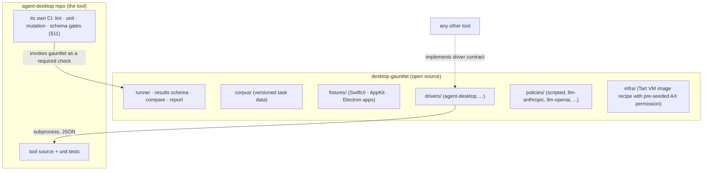
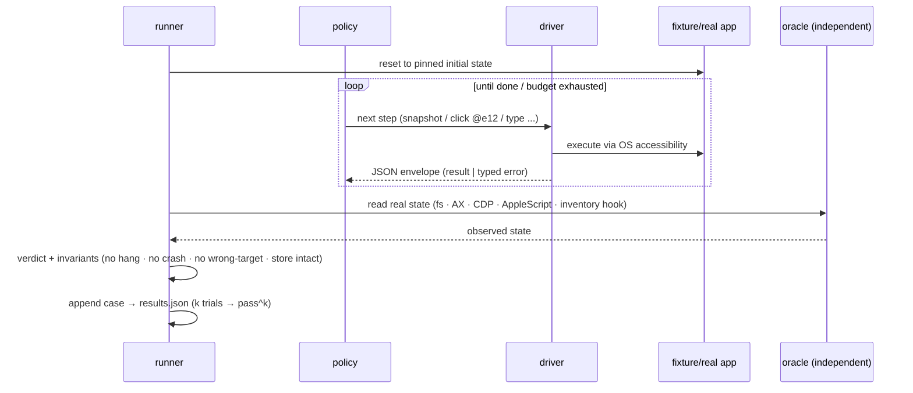

# Gauntlet: An Open Evaluation Framework for Desktop Automation Tools

**Status:** Proposed (v2 — restructured: standalone open-source framework; agent-desktop is the first driver)
**Repo:** `desktop-gauntlet` (separate repository, working name)
**First platform pack:** macOS · Windows/Linux packs follow the same contracts
**Author:** Lahfir · **Date:** 2026-07-10

---

## 1. What this is, in one page

Gauntlet is a benchmark-and-evaluation harness for desktop automation tools — the
CLIs/servers that let agents observe and control real applications. It is **not**
tied to agent-desktop: it defines a small driver contract, ships its own fixture
apps and task corpus, and scores any tool that implements the contract.
agent-desktop is the first driver and the reason it exists.

The whole framework is one machine with three slots:

```
  TASK        ×   POLICY            ×   DRIVER
  what to do      who decides steps     which tool executes
  (corpus)        (script | real LLM)   (agent-desktop vX | other CLI)
        │
        ▼
  runner executes task → policy → driver → real app
        │
        ▼
  VERIFIER reads real state (files, AX tree, DOM) — never the tool's own ok:true
        │
        ▼
  results.json → compare → scoreboard
```

Fix two slots, vary the third:

| Vary | Question answered | Product |
|---|---|---|
| driver **version** (scripted policy) | did v0.4.8 regress vs v0.4.7? | tool reliability + regression engine |
| **policy** (model) | which LLM drives the tool best, at what cost, how consistently? | computer-use benchmark |
| **tool** | agent-desktop vs any other automation CLI | open leaderboard |

```mermaid
flowchart LR
    subgraph corpus["Task corpus (versioned data)"]
        C1[conformance cases]
        C2[grounding triples]
        C3[multi-step scenarios]
        C4[chaos scripts]
    end
    subgraph runner["gauntlet runner"]
        P["policy\n(scripted | llm:claude | llm:gpt | ...)"]
        D["driver\n(tool under test)"]
        P --> D
    end
    corpus --> runner
    D -->|CLI subprocess| T["desktop tool\n(agent-desktop vX, ...)"]
    T -->|OS accessibility| A["fixture apps + real apps"]
    A -.->|independent read| O["oracles\nfs · AX · CDP · inventory"]
    O --> V{verifier}
    V --> R[(results.json)]
    R --> CMP["gauntlet compare (A vs B)"]
    R --> REP["scoreboard / release report"]
```



**What Gauntlet is NOT responsible for:** the tool's own repo hygiene. Lint rules,
file-size limits, unit-test runners, mutation testing, JSON-schema snapshot gates —
those live in each tool's own CI (agent-desktop's are listed in §11 as a companion
work stream, because they matter, but they are not the framework). Gauntlet only
measures what it can observe through a tool's public surface. It also never uses
LLM judges for scoring (every mature benchmark that started with them ripped them
out) and never uses pixel-diff assertions (accessibility is the contract;
screenshots are evidence, not oracles).

---

## 2. Why (the problem, from the agent-desktop trenches)

- agent-desktop's merge gates run ~1,700 mock-based unit tests. Its excellent
  fail-closed e2e suite requires macOS Accessibility permission, which CI runners
  don't have — so **zero real-AX tests gate a merge**. Three total-breakage
  regressions shipped green because of exactly this
  (`docs/solutions/real-app-tests-are-the-platform-adapter-gate.md`).
- Two independent audits couldn't agree which commands have e2e coverage (~31 vs
  ~35 of 58) — coverage isn't tracked mechanically.
- One latency assertion exists in the whole system; rich per-phase timing is
  emitted to traces but never aggregated or gated.
- No flake accounting, no repeated-trial scoring, no multi-step task corpus, no
  general cross-version comparison.

Generalize the pain: **every desktop automation tool has this problem** — mocks
lie, real-AX CI is hard (permissions), and there is no shared benchmark for
"is this tool reliable enough for an agent to depend on." That's the gap Gauntlet
fills, and why it's worth open-sourcing rather than burying in one repo's tests.

---

## 3. Repo split



- `desktop-gauntlet` owns everything reusable: runner, schemas, corpus, fixtures,
  drivers, policies, the VM/permission recipe, the leaderboard.
- `agent-desktop` keeps its own repo CI and its local e2e acceptance suite (which
  seeded many of Gauntlet's ideas), and adds one thin CI job: *run Gauntlet's
  macOS pack against the freshly built binary; fail the PR on gate breaches.*
- Fixtures: the existing `AgentDeskFixture` SwiftUI app migrates into
  `desktop-gauntlet/fixtures/swiftui/` (it was designed tool-agnostically —
  "never tuned to make a command pass" — which is exactly a benchmark fixture).

---

## 4. The components

### 4.1 Driver contract

A driver adapts one tool to three verbs. For CLI tools it's a manifest plus a
subprocess convention (no linking required — any language works):

```yaml
# drivers/agent-desktop/driver.yaml
tool: agent-desktop
binary: ${GAUNTLET_TOOL_BINARY}
capabilities: [snapshot, click, type, scroll, drag, clipboard, windows, wait, batch]
verbs:
  snapshot: ["snapshot", "--app", "{app}", "-i"]          # → JSON on stdout
  act:      ["{action}", "{ref}", "--snapshot", "{snap}"] # → JSON envelope
  probe:    ["get", "{ref}", "--property", "{prop}"]      # tool-side reads (weak oracle)
contract:
  error_codes: [STALE_REF, AMBIGUOUS_TARGET, TIMEOUT, PERM_DENIED, ...]
  envelope: json                                           # every response parseable
```

The runner treats drivers as untrusted subprocesses: private hashed binary copy,
isolated HOME/state dir, own process group, absolute watchdog timeout, bounded
output capture — inherited from agent-desktop's `run.sh` harness-integrity work.
A tool without some capability skips those cases (recorded as `unsupported`, which
is itself a scoreboard column — coverage of the action vocabulary is a comparison
axis between tools).

### 4.2 Policies (who decides the next step)

- **`scripted`** — deterministic step lists from the corpus. No model anywhere.
  This is the *only* policy used for reliability gates and version comparison.
- **`llm:<provider/model>`** — a real model (Claude, GPT, Gemini, local) receives
  the task instruction and drives the tool through the driver, exactly like a
  production agent would. Used for the computer-use benchmark tier: same tasks,
  same tool, different models — or same model, two tool versions ("did the new
  snapshot format make the model better at the task?"). Results carry cost,
  tokens, steps, wall time, and pass^k, HAL-style (cost and consistency are
  first-class columns, accuracy alone is a vanity metric).
- **`adversarial`** — a scripted policy that deliberately misuses the tool (stale
  refs, cross-namespace refs, malformed batches, rapid-fire duplicates, concurrent
  sessions). The contract under abuse: typed error from the documented set,
  parseable envelope, no state corruption, bounded exit. This is "any model can
  use it" made testable: the contract must hold even for the worst caller.

Verification is identical for all policies — the verifier never knows or cares who
decided the steps.

### 4.3 One case, end to end



Oracles come in two strengths, stated honestly: **strong** oracles bypass the tool
entirely (file system, AppleScript app state, CDP DOM/AX, fixture inventory hook);
**weak** oracles read UI state through the tool itself but against an element
disjoint from the action target. Scenario verifiers prefer strong oracles; weak
ones are allowed for effect checks and are cross-audited by the fidelity suite.
When a verifier is found wrong, we fix the verifier and keep the task (score
continuity — the OSWorld-Verified rule), and we log every verifier change with its
measured false-negative impact (the WebArena-Verified meta-metric: they found
broken checkers in 299/812 tasks; auditing your own verifiers is not optional).

### 4.4 Fixture apps (ground truth you own)

Real third-party apps update themselves; fixtures don't — they're the
deterministic core, and each one **exports its own ground truth** so snapshots can
be scored for completeness (recall/precision), not just spot-checked.

- **SwiftUI** (exists — migrated): buttons/toggles/sliders/pickers, ambiguous
  twins, zero-bounds controls, delayed-enable, duplicate-titled windows, sheets/
  popovers/menus, drag canvas, removable rows. Added: an animated control
  (stability gate), a churn card (timed subtree mutations at configurable Hz), a
  static `inventory.json` manifest.
- **AppKit-classic** (new, small): NSTableView/NSOutlineView/NSToolbar/NSAlert —
  what Finder-class apps are actually made of.
- **Electron** (new — the dense-tree gauntlet): eight pages, each aimed at a
  researched failure mode — parameterized dense grid (1k–20k DOM nodes),
  virtualized list **with a non-virtualized twin of the same data** (off-viewport
  rows are structurally *absent* from every AX channel, so single-snapshot
  "completeness" claims are only honest against the rendered inventory; full-data
  completeness is a scroll-loop scenario), AG Grid with virtualization toggle,
  Monaco (10k lines, accessibility mode on/off — two different code paths), canvas
  regions (with/without fallback DOM — must report "no actionable children," not
  junk), nested cross-origin iframes (tree-stitching races), a live-region ticker
  (5–20 Hz churn), and a frameless custom-chrome window. Every page ships
  `window.__gauntletInventory__` and exposes CDP for oracle reads.
- **Real-app pack** (nightly, informational): Finder, TextEdit, System Settings,
  Safari, Chrome, VS Code, Slack — because hostile, non-conformant AX trees only
  exist in the wild (UFO2 attributed 62% of its failures to control detection on
  exactly such apps).

### 4.5 Results schema and comparison

Every run, any tier, any policy, emits one `gauntlet-result/v1` JSON: binary
identity (sha256/version/git), host class, **pinned corpus version**, per-case
attempts with wall time, phase spans (resolve/preflight/dispatch/verify), error
codes, outcome (`pass|fail|flaky|quarantined|unsupported`), invariant violations,
and aggregate metrics. Schema rules: additive-only evolution, hard version pinning
(a score is meaningless without the exact corpus that produced it —
terminal-bench's rule), committed JSON Schema.

`gauntlet compare a.json b.json` → per-case outcome transitions, metric deltas
with noise margins, phase-span deltas ("resolve p95 +40% on dense trees" is one
line). `gauntlet run --binary A --binary B` runs balanced AB/BA pairs against one
pinned app state — the methodology already proven in agent-desktop's
`electron-live.sh` (interleaved ordering, separate HOMEs, immutable hashes, state
gate before/after every pair, paired diffs), promoted from one operation to the
whole corpus.

**Metric definitions (fixed):**
- `pass^k` — per case, n trials, c successes: `C(c,k)/C(n,k)` (tau-bench's
  estimator). The metric that exposes "works once, fails on retry" — models drop
  from ~50% pass@1 to ~25% pass^8; a *tool* must hold ≥0.99 pass^5 on scenarios
  and 1.0 on conformance.
- `flake_rate` — fail-then-pass is recorded `flaky` forever (Playwright/nextest
  semantics); trailing budget <0.5%, breach → quarantine lane (cases keep running
  and reporting, gate nothing, carry an issue URL, expire after 4 weeks).
- **Zero-tolerance invariants** — wrong-target actions (effect landed on an
  element other than the addressed one — fixtures make this observable), crashes,
  watchdog hangs, state-store corruption, secrets in traces: any occurrence fails
  the run outright.
- `determinism_rate` — identical fixture state, two headless snapshots → identical
  normalized tree and ref assignment. Must be 1.0.
- Fidelity — recall (oracle-interactive elements present with refs — a miss means
  an agent literally cannot act), precision, hierarchy edge-F1, attribute accuracy
  (role/name/value/bounds). Goes beyond Screen2AX's structure-only F1.
- Latency — nearest-rank p50/p95 per command × fixture class × mode; plus token
  economy (snapshot bytes / est. tokens per fixture class — an agent-facing cost).
- `stale_recovery_rate` — churn → STALE_REF → re-snapshot+retry succeeds ≤1 cycle.

---

## 5. The six suites

| Suite | Question | Gates? |
|---|---|---|
| **Conformance** | does every documented command do exactly what it claims, under actionability rules, with typed errors — on real AX? | yes — 100%, per-PR (smoke) / merge (full) |
| **Fidelity** | is the snapshot complete and correct vs ground truth? | yes on fixtures (recall = 1.0); informational on real apps |
| **Grounding** | given a description, does the tool resolve the *right* element — or correctly refuse? | yes |
| **Scenarios** | do multi-step, real-workflow tasks succeed repeatedly (pass^k)? | nightly gate |
| **Chaos** | under perturbation, does it degrade into typed errors — never hangs/crashes/wrong clicks? | nightly gate, zero-tolerance invariants |
| **Performance** | latency/scaling/cost curves, version over version | thresholds vs pinned baselines |

Condensed specs (full case inventories live in the corpus itself):

- **Conformance** — per command × fixture pattern × headless/headed: effect
  verified by observation exactly-once; per-check actionability cases (disabled →
  typed timeout with last-report; moving → held until stable; occluded → occluder
  named); an error-taxonomy case per documented code; determinism and recovery
  cases. Generalizes agent-desktop's AE1–AE7 to the whole surface. A mechanical
  coverage matrix (command × fixture × mode) is a committed artifact; empty rows
  fail. Chromium-specific contract: correct AX enablement (`AXManualAccessibility`
  for Electron), full-tree mode confirmed, post-mutation settle honored, and the
  notification-incompleteness rule (Chromium's macOS AX event map is explicitly
  incomplete — a node deleted with no notification must still vanish from the next
  snapshot; incremental invalidation may only ever be an optimization over full
  re-traversal).
- **Grounding** — ~150 labeled triples to start (every fixture control + surface
  elements), scored exact-match, including must-refuse rows (AMBIGUOUS_TARGET on
  twins; not-found on absent). ScreenSpot's design, plus the refusal classes it
  lacks.
- **Scenarios** — 30–40 declarative YAML tasks v1 (fixture flows, TextEdit
  save-to-disk with fs oracle, Finder folder ops, Settings toggle with `defaults
  read` oracle, Electron form-fill with DOM oracle, clipboard round-trips,
  notification post+dismiss). Scripted policy for gates; the same files run under
  LLM policies for the benchmark tier.
- **Chaos** — injectors: window-move mid-action, focus steal, occluder appears,
  element removed between preflight and dispatch, app SIGSTOP (→ typed
  APP_UNRESPONSIVE, never a hang), app SIGKILL, 20 Hz churn storm, dense-tree
  pressure, permission revoked mid-run, store fault injection, concurrent
  invocations racing one app.
- **Performance** — dense scaling curves (the curve is the artifact — slope
  regressions get caught even when small-N points pass); per-command wall-clock on
  real Macs (hyperfine methodology: warmups, no shell, JSON export); phase-span
  attribution from driver `--profile` output where the tool provides it; strategy
  matrix — when a tool exposes alternative strategies behind flags, Gauntlet runs
  the corpus per variant and ranks them. That's the "find the faster method"
  requirement: land alternatives behind flags, let the harness pick the winner,
  then make it the default. Calibration note: VoiceOver itself stalls 40–60s on
  Gmail-class pages — dense-tree budgets are set from measured baselines, not
  vibes. (Deterministic instruction-count gating of a tool's platform-independent
  core is a *tool-repo* concern, §11 — Valgrind doesn't run on macOS.)

---

## 6. Infrastructure: real AX permission in CI

The blocker that keeps every tool's real tests local is macOS TCC (Accessibility
permission cannot be granted non-interactively through any supported API). The
production-proven answer, shipped as `infra/` in the framework repo:

- **Tart golden VM image** — build on Cirrus Labs' own published recipe (their
  production image pipeline scripts a SIP-disable inside the VM via recovery-mode
  automation, then seeds `TCC.db` directly, then snapshots; now free after the
  OpenAI relicense). Gauntlet's image adds a TCC row for a **fixed staging path**
  (`/opt/gauntlet/bin/<tool>` — path-keyed grants survive binary changes) plus the
  fixture apps. `tart clone` per CI job = clean state + permission, in seconds, on
  any Apple-Silicon self-hosted box.
- Fallbacks, documented in order of decreasing solidity: persistent self-hosted
  Mac / EC2 Mac dedicated host with a one-time manual grant; the user-level
  `TCC.db` sqlite insert on GitHub-hosted runners (works as of 2026-04, unofficial
  and revocable — stopgap only).

Suggested cadence for a tool consuming Gauntlet (agent-desktop's plan):

| Lane | When | What |
|---|---|---|
| PR (required) | every push | conformance smoke (headless, ~⅓ cases, 1 trial) on a Tart clone — ≤10 min |
| PR (label) | `gauntlet-full` | full conformance + fidelity + grounding |
| merge | main | full conformance both modes + scenarios (2 trials) + perf representative set |
| nightly | cron | scenarios pass^5 + chaos + perf curves + real-app pack + LLM-policy probe |
| release | tag | everything, macOS N/N-1 matrix + published reliability report |

---

## 7. Meta-evaluation: proving the framework catches bugs

A framework that can't catch known bugs has no business gating anything.

- **Seeded-defect corpus** (mechanism generic, seeds per tool): `gauntlet
  seed-defects` reverts a known-bug fix in a worktree, rebuilds, runs the mapped
  suite, and asserts Gauntlet **fails**. agent-desktop's seeds come from its own
  history — the mock-concealed regressions, the window-id fix, accessible-name
  unification, the Instant-overflow panic. Detection rate is tracked per release;
  target 100%. Every new production bug adds a seed before its fix merges.
- **Verifier audit log** — every verifier change records measured false-negative/
  false-positive impact, published in the release report.

---

## 8. The open-source products

1. **The conformance suite** — WPT-for-desktop-automation: any tool implements the
   driver contract and self-certifies against the pinned corpus.
2. **The computer-use benchmark** — LLM policies × scenario corpus, with cost,
   steps, and pass^k as first-class columns; results reproducible from the
   results.json + pinned corpus + model version.
3. **The leaderboard** — terminal-bench mechanics: submissions are PRs of raw
   per-trial results, a bot validates schema/structure, a human merges; every row
   hard-pinned to corpus + tool + model versions. No self-reported unverifiable
   numbers.
4. **The reliability report** — regenerated per release of a tool: case counts,
   pass^k, flake trend, chaos survival, fidelity, perf deltas, seeded-defect
   detection rate. (Playwright publishes no numbers and has no perf CI at all —
   this artifact is the differentiator.)

---

## 9. Build plan (honest sizing — this is phased work, not one PR)

| Phase | Deliverable | Rough effort |
|---|---|---|
| **P0 — Scaffold** | `desktop-gauntlet` repo: runner skeleton, driver contract + agent-desktop driver, results schema + compare, SwiftUI fixture migrated, ~20 conformance cases running locally | 1–2 weeks |
| **P1 — Reality gate** | Tart image + self-hosted runner; agent-desktop PR lane goes required; conformance corpus covers all 58 commands; coverage matrix + failure bundles | 1–2 weeks |
| **P2 — Chromium depth** | Electron fixture (8 pages), fidelity suite with triangulated oracles (inventory + CDP + ariaSnapshot), dense perf curves, grounding corpus | ~2 weeks |
| **P3 — Brutality** | Scenario corpus (30–40 tasks), chaos injectors + invariant watchdog, adversarial policy, pass^k nightly, seeded-defect corpus, flake dashboard (a DuckDB file + static HTML — no SaaS) | ~2 weeks |
| **P4 — Publish** | LLM policies (Anthropic/OpenAI/local), leaderboard bot, docs site, first public reliability report, Windows/Linux pack scaffolds | 2+ weeks, ongoing |

Each phase ships value on its own; P1 alone kills the "merged green, broke real
apps" failure mode. Phases get their own implementation specs when started — this
document is the architecture, not the work items.

**Companion stream (agent-desktop repo, independent, days not weeks):** §11.

---

## 10. What Gauntlet deliberately excludes

- LLM judges in any gating tier (non-deterministic; the failure mode every
  "Verified" benchmark overhaul existed to remove).
- Pixel-diff assertions (AX is the contract; screenshots are evidence).
- The tool's internal test infrastructure (unit tests, mutation, lint — §11).
- Hosting third-party model leaderboards before the tool-reliability core is
  credible (products in §8 ship in order).

---

## 11. Companion stream: agent-desktop's own CI hardening (NOT the framework)

These came out of the same research and are worth doing regardless of Gauntlet —
but they are agent-desktop repo concerns, listed here so they don't get lost and
don't get confused with the framework again:

- **JSON envelope schema gate** — schemars-derived schema for the envelope + all
  58 payloads, committed, insta-snapshot-gated; golden fixtures validated against
  it (`jsonschema` crate). Additive-only evolution (Stripe/Zalando rules).
- **Mutation testing** — `cargo-mutants --in-diff` per PR (cost scales with the
  diff); sharded full sweeps weekly. Directly quantifies "tests pass but catch
  nothing" (~61k non-test LOC ⇒ full runs are hours; shard them).
- **nextest** as unit runner — process-per-test isolation for the AX/FFI blast
  radius; `flaky-result="fail"` in PR profile.
- **proptest-state-machine** ref-model suite — `@ref → (pid, role, path,
  stable_text, bounds_hash)` transitions asserting strict re-identification
  semantics (the icechunk pattern).
- **`--profile` flag** — surface the already-collected `query_stats`/phase spans
  in the response envelope; Gauntlet's phase attribution consumes it.
- **Doc-drift fixes** — CLAUDE.md's false CI claim, the four dead
  `AGENT_DESKTOP_*_TIMEOUT_MS` env knobs, the stale fixtures README.
- Existing gates (400-LOC, clippy, core-isolation, binary size, FFI drift/panic)
  stay exactly where they are: repo CI.

---

## 12. Decision log (research verdicts, framework-relevant)

| Decision | Verdict | Basis |
|---|---|---|
| Execution-based verifiers only; no LLM judges | ADOPT | OSWorld-Verified, WebArena-Verified (299/812 broken checkers fixed via backend state), AndroidWorld |
| Fix evaluators not tasks; semver-pinned corpus | ADOPT | OSWorld-Verified score continuity; terminal-bench pinning |
| pass^k (hypergeometric) + pass@1 | ADOPT | tau-bench; computer-use reliability follow-ups |
| Flaky as first-class outcome; quarantine with issue URLs | ADOPT | Playwright outcome semantics + fixme convention |
| Fixture self-inventory + CDP + ariaSnapshot oracle triangulation | ADOPT | each channel's blind spots documented; CDP tree is an unpruned superset; virtualized rows absent from all AX channels |
| Fidelity = recall/precision + edge-F1 + attributes | ADOPT (extended) | Screen2AX is structure-only |
| Balanced AB/BA paired comparison | ADOPT | agent-desktop `electron-live.sh` methodology |
| Tart golden image for TCC | ADOPT | Cirrus Labs' production recipe; free post-relicense |
| Hosted-runner TCC.db hack | STOPGAP | works 2026-04; unofficial, revocable |
| Cost/steps/consistency as first-class model-benchmark columns | ADOPT | HAL; "AI Agents That Matter" cost-controlled evaluation |
| PR-based leaderboard with bot validation | ADOPT | terminal-bench |
| Zero perf story in Playwright ⇒ perf tier is our differentiator | ADOPT | verified: no benchmark code/CI in microsoft/playwright |

## 13. Source index (primary sources)

Playwright: playwright.dev docs (actionability, writing-tests, test-retries,
aria-snapshots, trace-viewer); microsoft/playwright source (injectedScript.ts,
dom.ts/frames.ts/progress.ts, packages/trace/src, tests/, workflows incl.
fix-flakes.yml, browser_patches). Benchmarks: OSWorld arXiv:2404.07972 +
OSWorld-Verified (xlang.ai); WindowsAgentArena arXiv:2409.08264; macOSWorld
arXiv:2506.04135; AndroidWorld arXiv:2405.14573; WebArena + evaluators.py +
WebArena-Verified (OpenReview); VisualWebArena arXiv:2401.13649; UFO2
arXiv:2504.14603; τ-bench arXiv:2406.12045 + τ²-bench arXiv:2506.07982 (pass^k
estimator, code-verified); terminal-bench/Harbor arXiv:2601.11868; ScreenSpot
family (arXiv:2401.10935, 2410.23218, 2504.07981); Screen2AX arXiv:2507.16704;
HAL arXiv:2510.11977; "AI Agents That Matter" arXiv:2407.01502; computer-use
reliability arXiv:2604.17849. Chromium/macOS AX: chromium.googlesource.com
accessibility docs (overview, how-a11y-works, offscreen, performance),
ax_platform_node_mac.mm event map, Electron a11y docs, CDP Accessibility domain,
WebKit AXIsolatedTree, VoiceOver perf threads, Lighthouse DOM-size guidance.
Tooling: mutants.rs, nexte.st, insta.rs, schemars/jsonschema, gungraun, hyperfine
source, criterion FAQ, rustc-perf, ripgrep tests/, git t/README + chainlint,
cargo-test-support. CI/TCC: actions/runner-images issues #1567/#3286/#8162/#8214/
#9529, fopina/pyautogui-next#20, Apple PPPC guide, tccutil man page,
cirruslabs/macos-image-templates (disable-sip.pkr.hcl, update-tcc-database.sh,
monthly.yml), openai/tart discussion #1171, Veertu Anka docs, AWS EC2 Mac docs.
