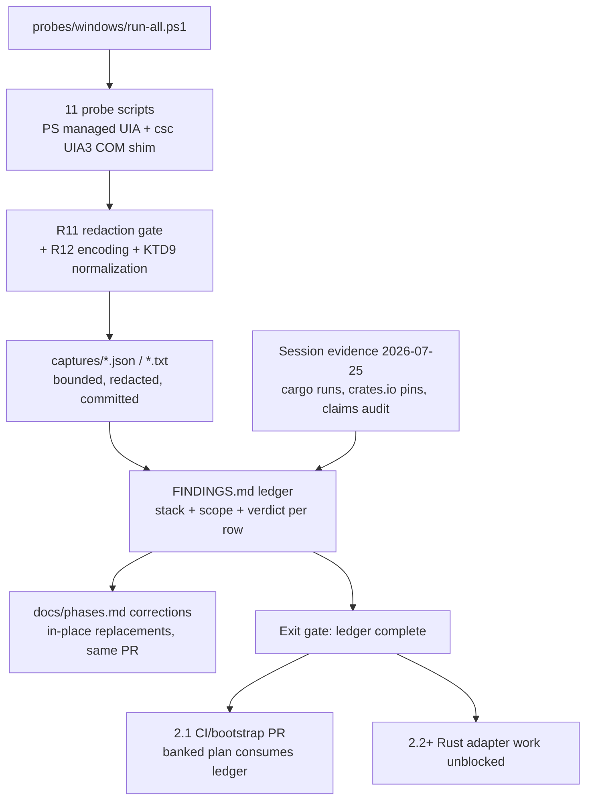

# Windows Platform Exploration Probe Corpus (Sub-phase 2.0) - Plan

## Goal Capsule

- **Objective:** Land Phase 2's first PR on the new `feat/windows-adapter` integration branch: the `probes/windows/` raw-script evidence corpus, its redacted captured outputs, and the `FINDINGS.md` ledger — plus the already-written `docs/phases.md` corrections and the `CONCEPTS.md` vocabulary additions — so every Windows assumption the product carries is either proven or replaced before any Rust adapter code (2.2+) starts.
- **Authority hierarchy:** `docs/phases.md` §Phase 2 sub-phase 2.0 (as corrected in this PR) > this plan > implementer judgment. The user directives recorded as session-settled Key Decisions below are product law for this PR.
- **Stop conditions:** Do not write or modify Rust source (`crates/`, `src/`) — the hardening this evidence informs is 2.1's from-scratch work. Do not add workspace dependencies, and never reintroduce `windows-sys` to `crates/core`: when hardened Windows I/O returns it lives behind `PlatformAdapter` or in `agent-desktop-windows`, on a lane that executes it. Do not create CI workflows or register runners. Do not probe or automate windows belonging to the live session other than scratch windows the probes themselves launch. Do not add a second probe environment — single-environment policy (KTD2). If a probe reveals evidence that contradicts a settled decision in this plan, stop and surface it instead of improvising.
- **Execution profile:** One PR containing `probes/windows/`, the `docs/phases.md` corrections, `CONCEPTS.md`, a `.gitignore` negation pair, and this plan. Target ≤2,000 changed lines counting probe scripts, scratch apps, and the ledger; captures, this plan document, and the `docs/phases.md` correction hunks are excluded from that count, mirroring the Platform Delivery Model's own carve-out for generated and fixed-size content. Conventional Commits.
- **Tail ownership:** The implementer opens the PR against `feat/windows-adapter` and reports ledger completeness; sub-phase 2.1 (plan banked separately) consumes the ledger next.

---

## Product Contract

### Summary

Build the committed, re-runnable `probes/windows/` script corpus and `FINDINGS.md` ledger that phases.md §2.0 defines, execute it on the dev VM (Windows Server 2019, build 17763, interactive console), fold in the verification evidence already produced on 2026-07-25 (crate-pin truth, claims audit, first-ever cargo/clippy/test/UIA runs on Windows), and ship the surgical phases.md corrections in the same PR. This PR is the gate that unblocks 2.2+.

### Problem Frame

Phase 2's Windows sections in `docs/phases.md` were authored from documentation research in 2026-04, and verification on 2026-07-25 proved parts of it wrong: a pinned crate version that was never published (`windows-capture 1.5.4`), Chromium accessibility guidance inverted by Chrome 138's native-UIA default, a Win11 tray window class that changed in 22H2, a stale ARM64-runner deferral, and a Windows 10 floor with no end-of-support qualifier. Windows private-file hardening is 2.1 from-scratch work behind the adapter boundary and must be built against probe evidence, not API assumptions — hence §2.0's eleventh evidence area.

The roadmap's own rule — platform reality outranks documentation, contradictions amend the source of truth in the same PR — has never yet been exercised for Windows. Sub-phase 2.0 exists to run exactly that loop, with committed scripts and captured outputs as the proof, before any adapter code is written against assumptions.

### Requirements

Probe corpus:

- R1. `probes/windows/` contains runnable, parameter-free scripts covering all eleven §2.0 evidence areas: (1) full-tree dumps with every property read per node, (2) pattern-availability census per ControlType, (3) every interaction exercised raw, (4) SendInput synthesis experiments, (5) `ElementFromPoint` hit-testing including occluded and zero-size targets, (6) `CacheRequest` batched reads timed against per-property reads, (7) AutomationId coverage and identity-stability census, (8) event-handler observations (which UIA events fire, ordering, MTA threading), (9) elevation/UIPI behavior across an integrity boundary, (10) session and DPI/multi-monitor bounds behavior, (11) private-file I/O primitives — the four questions 2.1's from-scratch hardening depends on (R13).
- R13. The private-file I/O probes answer, against the real OS with committed evidence: whether atomic rename over a concurrently-open handle requires `FILE_SHARE_DELETE`; whether a process running elevated owns newly created objects as `TokenOwner` (e.g. `BUILTIN\Administrators`) rather than `TokenUser`; whether `GetFileInformationByHandleEx(FileRemoteProtocolInfo)` reliably distinguishes local from remote volumes (it did not — it failed closed on plain local NTFS, which is what broke `status`); and what an ancestor-vs-leaf ACL validation contract needs to reach parity with, or deliberately diverge from, the unix leaf-only rule. Each answer is a ledger row 2.1 implements against.
- R2. Tree-dump targets are classic Win32 Notepad, Explorer, Settings (`SystemSettings.exe`), and Obsidian (the Electron target — already installed at `%LOCALAPPDATA%\Programs\Obsidian\Obsidian.exe`, version recorded in the ledger). Captures name which Notepad variant they were taken against (classic Win32 here; the Store/MSIX RichEdit Notepad is the Win11-client variant per corrected phases.md).
- R3. Each script writes its captured output (JSON or text, bounded samples — no screenshots, no binaries) through the R11 redaction gate under `probes/windows/captures/`, committed beside the script.
- R4. Scripts use only what the VM ships: PowerShell 5.1 + .NET Framework 4.8 managed UIA (`System.Windows.Automation`) for breadth, and `csc.exe`-compiled C# shims for UIA3 COM specifics (`IUIAutomation`, `CacheRequest`, `ControlViewWalker`, event handlers, UIA3-only patterns) — the interface family the Rust `uiautomation` crate actually wraps. The in-box compiler is the pre-Roslyn .NET Framework 4.8 `csc.exe` (verified 4.8.3761.0), capped at C# 5: no string interpolation, null-conditionals, or expression-bodied members in shim, scratch, or `Add-Type` sources. No new toolchains, no Rust.

Evidence hygiene:

- R11. A redaction gate runs before any capture is written: the operator's username, machine name, account SID sub-authorities, and user-profile paths are replaced with stable placeholders, and `Name` values on document/content nodes (Explorer file listings, Obsidian note titles and vault paths, Settings account rows) are reduced to a `<redacted:N chars>` shape while ControlType, AutomationId, ClassName, bounds, patterns, states, and application-chrome names stay verbatim. This mirrors the key-based redaction the product already applies in `crates/core/src/trace_sanitize.rs` and the repo convention in `docs/solutions/conventions/keep-raw-arguments-out-of-trace-reachable-error-messages.md`. `run-all.ps1` re-asserts the gate before exiting.
- R12. Probe sources are saved UTF-8 with BOM (Windows PowerShell 5.1 parses BOM-less files as ANSI, and this VM's ACP is 1252 — non-ASCII literals corrupt before they are typed); captures are written BOM-less UTF-8 through a `common.ps1` helper, never bare `Out-File` (5.1's default is UTF-16LE, which git treats as binary and renders the committed evidence unreviewable). Non-ASCII input payloads are constructed with `[char]::ConvertFromUtf32` so payload integrity does not depend on source encoding.

Findings ledger:

- R5. `probes/windows/FINDINGS.md` maps every experiment to observed behavior and a doc-alignment verdict — CONFIRMS / CONTRADICTS / NEW-EDGE / DEFERRED — with a phases.md action per row; zero rows left "unknown" across the eleven areas. DEFERRED is reserved for facets this single environment provably cannot produce (KTD3) and requires a named closure point.
- R6. The ledger also records this session's already-executed evidence as first-class rows with their re-run commands: crate-pin verification (crates.io, 2026-07-25), the Windows-claims audit verdicts (C1–C14), and the current Windows baseline re-measured on merged main (test counts, `status` and `snapshot` envelopes, release binary size against the 15 MB cap).

Source-of-truth sync:

- R7. Every CONTRADICTS row is backed by a `docs/phases.md` replacement in this PR. The replacement set is already written in the working tree; its authoritative unit of count is a `git diff -U0` hunk against `main`, and U9 reconciles the measured hunk count against the ledger's edit index (each hunk maps to ≥1 backing row, each CONTRADICTS row maps to ≥1 hunk).
- R8. Replacements state the correct fact in place — no amendment annotations, no new sections, no bloat.

Mechanics:

- R9. `feat/windows-adapter` is created from current `main` and this PR targets it; existing CI (`fmt`, `msrv`, `platform-check`, `test`) stays green — this PR adds no Rust, no workflows, no shell scripts that CI lints.
- R10. On merge, the §2.0 exit gate is satisfied and 2.2+ is unblocked; sub-phase 2.1 consumes the ledger next (its plan is banked from this session's research).

### Key Decisions

- Evidence before infrastructure: 2.0 is PR 1, before 2.1. (session-settled: user-directed — chosen over opening with the 2.1 CI/bootstrap PR: the product mandate is verified grounding first.) Governs R1, R10.
- phases.md is corrected by replacement, not annotated. (session-settled: user-directed — chosen over amendment notes/changelog prose: the source of truth must simply read true.) Governs R7, R8.
- Single probe environment; platforms stay windows/mac/linux. (session-settled: user-directed — chosen over a per-environment ledger matrix: the Win32/UIA/COM API surface probed here is forward-compatible from Server 2019/1809 to Windows 11 by Windows' compatibility contract.) Governs R5. Scope caveat: this holds for API-contract behavior, not for app/provider observations — KTD2 and KTD3 carry the boundary.
- Rust defects are recorded, not fixed, in this PR. (session-settled: user-directed — "only doing 2.0 right now"; fixes are 2.1's opening scope.) Governs R6.

### Scope Boundaries

- Out: any Rust change — Windows private-file hardening is 2.1's from-scratch work behind the adapter boundary (its plan is banked).
- Out: CI-lane extension, `.gitattributes`, runner registration, `WindowsAdapterSession`, COM/DPI bootstrap — 2.1.
- Out: shell/tray/notification live probing (Start menu, taskbar, tray flyouts) — §2.0 does not list them; they belong to 2.14, which ships inside Phase 2 before the 2.15 merge. The corrected phases.md already carries the documented Win11 facts (overflow class, Notification Center naming) those probes will confirm.
- Environment-limited, ledger-DEFERRED **within Phase 2** — each closes at a named Phase 2 sub-phase, never past the branch merge, per the no-convenience-deferral rule: `Windows.Graphics.Capture` behavior (build 17763 < 1903 — closes at **2.10** on `windows-latest`); multi-monitor and mixed-DPI bounds behavior (this VM has one display — closes at **2.4**, which owns `list_displays` and per-monitor `scale_factor`); RDP session-transition behavior (this VM runs on the physical console — closes at **2.1**'s runner registration); WinUI3/MSIX app-population behavior (absent from Server 2019 — closes at **2.12**'s fixture app). A DEFERRED row records the measured environmental fact and its owning sub-phase; it is never a silent gap and never leaves Phase 2.
- Deferred to follow-up work: 2.1 plan finalization from banked research (immediately after this PR); a `docs/solutions/` learning capturing Windows probe/evidence patterns once 2.0 lands.

---

## Planning Contract

### Key Technical Decisions

- KTD1. **Managed UIA for breadth, UIA3 COM shim for fidelity.** PowerShell + `System.Windows.Automation` drives tree dumps, interactions, and hit-testing (zero-install, proven headless in this session). Everything whose answer depends on the client stack the Rust adapter will actually use goes through the `csc.exe` shim against UIA3 COM: `CacheRequest` batching semantics and timing, `ControlViewWalker` behavior, event-handler registration/removal/ordering on an MTA thread, and **pattern availability** — the managed stack exposes 22 pattern classes and structurally cannot observe the UIA3-only set (`LegacyIAccessible`, `Drag`, `DropTarget`, `Annotation`, `Styles`, `TextChild`), so a managed census would silently record false absences for patterns the Rust adapter will see. Every ledger row states which stack produced it; managed rows that duplicate a COM-measured fact are labeled non-authoritative cross-checks.
- KTD2. **Single-environment evidence policy.** All rows execute on this VM (Server 2019 Datacenter 1809, build 17763.7434, Spanish locale, interactive console, built-in Administrator, single display). API-contract findings are valid product-wide by Win32 forward compatibility; app/provider findings are specific to this environment and these app versions. Three known deltas the corpus cannot close here, each with a closure point in Scope Boundaries: shell UI internals (2.14), `Windows.Graphics.Capture` (2.10), and the WinUI3/MSIX app population absent from Server 2019 (2.12's fixture). Win11's Explorer and Settings are WinUI reimplementations, so their tree-shape rows are app/provider-scoped by construction. The ledger's environment header records the exact machine facts so any future re-run diffs against a known baseline. No per-OS row matrix.
- KTD3. **Ledger schema.** One table per evidence area: `| id | script | stack | scope | phases.md expectation | observed | verdict | action |`. `stack` is `managed` or `uia3-com` (KTD1). `scope` is `api-contract` (product-wide under KTD2) or `app/provider` (environment- and app-version-specific) — downstream sub-phases read this column to know what generalizes. `verdict` is CONFIRMS / CONTRADICTS / NEW-EDGE / DEFERRED; a DEFERRED row records the measured environmental facts plus the named closure point and counts as complete, not unknown. Session-evidence rows (R6) use the same schema with the re-run command in the `script` column. A final summary section maps every phases.md diff hunk to its backing row.
- KTD4. **Obsidian is the Electron target** (session-settled: user-directed — chosen over installing VS Code: Obsidian is already installed and running on the probe VM, and phases.md names "one Electron app", not a specific one). Verified 2026-07-25: Obsidian 1.12.7 at `%LOCALAPPDATA%\Programs\Obsidian\Obsidian.exe`, top-level UIA `ClassName = Chrome_WidgetWin_1`, four processes with one windowed main process. Its bundled Chromium version decides whether the Chromium-138 auto-UIA finding applies directly or the probe measures pre-138 behavior — either outcome is a valid ledger row, but an **ungraded** row is required until the version is actually established (see Risks).
- KTD5. **Probe safety envelope, enforced not asserted.** Interaction, input-synthesis, and elevation probes act only on scratch windows the probe itself launched. Because `SendInput` injects into the desktop input queue and lands wherever foreground is — a guarantee the mechanism cannot make by intent alone — every injection asserts `GetForegroundWindow()`'s process id equals the scratch app's process id immediately before and immediately after; on mismatch the probe aborts and files the interference as a ledger row rather than re-injecting. The clipboard is snapshotted before and restored after any chord probe. Every spawned process (including the elevated one) is recorded by pid, terminated in a `finally` block, and confirmed terminated by re-reading the process list; `run-all.ps1` exits nonzero if any probe-spawned process survives.
- KTD6. **Capture discipline.** Tree dumps serialize to JSON with a per-node property record (ControlType id, name, AutomationId, ClassName, bounds, patterns, states), written through the R11 redaction gate. Files are truncated to bounded depth/size with the truncation noted in-file, so the PR stays reviewable and re-runs regenerate full data locally.
- KTD7. **phases.md verification, not re-derivation.** The corrections are already written in the working tree from this session's verified evidence; U9's job is to check each diff hunk against its ledger row and include them in the PR. If a probe outcome contradicts an applied correction, the correction is updated to the probe's truth — with one guard: a probe row may only outrank documentation when its `scope` is `api-contract` or its environment dependency is explicitly recorded, so an environment artifact (for example a UIPI observation taken without a real integrity boundary) can never launder itself into the product contract.
- KTD8. **The `run-all` harness is deterministic and fail-loud:** `run-all.ps1` executes every probe in order, aborts the run on a harness error, records a probe-level failure as a ledger row and continues, writes one summary line per script, and exits nonzero if any probe failed to produce its capture, if the redaction gate finds residue, or if a spawned process survived.
- KTD9. **Re-runnability is defined over normalized captures.** Captures necessarily embed run-varying values (pids, HWNDs, RuntimeIds, timings, bounds jitter), so `common.ps1` emits a normalized twin of each capture with those fields canonicalized, and `run-all.ps1 -Compare` diffs normalized twins. "Re-runnable" means the normalized diff is empty; a non-empty diff is real platform drift, which is exactly what a later re-runner needs to see.

### High-Level Technical Design



### Output Structure

```
probes/windows/
├── README.md                      # prerequisites, how to run, safety envelope, encoding rules
├── run-all.ps1                    # deterministic harness (KTD8) + -Compare mode (KTD9)
├── common.ps1                     # capture paths, redaction gate, UTF-8 writers, normalization, scratch-app lifecycle
├── FINDINGS.md                    # the ledger (KTD3) + environment header + phases.md hunk index
├── 00-environment.ps1             # OS/build/locale/session/integrity/DPI/tool inventory
├── 01-tree-dump.ps1               # full-tree dumps: Notepad, Explorer, Settings, Obsidian
├── 02-cache-timing.ps1            # managed CacheRequest timing cross-check (authoritative number is 08)
├── 03-pattern-census.ps1          # pattern availability per ControlType (drives the 08 shim, KTD1)
├── 04-automationid-census.ps1     # AutomationId coverage + identity stability across restart/mutation
├── 05-interactions.ps1            # invoke/toggle/value/select/expand/scroll/text/focus, raw
├── 06-input-synthesis.ps1         # SendInput keyboard/mouse + PostMessage WM_KEYDOWN control probe
├── 07-hittest.ps1                 # ElementFromPoint: occluded, zero-size, minimized targets
├── 08-uia3-com.cs                 # UIA3 COM shim: events/MTA, CacheRequest, ControlViewWalker, pattern census
├── 08-uia3-com.ps1                # csc build + run wrapper for the shim
├── 09-elevation-uipi.ps1          # Medium-IL probe process vs High-IL target: UIA reads vs SendInput block
├── 10-session-dpi.ps1             # session interactivity, DPI-aware vs unaware bounds delta, deferral rows
├── 11-electron-activation.ps1     # Obsidian tree with/without --force-renderer-accessibility (P2-O15/2.4)
├── 12-private-file-io.ps1         # share-mode rename, ownership under elevation, locality, DACL contract (2.1 evidence)
├── scratch/
│   ├── ScratchForms.cs            # WinForms scratch app with explicit AutomationIds (csc-built, C# 5)
│   ├── ScratchWpf.ps1             # WPF scratch window via PowerShell XAML with AutomationIds
│   └── PrivateFileProbe.cs        # Win32 file/ACL probe helper (csc-built, C# 5)
└── captures/                      # committed bounded, redacted outputs, one subdir per script
```

The tree is a scope declaration; per-unit `Files:` lists are authoritative.

---

## Implementation Units

### U1. Branch, opening commit, scaffolding, and probe harness

- **Goal:** `feat/windows-adapter` exists off current `main` with this session's already-written artifacts committed as its opening commit; `probes/windows/` skeleton, `README.md`, `common.ps1` (redaction gate, UTF-8 writers, normalization, scratch lifecycle), and `run-all.ps1` are in place.
- **Requirements:** R1, R4, R9, R11, R12.
- **Dependencies:** none.
- **Files:** `.gitignore`, `probes/windows/README.md`, `probes/windows/run-all.ps1`, `probes/windows/common.ps1`, `probes/windows/captures/.gitkeep`.
- **Approach:**
  1. Branch from `main`, then commit the existing working-tree artifacts (`docs/phases.md` corrections, `CONCEPTS.md` Platform Evidence vocabulary, this plan) as the branch's opening commit — they exist only as uncommitted state today and a reset would erase the correction set the plan cannot regenerate at hunk level.
  2. Add `!docs/plans/` and `!docs/plans/**` to `.gitignore`, mirroring the existing `!docs/solutions/` + `!docs/solutions/**` pair. Verified: `.gitignore:79` `docs/*` currently ignores `docs/plans/`, and `git ls-files docs/plans` returns zero — no plan document has ever been committed, including the Phase 1 plan `CLAUDE.md` cites as a reference. phases.md's own cross-cutting DoD expects evidence "committed alongside the sub-phase's plan doc under `docs/plans/`", so the ignore rule contradicts the stated contract.
  3. `common.ps1` owns: capture-path resolution, the R11 redaction gate every writer routes through, BOM-less UTF-8 capture writing via `[IO.File]::WriteAllText`, the KTD9 normalizer, scratch-app launch/teardown with pid tracking, the KTD5 foreground assertion helper, and a `Write-ProbeResult` summary contract.
  4. README documents the Electron-target prerequisite (Obsidian installed and running; version read at probe time), the safety envelope, the C# 5 ceiling, and the UTF-8-with-BOM source rule.
- **Test scenarios:**
  - `run-all.ps1` on a tree with only `00-environment.ps1` present runs it, writes its capture, prints one summary line, exits 0.
  - `run-all.ps1 -Compare` after deleting and regenerating a capture reports an empty normalized diff; hand-editing a normalized field makes it report the drift and exit nonzero.
  - A stub capture containing the operator's username and profile path is rejected by the redaction gate, and `run-all.ps1` exits nonzero naming the file.
  - A capture written with a non-ASCII element name round-trips through the writer as BOM-less UTF-8 and reads back identical.
  - A deliberately failing stub script makes `run-all.ps1` exit nonzero and name the failing probe.
- **Verification:** harness run clean on the VM; `git status` shows only `probes/windows/`, `docs/`, `CONCEPTS.md`, and `.gitignore` paths; `git check-ignore docs/plans/...` no longer matches.

### U2. Environment, session, and integrity probe

- **Goal:** `00-environment.ps1` captures the machine facts every ledger row inherits: OS build/edition/locale, session name and interactivity, account shape and **the session's own mandatory integrity level**, UAC policy state, default file-ownership behavior, display topology, and tool inventory.
- **Requirements:** R1(10), R3, R5, R11.
- **Dependencies:** U1.
- **Files:** `probes/windows/00-environment.ps1`, `probes/windows/captures/00-environment/*.json`.
- **Approach:** Registry (`CurrentBuild`/`UBR`/`ReleaseId`), `$env:SESSIONNAME`, `[Environment]::UserInteractive`, `query session`, display count and scale, tool inventory (csc version, .NET, GAC assemblies). Identity is recorded as a **shape, not a value**: authority prefix plus well-known RID tail (`S-1-5-21-<redacted>-500`), group memberships, machine and account names as placeholders — the 2.1 DACL work needs the group-ownership fact, not the machine-unique identifier. Integrity facts the U8 design depends on: process mandatory label SID, `EnableLUA`, `FilterAdministratorToken`. Default-ACL sample: create a temp file, record owner class (user vs Administrators group) and inherited ACE count. RDP behavior files a DEFERRED row naming 2.1's runner registration as the closure point.
- **Test scenarios:**
  - Capture contains build `17763`, `SESSIONNAME=Console`, `UserInteractive=True`, mandatory label `S-1-16-12288`, and a nonzero inherited-ACE count with group ownership on the temp-file sample (matching the 2026-07-25 session evidence).
  - Capture contains no raw SID sub-authorities, no machine name, and no account name — asserted by grep, not by inspection.
  - Re-run without configuration change produces an empty normalized diff.
- **Verification:** ledger environment header cites this capture; the DEFERRED RDP row carries its closure point.

### U3. Full-tree dumps and managed cache timing

- **Goal:** JSON tree dumps of classic Notepad, Explorer, Settings, and Obsidian with every §2.0-named property per node and **real geometry**, plus a managed batched-vs-per-property timing cross-check.
- **Requirements:** R1(1)(6), R2, R3, R11.
- **Dependencies:** U1.
- **Files:** `probes/windows/01-tree-dump.ps1`, `probes/windows/02-cache-timing.ps1`, captures under matching subdirs.
- **Approach:** Launch each target **restored but not activated** (`ShowWindow(SW_SHOWNOACTIVATE)` via a `common.ps1` helper, positioned on the visible desktop) — minimized windows report an empty `BoundingRectangle`, which would ship the whole geometry corpus degenerate for the 2.4/2.6 designs that consume it; the never-activate/no-focus-steal discipline is preserved. One deliberately minimized Notepad pass is retained as the empty-rect NEW-EDGE row. Settings is targeted by enumerating top-level `ApplicationFrameWindow` instances and selecting the one whose descendant `Windows.UI.Core.CoreWindow` belongs to the `SystemSettings.exe` pid — the UWP frame window belongs to `ApplicationFrameHost.exe`, so a bare pid match cannot find it and the localized-title fallback is forbidden by the locale rule; the frame-host pid split is itself a NEW-EDGE row feeding 2.4 app targeting. Walk with the managed control-view TreeWalker recording ControlType, Name, AutomationId, ClassName, BoundingRectangle, supported patterns, enabled/offscreen state; bounded depth with `children_count` at the cut. Timing probe is labeled a managed cross-check — the authoritative CacheRequest number comes from U7's COM shim (KTD1).
- **Test scenarios:**
  - Notepad dump shows the session-evidence quirk: editor exposes as `ControlType.Pane` (class `Edit`) — a NEW-EDGE row feeding 2.3's vocabulary map.
  - Restored-not-activated dumps carry non-empty bounds on ≥95% of nodes; the minimized control pass carries empty bounds — both recorded, and the node-count delta between them states whether launch policy affects tree completeness.
  - Settings dump succeeds via the frame-host resolution path with no localized-name matching anywhere in the script.
  - Explorer dump yields ≥20 nodes with non-empty ControlType on every node.
  - Obsidian dump row records ref-able node count at default depth (baseline for U8's activation diff and the P2-O15 depth-skip claims). The pre-measured managed-client baseline is 8 descendants — see the Electron activation pre-finding under Sources.
  - Focus evidence: `FocusedElement` identical before/after each dump.
- **Verification:** four committed redacted captures + timing table; ledger rows filed per target with `stack` and `scope` set.

### U4. Pattern census, AutomationId coverage, and identity stability

- **Goal:** Per-ControlType pattern-availability census measured on the UIA3 COM stack, an AutomationId coverage census across the four UI stacks, and the **identity-stability experiment 2.5's resolution design depends on**.
- **Requirements:** R1(2)(7), R3, R4, R11.
- **Dependencies:** U1, U3 (dump corpus), U7 (the shim's census mode).
- **Files:** `probes/windows/03-pattern-census.ps1`, `probes/windows/04-automationid-census.ps1`, `probes/windows/scratch/ScratchForms.cs`, `probes/windows/scratch/ScratchWpf.ps1`, captures under matching subdirs.
- **Approach:** The pattern census drives U7's shim in census mode so availability is measured on the stack the Rust adapter uses; the managed sweep runs alongside as a labeled non-authoritative cross-check, and the divergence (managed cannot see `LegacyIAccessible`, `Drag`, `DropTarget`, `Annotation`, `Styles`, `TextChild`) is itself a ledger row justifying KTD1. AutomationId census runs against Win32 (Notepad/Explorer), the csc-built WinForms scratch app (explicit `AutomationId` on every control — also the 2.12 fixture seed), the WPF scratch window, and Obsidian, reporting per-stack percentage of interactive elements carrying a non-empty AutomationId. **Identity stability:** dump the scratch apps and one real target, restart the app and mutate list content, re-dump, and diff `AutomationId` / `RuntimeId` / `Name` / `ClassName` / bounds per matched node — per-property survival rates are what 2.5 needs to choose the Windows `RefEntry` evidence set (the repo contract is pid, role, path, stable text identity, bounds hash); a coverage percentage alone answers none of it.
- **Test scenarios:**
  - WinForms scratch app reports 100% AutomationId coverage; Win32 Notepad reports the numeric-control-id style observed in session evidence (`AutomationId='15'`).
  - The COM census reports `LegacyIAccessible` availability on at least one legacy control; the managed cross-check reports it absent everywhere — the divergence row is filed rather than either result being taken as truth.
  - Matrix marks Invoke available on buttons and absent on static text (sanity anchors).
  - Identity diff: `AutomationId` survives app restart on the scratch app; `RuntimeId` survival is recorded either way; list mutation shifts are quantified per property.
- **Verification:** matrix, census, and stability captures committed; ledger rows carry `stack`/`scope` and cross-reference P2-O8 and 2.5.

### U5. Raw interaction exercises

- **Goal:** Every §2.0(3) interaction exercised through patterns on scratch targets, with effects verified by independent re-read: invoke, toggle, set value, select, expand/collapse, scroll via pattern and via wheel, text get/selection/caret/insert, focus.
- **Requirements:** R1(3), R3, R12.
- **Dependencies:** U1, U4 (scratch apps).
- **Files:** `probes/windows/05-interactions.ps1`, captures under `captures/05-interactions/`.
- **Approach:** Scratch WinForms/WPF apps provide checkbox, edit, combo, tree, list, scrollable panel; each interaction records pre-state → action → independently re-read post-state (never trusting the call's return alone — the repo's verify-by-observation discipline). Text-pattern block runs against classic Notepad's Edit and documents whether TextPattern is exposed there at all — a Server-2019 Edit-control fact for P2-O12 expectations. Non-ASCII payloads are built with `[char]::ConvertFromUtf32` per R12.
- **Test scenarios:**
  - Toggle flips checkbox state and re-read confirms; Value pattern sets and reads back exact string including non-ASCII and an astral-plane character.
  - ExpandCollapse on the tree item round-trips Expanded→Collapsed.
  - Scroll via pattern changes scroll percent; wheel via SendInput (U6) changes it too; both recorded separately.
  - Focus probe: `SetFocus` on the scratch app while another scratch window is foreground — record whether foreground changed (headless-invariant evidence for 2.7).
- **Verification:** every interaction row carries pre/post evidence; a failed interaction is a verdict row, not a script error.

### U6. Input synthesis, message-posting control, and hit-testing

- **Goal:** SendInput keyboard (modifier chords, UTF-16 chunking) and mouse (click/move/wheel/drag) experiments, a **PostMessage `WM_KEYDOWN` control probe** that actually earns the Engineering Invariant #5 citation, and `ElementFromPoint` hit-testing against occluded, zero-size, and minimized targets.
- **Requirements:** R1(4)(5), R3, R12.
- **Dependencies:** U1, U4 (scratch apps).
- **Files:** `probes/windows/06-input-synthesis.ps1`, `probes/windows/07-hittest.ps1`, captures under matching subdirs.
- **Approach:** P/Invoke `SendInput` via `Add-Type` (C# 5 syntax). Every injection is bracketed by the KTD5 foreground assertion; on mismatch the probe aborts and files an interference row instead of re-injecting. Keyboard probe types ASCII, CJK, and an astral-plane emoji into the scratch edit and re-reads the value (chunking evidence for 2.8's `type_text`); chord probe snapshots the clipboard, sends Ctrl+A/Ctrl+C, verifies by **shape** (length + hash compared against the hash of the string the probe itself typed — never the observed clipboard value, which could be the operator's secret), and restores the clipboard in teardown. **PostMessage control probe:** post `WM_KEYDOWN`/`WM_KEYUP` to the scratch control and to a Chromium child window, re-read both targets, and record whether the keystroke registered — phases.md asserts this path is dead for Chromium/UWP, and nothing in the corpus tests it otherwise. Mouse probe clicks scratch buttons by coordinate and drags a scratch slider, saving and restoring cursor position. Hit-test probe overlaps two scratch windows and asserts `ElementFromPoint` returns the occluder (the 2.6 occlusion-gate primitive), then probes a zero-size element and a minimized window's coordinates.
- **Test scenarios:**
  - Surrogate-pair text survives the typing round-trip exactly; if it does not, the chunk-boundary behavior is the ledger row.
  - PostMessage to the scratch control and to Chromium each produce a recorded registered/not-registered result — the Invariant #5 row is filed from observation, not assumption.
  - Occluded point returns the top window's element, never the covered target.
  - Drag produces monotonic value change on the slider.
  - Foreground assertion fires: manually focusing another window mid-probe aborts it with an interference row rather than typing into that window.
  - Teardown leaves no stuck modifiers (explicit key-up sweep), the original clipboard content, and the original cursor position.
- **Verification:** captures show input → observed-effect pairs; ledger rows map to Engineering Invariants #4/#5 and the 2.6/2.8 designs.

### U7. UIA3 COM shim: events, threading, CacheRequest, walker, pattern census

- **Goal:** The Rust-stack-faithful probe (KTD1): a csc-compiled C# program against UIA3 COM proving which events fire and in what order, that handler add/remove works from a dedicated MTA thread, real `IUIAutomationCacheRequest` batching timing, `ControlViewWalker` traversal shape, and UIA3-only pattern availability.
- **Requirements:** R1(2)(6)(8), R4.
- **Dependencies:** U1, U4 (scratch apps as event sources).
- **Files:** `probes/windows/08-uia3-com.cs`, `probes/windows/08-uia3-com.ps1`, captures under `captures/08-uia3-com/`.
- **Approach:** **Binding mechanism is hand-declared `[ComImport]`/`[Guid]` interfaces** — verified on this VM: the GAC `UIAutomationClient` assembly contains zero `IUIAutomation`/`CUIAutomation` types (it is the managed `System.Windows.Automation` stack), `tlbimp.exe` is absent, and no Windows SDK is installed, so neither `/r:` referencing nor PIA generation is available. Declare `CUIAutomation8` plus `IUIAutomation`, `IUIAutomationElement`, `IUIAutomationCacheRequest`, `IUIAutomationTreeWalker`, and the three event-handler interfaces in full vtable order with placeholder slots for unused members; the GAC managed assembly must never be referenced by this shim. The shim spawns an MTA worker that registers AutomationEvent/PropertyChanged/FocusChanged handlers, drives the scratch app from the main thread (value change, focus change, window open/close), logs event kind/thread-id/ordering, then removes handlers on the same worker and exits cleanly — the Engineering-Invariant #7 teardown pattern, observed rather than assumed. Separate modes: CacheRequest timing against per-property reads on Explorer's tree (the authoritative number), `ControlViewWalker` vs `RawViewWalker` node counts on Obsidian, and the pattern-availability census U4 consumes.
- **Test scenarios:**
  - Shim compiles with stock `csc.exe` under the C# 5 ceiling and runs headless to exit 0.
  - ValueChanged and FocusChanged arrive with thread ids distinct from the UI thread; ordering across 20 repetitions is captured (stable or not — either is a fact for the future `watch` design).
  - Handler removal completes without hang with an event in flight (the R13 race, exercised).
  - COM CacheRequest timing row states the measured multiplier against phases.md's "3-5x" claim.
  - `ControlViewWalker` on Obsidian skips layout noise relative to RawView (count comparison — 2.4 skeleton-glue evidence).
  - Pattern census mode returns availability for at least one UIA3-only pattern, proving the census path U4 depends on.
- **Verification:** shim source stays within the file-size discipline; event log, timing, walker, and census captures committed.

### U8. Elevation/UIPI across a real integrity boundary, DPI delta, and Chromium activation

- **Goal:** Evidence for Engineering Invariant #6 (UIPI) taken across an integrity boundary that actually exists, the DPI-awareness bounds delta, and the corrected Chromium-138 activation story on the installed Obsidian build.
- **Requirements:** R1(9)(10), R2, R3.
- **Dependencies:** U1, U3 (Obsidian baseline dump), U7 (the COM shim, required before any activation verdict).
- **Files:** `probes/windows/09-elevation-uipi.ps1`, `probes/windows/10-session-dpi.ps1`, `probes/windows/11-electron-activation.ps1`, captures under matching subdirs.
- **Approach:** **The integrity delta must be manufactured, not assumed.** Verified on this VM: the built-in Administrator (RID 500) runs with a full token at High integrity (`S-1-16-12288`) and `FilterAdministratorToken` is unset, so Admin Approval Mode is off and `Start-Process -Verb RunAs` yields High-vs-High — the Medium-vs-High pair the invariant is about cannot occur, and a naive probe would record "SendInput not blocked" and, under KTD7, launder that environment artifact into phases.md as a product-wide contradiction of Invariant #6. Instead: spawn the probe-side process with a SAFER Basic-User restricted token (`runas /trustlevel:0x20000`, with a `SaferComputeTokenFromLevel` csc shim as the fallback if that proves awkward unattended), assert its mandatory label is `S-1-16-8192` before proceeding, and drive UIA reads and `SendInput` from that Medium process against a normally-launched High-integrity Notepad. Record `EnableLUA`, `FilterAdministratorToken`, and both integrity levels in the row. The elevated/target process is pid-tracked and terminated in a `finally` block with termination confirmed by re-reading the process list (KTD5). DPI probe reads the same element's `BoundingRectangle` from a DPI-aware and a DPI-unaware process; the console scale is temporarily set to 125% for the measurement and restored in teardown so the row carries a non-zero measured delta backing 2.1's `PER_MONITOR_AWARE_V2` bootstrap rather than a null result. Multi-monitor bounds files a DEFERRED row (single display) with its closure point. Chromium probe dumps Obsidian's tree normally, then relaunches with `--force-renderer-accessibility` and diffs ref-able node counts, **and repeats both reads through U7's UIA3 COM shim** — the managed client is not sufficient evidence here, because Chromium activates renderer accessibility on detecting an assistive client and the managed and COM clients may not present the same signal. The row records Obsidian's Electron/Chromium version and whether auto-UIA (138+) made the flag redundant, partially useful, or still required — verifying or re-correcting the committed P2-O15/2.4 text.
- **Test scenarios:**
  - Probe-side process asserts `S-1-16-8192` (Medium) and target asserts `S-1-16-12288` (High) before any injection; if the restricted token cannot be created, the probe fails loudly rather than silently running High-vs-High.
  - UIA property read from the Medium process against the High window succeeds, or its exact failure HRESULT is recorded.
  - `SendInput` from the Medium process produces no effect on the High target, detected by re-reading target state — not by SendInput's return value.
  - DPI row contains the scale setting and a numeric aware-vs-unaware bounds delta; teardown restores the original scale.
  - Electron diff row contains managed and COM node counts, with and without the flag, plus Obsidian/Electron/Chromium versions read at probe time.
  - No probe-spawned process survives the unit.
- **Verification:** three captures committed; rows cross-linked to Engineering Invariants #4/#6, P2-O15, and 2.1's DPI bootstrap.

### U10. Private-file I/O primitives

- **Goal:** Answer the four questions 2.1's from-scratch private-file hardening depends on, against the real OS, so that work is built on measurement instead of API assumption.
- **Requirements:** R1(11), R3, R13.
- **Dependencies:** U1; U8 (the Medium-IL restricted-token helper is reused for the ownership question).
- **Files:** `probes/windows/12-private-file-io.ps1`, `probes/windows/scratch/PrivateFileProbe.cs`, captures under `captures/12-private-file-io/`.
- **Approach:** Four experiments, each recording the observed behavior and the Win32 error code verbatim.
  1. **Share-mode rename:** create a file, hold an open validation handle with and without `FILE_SHARE_DELETE`, attempt `MoveFileEx`/`ReplaceFile` over it, and record which combinations succeed and which return error 32 — the sharing-violation question stated directly.
  2. **Ownership under elevation:** create files from a Medium-IL process and from a High-IL/elevated process, read the security descriptor's owner, and record whether new objects land as `TokenUser` or as `TokenOwner` (`BUILTIN\Administrators`) in each case — the default that makes an owner-only DACL check fail on ordinary CI accounts.
  3. **Locality classification:** call `GetFileInformationByHandleEx(FileRemoteProtocolInfo)` on a plain local NTFS volume, on a mapped/UNC path if one is reachable, and on the system temp volume, recording the exact success/failure and error code for each — this is the call that failed closed on local disk.
  4. **ACL validation contract:** enumerate the DACL of a freshly created file and of one created inside a protected parent, recording ACE counts, inheritance flags, and whether the leaf alone or the ancestor chain carries the meaningful restriction — the evidence 2.1 needs to decide leaf-only parity with unix versus explicit divergence.
- **Test scenarios:**
  - The share-mode matrix produces a definite success/error-32 result for every combination probed; a combination that unexpectedly succeeds is recorded as NEW-EDGE rather than assumed.
  - Elevated-vs-Medium file creation yields two owner readings, and the row states plainly which token supplies the owner in each case.
  - The locality call's result on plain local NTFS is captured with its error code, and the row states whether the API can distinguish local from remote at all on this build.
  - DACL enumeration reports ACE count and inheritance flags for both the plain and protected-parent cases.
- **Verification:** four captures committed; each of R13's four questions has exactly one ledger row carrying `stack`, `scope`, and a verdict, cross-referenced to 2.1's hardening scope.

### U9. FINDINGS ledger, session-evidence rows, and phases.md verification

- **Goal:** The complete `FINDINGS.md` — every probe row, every session-evidence row (R6), the environment header, and the phases.md hunk index proving R7 — plus the PR itself.
- **Requirements:** R5, R6, R7, R8, R10.
- **Dependencies:** U2–U8, U10 (all rows exist).
- **Files:** `probes/windows/FINDINGS.md`, `probes/windows/README.md` (cross-links), `docs/phases.md` (the correction set, committed in U1's opening commit), `CONCEPTS.md` (Platform Evidence vocabulary), `docs/plans/2026-07-25-001-feat-windows-platform-exploration-probes-plan.md`.
- **Approach:** Assemble rows per KTD3 with `stack` and `scope` on every row. Session-evidence rows carry their exact re-run commands (the scoped clippy invocation, the scoped `cargo test … --lib` with isolated HOME, the `cargo tree` isolation grep, the crates.io endpoints, release build + size + envelope checks). Build the hunk index from `git diff -U0 main -- docs/phases.md`, mapping each hunk to ≥1 backing row and each CONTRADICTS row to ≥1 hunk; the measured hunk count is authoritative over any count written in prose. Any probe outcome contradicting an applied correction updates that correction, subject to KTD7's scope guard. A small script over the ledger table performs the completeness self-check rather than a hand checklist. Open the PR against `feat/windows-adapter` titled `feat: add windows platform exploration probe corpus (phase 2.0)`.
- **Test scenarios:**
  - Completeness script confirms all eleven §2.0 areas have ≥1 row, zero UNKNOWN verdicts, and every DEFERRED row carries a Phase 2 closure point.
  - Hunk index is bijective in both directions against `git diff -U0 main -- docs/phases.md`.
  - Every row carries a `stack` and a `scope` value; no `api-contract` row cites an environment-dependent observation.
  - `run-all.ps1` full pass exits 0 and `run-all.ps1 -Compare` reports an empty normalized diff.
- **Verification:** PR open; diff within the U-budget excluding captures, this plan, and the phases.md hunks; existing CI green; ledger complete — the §2.0 exit gate as corrected.

---

## Verification Contract

| Gate | Command / check | Applies to |
|---|---|---|
| Corpus re-runnability | `powershell -ExecutionPolicy Bypass -File probes/windows/run-all.ps1` exits 0; `-Compare` reports an empty normalized diff (KTD9) | U1–U8 |
| Redaction gate | No capture contains the operator's username, machine name, raw SID sub-authorities, or profile paths; `run-all.ps1` re-asserts and exits nonzero on residue | U1–U8, R11 |
| Ledger completeness | All eleven §2.0 areas ≥1 row; zero UNKNOWN; every DEFERRED row names its Phase 2 closure sub-phase; every row carries `stack` and `scope` | U9 |
| Truth-sync | Bijective map between `git diff -U0 main -- docs/phases.md` hunks and ledger rows | U9 |
| Repo gates unchanged | `cargo fmt --all -- --check`, `cargo clippy --all-targets -- -D warnings`, `cargo test --lib --workspace` untouched (no Rust edits); `fmt` job's shellcheck/actionlint unaffected (no `.sh`/workflow changes) | whole PR |
| Safety envelope | Foreground assertion brackets every injection; clipboard and cursor restored; modifier-release sweep; every probe-spawned process (including elevated) terminated and confirmed gone | U5, U6, U8 |
| Integrity boundary | U8's probe-side process asserts Medium (`S-1-16-8192`) against a High target before any UIPI conclusion is recorded | U8 |
| Size guidance | ≤2,000 changed lines counting probe scripts, scratch apps, and the ledger; captures, this plan, and phases.md hunks excluded | whole PR |
| PR is green | Every required check passes on a PR into `feat/windows-adapter` (never `main`): `fmt`/actionlint, `msrv`, `platform-check`, macOS `test`, `test-windows`, `test-linux`, FFI jobs, `supply-chain` incl. the gitleaks scan | whole PR |

## Definition of Done

- **A PR from `feat/windows-2.0-probes` into `feat/windows-adapter` is open and green.** Green means every required check on that PR passes — `fmt` (including actionlint), `msrv`, `platform-check` across all three OSes, the macOS `test` job, `test-windows`, `test-linux`, the FFI jobs, and `supply-chain` (cargo-deny, zizmor, and the gitleaks secret/privacy scan once that step is on the base branch). The PR targets the integration branch, never `main`. An open-but-red PR is not done, and neither is a locally-passing corpus with no PR.
- The PR adds `probes/windows/` (scripts, redacted captures, `FINDINGS.md`, README) on top of a base branch that already carries the phases.md corrections, `CONCEPTS.md`, this plan, and the `.gitignore` negation.
- The ledger covers tree, patterns, interactions, input, hit-testing, batching, identity (coverage **and** stability), events, elevation, session/DPI, and private-file I/O behavior with no unknown rows, under the single-environment policy, plus the session-evidence rows (pin verdicts, claims-audit verdicts, current Windows baseline).
- Every ledger CONTRADICTS verdict has its phases.md replacement in the same PR; every hunk has a backing row; no `api-contract` claim rests on an environment-dependent observation.
- Environment-limited facets (WGC → 2.10, multi-monitor/mixed-DPI → 2.4, RDP transitions → 2.1, WinUI3/MSIX → 2.12) are DEFERRED rows owned by a Phase 2 sub-phase, not silent gaps and not deferrals out of the phase.
- `run-all.ps1` passes end-to-end and `-Compare` is clean; no Rust source changed; no abandoned experiment files in the diff.
- Sub-phase 2.1 planning can start from the ledger with zero unverified assumptions in its scope apart from the named deferrals.

---

## Risks & Dependencies

- **Hand-declared COM interop is the only viable shim binding (verified).** The GAC `UIAutomationClient` assembly is the managed stack and exposes no `IUIAutomation`; `tlbimp.exe` and the Windows SDK are absent. `[ComImport]` declarations in full vtable order are therefore the committed mechanism (U7), not a fallback — budget for several hundred lines of interop C# and watch the PR-size gate.
- **Localized Windows (this VM is Spanish).** Shell element names, well-known account names (`BUILTIN\Administradores`), and `LocalizedControlType` strings are locale-dependent. Probes match by ControlType ids, ClassName, AutomationId, ProcessId, and SIDs — never by localized display names; any row that had to key on a name says so, because it will not replicate on an English machine.
- **Electron version determination is unsolved.** `ELECTRON_RUN_AS_NODE=1 Obsidian.exe -p process.versions` returned no output on this VM, and the framework DLLs carry component versions rather than Chromium's. U8 must establish the Chromium version another way (asar inspection, a UA string scan across the full binary, or the app's own about pane) before the activation row can be graded against the Chromium-138 claim; an ungraded row is a valid NEW-EDGE outcome, a guessed one is not.
- **UWP process-lifetime suspension.** `SystemSettings.exe` may be PLM-suspended when backgrounded; the U3 dump may stall or return a thin tree. Restore-without-activation reduces the risk; if hit, the row records suspension as a NEW-EDGE fact rather than the probe failing silently.
- **Ambient console input (remote-attached session).** Input probes are sensitive to a human moving the mouse or focusing a window mid-run. The KTD5 foreground assertion converts that from silent corruption into an explicit interference row.
- **`run-all.ps1` under Windows PowerShell 5.1 only.** No pwsh-only syntax; `-ErrorAction Stop` plus explicit exit codes so the harness fails loud, not silently green.
- **Committed captures publish a software fingerprint** (exact patch build, Obsidian version) for this VM. Acceptable for a throwaway probe box; noted in the README so it is a deliberate choice.

---

## Starting State (read this first)

The implementing session begins here, not from a clean checkout:

- **Branch:** `feat/windows-2.0-probes`, cut from `feat/windows-adapter` (the base for all Windows work). The base branch already carries the phases.md corrections, `CONCEPTS.md`, `CLAUDE.md`'s branching policy, and the `.gitignore` negation; the historical plans and brainstorms are tracked separately on `main`. Earlier drafts of this section described a single-branch layout — `b7cf392` (tracks `docs/plans` + `docs/brainstorms`, adds `.gitleaks.toml` and the supply-chain scan step, sanitizes 131 home-path occurrences, removes 33 AppleDouble files) and `bd57b9c` (the phases.md Windows corrections + `CONCEPTS.md` vocabulary). **Nothing is pushed** — `git push` returns 403 because the fine-grained PAT lacks `Contents: Read and write` on this repo; grant it before attempting to push.
- **Already done, do not redo:** the `docs/phases.md` corrections (19 hunks) and the `CONCEPTS.md` additions are committed. U1's `.gitignore` and opening-commit steps are therefore satisfied; U1 reduces to creating `probes/windows/` and its harness.
- **Not started:** every `probes/windows/` file. The corpus is greenfield.
- **Secret/privacy gate is live:** `.gitleaks.toml` is in place with four custom privacy rules (home-directory paths, Windows SIDs, personal emails, machine hostnames) plus gitleaks' defaults, verified to fire on a canary and stay silent on placeholders. `probes/*/captures/` is deliberately **not** allowlisted. Run `gitleaks dir . --config .gitleaks.toml` before committing captures; the same scan runs in `supply-chain.yml`.
- **Verified environment facts** (do not re-derive): Server 2019 build 17763.7434, Spanish locale, `SESSIONNAME=Console`, `UserInteractive=True`, built-in Administrator at High integrity `S-1-16-12288` with `FilterAdministratorToken` unset, single display, `csc.exe` 4.8.3761.0 (C# 5 ceiling), GAC `UIAutomationClient` carries no UIA3 COM types, `tlbimp.exe` and the Windows SDK absent.

### Electron activation pre-finding (grade this first in U8)

Measured 2026-07-25 against Obsidian 1.12.7 with the managed `System.Windows.Automation` client: the top-level window exposes exactly **8 descendants** — a single `RootView` pane and no web content — and the count stayed at 8 when re-queried at 2 s, 5 s, and 10 s, so this is not lazy activation settling.

This is a candidate **CONTRADICTS** against the committed phases.md line stating that Chromium 138+ "exposes a UIA tree to any UIA client with no flag". It must not be graded from this measurement alone, for two reasons the probe has to settle: the managed client may not present the assistive-client signal Chromium activates on (KTD1's whole premise), and Obsidian's bundled Chromium version is not yet established. U8 grades the row only after the COM-shim retest and the version determination; if the contradiction holds, the phases.md line is corrected in this same PR under KTD7.

---

## Sources & Research

- `docs/phases.md` §Platform Delivery Model, §2.0, §2.1 (corrected in this PR) — product contract and gate rules.
- Session evidence 2026-07-25 (this VM): scoped clippy zero-warning in 14 s; scoped lib tests 715/940 pass with 225 failures in four clusters (error-32 rename-over-open-handle, Administrators-group DACL ownership, error-5 trace writers, downstream assertions) + 1 `skills` path-separator failure; release exe 1,933,824 B; `status` → `INTERNAL "cannot verify that the Windows storage is local"`; `snapshot --app Explorer` → `PERM_DENIED`; managed-UIA headless smoke pass (empty rect on minimized windows; classic Notepad editor as `ControlType.Pane`); `rust-toolchain.toml` minimal profile lacks clippy/rustfmt; binary crate has no lib target; session mandatory label `S-1-16-12288` with `FilterAdministratorToken` unset; GAC `UIAutomationClient` carries no UIA3 COM types; `csc.exe` is 4.8.3761.0 (C# 5); `.gitignore:79` ignores `docs/plans/` and zero plan docs are tracked.
- crates.io API (2026-07-25): `windows` 0.62.2 and `windows-sys` 0.61.2 current; `uiautomation` 0.25.0 (2026-05-05); `windows-capture` 2.0.0 (2026-04-14, no 1.5.4 ever published); both pin `windows ^0.62.2`; sole RUSTSEC hit is pre-0.32 `windows` (irrelevant).
- Claims audit (2026-07-25, sources inline in ledger rows): Chrome 138 native-UIA default (developer.chrome.com, 2025-08-14); Win11 22H2+ overflow class `TopLevelWindowForOverflowXamlIsland` (NVDA #14539); `windows-11-arm` GA for public repos (github.blog, 2025-08-07); `windows-latest` → Server 2025 + VS2026 (June 2026); Win10 EOL 2025-10-14 / LTSC-2019 & Server 2019 to 2029-01-09; Store vs classic Notepad architectures (devblogs.microsoft.com); UIA threading doc ms.date 2025-07-14; `CoIncrementMTAUsage` thread-agnostic cookie semantics (learn.microsoft.com); `IsValidAcl`/`INHERITED_ACE` validation practice and CVE-2010-1890/CVE-2025-21333 as the AceSize bug-class precedent.
- Repo grounding: `.github/workflows/ci.yml` (`platform-check` scoping precedent, SHA-pinned actions, actionlint), `crates/core/src/trace_sanitize.rs` (key-based redaction the R11 gate mirrors), `crates/core/src/private_file_windows_security.rs:87-101` (the unvalidated `AceSize` cast), `crates/core/src/adapter_session.rs` + `adapter/system.rs` (`open_session` has zero production callers), `src/cli/contract_tests.rs` (`include_str!` pins ci.yml and faq), `tests/e2e/README.md` + `.github/workflows/native-e2e.yml` (gated native-lane template), `docs/solutions/conventions/keep-raw-arguments-out-of-trace-reachable-error-messages.md` (record a shape, not the content).
