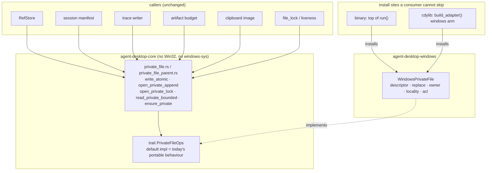
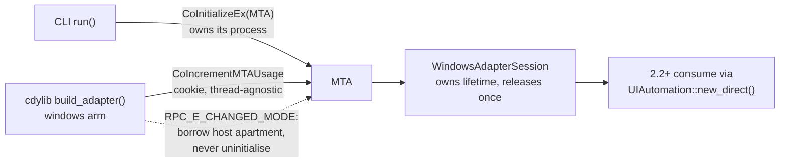

# Windows Toolchain, CI & COM Bootstrap (Sub-phase 2.1) - Plan

## Goal Capsule

- **Objective:** Stand up the Windows build, CI, and session substrate so every later sub-phase lands on green CI and a constructible `WindowsAdapter` — and rebuild the private-file layer that v0.5.0 shipped wrong, this time against measured evidence and behind a seam that actually exists.
- **Authority hierarchy:** `docs/phases.md` §2.1 (as corrected in `31ffd5f` and `4206c72`) > this plan > implementer judgment. The four session-settled decisions — **KTD1, KTD3, KTD4, and the deferral of self-hosted runner registration to 2.12** — are product law for this PR. KTD2 and KTD5–KTD9 are evidence-driven and may be revised if implementation disproves them.
- **Stop conditions:** Do not register a self-hosted runner — that moved to 2.12. Do not add `uiautomation` or `windows-capture`; they are first consumed in 2.2/2.10. Do not implement UIA tree walking, element wrapping, or any observation capability — that is 2.2+. Do not put Win32 bindings or `#[cfg(windows)]` platform logic in `agent-desktop-core`. If evidence contradicts a settled decision above, stop and surface it.
- **Execution profile:** One PR into `feat/windows-adapter`, never `main`. Target ≈1.6k LOC. Conventional Commits.
- **Tail ownership:** The implementer opens the PR against `feat/windows-adapter` and reports the Verification Contract results.

---

## Product Contract

### Summary

Sub-phase 2.0 proved what Windows actually does. 2.1 is the first Rust sub-phase: it extends the Windows CI lane from a single `--lib` invocation to the full Windows package surface, establishes COM apartment and DPI state at process start with different primitives for the CLI and the cdylib, gives `WindowsAdapter` a session type that owns that apartment, adds a truthful permission probe, and rebuilds private-file hardening from scratch behind a new core seam.

### Problem Frame

`crates/windows` is a 63-line stub: a unit struct with four empty capability impls (`crates/windows/src/adapter.rs:3-20`). Everything later sub-phases need — a COM apartment, DPI awareness, a session lifetime, a truthful permission report, a safe private-artifact write path — does not exist.

Two of those are not greenfield. The private-file layer **already shipped once and was deleted**: 1,062 LOC of Win32 in `agent-desktop-core` that failed 225 of 940 tests on first contact with Windows and was removed in `8ad66b8` (PR #106). Its four failure clusters are documented, its worst defect is recovered verbatim, and sub-phase 2.0 measured the correct behaviour for every question it got wrong. And the CI lane that would have caught it (`ci.yml:223-261`) still runs only `cargo test -p agent-desktop-core -p agent-desktop-windows --lib` — no clippy, no binary-crate tests, no isolation check, no size gate.

### Requirements

- **R1.** The `test-windows` lane runs clippy `-D warnings` over `agent-desktop-core`, `agent-desktop-windows`, `agent-desktop`, and `agent-desktop-ffi`; the binary-crate tests (`cargo test -p agent-desktop`); the core-isolation check; and a Windows-native release-binary size check against the 15 MiB cap. Every step in the lane runs under an isolated `HOME`.
- **R2.** COM apartment and DPI awareness are established at process start for both consumers, at a call site the consumer cannot skip (KTD2, KTD6).
- **R3.** `WindowsAdapterSession` implements `AdapterSession` via `open_session` and owns COM apartment lifetime, so 2.2+ consume an apartment rather than creating one.
- **R4.** `WindowsAdapter` constructs and satisfies `PlatformAdapter`; every **adapter-backed** command returns honest `PLATFORM_NOT_SUPPORTED`; the commands that reach no adapter (`version`, `skills`, `session`, `trace`, `status`, `permissions`) continue to succeed.
- **R5.** A Windows permission probe reports truthfully and is unit-tested against mocked security state, on a host-independent seam.
- **R6.** Windows private-file hardening exists behind a core-defined seam implemented in `agent-desktop-windows` (KTD1), is **installed at a site no consumer can bypass**, and satisfies every measured behaviour in R7.
- **R7.** The hardening implements, against 2.0's evidence: `ReplaceFile` — not `MoveFileEx` — for an atomic replace whose destination a validation handle holds open; `FILE_SHARE_DELETE` on every concurrently-open handle, necessary but never sufficient; **error 5, not 32**, as the expected destination-side failure; owner validation against `TokenOwner`, not `TokenUser`; and locality inference from `FileRemoteProtocolInfo` (class 13) only behind a control call on a known-good class.
- **R8.** Every path component is rejected if it carries `FILE_ATTRIBUTE_REPARSE_POINT`, matching the per-component symlink rejection the unix path already performs. The hardening **does not** parse or validate DACLs and **does not** author security descriptors — it relies on the profile inheritance measured in A11-4 (KTD3).
- **R9.** The dependency pins for `uiautomation` and `windows-capture` are recorded but not added. Win32 bindings needed by 2.1's own scope **are** added, to the platform crate only (KTD4).
- **R10.** No Win32 binding crate and no unallowlisted `#[cfg(windows)]` platform logic enters `agent-desktop-core`. **Both halves are mechanically gated**, not merely asserted.

### Key Decisions

- **Private-file code lives behind a core-defined trait, implemented in the platform crate.** (session-settled: user-directed — chosen over `#[cfg(windows)]` inside core, which is the exact shape PR #106 deleted, and over deferring the hardening entirely.) Governs R6, R10.
- **Windows relies on profile inheritance instead of validating ACLs, and rejects reparse points per component.** (Supersedes the earlier session-settled "walk to the nearest protected ancestor" decision — reversed on measured evidence, see KTD3. A11-4 shows a leaf under the profile already inherits SYSTEM + Administrators + user and no `BUILTIN\Users`, so the walk would verify what Windows guarantees; and the only principal it would exclude, another administrator, holds `SeTakeOwnershipPrivilege` and can bypass any DACL.) Governs R7, R8.
- **Win32 bindings come from `windows-sys` in `crates/windows`, target-gated.** (session-settled: user-directed — chosen over hand-written `extern "system"` declarations, because the struct-layout transcription that hand-binding requires is the precise bug class that killed the previous layer.) Governs R9.
- **Self-hosted runner registration is not in 2.1.** (session-settled: user-directed — chosen over registering it here or standing up an ephemeral/JIT runner now: a security-sensitive persistent runner on a public repository should be registered by the sub-phase that needs an interactive desktop, not left idle from 2.1 through 2.11.) Moved to 2.12 along with ledger row A10-2's closure.

### Scope Boundaries

- **Out:** self-hosted runner registration, the RDP/session-transition measurement, and ledger row A10-2's closure — all now 2.12.
- **Out:** `uiautomation`, `windows-capture`, and any UIA tree, element, resolution, action, or input capability — 2.2+. This includes the native-handle downcast guard macOS has at `crates/macos/src/adapter.rs:15-31`: it exists to validate wrapped elements, and Windows has none yet.
- **Out:** repairing workspace `default-members` so bare `cargo build --release` works off-macOS. Recorded as ledger row R6-3 and left alone here: it changes what an unqualified cargo invocation does on every platform, which is wider than this sub-phase's mandate. See Open Questions — it has a working consequence for this PR, handled in the Verification Contract.
- **Out:** `.gitattributes`. The index is clean — `git ls-files --eol` reports 1158 files `i/lf` and zero CRLF — so it is a determinism measure, not a repair.
- **Deferred to follow-up:** correcting the `MockAdapter` fiction in `CLAUDE.md:382`, `AGENTS.md:395`, `CONTRIBUTING.md:58`, and the stale `FileRemoteProtocolInfo` claim in `docs/solutions/best-practices/never-ship-platform-code-that-ci-cannot-execute.md:92`. `docs/phases.md` is already correct on both.

---

## Planning Contract

### Key Technical Decisions

- **KTD1. The private-file seam is a core-defined trait implemented in the platform crate.** (session-settled: user-directed — chosen over `#[cfg(windows)]` in core.) Governs R6, R10. `docs/phases.md:978` previously prescribed "behind `PlatformAdapter` or as a Windows-gated dependency of `agent-desktop-windows`", and neither is reachable: every private-artifact write site is in core with no adapter handle, and core may not depend on the platform crate (`ci.yml:114-121`). Core therefore defines a narrow trait with a **default implementation equal to today's portable behaviour**, so unix and macOS are byte-for-byte unchanged and the risk is confined to the Windows arm.

- **KTD2. The seam and the apartment install where a consumer cannot skip them.** Governs R2, R6. **`ad_init` is not an install point.** Its own doc says so — `crates/ffi/src/abi_version.rs:34-36`: *"No global state is initialised by this call — skipping it does not prevent adapter functions from operating"* — and the committed header labels it **"(Optional)"** at `crates/ffi/include/agent_desktop.h:10`. Installing there would mean any host that skips it silently runs every private-artifact write through the portable default, with nothing observable distinguishing that state from the hardened one. The repo already solved this shape: `crates/ffi/src/adapter.rs:107-118` calls `ensure_cocoa_multithreaded()?` in the macOS arm of `build_adapter()` immediately before constructing the adapter, while the Windows arm is a bare `Ok(Box::new(WindowsAdapter::new()))`. Both the apartment bootstrap and the seam install go **there** for the cdylib, and at the top of `run()` for the CLI — before `resolve_active_session`, which reads private files at `src/main.rs:118`. `ad_init` stays a pure version check so the committed header and the `ffi-header-drift` job are untouched.

- **KTD3. Windows does not validate ACLs at all. It relies on profile inheritance and rejects reparse points.** Governs R7, R8. This **reverses** the earlier session-settled "walk to the nearest protected ancestor" decision, on evidence that arrived after it was made.

  The asymmetry with unix is measurable, and it runs the opposite way to intuition. Unix **must author** its permission because the default is umask-derived and typically world-readable — hence `mode(0o600)` at `private_file.rs:238-244`. Windows **need not**, because ledger row A11-4 measured that a plain leaf under the user profile inherits exactly three ACEs — `NT AUTHORITY\SYSTEM`, `BUILTIN\Administrators`, and the user — with **no `BUILTIN\Users`**, all inherited, zero explicit. That is already `0600`-equivalent for the only reader that matters.

  So the ancestor walk would be verifying a property Windows already guarantees. And the residual thing it would catch — another **admin** on the same box — is not defensible anyway: an administrator holds `SeTakeOwnershipPrivilege` and can seize any object regardless of its DACL. Building a chain-walking ACL validator to exclude a principal who can bypass it is theatre with a real cost, and the cost is the point: **it is the code that killed the previous layer.** The `AceSize` defect exists only because that code parsed ACEs. Not parsing them removes the entire bug class rather than fixing it — the safest ACE parser is the one that is never written.

  What survives is the control that is genuinely load-bearing and has direct unix parity: **per-component reparse-point rejection**. `private_file_parent.rs:54-64` rejects user-controlled symlinks and non-directories on every component of the unix path, and the deleted Windows layer carried the matching `FILE_ATTRIBUTE_REPARSE_POINT` check at `private_file_windows.rs:81-83`. This is not a confidentiality control — it is an integrity one. A junction is creatable by an unprivileged user without `SeCreateSymbolicLinkPrivilege`, and one planted on our path redirects where the product **writes**, which no ACL on the intended destination can prevent.

  Recorded against `docs/phases.md:978`, which requires this contract be "decided deliberately, matching or explicitly diverging from the unix leaf-only rule": we diverge, by validating **less** than unix rather than more, and the divergence is documented in the module.

- **KTD4. Bindings come from `windows-sys 0.61` in `crates/windows` only.** (session-settled: user-directed.) Governs R9, R10. Measured: `cargo tree -p agent-desktop --target x86_64-pc-windows-msvc -i windows-sys` shows **`windows-sys 0.61.2` is already compiled into every Windows build**, transitively via `clap`'s colour support and `tracing-subscriber`; it is in `Cargo.lock:596`. Adding it to the platform crate adds **zero crates and zero supply-chain delta**. It carries everything 2.1 needs. The `windows` crate is not needed until 2.2, where `uiautomation 0.25.0` pulls it transitively.

- **KTD5. Win32 struct layouts are pinned with compile-time asserts.** Governs R7. `docs/solutions/best-practices/ffi-repr-c-struct-size-pinning.md` documents this repo's discipline, and its motivating incident is the same shape as the defect that killed the previous layer: a layout assumption that **passed CI**. Apply `const _: () = assert!(size_of::<T>() == N)` to every Win32 struct this sub-phase reads through — `TOKEN_OWNER` and `FILE_REMOTE_PROTOCOL_INFO`. Both are fixed-layout, so a size pin is sufficient. Under KTD3 no variable-length structure (`ACL`, `ACE_HEADER`, `ACCESS_ALLOWED_ACE`) is read at all, which is what removes the extent-arithmetic burden — and the bug class that came with it.

- **KTD6. Nothing initialises COM or touches User32 at library load.** Governs R2. Microsoft's DLL best-practices list names both halves explicitly: *"Initialize COM threads by using CoInitializeEx"* and *"Call functions in User32.dll"* are both prohibited inside `DllMain`, because it runs under the loader lock. `#[ctor]` inherits the prohibition — CRT initialisers run in the same context. Use one-time lazy init at the call sites KTD2 names. Repo precedent: `crates/macos/src/system/cocoa_runtime.rs:4-15` (`OnceLock<Result<(), String>>`).

- **KTD7. The DPI bootstrap does not verify itself by read-back.** Governs R2. Ledger row A10-4 measured that `SetProcessDpiAwarenessContext(PER_MONITOR_AWARE_V2)` **succeeds** on build 17763, but the read-back reports the V1 string `PROCESS_PER_MONITOR_DPI_AWARE` because `GetProcessDpiAwareness` has no V2 enumerant. Assert on the call's return, not on a query. A second call returns `ERROR_ACCESS_DENIED`, which means "already set" and must be tolerated rather than fatal.

- **KTD8. Portable assertions only in CI tests.** Governs R5, R7. `windows-latest` is now Server 2025 with VS2026 (claims-audit row C-11), while every A11 measurement was taken on Server 2019 / 17763. Rows A11-1 and A11-3 are `api-contract` and travel; **A11-2 and A11-4 are `app/provider` and do not** — A11-2 records `EnvironmentLimit: "single built-in Administrator account on this VM; a non-admin CI account could not be exercised here"`. Assert *owner equals `TokenOwner`*, never *owner differs from `TokenUser`*. Never hardcode `S-1-5-32-544` or this box's ancestor chain.

- **KTD9. The seam is routed at the primitives, not at the call sites.** Governs R6. Core's private-file operations already funnel through a small set of definitions — `write_atomic`, `open_private_append`, `open_private_lock`, `read_private_bounded` in `crates/core/src/private_file.rs`, and `ensure_private` in `crates/core/src/private_file_parent.rs`. `crates/core/src/refs.rs:204-206` (`write_private_file`) alone funnels most write sites. Routing at the primitives covers every current and future caller — including `file_lock.rs` and `session/liveness.rs:48`, which a call-site list misses — with zero call-site edits. The seam's write operation is the **whole** `write_atomic(path, bytes)`, not a `(source, destination)` replace primitive, so the Windows implementation owns temp creation, handle lifetime, and replace ordering end to end.

### High-Level Technical Design

The seam, routed at core's primitives:



Apartment ownership across the two consumers:



### Output Structure

```
crates/windows/src/
├── adapter.rs                    # thin: unit struct only (mirror macos/src/adapter.rs)
├── system/
│   ├── mod.rs
│   ├── adapter.rs                # SystemOps impl (mirror macos/src/system/adapter.rs)
│   ├── com_runtime.rs            # KTD2/KTD6 apartment bootstrap, OnceLock
│   ├── dpi.rs                    # KTD7 DPI awareness
│   ├── session.rs                # WindowsAdapterSession
│   ├── permissions.rs            # cfg-split mod imp + pure mapping fns
│   ├── permissions_tests.rs
│   └── private_file/
│       ├── mod.rs                # WindowsPrivateFile: impl of core's trait
│       ├── path.rs               # R8: per-component reparse-point rejection
│       ├── replace.rs            # whole write_atomic: temp → drop → ReplaceFileW
│       ├── owner.rs              # TokenOwner comparison (owner only, no DACL)
│       ├── locality.rs           # class 13 behind a control call
│       └── tests.rs              # no acl.rs, no descriptor.rs — see KTD3
crates/core/src/
└── private_file_ops.rs           # trait + portable default impl + install/accessor
```

Per-unit `**Files:**` lists are authoritative; this tree is a scope declaration.

---

## Implementation Units

### U1. Make the binary-crate tests runnable on Windows

- **Goal:** `cargo test -p agent-desktop` runs on Windows, which it does not today. Hard prerequisite for U2 — without it the extended lane lands red on its first run.
- **Requirements:** R1, R4.
- **Dependencies:** none.
- **Files:** `src/tests/snapshot_test.rs`.
- **Approach:** `src/tests/snapshot_test.rs:6-16` resolves the binary by walking `current_exe()` up two levels and pushing `"agent-desktop"`, with no `std::env::consts::EXE_SUFFIX`. On Windows the artifact is `agent-desktop.exe`, so the `assert!(path.is_file(), …)` fires and **3 of 128 tests panic before running**: `version_command_outputs_json`, `snapshot_invalid_root_ref_format_returns_invalid_args`, and `list_apps_on_non_macos_errors_gracefully` — the last of which is precisely the R4 honesty assertion. The correct pattern is one file over: `src/tests/cli_process.rs:4` uses `env!("CARGO_BIN_EXE_agent-desktop")`, which Cargo resolves per-platform. Adopt it rather than appending `EXE_SUFFIX` by hand — it removes the `current_exe()` walk entirely and cannot drift.
- **Patterns to follow:** `src/tests/cli_process.rs:4`.
- **Test scenarios:**
  - `cargo test -p agent-desktop` passes 128/128 on Windows.
  - `list_apps_on_non_macos_errors_gracefully` actually executes and observes `PLATFORM_NOT_SUPPORTED` — it is currently dead on Windows, and it is what demonstrates R4's adapter-backed clause.
  - The same target still passes on macOS, proving the helper change is platform-neutral.
- **Verification:** the three named tests pass on Windows; no test target regresses on macOS.

### U2. Extend the Windows CI lane to the full package surface

- **Goal:** `test-windows` enforces what `docs/phases.md:973` requires, so later sub-phases cannot land Windows regressions no lane executes.
- **Requirements:** R1, R10.
- **Dependencies:** U1.
- **Files:** `.github/workflows/ci.yml`, `src/cli/contract_tests.rs`.
- **Approach:**
  1. **Hoist HOME isolation to a lane-wide step.** Today `$env:HOME`/`$env:USERPROFILE` are set inside the single test step's `run:` block (`ci.yml:253-261`), and **environment set in one `run:` block does not survive into the next step**. Add a first step that creates the temp home and exports `HOME`, `USERPROFILE`, `CARGO_HOME`, `RUSTUP_HOME` via `Add-Content -Path $env:GITHUB_ENV`, then drop the inline assignments — otherwise the newly added `cargo test -p agent-desktop`, which spawns the real binary and writes refmaps and trace segments, runs against the runner's real profile.
  2. Add clippy over the four crates. Measured green on Windows today at exit 0. `agent-desktop-ffi` is a workspace member but **not** in `default-members` (`Cargo.toml:3`) and must be named explicitly. No `rustup component add` is needed — `rust-toolchain.toml` declares `clippy` and `rustfmt`.
  3. Add `cargo test --locked -p agent-desktop` (not `--lib`: that crate has no lib target, so `--lib` silently skips it).
  4. Add the core-isolation check, widened per R10 in **both** directions the current one misses: run `cargo tree` with `--edges normal,build,dev` (the existing `--edges normal,build` excludes dev-dependencies, so a `windows-sys` dev-dependency supporting `#[cfg(windows)]` test code passes clean) and with `--target x86_64-pc-windows-msvc`; then add a **source-level** gate over `crates/core/src/**` failing on `extern "system"`, `std::os::windows`, or `cfg(windows)` / `cfg(target_os = "windows")` outside an allowlist naming the two existing portable shims at `private_file.rs:207` and `:224`. Without the second gate, R10's `#[cfg(windows)]` half is asserted in the DoD but mechanized nowhere, and hand-written externs need no binding crate to slip through.
  5. Add a `cargo build --locked --release -p agent-desktop` step (the size check has nothing to measure without it), then a Windows-native size check. The existing gate (`ci.yml:167-178`) uses BSD `stat -f%z`, which **fails under Git Bash** — write it in pwsh, consistent with `release.yml:341-347`: `(Get-Item target/release/agent-desktop.exe).Length` against `15MB`. There is **no helper binary on Windows**, so the step checks one file. Current headroom: 1,920,512 B, 12.2% of cap.
  6. Add a `target/` cache mirroring `ci.yml:105-112` and raise the 20-minute timeout — clippy `--all-targets` plus binary tests plus an LTO release build will not fit.
- **Execution note:** `src/cli/contract_tests.rs:83` `include_str!`s `ci.yml`, so any edit forces a binary-crate rebuild. Its four assertions cover the macOS version-check step at `ci.yml:154-163`, which this unit must **not** alter. Run `cargo test -p agent-desktop` after editing the workflow.
- **Patterns to follow:** `ci.yml:114-121` (isolation, as the base to widen), `release.yml:341-347` (pwsh size measurement), `ci.yml:105-112` (target cache).
- **Test scenarios:**
  - The lane passes on a PR with no Rust changes.
  - A deliberate clippy warning in `crates/windows` fails the lane.
  - A stub adding `windows-sys` to `crates/core/Cargo.toml` as a **dev-dependency** fails the widened tree check — the case the current `--edges normal,build` misses.
  - A stub adding `extern "system"` to a core source file fails the source-level gate, while the two allowlisted shims still pass.
  - The size step reports a byte count and passes; artificially lowering the cap fails it.
  - A test that writes a private artifact observes it under `$RUNNER_TEMP`, not the runner profile — proving the hoisted HOME reached every step.
- **Verification:** all new checks appear in the lane and **each has been observed failing** when its condition is violated.

### U3. Add target-gated Win32 bindings to the platform crate

- **Goal:** `crates/windows` can call Win32 without any binding crate reaching core.
- **Requirements:** R9, R10.
- **Dependencies:** none.
- **Files:** `crates/windows/Cargo.toml`.
- **Approach:** Add `windows-sys` under `[target.'cfg(target_os = "windows")'.dependencies]`, mirroring `crates/macos/Cargo.toml`. Version `0.61` — already in `Cargo.lock:596`, so this resolves to the same compiled crate. Features: `Win32_Foundation`, `Win32_System_Com`, `Win32_UI_HiDpi`, `Win32_Storage_FileSystem`, `Win32_Security`, `Win32_Security_Authorization`. Do **not** add `uiautomation` or `windows-capture` (R9).
- **Patterns to follow:** `crates/macos/Cargo.toml` target-gated dependency block.
- **Test scenarios:**
  - `cargo tree -p agent-desktop-core` still shows the same 8 dependencies and no binding crate, on both `--edges normal,build,dev` and the Windows target.
  - `cargo check -p agent-desktop-windows --target x86_64-pc-windows-msvc` succeeds.
- **Verification:** the widened isolation check from U2 passes; the platform crate compiles against the new features.

### U4. Establish the COM apartment and DPI awareness at an unskippable call site

- **Goal:** A Windows process running this product is in the MTA and DPI-aware before any UIA or window work, with the CLI and cdylib each using the primitive their constraints require — installed where a consumer cannot skip it.
- **Requirements:** R2.
- **Dependencies:** U3.
- **Files:** `crates/windows/src/system/com_runtime.rs`, `crates/windows/src/system/dpi.rs`, `crates/windows/src/system/mod.rs`, `crates/windows/src/lib.rs`, `src/main.rs`, `crates/ffi/src/adapter.rs`.
- **Approach:**
  - **Apartment (KTD2).** Expose two entry points from `com_runtime.rs`: one for a process the product owns (CLI) calling `CoInitializeEx(null, COINIT_MULTITHREADED)`, and one for a hosted library (cdylib) calling `CoIncrementMTAUsage` and retaining the cookie. `RPC_E_CHANGED_MODE` from the CLI path is **not** an error — COM is already initialised on this thread in another mode; record the apartment as borrowed and do not schedule a `CoUninitialize`. Guard each with `OnceLock<Result<…>>`, and document the asymmetry that makes this sound: `CoIncrementMTAUsage`'s cookie is **process-wide**, so a process-wide `Once` is correct; `CoInitializeEx`'s effect is **thread-local**, so the CLI path's `Once` is only valid because the CLI initialises on its main thread and does not hand the apartment to other threads.
  - **DPI (KTD7).** `SetProcessDpiAwarenessContext(DPI_AWARENESS_CONTEXT_PER_MONITOR_AWARE_V2)`. Treat `ERROR_ACCESS_DENIED` as benign "already set". **Do not** verify by reading awareness back.
  - **Wiring (KTD2, KTD6).** Export `ensure_com_mta_and_dpi()` from `agent-desktop-windows`. Call it from the top of `run()` in `src/main.rs`, and from the `#[cfg(target_os = "windows")]` arm of `build_adapter()` at `crates/ffi/src/adapter.rs:115-118` — **not** from `ad_init`, which is documented optional and initialises nothing. Leave `ad_init` untouched so the committed header and the `ffi-header-drift` job are unaffected. **Never** call from `DllMain` or a `#[ctor]`.
- **Execution note:** Write the `RPC_E_CHANGED_MODE` and `ERROR_ACCESS_DENIED` tolerance paths test-first. They are the branches a happy-path implementation silently gets wrong, and they are the reason the cdylib works inside an STA host.
- **Patterns to follow:** `crates/macos/src/system/cocoa_runtime.rs:4-15` for the `OnceLock<Result>` shape; `crates/ffi/src/adapter.rs:107-118` for the macOS arm calling `ensure_cocoa_multithreaded()?` before adapter construction — mirror it exactly; `crates/macos/src/system/permissions.rs:12-130` for the `#[cfg]`-split `mod imp` so the crate unit-tests on any host.
- **Test scenarios:**
  - Calling the CLI bootstrap twice on the same thread succeeds both times and schedules exactly one release.
  - A simulated `RPC_E_CHANGED_MODE` yields success with "apartment borrowed" recorded and **no** uninitialise scheduled.
  - A simulated `ERROR_ACCESS_DENIED` from the DPI call is reported as success-with-already-set, not failure.
  - No test asserts V2 via read-back (KTD7) — assert on the call result.
  - Constructing an FFI adapter **without any prior `ad_init` call** still observes an initialised apartment.
  - The non-Windows `mod imp` arm compiles and returns canned values, so these tests run on any lane.
- **Verification:** the bootstrap runs on the Windows CI lane; no code path calls into COM or User32 from `DllMain` or a constructor; `ad_init` is unchanged.

### U5. Give the adapter a session that owns apartment lifetime

- **Goal:** `WindowsAdapterSession` implements `AdapterSession` and owns the COM apartment, so 2.2+ consume an established apartment.
- **Requirements:** R3.
- **Dependencies:** U4.
- **Files:** `crates/windows/src/system/session.rs`, `crates/windows/src/system/adapter.rs`, `crates/windows/src/system/mod.rs`.
- **Approach:** `AdapterSession` is one method — `close(self: Box<Self>) -> Result<(), AdapterError>` (`crates/core/src/adapter_session.rs:9-11`) — with **no `Drop` bound, no documented drop contract, and no test** covering a dropped-without-`close` box. Release must happen exactly once on either path. Note the Rust constraint: **a type implementing `Drop` cannot have fields moved out of it**, so `close(self: Box<Self>)` cannot simply take the cookie by value if `Drop` is also implemented. Hold the cookie as `Option<Cookie>` and have both `close()` and `Drop` take it via `Option::take()`, so the release is once-only by construction of the `Option`, not by a claim. This is also the second reason KTD2's `CoIncrementMTAUsage` is right for the hosted path: its cookie may be released from a different thread than acquired it, so a `Drop` impl is sound where `CoUninitialize` from the wrong thread would not be.
- **Execution note:** `open_session` currently has **zero production callers** — confirmed across `src/`, `crates/ffi/`, and every platform crate. This unit ships a type reachable from its own tests and from a future FFI caller; `crates/ffi/src/adapter.rs:19-23` (`AdAdapter`) is its natural future home, driven from `ad_adapter_destroy`. State that in the code so a later reader does not mistake it for dead code.
- **Patterns to follow:** `crates/core/src/adapter_session_tests.rs:8-36` (`FlagSession`) — the only existing implementation.
- **Test scenarios:**
  - `open_session` returns a session rather than `PLATFORM_NOT_SUPPORTED` on Windows.
  - `close()` releases exactly once, asserted via a fake release counter.
  - A session dropped **without** `close()` releases exactly once.
  - A session `close()`d and then dropped releases exactly once total, not twice.
  - The returned box satisfies `Send + Sync`.
- **Verification:** construct/close/drop paths unit-tested on the Windows lane; the release counter proves once-only on every path.

### U6. Report Windows permissions truthfully

- **Goal:** A permission probe that reports what Windows actually constrains, unit-tested against mocked security state on a seam needing no desktop.
- **Requirements:** R4, R5.
- **Dependencies:** U3.
- **Files:** `crates/windows/src/system/permissions.rs`, `crates/windows/src/system/permissions_tests.rs`, `crates/windows/src/system/adapter.rs`.
- **Approach:** Mirror the macOS structure: a `#[cfg(target_os = "windows")] mod imp` with a `#[cfg(not(…))]` twin returning canned values, plus **pure mapping functions** taking integers and returning `PermissionState`. Those pure functions are what "unit-tested against mocked COM security state" can mean here — there is no COM mocking framework in this repo, and `crates/macos/src/system/permissions.rs:237-246` tested at `permissions_tests.rs:11-19` against literal `OSStatus` values is the only shape with prior art. Write `map_uia_access(hresult: i32) -> PermissionState` and test against literal `0x80070005`.
  What to report: **accessibility** — UIA needs no special permission for most apps, so `NotRequired` or `Granted` rather than `Unknown`; **screen_recording** — no macOS-style TCC field, so derive from capture-API availability per `docs/phases.md:940`; **automation** — `NotRequired`.
  Two constraints from 2.0's evidence. Row **A9-2** measured that across a real Medium→High integrity boundary, **UIA reads succeed byte-identically** — so an integrity mismatch must **not** flip `accessibility` to `Denied`; it is an input-time `PERM_DENIED` that 2.6 owns. Row **A9-3** measured `SendInput` returning "6 events accepted, lastError 0" in **both** arms — never model permission off a Win32 return value.
  Also override `unknown_accessibility_means_unsupported`. It is consulted **only by the FFI** (`crates/ffi/src/adapter.rs:276-293`); `src/command_policy/mod.rs` never calls it, so CLI and FFI diverge for an unprobed adapter. Overriding it makes them agree.
- **Patterns to follow:** `crates/macos/src/system/permissions.rs` in full — the `mod imp` split (`:12-130`), the pure mappers (`:194-246`), deadline checks around every native read (`:295-301`), and dependency injection for testability (`:147-172`).
- **Test scenarios:**
  - `map_uia_access` maps `E_ACCESSDENIED (0x80070005)` to `Denied` with a non-empty suggestion, and `S_OK` to `Granted`.
  - An unrecognised HRESULT maps to `Unknown`, not to a guess.
  - `permission_report` on the non-Windows arm returns the canned shape, so the test runs on any lane.
  - `automation` reports `NotRequired` on Windows.
  - A denial's `platform_detail` matches the Invariant-8 HRESULT format (`docs/phases.md:833`).
  - `unknown_accessibility_means_unsupported` returns the value that makes CLI and FFI agree.
- **Verification:** mapping functions unit-tested against literal HRESULTs on the Windows lane; no test requires an interactive desktop.

### U7. Introduce the private-file seam in core and install it

- **Goal:** Core routes private-file operations through a trait it defines, with a default implementation identical to today's behaviour, **and both consumers install the platform implementation at a site they cannot skip**.
- **Requirements:** R6, R10.
- **Dependencies:** none for the seam; the install step depends on U8 existing to install.
- **Files:** `crates/core/src/private_file_ops.rs`, `crates/core/src/lib.rs`, `crates/core/src/private_file.rs`, `crates/core/src/private_file_parent.rs`, `src/main.rs`, `crates/ffi/src/adapter.rs`.
- **Approach:**
  - **Route at the primitives, not the call sites (KTD9).** Define the trait over `write_atomic`, `open_private_append`, `open_private_lock`, `read_private_bounded` (all in `private_file.rs`) and `ensure_private` (`private_file_parent.rs`), then have those five functions dispatch through it. Every caller is covered with **zero call-site edits** — including `crates/core/src/file_lock.rs` and `crates/core/src/session/liveness.rs:48`, which a call-site enumeration misses, and every read path. `crates/core/src/refs.rs:204-206` (`write_private_file`) already funnels most writes.
  - **The write operation is the whole `write_atomic(path, bytes)`**, not a `(source, destination)` replace primitive — the Windows implementation must own temp creation, handle lifetime, and replace ordering together, because `ReplaceFile` fails error 32 over an open **source** in 10 of 10 measured cases.
  - **Own the temp-handle reorder.** `write_atomic_with` (`private_file.rs:84-94`) holds the source temp handle open across `replace_atomic` and drops it only afterward. Restructure so the handle is dropped **before** the replace on the portable path too — safe on unix, required on Windows. Note this also moves `write_user_atomic`, which shares the same helper.
  - **Default implementation = today's portable code**, so unix and macOS behaviour is unchanged.
  - **Install (KTD2).** From the top of `run()` in `src/main.rs`, before `resolve_active_session` reads private files at `src/main.rs:118`; and from the `#[cfg(target_os = "windows")]` arm of `build_adapter()` at `crates/ffi/src/adapter.rs:115-118`. **Not** `ad_init`.
  - **Test override.** Production install is a `OnceLock`. A process-global `OnceLock` alone cannot support the fake-implementation test — `cargo test -p agent-desktop-core --lib` runs every core test in one process in parallel, so a global fake would be observed by sibling tests that write real private files. Add a `#[cfg(test)] thread_local!` override consulted first by the accessor, mirroring `crates/core/src/trace_artifact_budget.rs:20-35` and `crates/core/src/refs.rs:18-20`.
- **Execution note:** Characterize before changing. `crates/core/src/private_file_tests.rs:1` is `#![cfg(unix)]` — all 10 behaviour tests are unix-only. Run them before and after to prove the default implementation is behaviour-identical. When lifting `#![cfg(unix)]` for the portable subset, the module's unix-only imports at lines 4-7 (`std::os::fd::AsRawFd`, `std::os::unix::fs::{OpenOptionsExt, PermissionsExt}`) must be cfg-gated too, or the file will not compile on Windows.
- **Patterns to follow:** `crates/core/src/trace_artifact_budget.rs:20-35` (thread-local test override); `crates/core/src/adapter/mod.rs:26-28` (core defining a trait it does not implement).
- **Test scenarios:**
  - Every existing unix private-file test passes through the default implementation — the assertion is "existing unix tests pass", not "the code path is unchanged", since the temp-handle reorder deliberately changes it.
  - A fake implementation installed via the thread-local override observes the calls each primitive makes, while sibling tests in the same binary keep the portable default.
  - The portable subset of `private_file_tests.rs` runs and passes on Windows.
  - `cargo tree -p agent-desktop-core` is unchanged — no new dependency.
  - Installing twice is either rejected or idempotent, and the behaviour is asserted.
  - **A spawned `agent-desktop` process on Windows exercises the installed implementation** — the never-installed path is otherwise silently successful via the default, so without this the whole hardening can ship unreachable.
- **Verification:** core has no `#[cfg(windows)]` platform logic and no binding crate; all pre-existing tests pass on macOS, Linux and Windows; the install is proven reachable from both consumers.

### U8. Implement Windows private-file hardening behind the seam

- **Goal:** The Windows arm, built against 2.0's measured evidence — deliberately smaller than the layer it replaces, because most of what that layer did was verifying what Windows already guarantees.
- **Requirements:** R6, R7, R8.
- **Dependencies:** U3, U7.
- **Files:** `crates/windows/src/system/private_file/{mod,path,replace,owner,locality,tests}.rs`.
- **Approach:** Four behaviours drive four modules. Note what is **absent** and why (KTD3): there is no descriptor authoring and no DACL validation. Windows already inherits SYSTEM + Administrators + user with no `BUILTIN\Users` under the profile, so authoring re-states it and validating re-checks it — and the validator is precisely the code whose `AceSize` handling failed last time. Not parsing ACEs removes that bug class outright.

  1. **Path integrity (`path.rs`, R8).** Reject any component carrying `FILE_ATTRIBUTE_REPARSE_POINT`. Open each with `FILE_FLAG_OPEN_REPARSE_POINT | FILE_FLAG_BACKUP_SEMANTICS` and check the attribute rather than following the link. This is the direct analogue of the unix per-component rule at `private_file_parent.rs:54-64`, which rejects user-controlled symlinks and non-directories, and it restores the check the deleted layer carried at `private_file_windows.rs:81-83`.

     This is an **integrity** control, not a confidentiality one, and that distinction is why it survives the KTD3 cut while ACL validation does not: a junction is creatable by an unprivileged user without `SeCreateSymbolicLinkPrivilege`, and one planted on our path redirects where the product **writes**. No ACL on the intended destination prevents that, because the write never reaches the intended destination.

  2. **Atomic replace (`replace.rs`).** Use `ReplaceFileW`, **not** `MoveFileEx`. Measured matrix (42/42 definite, `SuccessWithoutShareDelete: []`):

     | op | open handle on | share mode | result |
     |---|---|---|---|
     | `MoveFileEx` | target | any, incl. `0x4`/`0x7` | **`ERROR_ACCESS_DENIED (5)`** |
     | `MoveFileEx` | source | `0x4`/`0x7` | success |
     | `ReplaceFile` | target | `0x0`/`0x1`/`0x3` | `ERROR_SHARING_VIOLATION (32)` |
     | `ReplaceFile` | **target** | **`0x4`/`0x7`** | **success**, held handle still reads old bytes |
     | `ReplaceFile` | source | any, incl. `0x4`/`0x7` | `ERROR_SHARING_VIOLATION (32)` |

     Opposite tolerances on opposite sides. Classify **error 5** as the expected destination-side sharing failure, not 32.

     Dropping the source handle before the replace (required — see the last row) opens a window in which a fully-written temp sits closed on disk. Create temps inside a per-process subdirectory of the private root — which inherits the same SYSTEM/Administrators/user ACL as everything else under the profile — and sweep stale per-process temp directories at startup so an aborted process leaves no orphan. The existing hashed-nonce temp name (`private_file.rs:188`) is retained; it is what makes the name unpredictable to a same-privilege racer.

     **A trap in the other direction:** plain `OpenOptions` on Windows already defaults to `FILE_SHARE_READ|WRITE|DELETE`, which is why readers holding a destination open work today. Any hardened `CreateFileW` that *narrows* that share mask re-introduces the 122-failure sharing cluster. Widen deliberately; never narrow silently.

  3. **Ownership (`owner.rs`).** Validate against `TokenOwner`, never `TokenUser`. Measured at **both** High and Medium integrity: owner `S-1-5-32-544`, `OwnerMatchesTokenUser: false`, `OwnerMatchesTokenOwner: true`. **Integrity is not the variable — group membership is.** Read the owner only — `GetSecurityInfo` with `OWNER_SECURITY_INFORMATION`, no DACL requested — so this module reads a fixed-layout SID and never touches an ACE.

     Its purpose is narrow and must be documented as such: it detects a path **pre-created by a foreign principal**, which is the Windows analogue of the unix `uid`/`nlink` post-condition at `private_file.rs:123-143`. On an admin-group account `TokenOwner` resolves to `BUILTIN\Administrators`, so it is explicitly **not** an isolation boundary between admin processes — nothing here is, and nothing can be, since an administrator holds `SeTakeOwnershipPrivilege`.

  4. **Locality (`locality.rs`).** `GetFileInformationByHandleEx(FileRemoteProtocolInfo)` — class **13** — distinguishes local from remote, but signals *local* by **failing** with `ERROR_INVALID_PARAMETER (87)` (0/6 local returned data; 3/3 remote did). The trap: an out-of-range class (tested with 55) returns **the same 87** on all 9 targets. So 87 is a locality signal only **behind a control call on a known-good class** — issue `FileBasicInfo` (class 0) on the same handle first and require it to succeed. **Third state:** if the control call itself fails, the verdict is `Unknown`, and `Unknown` is treated as **remote (refused)** for private artifacts — failing open would write private data to SMB storage on a redirected profile.

  **What is deliberately not here.** The deleted layer's `private_file_windows_security.rs` — DACL enumeration, owner-only descriptor construction, and the `GetAce` loop whose blind cast at `:91` is the defect this sub-phase is haunted by — has **no successor module**. Under KTD3 nothing in 2.1 calls `GetAce`, `GetAclInformation`, `InitializeAcl`, or `AddAccessAllowedAceEx`. If a later sub-phase needs DACL inspection, it inherits the extent-arithmetic obligation then; 2.1 does not, because it reads no variable-length security structure. Apply KTD5 size pins to `TOKEN_OWNER` and `FILE_REMOTE_PROTOCOL_INFO`, both fixed-layout.
- **Execution note:** Write the junction-redirection test **first**, before any path code. Plant a junction inside a temp private root, point it elsewhere, and assert the write is refused. It needs no privilege and no desktop, it is the regression test for the one attack this unit genuinely defends, and writing it first is what keeps `path.rs` from degrading into a check that follows the link it is supposed to reject.
- **Patterns to follow:** `docs/solutions/best-practices/ffi-repr-c-struct-size-pinning.md` (KTD5, fixed-layout structs only); `docs/solutions/best-practices/never-ship-platform-code-that-ci-cannot-execute.md` — a `#[cfg]` branch CI cannot execute is a hypothesis, and a test comparing constants to constants can never fail.
- **Test scenarios:**
  - **A junction planted on the path is refused.** Create a temp private root, plant a junction inside it pointing elsewhere, and assert the write is refused rather than landing at the junction target. No privilege required.
  - A path component that is a regular file where a directory is expected is refused.
  - A newly created artifact under the profile inherits SYSTEM, Administrators and the user and **no `BUILTIN\Users`** — asserted structurally by principal class, never against literal SIDs (KTD8). This is the assumption KTD3 rests on; it is checked once in tests so a future OS change breaks the test rather than silently degrading the product.
  - `ReplaceFileW` succeeds over a destination held open **with** `FILE_SHARE_DELETE`, and the held handle still reads the **old** bytes.
  - `ReplaceFileW` fails **32** over a destination held open **without** share-delete, and **32** over an open **source** even with share-delete.
  - `MoveFileExW` fails **5**, not 32, over an open target even at share mask `0x7`.
  - Class 13 returns 87 on a local NTFS temp file **while** control class 0 succeeds on the same handle; an out-of-range class also returns 87; a forced control-call failure yields `Unknown` and the write is refused.
  - A freshly created file's owner **equals `TokenOwner`** (KTD8 — never assert inequality to `TokenUser`).
  - Size pins fail the build if an upstream fixed-layout struct changes.
  - **A negative test asserts the absence**: no symbol from the ACE/ACL family (`GetAce`, `GetAclInformation`, `InitializeAcl`, `AddAccessAllowedAceEx`) appears anywhere in `crates/windows/src/system/private_file/`. KTD3's whole benefit is that this code does not exist, so a grep-level guard keeps a future well-meaning addition from reintroducing the bug class without a decision.
- **Verification:** every scenario runs on the `windows-latest` lane and is observed failing when its condition is violated; no assertion hardcodes a machine-specific SID or ancestor chain.

---

## Verification Contract

| Gate | Command / check | Applies to |
|---|---|---|
| Repo gates (Windows dev box) | `cargo fmt --all -- --check`; `cargo clippy --locked -p agent-desktop-core -p agent-desktop-windows -p agent-desktop -p agent-desktop-ffi --all-targets -- -D warnings`; `cargo test --locked -p agent-desktop-core -p agent-desktop-windows --lib` | whole PR |
| Windows lane | clippy over four crates, `cargo test -p agent-desktop`, widened isolation, release build + native size check — each observed failing when violated; every step under an isolated `HOME` | U1, U2 |
| Core isolation | `cargo tree -p agent-desktop-core --edges normal,build,dev` on the Windows target contains no platform crate and no binding crate; the source-level gate rejects unallowlisted `cfg(windows)` / `extern "system"` in core | U2, U3, U7 |
| Install reachability | a spawned `agent-desktop` process and an FFI adapter constructed **without** `ad_init` both exercise the installed Windows implementation | U4, U7 |
| Bootstrap honesty | `RPC_E_CHANGED_MODE` and `ERROR_ACCESS_DENIED` tolerated with tests; no read-back assertion of DPI V2; no COM or User32 call from `DllMain`/`#[ctor]`; `ad_init` unchanged | U4 |
| Session lifetime | release runs exactly once on close, on drop, and on close-then-drop | U5 |
| Private-file evidence | every measured behaviour in U8 has a test that can fail; junction-redirection refusal covered; inherited-ACL assumption asserted structurally | U8 |
| No ACE parsing | no `GetAce` / `GetAclInformation` / `InitializeAcl` / `AddAccessAllowedAceEx` symbol appears under `crates/windows/src/system/private_file/` (KTD3) | U8 |
| Portability of assertions | no test asserts an `app/provider` fact — no hardcoded SID, no hardcoded ancestor chain, no inequality-to-`TokenUser` | U6, U8 |
| Behaviour preservation | all pre-existing unix private-file tests pass through the new seam | U7 |
| Size | Windows release binary under 15 MiB (currently 1,920,512 B, 12.2%) | U2 |
| PR is green | every required check on a PR into `feat/windows-adapter`, never `main` | whole PR |

**Pre-commit note.** `.githooks/pre-commit` runs unqualified `cargo clippy --all-targets -- -D warnings` and `cargo test --lib --workspace`, both of which resolve through `default-members` and therefore **fail on a Windows dev box** (112 and 186 errors) until ledger row R6-3 lands. Commit with `SKIP_PRECOMMIT=1` on Windows and run the package-scoped forms in the Repo gates row manually in its place.

## Definition of Done

- A PR from `feat/windows-2.1-bootstrap` into `feat/windows-adapter` is open and green.
- The Windows lane enforces clippy over the four crates, binary-crate tests, widened core-isolation, and a native size check — each observed failing when its condition is violated — with every step under an isolated `HOME`.
- `WindowsAdapter` constructs and satisfies `PlatformAdapter`; every **adapter-backed** command returns honest `PLATFORM_NOT_SUPPORTED`, while `version`, `skills`, `session`, `trace`, `status` and `permissions` continue to succeed.
- COM apartment and DPI awareness are established at a call site no consumer can skip, with the borrowed-apartment and already-set paths tested, and `ad_init` unchanged.
- `WindowsAdapterSession` owns apartment lifetime and releases exactly once on every path.
- The permission probe reports truthfully and its mapping functions are unit-tested against literal HRESULTs.
- Private-file hardening exists behind a core-defined seam, is **proven reachable from both consumers**, rejects reparse points per component, and implements every measured behaviour in R7 — **unit-tested on the `windows-latest` lane**, not merely `cargo check`-clean.
- No ACE or ACL parsing exists in the Windows private-file surface, and a test asserts its absence (KTD3).
- `agent-desktop-core` contains no Win32 binding crate and no unallowlisted `#[cfg(windows)]` platform logic, **both mechanically gated**.
- No self-hosted runner was registered; ledger row A10-2 remains open and owned by 2.12.

---

## Risks & Dependencies

- **The seam is the largest structural change.** Routing at the five primitives keeps call sites untouched, and the default implementation is today's code — but the temp-handle reorder deliberately changes the portable path, so "existing unix tests pass" is the real assertion, not "nothing changed."
- **`unsafe_op_in_unsafe_fn = "warn"` becomes an error under `-D warnings`.** U2's "clippy exits 0" measurement predates U3 and U8. Once real `unsafe` Win32 code lands in `crates/windows`, that workspace lint (`Cargo.toml:26`) bites. Budget for it rather than discovering it in CI.
- **Ten new files under `crates/windows/src/system/` in one PR**, all subject to the 400-LOC rule enforced by `scripts/check-rust-file-size.sh`. Dropping the DACL surface (KTD3) removes the file most likely to have exceeded it.
- **KTD3 is a bet on inherited ACLs, and it is stated as one.** If a machine's profile chain is misconfigured — an unusual domain policy, an odd roaming-profile setup — the product writes artifacts more readable than intended and nothing detects it. The alternative was a validator that fails closed on the same machine, and this repo has already shipped that: `classify_locality` killed `status` on ordinary local disk. Between silently-permissive and loudly-broken on a legitimate configuration, permissive is the correct failure for a desktop automation CLI. The structural test in U8 pins the assumption so an OS behaviour change breaks a test rather than the product.
- **`windows-latest` is Server 2025; 2.0 measured Server 2019.** API-contract rows travel; `app/provider` rows do not. KTD8 is the guard, and it is the most likely place a well-meaning test hardcodes an environment artifact.
- **The CI lane runs as a single administrator**, so every ACL and ownership assertion is exercised from a token that already dominates the objects under test. No lane demonstrates the controls deny a lower-privileged principal. The controls are still worth having; the coverage claim must not be overstated.
- **The previous layer failed on second-order effects.** Every one of its four clusters was a correct-looking call with a wrong assumption underneath. If a case is not in the measured matrices, measure it with the 2.0 probes rather than reasoning about it.
- **`uiautomation` will re-initialise the apartment in 2.2** unless it uses `new_direct()`. `docs/phases.md:999` and `:1105` now specify that; restate it at 2.2's start.

## Open Questions

- **Workspace `default-members` includes `crates/macos`** (`Cargo.toml:3`), so `cargo build --release` and `cargo test --lib --workspace` — both documented in `CLAUDE.md` — fail on Windows and Linux. Recorded as ledger row R6-3, out of scope here because it changes unqualified cargo behaviour on every platform. Its working consequence for this PR is handled by the Verification Contract's pre-commit note.
- **`trace_read/html.rs:253` bypasses the private-file primitives entirely**, hand-rolling temp+rename with a predictable temp name (`html.rs:227`) instead of the hashed nonce (`private_file.rs:188`). Routing at the primitives does not catch it because it never calls them. Real defect; needs its own decision about whether trace HTML export is a private artifact.
- **Does the seam cover `write_user_atomic` / `write_user_file`** (`crates/core/src/refs.rs:208`)? Both share `write_atomic_with`, so U7's temp-handle reorder moves the user-output path whether or not it is in scope.
- ~~Is cross-admin isolation in scope?~~ **Decided: no.** An administrator holds `SeTakeOwnershipPrivilege` and can seize any object regardless of its DACL, so no file-permission control can exclude one. macOS gives the same answer implicitly — root reads anything. The product's confidentiality boundary is *other non-admin users*, which profile inheritance already provides. KTD3 and `owner.rs` are written to that boundary and say so.
- **Whether the FFI should wire `open_session`.** U5 ships a session reachable only from tests; `crates/ffi/src/adapter.rs:19-23` is its natural home. Deferred rather than widening 2.1 into `crates/ffi` beyond the install call.

## Sources & Research

- `docs/phases.md` §2.1 (`:968-986`), Cross-cutting DoD (`:942-952`), Windows Engineering Invariants (`:826-838`), recorded pins (`:1314-1344`) — corrected in `31ffd5f` and `4206c72`.
- `probes/windows/FINDINGS.md` rows A8-3, A8-4, A9-1, A9-2, A9-3, A10-1, A10-2, A10-4, A11-1, A11-2, A11-3, A11-4, and session-evidence rows R6-1…R6-11, C-11, C-13.
- `probes/windows/captures/12-private-file-io/*.json` — the share-mode matrix, ownership readings, locality results and ACL chain transcribed in U8.
- Commit `8ad66b8` (PR #106) — the deleted layer; `private_file_windows_security.rs:87-101` at `8ad66b8^` for the recovered defect; `private_file_windows.rs:81-83` for the reparse-point rejection it carried.
- `docs/solutions/best-practices/never-ship-platform-code-that-ci-cannot-execute.md`; `docs/solutions/best-practices/ffi-repr-c-struct-size-pinning.md`; `docs/solutions/best-practices/real-app-tests-are-the-platform-adapter-gate.md`.
- Microsoft Learn, fetched 2026-07-26: [CoIncrementMTAUsage](https://learn.microsoft.com/en-us/windows/win32/api/combaseapi/nf-combaseapi-coincrementmtausage), [CoInitializeEx](https://learn.microsoft.com/en-us/windows/win32/api/combaseapi/nf-combaseapi-coinitializeex), [UIA threading](https://learn.microsoft.com/en-us/windows/win32/winauto/uiauto-threading), [SetProcessDpiAwarenessContext](https://learn.microsoft.com/en-us/windows/win32/api/winuser/nf-winuser-setprocessdpiawarenesscontext), [DLL best practices](https://learn.microsoft.com/en-us/windows/win32/dlls/dynamic-link-library-best-practices).
- crates.io and docs.rs, fetched 2026-07-26: `windows-sys` 0.61.2 feature list and function inventory; `uiautomation` 0.25.0 constructor documentation.
- Measured locally 2026-07-26: `cargo tree -p agent-desktop --target x86_64-pc-windows-msvc -i windows-sys`; clippy over the four crates (exit 0); release binary 1,920,512 B.
