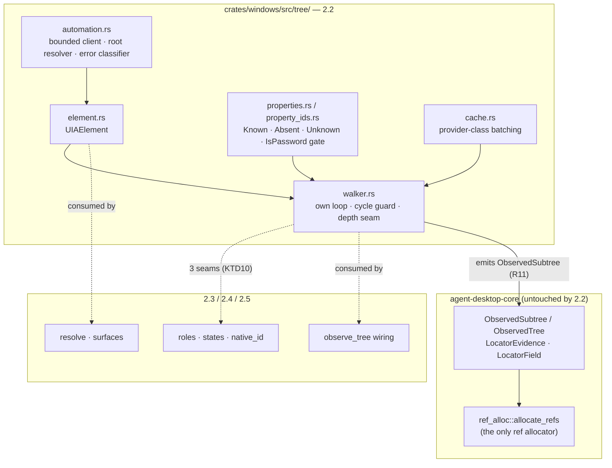
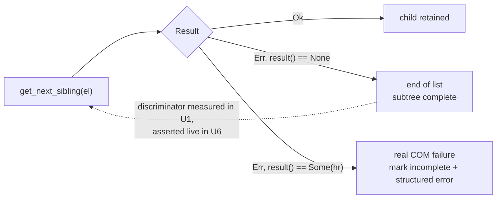

# UIA Element Wrapper & Tree Walk (Sub-phase 2.2) - Plan

## Goal Capsule

- **Objective:** Own a UIA element wrapper and a raw tree walk that 2.4 can wire into the snapshot engine without reshaping it — proven against a window the test process creates itself, in a second process, because the two apps this sub-phase's exit criteria name cannot be asserted on the CI runner.
- **Authority hierarchy:** `docs/phases.md` §2.2 > `probes/windows/FINDINGS.md` (for `api-contract` rows, and for `app/provider` rows only where the row records its environment dependency explicitly) > this plan > implementer judgment. Where measured evidence contradicts the document, U9 amends the document in this same PR, per the source-of-truth feedback rule in the Platform Delivery Model.
- **Stop conditions:** Do not wire `ObservationOps::observe_tree` — that is 2.4. Do not implement roles, states, `native_id`, or name evidence content — that is 2.3. Do not implement `resolve.rs`, `surfaces.rs`, the web-wrapper predicate body, or Chromium detection — 2.4/2.5. Do not allocate refs. Do not register a self-hosted runner. If U1 returns an answer this plan did not anticipate, take the pre-committed branch in U1 rather than reverting to inference.
- **Execution profile:** One PR into `feat/windows-adapter`, never `main`. Budget ≈2.5-3k lines of hand-written Rust across fourteen files; committed JSON captures, the PowerShell probe, and the workflow YAML are evidence artifacts and are excluded from that figure, matching how sub-phase 2.0's 21k-insertion probe corpus was accounted. Whether evidence artifacts count against the Platform Delivery Model's 2,000-changed-line cap is an Open Question, not an assumption. Conventional Commits.
- **Tail ownership:** The implementer opens the PR against `feat/windows-adapter` and reports the Verification Contract results.

---

## Product Contract

### Summary

Sub-phase 2.1 landed the Windows toolchain, an MTA apartment, and a private-file layer; `crates/windows/src/tree/` is an empty module. 2.2 fills it with the four things every later observation sub-phase consumes: an element wrapper with sound ownership, a UIA client and window-root resolver constructed against the apartment 2.1 already owns, a tree walk with a cycle guard and honest error classification, and a `CacheRequest` layer that batches only when batching pays. It ships a tree-dump example and committed COM dumps as dev-box evidence, and it corrects five statements in `docs/phases.md` that 2.0's ledger and this plan's research disprove.

### Problem Frame

The walker is not the hard part. Five things make this sub-phase easy to get silently wrong:

**The crate's own child enumeration is unsafe for a snapshot.** `uiautomation::UITreeWalker::get_children` is `while let Ok(next) = self.get_next_sibling(&current)`, which swallows end-of-siblings and a cross-process RPC failure through the same arm. A hung target yields a truncated tree with no error. End-of-list arrives as `Err`, not `Option`, and the only discriminator is `Error::result()` — a mechanical claim that must be **measured against the real crate**, not encoded from a reading of its source, because a hand-built fake would only ever confirm the implementer's model of it.

**UIA has no per-property error channel.** macOS gets a parallel array where an absent slot is `kCFNull` and a failed slot carries the per-attribute error (`crates/macos/src/tree/node_attribute_decode.rs:19-39`). UIA has neither: an unavailable property returns a `UiaGetReservedNotSupportedValue()` sentinel that must be compared by pointer identity, and `VT_EMPTY` is ambiguous between "absent" and "not implemented". Core's `LocatorField::{Known, Absent, Unknown}` distinction is load-bearing — `Unknown` fails `EvidenceRequirements::satisfies()` and blocks projection, `Absent` is legitimate. Collapsing the two degrades completeness gating silently.

**Both named exit-criteria targets are untestable in CI.** `windows-latest` is Server 2025 (ledger C-11), Windows 11 24H2-based, shipping the Win11 shell; the dev box is Server 2019 build 17763 with the Win10-1809 ribbon Explorer. Every 2.0 tree row is `scope: app/provider`, which the probe corpus's own scope rule (`FINDINGS.md` KTD7 — a probe row may outrank `docs/phases.md` only when its scope is `api-contract`) keeps from travelling. Worse, the committed dumps are **managed-stack** while this sub-phase ships a UIA3 **COM** client: A2-4 measured the identical Notepad window as 3 nodes managed and 26 nodes COM. And on Win11 24H2 an app-execution-alias reparse point redirects even an explicit `C:\Windows\System32\notepad.exe` to the Store RichEdit app, so a test can walk the wrong Notepad and never learn it did.

**A test process automating its own window never crosses a process boundary.** A self-created window is served by in-process client-side providers, so the failure taxonomy the walker exists to classify — RPC failure versus exhaustion, a blocking `WM_GETOBJECT`, a target that stops pumping — is structurally unreachable from an in-process fixture, and a cache policy validated against it is validated against exactly the provider class that policy says to skip. The fixture must therefore be hostable in a **second process**.

**Five of this sub-phase's own scope items have zero measured evidence.** 2.0 could not observe refcounts (both its stacks were CLR-managed), never exercised a cycle, never read an uncached property off a cached element, never moved an element across threads, and never killed a target mid-walk — leaving no HRESULT mapping for any UIA failure, which Invariant 8's `platform_detail` format needs.

### Requirements

- **R1.** A CI capability probe converts the runner-environment inferences and the end-of-list discriminator into measured evidence before any unit that depends on them is written, with a pre-committed action for every answer including "unmeasurable".
- **R2.** `uiautomation` and the `windows-sys` additions enter `crates/windows` only, target-gated, without tripping the core-isolation gates or the 15 MiB binary cap.
- **R3.** A `UIAElement` wrapper owns element identity for the crate: inner field unreachable outside the module, no `Copy`, by-value conversion into `NativeHandle`, and a downcast guard that rejects a foreign payload.
- **R4.** The UIA client is constructed without initialising COM, on a thread model Microsoft's threading guidance permits, and a **production** window-root resolver maps an HWND to a root element with U1's measured HRESULT encoded into the error mapping.
- **R5.** Property reads distinguish `Known`, `Absent`, and `Unknown`; every UIA property id comes from the crate's generated constants; and no value-bearing property is read from an element whose `IsPassword` is true.
- **R6.** The tree walk uses its own child-enumeration loop that classifies end-of-list separately from failure, guards cycles on an ancestor path, bounds raw and logical depth independently through a seam that lets them diverge, and never marks a truncated tree complete.
- **R7.** `CacheRequest` batching is conditional on a signal available before the walk, keeps `ElementMode::Full`, and its correctness — not its timing — is asserted against an out-of-process provider.
- **R8.** A tree-dump example produces COM dumps of Notepad and Explorer, committed as dev-box evidence with host identifiers normalised, recording the target variant and client stack.
- **R9.** Every assertion that runs in CI is provider-independent; no test asserts a node count, tree shape, timing multiplier, or any other `app/provider` fact.
- **R10.** Statements in `docs/phases.md` that this sub-phase's evidence disproves are corrected in place, in this PR.
- **R11.** The walk's output is constructible into core's `ObservedSubtree`/`ObservedTree` without a translation layer in 2.4, with every `LocatorEvidence` slot populated per R5 and the tri-state preserved.
- **R12.** No error raised by the walk, a property read, or the client carries app-derived content — only shape.

### Key Decisions

- **The UIA client is constructed by direct `CoCreateInstance`, never through `UIAutomation::new()`.** (session-settled: user-directed — the stated instruction named `UIAutomation::new_direct()`; implementation showed that constructor builds `CUIAutomation`, which has no `IUIAutomation2` and therefore no call timeout, so `ElementFromHandle` against a window that stopped dispatching blocks indefinitely (A14-11, A14-12). The prohibition is kept and the property that motivated it is kept — the same direct `CoCreateInstance`, never `CoInitializeEx` — while the CLSID moves to `CUIAutomation8` so the calls can be bounded.) Governs R4. See KTD1.
- **The element wrapper preserves `AXElement`'s encapsulation invariants but delegates refcounting to `windows-core`.** (session-settled: user-approved — the stated instruction was "Clone must AddRef, Drop must Release"; source verification showed the crate already does exactly that, so hand-writing it would double-release. The invariant is kept; the mechanism is delegated.) Governs R3.
- **The cycle guard is an ancestor path, never a global visited set.** (session-settled: user-directed.) Governs R6. The macOS rationale does not transfer — see KTD4.
- **No test hardcodes a machine-specific fact.** (session-settled: user-directed.) Governs R9.

### Scope Boundaries

- **Out:** `ObservationOps::observe_tree` wiring, `get_tree`/`get_subtree`, `list_windows`, `list_apps`, `focused_window`, `list_displays`, surface detection, the web-wrapper predicate **body**, Chromium detection, resolver depth — all 2.4 (`docs/phases.md:1026-1040`). 2.2 ships the seam the predicate plugs into (KTD10), not the predicate.
- **Out:** role mapping, state vocabulary, `AutomationId` → `native_id`, name evidence — 2.3 (`docs/phases.md:1008-1018`).
- **Out:** element re-identification from `RefEntry` — 2.5.
- **Out:** any action, pattern invocation, or input synthesis — 2.6+. The walk never calls `SetFocus`: A3-4 measured that `SetFocus` moved the desktop foreground, so it is not headless.
- **Out:** ref allocation of any kind. `crates/core/src/ref_alloc.rs::allocate_refs` is the only recursive allocator in the product.
- **Out:** self-hosted runner registration — 2.12. This plan records a measured fact about the hosted runner (U9 amendment 5) but does not restate 2.12's justification; that belongs to 2.12's own plan and its own evidence.
- **Deferred to follow-up:** capturing the shared "mirror a platform crate's memory- and cycle-safety pattern" lesson as a `docs/solutions/` entry once both adapters exist.

---

## Planning Contract

### Key Technical Decisions

- **KTD1. `new_direct()` — the recorded reason is wrong, the decision is right.** Governs R4. `docs/phases.md:999` says `new()` "would re-initialise the apartment 2.1 established". Source verification of 0.25.0 shows otherwise: `new()` calls `CoInitializeEx(None, COINIT_MULTITHREADED)` and proceeds when `HRESULT::is_ok()`, which is `>= 0`. On a thread already in the MTA that returns `S_FALSE` (1) — success, with the apartment's init count incremented. `UIAutomation` has no `Drop` and the crate never calls `CoUninitialize`, so each `new()` permanently leaks one initialisation count. The *hard* failure is the **STA** case: `RPC_E_CHANGED_MODE` is negative, so `new()` returns `Err` on any host thread already in an STA. Two real reasons to construct directly rather than through `new()`: it works inside an STA host, and it leaks nothing in a long-lived process (Phase 5's daemon). U9 amendment 3 corrects the document.
  **`new_direct()` itself proved insufficient, for a reason outside this decision's frame.** It is `CoCreateInstance(&CUIAutomation, …)`, and that object returns `E_NOINTERFACE` for `IUIAutomation2`, where `SetConnectionTimeout` lives — so every call through it is unbounded, and `ElementFromHandle` against a window whose thread stopped dispatching blocks rather than timing out (A14-11: 59.09 s through a 30 s watchdog, against `UIA_E_TIMEOUT` in 2.05 s once the timeout is set; A14-12 records that the crate's client cannot reach the setter). The shipped client is `CoCreateInstance(&CUIAutomation8, …)` with `ConnectionTimeout` set, and there is no fallback to the unbounded one — a client whose calls cannot be bounded is refused. Both properties above survive unchanged, and `UIAutomation::new()` is still never called.

- **KTD2. The wrapper keeps `AXElement`'s encapsulation and delegates its refcounting.** Governs R3. Verified from 0.25.0 source: `pub struct UIElement { element: IUIAutomationElement }` derives `Clone` and has **no `Drop` impl** — `windows-core`'s generated COM types implement `Clone` as `AddRef` and `Drop` as `Release`. Adding a hand-written `Drop` would double-release. What transfers from `crates/macos/src/tree/ax_element.rs:7-30` is the encapsulation: inner field `pub(crate)`, no `Copy`, no raw accessor, `into_native_handle(self)` by value. Thread affinity comes free — `UIElement`, `UIAutomation`, `UITreeWalker`, `UICacheRequest`, `Handle` are all `!Send + !Sync` — so no `PhantomData` and **no `unsafe impl Send`** anywhere in this sub-phase.

- **KTD3. The walk owns its enumeration loop, and the discriminator is measured, not reasoned.** Governs R1, R6. `UITreeWalker::get_children` cannot distinguish exhaustion from failure and is banned. The replacement rests on: windows-rs `Type::from_abi` returns `Err(Error::empty())` on a null out-param, and `windows-result` 0.4.1's `Error::empty()` sets a sentinel reporting `HRESULT(0)`; so `err.result().is_none()` should mean benign end-of-list and `Some(negative_hr)` a real failure. **That chain has one unverified link** (`uiautomation`'s `From<windows_result::Error>` body). If it is inverted, every failure classifies as benign and a truncated tree reports complete. U1 measures the real `code()`/`result()` pair at exhaustion and at a forced failure; U6 depends on U1 and asserts completeness live, so an inverted discriminator fails a test rather than passing silently.

- **KTD4. The cycle guard is kept; its stated rationale and its key both change.** Governs R6. `docs/phases.md:995` justifies the guard as "mirrors macOS: reused pointers across sibling branches" — a macOS mechanism imported wholesale. 2.0 measured nothing about UIA element identity reuse; neither 2.0 walker even calls `GetParent`. The guard is still correct, for a different reason: UIA returns a *new* `IUIAutomationElement` proxy per query, so pointer identity is meaningless. The key becomes `get_runtime_id() -> Result<Vec<i32>>` with `compare_elements` as fallback. The *semantics* port unchanged from `crates/macos/src/tree/query/traversal.rs`: insert on entry (`:73-78`), remove on **every** exit path (`:82`, `:120`, `:157`). U9 amendment 2 corrects the rationale.

- **KTD5. Batching is conditional on provider class, not node count.** Governs R7. `docs/phases.md:1003` requires the dump binary print both trees "with batched reads". A6-2 measured batching on classic Notepad as a **pessimization** (0.5763x overall, find phase 0.436x) because Notepad is served by `UIAutomationClientsideProviders` *inside the client process*, so an uncached read costs no cross-process RPC. A6-1 measured Explorer at 2.69x overall, below the documented 3-5x, with the find phase 1.5x *slower* and the read phase ~298x faster. The API Mapping table at `:1106` already records this; §2.2 was never amended, so the two disagree.
  **A node-count threshold is not implementable and is deliberately excluded:** the cache request must be built *before* the walk, but node count is known only *after* it, so the arm would have no input at decision time — an implementer would either add a `FindAll` probe per subtree (eroding the win A6-1 measured, whose find pass was already slower) or wire it to a constant. The constant is also uncalibrated: A6-2 is `managed`-stack and `app/provider`-scoped, and A2-4 measured that same window as 3 nodes managed against 26 COM, so a "3 nodes" threshold is roughly 9x off for the COM client this sub-phase ships. Policy: cache only properties that will be read, and skip the cache when a root-level `ProviderDescription` read indicates an in-process client-side provider — the mechanism, which generalises, rather than the number, which does not. The node-count crossover moves to Open Questions.

- **KTD6. `ElementMode::Full` always; `TreeScope` is not bitflags.** Governs R7. Microsoft: with `AutomationElementMode_None` "you do not have access to any uncached properties and control patterns" and "cannot call methods that perform actions on the control, such as `Invoke`" — which would break every command from 2.6 onward. Separately, `uiautomation::types::TreeScope` is a plain enum (`Element=1, Children=2, Descendants=4, Parent=8, Ancestors=16, Subtree=7`) with **no bitwise operators**; only `Subtree` is pre-combined. Microsoft warns the scope is relative to the retrieved element, so omitting `Element` silently fails to cache the root's own properties. Whether `TreeScope::try_from(3)` succeeds is settled by a U7 test, not an assumption.

- **KTD7. Property ids come from generated constants, never literals.** Governs R5. A2-5 measured that pattern-availability property ids are **build-specific** — `IsAnnotationPatternAvailable` is 30118 on build 17763, while 30113 is a different property — and the row names 2.2 explicitly: a hand-written table is "the single most likely silent failure in a Rust pattern-availability check". Use `uiautomation::types::UIProperty` and `UIPatternType`. The internal-set → `UIProperty` mapping is an exhaustive `match` with no catch-all arm.

- **KTD8. CI asserts invariants against a self-created window hosted out-of-process; the named apps are dev-box evidence.** Governs R8, R9. Three independent blockers make app-based CI assertions unsound: SKU (Server 2025's Win11 shell vs the dev box's 2019 ribbon Explorer; A10-7 records this box cannot present the modern shells), stack (A2-4's 26-vs-3 divergence), and the probe corpus's scope rule (`FINDINGS.md` KTD7). None of those three depends on the runner-session inference, so this conclusion stands independently of the weakest evidence in this plan. The Win11 24H2 app-execution-alias makes the Notepad trap silent. **The fixture is hosted in a child process** so the walk crosses a real process boundary; an in-process variant is retained only for teardown and concurrency tests. Any incidental app touch in CI asserts at most "a Window root resolves with >0 descendants".

- **KTD9. The fixture window's threading is prescribed, not incidental.** Governs R4, R9. Microsoft's UIA threading guidance: a client automating its own UI "should make all UI Automation calls from a separate thread… This thread should not own any windows, and should be a Multithreaded Apartment (MTA) model thread". `ElementFromHandle` sends `WM_GETOBJECT`, and a cross-thread `SendMessage` blocks until the receiving thread pumps, so the fixture's window thread must pump for the whole call. The window must be genuinely visible with a non-zero rect: `HwndProxyElementProvider` excludes windows failing `IsWindowVisible` or having a zero-area rect, and sibling navigation on such a window raises `ElementNotAvailable`. Off-screen positioning is fine; `SW_HIDE` is not. Message-only windows are unsupported — no evidence exists either way, and they would fail the visibility rule.

- **KTD10. Three seams, called but not implemented.** Governs R5, R6, and the 2.3/2.4 boundary. The macOS traversal calls two vocabulary functions — `roles::ax_role_and_subrole_to_str` (`crates/macos/src/tree/query/node_read.rs:89-94`) and `action_list::read_platform_available_actions` (`:142-150`). 2.2 calls two Windows analogues returning `"unknown"` and an empty action list, so 2.3 fills bodies without touching traversal. A **third** seam is required for R6 to be testable: on macOS the only thing that makes logical depth diverge from raw depth is the web-wrapper predicate, which is deferred to 2.4 — so without a seam, U6's divergence test asserts behaviour 2.2 ships no mechanism to produce. 2.2 defines `is_web_wrapper(&UIAElement) -> bool` returning `false`, called where child logical depth is computed, so the fake can force divergence now and 2.4 fills the body without editing `walker.rs`.

- **KTD11. Non-Windows twins are mandatory, for tree files and platform-crate examples alike.** Governs R2. Every macOS tree file carries a `#[cfg(not(target_os = "macos"))] mod imp` mirror, and 2.1 established the convention at `crates/windows/src/system/com_runtime.rs:149-175`. CI's `platform-check` matrix only checks each crate on its native OS, so a missing twin passes CI and breaks the documented local workspace commands. This extends to `examples/`: `cargo check --all-targets` compiles them, and an example referencing the target-gated `uiautomation` breaks the Linux gate. `crates/macos/examples/ax_probe.rs` is the precedent — every item gated, plus a `#[cfg(not(...))] fn main()` stub.

- **KTD12. The walker takes an arbitrary root element.** Governs R6. `ElementFromHandle` is one root source, not the entry signature. 2.5's drill-down must re-enter at a stored ref, and the progressive-snapshot contract requires drill-down to reuse the single traversal rather than fork a second one.

- **KTD13. The secure-field gate lands in 2.2, not 2.3.** Governs R5. 2.2 ships the property set *and* the `CacheRequest` that decide what is fetched from a foreign process, so deferring the gate forces 2.3 to retrofit it into an already-built batch or pay the second round trip KTD5 exists to avoid. macOS solves it in exactly this layer — `safe_attribute_mask` and `should_read_value` at `crates/macos/src/tree/node_attribute_names.rs:137-163`, pinned by its own regression test. `UIA_IsPasswordPropertyId` rides in the same cache request as the properties it gates, and every value-bearing property returns `Absent` when it is true. The claim that "UIA already refuses `ValuePattern.Value`" covers one pattern and says nothing about `Name`, `HelpText`, or `LegacyIAccessible.Value`; it is unverified and moves into U1's measurement list.

- **KTD14. Errors carry shape, never app-derived content.** Governs R12. The repo codified this at `docs/solutions/conventions/keep-raw-arguments-out-of-trace-reachable-error-messages.md`, and the mechanism is live: `crates/core/src/ref_action.rs:238` clones `error.message` and `:289` clones `err.details` into `actionability.check.error`, which reaches session JSONL segments and `trace export` HTML. Once 2.4/2.6 wire these readers behind `get_live_*`, any element `Name`, `ClassName`, or property value baked into a walker error string is persisted. Errors carry the HRESULT, its symbolic name, the property id, node depth, child index, and character counts — never the value, `Name`, `ClassName`, window title, or `ProviderDescription`.

### High-Level Technical Design

Where 2.2 sits, and what it deliberately does not touch:



The walk's error classification, which is the correctness core:



### Output Structure

```
probes/windows/
├── 14-ci-capability/            # U1: probe + captures
└── FINDINGS.md                  # U1: appended rows
.github/workflows/
└── windows-capability-probe.yml # U1: pull_request(paths) + workflow_dispatch
crates/windows/
├── Cargo.toml                   # U2: uiautomation; windows-sys feature add
├── examples/
│   └── uia_tree_dump.rs         # U8: dev-box dump tool, fully cfg-gated
└── src/tree/
    ├── mod.rs
    ├── element.rs               # U2
    ├── automation.rs            # U3: client, root resolver, error classifier
    ├── fixture.rs               # U4: #[cfg(test)] fixture, child-process host
    ├── properties.rs            # U5
    ├── property_ids.rs          # U5
    ├── walker.rs                # U6  (split if it nears 400 lines)
    ├── cache.rs                 # U7
    └── *_tests.rs               # sibling test modules per repo convention
docs/phases.md                   # U9: five in-place corrections
```

Per-unit `**Files:**` lists are authoritative; this tree is a scope declaration.

---

## Implementation Units

### U1. Measure the runner and the discriminator before designing against them

- **Goal:** Convert the inferences this plan rests on into measured evidence, with a pre-committed action for every possible answer.
- **Requirements:** R1, R9.
- **Dependencies:** none. Runs before any Rust in this PR is written.
- **Files:** `probes/windows/14-ci-capability/probe.ps1`, `probes/windows/14-ci-capability/probe.rs`, `probes/windows/14-ci-capability/captures/*.json`, `.github/workflows/windows-capability-probe.yml`, `probes/windows/FINDINGS.md`.
- **Approach:** **The trigger is `pull_request` with a path filter, plus `workflow_dispatch`.** GitHub triggers `workflow_dispatch` only for workflow files present on the **default branch**, which is `main` — and this PR must never touch `main`. A `pull_request` event runs the workflow from the PR head ref, so the probe executes on this sub-phase's own PR; the retained `workflow_dispatch` becomes usable once `feat/windows-adapter` merges. This lands as a standing workflow rather than a one-off script because the Platform Delivery Model lets later sub-phases extend the probe corpus, and 2.3-2.10 each face the same measure-before-design need; the file is path-filtered so it adds no time to the required lanes.
  Measure, as committed JSON: session id and `qwinsta`; `GetProcessWindowStation` and `[Environment]::UserInteractive`; **whether a window created by the probe process itself is visible, non-zero-rect, and UIA-walkable from a second MTA thread** — the single fact U4's entire strategy rests on; and, from a small Rust probe against the real crate, **the exact `code()`/`result()` pair returned at sibling exhaustion and at a forced enumeration failure** (KTD3), plus whether `ValuePattern.Value`, `Name`, and `HelpText` return content on an `ES_PASSWORD` control (KTD13).
  **Pre-committed actions.** If the discriminator is inverted or ambiguous, U6 classifies on the measured pair and the fake enumerators are rebuilt from it. If the runner cannot host a walkable window, U2/U3/U5's non-window tests still land in this PR, while U4, U6's live smoke, and U7's cache correctness move to 2.12 behind the self-hosted interactive runner, and the Verification Contract records R5/R7 as **unmet**, not green. "Unmeasurable" is a branch, never a silent revert to inference.
- **Execution note:** Given the repo's history — 1,062 LOC deleted for shipping platform code CI could not execute — writing the Verification Contract on inference when a ten-minute probe settles it is the same bet.
- **Patterns to follow:** `probes/windows/` corpus structure and `FINDINGS.md` row format from 2.0; `.github/workflows/native-e2e.yml` for a non-required Windows-capable job.
- **Test scenarios:**
  - The workflow runs on this PR without any change to `main`, and its path filter confines it to the probe directory and its own workflow file.
  - Every probe output is committed as JSON beside the script and is re-runnable.
  - Each appended `FINDINGS.md` row carries a `scope:` value; runner-environment rows also record the image version.
  - `ProviderDescription` values in committed output are normalised (see U8's rule).
- **Verification:** the workflow completes on `windows-latest`; captures are committed; the three Open Questions U1 owns (`TreeScope::try_from(3)` is settled in U7 instead — see below), the end-of-list discriminator, the self-created-window walkability, and the `IsPassword` leak question are each answered or explicitly recorded as still-unknown **with their pre-committed branch taken**; and the runner-environment inferences in the first Risks bullet are replaced by committed rows.

### U2. Add the UIA dependencies and the element wrapper

- **Goal:** `crates/windows` can hold a UIA element safely, and the new dependencies do not reach core or blow the size cap.
- **Requirements:** R2, R3.
- **Dependencies:** none.
- **Files:** `crates/windows/Cargo.toml`, `Cargo.lock`, `crates/windows/src/tree/mod.rs`, `crates/windows/src/tree/element.rs`, `crates/windows/src/tree/element_tests.rs`.
- **Approach:** Add `uiautomation = "0.25"` under `[target.'cfg(target_os = "windows")'.dependencies]`. Pin its features deliberately: defaults are `control` + `input` (transitively `pattern`); `process`, `clipboard`, `screenshot`, `event` are not default and belong to later sub-phases.
  Extend the **existing** `windows-sys` dependency with `Win32_UI_WindowsAndMessaging` — U4's fixture needs `RegisterClassExW`, `CreateWindowExW`, `ShowWindow`, `GetMessageW`, `DispatchMessageW`, and 2.1's feature list lacks them. Prefer `windows-sys` because it is already linked; do not reach for the `windows` crate for these. Add `windows` itself only if a symbolic HRESULT table needs it — the pure UIA path does not, because `uiautomation::types::Handle` implements `From<isize>`. These are three distinct crates: `uiautomation`'s `control` feature enables `windows/Win32_UI_WindowsAndMessaging`, which is not the `windows-sys` feature above. If `windows` is added, its version must unify with `^0.62.2`.
  Define `pub(crate) struct UIAElement(pub(crate) uiautomation::UIElement)` — `pub(crate)` inner, no `Copy`, no raw accessor, no hand-written `Clone`/`Drop` (KTD2). Provide `into_native_handle(self) -> NativeHandle` and a `uia_element(handle: &NativeHandle) -> Result<&UIAElement, AdapterError>` downcast guard mirroring `crates/macos/src/adapter.rs:15-31`. Add the non-Windows twin (KTD11).
- **Patterns to follow:** `crates/macos/src/tree/ax_element.rs:7-30` for encapsulation shape (not `Clone`/`Drop`); `crates/macos/src/adapter.rs:15-31` and its tests at `:38-58`; `crates/windows/src/system/com_runtime.rs:149-175` for the twin convention.
- **Test scenarios:**
  - A wrapper converts into a `NativeHandle` and downcasts back to the same element.
  - The downcast guard rejects a null handle with `InvalidArgs`.
  - The downcast guard rejects a foreign payload — `NativeHandle::new(String::from("ax-token"))` must not masquerade as a `UIAElement`.
  - Cloning a wrapper and dropping both leaves the survivor usable — assert observable behaviour (a property read still succeeds), **not** `include_str!` source text; the macOS precedent at `crates/macos/src/tree/element_tests.rs:32-45` asserts on source text, which this repo's own learning calls not-a-test.
  - `cargo tree -p agent-desktop-core --edges normal,build,dev` unchanged on both host and MSVC targets.
- **Verification:** the widened core-isolation gate passes; the release binary stays under 15 MiB; the crate compiles for a non-Windows target.

### U3. Construct the client, the root resolver, and the error classifier

- **Goal:** A UIA client that never initialises COM, a production HWND-to-root resolver, and one error classifier everything downstream shares.
- **Requirements:** R4, R12.
- **Dependencies:** U1, U2.
- **Files:** `crates/windows/src/tree/automation.rs`, `crates/windows/src/tree/automation_tests.rs`, `crates/windows/src/tree/mod.rs`.
- **Approach:** A client accessor constructing directly with `CoCreateInstance(&CUIAutomation8, …)` and setting `ConnectionTimeout`, never `UIAutomation::new()`; 2.1's bootstrap already guarantees the COM precondition, so the accessor asserts rather than establishes it and returns a structured error if COM is uninitialised (`CO_E_NOTINITIALIZED`). It also serializes the first UI Automation call across threads: the client core initialises lazily and not re-entrantly, and concurrent first touches fail with `E_FAIL` "Re-Entrant CheckInit() call, aborting" (A14-13).
  **The root resolver is production code, not fixture code** — `pub(crate) fn root_from_hwnd(hwnd: isize, deadline) -> Result<UIAElement, AdapterError>` wrapping `element_from_handle`, encoding U1's measured HRESULT into the `WINDOW_NOT_FOUND` versus `ELEMENT_NOT_FOUND` mapping. The origin's §2.2 scope names "`ElementFromHandle` roots for window entry" as a deliverable; without this, 2.4 re-implements it inside its own budget.
  Build the shared error classifier here: `uiautomation::Error` mixes its own positive sentinels (`ERR_NONE=0`, `ERR_NOTFOUND=1`, `ERR_TIMEOUT=2`, …) into the same `i32` as HRESULTs, so `code()` alone is ambiguous — branch on `result()`. `Some(hr)` formats via the **existing** helper; `None` maps the sentinel to an `ErrorCode` and must not print a fabricated HRESULT. Every message obeys KTD14.
- **Execution note:** Write the classifier tests first. The sentinel-versus-HRESULT ambiguity is the branch a happy-path implementation gets wrong, and every later unit inherits it.
- **Patterns to follow:** `crates/windows/src/system/com_runtime.rs` for the `OnceLock`-guarded accessor and `#[cfg]`-split `mod imp`; `crates/windows/src/system/permissions.rs:133-139` — `com_hresult_detail` already emits `COM HRESULT 0x{code:08X} (E_ACCESSDENIED: Access is denied)` and is pinned by `permissions_tests.rs:54` and `:67`, so U3 **extends its match arms** rather than writing a second formatter.
- **Test scenarios:**
  - An error carrying a negative HRESULT formats exactly as `COM HRESULT 0x80070005 (E_ACCESSDENIED: Access is denied)`.
  - An error carrying a crate sentinel (`ERR_TIMEOUT`) maps to `TIMEOUT` and its message contains no `0x` HRESULT text.
  - An unrecognised sentinel maps to `INTERNAL`, not a guess.
  - `root_from_hwnd` on a destroyed HWND returns the `ErrorCode` U1 measured, and on a valid fixture window returns a walkable root (Windows-gated).
  - A classifier error message contains no app-derived content (KTD14) — asserted with a unique marker.
  - The non-Windows `imp` arm returns canned values so these tests run on any lane.
- **Verification:** client construction and root resolution succeed on the Windows lane; no code path calls `UIAutomation::new()`, asserted by grep.

### U4. Build the fixture window, hosted out-of-process

- **Goal:** A window the test suite fully controls, walkable across a real process boundary, with no dependency on any installed application.
- **Requirements:** R9.
- **Dependencies:** U1, U3.
- **Files:** `crates/windows/src/tree/fixture.rs`, `crates/windows/src/tree/fixture_tests.rs` (split window-creation from the pump if either nears 400 lines).
- **Approach:** A `#[cfg(all(test, target_os = "windows"))]` harness that registers a window class and creates a top-level window with standard `BUTTON` / `EDIT` / `STATIC` children plus one `ES_PASSWORD` `EDIT` (KTD13's fixture), running a message pump on its own thread. Window creation uses `windows-sys` with the feature U2 adds.
  **Child-process mode is the default for walk tests:** the test binary re-executes itself with an env flag to host the fixture in a second process, so `ElementFromHandle` and the walk cross a real process boundary and exercise the failure taxonomy an in-process provider cannot produce (KTD8). The in-process variant is retained only for teardown and concurrency tests.
  Constraints that are correctness requirements: UIA calls run on a thread that owns no windows and is in the MTA (KTD9); the window is genuinely visible with a non-zero rect (`SW_SHOWNOACTIVATE`, off-screen, since the runner has one shared 1024x768 desktop); the pump runs for the duration of every UIA call. Ship a comctl32 v6 activation context so standard controls get full UIA support. Settle the class-name question explicitly — a per-fixture-unique class name, or one registration behind a `OnceLock` — because `RegisterClassExW` returns `ERROR_CLASS_ALREADY_EXISTS` when parallel tests re-register.
- **Execution note:** Never block the window thread on the UIA thread's result; that is the documented deadlock. Prove the harness before building on it.
- **Patterns to follow:** `crates/windows/src/system/com_runtime.rs` for MTA-thread assertions; `crates/windows/src/system/private_file/tests.rs` for scratch-resource teardown.
- **Test scenarios:**
  - A child-process fixture is created, `root_from_hwnd` resolves it, and the walk finds the created child controls.
  - The fixture tears down with no leaked class, thread, or child process, and a second fixture in the same process succeeds.
  - Two fixtures created concurrently do not interfere.
  - The harness exposes no path that issues a UIA call from the window's own thread.
  - Assert the *rule* for a minimized window (top-level reports an empty rect while descendants report real extents, `IsOffscreen` false throughout) rather than this box's `-32000` literal, per A1-2.
- **Verification:** fixture-backed tests pass on the Windows lane, stable across three consecutive runs; no coordinate literal is asserted; the child-process host is the one used by U6 and U7.

### U5. Read properties with an honest discriminator and a secure-field gate

- **Goal:** Property reads that distinguish "the provider says empty" from "the read failed", never leak secure content, and never leak content into errors.
- **Requirements:** R5, R11, R12.
- **Dependencies:** U3, U4.
- **Files:** `crates/windows/src/tree/properties.rs`, `crates/windows/src/tree/property_ids.rs`, `crates/windows/src/tree/properties_tests.rs`.
- **Approach:** Map an internal property set to `uiautomation::types::UIProperty` through an **exhaustive `match` with no catch-all arm** (KTD7). Build the discriminator UIA lacks: a not-supported sentinel compared by pointer identity, `VT_EMPTY` resolved conservatively, and a per-read outcome of `Known` / `Absent` / `Unknown` matching core's `LocatorField`. Bound every string read and mark truncation `Unknown` rather than presenting it as exact identity evidence.
  **The secure-field gate ships here (KTD13):** `UIA_IsPasswordPropertyId` is added to every cache request so it arrives in the same batch as the properties it gates, and every value-bearing property returns `Absent` when it is true — the Windows analogue of macOS's `safe_attribute_mask` + `should_read_value`.
  Populate the full `LocatorEvidence` slot set (R11): role and available-actions come from KTD10's seams, `identifiers` uses `IdentifierEvidence::typed` with `IdentifierKind::AutomationId` — `IdentifierEvidence::new` stamps `Unknown` and would silently void every ref downstream in `refs_validate.rs`.
- **Execution note:** Write the Absent-versus-Unknown tests before the reader. This is the distinction that silently degrades everything downstream if collapsed, and a happy-path implementation cannot tell the two apart.
- **Patterns to follow:** `crates/macos/src/tree/query/node_evidence.rs:40-46` (`option_field`) for the tri-state; `crates/macos/src/tree/node_attribute_status.rs:91-104` for absent-versus-unknown classification; `crates/macos/src/tree/node_attribute_names.rs:137-163` (`safe_attribute_mask`, `should_read_value`) for the secure-field guard; `crates/core/src/live_locator/locator_evidence.rs` for the target shape; `docs/solutions/conventions/keep-raw-arguments-out-of-trace-reachable-error-messages.md` for KTD14.
- **Test scenarios:**
  - A property the provider does not implement yields `Absent`, not `Unknown`.
  - A property whose read fails yields `Unknown`, not `Absent`.
  - An empty-but-present string yields `Known("")`.
  - A string past the field bound yields `Unknown` and is not truncated into evidence.
  - Text typed into the fixture's `ES_PASSWORD` control never appears in any read outcome, for `Value`, `Name`, and `HelpText`.
  - A failed read against a control whose text is a unique marker produces an error whose message, details, and `platform_detail` contain no marker — mirroring `crates/core/src/context_scope_tests.rs:133`.
  - No literal property-id integer appears in the source, asserted by grep (A2-5).
- **Verification:** the tri-state, secure-field, and redaction tests pass on the Windows lane; the id-literal grep passes; the mapping is exhaustive.

### U6. Walk the tree with a cycle guard and honest completeness

- **Goal:** A traversal that never silently truncates, never loops, bounds itself the way core expects, and emits what 2.4 can consume unchanged.
- **Requirements:** R6, R11, R12.
- **Dependencies:** U1, U4, U5.
- **Files:** `crates/windows/src/tree/walker.rs`, `crates/windows/src/tree/walker_tests.rs` (this file carries the enumeration loop, cycle guard, two depth counters, completeness propagation, and a non-Windows twin — split it before it reaches 400 lines; the size gate runs on the macOS lane and the Windows dev box will not catch a breach).
- **Approach:** Write the child-enumeration loop directly on `get_first_child` / `get_next_sibling`, classifying each `Err` **by the pair U1 measured** (KTD3): benign exhaustion ends the sibling list and leaves the subtree complete; a real failure marks the tree incomplete and surfaces a structured error obeying KTD14. Never call `UITreeWalker::get_children`.
  Guard cycles on an ancestor path keyed by runtime id, `compare_elements` as fallback (KTD4), inserting on entry and removing on **every** exit path. Keep raw and logical depth counters independent, with logical depth advancing through KTD10's `is_web_wrapper` seam so divergence is producible in 2.2 and fillable in 2.4.
  Emit `ObservedSubtree` (R11): `ObservedSubtree::new(evidence, children, subtree_complete, children_count)` with `.with_source_child_index(i)` recording the **native** child index — a walker that skips children must still record it or `RefEntry.scope.path` becomes unresolvable — and `.with_predecessors_complete(...)`. The root is assembled via `ObservedTree::from_roots(roots, ObservationSource::from_root(&root), LocatorStats::default(), structurally_complete)`. The walk never allocates refs, and its entry point takes an arbitrary root element (KTD12).
- **Execution note:** Test the cycle guard against an in-memory fake enumerator that returns a repeated identity — a live window will not reliably reproduce identity reuse, so a real-window-only test would silently never enter the guard branch. Build the fakes **from U1's measured error pair**, not from a reading of the crate, or they only confirm the implementer's model.
- **Patterns to follow:** `crates/macos/src/tree/query/traversal.rs:73-78`, `:82`, `:120`, `:157` (guard insert and all three removes); `:133` (logical-vs-raw depth); `:180-185` (raw-depth cap and incompleteness); `crates/macos/src/tree/query/arena.rs:6` and `:42-50` (ancestor set, handle-balance assertion).
- **Test scenarios:**
  - A fake returning a repeated identity is skipped once, the skip is counted, and the walk terminates.
  - A fake returning benign exhaustion produces a **complete** subtree.
  - A fake returning a real failure produces an **incomplete** tree and a structured error, not a truncated success.
  - Raw-depth exhaustion marks incomplete and emits a child count instead of children.
  - Logical and raw depth diverge when `is_web_wrapper` is forced true by the fake.
  - Cycle-guard removal happens on the error exit path: a fake failing mid-subtree leaves the ancestor set empty.
  - A **live child-process** fixture walk terminates, finds the created controls, and **reports complete** — so an inverted discriminator fails here (Windows-gated).
  - The complete case produces a value `into_accessibility_tree()` accepts; the incomplete case one it refuses.
  - The walk never calls `SetFocus`, asserted by grep (A3-4).
- **Verification:** fake-driven tests pass on any lane; the live cross-process walk passes on the Windows lane; the guard is observed skipping a cyclic fake; the emitted subtree round-trips through core's projection.

### U7. Batch reads only when the provider class makes it pay

- **Goal:** `CacheRequest` support whose correctness is asserted against a real cross-process provider and whose cost is not assumed.
- **Requirements:** R7, R11.
- **Dependencies:** U5, U6.
- **Files:** `crates/windows/src/tree/cache.rs`, `crates/windows/src/tree/cache_tests.rs`.
- **Approach:** Build with `create_cache_request()`, then `add_property` per property (every setter takes `&self`, not `&mut self`; there is no builder type). Always keep `ElementMode::Full` (KTD6). Include `TreeScope::Element` in whatever scope is chosen, since omitting it silently fails to cache the retrieved element's own properties; `TreeScope` has no bitwise operators, so a test settles whether `TreeScope::try_from(3)` succeeds and the code encodes the answer.
  Apply KTD5's policy: cache only properties that will be read, and skip caching when a root-level `ProviderDescription` read indicates an in-process client-side provider. **There is no node-count arm** — the count is unknown when the request is built. Add `UIA_IsPasswordPropertyId` to every request (KTD13). Reading a property absent from the request is an error, not a live fetch; classify it `Unknown`, never `Absent`.
- **Execution note:** Assert cache correctness, never cache timing, and assert it against the **child-process** fixture — an in-process provider is exactly the class the policy says to skip, so validating there would validate the wrong branch.
- **Patterns to follow:** `crates/macos/src/tree/node_attribute_names.rs:97-135` (demand-driven masks — request only what the evidence plan needs); `crates/macos/src/tree/node_attribute_fetch.rs:77-131` (per-slot outcome decoding).
- **Test scenarios:**
  - Against the child-process fixture, a cached read returns the same value as an uncached read of the same property.
  - Reading a property not added to the request yields `Unknown` plus a structured error — never a silent live fetch and never `Absent`; the test records the HRESULT observed.
  - `ElementMode::Full` leaves live getters working after a cached read.
  - `TreeScope::try_from(3)` behaviour is asserted, and the scope the code uses includes `Element`.
  - The policy skips caching for an in-process `ProviderDescription` and engages for a cross-process one, asserted on the policy function with synthetic inputs.
  - No timing multiplier is asserted anywhere, checked by grep over this module.
- **Verification:** correctness tests pass on the Windows lane against the child-process fixture; no timing assertion exists in the suite.

### U8. Produce the committed COM dumps

- **Goal:** The evidence §2.2 asks for, in the client stack this sub-phase actually ships.
- **Requirements:** R8.
- **Dependencies:** U6, U7.
- **Files:** `crates/windows/examples/uia_tree_dump.rs`, `docs/plans/2026-07-27-002-captures/notepad-com.json`, `docs/plans/2026-07-27-002-captures/explorer-com.json`.
- **Approach:** An example binary taking a window selector and a view, walking the tree and writing JSON with per-node `ControlType`, `ClassName`, `AutomationId`, `Name` **presence only**, bounds, parent index, and `ProviderDescription`. Run it on the dev box against classic Notepad and an Explorer folder window; commit both captures recording target variant, OS build, and client stack — the metadata whose absence made 2.0's managed dumps unusable as COM expectations.
  **Normalise host data before writing**, as 2.0's own captures already do (`probes/windows/captures/08-uia3-com/census.json` substitutes `pid:<pid>,providerId:<providerid>`): `Name` is presence-only by rule, and pids, provider ids, window handles, and user paths are substituted. **Gate every item behind `#[cfg(target_os = "windows")]` with a `#[cfg(not(...))] fn main()` stub** (KTD11) — `cargo check --all-targets` compiles examples, and an ungated reference to the target-gated `uiautomation` breaks the Linux gate. The tool is prerequisite-aware: an unresolvable target reports skipped, never a false green.
- **Execution note:** For an Electron or Chromium target a first read understates the tree ~13x (A1-5, deterministic) — settle before capturing, and never capture behind another window (A1-6). Neither applies to Notepad or Explorer, but the tool should not encourage the mistake.
- **Patterns to follow:** `crates/macos/examples/ax_probe.rs` for the fully-gated example shape; `crates/core/examples/locator_benchmark` for the example convention; `probes/windows/captures/08-uia3-com/census.json` for capture field shape and normalisation.
- **Test scenarios:**
  - The example compiles under `cargo clippy --all-targets` on the Windows lane **and** under the Linux cross-check.
  - Running it against a non-existent window reports skipped with a structured reason and a non-zero exit, not a silent empty dump.
  - Each committed capture records target variant, OS build, and client stack.
  - The committed captures contain no raw decimal pid, no `hwnd:0x` literal, and no `C:\Users\` path — a rule assertion, not a content assertion, so it does not violate KTD8.
- **Verification:** both captures committed with full metadata and normalisation; the example runs clean on the dev box; nothing in CI asserts capture contents.

### U9. Correct the five statements this sub-phase disproves

- **Goal:** `docs/phases.md` stops contradicting the measured evidence and itself.
- **Requirements:** R10.
- **Dependencies:** U1, U5, U6, U7.
- **Files:** `docs/phases.md`.
- **Approach:** Five in-place amendments — corrected, never annotated:
  1. **§2.2 scope and exit criteria (`:996`, `:1003`).** Replace the unconditional "with batched reads" with the conditional rule the API Mapping table at `:1106` already carries, citing A6-1 and A6-2. This reconciles an existing internal inconsistency rather than overturning a live criterion.
  2. **§2.2 cycle-guard rationale (`:995`).** Replace "mirrors macOS: reused pointers across sibling branches" with the Windows-true reason: UIA returns a new element proxy per query, so the guard keys on runtime id. The ancestor-path-not-global-set requirement stands.
  3. **§2.2 `new_direct()` reason (`:999`).** Replace "would re-initialise the apartment 2.1 already established" with KTD1's verified reasons: `new()` returns `S_FALSE` on an MTA thread and permanently leaks one init count in a long-lived process, and returns `Err(RPC_E_CHANGED_MODE)` on any STA host thread.
  4. **§2.4 exit criteria (`:1044`).** The current text — `snapshot --app Notepad -i`, "50+ refs" in VS Code, "≥100 refs with `--force-electron-a11y`" — is exactly the `app/provider` assertion class R9 and KTD8 forbid, against apps whose presence on `windows-latest` nothing establishes. Replace the fixed thresholds and named-app assertions with rule-shaped criteria (a resolvable root with a non-empty descendant set; depth-skip demonstrably reducing consumed depth budget on any wrapper-bearing target) plus an explicit skip-with-reason when the app is absent from the runner image. 2.4 is the sub-phase directly downstream of this one; leaving it means its planner writes tests R9 forbids or discovers mid-sub-phase that its gate is unreachable.
  5. **§2.12 — record, do not restate.** Append one `app/provider`-marked sentence recording the hosted runner's measured session state from U1 and citing Microsoft's contrary Azure Pipelines guidance. **Leave 2.12's self-hosted-runner justification intact** — the claim being corrected is true in its own context (a service-mode self-hosted runner), and rewriting it on evidence this plan's own Risks section calls third-party and one image old would weaken the recorded case for the only gate that would ever re-validate the walk against real apps on a representative shell.
- **Patterns to follow:** the amendment style applied in commits `31ffd5f` and `4206c72`.
- **Test scenarios:** `Test expectation: none -- documentation only.` Replacement verification: `src/cli/contract_tests.rs` `include_str!`s `.github/workflows/ci.yml`, not `phases.md`, so no test breaks; the review checks each amendment against its cited row.
- **Verification:** each amended statement cites the evidence that disproved it; no annotation-style text is added.

---

## Verification Contract

| Gate | Command / check | Applies to |
|---|---|---|
| Repo gates (Windows dev box) | `cargo fmt --all -- --check`; `cargo clippy --locked -p agent-desktop-core -p agent-desktop-windows -p agent-desktop -p agent-desktop-ffi --all-targets -- -D warnings`; `cargo test --locked -p agent-desktop-core -p agent-desktop-windows --lib` | whole PR |
| Cross-platform compile | `cargo check --locked -p agent-desktop-windows --all-targets --target x86_64-unknown-linux-gnu` — the only proof the non-Windows twins **and the example** compile | U2-U8 |
| Core isolation | `cargo tree -p agent-desktop-core --edges normal,build,dev` on host and MSVC targets contains no platform or Win32 binding crate; the source-level gate still finds exactly two allowlisted `cfg(windows)` shims | U2 |
| Probe branch taken | every U1 question is answered or its pre-committed branch is recorded as taken; no gate below rests on an unmeasured inference | U1 |
| Fake-driven walk correctness | cycle skip, benign-exhaustion completeness, real-failure incompleteness, depth exhaustion, and forced depth divergence each asserted against an in-memory enumerator built from U1's measured error pair | U6 |
| Cross-process live walk | the child-process fixture walk resolves a root, finds the created controls, and **reports complete**, stable across three consecutive runs | U4, U6 |
| Output shape | the complete case produces a value core's `into_accessibility_tree()` accepts; the incomplete case one it refuses | U5, U6 |
| Cache correctness | against the child-process fixture: cached equals uncached; an uncached property yields `Unknown` plus a structured error; `TreeScope::try_from(3)` behaviour asserted; no timing assertion exists | U7 |
| Secure content | text in the fixture's `ES_PASSWORD` control never appears in any read outcome for `Value`, `Name`, or `HelpText` | U5 |
| Error redaction | a failed read against a marker-named control produces an error whose message, details, and `platform_detail` contain no marker | U3, U5, U6, U7 |
| Evidence honesty | no test asserts a node count, tree shape, timing multiplier, coordinate literal, or any `app/provider` fact | U4-U8 |
| No banned calls | no `UIAutomation::new()`, no `UITreeWalker::get_children`, no `SetFocus`, no literal UIA property-id integer — each asserted by grep | U3, U5, U6 |
| Size | Windows release binary under 15 MiB with `uiautomation` linked | U2 |
| Dev-box evidence | both COM captures committed with variant, build, client stack, and host-data normalisation | U8 |
| Doc truth | each of the five `docs/phases.md` amendments cites the row or source that disproved the prior statement | U9 |
| PR is green | every required check on a PR into `feat/windows-adapter`, never `main` | whole PR |

**Pre-commit note.** `.githooks/pre-commit` runs unqualified `cargo clippy --all-targets` and `cargo test --lib --workspace`, both of which resolve through `default-members` and fail on a Windows dev box. Commit with `SKIP_PRECOMMIT=1` and run the package-scoped forms above instead.

**File-size note.** `scripts/check-rust-file-size.sh` runs on the **macOS** lane over every repo `.rs` file at a 400-line cap, plus `check_rust_comments.py`. A Windows-only local check will not catch a violation; `walker.rs` is the likeliest breach and should be split proactively.

**Workflow-coupling note.** `src/cli/contract_tests.rs` `include_str!`s `ci.yml` and asserts exact substrings from the Windows lane. U1 adds a *separate* workflow file and does not touch `ci.yml`; any incidental edit to the Windows lane during this sub-phase must be followed by `cargo test -p agent-desktop`.

## Definition of Done

- A PR from `feat/windows-2.2-uia-tree-walk` into `feat/windows-adapter` is open and green.
- U1 ran on this PR without touching `main`, its rows are committed, and every question it could not answer has its pre-committed branch recorded as taken.
- `UIAElement` encapsulates its element with no `Copy`, no raw accessor, no hand-written `Clone`/`Drop`, and no `unsafe impl Send` anywhere in the sub-phase.
- The client is constructed by direct `CoCreateInstance` on `CUIAutomation8` with `ConnectionTimeout` set, `UIAutomation::new()` is never called and no unbounded fallback exists, a production `root_from_hwnd` encodes U1's measured HRESULT mapping, and errors branch on `result()` so a crate sentinel never prints a fabricated HRESULT.
- The walk owns its enumeration loop, classifies exhaustion from failure using the measured pair, guards cycles on an ancestor path keyed by runtime id, diverges logical from raw depth through the `is_web_wrapper` seam, and reports complete on a live cross-process walk.
- The walk's output is constructible into `ObservedSubtree`/`ObservedTree` and round-trips through core's projection.
- Property reads distinguish `Known`, `Absent`, and `Unknown`; no value-bearing property is read from a password field; no UIA property id appears as a literal.
- `CacheRequest` correctness is asserted against a cross-process provider, timing is not, `ElementMode::Full` is never weakened, and no node-count arm exists.
- No error raised anywhere in this sub-phase carries app-derived content.
- Committed COM dumps of Notepad and Explorer exist as dev-box evidence, normalised, recording variant, build, and client stack.
- `ObservationOps::observe_tree` still returns `PLATFORM_NOT_SUPPORTED`; no ref is allocated anywhere in `crates/windows`.
- The five `docs/phases.md` statements are corrected in place with their disproving evidence cited.

---

## Risks & Dependencies

- **The runner-environment evidence is third-party and one image old.** The interactive-session conclusion rests on one public workflow's observations and one WinAppDriver issue, both captured on **windows-2022**, not the current Server 2025 image; Microsoft's Azure Pipelines guidance states the opposite for *its* hosted agents (scoped to Selenium interactability and a different agent deployment, but a genuine contrary vendor source). U1 replaces this inference with measurement and pre-commits the branch if it fails. Note KTD8's three blockers do **not** depend on this inference.
- **The walk reads across an integrity boundary.** A9-2 measured that from Medium against a High-integrity target, name, ClassName, ControlType, bounds, and node count return byte-identical — so walked content can originate in elevated UI. 2.2 deliberately applies no integrity gate, because A9-2 settles observation as available and not to be refused; the UIPI gate belongs to 2.6's input path.
- **`^0.62.2` is a caret range, not a pin.** `uiautomation` 0.25.0 requires `windows ^0.62.2` and `windows-core ^0.62.2`; it resolves to 0.62.2 only because nothing newer exists in range. `--locked` contains the blast radius, but the recorded "pin" at `docs/phases.md:1323` is looser than it reads — which is why U3's and U7's HRESULT facts are tests, not committed JSON: a test fails loudly when the dependency moves.
- **UIA's hang guard is weaker than the macOS one.** macOS slices every IPC with `AXUIElementSetMessagingTimeout` at 250 ms. UIA has no per-element equivalent; `ConnectionTimeout` (2 s) and `TransactionTimeout` (20 s) are not documented to bound the `WM_GETOBJECT` `SendMessage` that `ElementFromHandle` issues. Whether a non-pumping target produces a clean timeout or a hang is unverified, and the fixture cannot produce the condition.
- **A UIA client can permanently bind the wrong provider.** A1-7 measured that reading a WPF window before its automation peer exists binds the generic HWND provider *permanently* — zero children, and a 30 s poll including a forced `FindAll` never recovered it; recovery needed a new HWND or a new client.
- **A tree walk is not exhaustive over the HWND set.** A5-2 measured a zero-size control reachable by `GetDlgItem` and `ElementFromHandle`, visible, and returned by *no* walk on either stack.
- **An `ElementFromHandle` root can span processes.** A1-3 measured Settings resolving as an `ApplicationFrameWindow` in one pid containing a `CoreWindow` in another, with a 49-node walk spanning both. Any pid-based scoping breaks on UWP.
- **The fixture is a new dependency on runner desktop behaviour.** It needs a visible, non-zero-rect window plus a child process on a shared 1024x768 desktop with parallel tests running. U1 measures viability first and U4 depends on it; U6's correctness branches stay fake-driven so a fixture outage degrades coverage rather than blocking the sub-phase.
- **Five scope items had zero prior evidence.** Refcount behaviour, cycle occurrence, cache-miss semantics, cross-apartment element use, and mid-walk process death were unmeasurable or unmeasured in 2.0. U1 closes two; U3/U7 close two as tests; cross-apartment use is avoided by construction rather than characterised. Real-platform confirmation of cycle occurrence will still not exist after this PR — the guard is cheap insurance against a condition nobody has observed on Windows.

## Open Questions

- **At what node count does `CacheRequest` stop being a pessimization against an out-of-process provider?** A6-1 and A6-2 bracket it between 3 and 220 with nothing measured between, and both are managed-stack or single-target. KTD5 deliberately ships no threshold; the crossover wants a dev-box measurement row before any node-count arm is reintroduced.
- **Does the repo-wide "Definition of Done: Performance Baseline" apply to this sub-phase?** The Verification Contract bans timing assertions in CI while `scripts/perf-baseline-compare.sh` is a macOS/AX harness that cannot run here, leaving conditional batching with no calibration path in-repo. Needs a one-line ruling for every remaining Windows sub-phase, not just this one.
- **Do committed evidence artifacts count against the Platform Delivery Model's 2,000-changed-line cap?** 2.0 landed 21,048 insertions and 2.1 landed 4,921 against a ~1.3k estimate, which implies exclusion in practice, but no rule states it and the origin's exclusion list (Cargo.lock, generated FFI header, vendored fixtures) does not obviously cover captures.
- **Does the walk cross a UWP process boundary transparently?** A1-3 records the shape; nothing measures what fails when the hosted process dies mid-walk. Deferred to 2.4, which owns UWP window identity.
- **Should U8's captures live under `probes/windows/captures/` rather than beside this plan?** The cross-cutting DoD says probe evidence is committed alongside the sub-phase plan, but 2.0's normalisation tooling lives in the probe tree. Deferred; U8 applies the normalisation rule either way.

## Sources & Research

- `docs/phases.md` §2.2 (`:988-1006`), §2.4 (`:1026-1044`), Windows API Mapping (`:1101-1130`), Windows Engineering Invariants (`:826-838`), cross-cutting DoD (`:942-952`), recorded pins (`:1314-1344`).
- `probes/windows/FINDINGS.md` rows A1-1, A1-2, A1-3, A1-5, A1-6, A1-7, A2-1, A2-2, A2-3, A2-4, A2-5, A3-4, A5-2, A6-1, A6-2, A7-1, A7-2, A7-3, A7-4, A8-4, A9-2, A10-1, A10-2, A10-7, C-9, C-11, and the ledger's own KTD7 scope rule.
- `probes/windows/captures/08-uia3-com/{census,walker,cache-timing,ids}.json`; `captures/01-tree-dump/{notepad,explorer,settings,summary}.json`.
- macOS reference: `crates/macos/src/tree/ax_element.rs:7-30`; `query/traversal.rs:62-78`, `:82`, `:120`, `:133`, `:157`, `:180-185`; `query/arena.rs:6`, `:42-50`; `query/node_evidence.rs:40-46`; `query/node_read.rs:89-94`, `:142-150`; `node_attribute_names.rs:97-135`, `:137-163`; `node_attribute_fetch.rs:77-131`; `node_attribute_status.rs:91-104`; `bounded_string.rs:10-46`; `crates/macos/src/adapter.rs:15-31`; `crates/macos/examples/ax_probe.rs`.
- Core contracts: `crates/core/src/adapter/observation.rs:29-161`; `live_locator/{observed_tree,observed_subtree,locator_evidence,observation_request,observation_budget}.rs`; `node.rs`; `role.rs`; `roles.rs:6-25`; `ref_alloc.rs:66-78`; `refs_validate.rs`; `ref_action.rs:238`, `:289`; `context_scope_tests.rs:133`.
- Sub-phase 2.1 as merged (`18daaa8`, `00a4282`): `crates/windows/src/system/com_runtime.rs`, `session.rs`, `permissions.rs:133-139`; `src/main.rs:196`; `crates/ffi/src/adapter.rs:117`.
- `docs/solutions/best-practices/never-ship-platform-code-that-ci-cannot-execute.md`; `real-app-tests-are-the-platform-adapter-gate.md`; `deduplicate-ref-allocator-via-config-struct-2026-04-14.md`; `logic-errors/progressive-snapshot-review-contract-2026-04-16.md`; `conventions/keep-raw-arguments-out-of-trace-reachable-error-messages.md`.
- `uiautomation` 0.25.0 verified against docs.rs and `docs.rs/uiautomation/0.25.0/src/uiautomation/core.rs.html` (constructors, `Handle`, `UITreeWalker`, `UICacheRequest`, `Error`); crates.io metadata for the `windows ^0.62.2` requirement. **The crate's GitHub `_autodocs/` directory documents a cache API that does not exist (`tree_scope(&mut self, …)` versus the real `set_tree_scope(&self, …)`) — do not copy from it.**
- Microsoft Learn: [UI Automation Threading Issues](https://learn.microsoft.com/en-us/windows/win32/winauto/uiauto-threading), [Caching for Clients](https://learn.microsoft.com/en-us/windows/win32/winauto/uiauto-cachingforclients), [Handling WM_GETOBJECT](https://learn.microsoft.com/en-us/windows/win32/winauto/handling-the-wm-getobject-message), [GetRuntimeId](https://learn.microsoft.com/en-us/windows/win32/api/uiautomationclient/nf-uiautomationclient-iuiautomationelement-getruntimeid), [UIA Support for Standard Controls](https://learn.microsoft.com/en-us/dotnet/framework/ui-automation/ui-automation-support-for-standard-controls), [Configure for UI testing](https://learn.microsoft.com/en-us/azure/devops/pipelines/test/ui-testing-considerations) (the contrary Azure Pipelines source).
- GitHub Actions: [Events that trigger workflows — `workflow_dispatch`](https://docs.github.com/en/actions/reference/workflows-and-actions/events-that-trigger-workflows) (default-branch requirement); [actions/runner-images Windows2025-Readme](https://github.com/actions/runner-images); [maruel/query-github-runner](https://github.com/maruel/query-github-runner); [microsoft/WinAppDriver#1789](https://github.com/microsoft/WinAppDriver/issues/1789); [microsoft/winappCli ui-automation docs](https://github.com/microsoft/winappCli/blob/main/docs/ui-automation.md).
