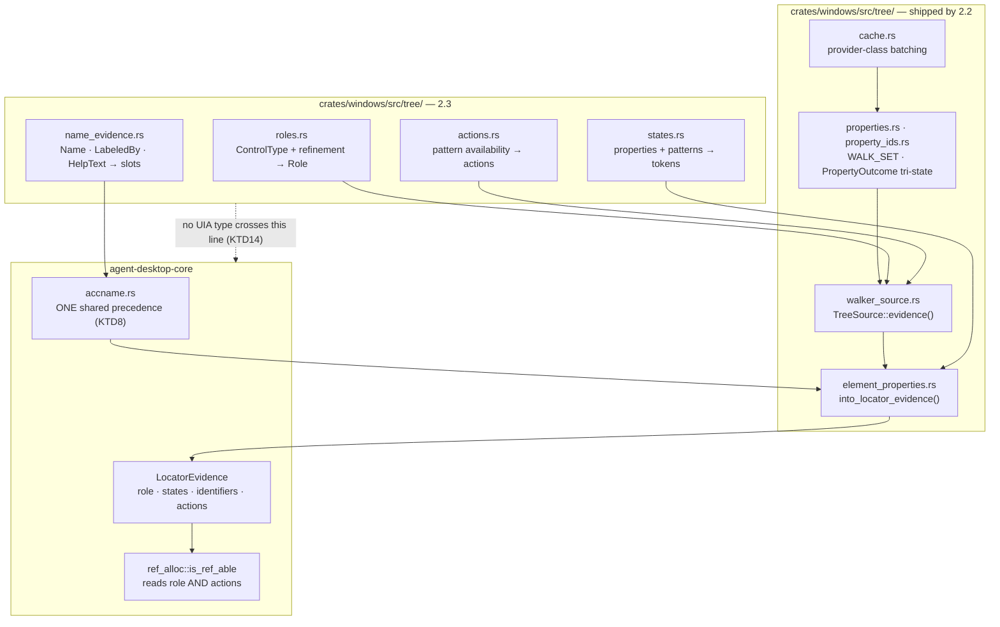
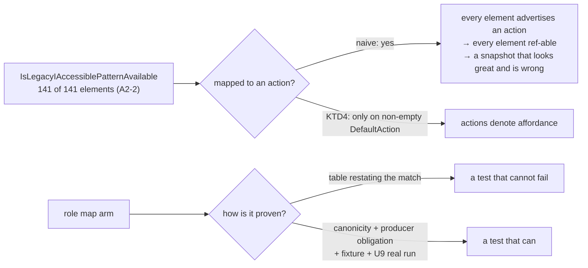

# Vocabulary — Roles, States, native_id, Name Evidence (Sub-phase 2.3) - Plan

## Goal Capsule

- **Objective:** Give the Windows tree a vocabulary. 2.2 ships a walk that emits `LocatorField::Unknown` for role, actions and states; 2.3 turns UIA's `ControlType`, pattern availability, state properties and name properties into the canonical vocabulary core already defines — and proves the mapping is right by **running it against real applications**, because a mapping table cannot be validated by a test that restates it.
- **Authority hierarchy:** `docs/phases.md` §2.3 > `probes/windows/FINDINGS.md` (for `api-contract` rows, and for `app/provider` rows only where the row records its environment dependency explicitly, per the ledger's own KTD7) > this plan > implementer judgment. Where measured evidence contradicts the document, U10 amends the document in this same PR, per the source-of-truth feedback rule in the Platform Delivery Model.
- **Stop conditions:** Do not wire `ObservationOps::observe_tree`, `get_tree`, `list_windows`, or surface detection — that is 2.4. Do not implement `resolve_element_strict*` or the `get_live_*` readers — that is 2.5. Do not invoke a pattern, perform an action, or synthesise input — that is 2.6+. Do not fill `is_web_wrapper` — that is 2.4. Do not allocate refs. If U1 returns an answer this plan did not anticipate, take the pre-committed branch in U1 rather than reverting to inference.
- **Execution profile:** One PR from `feat/windows-2.3-vocabulary` into `feat/windows-adapter`, never `main`. Budget ≈2.2–2.6k lines of hand-written Rust; the probe, the dogfood report and committed captures are evidence artifacts, accounted the way 2.0's and 2.2's were. This exceeds both the origin's ~1.5k estimate — written before the missing `states` plumbing (KTD3), the accname drift (KTD8), and the available-actions table this plan's own settled decision moves into 2.3 were known — and the Platform Delivery Model's 2,000-changed-line cap at `docs/phases.md:799`. **The overrun is real, named, and decided rather than deferred.** U10 amends the cap's exclusion list to cover probe corpora, captures and reports — what practice has excluded for three sub-phases running — so the cap governs hand-written product code. This sub-phase's Rust still exceeds the corrected cap, and that stays stated here rather than defined away: it lands as one PR because the work does not split without shipping dead code, since U3–U5 produce vocabulary nothing reads until U7 wires the seams, and U9 is what establishes any of it is correct. If the owner nevertheless wants a split, **U6 is the only clean seam** — the accname reconciliation is the sole unit touching `crates/macos`, carries its own guard in the golden fixtures, and Windows can supply `native_title` alone until it lands. Do not split U3–U5 from U7. Conventional Commits.
- **Tail ownership:** The implementer opens the PR against `feat/windows-adapter` and reports the Verification Contract results.

---

## Product Contract

### Summary

`crates/windows/src/tree/` can walk a real application's tree and read its properties, but every node it emits is semantically blank: `role` is `Unknown`, `available_actions` is `Unknown`, `states` is `Unknown` and has no plumbing at all. 2.3 supplies the four vocabularies core is waiting for — `ControlType` → `Role`, pattern availability → available actions, UIA state properties → `STATE_VOCABULARY` tokens, and `Name`/`LabeledBy`/`HelpText` → `NameEvidence` — then verifies `AutomationId` → `native_id`, which 2.2 already shipped ahead of its nominal scope.

It also closes a contract that is currently false: `docs/phases.md` says core computes the accessible name, and core's `accname::compute_name` exists and is tested, but **it has no production caller**. The name that reaches every snapshot today comes from a macOS-adapter-local reimplementation whose precedence disagrees with core's. Writing a third divergent copy for Windows is the one outcome this sub-phase must not produce.

### Problem Frame

Five things make this sub-phase easy to get silently wrong, and every one of them has already bitten this repository or been measured on this platform.

**A mapping table cannot be tested against itself.** The exit criterion — "vocabulary conformance tests span every UIA `ControlType` (complete mapping coverage, not a sample)" — is satisfied most cheaply by a test that iterates a table of expectations transcribed from the same `match` arms it checks. That is `assert_eq!(LEAF_SHARING & FILE_SHARE_DELETE, 0)` in role-mapping clothing: the single test that guarded 1,062 lines of Windows code which then failed 225 of 940 tests on first contact with Windows (`docs/solutions/best-practices/never-ship-platform-code-that-ci-cannot-execute.md`). Totality and correctness are different properties and need different proofs.

**`ControlType` alone is not sufficient, and this is measured, not suspected.** A2-4 (`uia3-com`, `app/provider`) measured classic Notepad's edit surface as `ControlType.Document` to the COM client, and its own action clause names this sub-phase: *"2.3's vocabulary map cannot key an editable text surface off ControlType alone."* Several canonical roles have no `ControlType` at all — UIA has no `Switch`, no `ColorWell` — and one pair inverts: UIA `Tab` (50018) is the container, which is core's `tablist`, while UIA `TabItem` (50019) is core's `tab`.

**Pattern availability is a trap on Windows in a way it is not on macOS.** A2-2 measured `LegacyIAccessible` advertised by **141 of 141** COM-walked elements. Core's ref-allocation rule is `INTERACTIVE_ROLES.contains(role) || advertises_primary_action(actions)` (`crates/core/src/ref_alloc.rs:70-78`), so an implementation that maps pattern availability to actions naively gives every element in every tree an action, and therefore a ref. The same row is why the pattern matters at all: on legacy Win32 surfaces `LegacyIAccessible` is *the only* affordance.

**The `states` slot has no plumbing, only a hole.** 2.2's plan describes three seams and shipped them (`walker.rs:151-176`). `states` is not among them: `element_properties.rs:114` writes `states: LocatorField::Unknown` as an inline literal with no parameter, no caller, and no fake support. This sub-phase's title names states as one of four deliverables; three of the four have a seam to fill and this one has plumbing to build, through two `TreeSource` implementations and a fake.

**The accessible-name contract describes a call graph that does not exist.** `crates/core/src/accname.rs` defines the precedence `explicit_label > labelled_by_text > native_title > static_value > child_label > placeholder > description` and is exported and tested. Nothing in production calls it. The operative implementation is `crates/macos/src/tree/query/evidence_fields.rs:54-76`, which ranks `description` **fifth**, ahead of `child_label` and `placeholder`, and additionally tracks per-source read uncertainty that core's version has no channel for. Windows can call core's version and diverge from macOS, or copy macOS's and make the drift permanent in a second crate.

### Requirements

- **R1.** Every vocabulary question with no measured evidence is measured before code is written against it, with a pre-committed action for every answer including "unmeasurable".
- **R2.** Every UIA `ControlType` maps to a canonical `Role`. Totality is proven by the compiler; correctness is proven by falsifiable evidence, never by a table asserted against the table it checks.
- **R3.** Role classification consumes the refinement evidence `ControlType` alone cannot supply, and never emits a role token core does not accept as canonical.
- **R4.** Available actions come from pattern availability without making every element ref-able, and the derivation is stated as a rule rather than a per-pattern reflex.
- **R5.** The `states` slot is plumbed end to end — producer, evidence projection, both `TreeSource` implementations and the fake — and every emitted token is a member of core's `STATE_VOCABULARY`.
- **R6.** The adapter supplies `NameEvidence` slots and does not compute a name; one shared computation produces the name for every platform, and macOS's shipped output does not change.
- **R7.** `native_id` carries `IdentifierKind::AutomationId`, is blank-filtered, and reports a failed read as incomplete evidence rather than as an absent identifier.
- **R8.** Every value-bearing property this sub-phase adds is covered by the secure-field gate before it is read into evidence.
- **R9.** No UIA-specific vocabulary logic enters `agent-desktop-core` — its only two edits are the shared name precedence (KTD8) and one visibility promotion (KTD4) — and no error raised anywhere in this sub-phase carries app-derived content.
- **R10.** Every assertion that runs in CI is provider-independent: no test asserts a node count, a tree shape, a coordinate literal, or any other `app/provider` fact.
- **R11.** The vocabulary is exercised by **running it against real applications** across distinct UI stacks; its output is judged, its findings are fixed or recorded, and the run is committed as a durable report.
- **R12.** Statements in `docs/phases.md` that this sub-phase's evidence disproves are corrected in place, in this PR.

### Key Decisions

- **Available actions are this sub-phase's, not 2.5's or 2.7's.** (session-settled: user-directed — the instruction was to plan 2.3 as `docs/phases.md` defines it; `docs/phases.md:1011-1015` omits actions from the scope list, but A2-1's action clause assigns *"2.3's role and actionability tables"* to this sub-phase, 2.2 shipped the `walk_available_actions` seam for 2.3 to fill, core's ref allocation reads the list, and role refinement needs the same pattern-availability reads. The scope list is corrected rather than the assignment.) Governs R4. See KTD4.
- **Correctness of the vocabulary is established by running it, not by unit tests alone.** (session-settled: user-directed — "test everything as real by running instead of just running the tests".) Governs R2, R11. See KTD2 and U9.
- **No test asserts a machine-specific or application-specific fact.** (session-settled: user-directed, carried forward from sub-phase 2.2.) Governs R10.

### Scope Boundaries

- **Out:** `ObservationOps::observe_tree` wiring, `get_tree`/`get_subtree`, `list_windows`, `list_apps`, `focused_window`, `list_displays`, surface detection, the `is_web_wrapper` body, Chromium detection, resolver depth — all 2.4 (`docs/phases.md:1026-1040`).
- **Out:** `resolve_element_strict*`, `get_live_value`/`get_live_state`/`get_live_actions`/`get_live_element`, `resolve_query` — 2.5 (`docs/phases.md:1053-1057`). 2.3 produces the vocabulary those readers will re-read; it does not implement the readers.
- **Out:** invoking any pattern, performing any action, `ScrollItemPattern.ScrollIntoView`, hit testing, occlusion — 2.6/2.7. Reading `IsInvokePatternAvailable` is observation; calling `Invoke` is not.
- **Out:** ref allocation of any kind. `crates/core/src/ref_alloc.rs::allocate_refs` remains the only allocator in the product.
- **Out:** the `subrole`, `role_description`, `placeholder`, `dom_id` and `dom_classes` evidence fields of P2-O8's expansion clause. `docs/phases.md:867` permits Phase 2 to add them; 2.3 completes only the `native_id` half named in its own scope, and records the rest as unclaimed.
- **Out:** a self-hosted or interactive runner — 2.12. The *judgement* runs on the developer machine and commits its report; no U9 assertion is a CI gate, because a role or count observed on a real application is the `app/provider` fact R10 forbids asserting. **What is not out of scope is running the tool on the hosted runner.** A14-1 measured `windows-latest` with an active interactive console session, and Notepad and Explorer ship with the image, so U8's census can run there through the existing probe workflow and upload its output as an artifact — asserting nothing, but giving the vocabulary a second environment automatically and on every push. This does not replace the dev-box run, which is where the judging happens; it stops "real applications cannot be reached from CI" from being an assumption every later sub-phase inherits untested.

### Deferred to Follow-Up Work

- Hoisting core's duplicated `LocatorEvidence::satisfies` logic out of `crates/macos/src/tree/query/node_evidence.rs:99-112`, where macOS reimplemented it line-for-line. 2.3 must not add a third copy, but removing the second one is not this sub-phase's work.
- Reading `LocalizedControlType`. It is the natural source for a future `role_description` field, but no sub-phase claims that field and nothing consumes it, so paying for it in every node's batch now would buy nothing. 2.3 leaves it unread; the sub-phase that claims `role_description` adds it.

---

## Planning Contract

### Key Technical Decisions

- **KTD1. Totality is a compiler property; correctness is an evidence property. They get different proofs.** Governs R2. `uiautomation::types::ControlType` is a plain `#[repr(i32)]` enum of 41 variants (`Button = 50000` … `AppBar = 50040`), with no `#[non_exhaustive]` and no catch-all. A `match` from it onto core's `Role` with no `_` arm is therefore *total by compilation* — adding a variant is a build error, not a silent fallthrough. That settles coverage without a single test.
  What no test may do is restate the map. The proofs of correctness are, in order: (a) **Microsoft's own published `ControlType`↔ARIA-role table**, which is a genuinely independent authority — it maps `tab`→`TabItem`, `tablist`→`Tab`, `textbox`→`Document`, `gridcell`→`DataItem`, `spinbutton`→`Spinner` and ~55 more rows, so a map that disagrees with it disagrees with the platform vendor rather than with its own transcription; (b) every emitted token satisfies `agent_desktop_core::roles::is_canonical_role`, the pattern macOS already runs at `crates/macos/src/tree/roles.rs:150-216` — note that macOS's version walks 58 representative inputs rather than all 71 it recognises, which Windows has no excuse for, since `ControlType` is a closed enum; (c) core's `INTERACTIVE_ROLES` producer obligation — its doc comment at `crates/core/src/roles.rs:2-5` requires each entry to be produced by at least one adapter, so the set Windows claims to produce is asserted against the set it actually produces, and a claim without a producer fails; (d) live assertions against the fixture, whose control classes are known independently of the map; and (e) U9's run against real applications, where every `unknown` is a finding. A per-arm equality table transcribed from the map's own arms is banned by name in the Verification Contract.

- **KTD2. `ControlType` is the key; `ClassName` and pattern availability are the refinement.** Governs R2, R3. A2-4 measured the counterexample and named this sub-phase in its action clause. Three refinement inputs, in this order of preference, all already available or added by U2:
  1. **Pattern availability** — the strongest signal, because it describes affordance rather than presentation. `Button` + `IsTogglePatternAvailable` is core's `switch` or `checkbox`, not `button`; `Button` + `IsExpandCollapsePatternAvailable` is `menubutton`; `ListItem` + `IsSelectionItemPatternAvailable` is `option`.
  2. **`ClassName`** — already in `TreeProperty::WALK_SET` and already fetched by every walk (`crates/windows/src/tree/property_ids.rs:38-49`), currently read by nothing. This is the discriminator A2-4's Notepad case needs.
  **`AriaRole` is deliberately not a 2.3 input, even though it looks like one.** It is the direct Windows analogue of macOS's subrole fold and the property Microsoft's ARIA table is written against, so the pull to use it is real. Three things say no: every refinement the map actually needs is pattern-driven (`Button`+`Toggle`, `List`+`Selection`, `Pane`+`Window`, `DataItem`+`GridItem`, `Document`+`Value`) and none of them consults it; it is populated by web and XAML content and empty on plain Win32, so it buys nothing on the stacks 2.3 must get right; and `subrole`, the field it feeds, is assigned to 2.4. Reading it here would add a property to every node's prefetch and a measurement to U1 to serve a field another sub-phase owns. 2.4 adds it alongside Chromium detection and the web-wrapper work, where it belongs.
  **`LocalizedControlType` is banned as a map key.** Microsoft documents it as either an OS-locale-dependent string supplied by UI Automation or an arbitrary provider-chosen string — it is display text by design, so a map keyed on it breaks on a non-English Windows and on any provider that customises it. 2.3 reads it only as future `role_description` material, never as a discriminator. This is settled by the vendor's documentation and is not U1's to measure.
  The known hard cases the implementer must resolve explicitly rather than discover: UIA `Tab`(50018) → core `tablist` and UIA `TabItem`(50019) → core `tab` (the inversion, which Microsoft's ARIA table confirms in that direction); `Edit`/`Document` → `textfield` per A2-4 and per Microsoft's `textbox`→`Document` row; `Custom`(50025) and `Pane`(50033), which carry no inherent semantics; `Switch` and `ColorWell`, which have no `ControlType` and are reachable only through refinement or not at all. Note that macOS's subrole fold is *primary-role-aware* — `AXToggleButton` does not collapse a checkbox into a button (`crates/macos/src/tree/roles.rs:90-93`) — and the Windows refinement needs the same care in the same place.

- **KTD3. The `states` slot is unbuilt plumbing, not a stub to fill.** Governs R5. `walk_role` and `walk_available_actions` are parameters threaded from `walker_source.rs:98-108` into `element_properties.rs:99-103`. `states` is not: `element_properties.rs:114` writes `LocatorField::Unknown` inline. 2.3 adds a third parameter to `into_locator_evidence`, threads it through **both** `TreeSource` implementations — the Windows one and the non-Windows canned `imp` twin at `walker_source.rs:117-172` — and gives `walker_fake.rs` a per-node property store so state assertions can be driven from a fake at all. `FakeTree::evidence()` is fixed today (`walker_fake.rs:120-126`); the scaffolding to copy is the `wrappers: HashSet<i32>` pattern already there for `is_web_wrapper`.

- **KTD4. Actions are derived from affordance, and `LegacyIAccessible` availability is not affordance.** Governs R4. A2-2 measured `LegacyIAccessible` on 141 of 141 COM-walked elements. `crates/core/src/ref_alloc.rs:74-78` refs any element advertising a non-`SetFocus` action. Mapping `IsLegacyIAccessiblePatternAvailable` to an action therefore refs every node in every tree — a defect that would look like a spectacularly successful snapshot. The rule that ships: **an action is emitted only for a pattern whose availability implies a specific affordance** (`Invoke`, `Toggle`, `ExpandCollapse`, `SelectionItem`, `Value` when not read-only, `RangeValue`, `Scroll`, `ScrollItem`), and `LegacyIAccessible` contributes exactly one action, `Click`, and **only** when its `DefaultAction` string is non-empty. That gate is cheap: `LegacyIAccessibleDefaultAction` is a plain property (id 30100, KTD5), so it batches with everything else rather than costing a pattern instantiation. What is unmeasured is not its cost but whether it is *informative* — genuinely non-empty on an affordance-bearing control and empty on inert text — which is U1's to settle before U4 encodes it. If U1 shows it is uninformative, the pre-committed branch is that `LegacyIAccessible` contributes no action in 2.3 and the gap is recorded for 2.7, which owns invocation.
  Emitted action names come from `crates/core/src/capability.rs`'s vocabulary. `SetFocus` may be emitted truthfully — core already declines to treat it as a primary action — but it must never be the only reason an element is ref-able.
  **This rule is only assertable if core exposes the predicate.** `is_ref_able_role_actions` is `pub(crate)` at `crates/core/src/ref_alloc.rs:70`, so a test in `crates/windows` cannot call it, and re-deriving the rule locally to assert it would be the tautology KTD1 bans. U4 promotes it to `pub` — the module is already `pub mod ref_alloc`, core is `publish = false` so this widens nothing outside the workspace, and "what makes an element ref-able" is exactly the shared contract an adapter needs rather than each adapter re-deriving it (the drift the deferred `LocatorEvidence::satisfies` duplication already illustrates). **This is a second deliberate touch to `crates/core` alongside KTD8's**, and the two are the only ones.

- **KTD5. Pattern-derived state is read as ordinary properties, so it costs one batch and no new machinery.** Governs R5, R7. The crate-idiomatic route to `ToggleState`, `ExpandCollapseState`, `SelectionItem.IsSelected`, `Value.IsReadOnly` and `Selection.CanSelectMultiple` is `get_pattern::<T>()`, a COM `QueryInterface` per node per pattern — on a 220-node tree with five pattern states, 1,100 extra cross-process round trips against a walk 2.2 tuned to batch. **That route is not taken, because UIA exposes every one of them as a plain automation property**, verified in the vendored crate's `UIProperty` enum: `ToggleToggleState = 30086`, `ExpandCollapseExpandCollapseState = 30070`, `SelectionItemIsSelected = 30079`, `ValueIsReadOnly = 30046`, `RangeValueIsReadOnly = 30048`, `SelectionCanSelectMultiple = 30060`, `WindowIsModal = 30077`, `LegacyIAccessibleState = 30096`, `LegacyIAccessibleDefaultAction = 30100`.
  They therefore go into `TreeProperty::WALK_SET` alongside every other property, arrive in the same cache request, and inherit 2.2's tri-state and provider-class policy unchanged. `UICacheRequest::add_pattern` is **not used**, no `get_pattern` call is made anywhere in this sub-phase, and no per-node pattern instantiation exists to be optimised later. The `Is*PatternAvailable` properties are still read — U3 needs them for role refinement and U4 for the action list — but they are no longer a cost gate, because the state read they would have gated is already in the batch.
  The one thing this does not settle is what a state property returns on an element whose provider does not implement the pattern: the not-supported sentinel (→ `Absent`) or something ambiguous. That is U1's to measure, because `Absent` and `Unknown` diverge downstream and 2.2's discriminator was built for string properties, not for these.

- **KTD6. Two of core's three orphan state tokens have a first-class UIA source; the third does not.** Governs R5. `crates/core/src/state.rs:17-31` reserves `invalid`, `multiselectable` and `haspopup` explicitly *"for adapters/platforms that can emit it"*. Microsoft's published ARIA state table settles where each comes from: `invalid` ← `IsDataValidForForm`, `multiselectable` ← `CanSelectMultiple`. Both are plain properties (KTD5) and 2.3 should produce them — leaving a token unproduced when the platform supplies it is what would need justifying.
  **`haspopup` is different, and so is `busy`.** The same table records both as having **no UI Automation property at all** — `haspopup` is `STATE_SYSTEM_HASPOPUP` in MSAA, `busy` is `STATE_SYSTEM_BUSY`, and each is otherwise reachable only through the `AriaProperties` string. So the only Windows source for either is `LegacyIAccessibleState`'s MSAA bitmask, whose content has never been read by any probe. Both are U1's to measure, and if the bits are not usable, both stay unproduced and that is recorded rather than faked. An earlier draft of this decision guessed `IsExpandCollapsePatternAvailable` as a `haspopup` source; the vendor's table says otherwise, and the table wins.

- **KTD7. `IsOffscreen` is not a substitute for macOS's geometric offscreen, and it contradicts itself within one window.** Governs R5. macOS computes `offscreen` geometrically, by intersecting element bounds with window bounds (`crates/macos/src/tree/state_reader.rs:86-95`). UIA has a first-class `IsOffscreen`, already in `WALK_SET` and already fetched. A14-8 (`uia3-com`, `app/provider`) measured that on a minimized fixture window the top level reports `IsOffscreen` **true** while every descendant reports **false**, and its action clause is explicit: *"a container reporting offscreen says nothing about descendants that are not"* — it must never be propagated to a subtree. The decision: emit `offscreen` from the element's own `IsOffscreen`, per element, never inherited, and do not re-derive macOS's geometric rule on Windows. Whether the two platforms should agree on what `offscreen` means is a real cross-platform question and belongs in Open Questions, not in a silent per-platform divergence.

- **KTD8. Windows must not become the third copy of the accessible-name precedence.** Governs R6. `crates/core/src/accname.rs` documents and tests the precedence; a whole-repo search finds **no production caller**. The live implementation is `crates/macos/src/tree/query/evidence_fields.rs:54-76`, which ranks `description` fifth rather than seventh and additionally carries a per-source uncertainty channel (`NodeAttributeStatus::field_unknown`) that core's `Option<String>`-returning version structurally cannot express. Those are not two implementations of one function; they are two fidelities, and only the lower-fidelity one is documented.
  **The decision:** 2.3 adds one uncertainty-aware precedence function to `crates/core/src/accname.rs` — `NameEvidence` plus per-slot known/absent/unknown status in, `LocatorField<String>` out — repoints macOS's `name_field`/`description_field` at it, and has Windows call the same function. The reconciliation adopts **macOS's shipped ordering**, and `compute_name`/`compute_description` are corrected to match it, so the documented order and the shipped order agree for the first time. This is chosen specifically because it changes no macOS output: the only behaviour that moves is `compute_name`'s, and a repo-wide search finds it referenced nowhere but its own definition and its own tests — not in `crates/macos`, `crates/ffi`, `src/`, or `tests/`. It is re-exported from `lib.rs`, but `crates/core/Cargo.toml` sets `publish = false`, so there is no external consumer for whom the ordering change is observable. The only edit its correction forces is to `accname_tests.rs`.
  This is the only place 2.3 touches `crates/macos`, and one of exactly two places it touches `crates/core` — the other is KTD4's one-line visibility promotion of `is_ref_able_role_actions`. `docs/phases.md:843` sanctions the macOS half — *"Every macOS backfill lands atomically with the Windows implementation so the two platforms never drift."* The guard is the macOS CI lane and `tests/fixtures/`: **if any golden fixture changes, stop and escalate rather than re-baselining.** The pre-committed fallback, if the ordering cannot be reconciled without moving macOS output, is that core gains the shared function, Windows calls it, macOS is left on its own path, and the divergence is written into `docs/phases.md` as a named defect owned by 2.15 — never left undocumented.

- **KTD9. `native_id` already ships; 2.3 verifies it and corrects the document.** Governs R7. `docs/phases.md:1014` and `:867` both place `AutomationId` → `native_id` in 2.3. 2.2 shipped it: `element_properties.rs:122-138` builds `IdentifierEvidence::typed` with `IdentifierKind::AutomationId`, filters blank values, and maps a failed read to `IdentifierEvidence::unknown()` rather than `absent()`; core projects `identifiers.preferred_identifier()` into `NodeIdentity::native_id` at `observed_tree.rs:136-140`. Every constraint that matters is already satisfied — `crates/core/src/refs_validate.rs:38-46` hard-rejects a populated `native_id` whose kind is `Unknown`, and `ref_identity.rs:32-57` requires a kind-and-value match with a fail-closed `Unknown` on incomplete evidence.
  2.3's work is therefore verification, not implementation: pin the blank-filter and the failed-read-is-`Unknown` rule with tests that would fail if either inverted, measure real coverage in U9, and amend the document. A7-1 measured coverage that varies by an order of magnitude across stacks — WPF 100% of interactive elements, Explorer 97.6%, Electron **0% of 8 interactive** — and A7-3 measured Explorer re-resolving 29 of 29 `AutomationId` keys with **5 landing on a different element**. Neither changes 2.3's mechanism; both are why 2.5 cannot resolve on `AutomationId` alone, and U9 records the coverage it observes so 2.5's planner has current numbers.

- **KTD10. The secure-field gate must grow with the property set, or the new properties become the leak.** Governs R8. `element_properties.rs:43-59` (`from_reads`) withholds content when `IsPassword` is true, and it withholds exactly `TreeProperty::VALUE_BEARING = [Name, HelpText, Value, LegacyValue]`. Every value-bearing property 2.3 adds — `FullDescription`, any text derived from `LabeledBy`, `ItemStatus`, and any `LegacyIAccessible` string it reads — must join that array in the same change that adds it. A14-6 measured that UIA did not leak an `ES_PASSWORD` control's content through the four properties tested, on one control class from one in-box provider; it says nothing about a custom provider that sets `IsPassword` and populates `FullDescription` itself. The gate fails closed today (an `Unknown` `IsPassword` still withholds) and must continue to.
  **The gate is per-element, and 2.3 introduces the first evidence that crosses elements.** `from_reads` consults the `IsPassword` of the element whose reads it is processing. `labelled_by_text` is filled from a `Name` read on a *different* element reached through `LabeledBy`, so adding it to `VALUE_BEARING` protects a secure element's own `labelled_by_text` and does nothing when a **non-secure element's `LabeledBy` points at a secure one** — that target's content reaches the referring element's evidence with nothing re-checking the target's own `IsPassword`. A14-6 measured an in-box `ES_PASSWORD` control's `Name` as the label rather than the secret, but this KTD's stated threat model is already the custom provider that sets `IsPassword` and populates its own text, and that provider is inside it. The rule: before a `LabeledBy` target's `Name` becomes evidence, apply the same withholding check to **that target's** `IsPassword`.

- **KTD11. The walk is `RawViewWalker`, the document says `ControlViewWalker`, and the map covers the superset so the disagreement does not block.** Governs R2, R10. `crates/windows/src/tree/walker_source.rs:31` opens `get_raw_view_walker()`. `docs/phases.md:819` (Core invariant 2) and `:1031`/`:1041` (§2.4) all specify *"`ControlViewWalker` (NOT `RawViewWalker` or `ContentViewWalker`)"*. Neither 2.2's plan nor its code records the divergence. It matters here because the two views present different node populations, and the corpus is split across them — Area 2's authoritative COM census is RawView, Area 1's structural dumps are ControlView, and nothing reconciles them.
  The decision de-escalates it rather than settling it prematurely: RawView is a **superset** of ControlView, so a role map that is total over `ControlType` is valid under either view, and 2.3 additionally adds `IsControlElement` and `IsContentElement` to the read set so the view distinction becomes evidence 2.4 can filter on rather than a walker choice 2.3 is blocked behind. U10 corrects `docs/phases.md` to state what shipped and where ControlView genuinely applies; U9 reports the observed node and `ControlType` delta between the two views on each target so 2.4's planner decides on data.

- **KTD12. Non-Windows twins are mandatory, and the size gate does not run on this box.** Governs R9. Every new tree file needs its `#[cfg(not(target_os = "windows"))] mod imp` mirror — CI's `platform-check` matrix only checks each crate on its native OS, so a missing twin passes CI and breaks the documented local workspace commands. This extends to the example. `scripts/check-rust-file-size.sh` runs the 400-line cap on the **macOS** lane over every repo `.rs` file and needs `python3`, which is not on the Windows dev box; a local check will not catch a breach. `automation.rs` is already at 390 lines and `automation_tests.rs` at 379 — 2.3 must not grow either. New vocabulary goes in new files.

- **KTD13. Errors carry shape, never app-derived content.** Governs R9. `docs/solutions/conventions/keep-raw-arguments-out-of-trace-reachable-error-messages.md` records why: `crates/core/src/ref_action.rs:238` clones `error.message` and `:289` clones `err.details` into `actionability.check.error`, which reaches session JSONL and `trace export` HTML. 2.3 introduces new failure paths around exactly the app-authored strings this convention exists for — `Name`, `HelpText`, `LabeledBy` text, `AutomationId`. Errors carry the HRESULT, its symbolic name, the property id, the `ControlType` integer, and character counts. The canonical `Role::as_str()` token is a bounded vocabulary and may be interpolated; the app's text may not. Every new message needs its own redaction test — the existing guard covers only the historical `wait --text` site.

- **KTD14. Nothing UIA-specific enters core, and CI enforces it at source level.** Governs R9. Beyond the dependency check, the Windows lane greps `crates/core/src` for `extern "system"`, `std::os::windows`, `winapi` and `windows_sys`, and fails if a `cfg(windows)` appears outside `private_file.rs` or if that file's shim count is not exactly 2 (`.github/workflows/ci.yml:303-326`). The role map, the state producer, the action derivation and the `NameEvidence` supplier live entirely in `crates/windows`. KTD8's shared precedence function is the sole core addition and contains no UIA concept — it takes `NameEvidence` and status, which are already platform-neutral.

### High-Level Technical Design

Where the vocabulary enters, and what 2.2 left for it:



The two failure modes that decide whether this sub-phase is correct or merely complete:



### Output Structure

```
probes/windows/
├── 15-vocabulary/               # U1: probe + captures (dev box and CI)
└── FINDINGS.md                  # U1: appended Area 15 rows
crates/core/src/
└── accname.rs                   # U6: one shared uncertainty-aware precedence (KTD8)
crates/macos/src/tree/query/
└── evidence_fields.rs           # U6: repointed at core; no output change
crates/windows/
├── examples/uia_tree_dump/
│   └── render.rs                # U8: vocabulary census + coverage report
└── src/tree/
    ├── roles.rs                 # U3  (+ roles_tests.rs)
    ├── actions.rs               # U4  (+ actions_tests.rs)
    ├── states.rs                # U5  (+ states_tests.rs)
    ├── name_evidence.rs         # U6  (+ name_evidence_tests.rs)
    ├── property_ids.rs          # U2: TreeProperty additions
    ├── element_properties.rs    # U2/U5: states parameter, VALUE_BEARING
    ├── walker.rs                # U7: seams filled
    ├── walker_source.rs         # U7: both impls thread states
    └── walker_fake.rs           # U5: per-node property store
docs/dogfood-reports/
└── 2026-XX-XX-feat-windows-2-3-vocabulary-dogfood.md   # U9
docs/phases.md                   # U10: in-place corrections
CONCEPTS.md                      # U10: role/state/name-evidence/native_id entries
```

Per-unit `**Files:**` lists are authoritative; this tree is a scope declaration.

---

## Implementation Units

### U1. Measure the vocabulary questions that have no evidence

- **Goal:** Replace every inference this plan rests on with a measurement, with a pre-committed action for each possible answer.
- **Requirements:** R1, R10.
- **Dependencies:** none. Runs before any Rust that depends on it.
- **Files:** `probes/windows/15-vocabulary/probe.rs`, `probes/windows/15-vocabulary/probe.ps1`, `probes/windows/15-vocabulary/captures/*.json`, `probes/windows/FINDINGS.md`, `.github/workflows/windows-capability-probe.yml`.
- **Approach:** Extend the standing probe workflow 2.2 landed rather than adding a second one — it already triggers on `pull_request`, so it runs on this PR without touching `main` or `ci.yml`. **Three edits are required, not one**, because the workflow hardcodes the 2.2 probe at every step: widen the `paths` filter to include `probes/windows/15-vocabulary/**`; add a run step invoking the new probe under `shell: powershell` (Windows PowerShell 5.1 — `pwsh` is used nowhere in `probes/windows`); and extend the upload step's `path` to cover the new captures. Note `if-no-files-found: error` — a probe step that produces no capture fails the job rather than passing quietly, which is the behaviour to keep. Widening only the filter yields a job that triggers and re-runs 2.2's probe, which looks green and measures nothing.
  Run on the dev box **and** the hosted runner, as Area 14 did, and commit both captures; A14-9 measured the two builds disagreeing on a property-read outcome, so a single-environment answer is not an answer.
  Measure, each as committed JSON:
  1. **`LabeledBy`** — the corpus's largest gap. It appears once, as a bare property id, and is never read. Does `get_labeled_by()` return an element, an error, or a null-wrapped element when there is no label? Does the returned element's `Name` read across a process boundary? Can it be cached, and what does a cached element-returning property carry?
  2. **`HelpText` and `FullDescription` on ordinary controls.** `HelpText` has been read on exactly one control — an `ES_PASSWORD` `EDIT`, where it was empty. Read both on a button, an edit, and a static text on each fixture stack.
  3. **`LegacyIAccessible.get_default_action()` and `get_state()`** — KTD4's gate and KTD6's `haspopup`/`pressed` source. Availability is 141/141; content has never been read. Is `DefaultAction` non-empty on an ordinary button, and empty on a static text? What does `get_state()` return, and are the MSAA bits usable?
  4. **`ValuePattern::is_readonly` and `Selection::can_select_multiple`** — both total gaps, both feeding a state token.
  5. **`IsControlElement` / `IsContentElement`** — never read; KTD11 makes them evidence.
  6. **What a pattern-state property returns on an element lacking the pattern.** `ToggleToggleState`, `ExpandCollapseExpandCollapseState`, `SelectionItemIsSelected` and `ValueIsReadOnly` are ordinary properties (KTD5), but 2.2's `Absent`-versus-`Unknown` discriminator was built and measured against *string* properties. Whether these return the not-supported sentinel, `VT_EMPTY`, or a default-looking value decides whether a checkbox-less element reports `Absent` (legitimate) or a misleading `Off`.
  7. **The RawView-versus-ControlView delta** — node count and distinct `ControlType` set for the same root under both walkers, per target. KTD11 needs the number, not an argument.
  8. **The marginal cost of the expanded property set.** 2.2 batches ten properties; 2.3 roughly doubles that, and the cache request is built **once per walk**, so every node pays the prefetch for every property whether the property applies to it or not — a `ToggleToggleState` fetched on every static text in the tree. A6-1 measured the cache's cost as concentrated in exactly that prefetch pass (180 ms against 117 ms uncached on a 220-node window), so this is the one place 2.3 can make the walk materially slower without noticing. Measure the same walk over the same out-of-process target at 2.2's ten properties and at 2.3's full set, and report both phases separately, as A6-1 did.
  9. **Whether a cached element-returning property carries the request's properties.** The `LabeledBy` design above turns two round trips per labelled node into zero extra calls, and rests on Microsoft's documented caching contract rather than on anything measured here. Confirm it against the child-process fixture before U6 builds on it.
  **Pre-committed actions.** If `LabeledBy` cannot be read or resolved, `labelled_by_text` stays `None` and U6 records the slot as unproduced on Windows rather than approximating it from `Name`. If a cached `LabeledBy` element does **not** carry the request's properties, U6 reads the target live but only for elements that have one, and the added cost is recorded in the same row rather than absorbed. If `LegacyIAccessible.DefaultAction` is uninformative, KTD4's `LegacyIAccessible` arm contributes no action and the gap is recorded for 2.7. If `LegacyIAccessibleState`'s MSAA bits are unusable, `haspopup` and `busy` stay unproduced (KTD6). If a pattern-state property cannot be distinguished from a genuine value when the pattern is absent, U5 gates that state on the corresponding `Is*PatternAvailable` property and classifies the ungated case `Absent`, never a default-looking token.
  **If the expanded property set measures materially slower**, U2 splits `WALK_SET` into a core set every node needs and a conditional set gated on the matching `Is*PatternAvailable`, following the demand-driven mask macOS already uses at `crates/macos/src/tree/node_attribute_names.rs:97-135` rather than inventing a second mechanism. What "materially" means is a judgement on the measured numbers, not a threshold guessed here — but the split is designed, not improvised, if the measurement calls for it.
  "Unmeasurable" is a branch, never a silent revert to inference.
- **Execution note:** This repository deleted 1,062 lines for shipping platform code CI could not execute. Eight measurements that take one probe run are cheaper than one wrong mapping discovered in 2.5.
- **Patterns to follow:** `probes/windows/14-ci-capability/` for the probe shape, the two-environment capture convention, and the `FINDINGS.md` row format; `.github/workflows/windows-capability-probe.yml` for the trigger and path filter.
- **Test scenarios:**
  - The probe runs on this PR through the existing workflow's `pull_request` trigger, with no change to `ci.yml` and no change on `main`, and the run performs the **new** probe — evidenced by the new captures existing, not by the job being green.
  - Every probe output is committed as JSON beside the script and is re-runnable by the command recorded in the ledger.
  - Each appended `FINDINGS.md` row carries a `scope:` value, and every row whose conclusion depends on the environment records that dependency in its `observed` cell.
  - No committed capture contains a raw pid, provider id, window handle, or user path.
- **Verification:** all eight questions are answered or their pre-committed branch is recorded as taken; both environments are captured; the ledger's own `13-ledger-check.ps1` passes over the new area.

### U2. Expand the property set, the cache request, and the secure-field gate together

- **Goal:** Every property the vocabulary needs arrives in the same batch as the properties it gates, and no new value-bearing property escapes the secure-field gate.
- **Requirements:** R5, R8, R9.
- **Dependencies:** U1.
- **Files:** `crates/windows/src/tree/property_ids.rs`, `crates/windows/src/tree/property_ids_tests.rs`, `crates/windows/src/tree/properties.rs`, `crates/windows/src/tree/element_properties.rs`, `crates/windows/src/tree/cache.rs`, `crates/windows/src/tree/cache_tests.rs`.
- **Approach:**
  1. Add to `TreeProperty` the variants the vocabulary reads. Identity and naming: `ControlType` (already a variant, absent from `WALK_SET`), `FullDescription` and `LabeledBy` (each only if U1 showed it usable; `AriaRole` is 2.4's, per KTD2). Element flags: `IsControlElement`, `IsContentElement`, `IsKeyboardFocusable`, `HasKeyboardFocus`, `IsRequiredForForm`, `IsDataValidForForm`, `ItemStatus`, `Orientation`. Pattern-derived state, as plain properties per KTD5: `ToggleToggleState`, `ExpandCollapseExpandCollapseState`, `SelectionItemIsSelected`, `ValueIsReadOnly`, `SelectionCanSelectMultiple`, `WindowIsModal`, and `LegacyIAccessibleState` / `LegacyIAccessibleDefaultAction` if U1 cleared them. Plus the `Is*PatternAvailable` set U3's refinement and U4's action list need.
  2. Extend the `uia_property` match — it has no catch-all, so a missing arm is a compile error, which is the intended forcing function (`property_ids.rs:80-83`).
  3. Extend `WALK_SET`. `cache.rs` iterates it and needs **no edit**; this is the whole reason 2.2 built it that way, and it is why KTD5's decision to read pattern state as properties costs no new cache machinery at all. `LabeledBy` goes in the request too, so the label target arrives prefetched with the `Name` and `IsPassword` the same request already asks for (KTD10) rather than costing two round trips per labelled node. **Encode U1's measurement of the expanded set's marginal cost here:** one flat set if it is flat, or the core-plus-conditional split U1 pre-commits if it is not.
  4. Extend `VALUE_BEARING` with every value-bearing addition (KTD10). This is the step most likely to be skipped and the one with a security consequence.
  5. Encode U1's answer on pattern-state properties: if a property cannot be distinguished from a real value when the pattern is absent, gate its read on the corresponding availability property and say so in the module doc.
  6. Add the new source files to the property-id literal grep test's file list at `property_ids_tests.rs:74-109`, or a literal id can enter through a file the test does not scan.
  This unit adds no call to `get_pattern` and no use of `UICacheRequest::add_pattern`; if either appears, KTD5 was not followed.
- **Execution note:** Add `VALUE_BEARING` entries in the same commit as the properties themselves. A property that reaches evidence one commit before it reaches the gate is a leak with a clean-looking history.
- **Patterns to follow:** `crates/windows/src/tree/property_ids.rs:29-49` (`VALUE_BEARING`/`WALK_SET` shape); `crates/macos/src/tree/node_attribute_names.rs:97-135` (demand-driven masks — request only what the evidence plan needs); `crates/macos/src/tree/node_attribute_names.rs:137-163` (`safe_attribute_mask`, `should_read_value`).
- **Test scenarios:**
  - Every newly added value-bearing property returns `Absent` on the fixture's `ES_PASSWORD` control while the same property returns content on the plain `EDIT` — the test fails if the property is added to `WALK_SET` but not to `VALUE_BEARING`.
  - An `Unknown` `IsPassword` read still withholds every value-bearing property (the gate fails closed), asserted by inverting the input.
  - A property in the cache request reads identically cached and uncached against the child-process fixture.
  - A property absent from the request classifies `Unknown`, never `Absent` and never a silent live fetch.
  - No literal UIA property-id integer appears in any file the grep test scans, including the files this unit adds.
  - `ControlType` is present in `WALK_SET` and reads on every node of a live walk.
- **Verification:** the batch carries every property the later units read; the secure-field test fails when `VALUE_BEARING` is left un-extended; the id-literal grep passes over the widened file list.

### U3. Map `ControlType` to the canonical role, with the refinement `ControlType` alone cannot give

- **Goal:** A total, compiler-proven map from UIA's control types onto core's `Role`, refined where affordance disagrees with presentation, and correct by evidence rather than by restatement.
- **Requirements:** R2, R3, R9.
- **Dependencies:** U1, U2.
- **Files:** `crates/windows/src/tree/roles.rs`, `crates/windows/src/tree/roles_tests.rs`, `crates/windows/src/tree/mod.rs`.
- **Approach:** A base `match` from `uiautomation::types::ControlType` onto `agent_desktop_core::Role` with **no catch-all arm** — 41 variants, totality by compilation (KTD1). Read `ControlType` through 2.2's property path as an integer rather than through `UIElement::get_control_type()`: that accessor is `ControlType::try_from(i32)` over an enum with no fallback (`uiautomation` 0.25.0 `core.rs:585-591`), so an unrecognised or vendor id returns `Err` and conflates "a control type I do not know" with "the read failed". The integer path preserves 2.2's tri-state: an unmapped integer is `Role::Unknown` with the integer recorded in the error shape, a failed read is `LocatorField::Unknown`.
  Return core's typed `Role`, not a `&str`. macOS returns `&'static str` (`crates/macos/src/tree/roles.rs:1`), which lets a typo compile; the typed return makes an invalid token unrepresentable and costs nothing, since `Role::as_str()` produces the string at the boundary.

  **The base map is settled here, not left to the implementer.** Every arm below is either a row of Microsoft's published ARIA table, a `Role` variant core already defines, or an explicitly reasoned container fallback. Deviating from it is allowed but is a decision to record, not a detail to improvise:

  | `ControlType` | canonical `Role` | basis |
  |---|---|---|
  | Button 50000 | `button` | ARIA `button` |
  | Calendar 50001 | `group` | no core analogue; honest container |
  | CheckBox 50002 | `checkbox` | ARIA `checkbox` |
  | ComboBox 50003 | `combobox` | ARIA `combobox` |
  | Edit 50004 | `textfield` | ARIA `textbox` family |
  | Hyperlink 50005 | `link` | ARIA `link` |
  | Image 50006 | `image` | ARIA `img` |
  | ListItem 50007 | `option` | ARIA `option`/`listitem`; core's `option` is the selectable item and is interactive |
  | List 50008 | `listbox` / `list` | **refine:** with `Selection` → `listbox` (interactive), else `list` |
  | Menu 50009 | `menu` | ARIA `menu` |
  | MenuBar 50010 | `menu` | ARIA `menubar`; core has no separate menubar, as on macOS |
  | MenuItem 50011 | `menuitem` | ARIA `menuitem` |
  | ProgressBar 50012 | `progressbar` | ARIA `progressbar` |
  | RadioButton 50013 | `radiobutton` | ARIA `radio` |
  | ScrollBar 50014 | `scrollbar` | ARIA `scrollbar` |
  | Slider 50015 | `slider` | ARIA `slider` |
  | Spinner 50016 | `incrementor` | ARIA `spinbutton`; core aliases `spinbutton`→`incrementor` |
  | StatusBar 50017 | `status` | ARIA `status` |
  | Tab 50018 | `tablist` | **the inversion** — ARIA `tablist` → UIA `Tab` |
  | TabItem 50019 | `tab` | **the inversion** — ARIA `tab` → UIA `TabItem` |
  | Text 50020 | `statictext` | ARIA `description`/`heading` family |
  | ToolBar 50021 | `toolbar` | ARIA `toolbar` |
  | ToolTip 50022 | `tooltip` | ARIA `tooltip` |
  | Tree 50023 | `outline` | ARIA `tree`; core aliases `tree`→`outline` |
  | TreeItem 50024 | `treeitem` | ARIA `treeitem` |
  | Custom 50025 | `unknown` | no semantics by definition; a guess here is worse than honesty |
  | Group 50026 | `group` | ARIA `group` |
  | Thumb 50027 | `handle` | matches macOS `AXValueIndicator`/`AXHandle` → `handle` |
  | DataGrid 50028 | `grid` | ARIA `grid`/`treegrid` |
  | DataItem 50029 | `cell` / `row` | **refine:** ARIA maps `gridcell`, `row`, `rowheader` and `columnheader` all onto `DataItem`; with `GridItem`/`TableItem` → `cell`, else `row` |
  | Document 50030 | `textfield` / `document` | **refine:** with `Value` and not read-only → `textfield` (A2-4's Notepad case), else `document` |
  | SplitButton 50031 | `menubutton` | a button that opens a menu |
  | Window 50032 | `window` | ARIA n/a; core `window` |
  | Pane 50033 | `dialog` / `group` | **refine:** ARIA maps `dialog`/`alertdialog` onto `Pane`; with `Window` pattern or `IsDialog` → `dialog`, else `group` |
  | Header 50034 | `group` | a column-header *container*, not core's `heading` |
  | HeaderItem 50035 | `column` | a column header item |
  | Table 50036 | `table` | core `table` |
  | TitleBar 50037 | `group` | no core analogue |
  | Separator 50038 | `separator` | ARIA `separator` |
  | SemanticZoom 50039 | `group` | no core analogue |
  | AppBar 50040 | `toolbar` | a command bar |

  Pattern-driven refinements beyond the table rows above: `Button` + `Toggle` → `switch` (UIA has no `Switch` type, and `CheckBox` has its own); `Button` + `ExpandCollapse` → `menubutton`. `colorwell` and `dockitem` have no Windows producer and are listed unproduced. `ClassName` refines only where a measured case demands it — A2-4's is the one on record.
- **Execution note:** Write the canonicity and producer-obligation tests before the map. They are the two assertions that can fail; a per-arm table written afterwards will feel like more coverage and will be less.
- **Patterns to follow:** `crates/macos/src/tree/roles.rs:150-216` (`every_emitted_role_is_in_the_core_vocabulary` — the falsifiable assertion shape to copy); `crates/core/src/role.rs:256-278` (`is_interactive`); `crates/core/src/roles.rs:2-25` (`INTERACTIVE_ROLES` and its producer obligation).
- **Test scenarios:**
  - Every role the map can emit satisfies `agent_desktop_core::roles::is_canonical_role`.
  - Every `Role` in `INTERACTIVE_ROLES` that this adapter claims to produce is produced by at least one `ControlType`-plus-refinement input; a claimed role with no producer fails the test. Roles with no Windows analogue — `dockitem`, and `colorwell` unless refinement reaches it — are listed as explicitly unproduced, and the list is asserted rather than assumed.
  - Every arm is **consistent with** Microsoft's published ARIA table, checked as a containment test rather than an equality one. The table is ARIA→UIA and therefore many-to-one — `Pane`, `Group`, `Text`, `DataItem`, `ListItem` and `List` each receive several ARIA roles — so inverting it yields a *set* of admissible canonical roles per `ControlType`, not a single value. The assertion is that the map's target, normalised through core's own `roles::normalize_role_query` where ARIA and canonical names differ (`spinbutton`→`incrementor`, `gridcell`→`cell`, `textbox`→`textfield`, `tree`→`outline`), is a member of that set, or is a listed deliberate divergence. The expectation set is transcribed from **Microsoft's table**, never from the map, which is what makes this the one correctness assertion KTD1's proof (a) actually executes rather than narrates. An arm the table does not cover — `Custom`, `TitleBar`, `SemanticZoom`, `Calendar`, `Thumb`, `Window`, `Header`, `HeaderItem`, `AppBar` — is exempt and listed as exempt, so the exemption is visible rather than silent.
  - UIA `Tab` maps to `tablist` and UIA `TabItem` maps to `tab` — the inversion, pinned so it cannot silently flip.
  - A `Button` advertising `TogglePattern` does not map to `button`.
  - A `ControlType` integer outside the known set yields `Role::Unknown` and does not mark the read failed.
  - A failed `ControlType` read yields `LocatorField::Unknown`, not `Role::Unknown` projected as known.
  - Against the live fixture, the `BUTTON` control maps to `button` and the `EDIT` control maps to `textfield` — an assertion whose expectation comes from the control class the fixture created, independently of the map.
  - No test asserts an equality table transcribed from the map's own arms.
- **Verification:** the map compiles without a catch-all; the canonicity and producer-obligation tests pass and fail when inverted; the live fixture assertions pass on the Windows lane.

### U4. Derive available actions from affordance, not from availability alone

- **Goal:** An action list that tells an agent what it can do, without making every element in the tree ref-able.
- **Requirements:** R4, R9.
- **Dependencies:** U1, U2.
- **Files:** `crates/windows/src/tree/actions.rs`, `crates/windows/src/tree/actions_tests.rs`, `crates/windows/src/tree/mod.rs`, `crates/core/src/ref_alloc.rs` (visibility promotion only).
- **Approach:** Map the availability properties that denote a specific affordance onto core's capability vocabulary: `Invoke`, `Toggle`, `ExpandCollapse`, `SelectionItem`, `Value` (gated on not-read-only), `RangeValue`, `Scroll`, `ScrollItem`. Emit `SetFocus` from `IsKeyboardFocusable` truthfully — core already declines to treat it as a primary action (`ref_alloc.rs:74-78`).
  `LegacyIAccessible` follows KTD4 exactly: availability alone contributes nothing, because A2-2 measured it on every element; it contributes `Click` only when `DefaultAction` is non-empty, and only if U1 showed that read is viable. If U1 said otherwise, this arm is absent and the gap is recorded in `docs/phases.md` for 2.7.
  The list is `LocatorField::Known(vec)` when the availability reads succeeded — including when the vector is empty, which is a legitimate answer — and `LocatorField::Unknown` when they did not. Collapsing those two would let a failed read look like an inert element, which is exactly what `EvidenceRequirements::satisfies` exists to prevent.
- **Execution note:** Write the "a tree of ordinary elements does not become universally ref-able" assertion first. It is the one that catches the 141-of-141 trap, and it is invisible to any test written per-pattern.
- **Patterns to follow:** `crates/macos/src/tree/action_list.rs` for the **shape** — how a per-affordance list is assembled and how a definitive absence is kept distinct from a transport failure; `crates/core/src/capability.rs` for the action-name vocabulary; `crates/core/src/ref_alloc.rs:70-78` for the consumer whose behaviour this unit determines. Take the shape, not the classifier: macOS's `is_definitive_absence` matches AX error codes, and 2.2 already shipped the Windows equivalent as `PropertyOutcome`'s `Absent`-versus-`Unknown` split plus the shared error classifier in `automation.rs`. Reuse those. A third absence classifier is precisely the duplication KTD8 exists to undo.
- **Test scenarios:**
  - An element advertising only `LegacyIAccessible` produces an action list that does **not** make `is_ref_able_role_actions` true for a non-interactive role.
  - A `Button` advertising `Invoke` produces `Click`, and `is_ref_able_role_actions` is true.
  - A static text advertising no affordance-bearing pattern produces `Known([])`, not `Unknown`.
  - A failed availability read produces `Unknown`, not `Known([])`.
  - `IsKeyboardFocusable` alone produces a list containing only `SetFocus`, and that element is not ref-able by action.
  - Every emitted action name is a member of core's capability vocabulary, asserted against core rather than against a local list.
  - Against the live fixture, the `BUTTON` control's list contains `Click` and the `STATIC` control's does not.
- **Verification:** the universal-ref-ability assertion passes and fails when the `LegacyIAccessible` arm is made unconditional; live fixture assertions pass on the Windows lane.

### U5. Build the states plumbing and produce the state vocabulary

- **Goal:** The `states` slot carries real tokens end to end, through a path that does not exist today.
- **Requirements:** R5, R9, R10.
- **Dependencies:** U1, U2, U3.
- **Files:** `crates/windows/src/tree/states.rs`, `crates/windows/src/tree/states_tests.rs`, `crates/windows/src/tree/element_properties.rs`, `crates/windows/src/tree/walker_source.rs`, `crates/windows/src/tree/walker_fake.rs`, `crates/windows/src/tree/mod.rs`.
- **Approach:** Two halves, and the plumbing half is the one the plan exists to flag.
  **Plumbing (KTD3):** add a `states` parameter to `into_locator_evidence`, replacing the inline `LocatorField::Unknown` at `element_properties.rs:114`. Thread it from `TreeSource::evidence()` in **both** implementations — the Windows one at `walker_source.rs:98-108` and the non-Windows canned twin at `walker_source.rs:117-172`. Give `FakeTree` a per-node property store so state assertions can be driven from a fake, mirroring the `wrappers: HashSet<i32>` scaffolding already present for `is_web_wrapper`.
  **Producer:** a flat function taking the read set and the resolved role, returning `Vec<String>` — the shape macOS uses at `state_reader.rs:12-67`. Every input is a property already in the batch (KTD5), so this function performs no reads of its own. Sources: `IsEnabled` → `disabled`; `IsPassword` → `secure`; `IsOffscreen` → `offscreen`, per element and never inherited (KTD7); `HasKeyboardFocus` → `focused`; `IsRequiredForForm` → `required`; `IsDataValidForForm` → `invalid`; `WindowIsModal` → `modal`; `ToggleToggleState` → `checked` / `indeterminate`, role-gated by `is_toggleable_role` as macOS does; `ExpandCollapseExpandCollapseState` → `expanded`, treating `LeafNode` as neither expanded nor collapsed; `SelectionItemIsSelected` → `selected`; `ValueIsReadOnly` → `readonly`; `SelectionCanSelectMultiple` → `multiselectable`; `pressed` from the same `checked` source on a `button` role, mirroring `state_reader.rs:57-59`; and `haspopup` from whichever source U1 cleared. Where U1 showed a pattern-state property indistinguishable from a real value on an element lacking the pattern, that arm is gated on the corresponding `Is*PatternAvailable` property.
  KTD6 governs the three reserved tokens: produce them where U1 showed the source readable, and where it did not, leave them unproduced and say so — never emit a token the platform did not evidence.
- **Execution note:** Build the plumbing and assert an end-to-end token before writing the producer's arms. A producer that works against a slot nothing threads is invisible.
- **Patterns to follow:** `crates/macos/src/tree/state_reader.rs:12-67` (flat ordered emission, role-gated arms); `crates/core/src/state.rs:33-64` (`STATE_VOCABULARY`, `assert_states_in_vocabulary`); `crates/core/src/roles.rs:68-84` (`is_toggleable_role`, `is_expandable_role`).
- **Test scenarios:**
  - A walk over a fake with a known property set produces the expected tokens in `LocatorEvidence.states` — the assertion that proves the plumbing, and that fails today.
  - Every token the producer can emit passes `agent_desktop_core::state::assert_states_in_vocabulary`, **with a negative control proving that assertion is not a tautology** — a bogus token must be rejected, mirroring `crates/macos/src/tree/state_reader_tests.rs`'s own guard.
  - A pattern-state property read on an element that does not implement the pattern produces no token, and specifically not a default-looking one such as `checked` from a `ToggleState` of `Off`.
  - `ExpandCollapseState::LeafNode` produces neither `expanded` nor a collapsed token.
  - A container reporting `IsOffscreen` true does not cause its descendants to carry `offscreen` (A14-8's rule, asserted on a fake with a true parent and false children).
  - A failed state read yields `LocatorField::Unknown` for the slot, not an empty `Known` list.
  - `ToggleState` on a role that is not toggleable does not emit `checked`.
  - The non-Windows `imp` twin threads the parameter and compiles under the Linux cross-check.
  - Against the live fixture, the `ES_PASSWORD` control carries `secure` and the plain `EDIT` does not.
- **Verification:** an end-to-end state token reaches `LocatorEvidence` through the real path; the vocabulary assertion passes; the offscreen-inheritance test fails when inheritance is introduced.

### U6. Supply name evidence, and make "core computes the name" true

- **Goal:** Windows populates `NameEvidence` slots and computes nothing, using the same precedence macOS uses — which requires one shared implementation, because today there are two and only the unused one is documented.
- **Requirements:** R6, R8, R9.
- **Dependencies:** U1, U2.
- **Files:** `crates/core/src/accname.rs`, `crates/core/src/accname_tests.rs`, `crates/macos/src/tree/query/evidence_fields.rs`, `crates/windows/src/tree/name_evidence.rs`, `crates/windows/src/tree/name_evidence_tests.rs`, `crates/windows/src/tree/element_properties.rs`.
- **Approach:** Three steps, in this order.
  1. **Core gains one uncertainty-aware precedence function** taking `NameEvidence` plus per-slot known/absent/unknown status and returning `LocatorField<String>`, alongside a matching description function. **Its signature stops there deliberately.** macOS's `name_field` takes four inputs — evidence, status, `role`, and `children_complete` — where `role` is the *raw AX role string* and `children_complete` drives `child_label`'s uncertainty. Threading those through unchanged would put an AX-specific token inside core, and KTD14's grep gate would never catch it: that gate looks for Windows and Win32 markers, and Windows has no `AXStaticText`-shaped role to trigger it. Each caller folds its own role-gating and children-completeness **into the per-slot status** before calling, so core's new type is platform-neutral by construction rather than by discipline. `compute_name` and `compute_description` are corrected to the same ordering so the documented precedence and the shipped one agree. Per KTD8 the adopted ordering is **macOS's shipped one** — `description` ahead of `child_label` and `placeholder` — precisely because that changes no macOS output.
  2. **macOS is repointed.** `evidence_fields::name_field` and `description_field` delegate to the core function instead of carrying their own arrays. This is the atomic backfill `docs/phases.md:843` requires. **The macOS golden fixtures are the guard: if any changes, stop and escalate rather than re-baselining.**
  3. **Windows supplies slots and calls the same function.** `native_title` ← UIA `Name`; `labelled_by_text` ← the `Name` of the `LabeledBy` element, if U1 showed it resolvable; `description` ← `FullDescription`, falling back to `HelpText` if `FullDescription` is unavailable; `placeholder` ← `HelpText` when it is not already serving as the description; `explicit_label` and `child_label` and `static_value` ← left `None` unless U1 found a source, exactly as macOS leaves `explicit_label` `None`.
  **UIA's `Name` is not macOS's `AXTitle`, and the difference decides how much precedence to run.** macOS supplies several independent raw attributes and core reduces them; UIA's `Name` is already the *provider's own computed accessible name*, which on a well-behaved provider has typically absorbed the label relationship the `LabeledBy` slot would contribute. Feeding both into a precedence chain that ranks `labelled_by_text` above `native_title` therefore risks overriding a name the provider finalised with a fragment it derived from. The conservative reading, and the one to ship unless U1's measurement contradicts it, is that `native_title` is the strong signal on Windows and `labelled_by_text` is supplied as evidence for the cases where `Name` is empty — not as a routine override. Record the decision in the module doc; do not leave it implicit in an ordering.
  `HelpText` cannot serve as both placeholder and description; U1's measurement decides which, and the code states the decision in one place rather than choosing per-call-site. Every text this unit reads is value-bearing and joins `VALUE_BEARING` per KTD10.
  **`LabeledBy` must ride the cache, not cost a round trip per node.** The naive implementation reads `LabeledBy`, gets an element, then reads that element's `Name` — two cross-process calls per labelled node, so a form with fifty labelled fields pays a hundred round trips the walk was specifically tuned to avoid. Microsoft's caching contract is what makes the cheap path available: a cached element-returning property hands back an element carrying **the properties the same cache request asked for**, and `Name` and `IsPassword` are already in `WALK_SET`. So adding `LabeledBy` to the request means the target arrives prefetched with both, and the label costs nothing beyond the payload it already rides in. Read it from the cached element; a live `get_labeled_by` per node is the wrong path and should not appear.
  **The same read crosses an element boundary and therefore escapes the per-element secure gate** (KTD10). The target's `IsPassword` arrives in that same prefetch, so checking it is free — withhold the derived `labelled_by_text` when it is true. Adding `labelled_by_text` to `VALUE_BEARING` alone does not close this: that protects the referring element, not the element the text came from.
- **Execution note:** Do step 1 and step 2 together and run the macOS lane before writing any Windows code. If the ordering reconciliation moves a golden fixture, KTD8's fallback applies and the plan's shape changes — better to learn that first than after three more units are built on it.
- **Patterns to follow:** `crates/core/src/accname.rs:1-35` (the documented precedence); `crates/macos/src/tree/query/evidence_fields.rs:31-76` (the shipped precedence and its uncertainty channel); `crates/macos/src/tree/node_attribute_fetch.rs:219-229` (how macOS populates the slots).
- **Test scenarios:**
  - The shared function returns `Unknown` when a slot that would have won the precedence failed to read, rather than falling through to a weaker source — the uncertainty behaviour core's `Option`-returning version cannot express.
  - `compute_name` and the shared function agree on ordering for every input, so the documented and shipped precedence cannot drift again.
  - macOS's `name_field` produces the same output before and after the repoint, over the existing macOS test inputs.
  - Every macOS golden fixture in `tests/fixtures/` is byte-identical after the repoint.
  - A Windows element with a `LabeledBy` target produces `labelled_by_text` from that target's `Name`, and one without produces `None` rather than an error.
  - An element whose UIA `Name` is populated is not renamed by its `LabeledBy` target — the provider-authority rule above, asserted rather than left to the ordering.
  - `HelpText` occupies exactly one slot, and a test names which.
  - Text in the fixture's `ES_PASSWORD` control appears in no name-evidence slot, for every property this unit reads.
  - A **non-secure** element whose `LabeledBy` points at a secure element yields no `labelled_by_text` — the cross-element case the per-element gate does not cover (KTD10). The fixture needs a control wired this way; the test fails if the gate is applied only to the referring element.
  - A failed name-evidence read produces an error whose message, details, and `platform_detail` contain no marker text, asserted with a unique marker.
- **Verification:** the macOS lane is green with unchanged golden fixtures; core has exactly one precedence implementation; the Windows adapter computes no name of its own. **Byte-identical fixtures prove only what the fixtures cover** — if none exercises a static-text element or an incomplete-children read, a subtly wrong shared function passes them. The finer guard is macOS's own `name_field`/`description_field` unit tests, which must pass unchanged; if they do not cover those two shapes, add the cases before the repoint rather than after.

### U7. Fill the seams and verify `native_id` end to end

- **Goal:** The walk emits real vocabulary, and the identifier path 2.2 shipped is pinned by tests that would fail if it regressed.
- **Requirements:** R2, R4, R5, R7.
- **Dependencies:** U3, U4, U5, U6.
- **Files:** `crates/windows/src/tree/walker.rs`, `crates/windows/src/tree/walker_source.rs`, `crates/windows/src/tree/walker_source_tests.rs`, `crates/windows/src/tree/walker_tests.rs`, `crates/windows/src/tree/element_properties.rs`, `crates/windows/src/tree/properties_tests.rs`.
- **Approach:** Replace the bodies of `walk_role` and `walk_available_actions` (`walker.rs:161-176`) with calls into U3 and U4, and wire U5's producer into the `states` parameter. Leave `is_web_wrapper` returning `false` — that body is 2.4's, and touching it here would take a decision that belongs with Chromium detection.
  Both seams must return `LocatorField::Known(...)` on success; neither may construct the literal string `"unknown"` or an empty vector to mean "not known". Core projects `Unknown` to `"unknown"` and `[]` respectively at `observed_tree.rs:122-151`; an adapter that projects it itself destroys the distinction `EvidenceRequirements` depends on.
  For `native_id` (KTD9), add the tests 2.2's implementation lacks rather than new code: a blank `AutomationId` yields no identifier and therefore no `native_id`; a failed read yields `IdentifierEvidence::unknown()` and not `absent()`; the identifier's kind is `AutomationId` and never `Unknown`, which `refs_validate.rs:38-46` would reject at persistence. Each must fail when inverted.
  Update `crates/windows/src/tree/walker_source_tests.rs:79-95` (`the_live_walk_calls_the_vocabulary_seams_for_every_node`), which today asserts `projected.role == "unknown"` and `available_actions.is_empty()` against a live fixture — the assertion that must now invert. It is the single test that proves the seams are still empty, so leaving it green after this unit means the wiring did not land.
- **Execution note:** Run the full Windows lane after this unit, not after the last one. This is where every earlier unit first meets the real walk, and where a mismatch between a producer's shape and the slot it fills surfaces.
- **Patterns to follow:** `crates/windows/src/tree/walker_source.rs:98-112` (the call site — the whole point of the seam is that traversal does not change); `crates/core/src/live_locator/observed_tree.rs:122-151` (what core does with each slot).
- **Test scenarios:**
  - A live cross-process fixture walk produces a role other than `"unknown"` for the `BUTTON` control.
  - The same walk produces a non-empty action list for that control and an empty-but-`Known` list for the `STATIC` control.
  - The same walk produces at least one state token, and `secure` on the `ES_PASSWORD` control.
  - A blank `AutomationId` produces no `native_id` after projection; a populated one produces `IdentifierKind::AutomationId`.
  - A failed `AutomationId` read produces incomplete identifier evidence, which fails `EvidenceRequirements::snapshot()`.
  - The emitted tree is accepted by core's `into_accessibility_tree()`, and its projected nodes carry role, states and actions.
  - `walker.rs` and `walker_source.rs` gain no traversal changes — asserted by review, and by the absence of edits to `walker_enumerate.rs`.
- **Verification:** the live walk emits vocabulary on the Windows lane; the `native_id` tests fail when inverted; `observe_tree` still returns `PLATFORM_NOT_SUPPORTED`.

### U8. Turn the dump tool into a vocabulary coverage reporter

- **Goal:** A runnable tool that shows a human what the vocabulary actually produced on a real application, in enough detail to judge it.
- **Requirements:** R11, R10, R9.
- **Dependencies:** U7.
- **Files:** `crates/windows/examples/uia_tree_dump/render.rs`, `crates/windows/examples/uia_tree_dump/select.rs`, `crates/windows/src/tree/captures.rs`, `crates/windows/src/tree/captures_tests.rs`.
- **Approach:** 2.2's census prints `"control_type": "50000"` — a raw integer, because no role map existed. Extend each per-`ControlType` census row with the resolved canonical role, the distinct action lists observed under it, the distinct state tokens observed under it, the count carrying a **non-blank** `AutomationId`, and the count with each name-evidence slot populated.
  Add a `vocabulary` summary block: how many nodes resolved to a role other than `unknown`, which `ControlType`s resolved to `unknown`, which `INTERACTIVE_ROLES` members were produced on this target, and the RawView-versus-ControlView node and `ControlType` delta (KTD11).
  **Correct the coverage counting rule.** 2.2's census counts `automation_id != "<absent>"` (`render.rs:218`), so a `Known("")` counts as present; the same holds for `with_name` via `name_presence`. That is not comparable with A7-1's measured percentages and overstates identifier coverage. Count non-blank, matching `element_properties.rs:125`, `crates/macos/src/tree/native_id.rs:1-3`, and `IdentifierEvidence::typed`'s own filter — and state the rule in the capture so the two number families are never compared again by accident.
  Give the tool's own `collect()` recursion the deadline and cycle discipline the shipped walker has, or drive the census from `walk_uia_subtree` directly; today it is bounded only by `--max-depth` (`render.rs:127-163`), which is adequate for a census and not for a tool a human will point at an arbitrary window.
  Keep every existing rule: all items gated behind `#[cfg(target_os = "windows")]` with a non-Windows `fn main()` stub (KTD12), host data normalised, an unresolvable target reported as a structured skip with a non-zero exit.
  **Extend `Name`'s presence-and-length-only treatment to every value-bearing property this sub-phase adds.** The existing rule names only `Name`, and `slot()` renders any other `Known(Text(..))` verbatim after substituting pids, provider ids and user paths — so `HelpText`, `FullDescription`, `ItemStatus`, `labelled_by_text` and any `LegacyIAccessible` string would land in a committed capture as literal text read out of somebody's real application. Every one of them is recorded as presence and length, never content. This is the same rule 2.0's corpus applies through its own `NameRedactionRule`; 2.3 widens it to the properties it introduces.
- **Execution note:** This is the instrument U9 reads. Build it so a reviewer who has never seen UIA can look at one census row and say whether the role is wrong.
- **Patterns to follow:** `crates/windows/examples/uia_tree_dump/render.rs:204-262` (the census shape to extend); `:35-71` (the normalisation rules to preserve); `crates/macos/examples/ax_probe.rs` (the fully-gated example shape).
- **Test scenarios:**
  - The example compiles under `cargo clippy --all-targets` on the Windows lane and under the Linux cross-check.
  - Running it against a non-existent window reports skipped with a structured reason and a non-zero exit, not an empty capture.
  - A capture records the identifier-coverage counting rule it used.
  - A capture contains no raw pid, no `hwnd:0x` literal, and no user path — a rule assertion, not a content assertion.
  - A capture records **no literal text** for any value-bearing property — `Name`, `HelpText`, `FullDescription`, `ItemStatus`, `labelled_by_text`, or any `LegacyIAccessible` string — only presence and length. The test builds a read set whose every text property carries a unique marker and asserts no marker reaches the rendered capture; it fails if a new property is added to the census without the presence-only treatment.
  - Nothing in CI asserts what a capture contains.
- **Verification:** the tool runs clean on the dev box against every U9 target; captures carry the vocabulary block; the file stays under the 400-line cap after the additions, split if not.

### U9. Dogfood the vocabulary against real applications and fix what it finds

- **Goal:** Prove the vocabulary is right the only way a mapping table can be proven right — by running it against software nobody in this repository wrote, looking at what came out, and fixing what is wrong.
- **Requirements:** R11, R2, R3, R5, R7.
- **Dependencies:** U8.
- **Files:** `docs/dogfood-reports/<YYYY-MM-DD>-feat-windows-2-3-vocabulary-dogfood.md`, `probes/windows/scratch/ScratchForms.cs`, `probes/windows/scratch/ScratchWpf.ps1`, plus whatever `crates/windows/src/tree/*.rs` the findings require, each with its regression test.
- **Approach:** This unit is not a test run; it is an inspection with fixes. Unit tests can only assert what the implementer already believed. A role map is exactly the artifact whose errors are invisible to its author and obvious in a real tree.
  **Targets — one per UI stack, because the stacks disagree** (A2-4, A7-1), and **every target is content the repository controls**. That is not only the "never operate on user data" rule from `docs/solutions/best-practices/real-app-tests-are-the-platform-adapter-gate.md`; it is the better measurement. A census over a scratch folder with known contents is reproducible and re-runnable, and it has nothing sensitive in it to redact in the first place — which closes the leak risk at the source rather than relying on redaction discipline downstream. Run U8's tool against each, on the developer machine:
  1. classic Notepad opened on a **scratch file the run creates** — Win32, served by the client-side `EDIT` proxy
  2. an Explorer window pointed at a **scratch directory the run creates**, with known file names — DirectUI shell. Never the developer's own documents. A7-4 measured that a shell window needs about twenty seconds to reflect a filesystem change, so create the directory and wait it out before capturing
  3. the WinForms scratch fixture (`probes/windows/scratch/ScratchForms.cs`)
  4. the WPF scratch fixture (`probes/windows/scratch/ScratchWpf.ps1`)
  5. a Chromium or Electron application if one is present, showing **repo-owned or local content** — settling the tree first, since A1-5 measured a first read understating it about 13x
  6. Settings, if the box presents it — A10-7 records that this Server 2019 box carries no WinUI3 or MSIX population. Settings shows machine configuration, so capture the shell chrome and skip any pane showing account or network identity
  **A target that is absent is recorded as skipped with the reason. A skipped target is never reported green** (`docs/solutions/best-practices/real-app-tests-are-the-platform-adapter-gate.md`).
  **Extend the scratch fixtures to cover the ref-able control types nothing has ever observed.** Four of the fifteen unobserved `ControlType`s — `Tab`, `TabItem`, `Spinner`, `DataItem` — map to roles in core's `INTERACTIVE_ROLES`, so an agent receives refs for them the moment a real tab strip or spinner is snapshotted, and their arms would otherwise ship written from Microsoft's documentation and never run. Adding a tab control, a spinner/up-down control, and a multi-column list or grid to `probes/windows/scratch/ScratchForms.cs` and `ScratchWpf.ps1` costs a few controls and converts four unverified ref-able arms into observed ones. Anything still unobserved after this is U10's to give a named receiving sub-phase in `docs/phases.md`, not merely a line in the report.
  **Judge each capture against these questions, and record an answer per target:**
  - Which `ControlType`s resolved to `unknown`? Every one is a finding: either a missing arm, or a genuine gap with a recorded reason.
  - Is each resolved role *right* — would a person calling that element by name call it that? An `Edit` reported as `textfield` is right; a toolbar `Button` reported as `menubutton` because it happens to advertise ExpandCollapse may not be.
  - Which `INTERACTIVE_ROLES` members appeared? Which never appear on any target, and is that a mapping gap or a genuine platform absence?
  - Do the state tokens make sense? A disabled control must carry `disabled` — Obsidian's navigation buttons were measured at `IsEnabled` false while still advertising `Invoke`, so a target with disabled chrome is worth choosing.
  - Does the action list distinguish the actionable from the inert, or does everything advertise something? This is where KTD4's trap would show itself at scale.
  - What is the **non-blank** `AutomationId` coverage per target, and how does it compare with A7-1's numbers? A large divergence is either a real change or a counting bug.
  - Is the name evidence usable — do controls come out with names a person would recognise, or empty?
  - **The agent's-eye question:** reading this tree as an agent, could you find the control you wanted and tell it apart from its siblings? Friction that does not fail an assertion but would make an agent guess **is a finding like any other** — it goes through the same fix-or-escalate-with-a-recommendation discipline below, not into a list of observations. This is the question that most directly tests whether the vocabulary does its job; exempting it would let every gate pass while a real disambiguation problem sits unactioned.
  **Fix loop.** For each finding, judge whether it is a contained fix — a missing arm, a wrong refinement, a mis-gated state — or a decision that belongs to a human. Contained fixes are made here, each with a regression test that fails before it. Anything larger is recorded with what is wrong, why it is not a safe autonomous fix, the options, and a recommendation; it does not get made silently.
  **Redaction — this report is committed to the repository permanently.** U9 is the only unit that reads real, uncontrolled third-party applications, and its judgement questions actively invite quoting what it saw: a folder window's contents are somebody's file names, an editor's tree is somebody's document. Every other redaction rule in this sub-phase is written down — pids, provider ids, window handles, user paths, `Name` presence-only in captures, app text out of error messages — and this one must be too. **The report and any capture it commits describe findings by control type, role, state token, action name, and shape only.** No literal `Name`, `HelpText`, `FullDescription`, `ItemStatus`, `AutomationId` value, file name, document text, or window title from a real application appears in either. Where an example is needed, it is described ("a toolbar button whose `Name` was empty") or reproduced on a scratch fixture the repository owns, never quoted from the developer's machine.
  **Environment header.** Record what was actually measured: Windows build and edition, each target's application version or variant, and the UIA runtime version — the same discipline `probes/windows/FINDINGS.md` applies to every one of its own rows, and which this plan leans on when it cites them. Without it no later reader can tell what the sole correctness gate actually verified, and A2-4, A7-1 and A14-9 all show these facts change the measured tree.
  **Report.** Write the durable report before finishing, following the section shape the repository's existing report already uses (`docs/dogfood-reports/2026-06-09-feat-enhanced-reliability-dogfood.md`) rather than inventing one: a summary of what this branch changed; the targets exercised, each with its UI stack, and every skipped target with its reason; a results matrix with one row per target-and-judgement-question; what was fixed, with each fix's root cause and the regression test added; the paper cuts — friction that would make a calling agent guess, recorded even where not fixed; decisions left for a human; learnings worth capturing as a `docs/solutions/` entry later; and a final readiness verdict that records the Verification Contract's result. A green matrix with a red suite is not ready.
- **Execution note:** Run the tool and read the output before deciding anything. The temptation is to run it, see JSON, and record "works". The value of this unit is entirely in the reading.
- **Patterns to follow:** `docs/dogfood-reports/2026-06-09-feat-enhanced-reliability-dogfood.md` for the report shape; `probes/windows/README.md` for the safety envelope and scratch-process discipline; `docs/solutions/best-practices/real-app-tests-are-the-platform-adapter-gate.md` for the observation-only rule on real user applications and for recording a skip as a skip.
- **Test scenarios:**
  - Every fix made in this unit carries a regression test that fails before the fix and passes after; a fix with no meaningful automated assertion states why in the report.
  - The full Windows Verification Contract runs green after the last fix, and its result is recorded in the report.
  - The report names every target, its stack, and its outcome, including skips with reasons.
  - No test added by this unit asserts a node count, a tree shape, a coordinate, or any other `app/provider` fact — the findings are recorded in the report, the fixes are pinned by provider-independent tests.
- **Verification:** the report exists and is committed; every `unknown` role is fixed or has a recorded reason; every finding is resolved or escalated; the suite is green.

### U10. Correct what this sub-phase disproves

- **Goal:** Close the documentation gap this sub-phase's *implementation* opens. The corrections its **research** already established landed in the planning PR, per the repo rule that a contradiction is corrected in the same PR that discovered it.
- **Requirements:** R12.
- **Dependencies:** U9.
- **Files:** `docs/phases.md`, `CONCEPTS.md`.
- **Already landed at planning time — do not redo:** §2.3's scope, key APIs and exit criteria (available actions added, `native_id` recorded as shipped in 2.2, the non-existent conformance harness removed, the tautology-inviting coverage criterion replaced); §2.4's four P2-O8 evidence fields with their sources and the raw-view correction; §2.5's `value` slot and the `AutomationId` resolution caveats from A7-1 and A7-3; §2.15's `offscreen` contract question; Core invariant 2 and the R11 risk row; the U11 accname row; the P2-O8 status cell; and the PR-size cap's exclusion list. Verify these read true against what shipped rather than rewriting them.
- **Approach:** Three corrections remain, because only implementation can settle them. In-place, never annotations, each citing what disproved it:
  1. **§2.3's estimate.** `~1.5k LOC` predates the states plumbing, the accname reconciliation and the available-actions table. Replace it with the figure this PR actually lands, split into product code and evidence artifacts so it reads against the cap's corrected exclusion list.
  2. **Unobserved ref-able control types.** Any `ControlType` mapping to an `INTERACTIVE_ROLES` member that U9 could not exercise gets a named receiving sub-phase in `docs/phases.md`, with the reason it could not be observed on this box. A ref-able role whose arm has never run is a gap the next planner must see without reading a dogfood report.
  3. **`CONCEPTS.md`.** Add entries for role, state vocabulary, name evidence, and `native_id`, in the style of the existing entries. They were single-platform code types until this sub-phase; they are now shared vocabulary two adapters produce.
  Then re-run `probes/windows/13-ledger-check.ps1`. It parses `FINDINGS.md` and checks hunk-index bijectivity against `docs/phases.md`, and both documents moved in this sub-phase.
- **Patterns to follow:** the amendment style in commits `31ffd5f`, `4206c72`, and 2.2's U9; `CONCEPTS.md`'s existing entry shape (notably `Stable Text Identity`, which already names Windows).
- **Test scenarios:** `Test expectation: none -- documentation only.` Replacement verification: `src/cli/contract_tests.rs` `include_str!`s `.github/workflows/ci.yml`, not `phases.md` or `CONCEPTS.md`, so no test breaks; the review checks each amendment against its cited row or file.
- **Verification:** each amended statement cites the evidence that disproved it; no annotation-style text is added; `docs/phases.md` and the shipped code agree on the walker, the scope, and the accname path.

---

## Verification Contract

| Gate | Command / check | Applies to |
|---|---|---|
| Repo gates (Windows dev box) | `cargo fmt --all -- --check`; `cargo clippy --locked -p agent-desktop-core -p agent-desktop-windows -p agent-desktop -p agent-desktop-ffi --all-targets -- -D warnings`; `cargo test --locked -p agent-desktop-core -p agent-desktop-windows --lib`; `cargo test --locked -p agent-desktop`; `cargo test --locked -p agent-desktop-ffi --tests` | whole PR |
| Cross-platform compile | `cargo check --locked -p agent-desktop-windows --all-targets --target x86_64-unknown-linux-gnu` — the only proof the non-Windows twins and the example compile | U2–U8 |
| macOS unchanged | the macOS CI lane is green and every golden fixture under `tests/fixtures/` is byte-identical after U6's repoint | U6 |
| Core isolation | `cargo tree -p agent-desktop-core --edges normal,build,dev` on host and MSVC targets contains no platform or Win32 binding crate; the source-level gate still finds exactly two allowlisted `cfg(windows)` shims | U6 |
| Probe branch taken | every U1 question is answered or its pre-committed branch is recorded as taken; no gate below rests on an unmeasured inference | U1 |
| Role totality | the `ControlType` → `Role` match compiles with no catch-all arm | U3 |
| Role correctness | every emitted role is canonical; every arm is a member of the admissible set Microsoft's published ARIA table gives for its `ControlType` (a containment check — the table is many-to-one), with deliberate divergences and table-exempt arms both listed; every `INTERACTIVE_ROLES` member this adapter claims has a producer and every unproduced role is listed; the `Tab`/`TabItem` inversion is pinned; **no test asserts an equality table transcribed from the map's own arms** | U3 |
| Batch cost measured, not assumed | U1 reports the same walk at 2.2's ten properties and at 2.3's full set, both phases separately as A6-1 did; `WALK_SET` is flat or split on that measurement, and the module doc records which and why | U1, U2 |
| The label costs nothing extra | a cached `LabeledBy` target arrives carrying the request's `Name` and `IsPassword`; no live per-node `get_labeled_by` exists in the walk path | U2, U6 |
| Actions do not universally ref | an element advertising only `LegacyIAccessible` does not become ref-able by action, and the test fails when that arm is made unconditional | U4 |
| States plumbed | a state token reaches `LocatorEvidence.states` through the real path in both `TreeSource` implementations; every token passes `assert_states_in_vocabulary`; a container's `offscreen` does not reach its descendants | U5 |
| One name precedence | `crates/core` contains exactly one accessible-name precedence implementation; macOS and Windows both call it; `compute_name` agrees with it | U6 |
| Identifier evidence | a blank `AutomationId` produces no `native_id`; a failed read produces incomplete evidence, not an absent identifier; the kind is `AutomationId`; each fails when inverted | U7 |
| Live vocabulary | a cross-process fixture walk emits a real role, a `Known` action list, and at least one state token, stable across three consecutive runs | U7 |
| Secure content | text in the fixture's `ES_PASSWORD` control appears in no read outcome and no name-evidence slot, for **every** value-bearing property this sub-phase adds | U2, U5, U6 |
| Error redaction | a failed read against a marker-named control produces an error whose message, details, and `platform_detail` contain no marker | U3–U7 |
| Evidence honesty | no test asserts a node count, tree shape, timing multiplier, coordinate literal, or any `app/provider` fact | U1–U9 |
| No banned calls | no literal UIA property-id integer in any scanned file; no `UITreeWalker::get_children`; no `UIAutomation::new()`; no `SetFocus` call; no `get_pattern` and no `UICacheRequest::add_pattern` (KTD5 — pattern state is read as properties); no `LocalizedControlType` in the role map (KTD2) — each asserted by grep, with the new files added to the scanned list | U2, U3, U4, U5 |
| Size | Windows release binary under 15 MiB; no repo `.rs` file over 400 lines | U2–U8 |
| **Dogfood: it was run** | U8's tool was run against every U9 target on a developer machine; each target's stack is named; every target showed **repo-controlled content** — a scratch file, a scratch directory, or a repo-owned fixture — never the developer's own documents; every absent target is recorded as **skipped with a reason**, never green | U9 |
| **Dogfood: it was judged** | every `ControlType` observed resolving to `unknown` is fixed or carries a recorded reason; every U9 judgement question has a per-target answer, the agent's-eye one included; observed non-blank `AutomationId` coverage is reported against A7-1's numbers | U9 |
| **Ref-able roles were exercised** | every `ControlType` mapping to an `INTERACTIVE_ROLES` member was observed on at least one U9 target, or is named in `docs/phases.md` with a receiving sub-phase and the reason it could not be observed | U9, U10 |
| Core touched twice, deliberately | `crates/core` carries exactly two edits — the shared name precedence and the `is_ref_able_role_actions` visibility promotion — and no UIA concept | U4, U6 |
| **Dogfood: findings were closed** | every finding is fixed with a regression test that fails before the fix, or escalated with what is wrong, why it is not a safe autonomous fix, the options, and a recommendation | U9 |
| **Dogfood: it is durable** | the report is committed under `docs/dogfood-reports/`, carries the matrix and the residuals, records its environment header (Windows build and edition, per-target application version, UIA runtime version), and records the Verification Contract's result | U9 |
| **Dogfood: it leaks nothing** | neither the report nor any capture it commits contains a literal `Name`, `HelpText`, `FullDescription`, `ItemStatus`, `AutomationId` value, file name, document text, or window title read from a real application — findings are described by control type, role, state and shape | U8, U9 |
| Doc truth | each `docs/phases.md` amendment cites the row or source that disproved the prior statement; `CONCEPTS.md` gains the four vocabulary entries | U10 |
| Deferrals reached their owner | the `offscreen` divergence is in §2.15's scope, the four P2-O8 evidence fields are in §2.4's with their sources named, and the `value` slot is in §2.5's — each written so that sub-phase's implementer can act without reading this plan, per the repo rule that a plan's residual list is not sufficient | U10 |
| PR is green | every required check on a PR into `feat/windows-adapter`, never `main` | whole PR |

**Pre-commit note.** `.githooks/pre-commit` runs unqualified `cargo clippy --all-targets` and `cargo test --lib --workspace`, both of which resolve through `default-members` and fail on a Windows dev box. Commit with `SKIP_PRECOMMIT=1` and run the package-scoped forms above instead.

**Test-parallelism note.** A14-10 measured 17 of 62 tree tests failing under default parallelism because `CoInitializeEx` is thread-local while 2.1's guard is process-wide. 2.2's tests use `ensure_hosted_library_mta_and_dpi`, which is the correct primitive for threads this product does not own. Every live test this sub-phase adds must use the same primitive; the CI lane runs without `--test-threads=1` and will not forgive the other one.

**File-size note.** `scripts/check-rust-file-size.sh` runs on the **macOS** lane over every repo `.rs` file at a 400-line cap and needs `python3`, which is not on the Windows dev box. `automation.rs` (390) and `automation_tests.rs` (379) have almost no headroom; `walker_tests.rs` (349) and `fixture_window.rs` (349) have little. New vocabulary goes in new files, and `render.rs` (308) is checked after U8's additions.

**Workflow-coupling note.** `src/cli/contract_tests.rs` `include_str!`s `ci.yml` and asserts exact substrings from the Windows lane. U1 widens the path filter of the *separate* probe workflow and does not touch `ci.yml`; any incidental edit to the Windows lane must be followed by `cargo test -p agent-desktop`.

## Definition of Done

- A PR from `feat/windows-2.3-vocabulary` into `feat/windows-adapter` is open and green.
- U1 ran on this PR in both environments without touching `main`, its rows are committed, and every question it could not answer has its pre-committed branch recorded as taken.
- Every UIA `ControlType` maps to a canonical `Role` through a `match` with no catch-all; correctness is proven by canonicity, the `INTERACTIVE_ROLES` producer obligation, live fixture assertions and U9's run; **no test restates the map**.
- Available actions denote affordance: an element advertising only `LegacyIAccessible` is not ref-able by action, and the test proving it fails when that arm is made unconditional. `crates/core` carries exactly two edits from this sub-phase — the shared name precedence and the `is_ref_able_role_actions` visibility promotion that makes the assertion above possible — and no UIA concept.
- The `states` slot is plumbed through both `TreeSource` implementations and the fake; every emitted token is in `STATE_VOCABULARY` and the membership assertion has a negative control; a container's `offscreen` never reaches its descendants; pattern-derived state is read as batched properties, with no `get_pattern` or `add_pattern` call anywhere.
- `crates/core` holds exactly one accessible-name precedence implementation, macOS and Windows both call it, the documented order matches the shipped one, and **every macOS golden fixture is byte-identical** — or, if KTD8's fallback was taken because the reconciliation could not hold macOS output fixed, core holds the shared function, Windows calls it, and the remaining divergence is written into `docs/phases.md` as a named defect owned by 2.15. Whichever branch was taken is stated in the PR description.
- `native_id` carries `IdentifierKind::AutomationId`, blank values produce no identifier, and a failed read produces incomplete evidence — each pinned by a test that fails when inverted.
- Every value-bearing property this sub-phase adds is withheld on a secure field, and no error anywhere carries app-derived content.
- **The vocabulary was run against real applications on a developer machine, across the distinct UI stacks U9 names, with absent targets recorded as skipped rather than green.**
- **Its output was judged against U9's questions, every `ControlType` resolving to `unknown` was fixed or given a recorded reason, and every finding — the agent's-eye friction included — was either fixed with a regression test or escalated with a recommendation.**
- **Every `ControlType` that maps to an `INTERACTIVE_ROLES` member was exercised on at least one target, or is named in `docs/phases.md` with a receiving sub-phase and the reason it could not be observed here.**
- **A durable dogfood report is committed under `docs/dogfood-reports/`, carrying the target matrix, the per-target judgements, the fixes and their regression tests, the residuals for a human, its environment header, and the Verification Contract's result.**
- **Neither the report nor any committed capture carries literal text read from a real application** — no `Name`, `HelpText`, `FullDescription`, `ItemStatus`, `AutomationId` value, file name, document text, or window title. Findings are described by control type, role, state and shape, and examples are reproduced on scratch fixtures the repository owns.
- `ObservationOps::observe_tree` still returns `PLATFORM_NOT_SUPPORTED`; `is_web_wrapper` still returns `false`; no ref is allocated anywhere in `crates/windows`.
- The `docs/phases.md` statements this sub-phase disproves are corrected in place with their disproving evidence cited, and `CONCEPTS.md` carries the four vocabulary entries.

---

## Risks & Dependencies

- **The role map's correctness is not provable in CI, and this sub-phase's exit criterion is written as though it were.** Totality is a compiler property and travels; correctness depends on what real providers report, which no runner-hosted assertion may encode (R10, and the corpus's own scope rule). U9 is the only place correctness is actually established, and U9 runs on a developer machine. That is a deliberate structure, not a gap — but it means a green CI run is not evidence the vocabulary is right, and the review must read the dogfood report rather than the test count.
- **U6 touches core and macOS from a Windows sub-phase.** It is sanctioned by `docs/phases.md:843` and structured to change no macOS output, but a golden-fixture change would mean the two precedence orderings are not reconcilable as assumed. KTD8 pre-commits the fallback. The macOS lane is the only place this is detectable, and the Windows dev box cannot run it.
- **`LegacyIAccessible` is both the trap and, on legacy Win32 surfaces, the only affordance.** A2-2 measured it on 141 of 141 elements *and* recorded that excluding it drops per-target pattern coverage to as low as 11 of 35. Suppressing it entirely under-reports exactly the surfaces where `DoDefaultAction` is all there is; admitting it naively refs the world. KTD4's `DefaultAction` gate threads that needle and rests on a measurement U1 has not yet taken.
- **Fifteen `ControlType`s have never been observed by any probe** — `Table`, `DataGrid`, `ProgressBar`, `Tab`, `TabItem`, `Spinner`, `DataItem`, `Menu`, `ToolBar`, `ToolTip`, `Calendar`, `AppBar`, `SemanticZoom`, `Custom`, `HeaderItem` — and four of them (`Spinner`, `Tab`, `TabItem`, `DataItem`) are named in the ref system's own interactive list. Their arms will be written from Microsoft's documentation, not from evidence, and U9's targets may not exercise them. Arms with no observation should be marked as such in the dogfood report rather than presented as verified.
- **The evidence corpus is split across two tree views and one of them is not what shipped.** Area 2's authoritative COM census is RawView; Area 1's structural dumps are ControlView; `docs/phases.md` mandates ControlView; the code opens RawView. KTD11 makes the map valid over the superset so this does not block, but any conclusion drawn from a capture must state which view produced it.
- **`AutomationId` coverage varies by an order of magnitude across stacks and is 0% of interactive elements on Electron** (A7-1), and Explorer re-resolves 29 of 29 keys with 5 landing on a different element (A7-3). Neither affects 2.3's mechanism; both mean 2.5 cannot resolve on `AutomationId` alone, and U9's coverage numbers are the input to that plan.
- **The dev box is Server 2019 build 17763 and cannot present a modern shell or a WinUI3/MSIX population** (A10-7). U9's stack coverage is therefore Win32, DirectUI, WinForms, WPF and — if present — Chromium. Modern XAML vocabulary stays unmeasured until 2.12, and the report must say so rather than implying the sweep was complete.
- **Property reads against a dying provider behave differently on the two builds** (A14-9: success-with-empty on 17763, failure classifying `Unknown` on Server 2025). Every vocabulary read inherits that, and the rule that survives is 2.2's: a read that failed must never be reported `Absent`, because `Absent` satisfies completeness gating and a dead target must not satisfy requirements it never answered.

## Open Questions

Three questions this plan raised were settled by the owner and are no longer open: `offscreen` diverges per platform for Phase 2 with 2.15 owning convergence; the four P2-O8 evidence fields go to 2.4; and `LocatorEvidence.value` goes to 2.5. All three are written into the receiving sub-phase's scope by U10 rather than left here, because a plan's residual list is not where a downstream planner looks.

- **Does the repo-wide "Definition of Done: Performance Baseline" apply to Windows sub-phases?** `scripts/perf-baseline-compare.sh` drives `.app` bundles through `open`, so it cannot run here at all. 2.3 no longer waits on the ruling: U1 measures this sub-phase's own marginal cost directly (the expanded property set, both phases, against a fixed target), which is the number that actually matters for the change it makes. What stays open is the general one — whether Windows sub-phases get a standing harness or keep measuring per-sub-phase like this. Raised by 2.2, still unanswered, and cheap to leave that way now that 2.3 carries its own measurement.
- **At what node count does `CacheRequest` stop being a pessimization?** Carried forward from 2.2 and still open as a *node-count* question — A6-1 and A6-2 bracket it between 3 and 220 with nothing measured between. What 2.3 does settle is the adjacent question it actually creates: U1 measures the marginal cost of roughly doubling the property set on a fixed target, and U2 encodes the answer. The crossover by node count remains for whichever sub-phase has a reason to need it.

## Sources & Research

- `docs/phases.md` §2.3 (`:1007-1023`), §2.2 (`:988-1006`), §2.4 (`:1026-1047`), §2.5 (`:1049-1065`), §2.7 (`:1085-1100`), Core invariants (`:816-839`), P2-O8 (`:867`), atomic-backfill rule (`:843`), Windows API Mapping (`:1102-1130`), cross-cutting DoD (`:943-953`).
- `probes/windows/FINDINGS.md`: the KTD1 stack-authority and KTD7 scope rules (`:21-29`); A1-2, A1-5, A2-1, A2-2, A2-3, A2-4, A2-5, A3-2, A3-3, A3-4, A5-2, A6-1, A6-2, A7-1, A7-2, A7-3, A7-4, A8-1, A9-2, A10-7, A14-1, A14-2, A14-3, A14-4, A14-6, A14-8, A14-9, A14-10.
- `probes/windows/captures/`: `03-pattern-census/{pattern-matrix,divergence}.json`; `04-automationid-census/{coverage,identity-restart,identity-mutation}.json`; `08-uia3-com/{ids,census,comparison}.json`; `01-tree-dump/{notepad,explorer,settings,obsidian}.json`; `14-ci-capability/captures/*.json`.
- Core contracts: `role.rs:1-294`; `roles.rs:2-100`; `state.rs:3-90`; `element_state.rs`; `accname.rs:1-35`; `name_evidence.rs:1-10`; `identifier_kind.rs`; `element_identifier.rs`; `node.rs`, `node_identity.rs`, `node_presentation.rs`; `ref_alloc.rs:56-78`; `refs_validate.rs:38-46`; `ref_identity.rs:8-57`; `capability.rs`; `live_locator/{locator_evidence,locator_field,identifier_evidence,evidence_requirements,observed_tree}.rs`.
- Sub-phase 2.2 as merged (`41fc178`): `crates/windows/src/tree/{walker,walker_source,walker_enumerate,walker_fake,element_properties,properties,property_ids,property_outcome,cache,fixture,fixture_window,captures}.rs`; `crates/windows/examples/uia_tree_dump/{render,select}.rs`; `docs/plans/2026-07-27-002-feat-windows-uia-element-tree-walk-plan.md`.
- macOS reference: `crates/macos/src/tree/roles.rs:1-310`; `state_reader.rs:12-95`; `native_id.rs:1-7`; `action_list.rs`; `node_attribute_fetch.rs:219-247`; `node_attribute_names.rs:97-163`; `query/{evidence_fields,node_read,node_evidence}.rs`; `crates/macos/examples/ax_probe.rs`.
- `docs/solutions/`: `best-practices/never-ship-platform-code-that-ci-cannot-execute.md`; `best-practices/real-app-tests-are-the-platform-adapter-gate.md`; `best-practices/exhaustiveness-guards-over-catch-alls-in-policy-mirrors.md`; `best-practices/identity-fingerprint-against-os-reorder-2026-04-16.md`; `best-practices/deduplicate-ref-allocator-via-config-struct-2026-04-14.md`; `conventions/keep-raw-arguments-out-of-trace-reachable-error-messages.md`; `logic-errors/progressive-snapshot-review-contract-2026-04-16.md`. `CONCEPTS.md` (`Ref`, `RefMap`, `Stable Text Identity`, `Actionability`, `Capability Vocabulary`).
- `uiautomation` 0.25.0, read from the vendored crate source rather than its documentation, because 2.2 established that the crate's own `_autodocs/` documents an API that does not exist: `types.rs:1183-1272` (`ControlType`, 41 variants, `#[repr(i32)]`, no `#[non_exhaustive]`, no catch-all); `types.rs:305-625` (`UIProperty` — `IsAnnotationPatternAvailable = 30118` confirming A2-5, `FullDescription = 30159`, `AriaRole = 30101`, and the pattern-state ids KTD5 rests on: `ValueIsReadOnly = 30046`, `RangeValueIsReadOnly = 30048`, `SelectionCanSelectMultiple = 30060`, `ExpandCollapseExpandCollapseState = 30070`, `WindowIsModal = 30077`, `SelectionItemIsSelected = 30079`, `ToggleToggleState = 30086`, `LegacyIAccessibleState = 30096`, `LegacyIAccessibleDefaultAction = 30100`); `core.rs:507-1152` (element accessors incl. `get_control_type`, whose body is `ControlType::try_from(control_type)` with no fallback, plus `get_labeled_by`, `is_data_valid_for_form`, `get_pattern`); `core.rs:1444` (`UICacheRequest::add_pattern`, deliberately unused per KTD5); `core.rs:131-254, 467-485, 1562-1690` (`*BuildCache` surfaces and the three view walkers); `patterns.rs:69-149, 572-632, 971-1145, 1885-1990` (`UIPatternType`, `LegacyIAccessible`, `Selection`/`SelectionItem`, `Value`, `Window`); `controls.rs:100-190` (per-control "Must support / Conditional support" pattern documentation).
- Microsoft Learn: [UI Automation for W3C ARIA](https://learn.microsoft.com/en-us/windows/win32/winauto/uiauto-ariaspecification) (page revised 2025-07-14, fetched and read in full for this plan, not summarised second-hand) — the independent `ControlType`↔ARIA-role and ARIA-state↔UIA-property tables KTD1 uses as a correctness authority. Its role table is **many-to-one** into UIA, which is why U3's check is containment rather than equality; it confirms the `tab`→`TabItem` / `tablist`→`Tab` inversion, `textbox`→`Document` (independently corroborating A2-4), `gridcell`/`row`/`rowheader`/`columnheader` all→`DataItem`, and `spinbutton`→`Spinner`. Its state table supplies every state source this plan uses, and settles that **`haspopup` and `busy` have no UI Automation property at all** — `STATE_SYSTEM_HASPOPUP` and `STATE_SYSTEM_BUSY` in MSAA, reachable only through `LegacyIAccessibleState` or the `AriaProperties` string (KTD6); [Control Type Identifiers](https://learn.microsoft.com/en-us/windows/win32/winauto/uiauto-controltype-ids) (the numeric ids, cross-checked against the crate enum value-for-value); [UI Automation Control Types](https://learn.microsoft.com/en-us/windows/win32/winauto/uiauto-controltypesoverview) (and its statement that `LocalizedControlType` is a locale-dependent or provider-chosen display string, which is why KTD2 bans it as a key); [Caching for Clients](https://learn.microsoft.com/en-us/windows/win32/winauto/uiauto-cachingforclients) and [How to Use Caching](https://learn.microsoft.com/en-us/windows/win32/winauto/uiauto-howto-use-caching) (a property absent from the request fails `E_INVALIDARG`); [UI Automation Tree Overview](https://learn.microsoft.com/en-us/windows/win32/winauto/uiauto-treeoverview) (the raw/control/content view distinction behind KTD11); [LegacyIAccessible Control Pattern](https://learn.microsoft.com/en-us/windows/win32/winauto/uiauto-implementinglegacyiaccessible).
- CI and repo gates: `.github/workflows/ci.yml:223-379` (the Windows lane, the widened dependency-isolation check, the core Win32 source gate and its 2-shim pin, and the exact test invocations); `.github/workflows/windows-capability-probe.yml:9-14` (the `pull_request` path filter U1 widens); `src/cli/contract_tests.rs:83` and `:91-107` — **two** `include_str!` couplings to `ci.yml`, the second asserting the Windows lane's clippy line, both `cargo test` lines, the shim-count message, the binary-size step and the profile-isolation guard verbatim; `scripts/check-rust-file-size.sh` and `scripts/check_rust_comments.py` (macOS lane only, `python3` required); `.githooks/pre-commit:54-57`; `Cargo.toml:2-3` `default-members`.
