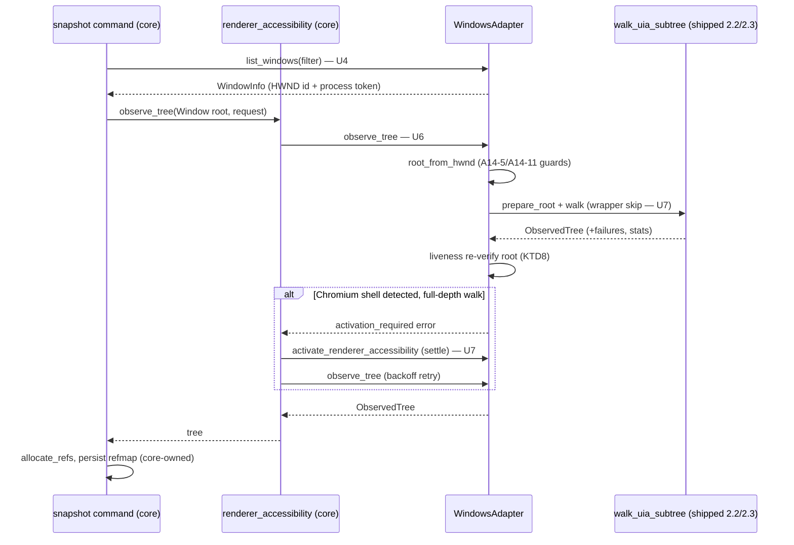
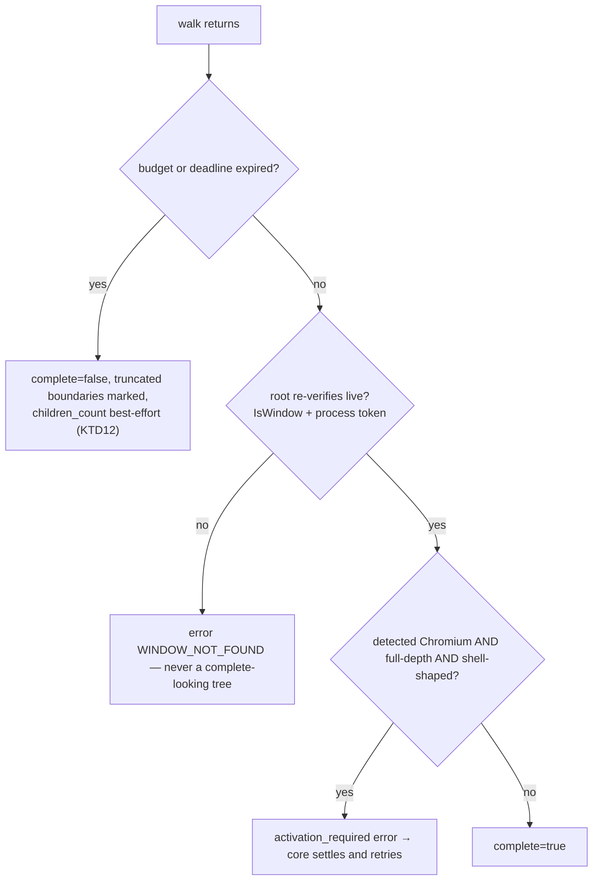

# Observation — Snapshot, Windows, Apps, Displays (Sub-phase 2.4) - Plan

## Goal Capsule

- **Objective:** Land the full read path on Windows — `snapshot` (fresh, `--skeleton`, `--root` drill-down), `list-windows`, `list-apps`, `list-displays`, and the `focused_window` capability — plus the Chromium/WebView2 handling that makes dense apps usable: detection, activation settle, and the web-wrapper depth-skip. 2.2 shipped a walker that already returns core's `ObservedTree`; 2.3 gave its nodes a vocabulary. 2.4 is the sub-phase where an agent first runs `agent-desktop snapshot` on Windows and receives refs.
- **Authority hierarchy:** `docs/phases.md` §2.4 > `probes/windows/FINDINGS.md` (for `api-contract` rows, and for `app/provider` rows only where the row records its environment dependency, per the ledger's KTD7) > this plan > implementer judgment. Where measured evidence contradicts a document, U10 amends the document in this same PR.
- **Stop conditions:** Do not implement the graded fingerprint fallback, `resolve_query`, or any `get_live_*` reader — that is 2.5; 2.4's `resolve.rs` ships only the fail-closed exact-evidence resolution drill-down needs (KTD9). Do not invoke a pattern, perform an action, synthesize input, or take a screenshot — 2.6+. Do not touch ref allocation: `crates/core/src/ref_alloc.rs::allocate_refs` remains the only allocator. Do not build notification, tray, or menu surface enumeration — 2.10/2.11. If U1 returns an answer this plan did not anticipate, take the pre-committed branch in U1 rather than reverting to inference.
- **Execution profile:** One PR from `feat/windows-2.4-observation` into `feat/windows-adapter`, never `main`. Budget ≈2k lines of hand-written Rust per the origin estimate; probes, captures, and the dogfood report are evidence artifacts outside the cap per the cap's own exclusion list. The budget is a target, not a promise — U2's core schema work and five net-new system inventories were not priced separately by the origin line; if the product figure exceeds the cap, it is stated in the PR the way 2.3's was, with the clean split seam named (U2 and U7's core plumbing are the only core-touching work — the descriptor schema and the observation-mode sub-struct — and U2 can land as its own PR if the owner wants a split; U4–U5 are separable from U6–U8 only at the cost of shipping enumeration nothing snapshots through). Conventional Commits.
- **Tail ownership:** The implementer opens the PR against `feat/windows-adapter` and reports the Verification Contract results.

---

## Product Contract

### Summary

`crates/windows` can walk a real application's tree and describe every node, but no command can reach it: `WindowsAdapter` implements none of `observe_tree`, `list_windows`, `list_apps`, `list_displays`, or `focused_window`, and its own test pins that every snapshot surface fails closed. 2.4 wires the shipped walker into `ObservationOps::observe_tree`, builds the four system inventories, ships the drill-down resolution subset, and lands the four P2-O8 evidence fields (`subrole`, `role_description`, `placeholder`, `dom_classes`) as the cross-platform schema they have never yet been on any platform.

It also makes the read path honest under the failure modes 2.2 measured and handed over: a provider that dies mid-walk is undetectable from the sibling terminator (A14-4) and sometimes from property reads (A14-9), so completeness is claimed only after an independent liveness check; a non-pumping window can hang `ElementFromHandle` (A14-11), so the shipped `root_from_hwnd` mitigations stay on the only path to a root; and a Chromium tree read before its async build settles understates the target by an order of magnitude, so thinness is concluded only after a full-depth walk and a settle, through core's existing renderer-activation loop.

### Problem Frame

An agent on Windows today gets `PLATFORM_NOT_SUPPORTED` from every observation command. The pieces below the surface are done — `walk_uia_subtree` produces a complete `ObservedTree` with roles, states, actions, names, and `native_id` — but there is no way to name a window, no identity that survives HWND recycling, no display inventory for later coordinate work, and no root resolution from either a window or a stored ref. Separately, the product promised agents four evidence fields in P2-O8 that no platform has ever emitted, and the Windows sources phases.md names for them range from unread (`LocalizedControlType`, `AriaRole`) to nonexistent in the pinned stack (`HtmlClass`).

### Requirements

- R1. Every observation question with no measured evidence is measured before code is written against it, with a pre-committed action for every answer including "unmeasurable".
- R2. `snapshot` against a resolvable window returns a reffed tree through `ObservationOps::observe_tree`, and its completeness claim is honest: a budget-expired walk returns what it observed with `complete: false`, and a walk whose provider died never reports complete on the strength of the sibling terminator alone.
- R3. Skeleton and drill-down work end to end: `--skeleton` clamps in core, boundary nodes carry a best-effort `children_count` under a dedicated small budget, and `--root @ref` re-resolves the stored element and walks its subtree.
- R4. `list_windows` reports HWND-first identity corroborated by a process-generation token, and a recycled HWND whose process no longer matches fails closed as `WINDOW_NOT_FOUND`, never resolving to the new occupant.
- R5. `list_apps` and `focused_window` are live; `focused_window` composes from `list_windows` with the focused-only filter rather than a second native path.
- R6. `list_displays` reports every monitor with bounds, primary flag, and per-monitor `scale` derived from effective DPI — the applied value, not the requested one (A10-3).
- R7. The four P2-O8 evidence fields land as optional cross-platform schema, absent by default, with Windows as first producer from named sources; every macOS golden fixture stays byte-identical.
- R8. Non-semantic web wrappers stop consuming logical depth, only under detected Chromium/WebView2 provenance, and a named or actionable wrapper still consumes depth.
- R9. Chromium targets are detected and settled through core's existing renderer-activation seam; a depth-clamped walk never demands activation; a tree still thin after settle carries `platform_detail` guidance toward `--force-renderer-accessibility`.
- R10. Every property this sub-phase adds to the read set is classified against the secure-field gate before it is read into evidence, and no error raised anywhere carries app-derived content.
- R11. Every assertion that runs in CI is provider-independent: no node count, tree shape, coordinate literal, timing multiplier, or other `app/provider` fact.
- R12. The read path is exercised by running it against real applications across distinct UI stacks including a Chromium/Electron target; the two never-exercised ref-able role arms (`DataItem`→`cell`, `Button`+`Toggle`→`switch`) are observed on extended scratch fixtures or the reason is recorded; findings are fixed or escalated and the run is committed as a durable report.
- R13. Statements in `docs/phases.md` that this sub-phase's evidence disproves are corrected in place, in this PR.

### Key Decisions

- **2.4 is planned as `docs/phases.md` defines it, with contradictions corrected rather than planned around.** (session-settled: user-directed — the instruction was to plan 2.4 from the source of truth; research found four §2.4 statements that are false today, and each is corrected by U10 with its disproving evidence rather than silently obeyed or silently dropped.) Governs R13. See KTD1, KTD5, U10.
- **Correctness of the read path is established by running it, not by unit tests alone.** (session-settled: user-directed — carried forward from 2.3's "test everything as real by running instead of just running the tests".) Governs R2, R12. See U9.
- **No test asserts a machine-specific or application-specific fact.** (session-settled: user-directed, carried forward from sub-phases 2.2 and 2.3.) Governs R11.

### Scope Boundaries

- **Out:** the graded fingerprint fallback, ambiguity scoring beyond exact-evidence 0/1/N, `resolve_query`, `resolve_locator_anchor`, `get_live_value`/`get_live_state`/`get_live_actions`/`get_live_element`, `get_element_bounds` — 2.5. The boundary is KTD9: 2.4 ships what drill-down needs and nothing a live locator needs.
- **Out:** invoking any pattern, any action, any input synthesis, hit testing, occlusion — 2.6/2.7.
- **Out:** `screenshot` and display capture — a later sub-phase pairs `screenshot --screen` with this sub-phase's `list_displays`.
- **Out:** notification, tray, Start-menu, and menu surface enumeration — 2.10/2.11. 2.4's surface work is limited to snapshot root resolution for `Window`/`Focused` and the Chromium modal-as-sheet detection its exit criteria name.
- **Out:** ref allocation changes of any kind.
- **Out:** a WebView2 fixture app. U1 probes `dom_classes` sources on the stacks the corpus has (Chromium/Electron via Obsidian, plus WebView2 only if a target is already present on the box); building an Edge/WebView2 host fixture is recorded as the receiving sub-phase's work if the probe shows one is required.

### Deferred to Follow-Up Work

- Hoisting core's duplicated `LocatorEvidence::satisfies` logic out of `crates/macos/src/tree/query/node_evidence.rs`, carried from 2.3, still not this sub-phase's work.
- A standing Windows performance harness (the repo-wide perf-baseline DoD still cannot run off-macOS); 2.4 measures its own marginal costs per A15-13's methodology, as 2.3 did.
- Multi-monitor verification of `list_displays` on real hardware. The dev box and both CI environments expose exactly one display locked at 96 DPI (A10-3); the per-monitor code lands here, and its first real multi-monitor observation belongs to whichever later sub-phase first runs on such a rig, recorded in `docs/phases.md` by U10.

---

## Planning Contract

### Key Technical Decisions

- KTD1. **`observe_tree` is the seam; `get_tree` is FFI compatibility built on top of it; `get_subtree` stays unimplemented.** The CLI snapshot path drives `ObservationOps::observe_tree(root, request)` through core's `renderer_accessibility::observe_tree` retry loop (`crates/core/src/renderer_accessibility.rs:16-43`); `get_tree` has exactly one consumer, the FFI legacy entrypoint, and macOS implements it as a wrapper over `observe_tree` (`crates/macos/src/tree/adapter.rs`); `get_subtree` has no live caller on any platform. Windows mirrors that shape exactly. phases.md §2.4's "`get_tree` / `get_subtree` wired to the shared `SnapshotEngine`" is corrected by U10.
- KTD2. **Root resolution reuses the shipped hardened path.** `ObservationRoot::Window` parses the window id back to an HWND and enters `root_from_hwnd` (`crates/windows/src/tree/automation.rs:294`), which already carries the `IsWindow` dead-handle check (A14-5) and the `SendMessageTimeoutW(WM_NULL, SMTO_ABORTIFHUNG)` hang probe (A14-11). `ObservationRoot::Element` goes through `resolve_element_strict` (KTD9) to a `NativeHandle` whose `UIAElement` wrapping already exists. No second HWND-consuming path is built.
- KTD3. **Window identity is HWND-first, corroborated by a process-generation token and the window's own record, failing closed.** `WindowInfo.id` is `"w-{hwnd}"`; `process_instance` is a token derived from the owning process's creation time, mirroring macOS's `"macos-proc-v1:{start_seconds}:{start_microseconds}"` shape (`crates/macos/src/system/process_identity.rs:81-86`). Verification is split by path, exactly as the cited macOS implementation splits it. A `WindowInfo` **freshly listed in the same invocation** verifies strictly — pid, token, app, and title — per `verify_window_record` (`crates/macos/src/system/window_resolve.rs:144-167`). **Stored-evidence resolution** (drill-down roots, ref-sourced window ids) treats pid + handle-ownership + token + app as the immutable identity and tolerates title drift, logging it as telemetry — per `window_record_matches_source` (`window_resolve.rs:85-122`), which macOS's ref resolution uses for precisely this reason: titles legitimately change under a live window (a dirty-marker asterisk, an Electron target retitling per document), and a hard title check there would fail drill-down on the very windows 2.4 exists to serve. Handle-ownership is the corroboration this split was missing until now: verifying only that the process at the stored pid was still the same generation (the token) never verified that the live HWND still *belongs* to that process — a second window opened by the same still-running process can be issued a recycled HWND that passes a token-only check. `WindowIdentityEvidence::verify_stored` closes exactly that gap with a `GetWindowThreadProcessId` equality check against the stored pid, and `resolve_window_root` routes through it; the check does not touch element-level resolution and proves nothing about which element inside the window is correct. Inventory assembly re-verifies identity on both sides of the read, per `window_inventory.rs:91-155`. A recycled HWND on a different process generation, or one no longer owned by the stored pid, returns `WINDOW_NOT_FOUND` — closing the cross-process recycle case. The residual this split does **not** close: an HWND destroyed and reused by another window of the **same still-running process** resolves against the recycled window, and element-level exact-evidence resolution does not catch it — two instances of one dialog present identical `AutomationId`, `ControlType`, and `Name`, so `candidate_outcome` (`resolve_match.rs`) returns `Matched` and `classify_search`'s (`resolve.rs`) sole-candidate arm resolves with no geometric corroboration; KTD9 is what *accepts* the wrong window here, not what catches it. Bounds corroboration cannot close it either: `bounds_hash` is exact over absolute screen coordinates, so demanding it would fail every ref whose window or layout moved between snapshot and action, which is the common case. Closing it needs a per-window immutable identity `RefEntry` does not carry — the window's UIA `RuntimeId` or a creation ordinal — and `RefEntry` cannot gain fields in this sub-phase. macOS is unaffected: `CGWindowID` is a per-session monotonic counter, not a recycled handle-table slot, so this is a Windows-specific schema question, not a resolver bug. No probe has measured HWND recycling directly (U1 measures what it can), and none has established the HWND uniqueness-counter wrap rate under real churn. Both are written into `docs/phases.md` by U10, split by what each needs: the measurement gap into §2.12, whose fixture app and self-hosted interactive runner are the first rig that can stage window churn long enough to observe a counter wrap, and the schema question into §2.12.1, which adds the per-window immutable identity to `RefEntry` and decides on §2.12's measured rate whether a wrap-handling rule ships beside it.
- KTD4. **The four P2-O8 fields are a core schema addition: one new flattened optional descriptor group, absent by default, homed inside `NodePresentation`.** No field named `subrole`, `role_description`, or `dom_classes` exists anywhere in core today, and `placeholder` exists only as a `NameEvidence` *input* slot to the accname precedence — 2.4 is the first sub-phase on any platform to surface these as output fields. The 7-field cap constrains the placement twice over: `AccessibilityNode` and `LocatorEvidence` are each already at exactly 7 fields, so neither can take the group as an eighth. It nests instead as a single flattened optional field inside `NodePresentation` (4 → 5 fields), where nested `#[serde(flatten)]` plus per-field `skip_serializing_if` yields the same absent-by-default bytes as a top-level placement would. The evidence-side threading follows the same rule — the group rides the observed-node projection without adding an eighth `LocatorEvidence` field; the exact evidence-side representation is U2's call within the cap. Every field absent means byte-identical serialization, which is what keeps the macOS goldens the proof that core changed shape without changing output. The `placeholder` output field and the `NameEvidence.placeholder` input slot are distinct: Windows fills both from the same source rule — `HelpText` where it is not already serving as the description — and the input slot (today hardcoded `None` in `crates/windows/src/tree/name_evidence.rs`) is what lets a placeholder-only control still receive a name.
- KTD5. **`dom_classes` has no source until U1 finds one: `HtmlClass` does not exist in the pinned stack.** `uiautomation` 0.25.0's `UIProperty` enum was read directly (`types.rs:305-625`, ids 30000–30159): it carries `LocalizedControlType = 30004`, `AriaRole = 30101`, `AriaProperties = 30102`, `FullDescription = 30159`, and no `HtmlClass`. phases.md's "`dom_classes` ← WebView2's `HtmlClass`" names a property that cannot be requested. U1 measures what `AriaProperties` and `ClassName` actually carry on a Chromium target, with pre-committed branches: a class-bearing source found → U3 wires it; none → `dom_classes` ships as schema with no Windows producer, stays absent, and U10 corrects phases.md to name the real availability. Either way the schema lands (KTD4) so the field's shape is settled for whichever platform first produces it.
- KTD6. **The wrapper depth-skip is gated on Chromium/WebView2 provenance, and the predicate requires emptiness across the evidence already read.** The walker's `is_web_wrapper` stub documents that filling it needs Chromium detection; ungated, the predicate (`Group`/`Custom` control type with empty `Name` and empty `Value`) would also skip the anonymous `Group`/`Pane` containers native stacks are full of, silently deepening every native walk. Under detected provenance (KTD7), a node is a transparent wrapper only when its control type is `Group` or `Custom` **and** its name, value, and `AutomationId` are all empty **and** it advertises no action — mirroring macOS's rule that a named or actionable generic element consumes depth (`crates/macos/src/tree/query/node_evidence.rs:6-38`). Mechanically this is the one-conditional-increment two-counter pattern the walker already carries: `WalkBudget.max_raw_depth` always advances, `max_logical_depth` advances only for non-wrappers (`crates/macos/src/tree/query/traversal.rs:133-136` is the reference; `crates/windows/src/tree/walker.rs` already budgets both).
- KTD7. **Chromium detection and settle ride core's existing activation loop, and Windows must implement both adapter seams the loop calls.** Detection: the root window's class (`Chrome_WidgetWin_1`, observed on Obsidian's top-level and render-host windows in A4-4) or provider identity. On Chromium 138+ the UIA tree builds asynchronously once a client connects, so the first walk can land on the pre-activation shell: when a **full-depth** walk of a detected-Chromium root returns the shell shape, `observe_tree` returns `AdapterError::renderer_accessibility_activation_required`, and core's loop (lease → `activate_renderer_accessibility` → backoff retry) provides the settle; the Windows `activate_renderer_accessibility` is the connection-plus-settle itself, since connecting is what triggers the build. **The lease is not free:** core acquires `acquire_interaction_lease` before activating (`crates/core/src/renderer_accessibility.rs:28`), the trait default fails closed, and core's only lease acquisition machinery is unix-only — so U7 implements the Windows `acquire_interaction_lease` override too, scoped to what activation needs in 2.4, with full cross-process lease semantics owned by the input sub-phases (2.6+). A depth-clamped observation never claims activation — the walk stopped above the web content by design, which is the #117 lesson core already encodes and macOS already honors — and neither does an **Element-rooted or non-Window-surface** walk, mirroring macOS's `activation_eligible` gating (`crates/macos/src/tree/query/mod.rs`): a drill-down into a shell-shaped subtree returns its thin tree rather than looping the settle. **The still-thin guidance must escape core's loop, which swallows every activation-marked error and decays to a bare `TIMEOUT` on expiry:** the adapter emits the activation-required marker only **before** its activation has run for the root process; once the connection-plus-settle has happened, a full-depth walk that still sees the shell returns a **non-marker** error — which core propagates immediately (`renderer_accessibility.rs:40`) — carrying `platform_detail` that guides `--force-renderer-accessibility` (**Chromium's own browser command-line switch, run by the user on the target application; not an agent-desktop flag**) and, where U1 item 11's branch fired, the snapshot timeout lever. The distinct `--force-electron-a11y` CLI override is ours: it rides the observation request so an agent can demand the activation path even when the thinness heuristic would not fire. Per the settled Assumptions correction, `ObservationRequest` is already at the 7-field cap, so the override lands inside an observation-mode sub-struct (folding `skeleton` and the new force flag) rather than as an eighth field.
- KTD8. **Completeness is claimed only past an independent liveness check.** A14-4: a dead provider's `get_next_sibling` returns the exact end-of-list signature. A14-9: on build 17763 a dead provider's property reads succeed with empty values, while Server 2025 fails them — a dead provider is sometimes indistinguishable from an empty one, never from a live one. So after a walk that would report `complete`, `observe_tree` re-verifies the root — `IsWindow` plus the process-generation token (KTD3) — and a failed re-verification converts the result to an error (`WINDOW_NOT_FOUND`) rather than a complete-looking tree with silently missing siblings. The sibling terminator alone never proves completeness; a read that failed is never reported `Absent` (the standing 2.2 rule).
- KTD9. **The 2.4/2.5 resolution boundary: 2.4 ships the deep search and fail-closed exact-evidence resolution drill-down needs; 2.5 owns graded resolution and the live readers.** `snapshot --root @ref` requires `resolve_element_strict` to return a `NativeHandle`, so it cannot wait for 2.5. 2.4's `crates/windows/src/tree/resolve.rs` searches to a resolve-scoped depth-50 cap — mirroring the value and the *pattern* of macOS's `MAX_RESOLVE_DEPTH` (`crates/macos/src/tree/resolve.rs:15`), which is a distinct constant from `element.rs`'s `ABSOLUTE_MAX_DEPTH`, not a shared symbol — and matches on exact stored evidence: `native_id` first (kind and value), corroborated by role and the role-conditional stable text identity core already defines. Zero candidates → `STALE_REF`; two or more → `AMBIGUOUS_TARGET`; anything short of an exact match fails closed rather than guessing, because A7-3 measured Explorer re-resolving 29 of 29 `AutomationId` keys with 5 landing on a different element — the silent-wrong-target shape strictness exists to prevent. What 2.4 does **not** ship is the graded fingerprint fallback for evidence-poor elements (A7-1: Electron exposes `AutomationId` on 0% of its interactive elements) — those return `STALE_REF` honestly until 2.5.
- KTD10. **`list_apps` enumerates processes owning top-level windows, with the same identity token as windows; `focused_window` is a filter, not a second path.** The app inventory derives from the window inventory's owning processes plus a process snapshot for names and executables — requiring one `Cargo.toml` feature addition (`Win32_System_ProcessStatus` or `Win32_System_Diagnostics_ToolHelp`; U1 settles which on the box). Identity uses KTD3's token so windows and apps corroborate each other, mirroring macOS's rule that two sources must agree on `process_instance` or the inventory fails (`crates/macos/src/system/app_inventory.rs:133-146`). `focused_window` is `list_windows(focused_only).next()` (`crates/macos/src/system/adapter.rs:142-149`); core even has a fallback that composes it the same way, so the override is a convenience, not a necessity.
- KTD11. **Displays come from `EnumDisplayMonitors` + `GetMonitorInfoW` + `GetDpiForMonitor`, and `scale` is effective DPI over 96.** All required `windows-sys` features are already enabled (`Win32_Graphics_Gdi`, `Win32_UI_HiDpi`). Core's field is `DisplayInfo.scale`, not phases.md's `scale_factor` — U10 corrects the name. A10-3's carried warning binds here: a successful scale *request* is not evidence the scale *applied*, so the read is of effective DPI. The dev box and both CI environments have exactly one 96-DPI display, so multi-monitor behavior lands as code with single-monitor evidence, stated honestly (Scope Boundaries).
- KTD12. **Boundary `children_count` is a count-only read under its own small budget, and it is independent of `subtree_truncated`.** At a logical-depth boundary the walker reads only the child count — `FindAll(TreeScope_Children, TrueCondition)` length or a bounded sibling count — under a dedicated time-box mirroring macOS's 25ms `BOUNDARY_COUNT_BUDGET` (`crates/macos/src/tree/query/child_read_budget.rs`), because a lazy renderer's count can cost more than the traversal it describes. A boundary node may carry a count with `subtree_truncated: true`; a budget-starved node carries the flag with no count. Truncation folds through every ancestor via the `complete &=` aggregation core's `ObservedTree` already performs — the adapter only reports per-subtree truth.

### High-Level Technical Design

The snapshot flow, showing what core already owns and where the six Windows seams fill in:



The completeness decision each walk exits through:



### Assumptions

- The walker's existing `WalkBudget` raw/logical depth split is sufficient plumbing for the wrapper skip; U7 fills the predicate and does not redesign the budget.
- The hosted-runner probe workflow from 2.3 (`windows-capability-probe.yml`) is the vehicle for U1's second environment, as it was for A15's rows. U1's Chromium-dependent items are dev-box-only (Obsidian is not on the runner); each affected A16 row records the single-environment limitation.

### Output Structure

```text
crates/windows/src/
├── system/
│   ├── process_identity.rs    # KTD3 token (creation-time generation)
│   ├── window_enum.rs         # EnumWindows census + cloaked filtering
│   ├── window_identity.rs     # HWND-first verify, fail-closed corroboration
│   ├── window_ops.rs          # list_windows, focused_window
│   ├── app_ops.rs             # list_apps (KTD10)
│   └── display.rs             # list_displays (KTD11)
└── tree/
    ├── root_resolve.rs        # ObservationRoot → UIAElement (KTD2)
    ├── observe.rs             # observe_tree body: walk, liveness, partiality (U6)
    ├── wrapper.rs             # is_web_wrapper predicate (KTD6)
    ├── chromium.rs            # detection + shell-shape + settle (KTD7)
    ├── surfaces.rs            # Window/Focused roots + modal-as-sheet
    └── resolve.rs             # drill-down exact-evidence resolution (KTD9)
probes/windows/16-observation/  # U1 probe + captures
probes/windows/scratch/         # grid-with-cells + toggle-button extensions
```

The tree is a scope declaration; the implementer may re-split files against the 400-line cap, keeping the placement rules (`tree/` reads, `system/` inventories).

---

## Implementation Units

| U-ID | Title | Key files | Depends on |
|---|---|---|---|
| U1 | Measure the observation unknowns | `probes/windows/16-observation/`, `probes/windows/scratch/` | — |
| U2 | Land the four evidence fields as core schema | `crates/core/src/node.rs` family, `live_locator/` | — |
| U3 | Read the new properties and produce the descriptors | `crates/windows/src/tree/property_ids.rs`, `element_properties.rs` | U1, U2 |
| U4 | Window identity, `list_windows`, `focused_window` | `crates/windows/src/system/` | U1 |
| U5 | `list_apps` and `list_displays` | `crates/windows/src/system/` | U4 |
| U6 | Wire `observe_tree` with honest completeness | `crates/windows/src/tree/{root_resolve,observe}.rs`, `adapter.rs` | U3, U4 |
| U7 | Chromium detection, settle, wrapper skip, surfaces | `crates/windows/src/tree/{chromium,wrapper,surfaces}.rs` | U6 |
| U8 | Drill-down resolution and the skeleton path | `crates/windows/src/tree/resolve.rs` | U6 |
| U9 | Dogfood the read path against real applications | `probes/windows/scratch/`, `docs/dogfood-reports/` | U6, U7, U8 |
| U10 | Correct what this sub-phase disproves | `docs/phases.md`, `CONCEPTS.md` | U1, U9 |

### U1. Measure the observation unknowns

- **Goal:** Every fact this plan builds on that no ledger row establishes is measured, on the dev box and the hosted runner where reachable, before the code that depends on it is written.
- **Requirements:** R1.
- **Files:** `probes/windows/16-observation/` (probe source, runner script, captures), `probes/windows/FINDINGS.md` (A16 rows), `probes/windows/scratch/ScratchForms.cs`, `probes/windows/scratch/ScratchWpf.ps1`, `.github/workflows/windows-capability-probe.yml` (path filter only).
- **Approach:** One probe family, A16, with a pre-committed branch per question:
  1. `EnumWindows` census: what a top-level enumeration returns on this box — cloaked UWP frames (`DWMWA_CLOAKED`, which needs the `Win32_Graphics_Dwm` feature), tool windows, zero-size windows — and which filter yields the window set an agent means by "windows". Branch: the filter U4 encodes is whatever the census justifies, recorded per filter criterion.
  2. `GetForegroundWindow` semantics against an `ApplicationFrameHost`-hosted target: does it return the frame or the `CoreWindow`'s host (A1-3 measured the tree target; nothing measured focus). Branch: `focused_window` maps whichever arrives to the same identity `list_windows` reports.
  3. Process enumeration source for `list_apps` (KTD10): ToolHelp snapshot vs `EnumProcesses`, name/path derivation, and the creation-time read for KTD3's token. Branch: the workable source's feature flag is the one U5 adds.
  4. `GetDpiForMonitor` effective-DPI read on the one available display, cross-checked against A10-3's requested-vs-applied trap. Branch: `scale` reads effective DPI; if the API is unavailable on 17763, the fallback (`GetDeviceCaps`) is measured and recorded.
  5. `LocalizedControlType` content per control type across the two fixtures — the first observation of this property in the corpus. Branch: non-empty → U3's `role_description` source confirmed; empty or absent on a stack → the field stays absent there, recorded.
  6. `AriaRole` and `AriaProperties` on the Chromium target (Obsidian) and on the native fixtures — first observation. Branches: `AriaRole` non-empty on web content → U3's `subrole` source confirmed; a class-bearing token in `AriaProperties` or `ClassName` → the KTD5 `dom_classes` branch that wires it; neither → `dom_classes` lands schema-only and U10 corrects phases.md. Sub-question: does the stack pass author-defined (non-ARIA-spec) role tokens through `AriaRole` verbatim? U3's `carries_target_text` arm for `AriaRole` cites this row as its recorded justification — and flips to withheld if arbitrary author text passes through.
  7. Marginal walk cost of the added properties, min-of-seven with a discarded warm-up (A15-13's methodology), both fixtures, both environments. Branch: the cost lands in `property_ids.rs`'s module doc beside A15-11's; a surprise (beyond the per-property envelope A15-11 established) re-opens the flat-set decision explicitly rather than silently.
  8. Wrapper density and depth census on the Chromium target: how many `Group`/`Custom` empty-name-empty-value nodes sit on the path to web content, and the simulated ref yield with and without the skip. Branch: the census is the evidence U7's exit criterion cites; if wrappers are not the depth consumer on this target, KTD6's gate stays and the skip's value is restated from the measurement.
  9. `IVirtualDesktopManager` reachability through the pinned crates (named in phases.md §2.4 Key APIs as read-only diagnostics). Branch: unreachable without a new dependency → recorded, dropped from 2.4, phases.md corrected.
  10. Fixture extension: a grid whose cells advertise `GridItem`/`TableItem` and a toggle button advertising `Button`+`Toggle` (the two never-exercised ref-able arms, per the 2.3 dogfood report). Branch: if a stack cannot be made to advertise the pattern, the reason is recorded and phases.md names the receiving sub-phase.
  11. Connection-to-settled latency on the Chromium target, min-of-seven with a discarded warm-up (A15-13). A1-5 measured a 13-of-172-node first contact but never the settle time, and the snapshot deadline is hardcoded at 3s in both core entry points with no CLI knob today. Branch: settle exceeding that deadline → this sub-phase adds a `--timeout-ms` argument to the snapshot command, mirroring the existing ref-action pattern in `src/cli_args/`, threaded into both the snapshot and drill-down deadlines; the still-thin `platform_detail` then names that flag rather than an abstract recommendation, and U9 judges Obsidian with the measured number in hand.
  12. An observation read (`root_from_hwnd`) and the token read from a medium-integrity client against an elevated-process window — the trust boundary none of A14's rows cover. Branches: access denied maps to `PERM_DENIED` with a `platform_detail` naming the integrity boundary and carrying no target-derived text; a window whose token read fails is emitted with `process_instance: None` and documented as failing closed on resolution; if the box cannot stage the split-integrity case, the row records "unmeasurable in this environment" and U10 writes the verification into the receiving environment sub-phase's scope beside the modern-shell caveat.
- **Execution note:** Probes are raw scripts against the real OS; captures land beside them, redaction rules identical to 2.3's (shape and counts, never application text).
- **Test scenarios:** Test expectation: none — probes are evidence artifacts, not product code; their output is the deliverable.
- **Verification:** Every A16 row is in `FINDINGS.md` with stack, verdict, and the branch taken; captures committed; the hosted-runner artifact uploaded by the probe workflow.

### U2. Land the four evidence fields as core schema

- **Goal:** `subrole`, `role_description`, `placeholder`, and `dom_classes` exist as optional, absent-by-default fields on the node the product serializes, on every platform, with no output change anywhere until a producer fills them.
- **Requirements:** R7.
- **Files:** `crates/core/src/node.rs` (or the new descriptor-group file KTD4 implies), `crates/core/src/live_locator/{locator_evidence,observed_tree}.rs` and the observed-node family, serialization tests beside them; golden fixtures under `tests/fixtures/` (asserted unchanged, not edited).
- **Approach:** Per KTD4: a new flattened optional group homed inside `NodePresentation` (the 7-field cap on `AccessibilityNode`/`LocatorEvidence` forces it out of both), `#[serde(skip_serializing_if = "Option::is_none")]` per field (`Vec` variant for `dom_classes` with the empty-vec skip), threaded through evidence projection the way existing identity fields are. macOS supplies none of the four in this sub-phase — its `AXSubrole` reads continue to refine `role` only. Core's `MockAdapter` tests gain nodes carrying each field to pin serialization both ways. Trace redaction is extended with the schema: `SENSITIVE_KEYS` in `crates/core/src/trace_sanitize.rs` gains the two descriptor keys that do not already token-match (`subrole`, `dom_classes` — `placeholder` and `description` are covered by existing tokens), with a sanitize test beside the existing pins, so page-authored tokens are masked wherever descriptor-bearing evidence reaches a trace sink.
- **Patterns to follow:** `crates/core/src/node_identity.rs` / `node_presentation.rs` (flattened optional groups with serde skips) — mirror the non-Option flattened-struct shape rather than a flattened `Option<T>`, which serialization treats identically but whose all-optional inner fields deserialize surprisingly; `crates/core/src/live_locator/observed_tree.rs:174-175` (projection point). Note `ObservedNode` is also at the field cap — the evidence-side home must respect it the same way.
- **Test scenarios:**
  - A node with all four fields absent serializes byte-identically to today's shape (golden fixture diff is empty).
  - A node with each field present serializes it under the documented name; empty `dom_classes` is omitted, not `[]`.
  - Evidence projection carries each field from `ObservedNode` to `AccessibilityNode` unchanged.
  - `sanitize_trace_value` masks `subrole` and `dom_classes` the way it masks `placeholder` — pinned beside the existing redaction tests.
- **Verification:** `cargo test --locked -p agent-desktop-core --lib` green; `git diff` over `tests/fixtures/` empty; the macOS CI lane green with byte-identical goldens.

### U3. Read the new properties and produce the descriptors

- **Goal:** The Windows walk reads `LocalizedControlType` and `AriaRole` (and the `dom_classes` source if U1 found one), classifies each against the secure-field gate, and fills the four descriptor fields plus the `NameEvidence.placeholder` input slot from named sources.
- **Requirements:** R7, R10.
- **Dependencies:** U1 (sources confirmed, cost measured), U2 (schema exists).
- **Files:** `crates/windows/src/tree/property_ids.rs`, `element_properties.rs`, `name_evidence.rs`, their `*_tests.rs`; `crates/windows/examples/uia_tree_dump/` (render the new fields presence-only).
- **Approach:** New `TreeProperty` variants ride the flat `WALK_SET` (A15-12 settled flat-vs-split by measurement; U1's cost row keeps the decision honest). Every exhaustive match the compiler forces (`as_str`, `uia_property`, `carries_target_text`) gets its arm — `carries_target_text` is the decision that routes each property through or past the secure gate, and the classification is recorded in the arm: `LocalizedControlType` and `AriaRole` are provider vocabulary, not target text; a `dom_classes` source carrying page-authored tokens is target-derived and withheld on secure fields. Producers: `role_description` ← `LocalizedControlType` (display text only — the role-map-key ban stands); `subrole` ← `AriaRole` plus pattern availability; `placeholder` ← `HelpText` where it is not already serving as the description (the same rule fills the `NameEvidence` slot currently hardcoded `None`); `dom_classes` per the U1 branch. All four are `Known`-only emissions — a failed or gated read contributes nothing, per the tri-state rule.
- **Patterns to follow:** `crates/windows/src/tree/property_ids.rs` (exhaustive-match discipline, `gate()`, module-doc cost record); `docs/solutions/logic-errors/tri-state-evidence-collapses-under-negation.md` and `emit-state-on-a-positive-claim-never-on-a-default.md`.
- **Test scenarios:**
  - Adding each new variant without its `carries_target_text` arm fails compilation (the guard is the compiler, asserted by the existing whole-enum agreement test extending over the new variants).
  - A secure field withholds every target-text-classified new property; the marker test extends over them.
  - `placeholder` fills only when `HelpText` is not the description; when it is, the description wins and `placeholder` stays absent.
  - A failed `LocalizedControlType` read produces no `role_description` (Unknown ≠ empty).
  - `subrole` emits only on a non-empty `AriaRole` claim.
- **Verification:** `cargo test --locked -p agent-desktop-windows --lib` and `--examples` green; the census tool renders the new fields presence-only; U1's cost row cited in the module doc.

### U4. Window identity, `list_windows`, `focused_window`

- **Goal:** `list_windows` returns the windows an agent means, each with recycling-safe identity; `focused_window` composes from it.
- **Requirements:** R4, R5.
- **Dependencies:** U1 (census, foreground semantics).
- **Files:** `crates/windows/src/system/{process_identity,window_enum,window_identity,window_ops}.rs` and tests; `crates/windows/src/system/adapter.rs` (overrides); `crates/windows/Cargo.toml` (`Win32_Graphics_Dwm` for the cloaked read).
- **Approach:** Enumeration per U1's justified filter (visible, non-cloaked, non-tool top-level windows; each criterion cites its census evidence). `WindowInfo`: id `"w-{hwnd}"`, title, app (process image name), pid, `process_instance` = KTD3 token, bounds, `WindowState { is_focused, minimized: IsIconic, visible }`. Identity verification per KTD3 on both sides of assembly; churn mid-assembly returns the retryable shape macOS uses. `focused_window` = the focused-only filter's first result.
- **Patterns to follow:** `crates/macos/src/system/window_resolve.rs:85-167` (verify-before-trust), `window_inventory.rs:91-155` (two-sided race check), `process_identity.rs:81-134` (token shape and matching).
- **Test scenarios:**
  - A fixture window appears in `list_windows` with a parseable id, the fixture's pid, and a non-empty `process_instance` (fixture-relative assertion, no census counts).
  - An id whose process token no longer matches fails with `WINDOW_NOT_FOUND` — pinned with a fake/stale token, and the test fails if verification is removed.
  - A freshly listed window whose title changed between capture and verification fails the strict check; a **stored-evidence** resolution of the same retitled-but-live window succeeds with the drift logged — both directions of KTD3's split pinned, and the second fails if the stored-evidence path is made title-strict.
  - A marker-titled fixture window whose identity verification fails produces a `WINDOW_NOT_FOUND` whose message, details, and `platform_detail` carry no marker — the macOS id-only `window_identity_mismatch` shape.
  - `focused_window` on the focused fixture returns the same identity `list_windows` marks focused.
  - A destroyed HWND resolves to `WINDOW_NOT_FOUND`, not a hang (A14-5 path reused).
- **Verification:** Live fixture tests green under the MTA test primitive; no assertion encodes a window count or any non-fixture title.

### U5. `list_apps` and `list_displays`

- **Goal:** The remaining two inventories are live: apps derived from window-owning processes with corroborated identity, displays with effective-DPI scale.
- **Requirements:** R5, R6.
- **Dependencies:** U4 (token, window inventory).
- **Files:** `crates/windows/src/system/{app_ops,display}.rs` and tests; `crates/windows/src/system/adapter.rs`; `crates/windows/Cargo.toml` (the U1-settled process-enumeration feature).
- **Approach:** KTD10 and KTD11. Apps: window-owning processes joined with the process snapshot; name from the image; `bundle_id: None` (no Windows analogue in 2.4 — recorded, not faked); identity token shared with U4 so the two inventories corroborate. Displays: enumerate, mark primary, `scale` = effective DPI / 96 per monitor.
- **Patterns to follow:** `crates/macos/src/system/app_inventory.rs:47-88` (stabilize-until-consistent), `display.rs:86-162` (primary-first ordering, scale derivation, bounds-intersection selection).
- **Test scenarios:**
  - The fixture's process appears in `list_apps` with its pid and a token matching its `list_windows` entry.
  - `list_displays` returns at least one display, exactly one primary, `scale` ≥ 1.0 and finite (rule-shaped; no monitor count asserted).
  - A pid present in windows but gone from the process snapshot fails the inventory rather than emitting a half-identified app.
- **Verification:** Live tests green; the single-display evidence limit stated in the display module doc citing A10-3.

### U6. Wire `observe_tree` with honest completeness

- **Goal:** `snapshot` works: root resolution, the shipped walk, liveness-checked completeness, boundary counts, and partial results that say so.
- **Requirements:** R2, R3 (boundary counts), R11.
- **Dependencies:** U3 (evidence complete), U4 (window resolution).
- **Files:** `crates/windows/src/tree/{root_resolve,observe}.rs` and tests; `crates/windows/src/adapter.rs` (`ObservationOps` override); `crates/windows/src/system/adapter.rs` (the `supported_surfaces` override and its retired pin); `crates/windows/src/tree/walker.rs` (boundary-count seam only).
- **Approach:** Per KTD1/KTD2/KTD8/KTD12:
  1. Resolve the root: `Window` → id parse → token re-verify → `root_from_hwnd`; `Element` → `resolve_element_strict` (U8).
  2. `prepare_root` + `walk_uia_subtree` with the request's depth mapped onto `WalkBudget`.
  3. At logical boundaries, the count-only read under its dedicated budget; `children_count` and `subtree_truncated` set independently.
  4. Post-walk liveness re-verification before any `complete` claim; failure → `WINDOW_NOT_FOUND`.
  5. `get_tree` as the thin FFI wrapper over the same path; `get_subtree` untouched.
  6. Override `SystemOps::supported_surfaces` to advertise `Window` and `Focused` (mirroring `crates/macos/src/system/signals.rs`), and replace the `snapshot_surfaces_fail_closed_until_windows_implements_them` pin with a test asserting the new advertised set — core validates the requested surface against this list before the adapter is ever called, so without the override U6's own end-to-end verification cannot pass.
- **Patterns to follow:** `crates/core/src/renderer_accessibility.rs` (what the caller does with errors); `crates/macos/src/tree/query/child_read_budget.rs` (count budget); `crates/core/src/live_locator/observed_tree.rs` (aggregation the adapter must not duplicate).
- **Test scenarios:**
  - A fixture snapshot returns a tree with a non-empty descendant set and `complete: true` (rule-shaped: non-empty, not a count).
  - A deadline sized to expire mid-walk returns a tree with `complete: false` and at least one truncated boundary — not an error, not a discard.
  - A boundary node under a generous deadline carries `children_count`; under a starved count budget it carries `subtree_truncated` with no count — both accepted shapes pinned.
  - The walk-then-die case: a fake `TreeSource` whose root re-verification fails after a clean-looking walk yields `WINDOW_NOT_FOUND`, and the test fails if the liveness check is removed (the A14-4 shape, driven through the fake since killing a real provider mid-walk is not deterministically schedulable in CI).
  - A read that failed is never projected `Absent` (extends 2.2's pin over the new path).
- **Verification:** `agent-desktop snapshot --app <fixture>` returns refs end to end on the dev box; unit and live-fixture tests green; no CI assertion names an app beyond the repo's own fixtures.

### U7. Chromium detection, settle, wrapper skip, surfaces

- **Goal:** Dense web-wrapped apps are usable: Chromium roots are detected and settled through core's loop, transparent wrappers stop eating depth, and a Chromium modal is detected as a sheet surface.
- **Requirements:** R8, R9.
- **Dependencies:** U6.
- **Files:** `crates/windows/src/tree/{chromium,wrapper,surfaces}.rs` and tests; `walker.rs` (`is_web_wrapper` wiring); `crates/windows/src/system/adapter.rs` (the `acquire_interaction_lease` and `activate_renderer_accessibility` overrides); `src/cli_args/` + `crates/core` request plumbing for `--force-electron-a11y` (the KTD7 observation-mode sub-struct).
- **Approach:** Per KTD6/KTD7. Detection from root window class/provenance; shell-shape from U1's census; activation = settle (the connection already triggered the build); the error only from full-depth walks; `platform_detail` names Chromium's `--force-renderer-accessibility` switch when still thin, plus the U1-derived deadline recommendation where item 11's branch fired. The Windows lease override lands here because the loop acquires it before activating — without it the first settle dies `PLATFORM_NOT_SUPPORTED` from the trait default. `Sheet` joins the advertised `supported_surfaces` set together with the modal-as-sheet detection, so a Chromium modal is reachable via the sheet surface. The wrapper predicate consumes only evidence already read — control type, name, value, `AutomationId`, actions — so the skip costs nothing per node. Surfaces: root resolution for `Window`/`Focused`, and the modal-as-sheet check that tests the focused window **itself** before its children (`WindowIsModal` is already in the read set), mirroring macOS's focused-window-is-surface pattern.
- **Patterns to follow:** `crates/macos/src/tree/query/node_evidence.rs:6-38` (wrapper strictness), `crates/macos/src/system/renderer_activation.rs` + `renderer_probe.rs` (capability-probe-then-activate, no app allowlist), `crates/macos/src/tree/surfaces.rs:128-146` (window-is-surface).
- **Test scenarios:**
  - A fake-source tree of nested empty `Group` wrappers under Chromium provenance yields deeper logical reach at the same `max_logical_depth`; the identical tree without provenance does not skip — the gate pinned both ways.
  - A wrapper with a name, a value, an `AutomationId`, or an action consumes depth (four separate pins).
  - A depth-clamped walk of a detected-Chromium root never returns the activation error (the #117 lesson, pinned).
  - A full-depth shell-shaped walk returns the activation error exactly once, then the settled retry returns the tree (driven through the fake source).
  - The activation path acquires a Windows interaction lease rather than erroring `not_supported` — and the test fails if the override is removed.
  - The post-settle still-thin error is **not** marked activation-required — it escapes the loop and reaches the caller carrying the guidance `platform_detail`, with no target-derived text; the test fails if the marker is emitted unconditionally.
  - An Element-rooted walk of a shell-shaped Chromium subtree returns its tree without demanding activation.
  - A modal fixture window classifies as a sheet from its own properties before any child is consulted.
- **Verification:** Live: snapshot of the Chromium target (Obsidian) on the dev box yields materially more refs with the skip than the U1 baseline census predicted without it — the number lands in the dogfood report, never in a test.

### U8. Drill-down resolution and the skeleton path

- **Goal:** `snapshot --root @ref` and `--skeleton` work: stored refs re-resolve to live elements fail-closed, and skeleton output flows through the same honest-completeness path.
- **Requirements:** R3.
- **Dependencies:** U6.
- **Files:** `crates/windows/src/tree/resolve.rs` and tests; `crates/windows/src/adapter.rs` (`resolve_element_strict` override).
- **Approach:** Per KTD9: bounded deep search (resolve-scoped depth-50 constant) from the stored window root; exact-evidence match — `native_id` kind+value first, role and role-conditional stable text as corroborators, bounds hash as the soft signal; 0 → `STALE_REF`, 2+ → `AMBIGUOUS_TARGET`; no graded fallback. Skeleton needs no Windows-specific work beyond this (core clamps depth; U6 supplies counts).
- **Patterns to follow:** `crates/macos/src/tree/resolve.rs` (resolve-scoped constant, search shape); core's `RefEntry` evidence contract; `docs/solutions/best-practices/identity-fingerprint-against-os-reorder-2026-04-16.md`.
- **Test scenarios:**
  - A ref taken from a fixture snapshot re-resolves to the same element and a drill-down returns its subtree.
  - After the fixture mutates the target away, resolution returns `STALE_REF` — and the test fails if the evidence check is weakened to id-only (the A7-3 silent-wrong-target pin, driven on the fixture by giving two elements the same id-shape evidence).
  - Two identical-evidence candidates return `AMBIGUOUS_TARGET`, not the first match.
  - An element with no `native_id` (the Electron shape, A7-1) returns `STALE_REF` honestly rather than guessing — pinned as the 2.5 boundary.
  - `--skeleton` on the fixture returns depth ≤ 3 with reffed boundary containers carrying counts.
- **Verification:** End-to-end on the dev box: snapshot → pick ref → `--root` drill-down → subtree with scoped refs; unit tests green.

### U9. Dogfood the read path against real applications

- **Goal:** The read path is run, judged, and fixed against real software — the correctness gate no unit test provides.
- **Requirements:** R12, R2.
- **Dependencies:** U6, U7, U8.
- **Files:** `probes/windows/scratch/run-dogfood.ps1` (extended to drive the real binary), `docs/dogfood-reports/2026-08-*-feat-windows-2-4-observation-dogfood.md`; fixture extensions from U1.
- **Approach:** Targets: Notepad (Win32), Explorer (DirectUI), the WinForms and WPF fixtures (with the U1 grid and toggle extensions), Obsidian (Chromium/Electron), the modern-shell targets recorded skipped-with-reason as on this box (A10-7). Per target: `snapshot` (full, skeleton, one drill-down), `list-windows`, `list-apps`, `list-displays`; judge against the plan's questions — does the window list match what an agent would mean, is completeness honest, does the wrapper skip change Obsidian's usable depth, do `cell` and `switch` finally resolve, what does the agent's-eye friction look like. Every finding fixed with a regression test that fails before the fix, or escalated with a recommendation. Report follows 2.3's redaction rules exactly: shapes and counts, never application text.
- **Execution note:** Run the built release binary, verify by reading its JSON output — not by the test suite's opinion of itself.
- **Test scenarios:** Test expectation: none — the report and its driven fixes are the deliverable; each fix carries its own regression test.
- **Verification:** Report committed with environment header, per-target matrix, judgements, residuals, and the Verification Contract result; every skip has a reason; the two ref-able arms observed or their absence explained with a receiving owner.

### U10. Correct what this sub-phase disproves

- **Goal:** `docs/phases.md` reads true after 2.4, and the shared vocabulary carries what 2.4 introduced.
- **Requirements:** R13.
- **Dependencies:** U1, U9.
- **Files:** `docs/phases.md`, `CONCEPTS.md`.
- **Approach:** Corrections already known, each cited: §2.4's `get_tree`/`get_subtree` framing → `observe_tree` (KTD1); `dom_classes` ← `HtmlClass` → the real source or the recorded absence (KTD5, vendored `types.rs` cite); `scale_factor` → core's `scale` (KTD11); the macOS-pattern claims — `is_web_wrapper` as a named macOS function, the Electron bundle-ID list, `builder.rs` as the macOS home, `ABSOLUTE_MAX_DEPTH` as the resolver's constant — rewritten to what macOS actually ships (P2-O15 and §2.4, with file cites); plus whatever U1 and U9 disprove. `CONCEPTS.md` gains entries only where 2.4 introduced a concept used across documents — Window Identity (the HWND+token corroboration) and Web Wrapper (the gated transparent-wrapper skip) qualify; restating existing entries does not. Corrections are in place, never annotated, per the planning rules.
- **Test scenarios:** Test expectation: none — documentation unit; the gate is review plus the phase-reference and redaction scans.
- **Verification:** Every amendment cites its disproving evidence; `scripts/check-no-phase-references.sh` still exits 0; the deferred multi-monitor and any WebView2-fixture work is written into a named receiving sub-phase's scope, not left in this plan's residuals.

---

## Verification Contract

| Gate | Command / check | Applies to |
|---|---|---|
| Repo gates (Windows dev box) | `cargo fmt --all -- --check`; `cargo clippy --locked -p agent-desktop-core -p agent-desktop-windows -p agent-desktop -p agent-desktop-ffi --all-targets -- -D warnings`; `cargo test --locked -p agent-desktop-core -p agent-desktop-windows --lib`; `cargo test --locked -p agent-desktop-windows --examples`; `cargo test --locked -p agent-desktop`; `cargo test --locked -p agent-desktop-ffi --tests` | whole PR |
| Cross-platform compile | `cargo check --locked -p agent-desktop-windows --all-targets --target x86_64-unknown-linux-gnu` | U3–U8 |
| macOS unchanged | macOS CI lane green; every golden fixture under `tests/fixtures/` byte-identical after U2 | U2 |
| Core isolation | `cargo tree -p agent-desktop-core` clean of platform crates; the source-level gate still finds exactly the allowlisted shims | U2 |
| Probe branch taken | every U1 question answered or its pre-committed branch recorded as taken; no gate below rests on an unmeasured inference | U1 |
| Schema is silent until produced | all four descriptor fields absent → serialization byte-identical, pinned by fixture diff; each present field round-trips | U2 |
| Descriptor emission is positive-claim-only | a failed or gated source read produces no descriptor; each new `carries_target_text` classification is recorded in its arm and covered by the extended marker test | U3 |
| Window identity fails closed | a stale process token → `WINDOW_NOT_FOUND`; the test fails when verification is removed | U4 |
| Inventories corroborate | an app whose window and process identities disagree fails the inventory rather than emitting a half-identified entry | U5 |
| Completeness is liveness-checked | a clean-looking walk whose root fails re-verification yields `WINDOW_NOT_FOUND`, never `complete: true`; the test fails when the check is removed | U6 |
| Partiality is returned, not discarded | a mid-walk deadline yields `complete: false` with observed nodes and marked boundaries | U6 |
| Surfaces advertised deliberately | `supported_surfaces` advertises exactly `Window`, `Focused`, and (with U7) `Sheet`; the old empty-set fail-closed pin is replaced by a test asserting the advertised set | U6, U7 |
| Count and truncation are independent | boundary-with-count and truncated-without-count are both pinned shapes | U6 |
| Wrapper skip is gated and strict | provenance off → no skip; named/actionable/identified wrapper → consumes depth; each pinned separately | U7 |
| Activation is never demanded by a shallow walk | depth-clamped walk of a Chromium root returns no activation error, pinned | U7 |
| Drill-down fails closed | 0 → `STALE_REF`, 2+ → `AMBIGUOUS_TARGET`, id-only match insufficient — each fails when its check is weakened | U8 |
| Secure content | target text in the fixture's secure field appears in no new read outcome, no descriptor, no name slot | U3 |
| Error redaction | failed reads against marker-named controls — and a failed identity verification against a marker-**titled** window — produce errors whose message, details, and `platform_detail` carry no marker | U3–U8 |
| Evidence honesty | no CI test asserts a node count, window count, tree shape, timing, coordinate, or other `app/provider` fact | U1–U9 |
| No banned calls | the existing greps extended over the new files: no literal property-id integers, no `get_children`, no `UIAutomation::new()`, no `get_pattern`/`add_pattern`, no `LocalizedControlType` as a role-map key, no `HtmlClass` (it does not exist in the pinned stack) | U3–U8 |
| Size | Windows release binary under 15 MiB; no repo `.rs` file over 400 lines | whole PR |
| Dogfood: run, judged, closed, durable, leak-free | the 2.3 dogfood gate set applies verbatim: every target run with repo-controlled content, absent targets skipped-with-reason, findings fixed-with-failing-test or escalated, report committed with environment header and matrix, no literal application text in report or captures | U9 |
| Ref-able arms exercised | `cell` and `switch` observed on a target, or named in `docs/phases.md` with a receiving sub-phase and reason | U9, U10 |
| Core touched deliberately, and named | `crates/core` carries exactly the 2.4 changes this plan names — the U2 descriptor schema, the U7 observation-mode sub-struct for `--force-electron-a11y`, and any `cfg` widening the Windows lease needs in `interaction_lease.rs` — and no UIA concept | U2, U7 |
| Doc truth | each `docs/phases.md` amendment cites its disproving evidence; `CONCEPTS.md` gains only the concepts 2.4 introduced | U10 |
| PR is green | every required check on a PR into `feat/windows-adapter`, never `main` | whole PR |

**Pre-commit note.** `.githooks/pre-commit` runs unqualified cargo commands that fail off-macOS; commit with `SKIP_PRECOMMIT=1` and run the package-scoped forms above.

**Test-parallelism note.** Every live test uses `ensure_hosted_library_mta_and_dpi`; the CI lane runs at default parallelism and A14-10 recorded what happens to tests that skip the primitive.

**File-size note.** The 400-line cap is enforced on the macOS lane. `automation.rs` (390) has almost no headroom and U6 must not grow it — `root_resolve.rs` exists so it does not have to.

**Workflow-coupling note.** `src/cli/contract_tests.rs` pins exact `ci.yml` substrings, including the `--examples` step. U1 touches only the probe workflow's path filter; any `ci.yml` edit must be followed by `cargo test -p agent-desktop`.

## Definition of Done

- A PR from `feat/windows-2.4-observation` into `feat/windows-adapter` is open and green.
- U1 ran in both environments, its A16 rows are committed, and every unanswerable question has its pre-committed branch recorded as taken.
- `agent-desktop snapshot`, `list-windows`, `list-apps`, and `list-displays` return real results on Windows; skeleton and `--root` drill-down work; `focused_window` composes from the filter.
- Completeness is honest end to end: partial trees return with `complete: false`, boundary counts are best-effort under their own budget, and no walk claims complete without the root re-verifying live — each pinned by a test that fails when its check is removed.
- Window, app, and display identity follow KTD3/KTD10/KTD11: HWND-first with fail-closed token corroboration, inventories that corroborate each other, and effective-DPI scale.
- The four P2-O8 fields exist as core schema with Windows producers from named sources (or a recorded absence for `dom_classes` per KTD5); every macOS golden is byte-identical; every new property is classified against the secure gate.
- The wrapper skip works only under Chromium provenance with macOS-strict emptiness; activation rides core's loop through a working Windows interaction-lease override, is never demanded by a shallow walk, and still-thin trees carry the guidance `platform_detail`.
- Drill-down resolution is fail-closed exact-evidence with the 2.5 boundary stated: no graded fallback, evidence-poor elements return `STALE_REF` honestly.
- The read path was dogfooded against real applications including the Chromium target, the two never-exercised ref-able arms were observed or their absence recorded with an owner, findings were closed or escalated, and the durable, redaction-compliant report is committed.
- `docs/phases.md` reads true — the four known corrections plus whatever U1/U9 disproved, each with cited evidence — and `CONCEPTS.md` carries the concepts 2.4 introduced.
- Abandoned experimental code from any approach that did not pan out is removed from the diff.

---

## Risks & Dependencies

- **The read path's correctness is established off-CI.** Every CI assertion is rule-shaped (R11), so a green run proves mechanism, not fitness against real providers; U9's report is where fitness is established, and review must read it rather than the test count. This is the same deliberate structure 2.3 carried.
- **U2 touches core from a Windows sub-phase.** Sanctioned by P2-O8 and phases.md's atomic-backfill rule, and structured so absence serializes identically — but the goldens are the only detector, and they run on the macOS lane the dev box cannot execute. A golden diff means the serde threading is wrong, not that the goldens need regenerating.
- **Two of the four descriptor sources have zero observational history and one does not exist.** `LocalizedControlType` and `AriaRole` have never been read by any probe; `HtmlClass` is absent from the pinned stack. U1 measures before U3 wires; the risk is a sparse or useless field, which the Option schema absorbs — the failure mode this plan forbids is fabricating a value from a default (the A15-7 lesson).
- **Electron carries `native_id` on 0% of its interactive elements** (A7-1), so 2.4's exact-evidence drill-down will return `STALE_REF` inside web content more often than a user expects. That is the designed boundary with 2.5, stated in KTD9, and the dogfood report must show it as friction rather than hiding it.
- **A14-9's two builds disagree about dead-provider reads** (17763: success-with-empty; Server 2025: failure→`Unknown`). The liveness check (KTD8) is what makes completeness claims build-independent; any test that assumes one build's behavior is wrong on the other lane.
- **KTD8's liveness check is root-scoped, and Chromium trees span processes.** A renderer sub-provider that dies mid-enumeration deeper in the tree returns A14-4's benign end-of-list signature while the root browser process stays live, so the walk can still report complete with silently missing siblings. 2.4 accepts that residual — per-subtree liveness would cost a process read per provider boundary — and U9's dogfood judges Chromium completeness with it explicitly in mind rather than treating `complete: true` as proof.
- **Two accepted edges of the activation design, stated so the dogfood judges them knowingly.** A window emitted with `process_instance: None` (U1 item 12's elevated-process branch) can never take the activation path — core's loop requires a process instance and fails `STALE_REF` without one — so an elevated Chromium window stays on its shell tree; and a genuinely small Chromium window whose real tree matches the shell shape terminates in the still-thin guidance path with no accept-thin lever, the same terminal behavior macOS has. Neither is worth machinery in 2.4; both belong in U9's judgement notes if observed.
- **Root-class Chromium detection cannot see embedded WebView2.** An embedded WebView2 host's top-level window carries the host app's class; Chromium-classed windows appear only as descendants, so root-scoped detection never fires there. That is accepted for 2.4 — no WebView2 target is in the dogfood set — and the subtree-scoped detection decision travels with the WebView2 fixture to its receiving sub-phase (Open Questions).
- **The window census is unmeasured until U1.** `EnumWindows` on a Server 2019 box with no modern shell (A10-7) may not represent a user desktop's cloaked-window population; the filter lands rule-shaped with each criterion citing its census row, and the modern-shell verification stays owned by 2.12's environment work.
- **Single display, locked at 96 DPI, in every available environment** (A10-3). Multi-monitor `list_displays` code lands with single-monitor evidence; the plan says so rather than implying coverage.
- **The ~2k LOC estimate predates U2's core schema and five net-new inventories.** If the product figure exceeds the cap, the PR states it and names the core-touching seam (U2, plus U7's observation-mode sub-struct) exactly as 2.3 handled its overrun.

## Open Questions

- **Does the repo-wide performance-baseline DoD apply to Windows sub-phases?** Carried from 2.2 and 2.3, still open, still cheap to leave: U1 measures this sub-phase's own marginal costs directly.
- **At what node count does `CacheRequest` stop being a pessimization?** Carried from 2.2; A6-1/A6-2 bracket it without settling it; nothing in 2.4 needs the answer.
- **Where does the WebView2 fixture live if U1's `dom_classes` branch requires one?** Deferred to the branch outcome: if a class-bearing source exists but only on WebView2, U10 writes the fixture into the receiving sub-phase's scope with the evidence — together with the subtree-scoped provenance-detection decision embedded WebView2 requires (Risks).
- **Which Windows primitive backs the interaction lease once actions land?** 2.4's U7 override needs only enough lease to unblock activation; whether 2.6+ keeps it or replaces it with cross-process serialization mirroring macOS's file-lock lease is the input sub-phases' decision, recorded here so it is made deliberately rather than inherited.

## Sources & Research

- `docs/phases.md`: §2.4 (`:1026-1047`), §2.5 (`:1049-1065`), §2.2/§2.3 exit criteria, P2-O8 (`:867`), P2-O15 (`:874`), Platform Delivery Model and the 2,000-line cap, cross-cutting DoD.
- `probes/windows/FINDINGS.md`: A1-3, A1-4, A1-5 (Chromium activation-without-flag and the 13.2x first-contact understatement KTD7's design rests on), A2-2, A4-4, A6-1, A6-2, A7-1, A7-2, A7-3, A10-3, A10-6, A10-7, A14-2, A14-4, A14-5, A14-9, A14-10, A14-11, A14-12, A15-7, A15-9, A15-10, A15-11, A15-12, A15-13; the ledger's KTD1/KTD7 scope rules.
- `docs/dogfood-reports/2026-07-31-feat-windows-2-3-vocabulary-dogfood.md` — the `cell` and `switch` gaps and their §2.4 handoff; the redaction discipline U9 inherits.
- Core contracts, read at their current line positions: `adapter/observation.rs:30-95` (`observe_tree`, `get_tree`, `list_windows`, `list_apps`, `resolve_element_strict`), `adapter/system.rs:151-157` (`list_displays`, `focused_window`), `renderer_accessibility.rs:16-43`, `adapter_error.rs:181-195`, `snapshot.rs:22-127`, `snapshot_ref.rs:30-128`, `node.rs:8-32`, `node_identity.rs`, `node_presentation.rs`, `window_info.rs`, `window_state.rs`, `app_info.rs`, `display_info.rs` (field `scale`), `live_locator/{observed_tree,observed_subtree,observation_request}.rs` (skeleton clamp at `observation_request.rs:36-39`), `snapshot_surface.rs`, `surface_info.rs`, `window_focus.rs:61-80` (the `focused_window` fallback), `name_evidence.rs` + `accname.rs:109` (the `placeholder` input slot).
- Windows crate as shipped through 2.3: `tree/walker.rs` (`WalkBudget` raw/logical split, `TreeSource`, `is_web_wrapper` stub and its Chromium-detection doc), `tree/walker_source.rs:20-185` (`UiaTreeSource`, `prepare_root`, `walk_uia_subtree`), `tree/automation.rs:294` (`root_from_hwnd` with A14-5/A14-11 guards), `tree/property_ids.rs` (40-variant `TreeProperty`, flat `WALK_SET`, `gate()`, `carries_target_text`), `tree/name_evidence.rs` (the hardcoded-`None` placeholder slot), `system/adapter.rs:8-31` + `adapter.rs:17-19` (everything observation-shaped still `not_supported`, pinned by `snapshot_surfaces_fail_closed_until_windows_implements_them`), `system/dpi.rs` (process-wide awareness only), `Cargo.toml` (enabled `windows-sys` features; the process-enumeration and DWM gaps).
- macOS reference implementation: `tree/query/node_evidence.rs:6-38` (wrapper predicate), `tree/query/traversal.rs:133-151` (two-counter depth, boundary counts), `tree/query/child_read_budget.rs` (25ms count budget), `tree/query/child_read.rs:84-153`, `system/renderer_activation.rs` + `tree/renderer_probe.rs` (probe-then-activate, no allowlist), `tree/surfaces.rs:128-208` + `tree/surface_inventory.rs` (window-is-surface), `system/window_resolve.rs:37-167,355-361` and `system/window_inventory.rs:91-155` (identity verification and race bracketing), `system/process_identity.rs:81-134` (token), `system/app_inventory.rs:6-248` (dual-source merge, stabilize loop), `system/display.rs:8-162` (scale derivation, ordering, selection), `tree/resolve.rs:15,129` (`MAX_RESOLVE_DEPTH`, distinct from `element.rs:1`'s `ABSOLUTE_MAX_DEPTH`), `system/adapter.rs:142-149` (`focused_window` composition), `tree/adapter.rs` (`get_tree` over `observe_tree`).
- `uiautomation` 0.25.0 vendored source: `types.rs:305-625` (`UIProperty` ids 30000–30159 — `LocalizedControlType = 30004`, `AriaRole = 30101`, `AriaProperties = 30102`, `FullDescription = 30159`, **no `HtmlClass`**).
- `docs/solutions/`: `best-practices/never-ship-platform-code-that-ci-cannot-execute.md`, `real-app-tests-are-the-platform-adapter-gate.md`, `a-test-that-cannot-fail-is-not-coverage.md`, `a-verification-gate-is-code-and-needs-its-own-test.md`, `one-measurement-is-not-a-measurement.md`, `fix-the-class-not-the-reported-instance.md`, `identity-fingerprint-against-os-reorder-2026-04-16.md`; `logic-errors/tri-state-evidence-collapses-under-negation.md`, `emit-state-on-a-positive-claim-never-on-a-default.md`; `conventions/keep-raw-arguments-out-of-trace-reachable-error-messages.md`.
- `CONCEPTS.md`: Evidence Tri-State, Partial Observation, Role, State Vocabulary, Name Evidence, Native ID, Drill-down, Surface.
