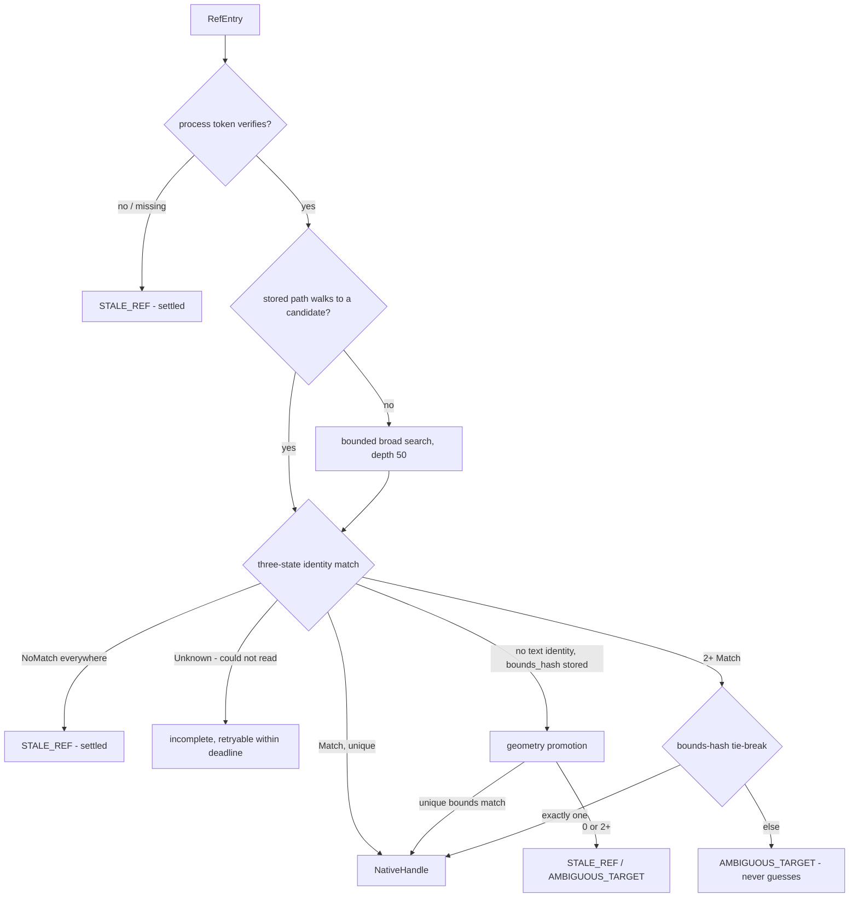
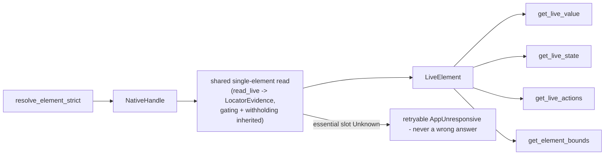

# Resolution & Live Locator (Sub-phase 2.5) - Plan

## Goal Capsule

- **Objective:** Make refs and the live `find`/`get`/`is` commands work on Windows with the strict-resolution guarantees macOS ships. The shape of the work is settled by what already exists: 2.4 shipped a working **binary** exact-evidence resolver and the complete evidence walk; 2.5 upgrades that resolver to macOS's **graded three-state** discipline with the fingerprint fallback Electron's 0% `AutomationId` coverage demands, implements `resolve_locator_anchor` so `find`'s hydration stops failing, and builds the five live readers as thin projections over the read machinery 2.2–2.4 already hardened.
- **Authority hierarchy:** `docs/phases.md` §2.5 > `probes/windows/FINDINGS.md` (for `api-contract` rows, and `app/provider` rows only where the row records its environment dependency, per the ledger's KTD7) > this plan > implementer judgment. Where measured evidence contradicts a document, U8 amends the document in this same PR.
- **Stop conditions:** Do not implement `hit_test`, `receives_events`, occlusion evidence, or `scroll_into_view` — 2.6. Do not invoke any pattern or perform any action — 2.6/2.7. Do not add fields to `RefEntry` or any core evidence struct (KTD4 forbids the richer-fingerprint temptation). Do not build a Windows-side query evaluator — `resolve_query` is core-owned (KTD2). If U1 returns an answer this plan did not anticipate, take the pre-committed branch in U1 rather than reverting to inference.
- **Execution profile:** One PR from `feat/windows-2.5-resolution` into `feat/windows-adapter`, never `main`. Budget ≈2k lines of hand-written Rust per the origin estimate; probes, captures, and the dogfood report are evidence artifacts outside the cap. The candidate core touch is at most one visibility promotion (KTD3); everything else is Windows-crate-only. Conventional Commits.
- **Tail ownership:** The implementer opens the PR against `feat/windows-adapter` and reports the Verification Contract results.

---

## Product Contract

### Summary

An agent on Windows can snapshot and drill down, but the live loop is broken in specific, measured ways: `find` in any mode except `--count` errors because selected-match hydration calls `resolve_locator_anchor`, which is `not_supported`; `get`/`is` silently degrade to snapshot-time values because all five `get_live_*` readers are unimplemented; the FFI `ad_get("bounds")` hard-fails; and the shipped resolver is a single exact-match tier that classifies a candidate it could not read as a non-match and cannot resolve **unnamed** web content on the one stack (Electron) that exposes no `AutomationId` at all -- named Electron elements can still match on role plus stable name today, which sets the honest baseline U7 measures against. 2.5 closes exactly these gaps, and proves the 0/1/N semantics with committed probe evidence as the origin's exit criteria demand.

### Problem Frame

Resolution on Windows must survive three measured hazards. A7-3: an `AutomationId` that still resolves can land on the **wrong element** (Explorer keys list rows by index; 29 of 29 keys re-resolved after a mutation, 5 to a different element) — so an id match must be corroborable and refutable. A7-1: coverage varies by an order of magnitude across stacks and is **0% on Electron's interactive elements** — so a resolver with no identifier-free fallback simply cannot resolve web content. A14-9: a dead provider's reads succeed with empty values on this box and fail on Server 2025 — so a read that could not be completed must surface as incomplete-and-retryable, never as a settled non-match or a fabricated absence. The macOS implementation already encodes all three disciplines; 2.5's job is to port them onto the Windows machinery that already exists.

### Requirements

- R1. Every resolution question with no measured evidence is measured before code is written against it, with a pre-committed action for every answer including "unmeasurable".
- R2. Candidate matching is three-state: a field that matched, a field that refuted, and a field that **could not be read** are distinct outcomes, and an unreadable candidate makes the attempt incomplete-and-retryable rather than silently non-matching.
- R3. Resolution retries within its deadline on incomplete attempts, and a structurally-impossible answer is a settled non-match that is never retried.
- R4. An element with no `AutomationId` is resolvable through the graded fallback — stored path first, geometry corroboration when text identity is absent — using only evidence `RefEntry` already carries.
- R5. `resolve_element_strict` can return `STALE_REF` for an id that still resolves (the A7-3 wrong-target shape), and `AMBIGUOUS_TARGET` never guesses among candidates it cannot tell apart.
- R6. `resolve_locator_anchor` is live, and selected-match hydration completes: `find`, `wait --selector`, and materialized queries work end to end on Windows.
- R7. The five live readers are live, built over one shared single-element read whose evidence classification, pattern gating, and secure-field withholding are the ones 2.2–2.4 shipped; a secure field's live value is withheld at the reader path and proven so.
- R8. Live-read failure classification distinguishes definitive absence from transport failure: absence satisfies completeness, a dead or unreadable provider never does.
- R9. The snapshot `value` slot's semantics are owned: documented as live mutable state, never identity, covered on the live path, and withheld on secure fields.
- R10. Every CI assertion is provider-independent: no node count, tree shape, coordinate literal, timing, or other `app/provider` fact.
- R11. The resolution semantics are exercised against real applications including the Electron target, with the 0/1/N cases proven on fixtures the repository controls, findings fixed or escalated, and the run committed as a durable report.
- R12. Statements in `docs/phases.md` that this sub-phase's evidence disproves are corrected in place, in this PR.

### Key Decisions

- **2.5 is planned as `docs/phases.md` defines it, with contradictions corrected rather than planned around.** (session-settled: user-directed — the standing instruction across this phase; research already found one §2.5 statement to tighten: `resolve_query` is a core-owned free function, not adapter work.) Governs R12. See KTD2, U8.
- **Correctness is established by running it, not by unit tests alone.** (session-settled: user-directed — carried forward from 2.2–2.4.) Governs R11.
- **No test asserts a machine-specific or application-specific fact.** (session-settled: user-directed, carried forward.) Governs R10.

### Scope Boundaries

- **Out:** `hit_test`, `receives_events`, hit-test-based occlusion/interception detection, `scroll_into_view` — 2.6 (`docs/phases.md` §2.6). The `offscreen`/`enabled`/`hidden` fields of `ElementState` are **in** scope — they are fields of the `get_live_element` read §2.5's own scope names (KTD6) — and U8 reconciles §2.6's overlapping wording so the 2.6 planner does not re-budget them.
- **Out:** invoking any pattern, performing any action, input synthesis — 2.6/2.7. Reading a pattern-availability flag remains observation.
- **Out:** any `RefEntry` or core evidence schema change. The fingerprint fallback uses only stored fields (KTD4); a richer Windows fingerprint (`ClassName`, descriptors) is explicitly rejected this sub-phase.
- **Out:** a Windows-side `LocatorQuery` evaluator — core owns query evaluation over the observed tree (KTD2).
- **Out:** notification, tray, and menu surfaces — 2.10/2.11; `resolve_element_strict`'s surface scoping beyond what 2.4 shipped rides those sub-phases.

### Deferred to Follow-Up Work

- Hoisting core's duplicated `LocatorEvidence::satisfies` out of the macOS crate, carried since 2.3 — still not this sub-phase's work.
- The mutation-path five-way delivery classifier (macOS `ax_mutation::classify`) — 2.6/2.7 own it; U4's read-path classifier is deliberately not overloaded to serve mutations.
- A standing Windows performance harness — U1 measures this sub-phase's own costs per the corpus methodology, as 2.3 and 2.4 did.

---

## Planning Contract

### Key Technical Decisions

- KTD1. **This sub-phase upgrades the shipped resolver; it does not build one.** `crates/windows/src/tree/resolve.rs` and `resolve_match.rs` already do AutomationId-first search to a resolve-scoped depth 50, role-conditional name corroboration (the A7-3 pin), fail-closed process-identity gating, and a pure bounds-hash tie-break. What they lack, precisely: three-state matching (the comparator returns `bool`, collapsing "could not read" into "no match"), a retry loop (one pass, no deadline-bounded re-attempt), the identifier-free fallback, path-based fast-path resolution, and `retryable`/`complete` fields on their errors. Every unit below names its delta against this baseline.
- KTD2. **`resolve_query` stays in core; Windows ships `resolve_locator_anchor` and evidence completeness, nothing else for `find`.** Core's `resolve_query` (`crates/core/src/live_locator/resolve.rs:12-83`) drives the adapter only through `observe_tree` and evaluates the query itself; per-match hydration (`hydrate.rs:25-129`) is what calls `adapter.resolve_locator_anchor`. The §2.5 scope bullet naming `resolve_query` as Windows work is corrected by U8 so the next planner does not budget an evaluator that must not exist.
- KTD3. **Matching goes three-state by composing two core verdicts — because core's `identity_match` alone would undo the A7-3 defense.** Core's `identity_match` (`crates/core/src/ref_identity.rs:39-54`) settles on a native-id hit without consulting text — macOS's semantics, and exactly what A7-3 proved insufficient on Windows, where the five wrong-target rows shared role and id-key and differed only in text. The shipped Windows pin (`a_stable_role_with_a_mismatched_live_name_is_refuted`) is therefore kept by **composition**: `identity_match` settles the id tier, `stable_text_match` yields the corroboration verdict, and the combined rule is stated here rather than left to discovery — on a stable-text role, id `Match` + text `NoMatch` is refuted (`STALE_REF`); id `Match` + text `Unknown` is incomplete-retryable; a live element whose stable-text fields are all absent keeps 2.4's blank-cannot-refute behavior, pinned both ways. `identity_match` is already public; the sanctioned single visibility promotion (the 2.3 precedent) is spent on `stable_text_match`, which is private today — a certainty, not a contingency. No behavior change in core, no duplicated rule table on Windows.
- KTD4. **The graded fallback is macOS's shape on the evidence `RefEntry` already carries; no schema expansion.** The stored evidence available to a Windows fallback is exactly: role, name, value, description, `native_id` (AutomationId), bounds + bounds_hash, states, actions, source window id/title/bounds-hash/surface, the positional path, and pid + generation token. That is sufficient because it is what macOS resolves with: a **path fast-path** (walk the stored child-index path from the verified window root — A7-2 measured path surviving 100% across process restart on the native stacks; U1 item 8 measures the Electron leg before U3 relies on it) and **geometry promotion** (`provisional_geometry_candidate`: when an entry has a bounds_hash and no meaningful text identity, an `Unknown` text verdict promotes to a match on geometry — bounds-hash as primary signal exactly and only when nothing else exists, per `crates/macos/src/tree/resolve_search.rs:330-333`). Adding `ClassName` or descriptor fields to `RefEntry` for a richer fingerprint is rejected: it is a core schema change with cross-platform serialization consequences, macOS parity does not need it, and A1-8 bans `ClassName` as WPF identity anyway. A design consequence stated rather than left implicit: a **secure field's** ref is the no-text-identity shape by construction — the walk withholds its name and value at capture — so secure refs resolve through exactly this path/geometry tier, on evidence that carries no content. That is correct and must stay so: the resolver's candidate reads inherit the `IsPassword` gate via `read_live`, and no implementer may bypass the gate "for matching only" when secure refs go stale.
- KTD5. **Resolution errors carry `retryable`/`complete`, and a deadline loop retries only what is genuinely incomplete.** Mirroring `retry_incomplete_until` (`crates/macos/src/tree/resolve.rs:205-254`): retry only errors marked retryable, sleep bounded, and convert final deadline expiry into the last incomplete error stamped `deadline_elapsed` rather than a bare `TIMEOUT` that discards diagnosis. The classification table is the `kAXErrorIllegalArgument` lesson ported (`crates/macos/src/system/window_bridge.rs:54-103`): a structurally-impossible answer — the element genuinely lacks the attribute, the window genuinely has no match — is a **settled non-match, never retryable**; conflating the two burns the whole budget retrying what cannot succeed. Windows builds this over the existing `hresult.rs` naming table and `automation.rs` disposition mapping, which classify codes but do not yet carry the retryable/settled split.
- KTD6. **One shared single-element live read backs all five readers.** Mirroring macOS `post_state.rs`: a single read produces `LiveElement`; `get_live_value`/`state`/`actions`/`bounds` are projections. The Windows read is `properties::read_live` + `element_properties::into_locator_evidence` — the exact machinery the walk uses — so pattern gating (A15-7), secure-field withholding (`withheld()`, A14-6/A15-2), and tri-state classification are inherited, not re-implemented. Completeness gating mirrors macOS's essential-evidence rule: role, value, states, bounds, and available actions must all be non-`Unknown` or the read fails retryable (`AppUnresponsive`), never answers wrong. One deliberate divergence: `offscreen` comes from UIA's own `IsOffscreen` property (already in the read set) rather than macOS's window-bounds arithmetic — Windows has the direct signal macOS lacks, and the arithmetic would be a worse copy.
- KTD7. **A dead provider never satisfies completeness (the A14-9 rule, applied at the reader path).** On build 17763 a dead provider's reads succeed with empty values; on Server 2025 they fail. The reader path therefore never maps an empty-successful read to `Absent` on its own authority — `Absent` remains reserved for the not-supported sentinel — and an essential slot that reads `Unknown` fails the read as retryable. Where the distinction is load-bearing (a clean-looking read that might be a corpse), the corroboration is process liveness via the generation token — and the data path is stated, because the trait hands the reader only a `NativeHandle`: the Windows resolver captures the verified pid + generation token into the element wrapper the returned handle carries, and the shared read corroborates against that before answering. Both directions pinned through the fake: corpse-shaped empty-successful reads with a dead token fail `STALE_REF`-class; identical reads with a live token answer honestly.
- KTD8. **The manual walk stays; `FindAll` is probe-decided, not assumed.** `CreatePropertyCondition`/`find_all` are reachable through the existing bounded client with no dependency change, but no probe has ever measured their correctness or cost against the shipped `search_under` walk. U1 measures both on the fixtures; pre-committed branches: results identical and materially faster → the AutomationId-first candidate collection may adopt `FindAll` with the walk retained as the fallback tier; any correctness divergence or unmeasurable result → the walk stays and the row records why. The walk is the default because it exists, is bounded, and is proven.
- KTD9. **`get_live_actions` ships as the free projection it is, and its emptiness of callers is recorded.** Research found zero production call sites anywhere in core — only test doubles. It costs nothing beyond the shared read's projection (the affordance logic shipped in 2.3), so parity is kept, but no unit invests in it beyond that projection, and U8 records the dead-surface observation where the 2.6 planner (whose actionability preflight is the intended consumer's neighbor) will see it.
- KTD10. **The value slot is owned here as live mutable state, and the 2.4 secure-field question is split explicitly.** `LocatorEvidence.value` has been populated since 2.2 and treated as non-identity by core (`roles.rs:88-100`); what 2.5 adds is ownership: `get_live_value` is the live path, secure fields withhold at that path, and the semantics are written into the docs U8 touches. The 2.4 security reviewer's deferred question — which fingerprint and read evidence may touch secure fields, and how — is closed here for the **read side**: fingerprint evidence used to resolve a secure field is content-free by construction (bounds hash, child-index path, process token), the resolver's candidate reads inherit the `IsPassword` gate through `read_live`, and the reader path is pinned by U1 item 6 and U5. The **action-side remainder** — typing into secure fields, action-failure echoes, post-action state reads — is 2.6/2.7's, and U8 writes that ownership into `docs/phases.md` so the next security review can verify closure rather than rediscover the split.

### High-Level Technical Design

The resolution flow after this sub-phase, with the three tiers and their outcomes:

The live-reader stack — one read, five projections:

### Assumptions

- Core's `identity_match`/`stable_text_match` are consumable from the Windows crate with at most one visibility promotion (KTD3); the exact function set is settled at implementation against the compiler.
- The A17 probe rides the existing capability-probe workflow for its second environment, as A15 and A16 did; fixture-dependent legs that cannot run on the hosted image record the limitation per row.

---

## Implementation Units

| U-ID | Title | Key files | Depends on |
|---|---|---|---|
| U1 | Measure the resolution unknowns | `probes/windows/17-resolution/`, `probes/windows/scratch/` | — |
| U2 | Three-state matching through core's matcher | `crates/windows/src/tree/resolve_match.rs`, `resolve.rs` | U1 |
| U3 | Graded fallback: path fast-path and geometry promotion | `crates/windows/src/tree/resolve.rs` family | U2 |
| U4 | Settled-absence classification and the retry loop | `crates/windows/src/system/hresult.rs`, `tree/resolve.rs` | U2 |
| U5 | The shared live read and the five readers | `crates/windows/src/tree/live_read.rs` (new), `adapter.rs` | U4, U1 |
| U6 | `resolve_locator_anchor` and live find end to end | `crates/windows/src/tree/resolve.rs`, `adapter.rs` | U3, U4 |
| U7 | Dogfood the live loop against real applications | `probes/windows/scratch/`, `docs/dogfood-reports/` | U5, U6 |
| U8 | Correct what this sub-phase disproves | `docs/phases.md`, `CONCEPTS.md` | U1, U7 |

### U1. Measure the resolution unknowns

- **Goal:** Every fact the graded resolver and live readers depend on that no ledger row establishes is measured, with a pre-committed branch per answer.
- **Requirements:** R1.
- **Files:** `probes/windows/17-resolution/` (probe source, runner, captures), `probes/windows/FINDINGS.md` (A17 rows), `probes/windows/scratch/ScratchForms.cs` and `ScratchWpf.ps1` (fixture extensions), `.github/workflows/windows-capability-probe.yml` (path filter only).
- **Approach:** One probe family, A17:
  1. `FindAll(TreeScope_Descendants, CreatePropertyCondition(AutomationId))` versus the shipped `search_under` walk on both fixtures: identical result sets or not, min-of-seven cost per A15-13's methodology, and the discipline questions adoption would inherit — whether `FindAll` honors any sibling/deadline bound and how a partial result signals itself, since an adopted tier must classify an incomplete `FindAll` under the three-state rule. Branches per KTD8.
  2. Fixture-controlled reproduction of A7-3: extend the WinForms fixture's plain `ListBox` (default provider index-keys items) with a mutation that swaps content under stable indices, and measure whether the resolver's role-conditional corroboration catches the swap. Branch: caught → the pin becomes a fixture test in U2; not reproducible under any owned fixture → recorded, and the A7-3 pin remains the synthetic-evidence test 2.4 shipped.
  3. A duplicate-evidence pair (two controls sharing `AutomationId` or sharing role+name with none) added to a fixture, for the live 0/1/N cases the origin's exit criteria demand. Branch: if a stack refuses to present duplicates, the reason is recorded and the N case stays fake-driven.
  4. Single-element strict-resolve timing envelope (never measured; whole-walk numbers do not transfer), min-of-seven, both fixtures, both environments where the workflow reaches.
  5. Live-read cost of the shared single-element read, same methodology.
  6. Secure-field value via the live-read path on the fixture's password controls (A14-6 measured the walk's cached read; the reader path is new). Branch: any leak → the withholding call site is wrong and U5 blocks on fixing it.
  7. Ambiguity census: how many `AMBIGUOUS_TARGET`s the shipped exact rule would produce across the fixtures and the dogfood targets' trees, **including a count of zero-extent and duplicate bounds** (offscreen and virtualized elements collapse to shared degenerate rectangles — the promotion-flooding shape). Branch: informative; the degenerate-bounds count prices U3's positive-area gate.
  8. Path and geometry survival on the Electron target across app relaunch and in-page content mutation — A7-2's survival arm ran only the native stacks, so the fallback's primary signal has never met its primary consumer. Branches: path survives → the tier order stands; path churns under mutation → geometry promotion is documented as Electron's leading tier and KTD4's wording follows the measurement.
- **Execution note:** Probes are raw scripts and Rust against the real OS; captures follow the corpus redaction rules — shapes and counts, never application text.
- **Test scenarios:** Test expectation: none — probes are evidence artifacts; their captures and ledger rows are the deliverable.
- **Verification:** Every A17 row committed with stack, verdict, branch taken; captures redaction-clean; the workflow's artifact carries the runnable legs from the hosted environment.

### U2. Three-state matching through core's matcher

- **Goal:** A candidate that could not be read is incomplete, not a non-match; the Windows comparator consumes core's identity rules instead of duplicating them.
- **Requirements:** R2, R5.
- **Dependencies:** U1 (item 2's branch).
- **Files:** `crates/windows/src/tree/resolve_match.rs`, `resolve.rs`, their tests; possibly one `pub` promotion in `crates/core/src/ref_identity.rs` or `ref_identity_match.rs` (KTD3).
- **Approach:**
  1. Replace the `bool` comparator with the KTD3 composition: role gate, then `identity_match` for the id tier, then `stable_text_match` corroboration on stable-text roles, combined per KTD3's stated rule — never `identity_match` alone, which would silently drop the A7-3 defense.
  2. Candidate evidence is read with the same composition the walk uses — `read_live` + `read_label` + `walk_vocabulary` + `into_locator_evidence`, the `walker_source::evidence` shape — so stored vocabulary-derived identity (including LabeledBy-substituted names, A15-2) is compared against like-derived live evidence, never against raw property reads.
  3. An `Unknown` verdict — a property read that failed on a candidate — marks the attempt incomplete; the search result distinguishes "searched everything, nothing matched" (settled `STALE_REF`) from "could not read parts of the tree" (retryable, consumed by U4's loop).
  4. Keep the A7-3 pins and extend them: an id that resolves onto a role-mismatched or stable-text-refuted candidate stays `STALE_REF`, and the test fails if the corroboration is weakened to id-only (the pin 2.4 shipped, re-verified against the composed matcher). The composition's own edges are pinned: id `Match` + text `Unknown` is incomplete-retryable, and blank-cannot-refute survives the switch.
- **Patterns to follow:** `crates/core/src/ref_identity.rs:32-122` (the verdicts and role-conditional rules); `crates/macos/src/tree/resolve_search.rs:192-309` (routing `Unknown` to incomplete).
- **Test scenarios:**
  - A candidate whose name read fails is not silently rejected: the attempt reports incomplete, and the test fails if `Unknown` is collapsed into `NoMatch`.
  - The A7-3 wrong-target shape still returns `STALE_REF` under the new comparator, failing when corroboration is weakened.
  - A mutable-value role with drifted name still matches on exact `native_id` (2.4's pin, carried).
  - If U1 item 2 reproduced the collision on the fixture: the fixture mutation test resolves to `STALE_REF`, not the wrong row.
- **Verification:** Windows lib tests green; no duplicated identity-rule table remains in `resolve_match.rs` (the role list lives in core only); if a core promotion was needed, it is exactly one visibility change with no behavior change and the macOS lane stays green.

### U3. Graded fallback: path fast-path and geometry promotion

- **Goal:** An element with no `AutomationId` — the measured Electron shape — resolves through the stored path and, when text identity is absent entirely, through unique geometry; nothing resolves by guess.
- **Requirements:** R4, R5.
- **Dependencies:** U2.
- **Files:** `crates/windows/src/tree/resolve.rs` (and a split-out search module if the 400-line cap demands), tests.
- **Approach:**
  1. Path fast-path, gated on eligibility exactly as macOS gates it (`resolve.rs:280-290`): walked only when the path is window-rooted — `root_ref` absent or `path_is_absolute` — and non-empty; from there, walk `entry.scope.path`'s child indices directly (O(depth)); the landed candidate is verified by the U2 matcher — path is a locator, never an identity by itself.
  2. Path miss or verification failure falls back to the existing bounded broad search.
  3. Geometry promotion, macOS's predicate plus one Windows-measured gate: entry has `bounds_hash` **from a positive-area rectangle** and no meaningful text identity → an `Unknown` text verdict promotes on a live bounds-hash match. A zero-extent stored hash never promotes — offscreen and virtualized elements collapse to shared degenerate rectangles, which are structurally non-unique, and a structurally shared hash must not become identity. Ambiguity discipline unchanged — only a unique geometry match resolves.
  4. The tie-break stays the pure `select_by_bounds_hash` the review hardened; promotion and tie-break remain distinct mechanisms with distinct tests.
- **Patterns to follow:** `crates/macos/src/tree/resolve_search.rs:18-64` (path walk), `:330-333` (promotion predicate), `resolve.rs:280-311` (fast-path and broad-search gates); `crates/macos/src/tree/resolve_classify.rs` (verification bypass rules — mirror `candidate_is_sufficiently_verified`'s source-window-verified bypass or record why Windows differs). **One macOS shape is explicitly not ported:** `resolve_classify.rs`'s ambiguous-candidate details embed entry name/description/window title — app-derived text this repo's redaction gate forbids. Windows keeps 2.4's shape-only `ambiguous_target_error` (kind + candidate count), and the redaction test exercises the `AMBIGUOUS_TARGET` branch with U1 item 3's marker-named duplicate fixtures.
- **Test scenarios:**
  - A ref with path + bounds_hash and no text identity (the Electron shape) resolves through the path on an unchanged tree.
  - The same ref after the path's target is removed returns `STALE_REF`, not a sibling.
  - Two candidates both matching a promoted geometry stay `AMBIGUOUS_TARGET`.
  - A path that walks to a role-refuted candidate falls back to broad search rather than resolving (path is not identity).
  - Promotion never fires when the entry has meaningful text identity — pinned negatively.
  - A zero-extent stored bounds hash never promotes — pinned negatively.
  - A drill-down ref (`root_ref` set, absolute path) resolves through the fast-path; a relative path skips it and falls to broad search — both directions of the eligibility gate pinned.
  - A ref taken from the fixture's password control resolves through path/geometry, and the secure value appears in no error, no details, and no trace output — pinned with the marker fixtures.
- **Verification:** Live fixture test: a ref taken from a control with its `AutomationId` suppressed (or a fixture control without one) resolves and re-resolves; unit tests green; the promotion predicate's parity with macOS documented in the module doc.

### U4. Settled-absence classification and the retry loop

- **Goal:** Resolution and live reads retry what is genuinely incomplete, never what is structurally impossible, and deadline expiry surfaces the last diagnosis rather than a bare timeout.
- **Requirements:** R3, R8.
- **Dependencies:** U2.
- **Files:** `crates/windows/src/system/hresult.rs` (classification over the existing naming table), `crates/windows/src/tree/resolve.rs`, tests.
- **Approach:**
  1. A read-path classifier over the named HRESULTs: settled-absence (the not-supported family — reusing `PropertyOutcome::Absent`'s sentinel discipline for property reads; `UIA_E_NOTSUPPORTED`-class for calls), transport/retryable (the RPC family, `UIA_E_TIMEOUT`), and terminal-non-retryable at the right **granularity**: `UIA_E_ELEMENTNOTAVAILABLE` settles as `STALE_REF` only for reads of the **resolved target** (and the U5 reader path); during search descent, a vanished intermediate node marks that subtree incomplete-retryable and the search continues — macOS's `invalid_element` routing (`resolve_search.rs:212-219`) — because a non-target node dying mid-descent under live churn is not evidence the target is gone. `STALE_REF` settles only when a completed search finds nothing. One classifier for reads; the mutation classifier is deliberately deferred (Scope Boundaries).
  2. Resolution errors gain the retryable/settled distinction through core's **typed retryability channel** (`AdapterError`'s explicit-retryability surface — the channel the loop actually reads), with `retryable`/`complete` mirrored into details for diagnosis; `resolve_element_strict` gains the deadline loop: retry only retryable-incomplete, bounded sleep, final expiry stamps `deadline_elapsed` onto the last incomplete error.
  3. A retryable descent failure is corroborated against process liveness before re-attempting (the generation token): a dead process converts immediately to settled `STALE_REF` instead of burning the deadline retrying a corpse — A14-4's own prescribed cure, applied in the search path and not only the reader path.
  4. The `IllegalArgument` lesson is pinned: at least one structurally-impossible case is classified settled and the test fails if it is made retryable.
- **Patterns to follow:** `crates/macos/src/tree/resolve.rs:205-254` (`retry_incomplete_until`, `mark_deadline_elapsed`), `crates/macos/src/system/window_bridge.rs:54-103` (the classification table and its load-bearing comment), `crates/windows/src/tree/automation.rs` (`hresult_disposition` — extend, do not duplicate).
- **Test scenarios:**
  - An incomplete attempt (fake source with a failing subtree) retries and succeeds when the fake recovers within deadline.
  - A non-target node vanishing mid-descent retries and resolves when the tree stabilizes — and the test fails if the mid-search vanish is settled terminally.
  - A retryable descent failure with a dead process token settles `STALE_REF` immediately (call-count pin: no second attempt); the same failure with a live token retries.
  - A settled non-match never retries — pinned by a call-count assertion that fails if the classification is loosened.
  - Deadline expiry mid-incompleteness returns the incomplete diagnosis with `deadline_elapsed`, not a bare `TIMEOUT`.
  - `UIA_E_ELEMENTNOTAVAILABLE` inside a search stays `STALE_REF`; at root resolution it remains `WINDOW_NOT_FOUND` (the A14-5 split, carried).
- **Verification:** Unit tests green; the classifier's table is exercised arm-by-arm; no error in the resolution path lacks the `retryable`/`complete` details.

### U5. The shared live read and the five readers

- **Goal:** `get_live_value`, `get_live_state`, `get_live_actions`, `get_live_element`, and `get_element_bounds` are live, all through one single-element read that inherits the walk's gating, withholding, and tri-state discipline.
- **Requirements:** R7, R8, R9.
- **Dependencies:** U4 (classification), U1 (items 5–6).
- **Files:** `crates/windows/src/tree/live_read.rs` (new) and tests, `crates/windows/src/adapter.rs` (five overrides).
- **Approach:**
  1. One function: `NativeHandle` → `read_live`, keeping the `ElementProperties` alongside the projected `LocatorEvidence` (the `walker_source::evidence` shape) because `ElementState.enabled`/`offscreen` read `IsEnabled`/`IsOffscreen` from the property set — `into_locator_evidence` alone does not carry them; then project into `ElementState`/`LiveElement`, mirroring macOS `post_state.rs`'s single shared read.
  2. Essential-evidence completeness per KTD6: role, value, states, bounds, actions non-`Unknown` or retryable `AppUnresponsive`; `states_complete` reported honestly.
  3. Secure withholding is inherited from `element_properties::withheld()`; U5 adds the reader-path pin (U1 item 6's branch gates this).
  4. `offscreen` from `IsOffscreen` (KTD6's documented divergence); `get_element_bounds` reads bounds directly with the same deadline discipline.
  5. `get_live_actions` is the projection only (KTD9).
- **Patterns to follow:** `crates/macos/src/actions/post_state.rs:43-138, 199-238`; `crates/windows/src/tree/properties.rs` (`read_live`), `element_properties.rs` (`into_locator_evidence`, `withheld`, `gated_flag`).
- **Test scenarios:**
  - Each reader returns live values that reflect a fixture mutation made after the snapshot (value edit → `get_live_value` sees it; disable → `get_live_state` sees it).
  - The password control's live value is withheld — no marker text in any reader's output — and the test fails if the withholding call site is bypassed.
  - An essential slot forced `Unknown` through the fake fails retryable, never returns a partial answer claiming completeness.
  - A dead element (fixture killed) returns `STALE_REF`-class, not empty success — the A14-9 pin at the reader path, driven through the fake for determinism.
  - `get`/`is` on the CLI now return live values on Windows (integration, fixture-relative); FFI `ad_get("bounds")` stops hard-failing.
- **Verification:** Live fixture round-trip for each reader; the FFI bounds asymmetry closed and pinned; unit tests green.

### U6. `resolve_locator_anchor` and live find end to end

- **Goal:** Selected-match hydration works: `find`, `wait --selector`, and materialized queries are live on Windows.
- **Requirements:** R6.
- **Dependencies:** U3, U4.
- **Files:** `crates/windows/src/tree/resolve.rs` (anchor variant), `crates/windows/src/adapter.rs`, tests.
- **Approach:** The anchor resolver is the path-only variant of `resolve_element_strict` — macOS's shape: the anchor's path is exact from the just-walked tree, so no broad-search fallback; the landed candidate is verified by the U2 matcher; failures classify per U4, and the anchor runs **inside** U4's deadline retry loop as macOS's does — core's hydration retries a failed anchor exactly once with whatever deadline remains, so the adapter's loop is where transient unreadability is absorbed. Core's hydration then re-observes from the returned handle and enforces evidence completeness itself — Windows adds no hydration logic.
- **Patterns to follow:** `crates/macos/src/tree/resolve.rs:34-47`; `crates/core/src/live_locator/hydrate.rs:25-129` (what the caller does — read, do not reimplement).
- **Test scenarios:**
  - `find` with default materialization returns hydrated refs on the fixture; a returned ref then resolves and acts as a normal ref (drill-down works on it).
  - `find --count` and materialized `find` agree on the match set for the same query.
  - An anchor whose path target vanished between walk and hydration fails retryable or `STALE_REF` per classification — never resolves a neighbor.
  - `wait --selector` completes on a fixture control that appears after a delay.
- **Verification:** End-to-end on the dev box: `find` → ref → `get`/`is` → drill-down chain works; unit tests green; no CI assertion names a count from a real application.

### U7. Dogfood the live loop against real applications

- **Goal:** The upgraded resolution and live loop are run, judged, and fixed against real software — including the Electron target whose 0% `AutomationId` coverage is this sub-phase's reason to exist.
- **Requirements:** R11, R5.
- **Dependencies:** U5, U6.
- **Files:** `probes/windows/scratch/run-dogfood.ps1` (extended), `docs/dogfood-reports/`.
- **Approach:** Targets per the established matrix (Notepad, Explorer, the fixtures, Obsidian; absent targets skipped-with-reason). Per target: snapshot → resolve stored refs after UI mutation (the A7-3 judgement on Explorer's real list, waiting A7-4's measured 20 seconds for the shell refresh rather than repeating the 4-second false-stability reading), `find` round-trips, `get`/`is` live reads, and on Obsidian specifically: resolve refs inside web content through the path/geometry fallback and report the honest `STALE_REF` rate. The 0/1/N proof the origin's exit criteria demand comes from the U1 fixture cases plus this run's real-app observations, committed as probe evidence. Findings fixed with regression tests or escalated; report redaction-compliant.
- **Execution note:** Run the release binary; verify by reading its JSON; never by the suite's opinion of itself.
- **Test scenarios:** Test expectation: none — the judged report and its driven fixes are the deliverable.
- **Verification:** Report committed with environment header, per-target matrix, the Electron resolution judgement, ambiguity observations against U1 item 7's census, residuals with owners, and the Verification Contract result.

### U8. Correct what this sub-phase disproves

- **Goal:** `docs/phases.md` reads true after 2.5; the shared vocabulary carries what 2.5 introduced.
- **Requirements:** R12.
- **Dependencies:** U1, U7.
- **Files:** `docs/phases.md`, `CONCEPTS.md`.
- **Approach:** Known corrections: §2.5's `resolve_query` bullet rewritten to what is true — core owns the evaluator; the Windows work is `resolve_locator_anchor` plus evidence completeness (KTD2) — and §2.5/§2.6's overlapping claims on offscreen/enabled/visibility evidence reconciled: 2.5 ships those `ElementState` fields with `get_live_element`; 2.6 owns hit-test-based occlusion, not the live-read fields. Record KTD9's dead-surface observation where the 2.6 planner reads. Plus whatever U1's branches and U7's findings disprove. `CONCEPTS.md` gains entries only for concepts 2.5 introduces that cross documents — Graded Resolution (the tier order and the promotion rule) and Settled Absence (the retryable/settled split) qualify if not already covered by Evidence Tri-State; restating existing entries does not. Corrections in place, never annotated.
- **Test scenarios:** Test expectation: none — documentation unit; gated by review plus the phase-reference scan.
- **Verification:** Every amendment cites its disproving evidence; `scripts/check-no-phase-references.sh` exits 0; any deferral names its receiving sub-phase in `docs/phases.md` itself.

---

## Verification Contract

| Gate | Command / check | Applies to |
|---|---|---|
| Repo gates (Windows dev box) | `cargo fmt --all -- --check`; `cargo clippy --locked -p agent-desktop-core -p agent-desktop-windows -p agent-desktop -p agent-desktop-ffi --all-targets -- -D warnings`; `cargo test --locked -p agent-desktop-core -p agent-desktop-windows --lib`; `cargo test --locked -p agent-desktop-windows --examples`; `cargo test --locked -p agent-desktop`; `cargo test --locked -p agent-desktop-ffi --tests` | whole PR |
| Cross-platform compile | `cargo check --locked -p agent-desktop-windows --all-targets --target x86_64-unknown-linux-gnu` | U2–U6 |
| Core touched at most once, deliberately | `crates/core` carries at most one visibility promotion (KTD3) and no behavior change; macOS lane green; goldens byte-identical | U2 |
| Probe branch taken | every U1 question answered or its pre-committed branch recorded; no gate below rests on an unmeasured inference | U1 |
| Three-state discipline | an `Unknown` field verdict is never a `NoMatch`; the test fails when the collapse is reintroduced | U2 |
| Wrong-target refusal | the A7-3 shape returns `STALE_REF` with corroboration present, and the test fails when weakened to id-only | U2 |
| Fallback never guesses | geometry promotion fires only with bounds_hash present and text identity absent; unique-match-only; each pinned both ways | U3 |
| Path is a locator, not identity | a path landing on a refuted candidate does not resolve; pinned | U3 |
| Settled vs retryable | a structurally-impossible case never retries (call-count pin); an incomplete attempt retries within deadline; expiry carries the last diagnosis | U4 |
| Reader honesty | essential-`Unknown` fails retryable; no reader returns a partial answer claiming completeness; the dead-element case is `STALE_REF`-class, never empty success | U5 |
| Secure content | the password fixture's value appears in no reader output and no error; fails if the withholding site is bypassed | U5, U1 |
| Hydration completes | `find` end to end on the fixture; anchor-vanished fails safe; `--count` and materialized agree | U6 |
| Error redaction | resolution and reader errors against marker-named/-titled fixtures carry no marker in message, details, or `platform_detail` | U2–U6 |
| Evidence honesty | no CI test asserts a node count, ambiguity count, timing, or other `app/provider` fact | U1–U7 |
| No banned calls | existing greps extended over new files: no literal property ids, no `get_children`, no `UIAutomation::new()`, no `get_pattern`/`add_pattern`; `find_all`/`create_property_condition` appear only if KTD8's branch adopted them, through the bounded client | U2–U6 |
| Size | release binary under 15 MiB; no repo `.rs` file over 400 lines | whole PR |
| Dogfood gate set | the established rows verbatim: run with repo-controlled content, skips reasoned, findings closed-with-failing-test or escalated, durable redaction-compliant report with environment header and VC result | U7 |
| 0/1/N proven | the origin's exit criterion: `STALE_REF`/`AMBIGUOUS_TARGET` semantics carry committed probe evidence for the 0, 1, and N candidate cases | U1, U7 |
| Doc truth | each `docs/phases.md` amendment cites its evidence; `CONCEPTS.md` gains only what 2.5 introduced | U8 |
| PR is green | every required check on a PR into `feat/windows-adapter`, never `main` | whole PR |

**Pre-commit note.** `.githooks/pre-commit` runs unqualified cargo that fails off-macOS; commit with `SKIP_PRECOMMIT=1` and run the package-scoped forms.

**Test-parallelism note.** Every live test uses `ensure_hosted_library_mta_and_dpi` (A14-10).

**File-size note.** `resolve.rs` will grow through U2–U4 and U6; split by responsibility early (`resolve_search`, `resolve_retry` are natural seams) rather than trimming docs to fit — the cap is enforced on the macOS lane.

**Workflow-coupling note.** `src/cli/contract_tests.rs` pins exact `ci.yml` substrings; U1 touches only the probe workflow's path filter.

## Definition of Done

- A PR from `feat/windows-2.5-resolution` into `feat/windows-adapter` is open and green.
- U1 ran, its A17 rows are committed, and every unanswerable question has its pre-committed branch recorded as taken.
- Matching is three-state through core's matcher with no duplicated rule table; the retry loop distinguishes settled from incomplete; both pinned by tests that fail when inverted.
- The Electron-shape ref (no identifier) resolves through path and geometry on an unchanged tree and fails closed on a changed one; promotion and tie-break are distinct, both pinned.
- All five live readers work through one shared read; secure values are withheld at the reader path; a dead provider never satisfies completeness; `get`/`is` return live values and FFI `ad_get("bounds")` works.
- `find` and `wait --selector` are live end to end on Windows.
- The live loop was dogfooded against real applications including Obsidian, the 0/1/N semantics carry committed probe evidence, findings were closed or escalated, and the durable redaction-compliant report is committed.
- `docs/phases.md` reads true — the `resolve_query` correction plus whatever U1/U7 disproved — and `CONCEPTS.md` carries at most the concepts 2.5 introduced.
- Abandoned experimental code is removed from the diff.

---

## Risks & Dependencies

- **The graded fallback's honest failure rate on Electron is unknown until U7.** Path survives restart at 100% (A7-2) but no row measures path survival under live DOM mutation; the fallback may still `STALE_REF` often inside web content. That is the designed-honest outcome — the risk is expectation, not correctness, and the dogfood reports the rate rather than hiding it.
- **A14-9's build divergence makes dead-provider tests environment-sensitive.** The reader-path pins drive the dead case through the fake for determinism; live corpse behavior differs between 17763 and Server 2025 and the tests must not assume either.
- **The ambiguity discipline may be stricter than real apps tolerate.** If U1 item 7's census shows heavy `AMBIGUOUS_TARGET` on real trees, the answer is evidence quality (path scoping), never loosening the no-guess rule; U7 judges with the census in hand.
- **`resolve.rs` is one review away from the file cap.** The split seams are named in the file-size note; splitting early is cheaper than trimming.
- **Two prior sub-phases' lessons apply verbatim:** every gate this plan adds must fail when inverted (the tests-that-cannot-fail taxonomy), and any timing claim needs repetition plus a second environment (A15-13; the probe workflow is the vehicle).

## Open Questions

- **Does the repo-wide performance-baseline DoD apply to Windows sub-phases?** Carried from 2.2–2.4; U1 measures this sub-phase's own costs; still cheap to leave open.
- **Where does the mutation-path delivery classifier land?** Deliberately 2.6/2.7 (Scope Boundaries); flagged so the 2.6 planner budgets it rather than assuming U4's read classifier covers actions.

## Sources & Research

- `docs/phases.md`: §2.5, §2.6 (boundary), §2.4 exit criteria, Windows API Mapping, cross-cutting DoD.
- `probes/windows/FINDINGS.md`: A7-1, A7-2, A7-3, A7-4, A14-4, A14-5, A14-6, A14-9, A15-2, A15-3, A15-7, A15-13, A16-7, A16-11, A16-12; the ledger's KTD1/KTD7 scope rules.
- Core contracts, read at current positions: `adapter/observation.rs:79-160` (the trait surface and `optional_live_read`'s silent-degrade semantics), `ref_entry.rs` + the five flattened evidence structs, `refs_validate.rs:3-72`, `ref_identity.rs:8-122` + `ref_identity_match.rs:32-57`, `roles.rs:88-100` (`is_mutable_value_role`), `live_locator/{resolve.rs:12-197, hydrate.rs:25-129, evaluate.rs, evidence_requirements.rs, locator_read_health.rs}`, `live_element.rs`, `commands/{find_live.rs:34, get.rs:24-49, is_check.rs:26-85, wait_selector.rs:29-60}`, `actionability/live.rs:45-84`.
- macOS reference: `tree/resolve.rs:15-311` (pipeline, gates, retry loop), `tree/resolve_search.rs:18-333` (path walk, three-state routing, geometry promotion), `tree/resolve_classify.rs:10-99`, `tree/resolve_roots.rs:15-67`, `tree/action_list.rs:117-143` (`is_definitive_absence` and its transport-failure negative pins), `system/window_bridge.rs:54-103` (the settled-absence classification lesson), `actions/post_state.rs:43-238` (shared live read, secure withholding, offscreen arithmetic), `tree/element_bounds.rs:26-35`, `tree/adapter.rs:30-177`.
- Windows crate as shipped through 2.4: `tree/resolve.rs` (the binary resolver: fail-closed process gate, `MAX_RESOLVE_DEPTH`, `search_under`, `read_candidate`), `tree/resolve_match.rs` (exact comparator, A7-3 pins, `select_by_bounds_hash`), `system/hresult.rs` + `tree/automation.rs` (`hresult_disposition`, `root_resolution_error`, the A14-5 split), `tree/properties.rs:63-205` (`read_live`, sentinel classification), `tree/element_properties.rs` (`into_locator_evidence`, `withheld`, `gated_flag`, `identifier_evidence`), `adapter.rs` (implemented vs defaulted surface).
- `uiautomation` 0.25.0 vendored source: `core.rs:318` (`create_property_condition`), `core.rs:459-488` (`find_first`/`find_all` — always-compiled, reachable through the bounded client; no dependency change).
- FFI/CLI wiring: `src/dispatch/mod.rs:31-34`, `crates/ffi/src/observation/{find,get,is}.rs` (`ad_get("bounds")`'s unconditional live call — the asymmetry U5 closes).
- `docs/solutions/`: `logic-errors/tri-state-evidence-collapses-under-negation.md`, `logic-errors/emit-state-on-a-positive-claim-never-on-a-default.md`, `best-practices/a-test-that-cannot-fail-is-not-coverage.md`, `best-practices/one-measurement-is-not-a-measurement.md`, `best-practices/fix-the-class-not-the-reported-instance.md`, `best-practices/identity-fingerprint-against-os-reorder-2026-04-16.md`, `conventions/keep-raw-arguments-out-of-trace-reachable-error-messages.md`.
- `CONCEPTS.md`: Evidence Tri-State, Stale Ref, Strict Ref Resolution, Ref, Window Identity, Partial Observation.
