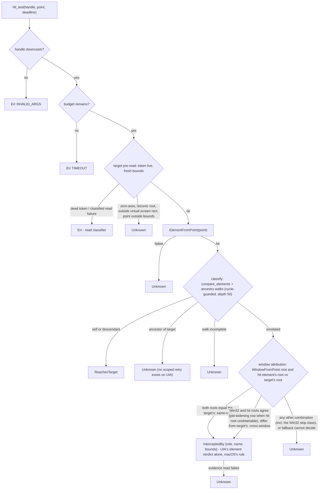
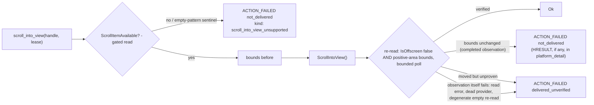

# Actionability & Occlusion (Sub-phase 2.6) - Plan

## Goal Capsule

- **Objective:** Give the Phase 1.6 auto-wait/occlusion gate (U8/U9) its Windows evidence. The shape of the work is settled by what already exists: the battery, the five-point `receives_events` sweep, the blocking rule, the auto-scroll retry, and every terminal envelope are **core-owned and already execute on Windows** — a ref action today runs the full preflight over 2.5's `get_live_element` and dies honestly at `execute_action`. 2.6 implements exactly the two adapter methods that evidence chain still lacks: `hit_test` (`ElementFromPoint` + Win32 corroboration, three-way result, never a false negative) and `scroll_into_view` (`ScrollItemPattern.ScrollIntoView`, delivery judged by observation). It also fixes the one shipped defect this gap causes: a failed `visible` check on a scroll-eligible action currently propagates `PLATFORM_NOT_SUPPORTED` from the `scroll_into_view` trait default instead of the honest visibility report (`crates/core/src/ref_action.rs:82-84` + `crates/core/src/adapter/actions.rs:16-23`).
- **Authority hierarchy:** `docs/phases.md` §2.6 > `probes/windows/FINDINGS.md` (for `api-contract` rows, and `app/provider` rows only where the row records its environment dependency, per the ledger's KTD7) > this plan > implementer judgment. Where measured evidence contradicts a document, U7 amends the document in this same PR. Ledger sub-phase names inside row text pre-date two renumberings — the A5 rows' own expectation text names "2.7" for the hit-test work `docs/phases.md` §2.6 now owns, and the A4/A9 input-synthesis rows name "2.6" for §2.8's work (verified against the rows directly; H62 separately records the §2.6 scope-line reconciliation) — so rows are cited by id and obligations are taken from `docs/phases.md`, never from a row's stale sub-phase name.
- **Stop conditions:** Do not implement `execute_action`, any activation chain, any `ActionStep` reporting, or the mutation-path delivery classifier — 2.7 (`docs/phases.md:1105`). Do not implement input synthesis, `SendInput`, or UIPI elevation mapping — 2.8. Do not route `scroll_into_view`'s HRESULT through `classify_read_hresult` or any new HRESULT→retryability table — the write-side classifier is 2.7's, and the read classifier's `Retryable` codes are exactly the ones a write may already have delivered. Do not re-derive `receives_events`, the five-point sweep, or the blocking rule on the Windows side — core owns them (`crates/core/src/actionability/receives_events.rs`, `report.rs:50-58`). Do not touch `crates/core` at all: both trait methods already exist with defaults, and this sub-phase needs zero core changes. If U1 returns an answer this plan did not anticipate, take the pre-committed branch in U1 rather than reverting to inference.
- **Execution profile:** One PR from `feat/windows-2.6-actionability` into `feat/windows-adapter`, never `main`. Budget ≈1.2k lines of hand-written Rust per the origin estimate; probes, captures, and the dogfood report are evidence artifacts outside the cap. Windows-crate-only diff plus docs. Conventional Commits.
- **Tail ownership:** The implementer opens the PR against `feat/windows-adapter` and reports the Verification Contract results.

---

## Product Contract

### Summary

An agent on Windows can resolve, read, and live-query, and every ref action already runs the full actionability battery before failing at dispatch. But the battery is running with two evidence gaps. First, `hit_test` is defaulted, so occlusion is invisible: a headed click on a covered control passes the gate blindly and a real interception is never named. Second, `scroll_into_view` is defaulted, so the auto-scroll retry that core fires after a failed `visible` check errors with `PLATFORM_NOT_SUPPORTED` — replacing the honest actionability report the user should have seen, on every scroll-eligible action whose target is not visible. 2.6 closes exactly these two gaps, proves the zero-bounds / disabled / occluded envelopes match macOS on fixtures the repository controls, and measures the primitives (`ElementFromPoint` under occlusion, hangs, degenerate coordinates, and Chromium; `ScrollIntoView`'s never-before-invoked failure surface) before code is written against them.

### Problem Frame

The Windows hit-test primitives are measured but the product path is not. A5-1: `ElementFromPoint` inside a deliberate overlap resolves to a control of the occluder, with Win32 `WindowFromPoint` independently agreeing — the corroborated second opinion the three-way contract wants. A5-2: a zero-size Win32 control is reachable by handle yet appears in no walk and is hit by no point — not-hit-testable and does-not-exist are different answers and must stay separate. A5-3 with A14-8 and A1-2: minimized windows lie about geometry — descendants keep real extents anchored at −32000 while `IsOffscreen` contradicts itself between stacks and within one window — so a gate that trusts emptiness or `IsOffscreen` alone reads a minimized target as visible, and a hit test at its stale coordinates would name the desktop as an occluder. Meanwhile `ScrollItemPattern.ScrollIntoView` has never been invoked by any probe in the corpus: its HRESULT surface, its behavior on already-visible and non-scrollable targets, and whether its success even means the element moved are all unmeasured — and A3-2's rule stands: an action is verified by re-reading the element, never by trusting the call's return.

### Requirements

- R1. Every actionability fact this sub-phase depends on that no ledger row establishes is measured before code relies on it, with a pre-committed branch for every answer including "unmeasurable".
- R2. `hit_test` never produces a false negative: every probe failure, uncorroborated interception, ancestor landing, degenerate geometry, or minimized-window shape yields `Unknown`, and a test fails when any of those paths is changed to `InterceptedBy`.
- R3. `InterceptedBy` is reported only on agreed evidence — the UIA hit element is outside the target's ancestor chain **and** the window attribution is agreed per KTD3's table: both opinions place the point in the target's own window (the same-root arm, where UIA's element verdict stands alone), or both agree on which other window owns it — and its occluder evidence carries the canonical role (always present, `"unknown"` fallback), a redaction-eligible name that inherits secure-field withholding, and bounds.
- R4. Windows ships evidence, never checks: no Windows code re-derives `receives_events`, candidate points, the blocking rule, or any battery gate; the diff to `crates/core` is empty.
- R5. `scroll_into_view`'s delivery semantics are derived from observed geometry and visibility re-reads, never from the invocation's HRESULT; no write path consults `classify_read_hresult`; the raw HRESULT appears only as diagnostic `platform_detail`.
- R6. The auto-scroll defect is fixed: a scroll-eligible action on a non-visible target reports an honest outcome — scrolled-and-retried when the pattern is available, a truthful not-delivered failure when it is not — never `PLATFORM_NOT_SUPPORTED`.
- R7. The zero-bounds / disabled / occluded cases produce the same envelopes as macOS — same error codes, same `disposition`, same `details.checks[]` shape — proven on repo-controlled surfaces: fake-driven pins for every branch, plus live fixture staging for each case U1 shows this platform can stage.
- R8. Every CI assertion is provider-independent: no node count, tree shape, coordinate literal, timing, or other `app/provider` fact.
- R9. The occlusion gate and scroll path are exercised against real applications — including an occluder the repository does not own and a Chromium target — findings fixed or escalated, and the run committed as a durable report.
- R10. Statements in `docs/phases.md` that this sub-phase's evidence disproves are corrected in place in this PR, and the shared vocabulary gains the actionability concepts it measurably lacks.

### Key Decisions

- **2.6 is planned as `docs/phases.md` defines it, with contradictions corrected rather than planned around.** (session-settled: user-directed — the standing instruction across this phase; research already found the exit criterion naming fixture cases whose fixture does not exist until 2.12, and a scope bullet reading as if `receives_events` were a separate Windows deliverable.) Governs R10. See KTD1, U7.
- **Correctness is established by running it, not by unit tests alone.** (session-settled: user-directed — carried forward from 2.2–2.5.) Governs R9.
- **No test asserts a machine-specific or application-specific fact.** (session-settled: user-directed, carried forward.) Governs R8.

### Scope Boundaries

- **Out:** `execute_action`, every UIA pattern invocation other than `ScrollItemPattern.ScrollIntoView`, the activation chain, `ActionStep` delivery reporting, and the mutation-path delivery classifier — 2.7 (`docs/phases.md:1098-1115`). 2.7 routes 2.6's one write through the classifier when it lands; the retrofit runs 2.7→2.6, never the other way.
- **Out:** the ancestor-scroll fallback for elements without `ScrollItemPattern` (macOS's `scroll_ancestor_until_visible` ladder). It rides `ScrollPattern` invocation — a second write surface — and 2.6's origin scope names `ScrollIntoView` as "the only call in this sub-phase that mutates" (`docs/phases.md:1088`). U7 writes the ladder into §2.7's scope so the deferral has an owner in the source of truth.
- **Out:** input synthesis, `SendInput`, mouse/keyboard events, UIPI elevation detection — 2.8. The A4-* and A9-* ledger rows naming "2.6" belong to today's 2.8 and impose nothing here.
- **Out:** any change to `crates/core` or `crates/macos`. Both adapter methods exist with defaults; the battery contract is settled; core's dead `evaluate.rs:119-123` arm and `anchor_matches`' degenerate-rect question stay with their recorded owners (the latter: whichever sub-phase next touches the hydration contract, per the 2.5 plan).
- **Out:** the `is` command gaining an `actionable` property, `wait --predicate actionable` gaining `--headed`, or any command-surface change. The reachability truth (KTD1) is recorded, not "fixed" — widening the wait predicate's policy is a cross-platform product decision, not a Windows adapter gap.

### Deferred to Follow-Up Work

- **The mutation-path five-way delivery classifier** — §2.7 owns it (`docs/phases.md:1105`); 2.6's `ScrollIntoView` call site is built so the retrofit is a pure error-construction refinement: the observation-derived verification spine (KTD5) stays, and 2.7 replaces only how a failed invoke's HRESULT becomes an error.
- **The ancestor-scroll fallback ladder** for non-`ScrollItem` elements — §2.7, written into its scope by U7 (Scope Boundaries above; macOS reference: `crates/macos/src/actions/scroll_into_view.rs:35-60`).
- **Mixed-DPI verification of the shared coordinate space** — unmeasurable on both available environments (A10-3: this display offers zero scale steps and effective DPI stays 96 in both awareness arms; the hosted runner reproduces the single-96-DPI shape, A16-4). The by-construction argument (KTD7) is documented in the module; live mixed-DPI verification stays with the deferral chain A16-4 already records — a later sub-phase on a rig with a scalable display.
- **A standing Windows performance harness** — U1 measures this sub-phase's own costs per the corpus methodology (A15-13), as 2.3–2.5 did. U7 resolves the four-sub-phase-old open question about the repo perf-baseline DoD by naming this as the Windows vehicle in `docs/phases.md` (the script itself is structurally macOS-bound: it `open`s the `.app` fixture bundle).

---

## Planning Contract

### Key Technical Decisions

- KTD1. **Two adapter methods are the entire Windows surface, and the plan states where they are reachable so the proof targets the right paths.** The battery (`crates/core/src/actionability/evaluate.rs:76-129`), the five-point sweep (`receives_events.rs:77-89`), the blocking rule (`report.rs:50-58`), the single-point pointer gate (`require_receives_events`), the auto-scroll trigger (`ref_action_wait_evidence.rs:3-5`), and every terminal envelope are core-owned and already execute on Windows over 2.5's `get_live_element`. Reachability before 2.7: `hit_test` fires only on headed pointer paths — `--headed click`/`double-click`/`triple-click`/`right-click` (five-point battery) and `--headed hover`/`drag` (single-point gate) — because a headless click resolves to `Semantic` delivery or dies terminally at `supported_action` first, and `wait --predicate actionable` hard-codes a headless policy (`wait_predicate.rs:76-87`, pinned by core's `hit_test_tests.rs:188-211,374-390`). `scroll_into_view` fires on the auto-scroll retry after a `visible` **fail** (status exactly `"fail"`, not `unknown` — `ref_action_wait_evidence.rs:7-19`) and on the hover/drag point path. Consequences: the occlusion proof is `--headed click` against staged occlusion plus unit tests driving `hit_test` directly; the zero-bounds and disabled envelopes are already produced by shipped machinery and 2.6 **pins parity rather than builds it**; and after an unoccluded gate pass, headed click still fails at `execute_action` with `PLATFORM_NOT_SUPPORTED` — the honest pre-2.7 outcome, which the tests assert as proof of gate ordering.
- KTD2. **Hit classification mirrors macOS's acceptance rule, with one stated divergence.** Self or descendant of the target → `ReachesTarget` (ancestry walked upward from the hit, `compare_elements` per step, runtime-id cycle guard, depth cap 50 — the macOS shape at `crates/macos/src/tree/hit_test.rs:103-151` with `NodeKey`'s keying rationale from 2.2). Unrelated → corroborated `InterceptedBy` (KTD3). **Ancestor of the target → `Unknown` directly**: macOS retries an ancestor landing against the owning application (`hit_test_in_application`) because AX supports app-scoped hit-testing; UIA's `ElementFromPoint` is desktop-global with no scoped variant, so the Windows arm goes straight to the answer the retry could at best refine toward — and the ancestor case is exactly what a Chromium render-host pane produces when web content is not hit-addressable, so `Unknown` (gate passes, dispatch decides) is the designed outcome there, never a false interception. Probe failures → `Unknown`. `Err` escapes are exactly macOS's set: an invalid handle (`InvalidArgs`), a crossed deadline (`TIMEOUT`), and a classified failure of the *target's own* pre-probe read — a dead process token surfaces the crate's existing stale-reader error, and the read classifier legitimately applies because `hit_test` is a read. Everything else — a failed `ElementFromPoint`, a failed ancestry step, failed occluder evidence — is swallowed to `Unknown`, because core propagates any non-`PlatformNotSupported` error verbatim and aborts the whole battery (`receives_events.rs:54`), so an over-eager `Err` turns one flaky probe into a failed action.
- KTD3. **Corroboration answers the window question; element verdicts inside an agreed window are UIA's alone.** The Win32 second opinion — `WindowFromPoint(point)` → `GetAncestor(GA_ROOT)` — exists to catch the wrong-window class of false interception (a stale window attribution, a phantom desktop hit), so it is consulted at window granularity and never second-guesses element-level answers. The rule is a decision over three inputs — the target's root, the hit element's root, and `WindowFromPoint`'s root — in three arms. **Same root:** when Win32's root **and** the UIA hit element's own root both equal the target's root, the window attribution is agreed and the UIA classification stands on its own — an unrelated non-ancestor hit inside the target's own window is `InterceptedBy` on UIA's positive evidence, exactly the rule macOS ships with no second opinion anywhere (`crates/macos/src/tree/hit_test.rs:139-141`; core's contract prose names "sibling" as a real occluder), so in-window overlays, adorners, and sibling panels — the most common real occluder class — are named, not lost to a corroboration demand Win32 is structurally unable to meet for them. **Cross-window:** when Win32's root and the hit element's root agree with each other and differ from the target's, the two opinions agree on which other window owns the point and the interception is corroborated. **Divergence:** any other obtained combination is a contradicted attribution → `Unknown` — deliberately including the Win32 skip class: `WindowFromPoint` documented-skips disabled and `WS_EX_TRANSPARENT` windows, so a cross-window overlay of either style reads Win32-root == target-root against a differing hit root, and reporting `InterceptedBy` there would name a click-through overlay as blocking a point input genuinely reaches — that cell lands `Unknown`, which is what the Risks section prices. Both roots are obtained by the identical recipe — walk the element's ancestors to the first non-zero `NativeWindowHandle`, then `GA_ROOT` (`get_native_window_handle` returns a zero handle for HWND-less elements, so walk-to-first-non-zero applies to both ends); `WindowFromPoint`'s root always has an owning pid via `GetWindowThreadProcessId`. The full attribution table, with T/H/W the target's, hit's, and Win32's roots: **(1)** H==T and W==T → same-root `InterceptedBy`; **(2)** H≠T, W≠T, W==H → cross-window `InterceptedBy`; **(3)** H unobtainable, W≠T, pid(hit)≠pid(target), pid(hit)==pid(W's owner) → cross-window `InterceptedBy` — the pid-widening row, and the only pid substitution there is; **every other combination → `Unknown`**, including the Win32 skip cell (W==T against H≠T), three distinct roots (the two opinions blame different windows, so naming either would be uncorroborated), any T or W read failure, and the pid-equal shapes — pid difference can prove two windows belong to different processes, but pid equality never proves same-window (A5-1's own staging is one process, two windows), so equality widens nothing. A consequence the table makes structural: occluder evidence always describes the UIA hit element, and every `InterceptedBy` row guarantees that attribution is consistent with the window Win32 blames — the evidence never names an element of a window the second opinion does not implicate. A5-1 measured the two opinions agreeing on a staged cross-window occluder; U1 item 3 measures the shapes that stress each arm — the same-root overlay on both scratch fixtures, the Win32-skipped window styles (`WS_EX_TRANSPARENT`, layered-alpha, `WS_DISABLED`), an elevated occluder across the UIPI boundary, and, on the HWND-per-control WinForms stack, whether `WindowFromPoint`'s child-HWND answer corroborates at sub-window granularity (informative, not load-bearing) — each with its branch pre-committed, so the measurements price the rule rather than change it. The corroboration tier is a Windows addition — macOS has none (`crates/macos/src/tree/hit_test.rs` uses no window API) — and it is what `docs/phases.md:1085`'s "window corroboration" means.
- KTD4. **Windows needs pre-probe guards macOS never did, because Windows geometry lies in measured ways.** Before any probe: re-read the target's bounds fresh (one bounded read); a zero-area or degenerate rectangle → `Unknown` (macOS's guard, `hit_test.rs:53-55`). Then the Windows-only guards: a target whose root window `IsIconic` → `Unknown`; and a probe point or target rectangle outside the **virtual screen rect** (`GetSystemMetrics(SM_XVIRTUALSCREEN/SM_YVIRTUALSCREEN/SM_CXVIRTUALSCREEN/SM_CYVIRTUALSCREEN)`) → `Unknown` before the call — membership in that rect is exact on any monitor layout, so a display left of primary keeps its legitimate negative coordinates probeable while the minimized anchors (real extents at −31768/−31896 with `IsOffscreen` false on the managed stack and self-contradictory on COM: A5-3, A14-8, A1-2) fall outside it and never reach `ElementFromPoint`, where the desktop would answer and — being outside the target's tree with a different root both opinions agree on — would otherwise read as a corroborated phantom occluder. A point outside the freshly-read bounds → `Unknown` (the candidate points were computed from bounds that have since moved; probing them answers a question nobody asked). One macOS mechanism is conditionally not ported: the clipping-container walk (`clipped_bounds`, macOS `hit_test.rs:228-307`) approximates the per-element visibility signal AX lacks. For a **fully** scrolled-out target UIA has the direct signal — provider-reported `IsOffscreen` feeds core's `visible` gate upstream and the battery short-circuits before `hit_test` runs, so the walk would copy evidence the gate already consumed. A **partially** visible target passes that gate carrying its full provider rect, and whether that rect is viewport-clipped is unmeasured — if it is not, candidate points over the out-of-viewport portion land on same-window neighbors and the same-root arm would name them as occluders, a false block macOS's pre-filter prevents. U1's straddling-item leg measures it, branch pre-committed: clipped bounds → nothing more is needed; unclipped bounds → the same-root arm demotes hits at points outside the target's intersection with its nearest scroll-viewport ancestor's bounds to `Unknown` — a minimal intersection, never the full macOS walk — and this rationale is restated to the measured fact.
- KTD5. **Reads classify through the read classifier; the write is judged by observation, not by its HRESULT.** `hit_test` and every read inside it (bounds, ancestry, occluder evidence) fail through `classify_read_hresult`/`uia_failure_disposition` — the existing read-path discipline, correct because repeating a read is always safe. `scroll_into_view` is a write: 2.6 does **not** classify its HRESULT into retryability or delivery — that table is 2.7's mutation classifier, and the read table is explicitly forbidden for writes (`docs/phases.md:1105`). Instead the call is verified the way A3-2 prescribes: capture bounds before, invoke, then re-read visibility (`IsOffscreen` plus positive-area bounds — reads, classified as reads) within a bounded verification window mirroring macOS's `scroll_to_verified` (`crates/macos/src/actions/scroll_into_view.rs:92-132`). Delivery semantics come from what was observed, in four arms: verified visible → `Ok`; geometry unchanged across a completed observation → `ACTION_FAILED` with `not_delivered` (safe); geometry moved but visibility unproven → `ACTION_FAILED` with `delivered_unverified`; and a post-invoke observation that itself fails — a read error, a dead provider, or A14-9's measured corpse shape where reads succeed carrying empty values and would feed degenerate geometry into the comparison — → `ACTION_FAILED` with `delivered_unverified`, because the invoke already fired and an unobservable after-state must never claim `not_delivered` nor surface as a bare read error whose disposition hides the mutation (macOS wraps every post-invoke read failure exactly this way via `after_delivery`, `scroll_into_view.rs:107-192`). An observation is *completed* only when the re-read returns non-degenerate geometry (`rect_has_area` is the test); any degenerate re-read routes to the fourth arm before the bounds comparison runs, including when bounds-before was itself degenerate. A failed invoke's HRESULT is recorded as `platform_detail` via the existing formatting helpers (formatting, not classification) with delivery judged by the same observation — bounds unchanged across a completed observation is `not_delivered` even when the invoke errored. 2.7's retrofit then refines only the error construction (e.g. `E_ACCESSDENIED` → `PERM_DENIED`) through the mutation classifier, on top of an unchanged verification spine.
- KTD6. **`ScrollIntoView` is gated on availability, read the 2.3 way, and its two unsupported shapes are handled explicitly.** The gate is `TreeProperty::ScrollItemAvailable` through the existing gated-read discipline (A15-7: ungated pattern-state reads return plausible defaults, never the sentinel). Gate says unavailable → no invoke, and the error is an honest not-delivered `ACTION_FAILED` naming the missing affordance (`details.kind: "scroll_into_view_unsupported"`) — which after core's `?` becomes the action's outcome, truthfully replacing today's `PLATFORM_NOT_SUPPORTED` (R6). The second shape is the crate landmine: `get_pattern` on an element whose provider returns a null `IUnknown` surfaces as the `ERR_NONE` sentinel (`Error::empty()`, `result() == None`), which the sentinel table maps to `Terminal/Internal` — so the invoke path treats the empty-pattern shape as the same settled unavailability as the gate, explicitly, rather than letting it surface as `INTERNAL`. Census reality is recorded, not assumed away: `ScrollItem` was observed only on `ListItem`/`TreeItem` (12 elements across `captures/03-pattern-census/pattern-matrix.json`, 2 of 4 census targets, never on Chromium), so most elements take the unsupported arm until 2.7's ladder — the honest envelope, stated in the module doc.
- KTD7. **The coordinate space is shared by construction, and the plan says so instead of hand-waving.** `ElementFromPoint` takes physical screen pixels; `BoundingRectangle` returns physical screen pixels; core's five candidate points are computed from the same live bounds the adapter returned (`receives_events.rs:77-89`); and the process is `PER_MONITOR_AWARE_V2` from the 2.1 bootstrap (A10-4, `system/dpi.rs`), which is what makes both ends physical. The only transform anywhere is core's `f64` → the crate `Point`'s `i32`, written as a saturating narrowing (the crate denies panicking paths). Mixed-DPI round-trip verification is unmeasurable on both available environments (A10-3's zero-scale-step display; A16-4 reproduces it) — recorded with the deferral chain that already owns it, not faked.
- KTD8. **Placement mirrors macOS through the crate's own conventions.** `hit_test` → `crates/windows/src/tree/hit_test.rs` (macOS: `tree/hit_test.rs`), splitting classification/corroboration into siblings if the 400-line cap presses. `scroll_into_view` → `crates/windows/src/actions/scroll_into_view.rs` (macOS: `actions/scroll_into_view.rs`) — the first real module in the crate's empty `actions/`. Trait overrides land in the root `adapter.rs` `impl ObservationOps` / `impl ActionOps`, where every other Windows override already lives. Both entry points open with the crate's standard preamble: `uia_element(handle)`, `permissions::ensure_budget(deadline)`, and the bounded `automation_client()` (`CUIAutomation8`, `ConnectionTimeout` 2000 ms, `TransactionTimeout` 20 s — no unbounded fallback exists).

### High-Level Technical Design

The hit-test decision flow, with every arm's terminal answer:

The scroll path — delivery judged by observation, the HRESULT only a diagnostic:

### Assumptions

- (verified during planning, no longer an assumption) The vendored `uiautomation` 0.25.0 walker exposes the parent step U2's ancestry walk needs: `UITreeWalker::get_parent` wraps `IUIAutomationTreeWalker::GetParentElement` (`core.rs:1552-1556`) — no raw-COM escape hatch required.
- The A18 probe rides the existing capability-probe workflow for its second environment, as A15–A17 did; fixture-dependent legs that cannot run on the hosted image record the limitation per row.

---

## Implementation Units

| U-ID | Title | Key files | Depends on |
|---|---|---|---|
| U1 | Measure the actionability unknowns | `probes/windows/18-actionability/`, `probes/windows/scratch/` | — |
| U2 | `hit_test`: classification and the never-false-negative arms | `crates/windows/src/tree/hit_test.rs`, `adapter.rs` | U1 |
| U3 | Corroborated interception and occluder evidence | `crates/windows/src/tree/hit_test.rs` family | U2 |
| U4 | `scroll_into_view`: gated invoke, observed delivery | `crates/windows/src/actions/scroll_into_view.rs`, `adapter.rs` | U1 |
| U5 | Envelope parity: zero-bounds / disabled / occluded end to end | `crates/windows/src/tree/hit_test_tests.rs` and fixture tests | U1, U2, U3, U4 |
| U6 | Dogfood the gate against real occluders and real scrolling | `probes/windows/scratch/`, `docs/dogfood-reports/` | U5 |
| U7 | Correct what this sub-phase disproves | `docs/phases.md`, `CONCEPTS.md`, `skills/agent-desktop/` | U1, U6 |

### U1. Measure the actionability unknowns

- **Goal:** Every fact the hit-test and scroll paths depend on that no ledger row establishes is measured, with a pre-committed branch per answer.
- **Requirements:** R1.
- **Files:** `probes/windows/18-actionability/` (probe source, runner, captures), `probes/windows/FINDINGS.md` (A18 rows), `probes/windows/scratch/ScratchForms.cs` and `ScratchWpf.ps1` (fixture extensions), `.github/workflows/windows-capability-probe.yml` (path filter only).
- **Approach:** One probe family, A18, through the bounded `CUIAutomation8` client (the product's construction, not the managed stack the A5 rows used — KTD1 of the ledger makes the COM reading authoritative):
  1. **`ScrollIntoView`'s failure surface, invoked for the first time in this corpus.** On the WPF fixture extended with a tall list (items below the fold; the census puts `ScrollItem` on WPF `ListItem`s): an already-visible item, a below-fold item, an item in a minimized window, and an item whose provider has just been killed. Record the raw HRESULT (or clean return), the bounds-before/bounds-after delta, and the target's realization state — whether the below-fold item was present in the walk at all and whether its pre-scroll bounds were realized or degenerate, with the fixture's virtualization setting noted — so the rows separate scroll-delivery facts from virtualization artifacts (both chosen scroll surfaces virtualize: WPF `ListBox` by default, Explorer's list view in U6). Branches: any case where geometry moves but the return reports failure, or the return succeeds with no movement and no visibility, is exactly what the observation-derived delivery rule exists for and is recorded as its justification; the killed-provider leg records which shape fires — an errored observation or A14-9's succeeding-empty reads — and either way lands KTD5's fourth arm (`delivered_unverified`), which the row pins as the designed outcome; a case the fixture cannot stage is recorded per row and the arm stays fake-driven. The tall list also stages the straddling-item leg KTD4 needs: an item half-in, half-out of the viewport, recording whether `BoundingRectangle` is viewport-clipped (WPF here; the Win32 list-view answer rides U6's Explorer judgement) and what `ElementFromPoint` answers at candidate points over the out-of-viewport portion — branch per KTD4: clipped → nothing changes; unclipped → the minimal viewport-intersection demotion guards the same-root arm.
  2. **`ElementFromPoint` against settled Chromium content.** Launch the scratch-vault Obsidian through the dogfood harness's lifecycle plumbing, settle via the fresh-client protocol (A16-11), pick a leaf with positive-area bounds inside the render widget, probe **all five candidate points** the shipped sweep would use. Record whether each hit is the walked element, a descendant, an unrelated same-root web element (a sibling leaf — the shape tightly-flowed inline content makes likely at inset points), or the render-host pane (the ancestor shape), and what `WindowFromPoint` names. Branches: web element or descendant → the standard rule covers Chromium and U6 judges it live; unrelated same-root web element → KTD3's same-root arm names it (`InterceptedBy`), and a demonstrably wrong sibling at a known-clear point takes item 3's fallback (recorded, the same-root arm falls back to `Unknown`, U7 writes the consequence); pane/ancestor → `Unknown` is Chromium's designed outcome, recorded in the module doc and U7's `docs/phases.md` wording; target absent or shell-bound (A17-8's shape) → recorded, U6's judgement becomes the measurement of record.
  3. **The corroboration matrix, one leg per KTD3 arm.** Staged pairs probing the same point through both opinions (UIA hit element's root vs `WindowFromPoint`→`GA_ROOT`): same-process partial overlap (the A5-1 shape, re-measured through the product client), a foreign-process occluder fully covering the target, a three-window stack probed without raising anything, a **same-root overlay** — a probe-owned control covering a sibling inside one window, staged on both the WinForms and WPF scratch fixtures, with the WinForms leg also recording whether `WindowFromPoint`'s child-HWND answer matches the UIA hit's `NativeWindowHandle` (KTD3's informative sub-window granularity) — an **elevated occluder** (a High-integrity probe-owned window covering a Medium-owned target, staged via `09-elevation-uipi.ps1`'s boundary manufacture with label read-back and the High control arm, recording both opinions and the occluder-evidence read outcome across the UIPI boundary), a `WS_EX_LAYERED` alpha window, a `WS_EX_TRANSPARENT` overlay, and a disabled (`WS_DISABLED`) window. Record which KTD3 arm each case lands. Branches: the same-root leg is expected to land `InterceptedBy` on UIA's verdict (the macOS-parity arm); if UIA names a demonstrably wrong sibling at a known-clear point, that is recorded, the same-root arm falls back to `Unknown`, and U7 writes the consequence into `docs/phases.md`. The `WS_EX_TRANSPARENT` and `WS_DISABLED` legs are expected to land the contradicted-attribution cell — `WindowFromPoint` documented-skips both styles toward the target's root while the hit element's root differs — and their rows pin `Unknown` as the designed answer, never a click-through overlay named as blocking. Every genuine divergence lands `Unknown` by design — the measurement prices how often honesty costs an answer, and U6 attributes it. The elevated leg folds whatever it reads into the existing arms (divergence → `Unknown`; readable evidence → the normal withholding-disciplined path), and its row is cited in U3's module doc as the measured basis for occluder reads across the integrity boundary. If the transparent-overlay case shows Win32 skipping what UIA names *and the UIA answer is demonstrably the interactive truth*, that is recorded as evidence for a later refinement and U7 writes it into the receiving sub-phase's scope in `docs/phases.md` if it fires.
  4. **Hang defense.** `ElementFromPoint` at a point over a never-pumping window (A14-11's inline-`WM_CREATE` fixture), through the bounded client — plus one occluder-evidence read (the label/name path) and one hit-root ancestor walk against the same hung target, because the evidence reads and the corroboration walk are their own hang classes distinct from the probe. Record wall time and failure shape for each. Branch: the connection timeout bounds it → the classifier already handles `UIA_E_TIMEOUT` as retryable and `hit_test` swallows it to `Unknown`; it does not bound it → `hit_test` gains a `WindowFromPoint`-first pre-probe (the cheap local call resolves the HWND, `window_is_pumping` liveness-checks it before the UIA call), and the row records the measured necessity.
  5. **`Unknown`'s triggers, which no capture has ever fired.** `ElementFromPoint` at (−1,−1), (0,0), beyond the virtual screen's extent, and in the −32000 region: element, null, or error, and which HRESULT. Branch, pre-committed: whatever these answer, any point outside the virtual screen rect is guarded to `Unknown` before the call (KTD4) and never reaches the corroboration seam as an interception — the rows document what the guard prevents (the measured desktop answer at freed coordinates), not a decision still open.
  6. **Cost.** Min-of-seven with discarded warm-up (A15-13): `ElementFromPoint` against the in-process fixture, the out-of-process WPF window, settled Chromium, and the bare desktop; plus the target pre-read and one full five-point worst case. Both environments where the workflow reaches. This prices the poll loop's per-iteration cost against its ~100 ms cadence.
  7. **Envelope staging reality.** Extend `ScratchForms.cs` with a permanently-disabled button; measure whether WPF exposes a zero-size element to the walk (A5-2 proved Win32 does not; WPF peers are not HWND-backed, so the answer is unknown) via a 0×0 element added to the WPF scratch fixture. Branches: WPF exposes it → U5 gains a live zero-bounds envelope case; it does not → the zero-bounds envelope stays fake-driven plus the shipped `is visible` path, and U7 corrects §2.6's exit-criterion wording to name the achievable surface.
  8. **DPI.** Pre-committed unmeasurable branch taken up front: this display offers zero scale steps (A10-3) and the hosted runner reproduces 96-DPI (A16-4), so the mixed-DPI round-trip cannot be measured here; the row records the by-construction argument (KTD7) and cites the deferral chain that owns live verification. No arm pretends to measure it.
- **Execution note:** Probes are raw scripts and Rust against the real OS; captures follow the corpus redaction rules — shapes and counts, never application text; rects recorded as comma-joined strings so KTD9 normalization cannot destroy −32000 evidence (the 07-hittest precedent). No probe raises, focuses, or foregrounds any window it did not create (the corpus's zero-foreground-interference discipline; staging uses the 07-hittest minimize/restore manoeuvre only on probe-owned windows).
- **Test scenarios:** Test expectation: none — probes are evidence artifacts; their captures and ledger rows are the deliverable.
- **Verification:** Every A18 row committed with stack, verdict, branch taken; captures redaction-clean; the workflow's artifact carries the runnable legs from the hosted environment.

### U2. `hit_test`: classification and the never-false-negative arms

- **Goal:** `ElementFromPoint`-based three-way hit testing whose every failure, guard, and ancestor landing yields `Unknown`, with `Err` reserved for the macOS-parity escape set.
- **Requirements:** R2, R4.
- **Dependencies:** U1 (items 4, 5).
- **Files:** `crates/windows/src/tree/hit_test.rs` (+ `hit_test_tests.rs`), `crates/windows/src/adapter.rs` (one override in `impl ObservationOps`), `crates/windows/src/tree/mod.rs`, `crates/windows/src/tree/fixture_window.rs` and `fixture.rs` (named harness extension: the existing harness deliberately parks every window off-screen at (2000,2000), which KTD4's virtual-screen guard would itself refuse — the live hit-test legs need a caller-positioned on-screen variant, placed inside the virtual screen rect, with the harness's existing cleanup discipline; split a sibling module if the 400-line cap presses — `fixture_window.rs` is near it already).
- **Approach:**
  1. Entry preamble per KTD8: downcast, budget, bounded client. Pre-probe target read per KTD4: token corroboration (the crate's existing stale-reader discipline), fresh bounds via the existing single-property read path, then the guard ladder — zero-area, `IsIconic` root, virtual-screen-rect membership, point-outside-bounds — each to `Unknown`.
  2. The probe: `automation_client()?.element_from_point(point)` with the saturating `f64`→`i32` narrowing (KTD7). Any failure → `Unknown` (U1 item 4's branch decides whether a pumping pre-probe precedes it).
  3. Classification per KTD2: `compare_elements` for self; upward ancestry walk from the hit with the runtime-id cycle guard and depth cap for descendant; the reverse walk for ancestor-of-target → `Unknown`; incomplete walks → `Unknown`. The walker's parent step comes from the crate's tree-walker surface (Assumptions).
  4. `Err` escapes exactly: invalid handle, crossed deadline, dead-token/classified target pre-read. A test pins that no other path constructs `Err` — core aborts the whole battery on any unrecognized error (`receives_events.rs:54`), so the pin is the contract.
- **Patterns to follow:** `crates/macos/src/tree/hit_test.rs:45-151` (the flow and classification), `crates/core/src/hit_test.rs:4-23` (the contract prose), `crates/windows/src/tree/live_read.rs:150-157` (token corroboration), `crates/windows/src/tree/automation.rs:216-233` (the bounded-entry precedent), the vendored walker's parent step (`UITreeWalker::get_parent`, `core.rs:1552-1556`).
- **Test scenarios:**
  - Self-hit and descendant-hit classify `ReachesTarget`; ancestor-hit classifies `Unknown`; unrelated-hit reaches the corroboration seam — the four relation arms pinned as pure-logic tests (the macOS `classify_relation` test shape).
  - Every guard arm produces `Unknown`, and each test fails when its arm is changed to `InterceptedBy` or `Err` — inverted per the repo's invert-verify discipline.
  - A cycle in the ancestry walk terminates as `Unknown`, never hangs — driven through a fake parent step.
  - The `Err` set is closed: a fake probe failure yields `Ok(Unknown)`, not `Err`; the dead-token case yields the stale-reader error; and the pins fail if either direction flips.
  - Live (dev box + fixture lane): a fixture control hit at its own center reaches — staged through the on-screen harness variant, because the harness's off-screen parking would trip KTD4's own guard; the same point after minimizing the fixture window yields `Unknown` (KTD4's guard, the A5-3 shape).
- **Verification:** Windows lib tests green; no `Err` path outside the pinned set; module doc records the ancestor-arm divergence from macOS and the Chromium consequence (U1 item 2's branch).

### U3. Corroborated interception and occluder evidence

- **Goal:** `InterceptedBy` fires only on two-opinion agreement, and the occluder it names carries canonical, redaction-disciplined evidence.
- **Requirements:** R3, R2.
- **Dependencies:** U2.
- **Files:** `crates/windows/src/tree/hit_test.rs` family (a corroboration/evidence sibling module if the 400-line cap presses), tests; the U2 harness extension gains an overlay-child staging call for the same-root arm (a control deliberately covering a sibling inside one fixture window).
- **Approach:**
  1. Window attribution per KTD3, three inputs: the target's root and the hit element's root (both by the identical walk-to-first-non-zero-`NativeWindowHandle`-then-`GA_ROOT` recipe) and `WindowFromPoint(point)` → `GA_ROOT`. Both roots equal the target's → same-root `InterceptedBy` on UIA's verdict alone; Win32's and the hit's roots agree with each other and differ from the target's → cross-window `InterceptedBy`; any other obtained combination — including the Win32 skip class, where a disabled or `WS_EX_TRANSPARENT` cross-window overlay reads Win32-root == target-root against a differing hit root — → `Unknown`. Unobtainable roots decide per KTD3's attribution table: the only pid substitution is the widening row — hit root unobtainable, pid differing from the target's and agreeing with `WindowFromPoint`'s owner → cross-window `InterceptedBy` — and pid equality never widens; everything else lands `Unknown`. `WindowFromPoint`/`GetAncestor` are the first Win32 hit APIs in the crate — declared beside the crate's existing `windows-sys` window helpers.
  2. Occluder evidence mirrors macOS's `intercepted_by` (`hit_test.rs:153-200`): role from the hit element's `ControlType` through the crate's canonical role map, always `Some` with the `"unknown"` fallback; name through the existing label/name-evidence path so secure-field withholding and evidence discipline are inherited, never a raw `Name` read — and the evidence read batch must include `IsPassword`, because the shipped withholding is batch-conditional (`ElementProperties` gates value-bearing text only when `IsPassword` was in the read set), so the pinned password-occluder test enforces the batch's composition, not merely a call site; bounds through the existing rect conversion. Any evidence-read failure swallows to `Unknown` (the macOS `unwrap_or` shape).
  3. The occluder name is structured data only: it appears in `details.checks[].occluder.name` (core's contract) and never in any message or `platform_detail` this unit constructs — the trace-reachable-messages rule, load-bearing here because `actionability.check.error` carries `details` verbatim.
- **Patterns to follow:** `crates/macos/src/tree/hit_test.rs:153-200`; `crates/windows/src/tree/roles.rs` (canonical mapping); `crates/windows/src/tree/name_evidence.rs` (`read_label`); `docs/solutions/conventions/keep-raw-arguments-out-of-trace-reachable-error-messages.md`.
- **Test scenarios:**
  - The KTD3 attribution table pinned cell-by-cell: rows (1) and (2) → `InterceptedBy`; the pid-widening row (3) → `InterceptedBy`, and the same shape with pid-equal → `Unknown` (equality never widens); the Win32 skip cell (W==T against H≠T — the disabled/`WS_EX_TRANSPARENT` shape) → `Unknown`, failing if flipped to `InterceptedBy`; three distinct roots → `Unknown`; a T or W read failure, or an unreadable pid → `Unknown` — each cell failing when flipped.
  - An occluder that is a password control yields a withheld name (`None`), pinned with the marker fixture — the withholding call site cannot be bypassed "for evidence".
  - Role is always present: an occluder whose `ControlType` read fails still reports `role: Some("unknown")`.
  - Live: two overlapped fixture windows (the A5-1 staging, product client) — the covered control's center reports `InterceptedBy` naming the occluder window's control, and the uncovered control reports `ReachesTarget`; and a same-root overlay staged inside one fixture window reports `InterceptedBy` naming the overlay (the macOS-parity arm, live).
- **Verification:** Lib tests green; a grep-shaped check pins that `occluder.name` never feeds a `format!` in the hit-test family; live overlap tests (cross-window and same-root) green on the fixture lane; the module doc cites the A18 elevated-occluder row as the measured basis for cross-integrity occluder evidence.

### U4. `scroll_into_view`: gated invoke, observed delivery

- **Goal:** The auto-scroll seam works: available → invoke and verify by observation; unavailable → an honest not-delivered failure; and the `PLATFORM_NOT_SUPPORTED` defect is gone.
- **Requirements:** R5, R6.
- **Dependencies:** U1 (item 1).
- **Files:** `crates/windows/src/actions/scroll_into_view.rs` (+ tests), `crates/windows/src/actions/mod.rs` (first real module declaration), `crates/windows/src/adapter.rs` (one override in `impl ActionOps`).
- **Approach:**
  1. Preamble: downcast, budget from the lease's deadline, token corroboration (a write against a corpse must not report observation-judged outcomes).
  2. Gate per KTD6: `ScrollItemAvailable` through the gated read. Unavailable → `ACTION_FAILED`, `not_delivered`, `details {"kind":"scroll_into_view_unsupported","complete":true,"retryable":false}`, suggestion naming the affordance gap. The `get_pattern` empty-`IUnknown`/`ERR_NONE` shape maps to the same error explicitly.
  3. Invoke `UIScrollItemPattern::scroll_into_view()`, then the KTD5 verification spine: bounds-before, bounded re-read poll (`IsOffscreen` false and positive-area bounds → verified `Ok`; the poll's slice discipline mirrors the crate's existing deadline-slice helpers), terminal judgement from observation with the four outcomes and their dispositions as the design diagram states — including the observation-failure arm: any post-invoke read error, dead provider, or degenerate empty re-read judges `delivered_unverified`, never a bare propagated read error and never `not_delivered` (KTD5's fourth arm). A failed invoke records its HRESULT symbol via the existing formatting helper into `platform_detail` — never through `classify_read_hresult`, pinned.
  4. No focus, no foreground change: the unit's live test asserts the foreground window is unchanged across the call (the corpus discipline; A3-4 is the cautionary row).
- **Patterns to follow:** `crates/macos/src/actions/scroll_into_view.rs:92-184` (`scroll_to_verified`, `scroll_effect_observed`, `rect_has_area`); `crates/windows/src/tree/properties.rs` (gated reads); `crates/windows/src/system/hresult.rs:194-237` (formatting helpers only).
- **Test scenarios:**
  - Unavailable pattern → the unsupported error, and through core's ref-action path the end-to-end outcome is that error, not `PLATFORM_NOT_SUPPORTED` — the R6 regression pin, driven with a fake and inverted to prove it fails against the pre-2.6 default.
  - Verified-visible after invoke → `Ok`; unchanged geometry after a clean return → `not_delivered` `ACTION_FAILED`; moved-but-unproven → `delivered_unverified`; and a post-invoke observation failure — a fake dead provider, the A14-9 succeeding-empty shape, and the degenerate-before/degenerate-after variant, which must land the fourth arm rather than `not_delivered` — → `delivered_unverified`, never `not_delivered` and never a bare propagated read error — the four observation outcomes pinned through fakes, each failing when its disposition is swapped.
  - A failed invoke with unchanged geometry reports `not_delivered` and carries the HRESULT only in `platform_detail`; a test fails if the message or code is derived from the read classifier (call-count/shape pin on the classifier seam).
  - Live (WPF fixture, dev box): a below-fold list item scrolls into verified visibility; an already-visible item returns without a foreground change.
- **Verification:** Lib tests green; the write path provably never consults the read classifier (pinned); the R6 end-to-end pin green.

### U5. Envelope parity: zero-bounds / disabled / occluded end to end

- **Goal:** The origin's exit criterion holds on surfaces the repository controls: the three cases produce macOS's envelopes — same codes, same `disposition`, same `details.checks[]` shape — through the real Windows machinery.
- **Requirements:** R7, R8.
- **Dependencies:** U1 (item 7), U2, U3, U4.
- **Files:** `crates/windows/src/tree/hit_test_tests.rs`, fixture-driven lib tests beside the crate's existing `fixture.rs` harness, `probes/windows/scratch/` staging.
- **Approach:** Three cases, each proven at the strongest tier U1 says the platform can stage, and never weaker than fake-driven both-ways pins:
  1. **Disabled:** the scratch fixture's permanently-disabled button (U1 item 7) through the shipped battery — `click` fails `ACTION_FAILED` with `checks[]` carrying `enabled`/`fail`/`"live enabled state is false"`, auto-wait converts to `TIMEOUT` with `details.kind: "actionability_timeout"` at budget exhaustion, and `--timeout-ms 0` returns the immediate report — the AE2 envelope, asserted from the binary's JSON on the dev box and from unit tests through fakes in CI.
  2. **Zero-bounds:** U1 item 7's branch decides the live surface (WPF-exposed zero-size element, or none). Either way the envelope is pinned: `visible`/`fail`/`"bounds are zero-sized"` through the shipped gate, plus the shipped `is visible` path answering `applicable: true, result: false` (the AE1 shape) — with the live leg present exactly when the platform can stage it, and the limitation recorded when it cannot (A5-2, A17-7).
  3. **Occluded:** the U3 live staging driven through `--headed click` on the dev box, in both KTD3 interception shapes — a cross-window occluder and a same-root overlay: covered → `ACTION_FAILED` whose `checks[]` carries `receives_events`/`fail`/`"occluded by <role>"` with the structured `occluder`, polling to `TIMEOUT` under auto-wait; uncovered → the gate passes and the command fails at dispatch with `PLATFORM_NOT_SUPPORTED` — asserted as the honest pre-2.7 ordering proof (KTD1). CI-side, the same arms are pinned through core's own contract tests plus Windows fakes; the live leg runs on the fixture lane and the dev box.
  The U4 dependency is load-bearing even though no case names scrolling: the end-to-end zero-bounds and offscreen click envelopes traverse the auto-scroll seam — a `visible` fail triggers `scroll_into_view` before the honest report lands — so without U4 the envelope under test is the trait default's `PLATFORM_NOT_SUPPORTED`, not the parity envelope.
- **Test scenarios:** as enumerated in the approach, each envelope asserted on code, `disposition.delivery`/`retry`, and the exact `checks[]` fields, and each live assertion rule-shaped (no coordinates, no counts, no app-named facts in CI).
- **Verification:** All parity pins green; the dev-box envelope transcript quoted in the dogfood report; no CI assertion carries an `app/provider` fact.

### U6. Dogfood the gate against real occluders and real scrolling

- **Goal:** The occlusion gate, the corroboration honesty, and the scroll path are run and judged against real software, including an occluder the repository does not own and the Chromium target.
- **Requirements:** R9, R2.
- **Dependencies:** U5.
- **Files:** `probes/windows/scratch/run-dogfood.ps1` (extended), `docs/dogfood-reports/`.
- **Approach:** Targets per the established matrix (Notepad, Explorer, the scratch fixtures, Obsidian; absent targets skipped-with-reason). Judgements this run exists to make: a scratch target covered by **Notepad** (a foreign-process occluder) fails `--headed click` with the occluder named and recovery guidance honest; the same target after the occluder is dismissed clicks through to the honest dispatch failure; a scratch control covered by its own window's overlay (the same-root arm) fails with the in-window occluder named — the macOS-parity judgement against real rendering rather than only staged geometry; a below-fold Explorer list item scrolls into verified visibility through the auto-scroll seam (or the unsupported arm reports honestly — judged, not assumed); the Chromium hit-test behaves as U1 item 2's branch recorded (reaches, same-root `InterceptedBy`, or `Unknown` by the ancestor arm — the judged fact whichever fires); and the −32000/minimized guard holds against a minimized real window. Findings fixed with regression tests or escalated; report redaction-compliant with claim-shaped section headings, environment header, per-target matrix, residuals-with-owners, and the Verification Contract result.
- **Execution note:** Run the release binary; verify by reading its JSON; never by the suite's opinion of itself.
- **Test scenarios:** Test expectation: none — the judged report and its driven fixes are the deliverable.
- **Verification:** Report committed; every judgement backed by a quoted envelope; anything unexercised reported as unexercised and written into the scope that owns it.

### U7. Correct what this sub-phase disproves

- **Goal:** `docs/phases.md` reads true after 2.6; the shared vocabulary carries the actionability concepts it measurably lacks; consumer-facing docs stop being macOS-worded where 2.6 makes them two-platform.
- **Requirements:** R10.
- **Dependencies:** U1, U6.
- **Files:** `docs/phases.md`, `CONCEPTS.md`, `skills/agent-desktop/references/commands-interaction.md`.
- **Approach:** Known corrections, each in place and cited: §2.6's exit criterion restated to the surfaces that exist before 2.12's fixture app — the probe scratch fixtures, the crate's fixture lane, and fake-driven pins — per U1 item 7's branch (the occlusion/zero-bounds/delayed-enable fixture targets are 2.12 deliverables, `docs/phases.md:1228`); §2.6's `receives_events` bullet rewritten to what is true — the check is core-owned and derived from `hit_test`; Windows ships no separate evidence (`crates/macos` contains zero occurrences; core's `receives_events.rs` is the single producer); §2.6's `hit_test` scope bullet restated so the line itself names the two interception shapes — window attribution consulted in every arm, a same-root unrelated hit intercepting on UIA's verdict alone, cross-window interception requiring two-opinion agreement, divergence yielding `Unknown` — because after KTD3 the bare phrase "window corroboration" no longer describes the shipped rule without this plan's gloss, and the next planner reads `docs/phases.md` alone; §2.7's scope gains the ancestor-scroll fallback ladder deferral with its macOS reference (Scope Boundaries); the Cross-cutting DoD's perf-baseline line gains the Windows vehicle — the probe corpus cost methodology (A15-13) — because `scripts/perf-baseline-compare.sh` is structurally macOS-bound, closing the open question carried since 2.2; plus whatever U1's branches and U6's findings disprove. `CONCEPTS.md` gains the missing cluster — Auto-Wait, Actionability Battery (with the five-point-versus-single-point distinction the gesture-capability solution doc records), and Occlusion Gate / Hit Test (with the deliberate fails-open inversion stated: `Unknown` never false-fails because unavailable evidence must not block an action the dispatch outcome will judge, the exact inverse of the tri-state affordance rule and safe only because interception requires positive evidence — UIA's own verdict within an agreed window attribution, two-opinion agreement across windows) — and nothing that restates existing entries. `skills/agent-desktop/references/commands-interaction.md`'s implicit-scroll paragraph is reworded platform-neutrally (it currently names `AXScrollToVisible` as the mechanism; Skill Maintenance Rule 4).
- **Test scenarios:** Test expectation: none — documentation unit; gated by review plus the phase-reference scan.
- **Verification:** Every amendment cites its disproving evidence; `scripts/check-no-phase-references.sh` exits 0; any deferral names its receiving sub-phase in `docs/phases.md` itself.

---

## Verification Contract

| Gate | Command / check | Applies to |
|---|---|---|
| Repo gates (Windows dev box) | `cargo fmt --all -- --check`; `cargo clippy --locked -p agent-desktop-core -p agent-desktop-windows -p agent-desktop -p agent-desktop-ffi --all-targets -- -D warnings`; `cargo test --locked -p agent-desktop-core -p agent-desktop-windows --lib`; `cargo test --locked -p agent-desktop-windows --examples`; `cargo test --locked -p agent-desktop`; `cargo test --locked -p agent-desktop-ffi --tests` | whole PR |
| Cross-platform compile | `cargo check --locked -p agent-desktop-windows --all-targets --target x86_64-unknown-linux-gnu` | U2–U5 |
| Core untouched | the PR's diff under `crates/core/` and `crates/macos/` is empty; macOS lane green; goldens byte-identical | whole PR |
| Probe branch taken | every U1 question answered or its pre-committed branch recorded; no gate below rests on an unmeasured inference | U1 |
| Never a false negative | every guard, probe-failure, ancestor, and divergence arm yields `Unknown`; each pinned to fail when flipped to `InterceptedBy` or `Err` | U2, U3 |
| Interception arms hold | both-roots-agreed same-root hits are `InterceptedBy` on UIA's verdict; cross-window interception requires the two roots (or the pid-widening row) to agree on another window; every other combination — the Win32 skip cell, three distinct roots, and pid-equal shapes included — is `Unknown` — each cell pinned both ways | U3 |
| The `Err` set is closed | only invalid-handle, deadline, and classified target pre-read failures construct `Err`; pinned — core aborts the battery on any other error | U2 |
| Occluder evidence discipline | role always present (canonical, `"unknown"` fallback); a secure occluder's name withheld; `occluder.name` reaches no `format!`; each pinned | U3 |
| Write judged by observation | the four observation outcomes carry their stated dispositions — including observation-failure → `delivered_unverified`; the write path never consults `classify_read_hresult`; HRESULT appears only in `platform_detail`; each pinned | U4 |
| The R6 defect is dead | a scroll-eligible action on a non-visible, non-scrollable target reports the honest unsupported/not-delivered outcome, never `PLATFORM_NOT_SUPPORTED`; pinned end to end and inverted against the pre-2.6 default | U4 |
| Envelope parity | zero-bounds / disabled / occluded produce macOS's codes, dispositions, and `checks[]` shapes at the strongest stageable tier, fake-pinned in CI, live-proven on the dev box | U5 |
| Gate ordering is honest | occluded → the occlusion envelope; unoccluded headed click → dispatch's `PLATFORM_NOT_SUPPORTED`; both asserted | U5 |
| Evidence honesty | no CI test asserts a node count, coordinate literal, timing, or other `app/provider` fact | U1–U6 |
| No banned calls | existing greps extended over new files: no literal property ids, no `get_children`, no `UIAutomation::new()`, no `add_pattern`; the `get_pattern` ban is amended with a single-file allowlist for `actions/scroll_into_view.rs` — the invocation site this sub-phase exists to add — and stays banned everywhere else, `tree/` included | U2–U4 |
| Size | release binary under 15 MiB; no repo `.rs` file over 400 lines | whole PR |
| Dogfood gate set | the established rows verbatim: run with repo-controlled content, skips reasoned, findings closed-with-failing-test or escalated, durable redaction-compliant report with environment header and VC result | U6 |
| Doc truth | each `docs/phases.md` amendment cites its evidence; `CONCEPTS.md` gains only what 2.6 introduces; the skill wording is platform-neutral | U7 |
| PR is green | every required check on a PR into `feat/windows-adapter`, never `main` | whole PR |

**Pre-commit note.** `.githooks/pre-commit` runs unqualified cargo that fails off-macOS; commit with `SKIP_PRECOMMIT=1` and run the package-scoped forms.

**Test-parallelism note.** Every live test uses `ensure_hosted_library_mta_and_dpi` (A14-10).

**File-size note.** `hit_test.rs` carries classification, guards, and corroboration; split by responsibility early (`hit_test_classify`, `hit_test_corroborate` are natural seams) rather than trimming docs to fit.

**CI-lane note.** The Windows CI lane runs one `--lib` invocation; every CI-side assertion in U2–U5 must be `--lib`-reachable there, and anything needing a desktop stays on the dev box and the fixture lane with its skip recorded — a gate whose target is absent skips with the reason, never a false green. Whether the hosted fixture lane can stage z-order-dependent overlap at all is settled by U1 item 3's workflow leg; a negative answer skips with the reason recorded.

## Definition of Done

- A PR from `feat/windows-2.6-actionability` into `feat/windows-adapter` is open and green.
- U1 ran, its A18 rows are committed, and every unanswerable question has its pre-committed branch recorded as taken.
- `hit_test` is live with the KTD2 classification, KTD3 corroboration, and KTD4 guards; every non-answer is `Unknown`; the `Err` set is closed and pinned.
- `scroll_into_view` is live with the KTD6 gate and KTD5 observation-judged delivery; the write path consults no read classifier; the `PLATFORM_NOT_SUPPORTED` auto-scroll defect is fixed and pinned.
- The zero-bounds / disabled / occluded envelopes match macOS at the strongest tier the platform can stage, with the occluded case proven live against staged overlap and the gate-ordering proof asserted.
- The gate was dogfooded against real software including a foreign-process occluder and the Chromium target, findings were closed or escalated, and the durable redaction-compliant report is committed.
- `docs/phases.md` reads true — the exit-criterion surface correction, the `receives_events` wording, the §2.7 ladder deferral, and the perf-DoD Windows vehicle, plus whatever U1/U6 disproved — and `CONCEPTS.md` carries the new actionability cluster; the skill's scroll wording is platform-neutral.
- The diff under `crates/core/` and `crates/macos/` is empty; abandoned experimental code is removed.

---

## Risks & Dependencies

- **`ElementFromPoint` may hang against a non-pumping target.** The bounded client's 2 s connection timeout is the designed ceiling; U1 item 4 measures whether it actually binds this call (and the occluder-evidence read class beside it), and its branch adds the cheap Win32 pre-probe if not. Until measured, this is the sub-phase's largest latency risk inside the ~100 ms poll cadence — and even when the timeout binds, a blocked COM call can overshoot the operation deadline by up to one bounded call (~2 s), because the budget is checked at call entry and a blocked call cannot be interrupted; the honest outcome remains the actionability `TIMEOUT`, with that overshoot magnitude stated rather than discovered.
- **Chromium hit granularity is unknown until U1 item 2.** Both branches are safe by design (reach, or ancestor→`Unknown`), but the judged Chromium outcome shapes U6's report and U7's wording, so the probe runs before the module doc is written.
- **Corroboration honesty has a price.** Transparent, layered, and disabled windows can force `Unknown` where a human sees an obvious occluder; U1 item 3 prices it and U6 attributes it. The answer to a high `Unknown` rate is better evidence, never loosening the corroboration rule.
- **`ScrollItem` coverage is thin (12 census elements, two stacks, never Chromium).** The unsupported arm is the common case until 2.7's ladder; the plan treats that as the honest envelope, and the dogfood judges how it reads in practice.
- **The ~1.2k-LOC origin estimate is carried without measured backing.** The guard ladder, the three-arm attribution, occluder evidence, and the four-arm scroll spine are denser than "two adapter methods" suggests. If the diff presses past the estimate, the split runs along the module seams already named (`hit_test_classify` / `hit_test_corroborate`; the scroll verification spine) — never by dropping pins — and the PR states the measured figure against the estimate rather than defining it away, the 2.3 precedent.
- **Two prior sub-phases' lessons apply verbatim:** every gate this plan adds must fail when inverted (the tests-that-cannot-fail taxonomy), and any timing claim needs repetition plus a second environment (A15-13; the probe workflow is the vehicle).

## Open Questions

None. The candidates this planning cycle surfaced are each settled or owned: the perf-baseline DoD question (carried open since 2.2) is resolved by U7 on the measured fact that the script is macOS-bound; the exit-criterion fixture contradiction is resolved by U1 item 7's branch plus U7's correction; the `wait --predicate actionable` reachability gap is recorded as a cross-platform product decision outside this sub-phase (Scope Boundaries); the ancestor-ladder and mutation-classifier deferrals are owned by §2.7 in `docs/phases.md` itself; the same-root occlusion question this plan's own review surfaced is settled by KTD3's window-granularity design — UIA's verdict stands inside an agreed attribution, macOS's own rule — rather than documented around as a blind spot; and the mixed-DPI verification is owned by the deferral chain A16-4 records.

## Sources & Research

- `docs/phases.md`: §2.6 (`:1080-1096`), §2.7 (`:1098-1115` — the classifier boundary and the ladder's receiving scope), §2.5 handovers (`:1064`, `:1069`), §2.12 fixture targets (`:1228`), Phase 1.6 contract (`:100-102`, U8/U9/U10 rows, trait signatures), Cross-cutting sub-phase DoD (`:947+`), Cross-Phase Requirements.
- `probes/windows/FINDINGS.md`: A5-1, A5-2, A5-3 (the hit-test rows; "2.7" in their text is today's 2.6 per H62), A1-2, A1-5, A1-6, A2-1, A2-5, A3-1, A3-2, A3-4, A3-5, A14-8, A14-11, A14-12, A15-7, A15-13, A16-4, A16-11, A17-2, A17-7, A17-8, A10-3, A10-4; H62; the ledger's KTD1/KTD7/KTD9 scope rules. `captures/07-hittest/hittest.json` (the raw occlusion/zero-size/minimize measurements); `captures/03-pattern-census/pattern-matrix.json` (the `ScrollItem` availability counts).
- Core contracts, read at current positions: `adapter/observation.rs:152-160` (`hit_test` default), `adapter/actions.rs:16-23` (`scroll_into_view` default), `hit_test.rs:4-23` (the result contract), `actionability/{evaluate.rs:76-159, receives_events.rs:16-114, report.rs:30-58, gates.rs, check_result.rs:56-74, requirements.rs:14-60}`, `ref_action.rs:75-102` (the auto-scroll retry and the semantic downgrade), `ref_action_wait_evidence.rs:3-19`, `ref_action_poll.rs:26-154` (the poll loop, permanence set, timeout envelope), `commands/wait_predicate.rs:76-87,176-192`, `retryability.rs` + `adapter_error.rs:41-71` (sticky typing, the three predicates), `hit_test_tests.rs` (the envelope and skip pins Windows inherits).
- macOS reference: `tree/hit_test.rs` (flow, classification, clipping, `intercepted_by`, the app-scoped retry Windows cannot mirror), `actions/scroll_into_view.rs` (`scroll_to_verified`, the ladder, `scroll_effect_observed`), `actions/ax_mutation.rs:17-78` (the mutation classifier 2.7 will mirror — read, not ported), `actions/physical_target.rs:31-68` (the harder delivery-time gate, 2.8's neighbour), `tree/action_list.rs:117-143` (`is_definitive_absence`).
- Windows crate as shipped through 2.5: `adapter.rs` (implemented-vs-defaulted surface; `impl ActionOps` empty at `:162`), `tree/element.rs` (`UIAElement`, `uia_element`, verified-process payload), `tree/live_read.rs:72-157` (the handle plumbing and corroboration both new methods reuse), `system/hresult.rs` (the read table; `UIA_E_NOCLICKABLEPOINT`'s deliberate unlisting at `:114-120`), `tree/automation.rs:34-37,128-233` (bounded client, `window_exists`, `window_is_pumping`), `tree/automation_classify.rs` (sentinels; the `ERR_NONE` exhaustion shape), `tree/actions.rs:82-84` (`SCROLL_TO` already advertised from `ScrollItemAvailable`), `tree/roles.rs`, `tree/name_evidence.rs`, `tree/walker_source.rs:98-109` (runtime-id keying, `compare_elements`), `system/window_identity.rs`, `system/dpi.rs`.
- `uiautomation` 0.25.0 vendored source: `core.rs:138-153` (`element_from_point`), `core.rs:1066-1084` (`get_pattern`), `patterns.rs:955-967` (`UIScrollItemPattern::scroll_into_view`), `core.rs:112-119` (`compare_elements`), `core.rs:507,551,799,945` (runtime id, pid, native window handle, bounds), `core.rs:1086-1098` (`get_clickable_point`'s successful-no-point shape), `types.rs:13-90` (`Point` over `POINT`), the `AsRef` raw-COM escape hatches.
- `docs/solutions/`: `best-practices/macos-gesture-headless-capability-2026-06-10.md` (the two-hit-tests distinction), `logic-errors/tri-state-evidence-collapses-under-negation.md` (the inversion U7 must state), `logic-errors/emit-state-on-a-positive-claim-never-on-a-default.md` (the A15-7 gating discipline), `best-practices/{a-test-that-cannot-fail-is-not-coverage, never-ship-platform-code-that-ci-cannot-execute, one-measurement-is-not-a-measurement, real-app-tests-are-the-platform-adapter-gate, fix-the-class-not-the-reported-instance, playwright-grade-desktop-reliability-2026-06-02}.md`, `conventions/keep-raw-arguments-out-of-trace-reachable-error-messages.md`.
- `CONCEPTS.md`: Actionability (the one-line entry U7 extends into a cluster), Read Outcomes, Delivery Semantics, Interaction Lease, Platform Evidence, Verification And Dogfooding.
- `skills/agent-desktop/references/commands-interaction.md:62-68` (the consumer-facing battery contract and the macOS-worded scroll line), `commands-system.md:219-226` (`wait --predicate actionable`), `SKILL.md:97,110`.
- `tests/e2e/scenarios/acceptance.sh:13-64` (the AE1/AE2 envelope assertions Windows mirrors), `tests/fixture-app/{FixtureAsync.swift:35-39, FixtureComponents.swift:70-102}` (what macOS stages and what it never did — no occlusion fixture exists on macOS either).
