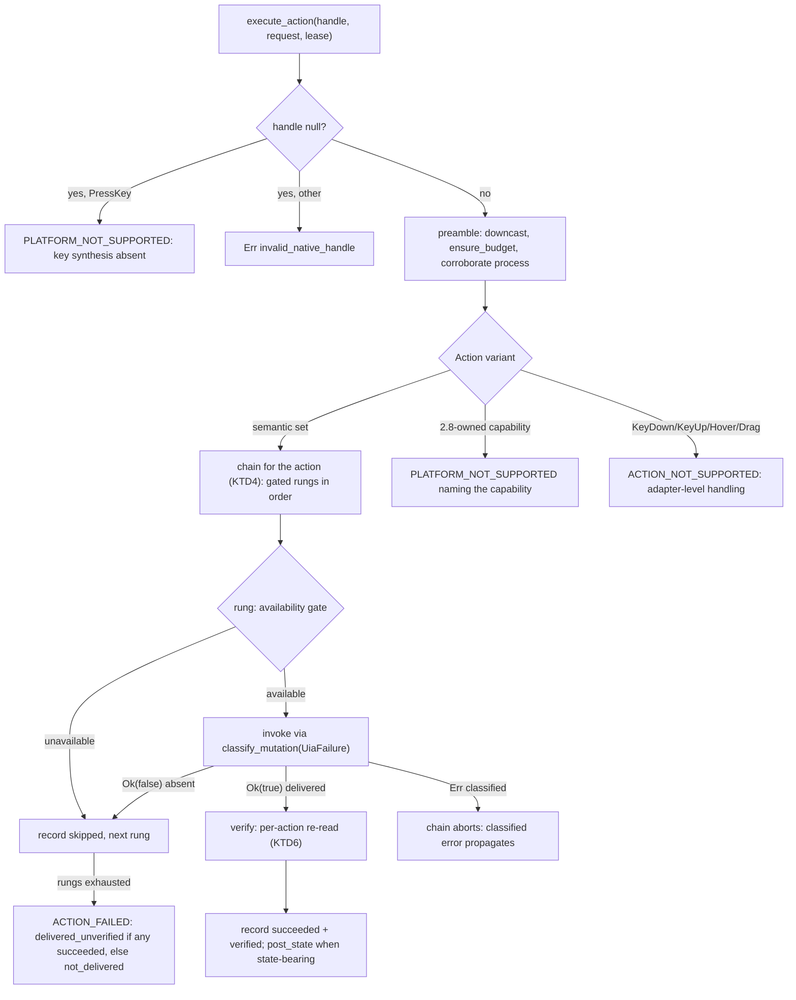
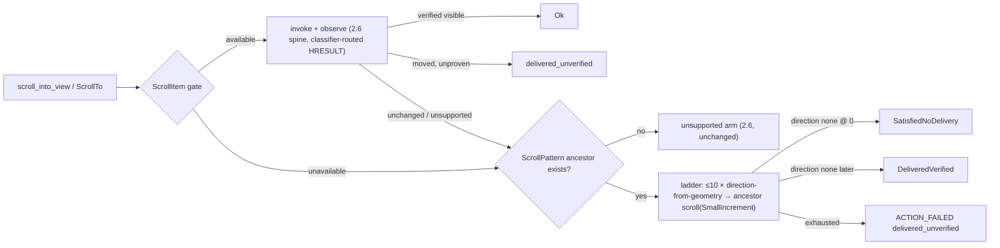

# Semantic Action Tier (Sub-phase 2.7) - Plan

## Goal Capsule

- **Objective:** Make the actions Windows already advertises actually executable. 2.5/2.6 left the pipeline complete up to dispatch: every ref action resolves strictly, runs the core actionability battery over live evidence, focuses the window when headed — and then dies at `execute_action`'s trait default with `PLATFORM_NOT_SUPPORTED` (the 2.6 dogfood's J2 proved exactly this arm). 2.7 overrides that one method (`crates/core/src/adapter/actions.rs:6-14`) with UIA pattern dispatch — Invoke, Toggle, Value, ExpandCollapse, SelectionItem, RangeValue, Scroll — behind an activation-chain engine mirroring macOS's (`crates/macos/src/actions/chain.rs`), reporting typed `ActionStep`s with honest `verified: Option<bool>`. It ships the mutation-path delivery classifier every Windows write must fail through (the write-side counterpart of `system/hresult.rs`'s read table, which is forbidden for writes), retrofits 2.6's `ScrollIntoView` call site through it, lands the ancestor-scroll fallback ladder deferred from 2.6, and closes KTD10's secure-field action side.
- **Authority hierarchy:** `docs/phases.md` §2.7 > `probes/windows/FINDINGS.md` (`api-contract` rows, and `app/provider` rows only where the row records its environment dependency, per the ledger's KTD7) > this plan > implementer judgment. Where measured evidence contradicts a document, U10 amends the document in this same PR.
- **Stop conditions:** Do not implement `SendInput`, key synthesis, mouse events, physical click/wheel legs, or UTF-16 `type_text` chunking — 2.8 (`docs/phases.md:1148-1165`); `TypeText`/`PressKey`/`DoubleClick`/`TripleClick`/`RightClick` dispatch arms return honest `PLATFORM_NOT_SUPPORTED` until then (KTD4). Do not implement launch/close/window-op lifecycle or fuller focus policy — 2.9. Do not route any write's HRESULT through `classify_read_hresult`/`hresult_record`/`uia_failure_disposition` — the read table's `Retryable` codes are exactly the ones a write may already have delivered (`docs/phases.md:1106`), scan-enforced (KTD2). Do not touch `crates/core` or `crates/macos`: `execute_action` exists with a default, `Action`/`ActionStep`/`ActionResult`/`capability` are settled, and this sub-phase needs zero core changes. Do not re-derive the battery, `receives_events`, or auto-wait on the Windows side — core owns them. If U1 returns an answer this plan did not anticipate, take the pre-committed branch in U1 rather than reverting to inference.
- **Execution profile:** One PR from `feat/windows-2.7-semantic-action-tier` into `feat/windows-adapter`, never `main`. Budget ≈2k lines of hand-written Rust — the phase's largest; if the diff presses past, the PR splits along the seam the classifier already draws — pattern dispatch (U3–U7) separates from classifier + retrofit (U2) — never by dropping the classifier or its pins (`docs/phases.md:1117`). Probes, captures, and the dogfood report are evidence artifacts outside the cap. Windows-crate-only diff plus docs. Conventional Commits.
- **Tail ownership:** The implementer opens the PR against `feat/windows-adapter` and reports the Verification Contract results.

---

## Product Contract

### Summary

An agent on Windows can observe, resolve, live-query, and survive the full actionability battery — and then no action fires. The observation layer has advertised `Click`/`Toggle`/`Expand`/`Collapse`/`Select`/`SetValue`/`Scroll`/`ScrollTo`/`SetFocus` capabilities since 2.3 (`crates/windows/src/tree/actions.rs:51-93`), core's preflight passes elements on exactly those strings, and dispatch then fails every one of them at the trait default. 2.7 closes the gap the advertisement opened: pattern-based execution for every advertised capability, delivery reported step-by-step with the same wire shapes macOS produces, failures classified by a write-side table that never lies about whether input may have landed, and the two 2.6 residuals — the `ScrollIntoView` HRESULT retrofit and the ancestor-scroll ladder — closed by the machinery that owns them.

### Problem Frame

Three shipped facts force this sub-phase's shape. First, advertisement outran execution: `tree/actions.rs` emits `Click` for an element whose only affordance is a non-empty `LegacyDefaultAction` (A2-2: legacy Win32 surfaces where `LegacyIAccessible` is the only affordance) — but §2.7's pattern list named no Legacy rung, so a legacy-only element would pass preflight and die in an exhausted chain: advertised-but-uninvocable. Second, the corpus has never invoked the semantic set on the product stack: every Invoke/Toggle/SetValue/ExpandCollapse/Select measurement is managed-stack (A3-1/A3-2), the one WinForms pattern-invocation attempt failed outright (A3-5), and only Scroll/ScrollItem carry COM-stack invocation rows (A18-1) — so the write surface is measured before code relies on it. Third, delivery honesty has measured enemies: `SetFocus` moves desktop foreground (A3-4), write return values lie under UIPI (A9-3: `SendInput` reports acceptance while delivering nothing), a dead provider's reads succeed-empty on this box and fail on Server 2025 (A14-9), and the read classifier's `Retryable` transport codes are precisely the ones that double-dispatch a click if a write path borrows them.

### Requirements

Execution:

- R1. Every fact the dispatch tier depends on that no ledger row establishes is measured on the COM product stack before code relies on it, with a pre-committed branch for every answer including "unmeasurable".
- R2. Every capability string `tree/actions.rs` can advertise is served by a non-default dispatch arm — no element passes the `supported_action` preflight and then dies in an exhausted chain because the advertised affordance has no rung; the Legacy-click case is resolved by U1's branch, never left implicit.
- R3. `execute_action` handles all 21 `Action` variants: the seven-pattern semantic set executes headless; capabilities whose machinery lands in 2.8 fail `PLATFORM_NOT_SUPPORTED` with a message naming the missing capability (the dogfood-discriminator rule); `KeyDown`/`KeyUp`/`Hover`/`Drag` mirror macOS's adapter-level rejection verbatim.

Delivery honesty:

- R4. Every UIA write in the adapter — including 2.6's `ScrollItemPattern.ScrollIntoView` — turns its failure into an outcome only through the mutation-path classifier: one arm per outcome, each pinned to fail when its code, disposition, or retry projection is changed; no write path consults the read classifier, scan-enforced across every mutation file.
- R5. No `ActionStep` claims an effect it did not observe: `verified: Some(true)` requires a post-write re-read that confirmed the intended state; writes whose effect cannot be re-read report `verified: None` or `Some(false)`; a post-write observation that itself fails reports `delivered_unverified`, never `not_delivered` and never a bare read error.
- R6. The wire shapes match macOS byte-for-byte in structure: `data.steps[]` entries `{label, outcome, mechanism, verified}`, `data.disposition.{delivery,retry}`, `post_state` for state-bearing actions, and the same `ErrorCode`/disposition pairings on failures.

Scroll closure:

- R7. Elements without `ScrollItemPattern` scroll into view through the ancestor ladder (`ScrollPattern` on scrollable ancestors, bounded, geometry-directed); an exhausted ladder reports `ACTION_FAILED` with `delivered_unverified`; the 2.6 dogfood's Explorer below-fold residual is re-judged through the ladder.

Safety and policy:

- R8. The secure-field action side is closed (KTD10): a write into an `IsPassword` element never echoes the attempted or observed value in any step, message, `details`, `platform_detail`, or post-state; an unreadable `IsPassword` fails toward withholding; value-verification re-reads are impossible to reach without the secure gate.
- R9. Headless dispatch never steals focus or foreground: no chain step calls `SetFocus` implicitly; `Action::SetFocus` itself is headed-gated on the A3-4 measurement and fails headless with `POLICY_DENIED`.

Evidence:

- R10. Every CI assertion is provider-independent (no node counts, coordinates, timings, or app-named facts); live proof runs on repo-controlled surfaces; the dispatch tier is dogfooded against real software with a judged, committed, redaction-compliant report.
- R11. Statements in `docs/phases.md`, `CONCEPTS.md`, `CLAUDE.md`'s folder map, and the skill docs that this sub-phase's evidence disproves or completes are corrected in place in this PR, each citing its evidence.

### Key Decisions

- **2.7 is planned as `docs/phases.md` defines it, with contradictions corrected rather than planned around.** (session-settled: user-directed — the standing instruction across this phase; research already found the advertised-Legacy-click contradiction and the `perform_action`/`execute_action` naming drift.) Governs R2, R11. See KTD4, U10.
- **Correctness is established by running it, not by unit tests alone.** (session-settled: user-directed — carried forward from 2.2–2.6.) Governs R10.
- **No test asserts a machine-specific or application-specific fact.** (session-settled: user-directed, carried forward.) Governs R10.

### Scope Boundaries

- **Out:** input synthesis — `SendInput` keyboard/mouse, `type_text` UTF-16 chunking, physical click/wheel/drag legs, UIPI elevation detection — 2.8 (`docs/phases.md:1148-1165`). The chain engine ships the policy hook (KTD3) but no physical step variant exists until 2.8 adds one.
- **Out:** `launch_app`/`close_app`/`window_op`, restore ordering, focus-steal budgets, cross-desktop and UIPI-boundary focus policy — 2.9. 2.7 consumes 2.6's `focus_window` as-is on the headed path.
- **Out:** any change to `crates/core` or `crates/macos`. The one macOS honesty divergence this plan takes (secure-field `verified: None` where macOS trusts the write, KTD7) is a Windows-adapter choice inside core's existing contract, not a core change.
- **Out:** the `cell`/`DataGrid` selection shape — §2.12's fixture first produces the `DataItem` + `GridItem`/`TableItem` shape (`docs/phases.md:1244`); `SelectionItemPattern` on a `Custom`-typed grid cell stays unmeasured until then (A16-10).
- **Out:** notification/tray/shell surfaces that consume semantic actions — 2.14 (`docs/phases.md:1301`).
- **Out:** promoting a shared mutation-outcome type into core. The classifier's outcome contract is deliberately per-adapter this phase (macOS classifies `AXError`, Windows classifies HRESULT/sentinel; the shared thing is the code/disposition pairing each adapter pins); §2.15 owns whether to promote, and U10 writes the settlement candidate into its list beside the resolver-payload item (`docs/phases.md:1349`).

### Deferred to Follow-Up Work

- **Physical fallback rungs** in the chains (headed `CGClick`-analog via `SendInput`, keyboard clear, wheel scroll) — §2.8, which depends on 2.7 and plugs into the chain engine's policy-gated step hook (KTD3).
- **`Action::PressKey` synthesis** — §2.8. Until then `press` on Windows reaches the null-handle global arm and reports the capability honestly absent (KTD4).
- **Fixture-app action targets** (delayed-enable, disclosure, duplicate-title) — §2.12 (`docs/phases.md:1231`); this sub-phase's live tests use the scratch fixtures and ad hoc Notepad/Explorer targets per its own exit criteria (`docs/phases.md:1115`).
- **The HWND-recycle schema question** — §2.12.1, unchanged; dispatch inherits 2.5's resolution evidence as-is.

---

## Planning Contract

### Key Technical Decisions

- KTD1. **One trait override is the entire core seam, and reachability is stated so proof targets the right paths.** 2.7 adds `impl ActionOps::execute_action` to `crates/windows/src/adapter.rs` (today only `scroll_into_view` is overridden, `adapter.rs:171-179`); zero core diff. Reachability under the shipped preflight (`crates/core/src/actionability/gates.rs:93-151`, `capability.rs:25-67`): headless dispatch is reachable for `Click` (direct semantic pointer delivery when `Click` is advertised, with policy force-downgraded to headless at `ref_action.rs:94-99`), `Toggle`/`Check`/`Uncheck` (`[TOGGLE, CLICK]` — the CLICK alternate admits Invoke-only elements), `SetValue`/`Clear` (`[SET_VALUE]`, which `tree/actions.rs` emits only for writable Value or any RangeValue), `Select` (`[SELECT, CLICK]`), `Expand`/`Collapse`, `Scroll`, `ScrollTo` (unconditional pass), and `SetFocus` (advertised from `IsKeyboardFocusable`). `DoubleClick`/`TripleClick`/`RightClick` die headless at preflight with `POLICY_DENIED` (`gates.rs:103-128`) and reach dispatch only headed; headless `type` dies at preflight (`TYPE_TEXT` is never advertised and focus fallback is denied). `press` bypasses the battery and calls `execute_action` with `NativeHandle::null()` under focus-fallback policy (`crates/core/src/commands/press.rs:42-49`). Consequences: the headless exit-criteria proof (`click`/`set-value`/`clear`/`select`/`toggle`/`expand`/`collapse`) runs the real preflight end to end; the headed-only arms are proven honest rather than functional; and every unreachable-variant arm still exists in dispatch because `execute_by_ref` and FFI can construct any variant.
- KTD2. **The mutation classifier mirrors macOS's encoding — `Result<bool, AdapterError>` — with one arm per Windows outcome, and it never sees a collapsed error code.** `classify_mutation(operation, api, failure: &UiaFailure) -> Result<bool, AdapterError>` in a new `actions/mutation.rs`, mirroring `ax_mutation::classify` (`crates/macos/src/actions/ax_mutation.rs:17-78`): `Ok(true)` is delivered; `Ok(false)` is the affordance genuinely absent — the chain's fall-through signal, never an error. The table, each arm carrying macOS's exact code/disposition pairing where an analog exists: `UIA_E_NOTSUPPORTED` and the empty-pattern sentinel shape (`ERR_NONE`/exhaustion at `get_pattern`, 2.6's KTD6 precedent) → `Ok(false)`; `E_ACCESSDENIED` → `PermDenied`, not_delivered; `UIA_E_ELEMENTNOTAVAILABLE` → `StaleRef`, not_delivered, refresh suggestion (built directly per the `stale_ref` call-site rule in `docs/phases.md:1350`, never via `AdapterError::stale_ref`); `E_INVALIDARG` → `InvalidArgs`, not_delivered (macOS `kAXErrorIllegalArgument` parity); `UIA_E_ELEMENTNOTENABLED` → `ActionFailed`, not_delivered (a settled rejection — the Windows-only arm, no macOS analog); transport — `RPC_E_SERVERFAULT`, `RPC_E_DISCONNECTED`, `RPC_S_SERVER_UNAVAILABLE`, `RPC_S_CALL_FAILED` → `AppUnresponsive` with `DeliveryUncertain` (macOS `kAXErrorCannotComplete` parity), and `UIA_E_TIMEOUT` → `Timeout` with `DeliveryUncertain` — the uncertain arms phases.md names, retry `unsafe` by projection; everything unclassified (unknown HRESULTs and unknown sentinels alike) → `ActionFailed`, `DeliveryUncertain` (macOS parity: the maximally conservative verdict is the deliberate fallback, not a semantic default). The classifier takes `UiaFailure` — the tagged HRESULT-vs-sentinel type `automation.rs::failure_of` already produces — so the two code spaces are never conflated pre-classification (2.6's `InvokeOutcome::Failed(i32)` collapse is retired by the retrofit). Constants come from `system/hresult.rs:18-35` (already declared, values verified); the read table itself (`hresult_record`) stays untouched and unreachable from writes, scan-enforced across every mutation file (KTD8).
- KTD3. **The chain engine ports macOS's mechanics exactly, because each one is load-bearing.** A `ChainDef`/`ChainStep`-shaped engine (`crates/macos/src/actions/{chain.rs,chain_def.rs,chain_step.rs}`): a genuine `Err` from any step aborts the whole chain via `?` — real failures never fall through; only a clean not-delivered outcome falls through to the next rung; every attempted step is recorded (`build_step` semantics: not-delivered → `skipped`, satisfied-without-delivery → `skipped` + `verified: Some(true)`, delivered → `succeeded` + `verified: Some(was_verified)`; mechanism always set — `semantic_api` for every 2.7 rung); policy-disallowed steps are silently skipped with no step recorded (the hook 2.8's physical rungs will use — no physical `ChainStep` variant exists in 2.7); `continue_after_unverified_delivery` holds for the value-write chain (an unverified direct write still tries the RangeValue rung); an exhausted chain is `ACTION_FAILED` whose disposition is `delivered_unverified` if any step succeeded, else `not_delivered`, carrying the chain's suggestion. The step label vocabulary is the UIA call name (`"InvokePattern.Invoke"`, `"ValuePattern.SetValue"`, `"LegacyIAccessible.DoDefaultAction"`, …) so a step list reads as evidence. `ActionResult::from_execution` (`crates/core/src/action_result.rs:24-45`) is the only result constructor — Windows never hand-assembles dispositions, and core's `Clear` postcondition gate runs on the post-state Windows supplies.
- KTD4. **Per-action chains are settled here, including the two honesty divergences the platform forces.** The dispatch match (all 21 variants, `actions/dispatch.rs`):
  1. `Click` → `[InvokePattern.Invoke, LegacyIAccessible.DoDefaultAction]`. The Legacy rung exists because the shipped advertisement promises `Click` on legacy-only elements (`tree/actions.rs:85-87`, A2-2) — without it R2 is violated on exactly the surfaces the census says are legacy-only. Each rung is gated on its own availability read (`InvokeAvailable`; non-empty `LegacyDefaultAction`), invoked via the classifier, `verified: false` when delivered (no state to re-read — macOS `AXPress` parity). U1's branch governs: if `DoDefaultAction` proves non-functional on the COM stack, the rung ships disabled-by-measurement, the advertisement's Legacy arm is corrected instead, and `docs/phases.md` records whichever shipped.
  2. `Toggle` → `[TogglePattern.Toggle, InvokePattern.Invoke]` with state observation: read `ToggleState` before (gated), invoke, poll for any state change within the verify window (macOS `wait_for_value_change` parity: 600 ms poll, 200 ms stability, Windows constants mirrored); `verified: Some(changed)`; before-state unreadable → `verified: Some(false)` on the delivered step. The Invoke rung serves Toggle-absent elements the `[TOGGLE, CLICK]` capability admits.
  3. `Check`/`Uncheck` → read `ToggleState`; already at target → single `skipped` step `verified: Some(true)` (`AlreadyInState`, no mutation); else Toggle up to twice (the tri-state `Off→On→Indeterminate` cycle needs two steps from `Indeterminate`), polling between, falling to Invoke when Toggle is absent; `verified` = final state equals target. The double-toggle mechanic has no macOS analog — AX exposes a directly settable checked value `TogglePattern` lacks — so it is validated by U1 item 2's tri-state cycle measurement, not by port.
  4. `SetValue(v)` → `[ValuePattern.SetValue, RangeValuePattern.SetValue(parse)]`, `continue_after_unverified_delivery`. The RangeValue rung parses `v` as `f64` (unparsable → rung not-delivered, falls out), gated on `RangeValueAvailable` and its own read-only state; it exists because `tree/actions.rs:76-78` advertises `SetValue` from `RangeValueAvailable` (R2). Verification per KTD6; secure fields per KTD7. A read-only Value gate (`ValueIsReadOnly` true) makes the Value rung not-delivered without invoking — defense-in-depth behind the preflight, which already withholds the capability.
  5. `Clear` → `[ValuePattern.SetValue("")]`. The headed keyboard rung is 2.8's seam; until then headed and headless clear share the semantic rung — stated, and core's post-state gate (`action_result.rs:108-123`) still arbitrates success.
  6. `Expand`/`Collapse` → read `ExpandCollapseState`; already at target → satisfied-without-delivery; else `[ExpandCollapsePattern.Expand/Collapse, InvokePattern.Invoke-when-state-known-opposite]` (the Invoke rung mirrors macOS's disclosure `AXPress` fallback and is gated on a Known-opposite state so it never blind-fires), verify by state re-read poll; `LeafNode` → the affordance is absent for this element: not-delivered fall-through, exhausted-chain honest error.
  7. `Select(value)` → role-shaped like macOS `extras::select_value`: if the element itself advertises `SelectionItem` and its resolved name equals `value` case-insensitively → `SelectionItemPattern.Select` on self; else search descendants (the crate's walker enumeration, macOS budgets mirrored: 2048 nodes, depth 8) for an exact case-insensitive name match with `SelectionItem` — candidate names read through the existing name-evidence path so secure withholding is inherited — → select it; a collapsed `ExpandCollapse` container is expanded first and best-effort collapsed after a failure (macOS `AXCancel` parity); where U1 item 7 measures expansion alone insufficient to realize children, a search miss does not report `ElementNotFound` until the open container has been driven through bounded `ScrollPattern` realization (the A18-1 mechanism, inside the same node/depth budgets) and re-searched. Verify `is_selected` re-read; where the container exposes Value, the container's value equaling `value` is the authoritative verification (macOS parity) — read through the KTD7 gate, so an `IsPassword` container (`Known(true)` or `Unknown`) skips the value read and verification falls back to `is_selected` alone. No match → `ElementNotFound` whose message carries the character count, never the text.
  8. `Scroll(direction, amount)` → gate `ScrollAvailable` on the element itself; map direction to per-axis `ScrollAmount::SmallIncrement`/`SmallDecrement` and invoke `ScrollPattern.scroll` `amount` times (deadline-checked per iteration); verify by scroll-percent delta or bounds change on a re-read; axis not scrollable (`is_*_scrollable` false) → not-delivered honest failure naming the axis.
  9. `ScrollTo` → the 2.6 spine plus the KTD5 ladder.
  10. `SetFocus` → headed-only: headless → `POLICY_DENIED` (not_delivered, suggestion `--headed`, details naming the measured foreground effect) because UIA `SetFocus` moves desktop foreground (A3-4) and the ledger's recorded consequence is that Windows cannot treat it as headless — a stated divergence from macOS, where the focus write does not foreground the app; headed → `set_focus()` verified by comparing the automation client's focused element against the target (`get_focused_element` + the walker's runtime-id `compare_elements` machinery — no new `TreeProperty` variant, which matters because `property_ids.rs` sits at 399 of 400 lines). U1 re-measures the foreground effect on the COM stack; a contradicting measurement relaxes the gate by branch, not by debate.
  11. `TypeText`/`PressKey`/`DoubleClick`/`TripleClick`/`RightClick` → `AdapterError::not_supported("<capability>")` naming the missing machinery (key synthesis; multi-click; physical context-menu click) — `PLATFORM_NOT_SUPPORTED`, the honest cross-cutting-DoD arm, discriminable by message (the 2.6 dogfood J2 rule). `RightClick` is physical-only on Windows: UIA has no context-menu pattern, so no semantic rung can exist.
  12. `KeyDown`/`KeyUp`/`Hover`/`Drag` → macOS's rejection verbatim (`ActionNotSupported`, "requires adapter-level handling, not element action", `dispatch.rs:184-193`).
  13. Null handle (the `press` path) → `PressKey` reports the missing key-synthesis capability as in arm 11; every other variant → the crate's `invalid_native_handle` error. Checked before the downcast so the honest arm is reachable.
- KTD5. **The ancestor ladder is macOS's algorithm with 2.6's visibility predicate.** On `ScrollTo`, rung 1 is the shipped `ScrollItemPattern` spine unchanged; when the gate says unavailable, or the invoke completes with geometry unchanged, rung 2 runs (this replaces 2.6's terminal `scroll_into_view_unsupported`/not-delivered arms exactly where a scrollable ancestor exists — no ancestor → those arms remain): up to 10 iterations (`MAX_ANCESTOR_SCROLLS`, macOS `scroll_into_view.rs:35-60`); per iteration, compute the scroll direction from the target's fresh bounds against the nearest `ScrollPattern`-available ancestor's viewport bounds (vertical before horizontal, before-edge before after-edge — macOS `direction_for_visibility` parity; the ancestor walk reuses `walker_source::nearest_scroll_viewport`, deadline-checked per step); `ScrollPattern.scroll` one `SmallIncrement` on that ancestor through the classifier; direction resolves to none → visible: at iteration 0 `SatisfiedNoDelivery`, later `DeliveredVerified`; exhausted → `ACTION_FAILED` with `delivered_unverified` (real scrolls fired; macOS parity). Visibility is 2.6's shipped predicate — `IsOffscreen` false, positive-area bounds, and the viewport-intersection term, because A18-2 measured provider rects unclipped by their viewport; a full-rect test would claim verified on a below-the-fold straddler. The 2.6 KTD6 disposition divergence (`not_delivered` where macOS reported `delivered_unverified` after real ancestor scrolling) closes itself: once the ladder scrolls, the exhausted arm reports macOS's disposition.
- KTD6. **Verification is a per-action re-read, and a completed observation outranks the classifier.** Post-write verification (all within the lease deadline, macOS analogs cited): Toggle/Check/Uncheck → `ToggleState` re-read; SetValue → pattern value re-read equals the requested string exactly (via the KTD7 gate); RangeValue → value re-read equals the parsed number, with U1 recording provider rounding before an epsilon is invented; Expand/Collapse → `ExpandCollapseState` re-read; Select → `is_selected`/container-value re-read; Scroll/ScrollTo → geometry (2.6's spine); Click/Invoke rungs → no state to re-read, `verified: false`. Re-reads go through fresh reads, never a value retained from before the write (A3-2's re-acquire discipline). Post-state: for `Toggle`/`Check`/`Uncheck`/`SetValue`/`Clear`/`Expand`/`Collapse`, after any delivery and inside budget, read the full `ElementState` through the existing live-read machinery (secure withholding inherited from `ElementProperties`) and attach it — macOS `post_state.rs` parity, including its action table (pointer/scroll/focus actions attach none). Any post-delivery read failure — including A14-9's succeeding-empty corpse shape and its environment-divergent CI twin — maps through an `after_delivery` wrapper to `delivered_unverified`, never `not_delivered`, never a bare read error. Precedence rule, pinned: where an action's delivery is judged by geometric observation (the scroll family), a completed observation's verdict overrides the classifier's disposition — bounds unchanged across a completed observation is `not_delivered` even when the invoke's HRESULT was transport-uncertain; the classifier supplies code, message, and `platform_detail`. Where no geometric observation exists (Invoke, Toggle, value writes), the classifier's disposition stands.
- KTD7. **Secure fields: never read the secret, never claim what was not observed.** `ValuePattern.SetValue` into an `IsPassword` element proceeds under the same headless policy as any field (KTD10, `docs/phases.md:1108`), and then diverges from macOS deliberately: macOS skips the readback and reports the write trusted (`chain_verify.rs:60` returns `true` for secure fields — a `verified: true` no observation backs); §2.7's own contract says no step claims an effect it did not observe (`docs/phases.md:1105`), so Windows reports `verified: None` and the result stays `delivered_unverified`. Mechanics: every value-verification re-read routes through one helper that checks the element's `IsPassword` tri-state first — `Known(false)` reads and compares; `Known(true)` skips the read entirely; `Unknown` fails toward withholding (skips the read, `verified: None`) per the tri-state learning's asymmetric-cost rule — and a scan pins that `UIValuePattern::get_value`/`UIRangeValuePattern::get_value` appear nowhere in `actions/` outside that helper. Error echoes carry `value_chars` counts, never text (the trace-reachable-messages convention); post-state flows through `ElementProperties`, whose `IsPassword` gate already withholds value-bearing fields fail-closed (`element_properties.rs:64-88`). Core's `Clear` postcondition compares a withheld (absent) value — vacuously passing on secure fields — which is the honest reading: emptiness of a secret is itself withheld.
- KTD8. **Placement, scan governance, and the preamble discipline.** New modules under `crates/windows/src/actions/`, mirroring the real macOS layout (the chain-family shape, not `CLAUDE.md`'s stale `activate.rs` listing — U10 corrects the map): `dispatch.rs` (the match), `chain.rs` (engine + step recording), `mutation.rs` (+ `mutation_tests.rs` — the classifier and its per-arm pins), `value_write.rs` (SetValue/Clear/RangeValue + the KTD7 gate), `toggle_state.rs` (Toggle/Check/Uncheck), `disclosure.rs` (Expand/Collapse), `select.rs`, `scroll.rs` (`Action::Scroll`), `scroll_ladder.rs` (KTD5 rung 2, sibling of the existing `scroll_into_view.rs`), `focus.rs` (KTD4.10), `post_state.rs` — each with a `*_tests.rs` sibling, each under the 400-line cap from birth (the tightest neighbors are `properties.rs` at 348 and `live_read.rs` at 351 — new code goes in new files, not those). Entry preamble in every path, in order: null-handle arm (KTD4.13), `uia_element` downcast, `ensure_budget(lease.deadline())`, `corroborate_verified_process` before the first write and again around post-write reads (the 2.6 precedent — a write against a corpse must not report observation-judged outcomes). Scan governance: `hit_test_scan_tests.rs`'s `PATTERN_ALLOWLIST` becomes a slice covering exactly the `actions/` files that invoke patterns, its covers-a-live-call-site tripwire generalizes to every entry, and the write-path ban (`scroll_into_view_tests.rs:211-231`'s shape — the three read-classifier names never appear) generalizes to one test scanning every mutation file; `get_pattern` stays banned everywhere else, `tree/` included. The advertise↔dispatch consistency of R2 is its own test: every capability `resolve_actions` can emit maps to a chain whose first gate can accept it. Test-double mechanism, stated because no COM mock exists or is wanted: the engine's rungs and gated reads are injected closures (KTD3's design), which is also the unit-test seam — call-count and outcome pins drive pure chain/dispatch logic with counting closures, the `scroll_into_view_judged_for` injected-observe precedent (`actions/scroll_into_view.rs:105-139`); live whole-pipeline coverage rides the crate's `tree/fixture.rs` harness, extended with the control shapes these chains need (checkbox incl. tri-state, slider, combobox, scrollable list) — as a sibling module, because `fixture_window.rs` sits at 393 of 400 lines.

### High-Level Technical Design

Dispatch flow — every action through one engine, every write through one classifier:

The scroll-to ladder — rung 1 is 2.6's shipped spine, rung 2 is new:

### Assumptions

- (verified during planning, no longer assumptions) `execute_action` receives a live `InteractionLease` on Windows today — 2.6's dogfood drove the full headed pipeline through lease acquisition to dispatch. The vendored `uiautomation` 0.25.0 exposes every needed pattern wrapper (`patterns.rs`: Invoke 154-165, ExpandCollapse 409-441, RangeValue 738-822, Scroll 826-918, SelectionItem 1089-1139, Toggle 1713-1739, Value 1885-1925, LegacyIAccessible 571+ with `do_default_action`), and the crate's `control` feature already enables `get_pattern` — no manifest change.
- The A19 probe rides the existing capability-probe workflow for its second environment; a leg the hosted image cannot run records the limitation per row, and the CI capture is verified non-empty before rows cite it (the Area 17 lesson, gap #14).

---

## Implementation Units

| U-ID | Title | Key files | Depends on |
|---|---|---|---|
| U1 | Measure the write surface (probe area 19) | `probes/windows/19-semantic-actions/`, `probes/windows/scratch/` | — |
| U2 | Mutation classifier + 2.6 retrofit + scan governance | `crates/windows/src/actions/mutation.rs`, `scroll_into_view.rs`, scan tests | U1 |
| U3 | Chain engine, dispatch skeleton, honest arms | `crates/windows/src/actions/{chain,dispatch}.rs`, `adapter.rs` | U2 |
| U4 | Value writes and the secure-field action side | `crates/windows/src/actions/value_write.rs`, `post_state.rs` | U3 |
| U5 | Toggle, check/uncheck, expand/collapse | `crates/windows/src/actions/{toggle_state,disclosure}.rs` | U3, U4 |
| U6 | Select and Scroll | `crates/windows/src/actions/{select,scroll}.rs` | U3, U4 |
| U7 | Ancestor-scroll ladder | `crates/windows/src/actions/scroll_ladder.rs` | U2, U6 |
| U8 | Envelope parity and cost baseline | fixture-driven lib tests, probe cost leg | U3–U7 |
| U9 | Dogfood the dispatch tier | `probes/windows/scratch/`, `docs/dogfood-reports/` | U8 |
| U10 | Correct what this sub-phase disproves | `docs/phases.md`, `CONCEPTS.md`, `CLAUDE.md`, `skills/agent-desktop/` | U1, U9 |

### U1. Measure the write surface (probe area 19)

- **Goal:** Every unmeasured fact the dispatch tier depends on is measured on the COM product stack, with a pre-committed branch per answer.
- **Requirements:** R1.
- **Files:** `probes/windows/19-semantic-actions/` (probe source, runner, captures), `probes/windows/FINDINGS.md` (A19 rows), `probes/windows/scratch/` (fixture extensions: a read-only text box, a tri-state checkbox, a password box beside a writable box, a slider, a nested two-level scroll region, a legacy-only control), `.github/workflows/windows-capability-probe.yml` (three edits, the pattern every area 14–18 follows: the `paths:` filter entry, a run step invoking the area-19 runner with the CI label, and the captures path added to the upload step).
- **Approach:** One probe family, A19, through the bounded `CUIAutomation8` client, honoring the corpus safety envelope (no foreground interference; scratch windows shown no-activate; Rust probes self-redact content names/values at the point of record):
  1. **The semantic set, invoked on COM for the first time.** Invoke, Toggle, SetValue (ASCII/CJK/astral payloads — the A3-1 matrix), ExpandCollapse, SelectionItem.Select, RangeValue.SetValue, each on the WPF scratch fixture and the WinForms scratch fixture, verified by re-find + re-read (A3-2 discipline), recording HRESULT-or-clean, effect, and whether the window was foreground at call time (the controlled variable gap #13; expected: non-foreground succeeds). Branches, symmetric because nothing is COM-proven before this leg runs (A3-1 is managed-stack evidence): a WinForms pattern that fails on COM (the A3-5 shape) lands the honest-failure arm and its row is cited in the module doc; a WPF-side COM failure for any pattern is a blocking finding — U2 onward do not proceed on inference for that rung; its viability is re-decided on the measurement and `docs/phases.md` §2.7 is corrected in this PR.
  2. **Failure taxonomy staging.** `get_pattern` for a pattern the element does not advertise (the exact failure shape — sentinel or HRESULT — that KTD2's absence arm must match); SetValue on the read-only box; SetValue and RangeValue.SetValue on a disabled control (does `UIA_E_ELEMENTNOTENABLED` fire live?); Expand on a `LeafNode`; RangeValue.SetValue out of range (clamp or error); Toggle on the tri-state checkbox through a full cycle; killed-provider SetValue/Invoke (the A18-1 manoeuvre — expected `0x80040201`); each row records which KTD2 arm the observed code lands and each arm's branch is pre-committed: an unanticipated code lands the unclassified→uncertain arm by design and the row documents it.
  3. **Secure-field write.** SetValue into the password box with a planted marker (read back through the plant path first, A14-6 discipline; capture self-redacts to lengths/digests): does the write land; what do subsequent Value/Name reads return; does any error echo content. Branches: write lands → KTD7 ships as designed; write rejected with a distinct code → the row pins the classifier arm; any echo observed → the row is the withholding test's fixture evidence. Because this is the corpus's first write-side secret plant, the committed capture gains its own backstop: a scan (the name-echo scan's pattern) asserting the planted marker never appears verbatim in any A19 capture, so a redaction slip fails the lane instead of landing in git history.
  4. **UIPI pattern write.** Via the 09-elevation manufacture (token duplication + label read-back): SetValue/Invoke from Medium against the High-owned scratch target. Records HRESULT and independently re-read effect — A9-3's lesson is that return values lie, so the effect read is the measurement. Branches: clean `E_ACCESSDENIED` → the denied arm is live-proven; silent no-effect success → the row documents why KTD6's verification exists and the dogfood judges the envelope; delivery → recorded, gate relaxed nowhere without §2.8's elevation-detection work (`docs/phases.md:1157`, the sub-phase phases.md assigns UIPI elevation detection).
  5. **`SetFocus` foreground effect, COM stack.** Re-measure A3-4 through the product client (it was managed-stack): `set_focus()` on a background probe-owned window, recording desktop foreground before/after. Branch: foreground moves → KTD4.10's headed gate stands with a COM-stack row; it does not → the gate stands on A3-4 pending a second environment, and the row is cited for §2.9's fuller policy to revisit.
  6. **Legacy click.** `LegacyIAccessible.DoDefaultAction` on the legacy-only scratch control (and Notepad's Document as a second target): does it act, what does failure look like. Branches per KTD4.1: functional → the rung ships; non-functional → the rung ships disabled-by-measurement and the advertisement's Legacy arm is corrected in the same PR (U10 carries both phases.md wordings pre-drafted).
  7. **Combobox dance + nested scroll.** Select on a collapsed WPF ComboBox (expand → select → observe), recording whether expansion is required for `SelectionItem` children to exist and whether expansion alone realizes the full child set (A18-1's virtualization keeps below-fold items unrealized until a scroll) — branch: fully realized → the bounded search suffices; not realized → KTD4.7's search gains its scroll-to-realize step, both arms committed; and the two-level nested scroll region for the ladder (gap #11): target visible only after scrolling both ancestors, recording per-rung geometry so KTD5's direction function is measured, not assumed.
  8. **Cost.** Min-of-seven with discarded warm-up (A15-13) for one representative call per pattern (Invoke, Toggle, SetValue, Select, scroll rung) plus the full click chain worst case, both environments where the workflow reaches — the hot-path perf baseline the cross-cutting DoD requires (`docs/phases.md:956`).
- **Execution note:** Probes are raw scripts and Rust against the real OS; captures follow the corpus redaction rules; every A19 row lands with stack, scope, verdict, and branch taken; the CI capture is verified non-empty before merge (gap #14).
- **Test scenarios:** Test expectation: none — probes are evidence artifacts; their captures and ledger rows are the deliverable.
- **Verification:** Every enumerated gap that blocks a KTD arm has a row or a recorded unmeasurable branch; `13-ledger-check.ps1` passes; the secure-marker absence scan holds over the committed captures; the workflow artifact carries the runnable legs.

### U2. Mutation classifier + 2.6 retrofit + scan governance

- **Goal:** One write-side classifier exists with every arm pinned; 2.6's `ScrollIntoView` HRESULT reaches its caller through it; the scan infrastructure covers every mutation file before the first new pattern call lands.
- **Requirements:** R4, and the retrofit half of R5.
- **Dependencies:** U1 (item 2).
- **Files:** `crates/windows/src/actions/mutation.rs` (+ `mutation_tests.rs`), `crates/windows/src/actions/scroll_into_view.rs` (+ tests), `crates/windows/src/tree/hit_test_scan_tests.rs`, `crates/windows/src/actions/mod.rs`.
- **Approach:**
  1. `classify_mutation` per KTD2, taking `UiaFailure`, one arm per outcome, plus a success helper for the `Ok(())` → delivered path. Every arm's test asserts code, `disposition.delivery`, `disposition.retry`, and (where set) suggestion — and is inverted per the repo discipline: change the arm's mapping, watch exactly that test fail.
  2. Retrofit: `invoke_scroll_into_view` keeps `UiaFailure` tagged (retiring the `InvokeOutcome::Failed(i32)` collapse); the terminal constructors derive code/message/`platform_detail` from the classifier while the observation spine and its dispositions stay byte-identical (KTD6 precedence: completed observation overrides classifier disposition; pinned both ways — a transport-uncertain HRESULT with unchanged geometry is `not_delivered`, a denied HRESULT yields `PermDenied` code with the observation's disposition). The `scroll_into_view_unsupported` arm and its details shape are unchanged (the ladder, not the classifier, replaces it — U7).
  3. Scan governance per KTD8: allowlist becomes a slice with a per-entry live-call-site tripwire; the write-path read-classifier ban becomes one test over every `actions/` mutation file; both MUST-CATCH-style self-checks added (the verification-gate learning: a gate needs its own test).
- **Patterns to follow:** `crates/macos/src/actions/ax_mutation.rs` (arm order and pairings), `crates/windows/src/tree/automation.rs:108-113` (`failure_of`), `crates/windows/src/system/hresult_symbol_tests.rs` (the split-tests precedent), `docs/solutions/best-practices/exhaustiveness-guards-over-catch-alls-in-policy-mirrors.md`.
- **Test scenarios:**
  - One test per classifier arm (absence, denied, stale, invalid-arg, not-enabled, each transport code, timeout, unclassified HRESULT, unclassified sentinel, success), each asserting code + both disposition projections and failing when the arm is remapped.
  - Absence is `Ok(false)`, never an error — pinned by a test that fails if `UIA_E_NOTSUPPORTED` or the empty-pattern sentinel constructs an `Err`.
  - The stale arm's error is built directly, not via `AdapterError::stale_ref` — a source scan pins the constructor name out of `actions/`.
  - Retrofit pins: the scroll write path never names the three read-classifier symbols (existing test, now generalized); a denied invoke with unchanged geometry reports `PermDenied` + `not_delivered`; a transport-failed invoke with unchanged completed observation reports `not_delivered`; with a failed observation reports `delivered_unverified` — each inverted.
  - Scan self-tests: a fixture line containing `get_pattern` outside the allowlist is caught; an allowlist entry whose file no longer calls `get_pattern` fails the tripwire.
- **Verification:** Windows lib tests green; every classifier arm's inversion demonstrated; the generalized scans run in the `--lib` lane (the CI-lane-flags rule).

### U3. Chain engine, dispatch skeleton, honest arms

- **Goal:** `execute_action` is live: every `Action` variant routes — the semantic set through gated chains, everything else through the honest arms — and the adapter override lands.
- **Requirements:** R3, R6, R9, and R2's consistency test.
- **Dependencies:** U2.
- **Files:** `crates/windows/src/actions/chain.rs` (+ tests), `crates/windows/src/actions/dispatch.rs` (+ tests), `crates/windows/src/actions/focus.rs` (+ tests), `crates/windows/src/actions/mod.rs`, `crates/windows/src/adapter.rs` (one override in `impl ActionOps`), `crates/windows/src/tree/hit_test_scan_tests.rs` (registration), the KTD8 fixture-harness sibling (live-control extension).
- **Approach:**
  1. The engine per KTD3: step execution takes a rung closure returning the chain-outcome type; `build_step` semantics ported; exhaustion error carries the chain's suggestion and the any-succeeded disposition; deadline checked per step.
  2. The dispatch match per KTD4, with the Click chain (Invoke + Legacy rung per U1's branch) as the first wired chain; the null-handle arm precedes the downcast.
  3. The honest arms (KTD4.11-12) with capability-naming messages; the `SetFocus` arm per KTD4.10 (`focus.rs`: headless policy gate, headed invoke + focused-element verification); `ActionResult::from_execution` everywhere.
  4. The R2 consistency test: for each capability string `resolve_actions` can emit, dispatching the matching `Action` against a fake whose gates mirror that advertisement reaches a rung (not the exhausted arm) — the test enumerates `AFFORDANCE_AVAILABILITY` plus the Legacy and focusable arms so a new advertisement without a rung fails it.
- **Patterns to follow:** `crates/macos/src/actions/{chain.rs,chain_defs.rs,dispatch.rs}`; `crates/windows/src/tree/element.rs:92-104` (downcast); `crates/core/src/action_result.rs` (constructor semantics).
- **Test scenarios:**
  - Chain mechanics, each inverted: a rung `Err` aborts with no later rung executed; a not-delivered rung falls through with a `skipped` step recorded; a satisfied-without-delivery rung reports `skipped` + `verified: Some(true)` and terminates; exhaustion with one succeeded step is `delivered_unverified`, with none is `not_delivered`.
  - Dispatch totality: a test iterating all 21 variants against a no-affordance fake asserts every variant returns a deliberate outcome (chain error, honest not-supported, or adapter-level rejection) — never the trait default's message.
  - Honest-arm discriminators: `TypeText`/`PressKey`/`DoubleClick`/`TripleClick`/`RightClick` messages name their missing capability and carry `not_delivered`; `KeyDown`/`Hover` mirror macOS's message.
  - Null-handle: `PressKey` yields the capability message; `Click` yields `invalid_native_handle`.
  - `SetFocus` headless yields `POLICY_DENIED` (not_delivered, `--headed` suggestion, A3-4 rationale in details) — inverted; a headed fake invoke reports `succeeded` with `verified` from the focused-element compare, both compare outcomes pinned.
  - No implicit focus: a source scan pins that `set_focus` appears in no `actions/` file outside `focus.rs`.
  - Click end to end against the fixture (dev box + fixture lane): headless `click` on a fixture button reports `steps: [{InvokePattern.Invoke, succeeded, semantic_api, verified: false}]`, `delivered_unverified` — and through the binary, the 2.6 dogfood's J2 arm is gone (the same headed click that reported `PLATFORM_NOT_SUPPORTED` naming `execute_action` now dispatches).
- **Verification:** Lib tests green; the R2 consistency test green for the chains this unit wires; `dispatch.rs`/`chain.rs`/`focus.rs` registered in the pattern and write-path scans in the same commit (the scans' `include_str!` arrays name files literally — an unregistered file is unscanned); the adapter override compiles into the same `impl ActionOps` block with no other trait change.

### U4. Value writes and the secure-field action side

- **Goal:** `set-value` and `clear` work headless with exact-readback verification; the KTD10 action side is closed with fail-closed withholding.
- **Requirements:** R5, R8; advances R6.
- **Dependencies:** U3.
- **Files:** `crates/windows/src/actions/value_write.rs` (+ tests), `crates/windows/src/actions/post_state.rs` (+ tests), `crates/windows/src/actions/dispatch.rs` (two arms).
- **Approach:**
  1. The SetValue chain per KTD4.4 (Value rung gated on availability + not-read-only; RangeValue rung parsing to `f64`), Clear per KTD4.5.
  2. The KTD7 verification gate: the single helper owning every pattern value re-read, `IsPassword` tri-state checked first, `Unknown` withholding.
  3. Post-state per KTD6: the state-bearing action table, live-read reuse, `after_delivery` wrapping.
- **Patterns to follow:** `crates/macos/src/actions/{chain_value_write.rs,post_state.rs}`; `crates/windows/src/tree/element_properties.rs:64-88` (the withholding gate); `docs/solutions/conventions/keep-raw-arguments-out-of-trace-reachable-error-messages.md`; `docs/solutions/logic-errors/tri-state-evidence-collapses-under-negation.md`.
- **Test scenarios:**
  - Happy path: SetValue delivered and readback-equal → `verified: Some(true)`, `delivered_verified`; readback-unequal → `verified: Some(false)` and the chain continues to the RangeValue rung (the `continue_after_unverified_delivery` pin).
  - RangeValue: numeric string on a Value-less range control delivers through the second rung; unparsable string on the same control exhausts honestly.
  - Secure: an `IsPassword` element's write reports `verified: None`, `delivered_unverified`; no test double observes a `get_value` call (call-count pin on the gate helper); an `Unknown` `IsPassword` behaves identically — each inverted (flip the gate to read anyway, watch the pin fail).
  - No-leak pins: the attempted value appears in no message, `details`, `platform_detail`, or step label for any error path (fixture drives each error arm with a marker string; assertions grep the serialized envelope); `value_chars` carries the count.
  - The KTD7 gate is scan-enforced, not only test-enforced: a source scan over every `actions/` file pins that `UIValuePattern::get_value`/`UIRangeValuePattern::get_value` appear only inside the gate helper, with a MUST-CATCH self-check proving a planted offending call site fails the scan.
  - Clear on a non-empty field ends with core's postcondition satisfied (empty post-state value); a fake whose value refuses to clear yields core's `ACTION_FAILED`/`delivered_unverified` — the postcondition reaches Windows results.
  - Post-state: attached for SetValue/Clear/Toggle-family, absent for Click; a post-read failure after delivery reports `delivered_unverified` (A14-9's succeeding-empty shape driven through a fake), never a bare read error.
  - Live (WPF fixture, dev box): set-value round-trips the A3-1 payload matrix (ASCII/CJK/astral) through the binary; clear empties; the password fixture write reports the KTD7 shape with nothing echoed; the slider fixture round-trips a parsed RangeValue write verified against the re-read number (U1's measured rounding governs exactness).
- **Verification:** Lib tests green; the no-leak grep-shaped pins green; live payload round-trip quoted in the dogfood report; this unit's new `actions/` files registered in the pattern/write-path scans and its capabilities added to the R2 consistency test in the same commit.

### U5. Toggle, check/uncheck, expand/collapse

- **Goal:** The state machines work headless with observed-state verification and honest tri-state/leaf-node handling.
- **Requirements:** R5; advances R2, R6.
- **Dependencies:** U3, U4 (`post_state.rs` — KTD6's post-state table covers this unit's actions).
- **Files:** `crates/windows/src/actions/toggle_state.rs` (+ tests), `crates/windows/src/actions/disclosure.rs` (+ tests), dispatch arms.
- **Approach:** KTD4.2/4.3/4.6: gated state pre-reads, pattern invoke through the classifier, bounded state-change polls (mirroring macOS's 600/200 ms shape), Invoke fallbacks gated exactly as specified, `AlreadyInState` satisfied arms.
- **Patterns to follow:** `crates/macos/src/actions/{toggle_state.rs,chain_disclosure_steps.rs}` for the poll, `AlreadyInState`, and fallback shapes — the tri-state double-toggle itself has no macOS analog and follows U1 item 2's measurement (KTD4.3); `crates/windows/src/tree/properties.rs` gated reads.
- **Test scenarios:**
  - Toggle: state change observed → `verified: Some(true)`; no change within window → `Some(false)`; before-state unreadable → delivered with `Some(false)`; Toggle-absent element falls to Invoke with the same observation — each through fakes, each inverted.
  - Check from `Off` → one toggle, verified; check from `Indeterminate` → two toggles, verified; check when already `On` → single `skipped` step `verified: Some(true)`, no invoke (call-count pin); uncheck symmetric.
  - Expand when `Collapsed` → delivered + state-verified; expand when `Expanded` → satisfied, no invoke; expand on `LeafNode` → not-delivered fall-through to the exhausted honest error; the Invoke disclosure fallback fires only when the pre-read state is Known-opposite (pinned: an `Unknown` state never blind-fires Invoke).
  - Live (fixture lane + dev box): fixture checkbox toggles with post-state `checked` flipping; fixture tree node expands.
- **Verification:** Lib tests green; every poll bounded by the lease deadline (a zero-budget test returns the timeout error, never sleeps past it); this unit's new `actions/` files registered in the scans and its capabilities added to the R2 consistency test in the same commit.

### U6. Select and Scroll

- **Goal:** `select` resolves values to selection targets the macOS way under Windows affordances; `scroll` drives `ScrollPattern` with per-axis honesty.
- **Requirements:** R5, R8's Select surface; advances R2, R6.
- **Dependencies:** U3, U4 (the KTD7 value-read gate — Select's container-value verification routes through it).
- **Files:** `crates/windows/src/actions/select.rs` (+ tests), `crates/windows/src/actions/scroll.rs` (+ tests), dispatch arms.
- **Approach:** KTD4.7 (self-select, bounded descendant search, expand-first combobox dance per U1 item 7's measurement, verification hierarchy) and KTD4.8 (axis mapping, `amount` iterations, percent/bounds verification).
- **Patterns to follow:** `crates/macos/src/actions/{extras.rs,select_menu.rs,scroll.rs}` (family routing, budgets, verification precedence); `crates/windows/src/tree/walker_source.rs` (enumeration and viewport machinery).
- **Test scenarios:**
  - Select self-match selects and verifies `is_selected`; value mismatch on a self-target → `ElementNotFound` with a character-count message (no text — inverted with a marker value).
  - Container search: match at depth ≤8 selects; budget exhaustion → the bounded honest error; collapsed combobox expands first, selects, and a selection failure best-effort collapses (call-order pin).
  - Container-value verification outranks `is_selected` where Value is exposed (macOS parity pin) — and routes through the KTD7 gate: an `IsPassword` container (`Known(true)` and `Unknown` both) skips the value read, falls back to `is_selected`, and no test double observes a container `get_value` call — inverted.
  - Scroll: down×3 issues three vertical `SmallIncrement` calls (call-count pin) and verifies a percent delta; unscrollable axis → not-delivered naming the axis; percent unavailable falls back to bounds-change observation.
  - Live: Explorer list select by visible name; fixture list scrolls with percent movement.
- **Verification:** Lib tests green; no search assertion depends on a provider fact (structure-mirroring fakes only); this unit's new `actions/` files registered in the scans and its capabilities added to the R2 consistency test in the same commit.

### U7. Ancestor-scroll ladder

- **Goal:** Non-`ScrollItem` elements scroll into view; the 2.6 unsupported/unverified arms narrow to the no-ancestor case; the Explorer residual is closed or honestly re-judged.
- **Requirements:** R7, R5.
- **Dependencies:** U2, U6.
- **Files:** `crates/windows/src/actions/scroll_ladder.rs` (+ tests), `crates/windows/src/actions/scroll_into_view.rs` (rung-2 seam), dispatch's `ScrollTo` arm.
- **Approach:** KTD5 verbatim; the ladder is one function taking the target and the deadline, returning the macOS outcome set; `scroll_into_view.rs` calls it exactly where its unsupported/not-delivered terminals fired when an ancestor exists.
- **Patterns to follow:** `crates/macos/src/actions/scroll_into_view.rs:19-90` (outcome routing, ladder, direction function); 2.6's visibility predicate in `scroll_into_view.rs`/`walker_source.rs`.
- **Test scenarios:**
  - Direction function: target above/below/left/right of viewport yields the macOS priority order; inside yields none — pure-logic pins.
  - Ladder outcomes, each inverted: visible at rung 0 → `SatisfiedNoDelivery`; visible after n rungs → `DeliveredVerified` (with the viewport-intersection predicate — an unclipped full-rect straddler does not verify, the A18-2 pin); 10 rungs exhausted → `ACTION_FAILED` `delivered_unverified`; a rung's classified write error aborts with that error.
  - Seam: `ScrollItem`-less element with a scrollable ancestor ladders instead of reporting `scroll_into_view_unsupported`; with no ancestor, the 2.6 arm is byte-identical (regression pin against the 2.6 tests).
  - Deadline: per-rung budget checks — a mid-ladder expiry reports the timeout with `delivered_unverified` when rungs already fired, `not_delivered` at rung 0.
  - Live (nested-scroll fixture from U1 item 7): the two-level target scrolls into verified visibility.
- **Verification:** Lib tests green; 2.6's existing scroll tests untouched and green; the auto-scroll seam (`ref_action.rs:75-93`) end-to-end test shows a below-fold non-`ScrollItem` target clicked after ladder scrolling; `scroll_ladder.rs` registered in the scans in the same commit.

### U8. Envelope parity and cost baseline

- **Goal:** The wire shapes match macOS structurally on success and failure, proven end to end; the hot-path cost baseline exists.
- **Requirements:** R6, R10; the cross-cutting DoD's perf gate.
- **Dependencies:** U3–U7.
- **Files:** fixture-driven lib tests beside the crate's `fixture.rs` harness; `probes/windows/19-semantic-actions/` (cost leg, U1 item 8).
- **Approach:** Envelope assertions on the binary's JSON (dev box) and unit-level `ActionResult` serialization pins (CI): `data.steps[]` field names and wire strings (`semantic_api`, `succeeded`, `skipped`), `data.disposition.{delivery,retry}` pairs, `post_state` presence table, and error-side `error.disposition` for each classifier outcome — the macOS pairing asserted structurally, never with app-named facts. Cost: the U1 item 8 min-of-seven rows are the tier's first baseline — new capability has no merge-base number, so the DoD's comparison obligation is met by recording min/median/max on both environments for each pattern call (future merge-bases diff against these) and by comparing the one shared primitive, the target pre-read, against its A18-7 figure.
- **Test scenarios:** as enumerated in the approach — serialization pins through `serde_json::to_value(ActionResult)` in CI; live envelope transcripts on the dev box; each disposition pair asserted against `DeliverySemantics`' projection (a changed pairing fails).
- **Verification:** All parity pins green in the `--lib` lane; cost rows committed with min/median/max on both environments; no assertion carries an `app/provider` fact.

### U9. Dogfood the dispatch tier

- **Goal:** The semantic tier is run and judged against real software, with positive discriminators, and residuals land in the scope that owns them.
- **Requirements:** R10, R7's re-judgement.
- **Dependencies:** U8.
- **Files:** `probes/windows/scratch/run-dogfood.ps1` (extended), `docs/dogfood-reports/2026-08-XX-NNN-feat-windows-2-7-semantic-action-tier-dogfood.md` + captures sibling.
- **Approach:** Targets per the established matrix (Notepad, Explorer, the scratch fixtures, Obsidian; absent targets skipped-with-reason). Judgements this run exists to make: Notepad's Document accepts headless `set-value` and `clear` through the COM Value pattern (A2-4/A3-3's divergence, now exercised as the product path) with the payload matrix round-tripping; an Explorer list item selects by name; the Explorer below-fold item re-judges the 2.6 J4 residual through the ladder — verified visibility, or the honest ladder outcome, whichever the platform yields, judged not assumed; a fixture click/toggle/expand round-trip reports the full step/disposition envelope; the fixture slider takes `set-value` through the RangeValue rung with the re-read number quoted; `focus` headless reports `POLICY_DENIED` with the A3-4 rationale; `type` headless reports the honest preflight denial; a headed `double-click` reports `PLATFORM_NOT_SUPPORTED` naming the missing multi-click capability (the J2-style discriminator, now for 2.8's boundary); Obsidian receives one semantic action attempt against whatever its settled tree exposes, judged honestly (A18-3's shell shape means absence arms are the likely truth). Findings fixed with regression tests or escalated; report redaction-compliant with environment header, per-target matrix, residuals-with-owners, and the Verification Contract result.
- **Execution note:** Run the release binary; verify by reading its JSON; never by the suite's opinion of itself.
- **Test scenarios:** Test expectation: none — the judged report and its driven fixes are the deliverable.
- **Verification:** Report committed; every judgement backed by a quoted envelope; anything unexercised reported as unexercised and written into the scope that owns it.

### U10. Correct what this sub-phase disproves

- **Goal:** `docs/phases.md` reads true after 2.7; the vocabulary carries the write-side concepts it measurably lacks; consumer docs stop being macOS-worded or stale where 2.7 changes the truth.
- **Requirements:** R11, R2's documentation half.
- **Dependencies:** U1, U9.
- **Files:** `docs/phases.md`, `CONCEPTS.md`, `CLAUDE.md`, `skills/agent-desktop/references/commands-interaction.md`.
- **Approach:** Known corrections, each in place and cited:
  1. `docs/phases.md` §2.7: the scope bullet's `perform_action` naming tightens to `execute_action` (the trait's real name, `docs/phases.md:212`); the pattern list gains the Legacy-click resolution per U1 item 6's branch — either the `DoDefaultAction` rung with A2-2 and the advertisement as evidence, or the corrected advertisement with the measured non-functionality; the scope gains the `Action::SetFocus` policy 2.7 settles — headed-only dispatch with focused-element verification, `POLICY_DENIED` headless, on A3-4 (and U1 item 5's COM re-measurement) — with a disambiguating clause in §2.9's focus-steal-budget bullet so its planner inherits only the window-activation half, never re-decides the element-level half; the ladder and classifier bullets are restated to shipped reality if any U1 branch diverged.
  2. `docs/phases.md` §2.15: the settlement list gains the mutation-classifier candidate beside the resolver-payload item — the outcome-pairing contract is per-adapter this phase, and the gate decides promotion with both adapters in review (Scope Boundaries records the deliberate mirroring).
  3. `CONCEPTS.md`: the write-side cluster it lacks — Mutation Classifier (the write-side verdict, why the Read Outcomes cluster is forbidden for writes) and Secure Field (the read-side and action-side withholding contract KTD10 spans) — and nothing that restates existing entries; the Action Chain entry gains the Windows policy divergence sentence only if its current wording reads false against KTD4.10.
  4. `CLAUDE.md`: the platform-crate folder map's `actions/` listing corrected to the real shape (macOS ships a chain-family, not `activate.rs`; Windows now ships the KTD8 set) so the map stops naming a file that exists on no platform — and the adjacent `dispatch.rs` comment's `perform_action` naming corrected to `execute_action` in the same edit.
  5. `skills/agent-desktop/references/commands-interaction.md`: the implicit-scroll paragraph (lines 70-72) rewritten — Windows now ladders ancestors, the "attempts only the element's own native affordance" sentence is false the moment U7 merges; the per-command macOS-only wordings (`AXSelectedText`, `AXValue`, "AX menu", "AX scroll actions") gain their Windows counterparts or platform-neutral phrasing; the `steps` schema fragment (line 60) completed to the real shape (`mechanism`, `verified`) and the `disposition` object documented — doc-only corrections to already-shipped shapes, no envelope version change.
  6. Whatever U1's branches and U9's findings disprove, cited row by row.
- **Test scenarios:** Test expectation: none — documentation unit; gated by review plus `scripts/check-no-phase-references.sh` and the doc-sync review.
- **Verification:** Every amendment cites its disproving evidence; the phase-reference scan exits 0; any deferral names its receiving sub-phase in `docs/phases.md` itself.

---

## Verification Contract

| Gate | Command / check | Applies to |
|---|---|---|
| Repo gates (Windows dev box) | `cargo fmt --all -- --check`; `cargo clippy --locked -p agent-desktop-core -p agent-desktop-windows -p agent-desktop -p agent-desktop-ffi --all-targets -- -D warnings`; `cargo test --locked -p agent-desktop-core -p agent-desktop-windows --lib`; `cargo test --locked -p agent-desktop-windows --examples`; `cargo test --locked -p agent-desktop`; `cargo test --locked -p agent-desktop-ffi --tests` | whole PR |
| Cross-platform compile | `cargo check --locked -p agent-desktop-windows --all-targets --target x86_64-unknown-linux-gnu` | U2–U7 |
| Core untouched | the PR's diff under `crates/core/` and `crates/macos/` is empty; macOS lane green; goldens byte-identical | whole PR |
| Probe branch taken | every U1 question answered or its pre-committed branch recorded; no gate below rests on an unmeasured inference | U1 |
| Classifier arms hold | one pinned test per outcome asserting code + both disposition projections, each failing when remapped; absence never constructs `Err`; `UiaFailure` reaches the classifier untagged-collapsed | U2 |
| No write reads the read table | `classify_read_hresult`/`hresult_record`/`uia_failure_disposition` appear in no `actions/` mutation file, one scan over all of them, with a MUST-CATCH self-check | U2–U7 |
| Retrofit is honest | 2.6's observation spine byte-identical; classifier supplies code/message only; completed-observation precedence pinned both ways | U2 |
| Dispatch is total | all 21 variants yield deliberate outcomes; the trait default's message is unreachable through the override | U3 |
| Advertised ⇒ dispatchable | the R2 consistency test enumerating every advertisable capability against its chain's first gate — seeded in U3, extended by each unit that wires a new chain | U3–U7 |
| Chain mechanics hold | Err-aborts, absence-falls-through, satisfied-terminates, exhaustion dispositions — each pinned and inverted | U3 |
| Steps are honest | `verified: Some(true)` only behind a passed re-read; secure writes are `None`; no-observation rungs are `false`; post-read failures are `delivered_unverified` — each pinned | U4–U7 |
| Secure no-leak | marker-driven envelope greps on every value-write error path; the value-read gate's call-count pins — including Select's container-value path; the static `get_value` scan over `actions/` with its MUST-CATCH self-check; `Unknown` `IsPassword` withholds | U4, U6 |
| Headless never focuses | `set_focus` appears in no `actions/` file outside `focus.rs` (scanned); headless `SetFocus` is `POLICY_DENIED`, pinned and inverted | U3 |
| Ladder honest | the four ladder outcomes with the A18-2 intersection predicate, each inverted; the no-ancestor 2.6 arms regression-pinned | U7 |
| Envelope parity | steps/mechanism/disposition wire strings and pairings match macOS structurally, fake-pinned in CI, live-proven on the dev box | U8 |
| Hot-path baseline | min-of-seven cost rows for each pattern call on both environments, committed | U1, U8 |
| Evidence honesty | no CI test asserts a node count, coordinate literal, timing, or other `app/provider` fact | U1–U8 |
| No banned calls | `get_pattern` allowlist covers exactly the mutating `actions/` files with per-entry tripwires; banned needles green over all scanned files | U2–U7 |
| Size | release binary under 15 MiB; no repo `.rs` file over 400 lines | whole PR |
| Dogfood gate set | the established rows verbatim: run with repo-controlled content, skips reasoned, findings closed-with-failing-test or escalated, durable redaction-compliant report | U9 |
| Doc truth | each amendment cites its evidence; `check-no-phase-references.sh` exits 0; skill wording platform-neutral | U10 |
| PR is green | every required check on a PR into `feat/windows-adapter`, never `main` | whole PR |

**Pre-commit note.** `.githooks/pre-commit` self-scopes per OS since 2.6; if a bare-cargo failure appears anyway, commit with `SKIP_PRECOMMIT=1` and run the package-scoped forms.

**Test-parallelism note.** Every live test uses `ensure_hosted_library_mta_and_dpi` (A14-10).

**CI-lane note.** The Windows CI lane runs one `--lib` invocation; every CI-side assertion in U2–U8 must be `--lib`-reachable there (the never-ship-unexecuted-code rule; the census-redaction `examples/` miss is the precedent). Anything needing a desktop stays on the dev box and the fixture lane with its skip recorded.

**File-size note.** `dispatch.rs` and `chain.rs` are the natural pressure points; split by responsibility early (per-action modules already exist as seams) rather than trimming docs to fit.

## Definition of Done

- A PR from `feat/windows-2.7-semantic-action-tier` into `feat/windows-adapter` is open and green — split into the two named PRs along the classifier seam only if the diff presses past the cap, never by dropping pins.
- U1 ran, its A19 rows are committed with a verified non-empty CI capture, and every unanswerable question has its pre-committed branch recorded as taken.
- `execute_action` is live: the seven-pattern semantic set dispatches headless through gated chains with classifier-routed failures; all 21 variants yield deliberate outcomes; the R2 consistency test holds.
- The mutation classifier exists with every arm pinned and inverted; no write path consults the read classifier; 2.6's `ScrollIntoView` reaches callers through it with its observation spine unchanged.
- The ancestor ladder is live with macOS's outcome set and 2.6's visibility predicate; the Explorer residual is re-judged in the dogfood report.
- The secure-field action side is closed: fail-closed withholding, `verified: None`, no-leak pins green.
- Envelope parity and the hot-path cost baseline are committed; `click`/`set-value`/`clear`/`select`/`toggle`/`expand`/`collapse` are proven headless on live targets through the binary.
- The dogfood report is committed with judged envelopes and owned residuals.
- `docs/phases.md`, `CONCEPTS.md`, `CLAUDE.md`'s folder map, and the skill docs read true, each correction cited; the diff under `crates/core/` and `crates/macos/` is empty; abandoned experimental code is removed.

---

## Risks & Dependencies

- **The COM stack has never executed the semantic set.** A3-1's proof is managed-stack; the one WinForms pattern attempt failed (A3-5). U1 runs before code is written against any pattern; a WinForms-side failure lands the honest-failure arm with its row, not a blocked sub-phase — the WPF fixture and Notepad's COM Document are the proven-enough surfaces the exit criteria name.
- **UIPI may swallow pattern writes silently.** A9-3 proved return values lie for raw input; if U1 item 4 shows the same for pattern writes, the classifier cannot catch it. KTD6's re-read verification is the defense for state-bearing writes; Click/Invoke/Legacy rungs have no state to re-read, so a swallowed invoke is indistinguishable from an unobservable success — both honestly report `verified: false` with `delivered_unverified`, the floor R5 sets: the step never claims verified, and the dogfood judges the envelope a Medium→High write actually produces. Nothing in 2.7 claims verified delivery on any cross-integrity write.
- **`Select`'s container dance is the widest behavioral surface.** Virtualized combobox children may not exist until expansion (U1 item 7 measures); the bounded search inherits macOS budgets rather than inventing new ones; and verification prefers container value where exposed, so a wrong-item selection cannot verify.
- **The ~2k estimate is the phase's largest and the split is pre-named.** Classifier + retrofit (U2) separates cleanly from dispatch (U3–U7) along the seam phases.md draws; the PR states the measured figure against the estimate rather than defining it away.
- **Environment divergence is measured, not hypothetical.** A14-9's dead-provider reads succeed-empty here and fail on Server 2025 — every post-write observation failure path is therefore driven through fakes in CI, and the killed-provider probe leg records which shape this environment fires so the other stays fake-pinned.
- **Two prior sub-phases' lessons apply verbatim:** every gate this plan adds must fail when inverted (the tests-that-cannot-fail taxonomy, including its Shape 6 distinguishable-arms rule), and any timing claim needs repetition plus a second environment (A15-13).

## Open Questions

None. The candidates this planning cycle surfaced are each settled or owned: the Legacy-click contradiction is settled by KTD4.1's measured branch with both phases.md wordings pre-drafted (U1 item 6, U10); the `SetFocus` policy is settled by KTD4.10 on A3-4 with a COM re-measurement branch; the secure-field verified-semantics divergence from macOS is settled by KTD7 on §2.7's own honesty rule; the classifier-promotion question is owned by §2.15 via U10's settlement entry; `PressKey`/`TypeText` sequencing against 2.8 is settled by KTD4.11's honest arms; the `DataGrid`/`cell` selection shape is owned by §2.12 (`docs/phases.md:1244`); and the read-only `editable` gate's role-based pass is core-owned behavior outside this sub-phase's scope, exercised only defensively by KTD4.4's gate.

## Sources & Research

- `docs/phases.md`: §2.7 (`:1099-1117` — scope, exit criteria, split seam), §2.6 hand-offs (`:1088-1089`), §2.5 KTD10 split (`:1064`), §2.8 boundary (`:1148-1165`), §2.12 fixture targets and dependency direction (`:1231,1244,1248`), §2.14 dependency (`:1301`), §2.15 settlement list (`:1337-1360`), Cross-cutting sub-phase DoD (`:947-957` — 2.7 named hot-path), `ActionOps` signatures (`:210-214`), `ActionStep` type row (`:276`), U13 (`:778`).
- `probes/windows/FINDINGS.md`: A2-1/2/3/4/5 (census; COM-authoritative), A3-1/2/3/4/5 (managed invocation, verification discipline, Notepad divergence, SetFocus foreground steal, WinForms scroll failure), A4-2/7 (foreground gating), A9-1/2/3 (UIPI; return values lie), A14-3/4/5/6/9/11/12 (ERR_NONE pair, dead-element shapes, ELEMENTNOTAVAILABLE, secure reads, environment-divergent corpse reads, hang/timeout), A15-2/3/7/13 (LabeledBy secure cross-contamination, gated pattern-state reads, cost methodology), A16-10/11/12 (DataGrid shapes, Chromium settle, elevation reads), A17-6 (live secure reads), A18-1/2/3/5/7 (COM scroll invocation, unclipped rects, Chromium shell, hang bound, cost baseline); ledger KTD1/KTD7/KTD9 scope rules; `captures/03-pattern-census/pattern-matrix.json` (per-pattern availability counts).
- Core contracts, read at current positions: `adapter/actions.rs:6-24`, `action.rs:6-131` (variants + policy metadata), `action_request.rs`, `action_result.rs:24-45,94-123,129-142`, `action_step.rs`, `action_step_outcome.rs`, `step_mechanism.rs`, `delivery_semantics.rs:36-100`, `capability.rs:25-67`, `actionability/gates.rs:93-182`, `ref_action.rs:49-121` (dispatch pipeline, auto-scroll seam, semantic downgrade), `ref_action_poll.rs:119-133`, `ref_action_wait_evidence.rs:3-18`, `commands/press.rs:25-49` (null-handle path), `commands/helpers.rs:101-142`, `adapter_error.rs:41-71`, `output.rs:58-83`, `interaction_lease.rs`, `context.rs:193-204`.
- macOS reference (read, not ported): `actions/ax_mutation.rs:17-78` (the classifier encoding and pairings), `actions/{chain.rs,chain_def.rs,chain_step.rs,chain_step_exec.rs,chain_defs.rs}` (engine mechanics, per-action chains, `continue_after_unverified_delivery`), `actions/toggle_state.rs` (state polls, AlreadyInState), `actions/chain_disclosure_steps.rs` (the disclosure ladder and its Known-opposite gate), `actions/extras.rs` + `select_menu.rs` (family routing, budgets 2048/8, verification precedence, char-count messages), `actions/scroll_into_view.rs:19-90` (outcome routing, the 10-rung ladder, direction priority), `actions/type_text.rs` + `chain_verify.rs:47-60` (the secure trusted-write macOS takes and 2.7 declines), `actions/post_state.rs:14-36` (the post-state action table), `actions/delivery_tracker.rs`, `actions/dispatch.rs:31-201`, `actions/adapter.rs:8-39`.
- Windows crate as shipped through 2.6: `adapter.rs:56-180`, `actions/scroll_into_view.rs` (the spine, `unsupported_error`, `attach_invoke_detail`, `invoke_scroll_into_view`'s collapse), `actions/scroll_into_view_tests.rs:211-231` (the write-path ban shape), `system/hresult.rs:18-180` (constants with values, the read table 2.7 must not touch), `tree/automation.rs:34-233` (bounded client, `failure_of`), `tree/automation_classify.rs` (sentinels), `tree/properties.rs` (gated reads, `rect_has_area`), `tree/actions.rs:16-120` (the advertisement contract R2 serves), `tree/element.rs:29-104`, `tree/element_properties.rs:17-108` (withholding), `tree/live_read.rs:150-157` (corroboration), `tree/name_evidence.rs:184-261` (cross-element secure gate), `tree/walker_source.rs` (enumeration, `nearest_scroll_viewport`), `tree/hit_test_scan_tests.rs` (allowlist mechanics), `tree/resolve_match.rs:138-142` (`stale_evidence_error` precedent).
- `uiautomation` 0.25.0 vendored source: `patterns.rs:75-150` (`UIPatternType`, `UIPattern`), the seven pattern wrappers plus `UILegacyIAccessiblePattern` (`:571-640`, `do_default_action`), `core.rs:1066-1084` (`get_pattern`), `errors.rs:10-134` (`Error`, `.result()`, sentinels), `types.rs:704-804` (`ExpandCollapseState`, `ToggleState`), Cargo feature graph (`control` → `pattern`).
- `docs/solutions/`: `best-practices/{a-test-that-cannot-fail-is-not-coverage, a-verification-gate-is-code-and-needs-its-own-test, exhaustiveness-guards-over-catch-alls-in-policy-mirrors, fix-the-class-not-the-reported-instance, identity-fingerprint-against-os-reorder-2026-04-16, keep-ffi-action-policy-aligned-with-cli-2026-05-12, macos-gesture-headless-capability-2026-06-10, never-ship-platform-code-that-ci-cannot-execute, one-measurement-is-not-a-measurement, playwright-grade-desktop-reliability-2026-06-02, preserve-command-policy-semantics-during-refactor-2026-05-12, real-app-tests-are-the-platform-adapter-gate, abort-state-guidance-multi-step-physical-input, envelope-version-bump-contract-2026-05-13}.md`, `conventions/keep-raw-arguments-out-of-trace-reachable-error-messages.md`, `logic-errors/{tri-state-evidence-collapses-under-negation, emit-state-on-a-positive-claim-never-on-a-default}.md`.
- `CONCEPTS.md`: Delivery Semantics (`:176-179`), Action Chain (`:201-204`), Read Outcomes (`:98-123` — the read-only cluster the classifier must not overload), Interaction Lease (`:181-184`), Interaction Policy / Headless Ref Action (`:191-199`), Evidence Tri-State (`:36-39`), Capability Vocabulary (`:186-189`), Dogfood Run/Report (`:279-287`).
- `skills/agent-desktop/references/commands-interaction.md`: the per-command surface (`:78-195`), the `steps` fragment (`:60`), the implicit-scroll paragraph (`:70-72` — the sentence U7 makes false), the macOS-worded lines U10 rewrites; `SKILL.md` (command census, error-code table).
- `docs/dogfood-reports/2026-08-06-001-feat-windows-2-6-actionability-occlusion-dogfood.md`: J2 (the discriminator rule and the arm this sub-phase deletes), J4 and the residuals table (the two rows 2.7 inherits).
