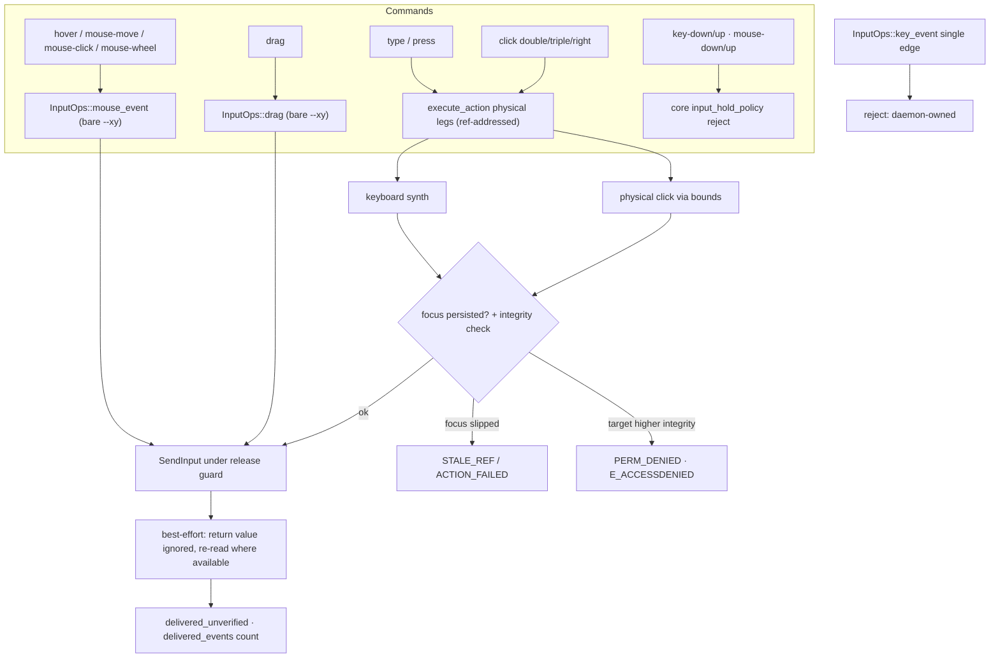
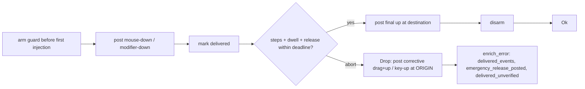

# Input Synthesis (Sub-phase 2.8) - Plan

## Goal Capsule

- **Objective:** Give Windows the raw-OS-input layer 2.7 left honestly stubbed. 2.7 ships semantic dispatch and returns `PLATFORM_NOT_SUPPORTED` for every physical path — `TypeText`/`PressKey` key synthesis, `DoubleClick`/`TripleClick` multi-click, `RightClick` context-menu click (`crates/windows/src/actions/dispatch.rs:61-67,178`) — and `impl InputOps for WindowsAdapter {}` is empty (`adapter.rs:189`), so `hover`/`drag`/`mouse-move`/`mouse-click`/`mouse-wheel` all reach a defaulted `not_supported`. 2.8 implements the three functional `InputOps` methods (`mouse_event`, `drag`, and the honest `key_event` rejection stub), the physical keyboard/mouse/drag primitives behind them via `SendInput`, and the physical legs that replace 2.7's not-supported dispatch arms — every one carrying the macOS delivery-tracking, release-guard, and headed/headless policy contract. It also lands UIPI elevation detection (`GetTokenInformation(TokenIntegrityLevel)` → `PERM_DENIED`), which owns closing 2.7's A19-4 residual.
- **Authority hierarchy:** `docs/phases.md` §2.8 > `probes/windows/FINDINGS.md` (`api-contract` rows, and `app/provider` rows only where the row records its environment dependency, per the ledger's KTD7) > this plan > implementer judgment. Where measured evidence contradicts a document, U9 amends the document in this same PR. The A4-* and A9-* rows whose expectation text names "2.6" pre-date the renumbering (input synthesis was §2.6 in an earlier scheme, is §2.8 now); rows are cited by id and obligations are taken from `docs/phases.md`, never from a row's stale sub-phase name (U9 corrects the text).
- **Stop conditions:** Do not implement clipboard (`get_clipboard_content`/`set_clipboard_content`/`clear_clipboard` stay defaulted — a later sub-phase per the API mapping table, not §2.8's scope). Do not make `key-down`/`key-up`/`mouse-down`/`mouse-up` work — they reject in core (`crates/core/src/commands/input_hold_policy.rs`) pending the Phase 5 daemon, and `key_event` mirrors macOS's `reject_standalone_key_state` honest closure (KTD7). Do not implement launch/close/window-op lifecycle or window-activation focus policy — 2.9. Do not touch `crates/core` or `crates/macos`: the three `InputOps` methods and `press_key_for_app` exist with defaults, the payload types are settled, and this sub-phase needs zero core changes. Do not re-derive the interaction policy, the held-input rule, or the command→action routing — core owns them. If U1's genuine gaps return an answer this plan did not anticipate, take the pre-committed branch rather than reverting to inference.
- **Execution profile:** One PR from `feat/windows-2.8-input-synthesis` into `feat/windows-adapter`, never `main`. Budget ≈2k lines of hand-written Rust per the origin estimate; probes, captures, and the dogfood report are evidence artifacts outside the cap. Windows-crate-only diff plus docs. Conventional Commits.
- **Tail ownership:** The implementer opens the PR against `feat/windows-adapter` and reports the Verification Contract results.

---

## Product Contract

### Summary

An agent on Windows can observe, resolve, and act semantically — and cannot move the mouse, type a character, drag, or right-click. Every physical command is stubbed: 2.7's `execute_action` returns honest `PLATFORM_NOT_SUPPORTED` for the physical legs, and `InputOps` is entirely defaulted. 2.8 closes that layer with `SendInput`: mouse events (move, click with multi-click count, wheel), keyboard synthesis (modifier chords and UTF-16 `type_text`), and drag with a release guard — each honoring the same delivery-tracking, headed/headless policy, and abort-state discipline macOS ships, adapted to the one hard platform divergence (Windows `SendInput` injects into the foreground queue with no per-pid targeting, and its return value cannot be trusted). It also lands UIPI elevation detection, mapping a Medium→High input attempt to `PERM_DENIED`, which closes 2.7's A19-4 residual on the detection surface even though the cross-boundary effect stays unmeasurable on the probe host.

### Problem Frame

The physical-input primitives are measured but the product path is not built. A4-1 (api-contract): `SendInput` with `KEYEVENTF_UNICODE` carries one UTF-16 code unit per event, so a surrogate pair is necessarily two events, and all four payloads (ascii/cjk/astral/mixed) round-trip exactly via SHA-256 through an independent `WM_GETTEXT` — the `type_text` chunking is measured, not assumed. A4-2 (api-contract): modifier chords work and the modifier-release sweep is a verified requirement. A4-3: mouse click/move/wheel/drag are viable, but `MOUSEEVENTF_ABSOLUTE` normalizes against the primary monitor only (A10-6), a real multi-monitor coordinate hazard. A4-4/A4-5: `PostMessage` is a dead input path — it can't carry modifiers — so `SendInput` is the only mechanism. A9-2/A9-3: across a UIPI boundary reads cross and writes don't, and `SendInput` reports success in both the blocked and unblocked arms — its return value lies, so delivery must be judged by re-read and elevation by token comparison, never by the API's own verdict. A19-4: the cross-boundary write effect could not be staged on the probe host (`Start-MediumIntegrityProcess` lacks the required privilege), so 2.8 implements detection against a local token read and inherits the unmeasurable-effect branch.

### Requirements

Primitives:

- R1. `InputOps::mouse_event` synthesizes move, click (with `count` for multi-click), and wheel via `SendInput`, with absolute coordinates normalized correctly and the primary-monitor caveat handled explicitly; `InputOps::drag` synthesizes a full drag with a release guard; `InputOps::key_event` for a standalone edge rejects honestly (held input is daemon-owned, KTD7).
- R2. `type_text` splits input on UTF-16 code units into bounded chunks that never split a surrogate pair, injects each via `KEYEVENTF_UNICODE`, and tracks per-chunk delivery — the A4-1 measured contract.
- R3. Keyboard synthesis presses modifiers down, presses the key, and releases everything, with a release guard that leaves no key stuck if the sequence aborts (A4-2's modifier-release sweep); the atomic `press` and `type` paths compose edges under one guard, never leaving the OS believing a key is held.

Dispatch legs:

- R4. 2.7's physical `execute_action` arms are replaced by real synthesis: `TypeText` and `PressKey` (element and null-handle) synthesize keys; `DoubleClick`/`TripleClick`/`RightClick` synthesize physical clicks via the element's bounds — each under the correct headed/focus-fallback policy, the keyboard legs verifying the target element holds keyboard focus before injecting, and no arm still returns `PLATFORM_NOT_SUPPORTED` for a capability 2.8 owns.

Honesty and safety:

- R5. Physical delivery is best-effort and never trusts the `SendInput` return value (A9-3): a ref-addressed leg verifies the focus the headed pipeline established persisted before injecting (Windows `SendInput` has no per-pid targeting) and fails closed if it slipped; a bare-coordinate command injects at the point under its `--headed` guard; both judge effect by observation where a re-read is available and report `delivered_unverified` otherwise.
- R6. An interrupted multi-event sequence (drag, chord, multi-chunk text) ends in a known safe state: the release guard posts corrective input at the origin on abort, and the error preserves whether input may have landed (`delivered_events`, `emergency_release_posted`) rather than claiming none did — the abort-state learning contract.
- R7. A Medium→High input attempt across the UIPI boundary is detected via `GetTokenInformation(TokenIntegrityLevel)` and reported as `PERM_DENIED` with the `COM HRESULT 0x80070005 (E_ACCESSDENIED: ...)` `platform_detail` format; detection is unit-tested against the process's own token because the cross-boundary effect is unmeasurable on the probe host (A19-4).
- R8. Held input stays closed on every entry path: `key-down`/`key-up`/`mouse-down`/`mouse-up` keep rejecting in core, `key_event` rejects a standalone edge, and `mouse_event` rejects `MouseEventKind::Down`/`Up` — which the FFI reaches directly, bypassing the core command layer — all naming the daemon requirement; no partial held-state path ships.

Policy and evidence:

- R9. Headed/headless policy parity holds: `hover`/`drag`/`mouse-*` require `--headed` exactly as macOS; the physical keyboard legs use the focus-fallback policy; a denied policy fails with `POLICY_DENIED` before any injection.
- R10. Every CI assertion is provider-independent (no coordinate literals, node counts, timings, or app-named facts); live proof runs on repo-controlled surfaces; the input layer is dogfooded against real software with a judged, committed, redaction-compliant report honoring the corpus safety envelope (foreground-assert bracket, clipboard/cursor/modifier restore).
- R11. Statements in `docs/phases.md`, `CONCEPTS.md`, `CLAUDE.md`, and the skill docs that this sub-phase's evidence disproves or completes are corrected in place in this PR, each citing its evidence — including the A4/A9 rows' stale sub-phase names and the `type` cross-platform divergence (KTD8).

Guard parity:

- R12. Guarantees the core command layer enforces are re-enforced in the adapter, because FFI calls `InputOps` directly: point validity, click-count bounds, and the held-edge rejection are all checked inside `mouse_event`, not assumed from the caller.
- R13. Dangerous-combo policy and key-name vocabulary reach parity with macOS: Windows overrides `is_blocked_combo` with a Windows-specific blocked list (`alt+f4`-class close/lock/foreground shortcuts), and the `KeyCombo.key` name table resolves the same documented key names macOS resolves — name *resolution* is portable even though a combo's *meaning* is not, since `ctrl+c` copies on Windows where `meta+c` does not.

### Key Decisions

- **2.8 is planned as `docs/phases.md` defines it, with contradictions corrected rather than planned around.** (session-settled: user-directed — the standing instruction across this phase; research already found the A4/A9 rows naming "2.6" and the Windows-`type`-has-no-semantic-headless-path divergence.) Governs R11. See KTD8, U9.
- **Correctness is established by running it, not by unit tests alone.** (session-settled: user-directed — carried forward from 2.2–2.7.) Governs R10.
- **No test asserts a machine-specific or application-specific fact.** (session-settled: user-directed, carried forward.) Governs R10.

### Scope Boundaries

- **Out:** clipboard — `get_clipboard_content`/`set_clipboard_content`/`clear_clipboard` stay defaulted `not_supported`. They are `InputOps` methods, so they sit on the trait 2.8 fills, but their owner is **§2.10 — Capture & Clipboard** (`docs/phases.md:1190`), whose scope names the typed `CF_UNICODETEXT`/`CF_DIB`/`CF_HDROP` marshalling. macOS ships a large clipboard module; Windows does not touch it here.
- **Out:** `launch_app`/`close_app`/`window_op`, `ProcessState`, the whole `press_key_for_app` method, restore-versus-raise ordering, and the window focus-steal budget — 2.9 (`docs/phases.md:1169-1184`). `press_key_for_app` is a `SystemOps` method §2.9 implements using 2.8's keyboard primitive (§2.9 "Depends on: 2.8 (input for `press_key_for_app`)"); 2.8 ships the reusable primitive, not the method, and `press --app` stays not-supported until 2.9. 2.8 uses whatever foreground the headed pipeline already established plus a focus verify; it does not build the activation policy.
- **Out:** the held-input commands `key-down`/`key-up`/`mouse-down`/`mouse-up` — they reject in core pending the daemon; 2.8 does not open them (KTD7).
- **Out:** any change to `crates/core` or `crates/macos`. The `type` cross-platform divergence (KTD8) is a Windows-adapter honesty statement inside core's existing contract plus a §2.15 settlement entry, not a core change.
- **Out:** cross-integrity input *effect* proof — unmeasurable on both available environments (A19-4/A18-4: `Start-MediumIntegrityProcess` lacks the required privilege). 2.8 ships and unit-tests detection; the live cross-boundary effect stays with the deferral chain A19-4 records.

### Deferred to Follow-Up Work

- **The cross-boundary UIPI input-effect measurement** — unmeasurable on both environments; U1 records the pre-committed unmeasurable branch and cites A19-4/A18-4. **§2.12 owns it** (`docs/phases.md`, the split-integrity item, extended by this plan's PR to cover input writes alongside observation reads): its self-hosted runner is the first rig able to hold both integrity levels. Until then the detection path is proven and pinned here, and the denial mapping rides A9-2's measured contract.
- **Window-activation focus policy** for the physical legs that need the target frontmost — §2.9 owns restore-versus-raise, the focus-steal budget, and cross-desktop behaviour (`docs/phases.md:1180`). 2.8's foreground gate is a verify-and-fail-closed, not the full activation policy.
- **The `type` semantic-headless contract** — Windows has no UIA insert-at-selection (SetValue replaces; TextPattern is read-only), so strict-headless `type` cannot match macOS's `AXSelectedText` path. §2.15 rules on whether the cross-platform contract normalizes or ratifies the divergence (KTD8); the settlement entry is already written into §2.15's list by this plan's PR, so U9 only reconciles it against what actually shipped.

---

## Planning Contract

### Key Technical Decisions

- KTD1. **The 2.8 surface is three `InputOps` methods and the `execute_action` physical legs — zero core diff.** `InputOps` (`crates/core/src/adapter/input.rs:9-55`) defaults all six methods; 2.8 overrides `mouse_event` (functional), `drag` (functional), and `key_event` (honest rejection stub mirroring macOS `input/adapter.rs:13-20`), leaving the three clipboard methods defaulted. The `execute_action` arms 2.7 stubbed (`dispatch.rs:61-67,178`) are replaced: `TypeText`/`PressKey` route to keyboard synthesis, `DoubleClick`/`TripleClick`/`RightClick` to physical click via the element's bounds. `press_key_for_app` is **not** 2.8's — it is a `SystemOps` method §2.9 implements, and §2.9 "Depends on: 2.8 (input for `press_key_for_app`)" (`docs/phases.md:1179,1184`): 2.8 ships the reusable keyboard-synthesis primitive, 2.9 composes it with the window-activation focus policy 2.9 owns; `press --app` stays not-supported until then. The command wiring is already settled by core: `hover`/`mouse-move`/`mouse-click`/`mouse-wheel` call `mouse_event` directly (headed-only), `drag` calls `drag`, `type`/`press` reach `execute_action`, and `key-down`/`key-up`/`mouse-down`/`mouse-up` reject in core before the adapter. Payload types are fixed: `MouseEvent { kind: MouseEventKind, point, button, modifiers }` with `MouseEventKind::{Move, Down, Up, Click{count}, Wheel{delta_x,delta_y}}`; `DragParams { from, to, duration_ms, drop_delay_ms }`; `KeyCombo { key, modifiers }`; `Modifier::{Meta, Ctrl, Alt, Shift}`.
- KTD2. **Windows `SendInput` injects into the foreground queue with no per-pid targeting — the one hard divergence from macOS — and the gate is asymmetric between ref-addressed and bare-coordinate paths.** macOS posts events to a specific pid (`post_to_pid`), delivering regardless of foreground; Windows `SendInput` injects into the foreground input queue only (A4-2 measured every chord as "foreground-gated"). The gate therefore depends on how the target was named. **Ref-addressed physical paths** (a headed click/type on a resolved element, `DoubleClick`/`RightClick`/`TypeText` via `execute_action`) run after core's headed pipeline already focused the target window (`headed_focus`), so the path verifies that focus persisted — the window is still foreground and, for keyboard, the element still holds keyboard focus (`HasKeyboardFocus`) — and fails closed (`STALE_REF`/`ACTION_FAILED`, `not_delivered`) if it slipped, rather than injecting into whatever moved in front. **Bare-coordinate paths** (`mouse-move`/`mouse-click`/`mouse-wheel`/`hover`/`drag` with `--xy`) have no target window to verify — the caller owns the coordinate and is asking to act on whatever is there, exactly as macOS's headed `mouse-click --xy` does — so these inject at the point without a window-identity gate; the `--headed` requirement is their guard, and the corpus's foreground-assert bracket is the dogfood/probe hygiene, not a per-call product gate the coordinate contract would contradict. Either way, delivery is best-effort: A9-3 measured `SendInput` returning success (6 events accepted, `lastError` 0) in both the blocked and unblocked arms, so the return value is never treated as evidence — a physical step reports `delivered_unverified` and effect is judged by a post-injection re-read only where a ref-addressed target exposes one (the value/state read 2.7 owns). This asymmetry is where Windows input honesty is won or lost, and every U2–U5 path states which side it is on.
- KTD3. **The release-guard abort-state contract is ported from macOS verbatim, because the learning doc makes it a correctness rule.** A multi-event sequence (drag; a modifier chord; multi-chunk text) arms a cleanup guard immediately before the first committed injection and disarms only after the final release posts; on any abort the guard's `Drop` posts corrective input at the **origin** — a drag-back plus mouse-up for a drag, key-up for held keys/modifiers — because an abort must not become a destination drop (`docs/solutions/best-practices/abort-state-guidance-multi-step-physical-input.md`). Cleanup is best-effort: if the OS will not accept the corrective events the error preserves that uncertainty (`emergency_release_posted: true`, `emergency_release_acknowledged: false`) rather than claiming no input landed. The delivery state (`delivered_events` count) enriches every public error so a caller distinguishes a pre-injection failure (`not_delivered`, safe retry) from an interrupted physical operation (`delivered_unverified`, unsafe retry) — the macOS `DragReleaseGuard`/`DragDeliveryState` and `KeyReleaseGuard` shapes (`crates/macos/src/input/{mouse_drag.rs,mouse_drag_state.rs,keyboard_event.rs:103-114}`), swapping the CGEvent primitive for `SendInput`.
- KTD4. **`type_text` ports macOS's UTF-16 chunking logic verbatim, swapping only the injection primitive — and the two boundaries it involves have different authorities, which the plan keeps separate.** The **per-event** boundary is API-forced and measured: `KEYEVENTF_UNICODE` carries exactly one UTF-16 code unit, so a surrogate pair is necessarily two consecutive inputs, and A4-1 proved the target reassembles all four payloads (ascii/cjk/astral/mixed) byte-exactly through an independent `WM_GETTEXT` SHA-256. The **chunk size** is not forced by anything on Windows — `SendInput` accepts an array, so the whole string could go in one call — and 32 UTF-16 units is macOS's chosen granularity (`crates/macos/src/input/keyboard_event.rs:9`) carried over deliberately for reasons that hold on both platforms: it bounds each chunk against the deadline (`TEXT_CHUNK_BUDGET`), gives per-chunk delivery accounting (`delivered_chunks`/`total_chunks`) so an interrupted type reports what landed, and creates the re-verify point between chunks that keeps a long type from continuing into a window that took focus mid-sequence. Windows keeps the chunker byte-for-byte — split on code units, never split a surrogate (`encode_utf16` then flush-before-overflow), cap at 1,000,000 units, preflight the deadline — and pins the surrogate-preservation invariant with a test mirroring `text_chunks_preserve_unicode_without_splitting_surrogates`. Modifier chords are the A4-2 sweep: press each modifier VK down, press/release the key, release each modifier, and a release guard sweeps any still-down modifier on abort, verified by reading live key state rather than by trusting what the sequence believes it pressed.
- KTD5. **The coordinate space is `SendInput` normalized-absolute against the primary monitor, transformed from the physical-pixel bounds UIA and core work in — the multi-monitor caveat A4-3 measured is handled, not inherited as a bug.** Core passes physical-pixel `Point`s (from UIA `BoundingRectangle`, physical pixels across the virtual screen under `PER_MONITOR_AWARE_V2`); `MOUSEEVENTF_ABSOLUTE` `SendInput` coordinates are `0..65535` normalized against the **primary monitor only** (A4-3/A10-6). A point on a secondary monitor therefore requires `MOUSEEVENTF_VIRTUALDESK` with normalization against the full virtual-screen rect (`SM_XVIRTUALSCREEN`/`SM_CXVIRTUALSCREEN`, the rect 2.6 already reads), or the point lands on the wrong display. U1 measures the exact multi-monitor normalization on the available environment or records the single-monitor limitation and the pre-committed virtual-desktop-flag branch; the transform is a small, tested function, and no coordinate literal reaches a test.
- KTD6. **UIPI elevation detection is a token-integrity comparison plus a re-read, never the `SendInput` verdict — and detection is measurable even though the cross-boundary effect is not.** Before a ref-addressed physical injection whose target integrity is in question, open the target process (`process_identity.rs`'s handle plumbing) and read its integrity level via `GetTokenInformation(TokenIntegrityLevel)` (the `Win32_Security` feature is already enabled, `Cargo.toml:28`), comparing against the caller's; a target strictly higher than the caller maps to `PERM_DENIED` with `platform_detail` in the `COM HRESULT 0x80070005 (E_ACCESSDENIED: ...)` format (A9-2's measured mapping). Detection is unit-tested against the process's own token (a local read, always available) and the comparison logic against synthetic integrity SIDs; the live Medium→High effect is unmeasurable on both environments (A19-4/A18-4 — `Start-MediumIntegrityProcess` lacks the required privilege), so U1 takes the pre-committed unmeasurable branch and the mapping rides A9-2's already-measured contract rather than a fresh measurement. The comparison fails toward honesty, not toward a fabricated verdict: an **unreadable** target integrity is not asserted same-integrity — injection proceeds best-effort and the re-read judges effect, because a blocked write silently no-ops (A9-2) and reads as `delivered_unverified`/not-observed rather than a false delivery. Where the target is same-or-lower integrity and readable, effect is judged by post-injection re-read (A9-2: observation crosses even where input does not).
- KTD7. **Held input stays closed on every entry path, and the adapter re-enforces what the CLI layer guarantees — because FFI does not go through it.** The CLI rejects `key-down`/`key-up`/`mouse-down`/`mouse-up` in core (`input_hold_policy::reject` → `ACTION_NOT_SUPPORTED`), but `crates/ffi/src/input/mouse.rs:93-94` maps `AdMouseEventKind::Down`/`Up` straight to `CoreMouseEventKind::Down`/`Up` and calls `InputOps::mouse_event` directly, so the adapter is the last line of defence — this is why macOS re-checks inside `synthesize_mouse` rather than trusting its callers. Windows mirrors all three of those re-checks as one class (`crates/macos/src/input/mouse.rs:45,61,63`): `Point::validate`, `validate_mouse_click_count`, and a `Down`/`Up` arm returning macOS's `standalone_state_error()` shape (`ACTION_NOT_SUPPORTED`, `raw_input_emitted: false`, `requires_daemon_owned_transaction: true`, suggesting atomic `mouse-click`/`drag`). Without them an FFI caller gets a held mouse button or an unbounded click loop on Windows that is impossible on macOS. `InputOps::key_event(combo, down)` likewise mirrors `reject_standalone_key_state` (`keyboard.rs:26-41`). The atomic `press` (down+up chord) and `type` (chunked text) compose their edges under one release guard inside `execute_action`, never leaving a key held across a return. A pin proves no `actions/` or `input/` path emits a lone key-down without a guaranteed release.
- KTD8. **Windows `type` is physical-only, an honest divergence from macOS's semantic-headless path — stated, and handed to §2.15.** macOS headless `type` writes `AXSelectedText`, a semantic insert-at-selection needing no focus steal. Windows UIA has no equivalent: `ValuePattern.SetValue` replaces the whole value (2.7's `set-value`, the headless text write), and `TextPattern` is read-only for insertion. So Windows `type` is physical synthesis under the focus-fallback/headed policy; strict-headless `type` cannot match macOS and fails at policy where macOS's semantic path would succeed. This is a measured product divergence, not a bug — `set-value` is the headless text path on Windows. The §2.15 settlement entry (identical-JSON-is-a-product-promise standard) is written by this plan's PR rather than deferred to implementation, because a deferral recorded only in a plan is read by this PR's reviewer and by nobody after; U9 reconciles it against shipped behavior and states the divergence in the command docs. The interim behavior is honest and documented.
- KTD9. **Placement, scan governance, and the entry preamble.** New modules under `crates/windows/src/input/` mirroring the macOS layout: `mouse.rs` (SendInput mouse primitive + coordinate transform), `drag.rs` (+ the release guard and delivery state, split as macOS splits `mouse_drag`/`mouse_drag_state` if the 400-line cap presses), `keyboard.rs` (chord + `type_text` chunking + key release guard), `blocked_combo.rs` (the Windows-dangerous set, KTD10), `elevation.rs` (`GetTokenInformation` integrity read + comparison), plus `adapter.rs`'s `impl InputOps` filled, `system/adapter.rs`'s `is_blocked_combo` overridden, and the `execute_action` legs in `actions/dispatch.rs` — the ref-addressed focus verify those legs need reuses 2.7's `HasKeyboardFocus` compare (`actions/focus.rs`), no new module. Each new file gets a `*_tests.rs` sibling and stays under 400 lines from birth. Every physical path opens with the crate's preamble: `ensure_budget(lease.deadline())`; bare-coordinate primitives (`mouse_event`/`drag`) then inject under their release guard; ref-addressed legs (U5) first verify the focus the headed pipeline established persisted. Scan governance: `input/` files introduce `SendInput`/`INPUT`/`KEYEVENTF_*`/`MOUSEEVENTF_*` — if the crate's banned-call scans (`tree/hit_test_scan_tests.rs`, the write-path classifier ban) are extended to police input, they gain literal-path registration for each new file; the mutation classifier is a *write-HRESULT* concern and does not apply to `SendInput` (which returns an injected-event count, not an HRESULT), so U1 confirms whether any scan needs input-side coverage rather than assuming it.
- KTD10. **Windows ships its own blocked-combo list and the shared key-name vocabulary, because both are documented product behavior that is currently a no-op on this platform.** `is_blocked_combo` is a `SystemOps` method whose core default blocks **nothing** (`crates/core/src/adapter/system.rs:139-141`); core enforces the verdict and honors `--force` (`commands/combo.rs:13`), and macOS supplies the list (`crates/macos/src/system/adapter.rs:112-113` → `input/blocked_combo.rs`). Windows overrides neither today — harmless while `press` could not synthesize, and a live footgun the moment 2.8 makes it work, because the skill documents dangerous shortcuts as refused with `POLICY_DENIED` (`commands-interaction.md:217`). Windows therefore ships `input/blocked_combo.rs` wired into `is_blocked_combo`, listing the combos that would actually land and are destructive or session-disrupting — `alt+f4` (close), `win+l` (lock), `win+d` (show desktop), `alt+tab` (steal foreground mid-run) and their canonical aliases, reasoned rather than copied from macOS, whose `cmd+q` set has no Windows meaning. `ctrl+alt+delete` is deliberately **not** presented as something this list protects: it is the Secure Attention Sequence, which `SendInput` cannot synthesize at all, so claiming a guard there would advertise protection the adapter does not provide. Canonicalization matches macOS's — modifier order and key aliases normalized before comparison. Key **names** are a shared contract; combo **semantics** are not, and the plan keeps them apart. The documented vocabulary (`return`, `escape`, `tab`, `space`, `delete`, arrows, `f1`-`f12`, letters, digits, and the aliases the skill names at `commands-interaction.md:214`) must resolve on both platforms, so the Windows name→VK table accepts macOS's full set (67 mapped names in `crates/macos/src/input/keyboard_map.rs`) and a test pins the two vocabularies equal rather than letting Windows silently accept a subset. What is emphatically *not* portable is what a combo does: `Modifier::Meta` (serde alias `Cmd`) maps to `VK_LWIN` on Windows, so `meta+c` is a Windows-shell shortcut, not copy — the agent writes `ctrl+c` here and `meta+c` on macOS. 2.8 therefore never tries to make macOS combos mean the same thing on Windows; it makes every key *name* resolvable and leaves combo choice to the caller, which is also why the blocked list is reasoned from Windows semantics rather than translated from macOS's.

### High-Level Technical Design

The physical dispatch surface — three primitives, the legs that compose them, and the honesty gates every path crosses:

The drag/chord abort-state guard — arm before the committed event, corrective input at the origin on abort:

### Assumptions

- (verified during planning, no longer assumptions) `SendInput` and the token APIs compile under the current manifest: `crates/windows/Cargo.toml:36` already enables `Win32_UI_Input_KeyboardAndMouse` (the `INPUT`/`SendInput`/`KEYBDINPUT`/`MOUSEINPUT` surface) and `:28` `Win32_Security` (`GetTokenInformation`/`TOKEN_INFORMATION_CLASS`/`TokenIntegrityLevel`) — no manifest change is needed. `impl InputOps for WindowsAdapter {}` is empty (`adapter.rs:189`) and `input/mod.rs` is empty — the seam is clean.
- The A20 probe rides the existing capability-probe workflow for its second environment; a leg the hosted image cannot run records the limitation per row, and the CI capture is verified non-empty before rows cite it (the Area 17 lesson).

---

## Implementation Units

| U-ID | Title | Key files | Depends on |
|---|---|---|---|
| U1 | Measure the input gaps (probe area 20) | `probes/windows/20-input-synthesis/`, `probes/windows/scratch/` | — |
| U2 | `mouse_event`: SendInput mouse, coordinate transform, FFI-path guards | `crates/windows/src/input/{mouse,foreground}.rs`, `adapter.rs` | U1 |
| U3 | `drag`: release guard and abort-state | `crates/windows/src/input/drag.rs`, `adapter.rs` | U1, U2 |
| U4 | Keyboard synthesis: chords, UTF-16 `type_text`, release guard, blocked combos | `crates/windows/src/input/{keyboard,blocked_combo}.rs`, `adapter.rs`, `system/adapter.rs` | U1 |
| U5 | `execute_action` physical legs | `crates/windows/src/actions/dispatch.rs` | U2, U4 |
| U6 | UIPI elevation detection + `key_event` rejection stub | `crates/windows/src/input/elevation.rs`, `adapter.rs` | U1 |
| U7 | Envelope parity and cost baseline | fixture-driven lib tests, probe cost leg | U2–U6 |
| U8 | Dogfood the input layer | `probes/windows/scratch/`, `docs/dogfood-reports/` | U7 |
| U9 | Correct what this sub-phase disproves | `docs/phases.md`, `CONCEPTS.md`, `CLAUDE.md`, `skills/agent-desktop/` | U1, U8 |

### U1. Measure the input gaps (probe area 20)

- **Goal:** The genuine unmeasured facts the input layer depends on are measured on the available environment, each with a pre-committed branch; the already-measured facts (A4-1/2/3, A9-2/3) are cited as the foundation rather than re-run.
- **Requirements:** R1 (measured basis), and the measurement half of R5/R6/R7.
- **Files:** `probes/windows/20-input-synthesis/` (probe source, runner, captures), `probes/windows/FINDINGS.md` (A20 rows), `probes/windows/scratch/` (fixture extensions: a second-monitor coordinate target if stageable, a drag target that can be interrupted, a double-click-sensitive control), `.github/workflows/windows-capability-probe.yml` (three edits: the `paths:` filter entry, a run step invoking the area-20 runner with the CI label, and the captures path in the upload step — the pattern every area 14–19 follows).
- **Approach:** One probe family, A20, through `SendInput` and the token APIs, honoring the corpus safety envelope (Assert-Foreground brackets every injection; `Show-WindowNoActivate`; clipboard/cursor/modifier restore; PID-tracked scratch-only; C# 5 ceiling; self-redaction at point of record):
  1. **Local integrity read, the measurable half of UIPI.** `GetTokenInformation(TokenIntegrityLevel)` on the probe's own process and on a same-integrity scratch process: record the integrity SID and the comparison outcome. Branch: the cross-boundary Medium→High effect is unmeasurable (A19-4/A18-4, `Start-MediumIntegrityProcess` privilege gate) — the row records `measurable: false`, `branch: unmeasurable_elevation_manufacture_unavailable`, and the detection logic is proven against the local read plus synthetic-SID unit tests; the effect mapping rides A9-2.
  2. **Interrupted drag.** Stage a drag and force an abort mid-sequence (deadline crossed after mouse-down): record whether the release guard's corrective origin-release actually lands (button state re-read) and what the OS reports. Branch: corrective release acknowledged → the guard's happy exit is proven; not acknowledged → the `emergency_release_posted: true, acknowledged: false` uncertainty arm is the recorded outcome, and the dogfood judges a real interrupted drag.
  3. **Double-click recognition.** `SendInput` two clicks with the count encoding and measure whether the target recognizes a double-click (a double-click-sensitive scratch control) within `GetDoubleClickTime`; record the inter-click timing needed. Branch: single `Click{count:2}` mapping suffices → ships; explicit timing needed → the recorded interval joins the multi-click leg.
  4. **Multi-monitor coordinate normalization (KTD5).** If a second monitor is stageable: a point on the secondary display via `MOUSEEVENTF_ABSOLUTE` alone (primary-normalized) versus `MOUSEEVENTF_VIRTUALDESK` (virtual-screen-normalized); record which lands on the intended display. Branch: single-monitor host → record the limitation and the pre-committed virtual-desktop-flag transform, proven by unit test against the virtual-screen rect rather than a live second display.
  5. **Foreground gate cost + injection cost.** Min-of-seven with discarded warm-up (A15-13): the foreground verify, a single `SendInput` mouse event, a key chord, and a 32-unit text chunk — the hot-path baseline the cross-cutting DoD requires (`docs/phases.md:956`; input dispatch is a hot path).
  6. **Cite, do not re-run, the measured foundation.** A4-1 (UTF-16 chunking, api-contract), A4-2 (chords + modifier sweep, api-contract), A4-3 (mouse viability + primary-monitor caveat), A9-2/A9-3 (UIPI reads-cross-writes-don't, return-value-lies) are already committed and authoritative; A20 references them rather than repeating, and U9 corrects their stale "2.6" sub-phase text.
- **Execution note:** Probes are raw scripts against the real OS; captures follow the corpus redaction rules; no probe injects into a window it did not create, and every injection is Assert-Foreground-bracketed; the CI capture is verified non-empty before merge. Item 2 deliberately aborts a drag mid-sequence, so it is the one probe that can leave a mouse button physically down: it runs under an unconditional outer release (a `finally`-equivalent posting button-up regardless of what the guard did) and re-reads button state before exiting, because the whole point of the leg is that the guard's own release may not land. A probe that measures a stuck-button failure mode must not be able to cause one.
- **Test scenarios:** Test expectation: none — probes are evidence artifacts; their captures and ledger rows are the deliverable.
- **Verification:** Every genuine gap has an A20 row or a recorded unmeasurable branch; `13-ledger-check.ps1` passes; captures redaction-clean; the workflow artifact carries the runnable legs.

### U2. `mouse_event`: SendInput mouse, coordinate transform, FFI-path guards

- **Goal:** `InputOps::mouse_event` synthesizes move/click/wheel via `SendInput` with correct coordinate normalization, re-enforces the guarantees FFI bypasses, and delivers best-effort with no trust in the return value.
- **Requirements:** R1, R5, R8's `mouse_event` half, R9, R12.
- **Dependencies:** U1 (items 3, 4, 5).
- **Files:** `crates/windows/src/input/mouse.rs` (+ tests), `crates/windows/src/input/mod.rs`, `crates/windows/src/adapter.rs` (`impl InputOps::mouse_event`).
- **Approach:**
  1. Entry preamble: `ensure_budget(lease.deadline())`, then validate the point. `mouse_event` is a **bare-coordinate** path (it serves `hover`/`mouse-move`/`mouse-click`/`mouse-wheel`, all `--xy`, all headed-only) — the caller owns the coordinate and is acting on whatever is there, so there is no window-identity gate (KTD2); the `--headed` requirement is the guard. The ref-addressed focus verify lives in U5, not here.
  2. Re-enforce the core-command guarantees before dispatching, per KTD7 — FFI reaches this method directly: `Point::validate`, `validate_mouse_click_count`, and the held-edge rejection below.
  3. `MouseEventKind` dispatch: `Move` → `MOUSEEVENTF_MOVE|ABSOLUTE` at the transformed coordinate; `Click{count}` → down/up pairs `count` times with the button mapping and modifier chord held (modifiers via the U4 chord helper); `Wheel{delta_x,delta_y}` → `MOUSEEVENTF_WHEEL`/`HWHEEL` with the `WHEEL_DELTA` (120) convention (A3-5's −120 = one tick); `Down`/`Up` → macOS's `standalone_state_error()` shape, **not** an unreachable arm — the FFI mapping (`crates/ffi/src/input/mouse.rs:93-94`) makes them reachable and a held button must fail closed here.
  4. Coordinate transform per KTD5: physical-pixel `Point` → normalized-absolute, primary-monitor by default, virtual-desktop when the point is outside the primary rect (U1 item 4's branch).
  5. Best-effort delivery: the `SendInput` return count is not treated as evidence (A9-3); the method returns `Ok(())` on injection and effect is judged upstream by the command's re-read where one exists.
- **Patterns to follow:** `crates/macos/src/input/{mouse.rs,mouse_move.rs,mouse_scroll.rs}` (the synthesize shape); `crates/windows/src/system/dpi.rs` and the virtual-screen rect reader (2.6); `crates/windows/src/system/permissions.rs` (`ensure_budget`).
- **Test scenarios:**
  - Each `MouseEventKind` maps to the expected `INPUT` shape (flags, count, wheel delta) — driven through a fake `SendInput` sink that records the `INPUT` batch, asserting structure not coordinates; inverted (change the mapping, the pin fails).
  - The coordinate transform: a primary-monitor point normalizes primary; an off-primary point takes the virtual-desktop branch — asserted against the virtual-screen rect, no literal coordinate.
  - Wheel delta sign/magnitude follows `WHEEL_DELTA` — pinned.
  - An expired deadline rejects before any injection (call-count pin: zero `SendInput` calls).
  - The FFI-reachable guards, each with zero injection and each inverted: `Down`/`Up` yield the standalone-state error (code, `raw_input_emitted: false`, `requires_daemon_owned_transaction: true`); an out-of-bounds click count rejects; an invalid point rejects — driven directly at `mouse_event`, not through a command, because that is the path FFI takes.
  - Live (dev box, headed): `mouse-move` then `mouse-click` on a fixture button drives its sink; `mouse-wheel` moves a scroll target — verified by observation.
- **Verification:** Windows lib tests green; no coordinate literal in any CI assertion; the bare-coordinate contract carries no window gate.

### U3. `drag`: release guard and abort-state

- **Goal:** `InputOps::drag` synthesizes a full drag with a release guard that leaves the pointer in a known safe state on abort and reports best-effort delivery honestly.
- **Requirements:** R1, R5, R6.
- **Dependencies:** U1 (item 2), U2 (the mouse primitive and coordinate transform).
- **Files:** `crates/windows/src/input/drag.rs` (+ tests; split the guard/state into a sibling if the 400-line cap presses, as macOS splits `mouse_drag`/`mouse_drag_state`), `crates/windows/src/adapter.rs` (`impl InputOps::drag`).
- **Approach:** Port macOS `mouse_drag.rs` + `mouse_drag_state.rs` (KTD3): validate/preflight timing against the deadline; foreground-gate; arm the release guard before the mouse-down; post down, mark delivered, step from→to over `duration_ms`, dwell `drop_delay_ms`, release at destination, disarm; on any abort the guard's `Drop` posts corrective drag-back + up at the **origin**; `enrich_error` adds `delivered_events`/`emergency_release_posted`/`emergency_release_acknowledged` and sets `delivered_unverified` when any event posted, `not_delivered` before the down. The CGEvent primitive becomes `SendInput`; the timing constants (`PICKUP_DELAY`, `DWELL_TICK`, `MAX_DRAG_MS`, `MAX_DROP_DELAY_MS`) carry over.
- **Patterns to follow:** `crates/macos/src/input/{mouse_drag.rs,mouse_drag_state.rs}`; `docs/solutions/best-practices/abort-state-guidance-multi-step-physical-input.md`.
- **Test scenarios:**
  - Abort before mouse-down → `not_delivered`, guard not armed, no corrective post (mirror macOS `pre_delivery_error_does_not_claim_mouse_down_or_release`) — inverted.
  - Abort after mouse-down → `delivered_unverified`, `emergency_release_posted: true`, `delivered_events` > 0, corrective input posted at origin (mirror `deadline_after_down_requires_emergency_release_and_no_retry`) — inverted.
  - Impossible deadline rejects before injection with `physical_delivery_started: false`.
  - Drag timing limits reject unbounded work (duration/drop-delay caps).
  - Live (dev box, headed): a drag moves a fixture slider monotonically (A4-3's shape) and the foreground is unchanged; an interrupted drag (U1 item 2) leaves no button stuck (re-read).
- **Verification:** Lib tests green; the three abort points (before/after down, during release) each pinned; the guard's `Drop` is the only corrective-post path.

### U4. Keyboard synthesis: chords, UTF-16 `type_text`, release guard, blocked combos

- **Goal:** Modifier chords and chunked UTF-16 text synthesize via `SendInput`, no key ever left held, per-chunk delivery tracked, the documented key vocabulary honored and dangerous combos guarded.
- **Requirements:** R2, R3, R5, R13.
- **Dependencies:** U1.
- **Files:** `crates/windows/src/input/keyboard.rs` (+ tests; split `keyboard_map`/`keyboard_event` siblings if the cap presses, as macOS does), `crates/windows/src/input/blocked_combo.rs` (+ tests), `crates/windows/src/adapter.rs` (`impl InputOps::key_event` — the rejection stub, KTD7) and `crates/windows/src/system/adapter.rs` (`is_blocked_combo` override).
- **Approach:**
  1. Chord synthesis (A4-2): map `Modifier` → VK (`Ctrl`→`VK_CONTROL`, `Alt`→`VK_MENU`, `Shift`→`VK_SHIFT`, `Meta`→`VK_LWIN`) and `KeyCombo.key` → VK via a name table covering macOS's full documented vocabulary (KTD10) with `VkKeyScanW` for character keys; press modifiers down, press/release the key, release modifiers; a `KeyReleaseGuard` (macOS `keyboard_event.rs:103-114` shape) sweeps any still-down key/modifier on abort, reading live key state. The modifier-release sweep is a verified requirement (A4-2), pinned.
  2. Blocked combos (KTD10): `blocked_combo.rs` with the Windows-dangerous set, canonical over modifier order and key aliases (the macOS `blocked_combo.rs` shape), wired into `is_blocked_combo` on the system adapter so core's `--force`-honoring gate has something to enforce on this platform.
  3. `type_text` (KTD4): the macOS chunker verbatim (≤32 UTF-16 units, never split a surrogate, 1M cap, per-chunk budget + deadline preflight), each chunk a `SendInput` batch of `KEYEVENTF_UNICODE` inputs (one per code unit; surrogate pair = two). Per-chunk delivery tracking with `delivered_chunks`/`total_chunks` in error details.
  4. No typed text is echoed: `type_text` errors carry `delivered_chunks`/`total_chunks` counts only, never the payload or any substring, per the trace-reachable-messages convention (a `type` payload is exactly the secret a password would be).
  5. The atomic composers run inside `execute_action` (U5); this unit owns the primitives and the release-guard discipline.
- **Patterns to follow:** `crates/macos/src/input/{keyboard.rs,keyboard_event.rs,keyboard_map.rs}` (chunker, release guard, preflight); `crates/macos/src/actions/physical_keyboard.rs` (the compose+verify shape U5 reuses).
- **Test scenarios:**
  - The chunker preserves surrogates and never exceeds 32 units (mirror `text_chunks_preserve_unicode_without_splitting_surrogates`); oversized payload rejects before injection (`InvalidArgs`).
  - A chord presses and releases every modifier; an aborted chord leaves no modifier down (the release-guard sweep, call-count pin on the up-events) — inverted.
  - Per-chunk deadline: a mid-text deadline reports `delivered_chunks`/`total_chunks` with `delivered_unverified`, never claims zero after a chunk posted.
  - No typed-text leak: a marker payload driven through each `type_text` error arm appears in no message, `details`, `platform_detail`, or suggestion (grep the serialized error); only chunk counts survive — inverted.
  - `key_event` (single edge) rejects with `raw_input_emitted: false`, `requires_daemon_owned_transaction: true` (mirror macOS `standalone_key_state_is_rejected_without_emission`) — inverted.
  - Key vocabulary parity: every name macOS's `keyboard_map` accepts resolves to a Windows VK — the test enumerates macOS's name set as data and fails on any name Windows cannot map, so a silently-narrower Windows vocabulary cannot ship.
  - Blocked combos: each Windows-dangerous combo is refused unforced and allowed with `--force`; canonicalization catches modifier reorderings and key aliases; a non-dangerous combo is not blocked — each inverted, and a pin proves `is_blocked_combo` is actually overridden (the core default blocks nothing, so an un-wired override is indistinguishable from "nothing is dangerous").
  - Live (dev box, headed): `type` inserts the A4-1 payload matrix (ascii/cjk/astral/mixed) into a fixture field verified by an independent re-read; a `press ctrl+a` chord selects; foreground unchanged except the target.
- **Verification:** Lib tests green; no key-held path escapes a release guard (scanned); the chunker pins match macOS's.

### U5. `execute_action` physical legs

- **Goal:** 2.7's physical `not_supported` arms become real synthesis under the right policy and focus verification; no arm returns `PLATFORM_NOT_SUPPORTED` for a capability 2.8 owns.
- **Requirements:** R4, R9.
- **Dependencies:** U2 (physical click), U4 (key synthesis).
- **Files:** `crates/windows/src/actions/dispatch.rs` (replace lines 61-67, 178's arms), tests.
- **Approach:**
  1. Replace the stubbed arms: `TypeText(text)` → verify the target element still holds keyboard focus (UIA `HasKeyboardFocus`, the 2.7 focused-element-compare primitive, mirroring macOS `physical_keyboard::prepare_target`/`wait_for_focused_element` — without it physical text lands in whatever field has focus, not the intended one) under the focus-fallback policy, then `keyboard::type_text`; `PressKey(combo)` (element and null-handle) → chord synthesis (null-handle presses globally with no element-focus precondition, mirroring macOS's global press); `DoubleClick`/`TripleClick` → physical click via the element's bounds/`verified_point` with `MouseEventKind::Click{count}` (2 and 3), requiring `allow_cursor_move && allow_focus_steal`; `RightClick` → physical right-button click via bounds (UIA has no context-menu pattern — physical-only on Windows, stated). `KeyDown`/`KeyUp`/`Hover`/`Drag` keep their adapter-level arms (Hover/Drag are served by their own commands' direct `InputOps` calls, not `execute_action`).
  2. The `type` divergence (KTD8): strict-headless `type` fails at the existing preflight (no semantic path); U9 documents it and the §2.15 entry.
- **Patterns to follow:** `crates/macos/src/actions/{physical_click.rs,physical_keyboard.rs}` (the compose+focus-verify legs); 2.7's `dispatch.rs` arm structure and its `HasKeyboardFocus` compare (`focus.rs`).
- **Test scenarios:**
  - Each replaced arm reaches synthesis (not the `not_supported` stub) under the right policy; a headless multi-click/right-click still fails `POLICY_DENIED` at preflight (unchanged core gate) — pinned, and inverted against the pre-2.8 stub.
  - `TypeText` verifies the target element holds keyboard focus before injecting; a target that lost focus fails `not_delivered` with zero injection (call-count pin) — inverted.
  - `PressKey` null-handle (the `press` global path) synthesizes globally; element `PressKey` synthesizes; both under focus-fallback.
  - `DoubleClick`/`TripleClick` issue the `count` click sequence via bounds (call-count pin); `RightClick` issues a right-button click.
  - Live (dev box, headed): `double-click` on a fixture opens/activates; `right-click` raises a context menu (observed); `type`/`press` via the binary land on the fixture.
- **Verification:** Lib tests green; no physical `execute_action` arm returns `PLATFORM_NOT_SUPPORTED`; the R4 end-to-end pins green through the binary.

### U6. UIPI elevation detection + `key_event` rejection stub

- **Goal:** A Medium→High input attempt is detected and reported `PERM_DENIED`; the standalone key edge rejects honestly; detection is proven without the unmeasurable cross-boundary effect.
- **Requirements:** R7, R8.
- **Dependencies:** U1 (item 1).
- **Files:** `crates/windows/src/input/elevation.rs` (+ tests), `crates/windows/src/adapter.rs` (`impl InputOps::key_event`).
- **Approach:**
  1. `GetTokenInformation(TokenIntegrityLevel)` on the caller and the target process (KTD6): compare integrity SIDs; target strictly higher → `PERM_DENIED` with the `COM HRESULT 0x80070005 (E_ACCESSDENIED: ...)` `platform_detail` format. The read is a local Win32 call (`Win32_Security` already enabled); the comparison is pure logic over integrity RIDs.
  2. Wire the check into the ref-addressed legs' focus-and-integrity gate (U5) — the paths that have a known target process whose integrity can be read; bare-coordinate injection has no target process to interrogate, so it carries no integrity check and relies on the re-read/dogfood judgement instead. Where the target is readable and same-or-lower, effect is judged by re-read (A9-2).
  3. `key_event(combo, down)` → the honest rejection stub (KTD7).
- **Patterns to follow:** `crates/windows/src/system/{permissions.rs,process_identity.rs}` (token/handle plumbing); `crates/windows/src/system/hresult.rs` (`E_ACCESSDENIED` constant and the `com_hresult_detail` format); A9-2's measured mapping.
- **Test scenarios:**
  - Integrity comparison: caller-higher and equal → allowed; target-higher → `PERM_DENIED` with the exact `platform_detail` format — driven with synthetic integrity SIDs, inverted.
  - The local self-token read returns this process's integrity (a real `GetTokenInformation` call, always available) — proving the read path without a manufactured boundary.
  - `key_event` rejects with the daemon-requirement details — inverted.
  - Unmeasurable-effect honesty: no test asserts a cross-boundary write outcome (that stays with A19-4's deferral); the mapping test cites A9-2.
- **Verification:** Lib tests green; the detection is exercised by a real local token read plus synthetic-SID logic; no test fabricates the unmeasurable cross-boundary effect.

### U7. Envelope parity and cost baseline

- **Goal:** The physical-input results and errors match macOS's shapes structurally; the hot-path cost baseline exists.
- **Requirements:** R5, R6, R10; the cross-cutting DoD's perf gate.
- **Dependencies:** U2–U6.
- **Files:** fixture-driven lib tests beside the crate's `fixture.rs` harness; `probes/windows/20-input-synthesis/` (cost leg, U1 item 5).
- **Approach:** Parity here is about the **error and step shapes the adapter produces**, not the bare-coordinate commands' success JSON: `mouse-click` returns core-built `{"clicked": true, x, y, count}` and `hover` `{"hovered": true, x, y}` (+`focused`) assembled in `crates/core/src/commands/`, identical on every platform by construction and carrying no `steps`/`disposition` for an adapter to diverge on. What 2.8 pins is therefore (a) `AdapterError` shapes on every failure arm — `delivered_unverified` with `delivered_events`/`emergency_release_posted` after an interrupted sequence, `not_delivered` pre-injection, the `PERM_DENIED`/`POLICY_DENIED`/`STALE_REF`/`ACTION_NOT_SUPPORTED` gate errors and their `details` keys — against macOS's structure, and (b) the `ActionResult` steps/disposition produced by the U5 `execute_action` legs (`mechanism: physical_synthetic`, honest `verified`). Never with coordinate or app-named facts. Cost: the U1 item 5 min-of-seven rows are the tier's first baseline (new capability has no merge-base number) — record min/median/max on both environments for the focus verify, a mouse event, a chord, and a text chunk; future merge-bases diff against these.
- **Test scenarios:** serialization/structure pins through the command envelopes and `AdapterError` shapes in CI; live transcripts on the dev box; each disposition asserted against `DeliverySemantics`' projection.
- **Verification:** All parity pins green in the `--lib` lane; cost rows committed with min/median/max on both environments; no assertion carries an `app/provider` fact.

### U8. Dogfood the input layer

- **Goal:** The input layer is run and judged against real software, with the safety envelope enforced, and residuals land in the scope that owns them.
- **Requirements:** R10, R6's interrupted-drag judgement.
- **Dependencies:** U7.
- **Files:** `probes/windows/scratch/run-input-dogfood.ps1` (new), `docs/dogfood-reports/2026-08-XX-NNN-feat-windows-2-8-input-synthesis-dogfood.md` + captures sibling.
- **Approach:** Targets per the established matrix (Notepad, Explorer, the scratch fixtures; absent targets skipped-with-reason). Judgements this run exists to make: `type` into Notepad's edit surface round-trips the A4-1 payload matrix through the binary (physical, headed) verified by an independent read; a `press ctrl+a`/`ctrl+c` chord selects and copies (clipboard restored after, value never recorded); `mouse-click`/`mouse-move`/`mouse-wheel` drive a real control; a `double-click` and a `right-click` land their gestures; a `drag` moves a real slider and an interrupted drag (U1 item 2) leaves no button stuck; a Medium-integrity `type` attempt against a same-user elevated target reports `PERM_DENIED` if such a target is stageable, else the leg is skipped-with-reason (A19-4's environment gate); every injection Assert-Foreground-bracketed, zero foreground-interference rows. Findings fixed with regression tests or escalated; report redaction-compliant with environment header, per-target matrix, residuals-with-owners, and the Verification Contract result.
- **Execution note:** Run the release binary; verify by reading its JSON and by independent re-read; never by `SendInput`'s own return value or the suite's opinion of itself.
- **Test scenarios:** Test expectation: none — the judged report and its driven fixes are the deliverable.
- **Verification:** Report committed; every judgement backed by a quoted envelope or independent re-read; anything unexercised reported as unexercised and written into the scope that owns it.

### U9. Correct what this sub-phase disproves

- **Goal:** `docs/phases.md` reads true after 2.8; the vocabulary carries the physical-input concepts it lacks; consumer docs stop being macOS-worded where 2.8 makes them two-platform.
- **Requirements:** R11.
- **Dependencies:** U1, U8.
- **Files:** `docs/phases.md`, `CONCEPTS.md`, `CLAUDE.md`, `skills/agent-desktop/references/commands-interaction.md`.
- **Approach:** Known corrections, each in place and cited:
  1. `docs/phases.md` §2.8: exit criteria restated to what shipped (the three `InputOps` methods, the physical legs, UIPI detection); the A19-4 residual marked closed on the detection surface with the cross-boundary effect owned by §2.12's split-integrity item; the `type` divergence (KTD8) stated in §2.8's scope and its already-written §2.15 settlement entry reconciled against shipped behavior; the A4/A9 rows' stale "2.6" sub-phase text corrected to §2.8 in `FINDINGS.md` (rows cited by id throughout).
  2. `CONCEPTS.md`: the physical-input cluster it lacks — Release Guard (arm-before-commit, corrective-at-origin, best-effort-preserves-uncertainty), Foreground Gate (Windows `SendInput` has no per-pid targeting; injection requires foreground), Integrity Boundary / UIPI (reads cross, writes don't; detection by token comparison not return value), and Physical Synthesis (the `SendInput`/`CGEvent` primitive behind headed input) — and nothing that restates existing entries; the Delivery Semantics and Interaction Policy entries gain the physical-input divergence sentence only where current wording reads false.
  3. `CLAUDE.md`: the platform-crate folder map's `input/` listing corrected to the shipped Windows shape (`mouse.rs`/`drag.rs`/`keyboard.rs`/`elevation.rs`/`foreground.rs`) if the map names files that do not exist.
  4. `skills/agent-desktop/references/commands-interaction.md`: the physical-command wordings (`hover`/`drag`/`mouse-*`/`type`/`press`) gain their Windows counterparts or platform-neutral phrasing; the `type` divergence stated (Windows physical-only, `set-value` the headless text path); the dangerous-shortcut paragraph (`:217`) — which currently names only macOS combos (`cmd+q`, `ctrl+cmd+q`, `cmd+alt+esc`, `cmd+shift+delete`) while presenting the block as general product behavior — gains the Windows list, since until 2.8 that paragraph described something Windows did not do at all; the `press` examples (`:202-207`, all `cmd+…`) gain Windows equivalents — doc-only corrections to shipped behavior, no envelope version change.
  5. Whatever U1's branches and U8's findings disprove, cited row by row.
- **Test scenarios:** Test expectation: none — documentation unit; gated by review plus `scripts/check-no-phase-references.sh`.
- **Verification:** Every amendment cites its disproving evidence; the phase-reference scan exits 0; any deferral names its receiving sub-phase in `docs/phases.md` itself.

---

## Verification Contract

| Gate | Command / check | Applies to |
|---|---|---|
| Repo gates (Windows dev box) | `cargo fmt --all -- --check`; `cargo clippy --locked -p agent-desktop-core -p agent-desktop-windows -p agent-desktop -p agent-desktop-ffi --all-targets -- -D warnings`; `cargo test --locked -p agent-desktop-core -p agent-desktop-windows --lib`; `cargo test --locked -p agent-desktop-windows --examples`; `cargo test --locked -p agent-desktop`; `cargo test --locked -p agent-desktop-ffi --tests` | whole PR |
| Cross-platform compile | `cargo check --locked -p agent-desktop-windows --all-targets --target x86_64-unknown-linux-gnu` | U2–U6 |
| Core untouched | the PR's diff under `crates/core/` and `crates/macos/` is empty; macOS lane green; goldens byte-identical | whole PR |
| Probe branch taken | every U1 gap answered or its pre-committed branch recorded; the measured foundation (A4-1/2/3, A9-2/3) cited not re-run; no gate below rests on an unmeasured inference | U1 |
| Focus gate on ref-addressed paths | ref-addressed legs (`TypeText`/`DoubleClick`/`RightClick`) verify the headed pipeline's focus persisted (window foreground, element `HasKeyboardFocus`) before `SendInput`; a slipped target fails closed with zero injection; bare-coordinate paths carry no window gate (`--headed` is their guard); pinned and inverted | U5 |
| Return value never trusted | no path treats the `SendInput` count as delivery evidence; effect judged by re-read; delivery is `delivered_unverified`, pinned | U2–U5 |
| Abort-state safe | drag/chord/text abort at each committed point leaves no stuck button/key, posts corrective input at origin, reports `delivered_events`/`emergency_release_posted`/`delivered_unverified`; each pinned and inverted | U3, U4 |
| UTF-16 chunking | ≤32-unit chunks never split a surrogate; 1M cap; per-chunk delivery tracked; pinned against macOS's shape | U4 |
| Coordinate transform | primary-monitor and virtual-desktop branches correct against the virtual-screen rect; no coordinate literal in any assertion | U2 |
| Held input closed on every path | `key_event`, the four held commands, **and `mouse_event`'s `Down`/`Up` arm** (the FFI-reachable one) reject with the daemon-requirement details; no lone key-down escapes a release guard; pinned and inverted | U2, U4, U6 |
| Adapter re-enforces command guarantees | `mouse_event` validates point and click count and rejects held edges when called directly (the FFI path), each with zero injection; pinned | U2 |
| Dangerous combos guarded | Windows `is_blocked_combo` is overridden and refuses the Windows-dangerous set unforced, allows with `--force`, canonicalizes aliases/order; a pin proves the override is wired (the core default blocks nothing) | U4 |
| Key vocabulary parity | every key name macOS's map accepts resolves on Windows; the test enumerates macOS's set as data and fails on any gap | U4 |
| No CI injection | no input-injecting test keys off `AGENT_DESKTOP_LIVE_WPF` or any variable set on the Windows lane; injecting tests skip-with-reason when their own gate is unset | U2–U5, U7 |
| UIPI detection honest | integrity comparison maps target-higher → `PERM_DENIED` with the exact `platform_detail`; proven by a local token read + synthetic SIDs; no test fabricates the unmeasurable cross-boundary effect | U6 |
| Physical legs live | no `execute_action` physical arm returns `PLATFORM_NOT_SUPPORTED`; `TypeText` verifies element keyboard focus before injecting (a lost-focus target fails `not_delivered` with zero injection); the R4 end-to-end pins green; the pre-2.8 stub inversion demonstrated | U5 |
| Typed text never leaks | a marker payload appears in no `type_text` error message/details/platform_detail/suggestion; only `delivered_chunks`/`total_chunks` survive; pinned | U4 |
| Envelope parity | `AdapterError` failure shapes and the U5 legs' `ActionResult` steps/disposition match macOS structurally (the bare-coordinate success JSON is core-built and platform-identical by construction), fake-pinned in CI, live-proven on the dev box | U7 |
| Hot-path baseline | min-of-seven cost rows (foreground verify, mouse event, chord, text chunk) on both environments, committed | U1, U7 |
| Evidence honesty | no CI test asserts a coordinate literal, node count, timing, or other `app/provider` fact | U1–U7 |
| Scan governance | if input paths are policed, each new `input/` file is registered in the literal-path scans; the mutation classifier is confirmed inapplicable to `SendInput` (no HRESULT) | U1, U2–U6 |
| Size | release binary under 15 MiB; no repo `.rs` file over 400 lines | whole PR |
| Dogfood gate set | run with repo-controlled content, safety envelope enforced (Assert-Foreground bracket, clipboard/cursor/modifier restore), skips reasoned, findings closed-with-failing-test or escalated, durable redaction-compliant report | U8 |
| Doc truth | each amendment cites its evidence; `check-no-phase-references.sh` exits 0; the A4/A9 stale sub-phase text corrected; skill wording platform-neutral | U9 |
| PR is green | every required check on a PR into `feat/windows-adapter`, never `main` | whole PR |

**Pre-commit note.** `.githooks/pre-commit` self-scopes per OS; if a bare-cargo failure appears, commit with `SKIP_PRECOMMIT=1` and run the package-scoped forms.

**Test-parallelism note.** Every live test uses `ensure_hosted_library_mta_and_dpi` (A14-10).

**CI-lane note.** The Windows CI lane runs one `--lib` invocation; every CI-side assertion in U2–U7 must be `--lib`-reachable there. Anything needing a real second monitor, a manufactured integrity boundary, or headed injection stays on the dev box with its skip recorded — a gate whose target is absent skips with the reason, never a false green.

**CI-injection note (load-bearing).** The hosted runner is *not* input-safe by absence: A14-1 measured it presenting a real interactive desktop (`WinSta0`/`Default`, `UserInteractive` true, active console session), so a live input test would genuinely inject synthetic keystrokes and pointer events into the session other CI steps share. The existing `AGENT_DESKTOP_LIVE_WPF` gate is already set to `"1"` on the Windows lane (`.github/workflows/ci.yml`), so **no input-injecting test may key off it**. Injecting tests gate on their own variable, unset in CI and set only on the dev box, and a test that finds it unset skips with the reason recorded. This is the inverse of the never-ship-code-CI-cannot-execute rule: here the hazard is code CI *would* execute and must not.

**File-size note.** `input/mouse.rs` (mouse + coordinate transform) and `input/keyboard.rs` (chord + chunker + guard) are the pressure points; split by responsibility early along the macOS seams (`mouse_move`/`mouse_scroll`/`mouse_drag`; `keyboard_event`/`keyboard_map`) rather than trimming docs to fit.

## Definition of Done

- A PR from `feat/windows-2.8-input-synthesis` into `feat/windows-adapter` is open and green.
- U1 ran, its A20 rows are committed with a verified non-empty CI capture, and every genuine gap has its answer or pre-committed branch; the measured foundation is cited, not re-run.
- `InputOps::mouse_event` and `drag` are live with the coordinate transform, the FFI-path guards, the release guard, and best-effort delivery; the ref-addressed legs carry the focus-and-integrity gate; `key_event` rejects honestly.
- Keyboard synthesis (chords + UTF-16 `type_text`) is live with no key left held and no typed text echoed in any error; the physical `execute_action` legs work with element-focus verification; no arm returns `PLATFORM_NOT_SUPPORTED` for a 2.8 capability (`press_key_for_app` stays 2.9's).
- Held input is closed on the FFI path too: `mouse_event` rejects `Down`/`Up` and re-enforces point and click-count validation; Windows overrides `is_blocked_combo` with a real list and accepts macOS's full key vocabulary, both pinned.
- No test that injects input runs on the CI lane; every injecting test gates on its own variable and skips-with-reason when unset.
- UIPI elevation detection maps target-higher → `PERM_DENIED`, proven by a local token read; the cross-boundary effect residual is owned by the deferral chain (A19-4 closed on the detection surface).
- Envelope parity and the hot-path cost baseline are committed; the input layer is proven live on the dev box and dogfooded against real software with the safety envelope enforced.
- `docs/phases.md`, `CONCEPTS.md`, `CLAUDE.md`, and the skill docs read true, each correction cited; the A4/A9 stale sub-phase text is corrected; the `type` divergence has its §2.15 settlement entry; the diff under `crates/core/` and `crates/macos/` is empty; abandoned experimental code is removed.

---

## Risks & Dependencies

- **`SendInput` return values lie (A9-3).** The API reports success in both the delivered and UIPI-blocked arms, so no path may trust it — delivery is best-effort `delivered_unverified` and effect is judged by re-read. This is the central honesty risk and every physical path is built around it (KTD2).
- **The cross-boundary UIPI effect is unmeasurable on both environments (A19-4/A18-4).** `Start-MediumIntegrityProcess` lacks the required privilege, so the Medium→High write effect cannot be staged. 2.8 ships and unit-tests detection (a local token read + synthetic SIDs) and maps the effect by A9-2's already-measured contract; the live effect stays with the deferral chain. The answer to an unprovable effect is a proven detection path plus an honest residual, never a fabricated measurement.
- **Multi-monitor coordinate normalization (A4-3/A10-6).** `MOUSEEVENTF_ABSOLUTE` is primary-monitor-relative; an off-primary point needs the virtual-desktop flag or it lands on the wrong display. U1 measures it or records the single-monitor limitation with the pre-committed transform; a wrong transform is a silently-wrong click, so the branch is settled before code relies on it.
- **The `type` divergence is a product-contract question, not just a Windows gap (KTD8).** Windows has no semantic headless insert-at-selection, so `type` behavior differs from macOS. §2.15 rules on it; 2.8 ships the honest physical path and the settlement entry rather than silently diverging.
- **Foreground-injection is a real interference hazard.** SendInput into the wrong foreground window is a wrong action, so the ref-addressed focus verify is a correctness requirement and the dogfood enforces the Assert-Foreground bracket the corpus already mandates.
- **An interactive session is an unstated precondition of every input primitive.** A10-1 measured that the whole corpus ran in a genuinely interactive console session and named it "the precondition every input and hit-test row depends on"; A10-2 records that an RDP disconnect can drop the console session to a non-interactive state, is unmeasurable here, and is DEFERRED to §2.12 with the standing rule that **no Windows adapter behavior may assume console-session semantics**. 2.8 therefore treats a non-interactive session as a real failure mode rather than an impossible one: injection that cannot reach a desktop fails closed rather than reporting success, and the RDP/remote-session facet stays §2.12's with no claim made here.
- **The CI runner is input-capable, which makes it a hazard rather than a safe harbour.** A14-1 measured a real interactive desktop on the hosted image, so an injecting test would land real input in a shared CI session — the CI-injection note governs the gate, and the risk is being *too* permissive with test gating, not too strict.
- **Two prior sub-phases' lessons apply verbatim:** every gate this plan adds must fail when inverted (the tests-that-cannot-fail taxonomy), and any timing claim needs repetition plus a second environment (A15-13).

## Open Questions

None. The candidates this planning cycle surfaced are each settled or owned: the cross-boundary UIPI effect is owned by the deferral chain (A19-4) with detection proven locally; the multi-monitor coordinate transform is settled by KTD5 and U1's measured/limitation branch; the `type` semantic-headless divergence is owned by §2.15 via U9's settlement entry; the held-input closure is settled by KTD7 on the core-owned rule; and clipboard is explicitly out of scope with its own later owner.

## Sources & Research

- `docs/phases.md`: §2.8 (`:1148-1167` — scope, key APIs, exit criteria), §2.7 hand-offs (the physical legs, key synthesis, A19-4 residual at `:1156,1159`), §2.9 boundary (`:1169-1180` — window-activation focus policy), §2.15 settlement list (`:1337-1360`), Cross-cutting sub-phase DoD (`:947-957` — 2.8 named hot-path), API mapping table (`:1132-1134` — SendInput/clipboard rows), `InputOps` and U19 delivery-tracking rows.
- `probes/windows/FINDINGS.md`: A4-1 (UTF-16 chunking, api-contract), A4-2 (chords + modifier sweep, api-contract), A4-3 (mouse viability + primary-monitor caveat), A4-4/A4-5 (PostMessage dead path), A4-6 (Chromium idle control), A4-7 (safety envelope), A9-1/A9-2/A9-3 (UIPI: reads cross/writes don't, return values lie, detection by token comparison), A16-12 (same-user Medium reads High), A19-4 (UIPI effect unmeasurable, closure 2.8), A19-5 (SetFocus foreground, KTD reference), A10-6 (absolute-coordinate primary-monitor normalization), A10-1 (interactive console session is the precondition every input row depends on) and A10-2 (RDP/non-console session DEFERRED to §2.12; no adapter behavior may assume console-session semantics), A14-1 (the hosted runner presents a real interactive desktop — why CI is an injection hazard, not a safe harbour), A15-13 (cost methodology); ledger KTD1/KTD5/KTD7/KTD9 scope rules; `06-input-synthesis.ps1` and its captures (the measured foundation).
- Core contracts, read at current positions: `adapter/input.rs:9-55` (the `InputOps` trait, three defaulted methods 2.8 fills + three clipboard it leaves), `adapter/system.rs:135-141` (`is_blocked_combo`, default blocks nothing) with `commands/combo.rs:13` (core enforces the adapter's verdict and honors `--force`), `commands/mouse_click.rs` and `commands/hover.rs` (the core-built bespoke success JSON — no steps/disposition), `crates/ffi/src/input/mouse.rs:93-94` (the FFI mapping that makes `MouseEventKind::Down`/`Up` reachable past the command layer), `mouse_event.rs` / `mouse_event_kind.rs:4-10` (`MouseEventKind`), `drag_params.rs:10-17`, `key_combo.rs:6-9`, `modifier.rs:4-10`, `action.rs` (physical variants + policy metadata), `interaction_policy.rs` / `headed_requirement.rs` (headed/focus-fallback), `commands/input_hold_policy.rs` (the held-input reject), `commands/{hover,drag,mouse_move,mouse_click,mouse_wheel,press,key_down,key_up,type_text}.rs` (command routing), `interaction_lease.rs`.
- macOS reference (read, not ported): `input/adapter.rs:8-45` (the `InputOps` impl — `mouse_event`/`drag` functional, `key_event` the rejection stub, clipboard separate), `input/keyboard.rs:4-56` (`synthesize_key`/`synthesize_text`/`reject_standalone_key_state`), `input/keyboard_event.rs:11-217` (the UTF-16 chunker, `KeyReleaseGuard`, per-chunk budget, preflight), `input/mouse_drag.rs` + `mouse_drag_state.rs` (`DragReleaseGuard`/`DragDeliveryState` — the abort-state contract), `input/mouse.rs:28-99` (the mouse primitive — `synthesize_mouse` passing a no-op verifier, the `Down`/`Up` → `standalone_state_error()` arm, and the point/click-count re-checks that make the adapter the last line of defence), `input/mouse_move.rs`, `input/mouse_scroll.rs`, `input/blocked_combo.rs` (the dangerous-combo list and its canonicalization), `input/keyboard_map.rs` (the 67-name key vocabulary Windows must match), `system/adapter.rs:112-113` (`is_blocked_combo` wired), `actions/physical_keyboard.rs:6-91` (the compose+focus-verify legs), `actions/physical_click.rs` (physical click via bounds).
- Windows crate as shipped through 2.7: `adapter.rs:189` (`impl InputOps for WindowsAdapter {}` — empty), `input/mod.rs` (empty — the seam), `actions/dispatch.rs:61-67,178` (the physical `not_supported` arms 2.8 replaces), `system/hresult.rs:18-35` (the `E_ACCESSDENIED` constant + `com_hresult_detail` format), `system/permissions.rs` (`ensure_budget`), `system/process_identity.rs` (token/handle plumbing), `system/dpi.rs` (`PER_MONITOR_AWARE_V2`, the virtual-screen rect), `Cargo.toml:23-38` (the already-enabled `Win32_UI_Input_KeyboardAndMouse` + `Win32_Security` features — no manifest change needed), `tree/hit_test_scan_tests.rs` (the scan-governance precedent U1 checks for input applicability).
- `docs/solutions/`: `best-practices/{abort-state-guidance-multi-step-physical-input, macos-gesture-headless-capability-2026-06-10, a-test-that-cannot-fail-is-not-coverage, never-ship-platform-code-that-ci-cannot-execute, one-measurement-is-not-a-measurement, real-app-tests-are-the-platform-adapter-gate, playwright-grade-desktop-reliability-2026-06-02, keep-ffi-action-policy-aligned-with-cli-2026-05-12}.md`, `conventions/keep-raw-arguments-out-of-trace-reachable-error-messages.md`, `logic-errors/tri-state-evidence-collapses-under-negation.md`.
- `CONCEPTS.md`: Delivery Semantics, Interaction Lease, Interaction Policy, Headless/Headed Ref Action, Coordinate Fallback, Capability Vocabulary (the entries 2.8 extends; the Release Guard / Foreground Gate / Integrity Boundary / Physical Synthesis entries it must add).
- `skills/agent-desktop/references/commands-interaction.md` (the physical-command surface and macOS-worded lines U9 rewrites); `SKILL.md` (the held-input fail-closed set).
