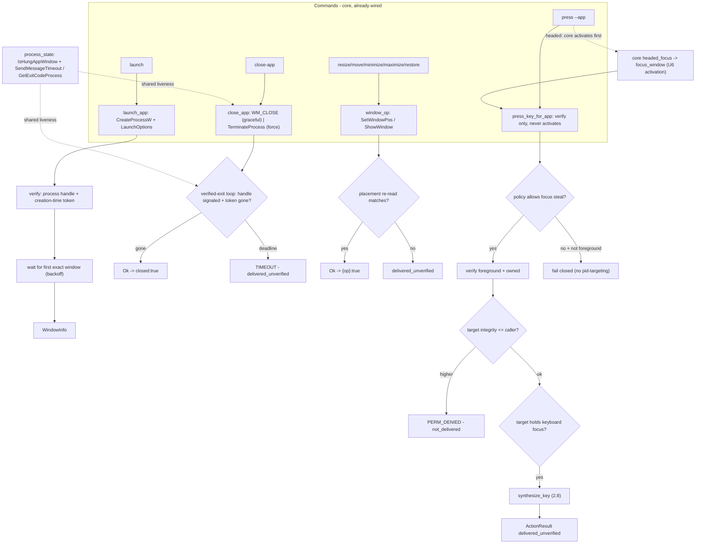
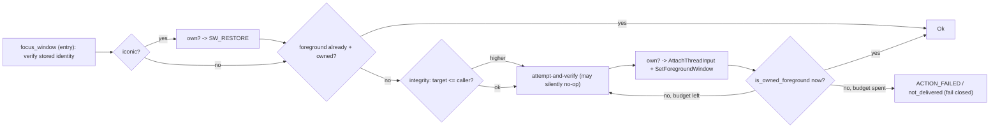

# System Lifecycle (Sub-phase 2.9) - Plan

## Goal Capsule

- **Objective:** Give Windows the process/window lifecycle layer every earlier sub-phase left `not_supported`. Today `launch`, `close-app`, `resize-window`, `move-window`, `minimize`, `maximize`, `restore`, and `press --app` all return `PLATFORM_NOT_SUPPORTED` on Windows (`crates/windows/src/system/adapter.rs` overrides none of them; they fall to the core defaults at `crates/core/src/adapter/system.rs:64,73,115,159,178`). 2.9 implements the six `SystemOps` lifecycle methods — `launch_app`, `close_app`, `process_state`, `is_protected_process`, `window_op`, `press_key_for_app` — and hardens 2.6's minimal `focus_window` into the full window-activation policy, each carrying the `ProcessState` liveness contract (U14), the verified-termination discipline, and the headed/headless policy parity macOS already ships.
- **Authority hierarchy:** `docs/phases.md` §2.9 > `probes/windows/FINDINGS.md` (`api-contract` rows, and `app/provider` rows only where the row records its environment dependency) > this plan > implementer judgment. Where measured evidence contradicts a document, U10 amends the document in this same PR. Probe rows whose expectation text names a stale sub-phase number are cited by row id; obligations come from `docs/phases.md`, never a row's stale sub-phase name.
- **Stop conditions:** Do not implement screenshot or clipboard (`screenshot`, `get_clipboard_content`/`set_clipboard_content`/`clear_clipboard` stay defaulted — §2.10). Do not implement `capture_signal_baseline`/`wait --event` (§2.11). Do not re-open the element-level `Action::SetFocus` gate — §2.7 settled it headed-only/`POLICY_DENIED`-headless on A3-4/A19-5, and 2.9 inherits only the *window*-activation half. Do not weaken 2.6's recycled-HWND fail-closed TOCTOU discipline — 2.9 may only strengthen it. Do not touch `crates/macos`. 2.9 needs **one sanctioned minimal `crates/core` change** — genericizing the protected-process refusal suggestion in `crates/core/src/commands/close_app.rs`, which hardcodes macOS process names and becomes reachable on Windows for the first time when R5 lands (KTD8, U2) — and nothing else in core: every trait method exists with a default and every type is settled. Do not add a `windows-sys` manifest feature for the core scope — every API is under an already-enabled feature (KTD10).
- **Execution profile:** One PR from `feat/windows-2.9-system-lifecycle` into `feat/windows-adapter`, never `main`. Budget ≈1.8k lines of hand-written Rust per the origin estimate; probes, captures, and the dogfood report are evidence artifacts outside the cap. Windows-crate-only diff plus docs. Conventional Commits, authored by Lahfir, no co-authors.
- **Tail ownership:** The implementer opens the PR against `feat/windows-adapter` and reports the Verification Contract results.

---

## Product Contract

### Summary

An agent on Windows can observe, resolve, act semantically, and synthesize raw input — and cannot launch an app, close one, move or resize a window, or send a key to a named app. Every lifecycle command is stubbed. 2.9 closes that layer against the Win32 process and window APIs: `CreateProcessW` launch honoring `LaunchOptions`, `WM_CLOSE`/`TerminateProcess` close with **verified termination** (the process is observed gone before success is reported — the v0.3.0 macOS correction), `SetWindowPos`/`ShowWindow` window operations verified by placement re-read, `IsHungAppWindow`/`SendMessageTimeout`/`GetExitCodeProcess` liveness feeding the shared `ProcessState` contract, a Windows-reasoned protected-process list, and `press_key_for_app` composing 2.8's keyboard primitive under the same focus policy macOS enforces. The window-activation half of the focus policy 2.6 shipped minimally — restore-versus-raise ordering, a bounded focus-steal budget, cross-virtual-desktop and UIPI-boundary behaviour — lands here, keeping 2.6's fail-closed ownership discipline on every native write.

### Problem Frame

The lifecycle primitives are measured only incidentally, and the product path is not built. No probe area targets 2.9 — `probes/windows/` tops out at `20-input-synthesis/`. The evidence that does exist constrains the design sharply: a non-pumping window **hangs** `ElementFromHandle` rather than timing out, already mitigated by `root_from_hwnd`'s `SendMessageTimeoutW(WM_NULL, SMTO_ABORTIFHUNG)` pre-probe (A14-11), so `process_state`'s hang detection reuses that mechanism rather than inventing a second; a minimized window's top-level rect empties while descendants keep real extents at the `-32000` sentinel origin and `IsOffscreen` disagrees with itself across stacks (A1-2/A5-3/A14-8), so `window_op` must verify minimize/restore from the Win32 `GetWindowPlacement` truth, not UIA geometry; a UWP app's top-level window belongs to `ApplicationFrameHost`, not the app pid (A1-3); across a UIPI boundary reads cross while writes silently do not and `SendInput`/`PostMessage` return values lie (A9-2/A9-3), so activation success is judged by an ownership-qualified foreground re-read, never an API verdict; and element-level `SetFocus` already moves the desktop foreground without `SetForegroundWindow` (A3-4/A19-5), settled headed-only by §2.7 and not re-opened here. The cross-integrity activation *effect* is unmeasurable on every probe host to date (`Start-MediumIntegrityProcess` privilege gate, A18-4/A19-4/A20-2).

### Requirements

Lifecycle methods:

- R1. `launch_app` synthesizes a launch via `CreateProcessW` honoring `LaunchOptions` (`args`, `env`, `cwd`, `timeout_ms`, `attach_if_running`), returns the `WindowInfo` of the launched process's first exact accessible window, and treats "launched" as a verified claim (a live process handle plus a creation-time identity token), not a bare API success. The `id` is a full executable path or a name resolvable through `CreateProcessW`'s module search order (the calling process directory, the current directory, `System32`, the Windows directory, then `PATH`); resolving an arbitrary installed GUI app by display name through the `App Paths` registry key or Start Menu — which `ShellExecuteEx` / `NSWorkspace` do and `CreateProcessW` does not — is a stated divergence from macOS's registry-backed name resolution and is out of scope (it would need `Win32_UI_Shell` or a registry read, contradicting KTD10). `attach_if_running: true` reattaches to a single running match; `attach_if_running: false` fails with a structured error naming the running pid instead of attaching; 2+ pre-existing matches under attach are `AMBIGUOUS_TARGET` before any launch.
- R2. `close_app` reports success only after the target process is **observed gone**. Graceful posts `WM_CLOSE` to **every top-level window owned by the target pid** (the raw pid filter over the top-level enumeration, *not* the agent-visible `passes_filter` subset — a hidden or tool helper window must still receive the request, or a multi-window app never closes), and a process that owns zero top-level windows falls straight through to the force-shaped path; force calls `TerminateProcess`. The two are a single up-front branch on `force`, not an auto-escalating ladder; a verified-exit loop polls the process handle / exit code / creation-time token until the process is gone or the deadline expires, at which point it returns `TIMEOUT` with `delivered_unverified` — never an optimistic `closed: true` before exit. The protected-process check is re-enforced in the adapter as defense-in-depth.
- R3. `window_op` executes `Resize`/`Move`/`Minimize`/`Maximize`/`Restore` via `SetWindowPos`/`ShowWindow`, each verified by re-reading `GetWindowPlacement`/`GetWindowRect` rather than the call's return value, with ownership re-checked immediately before every native write (2.6's discipline) and minimize/restore judged against the Win32 placement truth so the `-32000` UIA-geometry ambiguity never reaches the verdict.
- R4. `process_state` classifies a target: `IsHungAppWindow` plus `SendMessageTimeout(WM_NULL, SMTO_ABORTIFHUNG)` → `Unresponsive` (requiring more than one transient signal before upgrading, macOS's discipline); `GetExitCodeProcess` → `Exited { code: Some(_) }` or `Crashed { signal_or_code }` — the enum arms reserved for the platform that can read a real exit code; `Running` otherwise. A creation-time identity token guards every verdict against pid reuse.
- R5. `is_protected_process` returns `true` for the Windows session- and shell-critical processes (reasoned from Windows, not translated from macOS), matched by exact `.exe` image name, case-insensitively, so a critical process cannot be closed and an unrelated app that merely contains a critical substring is not over-blocked.
- R6. `press_key_for_app` delivers a key combo to a named process by composing 2.8's `synthesize_key` primitive under this sub-phase's window-activation policy: re-verify process identity, activate the target window when policy permits focus steal (verify-only when it does not), confirm the target holds keyboard focus, synthesize, and return an honest `ActionResult` (`delivered_unverified`). A higher-integrity target is refused `PERM_DENIED` before injection (2.8's integrity primitive).

Window-activation and focus policy:

- R7. The window-activation half of the focus policy lands in full over 2.6's minimal `focus_window`: restore-versus-raise ordering when the target is minimized behind other windows, a **bounded** focus-steal budget (a finite retry within the lease, never an unbounded loop), cross-virtual-desktop behaviour as attempt-and-verify-ownership (no `IVirtualDesktopManager` binding exists, A16-9), and the UIPI-boundary branch (integrity comparison up front; a cross-integrity activation that silently no-ops fails closed via the ownership-qualified foreground re-read). The element-level `Action::SetFocus` gate is not re-opened.
- R8. Every window-mutating and activation native write keeps 2.6's fail-closed TOCTOU discipline: the owning pid is re-read immediately before each write, and success is qualified by live ownership, so a destroyed-and-recycled HWND fails closed `not_delivered` instead of mutating or foregrounding a foreign window.

Honesty, policy, and evidence:

- R9. No lifecycle path trusts an API return value as proof of effect: close is judged by exit observation, `window_op` by placement re-read, activation by an ownership-qualified foreground read, `press_key_for_app` by post-state. Every native call opens with the deadline preamble (`permissions::ensure_budget`), and a target that would hang a UIA or `SendMessage` call surfaces `APP_UNRESPONSIVE` rather than blocking (A14-11).
- R10. Headless-first parity holds: no lifecycle command activates foreground or steals focus unless its `InteractionPolicy` permits it (Engineering Invariant 13); `SetForegroundWindow`/`SetWindowPos(HWND_TOP)` are reached only from the explicit focus/window commands; headless `press_key_for_app` verifies rather than steals focus, matching macOS.
- R11. Every CI assertion is provider-independent (no coordinate, pid, timing, node-count, or app-named literals); live proof runs on repo-controlled surfaces including the `StalledFixture` non-pumping window for the `APP_UNRESPONSIVE` exit criterion; the lifecycle layer is dogfooded against real software with a judged, committed, redaction-compliant report honoring the corpus safety envelope (foreground-assert bracket, no titles/paths/pids/message text).
- R12. Statements in `docs/phases.md`, `CONCEPTS.md`, `CLAUDE.md`, and the skill docs that this sub-phase's evidence disproves or completes are corrected in place in this PR, each citing its evidence — the phantom `WindowOp::Close` variant, the §2.12 cross-integrity-focus deferral ownership, the `wait_for_menu` parity owner, and the Windows `press_key_for_app` semantic-accelerator divergence.

### Key Decisions

- **2.9 is planned as `docs/phases.md` defines it, with contradictions corrected rather than planned around.** (session-settled: user-directed — the standing instruction across this phase; research already found the phantom `WindowOp::Close` variant, the unassigned §2.12 cross-integrity-focus deferral, and the unowned `wait_for_menu` parity hole.) Governs R12. See KTD9, U10.
- **Correctness is established by running it, not by unit tests alone.** (session-settled: user-directed — carried forward from 2.2-2.8.) Governs R11. See U9.
- **No test asserts a machine-specific or application-specific fact.** (session-settled: user-directed, carried forward.) Governs R11.

### Scope Boundaries

- **Out:** `screenshot` and clipboard (`get_clipboard_content`/`set_clipboard_content`/`clear_clipboard`) — §2.10 (`docs/phases.md:1194-1207`). They are defaulted trait methods 2.9 leaves untouched.
- **Out:** `capture_signal_baseline` / `wait --event` / the app-launched/terminated signal producers §2.11 consumes — §2.11 (`docs/phases.md:1211-1228`). 2.9 ships the lifecycle *effects*; §2.11 ships the signal *observation* of them.
- **Out:** the element-level `Action::SetFocus` gate — settled headed-only/`POLICY_DENIED`-headless by §2.7 on A3-4/A19-5. 2.9 inherits only the window-activation half and must not re-decide it.
- **Out:** UWP launch by AUMID / `IApplicationActivationManager`, resolving an installed app by display name through the `App Paths` registry / Start Menu, and moving windows *between* virtual desktops via `IVirtualDesktopManager` — all need a hand-declared COM binding or a registry/shell feature the pinned crates do not generate (A16-9, and the same class of gap for activation-manager). `launch_app` ships `CreateProcessW` full-path / module-search launch (R1); cross-desktop activation is attempt-and-verify-ownership, not desktop enumeration. If U1 validates a stable binding path, the pre-committed branch adds it; otherwise these stay deferred exactly as `docs/phases.md:1146` records.
- **Out:** any change to `crates/macos`, and any `crates/core` change beyond the one sanctioned minimal fix named in the Goal Capsule (the `close_app.rs` protected-process suggestion string, U2). The lifecycle trait methods and payload types are settled; this sub-phase is otherwise a pure Windows-adapter fill plus doc corrections.
- **Out:** cross-integrity activation *effect* proof — unmeasurable on every probe host to date (`Start-MediumIntegrityProcess` privilege gate, A18-4/A19-4/A20-2). 2.9 ships the integrity-comparison branch and the fail-closed ownership verify; the live cross-boundary effect stays with §2.12's split-integrity runner (U10 extends §2.12's scope to name it).

### Deferred to Follow-Up Work

- **The cross-integrity window-activation effect measurement** — whether a Medium→High `SetForegroundWindow`/`AttachThreadInput` silently no-ops the way input does (A9-2), and surfaces as the fail-closed `not_delivered` this sub-phase ships. **§2.12 owns it** (`docs/phases.md:1247`, the split-integrity item, which U10 extended in this PR to name window activation/focus alongside the observation-read and input-write halves it already covers). Its self-hosted runner is the first rig able to hold both integrity levels. Until then the integrity-comparison branch is shipped and unit-tested, and the denial mapping rides A9-2's measured contract.
- **The `wait_for_menu` cross-platform parity hole** — `wait --menu` / `wait --menu-closed` are shipped macOS commands (`docs/phases.md:435`) backed by `SystemOps::wait_for_menu` + `tree::surfaces::is_menu_open`; Windows overrides neither and no menu-open detection primitive exists in `crates/windows/src`. It is not lifecycle scope and 2.9's `docs/phases.md` scope does not name it. **§2.11 owns it** (wait parity — its goal is "the existing `wait` command works identically cross-platform"); U10 adds the menu-surface detection primitive to §2.11's scope in this PR so the deferral has a named owner rather than sitting unassigned.
- **The Windows `press_key_for_app` semantic-accelerator divergence** — macOS's `press_key_for_app` can deliver a modified combo without stealing focus by walking `AXMenuBar` and pressing the matching menu item (`AXMenuItemCmdChar`). Windows has no queryable global menu-bar/accelerator surface, so Windows `press_key_for_app` is synthesis-only and therefore always focus-dependent, where macOS sometimes is not. This is a measured product divergence like the 2.8 `type` divergence (KTD8 there). **§2.15 owns the settlement** (identical-JSON-is-a-product-promise standard); U10 writes the entry into §2.15's list in this PR.

---

## Planning Contract

### Key Technical Decisions

- KTD1. **The 2.9 surface is six `SystemOps` methods plus the window-activation extension of 2.6's `focus_window` — zero core diff.** `SystemOps` (`crates/core/src/adapter/system.rs`) defaults `launch_app` (`:64`), `process_state` (`:73`), `close_app` (`:115`), `window_op` (`:178`), `press_key_for_app` (`:159`) to `not_supported`, and `is_protected_process` (`:128`) to `false` (deny nothing). 2.9 overrides all six and extends `focus_window` (already implemented minimally at `crates/windows/src/system/window_resolve.rs:61`). Every method body lands in new or grown `system/*.rs` files; `system/adapter.rs` stays pure thin delegation (each override 2-5 lines of code plus a why-comment, as `focused_window`/`is_blocked_combo` already are in that file), growing 214 → ~340 LOC. The command wiring, policy classification, and `--force`/`--headed` plumbing are already settled outside `crates/core` in the CLI/command-policy layer (`Accessibility`-gating in `src/command_policy/mod.rs:63-73`, `is_mutating` in `src/cli/mod.rs`, and the `crates/core/src/commands/*.rs` command bodies; only `close-app` consults `is_protected_process`), so 2.9 changes no dispatch, policy, or CLI code.
- KTD2. **`close_app` earns `closed: true` — the verified-termination loop lives in the adapter, mirroring macOS `wait_for_exit`.** Core serializes `{"method","requested":true,"closed":true}` unconditionally on `Ok(())` (`crates/core/src/commands/close_app.rs:31-36`); the honesty is that the adapter only returns `Ok(())` after the process is observed gone, exactly as macOS's `app_ops.rs::wait_for_exit` polls `still_matches()` at 25 ms cadence. Graceful posts `WM_CLOSE` to the target's top-level windows (every window owned by the pid, R2/U4); force calls `TerminateProcess` — a single up-front branch on `force`, never an auto-escalating ladder (macOS's `app_ops.rs::terminate_running_application` branches on `force` once, one call to `appkit_bridge::terminate`, no re-invocation). Success requires the process handle to signal exit (`WaitForSingleObject` / `GetExitCodeProcess` no longer `STILL_ACTIVE`) **and** the creation-time token to no longer match a live process of that pid (the pid-reuse guard). Deadline expiry with the process still alive is `TIMEOUT` + `delivered_unverified` (the OS accepted the request; exit was not observed), never `not_delivered`. `is_protected_process` is re-checked in the adapter before any terminate, defense-in-depth over core's two checks.
- KTD3. **`process_state` is the shared liveness primitive U3/U4/U6/U7 build on, and Windows is the adapter its `Exited{code:Some}`/`Crashed` arms were reserved for.** The enum's own doc comment names Windows `GetExitCodeProcess` as the intended source of the exit-code arms macOS structurally cannot populate (`crates/core/src/process_state.rs:3-9`). Classification: open the process by the creation-time token (`system/process_identity.rs`, already used by resolution); confirm **actual** exit with `WaitForSingleObject(handle, 0) == WAIT_OBJECT_0` before trusting `GetExitCodeProcess`, because a still-running process and a process that legitimately exited with code `259` both read `STILL_ACTIVE` — the wait, not the code, decides whether the process is gone. A signaled handle's exit code is `Exited { code: Some(_) }`, or `Crashed { signal_or_code }` when the code is an unhandled-exception / `NTSTATUS`-shaped value; a live process (wait timed out) with a window failing `IsHungAppWindow` **or** a `SendMessageTimeout(WM_NULL, SMTO_ABORTIFHUNG)` that times out → `Unresponsive`, but only when more than one signal agrees (macOS's two-consecutive-`CannotComplete` discipline, so a single transient blip stays `Running`); else `Running`. Hang detection reuses the already-shipped `SendMessageTimeoutW(SMTO_ABORTIFHUNG)` mechanism from `root_from_hwnd` (A14-11) rather than a second one; `IsHungAppWindow` is the cheap non-blocking pre-check the ledger names but never exercised (a U1 gap to measure against the reused mechanism). Core reads `process_state` only to enrich a terminal `StaleRef`/`AppNotFound` into `APP_UNRESPONSIVE`, and only when an independent `list_apps` signal agrees (`crates/core/src/ref_action_wait_support.rs`) — the Windows adapter must not itself emit `APP_UNRESPONSIVE` from `process_state`; it returns the state and lets core's two-signal gate decide.
- KTD4. **`launch_app` uses `CreateProcessW`, not `ShellExecuteEx` — and needs *less* verification ceremony than macOS, not more.** `CreateProcessW` is manifest-ready (`Win32_System_Threading`, already enabled), carries `args`/`env`/`cwd` natively (Windows honors a launch `cwd` where macOS Launch Services rejects it — a genuine per-field divergence), and returns a `PROCESS_INFORMATION` handle that *is* a strong single identity primitive. macOS's four-signal "launched" dance (async completion + libproc capture + launch-time cross-check + live re-check, described at `docs/phases.md:1178` and in `crates/macos/src/system/launch.rs`) exists because `NSWorkspace`'s async API is weak on identity; the Win32 handle is not, so Windows captures the returned pid + creation-time token directly and polls for the first exact accessible window at that pid (reusing `window_enum`/`list_windows_live`), with the same 50 ms → 250 ms backoff and the `timeout_ms == 0` "check once, never poll" sentinel. `attach_if_running` drives the same three behaviours macOS gives it: a single running match attaches (returns its window); `false` captures a baseline and fails naming the running pid; 2+ matches under attach are `AMBIGUOUS_TARGET` before launch. UWP-by-AUMID launch is out of scope (KTD10 / Scope Boundaries).
- KTD5. **`window_op` verification reads the Win32 placement truth, sidestepping the UIA `IsOffscreen`/`-32000` ambiguity entirely.** `Resize`/`Move` execute via `SetWindowPos` and verify with `GetWindowRect` within a small tolerance; `Minimize`/`Maximize`/`Restore` execute via `ShowWindow(SW_MINIMIZE|SW_MAXIMIZE|SW_RESTORE)` and verify with `GetWindowPlacement`'s `showCmd`. The minimized-geometry hazard the ledger documents (A1-2/A5-3/A14-8: the top-level rect empties to `-32000` while descendants keep real extents, and `IsOffscreen` disagrees with itself across stacks) is a *UIA*-geometry problem; `window_op` works at the top-level HWND and reads the Win32 `WINDOWPLACEMENT`/`GetWindowRect` directly, so it never consults `IsOffscreen` and never propagates a container's geometry to a subtree. Ownership is re-checked immediately before each native write (2.6's discipline, R8). Coordinates are physical pixels; the single-monitor delta is a measured zero (A10-3), so mixed-DPI placement math is written and unit-tested but its cross-DPI correctness rides §2.12's multi-monitor runner.
- KTD6. **Window activation extends 2.6's `focus_window` in place — the ownership-corroboration skeleton is kept, not rewritten.** 2.6 shipped `restore_if_iconic` → `bring_to_foreground` (the `AttachThreadInput` foreground-lock bypass) → `is_owned_foreground` success predicate, re-reading ownership before every native write (`window_resolve.rs:61-283`). 2.9's additions are the *policy* around that skeleton: restore-versus-raise ordering (raise-without-restore when the target is visible-but-not-foreground; restore-then-raise when iconic — already present, now the explicit ordered policy), a **bounded** focus-steal budget (a finite number of attempts within the lease deadline rather than a single shot, because a foreground-lock contention can need a second attempt after the thread-attach lands — never an unbounded loop), the cross-integrity branch (compare integrity via 2.8's `input/elevation.rs` before activating; a strictly-higher target activation that silently no-ops is caught by the existing ownership-qualified foreground re-read, so it fails closed `not_delivered`), and cross-desktop as attempt-and-verify-ownership. The TOCTOU ceiling 2.6 flagged ("owns whether anything stronger is warranted") resolves to **nothing stronger is warranted**: Win32 offers no atomic "act on this window only while that process still owns it", so 2.9 confirms 2.6's fail-closed ceiling rather than adding ceremony that cannot close the residual. If `window_resolve.rs` (287/400) crowds the cap, the activation policy extracts to a new `system/window_activate.rs` (the crate's split-by-sub-concern precedent), never a compression.
- KTD7. **`press_key_for_app` composes, it does not reimplement — and it does not re-run activation, because core already did.** The activation for a headed `press --app` happens once, in core, before the adapter method is called: `crates/core/src/commands/press.rs:34-36` runs `headed_focus::focus_process_window` (→ `adapter.focus_window`, this sub-phase's U6 activation) when the policy `is_headed()`, then calls `press_key_for_app`. So the adapter method mirrors macOS's `key_dispatch.rs::press_for_app_impl` exactly: re-verify `ProcessIdentity`, then **verify** the target is foreground/owned (a read, like macOS's `verify_app_focused` at `focus.rs:37-52` — never a raise) when `policy.allow_focus_steal`, confirm the target still holds keyboard focus, `input::keyboard::synthesize_key` (2.8's primitive, the reason §2.9 "Depends on: 2.8"), and return `ActionResult::delivered_unverified` after a post-delivery identity re-check. It does **not** call U6's activation from inside the method — that would raise a second time on every headed press. A higher-integrity target is refused `PERM_DENIED` before injection via 2.8's `input/elevation.rs`. **Two divergences from macOS, both stated and handed to §2.15, not absorbed:** (a) macOS's `press_for_app_impl` first tries an `AXMenuBar` accelerator walk that can deliver a combo *without* focus; Windows has no queryable global menu/accelerator surface, so the Windows path is synthesis-only. (b) macOS's headless arm (`allow_focus_steal` false) still delivers via a pid-targeted event (`post_to_pid`) with no foreground requirement; Windows `SendInput` has no per-pid targeting (KTD2), so a headless `press --app` whose target is not already foreground cannot deliver and fails closed rather than injecting into whatever is frontmost — where macOS succeeds. Both are the same class of measured product divergence as 2.8's `type` divergence.
- KTD8. **`is_protected_process` is reasoned from Windows semantics and matched by exact image name.** The set is the session- and shell-critical processes whose termination breaks the interactive session: `csrss.exe`, `wininit.exe`, `winlogon.exe`, `services.exe`, `lsass.exe`, `smss.exe`, `lsaiso.exe`, the compositor `dwm.exe`, and the shell `explorer.exe` (closing it tears down the taskbar and desktop). Matching is on the exact `.exe` image name, case-insensitively — Windows process identity is the image name, so the dotted-segment model macOS uses for bundle ids is the wrong shape here; exact-name matching avoids over-blocking `iexplore.exe`/`explorer++.exe`/an app merely containing "lsass" in its name. There is no probe row for this and none is needed — it is settleable on the same footing as macOS's list (reasoned, unit-tested, invert-verified), not a measurement.
- KTD9. **Placement, scan governance, and the entry preamble.** New files under `crates/windows/src/system/`: `launch.rs` (`CreateProcessW` + `LaunchOptions` + attach + wait-for-window), `close.rs` (graceful/force + verified-exit loop — or grow `app_ops.rs`, matching macOS's placement of `close_app_impl` beside `is_protected_process`), `process_state.rs` (liveness/exit-code/hang classifier), `window_op.rs` **singular** (execute the `WindowOp` enum — deliberately *not* the existing `window_ops.rs`, which owns *listing* and has only 59 lines of headroom; the singular name matches the trait method and avoids overloading one filename with two responsibilities), and `key_dispatch.rs` (`press_key_for_app` composition). `system/window_resolve.rs` grows the activation policy or extracts `window_activate.rs` (KTD6). `is_protected_process` lands in `app_ops.rs` beside `list_apps_live` (macOS's placement). Six thin stubs land in `system/adapter.rs`. Each new file gets a `*_tests.rs` sibling and stays under 400 lines from birth; a test suite approaching the cap splits by sub-concern (the `resolve.rs` six-file precedent), never compresses. Every native call opens with `permissions::ensure_budget(deadline)`. New failure surfaces from `CreateProcessW`/`TerminateProcess` are **Win32 error codes, not HRESULTs** (`GetLastError`), so `hresult.rs`'s COM-shaped table does not classify them directly; U1 confirms whether to wrap via `HRESULT_FROM_WIN32` into the existing one-record-per-code table or add a parallel Win32-error record, never a second ad-hoc match. Banned-call scans: lifecycle introduces `CreateProcessW`/`TerminateProcess`/`SetWindowPos`/`SetForegroundWindow`; U1 confirms whether any existing scan (`hit_test_scan_tests`, the write-path classifier ban) must register the new files with `concat!`-split needles, rather than assuming it must.
- KTD10. **No `windows-sys` manifest change for the core scope — and `CreateProcessW` is chosen partly to keep it that way.** Every API 2.9 needs is under an already-enabled feature: `CreateProcessW`/`TerminateProcess`/`GetExitCodeProcess`/`WaitForSingleObject`/`OpenProcess`/`GetProcessTimes` under `Win32_System_Threading`, and `SetWindowPos`/`ShowWindow`/`GetWindowPlacement`/`GetWindowRect`/`IsHungAppWindow`/`SendMessageTimeoutW`/`SetForegroundWindow`/`AttachThreadInput` under `Win32_UI_WindowsAndMessaging` + `Win32_System_Threading` (`crates/windows/Cargo.toml:32,37`) — and `AttachThreadInput`, `SendMessageTimeoutW`, and `GetProcessTimes` are already in active use. `ShellExecuteExW` would need `Win32_UI_Shell`, which is exactly why `launch_app` pre-commits to `CreateProcessW`. U1 confirms the surface compiles under the current manifest and records the pre-committed branch (add the feature, or decline the capability) if a name-based launch or AUMID activation genuinely needs `Win32_UI_Shell`/an unbound COM interface — rather than silently widening the manifest.

### High-Level Technical Design

The lifecycle surface — six methods plus the activation extension, the honesty gate each mutation crosses, and the shared liveness primitive underneath:

The window-activation policy extending 2.6's `focus_window` — ownership re-read before every write, bounded budget, fail-closed on every branch:

### Assumptions

- (verified during planning, not an open assumption) The whole core-scope Win32 surface compiles under the current manifest — every API is under an already-enabled `windows-sys` feature (KTD10), and `AttachThreadInput`/`SendMessageTimeoutW`/`GetProcessTimes` are already called in `crates/windows/src`. U1 confirms compilation before U2-U7 build on it.
- (verified during planning) The `StalledFixture` shape needed for the `APP_UNRESPONSIVE` exit criterion already exists (`crates/windows/src/tree/fixture.rs`) — a real window whose thread never dispatches a message, exactly what `IsHungAppWindow`/`SendMessageTimeout` detect. No new fixture shape is needed for that test; only the `process_state` production code to point at it.
- (verified during planning) `HostedFixture` spawns a real second process with `process_id()` and `terminate()` exposed (`fixture.rs:130-141`), so a `close_app`/`launch_app` round-trip and its verified-termination loop have a repo-controlled target that is not the test process itself.
- The A21 probe rides the existing capability-probe workflow for its second environment; a leg the hosted image cannot run records the limitation per row, and the CI capture is verified non-empty before any row is cited (the Area 17 lesson).

---

## Implementation Units

| U-ID | Title | Key files | Depends on |
|---|---|---|---|
| U1 | Measure the lifecycle gaps (probe area 21) | `probes/windows/21-system-lifecycle/`, `probes/windows/scratch/` | — |
| U2 | `process_state` + `is_protected_process` | `crates/windows/src/system/{process_state,app_ops}.rs`, `system/adapter.rs` | U1 |
| U3 | `launch_app` via `CreateProcessW` | `crates/windows/src/system/launch.rs`, `system/adapter.rs` | U1, U2 |
| U4 | `close_app` with verified termination | `crates/windows/src/system/close.rs`, `system/adapter.rs` | U2 |
| U5 | `window_op` via `SetWindowPos`/`ShowWindow` | `crates/windows/src/system/window_op.rs`, `system/adapter.rs` | U1 |
| U6 | Window-activation & focus policy in full | `crates/windows/src/system/{window_resolve,window_activate}.rs` | U1 |
| U7 | `press_key_for_app` composition | `crates/windows/src/system/key_dispatch.rs`, `system/adapter.rs` | U6 |
| U8 | Envelope parity + hot-path cost baseline | fixture-driven lib tests, probe cost leg | U2-U7 |
| U9 | Dogfood the lifecycle layer | `probes/windows/scratch/`, `docs/dogfood-reports/` | U8 |
| U10 | Correct what this sub-phase disproves | `docs/phases.md`, `CONCEPTS.md`, `CLAUDE.md`, `skills/agent-desktop/` | U1, U9 |

### U1. Measure the lifecycle gaps (probe area 21)

- **Goal:** Settle every lifecycle question the ledger leaves open before production code assumes an answer, and confirm the manifest compiles the surface. The corpus has **zero** rows for `CreateProcess`-as-launcher, `WM_CLOSE`/`TerminateProcess`, exit-code reads, `IsHungAppWindow`, `SetWindowPos`/`GetWindowPlacement`, `SetForegroundWindow` refusal, or a focus-steal budget — this unit produces them.
- **Requirements:** R1-R10 (measurement grounding for each).
- **Dependencies:** none.
- **Files:** `probes/windows/21-system-lifecycle/probe.ps1` and/or `probe.rs`, capture JSON, `probes/windows/FINDINGS.md` (new `A21-*` rows).
- **Approach:**
  1. Launch: `CreateProcessW` a scratch target (a repo-controlled helper, not a named user app), confirm the returned `PROCESS_INFORMATION` pid/handle, and measure `attach_if_running` detection against a second launch of the same image.
  2. Close: post `WM_CLOSE` vs `TerminateProcess` to a scratch process; read exit via `WaitForSingleObject` + `GetExitCodeProcess`; confirm the code distinguishes a clean exit from an unhandled-exception/`NTSTATUS` code (the `Exited` vs `Crashed` boundary).
  3. Hang: against a non-pumping window (the `StalledFixture` shape), measure `IsHungAppWindow` vs `SendMessageTimeout(WM_NULL, SMTO_ABORTIFHUNG)` — do they agree, and what is each one's latency, so KTD3 can justify reusing the already-shipped `SendMessageTimeout` mechanism over `IsHungAppWindow` or pairing them.
  4. Window ops: `SetWindowPos`/`ShowWindow` for each `SW_*` verb against a scratch window, round-tripped through `GetWindowPlacement.showCmd` and `GetWindowRect`, recording the `-32000` minimized sentinel.
  5. Activation: whether `SetForegroundWindow` needs the bounded retry budget (does the first thread-attach attempt always land, or is a second needed under contention).
  6. Cross-integrity focus: take A9-1's token-lowering method (duplicate token → `SetTokenInformation(TokenIntegrityLevel)` → `CreateProcessAsUser`) if the host permits; otherwise record the pre-committed unmeasurable branch citing A18-4/A19-4/A20-2.
  7. Manifest/scan: confirm the whole surface compiles under the current `windows-sys` features; decide the `HRESULT_FROM_WIN32`-vs-parallel-table question for Win32 error codes and whether any banned-call scan needs the new files registered.
- **Patterns to follow:** the Area 20 probe structure (`probes/windows/20-input-synthesis/`); the corpus safety envelope (foreground-assert bracket, scratch-only windows, no titles/paths recorded); the Area 17 non-empty-capture-before-citing lesson.
- **Test scenarios:**
  - Capture JSON is committed and verified non-empty before any `A21-*` row cites it.
  - Each `A21-*` row records its environment dependency (`app/provider`) where the result is host-specific (integrity manufacture, single-monitor DPI).
  - A leg the hosted image cannot run records `measurable: false` with a named branch, never a silent omission.
  - `Test expectation: measurement only` — this unit produces evidence, not shipped behavior; its "test" is the committed capture and the ledger rows.
- **Verification:** `probes/windows/FINDINGS.md` gains `A21-*` rows for launch, close/exit-code, hang, window-op, activation-budget, and cross-integrity; the compile check passes; every downstream unit cites a row rather than an assumption.

### U2. `process_state` + `is_protected_process`

- **Goal:** The shared liveness primitive (`process_state`) and the protected-process gate, landed first because U3/U4/U6/U7 depend on liveness.
- **Requirements:** R4, R5, R9.
- **Dependencies:** U1 (hang mechanism, exit-code boundary).
- **Files:** `crates/windows/src/system/process_state.rs` (+ `process_state_tests.rs`), `crates/windows/src/system/app_ops.rs` (add `is_protected_process`, + tests), `crates/windows/src/system/adapter.rs` (two stubs), and the one sanctioned core change: `crates/core/src/commands/close_app.rs` (genericize the protected-process suggestion string, + a `close_app_tests.rs` assertion).
- **Approach:**
  1. `process_state`: open by the creation-time token (`process_identity.rs`); gate the exit read on `WaitForSingleObject(handle, 0) == WAIT_OBJECT_0` so a running process whose code would be `259` is never misread as exited, then `GetExitCodeProcess` → `Exited{code:Some}`/`Crashed{signal_or_code}` (the `Crashed` boundary is a documented heuristic — the exit code is read as `Crashed` when it matches the `NTSTATUS` unhandled-exception shape, high nibble `0xC`, e.g. `0xC0000005`; otherwise `Exited`; either way `signal_or_code`/`code` carries the raw value, U1 pins the exact rule); a live process (wait timed out) whose windows fail the hang probe → `Unresponsive`. Multi-window rule: `process_state` receives only a `ProcessIdentity`, so it enumerates the target pid's top-level windows and probes each — `Unresponsive` when **any one** window fails both `IsHungAppWindow` and the `SendMessageTimeout(SMTO_ABORTIFHUNG)` reused from `root_from_hwnd` on more than one agreeing signal; a process with no top-level window is judged live-or-exited by the handle alone, never `Unresponsive`. Token guards every verdict against pid reuse (re-check after the blocking probe, macOS's discipline).
  2. `is_protected_process`: exact case-insensitive `.exe` image-name match against the KTD8 list.
  3. Wire both in `system/adapter.rs` as thin delegations.
  4. **Sanctioned core fix:** `crates/core/src/commands/close_app.rs`'s `protected_process_error` suggestion currently names only macOS processes (`loginwindow, WindowServer, Dock, Finder, launchd`) and is unreachable on Windows until R5 lands; genericize it to name no platform-specific processes (e.g. "session-critical processes are never closed") so a Windows `close-app explorer.exe` refusal reads correctly. Nothing else in core changes.
- **Approach note:** the adapter returns the raw `ProcessState`; it must **not** synthesize `APP_UNRESPONSIVE` — core's two-signal gate (`ref_action_wait_support.rs`) owns that upgrade, and duplicating it here would double-raise.
- **Patterns to follow:** macOS `crates/macos/src/system/process_state.rs` (two-signal `Unresponsive`, re-check instance liveness before and after the probe); `system/process_identity.rs` token discipline; `system/permissions.rs::ensure_budget` preamble.
- **Test scenarios:**
  - A live scratch process classifies `Running`; the same pid after a clean exit classifies `Exited{code: Some(0)}`; after a forced/unhandled-exception exit classifies `Crashed`.
  - A still-running process is never classified `Exited` — the exit read is gated on `WaitForSingleObject`, so a running process whose exit code would collide with `STILL_ACTIVE` (`259`) still reads `Running` (invert-verified by removing the wait gate and watching this case flip).
  - A non-pumping `StalledFixture` window classifies `Unresponsive`; a single transient probe failure followed by a responsive read stays `Running` (two-signal discipline).
  - A recycled pid (token mismatch) never reports the prior process's state — it reports the exited/gone verdict for the original generation.
  - `is_protected_process("explorer.exe")` and each list member return `true`; `iexplore.exe`, `explorer++.exe`, `notepad.exe`, and a name merely containing `lsass` return `false` (exact-match, invert-verified by adding a near-miss).
  - A multi-window process where one top-level window hangs and another pumps classifies `Unresponsive` (any-one-hangs rule); a process with no top-level window is never `Unresponsive`.
  - The Windows protected-process refusal (`close-app` on a KTD8 process) carries a suggestion that names no macOS process — the sanctioned core fix, pinned by a `close_app_tests.rs` assertion that fails if the macOS names return.
  - The classifier never blocks unbounded against a hung target (deadline-bounded, A14-11).
- **Verification:** `process-state` reachable states are pinned on repo-controlled targets; `APP_UNRESPONSIVE` is reachable end-to-end through core against the `StalledFixture` (the §2.9 exit criterion); the protected list is invert-verified.

### U3. `launch_app` via `CreateProcessW`

- **Goal:** Launch honoring `LaunchOptions`, returning the launched process's first exact window, with attach-vs-fail policy and a verified (not optimistic) launch claim.
- **Requirements:** R1, R9, R10.
- **Dependencies:** U1 (launch/attach measurement), U2 (process liveness for the launched handle).
- **Files:** `crates/windows/src/system/launch.rs` (+ `launch_tests.rs`), `crates/windows/src/system/adapter.rs` (one stub).
- **Approach:**
  1. Validate the identifier and options before any native call (mirror macOS's guards: reject empty/`..`/control chars; cap arg/env counts and total text at 1 MiB); unlike macOS, `cwd: Some(_)` is honored via `CreateProcessW`'s `lpCurrentDirectory`.
  2. `attach_if_running`: resolve running matches via `list_apps_live`; one match attaches (return its exact window); `false` captures a baseline and fails naming the running pid; 2+ under attach are `AMBIGUOUS_TARGET` before launch.
  3. `CreateProcessW` with `CREATE_UNICODE_ENVIRONMENT` when `env` is non-empty; capture pid + creation-time token from the returned handle.
  4. Poll for the first exact accessible window at that pid (`window_enum`/`list_windows_live`) with 50 ms → 250 ms backoff; `timeout_ms == 0` checks once. No window in time → `WINDOW_NOT_FOUND` + `delivered_unverified` (the process started; its window was not observed).
- **Approach note:** the Win32 handle is a strong identity primitive — do not replicate macOS's four-signal ceremony (`docs/phases.md:1178`, `crates/macos/src/system/launch.rs`); capture pid + creation-time token once and trust the handle (KTD4).
- **Patterns to follow:** macOS `crates/macos/src/system/launch.rs` (attach/baseline/ambiguous structure, backoff, `timeout_ms==0` sentinel, `not_delivered`/`delivered_unverified` disposition split); `LaunchOptions` defaults (`timeout_ms` 5000, `attach_if_running` true).
- **Test scenarios:**
  - Launching a repo-controlled scratch app returns a `WindowInfo` whose pid matches the created process and whose window is that process's.
  - `attach_if_running: true` against one running instance returns the existing window without a second process; `attach_if_running: false` fails with a structured error carrying the running pid.
  - 2+ pre-existing matches under attach return `AMBIGUOUS_TARGET` before any launch.
  - `cwd: Some(dir)` launches in that directory (Windows honors it — the per-field divergence from macOS's rejection); an invalid identifier is `INVALID_ARGS` + `not_delivered` before any native call.
  - `timeout_ms: 0` performs exactly one window check; a process that starts but shows no accessible window in time is `WINDOW_NOT_FOUND` + `delivered_unverified`, never `not_delivered`.
  - No test asserts a coordinate, pid literal, or app-specific title.
- **Verification:** launch → window round-trip passes on a repo-controlled target; the disposition split (before-launch `not_delivered` vs after-launch `delivered_unverified`) matches macOS.

### U4. `close_app` with verified termination

- **Goal:** Graceful/force close that reports success only after the process is observed gone — the v0.3.0 macOS correction on Windows.
- **Requirements:** R2, R9.
- **Dependencies:** U2 (liveness/exit observation).
- **Files:** `crates/windows/src/system/close.rs` (+ `close_tests.rs`) — or grow `app_ops.rs` beside `is_protected_process` to match macOS placement; `crates/windows/src/system/adapter.rs` (one stub).
- **Approach:**
  1. Re-check `is_protected_process` in the adapter (defense-in-depth over core's two checks); require a creation-time token on the `AppInfo`.
  2. Single up-front branch on `force`: graceful posts `WM_CLOSE` to every top-level window whose owning pid matches the target (`enumerate_top_level` filtered by pid only, unfiltered by `passes_filter` — a hidden helper window must still receive it); a process with zero matching top-level windows falls through to the force path. Force calls `TerminateProcess` on a handle opened by the token.
  3. Verified-exit loop: poll `WaitForSingleObject`/`GetExitCodeProcess` and the creation-time token until the process is gone (signaled + no longer `STILL_ACTIVE` + token no longer matches a live pid) or the deadline expires.
  4. Deadline with the process still alive → `TIMEOUT` + `delivered_unverified`; a token mismatch mid-loop (pid recycled to a different generation) is a benign already-gone `Ok(())`.
- **Approach note:** not a graceful-then-force ladder — `force` selects once, and the whole remaining budget polls under that mode (macOS `app_ops.rs::terminate_running_application` branches on `force` exactly once, `CHANGELOG.md:129`). A caller wanting escalation issues two calls.
- **Patterns to follow:** macOS `crates/macos/src/system/app_ops.rs::terminate_running_application` + `wait_for_exit` (25 ms cadence, `still_matches()` to distinguish real exit from pid reuse, `delivered_unverified` on timeout — never `not_delivered` once the request was accepted).
- **Test scenarios:**
  - Closing a repo-controlled `HostedFixture` process graceful returns `Ok(())` only after the process is independently observed gone; core then serializes `closed:true`.
  - Force close of a process that ignores `WM_CLOSE` still terminates and verifies exit.
  - A close whose target does not exit within the deadline returns `TIMEOUT` + `delivered_unverified`, not `not_delivered` and not `closed:true`.
  - Closing an already-dead pid is `Ok(())` (benign), not an error.
  - A protected process is refused in the adapter even if core's checks were bypassed.
  - Exit is verified by pid + creation-time token, never pid alone (a recycled pid is not mistaken for the original exiting).
- **Verification:** the launch → interact → close e2e passes; `close_app_tests.rs`-shaped response `{"method","requested":true,"closed":true}` is only produced after a verified exit; invert-verify by making the loop return before observing exit and watching the timeout test go red.

### U5. `window_op` via `SetWindowPos`/`ShowWindow`

- **Goal:** The five `WindowOp` variants, each verified by placement re-read, on the Win32 truth.
- **Requirements:** R3, R8, R9.
- **Dependencies:** U1 (window-op round-trip measurement).
- **Files:** `crates/windows/src/system/window_op.rs` (+ `window_op_tests.rs`), `crates/windows/src/system/adapter.rs` (one stub).
- **Approach:**
  1. Resolve the target HWND from the `WindowInfo` (2.6's `resolve_window_strict` path) and re-check ownership immediately before each native write.
  2. `Resize`/`Move` via `SetWindowPos` (validate finite, positive, bounded dimensions/coords first, allowing negative multi-monitor coordinates); `Minimize`/`Maximize`/`Restore` via `ShowWindow(SW_MINIMIZE|SW_MAXIMIZE|SW_RESTORE)`.
  3. Verify by re-read: `GetWindowRect` within a small tolerance for resize/move; `GetWindowPlacement.showCmd` for minimize/maximize/restore. A write whose placement re-read does not confirm is `delivered_unverified`; a failed native call maps its Win32 error through the KTD9 classifier.
- **Approach note:** `window_op` reads the Win32 `WINDOWPLACEMENT`/`GetWindowRect` directly and never consults UIA `IsOffscreen` or descendant geometry, so the `-32000`/`IsOffscreen` ambiguity (A1-2/A5-3/A14-8) cannot reach the verdict (KTD5).
- **Patterns to follow:** macOS `crates/macos/src/system/window_ops.rs` (validate-then-mutate-then-verify, `delivered_unverified` on a postcondition-wait failure after a successful mutation, negative-coordinate allowance); 2.6's ownership re-check before every write.
- **Test scenarios:**
  - Each of resize/move/minimize/maximize/restore on a repo-controlled on-screen scratch window (under `on_screen_stage()`) is confirmed by the placement re-read.
  - Minimize is verified by `showCmd == SW_SHOWMINIMIZED`, not by any UIA rect or `IsOffscreen` (the ambiguity is designed out).
  - Non-finite / out-of-range geometry is `INVALID_ARGS` before any native call; negative screen coordinates are accepted.
  - A recycled HWND fails closed `not_delivered` before the write (2.6's discipline, invert-verified by forcing a mid-op ownership mismatch).
  - No test asserts an absolute coordinate or size literal.
- **Verification:** window-op round-trips pass on a scratch window in both idle and on-screen-staged legs; the ownership re-check is invert-verified.

### U6. Window-activation & focus policy in full

- **Goal:** Extend 2.6's minimal `focus_window` into the full window-activation policy, keeping the fail-closed ownership skeleton.
- **Requirements:** R7, R8, R9, R10.
- **Dependencies:** U1 (activation-budget + cross-integrity measurement).
- **Files:** `crates/windows/src/system/window_resolve.rs` (extend) or a new `crates/windows/src/system/window_activate.rs` (if the 400-cap presses — 287/400 today) + tests; `crates/windows/src/input/elevation.rs` (widen the `pub(super)` RID readers `current_process_integrity_rid`/`process_integrity_rid` to `pub(crate)`, or add a `pub(crate)` accessor, so `system/` can read the integrity RIDs to compare — and add an activation-worded `PERM_DENIED` constructor rather than reusing the input-specific `elevation_denied_error` whose message reads "UIPI blocks input").
- **Approach:**
  1. Restore-versus-raise ordering: restore-then-raise when iconic (present); raise-without-restore when visible-but-not-foreground — made the explicit ordered policy.
  2. Bounded focus-steal budget: a finite number of attach-and-set-foreground attempts within the lease deadline, defaulting to **2** (one initial, one retry after the thread-attach lands) unless U1's contention measurement shows a different bound; never unbounded. Each attempt re-reads ownership before the write and re-checks `is_owned_foreground` after. The default makes U6 executable even if U1's activation-budget leg is inconclusive.
  3. Cross-integrity branch: read caller and target integrity RIDs via `input/elevation.rs`'s (now `pub(crate)`) readers and compare before activating; a strictly-higher target proceeds attempt-and-verify (the write may silently no-op like input does, A9-2) and the existing ownership-qualified foreground re-read catches the no-op as fail-closed `not_delivered` with the activation-worded `PERM_DENIED` — never the input-worded one.
  4. Cross-desktop: attempt-and-verify-ownership (no `IVirtualDesktopManager` binding, A16-9); do not claim desktop detection or move.
- **Approach note:** the TOCTOU ceiling resolves to *nothing stronger than fail-closed is warranted* — no atomic act-while-owned primitive exists, so 2.9 confirms 2.6's ceiling (KTD6) rather than adding uncloseable ceremony.
- **Patterns to follow:** 2.6's `window_resolve.rs` (`restore_if_iconic`/`bring_to_foreground`/`is_owned_foreground`/`recycled_before_foreground`, ownership re-read before every write); the identity-fingerprint solution doc.
- **Test scenarios:**
  - A visible-but-background scratch window is raised without a restore; an iconic one is restored then raised (ordering pinned).
  - A recycled HWND fails closed `not_delivered` on every activation branch (restore, raise, budget-retry), invert-verified.
  - The focus-steal budget is finite: activation that never becomes foreground returns `ACTION_FAILED` + `physical_delivery_started:false` after the budget, never loops unbounded.
  - The cross-integrity branch: a strictly-higher-integrity target that cannot be foregrounded fails closed `not_delivered` (comparison logic unit-tested against synthetic integrity SIDs; the live effect inherits the §2.12 deferral).
  - Success is qualified by live ownership, not handle-is-foreground alone.
- **Verification:** activation policy is proven on repo-controlled targets in headed staging; the fail-closed ownership discipline is invert-verified on each branch; `window_resolve.rs`/`window_activate.rs` stays under 400.

### U7. `press_key_for_app` composition

- **Goal:** Deliver a combo to a named process by composing 2.8's keyboard primitive under this sub-phase's activation policy and the macOS focus gate.
- **Requirements:** R6, R9, R10.
- **Dependencies:** U6 (activation policy), 2.8 (`input::keyboard::synthesize_key`, `input::elevation`).
- **Files:** `crates/windows/src/system/key_dispatch.rs` (+ `key_dispatch_tests.rs`), `crates/windows/src/system/adapter.rs` (one stub). Reuses U6's `pub(crate)` integrity readers in `input/elevation.rs` for the pre-injection integrity refusal; no new `elevation.rs` change beyond U6's.
- **Approach:**
  1. Re-verify `ProcessIdentity`; refuse a strictly-higher-integrity target `PERM_DENIED` before injection (2.8's `elevation.rs`).
  2. **Verify** the target is foreground/owned (read-only, mirroring macOS's `verify_app_focused`) when `policy.allow_focus_steal` — do **not** call U6's activation here; core's `headed_focus::focus_process_window` already activated the window before this method was invoked (`press.rs:34-36`). A headless target (`allow_focus_steal` false) that is not already foreground fails closed (divergence (b) in KTD7), because Windows `SendInput` cannot pid-target a background window.
  3. Confirm the target holds keyboard focus, then `synthesize_key` (2.8); return `ActionResult::delivered_unverified` after a post-delivery identity re-check.
- **Approach note:** the U6 dependency is that core calls `adapter.focus_window` (U6's extended activation) before this method under headed policy — this method itself only *verifies*, it never activates. The two macOS divergences (no `AXMenuBar` accelerator path; no headless pid-targeted delivery) are stated in the docs and handed to §2.15 by U10.
- **Patterns to follow:** macOS `crates/macos/src/system/key_dispatch.rs::press_for_app_impl` (identity re-check → focus gate → synthesize → `delivered_unverified`); 2.8's `synthesize_key`/`elevation` seams; core's `press.rs` (headed runs `headed_focus::focus_process_window` before the adapter call; the adapter re-verifies).
- **Test scenarios:**
  - Headed `press --app` against a repo-controlled target activates, verifies focus, synthesizes, and returns `delivered_unverified`.
  - Headless `press --app` (no focus steal) verifies foreground and matches macOS's gate — it does not steal focus.
  - A higher-integrity target is `PERM_DENIED` + `not_delivered` before any synthesis.
  - A target that loses focus between activation and injection fails closed (`ACTION_FAILED`/`STALE_REF`, `physical_delivery_started:false`), never injects into whatever moved in front.
  - The `InteractionPolicy` threaded to the method matches core's (`headless()` vs `headed()` per `--headed`), pinned as macOS's `press_tests.rs` does.
- **Verification:** `press --app` works headed on a repo-controlled target; headless parity with macOS's gate is pinned; the integrity refusal is unit-tested.

### U8. Envelope parity + hot-path cost baseline

- **Goal:** Prove the lifecycle envelopes match macOS shape (codes + disposition) and commit a cost baseline.
- **Requirements:** R9, R11.
- **Dependencies:** U2-U7.
- **Files:** fixture-driven lib tests under `crates/windows/src/system/*_tests.rs`; extend the envelope-parity harness (`crates/windows/src/actions/envelope_parity*`); a probe cost leg.
- **Approach:** assert launch / close / window-op / process-state / press error envelopes carry the same `code` + `disposition` (`delivery`/`retry`) pairs macOS produces for the same failure, over a fake-driven or fixture-driven adapter; commit a hot-path cost baseline for the lifecycle calls (launch-to-window, close-to-exit, window-op round-trip).
- **Patterns to follow:** the 2.7/2.8 envelope-parity harnesses (`envelope_parity_tests.rs`, `input_envelope_parity_tests.rs`); A20-6's cost-baseline leg.
- **Test scenarios:**
  - `TIMEOUT`/`delivered_unverified`, `PERM_DENIED`/`not_delivered`, `STALE_REF`/`not_delivered`, `ACTION_FAILED`/`not_delivered`, `AMBIGUOUS_TARGET` envelopes match macOS across the lifecycle methods.
  - `Exited`/`Crashed`/`Unresponsive`/`Running` serialize with the settled `#[serde(tag="state")]` snake_case shape.
  - The cost baseline is committed and provider-independent (no absolute timings asserted; deltas explainable).
- **Verification:** envelope-parity tests green; cost baseline committed and reviewed against the merge-base.

### U9. Dogfood the lifecycle layer

- **Goal:** Prove the layer by running it against real software, judged and redaction-compliant.
- **Requirements:** R11.
- **Dependencies:** U8.
- **Files:** `probes/windows/scratch/`, `docs/dogfood-reports/2026-08-08-001-feat-windows-2-9-system-lifecycle-dogfood.md`.
- **Approach:** launch → interact → close round-trip on a real app (Notepad/Explorer); `APP_UNRESPONSIVE` against the `StalledFixture` non-pumping window; each `window_op` on a scratch window; `press --app` on a real target; a UWP target's lifecycle if one is reachable (else record the gap per A1-3). Judge each leg honestly (`delivered`/`delivered_unverified`/`not_delivered` as observed); honor the corpus safety envelope (foreground-assert bracket, clipboard/cursor restore, no titles/paths/pids/message text — shapes and counts only).
- **Patterns to follow:** the 2.7/2.8 dogfood reports (`docs/dogfood-reports/2026-08-07-00{1,2}-*`); the redaction and safety-envelope discipline.
- **Test scenarios:**
  - `Execution note:` this is a live dogfood, not unit coverage; the deliverable is the judged report plus any fixes it forces, with a `J<n>` entry per leg.
  - Each leg records what was observed, not the command's own `ok:true`.
  - Any residual is recorded with a named owner, never left as an unowned gap.
- **Verification:** the report lands with a judged verdict per leg; failures it surfaces are fixed and re-run, or recorded as owned residuals.

### U10. Correct what this sub-phase disproves

- **Goal:** Keep `docs/phases.md` and the embedded docs in sync with what shipped and what research disproved — verifying the planning-time corrections still hold and finalizing the ones that could only be settled once code exists.
- **Requirements:** R12.
- **Dependencies:** U1, U9.
- **Files:** `docs/phases.md`, `CONCEPTS.md`, `CLAUDE.md`, `skills/agent-desktop/`.
- **Approach:** Four corrections were applied when this plan was written and must be re-verified against shipped code (not re-applied): the phantom `WindowOp::Close` variant removed from `docs/phases.md:291` (window/app close is `close_app(&AppInfo, ...)`, not a `WindowOp`); the §2.12 split-integrity item extended to own the cross-integrity *window-activation/focus* effect alongside observation reads and input writes; the `wait --menu`/`wait --menu-closed` parity hole and its menu-open detection primitive assigned to §2.11; and the Windows `press_key_for_app` semantic-accelerator divergence written into §2.15's settlement list. This unit then finalizes what needs shipped code:
  1. Reconcile §2.9's own scope and exit-criteria against what actually shipped (the `CreateProcessW`-over-`ShellExecuteEx` choice and the UWP/AUMID out-of-scope note are already recorded; confirm they match the code, and correct any exit-criteria wording the implementation changed).
  2. Correct any embedded skill / `CLAUDE.md` / `CONCEPTS.md` statement the layer completes or disproves (e.g. a `press --app`/`launch`/`close-app` "not-supported on Windows" statement in the skill docs), each citing its evidence.
  3. Fold any `A21-*` measurement that disproved a planning assumption back into the relevant document in place.
- **Approach note:** correct in place, never annotate (no "previously said"); cite the `A21-*` row or the verified source. Every deferral names its receiving sub-phase in `docs/phases.md`, not just this plan — the four above already do; do not remove them.
- **Test scenarios:** `Test expectation: none — documentation reconciliation.` The check is that `scripts/check-no-phase-references.sh` stays green (skill docs are scanned), no `docs/phases.md` statement contradicts shipped code, and every deferral still names an owner.
- **Verification:** `docs/phases.md` and the embedded docs match the code; the four planning-time corrections survive review against what shipped, and any skill/`CLAUDE.md`/`CONCEPTS.md` "not-supported on Windows" lifecycle statement is corrected.

---

## Verification Contract

- `cargo fmt --all -- --check` clean.
- `cargo clippy --locked -p agent-desktop-core -p agent-desktop-windows -p agent-desktop -p agent-desktop-ffi --all-targets -- -D warnings` clean (package-scoped — bare/workspace cargo fails on this box).
- `cargo test --locked -p agent-desktop-windows --lib` and `cargo test --locked -p agent-desktop-core --lib` green; `cargo test --locked -p agent-desktop` (binary CLI-contract/dispatch/policy) green.
- `cargo check -p agent-desktop-core --all-targets --target x86_64-pc-windows-msvc` and `--target x86_64-unknown-linux-gnu` green (core stays cross-platform; 2.9 adds no core `#[cfg]`).
- `bash scripts/check-rust-file-size.sh` exit 0 (every new/grown file ≤ 400 LOC).
- `bash scripts/check-no-phase-references.sh` exit 0 (no plan/sub-phase/`KTD`/`U` id in `crates/**`, `src/**`, or the embedded `skills/**`; `A21-*` probe rows are exempt).
- `cargo tree -p agent-desktop-core` contains no platform crate names (core isolation intact).
- No `launch_app`/`close_app`/`window_op`/`process_state`/`press_key_for_app` path returns `PLATFORM_NOT_SUPPORTED` on Windows for a capability 2.9 owns; `is_protected_process` returns `true` for the KTD8 list.
- The one sanctioned `crates/core` change is confined to genericizing `close_app.rs`'s protected-process suggestion string (no `#[cfg]`, no type or signature change, so the core cross-compile lines above still hold), pinned by a `close_app_tests.rs` assertion that fails if a platform-specific process name returns to the message.
- The §2.9 exit criteria hold: the launch → interact → close e2e analog passes on a repo-controlled target, and `APP_UNRESPONSIVE` is reachable against the deliberately hung `StalledFixture` window.
- Invert-verify discipline (one production mutation per run, restore, `touch` after restore): the verified-exit loop (U4), the ownership re-check on each activation/window-op branch (U5/U6), the two-signal `Unresponsive` (U2), the protected-list exact match (U2), and the focus-steal budget bound (U6) each go red under their own inversion.
- The dogfood report (U9) lands judged and redaction-compliant; the cost baseline (U8) is committed and reviewed against the merge-base.
- `git diff` touches `crates/macos` in zero lines, and `crates/core` only in the single sanctioned `close_app.rs` suggestion string (plus its test).

## Definition of Done

- All six `SystemOps` lifecycle methods and the extended window-activation policy are implemented, delegating from a `system/adapter.rs` that stays pure thin delegation and under 400 LOC.
- Every Verification Contract gate passes; every feature-bearing unit's test scenarios are covered and invert-verified.
- `docs/phases.md` and the embedded docs are in sync with the code: the phantom `WindowOp::Close`, the §2.12 cross-integrity-focus deferral, the §2.11 `wait_for_menu` owner, and the §2.15 `press_key_for_app` divergence are corrected in this PR, each citing its evidence.
- The A21 probe rows are committed with non-empty verified captures; every design decision cites a row or the settled source.
- Zero `unwrap()`/`expect()` outside tests; no `//` non-doc comments in `crates/**`; no delivery-plan reference in shipped or embedded source.
- The PR is opened against `feat/windows-adapter` (never `main`), Conventional-Commit titled, authored by Lahfir with no co-authors, and the Verification Contract results are reported in the PR body.

## Risks & Dependencies

- **Cross-integrity activation effect is unmeasurable on the probe host** (`Start-MediumIntegrityProcess` privilege gate, A18-4/A19-4/A20-2). Mitigation: ship the integrity-comparison branch + fail-closed ownership verify; the live effect is deferred to §2.12's split-integrity runner (U10 names it there). The detection is unit-tested against synthetic SIDs, so the shipped branch is proven even where the effect is not.
- **UWP/`ApplicationFrameHost` targeting** (A1-3): a UWP app's top-level window belongs to `ApplicationFrameHost`, not the app pid. Mitigation: `close_app`/`window_op` act on the `AppInfo.pid` that `list_apps` (2.4) reports; U9 dogfoods a UWP target if reachable and records the gap otherwise. AUMID launch stays out of scope pending an `IApplicationActivationManager` binding.
- **Single-monitor DPI** (A10-3): the aware-vs-unaware bounds delta is a measured zero on the only display available, so `window_op`'s cross-DPI placement math is written and unit-tested but its multi-monitor correctness rides §2.12's runner. Mitigation: physical-pixel coordinates throughout; no DPI fallback ships unverified.
- **File-size pressure**: `window_resolve.rs` (287/400) and `system/adapter.rs` (214/400) grow. Mitigation: extract `window_activate.rs` if activation policy presses the cap; keep `adapter.rs` pure delegation (KTD9).
- **Depends on:** 2.4 (window/app identity, `list_windows`/`list_apps`, `window_enum`), 2.6 (`resolve_window_strict`/`focus_window` skeleton), 2.8 (`synthesize_key`, `input/elevation.rs` integrity primitive). The `docs/phases.md:1188` "Depends on" line names 2.4 and 2.8; the 2.6 dependency is implicit through the window-identity surface and made explicit by U10 if warranted.

## Open Questions

- **Focus-steal budget count** (U1/U6): whether one attach-and-set-foreground attempt always lands or contention needs a bounded second. Resolved by A21 measurement, not guessed; the retry stays finite either way.
- **`IsHungAppWindow` vs reused `SendMessageTimeout`** (U1/U2): whether `IsHungAppWindow` adds signal over the already-shipped `SendMessageTimeout(SMTO_ABORTIFHUNG)` or is a cheaper pre-check to pair with it. Resolved by A21; KTD3 pre-commits to reusing the shipped mechanism as the authoritative signal.
- **Win32-error classification** (U1/U9): whether `CreateProcessW`/`TerminateProcess` `GetLastError` codes wrap through `HRESULT_FROM_WIN32` into `hresult.rs`'s one-record-per-code table or need a parallel Win32-error record. Resolved by U1; either way it stays one record per code, never a second ad-hoc match.

## Sources & Research

- `docs/phases.md:1173-1192` (§2.9 scope, key APIs, dependencies, exit criteria, PR size); `:246-267` (`SystemOps` signatures); `:279-291` (`ProcessState`, `LaunchOptions`, `WindowOp` types); `:822,842-843` (headless-first + Engineering Invariant 13); `:1146` (`IVirtualDesktopManager` gap); `:1184` (§2.6/§2.9 focus-policy handoff); `:1247` (§2.12 split-integrity); `:1211-1228,435` (§2.11 wait parity + `wait --menu`).
- `probes/windows/FINDINGS.md`: A1-2/A5-3/A14-8 (minimized `-32000`/`IsOffscreen` geometry), A1-3 (UWP `ApplicationFrameHost` pid), A3-4/A19-5 (element `SetFocus` foreground move — settled by §2.7), A9-1/A9-2/A9-3 (UIPI reads cross, writes don't; `SendInput` return lies; token-lowering method), A10-3 (single-monitor DPI zero-delta), A14-11/A14-12/A18-5 (non-pumping window hangs `ElementFromHandle`; `SendMessageTimeout(SMTO_ABORTIFHUNG)` mitigation; `CUIAutomation8` connection timeout), A16-9 (`IVirtualDesktopManager` unbound), A16-12/A18-4/A19-4/A20-2 (split-integrity environment gate).
- Reference implementations: `crates/macos/src/system/{launch,app_ops,window_ops,key_dispatch,process_state,focus}.rs` (the behavioral contract to match); `crates/core/src/{process_state,launch_options,window_op,interaction_policy}.rs` and `crates/core/src/adapter/system.rs` (the settled trait/types); `crates/core/src/commands/{launch,close_app,press,window_target}.rs` and `crates/core/src/ref_action_wait_support.rs` (core command/verification plumbing).
- Reusable Windows seams: `crates/windows/src/system/{window_resolve,window_enum,window_identity,process_identity,app_ops,permissions,hresult}.rs`, `crates/windows/src/input/{keyboard,elevation}.rs`, `crates/windows/src/tree/fixture.rs` (`StalledFixture`/`HostedFixture`), `crates/core/src/deadline.rs`.
- `CHANGELOG.md:129` (v0.3.0 `close-app` verified-termination correction 2.9 mirrors); `docs/solutions/best-practices/identity-fingerprint-against-os-reorder-2026-04-16.md` (the recycled-HWND fail-closed discipline 2.9 keeps); `docs/solutions/best-practices/a-test-that-cannot-fail-is-not-coverage.md` (invert-verify discipline).
