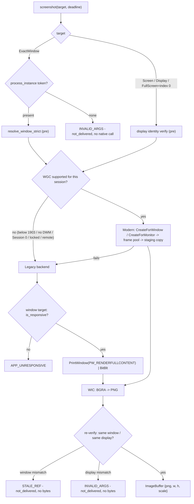
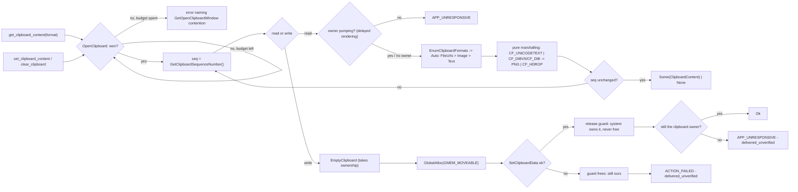

# Capture & Clipboard (Sub-phase 2.10) - Plan

## Goal Capsule

- **Objective:** Give Windows the two data-exchange surfaces every earlier sub-phase left `not_supported`. Today `screenshot`, `clipboard-get`, `clipboard-set`, and `clipboard-clear` return `PLATFORM_NOT_SUPPORTED` on Windows — `crates/windows/src/system/adapter.rs` overrides no `screenshot` and `crates/windows/src/adapter.rs`'s `InputOps` impl overrides no clipboard method, so all four fall to the core defaults (`crates/core/src/adapter/system.rs:143`, `crates/core/src/adapter/input.rs:31,40,48`). 2.10 implements those four methods plus one already-carved seam — `permissions::imp::probe_capture_availability`, which returns a stub `None` today (`crates/windows/src/system/permissions.rs:53-55`) and makes the `screen_recording` slot of every Windows `PermissionReport` read `Unknown` regardless of what the session can actually do. Capture ships as two backends behind one honest precedence (modern `Windows.Graphics.Capture` where the session supports it, GDI legacy everywhere else), and the clipboard ships as the typed `ClipboardContent` contract macOS already serves, over a machine-global OS singleton that has no macOS-style per-object isolation.
- **Authority hierarchy:** `docs/phases.md` §2.10 > `probes/windows/FINDINGS.md` (`api-contract` rows, and `app/provider` rows only where the row records its environment dependency) > vendor documentation cited in this plan > this plan > implementer judgment. Where measured evidence contradicts a document, U11 amends the document in this same PR. Probe rows whose expectation text names a stale sub-phase number are cited by row id; obligations come from `docs/phases.md`, never a row's stale sub-phase name.
- **Stop conditions:** Do not implement `capture_signal_baseline` / `wait --event` / `wait --menu` (§2.11). Do not build the WinForms fixture app or the Windows e2e harness (§2.12) — 2.10 proves itself with fixture-driven lib tests and a judged dogfood run, exactly as 2.7-2.9 did. Do not take `Win32_UI_Shell` on either binding crate, directly or transitively (KTD2) — §2.14 owns the reviewed decision to take it. Do not touch `crates/macos`. Do not add a single `#[cfg(windows)]` to `crates/core`: CI pins the count at exactly two shims in `crates/core/src/private_file.rs` and fails on a third (`.github/workflows/ci.yml:306-329`). 2.10 needs **zero** `crates/core` changes — every trait method exists with a default, every payload type is settled, and the private-file write path a screenshot or clipboard image travels is already installed and already Windows-hardened.
- **Execution profile:** One PR from `feat/windows-2.10-capture-clipboard` into `feat/windows-adapter`, never `main`. Windows-crate diff plus manifest, probe corpus, one CI workflow registration, and docs. Conventional Commits, authored by Lahfir, no co-authors. **The origin's `~1.8k LOC` estimate is low and U11 corrects it in place:** two capture backends, a WIC codec, display selection, three new test fixtures, and a clipboard family whose macOS counterpart is 1,327 lines across six files put this at **≈2.4-3k lines** of hand-written Rust, above the ~2k sub-phase guidance — the upper end if the clipboard family lands at macOS's size. **The owner has settled this as one PR**, so the guidance is knowingly exceeded rather than quietly overrun — U11 records the corrected estimate in `docs/phases.md` so the next planner sizes from a true number, and the two surfaces stay in one branch. A split would not have been as clean as the shared-codec seam suggests, which is worth recording: U9 (envelope parity), U10 (dogfood), and U11 (doc corrections) all span both surfaces, so two PRs would have needed a third closing one or duplicated, conflicting `docs/phases.md` edits.
- **Tail ownership:** The implementer opens the PR against `feat/windows-adapter` and reports the Verification Contract results.

---

## Product Contract

### Summary

An agent on Windows can observe a tree, resolve refs, act semantically, synthesize input, and manage process and window lifecycle — and cannot take a screenshot or read a line of text off the clipboard. 2.10 closes both. Capture lands as a two-backend surface with runtime precedence: `Windows.Graphics.Capture` when the OS and session support it, GDI (`PrintWindow` for a window, `BitBlt` for a display) when they do not, degrading silently rather than failing. Clipboard lands as the typed `ClipboardContent` contract — `CF_UNICODETEXT` for text, PNG-through-`CF_DIB`/`CF_DIBV5` and the registered `PNG` format for images, `CF_HDROP` for file lists — over Win32's single per-window-station clipboard. Both surfaces carry the discipline the crate has already paid for elsewhere: identity corroborated on both sides of the operation so a capture never silently returns another window's pixels, and a bounded liveness pre-probe in front of every call that reaches another process's message pump, because `PrintWindow` and a delay-rendered `GetClipboardData` are both documented cross-thread sends that no `Deadline` can interrupt.

### Problem Frame

The evidence position for 2.10 is unusually lopsided, and the plan is shaped by it.

**Capture is the only Windows surface this project cannot fully develop on its own dev box.** A10-5 measured this VM at build 17763 — Windows 10 1809 — below the 1903 floor `Windows.Graphics.Capture` requires, and recorded that *no* WGC behaviour can be observed here at all, deferring closure to "2.10 - on `windows-latest`". C-8 pins the per-feature floors: 1903 for the API, 19041+ for the cursor-capture toggle, 20348+ for border removal via `IsBorderRequired`. The hosted runner is the opposite case — A14-1 measured `windows-latest` at Server 2025 build 26100 with `qwinsta` reporting `>console` Active, `[Environment]::UserInteractive` true, window station `WinSta0`, desktop `Default` — so the modern backend is developable only against CI, while the legacy backend is developable only against the dev box, and each is the other's blind spot. Engineering Invariant 11 states the rule the product must honour either way: WGC is unavailable in Session 0, Server Core, secure desktop, and locked or remote sessions.

**Both surfaces route through another process's message pump, and the crate has already been bitten by exactly that.** `PrintWindow` is documented as "a blocking or synchronous function [that] might not return immediately": the *target* application processes the call and renders into the caller's DC, receiving `WM_PRINT`/`WM_PRINTCLIENT`. A delay-rendered clipboard format is the same shape — `SetClipboardData(fmt, NULL)` advertises without data, and a reader's `GetClipboardData` makes the system send `WM_RENDERFORMAT` to the owner and wait. This is precisely the failure the crate recorded in `docs/solutions/logic-errors/a-deadline-cannot-interrupt-a-blocking-os-call.md` after 2.9's window writes hung against a non-pumping window, and whose mitigation — a `SendMessageTimeoutW(WM_NULL, SMTO_ABORTIFHUNG)` pre-probe — is already shipped as `window_enum::window_is_responsive` (`crates/windows/src/system/window_enum.rs:225`). The lesson's own prevention note says to grep for the other calls with the same delivery mechanism; `PrintWindow` and delayed clipboard rendering are those calls.

**The clipboard has no macOS-style isolation, and the exit criterion demands hermetic tests.** macOS gets hermeticity free: `crates/macos/src/input/clipboard_tests.rs:74`'s `unique_pasteboard()` creates a genuinely separate `NSPasteboard` object, so tests never touch the general pasteboard. Windows has exactly one clipboard per window station, and every process sharing `WinSta0` shares it — the same machine-global shape as the foreground window and the window list, which is the subject of `docs/solutions/best-practices/a-test-that-acts-on-its-own-runner-acts-on-every-other-test.md`. Windows does offer two primitives macOS does not: the clipboard is a *per-window-station* resource, so a child process on its own station has a private one, and `GetClipboardSequenceNumber` is a per-station change counter that plays the role `NSPasteboard.changeCount` plays on macOS — with the documented caveat that it is not incremented until delayed rendering completes.

**The corpus has zero rows for either surface, and three separate defects in the evidence machinery around them.** `probes/windows/` tops out at `21-system-lifecycle/`, and no script calls `PrintWindow`, `BitBlt`, `CreateCompatibleDC`, `GetDIBits`, WGC, WIC, or the raw Win32 clipboard API. A14-7 is the one adjacent row and it constrains rather than enables: `uiautomation` 0.25.0's `clipboard` and `screenshot` features are deliberately off so a change to the crate's default set cannot silently widen this project's surface. A4-2 and A4-7 do touch the clipboard, but only as side-effect verification of a keyboard chord and **through the managed `System.Windows.Forms.Clipboard` wrapper**, not the Win32 API this sub-phase calls — they are evidence that *a* clipboard round-trip works and that a save/restore envelope is enforceable, not evidence about `CF_UNICODETEXT` or `GetClipboardData`.

The three defects, all verified against the captures themselves:

1. **`.github/workflows/windows-capability-probe.yml` registers areas 14-20 and not area 21**, in both its `paths` filter and its step list — yet §2.9 committed `-ci`-labelled captures for area 21, so those captures did not come from the lane whose label they carry. 2.10's central unknown is measurable *only* on the hosted runner, so that lane must be correct before its evidence is worth citing.
2. **A16-1 contradicts its own capture.** The row (`FINDINGS.md:224`) reports "93 zero-size … 68 visible-non-empty … 51 tool"; `probes/windows/16-observation/captures/observation-census-devbox.json`'s `window_census.by_factor` records `zero_size: 81`, `visible_nonempty: 66`, `tool: 43`. Three of six counts are wrong (`total_enumerated: 147`, `invisible: 137`, `iconic: 8`, `cloaked: 6` are right), and the row carries verdict `CONFIRMS`. The wrong numbers did **not** reach `docs/phases.md` — the blast radius is the row itself.
3. **A16-9 asserts a fact its capture never recorded.** The row claims the `IVirtualDesktopManager` CLSID resolves "with `InProcServer32` naming `C:\Windows\system32\twinapi.dll` and a `Both` threading model". The `InProcServer32` value matches; the capture's `virtual_desktop_manager` object has no threading-model field at all, and the string "threading" appears nowhere in the file.

Defects 2 and 3 are the same class §2.9 already fixed in A21-6 and wrote up as `docs/solutions/best-practices/a-cited-measurement-must-match-its-capture.md`. A third and fourth occurrence *after* that write-up is the signal that a documented lesson is not sufficient: `probes/windows/13-ledger-check.ps1` validates row **structure** — verdicts, stacks, scopes, closure minors, area ids — and never compares a row's prose to the JSON it names. 2.10 depends entirely on new rows being trustworthy, so it closes that hole rather than adding an eleventh row to an unchecked ledger.

### Requirements

Capture:

- R1. `screenshot` serves all four `ScreenshotTarget` variants (`crates/core/src/screenshot_target.rs`) — `FullScreen`, `Screen(index)`, `Display { index, expected }`, `ExactWindow(WindowInfo)` — returning an `ImageBuffer` whose `data` is PNG, whose `format` is `ImageFormat::Png`, and whose `scale_factor` is the effective scale of the display the captured content sits on. Core base64-encodes it or writes it to the positional `PATH` (`crates/core/src/commands/screenshot.rs:20-40`); the adapter owns producing encoded bytes and honest metadata.
- R2. Two backends behind one precedence. **Modern** (`Windows.Graphics.Capture`) is preferred when the OS build and the session support it; **Legacy** (GDI) serves as the universal fallback. A session that cannot support WGC — below 1903, no DWM, Session 0, Server Core, secure desktop, locked or remote (Engineering Invariant 11) — **degrades to Legacy silently and succeeds**; it never surfaces the unavailability as an error. `FullScreen` is **not** a virtual-screen capture: macOS maps it to `capture_screen(0)` (`crates/macos/src/system/adapter.rs:138`), so for cross-platform parity Windows maps it to the display at public index 0 — the primary — and both backends serve it like any other display target. A virtual-screen capture spanning every monitor is not part of this contract on either platform, and no code is written for one.
- R3. **Identity is corroborated on both sides of every capture**, mirroring macOS (`crates/macos/src/system/screenshot.rs:93-117` resolves the window strictly before *and* after; `:74-91` verifies display identity before and after). An `ExactWindow` capture without a `process_instance` token is `INVALID_ARGS` before any native call, and a capture whose target cannot be re-proved afterwards fails rather than returning bytes. This is a correctness *and* a privacy requirement: a capture that silently lands on a recycled HWND hands an agent another application's screen contents.
- R4. No capture call blocks past its `Deadline`. Every Legacy window capture is preceded by the shipped `window_is_responsive` probe, and a non-pumping target returns `APP_UNRESPONSIVE` rather than hanging inside `PrintWindow`. Every native call opens with the `permissions::ensure_budget(deadline)` preamble the crate already uses.
- R5. `probe_capture_availability` becomes truthful. The stub `None` is replaced by a real availability read, so a Windows `PermissionReport.screen_recording` reports `NotRequired` where capture genuinely works — Windows has no screen-recording consent gate — and `Unknown` where the session cannot support it, rather than reporting `Unknown` unconditionally.

Clipboard:

- R6. `get_clipboard_content` serves every `ClipboardFormat`: `Text` from `CF_UNICODETEXT`, `Image` as PNG bytes decoded from the best available image format, `FileUrls` from `CF_HDROP`, and `Auto` resolving **FileUrls → Image → Text**, mirroring macOS's `auto_content` precedence exactly (`crates/macos/src/input/clipboard.rs:126-139`). A format that is genuinely absent returns `Ok(None)` — core renders that as `{"found": false}` — and that absence is classified separately from a transport failure, the lesson already encoded in `is_definitive_absence` on the read path.
- R7. `set_clipboard_content` publishes text, images, and file lists in the formats Windows consumers actually read, and `clear_clipboard` empties it. Both honour the documented ownership rule exactly: memory passed to a **successful** `SetClipboardData` belongs to the system and must never be freed by this process, while memory whose `SetClipboardData` **failed** is still ours and must be freed. Handles are allocated `GlobalAlloc(GMEM_MOVEABLE)` as the documentation requires, and `EmptyClipboard` precedes the first `SetClipboardData` of a write. An `Image` whose declared `ImageBuffer` metadata disagrees with its PNG payload is rejected before any native call, mirroring the macOS write validation (`crates/macos/src/input/clipboard.rs:182-193`).
- R7b. A write verifies it still owns what it wrote. macOS re-checks pasteboard ownership at three checkpoints inside one clear-write-verify transaction and, on losing it, returns a typed `delivered_unverified` or `delivery_uncertain` rather than a false success (`crates/macos/src/input/clipboard_transaction.rs:5-119`). Windows mirrors the guarantee with the primitives it has: ownership is established by `EmptyClipboard`, re-checked after the writes via `GetClipboardOwner` and the sequence number, and a write that lost the clipboard mid-transaction reports `delivered_unverified` — never `ok`. It carries **`ErrorCode::AppUnresponsive`**, the code macOS's own `delivered_unverified()`/`delivery_uncertain()` helpers already use for this exact case (`crates/macos/src/input/clipboard_transaction.rs:175-190`), because the disposition and the code are independent fields and neither `AdapterError::new` nor `Deadline::timeout_error` sets a disposition for free. A clipboard write is the one mutation in this sub-phase whose wrong outcome is invisible to the caller, so it gets the same honesty gate every other Windows mutation already carries.
- R8. Clipboard access is contention-tolerant and never unbounded. Only one window may hold the clipboard open; an `OpenClipboard` that loses the race retries on a fixed short interval within the operation's deadline — anchored on the convention real producers use, a handful of attempts a few milliseconds apart, with the count and interval named as constants rather than left to the implementer — and on exhaustion fails **`TIMEOUT` + `not_delivered`** with an envelope naming the contention via `GetOpenClipboardWindow`, while stating no more than that call supports: a `NULL` answer is ambiguous between "free" and "held by a windowless owner" and the message must not claim to know which. A read that would block on a hung owner's delayed rendering is pre-probed with the same liveness gate R4 applies to capture.
- R9. Every read is bracketed by `GetClipboardSequenceNumber`, so a clipboard mutated mid-read is detected and retried rather than returned as a torn mixture of two clipboard generations — the guarantee macOS gets from `NSPasteboard.changeCount`. The documented caveat that the sequence number does not advance until delayed rendering completes is honoured rather than assumed away.

Both surfaces:

- R10. Image bytes are PNG, encoded and decoded through WIC. A capture produces PNG from a BGRA frame; a clipboard image read produces PNG from `CF_DIBV5`/`CF_DIB` (or passes through an already-PNG clipboard payload); a `clipboard-set --image` decodes the PNG core already validated (`crates/core/src/commands/clipboard_set.rs:29-42`) into the DIB that Windows consumers expect.
- R11. This sub-phase adds **no new file-writing site**, and it does not disturb the deliberate asymmetry between the two that exist. A **user-named destination** — `screenshot`'s positional `PATH`, `clipboard-get --out` — goes through `refs::write_user_file` → `private_file::write_user_atomic` (`crates/core/src/private_file.rs:77`), which **deliberately bypasses** the `PrivateFileOps` seam because the user chose the path and it must tolerate network shares, reparse-traversing paths such as OneDrive, and directories owned by another principal; it is therefore *not* routed through `WindowsPrivateFile`, by design. The **default clipboard-image path** (no `--out`) goes through `refs::write_private_file` → `private_file::write_atomic` (`crates/core/src/refs.rs:204-206`), which does reach the installed `WindowsPrivateFile` (`src/main.rs:58`). Neither path authors an ACL: `crates/windows/src/system/private_file/mod.rs:12-25` records descriptor authoring and DACL validation as *deliberately absent*, because a freshly created leaf inherits SYSTEM / Administrators / the user with no Users-group grant and a `ReplaceFileW` rewrite carries the same principals — and a committed test pins that absence. The obligation here is to verify each payload takes the path it should and to leave both alone, not to add hardening this project measured and rejected.
- R12. Tests are falsifiable and do not pollute the machine. Format marshalling is pure and table-tested with no clipboard involved; the real clipboard is touched only by a small, serialized, isolation-guarded minority; and capture is verified against a fixture that paints a **known pattern**, so a capture assertion can actually fail — a test that only checks "some bytes came back" is the shape `docs/solutions/best-practices/a-test-that-cannot-fail-is-not-coverage.md` names. Every CI assertion stays provider-independent: no coordinate, pid, timing, node-count, or app-name literals.
- R13. Evidence is real, its lane is correct, and the ledger is mechanically checked. Probe **area 22** measures what this sub-phase would otherwise assume and its rows are written from the capture open beside them; area 22 **and the omitted area 21** are registered in `.github/workflows/windows-capability-probe.yml` so a `-ci`-labelled capture is one the CI lane actually produced; **every capture-citing row is audited against its JSON** — A16-1 and A16-9 are the two already found, not the scope of the fix; and `probes/windows/13-ledger-check.ps1` gains a content check, with its own committed self-test, so a row whose prose disagrees with the JSON it cites fails the gate instead of shipping. Structure validation alone has now let at least three such rows through across three sub-phases.
- R14. Statements in `docs/phases.md`, `CLAUDE.md`, and the skill docs that this sub-phase's evidence disproves or completes are corrected in place in this PR, each citing its evidence.

### Key Decisions

- **2.10 is planned as `docs/phases.md` defines it, with contradictions corrected rather than planned around.** (session-settled: user-directed — the standing instruction across this phase; research already found the modern-versus-legacy precedence contradiction inside §2.10 itself, the stale `windows-capture` pin, the aspirational manifest line, an exit criterion that depends on a harness §2.12 has not built yet, and the unregistered probe area.) Governs R14. See KTD11, U11.
- **Correctness is established by running it, not by unit tests alone.** (session-settled: user-directed — carried forward from 2.2-2.9.) Governs R12. See U9, U10.
- **No test asserts a machine-specific or application-specific fact.** (session-settled: user-directed, carried forward.) Governs R12.
- **§2.10 ships as a single PR, above the ~2k sub-phase guidance.** (session-settled: user-directed — chosen over splitting at the capture/clipboard seam, which the two surfaces would have permitted since they share only the WIC codec: keeping them together keeps one evidence lane, one probe area, and one set of `docs/phases.md` corrections rather than duplicating all three.) Governs the Execution profile. See U11 item 5.
- **A capture must prove what it captured.** A screenshot is the one read in this product whose wrong answer is indistinguishable from a right one by inspection — the bytes look fine either way — so it carries the same both-sides identity corroboration the write paths carry. Governs R3.

### Scope Boundaries

- **Out:** `capture_signal_baseline` / `wait --event` / `wait --menu` and the Windows menu-surface detector — §2.11 (`docs/phases.md:1234-1252`).
- **Out:** the WinForms fixture app, the Windows e2e harness, the self-hosted interactive runner, and multi-monitor verification — §2.12 (`docs/phases.md:1254-1285`). Cross-integrity capture is deliberately **not** on this list: A21-7 records that the Medium-integrity staging works, so U1 leg 9 instruments it here rather than handing §2.12 a leg it has no special ability to run. 2.10 proves itself with fixture-driven lib tests plus a judged dogfood run, the standard 2.7-2.9 has used, and U11 corrects §2.10's exit criterion so it no longer claims an e2e pass against a harness that does not exist yet.
- **Out:** launch-by-name/AUMID and anything else needing `Win32_UI_Shell` — §2.14 (`docs/phases.md:1331`). This boundary is load-bearing for KTD2: taking the `windows-capture` crate would re-open that manifest surface transitively.
- **Out:** any change to `crates/macos`, and any change at all to `crates/core`. Unlike 2.9, this sub-phase needs no sanctioned core fix — the four trait methods, the four `ScreenshotTarget` variants, `ClipboardContent`/`ClipboardFormat`/`ImageBuffer`/`ImageFormat`, the PNG validation helper, and the private-file write path are all settled and already correct for Windows.
- **Not a goal, on either platform — not a deferral.** Cursor-inclusion and border-removal toggles are absent from the product contract entirely: `ScreenshotTarget` carries no cursor option, `ImageBuffer` carries no cursor field, and macOS exposes neither, so there is no cross-platform surface for them to be parity with. C-8's floors (19041+ and 20348+, above WGC's own 1903) are recorded so a future reader knows the cost if the contract ever gains them, **not** as a promise that a later sub-phase will pick this up. Nothing is written into another sub-phase's scope because nothing is owed.
- **Out:** `uiautomation`'s own `clipboard` and `screenshot` features. A14-7 pinned them off deliberately so the crate's default set cannot silently widen this project's surface; 2.10 keeps them off and implements against Win32/WinRT directly (KTD9).

### Deferred to Follow-Up Work

**Two items, and each clears `CLAUDE.md`'s bar on the same ground — physical infrastructure that does not exist on any host this project can reach.** Neither is "hard", "large", or "late": one needs a desktop session someone can disconnect or lock, the other needs a second monitor. Everything else that looked deferrable on first reading is done here instead — cross-integrity capture is measured (U1 leg 9) because A21-7 shows the staging works, and modern-capture verification is *attempted* on the hosted runner rather than waiting for §2.12's — with its pixel-proof leg falling to §2.12 only if U1 leg 3 finds `windows-latest` unsupported, which no probe has yet established either way. Both items below name their receiving sub-phase, attach to an item that sub-phase already owns, and are written into its scope in `docs/phases.md` by U11 in this same PR.

- **Live modern-capture verification in a real interactive desktop session, and the RDP/locked/remote degradation legs of the exit criterion.** The hosted runner is interactive (A14-1) and is where U1's WGC availability leg and U6's modern-backend tests run, which is enough to prove the backend works and that the precedence falls back correctly. What it cannot stage is a *deliberately degraded* session — an RDP-disconnected or locked desktop — to prove the fallback fires for the reason Engineering Invariant 11 names. **§2.12 owns it** (`docs/phases.md:1266`), because its self-hosted interactive runner registration is already the sub-phase that closes 2.0's deferred RDP/session-isolation row, and it is the first rig this project controls well enough to disconnect. U11 writes the capture-degradation leg into §2.12's scope. Until then the fallback is unit-tested against a forced-unavailable backend and the availability probe is measured on both hosts.
- **Multi-monitor capture correctness — deferred only if a virtual display cannot substitute, which U1 must establish first.** A10-3 and A16-4 measured display enumeration and per-monitor `scale` against the single 96-DPI display present in every environment measured to date, so the per-display capture path's cross-DPI and negative-coordinate arithmetic is written and unit-tested here while its correctness against a second monitor is not observable. That is an argument about the *hosts measured so far*, not a proof that a second display is unreachable — and "nobody has one" is the shape of assumption CLAUDE.md tells us to settle with a probe rather than a deferral. **U1 therefore evaluates whether a software or virtual display adapter can present a second monitor on this dev box or the hosted runner**, and records the answer. If one can, the multi-monitor legs are measured here. Only if it cannot does this defer, and then **§2.12 owns it** — it already carries the multi-monitor `list_displays` verification item (`docs/phases.md:1271`), and U11 extends that item, and its exit criteria, to name per-display capture alongside enumeration so the two ride the same rig.

---

## Planning Contract

### Key Technical Decisions

- KTD1. **The 2.10 surface is four adapter methods plus one already-carved seam, with zero `crates/core` diff.** `SystemOps::screenshot` (`crates/core/src/adapter/system.rs:143`) and `InputOps::{clear_clipboard, get_clipboard_content, set_clipboard_content}` (`crates/core/src/adapter/input.rs:31,40,48`) all default to `not_supported` and Windows overrides none of them. The seam is `permissions::imp::probe_capture_availability` (`crates/windows/src/system/permissions.rs:53-55`), already shaped as `Option<bool>` and already wired through `map_capture_availability` (`:117-122`) into the report — the stub returns `None`, so it is a fill, not a new surface. Everything downstream is settled: core resolves the screenshot target and writes the file (`crates/core/src/commands/screenshot.rs`), core validates a `--image` PNG and names the clipboard image path (`clipboard_set.rs:29-42`, `clipboard_get.rs:44-83`), and the CLI flags exist (`src/cli_args/system.rs:121-155`). **A `crates/core` change is not merely unnecessary but actively forbidden here:** `.github/workflows/ci.yml:306-329` fails the build on any `cfg(windows)` in core outside `private_file.rs` and pins even that file's shim count at exactly two.
- KTD2. **Modern capture is direct `Windows.Graphics.Capture` through the `windows` crate this repo already depends on — not the `windows-capture` crate `docs/phases.md` pins.** The pin says to diff-audit 1.5.0→2.0.0 before first use in 2.10 (`docs/phases.md:1418`); the audit's answer is that the crate is the wrong tool. `windows-capture` 2.0.1 (published 2026-08-08, MIT, edition 2024, no declared MSRV — so the pinned `2.0.0` is already stale) is a *video capture and recording* library: it depends on `parking_lot`, `rayon`, `windows-future`, and `thiserror`, and enables roughly thirty `windows` features including `Media_Core`, `Media_MediaProperties`, `Media_Transcoding`, `Security_Cryptography`, `Storage`, `System_Threading` — **and `Win32_UI_Shell`**. That last one is decisive on this project's own terms: §2.9 declined `Win32_UI_Shell` explicitly, recording that the manifest surface is a supply-chain-reviewed decision rather than a probe outcome, and handed the capability to §2.14 (`docs/phases.md:1331`). Acquiring it as a transitive side effect of a screenshot dependency would reverse a reviewed decision without review. Pulling a work-stealing thread pool and a media-transcoding stack to take one still frame is the smaller objection. Direct WGC needs no new crate and eight `windows` features (KTD8), against roughly thirty plus four crates. **Binary size is explicitly not the reason:** the shipped Windows release binary measures 2,180,608 bytes against the 15 MB CI gate (`.github/workflows/ci.yml:366-376`), so there is ~13.5 MB of headroom and the decision rests on supply-chain surface, not bytes.
- KTD3. **Legacy is built and verified first because it is the only backend this dev box can execute; modern is verified on CI.** A10-5 measured this VM at build 17763 (1809), below WGC's 1903 floor, and recorded that no WGC behaviour is observable here at all. A14-1 measured `windows-latest` at build 26100 in an interactive `WinSta0\Default` console session. So **implementation order is Legacy → Modern** (U3 before U6) while **runtime precedence is Modern → Legacy** (R2). These are different orderings of the same pair and `docs/phases.md` currently states only one of them, contradicting its own goal line — U11 corrects it. The practical consequence for the implementer: every modern-backend test must be written so that it *skips with a recorded reason* on a host below the floor rather than failing, and the CI lane is where it actually runs — the same shape `AGENT_DESKTOP_LIVE_WPF` already uses to opt the CI lane into on-screen staging (`.github/workflows/ci.yml:339-342`).
- KTD4. **PNG is produced and consumed by WIC (`windows/Win32_Graphics_Imaging`), not by a new Rust image crate.** WIC supplies `IWICImagingFactory`, `IWICBitmapEncoder`, `IWICBitmapDecoder`, `IWICStream`, `GUID_ContainerFormatPng`, and `CLSID_WICPngEncoder`/`CLSID_WICPngDecoder` under one feature on a crate already in the manifest, works on the 1809 floor, and is the platform-native analogue of the ImageIO path macOS uses. It needs COM, which this crate already establishes (`com_runtime::ensure_owned_process_mta_and_dpi`), and — unlike anything else in this sub-phase — it is fully unit-testable with no desktop, no fixture, and no session: a BGRA buffer encodes to PNG, the PNG round-trips back to the same pixels, and core's own `parse_png_dimensions` agrees with the encoder's dimensions. That makes the codec the one component whose correctness is provable on any host, which is why it is U2 and everything else depends on it.
- KTD5. **`PrintWindow` and a delay-rendered `GetClipboardData` are cross-thread sends, and both reuse the shipped liveness pre-probe rather than inventing a second one.** Microsoft documents `PrintWindow` as "a blocking or synchronous function [that] might not return immediately", with the *target* application processing the call and receiving `WM_PRINT`/`WM_PRINTCLIENT`; the clipboard's delayed rendering makes the system send `WM_RENDERFORMAT` to the owner and wait for it to call `SetClipboardData`. Neither can be interrupted by a `Deadline` checked before the call — the exact defect `docs/solutions/logic-errors/a-deadline-cannot-interrupt-a-blocking-os-call.md` records, whose own prevention note says to grep for the other calls sharing the delivery mechanism. Both therefore sit behind `window_enum::window_is_responsive` (`crates/windows/src/system/window_enum.rs:225`, `PUMP_PROBE_MS = 500`), and both fail `APP_UNRESPONSIVE`. Placement follows the same lesson's hard-won rule: the probe goes **after** identity verification, never before, so a destroyed or re-owned handle reports the stale-identity error it earned instead of a misleading `APP_UNRESPONSIVE`. For the clipboard the probed handle is `GetClipboardOwner()`, and an owner of `NULL` (system-owned data, no delayed rendering possible) skips the probe rather than failing it.
- KTD5b. **Windows does not port macOS's clipboard helper-process architecture, and the reason is a capability Windows has and macOS lacks.** macOS runs every production clipboard operation in a spawned `agent-desktop-macos-helper` subprocess with an identity-verified binary, a token-authenticated pipe protocol, and a process-group `SIGKILL` on timeout (`crates/macos/src/input/clipboard_helper_*.rs`) — because Cocoa offers no way to *ask* whether a pasteboard call will return, so bounding it requires something the OS can kill. Windows offers exactly that missing question: `SendMessageTimeoutW(WM_NULL, SMTO_ABORTIFHUNG)` answers, within a bounded wait, whether the target thread is dispatching, and it is already shipped in this crate. Reproducing the helper architecture would add a second shipped binary, a wire protocol, and a binary-identity verifier to solve a problem the pre-probe already addresses at a fraction of the cost. **The residual is stated, not hidden:** the probe is a time-of-check/time-of-use window — a target that answers the probe and then wedges before servicing `WM_PRINT` or `WM_RENDERFORMAT` still blocks the calling thread indefinitely, and no `Deadline` recovers it. **U1 leg 5 measures whether that is a real hang or a bounded one**, and the escalation is pre-committed rather than improvised: if the measurement shows an unbounded block, the blocking call moves onto a worker thread that the deadline abandons, so the command returns an honest `TIMEOUT` while the stuck thread dies with the one-shot process — with the cdylib case (`crates/ffi`, where the host process outlives the call and an abandoned thread persists) recorded as the cost, and the helper-process design reconsidered only if that cost is judged unacceptable. What is *not* acceptable is shipping the guard and calling the residual closed.
- KTD6. **The clipboard is split into a pure marshalling layer and a thin OS shell, because that is what makes it testable at all.** Every format conversion — UTF-16 ↔ `String` with the embedded-NUL and missing-terminator cases, `CF_DIBV5`/`CF_DIB` header ↔ BGRA with stride, top-down versus bottom-up rows, and 24- versus 32-bit variants, `CF_HDROP`'s `DROPFILES` header + double-NUL-terminated path list ↔ `Vec<String>` — is a pure function over byte slices, table-tested with no clipboard, no window, and no session. Only opening, reading, writing, and closing touch the OS. That confines the untestable-in-parallel surface to a handful of cases and gives the format work, which is where the bugs actually live, coverage that runs on every host including the Linux and macOS CI lanes' cross-compile checks.
- KTD6b. **The clipboard write path owns a hidden message-only window, because a NULL-owner open cannot write at all.** `OpenClipboard(NULL)` succeeds and `EmptyClipboard` succeeds, but they set the clipboard owner to `NULL`, and `SetClipboardData` then **fails by design** — a documented behaviour, not a bug, and one that would make every write in this sub-phase fail while every read kept working. The Windows clipboard module therefore creates a hidden `HWND_MESSAGE` window once, lazily, and uses it as the owner for `OpenClipboard` on the write and clear paths; reads may open with `NULL`. That window is also what makes R7b checkable: "do we still own the clipboard" is `GetClipboardOwner() == our hidden window`, which is a real comparison rather than a guess. The window is message-only, never visible, and never enters the top-level enumeration, so it cannot pollute `list_windows` or a fixture's window set. Because this project never publishes a delay-rendered format, it owes no `WM_RENDERFORMAT` handler and the window needs no real message loop — the data it publishes is complete at `SetClipboardData` time and survives the process, since the system owns the memory once the call succeeds. **Its thread affinity is stated because the cdylib makes it matter:** a window belongs to the thread that created it and `DestroyWindow` must be called from that thread, so the lazy creation is guarded by a `OnceLock` and the handle is created and destroyed on one owning thread rather than on whichever caller thread arrives first. The CLI is single-threaded through this path and never notices; `crates/ffi` can be called from several host threads and would otherwise leak a window per thread, or fail to destroy one at all. Cross-process serialization needs nothing extra — `OpenClipboard` already permits only one holder machine-wide, which is precisely why R8's contention retry exists. **One consequence of a single process-wide window is stated rather than discovered:** two threads of the same host process contending for the clipboard both resolve to *our own* hidden window, so `GetOpenClipboardWindow` would name it as the holder. The contention envelope therefore says only that the clipboard is held and by which window, never that the holder is another application — a distinction the API cannot make and the message must not invent. `screenshot` needs none of this: it holds no machine-global resource, so two processes capturing at once simply both succeed, and that is recorded here so its absence from the contention discussion reads as a decision rather than an oversight.
- KTD7. **Hermetic clipboard testing is decided by measurement, with the fallback pre-committed.** macOS's `unique_pasteboard()` has no Win32 equivalent, but the clipboard *is* a per-window-station resource — a window station "contains a clipboard, an atom table, and one or more desktop objects" — so a child test process that creates its own station via `CreateWindowStationW` + `SetProcessWindowStation` owns a private clipboard, and `GetClipboardSequenceNumber` is documented as per-window-station too. U1 measures whether a non-interactive station's clipboard is actually usable for the operations this sub-phase performs. **If it is, station isolation is the mechanism.** If it is not, the pre-committed fallback is the corpus's own already-proven pattern: a process-wide serialization lock around every clipboard-touching test plus save-and-restore verified by in-memory hash without ever recording the value — exactly what A4-7 measured working ("clipboard restored and verified byte-identical by in-memory hash without recording the value or its hash"). Either way the tests serialize: two tests racing one machine-global singleton is the shape `a-test-that-acts-on-its-own-runner-acts-on-every-other-test.md` warns about, and the clipboard is that document's own named example of the class.
- KTD8. **Manifest additions are enumerated up front, and `Win32_UI_Shell` is not among them.** `windows-sys` 0.61 gains two features. **`Win32_System_DataExchange`** carries the clipboard functions (`OpenClipboard`, `CloseClipboard`, `EmptyClipboard`, `GetClipboardData`, `SetClipboardData`, `EnumClipboardFormats`, `IsClipboardFormatAvailable`, `RegisterClipboardFormatW`, `GetClipboardSequenceNumber`, `GetOpenClipboardWindow`, `GetClipboardOwner`), and nothing in the current list supplies them. **`Win32_System_Memory`** carries `GlobalAlloc`/`GlobalLock`/`GlobalUnlock`/`GlobalFree`/`GlobalSize` — the clipboard's required `GMEM_MOVEABLE` allocator lives in `Win32::System::Memory`, not in `Win32_Foundation`, and is easy to assume present because the module name does not mention the clipboard. `Win32_Graphics_Gdi` (line 34) and `Win32_UI_WindowsAndMessaging` (line 37) are **already enabled** in `crates/windows/Cargo.toml`, so `PrintWindow`, `BitBlt`, `GetDC`/`ReleaseDC`, `CreateCompatibleDC`, `CreateDIBSection`, `SelectObject`/`DeleteObject`/`DeleteDC`, `GetDIBits`, `GetSystemMetrics`, and the `MonitorFromRect`/`GetMonitorInfoW` pair need no manifest change. The `windows` crate gains `Win32_Graphics_Imaging` (WIC, KTD4), `Win32_System_Com_StructuredStorage` (`CreateStreamOnHGlobal`, the memory-backed `IStream` the encoder writes into) and, for the modern backend, `Foundation`, `Graphics_Capture`, `Graphics_DirectX_Direct3D11`, `Win32_Graphics_Direct3D`, `Win32_Graphics_Direct3D11`, `Win32_Graphics_Dxgi_Common`, `Win32_System_WinRT_Direct3D11`, and `Win32_System_WinRT_Graphics_Capture` (which supplies `IGraphicsCaptureItemInterop`, whose `CreateForWindow` is the HWND→item bridge and is itself documented as 1903/build-18362+). These eight names are not guessed: they are exactly the WGC-relevant subset `windows-capture` 2.0.1's own manifest enables against this same `windows` 0.62.2 — so the crate this plan rejects still serves as proof that the feature set compiles, which is the useful half of the diff-audit `docs/phases.md:1418` asked for. **One struct is hand-declared rather than imported, and it must be, or the exclusion above quietly fails:** `CF_HDROP`'s `DROPFILES` header lives in `windows-sys`'s `Win32::UI::Shell` module, gated behind the very `Win32_UI_Shell` feature this decision refuses — so U7 declares it locally as a `#[repr(C, packed(1))]` struct matching the documented Win32 ABI (`pFiles: u32`, `pt: POINT`, `fNC: BOOL`, `fWide: BOOL`), exactly as U3 declares `PW_RENDERFULLCONTENT` locally. Discovering this at implementation time is how a "just add the feature" reflex reverses a reviewed supply-chain decision. U1 confirms this exact set compiles before U2 and U6 build on it, and records any correction as a row rather than a silent widening. U3's legacy backend needs no manifest change at all, which is part of why it goes first.
- KTD8b. **The `Win32_UI_Shell` exclusion is enforced by a gate, not by intention.** KTD2 and the Scope Boundaries both rest on that feature staying out of `crates/windows/Cargo.toml`, and nothing currently checks it: `ci.yml:306-329`'s Win32-leakage check scans only `crates/core/src` and knows nothing about the Windows crate's feature list, while `cargo-deny` bans crates rather than a permitted crate's optional features. Both `SHCreateMemStream` (KTD4's trap) and `DROPFILES` (KTD8's) sit behind that feature and would each compile cleanly the moment someone added it. U1 therefore lands a grep gate beside the existing leakage check that fails the build if `Win32_UI_Shell` appears in `crates/windows/Cargo.toml` or resolves into `Cargo.lock` for that crate, so a reviewed supply-chain decision cannot be undone by a convenient import in a later sub-phase. It ships with the MUST-CATCH/MUST-PASS self-test every gate in this project owes (`a-verification-gate-is-code-and-needs-its-own-test.md`).
- KTD9. **The `uiautomation` crate's own `clipboard` and `screenshot` features stay off.** A14-7 recorded the pin as deliberate — `process`, `clipboard`, `screenshot`, `event`, and `dialog` off — precisely so that a change to the crate's default set cannot silently widen this project's surface. Turning them on now would trade a reviewed Win32 implementation for an unreviewed third-party one and reverse that pin for convenience.
- KTD10. **Placement and file governance.** Capture lands under `crates/windows/src/system/` per `CLAUDE.md`'s platform folder rules: `screenshot.rs` (target dispatch, backend precedence, both-sides identity verification), the legacy backend **split from the start into `capture_window.rs` (`PrintWindow` + its liveness guard) and `capture_display.rs` (`BitBlt` + monitor rects)** rather than one `capture_legacy.rs` that splits under duress — two independent GDI pipelines each needing full RAII teardown on every path, which is more than the 400-line neighbours `window_op.rs` (at exactly 400) and `close.rs` (389) carry for narrower jobs — `capture_modern.rs` (WGC item/session/frame pool) with `capture_d3d.rs` if the D3D11 device and staging-texture readback crowd the cap, `png_codec.rs` (WIC encode/decode), and growth in `display.rs` — or a sibling `display_select.rs` — for the `display_at` / `capture_selection` / `scale_for_bounds` selection helpers macOS has (`crates/macos/src/system/display.rs`) and Windows does not, since `display.rs` today exposes only `list_displays_live`. Clipboard lands under `crates/windows/src/input/` beside the other raw-OS surfaces, as `CLAUDE.md`'s structure table already anticipates. **Size it against the real precedent, not optimism:** macOS's equivalent, excluding the helper-process family this sub-phase deliberately does not port, is 1,327 lines across six files — so the Windows side is planned as a family from the start rather than as one file that splits under duress: `clipboard.rs` (the three `InputOps` entry points and `Auto` resolution), `clipboard_session.rs` (open/close RAII, the hidden owner window, contention retry, sequence-number bracketing), `clipboard_write.rs` (the `EmptyClipboard` → multi-format → ownership-re-check transaction, R7b), `clipboard_guard.rs` (the `GlobalAlloc` ownership-transfer guard, KTD7/R7), and `clipboard_text.rs` / `clipboard_image.rs` / `clipboard_files.rs` for the pure marshalling (KTD6). Every new file gets a `*_tests.rs` sibling and stays under 400 lines from birth; a suite approaching the cap splits by sub-concern, never compresses. Every native call opens with `permissions::ensure_budget(deadline)`. COM apartment setup splits by context and getting it wrong is already on record: **production code needs no additional call** (the CLI bootstraps once from `main` before any COM work), while **any code exercised by a `#[cfg(test)]` unit test must call `crate::tree::fixture::bootstrap()`** — `ensure_owned_process_mta_and_dpi` is documented as *wrong* in tests because `CoInitializeEx` is thread-local while that bootstrap's guard is process-wide, so under libtest's parallelism only the first thread joins the apartment and every other sees `CO_E_NOTINITIALIZED` (`crates/windows/src/tree/fixture.rs:23-38`, A14-10: 17 of 62 tests failed this way). U2, U6, and every other COM-touching test in this sub-phase use `fixture::bootstrap()`. Failure mapping goes through `hresult::{hresult_record, classify_read_hresult, com_hresult_detail}` so `platform_detail` keeps Engineering Invariant 8's `COM HRESULT 0x80070005 (E_ACCESSDENIED: Access is denied)` shape — and **U2 and U6 extend that table**, because it names only UIA, RPC, and generic COM codes today and every WIC and D3D failure this sub-phase is the first to raise would otherwise fall through to an unlabelled hex value, which is exactly the shape Invariant 8 forbids. The minimum set is the codes these paths can actually produce: `WINCODEC_ERR_BADIMAGE`, `WINCODEC_ERR_UNSUPPORTEDPIXELFORMAT`, `WINCODEC_ERR_COMPONENTNOTFOUND`, and `DXGI_ERROR_DEVICE_REMOVED`; GDI and clipboard failures are **Win32 error codes from `GetLastError`, not HRESULTs**, and reuse whichever wrapping convention §2.9 settled for `CreateProcessW`/`TerminateProcess` rather than inventing a second one — U1 confirms which that is by reading the shipped code.
- KTD11. **The probe lane is repaired before its evidence is cited.** `.github/workflows/windows-capability-probe.yml` lists areas 14-20 in its `paths` filter and runs one step per area, stopping at 20; area 21 appears in neither, so §2.9's `-ci`-labelled area-21 captures did not come from that lane. 2.10 registers **area 22** — mandatory, since the WGC availability, floor, and behaviour legs are unmeasurable on the dev box and CI is the only host that can answer them — and registers **area 21** in the same edit, so the corpus's CI labelling means what it says. This is the `a-cited-measurement-must-match-its-capture.md` rule applied one level up: the row must match its capture, and the capture must come from the environment its label claims.

### Error and Disposition Mapping

Every failure mode of the four methods, mapped to an existing `ErrorCode` and a `DeliverySemantics`. No new error code is introduced; `RESOURCE_EXHAUSTED` remains a future candidate and is not claimed here.

| Method | Condition | Code | Delivery |
|---|---|---|---|
| `screenshot` | `ExactWindow` with no `process_instance` token | `INVALID_ARGS` | `not_delivered` |
| `screenshot` | window unresolvable before capture | `STALE_REF` | `not_delivered` |
| `screenshot` | 2+ live candidates for the window | `AMBIGUOUS_TARGET` | `not_delivered` |
| `screenshot` | window unresolvable **after** capture (bytes discarded) | `STALE_REF` | `not_delivered` |
| `screenshot` | display index out of range (FFI `Screen(idx)` path) | `INVALID_ARGS` | `not_delivered` |
| `screenshot` | no displays enumerated at all (headless/Session 0) | `INVALID_ARGS` | `not_delivered` |
| `screenshot` | pinned display identity no longer matches | `INVALID_ARGS` | `not_delivered` |
| `screenshot` | target window not dispatching messages | `APP_UNRESPONSIVE` | `not_delivered` |
| `screenshot` | window rect has zero area (minimized `-32000` sentinel) | `INVALID_ARGS` | `not_delivered` |
| `screenshot` | legacy path blocked by UIPI on a higher-integrity target | `PERM_DENIED` | `not_delivered` |
| `screenshot` | modern backend unavailable or failing | *not an error* — falls back to Legacy | — |
| `screenshot` | both backends failed | `ACTION_FAILED` | `not_delivered` |
| `screenshot` | deadline exhausted | `TIMEOUT` | `not_delivered` |
| `screenshot` | WIC encode failed | `INTERNAL` | `not_delivered` |
| `get_clipboard_content` | requested format absent (or `Auto` with nothing) | `Ok(None)` — **not an error** | — |
| `get_clipboard_content` | clipboard held by another window past the deadline | `TIMEOUT` | `not_delivered` |
| `get_clipboard_content` | owner not dispatching, delay-rendered format | `APP_UNRESPONSIVE` | `not_delivered` |
| `get_clipboard_content` | payload present but malformed or self-inconsistent | `ACTION_FAILED` | `not_delivered` |
| `get_clipboard_content` | sequence number churned past the retry budget | `TIMEOUT` | `not_delivered` |
| `set_clipboard_content` | image metadata disagrees with its PNG payload | `INVALID_ARGS` | `not_delivered` |
| `set_clipboard_content` | hidden owner window could not be created (KTD6b) | `INTERNAL` | `not_delivered` |
| `set_clipboard_content` | could not open the clipboard within the deadline | `TIMEOUT` | `not_delivered` |
| `set_clipboard_content` | `SetClipboardData` failed **after** `EmptyClipboard` | `ACTION_FAILED` | `delivered_unverified` |
| `set_clipboard_content` | ownership lost mid-transaction (delivery unverifiable) | `APP_UNRESPONSIVE` | `delivered_unverified` |
| `clear_clipboard` | could not open the clipboard within the deadline | `TIMEOUT` | `not_delivered` |
| `clear_clipboard` | `EmptyClipboard` failed | `ACTION_FAILED` | `not_delivered` |

Two rows carry the whole honesty argument and are easy to get wrong:

- **A failed write is not an undelivered write.** `EmptyClipboard` destroys the previous contents *and* transfers ownership before the first `SetClipboardData` runs, so a write that fails partway has already mutated the machine. Reporting `not_delivered` there would tell an agent its clipboard is untouched when the user's previous copy is gone. Only a failure *before* `EmptyClipboard` is `not_delivered`.
- **UIPI blocks the legacy capture path, and only the legacy path — and 2.10 measures it rather than deferring it.** `PrintWindow` reaches the target through `WM_PRINT`, and UIPI blocks messages from a lower- to a higher-integrity process — A9-2 measured that reads cross a UIPI boundary while message-delivered writes silently do not. WGC is not message-delivered and is expected to succeed where `PrintWindow` cannot, so on a WGC-capable host an elevated window may capture fine while the legacy fallback refuses. The obvious move would be to hand this to §2.12 with every other cross-integrity item, and it would be wrong: **A21-7 records that Medium-integrity manufacture *succeeded*** (`medium_integrity_sid: S-1-16-8192`) and that the cross-direction effect was simply **not instrumented** (branch `medium_manufactured_cross_direction_effect_not_instrumented`) — which is a different fact from A19-4's earlier host, where `Start-MediumIntegrityProcess` failed outright on a privilege gate. A deferral resting on "it has never been measured" when the staging is known to work is a guess, not a deferral, so **U1 leg 9 instruments it**: manufacture a Medium-integrity process, attempt a legacy and a modern capture of a High-integrity window, and record each outcome. The pre-committed fallback is the honest one and not a way out — if manufacture fails on the running host the row records `measurable: false` with that branch named, and §2.12's split-integrity runner inherits it alongside the observation-read, input-write, and window-activation halves it already owns.

### High-Level Technical Design

The capture surface — one entry, four targets, two backends, and the identity gate every path crosses:

The clipboard surface — a pure marshalling core inside a thin, serialized, ownership-correct OS shell:

### Assumptions

- (verified during planning, not an open assumption) The four trait methods and every payload type they need already exist with defaults, and the CLI flags are wired — `screenshot` (`--app`/`--window-id`/`--screen`, plus a positional `PATH`; `screenshot` has no `--out`) and `clipboard-get`/`clipboard-set`/`clipboard-clear` (`src/cli_args/system.rs:121-155`). 2.10 changes no dispatch, policy, or CLI code.
- (verified during planning) The two write paths already exist and differ on purpose: `write_user_file` → `write_user_atomic` bypasses the platform seam for user-named destinations, while `write_private_file` → `write_atomic` reaches the installed `WindowsPrivateFile`. R11's obligation is verifying each payload takes the right one, not implementing or hardening either.
- (verified during planning) `window_is_responsive` and `permissions::ensure_budget` are shipped and are exactly the primitives KTD5's guard needs; `hresult.rs` and `com_runtime.rs` supply failure classification and apartment setup.
- (verified during planning) `Win32_Graphics_Gdi` and `Win32_UI_WindowsAndMessaging` are already enabled on `windows-sys`, so the whole legacy backend compiles under the current manifest and only the clipboard and the WIC/WGC surfaces need feature additions (KTD8).
- **Open until U1:** whether a child process on a self-created, non-interactive window station can perform the full clipboard operation set this sub-phase needs. KTD7 pre-commits the fallback either way, so no downstream unit is blocked on the answer.
- **Open until U1:** whether the existing fixtures can be made to render a deterministic pattern cheaply enough to serve as capture targets, or whether the pattern needs its own painting window class. U9 owns the fixture work either way; U1 only measures which shape is needed.
- The area 22 probe rides the existing capability-probe workflow for its CI environment once KTD11's registration lands; a leg the hosted image cannot run records `measurable: false` with a named branch, and every capture is verified non-empty before any row cites it (the Area 17 lesson).

---

## Implementation Units

Rows are listed in dependency order; U-IDs are stable identifiers, not sequence numbers.

| U-ID | Title | Key files | Depends on |
|---|---|---|---|
| U1 | Measure the capture and clipboard gaps (probe area 22) + repair the evidence lane | `probes/windows/22-capture-clipboard/`, `FINDINGS.md`, `13-ledger-check.ps1`, `.github/workflows/windows-capability-probe.yml` | — |
| U2 | WIC PNG codec | `crates/windows/src/system/png_codec.rs` | U1 |
| U12 | Test fixtures for both surfaces | `crates/windows/src/tree/{fixture_pattern,fixture_clipboard}.rs` | — |
| U3 | Legacy capture backend | `crates/windows/src/system/{capture_window,capture_display}.rs` | U2, U12 |
| U4 | Display selection and identity | `crates/windows/src/system/{display,display_select}.rs` | U1 |
| U5 | `screenshot` orchestration, precedence, backend seam | `crates/windows/src/system/{screenshot,adapter}.rs` | U3, U4 |
| U6 | Modern WGC backend + honest capture-availability | `crates/windows/src/system/{capture_modern,capture_d3d,permissions}.rs` | U5, U12 |
| U7 | Clipboard format marshalling (pure) | `crates/windows/src/input/clipboard_{text,image,files}.rs` | U2 |
| U8 | Clipboard OS shell and the three entry points | `crates/windows/src/input/{clipboard,clipboard_session,clipboard_write,clipboard_guard}.rs`, `crates/windows/src/adapter.rs` | U7, U12 |
| U9 | Live verification breadth + envelope parity | live lib tests, envelope-parity module | U5, U6, U8 |
| U10 | Dogfood both surfaces | `probes/windows/scratch/`, `docs/dogfood-reports/` | U9 |
| U11 | Correct what this sub-phase disproves | `docs/phases.md`, `CLAUDE.md`, `skills/agent-desktop/` | U1, U10 |

### U1. Measure the capture and clipboard gaps (probe area 22) + repair the probe lane

- **Goal:** Settle every question this sub-phase would otherwise assume, and make the CI evidence lane correct before its output is cited. The corpus has **zero** rows for `PrintWindow`, `BitBlt`, WGC, WIC, clipboard contention, `CF_DIB` layout, or clipboard isolation; this unit produces them.
- **Requirements:** R13 (and measurement grounding for R2, R4, R6-R9, R12).
- **Dependencies:** none.
- **Files:** `probes/windows/22-capture-clipboard/probe.ps1` (+ `native.ps1` or a standalone Rust scratch project under `probes/windows/scratch/` for the WGC and WIC legs), capture JSON plus `.json.normalized` twins, `probes/windows/FINDINGS.md` (new `A22-*` rows **and the A16-1 / A16-9 corrections**), `probes/windows/13-ledger-check.ps1` (the row-versus-capture content check), `.github/workflows/windows-capability-probe.yml`, `.github/workflows/ci.yml` (the `Win32_UI_Shell` exclusion gate).
- **Approach:**
  1. **Repair the lane first.** Add `probes/windows/21-system-lifecycle/**` and `probes/windows/22-capture-clipboard/**` to the workflow's `paths` filter and add a step for each, matching the existing per-area shape. Area 21 is registered in the same edit as area 22 because §2.9's `-ci`-labelled captures came from a lane that never ran them, and 2.10's own evidence depends on that label meaning something.
  2. **Correct the contradicting rows as a class, and close the hole that let them ship.** A16-1 and A16-9 are the two *found*; per `fix-the-class-not-the-reported-instance.md` the defect is the predicate "a row whose prose asserts a value its cited capture does not carry", so the pass audits **every row in the ledger that cites a capture**, not only the two reported — the same document records 2-14x undercounts from fixing the reported instance alone. Correct A16-1's counts to the capture's (`zero_size: 81`, `visible_nonempty: 66`, `tool: 43`), drop A16-9's unsupported `Both` threading-model claim, and correct whatever else the sweep finds, each in place against its JSON. Then extend `probes/windows/13-ledger-check.ps1`, which today validates only row structure: for every row citing a capture, require that each `field: value` pair the row quotes exists in that capture with that value, and fail the gate otherwise. This is tractable precisely because `a-cited-measurement-must-match-its-capture.md` already prescribes the row format that makes it checkable — "quote the field names and values the capture actually uses" — so the gate enforces a convention the corpus already has rather than inventing one. A row that cannot be expressed that way declares itself prose-only and is exempt, which keeps the C-rows (external documentation, no capture by design) passing. **The gate is code and ships under `a-verification-gate-is-code-and-needs-its-own-test.md`'s terms:** a committed MUST-CATCH / MUST-PASS self-test that exercises the real rule's own program text, not a paraphrase of it, so the check cannot silently stop enforcing the way an untested gate does.
  3. **Capture floors and availability — and this leg can invalidate the plan's proof strategy, so it runs early.** Record the host's build, session, window station and desktop; call the WGC support predicate (`GraphicsCaptureSession::IsSupported`) and record its answer alongside the build. On the dev box this is expected to record unavailable at build 17763 (A10-5). **On the CI host it is the first observation of WGC in this project's history** — A14-1 measured session and window-station interactivity for UIA, never DWM composition, Desktop Experience presence, or the capture predicate itself — so "CI proves the modern backend" is an assumption until this leg returns. **Pre-committed branch:** if `windows-latest` also reports unsupported, live modern-capture pixel proof is `measurable: false` with the gate named, DoD items 2 and 3 are read against the forced-unavailable seam alone, and §2.12's self-hosted interactive runner — the first environment this project fully controls — inherits the pixel proof, written into its scope and exit criteria by U11 alongside the other conditional items. The modern backend still ships either way; what is conditional is where its pixels are proven.
  4. **Legacy behaviour.** `PrintWindow` with and without `PW_RENDERFULLCONTENT` against a GDI window, a WPF window, and — if present — a Chromium/Electron window: does a frame come back, is it black, is occluded content included, what happens for a minimized window. Then `BitBlt` from a screen DC for a monitor. Record what each returns rather than what it is supposed to return.
  5. **The blocking claim, measured — and it decides KTD5b's escalation.** Against the non-pumping `StalledFixture` shape, measure `PrintWindow`'s latency with a wall-clock bound and a hard abort, and do the same for a `GetClipboardData` read of a delay-rendered format whose owner does not pump. Record for each whether the call is **unbounded** or returns on its own after some internal timeout. An unbounded result triggers KTD5b's pre-committed worker-thread isolation; a bounded one leaves the pre-probe as the whole mitigation. Measure it rather than citing the documentation alone — the documentation says "might not return immediately", which is not the same claim. Record the `window_is_responsive` pre-probe's own latency so the guard's cost is a number.
  6. **Clipboard contention and ownership.** Hold the clipboard open from a second process and measure what `OpenClipboard` returns and what `GetOpenClipboardWindow` reports; measure a bounded retry's success distribution. Measure `GetClipboardSequenceNumber` across a set, an empty, and a no-op. Record the exact `CF_DIB`/`CF_DIBV5` header bytes and row order a real producer puts on the clipboard, and which formats a real image producer advertises (whether a registered `PNG` format is present alongside the DIBs), so U7's marshalling is written against observed bytes rather than a specification reading.
  7. **Clipboard isolation (KTD7's open question).** Attempt `CreateWindowStationW` + `SetProcessWindowStation` in a child process and perform a set/get round-trip there; confirm whether the parent's clipboard is untouched. Record the outcome as the mechanism decision, or `measurable: false` with the named fallback.
  8. **Manifest, the exclusion gate, and WIC.** Land KTD8b's grep gate — `Win32_UI_Shell` must not appear in `crates/windows/Cargo.toml` or resolve into `Cargo.lock` for that crate — beside `ci.yml`'s existing Win32-leakage check, with its own MUST-CATCH/MUST-PASS self-test, because nothing today would notice the feature being added and two APIs this sub-phase touches sit behind it. Then confirm KTD8's exact feature set compiles, and round-trip a known BGRA buffer through WIC encode → PNG → decode in a scratch build. Record the `HRESULT`-versus-`GetLastError` wrapping convention §2.9 settled, read from the shipped code, so U3/U8 reuse it instead of inventing a second table.
  9. **Cross-integrity capture, instrumented rather than assumed.** Take A9-1's token-lowering method (duplicate token → `SetTokenInformation(TokenIntegrityLevel)` → `CreateProcessAsUser`), which **A21-7 records as succeeding** on a host of this generation, and from that Medium-integrity process attempt both a `PrintWindow` and — where the host supports WGC — a modern capture of a window owned by a High-integrity process. Record each outcome and the error each returns, so the `PERM_DENIED` mapping in the Error and Disposition table rests on an observation rather than on an inference from A9-2's input measurement. If manufacture fails on the running host, record `measurable: false` naming the privilege gate (A19-4's branch) and the row hands the leg to §2.12.
  10. **Can a second display be manufactured?** Before the multi-monitor legs are deferred to §2.12, establish whether a software or virtual display adapter can present a second monitor on this dev box or the hosted runner — and if it can, whether `list_displays` enumerates it with a distinct `HMONITOR`, bounds, and scale. A positive result pulls the per-display capture verification back into this sub-phase; a negative one records the branch and the deferral stands on a measurement instead of on the observation that no host happened to have two monitors.
  11. **Hot-path cost.** Measure the per-call cost of each new path — legacy window capture, legacy display capture, WIC encode and decode, a clipboard text round-trip, and a clipboard image round-trip — under the corpus cost methodology (min-of-seven, warm-up discarded, min reported with median and max beside it, A15-13/A18-7), so the sub-phase's performance gate has numbers rather than an assurance. `probes/windows/22-capture-clipboard/measure-cost.ps1`, mirroring area 21's.
- **Patterns to follow:** the Area 20 and Area 21 probe structure; the corpus safety envelope (foreground-assert bracket, scratch-only windows, no titles/paths/pids/message text recorded — and for this area specifically, **no clipboard value or its hash is ever written to a capture**, following A4-7's own discipline); the normalized-twin convention (`README.md`, 8-pixel bucket) so `run-all.ps1 -Compare` diffs empty; the Area 17 non-empty-capture-before-citing lesson.
- **Test scenarios:**
  - Every `A22-*` row is written with its capture open beside it and quotes the field names and values the capture actually uses, so the row can be diffed against the JSON by anyone (`a-cited-measurement-must-match-its-capture.md`).
  - Each row records its environment dependency where the result is host-specific — the WGC legs are `app/provider` on both hosts by construction, since one is below the floor and one is above it.
  - A leg the host cannot run records `measurable: false` with a named branch, never a silent omission.
  - The workflow edit is verified by the run itself: the area-22 step appears in the run log and the area-22 captures are uploaded as artifacts.
  - No capture contains a clipboard value, a hash of one, a window title, a path, or a pid.
  - The extended ledger check ships with a committed MUST-CATCH / MUST-PASS self-test built from the defects that motivated it: a fixture row carrying A16-1's wrong counts and one carrying A16-9's absent field must both fail; the corrected rows and a prose-only C-row must both pass. The self-test drives the gate's real program text rather than a copy, so a later edit to the rule cannot leave the test passing against a stale duplicate — the failure mode `a-verification-gate-is-code-and-needs-its-own-test.md` documents.
  - The whole-ledger sweep is evidenced: the pass reports how many capture-citing rows were audited, not only how many were changed, so "we fixed the two we were told about" is distinguishable from "we checked them all".
  - The gate exempts prose-only and external-documentation rows (the C-series) rather than failing them, and that exemption is itself exercised by a test so it cannot silently swallow a real row.
  - `Test expectation: measurement only` for the probe legs — they produce evidence, not shipped behavior; their "test" is the committed capture pair and the ledger rows. The ledger-check extension is ordinary code and carries the assertions above.
- **Verification:** `probes/windows/FINDINGS.md` gains `A22-*` rows for WGC availability on both hosts, legacy capture behaviour per stack, the `PrintWindow` and delayed-rendering blocking measurements, clipboard contention and sequence-number semantics, observed `CF_DIB`/`CF_HDROP` bytes, station isolation, and the manifest/WIC compile check; A16-1 and A16-9 read true against their captures; `13-ledger-check.ps1` fails on a row that disagrees with its capture and is proven to; the capability-probe workflow runs areas 21 and 22 and uploads their captures; every downstream unit cites a row rather than an assumption.

### U2. WIC PNG codec

- **Goal:** The one component in this sub-phase whose correctness is provable on any host — BGRA in, PNG out, PNG in, BGRA out — landed first because both surfaces depend on it.
- **Requirements:** R10.
- **Dependencies:** U1 (manifest confirmation, WIC round-trip).
- **Files:** `crates/windows/src/system/png_codec.rs` (+ `png_codec_tests.rs`), `crates/windows/Cargo.toml` (`windows` += `Win32_Graphics_Imaging`).
- **Approach:**
  1. Encode: wrap a BGRA byte buffer plus width/height/stride into an `IWICBitmap`, write it through `IWICBitmapEncoder` (`CLSID_WICPngEncoder`, `GUID_ContainerFormatPng`) onto an in-memory stream, and return the bytes. No temporary file — the encoder writes to memory, and a screenshot that never touches the filesystem inside the adapter cannot leak one. **The stream is created with `CreateStreamOnHGlobal` (`windows::Win32::System::Com::StructuredStorage`, feature `Win32_System_Com_StructuredStorage`), never `SHCreateMemStream`** — the latter has the friendlier signature and is what most search results recommend, and it lives in `Win32::UI::Shell`, so reaching for it would pull in the one feature KTD2 exists to keep out. This is written down because the trap is invisible: the code compiles, the tests pass, and the supply-chain decision is reversed.
  2. Decode: PNG bytes → `IWICBitmapDecoder` → frame → `IWICFormatConverter` to 32bppBGRA → raw buffer plus dimensions, for the `clipboard-set --image` path that must produce a DIB.
  3. Every COM call classified through `hresult.rs`; the apartment established via `com_runtime`; each entry point opens with `ensure_budget`.
  4. Reject oversized inputs before allocating, honouring core's own `MAX_PNG_INPUT_BYTES` (64 MiB) and pixel ceiling rather than inventing a second limit.
- **Patterns to follow:** `crates/windows/src/system/hresult.rs` for failure classification and `platform_detail` shape (Engineering Invariant 8); `com_runtime::ensure_owned_process_mta_and_dpi` for apartment setup; the crate's existing COM call sites for `unsafe` block hygiene under `unsafe_op_in_unsafe_fn = "warn"`.
- **Test scenarios:**
  - A known BGRA buffer encodes to bytes that core's own `parse_png_dimensions` accepts and reports the same width and height the encoder was given — cross-checking the adapter against the core validator that will police it downstream.
  - Encode → decode round-trips a known pattern to **byte-identical** pixels, including a non-square image and an image whose width makes the stride differ from `width * 4` (the classic padding bug).
  - A single-pixel image and a maximal-dimension-but-small-area image both round-trip; a zero-width or zero-height buffer is rejected before any COM call.
  - Malformed PNG input (truncated, wrong signature, valid header with corrupt data) fails with a classified error and no panic — invert-verified by feeding a byte-flipped fixture.
  - An input above the size ceiling is rejected before allocation, not after.
  - Encoding does not create, write, or leave any file on disk — asserted by watching the temp directory across the call.
  - No test asserts a machine-specific fact; every fixture buffer is constructed in the test.
- **Verification:** the codec's tests pass on the Windows CI lane with no desktop, no fixture window, and no session dependency, and the round-trip assertion fails if the format-conversion step is removed.

### U12. Test fixtures for both surfaces

- **Goal:** Every fixture this sub-phase's assertions name, built **before** the code under test, because three separate test scenarios in U3, U6, and U8 depend on fixtures the crate does not have. A scenario whose fixture has no owner is the one an implementer fakes with a weaker proxy under time pressure, and it then passes while proving nothing.
- **Requirements:** R12.
- **Dependencies:** none — no codec, no backend, no display selection.
- **Files:** `crates/windows/src/tree/fixture_pattern.rs` (the painting window class and its expected-pattern data) and `crates/windows/src/tree/fixture_clipboard.rs` (the delay-rendering owner and the contending holder), each + tests, with only the re-export lines added to `fixture.rs`. **New files are mandatory, not a preference:** `fixture_window.rs` is at exactly 400 lines and `fixture.rs` at 367, so neither has room for a paint routine, and discovering that mid-implementation is how a 400-line cap turns into a compression instead of a split.
- **Approach:**
  1. Add a fixture window whose window procedure paints a **deterministic pattern** on `WM_PAINT` — distinct solid quadrants in known colours are enough — so a capture can be checked against expected pixel values at sampled coordinates rather than against "bytes were returned". The crate contains no `WM_PAINT`, `BeginPaint`, or `FillRect` today, so this is new code, not a flag on an existing fixture.
  2. Answer `WM_PRINTCLIENT` with the same paint routine. `PrintWindow` delivers `WM_PRINT`/`WM_PRINTCLIENT`, and a window that only handles `WM_PAINT` can return a blank client area to the legacy backend while looking correct on screen — which would make the legacy path fail a test for a fixture defect rather than a product defect.
  3. Offer the fixture in both shapes the capture tests need: the in-process `LocalFixture` form for tests that only read pixels, and the `HostedFixture` child-process form for anything whose operation is process-scoped, per `a-test-that-acts-on-its-own-runner-acts-on-every-other-test.md`.
  4. Expose the expected pattern as data the test asserts against, so the fixture and the assertion cannot drift apart silently. Decide and state whether the pattern window must be staged on-screen — `fixture_window.rs` already carries `on_screen_origin()`/`on_screen_stage()` for legs where the default off-screen parking is not good enough — and if it must, it takes the same stage lock the other on-screen legs use.
  5. **A delay-rendering, non-pumping clipboard owner.** `StalledFixture` today creates a plain non-pumping window and never touches the clipboard, so U8's `APP_UNRESPONSIVE`-on-delayed-rendering scenario has no fixture. Add a variant that takes clipboard ownership, advertises a format with `SetClipboardData(fmt, NULL)`, and then stops dispatching — the only shape that exercises the delayed-rendering path rather than generic window liveness.
  6. **A contending clipboard holder.** U8's contention scenario needs a genuine second *process* holding the clipboard open, not two threads racing in one process, whose semantics differ. Add a `HostedFixture`-style child that opens the clipboard, signals readiness over the existing spawn handshake, holds until told to release, and — if U1 selects window-station isolation — joins the same station as the test, or the two never contend on the same clipboard at all.
- **Patterns to follow:** the existing `LocalFixture`/`HostedFixture`/`StalledFixture` shapes in `crates/windows/src/tree/fixture.rs` and the window-class plumbing in `fixture_window.rs`; `fixture::bootstrap()` for any COM-touching test (KTD10).
- **Test scenarios:**
  - The fixture's own paint output is verified once, independently of any capture path — reading its client area through a plain GDI blit yields the expected colours at the sampled points. Without this, a later capture failure is ambiguous between a broken backend and a broken fixture.
  - `WM_PRINTCLIENT` and `WM_PAINT` produce the same pixels (invert-verified by handling only one and watching the other diverge).
  - Mutating one quadrant's expected colour makes the assertion fail — the proof that the pattern check is falsifiable at all.
  - The fixture cleans up its window and class on drop, asserted by an independent re-observation.
- **Verification:** a known pattern is independently readable, and both clipboard fixtures behave as specified, before any code under test exists — so U3, U6, and U8 assert against real fixtures from their first commit rather than shipping placeholders nobody returns to.

### U3. Legacy capture backend

- **Goal:** The universal backend — the one that works on the 1809 floor, in a degraded session, and on this dev box — with the blocking hazard guarded.
- **Requirements:** R2, R4, R10.
- **Dependencies:** U2, U12.
- **Files:** `crates/windows/src/system/capture_window.rs` and `capture_display.rs` (each + tests) — split from the start (KTD10), not merged and later compressed.
- **Approach:**
  1. Window capture: `window_is_responsive(handle)` **after** the caller's identity verification and before any native call (KTD5). **Conditional on U1 leg 5:** if that measurement records `PrintWindow` blocking unboundedly against a non-pumping window, this unit also lands KTD5b's escalation — the `PrintWindow` call moves onto a worker thread the deadline abandons, returning `TIMEOUT` rather than hanging — and if leg 5 records a bounded block, the pre-probe stands alone and this step is a no-op. The branch is named here so the escalation has an owner instead of living only in a KTD nobody is tasked to implement. Then: create a compatible DC and DIB section sized from `GetWindowRect`; `PrintWindow(hwnd, hdc, PW_RENDERFULLCONTENT)`; read the pixels back and hand them to U2. `PW_RENDERFULLCONTENT` is `0x00000002` and is **not** in the official parameter table for `PrintWindow` — only `PW_CLIENTONLY` is documented there — so the constant is declared locally with a doc-comment recording that it is a real but undocumented flag (Windows 8.1+) and that U1 measured its effect on this project's target stacks, rather than being taken on faith from a blog post.
  2. Display capture: `BitBlt` from a screen DC into a compatible DIB section, sourced at the monitor's rect. `FullScreen` is the primary display (R2), not a virtual-screen span. Negative origins are normal on multi-monitor desktops and the arithmetic is written for them even though this host cannot exercise it (deferred to §2.12).
  3. Every GDI object is released on every path including the error paths — DC, bitmap, and the previously-selected object restored before deletion. A leak here is invisible until the process runs out of handles, so the RAII shape is the implementation, not a discipline.
  4. Failures are `GetLastError` Win32 codes, not HRESULTs, and reuse the convention U1 read out of §2.9's shipped code.
- **Patterns to follow:** `crates/windows/src/system/window_op.rs` for the shape of a native write guarded by `ensure_budget` and a liveness probe placed after verification; `docs/solutions/logic-errors/a-deadline-cannot-interrupt-a-blocking-os-call.md` for the guard's placement rule and its invert-verification ("remove the guard and the test stops returning").
- **Test scenarios:**
  - A capture of U12's pattern fixture returns a PNG whose decoded pixels match the painted pattern at sampled points — the assertion that makes every other capture test meaningful.
  - A capture of a `StalledFixture` non-pumping window returns `APP_UNRESPONSIVE` **and returns at all**: the test is bounded by the runner's own timeout, and removing the `window_is_responsive` guard makes it hang rather than fail, which is the invert-verification the learning prescribes.
  - The responsiveness probe runs **after** identity verification: a destroyed handle reports the stale-identity error, not `APP_UNRESPONSIVE` (invert-verified by moving the guard earlier and watching the envelope change).
  - A per-monitor capture returns the monitor's dimensions, and a `FullScreen` capture returns the primary display's — dimensions read from the same enumeration the capture used, never a literal.
  - GDI objects are accounted **per-test, not process-wide**: the DC, bitmap, and previously-selected object are created through a counting RAII wrapper and the test asserts that wrapper's own balance across a success, an early-deadline abort, and a forced-failure path (invert-verified by removing one release and watching the balance go non-zero). A process-wide reading such as `GetGuiResources` is explicitly **not** used — `cargo test` runs this binary multi-threaded and nothing in the repo forces `--test-threads=1`, so a neighbour's allocation or free inside the measurement window can mask a real leak or invent a false one. That is the same machine-global-counter hazard KTD7 guards for the clipboard, and it applies identically here.
  - A zero-area window (minimized to the `-32000` sentinel, A1-2/A5-3/A14-8) is rejected with a classified error before allocating a bitmap, rather than producing an empty image.
- **Verification:** legacy capture produces a verifiably-correct image of a known pattern on this dev box, and the non-pumping case fails closed instead of hanging.

### U4. Display selection and identity

- **Goal:** The display-targeting half of R3 — the helpers macOS has and Windows does not, since `display.rs` today exposes only `list_displays_live`.
- **Requirements:** R1, R3.
- **Dependencies:** U1.
- **Files:** `crates/windows/src/system/display.rs` (grow) or `display_select.rs` (+ tests) if the cap crowds.
- **Approach:**
  1. `display_at(index)` — the indexed selection `ScreenshotTarget::Screen(index)` needs, returning the same `DisplayInfo { id, bounds, is_primary, scale }` `list_displays` reports, so the index an agent read from `list-displays` means the same thing here.
  2. `capture_selection(expected)` — resolve a `Display { index, expected }` target to the live display that matches the stored `DisplayInfo`, and report a mismatch rather than silently capturing whichever display now sits at that index. Monitor topology changes between a `list-displays` and a `screenshot`, and the `expected` field exists precisely so that is detectable.
  3. `scale_for_bounds(rect)` — the effective scale of the display a window's bounds sit on, for the `ImageBuffer.scale_factor` an `ExactWindow` capture reports. Selection mirrors macOS's `select_display` (`crates/macos/src/system/display.rs:61-78`): the display with the **largest rectangle overlap**, falling back to primary, then to the first enumerated — not the display containing the top-left corner, which gets a straddling window wrong. Scale is derived from the same per-monitor DPI path `list_displays` already uses, never a process-wide constant.
  4. Identity verification helper used before and after a display capture (R3), comparing the fields that are stable across a capture rather than the ones that are not. **Know what the id is worth:** `list_displays_live` already orders `primaries_first` (`crates/windows/src/system/display.rs:80`), so index 0 is the primary and `FullScreen`'s mapping to it is real parity rather than a coincidence — but the `DisplayInfo.id` is `monitor-{HMONITOR}` (`:54`), a **recyclable handle**, not a stable display identifier like macOS's `CGDirectDisplayID`. Verification therefore corroborates the id *together with* bounds, primary flag, and scale rather than trusting the id alone, which is the same discipline `identity-fingerprint-against-os-reorder-2026-04-16.md` prescribes for every other recyclable handle in this crate. A residual remains — a topology change that recycles an `HMONITOR` onto a same-geometry display is indistinguishable — and it is stated rather than closed, because closing it needs a display identity `DisplayInfo` does not carry and this sub-phase does not change core types.
- **Patterns to follow:** `crates/macos/src/system/display.rs`'s `display_at` / `capture_selection` / `scale_for_bounds` trio and `screenshot.rs:74-91`'s before-and-after `verify_display_identity`; `crates/windows/src/system/dpi.rs` for the per-monitor awareness already established.
- **Test scenarios:**
  - `display_at(0)` returns the display `list_displays` reports at index 0, and an out-of-range index is a classified error, not a panic.
  - A `Display { expected }` whose stored `DisplayInfo` no longer matches the live display at that index fails rather than capturing the wrong screen (invert-verified by mutating one field of the expected value).
  - `scale_for_bounds` returns the owning display's scale for a rect inside it, and a defined answer for a rect straddling two displays or lying outside every display — the multi-monitor arms are unit-tested against constructed geometry here and their live correctness rides §2.12.
  - No test asserts a display count, a resolution, or a scale literal; every expectation is derived from the enumeration the test itself performed.
- **Verification:** display selection round-trips against `list_displays` on this host, and the identity mismatch arm is proven by construction rather than by a topology change nobody can stage.

### U5. `screenshot` orchestration, precedence, and the backend seam

- **Goal:** The entry point: target dispatch, both-sides identity, and backend precedence with silent degradation — against a modern backend that is still a stub.
- **Requirements:** R1, R2, R3, R4.
- **Dependencies:** U3, U4.
- **Files:** `crates/windows/src/system/screenshot.rs` (+ tests), `crates/windows/src/system/adapter.rs` (one thin delegation).
- **Approach:**
  1. Dispatch the four `ScreenshotTarget` variants. `ExactWindow` without a `process_instance` token is `INVALID_ARGS` with a refresh suggestion before any native call, matching macOS byte-for-byte in intent (`crates/macos/src/system/screenshot.rs:97-103`). `FullScreen` routes to the display at public index 0 (R2). Note which variants are actually reachable from where: the CLI's `--screen N` builds `Display { index, expected }` after fetching the display list (`crates/core/src/commands/screenshot.rs:70-73`), and bare `Screen(idx)` is constructed only by the FFI (`crates/ffi/src/screenshot/capture.rs:43`) — so the identity-pinned variant is the common path and the unpinned one must still be correct for cdylib callers.
  2. `resolve_window_strict` before the capture and again after it; `verify_display_identity` before and after for display targets (R3). A post-capture mismatch discards the bytes and returns the resolution error — the bytes are never returned "best effort", because an agent cannot tell a wrong capture from a right one.
  3. Define the backend seam — a support predicate and a capture entry point — and land it with the **modern side stubbed to "unsupported"**. The real predicate needs the `Graphics_Capture` binding U6 adds, so U5 must not try to implement it: if U5 owned the real read it would depend on U6 while U6 depends on U5's seam, and neither could land first. The stub is what makes U5's fallback tests meaningful anyway — a seam that reports unavailable is exactly the forced-degradation case R2 requires, and it is the only way to test that path on a host where WGC would never be available regardless.
  4. Backend precedence: ask the availability predicate once per call; try Modern when supported; fall back to Legacy on unsupported **and** on a modern-backend failure. **The two attempts must not share one undivided budget** — a Modern attempt that consumes the whole `Deadline` waiting for a frame leaves nothing for the fallback, which would turn R2's silent degradation into a `TIMEOUT` precisely in the sessions the fallback exists for. Modern therefore runs against a capped slice of the remaining deadline, reserving a floor for Legacy, using the same deadline-slicing idiom the crate already applies elsewhere. Degradation is silent in the envelope and observable only in `tracing` — the exit criterion requires the command to succeed, not to explain itself.
  5. `probe_capture_availability()` therefore stays stubbed in this unit and is filled by **U6**, which owns both the support read and the `PermissionReport.screen_recording` honesty it feeds (R5). The existing `map_capture_availability` mapping is untouched either way: `Some(true)` → `NotRequired` (Windows has no screen-recording consent gate), `Some(false)`/`None` → `Unknown`.
  6. Wire one thin delegation in `crates/windows/src/system/adapter.rs`, matching the 2-5 line shape the file's existing overrides use.
- **Patterns to follow:** `crates/macos/src/system/screenshot.rs` for target dispatch and the before/after verification sandwich; `crates/windows/src/system/adapter.rs`'s existing delegations for the stub shape.
- **Test scenarios:**
  - Each of the four targets reaches the right backend path and produces an `ImageBuffer` whose `format` is `Png` and whose `width`/`height` agree with the PNG header core will parse.
  - `ExactWindow` without a `process_instance` token is `INVALID_ARGS` + `not_delivered` before any native call (invert-verified by supplying a token and watching it proceed).
  - A window that resolves before the capture and fails to resolve after it returns the resolution error and **no bytes** (invert-verified by making the post-check unconditional-pass and watching bytes leak through).
  - With the modern backend forced unavailable, every target still succeeds via Legacy — the exit criterion's degradation requirement, proven by a seam rather than by an RDP session nobody can stage here.
  - With the modern backend forced to fail *after* reporting available, the call still succeeds via Legacy.
  - A Modern attempt that consumes its entire slice without returning a frame still leaves enough budget for Legacy to succeed inside the original deadline (invert-verified by removing the cap and watching the call time out instead of degrading).
  - `scale_factor` equals the owning display's scale, read from U4, not `1.0`.
- **Verification:** `screenshot` is live on Windows for all four targets, and the fallback arm is proven by the seam rather than by a session nobody can degrade here.

### U6. Modern WGC capture backend

- **Goal:** The backend that handles DWM composition correctly, landed after the universal one and verified where it can actually run — and the honest capture-availability answer that only this unit's binding can produce.
- **Requirements:** R2, R5, R10.
- **Dependencies:** U5 (the precedence seam it plugs into), U12 (the pattern fixture its assertions need).
- **Files:** `crates/windows/src/system/capture_modern.rs` (+ tests), `capture_d3d.rs` if the device and staging-copy code crowd the cap, `crates/windows/src/system/permissions.rs` (fill `probe_capture_availability`), `crates/windows/Cargo.toml` (the eight `windows` features of KTD8).
- **Approach:**
  1. Availability gate first: replace U5's "unsupported" stub with the real `GraphicsCaptureSession::IsSupported()` read, and never a build-number comparison — the API's own answer covers the session conditions (Session 0, secure desktop, locked, remote) that a build check cannot see (Engineering Invariant 11). The same read fills `permissions::imp::probe_capture_availability`, so `PermissionReport.screen_recording` becomes honest in this unit rather than U5's (R5).
  2. Create the capture item: `IGraphicsCaptureItemInterop::CreateForWindow(hwnd)` for a window, `CreateForMonitor(hmonitor)` for a display. `FullScreen` resolves to the primary display and therefore uses `CreateForMonitor` like any other display target (R2) — there is no virtual-screen item and none is needed.
  3. Create a D3D11 device, wrap it as an `IDirect3DDevice`, create a `Direct3D11CaptureFramePool` (free-threaded), start a session, take **one** frame, copy its surface into a staging texture, map it, and read BGRA out. Every COM resource released on every path; the session and frame pool closed before returning, including on error — a leaked capture session holds a GPU resource and keeps a yellow capture border on screen.
  4. Bound the single-frame wait by the operation deadline and treat expiry as a backend failure that falls back to Legacy, never as a command failure.
  5. Hand the BGRA buffer to U2. No separate encode path.
- **Patterns to follow:** `crates/windows/src/tree/` COM lifetime discipline for `unsafe` and release-on-every-path; `com_runtime` for apartment setup; the crate's existing "release before returning, including on the error arm" shape.
- **Test scenarios:**
  - On a host where `IsSupported()` is false (this dev box, build 17763), every modern entry point reports unavailable **without** calling into the capture API, and the test records the skip reason rather than passing vacuously — a skipped test that logs nothing is the shape the falsifiability learning names.
  - On a WGC-capable host (the CI lane), a window capture of the pattern-painting fixture returns pixels matching the pattern, and a monitor capture returns the monitor's dimensions.
  - A capture whose single-frame wait exceeds the deadline reports backend failure, and U5's precedence turns that into a successful Legacy capture rather than an error.
  - COM and D3D resources are accounted the same way — through a counting wrapper scoped to the objects this test created, never a process-wide view — across success, deadline expiry, and forced failure (invert-verified by removing one release and watching the balance go non-zero).
  - No test compares a build number to decide availability; every gate goes through the support predicate.
  - `permission_report.screen_recording` changes from an unconditional `Unknown` to an answer derived from the support read — the seam this unit fills.
  - `probe_capture_availability` returns a value consistent with the host — `Unknown` on this 1809 dev box, `NotRequired` on a WGC-capable host — with the assertion derived from the same support read the production path uses, never a hardcoded build number, so the test cannot pass by agreeing with a constant.
- **Verification:** the modern backend produces a verifiably-correct image on the CI lane and reports unavailable-with-reason on the dev box; the precedence seam turns every modern failure into a legacy success.

### U7. Clipboard format marshalling (pure)

- **Goal:** The layer where clipboard bugs actually live, written as pure functions so it is fully covered on every host.
- **Requirements:** R6, R7, R10.
- **Dependencies:** U2 (image conversion needs the codec).
- **Files:** `crates/windows/src/input/clipboard_text.rs`, `clipboard_image.rs`, `clipboard_files.rs` (each + `*_tests.rs`).
- **Approach:**
  1. Text: `CF_UNICODETEXT` is a NUL-terminated UTF-16 buffer. Decode stopping at the first NUL, handle a buffer with no terminator, handle unpaired surrogates without panicking, and encode with the terminator the format requires. Reads are bounded at the same ceiling macOS uses (`MAX_CLIPBOARD_TEXT_UTF16 = 1_000_000` UTF-16 units, `crates/macos/src/input/clipboard.rs`), so a pathological clipboard cannot exhaust memory and the two platforms truncate at the same point. CRLF is preserved as the clipboard carries it — normalization is the caller's business, not the marshaller's.
  2. Image read: parse the `BITMAPINFOHEADER`/`BITMAPV5HEADER` of `CF_DIB`/`CF_DIBV5` observed by U1, compute the pixel-array offset from the header size and palette/mask fields rather than a constant, honour the 4-byte row stride and the bottom-up row order a positive `biHeight` means, and convert 24-bit and 32-bit variants to BGRA for U2. Where the clipboard carries a registered `PNG` format, prefer it and skip the DIB path entirely.
  3. Image write: publish the caller's **original PNG bytes verbatim** under the registered `PNG` format — macOS never re-encodes a clipboard image (`clipboard_rich.rs:25-34` passes the payload through as `Cow::Borrowed`) and Windows should not lose fidelity either — **and** publish a decoded `CF_DIB` alongside it, since a large share of Windows consumers read only DIB. The DIB is PNG → BGRA (U2) → a payload with a correctly-sized header and stride-padded rows. Most descriptive first, as the clipboard documentation directs.
  4. File lists: `CF_HDROP` is a `DROPFILES` header followed by a double-NUL-terminated list of NUL-separated wide paths. Decode to `Vec<String>`, encode from one, and handle the empty-list and single-entry cases explicitly — both are off-by-one traps in the double-terminator.
  5. No function in this unit opens the clipboard, allocates global memory, or touches a window.
- **Patterns to follow:** `crates/macos/src/input/clipboard_rich.rs` and `clipboard_image_io.rs` for the read/write split and the `ImageFormat::Png` + `scale_factor: 1.0` convention macOS uses for clipboard images (`clipboard.rs:142-151`).
- **Test scenarios:**
  - Text round-trips including: empty string, embedded newline, CRLF, non-BMP characters, a buffer whose terminator is missing, and a buffer with trailing bytes after the terminator.
  - A DIB whose width makes the row stride differ from `width * 3` decodes to the correct pixels — the padding case, which is the single most common DIB bug (invert-verified by removing the stride rounding).
  - Bottom-up and top-down DIBs both decode to the same image; 24-bit and 32-bit both decode; a `BITMAPV5HEADER` with a non-zero mask section computes the right pixel offset (invert-verified with a constant offset).
  - PNG → DIB → PNG round-trips to the same pixels.
  - `CF_HDROP` decodes an empty list to an empty vector, a single path to one entry, and multiple paths to the right count; encoding produces a payload whose double terminator is present exactly once at the end.
  - A truncated or self-inconsistent payload of every format is rejected with a classified error, never a panic and never an out-of-bounds read — each invert-verified by truncating a valid fixture.
  - Every fixture is constructed in the test from bytes recorded by U1's capture; no test reads the real clipboard.
- **Verification:** the whole marshalling layer is covered by tests that run on any host with no clipboard, no window, and no session, and every parser's bounds checking is invert-verified against a truncated input.

### U8. Clipboard OS shell and the three entry points

- **Goal:** The thin, serialized, ownership-correct shell around U7 — and the three adapter methods.
- **Requirements:** R6, R7, R7b, R8, R9.
- **Dependencies:** U7, U12 (the delay-rendering owner and contending-holder fixtures).
- **Files:** `crates/windows/src/input/clipboard.rs`, `clipboard_session.rs`, `clipboard_write.rs`, `clipboard_guard.rs` (each + tests), `crates/windows/src/input/mod.rs` (re-exports), `crates/windows/src/adapter.rs` (three thin delegations), `crates/windows/Cargo.toml` (`windows-sys` += `Win32_System_DataExchange` and `Win32_System_Memory`).
- **Approach:**
  1. `clipboard_session.rs`: an RAII open/close guard that owns the hidden `HWND_MESSAGE` window writes require (KTD6b) — created once, lazily, reused, and destroyed with the module. Reads may open with a `NULL` owner; writes and clears must open with that window or `SetClipboardData` fails by design. Opening retries within the operation's deadline while another window holds it, anchored on the convention real producers use (Chromium retries a small fixed number of times with a few milliseconds between), and on exhaustion returns an error naming the contention via `GetOpenClipboardWindow` — with the documented ambiguity acknowledged, since a `NULL` from that call means either "free" or "held by a windowless owner" and the message must not claim more than it knows. Never a bare failure and never an unbounded spin. Closing happens on every path including early returns.
  2. `clipboard_guard.rs`: the ownership-transfer guard for R7. A `GlobalAlloc(GMEM_MOVEABLE)` handle is owned by the guard until `SetClipboardData` **succeeds**, at which point the guard releases without freeing, because the documentation is explicit that ownership transfers to the system; on failure the guard frees. Encoding this as a type rather than as a discipline is the point — the failure mode is a leak on one branch and a double free on the other, and neither is visible in a passing test. **One residual is accepted explicitly rather than left implicit:** the shipped CLI builds with `panic = "abort"` (`Cargo.toml`'s `[profile.release]`), so a panic between `EmptyClipboard` and a completed write does not unwind, runs no `Drop`, and leaves the user's clipboard cleared. This is accepted on the same terms as KTD5b's residual — the window is a few straight-line Win32 calls with no allocation-heavy or fallible-parse work in it, the pure marshalling that *could* panic on malformed input runs entirely before the clipboard is opened (KTD6), and wrapping the sequence in `catch_unwind` would buy nothing under `panic = "abort"` anyway. Keeping the parse work outside the transaction is therefore a requirement of the design, not an incidental ordering.
  3. Read path, carrying the same conditional as U3 step 1: if U1 leg 5 recorded an unbounded block on a delay-rendered `GetClipboardData`, that call lands on a deadline-abandoned worker thread (KTD5b); if it recorded a bounded one, the pre-probe stands alone. Bracket with `GetClipboardSequenceNumber` (R9); pre-probe `GetClipboardOwner()` for pump liveness before a read that could trigger delayed rendering, skipping the probe when the owner is `NULL` (KTD5); enumerate formats and resolve `Auto` as FileUrls → Image → Text (R6); for an image prefer the registered `PNG` format when present and skip the DIB path entirely (original bytes, alpha intact), then `CF_DIBV5`, then `CF_DIB` last; marshal through U7; re-read the sequence number and retry the whole read if it moved.
  4. Write path as one transaction (R7b): validate the content against its payload; open with the hidden owner window; `EmptyClipboard` first (it also assigns ownership to that window); one `SetClipboardData` per published format, most descriptive first; then **re-check ownership** by comparing `GetClipboardOwner()` against the hidden window, plus the sequence number, before reporting success. Losing the clipboard mid-transaction returns `delivered_unverified`, never `ok` — the Windows shape of macOS's three-checkpoint ownership contract.
  5. `clear_clipboard`: open **with the hidden owner window** (the same requirement as any write — a `NULL`-owner `EmptyClipboard` succeeds but leaves ownership unset), `EmptyClipboard`, close. It shares `clipboard_session.rs`'s contention retry and its `TIMEOUT` exhaustion envelope, and it does **not** run KTD5's liveness pre-probe: clearing never triggers another process's rendering, so there is nothing to block on. An `EmptyClipboard` failure is `ACTION_FAILED` + `not_delivered` — nothing was destroyed, since the destruction is what failed.
  6. Three thin delegations in `crates/windows/src/adapter.rs`'s `InputOps` impl. `get_clipboard_content` takes a `Deadline`; the two write methods take an `InteractionLease`. **Do not treat that lease as mutual exclusion:** Windows constructs it as `InteractionLease::guarded(deadline, ())` (`crates/windows/src/system/adapter.rs:17-22`) — a boxed unit with no cross-process guard, since the file-lock fields are `cfg(unix)`. The only real serialization a clipboard write has is `OpenClipboard` itself, which is why step 4's ownership re-check is load-bearing rather than belt-and-braces.
- **Patterns to follow:** `crates/macos/src/input/clipboard_transaction.rs` for the change-count bracketing contract; `crates/windows/src/system/window_op.rs` for the deadline preamble and bounded-retry shape; `docs/solutions/logic-errors/a-deadline-cannot-interrupt-a-blocking-os-call.md` for the pre-probe placement.
- **Test scenarios:**
  - Set-then-get round-trips text, an image, and a file list through the real clipboard, under the isolation mechanism U1 selected and with the tests serialized.
  - A write performed after opening with a `NULL` owner fails, and the same write through the hidden owner window succeeds — the documented `SetClipboardData` behaviour, pinned so a later refactor cannot quietly drop the owner window and break every write while every read keeps passing.
  - The hidden owner window never appears in `list_windows` or in a top-level enumeration (invert-verified by creating it as an ordinary window and watching it show up).
  - An empty clipboard returns `Ok(None)` for every format — the `{"found": false}` envelope — and that is distinguishable from a transport failure, which returns `Err` (invert-verified by forcing the failure path and watching the two diverge).
  - `Auto` on a clipboard carrying both an image and text returns the image; carrying files, an image and text returns the files — the macOS precedence, asserted directly.
  - A clipboard held open by another process is retried and then reported as contention naming the holder, within the deadline and never beyond it (invert-verified by removing the retry bound and watching the test exceed its budget).
  - A read whose sequence number moves mid-read retries rather than returning a mixture (invert-verified by forcing the number to move once and asserting the retry happened).
  - A write whose `SetClipboardData` fails frees the handle, and a write that succeeds does not — proven by a guard-level test with an injected result, since neither branch is observable from the outcome.
  - A write that loses the clipboard between `EmptyClipboard` and its post-write ownership re-check reports `delivered_unverified`, not `ok` (invert-verified by removing the re-check and watching a lost write report success).
  - An `Image` whose declared width, height, or format disagrees with its PNG payload is rejected before any native call.
  - A hung clipboard owner advertising a delay-rendered format yields `APP_UNRESPONSIVE` and **returns**; removing the pre-probe makes the test hang.
  - The clipboard is restored after every test that touched the real one, verified by in-memory comparison without the value ever being logged or written — **and the limit of that restore is stated rather than overclaimed.** A save/restore can only write back the formats this project decodes, while `EmptyClipboard` discards every other format a real clipboard held (`CF_HTML`, `CF_RTF`, app-proprietary types a browser or office app sets alongside plain text). So save/restore proves the *text/image/file-list* content returned, not that an arbitrary multi-format clipboard is byte-identical. Only window-station isolation makes the stronger claim true; if U1 selects the save/restore fallback instead, the test suite additionally requires a known empty or single-format starting clipboard on the lane that runs it, and DoD #6 is read against that narrower claim.
  - No test targets the runner's own state in a way that another test can observe — the isolation mechanism is asserted, not assumed.
- **Verification:** the three clipboard methods are live on Windows; the round-trip passes for all three content types; the machine's clipboard is provably unchanged after the suite; the ownership guard's two branches are both covered.

### U9. Live verification breadth and envelope parity

- **Goal:** Extend verification across hosts and stacks, and pin both surfaces' envelopes against macOS. The falsifiability of the capture assertions is U12's job and is already done by the time this unit runs.
- **Requirements:** R1, R3, R11, R12.
- **Dependencies:** U5, U6, U8.
- **Files:** live lib tests across the capture and clipboard modules, an envelope-parity test module.
- **Approach:**
  1. Drive U12's pattern fixture through both backends on every host this project can reach, so the assertion U3 and U6 already carry is exercised across the legacy/modern split and the dev-box/CI split rather than on one path only.
  2. Gate on-screen staging behind the existing opt-in environment variable convention so a developer's desktop does not gain a window mid-suite while the unattended CI lane still gathers the evidence — the mechanism `AGENT_DESKTOP_LIVE_WPF` already establishes (`.github/workflows/ci.yml:339-342`). A skipped leg records its reason.
  3. Envelope parity: assert that the Windows `screenshot`, `clipboard-get`, `clipboard-set`, and `clipboard-clear` `data` shapes match what core serializes on macOS for the same inputs — field names, types, and the `found: false` and image-path shapes — since identical JSON across platforms is the product promise §2.15 audits.
- **Patterns to follow:** `crates/windows/src/system/lifecycle_envelope_parity_tests.rs` and its shared-test split for the parity shape; `crates/windows/src/tree/envelope_live_tests.rs` for the live-gate convention.
- **Test scenarios:**
  - A legacy window capture of the pattern fixture matches the pattern at sampled points; mutating one painted quadrant makes the assertion fail (the invert-verification that proves the test can fail).
  - The same assertion runs against the modern backend on a WGC-capable host and records a reasoned skip below the floor.
  - Every capture and clipboard envelope's `data` shape matches the macOS-serialized shape for the same command and inputs.
  - The `{"found": false}` shape is produced for an empty clipboard, and the image branch produces the `path`/`width`/`height` triple core writes.
  - No live test leaves a window, a process, a file, or a modified clipboard behind — asserted by an independent re-observation after the suite, not by the test's own bookkeeping.
  - **R11's routing is verified, not assumed — and no test asserts a DACL.** A `clipboard-get --format image` with no `--out` is proven to have travelled `write_private_file` → `write_atomic` → the installed `WindowsPrivateFile`, asserted through that seam's own observable behaviour (`TokenOwner` ownership validation and per-component reparse rejection, `private_file/owner.rs` and `path.rs`), never through an ACL the module deliberately does not author. A `screenshot <PATH>` to a user-named destination is proven to take the **other** path, `write_user_atomic`, which bypasses the seam by design — invert-verified by pointing it at a destination the private policy would refuse and observing that the user path still succeeds, which is the entire reason the asymmetry exists.
  - A capture whose target sits on a display with a non-1.0 scale reports that scale, not `1.0` — skipped with a recorded reason on a host whose only display is 96 DPI (A10-3/A16-4), which is every host measured to date.
- **Verification:** capture is proven correct against a known pattern on at least one host per backend, both surfaces' envelopes match macOS, and the pattern assertion is demonstrably falsifiable.

### U10. Dogfood both surfaces

- **Goal:** Judge the two surfaces against real software rather than fixtures, which is where the classifications that fixtures cannot produce show up.
- **Requirements:** R12.
- **Dependencies:** U9.
- **Files:** `probes/windows/scratch/`, `docs/dogfood-reports/2026-08-09-001-feat-windows-2-10-capture-clipboard-dogfood.md`.
- **Approach:**
  1. Capture a real application window on each stack the corpus already targets (Win32/GDI, WPF, WinForms, and the Electron/Chromium target the corpus uses), and record for each whether the legacy backend returned real content or a black or partial frame — the DWM-composition question `PW_RENDERFULLCONTENT` is supposed to mitigate and which only a real GPU-composited app can answer.
  2. Capture a display by index and via `FullScreen`; capture a partially occluded window; capture a window that is entirely behind another.
  3. Round-trip the clipboard against a real producer: copy text from a real editor and read it; copy an image from a real image source and read it; copy files from Explorer and read the list. These are the cases whose byte layouts U7 was written against, and the dogfood is where a wrong reading shows up as a wrong answer.
  4. Judge every result and record it, including the ones that disappoint.
- **Patterns to follow:** the 2.8 and 2.9 dogfood reports for structure and judgement; the corpus safety envelope — the report carries shapes and counts only, never titles, paths, pids, machine names, message text, or clipboard values.
- **Test scenarios:**
  - `Test expectation: judged run` — this unit produces a judged report, not automated assertions. Each leg records what was observed and whether it is acceptable.
  - Every disappointing result is recorded with its owner: a fixable defect becomes a fix in this PR, and anything genuinely blocked names the receiving sub-phase and is written into `docs/phases.md` by U11.
- **Verification:** a committed, judged, redaction-compliant dogfood report covering both surfaces across every stack the corpus reaches.

### U11. Correct what this sub-phase disproves

- **Goal:** Leave `docs/phases.md` and the skill docs true, so the next sub-phase's planner reads fact rather than a stale intention.
- **Requirements:** R14.
- **Dependencies:** U1, U10.
- **Files:** `docs/phases.md`, `CLAUDE.md`, `skills/agent-desktop/references/`, and a new `docs/solutions/` entry if U10 produced a reusable lesson.
- **Approach:** correct in place, never annotate, each citing its evidence:
  1. **§2.10's own precedence contradiction** (`docs/phases.md:1219` vs `:1222`). The goal line says "the modern-capture-first / legacy-fallback split P2-O13 specifies" while the scope bullet says `Legacy` first then `Modern`; P2-O13 (`:876`) and the API table (`:1159`) both say modern-first-with-legacy-fallback, and the exit criterion (`:1230`) assumes it. Rewrite the scope bullet so runtime precedence (Modern → Legacy) and implementation order (Legacy → Modern, forced by A10-5) are both stated and neither is mistaken for the other.
  2. **The `windows-capture` pin** (`:1418`). The recorded `2.0.0` is superseded by `2.0.1` (2026-08-08), and the mandated diff-audit's outcome is that the crate is a video-recording library whose dependency set includes `rayon` and whose feature set includes `Win32_UI_Shell` — the manifest surface §2.9 declined as a reviewed decision. Record the audit result and the decision to use direct WGC (KTD2), so the row stops reading as a pending obligation.
  3. **The manifest line** (`:1436`). It lists a `windows` feature set that the shipped `crates/windows/Cargo.toml` does not have and that this sub-phase only partly adds. Correct it to what actually ships after 2.10.
  4. **§2.10's exit criterion** (`:1230`). It claims a screenshot and clipboard **e2e** pass, but the Windows e2e harness is built by §2.12. Correct it to the proof this sub-phase can actually produce — fixture-driven live verification against a known pattern, the hermetic clipboard round-trip, the forced-unavailable degradation seam, and a judged dogfood run — and move the genuine session-degradation and multi-monitor legs to §2.12 (Deferred to Follow-Up Work).
  5. **§2.10's PR-size estimate** (`:1232`). `~1.8k LOC` is low for two backends, a codec, display selection, and the clipboard family; correct it to the measured ~2.4k and record that the sub-phase shipped as one PR by owner decision, so a later reader sees a deliberate overrun rather than an estimate nobody checked.
  6. **§2.10's private-file claim** (`docs/phases.md:1224`), which says the typed clipboard content is "all written through 0600-equivalent private files (see 2.1's private-file hardening)". That is true only of the **default** clipboard-image path: a user-named `--out` destination deliberately routes through `write_user_atomic`, which bypasses the `PrivateFileOps` seam so it can tolerate network shares, reparse-traversing paths, and foreign-owned directories (`crates/core/src/private_file.rs:77-90`). Correct the line to state the asymmetry and why it exists, so a later reader does not "fix" the bypass that is the design.
  7. **§2.10's scope gains the capture-availability permission seam** — `probe_capture_availability` is a Windows stub today and nothing in §2.10's scope names it, yet it is the reason `PermissionReport.screen_recording` is `Unknown` on every Windows host.
  8. **§2.12 gains additions in both its Scope *and* its Exit Criteria** (`docs/phases.md:1282`). Scope alone is not enough: §2.12's exit-criteria sentence already omits two of its own existing scope bullets — multi-monitor `list_displays` verification (`:1271`) and split-integrity verification (`:1270`) — so that sub-phase can currently be declared done without proving either, and appending more unenforced scope would inherit the same hole. **Unconditional — one item only:** the capture session-degradation leg (RDP/locked/Session 0) on its interactive-runner item, named in both scope and exit criteria, because no measurement available to 2.10 can ever close it. **Conditional on U1, three items:** per-display capture joins the multi-monitor item only if leg 10 cannot manufacture a second display; cross-integrity capture joins the split-integrity item only if leg 9's manufacture fails; modern-capture pixel proof joins it only if leg 3 finds `windows-latest` unsupported. Writing any of the three in unconditionally would hand §2.12 an exit criterion for work 2.10 may already have done — a contradiction landing in the source-of-truth document itself. The pre-existing gap for the two already-unrepresented items is flagged in the same edit; closing it is §2.12's own call, not this sub-phase's to force.
  9. **The capability-probe workflow's area registration** is U1's edit; U11 records in `docs/phases.md` that a sub-phase adding a probe area registers it in that workflow, so the omission is not repeated a third time.
  10. **`CLAUDE.md`'s command surface paragraph**, which lists screenshot and clipboard among the Windows surfaces that "remain ahead", and the `input/clipboard.rs` line in its folder-structure table — both become true statements once 2.10 lands.
  11. **`skills/agent-desktop/references/`** — the screenshot and clipboard command pages gain their Windows behaviour, including the backend precedence, the silent degradation, and any divergence U10 surfaced.
- **Patterns to follow:** the correct-in-place discipline in `CLAUDE.md` (no "previously said X", no changelog line); `a-cited-measurement-must-match-its-capture.md` for citing the capture, not the expectation.
- **Test scenarios:**
  - `Test expectation: none -- documentation correction`. Its proof is that each corrected statement cites the evidence that disproved it and that no corrected line contradicts another document.
  - The repo-wide scans still pass: no phase reference enters `crates/**` or `src/**`, and no corrected doc line contradicts the shipped code.
- **Verification:** `docs/phases.md`, `CLAUDE.md`, and the skill docs read true against what shipped; every deferral names its receiving sub-phase in that sub-phase's own scope, not only here.

---

## Verification Contract

Run package-scoped — bare and workspace-wide `cargo` invocations fail on this box:

- `cargo fmt --all -- --check`
- `cargo clippy --locked -p agent-desktop-core -p agent-desktop-windows -p agent-desktop -p agent-desktop-ffi --all-targets -- -D warnings` — zero warnings
- `cargo test --locked -p agent-desktop-core -p agent-desktop-windows --lib`
- `cargo test --locked -p agent-desktop-windows --examples`
- `cargo test --locked -p agent-desktop`
- `cargo check -p agent-desktop-core --all-targets --target x86_64-unknown-linux-gnu` and `--target x86_64-pc-windows-msvc` — core still cross-compiles
- `cargo tree -p agent-desktop-core` — zero platform crates, and no `windows`/`windows-sys`/`winapi` on any edge
- `bash scripts/check-rust-file-size.sh` — every hand-written `.rs` under 400 lines
- `bash scripts/check-no-phase-references.sh` — no phase, sub-phase, `KTD<n>`, or `U<n>` reference in `crates/**`, `src/**`, or `skills/**`. The script's token rules are exactly those four plus the bare-reference and plan-prose checks; it does **not** match `R<n>`, and neither `CLAUDE.md` nor this contract asks it to
- Core Win32-leakage gate: no `cfg(windows)` added anywhere in `crates/core/src` (the CI check pins the count at exactly two shims in `private_file.rs`)
- `Win32_UI_Shell` exclusion gate: absent from `crates/windows/Cargo.toml` and from that crate's resolved features, proven by the gate's own self-test rather than by inspection
- Release binary stays under the 15 MB gate, and the measured delta from the pre-2.10 baseline of 2,180,608 bytes is reported rather than merely passing
- `powershell -File probes/windows/run-all.ps1 -Compare` — redaction gate clean, no surviving spawned process, normalized twins diff empty, and `13-ledger-check.ps1` (which runs as part of that sweep) passing with its new row-versus-capture content check
- A hot-path performance baseline against the merge-base, reviewed as intentional. **The vehicle is the probe corpus cost methodology (A15-13, applied in A18-7), not `scripts/perf-baseline-compare.sh`** — that script is structurally macOS-bound (`docs/phases.md:956`: it `open`s the `.app` fixture bundle), so citing `CLAUDE.md`'s Definition of Done without that qualifier would name a gate this platform cannot run. Min-of-seven with a discarded warm-up, reported as min with median and max beside it. This sub-phase earns the gate: it adds WIC encode/decode, GDI blits, a per-call D3D11 device, and a machine-global clipboard lock with bounded retries
- The capability-probe workflow runs areas 21 and 22 on `windows-latest` and uploads their captures
- Every `A22-*` row has been diffed against the capture it names, and the whole-ledger audit reports how many capture-citing rows it checked, not only how many it changed

## Definition of Done

1. `screenshot` serves all four `ScreenshotTarget` variants on Windows and returns PNG bytes with honest dimensions and scale.
2. Modern capture runs where the session supports it and degrades **silently to Legacy** where it does not — proven by seam on this host and by the real predicate on the CI host.
3. A capture is proven correct against a known painted pattern, and that assertion is demonstrably falsifiable.
4. No capture or clipboard call can hang past its deadline against a non-pumping target; each guard's invert-verification is recorded.
5. `clipboard-get`, `clipboard-set`, and `clipboard-clear` round-trip text, images, and file lists, with `Auto` resolving in macOS's order.
6. The clipboard test suite leaves the machine's clipboard unchanged to the strength its isolation mechanism actually supports — byte-identical across all formats under window-station isolation, or the decoded content restored on a known starting clipboard under the save/restore fallback — with which one applies stated, not blurred.
7. `PermissionReport.screen_recording` reports an honest value on Windows.
8. Both surfaces' JSON envelopes match macOS for the same inputs.
9. Probe area 22 is committed with rows diffed against their captures; areas 21 and 22 are registered in the capability-probe workflow; **every capture-citing row in the ledger has been audited** and the ones that disagreed (A16-1, A16-9, and anything else the sweep found) read true; and `13-ledger-check.ps1` fails a row that disagrees with the JSON it cites, proven by its own committed MUST-CATCH/MUST-PASS self-test.
10. Cross-integrity capture is **measured**, not deferred: U1 leg 9 records the legacy and modern outcomes against a High-integrity target from a Medium-integrity process, or records `measurable: false` with the privilege gate named and hands the leg to §2.12.
11. A judged, redaction-compliant dogfood report covers both surfaces across every stack the corpus reaches.
12. `docs/phases.md`, `CLAUDE.md`, and the skill docs are true, and every deferral is written into its receiving sub-phase's own scope.
13. The full Verification Contract passes; the binary-size delta and the probe-cost latency figures (A15-13 methodology) are both reported and explained, never merely passing.
