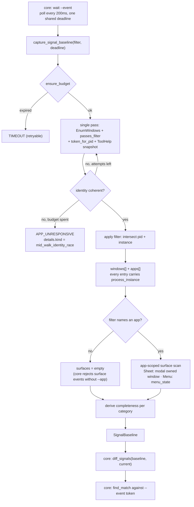
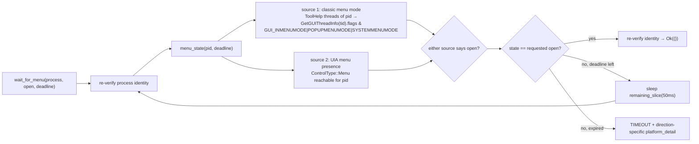

# Signals & Wait Parity (Sub-phase 2.11) - Plan

## Goal Capsule

- **Objective:** Make the already-shipped `wait` command work on Windows the way it works on macOS. Two adapter methods are unimplemented and both fall to core defaults that fail hard: `SystemOps::capture_signal_baseline` (`crates/core/src/adapter/system.rs:107-113`) makes every `wait --event` return `PLATFORM_NOT_SUPPORTED` on its first poll, and `SystemOps::wait_for_menu` (`:169-176`) makes every `wait --menu` / `wait --menu-closed` fail the same way. Neither is a new product surface: `diff_signals` is pure, platform-neutral, and fully tested in core (`crates/core/src/signals.rs`), the CLI flags exist, and macOS has served both since U17. **v0.8.0 raised the stakes:** `launch` no longer waits for a window it did not cause, and the shipped documentation now names `wait --event window-opened` as the way to wait for one on your own terms (`skills/agent-desktop/references/commands-system.md`). On Windows that instruction currently returns `PLATFORM_NOT_SUPPORTED`, so this sub-phase supplies the command the product already tells agents to use. 2.11 supplies the Windows observations those settled consumers need — a coherent windows/apps/surfaces inventory per poll, and a menu-open predicate the platform does not offer as a single query.
- **Authority hierarchy:** `docs/phases.md` §2.11 > `probes/windows/FINDINGS.md` (`api-contract` rows, and `app/provider` rows only where the row records its environment dependency) > vendor documentation cited in this plan > this plan > implementer judgment. Where measured evidence contradicts a document, U11 amends the document in this same PR. Probe rows whose expectation text names a stale sub-phase number are cited by row id; obligations come from `docs/phases.md`, never a row's stale sub-phase name.
- **Stop conditions:** Do not build the push `watch` command or `watch_element` (P2-O11) — `wait --event` is an in-invocation baseline diff and this sub-phase adds no event handlers, no `SetWinEventHook`, and no UIA event subscription. Do not build the WinForms fixture app, the Windows e2e harness, or the self-hosted interactive runner (§2.12). Do not extend `snapshot --surface` to new kinds (§2.14, KTD7). Do not touch `crates/macos`. Do not add a `#[cfg(windows)]` to `crates/core`: CI pins the count at exactly two shims in `crates/core/src/private_file.rs` and fails on a third (`.github/workflows/ci.yml:306-329`). **2.11 needs zero `crates/core` changes** — both trait methods exist with defaults, every payload type is settled, and the diff algorithm is already written and tested.
- **Execution profile:** One PR from `feat/windows-2.11-signals-wait-parity` into `feat/windows-adapter`, never `main`. Windows-crate diff plus probe corpus, one CI workflow registration, and docs — **no manifest change at all** (KTD6). Conventional Commits, authored by Lahfir, no co-authors. **The origin's `~1k LOC` estimate is low and U12 corrects it in place:** a single-pass inventory, a surface enumerator, a two-source menu detector, a menu fixture the crate does not have, and the test bodies that make each falsifiable put this at **≈1.5-1.8k lines** of hand-written Rust — still inside the ~2k sub-phase guidance, so this is a correction to the recorded number, not a request to exceed the guidance.
- **Tail ownership:** The implementer opens the PR against `feat/windows-adapter` and reports the Verification Contract results.

---

## Product Contract

### Summary

`wait --event` is a poll-and-diff loop that core already owns end to end: it captures a `SignalBaseline` at wait start, captures another every 200ms, hands both to the pure `diff_signals`, and matches the first resulting `UiEvent` against the requested `--event` token. The adapter's entire job is to answer one question honestly and quickly — *what does this desktop look like right now* — and every hard part of this sub-phase follows from the fact that core trusts that answer completely. An inventory that omits a live window produces a fabricated `window-closed`; one that returns an entity core did not ask for aborts the wait with `STALE_REF`; one that returns an unrecognised error code aborts the wait outright; one that takes the whole deadline has its correct answer discarded unread. `wait --menu` is the other half and a different shape: core makes exactly one adapter call and the adapter owns the entire polling loop, against a platform that — unlike macOS's `AXMenu` — offers no single authoritative "is a menu open" query. 2.11 ships both against measured evidence rather than a specification reading, because the corpus has no row for either.

### Problem Frame

**Every hard constraint in this sub-phase comes from core's poll loop, and all of them are already written down in code this plan did not get to choose.** `crates/core/src/commands/wait_event.rs` is 279 lines and four of them govern the design:

1. **The retryable set is closed at three codes.** `is_retryable` (`:222-227`) admits `Timeout | ElementNotFound | AppUnresponsive`; every other `Err` hits `Err(err) => return Err(AppError::Adapter(err))` (`:87`) and **aborts the entire wait**. The two inventories Windows ships today would both trip this: `list_windows_live` returns `WindowNotFound` when a window's owning process changes mid-walk (`crates/windows/src/system/window_ops.rs:100-112`), and `list_apps_live` returns `AdapterError::internal` on two distinct mid-listing races (`app_ops.rs:130-142`). Neither code is retryable. That this race is *reachable* is not a hypothesis: the crate's own live test retries the listing five times because of it and documents the retry as necessary (`window_ops.rs:242-279`, `LISTING_RACE_ATTEMPTS = 5`). A thirty-second `wait --event` on a busy desktop polls ~150 times, and one race kills it.
2. **A late `Ok` is discarded.** Core re-checks `deadline.is_expired()` immediately after the adapter returns and throws away a correct observation that arrived past the deadline (`:51-59`), invert-verified by `wait_event_deadline_tests.rs::late_matching_observation_is_discarded`. The `deadline` handed to the adapter is the **whole wait's** deadline, unchanged, on every poll — so it is a ceiling, never a budget to spend. An adapter that treats thirty seconds as thirty seconds of work returns nothing usable.
3. **`validate_signal_scope` is strict and terminal.** When `filter.process` is set, every app, window, **and** surface in the returned baseline must carry that exact pid and `process_instance`, or core returns `STALE_REF` with `retryable: false` and aborts (`:158-196`). A `WindowInfo` with `process_instance: None` fails this too, since `None != Some(expected)`.
4. **A missing `process_instance` makes an entity invisible.** `diff_signals` keys window identity on `(pid, process_instance, id)` and app identity on `(pid, process_instance)` through `filter_map`s that silently drop `None` (`crates/core/src/signals.rs:51-56, 141-145`). An adapter that cannot produce the token does not degrade loudly — it produces an inventory whose lifecycle events never fire.

**The two shipped Windows inventories are the right primitives with the wrong semantics, and that is why this sub-phase composes rather than wraps.** `list_windows_live` and `list_apps_live` are correct for the commands they serve — `list-windows` and `list-apps` are user-facing inventories where an honest refusal beats a half-identified row. The signal path needs the opposite disposition on three axes: a transient race must not be terminal, a process filter must intersect rather than substring-match, and the deadline must be honoured (both methods currently take `_deadline` and ignore it — `crates/windows/src/adapter.rs:160-170`). Composing a second consumer over the shared primitives (`window_enum::enumerate_top_level`, `window_ops::passes_filter`, `process_identity::token_for_pid`, `app_ops::process_snapshot`) satisfies all three without changing what the shipped commands do. Wrapping would also cost two full `EnumWindows` walks plus a ToolHelp snapshot per poll, because `list_apps_live` enumerates windows again internally (`app_ops.rs:88-97`) — every 200ms, against a desktop A16-1 measured at 147 top-level windows.

**`--app` does not mean the same thing at the three places core matches it, and on Windows one of them never matches at all.** `AppInfo.name` on Windows is the raw image name from `PROCESSENTRY32W.szExeFile` — `notepad.exe` (`app_ops.rs:143-148`). Core reaches an app three ways: `resolve_app` → `list_apps_scoped`, whose default filters `app.name.eq_ignore_ascii_case(name)` and which **Windows does not override** (`crates/core/src/adapter/observation.rs:50-68`; only macOS overrides it, `crates/macos/src/tree/adapter.rs:63`); `process_from_baseline`, which matches the same way over the seeded baseline (`wait_event.rs:142-145`); and `WindowFilter.app`, which `list_windows_live` matches by **substring** (`window_ops.rs:91`). So `wait --menu --app Notepad` fails `APP_NOT_FOUND` on Windows today while `--app notepad.exe` resolves, and the window filter would have accepted `--app note`. This is 2.9's shipped `list_apps` contract surfacing through a new command, not something 2.11 introduces — but 2.11 is the sub-phase that has to state what `--app` means before it writes a fourth matcher (KTD5).

**Windows has no `is_menu_open`, and the corpus has never measured what would substitute.** macOS answers the question with a per-process AX query for a visible `AXMenu` (`crates/macos/src/tree/surfaces.rs:210-213`). Windows has at least two partial signals and no measurement of either: `GUITHREADINFO.flags` carries `GUI_INMENUMODE` / `GUI_POPUPMENUMODE` / `GUI_SYSTEMMENUMODE` for a thread in classic menu-mode (all three constants confirmed present in the pinned `windows-sys-0.61.2`, `src/Windows/Win32/UI/WindowsAndMessaging/mod.rs:1457-1460`), and UIA exposes `ControlType::Menu` on a menu that is already open. The classic path is a modal message loop that WPF, WinUI and Chromium menus do not enter; the UIA path sees menus the flags miss. **Which source fires for which stack is unmeasured**, and `probes/windows/` has no row for menus at all — `grep` over the corpus returns nothing for `#32768`, `GUI_INMENUMODE`, `EVENT_SYSTEM_MENUSTART`, or `UIA_MenuOpenedEventId`. This is exactly the shape `CLAUDE.md` says to settle with a probe rather than a guess, so U1 measures both sources against four menu stacks before U5 chooses.

**No row in `probes/windows/FINDINGS.md` names sub-phase 2.11**, so the cross-cutting row-disposition obligation is discharged by verification rather than by work — stated here because "no rows named this sub-phase" and "nobody checked" are indistinguishable in a report that omits it. The probe corpus runs to area 22 and `.github/workflows/windows-capability-probe.yml` registers areas 14-22, so 2.11's area is **23** and must be registered in the same PR.

**The evidence machinery is not clean, and the three defects compound.** All three were verified directly against the merged base (`c232035`), and all three are inherited rather than introduced here.

1. **A16-3 contradicts its own capture, and 2.11 builds on exactly that row.** The row states a ToolHelp snapshot "enumerates 132 processes … `Get-CimInstance Win32_Process` agrees at 132" (`FINDINGS.md:226`); the capture records `toolhelp_process_count: 133` and `cim_process_count: 133` (`probes/windows/16-observation/captures/observation-census-devbox.json`). The count is not load-bearing — the row's verdict is `CONFIRMS` either way, and its real content is that ToolHelp is a viable enumeration source, which holds. What matters is that A16-3 is the row establishing the process-enumeration source this sub-phase's inventory reads (R2), so 2.11 cites it and must not cite a row that reads false.
2. **The gate 2.10 built to catch this class audits 12% of the ledger.** `13-ledger-check.ps1` gained a row-versus-capture content check in 2.10 precisely because A16-1 and A16-9 had shipped contradicting their captures. Running it on the merged base reports `CaptureContentRowsAudited: 20` against `RowCount: 165`, with `CaptureContentFailures: []` — while A16-3's mismatch sits in the file unflagged. The reason is structural: `Test-RowCaptureContent` audits a row only when it both cites a capture *leaf filename* and quotes `field: value` pairs (`13-ledger-content.ps1`, `Get-QuotedFieldValuePairs` / `Get-CitedCaptureLeaves`), and everything else is prose-only exempt. A16-1 was corrected into the quoted form and is now audited; A16-3 states its numbers in prose and cites a script name, so **the phrasing that produces the defect is the phrasing the gate ignores**. This is `a-test-that-cannot-fail-is-not-coverage.md`'s shape applied to the gate itself, and it is why the fix here is coverage, not another row correction.
3. **`13-ledger-check.ps1` runs in no CI workflow, and it is red on the merged base.** `grep` over `.github/workflows/` finds no reference to it, so it is a manually-run probe script whose failures are invisible. On `c232035` it exits 1 with three failures: `A18-3` and `A18-9` are `DEFERRED` rows carrying no `closure: 2.<n>` tag, and the `docs/phases.md` hunk-index bijection measures 104 hunks against 62 indexed rows. The bijection failure needs a decision rather than a patch: the check diffs against `main`, and under the platform delivery model `main` is an entire phase behind `feat/windows-adapter`, so the measured hunk count grows with every merged sub-phase by construction. U1 settles whether that check is meaningful on a phase branch or is comparing against the wrong base.

### Requirements

Signal baseline:

- R1. `capture_signal_baseline(filter, deadline)` returns a `SignalBaseline` whose `windows`, `apps`, and `surfaces` are a coherent observation of one instant, with `completeness` truthfully reporting which categories are trustworthy. Core owns the diff (`crates/core/src/signals.rs`); the adapter never decides what changed.
- R2. **Windows and apps come from one enumeration pass.** `AppInfo` carries a `presentation` field as of v0.8.0; Windows leaves it `None` on both the `list_apps` and the signal path, because the inventory proves a window-owning process rather than taskbar registration, and `diff_apps` keys on `(pid, process_instance)` so the field never affects an event. A single `EnumWindows` walk plus one ToolHelp snapshot produces both inventories, so the two agree with each other by construction and the per-poll cost is one walk rather than two. The pass reuses the shipped primitives — `window_enum::enumerate_top_level`, `window_ops::passes_filter` (the A16-1 filter), `process_identity::token_for_pid`, `app_ops::process_snapshot` — and does not alter what `list_windows` and `list_apps` return.
- R3. **Every returned `WindowInfo` and `AppInfo` carries a `process_instance`.** An entity whose generation token cannot be read is not emitted with `None` — core's `filter_map` would drop it anyway and `validate_signal_scope` would abort on it — so it is excluded from the inventory and the exclusion is **counted**. The count is observability, not a completeness signal: it does **not** flip the category's `completeness` bit (R11 explains why, and why the opposite rule would disable the feature outright). `SurfaceSignal.process_instance` is non-optional and is never fabricated.
- R4. **The filter intersects.** When `filter.process` is set, only entities matching that exact pid **and** `process_instance` are returned — windows, apps, and surfaces alike — so `validate_signal_scope` (`crates/core/src/commands/wait_event.rs:158-196`) passes on a correct observation instead of aborting the wait. When only `filter.app` is set (the `app-launched` case, the one place core deliberately leaves `process` unresolved), entities are matched by the `--app` predicate R10 defines. When neither is set, the inventory is the full agent-facing population.
- R5. **The `Err` set is closed and narrow.** `capture_signal_baseline` may return only `TIMEOUT`, `ELEMENT_NOT_FOUND`, or `APP_UNRESPONSIVE` — the three codes core retries (`wait_event.rs:222-227`). Any other code aborts the whole wait, so a transient mid-walk identity race must never surface as `WINDOW_NOT_FOUND` or `INTERNAL` the way the shipped inventories report it. The race is absorbed by a bounded internal re-walk and, if still unresolved, reported as a retryable code carrying its true cause in `details` (KTD3).
- R6. **The deadline is a ceiling, not a budget.** The capture returns as soon as it has an answer and never spends the wait's remaining time; core discards an `Ok` that arrives after the deadline (`wait_event.rs:51-59`). Every native call opens with the `permissions::ensure_budget(deadline)` preamble the crate already uses, and the per-poll cost is measured rather than assumed (R13).
- R7. **Surfaces are app-scoped and honest.** Core rejects `--event surface-appeared|surface-dismissed` without `--app` (`crates/core/src/commands/wait_mode.rs:168-177`), so the surface enumerator is only ever asked about a named process and never walks the whole desktop. It produces `SnapshotSurface::Sheet` for a modal owned window — the same notion `crates/windows/src/tree/surfaces.rs` already resolves via `WindowIsModal` — and `SnapshotSurface::Menu` for an open menu, with a `SurfaceSignal.id` stable across the two captures `diff_surfaces` compares.

Menu wait:

- R8. `wait_for_menu(process, open, deadline)` polls until the target process's menu-open state equals `open`, then returns `Ok(())`; on deadline expiry it returns `TIMEOUT` with a direction-specific `platform_detail`. Core makes exactly one call and owns no retry (`crates/core/src/commands/wait.rs:114-132`), so the loop, its interval, and its timeout are the adapter's. Process identity is re-verified immediately before success is declared, mirroring macOS (`crates/macos/src/system/wait.rs:13,16`), so a target that died between the read and the return does not report a satisfied wait.
- R9. **Menu detection is chosen by measurement, not by specification reading.** The detector combines the sources U1 proves necessary across four stacks (Win32/WinForms, WPF, WinUI/UWP where present, Chromium/Electron). A stack no source detects is recorded as a known limitation with its evidence row, never papered over with a detector that returns a plausible answer it cannot support.

Both:

- R10. **`--app` on Windows means the process image name**, case-insensitively (`notepad.exe`), and the signal path matches it the same way `list_apps_scoped`'s default does, so a name that resolves for `wait --menu` also scopes `wait --event` and vice versa. The asymmetric substring match `list_windows_live` applies to `WindowFilter.app` is not extended to the signal path.
- R11. **`completeness` reports whether the enumeration ran to completion — not whether every entity was identifiable.** The bit is `true` when the walk finished within budget and the category was actually gathered; it is `false` when the walk was truncated or the category was not scanned. A per-entity identity exclusion (R3) does **not** flip it.

  **This distinction is load-bearing and the opposite rule would disable the feature.** Core seeds the baseline from the first successful capture and holds it for the wait's lifetime (`crates/core/src/commands/wait_event.rs:29-37, 64-67`), and `diff_signals` skips `diff_windows` **and** `diff_focus` whenever *either* side's `completeness.windows` is false (`crates/core/src/signals.rs:13-16`). So a bit set false in the seed is false for the whole wait, and `wait --event window-opened` / `window-closed` / `focus-changed` can never fire — it runs the clock out and reports `TIMEOUT` indistinguishable from "the event did not happen". On a real desktop at least one window is typically owned by a protected or higher-integrity process whose token this process cannot read, so an exclusion-flips-the-bit rule would make the feature time out on every invocation on most machines.

  The distinction is also *correct*, not merely convenient. What `completeness` protects against is a capture that is missing entities which genuinely exist, because those read as closed or terminated. A **deterministic** identity exclusion is absent from both the baseline and every later capture, so the diff never sees it appear or disappear and no phantom event is possible. A **transient** exclusion — present in one capture, absent from the next — is the same phenomenon as the mid-walk identity race and is absorbed by KTD3's bounded re-walk, not by the completeness bit. Truncation is the case the bit exists for, and it is the case it now reports.
- R12. Tests are falsifiable and do not assert machine-specific or application-specific facts — no window count, desktop shape, coordinate, pid, timing, or app name. Lifecycle assertions are driven by fixtures the test itself spawns and terminates, so an event's presence is caused by the test rather than by whatever else the desktop was doing.
- R13. Probe **area 23** measures what this sub-phase would otherwise assume — menu-detection sources per stack, the mid-walk race rate, single-pass capture cost, and surface classification — and is registered in `.github/workflows/windows-capability-probe.yml` in the same PR, both the `paths` filter and a run step, per the cross-cutting DoD.
- R14. **The evidence machinery this sub-phase cites is left green and actually covering.** A16-3 is corrected against its capture; `13-ledger-check.ps1`'s content check is extended so a row stating a measured value in prose is audited rather than exempt, with the coverage reported as a count so "audited 20 of 165" is visible instead of implied; the two untagged `DEFERRED` rows are tagged; the `docs/phases.md` hunk-index bijection is either fixed or its base corrected for the phase-branch model; and the gate runs somewhere that fails a build, so its verdict stops depending on someone remembering to run it.
- R15. Statements in `docs/phases.md` this sub-phase's evidence disproves or completes are corrected in place in this PR, each citing its evidence.

### Key Decisions

- **2.11 is planned as `docs/phases.md` defines it, with contradictions corrected rather than planned around.** (session-settled: user-directed — the standing instruction across this phase; research already found that §2.11's exit criterion names an e2e the harness sub-phase has not built and which depends on this one.) Governs R15. See KTD8, U12.
- **Correctness is established by running it, not by unit tests alone.** (session-settled: user-directed — carried forward from 2.2-2.10.) Governs R12. See U8, U10.
- **No test asserts a machine-specific or application-specific fact.** (session-settled: user-directed, carried forward.) Governs R12.
- **This sub-phase is the first held to the dogfood gate in its strict form.** (session-settled: user-directed — the DoD written into `docs/phases.md` §Cross-cutting sub-phase DoD states it takes force from §2.11 onward.) A report with no findings is a failed dogfood; every finding takes exactly one of three dispositions; "recorded" is not one of them. Governs the Definition of Done. See U10.
- **An observation the consumer cannot distrust must not be approximated.** Core hands `capture_signal_baseline`'s answer straight to a pure diff with no plausibility check of any kind, so a wrong inventory becomes a wrong event with no intervening judgment. That asymmetry — cheap to get subtly wrong, impossible for the consumer to catch — is why R3 excludes rather than guesses, R5 narrows the error set, and R11 derives `completeness` instead of asserting it.

### Scope Boundaries

- **Out:** the push `watch` command, `watch_element`, `EventKind`/`ElementEvent` as *subscription* types, and every UIA or Win32 event handler (P2-O11). `docs/phases.md:1253` states the distinction and this plan restates it: `wait --event` is an in-invocation baseline diff. No `AddAutomationEventHandler`, no `SetWinEventHook`, no MTA event worker thread lands here.
- **Out:** the WinForms fixture app, the Windows live e2e harness, the self-hosted interactive runner, and everything that needs a second monitor or a genuinely split-integrity session — §2.12 (`docs/phases.md:1263-1294`). 2.11 proves itself with fixture-driven lib tests plus a judged dogfood run, the standard 2.7-2.10 used.
- **Out:** extending `snapshot --surface` to `Menu` or any other new `SnapshotSurface` kind, and therefore out of `supported_surfaces()` — §2.14 (`docs/phases.md:1335`). KTD7 records why emitting a `Menu` *signal* does not imply advertising a `Menu` *snapshot surface*.
- **Out:** same-process HWND recycling within one poll interval. `diff_signals` keys window identity on `(pid, process_instance, id)` where `id` is `w-{hwnd}`, so a window destroyed and its HWND reused by another window of the same process inside 200ms is invisible to the diff. §2.12.1 owns exactly this hazard and its fix is a `RefEntry` schema addition (`docs/phases.md:1296-1314`); nothing in 2.11 can close it without that field, and 2.11 does not widen its scope to try.
- **Out:** any change to `crates/macos`, and any change at all to `crates/core`. The `--app` alternation macOS applies in `filter_apps` is a latent multi-instance bug on that platform too (KTD4); it is named here and left alone, because a macOS behavioural change does not belong in a Windows sub-phase.
- **Out:** any `crates/windows/Cargo.toml` change. Every API this sub-phase calls is reachable through the currently enabled feature set (KTD6), and that is verified in U1 rather than assumed.

### Deferred to Follow-Up Work

**One item, and it clears `CLAUDE.md`'s bar on infrastructure that does not exist on any host this project can reach.** Everything else that looked deferrable is done here: the menu detector is measured rather than deferred to a sub-phase with a fixture app, the race semantics are fixed rather than left for hardening, and the AE6 analog is proven with the fixtures this crate already has rather than waiting for §2.12's harness.

- **Menu-detection coverage for stacks no host available to this sub-phase presents.** U1 measures the detection sources against Win32/WinForms, WPF, and Chromium/Electron menus, all of which the dev box and the hosted runner can stage. A WinUI 3 / modern-shell menu is the gap: A10-7 records that no environment measured to date carries a modern-shell population, and §2.4.1 exists precisely because UWP/WinUI targets are unreachable here. If U1 records `measurable: false` for that stack, the detector ships covering what was measured, the limitation is stated in the probe row, and **§2.12 owns closing it** — its self-hosted interactive runner and fixture app are the first rig able to present one, and U12 writes the menu-stack coverage leg into §2.12's scope and exit criteria in this same PR. This is a coverage gap in evidence, not an unimplemented code path: the detector's two sources ship and are unit-tested either way.

---

## Planning Contract

### Key Technical Decisions

- KTD1. **The 2.11 surface is two adapter methods with zero `crates/core` diff.** `SystemOps::capture_signal_baseline` and `SystemOps::wait_for_menu` both exist with `not_supported` defaults (`crates/core/src/adapter/system.rs:107-113, 169-176`) and Windows overrides neither. Everything downstream is settled and tested: `diff_signals` is pure and platform-neutral with its own suite (`crates/core/src/signals_tests.rs`, `signals_surface_tests.rs`), the poll loop and its timeout envelope are written (`wait_event.rs`), the CLI flags exist (`src/cli_args/system.rs:169-237`), and `EventKind::parse` accepts all seven tokens. A `crates/core` change is not merely unnecessary but actively forbidden: `.github/workflows/ci.yml:306-329` fails the build on any `cfg(windows)` in core outside `private_file.rs`.
- KTD2. **The signal inventory is a new composition over the shipped primitives, not a wrapper over `list_windows_live` / `list_apps_live`.** The two shipped inventories are correct for `list-windows` / `list-apps`, where refusing a whole listing on a mid-walk identity race is the honest answer to a user who asked for an inventory. The signal path needs different semantics on three independent axes — race tolerance (KTD3), a strict intersecting process filter (KTD4), and an honoured deadline, which both shipped methods currently ignore outright (`crates/windows/src/adapter.rs:160-170` take `_deadline`) — so wrapping them would mean bending three behaviours the shipped commands depend on. Composition over `window_enum::enumerate_top_level`, `window_ops::passes_filter`, `process_identity::token_for_pid` and `app_ops::process_snapshot` keeps both consumers honest and costs **one** `EnumWindows` walk per poll instead of two: `list_apps_live` enumerates windows again internally (`app_ops.rs:88-97`), so the naive composition would walk a 147-window desktop (A16-1) twice every 200ms. Deriving both inventories from one pass also makes them mutually coherent at one instant, which is what the diff compares.
- KTD3. **A mid-walk identity race is absorbed by a bounded re-walk and then reported as retryable — never by dropping the racing entry, and never by widening core's retryable set.** Three options were considered and two are rejected on the record.
  - **Rejected: drop the entry and continue.** A live window transiently unverifiable in poll N and present again in poll N+1 leaves the baseline set and re-enters it, so `diff_signals` emits a `WindowOpened` for a window that never opened, `find_match` matches it, and `wait --event window-opened` returns `found: true` for an event that did not happen. That is a false positive on this sub-phase's own exit criterion, and it is silent.
  - **Rejected: add `WindowNotFound` to core's `is_retryable`.** It is a one-line change that fixes the symptom, and it changes shipped macOS `wait --event` behaviour from a core file, against `CLAUDE.md`'s no-core-rewrites rule. The adapter conforming to core's contract is the pattern already in the tree: macOS maps its own mid-capture identity failure onto `AppUnresponsive` rather than widening core (`crates/macos/src/system/signals.rs:116-125`).
  - **Chosen:** the capture re-walks internally up to a small named constant of attempts, and on exhaustion returns `APP_UNRESPONSIVE` — the code macOS uses for the analogous condition — with `details` naming the true cause (`kind: "mid_walk_identity_race"`). Core records it as `last_error`, keeps polling, and surfaces it inside the timeout envelope if the wait never fires, so the evidence is not lost. The re-walk is bounded by `ensure_budget` on each attempt so it cannot itself outlive the deadline.

  **The mechanism is already shipped and the race is no longer hypothetical.** Merging `main` into this branch surfaced it in a production path: the launch command's window observation failed a live test with `WINDOW_NOT_FOUND` / "The window's identity no longer matches its stored evidence", because a launch is precisely when a process is being created or terminated. `crates/windows/src/system/launch.rs` now carries `observe_window_once` with `LISTING_RACE_ATTEMPTS = 5` — the same bounded re-walk this KTD specifies, over the same `list_windows_live` refusal. U3 mirrors that shipped shape rather than inventing one, and the sighting replaces the live test's retry constant as the evidence that the race is reachable. It also shows how the race hides: the pre-merge test asserted `expect_err`, so it accepted the race as though it were the error the test meant to prove.
- KTD4. **The filter intersects `app` and `process`; Windows deliberately diverges from macOS's alternation.** macOS's `filter_apps` treats them as alternatives — if `filter.app` is `Some`, filter by name and ignore `process` (`crates/macos/src/system/signals.rs:71-88`). Copying that on Windows breaks the wait outright in a common case: core sets **both** fields for every non-`app-launched` wait (`wait_event.rs:132-135`), so `--app notepad.exe` with two Notepad instances running would return both pids, and `validate_signal_scope` would find the second pid, return `STALE_REF` with `retryable: false`, and abort (`wait_event.rs:178-194`). Windows image names collide far more readily than macOS application names — every instance of a program shares one `szExeFile` — so the alternation is a latent macOS bug and a routine Windows failure. Intersecting satisfies `validate_signal_scope` by construction. The macOS behaviour is named here and **not** changed: a cross-platform behavioural fix does not belong in a Windows sub-phase, and U11 does not edit macOS scope.
- KTD5. **`--app` on Windows is the process image name, and the signal path matches it exactly as `list_apps_scoped`'s default does.** Traced through all three sites core matches at, for `--app Notepad` against a running `notepad.exe`: `resolve_app` → `list_apps_scoped` (default impl, `eq_ignore_ascii_case` on `AppInfo.name`, **not overridden by Windows**) → no match → `APP_NOT_FOUND` "Application 'Notepad' was not found with exact process identity"; `process_from_baseline` → `eq_ignore_ascii_case` → no match; `WindowFilter.app` → substring → *would* have matched. For `--app notepad.exe` the first two match and the wait works. So the contract is the image name, it is already what 2.9 shipped for `list_apps`, and the signal path adopts the same predicate rather than adding a fourth semantics. **v0.8.1 added a canonical `AppInfo::matches_identifier` but it does not reach this path** — verified by grep, its only callers are the launch target match (`crates/core/src/commands/launch.rs:133`, `crates/macos/src/system/launch.rs:249`), while `list_apps_scoped`'s default and `process_from_baseline` both still compare `name` with `eq_ignore_ascii_case`. A reader who assumes the canonical predicate now governs `--app` everywhere would mis-trace this decision. **Rejected: override `list_apps_scoped` on Windows to also accept the stem** (`Notepad` → `notepad.exe`). It would make `--app Notepad` work and is genuinely more usable, but it changes app resolution for *every* Windows command — `close-app`, `focus`, `snapshot --app`, `press --app` — which is 2.9's contract and a wider blast radius than a wait sub-phase should take unreviewed. It is recorded as a finding for the dogfood to confirm from the outside, and U12 writes it into **§2.15**'s scope (Hardening & Integration Review), which is where a cross-command contract change belongs.
- KTD6. **Menu detection is two-source, probe-first, and needs no manifest change.** The corpus has no menu row and `grep` finds no `#32768`, `GUI_INMENUMODE`, `EVENT_SYSTEM_MENUSTART`, or `UIA_MenuOpenedEventId` anywhere in `crates/windows/src`, so U1 measures before U5 chooses. The two candidate sources and their reach:
  - **Classic menu mode.** `GetGUIThreadInfo(tid, &info)` with `info.flags & (GUI_INMENUMODE | GUI_POPUPMENUMODE | GUI_SYSTEMMENUMODE)`. All three constants are present in the pinned `windows-sys-0.61.2` under `Win32_UI_WindowsAndMessaging`, **already enabled** (`crates/windows/Cargo.toml:50`), and `GetGUIThreadInfo` is already called in this crate (`crates/windows/src/system/key_dispatch.rs:226-232`) — though only for `hwndFocus`/`hwndActive`, never `.flags`. **It must be called per target thread, not with `0`:** the existing call site passes `0`, which means *the foreground thread*, and `wait_for_menu` is asked about a named process that may not be foreground. Target threads come from a `TH32CS_SNAPTHREAD` ToolHelp enumeration filtered to the pid — `Win32_System_Diagnostics_ToolHelp` is already enabled (`Cargo.toml:44`) and already used for `process_snapshot`.
  - **UIA menu presence.** A `ControlType::Menu` element reachable for the process. `Win32_UI_Accessibility` is already enabled and the role map already covers `ControlType::Menu`/`MenuBar`/`MenuItem` (`crates/windows/src/tree/roles.rs:61-63`).
  Classic mode is a modal message loop that WPF, WinUI, and Chromium menus do not enter; UIA sees those but costs a cross-process read. **Zero Cargo features are added** — verified against the pinned crate sources, not inferred — which is why this sub-phase carries no manifest diff.
- KTD7. **A `Menu` surface *signal* does not imply a `Menu` *snapshot surface*, and `supported_surfaces()` is not touched.** Core never validates `SurfaceSignal.kind` against `supported_surfaces()`. Its only consumers are `status`'s report (`crates/core/src/commands/status.rs:40`) and `surface_scope::require_supported` (`crates/core/src/commands/surface_scope.rs:31`), which `snapshot` (`snapshot.rs:78`) and `find` (`find.rs:57`) call to validate a *requested* surface — verified by grep across `crates/core` and `src`. The signal path reaches none of them. Adding `Menu` to the Windows list would therefore not enable anything in the signal path, and *would* make both `snapshot --surface menu` and `find --surface menu` claim support the adapter does not have: `crates/windows/src/tree/surfaces.rs:56` refuses every kind outside `Window`/`Focused`/`Sheet`, so `status` would advertise a capability that errors on use. The signal path emits `Menu` and `Sheet` `SurfaceSignal`s; `supported_surfaces()` stays `[Window, Focused, Sheet]` and its pinning test (`crates/windows/src/adapter.rs:269-279`) stays green unchanged. Extending `snapshot --surface` is §2.14's, and U12 records the asymmetry there so the next planner reads it as a decision rather than an oversight.
- KTD8. **The AE6 analog is a fixture-driven in-crate test, and §2.11's exit criterion is corrected to say so.** The origin reads "an AE6-analog e2e passes" (`docs/phases.md:1259`), but the Windows e2e harness is §2.12's deliverable and **§2.12 depends on §2.11** (`docs/phases.md:1290`), so this sub-phase cannot discharge an obligation phrased against a harness that does not exist and cannot exist before it. AE6 itself is `wait --event surface-appeared --app TextEdit` discovering an unnamed dialog (`docs/plans/2026-07-03-001-feat-foundation-playwright-grade-contract-plan.md:79`). The Windows analog is proven in-crate: a `HostedFixture` child opens a modal owned window mid-wait, and the wait reports the new surface without the caller naming its title or id — plus the `window-opened` form, since a Windows dialog is a real top-level HWND and both paths should fire. U12 rewords the exit criterion to the fixture-driven analog and writes the harness re-run into §2.12's scope, which already owns porting the e2e contract.
- KTD9. **`wait --window`'s shared race-abort defect is fixed at the adapter, and the fix is scoped to not change `list_windows`' contract.** `wait_for_window` polls `adapter.list_windows` with a retryable set of `Timeout | ElementNotFound` (`crates/core/src/commands/wait.rs:151-164, 259-261`), so `list_windows_live`'s mid-walk `WindowNotFound` aborts that wait on a busy desktop today — the same defect as R5, on a command this sub-phase's goal line explicitly covers ("the existing `wait` command works identically cross-platform"). **Chosen:** `list_windows`' *adapter entry point* gains the same bounded re-walk KTD3 defines, so a transient race is retried internally instead of surfacing; a race that survives the budget still returns `WindowNotFound`, so the shipped refusal semantics and its live test (`window_ops.rs:256-324`) are unchanged in kind. **Rejected: leave it and record it as owned elsewhere** — it is inside this sub-phase's stated goal, the fix is the mechanism this sub-phase is already building, and deferring it would be the convenience deferral `CLAUDE.md` forbids. The entry point also stops ignoring its `deadline` (KTD10). **There will be three candidate homes for this re-walk by the time U9 runs** — U3's inventory, `launch.rs`'s `observe_window_once`, and `list_windows`' entry point — so U9 consolidates them onto one helper rather than adding a third copy; a retry budget that drifts between call sites is the shape that makes one of them silently stop retrying.
- KTD10. **`list_windows` and `list_apps` begin honouring the deadline they already accept.** Both adapter methods take `_deadline` and drop it (`crates/windows/src/adapter.rs:160-170`), while `enumerate_top_level`'s per-window work opens a process handle for the token and the image name (`window_ops.rs:31-32`) — unbounded work under a budget the caller supplied and the callee ignores. §2.11's scope names "wait utilities operating within `Deadline` budgets, matching the core-owned deadline propagation", and these two are what every `wait --window` poll and every `resolve_app` call runs through. The fix is the `ensure_budget` preamble plus a mid-loop check on the enumeration callback, matching the shipped house style (`crates/windows/src/system/process_state.rs:140-153`), and it changes no return shape.
- KTD11. **Placement and file governance.** New code lands under `crates/windows/src/system/` per `CLAUDE.md`'s platform folder rules: `signals.rs` (the `capture_signal_baseline` entry point, filter application, `completeness` derivation), `signal_inventory.rs` (the single-pass windows+apps walk and the bounded re-walk, KTD2/KTD3), `signal_surfaces.rs` (the app-scoped `SurfaceSignal` producer, R7), `menu_state.rs` (the two-source menu predicate, KTD6), and `wait.rs` (`wait_for_menu`'s poll loop, R8). The menu fixture lands under `crates/windows/src/tree/` as a **new file** — `fixture_menu.rs` — because `fixture_window.rs` is at exactly 400 lines and `fixture.rs` at 376, so neither has room, and discovering that mid-implementation is how a hard cap becomes a compression instead of a split. Every new file gets a `*_tests.rs` sibling and stays under 400 lines from birth. Every native call opens with `permissions::ensure_budget(deadline)` (`crates/windows/src/system/permissions.rs:149-155`). Any COM-touching unit test calls `crate::tree::fixture::bootstrap()`, never `ensure_owned_process_mta_and_dpi` — the latter is documented as wrong in tests because `CoInitializeEx` is thread-local while that guard is process-wide (A14-10: 17 of 62 tests failed this way). Failure mapping goes through `hresult::{hresult_record, classify_read_hresult}` so `platform_detail` keeps Engineering Invariant 8's shape; Win32 failures from `GetGUIThreadInfo` / ToolHelp are `GetLastError` codes, not HRESULTs, and reuse whichever wrapping convention §2.9 settled for `CreateProcessW` rather than inventing a second one.

- KTD12. **The ledger gate's coverage is fixed, not just the row it missed.** A16-3 is the third row found contradicting its capture after A16-1 and A16-9, and the second found *after* 2.10 shipped a gate specifically to catch the class — so correcting A16-3 alone would repeat the mistake `fix-the-class-not-the-reported-instance.md` names, and would leave the gate reporting a clean audit over 20 of 165 rows. The defect predicate is **"a row asserts a measured value its cited capture does not carry"**, and the current check narrows it to rows that happen to quote `field: value` pairs against a named capture leaf. Three changes, in order of what each buys:
  - **Report the coverage.** `CaptureContentRowsAudited: 20` against `RowCount: 165` is already computed and already written to the capture, and it still read as a pass. Surfacing audited-versus-total in the gate's own console verdict is the cheapest change and the one that makes a coverage regression visible at all.
  - **Widen the audit to prose-stated values.** A row citing a script rather than a capture leaf still has a discoverable capture — the area directory is in the row's own script path — and a prose number (`enumerates 132 processes`) is matchable against the capture's leaves. Rows that genuinely assert nothing measurable stay exempt, and that exemption is exercised by a test so it cannot silently swallow a real row.
  - **Make the verdict binding.** The gate runs in no workflow (`grep` over `.github/workflows/` finds no reference), which is why it sits red on the merged base with nobody notified. **Chosen:** register it in the capability-probe lane alongside area 23, so it fails a build. **Rejected: add it to the main CI lane** — it reads the probe corpus and `git diff` against another branch, which is the capability lane's concern, not the per-PR compile-and-test lane's.
  **This work is bounded, and the bound is pre-committed so it cannot expand into the feature's shipping gate.** The hunk-index bijection is the one open question, and its branch is decided in advance rather than left to discovery: if the answer is that the check compares against the wrong base under a delivery model where `main` is a whole phase behind, **correcting the base is in scope**; if the answer is that the check needs a redesign to mean anything on a phase branch, **that redesign is out of scope** — U1 disables that one check with a stated reason and a `FINDINGS.md` row, and U12 writes it into **§2.15**'s scope. What ships here is bounded to: one row correction, two closure tags, a coverage number in the verdict, one widened predicate with its fixtures, one workflow registration, and at most a base correction. A gate that cannot reach exit 0 inside that envelope is a finding for §2.15, not a reason to hold this PR.

  Every change here ships under `a-verification-gate-is-code-and-needs-its-own-test.md`'s terms — MUST-CATCH / MUST-PASS self-tests driving the gate's real program text, with A16-3's own prose form as a MUST-CATCH fixture.

### Error and Disposition Mapping

Every failure mode of the two methods, mapped to an existing `ErrorCode`. No new error code is introduced. `capture_signal_baseline` is an observation, so it carries no `DeliverySemantics` — the column records what core does next, which is the property that actually matters for a poll loop.

| Method | Condition | Code | Core's response |
|---|---|---|---|
| `capture_signal_baseline` | deadline already expired on entry | `TIMEOUT` | retried; recorded as `last_error` |
| `capture_signal_baseline` | mid-walk identity race, re-walk budget exhausted | `APP_UNRESPONSIVE` | retried; `details.kind = "mid_walk_identity_race"` |
| `capture_signal_baseline` | target process gone while filtering to it | `APP_UNRESPONSIVE` | retried — a terminated target is the `app-terminated` signal, not a failure |
| `capture_signal_baseline` | ToolHelp snapshot fails | `APP_UNRESPONSIVE` | retried; `details` names the Win32 error |
| `capture_signal_baseline` | surface read blocked by a non-pumping target | `APP_UNRESPONSIVE` | retried |
| `capture_signal_baseline` | enumeration cannot complete within the deadline | `TIMEOUT` | retried |
| `capture_signal_baseline` | *(no other code may be returned — R5)* | — | any other code **aborts the wait** |
| `wait_for_menu` | menu state not reached before the deadline | `TIMEOUT` | returned to the caller with direction-specific `platform_detail` |
| `wait_for_menu` | target process exited during the wait | `STALE_REF` | returned to the caller |
| `wait_for_menu` | process identity mismatched at success re-check | `STALE_REF` | returned to the caller |
| `wait_for_menu` | thread enumeration fails | `APP_UNRESPONSIVE` | returned to the caller |
| `wait_for_menu` | target not dispatching messages, so the UIA menu read would block | `APP_UNRESPONSIVE` | returned to the caller |

Two rows above are load-bearing and easy to get backwards. **A terminated target during a filtered capture is retryable, not terminal:** `wait --event app-terminated --app X` resolves X's identity first, then polls; the poll where X is gone is the one that must produce the event, so the capture returns an empty filtered inventory with `completeness` intact rather than an error — the error row covers only the case where the *filtering itself* cannot be completed. **`wait_for_menu` has no retryable class at all**, because core applies no `is_retryable` filter on that path (`crates/core/src/commands/wait.rs:123-129`): every error is the command's error, so the adapter must not return a transient condition it could have absorbed itself.

### High-Level Technical Design

The two methods share the process-identity primitives and nothing else. `capture_signal_baseline` is one walk feeding three inventories; `wait_for_menu` is a poll loop over a two-source predicate.

The menu predicate is the piece with no macOS analogue, and its two sources have disjoint blind spots:

Directional only — U1's measurement decides whether both sources ship, and the source list is the plan's hypothesis, not its conclusion.

### Assumptions

- **The dev box and the hosted runner can both stage a Win32 menu, a WPF menu, and a Chromium/Electron menu.** Chromium is present on the dev box (A18-3 measured its shell shape) and WPF fixtures already exist (`AGENT_DESKTOP_LIVE_WPF`). If a stack cannot be staged, U1 records `measurable: false` with the branch named, and the Deferred item's condition fires.
- **`GetGUIThreadInfo` succeeds against a target process's threads at the same integrity level.** A9-2 measured that cross-integrity *reads* cross the UIPI boundary while writes do not, so a same-user, same-integrity read is expected to succeed; U1 records the actual result rather than relying on that inference.
- **The single-pass capture completes well inside a 200ms poll interval on a desktop of A16-1's size.** U1 measures it under the corpus cost methodology; a capture whose cost approaches the interval is a design finding, not a tuning problem, and would force a narrower default population.

---

## Implementation Units

Rows are listed in dependency order; U-IDs are stable identifiers, not sequence numbers.

| U-ID | Title | Key files | Depends on |
|---|---|---|---|
| U1 | Measure the signal and menu gaps (probe area 23) + repair the evidence machinery | `probes/windows/23-signals-menus/`, `FINDINGS.md`, `13-ledger-content.ps1`, `.github/workflows/windows-capability-probe.yml` | — |
| U2 | Menu and dialog test fixtures | `crates/windows/src/tree/fixture_menu.rs` | U1 (modal-classification leg) |
| U3 | Single-pass signal inventory (windows + apps) | `crates/windows/src/system/signal_inventory.rs` | U1 |
| U4 | Filter semantics and scope conformance | `crates/windows/src/system/signal_inventory.rs`, `signals.rs` | U3 |
| U5 | Menu-open predicate | `crates/windows/src/system/menu_state.rs` | U1, U2 |
| U6 | App-scoped surface signals | `crates/windows/src/system/signal_surfaces.rs` | U5 |
| U7 | `capture_signal_baseline` entry point + completeness | `crates/windows/src/system/signals.rs`, `adapter.rs` | U4, U6 |
| U8 | `wait_for_menu` poll loop | `crates/windows/src/system/wait.rs`, `adapter.rs` | U5 |
| U9 | Deadline and race hardening for the shipped inventories | `crates/windows/src/adapter.rs`, `window_ops.rs`, `app_ops.rs` | U3 |
| U10 | Live verification breadth + the AE6 analog | live lib tests | U7, U8, U9 |
| U11 | Dogfood both surfaces | `probes/windows/scratch/`, `docs/dogfood-reports/` | U10 |
| U12 | Correct what this sub-phase disproves | `docs/phases.md` | U1, U11 |

### U1. Measure the signal and menu gaps (probe area 23) + repair the evidence machinery

- **Goal:** Settle every question this sub-phase would otherwise assume, and leave the evidence machinery it cites both green and actually covering. The corpus has **zero** rows for menu detection, mid-walk race rates, enumeration cost under repeated polling, or surface classification; this unit produces them, registers the lane so a `-ci` label means what it says, and fixes the row-versus-capture gate that reported a clean audit while A16-3 sat wrong in the file.
- **Requirements:** R13, R14 (and measurement grounding for R2, R5, R6, R7, R9).
- **Dependencies:** none.
- **Files:** `probes/windows/23-signals-menus/probe.ps1`, `measure-cost.ps1`, capture JSON plus `.json.normalized` twins, `probes/windows/FINDINGS.md` (new `A23-*` rows **and the A16-3 correction**), `probes/windows/13-ledger-content.ps1`, `13-ledger-check.ps1`, `.github/workflows/windows-capability-probe.yml`.
- **Approach:**
  1. **Register the lane in the same edit that creates the area.** Add `probes/windows/23-signals-menus/**` to the workflow's `paths` filter, a run step matching the existing per-area shape, and the capture path to the artifact upload list. Areas 14-22 are registered; 23 is next and the cross-cutting DoD requires it in this PR.
  2. **Menu detection per stack — the leg that decides U5.** For each of Win32/WinForms, WPF, Chromium/Electron, and WinUI/UWP if the host presents one: open a menu bar menu and a context menu, and for each record (a) whether any thread of the owning process reports `GUI_INMENUMODE`, `GUI_POPUPMENUMODE`, or `GUI_SYSTEMMENUMODE`, (b) whether a `ControlType::Menu` element is reachable for that process, (c) whether a `#32768`-class top-level window exists, and (d) whether `window_ops::passes_filter` would admit that window into the ordinary window inventory. Leg (d) is not incidental: a menu popup that passes the filter appears in `SignalBaseline.windows` and produces a `window-opened` event every time any menu opens, which would make `wait --event window-opened` fire on menu activity. Record the answer rather than assuming `WS_EX_TOOLWINDOW` is set.
  3. **The mid-walk identity race, measured rather than inferred.** KTD3 sizes a re-walk budget from a constant the live tests already use; measure the actual rate. Run the enumeration in a tight loop for a fixed count on an idle desktop and again while a fixture spawns and terminates windows, and record how many iterations hit a token or ownership mismatch and how many re-walks cleared it. A rate that a 5-attempt budget does not clear is a design finding that changes KTD3's constant.
  4. **Cost, measured for every path the poll loop can take.** All under the corpus cost methodology (min-of-seven, warm-up discarded, min reported with median and max beside it, A15-13/A18-7):
     - **Single-pass capture**, unfiltered and filtered to one process — enumeration, per-window token and image-name reads, ToolHelp snapshot, assembly. This is the number the 200ms poll interval must accommodate.
     - **The two-walk composition it replaces**, so KTD2's single-pass claim rests on a measured delta rather than an argument.
     - **A capture that actually exercises the re-walk**, with the attempt count forced to its maximum. KTD3's budget means one poll can legally cost several times the single-pass number, and `ensure_budget` only guards the wait's overall deadline — never a per-poll 200ms budget — so the compounded cost is the one that matters on exactly the busy, race-prone desktop this sub-phase is built around. The Risks section's "a cost approaching the poll interval is a design finding, not a tuning knob" rule applies to **this** number, not only to the single-pass one.
     - **The menu predicate**, both sources separately: one ToolHelp-thread-enumeration-plus-`GetGUIThreadInfo` pass, and one UIA `ControlType::Menu` scan. `wait_for_menu` polls it every 50ms, so an unmeasured predicate cost is the same assumption the capture-cost leg exists to remove.
  4b. **How many windows are durably unidentifiable on a real desktop.** Count, across repeated captures on an ordinary working desktop, how many enumerated windows fail the identity read every time versus intermittently. The persistent count sizes the exclusion R3 accepts; the intermittent count is the race rate item 3 measures, seen from the other side. This number is why R11's completeness rule is what it is — if persistent exclusions are common, an exclusion-flips-the-bit rule would disable window and focus events on most machines, and the measurement says whether "common" is one window or forty.
  5. **Surface classification.** For a modal dialog opened by a fixture and by a real application, record what distinguishes it from an ordinary top-level window — owner window, `WS_EX_DLGMODALFRAME`, UIA `WindowIsModal`, `ControlType::Window` versus `Pane` — so U6's `Sheet` classification is written against observed properties rather than a specification reading. Record whether the same properties hold for a Chromium modal.
  6. **`GetGUIThreadInfo` reach.** Confirm the call succeeds against another process's threads at the same integrity level and record what it returns for a process with no GUI threads, so U5's error mapping is grounded.
  7. **Repair the evidence machinery this sub-phase cites (R14, KTD12).** Correct A16-3's `132` to the capture's `133` in both places. Then close the coverage hole that let it survive a gate built for its class: surface audited-versus-total rows in `13-ledger-check.ps1`'s verdict, widen `Test-RowCaptureContent` to audit prose-stated measured values against the capture reachable from the row's own script path, and keep a tested exemption for rows that assert nothing measurable. Tag the two `DEFERRED` rows the gate already flags (`A18-3`, `A18-9`) with their closure sub-phase. Settle the hunk-index bijection question — whether diffing `docs/phases.md` against `main` means anything on a phase branch that is an entire platform phase ahead of it — and take KTD12's pre-committed branch: correct the base if that is the answer, or disable that one check with a stated reason plus a `FINDINGS.md` row and hand the redesign to §2.15. Do not redesign it here. Register the gate in the capability-probe lane so its verdict fails a build instead of waiting for someone to run it. **Run the gate to green before the PR opens**; it exits 1 on the merged base today, so "green" is a change, not a restatement.
- **Non-goals for this unit:** the whole-ledger content sweep 2.10 performed is not repeated here. 2.10 audited the ledger and this unit's contribution is the *gate coverage* that makes the next such row fail automatically, plus the one row that coverage now catches. If the widened audit flags further rows when it runs, they are corrected here and counted in the unit's report — the sweep is the gate's output, not a separate manual pass.
- **Patterns to follow:** the area 21 and 22 probe structure; the corpus safety envelope (foreground-assert bracket, scratch-only windows, **no titles, paths, pids, machine names, or message text recorded**); the normalized-twin convention (`README.md`, 8-pixel bucket) so `run-all.ps1 -Compare` diffs empty; the area 17 non-empty-capture-before-citing lesson.
- **Test scenarios:**
  - Every `A23-*` row is written with its capture open beside it and quotes the field names and values the capture actually uses, so the row can be diffed against the JSON by anyone (`a-cited-measurement-must-match-its-capture.md`). `13-ledger-check.ps1`'s content check, landed by 2.10, must pass on every new row.
  - Each row records its environment dependency where the result is host-specific; the WinUI/modern-shell leg is expected to be `measurable: false` on both hosts (A10-7) and records the branch rather than omitting the stack.
  - A leg the host cannot run records `measurable: false` with a named branch, never a silent omission.
  - The workflow edit is verified by the run itself: the area-23 step appears in the run log and the area-23 captures upload as artifacts.
  - No capture contains a window title, a path, a pid, or a machine name.
  - `Test expectation: measurement only` **for the probe legs** — they produce evidence, not shipped behavior; their proof is the committed capture pair and the ledger rows. **The gate changes are ordinary code and carry the assertions below.**
  - The widened content check ships with a committed MUST-CATCH / MUST-PASS self-test built from the defect that motivated it: **a fixture row carrying A16-3's exact prose shape — a measured value stated in prose, disagreeing with its capture, citing a script rather than a capture leaf — must fail**, and the corrected row must pass. Without this fixture the widening is unproven against the only instance known to have evaded the previous rule.
  - The self-test drives the gate's real program text rather than a copy, so a later edit cannot leave the test passing against a stale duplicate (`a-verification-gate-is-code-and-needs-its-own-test.md`).
  - A prose-only row that asserts nothing measurable still passes, and that exemption is exercised by its own test so it cannot silently swallow a real row.
  - The gate's verdict reports audited-versus-total rows, and a test asserts the audited count rises after the widening — the falsifiable form of "coverage improved", which a change that merely reworded the rule would fail.
  - `13-ledger-check.ps1` **exits 0 on the branch.** It exits 1 on the merged base, so this is asserted as a state change rather than assumed.
- **Verification:** `FINDINGS.md` gains `A23-*` rows for per-stack menu detection, the menu-popup-versus-`passes_filter` question, the race rate and re-walk efficacy, single-pass and two-walk capture cost, modal classification properties, and `GetGUIThreadInfo` reach; A16-3 reads true against its capture; the content check audits materially more than 20 of 165 rows and fails on A16-3's uncorrected prose form; `A18-3`/`A18-9` carry closure tags; the hunk-index question is settled and the gate exits 0; the capability-probe workflow runs area 23 **and the ledger gate**, uploading their captures; every downstream unit cites a row rather than an assumption.

### U2. Menu and dialog test fixtures

- **Goal:** Every fixture this sub-phase's assertions name, built **before** the code under test. U5's menu predicate and U6's surface classification both need a menu and a modal the test controls, and the crate has neither. A scenario whose fixture has no owner is the one an implementer replaces with a weaker proxy under time pressure, and it then passes while proving nothing.
- **Requirements:** R12.
- **Dependencies:** U1's modal-classification leg (item 5) for the dialog fixture — the fixture must carry whatever property U1 measures as distinguishing a modal, or U6 asserts against a guess. The menu half depends on nothing and can start immediately.
- **Files:** `crates/windows/src/tree/fixture_menu.rs` (+ `fixture_menu_tests.rs`), with only re-export lines added to `fixture.rs`. **A new file is mandatory, not a preference:** `fixture_window.rs` is at exactly 400 lines and `fixture.rs` at 376, so neither has room for a menu procedure.
- **Approach:**
  1. A fixture window that owns a real Win32 menu — `CreateMenu`/`AppendMenuW` for a menu bar, `CreatePopupMenu`/`TrackPopupMenu` for a context menu — opened on command. `TrackPopupMenu` runs its own modal message loop and blocks the calling thread until dismissed, so the open command is posted to the fixture's pump thread and the fixture signals back that the menu is up; a test that called it inline would deadlock itself.
  2. Offer it in the `HostedFixture` child-process shape. A menu opened in the test's own process puts *the test's* thread into menu mode, which would make a per-process predicate trivially true for the wrong reason and is the in-process-provider hazard `fixture.rs:80-85` already documents for the walk.
  3. A dismiss command, so `wait --menu-closed` and the `surface-dismissed` direction have a driver rather than relying on a timeout.
  4. A modal dialog fixture for U6 — an owned window with `WS_EX_DLGMODALFRAME`, opened and closed on command — carrying **no title the test asserts on**, so the AE6 analog proves discovery without naming (R12).
  5. Expose the fixture's own state (menu up / menu down) as something the test can read independently of the predicate under test, so a failing assertion is unambiguous between a broken predicate and a broken fixture.
- **Patterns to follow:** the existing `LocalFixture`/`HostedFixture`/`StalledFixture` shapes (`crates/windows/src/tree/fixture.rs:86-298`) and the window-class plumbing in `fixture_window.rs`; the spawn handshake (`AGENT_DESKTOP_FIXTURE_HWND` on stdout) for readiness; `fixture::bootstrap()` for any COM-touching test (KTD11).
- **Test scenarios:**
  - The fixture's menu genuinely opens and closes, verified independently of `menu_state` — by the fixture's own reported state and by the presence of a menu window — so a later predicate failure is not ambiguous.
  - The fixture cleans up its menu, window, and class on drop, asserted by independent re-observation.
  - The modal fixture's window is owned and modal by the properties U1 measured, asserted against those properties rather than against a title.
  - Opening the menu in the child process does **not** put the test process into menu mode — the assertion that makes the per-process predicate meaningful, invert-verified by checking the test process's own threads report no menu flags while the fixture's do.
- **Verification:** both fixtures behave as specified and are independently observable before any predicate exists, so U5 and U6 assert against real fixtures from their first commit.

### U3. Single-pass signal inventory (windows + apps)

- **Goal:** One enumeration pass that produces mutually coherent `Vec<WindowInfo>` and `Vec<AppInfo>` for one instant, with every entry carrying a `process_instance`, and with the mid-walk race absorbed rather than fatal.
- **Requirements:** R2, R3, R5, R6.
- **Dependencies:** U1 (race rate, cost, the `passes_filter`-versus-menu-popup answer).
- **Files:** `crates/windows/src/system/signal_inventory.rs` (+ `signal_inventory_tests.rs`).
- **Approach:**
  1. One `enumerate_top_level` walk collecting each admitted window's handle, rect, and flags; one `app_ops::process_snapshot` for image names; one `token_for_pid` per distinct pid, cached across the walk so a process owning twelve windows is read once rather than twelve times. The shipped `list_apps_live` re-reads the token a second time per app for corroboration (`app_ops.rs:136-137`); the coherence that second read buys is obtained here by deriving both inventories from the same cached read at the same instant.
  2. A window whose owning pid, token, or image name cannot be read is **excluded**, and the exclusion is counted. It is never emitted with `process_instance: None` — R3 — because core's `filter_map` would drop it anyway and `validate_signal_scope` would abort on it.
  3. The apps inventory is the distinct set of owning processes of the admitted windows, matching the shipped "apps with a window" population so `list-apps` and the signal path agree about what an app is.
  4. **The bounded re-walk (KTD3).** If a window's identity is inconsistent within the pass — the pid or token changed between the walk and assembly — the whole pass is retried up to the budget U1 sized, each attempt gated by `ensure_budget`. On exhaustion, `APP_UNRESPONSIVE` with `details.kind = "mid_walk_identity_race"`. The racing entry is never simply dropped: KTD3 records why that fabricates events.
  5. `ensure_budget(deadline)` on entry and a mid-loop check inside the enumeration callback, matching `process_state.rs:140-153`'s house style, so the walk cannot outlive the deadline on a desktop with many windows.
  6. Report two distinct outcomes per category so U7 can derive `completeness` correctly (R11): **did the walk run to completion within budget**, which is what the bit reports, and **how many entities were excluded for unreadable identity**, which is counted for observability and deliberately does *not* touch the bit.
- **Patterns to follow:** `window_ops::list_windows_live` for the assembly shape and `window_info_from`'s field construction; `app_ops::list_apps_live` for the ToolHelp join; `permissions::ensure_budget` for the preamble; `process_state.rs:140-153` for the mid-loop deadline check.
- **Test scenarios:**
  - A `HostedFixture`'s window appears in the inventory with the fixture's pid, a non-empty `process_instance`, and an id that parses back to a handle; the same pid appears exactly once in the apps inventory. No window count or desktop shape is asserted (R12).
  - Terminating the fixture removes both its window and its app from a subsequent inventory — the property `window-closed` and `app-terminated` depend on.
  - Every returned window and app has `Some(non-empty)` `process_instance` — asserted over the whole inventory, so a regression that reintroduces `None` fails here rather than silently at diff time.
  - A window whose token read fails is excluded and counted, not emitted with `None` — driven through a seam that forces the read to fail, and invert-verified by making the exclusion emit `None` and watching the assertion fail.
  - The re-walk retries on a forced identity inconsistency and succeeds when the inconsistency clears; with the inconsistency held, it returns `APP_UNRESPONSIVE` with `details.kind = "mid_walk_identity_race"` — **never** `WINDOW_NOT_FOUND` or `INTERNAL`, which is the assertion that guards R5.
  - An already-expired deadline returns `TIMEOUT` before any enumeration — asserted by a seam that counts native calls, so "returned fast" is distinguished from "did the work and then checked".
  - The pass performs exactly one `EnumWindows` walk per capture, asserted through a call counter — the falsifiable form of KTD2's cost claim, which a later refactor to "just call the two shipped functions" would break.
  - Two inventories captured back to back with no desktop change produce identical identity sets — the stability `diff_signals` requires to avoid phantom events, and the property most likely to regress silently.
- **Verification:** the inventory is coherent, complete-or-honest, bounded by its deadline, and its error set is exactly the three retryable codes; the single-walk assertion fails if the implementation is replaced by a wrapper over the shipped inventories.

### U4. Filter semantics and scope conformance

- **Goal:** Make the filter intersect, so `validate_signal_scope` passes on a correct observation instead of aborting the wait, and make `--app` mean one thing across the signal path and `resolve_app`.
- **Requirements:** R4, R10.
- **Dependencies:** U3.
- **Files:** `crates/windows/src/system/signal_inventory.rs`, `signals.rs` (+ tests).
- **Approach:**
  1. When `filter.process` is `Some`, retain only entities whose pid **and** `process_instance` equal it exactly — windows, apps, and surfaces. KTD4 records why this diverges from macOS's alternation and why copying macOS would abort the wait whenever two processes share an image name.
  2. When only `filter.app` is `Some` — core's `app-launched` case — match `AppInfo.name` with `eq_ignore_ascii_case`, the same predicate `list_apps_scoped`'s default applies (R10, KTD5), and retain windows whose owning app matches the same way. The substring semantics `list_windows_live` uses for `WindowFilter.app` are deliberately not extended here.
  3. When both are set — what core actually constructs for every non-`app-launched` wait (`wait_event.rs:132-135`) — intersect both conditions.
  4. Filtering happens after assembly over already-identified entities, so an entity is never retained on a partially-read identity.
- **Patterns to follow:** `crates/macos/src/system/signals.rs:71-88` for the shape being deliberately diverged from; `crates/core/src/commands/wait_event.rs:158-196` for the exact conformance target.
- **Test scenarios:**
  - Given a hand-built inventory containing two entries sharing an image name and differing in pid, a `process`-filtered capture returns only the matching pid — the case that would abort the wait under macOS's alternation, asserted directly.
  - A `process`-filtered result passes `validate_signal_scope`'s own predicate: no returned window, app, or surface has a differing pid or instance. Asserted by reproducing core's check over the result, so the adapter is tested against the contract it must satisfy rather than against a paraphrase of it.
  - An `app`-only filter matches `notepad.exe` case-insensitively and does **not** match a substring (`note`), pinning R10's predicate in both directions.
  - An entity whose `process_instance` differs from the filter's while its pid matches is excluded — the process-generation case, which is the whole reason the token exists.
  - An empty filter returns the full agent-facing population unchanged.
  - Filtering to a process with no windows returns empty vectors with `completeness` intact, not an error — the `app-terminated` poll depends on this and the Error table calls it out.
- **Verification:** every filtered capture satisfies `validate_signal_scope` by construction, proven by a test that runs core's own condition over the adapter's output; the two-instance case fails without the intersection.

### U5. Menu-open predicate

- **Goal:** A per-process "is a menu open right now" answer on a platform that offers no single query for it, built from the sources U1 proved rather than the sources this plan guessed.
- **Requirements:** R9 (and the predicate R8's loop polls).
- **Dependencies:** U1 (which sources fire per stack), U2 (a menu to detect).
- **Files:** `crates/windows/src/system/menu_state.rs` (+ `menu_state_tests.rs`).
- **Approach:**
  1. **Classic menu mode.** Enumerate the target pid's threads via a `TH32CS_SNAPTHREAD` ToolHelp snapshot (already-enabled feature, already used by `process_snapshot`) and call `GetGUIThreadInfo(tid, ...)` for each, testing `flags & (GUI_INMENUMODE | GUI_POPUPMENUMODE | GUI_SYSTEMMENUMODE)`. **Per target thread, not `GetGUIThreadInfo(0)`** — the existing call site passes `0`, which asks about the foreground thread, and `wait_for_menu` is asked about a named process that may not be foreground. A thread that has exited between snapshot and read is skipped, not an error.
  2. **UIA menu presence**, for the stacks U1 shows classic mode misses — WPF, WinUI, and Chromium menus do not enter a classic modal menu loop. Scoped to the process and bounded by the deadline.
  3. Compose them as U1's evidence directs. If U1 shows one source covers every measurable stack, the second is not written — the plan's two-source hypothesis is not a commitment to ship two sources, and shipping an unnecessary one would be the over-engineering this sub-phase is explicitly avoiding.
  4. A stack no source detects is a recorded limitation with its row id, never a detector that returns a plausible answer it cannot support (R9).
  5. **The UIA source is pre-probed for a pumping message loop, because nothing outside this call can rescue it.** A `ControlType::Menu` read against a target that has stopped dispatching is the exact shape `docs/solutions/logic-errors/a-deadline-cannot-interrupt-a-blocking-os-call.md` records, and `wait_for_menu` is the worst place in the product to hit it: core makes **one** call and owns no retry (R8), so an in-flight block has no backstop at any layer and no `Deadline` recovers it. The shipped `window_enum::window_is_responsive` (`SendMessageTimeoutW(WM_NULL, SMTO_ABORTIFHUNG)`) gates the read, mapping a non-pumping target to `APP_UNRESPONSIVE` — the same guard `capture_window.rs:82` and `window_activate.rs:92` already wrap for their own blocking calls. The classic-mode source needs no such guard: `GetGUIThreadInfo` reads shared input state and sends nothing to the target.
  6. `ensure_budget` on entry and between sources; Win32 failures wrapped as `GetLastError` codes per KTD11.
- **Patterns to follow:** `crates/windows/src/system/key_dispatch.rs:220-244` for the `GUITHREADINFO` call shape; `app_ops::process_snapshot` for the ToolHelp iteration idiom; `crates/windows/src/system/window_enum.rs:225` (`window_is_responsive`) and its `ensure_window_is_pumping` wrappers at `capture_window.rs:82` / `window_activate.rs:92` for the pre-probe-then-`APP_UNRESPONSIVE` shape; `crates/macos/src/tree/surfaces.rs:210-213` for the contract being matched (a per-process boolean), **not** for its implementation.
- **Test scenarios:**
  - With the U2 fixture's menu open, the predicate reports open for the fixture's pid; with it closed, closed. The test drives the transition in both directions rather than observing one state.
  - The predicate reports closed for a process that has no menu open while another process does — the isolation property, and the one a `GetGUIThreadInfo(0)` implementation would fail. Invert-verified by switching the call to `0` and watching it fail.
  - A pid with no GUI threads reports closed rather than erroring.
  - A pid that does not exist returns a classified error, not a panic and not a false `closed`.
  - A non-pumping target returns `APP_UNRESPONSIVE` from the pre-probe rather than blocking — driven with `StalledFixture`, and invert-verified by removing the pre-probe and watching the call hang past its deadline.
  - An already-expired deadline returns `TIMEOUT` before any thread enumeration.
  - Each shipped source is exercised by its own test against the stack U1 showed it covers; a source that ships without such a test is an untested branch, and the mapping from source to covering test is stated in the Verification Contract.
- **Verification:** the predicate answers correctly for every stack U1 measured as detectable, is process-scoped rather than foreground-scoped, and the limitation for any undetectable stack is recorded with its row id.

### U6. App-scoped surface signals

- **Goal:** The `SurfaceSignal` producer that makes `wait --event surface-appeared` fire — the AE6 analog's mechanism.
- **Requirements:** R7, R3 (the non-optional `process_instance`).
- **Dependencies:** U5.
- **Files:** `crates/windows/src/system/signal_surfaces.rs` (+ tests).
- **Approach:**
  1. Scoped to the filtered process — core rejects surface events without `--app` (`wait_mode.rs:168-177`), so an unscoped desktop-wide surface walk is never requested and is not written. macOS's early return for the unscoped case (`crates/macos/src/system/signals.rs:107-109`) is a cost workaround for a path core does not permit; Windows reaches the same outcome because the filter is always present, and does not copy the silent-empty shape.
  2. `SnapshotSurface::Sheet` for a modal owned window of that process, classified by the properties U1 measured — reusing the notion `crates/windows/src/tree/surfaces.rs` already resolves via `WindowIsModal`, so the signal path and the snapshot path agree about what a sheet is.
  3. `SnapshotSurface::Menu` when U5's predicate reports a menu open for the process.
  4. **`SurfaceSignal.id` must be stable across the two captures `diff_surfaces` compares** and must distinguish two simultaneously-open surfaces of the same kind. For a modal window the HWND-derived `w-{hwnd}` id the window inventory already uses is both stable and distinguishing. For a menu, the id is derived from what U1 shows is available and stable; macOS's positional index path (`"app/children/{index}"`) is explicitly not copied — the macOS lens judged it an accident of having no better identifier, and it reorders when siblings do.
  5. `process_instance` is required (`SurfaceSignal.process_instance: String`), so a surface whose owner's token cannot be read is not emitted — the same exclusion rule as R3, and the reason macOS errors rather than fabricating one.
  6. **The modal read is pre-probed for a pumping loop.** `window_is_modal_sheet` reads `TreeProperty::WindowIsModal` through UIA (`crates/windows/src/tree/surfaces.rs:116-121`), which is a cross-process read that can block on a target that has stopped dispatching. It sits behind `window_enum::window_is_responsive` exactly as U5's menu read does, mapping a non-pumping owner to the `APP_UNRESPONSIVE` row the Error and Disposition table already carries for this path. Unlike the menu wait, this one is retried by core's poll loop — but blocking past the deadline still wastes the whole wait, since core discards a late `Ok`.
- **Patterns to follow:** `crates/windows/src/tree/surfaces.rs` for the existing modal/sheet notion; `crates/core/src/surface_signal.rs` for the required fields.
- **Test scenarios:**
  - The U2 modal fixture appearing between two captures produces exactly one `SurfaceAppeared { Sheet }` through core's own `diff_signals` — the adapter is tested through the real diff, not against a hand-rolled expectation of it.
  - Dismissing it produces exactly one `SurfaceDismissed { Sheet }`.
  - Two captures with the modal open in both produce **zero** surface events — the id-stability property, and the one that silently regresses into an event storm every 200ms if the id is positional or freshly generated.
  - An open menu produces a `Menu` surface signal; the same menu still open in the next capture produces no event.
  - Two simultaneously-open surfaces of the same kind produce two distinct signals rather than one — the id-distinguishing property.
  - Every emitted `SurfaceSignal` carries a non-empty `process_instance` and the filtered pid.
  - A surface belonging to a different process is never emitted under a process filter.
- **Verification:** surface appearance and dismissal are observable through core's diff, stable across captures, and correctly scoped; the stability test fails if the id is made positional.

### U7. `capture_signal_baseline` entry point + completeness

- **Goal:** The adapter method itself — assembling the three inventories under one deadline, deriving honest `completeness`, and returning only the three permitted error codes.
- **Requirements:** R1, R5, R6, R11.
- **Dependencies:** U4, U6.
- **Files:** `crates/windows/src/system/signals.rs` (+ `signals_tests.rs`), `crates/windows/src/system/adapter.rs` (the trait override).
- **Approach:**
  1. `ensure_budget` on entry; the single-pass inventory; then the app-scoped surface scan only when the filter names a process or app.
  2. **Derive `completeness` from whether each category's enumeration ran to completion**, not from `SignalCompleteness::complete()` unconditionally and not from whether any entity was excluded. Windows and apps are complete when the single pass finished within budget; surfaces are complete when the filter permitted a scan and the scan finished. **Identity exclusions are counted and reported, and never flip a bit** — R11 states why the opposite rule would make the seed baseline permanently incomplete and disable window and focus events for the entire wait.
  3. Map every internal failure onto exactly one of `TIMEOUT`, `ELEMENT_NOT_FOUND`, `APP_UNRESPONSIVE` per the Error and Disposition table. This is the boundary where R5 is enforced, so it is a total mapping with no fallthrough that could emit a fourth code.
  4. Return promptly — the deadline is a ceiling (R6). Core discards a late `Ok`, so a capture that runs long is not merely slow, it is useless.
  5. Wire the override in `system/adapter.rs` beside the other `SystemOps` methods.
- **Patterns to follow:** `crates/macos/src/system/signals.rs:25-53` for the stage ordering and between-stage deadline checks; the existing `SystemOps` overrides in `crates/windows/src/system/adapter.rs` for the wiring shape.
- **Test scenarios:**
  - A capture with no filter returns windows and apps with `completeness.windows` and `.apps` true and `surfaces` empty — with the surfaces bit reflecting that no scan was requested rather than claiming a complete scan that never ran.
  - A capture filtered to a fixture's process returns only that process's entities, and passes `validate_signal_scope`'s condition.
  - **An identity exclusion does not flip `completeness.windows`** — forcing an unreadable-identity window leaves the bit `true`, the exclusion count non-zero, and `diff_signals` still emitting window and focus events across a fixture transition. This is the regression guard for the failure mode that would otherwise make every `wait --event window-opened` time out; invert-verified by making an exclusion flip the bit and watching a fixture-caused `window-opened` stop being reported.
  - A **truncated** enumeration — the walk cut short by the budget — does report that category's completeness `false`, invert-verified by forcing truncation and watching the bit flip.
  - Every error path returns one of exactly three codes — asserted by driving each row of the Error and Disposition table through a seam and matching the code, so a future fourth code fails the test rather than the wait.
  - An expired deadline returns `TIMEOUT` with no native work performed.
  - `wait --event` no longer returns `PLATFORM_NOT_SUPPORTED` on Windows — the regression that pins the trait override itself, which nothing else would catch if the wiring were dropped.
- **Verification:** the method satisfies core's contract on every axis the Problem Frame names; the error-set test fails if any path emits a non-retryable code.

### U8. `wait_for_menu` poll loop

- **Goal:** The other adapter method: a bounded poll over U5's predicate with the identity discipline macOS carries.
- **Requirements:** R8.
- **Dependencies:** U5.
- **Files:** `crates/windows/src/system/wait.rs` (+ `wait_tests.rs`), `crates/windows/src/system/adapter.rs`.
- **Approach:**
  1. Loop: re-verify process identity, read the predicate, compare to `open`, return `Ok(())` on a match after re-verifying identity a second time — the macOS double-check (`crates/macos/src/system/wait.rs:13,16`) that closes the window where the target dies between the read and the return.
  2. On mismatch, check the deadline; on expiry return `TIMEOUT` with a direction-specific `platform_detail` ("No menu opened before the deadline" / "Menu did not close before the deadline"), so the two directions are distinguishable in the envelope.
  3. Sleep `deadline.remaining_slice(50ms)` between polls, matching macOS's interval and the crate's `remaining_slice` idiom.
  4. The predicate is evaluated at least once even for a near-zero timeout — the deadline is checked after the first read, as macOS does, so `--menu-closed` against an already-closed menu succeeds immediately rather than timing out.
  5. **No retryable class:** core applies no `is_retryable` filter here (`crates/core/src/commands/wait.rs:123-129`), so any transient condition the adapter could absorb must be absorbed inside this loop rather than returned.
- **Patterns to follow:** `crates/macos/src/system/wait.rs` in full — this is a deliberate structural port, and divergence from it needs a reason; `crates/windows/src/actions/scroll_into_view.rs:145-169` for the crate's own poll-loop and `remaining_slice` idiom; `process_identity::matches_instance` for the identity re-check.
- **Test scenarios:**
  - With the U2 fixture's menu opened shortly after the wait starts, `open: true` returns `Ok(())` and the fixture's menu is independently confirmed open at that moment.
  - With the menu already open, `open: false` waits and returns `Ok(())` once the fixture dismisses it.
  - With the menu already in the requested state, the call returns immediately — proving the predicate is read before the deadline is consulted.
  - A wait whose menu never opens returns `TIMEOUT`, and the two directions carry different `platform_detail` text — asserted on both, so a copy-paste that gives both directions the same message fails.
  - A target that exits mid-wait returns `STALE_REF`, not a satisfied wait and not a timeout — invert-verified by removing the success-path identity re-check and watching a terminated-target case report success.
  - The loop does not spin: poll count over a fixed timeout is bounded consistently with a 50ms interval. Asserted as a bound, not an exact count, so it carries no timing-sensitive literal (R12).
  - `wait --menu` no longer returns `PLATFORM_NOT_SUPPORTED` on Windows.
- **Verification:** both directions work against a real menu, timeouts are honest and distinguishable, and identity discipline is proven by inversion.

### U9. Deadline and race hardening for the shipped inventories

- **Goal:** Close the same two defects on the paths `wait --window` and `resolve_app` already travel, using the mechanism this sub-phase built, without changing what `list_windows` and `list_apps` promise.
- **Requirements:** R6 (and the goal-line obligation that the existing `wait` command works identically cross-platform).
- **Dependencies:** U3 (the re-walk mechanism).
- **Files:** `crates/windows/src/adapter.rs`, `crates/windows/src/system/window_ops.rs`, `app_ops.rs` (+ their tests).
- **Approach:**
  1. **Honour the deadline (KTD10).** `list_windows` and `list_apps` currently take `_deadline` and ignore it while doing unbounded per-window process-handle work. Add the `ensure_budget` preamble and a mid-loop check in the enumeration callback, matching `process_state.rs:140-153`. No return shape changes.
  2. **Absorb the transient race (KTD9).** Apply the bounded re-walk to the `list_windows` entry point so a mid-walk `WindowNotFound` is retried internally rather than surfacing to `wait_for_window`, whose retryable set does not include it (`crates/core/src/commands/wait.rs:259-261`). A race surviving the budget still returns `WindowNotFound`, so the shipped refusal semantics — and the live test that asserts it is the only refusal the inventory may report (`window_ops.rs:271-276`) — are unchanged in kind.
  3. Leave `list_apps_live`'s `AdapterError::internal` classification alone on the `list-apps` path: it is not on a poll loop and no core wait retries it. The signal path does not use it (KTD2). This boundary is stated so the next reader sees a scoped fix rather than an inconsistency.
- **Patterns to follow:** `process_state.rs:140-153` for the mid-loop check; U3's re-walk for the retry.
- **Test scenarios:**
  - `list_windows` with an already-expired deadline returns `TIMEOUT` without enumerating — invert-verified by removing the preamble and watching it enumerate.
  - `list_windows` retries a forced transient identity inconsistency and succeeds when it clears; a persistent one still returns `WINDOW_NOT_FOUND`, so the existing live test's contract holds.
  - The existing `the_fixture_window_appears_in_list_windows_with_identity` test still passes, and its five-attempt retry loop is now expected to succeed on the first attempt in the common case — stated as an observation in the unit's report, not asserted as a timing fact.
  - `list_apps` with an already-expired deadline returns `TIMEOUT` without enumerating.
- **Verification:** both entry points respect their deadline; `wait --window` survives a transient race that aborts it today; no shipped refusal semantics change.

### U10. Live verification breadth + the AE6 analog

- **Goal:** Prove the whole surface end to end against fixtures the test drives, including the sub-phase's exit criterion.
- **Requirements:** R1, R7, R8, R12 (and KTD8's corrected exit criterion).
- **Dependencies:** U7, U8, U9.
- **Files:** live lib tests beside the units they exercise.
- **Approach:**
  1. **The AE6 analog, in the two forms Windows presents.** A `HostedFixture` opens a modal dialog mid-wait; `wait --event surface-appeared --app <fixture image name>` reports it **without the caller supplying its title or id**, and `wait --event window-opened` reports it too — a Windows dialog is a real top-level HWND, so both paths should fire and both are asserted. This is the exit criterion, discharged as KTD8 defines it.
  2. Each of the seven `--event` tokens driven end to end through the real adapter and core's real diff, with the fixture causing the transition: `window-opened`, `window-closed`, `app-launched`, `app-terminated`, `focus-changed`, `surface-appeared`, `surface-dismissed`.
  3. `wait --menu` and `wait --menu-closed` against the U2 menu fixture.
  4. Envelope parity with macOS for the shapes both platforms produce: the success payload (`found`, `elapsed_ms`), the timeout envelope (`kind: "wait_timeout"`, `predicate`, `baseline_counts`), and the `last_error` breadcrumb after a retryable capture failure.
  5. Tests that need a real desktop follow the crate's skip-with-a-stated-reason pattern rather than `#[ignore]`, so a skipped leg is visible in the log instead of silently absent.
- **Patterns to follow:** `crates/windows/src/system/lifecycle_envelope_parity*.rs` for the parity shape; the `AGENT_DESKTOP_LIVE_WPF` skip-with-reason idiom (`envelope_live_tests.rs:70-73`); `HostedFixture` for anything process-scoped.
- **Test scenarios:**
  - The AE6 analog passes in both forms, and **the caller supplies no title and no id** — asserted by the test's construction, since supplying either would defeat the requirement it exists to prove.
  - All seven event tokens fire on a fixture-caused transition; none fires on a capture pair with no transition — the negative half, which is what catches an implementation that emits events from instability rather than from change.
  - A capture failure mid-wait does not abort the wait; the failure appears as `last_error` in the eventual timeout envelope — the falsifiable form of R5, which fails today against the shipped inventories.
  - The timeout envelope carries `baseline_counts` with non-null values once a baseline has been captured.
  - No assertion names a window count, a coordinate, a pid, a timing, or an application name (R12).
- **Verification:** the exit criterion passes as an in-crate fixture-driven test; every event token is proven in both the positive and negative direction; envelope parity holds.

### U11. Dogfood both surfaces

- **Goal:** Drive `wait --event` and `wait --menu` against real software, not fixtures, and produce a judged report. **This sub-phase is the first held to the dogfood gate in its strict form** (`docs/phases.md` §Cross-cutting sub-phase DoD), so the bar is explicit: a report with no findings is a failed dogfood.
- **Requirements:** R12 and the cross-cutting DoD.
- **Dependencies:** U10.
- **Files:** `probes/windows/scratch/`, `docs/dogfood-reports/2026-08-12-001-feat-windows-2-11-signals-wait-parity-dogfood.md` (+ a `-captures` sibling directory, matching 2.9 and 2.10).
- **Approach:**
  1. Drive the release binary against real applications — Explorer, Notepad, a WPF app, and Chromium/Electron — for every event token and both menu directions, on a desktop doing ordinary work rather than a quiesced one. The race and the noise this sub-phase is designed around only appear on a busy desktop.
  2. Exercise the `--app` contract from the outside: confirm `--app notepad.exe` works and `--app Notepad` does not, so KTD5's decision is validated as a user-visible fact rather than a code reading.
  3. Judge every finding and give it **exactly one of three dispositions**: *fixed here*, naming the test that fails without the fix and confirming it was invert-verified; *owned elsewhere*, written into the receiving sub-phase's scope in `docs/phases.md` in this same PR; or *accepted*, stating why closing it is not worth it. **"Recorded" is not a disposition** and a finding left at "noted for later" fails this sub-phase's review.
  4. A run that produces no findings is re-scoped against harder targets rather than accepted.
- **Patterns to follow:** the 2.9 and 2.10 dogfood reports for structure and judgment; the corpus safety envelope — the report carries shapes and counts, never titles, paths, pids, machine names, or message text.
- **Test scenarios:**
  - `Test expectation: none — this unit produces a judged report, and its findings become tests in the units they belong to.` Every finding disposed *fixed here* lands its named test in the owning unit and is invert-verified there.
- **Verification:** a committed judged report with at least one finding, every finding carrying one of the three dispositions, every *fixed here* finding naming an invert-verified test, and every *owned elsewhere* finding already written into `docs/phases.md` in this PR.

### U12. Correct what this sub-phase disproves

- **Goal:** Leave `docs/phases.md` true, so the next sub-phase's planner reads facts rather than this PR's history.
- **Requirements:** R15.
- **Dependencies:** U1, U11.
- **Files:** `docs/phases.md`.
- **Approach:** Correct in place, never annotate; cite what disproved each statement. The known set at planning time:
  1. **§2.11's exit criterion** ("an AE6-analog e2e passes", `docs/phases.md:1259`) names an e2e the harness sub-phase has not built, and §2.12 depends on §2.11 (`:1290`). Reword to the fixture-driven analog KTD8 defines, and write the harness re-run into §2.12's scope. **Only `:1259` is edited.** `docs/phases.md:1817` carries a word-for-word identical sentence, but it belongs to `### 3.11 — Signals & Wait Parity` (Linux, Phase 3) — its own exit criterion, which reads the same because Linux's wait-parity sub-phase deliberately mirrors this one's shape. §3.11 has the analogous defect for the same structural reason (§3.12 depends on §3.11 exactly as §2.12 depends on §2.11), but a Phase 2 PR does not edit a Phase 3 sub-phase: `feat/linux-adapter` is not cut yet, and this plan's own scope discipline forbids reaching outside its phase. Record the observation for whoever plans §3.11; do not fix it here.
  2. **§2.11's est. PR size** (`~1k LOC`, `:1261`) is low; record ≈1.5-1.8k with the reason.
  3. **§2.11's scope** should name what this sub-phase actually owns and does not: the surface-signal producers, the menu predicate, the deadline/race hardening of `list_windows`/`list_apps` (KTD9/KTD10), and the explicit exclusion of same-process HWND recycling, which §2.12.1 owns.
  4. **§2.15 gains the `--app` stem-matching question** (KTD5) with its trace, so a cross-command contract change is decided where it belongs rather than in a wait sub-phase.
  5. **§2.14 gains the `supported_surfaces` asymmetry** (KTD7): the signal path emits `Menu` surfaces while `snapshot --surface menu` remains unsupported, and extending the snapshot surface set is 2.14's.
  6. **§2.12 gains any menu stack U1 recorded as `measurable: false`** (the Deferred item), attached to its existing fixture-app and interactive-runner items with the evidence row cited.
  7. **§2.12 also gains the cross-integrity observation residual** R11's rule creates: a window owned by a process this observer cannot identify is permanently invisible to the signal diff, so `window-opened` will not fire for it. Attach it to §2.12's existing split-integrity verification item with U1 leg 4b's measured count cited, since that rig is the first able to bound it.
  8. **§2.15 gains the ledger hunk-index redesign** if KTD12's pre-committed branch fired — the check disabled with a stated reason here, its redesign owned there.
  9. Any statement U1's rows or U11's dogfood disprove, corrected with its row id.
- **Patterns to follow:** 2.10's U11 for the correct-in-place discipline; `CLAUDE.md` §"Planning: contradictions are corrected on discovery".
- **Test scenarios:**
  - `Test expectation: none — documentation.` Each correction cites its evidence, and the ledger check passes on every new row.
  - The `grep`-verifiable property: §2.11's exit criterion at `docs/phases.md:1259` no longer claims an e2e harness pass. §3.11's identically-worded line is untouched and its being untouched is deliberate, not an oversight.
- **Verification:** `docs/phases.md` reads true against what shipped; every deferral and every finding disposed *owned elsewhere* is written into its receiving sub-phase's scope in this same PR.

---

## Verification Contract

Every requirement maps to at least one test that fails if the requirement is violated. Gates are package-scoped — bare and workspace `cargo` fail on this box.

| Requirement | Test that fails if violated | Unit |
|---|---|---|
| R1 | `capture_signal_baseline` returns a populated, coherent baseline; `wait --event` no longer returns `PLATFORM_NOT_SUPPORTED` | U7 |
| R2 | exactly one `EnumWindows` walk per capture, asserted through a call counter | U3 |
| R3 | every returned window/app carries `Some(non-empty)` `process_instance`; a failed token read excludes rather than emits `None` | U3 |
| R4 | a `process`-filtered result satisfies core's own `validate_signal_scope` condition; the two-same-image-name case returns one pid | U4 |
| R5 | each Error-table row returns one of exactly three codes; the forced race returns `APP_UNRESPONSIVE`, never `WINDOW_NOT_FOUND`/`INTERNAL` | U3, U7 |
| R6 | an expired deadline returns `TIMEOUT` with zero native calls, asserted by a call counter | U3, U7, U9 |
| R7 | modal appearance/dismissal produce exactly one surface event each; an unchanged surface produces zero across two captures | U6 |
| R8 | both menu directions succeed against the fixture; timeouts carry direction-specific detail; a terminated target returns `STALE_REF` | U8 |
| R9 | each shipped detection source has a test against the stack U1 measured it covers | U5 |
| R10 | `notepad.exe` matches case-insensitively; the substring `note` does not | U4 |
| R11 | a forced identity exclusion leaves the bit `true` and events still fire; a forced truncation flips it `false` | U7 |
| R12 | no assertion names a count, coordinate, pid, timing, or app name; fixtures cause every asserted transition | U3, U6, U10 |
| R13 | area 23 appears in the workflow's `paths`, run steps, and artifact paths; its captures upload from the CI run | U1 |
| R14 | the ledger gate exits 0 on the branch; a prose-stated measured value that disagrees with its capture fails it; audited-row count is reported | U1 |
| R15 | §2.11's exit criterion at `docs/phases.md:1259` no longer claims an e2e harness pass, and §3.11's Linux line is unmodified | U12 |

**Invert-verification is required, not optional**, for: the `process_instance` exclusion (U3), the race-code mapping (U3), the single-walk counter (U3), the surface-id stability (U6), the completeness rule in both directions (U7), the `wait_for_menu` success-path identity re-check (U8), the per-thread menu predicate versus `GetGUIThreadInfo(0)` (U5), and every finding the dogfood disposes as *fixed here* (U11). For each: break the guarded line, watch the named test fail, restore, and `touch` the file so a stale binary is not re-run.

**Gates.** `cargo fmt --all -- --check`; `cargo clippy --locked -p agent-desktop-core -p agent-desktop-windows -p agent-desktop -p agent-desktop-ffi --all-targets -- -D warnings`; `cargo test --locked -p agent-desktop-core -p agent-desktop-windows --lib`; `cargo test --locked -p agent-desktop`; `cargo check -p agent-desktop-core --all-targets --target x86_64-unknown-linux-gnu`; `cargo tree -p agent-desktop-core` names no platform crate; `bash scripts/check-rust-file-size.sh`; `bash scripts/check-no-phase-references.sh`; `pwsh scripts/check-win32-ui-shell-exclusion.ps1`.

**Performance.** The Windows vehicle is the probe corpus cost methodology, not `scripts/perf-baseline-compare.sh` (structurally macOS-bound): min-of-seven with the warm-up discarded, reported as min with median and max beside it (A15-13, applied in A18-7). U1 measures single-pass capture cost, the two-walk cost it replaces, and menu-predicate cost. A capture cost approaching the 200ms poll interval is a design finding reported in the PR, not a number quietly recorded.

---

## Definition of Done

1. `wait --event` serves all seven tokens on Windows and `wait --menu` / `wait --menu-closed` serve both directions, each proven against a fixture the test drives.
2. The AE6 analog passes: a modal dialog opened mid-wait is discovered by `wait --event surface-appeared --app <name>` **and** by `wait --event window-opened`, with the caller naming neither its title nor its id (KTD8).
3. `capture_signal_baseline` returns only `TIMEOUT`, `ELEMENT_NOT_FOUND`, or `APP_UNRESPONSIVE`, proven by driving every row of the Error and Disposition table.
4. A `process`-filtered capture satisfies `validate_signal_scope`, proven by running core's own condition over the adapter's output, including the two-instances-of-one-image-name case.
5. Every returned window and app carries a `process_instance`; a failed token read excludes and counts rather than emitting `None`, invert-verified.
6. `completeness` reports enumeration completion, not entity identifiability: a forced identity exclusion leaves the bit `true` and window/focus events still fire, while a forced truncation flips it `false`. Both invert-verified.
7. Surface ids are stable across captures — two captures with an unchanged surface produce zero events — invert-verified against a positional id.
8. `list_windows` and `list_apps` honour their deadline, and a transient mid-walk race no longer aborts `wait --window`, with the shipped refusal semantics unchanged in kind (U9).
9. Probe **area 23** is committed with rows written against their captures, and is registered in `.github/workflows/windows-capability-probe.yml` in both the `paths` filter and a run step, with its captures uploading from the CI run.
10. **The evidence machinery is green and covering (R14):** A16-3 reads true against its capture; its content check audits materially more than the 20-of-165 it audits today and **fails on A16-3's uncorrected prose form**, proven by a MUST-CATCH fixture; the gate runs in the capability-probe lane so its verdict fails a build; and `13-ledger-check.ps1` exits 0 on the branch (it exits 1 on the merged base) — **or**, under KTD12's pre-committed branch, its hunk-index check is disabled with a stated reason and a row, with the redesign written into §2.15. Reaching exit 0 is not permitted to become an unbounded workstream gating this feature.
11. **Every `FINDINGS.md` row whose action column names this sub-phase is disposed of.** Verified at planning time: **no row names 2.11**, so this obligation is discharged by verification. The implementer re-verifies at close, because rows may be added by a concurrent sub-phase.
12. **The dogfood gate, in its strict form** (in force from §2.11): a committed judged report driving real software; **a report with no findings is a failed dogfood** and is re-scoped rather than accepted; every finding carries exactly one of *fixed here* (naming an invert-verified test), *owned elsewhere* (written into that sub-phase's scope in `docs/phases.md` in this PR), or *accepted* (with a stated reason). **"Recorded" is not a disposition.**
13. Every requirement R1-R15 maps to at least one test that fails if it is violated, per the Verification Contract table, and every invert-verification listed there has been performed.
14. `docs/phases.md` reads true against what shipped: §2.11's exit criterion corrected at `:1259` (and §3.11's identical Linux line deliberately untouched), the PR-size estimate corrected, and every deferral and *owned elsewhere* finding written into its receiving sub-phase's scope — §2.12 (menu-stack coverage, harness e2e), §2.14 (`supported_surfaces` asymmetry), §2.15 (`--app` stem matching).
15. All gates green; zero `unwrap()`/`expect()` outside tests; no non-doc comments in `crates/**` or `src/**`; no file over 400 lines; no delivery-plan references in shipped source; Conventional Commits authored by Lahfir with no co-authors.
16. The PR is opened against `feat/windows-adapter`, never `main`.

---

## Risks & Dependencies

- **The capture cost may not fit the poll interval — and the number that matters is the re-walked one.** Core polls every 200ms and hands the adapter the whole remaining deadline; a capture that costs a meaningful fraction of 200ms turns `wait --event` into a busy loop that starves the machine it is observing. The single-pass cost is the floor; the ceiling is a poll that exercises KTD3's re-walk to its maximum, which `ensure_budget` does not bound because it guards only the wait's overall deadline. U1 measures both before U3 is written. **If either measurement lands high, the response is a design change, not a tuning knob** — narrowing the default population, or deriving apps without a per-window token read — and it is reported in the PR rather than absorbed silently.
- **Persistently unidentifiable windows are accepted, and their rate is unmeasured until U1.** R11 deliberately keeps an identity exclusion from flipping `completeness`, because the opposite rule freezes a false bit into core's seed baseline and disables window and focus events for the whole wait. The cost of that choice is that a window this process can never identify is permanently invisible to the diff — a `window-opened` for an elevated or protected process's window will not fire. That is the honest limit of what a Medium-integrity observer can see (A9-2: reads cross, writes do not; A16-12 measured reads succeeding across integrity on one box where both processes shared a user), and U1 leg 4b measures how many such windows a real desktop actually has. **§2.12's split-integrity rig is the first environment that can bound this properly**, and U12 records the residual there rather than leaving it implied.
- **No detection source may cover a menu stack that matters.** The two candidate sources have disjoint blind spots by construction and neither is measured yet. If U1 finds a stack — most plausibly Chromium/Electron, whose menus are neither classic-mode nor conventional UIA — that neither source sees, `wait --menu` is honestly limited for that stack and the limitation ships stated. It is not papered over with a detector returning a plausible answer, and it is not grounds for deferring the whole unit.
- **Menu popups may pass the window filter.** If a `#32768` popup is visible, non-zero, non-cloaked and not a tool window, it enters `SignalBaseline.windows` and every menu open fires a `window-opened` event. That would make `wait --event window-opened` unusable on a desktop where anyone touches a menu. U1 leg 2(d) measures it specifically; the fix, if needed, is a filter refinement scoped to the signal inventory rather than a change to what `list-windows` reports.
- **Depends on §2.9's process-generation token.** Every identity in this sub-phase — `process_instance` on windows and apps, the filter intersection, the `wait_for_menu` identity re-check — rests on `process_identity::token_for_pid`. A token that is unreadable for a target makes that target invisible to the diff by design (R3); a token that is *unstable* for a live process would fabricate lifecycle events on every poll. The latter is not currently suspected and is not re-verified here beyond U3's back-to-back stability test, which would catch it.
- **Depends on §2.4's window enumeration and its A16-1 filter.** The signal inventory reuses `passes_filter` rather than defining a second population, so a window an agent means is the same window in `list-windows` and in a `window-opened` event. A future change to that filter changes both, which is the intended coupling.
- **`13-ledger-check.ps1` is red on the merged base**, so U1 inherits a failing gate and must reach green through a question it has to settle first (the hunk-index base). If that question resolves toward a structural change to the check, U1's scope grows; the pre-committed bound is that the check's *base* may be corrected but its rule is not weakened to pass.

## Open Questions

Each is owned by U1 and settled by measurement before the unit that depends on it is written. None blocks planning; all block implementation of their dependent unit.

- Which menu-detection source fires for each of Win32/WinForms, WPF, Chromium/Electron, and WinUI where present — and does any stack need both? (Decides whether U5 ships one source or two.)
- Does a `#32768` menu popup pass `window_ops::passes_filter`? (Decides whether the signal inventory needs a filter refinement.)
- What is the real mid-walk identity race rate, and does a 5-attempt re-walk clear it? (Decides KTD3's constant; a rate that a bounded re-walk cannot clear is a design finding.)
- What does a single-pass capture cost against a full desktop, and what does the two-walk composition it replaces cost? (Grounds KTD2's claim and the performance gate.)
- Which observable property distinguishes a modal dialog from an ordinary top-level window across stacks? (Decides U6's `Sheet` classification, and U2's dialog fixture must carry it.)
- How many windows on a real desktop are *persistently* unidentifiable, versus intermittently? (Sizes the exclusion R11 accepts, and separates the durable case from the race item 3 measures.)
- What does a capture cost when the re-walk runs to its maximum attempt count? (The ceiling the 200ms poll interval must actually accommodate.)
- Is the `docs/phases.md` hunk-index bijection meaningful on a phase branch that is an entire platform phase ahead of `main`, or is it comparing against the wrong base? (Decides the shape of U1's gate repair.)

## Sources & Research

**Product contract.** `docs/phases.md` §2.11 (`:1243-1261`), §2.12 (`:1263-1294`), §2.12.1 (`:1296-1314`), §2.14 (`:1335`), Cross-cutting sub-phase DoD (`:947-966`), Core invariant 3 and the `wait`-versus-`watch` naming note (`:824`, `:1253`), P2-O11 (`:874`).

**Core contract read in full.** `crates/core/src/commands/wait_event.rs` (poll loop `:39-101`, retryable set `:222-227`, `validate_signal_scope` `:158-196`, filter construction `:104-136`, timeout envelope `:246-274`); `wait.rs` (`wait_for_menu` `:114-132`, `wait_for_window` `:134-174`, retryable set `:259-261`); `wait_mode.rs` (`validate_event_filters` `:150-179` — the `--app` requirement for surface events); `signals.rs` (identity tuples `:51-56`, `:141-145`, `:149-156`; completeness gating `:11-25`); `signal_filter.rs`, `signal_completeness.rs`, `surface_signal.rs`, `app_lookup.rs` (`resolve_app` `:8-62`); `adapter/observation.rs` (`list_apps_scoped` default `:50-68`); `adapter/system.rs` (`:107-113`, `:169-176`).

**Parity reference.** `crates/macos/src/system/wait.rs` (the loop this sub-phase structurally ports); `crates/macos/src/tree/surfaces.rs:210-213` (`is_menu_open`'s contract); `crates/macos/src/system/signals.rs` (`:25-53` stage ordering, `:71-88` the alternation KTD4 diverges from, `:107-109` the unscoped-surface early return, `:116-125` the `AppUnresponsive` mapping KTD3 follows); `crates/macos/src/system/app_inventory.rs` (stabilization and two-source corroboration).

**Windows state (verified on the post-merge tree at `a516f5d`).** `crates/windows/src/adapter.rs:160-170` (`list_windows`/`list_apps` ignoring their deadline); `crates/windows/src/system/launch.rs` (`observe_window_once`, `LISTING_RACE_ATTEMPTS`, the shipped bounded re-walk KTD3 mirrors); `system/window_ops.rs` (`passes_filter` `:12-14`, assembly `:45-70`, race refusal `:100-112`, the five-attempt live retry `:242-279`); `system/app_ops.rs` (`process_snapshot` `:44-78`, `list_apps_live` `:113-152` and its two `internal` races); `system/adapter.rs:67-73` (`supported_surfaces`); `system/key_dispatch.rs:220-244` (the `GetGUIThreadInfo` precedent, called with `0`); `system/permissions.rs:149-155` (`ensure_budget`); `system/process_state.rs:140-153` (mid-loop deadline idiom); `tree/roles.rs:61-63` (menu control types); `tree/surfaces.rs:56` (the non-`Window`/`Focused`/`Sheet` refusal); `tree/fixture.rs:86-298` (fixture shapes).

**Pinned crate sources, read directly rather than inferred.** `windows-sys-0.61.2/src/Windows/Win32/UI/WindowsAndMessaging/mod.rs:1438-1460` — `GUITHREADINFO` and `GUI_INMENUMODE`/`GUI_SYSTEMMENUMODE`/`GUI_POPUPMENUMODE`, confirming KTD6's zero-manifest-change claim against `crates/windows/Cargo.toml`'s existing feature set.

**Probe corpus.** `probes/windows/FINDINGS.md` — A16-1 (the 147-window census and the filter it justifies), A16-3 (ToolHelp as the process-enumeration source; **corrected here**, `132`→`133` against `observation-census-devbox.json`), A16-2 (foreground read), A9-2 (cross-integrity reads cross, writes do not), A10-7 (no modern-shell population measured), A14-10 (COM apartment in tests), A15-13 / A18-7 (cost methodology), A18-3 (Chromium shell shape). Verified at planning time: **no row names 2.11**. Gate state verified by running `probes/windows/13-ledger-check.ps1` on `c232035`: exit 1, `CaptureContentRowsAudited: 20` of `RowCount: 165`.

**Institutional learnings applied.** `docs/solutions/best-practices/a-test-that-cannot-fail-is-not-coverage.md` (the shape KTD12 fixes, and the standard every test scenario here is written against); `a-verification-gate-is-code-and-needs-its-own-test.md` (the terms U1's gate changes ship under); `a-cited-measurement-must-match-its-capture.md` (A16-3's class); `fix-the-class-not-the-reported-instance.md` (why KTD12 fixes coverage rather than the one row); `a-test-that-acts-on-its-own-runner-acts-on-every-other-test.md` (why the menu fixture is a child process); `a-deadline-cannot-interrupt-a-blocking-os-call.md` (why R6 treats the deadline as a ceiling and why cross-process reads are bounded).
