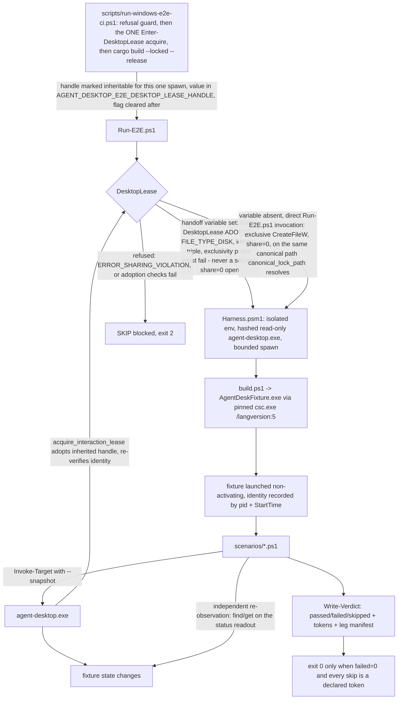
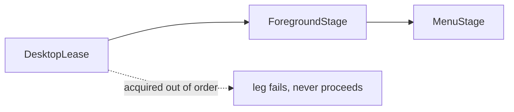

# Fixture App & Live E2E Harness (Sub-phase 2.12) - Plan

## Goal Capsule

- **Objective.** Give Windows the verify-by-observation live e2e discipline macOS already has: a WinForms fixture the harness controls, a PowerShell driver that asserts every effect by independent re-observation of the fixture rather than by the command's own `ok:true`, the cross-process desktop-exclusivity mechanism Windows has never had, and the live measurements the fixture makes possible - split-integrity effects, a content-staged `STALE_REF` rate, a forced ancestor-scroll ladder, and the `cell` role arm.
- **Authority hierarchy.** `docs/phases.md` governs what the product is; this plan governs how this sub-phase is built. Where a measurement in `probes/windows/FINDINGS.md` (rows `A24-1` … `A24-10`, and the rows this sub-phase adds) contradicts either, the measurement wins and `docs/phases.md` is corrected in place in this PR, citing the row.
- **Stop conditions.** Stop and ask the owner before: reducing any deliverable below what this plan enumerates; or taking any action that locks, disconnects or logs off the interactive session (grounding: the session cannot be unlocked from inside itself and a failed reattach strands the box). Runner registration is no longer a stop condition because it is **settled**: the owner has declined to register this box (or any box) as a self-hosted Windows runner on this public repository. This sub-phase therefore ships the registration artifacts - `windows-e2e.yml`, the trigger policy, the fork-PR approval policy and the ephemeral-versus-persistent decision - with no runner to execute them on, and defers the live-gate exit criterion to §2.15 (§Deferred to Follow-Up Work item 6).
- **Execution profile.** One PR into `feat/windows-adapter`, carrying **all fifteen units, U1 through U15** - the owner's decision, taken rather than left open. Hand-written product code lands at roughly **4.9k LOC** (§LOC Budget) and therefore exceeds both the 2,000-LOC sub-phase guidance and the ~2.5k `docs/phases.md` currently sanctions; §LOC Budget states where the extra sits and why, and U1 corrects the estimate at the *"Est. PR size"* line of §2.12 to the same figure. `docs/phases.md` sanctions an overage only when the plan says so explicitly, and this is that statement. One number, quoted identically in the Goal Capsule, §LOC Budget and U1 item 11.
- **Tail ownership.** This sub-phase owns its own dogfood report, its own probe rows, its `docs/phases.md` corrections, and the receiving-sub-phase scope text for every deferral it takes. It does **not** own §2.12.1's `RefEntry` field or wrap rule; its only contribution there is correcting the two lines that describe a measurement now taken.

---

## Product Contract

### Summary

Windows has 54 operational commands, a semantic action tier, input synthesis, lifecycle, capture, clipboard and signal waits - all proven by in-crate tests against raw-Win32 fixtures that never invoke `agent-desktop.exe`. Nothing has yet driven the shipped Windows binary end to end against a real application and checked the result by looking at the application rather than at the binary's own answer. This sub-phase builds that tier: a `csc.exe`-compiled WinForms fixture, a PowerShell 5.1 harness, the desktop-exclusivity primitive the harness needs and Windows does not have, a structural contract gate over the harness itself, and the live measurements the fixture unlocks.

### Problem Frame

Four facts shape everything below, and all four are measured rather than assumed.

1. **There is no cross-process desktop exclusivity on Windows** (`A24-10`). `crates/core/src/interaction_lease.rs` is `#[cfg(unix)]` in its entirety; `WindowsAdapter::acquire_interaction_lease` (`crates/windows/src/system/adapter.rs:18-23`) calls `InteractionLease::guarded(deadline, ())`, which holds no lock of any kind. The macOS chain has no Windows counterpart at any of its four links. The harness this sub-phase ships is the first thing that needs one.
2. **The macOS harness cannot be ported literally.** Measured in Git Bash on this box: `python3`, `pgrep`, `flock` and `trash` are all absent (`python` 3.14.6 is present, `shasum`/`sha256sum` are present). Beneath the missing commands sit POSIX-only primitives with no Git-Bash analog at all - `fcntl.flock`, `os.killpg`, `pass_fds`, `resource.getrusage`, and `selectors` over pipe file objects.
3. **The fixture is the only route to several measurements, and it can reach all of them.** Explorer density is measured shut for the scroll ladder (`A24-7`: 8 realized children at N = 40, 200 and 1000). A custom `WM_GETOBJECT` provider compiles under the pinned `csc.exe` 4.8 and reads back `DataItem` + `GridItem` + `TableItem` through a UIA client (`A24-9`). `Control.Name` surfaces as `AutomationId` with no `.exe.config` (`A24-2`). The compiler accepts C# 5 at most (`A24-1`).
4. **Half of what `docs/phases.md` assigns this sub-phase was deferred here on grounds that no longer hold, and half on grounds that hold harder than the document says.** Split-integrity staging is possible on this box with no runner (`A24-4`, routes B and D, judged by `GetTokenInformation(TokenIntegrityLevel)` read back off the live process). The HWND wrap rate is already measured (`A24-8`). But there is still one display here (grounding G2), no modern-shell population (G3), and no Chromium menu surface reachable by generic staging (`A24-6`).

### Requirements

Fixture:

- **R1. The fixture builds reproducibly under the pinned in-box compiler.** `tests/fixture-app-windows/build.ps1` invokes `csc.exe` by absolute path (`C:\Windows\Microsoft.NET\Framework64\v4.0.30319\csc.exe`), never through `PATH`, with `/langversion:5 /target:winexe /platform:anycpu` and an explicit `/reference` set. The language level is pinned rather than left at `Default` so a future in-box compiler upgrade cannot silently accept syntax the corpus has never compiled (`A24-1`).
- **R2. Every interactive fixture target carries a stable `AutomationId` equal to its documented id**, set through WinForms `Control.Name`; no `.exe.config` is shipped for identity (`A24-2`, `A24-3`). A fixture target that cannot be resolved by `--native-id` aborts the suite as a precondition failure, never as a skip.
- **R3. Every observable fixture status is readable independently of the command that changed it.** Each status is a read-only `TextBox` (`ControlType.Edit`, carrying `ValuePattern`) whose `AutomationId` is its identity and whose live value is its text. Identity and value are separate slots so a value change cannot be mistaken for an identity change. **Every status read in the harness goes through `get --property value` and never through `--property text` or `--property name`** (`get`'s property set is `text, value, title, bounds, role, states`, `src/cli_args/mod.rs`): a `ValuePattern`-bearing `Edit` answers `value`, a `Label` cannot, so the read itself discriminates the implementation KTD7 forbids. The status is read with no reference to the acting command's output.
- **R4. The fixture exposes, in one snapshot, at least one element of each of the following roles, which is the closed list this sub-phase asserts** — derived from `crates/windows/src/tree/roles.rs` rather than copied from macOS: `button`, `textfield`, `checkbox`, `combobox`, `slider`, `incrementor`, `radiobutton`, `tab`, `tablist`, `treeitem`, `outline`, `link`, `listbox`, `menuitem`, `cell`, `row`, `switch`, `menubutton`, and a container advertising `Scroll`. Roles `roles.rs` can also produce — `group`, `statictext`, `image`, `option`, `list`, `menu`, `window`, `dialog`, `document`, `grid`, `table`, `column`, `toolbar`, `separator`, `scrollbar`, `progressbar`, `status`, `tooltip`, `handle`, `unknown` — are **out of scope**: they carry no action this harness exercises, and several (`window`, `group`, `statictext`, `menu`, `column`) the stock WinForms provider emits unavoidably, so asserting the full map would assert coverage no fixture author chose. `disclosure` and `scrollarea` are excluded for a different reason: the Windows map has no arm that emits them at all (KTD8), so asserting them would assert a role this platform cannot produce. The covered list and the explicitly-uncovered list are pinned in Rust beside the role map (U13), so a new `ControlType` arm cannot be added without a coverage decision.
- **R5. The fixture forces a below-fold realized row.** A list surface realizes rows outside its visible rectangle, so `scroll-to` exercises the ancestor `ScrollPattern` ladder through a real geometry change - the route `A24-7` leaves as the only viable one.
- **R6. The fixture does not steal foreground unless asked.** Windows are shown with `ShowWithoutActivation` and `SW_SHOWNOACTIVATE` under `AGENT_DESKTOP_FIXTURE_NO_ACTIVATE=1`, matching the non-activating launch every probe in this corpus already uses.

Harness:

- **R7. Every effect assertion is an independent re-observation.** An assertion passes only when the fixture's own state, read through a separate `find`/`get` after the action, matches the expectation; a command's `ok`, its `disposition` and its reported mechanism are additional conjuncts, never the sole evidence. No assertion may be satisfied by `ok:true` alone.
- **R8. Every ref is snapshot-qualified.** Every action, `get`, `is` and element `wait` passes the exact `--snapshot` that produced the ref. No helper returns a bare `@eN`.
- **R9. A skip is never indistinguishable from a pass, and leg accounting is explicit.** Every skippable leg names a capability token declared in `tests/e2e-windows/skip-allowlist.psd1` with a reason; an undeclared skip fails the run. A leg that runs and asserts records `passed` or `failed`; a leg that skips on a declared token records `skipped` and **counts as executed**. `Write-Verdict` fails the run when a scenario registered legs and recorded no disposition of any kind for them, **and additionally fails when the run's total `passed` count is zero** — a whole-scenario skip is legal (U12's Chromium scenario is the one sanctioned case), a whole-run skip is not. The verdict line always prints `passed=<n> failed=<n> skipped=<n> tokens=[…]`. This is what stops a host that skips everything from reporting green, and it is stated as two separate rules because the one-rule version ("zero legs fails") is satisfiable by registering a single skip.
- **R10. Exactly one canonical failure exit path.** The suite exits non-zero from one place; scenario files never call `exit` directly; cleanup never doubles as the failure path.
- **R11. The harness never permanently deletes and never mutates the artifact under test.** Removal goes through a recoverable-delete primitive that retains the artifact with a warning when no recycle backend is available; the release binary is staged as a hashed read-only copy and its hash is re-verified before any success claim is made.
- **R12. The harness invokes no Python and no POSIX shell, and parses JSON through one helper that can read the trees this suite walks.** The driver is Windows PowerShell 5.1 end to end (grounding G6, `A24-10`). JSON is parsed through `ConvertFrom-AgentJson`, built on `System.Web.Script.Serialization.JavaScriptSerializer` with `RecursionLimit` and `MaxJsonLength` raised — **not** `ConvertFrom-Json`, whose recursion limit this box measures at 101 nesting levels (a 101-deep document parses; 102 throws `RecursionLimit exceeded`, on 5.1.17763.7434). A snapshot contributes two nesting levels per UI level (the node object plus its `children` array) on top of the envelope, so a UI depth past roughly 48 makes a response unparseable, and U12 stages a Chromium/Electron content tree precisely because web content nests far past that. Measured on the same host: `JavaScriptSerializer` with `RecursionLimit = 4096` parses a 1000-deep document; its defaults are `RecursionLimit = 100` and `MaxJsonLength = 2,097,152` characters, both of which a full snapshot can exceed, so both are raised explicitly. It returns `Dictionary<string,object>` and `Object[]`, **not** `PSCustomObject`, so every accessor in `Lib.psm1` is written against that shape. No harness file calls `ConvertFrom-Json` directly (enforced by U8).
- **R13. Every desktop-touching leg declares its lock and acquires locks in a fixed order.** The order is `DesktopLease` (process-wide, outermost) → `ForegroundStage` → `MenuStage`; a leg that acquires out of order fails rather than proceeding, following the same declared-order discipline `crates/windows/src/system/menu_state_tests.rs:17-32` documents for its own `FIXTURE_APP_NAME_LOCK` → `on_screen_stage` pair. That is a precedent for the discipline, not a mirror of this order, and the two systems do **not** interlock.
- **R13b. The live suite and the `agent-desktop-windows` test binary never run concurrently.** `FIXTURE_APP_NAME_LOCK` and `fixture_window::on_screen_stage` are in-process locks inside that test binary and acquire no `DesktopLease`; `cargo test -p agent-desktop-windows` stages real windows, forces foreground through `AttachThreadInput`/`SetForegroundWindow` and opens real Win32 menus on the same desktop the live suite is holding exclusively, with no lock in common. `scripts/run-windows-e2e-ci.ps1` therefore acquires the `DesktopLease` **before** it builds and holds it for the whole run, so a concurrent `cargo test` invocation that reaches the adapter's lease path refuses rather than interfering; `docs/runbooks/windows-self-hosted-runner.md` states that the crate's lib tests and the live suite are serialized on a shared desktop. **The lease is acquired exactly once for the whole entry path, and `Run-E2E.ps1` adopts rather than re-acquires** (R15b): a second `dwShareMode = 0` open of the canonical path fails with `ERROR_SHARING_VIOLATION` even from the process that already holds it, so a run script that acquires and then invokes a harness that acquires again aborts before a single leg runs. R15b states the handoff that keeps both properties.
- **R14. Preconditions are staged with raw OS calls, never with the product.** Foreground, cursor position, process identity, window state and integrity level are established and read through Win32/.NET directly; the system under test is never its own oracle.

Exclusivity:

- **R15. A second concurrent desktop consumer is refused, and every lease acquisition proves both that its handle names the canonical lock *and* that the lock is held exclusively.** Acquisition takes an exclusive open of a canonical, token-derived lock path; an inherited lease handle is trusted only after two independent checks pass - a **file-identity** check against that path, and an **exclusivity probe**, because a handle's share mode cannot be read back on Windows and identity alone proves naming rather than exclusion (KTD3). Contention past the deadline is `TIMEOUT`, an identity mismatch or a failed exclusivity probe is `POLICY_DENIED`. The lease handle is non-inheritable by default and made inheritable only around a guarded CLI spawn, so no fixture or unrelated child can outlive the harness holding the lock.
- **R15b. There is exactly one lease acquisition per entry path, and the second link verifies rather than re-opens.** `run-windows-e2e-ci.ps1` acquires the `DesktopLease` before the build (R13b), marks the handle inheritable across the one `Run-E2E.ps1` spawn, passes its value in `AGENT_DESKTOP_E2E_DESKTOP_LEASE_HANDLE`, and clears `HANDLE_FLAG_INHERIT` once the spawn returns. `Enter-DesktopLease` **adopts** that handle when the variable is set - `GetFileType == FILE_TYPE_DISK`, the `(volume serial, file index)` identity triple against the canonical path, and KTD3's `GENERIC_READ`-with-full-sharing exclusivity probe, which must fail - and opens the path itself only when the variable is absent, which is the developer-invokes-`Run-E2E.ps1`-directly path. This mirrors macOS, where `tests/e2e/run.sh:6,23` acquires once and re-execs with the fd inherited and `harness.sh`'s `acquire_exclusive_lock` **verifies** the inherited fd instead of re-acquiring it. The handoff variable is deliberately **not** the product's `AGENT_DESKTOP_INTERACTION_LEASE_HANDLE`: macOS reuses one name, Windows separates the two so the product's adoption protocol and the harness's own handoff stay independently testable and so no non-agent child can ever be handed the product's variable. `Enter-DesktopLease` clears the handoff variable from the harness environment once it has adopted, and every child spawn strips it, so no fixture or grandchild inherits it - KTD4's default-deny applied to the harness's own protocol.
- **R16. The lock's location cannot be moved by the isolated environment.** The canonical path is derived from the caller's token and from a fixed system-directory read, not from `%TEMP%`, `%TMP%`, `%HOME%`, `%LOCALAPPDATA%` or `%APPDATA%`, so the harness's own environment isolation cannot silently scope the lock per run and make two concurrent runs stop contending. Production code resolves that path through exactly one function that takes no parameter and reads no environment; tests reach the parameterized `_at` forms directly (KTD17), so no environment or test hook can move a production resolution.
- **R16b. The lock's directory is created private, validated as private, and validated against a *reachable* owner rather than an assumed one.** The canonical root sits under a world-writable system directory - measured on this box, `icacls C:\ProgramData` returns `BUILTIN\Usuarios:(CI)(WD,AD,WEA,WA)`, so any local user can create subdirectories there and any created subdirectory inherits that ACE. Three properties are therefore required, porting **all three** things `ensure_unix_runtime_directory` / `validate_unix_runtime_directory` do (`crates/core/src/interaction_lease.rs:159-199`: create at mode `0700`, refuse a symlink, repair non-owner permission bits) rather than only the ownership comparison. (a) **Creation is private:** an explicit self-relative DACL granting only `SYSTEM`, `BUILTIN\Administrators` and the token user, with inheritance disabled at creation. (b) **Validation refuses redirection:** the opened lock handle's `GetFinalPathNameByHandle` must equal the canonical path, which is the one predicate that catches a junction at *any* level of the path, not only a reparse point at the leaf. (c) **Ownership is validated against the SID the platform actually assigns**, not against a ported uid assumption - see R16c. Residual, **accepted**: in a root any local user can write, a hostile local user can pre-create the victim's directory and make acquisition refuse forever. That is a denial of service, not a privilege escalation, and it is unavoidable without a machine-wide install step this sub-phase does not add; the refusal is loud and named (`INTERNAL`, not `TIMEOUT`), so it reads as tampering rather than as desktop contention.
- **R16c. The directory owner check accepts the token's *owner* SID as well as its user SID.** Measured on this box: `C:\dev\agent-desktop`, `~/.agent-desktop` - the product's own directory - and a directory freshly created directly under `C:\ProgramData` are all owned by `BUILTIN\Administradores` (`S-1-5-32-544`), while `GetTokenInformation(TokenUser)` returns `S-1-5-21-2649426479-3638236041-235804022-500`. Windows assigns an administrator token's created objects the Administrators SID as their default owner, so the unix premise this ports - that `mkdir` yields euid ownership - does not hold, and a strict `TokenUser` equality returns a **non-retryable `INTERNAL` on the product's own directory** on this box and on the hosted `Test (Windows)` lane, whose runner identity is also an elevated administrator. The check therefore accepts a match against either `GetTokenInformation(TokenOwner)` or `TokenUser`, and rejects everything else; the path segment stays keyed to `TokenUser` so two different users never share a lock.

Measurement and truth:

- **R17. Split-integrity effects are confirmed live, on staging judged by token read-back.** Observation reads, input writes, window activation and capture are each exercised across a genuine Medium→High boundary staged by `CreateRestrictedToken` or an `icacls` mandatory label (`A24-4`), never by `Start-MediumIntegrityProcess`, and never judged by a launcher's exit code - route A of `A24-4` launched successfully and stayed High, which is the methodology's own control.
- **R17b. Three population measurements this rig is the first to make reachable are taken, each from an observer outside the process under test, each over a stated iteration count N and recorded as a probe row of counts only.** (a) The **mid-walk identity race rate** at Medium integrity: §2.11's window-enumeration race loop, run from the `CreateRestrictedToken` Medium observer, so the `A23-5` 5-attempt budget rests on a distribution rather than on one sighting. (b) The **never-identifiable-window population** bound: the agent-facing window enumeration run from the same observer beside a raw `EnumWindows` + `GetWindowThreadProcessId` oracle, counting windows whose owning-process identity is unreadable - the bound `A23-9`'s High-integrity 0 could only floor. (c) The **contended focus-steal rate**: `docs/phases.md` §2.9 ships a focus-steal budget of 2 on `A21-6`, whose capture is *uncontended* (0/5 on each of the first and second attempts) and whose parenthetical assigns the **contended** re-measure to §2.12. The rig that measurement needs - two fixture windows plus a `DesktopLease` → `ForegroundStage` ordering - is built by this plan, so the re-measure is taken here (U10) and judged by a raw `GetForegroundWindow` ownership re-read, never by the activation API's return value. A leg that cannot complete N iterations fails rather than reporting a partial rate.
- **R18. The `STALE_REF` rate is measured against a target with content actually staged, against a stated threshold with a negative control.** A restored Chromium/Electron target with no document open has no web content to walk (`A24-5`, `content_staged: false`, 30 nodes at max depth 10 for the contentless shell); the leg opens a document first and records the rate over a stated number of resolve attempts. The precondition threshold is stated here rather than chosen at implementation time against whatever the environment yields: the staged tree must carry **at least 150 nodes below the document root at depth ≥ 12**, comfortably past `A24-5`'s contentless baseline, and the leg records both figures. The threshold's own discrimination is proven by a negative control - the same precondition leg run against the target with no document open must **fail**.
- **R18b. `Assert-NoEffect`'s observation window is derived from measurement, not chosen for speed, and the measurement has a named store with a stated bootstrap.** The window is a single named constant in `Lib.psm1` set to at least **1.5x the maximum p99 latency recorded across all positive `Assert-Effect` legs** - one constant rather than a per-leg value, because one strictly-conservative number is checkable at start-up while a per-leg window is not, and because a per-leg specification with a single pinned constant is a contradiction an implementer would resolve by dropping the guard. The latencies live in **`tests/e2e-windows/latency-baseline.psd1`**, committed, one entry per positive `Assert-Effect` leg with its p99; U15's cost run (min-of-seven, warm-up discarded) writes it, and `Lib.psm1` reads it at start-up and **refuses to start when the pinned constant is below 1.5x the recorded maximum**. On the first run, before any baseline exists, the file carries a stated conservative bootstrap value and the harness records that the bootstrap was used, so the guard is live from the first leg rather than waiting on a unit that depends on the harness starting. Without a named store the guard has no operand and gets dropped - and it is the whole reason `Assert-NoEffect` is not a tautology. A window short enough to miss a late-landing effect turns every denial leg into a tautology, and the plan is explicit elsewhere that a fixed sleep is not a synchronization primitive (KTD16) - here the fixed window is load-bearing and therefore has to be named.
- **R19. Tests are falsifiable and assert no machine-specific fact.** No assertion depends on this box's display size, user name, machine name, installed application inventory or path layout; anything environment-dependent is read at run time and asserted as a relation, not as a constant.
- **R20. Statements in `docs/phases.md` that this sub-phase's measurements disprove are corrected in place**, citing the row that disproved them, and every deferral is written into the receiving sub-phase's scope in the same PR in enough detail that its implementer can act without reading this plan.
- **R21. Captures and the dogfood report record shapes and counts only** - never titles, paths, pids, machine names, user names or message text. Path, user, machine and SID redaction reuses `probes/windows/common.ps1`'s `Initialize-ProbeRedaction` / `Protect-ProbeText`. **That is necessary and not sufficient**: read against the source, `Protect-ProbeText` applies only the profile-path, `C:\Users\…`, domain-SID, `$env:USERNAME`, `$env:COMPUTERNAME` and DNS-name rules `Initialize-ProbeRedaction` builds, and `Test-CaptureRedaction` checks exactly those same classes - neither touches an element `Name`. A capture of `agent-desktop snapshot` against File Explorer, Notepad or an Electron vault therefore passes both today with file names, note titles and typed text intact. So: **every human-readable string field of a captured CLI envelope - `name`, `value`, `description`, `title`, `path[]`, and `error.details.checks[].occluder.name` (`crates/core/src/actionability/check_result.rs` serializes an occluder's real window name) - is reduced through `Protect-ProbeName` to `<redacted:N chars>` before the capture is written**, and the same discipline governs the dogfood report body, which is the higher-risk surface because it is prose written by hand about real applications. **`path[]` is named because it is the field the harness's most-used command emits and the one a name-blind list misses**: `crates/core/src/commands/find.rs:194` serializes `"path": path.clone()`, and `crates/core/src/live_locator/select.rs`'s `node_label` builds each entry as `format!("{role}:{label}")` from the element's own name or, failing that, its value - so a `find` or `AMBIGUOUS_TARGET` envelope captured while driving the Electron vault, Notepad or File Explorer that U15 step 1 mandates carries the note title, file name and whole window chain verbatim while every other rule reports green. The same reduction applies to the ancestor-label array on locator candidate entries. `Test-CaptureNameEcho` is not reused as-is: it parses the probe node-record schema (`Pass`/`Index`/`Parent`/`Reduced`/`Named`), not CLI envelope JSON.

### Key Decisions

- **The harness is a PowerShell 5.1 driver, not a bash port** (session-settled; elaborated in KTD1). It removes the Python dependency rather than resolving an interpreter name.
- **The Windows interaction lease lands in `crates/windows`, not in core** (session-settled; KTD2). Core already exposes the seam it needs. It is also a **new scope bullet in `docs/phases.md` §2.12** rather than an unrecorded addition: a grep of that document for "interaction lease", "exclusivity" and "acquire_interaction" returns one hit - the trait signature - and §2.12's Scope names a fixture, a harness, parking, a runner and a list of measurements, but no lease. It changes shipped behavior on a shipped platform, so U1 writes it in and §Open Questions asks the owner to ratify it rather than let it be discovered.
- **The canonical lock path is resolved without the `Win32_UI_Shell` feature** (measured; KTD17). That feature is held out of `crates/windows` by a CI gate and reserved as a supply-chain decision, and both obvious known-folder APIs sit behind it.
- **The HWND churn rig is not rebuilt** (session-settled; KTD12). `A24-8` discharges the measurement obligation; this sub-phase's contribution is correcting the two lines that still say no row exists.
- **No self-hosted runner is registered, on the owner's decision** (owner-settled; no longer an open question). The owner declined to register this box - or any box - as a self-hosted Windows runner on this public repository. **The reason is recorded here because it is the reason, not a placeholder:** registering a self-hosted runner on a public repository is an outward-facing security action that belongs to the repository owner rather than to an implementer, and GitHub's own guidance advises against self-hosted runners on public repositories, because a fork PR can otherwise execute untrusted code on a machine the owner controls. What follows is settled rather than open. The registration artifacts still ship here - `.github/workflows/windows-e2e.yml`, the trigger policy, the fork-PR approval policy and the ephemeral-versus-persistent decision - because §2.12's public-repo hardening bullet asks for them to be **written down**, and a written policy is reviewable without a runner to execute it. The workflow simply has no runner to run on: a `push` to `feat/windows-adapter` queues a job that no runner claims, and with `cancel-in-progress: false` those queued runs accumulate until cancelled, which the runbook states as an operational consequence of shipping the file unregistered. The live-gate exit criterion cannot be discharged here and is deferred to §2.15 on the ground *dependent on infrastructure that does not exist yet* (§Deferred to Follow-Up Work item 6). **Nothing the fixture itself enables travels with that deferral** - the split-integrity live effects, the content-staged Chromium `STALE_REF` rate, the forced ancestor-scroll ladder, the `cell` role arm and the HWND wrap row are all delivered in this PR, on this box, under the local exclusive run.

### Scope Boundaries

- **Out: §2.12.1's `RefEntry` window-identity field and wrap-handling rule.** `docs/phases.md` §2.12.1 makes them their own PR so the core schema change reviews as one. This plan corrects the bullets beginning *"**The HWND uniqueness-counter wrap rate**"* and *"**A wrap-handling rule if the measurement calls for one**"* so that PR's premise is true, and stops there.
- **Out: the FFI live legs.** The macOS harness stages `libagent_desktop_ffi.dylib` and a helper binary and drives them from a scenario. Windows FFI validation is §2.13's scope (`docs/phases.md:1327`), so the immutable-artifact set here is `agent-desktop.exe` alone and the harness's artifact verification covers exactly that one file. This is a boundary, not a deferral: nothing is moved, 2.13 already owns it.
- **Out: the notifications scenario.** Windows implements none of `list-notifications`, `dismiss-notification`, `dismiss-all-notifications`, `notification-action`; the trait default returns `PLATFORM_NOT_SUPPORTED`. There is no receiving surface to port `notifications.sh` onto.
- **Not a goal, on either platform - not a deferral: a `menu` or `alert` snapshot surface.** `WindowsAdapter::supported_surfaces` advertises `[Window, Focused, Sheet]` (`crates/windows/src/system/adapter.rs:68-74`). The harness asserts the refusal envelope rather than the surface.
- **Not a goal: a headless right-click leg with a semantic context-menu path.** `Action::RightClick` on Windows routes straight to `right_click_steps` → `ensure_headed_click_policy` with no semantic leg. The harness asserts `POLICY_DENIED` headless and physical delivery headed. That is the Windows contract, not a gap.

### Deferred to Follow-Up Work

Six items, plus two things **accepted** rather than deferred. Each deferral names which of CLAUDE.md's three legitimate grounds applies, cites the measurement that establishes it rather than an assumption, and names the sub-phase whose scope this PR edits. Nothing here is carried as a "residual" or a "recorded" outcome; those are not dispositions.

1. **WinUI/UWP legs: `focused_window` frame-vs-`CoreWindow` identity, and the WinUI arm of the two-source menu detector.** Ground: *dependent on infrastructure that does not exist*. This box is Windows Server 2019 Datacenter build 17763 with no modern-shell population (grounding G3, the same A10-7 gap), and the fixture is WinForms, which cannot manufacture an `ApplicationFrameHost`-hosted target at all. Neither the fixture nor registering this box changes that. **Receiver: §2.14**, whose own shell-surface scope (Start Menu, Action Center, Quick Settings) is WinUI-hosted and therefore structurally requires a runner carrying modern-shell hosts. U1 writes both measurements into §2.14's Scope with the instruction that neither may take the `PLATFORM_NOT_SUPPORTED` hedge §2.14's shell surfaces otherwise allow, because both govern every UWP-hosted application an agent might drive.
2. **Multi-monitor `list_displays` verification and per-display capture.** Ground: *dependent on infrastructure that does not exist*. Grounding G2 measured one display here (virtual screen `0,0 1639x732`), and A22-8 already measured that a virtual/software second display is not manufacturable on this class of box (`manufacturable: false`, `branch: no_virtual_display_adapter_available`). Registering this box as the runner does not add a monitor. **Receiver: §2.15**, as a provision-or-ratify decision at the one gate that reviews the whole branch.
3. **Capture session-degradation under RDP, a locked desktop, or Session 0.** Ground: *dependent on infrastructure that does not exist*, compounded by a policy hazard. Producing the condition requires locking or disconnecting the interactive session, and this session cannot be unlocked from inside itself - a failed reattach strands the box (grounding, Hazards ruled out by policy). What the measurement needs is a second, disposable interactive host that can be disconnected without loss. **Receiver: §2.15**, together with item 2, because both are rig-provisioning decisions rather than contract semantics. §2.12 assigns this bullet **two** distinct things and both travel: capture session-degradation, *and* **2.0's deferred RDP/session-isolation row**, which the exit criteria name separately ("2.0's deferred RDP/session-isolation row is closed by measurement on that runner"). U1's §2.15 receiving text cites that row by its exact `probes/windows/FINDINGS.md` id and states what it must measure - whether UIA observation, capture and input behave identically on a disconnected or locked session and on Session 0, and whether the adapter's console-session-agnostic claim still holds - so §2.15's implementer learns of the obligation from `docs/phases.md` rather than from a ledger row.
4. **The Chromium/Electron arm of the menu detector.** Ground: *dependent on infrastructure that does not exist* - specifically an application build that presents a reachable menu surface. The ground is stated at exactly the width the corpus supports and no wider: the **installed** Electron build (Obsidian 1.12.7.0) presents no menu surface reachable by either shipped detector source, confirmed on two independent attempts (`A23-3`, `A24-6` - `app_menu_alt_tap` and `context_menu_right_click_content_area` both fired no source, foreground confirmed first, no false positive at rest) plus U12's vault-configured third attempt. It is **not** claimed that no such build exists: U12 additionally runs `03-chromium-target.ps1`'s discovery routine over the whole host for any other Chromium/Electron shell (VS Code, Slack, Teams, Edge - absent per grounding G5) and records the search result in the row, so the deferral rests on a search rather than on one application. Installing a new Electron build is a host-provisioning action this sub-phase does not take. **Receiver: §2.14**, which owns menu and shell surfaces and will already be securing a runner with a broader application population.
5. **Live modern-capture pixel success, if this PR's hosted lane does not prove it.** `docs/phases.md`'s §2.12 exit criteria make modern-capture pixel success a conditional obligation - live "only when the `windows-latest` capability-probe lane has not already proven modern pixels for 2.10 (`A22-1`)". Verified during planning: `A22-1`'s remediation column still reads "the hosted-runner host reading is still owed when the capability-probe lane runs"; `probes/windows/22-capture-clipboard/probe.ps1` reads `GraphicsCaptureSession.IsSupported` and records the cross-integrity WGC arm as `supported_cross_direction_not_instrumented`, so **no committed row proves modern pixels anywhere**, hosted or otherwise. The condition is therefore live, and this plan resolves it by measurement rather than by leaving it unstated: `windows-capability-probe.yml` triggers on `pull_request` with `probes/windows/FINDINGS.md` in its paths filter and U15 appends rows to that file, so the hosted lane runs on this PR unconditionally, and U14 adds a hosted step that attempts a real WGC frame capture and records pixel success or failure (§U14). **Both branches are pre-committed.** Pixels proven hosted → the clause is discharged, the proof stays with 2.10's evidence, U1 corrects the exit criterion in place to say so and this item disappears. Pixels not proven hosted → the obligation is live here and cannot be met on this box, where `A22-1` measured `IsSupported: true` on build 17763 with interop failing (dogfood J0), so it defers on ground *dependent on infrastructure that does not exist* - a host whose WGC interop works - **receiver: §2.15**, written in alongside items 2 and 3 as part of the same provision-or-ratify decision, since §2.15's rig is where a capable host is provisioned.
6. **Self-hosted interactive Windows runner registration, and with it the exit criterion "the full Windows live gate is green in both headless and headed tiers on the self-hosted interactive runner".** Ground: *dependent on infrastructure that does not exist yet*. The owner has declined to register this box, or any box, as a self-hosted Windows runner on this public repository (§Key Decisions), so the runner the criterion names does not exist and cannot be brought into existence by this sub-phase's implementer - registration requires repository-admin action the owner has reserved to themselves. This is a decision already taken, not a difficulty encountered: nothing here is deferred because it was harder than expected. **What still ships in this PR** is everything that does not require a runner: `windows-e2e.yml` itself with its `workflow_dispatch`-plus-branch-scoped-`push` trigger policy, the fork-PR approval policy, the ephemeral-versus-persistent decision, `scripts/run-windows-e2e-ci.ps1` with its refusal guard, and `docs/runbooks/windows-self-hosted-runner.md` - the hardening artifacts §2.12 asks to be written down - plus the whole live suite, run locally under the `DesktopLease` on this box, which is what this sub-phase's gate now names. **What travels** is only the requirement that the gate be *green on a self-hosted runner in CI*, plus the runner label allocation. **Receiver: §2.15**, chosen because it is the one sub-phase that already owes a live end-to-end run on a Windows runner as the branch-final gate before promotion to `main`, so it cannot ship without provisioning the very thing this item defers - and because items 2, 3 and (conditionally) 5 already land there as rig-provisioning decisions, keeping one owner for the whole rig instead of three. U1 item 18 writes it into §2.15's Scope in this PR, with the registration and hardening obligations spelled out - the Task-Scheduler-at-log-on interactive-session requirement, the trigger policy and the mechanic behind it, the fork-PR approval setting, the ephemeral-versus-persistent decision and the teardown procedure - so §2.15's implementer can act without reading this plan.

**Accepted, with reasons, rather than deferred:**

- **The restricted-token / standard-user-logon gap.** `docs/phases.md` §2.12 defines the rig this sub-phase owes as a Medium-integrity session observing a window an elevated Administrator-token process owns; `CreateRestrictedToken` produces a Medium token of the same user, which approximates rather than equals that. **Accepted**, because the UIPI decisions under test - cross-boundary `SendInput` delivery, `SetForegroundWindow` ownership, and the process-token read-back - are keyed on the integrity level the token carries, and that level is measured directly at `S-1-16-8192` by read-back off the live process (`A24-4` route D). Any behaviour that depends on the logon session rather than on the integrity level is outside the four halves' contract. U1 writes this acceptance and its reason into §2.12 so no downstream reader treats the boundary as an unqualified match.
- **The mid-walk identity race distribution at standard-user integrity is delivered as an approximation, not deferred.** §2.12's scope bullet ends "A standard-user runner with tighter timing is where that distribution can actually be taken." U11 stages exactly the observer that bullet says is missing, so the measurement is taken here: the §2.11 window-enumeration race loop runs from the `CreateRestrictedToken` Medium observer for a stated iteration count and the hit rate is recorded as a probe row beside the four split-integrity halves (§U11 step 9). The gap between that and a standard-user logon session is **accepted** on the same reason as the bullet above - timing, not token shape, is the lever the `A23-5` 5-attempt budget rests on - and the row states the iteration count so a later, tighter run can be compared against it rather than starting over.

**Coverage of what `docs/phases.md` assigns this sub-phase.** The following table replaces a blanket "everything else is delivered here" claim, which is the sentence a reader most needs to be able to check. Rows are keyed by the §2.12 scope bullet's or exit criterion's opening phrase rather than by line number, because U1's own edits shift line numbers. **The table also carries the obligations `docs/phases.md` routes *into* §2.12 from other sections' text**, which a table keyed only to §2.12's own phrases misses by construction - §2.9's contended focus-steal re-measure is the one such obligation, and U1 item 19 sweeps the document for any other mention of 2.12 outside §2.12/§2.12.1.

| §2.12 item (opening phrase) | Disposition |
|---|---|
| "WinForms fixture app compiled with `csc.exe`" | Delivered - U4 |
| "`AutomationId` set on every interactive target" | Delivered - R1-R3, U4 |
| "Fixture targets mirroring `AgentDeskFixture.swift`" | Delivered - U5; occlusion class redesigned (KTD9) and disclosure asserted behaviourally (KTD8); U1 corrects the bullet |
| "Harness port … asserting every effect by independent re-observation" | Delivered - R7, U6-U10 |
| "Off-screen fixture parking is display-size-dependent" | Delivered - U3 |
| "Self-hosted interactive Windows runner registration" | **Declined by the owner** - deferral item 6 → §2.15; U1 item 18 corrects the bullet in place and writes registration into §2.15's Scope |
| "Public-repo hardening on that registration" | Delivered - U14; the artifacts ship written down with no runner to execute them; the `workflow_dispatch`-only clause is corrected in place by U1 (KTD14) |
| "Registration is a measurement obligation" (2.0's RDP/session-isolation row) | Deferred item 3 → §2.15, with the 2.0 row named explicitly |
| "`app/provider` — A14-1 measured the hosted runner" | Contextual; no deliverable |
| "`windows-e2e` workflow_dispatch job on that runner" | Delivered - U14 |
| "**`focused_window`'s frame-vs-`CoreWindow` identity**" | Deferred item 1 → §2.14 |
| "**Split-integrity verification**" | Delivered - U11, all four halves; the token-shape gap accepted above |
| "**Multi-monitor `list_displays` verification**" | Deferred item 2 → §2.15 |
| "**Capture session-degradation on the interactive runner**" | Deferred item 3 → §2.15; its modern-pixel clause is deferral item 5 or discharged by U14's hosted reading |
| "**The graded fallback's aggregate `STALE_REF` rate inside web content**" | Delivered - U12 |
| "**Chromium / Electron semantic-action proof**" | Delivered - U12, with a pre-committed disposition for the negative branch |
| "**Explorer below-fold / Items View virtualization surface**" | Delivered - R5, U5/U9 |
| "**The HWND uniqueness-counter wrap rate**" | Discharged by `A24-8` (KTD12); U1 corrects the bullet |
| "**Menu-open detection for the stacks area 23 could not stage**" | Chromium arm: one attempt here, then deferral item 4 → §2.14. WinUI arm: deferral item 1 → §2.14 |
| "**The mid-walk identity race rate under a standard-user integrity level**" | Delivered as an approximation - U11 step 9; token-shape gap accepted above |
| "**Whether a window this process can never identify is a real population**" | Delivered - U11 step 10, from the Medium observer |
| "**The `cell` ref-able role arm**" | Delivered - U13 |
| §2.9's clause "contended re-measure owned by §2.12" (routed in from §2.9's window-activation bullet, `A21-6`) | Delivered - R17b(c), U10 step 9; U1 item 19 corrects §2.9's parenthetical to cite the new row |
| Exit: "the full Windows live gate is green … on the self-hosted interactive runner" | Deferred item 6 → §2.15 (runner declined); this sub-phase's gate is the local exclusive run, and U1 item 10(c) corrects the criterion in place |
| Exit: "the runner's `workflow_dispatch`-only triggering, fork-PR approval policy and ephemeral-versus-persistent decision are written down" | Delivered - U14; the trigger half corrected in place by U1 |
| Exit: "2.0's deferred RDP/session-isolation row is closed by measurement" | Deferred item 3 → §2.15 |
| Exit: "multi-monitor `list_displays` verification and per-display capture" | Deferred item 2 → §2.15 |
| Exit: "split-integrity verification covers … **and** the live Medium→High capture effect" | Delivered - U11 |
| Exit: "the HWND uniqueness-counter wrap rate is measured" | Discharged by `A24-8` |
| Exit: "Live modern-capture pixel success … only when the … lane has not already proven modern pixels" | Measured by U14's hosted step; deferral item 5 on the negative branch |

The Windows cross-process interaction lease is **added** to §2.12's Scope by U1 - it appears in no scope bullet today and is a behavior change on a shipped platform (KTD2, §Open Questions 1).

---

## Planning Contract

### Key Technical Decisions

- **KTD1. The Windows harness is a Windows PowerShell 5.1 driver that invokes no Python and no POSIX shell.** Measured on this box in Git Bash: `pgrep`, `flock`, `trash` and `python3` are all absent (`python` 3.14.6 is present but not named `python3`); `shasum` and `sha256sum` are present. Beneath the missing commands, the macOS harness's load-bearing primitives are POSIX-only with no Git-Bash analog: `fcntl.flock`, `os.killpg` on a process-group leader, `subprocess.pass_fds`, `resource.getrusage(RUSAGE_CHILDREN)`, and `selectors` over pipe file objects (Windows `select` supports sockets only). **Rejected: a literal bash port** - it fails at the first line of `run.sh`, which re-execs under `python3`. **Rejected: bash with the primitives rewritten** - every rewrite (named lock, job object, process start time, recycle bin, file hash) resolves to a .NET call, so the bash layer buys nothing and adds a second interpreter to the trust surface. What this costs: the macOS `test_harness_contract.py` cannot be reused, so its structural rules are re-expressed in a new gate (U8), and `scripts/check-bash3-compat.sh` does not cover the Windows tree.
- **KTD2. The cross-process interaction lease is implemented in `crates/windows/src/system/`, not as a `#[cfg(windows)]` arm in core.** `InteractionLease::guarded(deadline, guard)` already boxes an arbitrary `Send + Sync + 'static` guard into a platform-neutral field (`crates/core/src/interaction_lease.rs:22-34`), and its `Drop` releases whatever that guard owns - the seam exists and needs no core change. `crates/windows/Cargo.toml` already carries `windows` 0.62 and `windows-sys` 0.61 under a `cfg(target_os = "windows")` target table. The adapter's own doc comment names this location already ("Full cross-process lease semantics are owned by the later input work on this crate", `crates/windows/src/system/adapter.rs:12-17`). **Rejected: a `#[cfg(windows)]` arm in `crates/core/src/interaction_lease.rs` mirroring the unix one.** It would add Win32 bindings to a crate that has none, and CLAUDE.md's own rule - written after core carried 1,062 LOC of never-executed Win32 file I/O that failed 225 of 940 tests on first contact and was deleted (`docs/solutions/best-practices/never-ship-platform-code-that-ci-cannot-execute.md`) - places platform hardening behind `PlatformAdapter` or in the platform crate. What this costs: `InteractionLease::guarded` hardcodes `contention_count: 0` (`crates/core/src/interaction_lease.rs:22-34`) while `crates/core/src/ref_action_poll_state.rs:63` emits `"lease_contention_count": lease.contention_count()` into the **success**-path command envelope, so a Windows lease that contended and then acquired would ship a diagnostic reporting zero contention - a false measurement in the product's own output, on the platform whose exclusivity story is brand new. There is no `platform_detail` escape hatch for that, because the wrong number is emitted on the path where nothing failed. U2 therefore promotes `guarded_with_contention` out of `#[cfg(test)]` to a platform-neutral `pub fn guarded_with_contention(deadline, guard, contention_count)`, so the Windows lease reports the count it earned on the success path exactly as unix already does through `from_file_lock`.
- **KTD3. The lease is an exclusive `CreateFileW` open of a canonical lock file, with identity re-verified through an attribute-only second open.** Measured on this box: a holder opening the file with `dwShareMode = 0` causes a second full-access open to fail with `ERROR_SHARING_VIOLATION` (32) - the contention signal - while an open requesting `FILE_READ_ATTRIBUTES` (0x80) **succeeds** against the same held file, and `GetFileInformationByHandle` returns a matching identity triple (`dwVolumeSerialNumber`, `nFileIndexHigh`, `nFileIndexLow`) on both handles. That triple is the exact analog of the unix `st_dev`/`st_ino` comparison `FileLock::adopt_inherited` performs (`crates/core/src/file_lock.rs:75-88`). **But link 4 does not port on identity alone, and this is the one place the macOS chain genuinely does not transfer.** On unix, `adopt_inherited` ends by calling `lock_file(inherited, deadline, purpose, canonical_path)` (`file_lock.rs:88`) - after comparing identity it *acquires the flock*, so adoption itself establishes exclusion. Windows offers no way to impose a share-mode restriction on an already-open handle and no API to read a handle's share mode back, so an inherited handle opened on the canonical path with `FILE_SHARE_READ | FILE_SHARE_WRITE` passes `GetFileType` and passes the identity triple while the adopter holds nothing exclusive. Adoption therefore adds an **exclusivity probe**, and the probe's direction is measured rather than assumed. Measured on this box across the full 2x2 (holder share mode x probe share mode), with the holder in another handle on the same file:

| holder | probe: `GENERIC_READ\|GENERIC_WRITE`, `dwShareMode = 0` | probe: `GENERIC_READ`, full sharing |
|---|---|---|
| `dwShareMode = 0` (exclusive) | fails, sharing violation | **fails, sharing violation** |
| `FILE_SHARE_READ\|FILE_SHARE_WRITE` | fails, sharing violation | **succeeds** |
| no holder | succeeds | succeeds |

A share-mode-0 probe fails against *both* holders and therefore discriminates nothing - it is the obvious probe and it is the wrong one. The discriminating probe is a **data-access** open with full sharing: it fails with `ERROR_SHARING_VIOLATION` **iff** some handle holds the file exclusively, and succeeds when the holder opened with sharing or when nobody holds it at all. Data access matters: KTD3's own earlier measurement is that an attribute-only `FILE_READ_ATTRIBUTES` open succeeds against an exclusively-held file, so the probe must request `GENERIC_READ`, not attributes. Adoption requires that probe to **fail**; a success means either that the inherited handle was opened with sharing or that nothing holds the lock, and both are `POLICY_DENIED`. **Rejected: a named mutex (`Global\…`).** Mutex ownership is thread-affine and cannot be handed to a child process the way a locked handle can, and a mutex carries no identity a child can verify - it would give the harness a start-up interlock while forfeiting the property that matters, which is that each lease acquisition independently proves what it holds. **Rejected: `LockFileEx` byte-range locking.** It works, but it needs a full-sharing open plus lock-region bookkeeping to express what one exclusive open expresses directly. Implementation hazard, measured while probing this: a hand-written `BY_HANDLE_FILE_INFORMATION` must use paired `u32` `FILETIME` fields, not `i64`, or struct alignment shifts every field after the first timestamp and the identity read silently returns the wrong bytes.
- **KTD4. Lease-handle inheritance is default-deny, opted into per spawn.** The handle is created non-inheritable; the guarded CLI spawn wrapper sets `HANDLE_FLAG_INHERIT`, spawns, and clears it again. **Rejected: marking the handle inheritable for the run's duration.** .NET's `Process` with redirected streams sets `bInheritHandles = TRUE`, and Win32 handle inheritance is all-or-nothing per spawn - an always-inheritable lease handle would leak into the fixture app, and a fixture that outlives a crashed harness would hold the desktop lock with nothing able to release it. This mirrors `bounded_process.py`'s macOS default, which strips the lease env var from every child and passes the fd at exactly two opt-in call sites (`guard-command.sh:7`, `harness.sh:187`).
- **KTD5. The canonical lock path is a fixed machine root joined to the caller's token SID, and reads no environment variable.** macOS roots its lock at literal `/tmp` plus `geteuid()` precisely so the harness's own `TMPDIR` override cannot move it; the Windows analog is `GetSystemWindowsDirectoryW()`'s drive, then `ProgramData\agent-desktop\<token user SID>\interaction.lock`, with the SID read from `GetTokenInformation(TokenUser)` on the process token. The directory is created if absent and validated before use, and **the port carries all three properties of the unix pair, not the ownership comparison alone** (R16b, R16c). `ensure_unix_runtime_directory` creates at mode `0700`, and `validate_unix_runtime_directory` refuses a symlink *and* repairs non-owner permission bits (`crates/core/src/interaction_lease.rs:159-199`); porting only "owner must match" drops both the access restriction and the redirection refusal on the platform where an unprivileged user can create a directory junction without holding a privilege, in a root that measures `BUILTIN\Usuarios:(CI)(WD,AD,WEA,WA)`. So: create with an explicit self-relative DACL granting only `SYSTEM`, `BUILTIN\Administrators` and the token user with inheritance disabled; validate that the opened handle's `GetFinalPathNameByHandle` equals the canonical path (which catches a junction at any level, where a leaf-only `FILE_ATTRIBUTE_REPARSE_POINT` check catches only the last one); and validate ownership against **either** `GetTokenInformation(TokenOwner)` **or** `TokenUser`, because measured on this box a directory created by this elevated administrator - including one created directly under `C:\ProgramData`, and including `C:\dev\agent-desktop` and `~/.agent-desktop` themselves - is owned by `BUILTIN\Administradores` (`S-1-5-32-544`) while `TokenUser` is `S-1-5-21-2649426479-3638236041-235804022-500`. **Rejected: the literal unix port (`metadata.uid() != uid` → owner SID must equal `TokenUser`).** Windows gives an administrator token's created objects the Administrators SID as default owner, so that check returns a non-retryable `INTERNAL` against the product's own directory on this box, and reds the hosted `Test (Windows)` lane too, whose runner identity is likewise an elevated administrator. **Rejected: `%LOCALAPPDATA%`, `%APPDATA%` or `%TEMP%` read from the environment.** The harness isolates `HOME`, `TEMP` and `TMP`; if the lock followed any of them, two concurrent runs would silently take two different locks and stop contending - and the "a second run refuses" test could still pass by acquisition order, hiding the hole rather than exposing it. **Rejected: `SHGetKnownFolderPath(FOLDERID_LocalAppData)`** - see KTD17. Note what the root choice does **not** fix: a lock file created by a Medium-or-higher process carries an implicit Medium label wherever it lives, so NO_WRITE_UP blocks a Low-integrity process from opening it for write under `ProgramData` exactly as under `%LOCALAPPDATA%`. That refusal is a property of the integrity boundary, not of the directory, which is why lease **adoption** is mandatory for U11's staged processes (step 3b) and why the Error table carries a `PERM_DENIED` / `lease_integrity_denied` row rather than folding the case into contention.
- **KTD17. `Win32_UI_Shell` is not taken, and the lock path is resolved without it.** Verified during planning: `.github/workflows/ci.yml`'s Windows lane runs `scripts/check-win32-ui-shell-exclusion.ps1`, which fails on both the `crates/windows/Cargo.toml` text and the resolved `cargo tree -e features` graph, and `crates/windows/Cargo.toml` enables the feature nowhere; `docs/phases.md` §2.14 and §2.9's recorded decision both treat it as a supply-chain-reviewed decision rather than a probe outcome. Verified in the vendored crate: **both** obvious known-folder APIs sit behind that feature - `SHGetKnownFolderPath` and `GetUserProfileDirectoryW` are both declared in `windows-sys-0.61.2/src/Windows/Win32/UI/Shell/mod.rs`, and the `windows` crate gates them identically - so "pick a different known-folder API" is not an available route. The route taken instead needs exactly one new feature that is not reserved: `GetSystemWindowsDirectoryW` under `Win32_System_SystemInformation` (`windows-sys` `Cargo.toml`: `Win32_System_SystemInformation = ["Win32_System"]`), joined to `GetTokenInformation` under `Win32_Security` and the owner read under `Win32_Security_Authorization`, **both already enabled** on this crate. **U2's first act is to add that one feature and run `scripts/check-win32-ui-shell-exclusion.ps1` green before any lock code is written**; the gate joins this plan's Gates list. **Rejected: hand-declaring `extern "system" fn SHGetKnownFolderPath` against `shell32.dll` to dodge the feature** - the gate exists to make the Shell surface a reviewed decision, and routing around its text check while taking the dependency in substance is worse than either honest branch. **Rejected without owner sign-off: taking `Win32_UI_Shell` explicitly** - that is the owner's alternative and it costs a recorded supply-chain decision in `docs/phases.md` §2.12, an edit to the exclusion gate plus its MUST-CATCH/MUST-PASS fixtures, and a cross-reference from §2.14's `A21-8` note. Not taking a reserved feature needs no sign-off; taking one does, which is why the non-Shell route is the default rather than the fallback.
- **KTD6. Skips are budgeted, not counted.** `tests/e2e-windows/skip-allowlist.psd1` maps a capability token to a reason. A leg may skip only by naming a declared token; an undeclared skip is a failure; the verdict line always prints `skipped=<n>` with the tokens; each scenario registers its legs so that a scenario dispositioning zero of them fails; **and, separately, a run whose total `passed` count is zero fails even when every skip token is declared.** Both rules are needed and neither substitutes for the other: a skip counts as a disposition (otherwise U12's sanctioned whole-scenario skip would fail the run and the contradiction would be resolved by whoever hit it first), so the zero-leg rule alone is satisfiable by registering one skip - the exact hole it exists to close. **Rejected: the macOS behavior**, where `finish` prints skips and still returns 0 (`tests/e2e/lib.sh:307-314`) - a host missing every capability reports green. **Rejected: making a skip not count as executed**, which would make every Electron-less host red on a scenario the plan explicitly sanctions skipping. This is lesson 5 from the previous sub-phase's review encoded as a mechanism rather than as prose, with its accounting rule written down rather than left for the implementer to infer.
- **KTD7. A fixture status readout is a read-only `TextBox`, not a `Label`.** Probe `A24-2` measured `TextBox → ControlType.Edit`, which carries `ValuePattern`; a WinForms `Label` carries no value pattern, so its only readable slot is its name - and using one slot for both identity and live value would defeat the independence R3 exists to protect. **Rejected: `Label` with the value in its text**, for that reason. **Rejected: a custom UIA provider per readout** - it works (`A24-9`) but costs a provider per status where a stock control already exposes the shape.
- **KTD8. The role-vocabulary assertion is derived from `crates/windows/src/tree/roles.rs`, not from the macOS scenario.** The Windows map emits `Tab` for `ControlType::TabItem` and `TabList` for `ControlType::Tab` - macOS surfaces `TabView` items as `radiobutton`, and copying that list forward would assert a mapping this platform deliberately does not have. The map has **no arm producing `disclosure` or `scrollarea`**: a `Button` advertising `ExpandCollapse` refines to `menubutton`, a `Button` advertising `Toggle` refines to `switch`, and a scrollable container stays `group`. Disclosure semantics are therefore asserted through behavior rather than role - `expand`/`collapse` against a `treeitem` and a `menubutton`, with the `expanded` state read back through `get`, which is a **stronger** oracle than the macOS fixture's, where `DisclosureGroup` exposes no state and child-presence is the only evidence available. Scroll containers earn refs by advertising the `Scroll` action, which is already how `ref_alloc` admits a non-interactive role.
- **KTD9. The occlusion fixture class is designed fresh, not mirrored.** `docs/phases.md:1273` says the five classes mirror `AgentDeskFixture.swift`; a grep over `tests/fixture-app/*.swift` and every file under `tests/e2e/` finds no occlusion element and no occlusion scenario - the statement is false for that one class and U1 corrects it. The Windows precedent is this crate's own `tree/fixture_overlay.rs`, whose overlay is *named* so a hit-test assertion can prove which window intercepted. The fixture reproduces that shape as a real top-most form named `fixture-overlay`, opened and closed by two buttons so the harness can drive it through the CLI rather than from in-process test code.
- **KTD10. Split-integrity staging uses routes B and D of `A24-4` and is judged by reading the staged process's own token.** Route D (`CreateRestrictedToken` plus `SetTokenInformation(TokenIntegrityLevel)`) stages `S-1-16-8192` Medium and `S-1-16-4096` Low; route B (`icacls` mandatory label) stages Low. **Rejected: `Start-MediumIntegrityProcess`**, which fails with "A required privilege is not held by the client" on every probe host (A18-4, A19-4) and whose single failure is what put five deferrals onto runner registration. **Rejected: judging staging by the launcher's exit code** - route A (`runas /trustlevel:0x20000`) launches successfully and yields a process that is still High, so exit-code judging would have recorded a false success. The staged observer never uses the product to decide whether staging worked.
- **KTD11. The `cell` arm is settled by presenting both shapes and shipping the refinement the map is missing.** `crates/windows/src/tree/roles.rs`'s `data_item_role` already refines `DataItem` + `GridItem`/`TableItem` to `Role::Cell`; what is unsettled is `ControlType::Custom` carrying the same patterns, which currently resolves to `Role::Unknown` - and A16-10 measured that WPF's `DataGrid` exposes exactly that shape. The fixture's custom provider (`A24-9`) presents both a `DataItem` cell and a `Custom` cell with `GridItem`/`TableItem`, the harness reads both back through `snapshot`, and the `Custom` refinement ships in `roles.rs` with its unit test. **Rejected: leaving `Custom` unrefined and recording the shape** - "recorded" is not a disposition, and the dogfood report that raised the question asked for a decision. U13 also re-measures stock `DataGridView`, which `A24-9` records as still owed (`stock_dgv.measurable: false`, `branch: dgvRows_element_not_found`).
- **KTD12. No HWND churn rig is built.** `A24-8` measured 91,923 windows in a 90-second cap, 65,534 distinct full HWND values, first full-value reuse at creation 65,535, 26,389 reuse events after wrap, a 16-bit generation field. `docs/phases.md:1298` asks for a row §2.12.1 can decide on; the row exists. **Rejected: re-staging churn from the WinForms fixture** - it would re-measure a settled number and stage tens of thousands of window creations on the same desktop the e2e suite is trying to hold exclusively.
- **KTD13. Two CI lanes, not one.** The hosted `windows-latest` lane runs the harness contract gate and a fixture compile smoke on every PR touching the tree; the self-hosted lane runs the live suite **once §2.15 registers a runner** - the file ships here, unclaimed, on the owner's declined-registration decision (deferral item 6). A harness that only ever runs on one dev box is exactly the never-executed-code hazard CLAUDE.md names, and the two pieces that *can* run on a hosted runner - the structural gate and `csc.exe`, which is in-box on `windows-latest` - are the ones most likely to rot silently. **Rejected: a single self-hosted lane** for that reason.
- **KTD14. `windows-e2e.yml` ships `workflow_dispatch` plus a `push` trigger scoped to `feat/windows-adapter`, never `pull_request`.** GitHub offers a `workflow_dispatch` run only for a workflow file present on the default branch; every Windows sub-phase lands on `feat/windows-adapter`, so dispatch alone would never be offered - the same mechanic `windows-capability-probe.yml`'s own header comment documents. A `push` trigger runs the file at the pushed ref and cannot be triggered by a fork. **Rejected: `pull_request`** - that is precisely the exposure GitHub's public-repo guidance warns about and §2.12's public-repo hardening bullet forbids. **This contradicts that bullet's current wording and its matching exit clause, and both are corrected in place in this PR.** The bullet beginning *"Public-repo hardening on that registration"* states the policy as "`workflow_dispatch`-triggered only and never `pull_request`", and the exit criterion repeats it as "the runner's `workflow_dispatch`-only triggering … written down"; shipping a second trigger while leaving those standing is exactly the defect CLAUDE.md's sync rule names, and the next sub-phase's planner would read the old wording as fact. U1 rewrites both (items 14 and 10) **regardless of the registration answer**: the sync rule requires the document to describe what shipped, and what ships here is a workflow file with two triggers. **With no runner registered, the relaxation grants no live exposure in this PR** - a `push` to `feat/windows-adapter` queues a job no runner claims, and `cancel-in-progress: false` means those queued runs accumulate until somebody cancels them, which the runbook records as the operational consequence of shipping the file unregistered. The exposure the relaxation would create - a desktop-driving suite auto-running on every merge into `feat/windows-adapter`, a materially different profile from dispatch-only - becomes real only at registration, so **§2.15 re-ratifies the trigger policy when it registers the runner**, and U1 item 18 writes that obligation into §2.15's Scope rather than leaving it inside a workflow file nobody re-reads. Everything else in the workflow mirrors the already-reviewed `native-e2e.yml`: top-level `permissions: {}`, job-level `contents: read`, `concurrency` with `cancel-in-progress: false`, pinned-SHA checkout, and a `AGENT_DESKTOP_NATIVE_E2E_RUNNER=1` refusal guard inside the run script (grounding G8 - the hardening pattern is not new work, the registration is).
- **KTD15. Fixture parking becomes runner-relative.** `fixture_window::OFFSCREEN_LEFT`/`OFFSCREEN_TOP` are `2_000` (`crates/windows/src/tree/fixture_window.rs:30-31`), off-screen only on a desktop smaller than that in both axes - true here at 1639x732 (grounding G2), not guaranteed anywhere else. The parking origin is computed from the virtual-screen rect at stage time; when no off-screen origin exists, the fixture takes `on_screen_stage()` instead of parking silently inside the desktop while holding none of the serialization the on-screen legs use. **Rejected: raising the constant** - it re-encodes an assumption about a display nobody has measured.
- **KTD16. `verify` polls to a deadline for a value that must change, and holds a bounded window for a value that must not.** The macOS primitive sleeps a fixed 0.35s between action and re-read (`tests/e2e/lib.sh:228`); a fixed sleep is not a synchronization primitive (`docs/solutions/best-practices/a-fixed-sleep-is-not-a-synchronization-primitive.md`), and on a loaded runner it decides the outcome by race rather than by duration. The changed-value read polls until the expected value or the deadline; the did-not-change assertion holds a stated, bounded window because there is no positive edge to wait for.

### Error and Disposition Mapping

The Rust this sub-phase adds is the lease and two small refinements; the harness asserts envelopes the shipped adapter already produces. The `Delivery` column records `DeliverySemantics` where a write path exists and what the caller does next where it does not.

| Method / surface | Condition | Code | Delivery |
|---|---|---|---|
| `WindowsAdapter::acquire_interaction_lease` | canonical lock free, exclusive open succeeds | — (Ok) | lease held for the invocation, released on `Drop` |
| `WindowsAdapter::acquire_interaction_lease` | `ERROR_SHARING_VIOLATION` repeatedly until the deadline expires | `TIMEOUT` | not attempted; `details.kind = "lock_timeout"` with `purpose`, `path`, `contention_count`, mirroring `file_lock.rs:138-152` |
| `WindowsAdapter::acquire_interaction_lease` | inherited handle's `(volume serial, file index)` differs from the canonical path's | `POLICY_DENIED` | not attempted; mirrors `file_lock.rs:75-88`'s unix identity refusal |
| `WindowsAdapter::acquire_interaction_lease` | inherited handle is not a disk file, or `GetFileInformationByHandle` fails | `POLICY_DENIED` | not attempted |
| `WindowsAdapter::acquire_interaction_lease` | inherited handle names the canonical path but the exclusivity probe (`GENERIC_READ`, full sharing) **succeeds** - the handle was opened with sharing, or nothing holds the lock | `POLICY_DENIED` | not attempted; `details.kind = "lease_not_exclusive"` |
| `WindowsAdapter::acquire_interaction_lease` | a second acquire inside the same process; `ProcessLeaseGuard` refuses before the file is ever opened | `TIMEOUT` | not attempted; `details.kind = "interaction_process_lock_timeout"` (`crates/core/src/process_lease_guard.rs`), **not** `"lock_timeout"` - the two are distinguishable on purpose and U2 tests them separately |
| `WindowsAdapter::acquire_interaction_lease` | self-acquire refused by mandatory integrity policy - a Low-integrity caller opening a lock whose directory carries a higher mandatory label (NO_WRITE_UP), surfacing as `ERROR_ACCESS_DENIED` rather than `ERROR_SHARING_VIOLATION` | `PERM_DENIED` | not attempted; `details.kind = "lease_integrity_denied"` with the caller's measured integrity RID. Distinguishing this from contention is load-bearing for U11: a staged low-privilege process that self-acquires is a **staging defect**, and collapsing it into `TIMEOUT` would make a lease-adoption failure read as a second harness that does not exist |
| `WindowsAdapter::acquire_interaction_lease` | canonical directory cannot be created or opened; or its owner SID matches **neither** the token's `TokenOwner` nor its `TokenUser` (R16c); or the opened handle's `GetFinalPathNameByHandle` differs from the canonical path (a junction anywhere on the path); or its DACL grants a principal outside `{SYSTEM, BUILTIN\Administrators, token user}` (R16b) | `INTERNAL` | not attempted; `details.kind = "lease_directory_untrusted"` with which of the four checks failed. Deliberately **not** `TIMEOUT`: a hostile pre-created directory in a world-writable root must read as tampering, not as desktop contention |
| `click` on the occluded fixture target | occluder raised, actionability preflight never clears | `TIMEOUT` | `not_delivered`; `error.details` carries the preflight's last report naming the intercepting surface |
| `click` on `permanently-disabled` | never becomes actionable within the auto-wait budget | `TIMEOUT` | `not_delivered` |
| `right-click` without `--headed` | `ensure_headed_click_policy` denies | `POLICY_DENIED` | `not_delivered` |
| `double-click` / `triple-click` / `hover` / `drag` / `mouse-*` without `--headed` | cursor or focus policy denied | `POLICY_DENIED` | `not_delivered` |
| `key-down` / `key-up` / `mouse-down` / `mouse-up` | standalone hold has no daemon to own it | `ACTION_NOT_SUPPORTED` | `not_delivered`; `details.raw_input_emitted = false`, `requires_daemon_owned_transaction = true` |
| `snapshot --surface menu` (or `alert`) | surface not advertised | `PLATFORM_NOT_SUPPORTED` | not attempted; `details.supported_surfaces = ["window","focused","sheet"]` |
| `type` / `press <ref>` after focus is lost mid-delivery | target lost focus before physical input | `ACTION_FAILED` | `not_delivered` |
| Medium→High `set-value` / `type` across the staged boundary | UIPI blocks the write | `PERM_DENIED` | `not_delivered` - A9-2's already-measured contract; U11 confirms it live |
| Medium→High `focus-window` across the staged boundary | activation silently no-ops, ownership-qualified foreground re-read catches it | `ACTION_FAILED` | `not_delivered` - §2.9 ships this fail-closed; U11 confirms the live effect |
| ref resolved after the fixture removed its row | zero live candidates | `STALE_REF` | not attempted |
| ref resolved against the fixture's twin controls | two plausible live candidates | `AMBIGUOUS_TARGET` | not attempted |

**Two rows above are load-bearing and easy to get backwards.** The first is the lease's split between `TIMEOUT` and `POLICY_DENIED`. Contention is a *timing* answer - somebody else holds the desktop and may not later - so it is retryable and carries a contention count; an identity mismatch is a *trust* answer - the handle handed to this process does not name the canonical lock - and retrying it can only produce the same wrong handle. Collapsing both into `ACTION_FAILED`, or making an identity mismatch retryable, would let a harness with a corrupted lease protocol loop until its deadline and then report a timeout, which reads as contention and sends a debugger to look for a second harness that does not exist. The second is the Medium→High write pair: `PERM_DENIED` for the input write and `ACTION_FAILED` for the activation. They differ because the write path has a measured platform contract behind it (A9-2: reads cross, writes silently do not, and `SendInput` reports success in both arms) while activation is caught by the product's own ownership-qualified re-read rather than by any OS signal. A leg that asserts one code for both would pass on whichever path it happened to exercise and hide the other.

### High-Level Technical Design

### Assumptions

- The pinned `csc.exe` path exists on any runner this suite targets (verified during planning at `C:\Windows\Microsoft.NET\Framework64\v4.0.30319\csc.exe`, grounding G1; `csc.exe` is also in-box on `windows-latest`, which is why the compile smoke can run hosted).
- `Get-FileHash`, `Microsoft.VisualBasic.FileIO.FileSystem` (recycle-bin delete), `System.Threading`, and `Get-Process().StartTime` are available under Windows PowerShell 5.1 (verified during planning on 5.1.17763.7434, not an open assumption).
- Pester is present at 3.4.0 but is **not** used: 3-vs-5 syntax divergence across runner images makes it a portability hazard, and the repo's own gate convention is a self-testing script (`scripts/check-no-phase-references.sh`, `probes/windows/13-ledger-check.ps1`).
- The `Test (Windows)` lane in `.github/workflows/ci.yml` executes `agent-desktop-windows` unit tests, so the lease's unit tests run in CI without a new lane.
- **Settled during planning, not open:** `ProcessLeaseGuard` is `pub(crate)` in `crates/core/src/process_lease_guard.rs`, and `InteractionLease::guarded_with_contention` is `#[cfg(test)] pub(crate)`. Both need a visibility change in core - no `cfg` arm, no new code - and U2 makes them, so the Windows lease gets the same in-process double-acquire protection `from_file_lock` gives on unix and reports the contention count it earned. `ProcessLeaseGuard::acquire` spins on a global `AtomicBool` and returns `deadline.timeout_error()` with `"kind": "interaction_process_lock_timeout"` **before** any file is opened, which is why U2's in-process and cross-process contention tests assert different `details.kind` values.
- **Also settled during planning:** `crates/core/src/interaction_lease.rs` already ships a `#[cfg(all(unix, test))] acquire_unix_interaction_lease_at(deadline, root)` seam so unix lease tests never contend for the machine-global lock. The Windows lease mirrors that seam exactly (KTD17, U2), because without it U2's own test scenarios cannot be written against the API U2 specifies.
- **Settled by owner decision, not assumed:** no self-hosted runner exists or will be registered in this PR. Every claim in this plan that mentions a self-hosted runner is written to be true in that world - the workflow ships unclaimed, the live gate is the local exclusive run, and the CI-green criterion rides §2.15 (deferral item 6).
- **Open until U12:** whether a vault-configured Obsidian session presents a reachable menu surface. One bounded attempt; the deferral in item 4 stands if it does not.
- **Open until U14's hosted run:** whether `windows-latest` produces modern-capture pixels. Deferral item 5 pre-commits both branches.

---

## Implementation Units

Rows are listed in dependency order; U-IDs are stable identifiers, not sequence numbers.

| U-ID | Title | Key files | Depends on |
|---|---|---|---|
| U1 | `docs/phases.md` corrections and deferral writes | `docs/phases.md`, `scripts/check-phases-ledger-citations.ps1` | — |
| U2 | Windows cross-process interaction lease | `crates/windows/src/system/interaction_lease.rs`, `system/adapter.rs`, `crates/windows/Cargo.toml`, `crates/core/src/{interaction_lease,process_lease_guard}.rs` (visibility) | U1 |
| U3 | Runner-relative fixture parking | `crates/windows/src/tree/offscreen_origin.rs` (new), `tree/fixture_window.rs`, `tree/resolve_pair_window.rs` | — |
| U4 | Fixture skeleton, build script, identity and status primitives | `tests/fixture-app-windows/*` | U1 |
| U5 | Fixture target population | `tests/fixture-app-windows/Fixture*.cs` | U4 |
| U6 | Harness core: isolation, immutable staging, bounded spawn, desktop lease and its adoption spawn | `tests/e2e-windows/Harness.psm1`, `BoundedProcess.psm1`, `Native.psm1` | U2 |
| U7 | Assertion library, lock ordering, verdict, skip ledger and the self-test stub | `tests/e2e-windows/Lib.psm1`, `skip-allowlist.psd1`, `selftest/Stub-AgentDesktop.ps1` | U6 |
| U8 | Harness structural contract gate and its self-test fixtures | `scripts/check-e2e-windows-contract.ps1`, `scripts/fixtures/e2e-windows-contract/**` | U7 |
| U9 | Scenarios: observation, non-interference, interaction (headless and headed) | `tests/e2e-windows/scenarios/{Observation,NonInterference,Interaction}.ps1` | U5, U7 |
| U10 | Scenarios: acceptance, reliability, surfaces, trace and performance | `tests/e2e-windows/scenarios/{Acceptance,Reliability,Surfaces,TracePerformance}.ps1` | U9 |
| U11 | Split-integrity live effects | `tests/e2e-windows/scenarios/SplitIntegrity.ps1`, `probes/windows/24-fixture-e2e/07-split-integrity-effects.ps1` | U9 |
| U12 | Chromium: content-staged `STALE_REF` rate, semantic-action proof, bounded menu attempt | `tests/e2e-windows/scenarios/Chromium.ps1`, `probes/windows/24-fixture-e2e/08-chromium-content.ps1` | U9 |
| U13 | `cell` role arm settled | `crates/windows/src/tree/roles.rs`, `tests/fixture-app-windows/FixtureCellProvider.cs`, `probes/windows/24-fixture-e2e/09-cell-role-stock-dgv.ps1` | U5 |
| U14 | CI lanes, run script, runner runbook, hardening policy and the hosted modern-capture reading | `.github/workflows/{windows-e2e,ci,windows-capability-probe}.yml`, `scripts/run-windows-e2e-ci.ps1`, `scripts/check-capture-redaction.ps1`, `probes/windows/24-fixture-e2e/10-hosted-modern-capture.ps1`, `docs/runbooks/windows-self-hosted-runner.md` | U8, U10 |
| U15 | Dogfood, cost baseline, probe rows and captures | `docs/dogfood-reports/2026-08-16-001-*`, `probes/windows/FINDINGS.md` | U10–U14 |

### U1. `docs/phases.md` corrections and deferral writes

**Goal:** Land every correction and every deferral before a line of the harness is written, so nothing downstream is planned around a statement known to be false. It is cut first, and alone, because two of the corrections change what later units are allowed to claim - if the HWND bullet still says no wrap-rate row exists, U15 has an exit criterion it would try to discharge by rebuilding a rig `A24-8` already made unnecessary.

**Every correction below is keyed to a verbatim opening phrase, never to a line number.** U1's own first edit changes the length of §2.12's Scope, so every subsequent line number in a line-keyed list is wrong by the time the implementer reaches it, and the Definition of Done would then be verifying line numbers describing a file that no longer exists. The Definition of Done uses the same anchors.

**Requirements:** R20.

**Dependencies:** none.

**Files:** `docs/phases.md`.

**Approach:**
1. The bullet beginning *"Fixture targets mirroring `AgentDeskFixture.swift`"*. Verified during planning: a grep over `tests/fixture-app/*.swift` and every file under `tests/e2e/` finds no occlusion element and no occlusion scenario. Correct in place to say four classes mirror the macOS fixture and the occlusion class is designed against this crate's own named-overlay staging (`crates/windows/src/tree/fixture_overlay.rs`), whose named overlay lets an interception assertion prove which window intercepted. Add, in the same bullet, that **the disclosure class is asserted behaviourally rather than by role**: the Windows map emits no `disclosure` arm - `crates/windows/src/tree/roles.rs`'s `button_role` refines a `Button` advertising `ExpandCollapse` to `menubutton` and one advertising `Toggle` to `switch` - so the fixture proves disclosure through `expand`/`collapse` against a `treeitem` and a `menubutton` with the `expanded` state read back, a stronger oracle than the macOS fixture's child-presence check. Left unqualified, a later reader checking role coverage against this bullet looks for a role this platform cannot emit.
2. The bullet beginning *"**`focused_window`'s frame-vs-`CoreWindow` identity**"*. Replace the "the fixture population and self-hosted runner this sub-phase creates are what let that be measured" clause: the fixture is WinForms and cannot manufacture an `ApplicationFrameHost` target, and this box - the only one available, and not a registered runner (deferral item 6) - carries no modern-shell population (grounding G3, A10-7). State that the measurement needs a host edition carrying WinUI/UWP hosts and rides §2.14; do not leave the clause resting on a runner this sub-phase creates, because it creates none.
3. The bullet beginning *"**Multi-monitor `list_displays` verification**"*. Replace "none has existed before this sub-phase's runner" with the measured position: this box exposes one display, A22-8 already measured a virtual second display unmanufacturable, and no runner is registered here at all, so §2.15 provisions or ratifies.
4. The bullet beginning *"**The HWND uniqueness-counter wrap rate**"*, whose sentence *"No probe has established it - `probes/windows/FINDINGS.md` carries no row"* is now flatly false. Replace with `A24-8`'s numbers (91,923 windows in a 90-second cap, 65,534 distinct full values, first reuse at creation 65,535, 26,389 reuse events, 16-bit generation field, handle table shared desktop-wide) and state that §2.12.1 ships both the field and the rule.
5. The bullet beginning *"**Menu-open detection for the stacks area 23 could not stage**"* and its "first rig able to stage both". Correct: the Chromium leg is this sub-phase's to attempt once more (`A24-6` reconfirmed A23-3 independently, and U12 makes a third, vault-configured attempt plus a host-wide search for another Chromium/Electron shell) and the WinUI leg rides §2.14's runner.
6. The bullets beginning *"**The mid-walk identity race rate under a standard-user integrity level**"* and *"**Whether a window this process can never identify is a real population**"* - both rest on "the split-integrity rig this sub-phase registers". `A24-4` staged Medium and Low on this box with no runner, so correct both to name `CreateRestrictedToken` staging as available now - **and, because that correction strengthens the claim that the measurement is reachable, say what this sub-phase actually took against each.** The race-rate bullet: U11 runs §2.11's window-enumeration race loop from the staged Medium observer for a stated iteration count and records the hit rate as a probe row, so the `A23-5` 5-attempt budget rests on a distribution rather than on one sighting. The never-identifiable-window bullet: U11 runs the agent-facing window enumeration from the same observer and records the count of windows whose owning-process identity is unreadable, which is the bound `A23-9`'s High-integrity floor could not take. Then state, once, that the residual difference between a restricted token and a standard-user logon session is **accepted** with the reason §Deferred to Follow-Up Work gives - the UIPI decisions under test key on the integrity level, which is measured directly by token read-back - rather than carried as an open residual.
7. The bullet beginning *"**The `cell` ref-able role arm**"*. Append that `A24-9` proved the custom provider route works under the pinned toolchain, that this sub-phase decides the `Custom` + `GridItem`/`TableItem` refinement rather than recording it, and that the stock-`DataGridView` reconfirmation is owed here.
8. The bullet beginning *"Registration is a measurement obligation as much as infrastructure"*, whose clause "2.12 closes 2.0's deferred RDP/session-isolation row by measuring it there" becomes false the moment deferral item 3 lands. Correct it in place to say the interactive-session requirement stands and the measurement rides §2.15, and keep the standing claim that no Windows adapter behavior assumes console-session semantics and this document claims no RDP or remote-session support.
9. The bullet beginning *"**Capture session-degradation on the interactive runner**"*. This is the item being deferred, and removing only its exit-criteria clause would leave the scope bullet claiming work this sub-phase does not ship. Correct the bullet in place to state what is closed here (2.10's forced-unavailable-seam fallback evidence stands) and that genuine RDP / locked-desktop / Session-0 degradation needs a second, disposable interactive host and rides §2.15, citing the policy hazard that a session cannot be unlocked from inside itself. Its final sentence about live modern-capture pixel success is dispositioned by item 15 below rather than left standing.
10. The **Exit criteria** paragraph. Five separate corrections, each keyed to its own clause. (a) The HWND clause - discharged by `A24-8`; say so rather than asking for a row that exists. (b) The multi-monitor and session-degradation clauses - removed from this sub-phase's criteria and replaced with the deferral pointer, so the sub-phase never claims work it did not ship. (c) The first clause, *"the full Windows live gate is green ... on the self-hosted interactive runner"* - **the owner declined registration, so this is unconditional**: correct it in place to name the local exclusive run on a developer box, under the `DesktopLease`, in both headless and headed tiers, as this sub-phase's gate, and state that the CI-green-on-a-self-hosted-runner half rides §2.15 with deferral item 6's ground named. The criterion must state something this PR actually satisfies. (d) The phrase *"the runner's `workflow_dispatch`-only triggering"* - corrected to `workflow_dispatch`-and-branch-scoped-`push` triggering, matching item 14. (e) The final sentence, *"Live modern-capture pixel success is an exit criterion here only when …"* - dispositioned by item 15.
11. The *"**Est. PR size:**"* line. This plan estimates **~4.9k** of hand-written product code (§LOC Budget). Rewrite the estimate to that figure - the same number the Goal Capsule and §LOC Budget quote - with the reason, following the precedent set where 2.11's estimate was corrected in place rather than left standing. Record in the same line that the overage is explicitly sanctioned by this plan and that the owner took the single-PR decision rather than splitting U11–U13 out, so a later reader does not read the overage as an unreviewed accident.
12. §2.12.1's bullet beginning *"**A wrap-handling rule if the measurement calls for one**"*. The measurement is taken and the branch resolved; rewrite as unconditional, citing `A24-8`.
13. Write the receiving scope text into §2.14 and §2.15. **§2.14** takes both WinUI measurements plus the Chromium menu arm, with the explicit instruction that neither UWP measurement may take §2.14's `PLATFORM_NOT_SUPPORTED` hedge, because both govern every UWP-hosted application rather than only the shell surfaces §2.14 adds. **§2.15** takes multi-monitor and capture session-degradation as one provision-or-ratify decision (evidence: A10-3, A16-4, A22-8, grounding G2), **plus 2.0's deferred RDP/session-isolation row named by its exact `probes/windows/FINDINGS.md` row id**, with what it must measure spelled out - whether UIA observation, capture and input behave identically on a disconnected or locked session and on Session 0, and whether §2.12's console-session-agnostic claim holds - and why it needs a second, disposable interactive host (the current session cannot be unlocked from inside itself and a failed reattach strands the box). If deferral item 5 fires, §2.15 additionally takes live modern-capture pixel success with `A22-1` and this PR's hosted reading as its evidence.
14. The bullet beginning *"Public-repo hardening on that registration"*, whose policy reads "the runner's workflow is `workflow_dispatch`-triggered only and never `pull_request`". KTD14 ships a second trigger, so correct in place to: triggered only by `workflow_dispatch` and by `push` to `feat/windows-adapter`, never by `pull_request` - stating the mechanic (GitHub offers a `workflow_dispatch` run only for a workflow file present on the default branch, and no Windows sub-phase lands there, which `windows-capability-probe.yml`'s own header comment documents) and that a `push` trigger cannot be fired from a fork. Keep the fork-exposure reasoning and the ephemeral-versus-persistent requirement intact. **This correction is unconditional and is not gated on ratification**: the sync rule requires the document to describe the workflow file that ships, and with no runner registered the second trigger grants no live exposure - a `push` queues a job nobody claims. Item 18's §2.15 text carries the obligation to **re-ratify the trigger policy at registration**, which is where the exposure becomes real.
15. **Add a Scope bullet for the Windows cross-process interaction lease**, which appears nowhere in §2.12 today: "`crates/core/src/interaction_lease.rs` is `#[cfg(unix)]` in its entirety and `WindowsAdapter::acquire_interaction_lease` holds no lock (`A24-10`), so the harness this sub-phase ships has no exclusivity primitive to stand on. The lease lands in `crates/windows/src/system/`: an exclusive `CreateFileW` open of a token-derived canonical path resolved without the reserved `Win32_UI_Shell` feature, adoptable through an inherited handle whose `(volume serial, file index)` identity **and** exclusivity are both re-verified, `TIMEOUT` on contention, `POLICY_DENIED` on identity mismatch or a non-exclusive handle. This changes shipped behavior: two concurrent `agent-desktop` invocations that both need a lease now contend where previously neither did." Add the matching exit-criteria clause. If the owner takes KTD17's Shell alternative instead, record that supply-chain decision in the same bullet and cross-reference it from §2.14's `A21-8` note.
16. **Disposition the modern-capture pixel clause on this PR's own hosted reading** (deferral item 5). After U14's hosted step runs: pixels proven → rewrite the clause to state that the proof stays with 2.10's evidence and this sub-phase carries no modern-pixel obligation, citing the new row; pixels not proven → the obligation cannot be met on a build-17763 host where `A22-1` measured interop failing despite `IsSupported`, so remove it from §2.12's criteria and write it into §2.15 alongside item 13's §2.15 text. Because this item depends on a CI result, it is the one U1 correction applied at the end of the PR rather than at its start, and the Definition of Done names it.
17. **Correct the §2.12 exit criteria to name the never-identifiable-window, race-rate and contended-focus-steal measurements** taken by U11 and U10 (items 6 above and item 19 below), so the criteria enumerate what shipped rather than pointing at a rig.
18. **The runner-registration bullet, and §2.15's receiving text for it.** The owner declined to register a self-hosted runner (§Key Decisions, deferral item 6), so the bullet beginning *"Self-hosted interactive Windows runner registration"* - whose text says the runner "is registered here rather than standing idle through the sub-phases that do not use it" - is false the moment this PR lands. Correct it in place: state that the registration artifacts (workflow, trigger policy, fork-PR approval policy, ephemeral-versus-persistent decision, runbook, refusal-guarded run script) ship here written down and reviewable, that no runner is registered, and name the ground - *dependent on infrastructure that does not exist yet*, because registration is repository-admin action the owner has reserved, GitHub advising against self-hosted runners on public repositories. Then **write the receiving scope text into §2.15**, alongside item 13's §2.15 text and detailed enough to act on without reading this plan: register an interactive Windows runner launched from Task Scheduler at log-on inside a real interactive session (a service-mode runner has no desktop and cannot see UIA); allocate the `[self-hosted, Windows, agent-desktop-e2e]` labels the committed `windows-e2e.yml` already names; **re-ratify the trigger policy at registration** - `workflow_dispatch` plus `push` scoped to `feat/windows-adapter`, never `pull_request` - since the branch-scoped `push` becomes live exposure only once a runner claims it; set the fork-PR approval policy; take the ephemeral/JIT-versus-persistent decision as a recorded choice with its rationale; record workspace-and-credential hygiene between runs; and then run the full live gate green in both headless and headed tiers, which is the half of §2.12's first exit criterion that travels. Note in the same text that queued `push` runs accumulate while no runner is registered, so registration should be paired with a queue flush.
19. **Sweep every mention of 2.12 outside §2.12/§2.12.1 and correct the five statements this PR falsifies.** U1 items 1-18 all edit §2.12, §2.12.1, §2.14 and §2.15; `docs/phases.md` states things about §2.12 elsewhere, and the next sub-phase's planner reads those with equal authority. Grep the whole document for `2.12` outside those two sections and correct, in place: (a) §2.4.1's *"§2.12 owns the `focused_window` frame-versus-`CoreWindow` identity question"* - routed to §2.14 by deferral item 1, unconditionally; (b) §2.5's *"no probe has established the HWND uniqueness-counter wrap rate under real churn, and §2.12 measures it on the fixture and interactive runner"* - disproved by `A24-8` (KTD12), unconditionally; (c) §2.9's window-activation bullet parenthetical *"(A21-6: … contended re-measure owned by §2.12)"* - **discharged here**: rewrite it to cite the contended rate U10 step 9 measures and the new probe row, so the focus-steal budget of 2 rests on a contended distribution rather than on an uncontended 0/5 capture; (d) the CI-requirements table row *"the self-hosted interactive Windows runner is registered at 2.12"* and (e) Risk Register R12's *"(sub-phase 2.12, where that runner is registered)"* - both **unconditionally** false now that registration is declined; correct both to name §2.15 as the registering sub-phase, citing deferral item 6. Add the newly retired stems to the citation gate's list (item 20 of §Test scenarios below), and note that (b) is why the gate's matching must be case-insensitive substring over the whole file rather than a whole-phrase match inside §2.12: the retired phrase *"No probe has established it"* does not appear in §2.5's variant wording, so the stem the gate carries is the shorter *"no probe has established"*.

**Patterns to follow:** the corrections already applied in §2.12 - correction in place with a row citation and no "previously said" annotation.

**Test scenarios:** documentation, plus one mechanical gate so R20 is not the only requirement in this plan whose "test" is a reviewer reading a list. `scripts/check-phases-ledger-citations.ps1` (new, U8's fixture discipline: a rule table, MUST-CATCH and MUST-PASS fixtures, a named failing rule, a non-empty-input assertion) fails when (a) any `A<n>-<m>` id cited in `docs/phases.md` is absent from `probes/windows/FINDINGS.md`, (b) any FINDINGS row whose closure names 2.12 carries no disposition, or (c) any stem in a declared retired-stem list still appears in `docs/phases.md`. **The matching mode is stated rather than left to the implementer: case-insensitive substring over the whole file**, not a whole-phrase match and not a match scoped to §2.12 - a gate that only reads §2.12 cannot catch item 19's five statements, which are the ones most likely to survive a correction sweep, and a whole-phrase match on "No probe has established it" walks straight past §2.5's "no probe has established the HWND uniqueness-counter wrap rate". Stems are therefore kept short enough to catch their variants. The retired list for this PR is at minimum: "no probe has established", "mirroring `AgentDeskFixture.swift`", "A wrap-handling rule if the measurement calls for one", "`workflow_dispatch`-triggered only", "`workflow_dispatch`-only triggering", "the split-integrity rig this sub-phase registers", "is registered at 2.12", "where that runner is registered", "contended re-measure owned by §2.12", and "§2.12 owns the `focused_window`". A MUST-PASS fixture must accompany each stem so the gate is shown not to fire on the corrected wording. U15's ledger pass re-checks that every `A24-*` row naming 2.12 is disposed.

**Verification:** every measured statement in §2.12 and §2.12.1 matches `probes/windows/FINDINGS.md`, both deferral targets carry actionable scope text rather than a pointer back to this plan, and the citation gate fails when a retired phrase is reintroduced - proven by its MUST-CATCH fixtures rather than by a reviewer's attention.

### U2. Windows cross-process interaction lease

**Goal:** Give Windows the exclusivity property macOS gets from `flock`: a canonical lock the whole desktop shares, adoptable by a child through an inherited handle whose identity is re-verified, so an invocation proves what it holds instead of assuming it. Cut before the harness because the harness's own lock step is a client of it.

**Requirements:** R15, R16, R16b, R16c.

**Dependencies:** U1.

**Files:** `crates/windows/src/system/interaction_lease.rs` (new), `crates/windows/src/system/interaction_lease_tests.rs` (new), `crates/windows/src/system/adapter.rs` (the `acquire_interaction_lease` override), `crates/windows/src/system/mod.rs` (re-export). A new file is mandatory rather than preferred: `system/adapter.rs` is the `SystemOps` impl and already carries the whole trait surface, and the 400-LOC cap leaves no room for a lock implementation plus its identity verification inside it.

**Approach:**
0. **First, before any lock code.** Add `Win32_System_SystemInformation` to `crates/windows/Cargo.toml`'s `windows-sys` feature list and run `scripts/check-win32-ui-shell-exclusion.ps1` green (KTD17). If that gate is red for any reason, stop and take the decision to the owner rather than routing around it.
1. `canonical_lock_path()` - `GetSystemWindowsDirectoryW()`'s drive, then `ProgramData\agent-desktop\<token user SID>\interaction.lock`, with the SID from `GetTokenInformation(TokenUser)`. Reads **no** environment variable - not `%LOCALAPPDATA%`, `%APPDATA%`, `%TEMP%`, `%TMP%` or `%HOME%` (KTD5). Takes no parameter, so a production call has nothing to point elsewhere.
1b. **Create and validate the directory as a private one, porting all three unix properties** (R16b, R16c, KTD5). Create it with an explicit self-relative DACL granting only `SYSTEM`, `BUILTIN\Administrators` and the token user, with inheritance disabled (`SetSecurityInfo` with `PROTECTED_DACL_SECURITY_INFORMATION`) - the analog of `DirBuilder::mode(0o700)`, and necessary because the root is world-writable: measured, `icacls C:\ProgramData` returns `BUILTIN\Usuarios:(CI)(WD,AD,WEA,WA)`, so any local user can pre-create `agent-desktop\<victim SID>` or pre-create and hold `interaction.lock` open exclusively. Validate before use, and refuse with `INTERNAL` / `details.kind = "lease_directory_untrusted"` naming which check failed, when: the owner SID matches neither `GetTokenInformation(TokenOwner)` nor `TokenUser` (`GetSecurityInfo`, `Win32_Security_Authorization`, already enabled - the two-SID acceptance is R16c's measured correction, **not** a loosening to be re-tightened later); or the opened handle's `GetFinalPathNameByHandle` differs from the canonical path, which is the single predicate that catches a junction at *any* path level where a leaf-only reparse-point check catches only the last; or the DACL grants a principal outside the three-SID set. Refusing rather than repairing is the deliberate difference from the unix version's mode repair: a `chmod`-equivalent on a directory whose ownership this process may not hold is not reliably available, and a loud refusal in a world-writable root is the safer failure. The pre-created-by-an-attacker denial of service is **accepted** with R16b's reason.
2. `acquire_at(root, deadline)` and `adopt_inherited_at(root, handle, deadline)` are the implementations and take the root as a parameter; `acquire(deadline)` and `adopt_inherited(handle, deadline)` are thin wrappers that pass `canonical_lock_path()`'s root and are the **only** callers of the resolver in production code. This mirrors the seam core already ships on unix (`acquire_unix_interaction_lease_at`, `#[cfg(all(unix, test))]`) and exists because U2's own tests are otherwise unwritable: KTD5 forbids an environment override, so without a parameterized form the choice is an env/test hook - the exact hole R16's test exists to close, and one that test would not catch because it only checks named variables - or running every lease test against the machine-global lock, where `cargo test`'s parallel threads and any live `agent-desktop.exe` can make the contention test pass for a reason unrelated to the code under test. The `_at` forms are `pub(crate)`; no environment or test hook can change the path a production call resolves.
3. Acquisition - `CreateFileW` with `GENERIC_READ | GENERIC_WRITE`, `dwShareMode = 0`, `OPEN_ALWAYS`, non-inheritable security attributes. On `ERROR_SHARING_VIOLATION`, back off and retry until the deadline, counting contention; on exhaustion return the `TIMEOUT` shape from the Error table. On `ERROR_ACCESS_DENIED` **do not retry** - that is the mandatory-integrity refusal, returned as `PERM_DENIED` with the caller's measured integrity RID (Error table).
4. Adoption - read `AGENT_DESKTOP_INTERACTION_LEASE_HANDLE`; assert `GetFileType == FILE_TYPE_DISK`; call `GetFileInformationByHandle` on the inherited handle and on a second, attribute-only open of the canonical path (`FILE_READ_ATTRIBUTES`, which succeeds against a file held with `dwShareMode = 0` - measured during planning); compare `(dwVolumeSerialNumber, nFileIndexHigh, nFileIndexLow)`; mismatch → `POLICY_DENIED`. **Then the exclusivity probe, because identity proves naming and not exclusion** (KTD3): open the canonical path a third time with `GENERIC_READ` and `FILE_SHARE_READ | FILE_SHARE_WRITE | FILE_SHARE_DELETE` and require that open to **fail** with `ERROR_SHARING_VIOLATION`; a success means the inherited handle was opened with sharing or nothing holds the lock, and both are `POLICY_DENIED` with `details.kind = "lease_not_exclusive"`. The probe handle is closed on both paths. The probe must request data access, not `FILE_READ_ATTRIBUTES`, which bypasses sharing. Declare `BY_HANDLE_FILE_INFORMATION` with paired `u32` `FILETIME` fields - an `i64` timestamp shifts every later field by four bytes through alignment padding and the identity read silently returns garbage (measured while probing this).
5. `set_inheritable(&self, on: bool)` - `SetHandleInformation(HANDLE_FLAG_INHERIT)`, exposed so the harness's guarded spawn can opt in per spawn and clear afterwards (KTD4).
6. The guard type owns the handle and closes it on `Drop`; hand it to `InteractionLease::guarded_with_contention(deadline, guard, contention_count)` - promoted out of `#[cfg(test)]` in core, no `cfg` arm - so core's existing `_guard` field releases it **and** the success-path `lease_contention_count` in `crates/core/src/ref_action_poll_state.rs` reports what the acquisition earned rather than a hardcoded zero (KTD2).
7. Wire `WindowsAdapter::acquire_interaction_lease` to prefer adoption when the env var is set and self-acquire otherwise, mirroring `MacOSAdapter::acquire_interaction_lease`'s two branches, and replace the doc comment that defers this work with one describing what the lease now guarantees (no plan reference).
8. Pair with core's `ProcessLeaseGuard` for in-process double-acquire protection. Verified during planning: it is `pub(crate)` in `crates/core/src/process_lease_guard.rs`, so exporting it is a visibility change with no `cfg` arm and no duplicated atomic. Its refusal fires **before** the file is opened and carries `"kind": "interaction_process_lock_timeout"`, which is why the in-process and cross-process contention tests assert different `details.kind` values.
9. **Measure the blast radius on the crate's own test population before wiring the override.** Enumerate which in-crate tests reach `acquire_interaction_lease` through the adapter path (not `InteractionLease::guarded` called directly) - `crates/windows` runs a large live-test population that instantiates `WindowsAdapter::new()` directly (`key_dispatch_tests.rs`, `screenshot_tests.rs`, `signals_tests.rs`, `signal_inventory_command_live_tests.rs`, the capture-parity tests, `scroll_into_view_tests.rs`) - and record the count in this unit. `cargo test` runs those on parallel threads in one process, so any that cross the seam would newly contend on one machine-global file **and** on `PROCESS_LEASE_HELD`, where a second acquire spins to `TIMEOUT` rather than waiting politely. Where a test does cross it, point it at a per-test scratch root through `acquire_at` rather than serializing the live-test population on one file. Run `cargo test --lib -p agent-desktop-windows` twice to confirm no new contention flake. This is measurement before wiring, not a note in the risk register.

**Patterns to follow:** `crates/core/src/file_lock.rs:60-152` for the acquire/adopt/identity/timeout structure and the exact error shapes; `crates/macos/src/system/adapter.rs:12-38` for the two-branch adapter override.

**Test scenarios:** every acquisition, contention, adoption and identity test targets `acquire_at` / `adopt_inherited_at` on a per-test scratch root, serialized on a test-local mutex, so none of them contends for the machine-global lock or can pass because of an unrelated holder.
- Self-acquire against a scratch root succeeds and the returned lease's `Drop` releases it (a second acquire then succeeds).
- A second **cross-process** acquire while the first is held fails `TIMEOUT` with `details.kind == "lock_timeout"` and a non-zero `contention_count`, exercised by spawning a helper child rather than by a second in-process call.
- A second **in-process** acquire fails `TIMEOUT` with `details.kind == "interaction_process_lock_timeout"` - `ProcessLeaseGuard` refusing before the file is opened, which is the correct behavior and a different shape. Asserting the file-lock shape here would be untestable, since `CreateFileW` with `dwShareMode = 0` refuses a second open from the owning process too.
- A lease acquired after N contention rounds reports `lease_contention_count == N` in a command envelope, not `0`. **Invert-verified** by reverting to `InteractionLease::guarded()` and watching this test fail.
- Adoption of a handle opened on the canonical path with `dwShareMode = 0` succeeds; adoption of a handle opened on a *different* file in the same directory fails `POLICY_DENIED` - the test asserts the code, not merely that it errored.
- **Adoption of a handle opened on the canonical path with `FILE_SHARE_READ | FILE_SHARE_WRITE` fails `POLICY_DENIED` with `details.kind == "lease_not_exclusive"`.** **Invert-verified** by removing the exclusivity probe and watching this exact test start passing adoption.
- Adoption of a handle that is not a disk file fails `POLICY_DENIED`.
- The handle is not inheritable by default; after `set_inheritable(true)` it is, and after `set_inheritable(false)` it is not (read back through `GetHandleInformation`, not from the setter's return).
- **Directory validation, four legs on a scratch root** (R16b, R16c): a directory whose owner is the token's `TokenOwner` acquires, and so does one owned by `TokenUser` - the first is the shape this box actually produces and the leg that would have caught the ported-uid defect; a directory owned by an unrelated SID returns `INTERNAL` with `details.kind == "lease_directory_untrusted"`; a directory created with an inherited `Users:(WD)` ACE is refused; and a junction placed at the parent of the lock file is refused by the `GetFinalPathNameByHandle` comparison. **Invert-verified** by tightening the owner check back to `TokenUser`-only and watching the `TokenOwner` leg fail, and by removing the final-path comparison and watching the junction leg pass.
- `canonical_lock_path()` is unchanged when `TEMP`, `TMP`, `HOME`, `LOCALAPPDATA` and `APPDATA` are all repointed at a scratch directory - the test sets all five and asserts the resolved path is unchanged. **Invert-verified** by switching the resolver to `std::env::var("LOCALAPPDATA")` and watching this exact test fail.
- The adapter override calls `canonical_lock_path()` rather than a parameterized form. **Invert-verified** by pointing the override at a parameterized path and watching this test fail - without it, the `_at` seam would be a hole R16's variable test cannot see.

**Verification:** two processes cannot hold the desktop lease at once, an inherited handle is trusted only after it is proven both to name the canonical lock and to be held exclusively, the lock's directory is proven private and its owner check proven to accept the SID this platform actually assigns, the diagnostic count is real, and none of it can be moved by the environment - each proven by a test that fails when its guard is removed.

### U3. Runner-relative fixture parking

**Goal:** Stop the lib-test fixtures from parking at a constant that is off-screen only by accident of this box's display size. Cut separately from U2 because it changes existing in-crate staging that every later live leg shares.

**Requirements:** R19.

**Dependencies:** none.

**Files:** `crates/windows/src/tree/offscreen_origin.rs` (**new**), `crates/windows/src/tree/offscreen_origin_tests.rs` (new), `crates/windows/src/tree/mod.rs` (module declaration, `#[cfg(all(test, target_os = "windows"))]` to match its callers), `crates/windows/src/tree/fixture_window.rs` (constants replaced by a call into the resolver, staging entry point returns its decision), `crates/windows/src/tree/resolve_pair_window.rs` (its `(2100, 2100)` origin). A new module is **mandatory rather than preferred**, for the same reason U2's is: verified during planning, `crates/windows/src/tree/fixture_window.rs` is exactly 400 lines and `scripts/check-rust-file-size.sh` fails above 400, so the file has zero headroom for a virtual-screen resolver, an injectable rect, a staging-decision return type and the `GetSystemMetrics`/`SM_*VIRTUALSCREEN` imports. `resolve_pair_window.rs` must share the same resolver (item 4), which the module boundary makes possible rather than accidental.

**Approach:**
1. Replace the `OFFSCREEN_LEFT`/`OFFSCREEN_TOP` constants with a resolver that reads the virtual-screen rect (`SM_XVIRTUALSCREEN`, `SM_YVIRTUALSCREEN`, `SM_CXVIRTUALSCREEN`, `SM_CYVIRTUALSCREEN`) and returns an origin outside it.
2. When no off-screen origin exists within the coordinate space the staging uses, return a signal that the caller must take `on_screen_stage()` instead - never park inside the desktop unserialized.
3. Make the resolver take the rect as a parameter so a unit test can inject a virtual screen larger than any candidate origin without needing a second monitor.
3b. **Make the caller's decision observable, not just the resolver's answer.** The staging entry point takes the virtual-screen rect as a parameter (defaulting to the live read) and returns which stage it took - `Parked { origin }` or `OnScreen(guard)`, the guard being the real `on_screen_stage()` handle. The property that matters is what the *caller* does, not what the resolver returns: a resolver that answers correctly while no caller consults it satisfies a resolver-only test and still parks a fixture inside a live desktop holding none of the serialization `menu_state_tests.rs:17-32` documents. On this box (1639x732, grounding G2) an off-screen origin always exists, so without an injectable rect *and* an observable decision the fallback branch is executed by no test and no lane - the shape of gate the previous sub-phase shipped three of.
4. Apply the same resolution to `resolve_pair_window`'s origin so the two staging paths cannot drift apart.

**Patterns to follow:** the serialization discipline already documented in `crates/windows/src/system/menu_state_tests.rs:17-32` - the on-screen stage is a declared lock with an acquisition order, not an implicit convention.

**Test scenarios:**
- Injected virtual screen `0,0 1639x732` → the staging entry point returns `Parked` with an origin outside the rect and holds no on-screen stage.
- Injected virtual screen `0,0 4000x3000` → the staging entry point returns **`OnScreen`** and the returned value holds the on-screen stage guard, asserted from the returned decision (or a stage-acquisition counter), **never** from the resolver's return value. This is the test that discharges Definition of Done item 7, which is about what the caller does. **Invert-verified** by making the caller ignore the no-origin signal and park at the resolver's origin anyway, and watching this exact test fail. (The old "restore the constant" inversion is ill-formed once the constants are gone - there is no line to restore, so an implementer would improvise an inversion that need not exercise the branch.)
- The resolver returning a fixed origin regardless of the injected rect makes the oversized-rect test fail - the resolver-side half of the same inversion.
- The resolver's origin is never inside the injected rect, for a table of rects including negative origins (a left-hand secondary monitor produces `SM_XVIRTUALSCREEN < 0`).

**Verification:** no fixture window parks inside the desktop without holding the on-screen stage, on any virtual-screen rect - proven by an assertion on the **caller's** stage decision under an oversized injected rect, rather than by this box's dimensions or by the resolver's return value.

### U4. Fixture skeleton, build script, identity and status primitives

**Goal:** A compiling, launchable, identity-correct fixture with the one primitive every later assertion rests on - a status readout whose identity and live value are separate slots. Cut before the target population so the population is written against a proven build and a proven readout rather than debugging both at once.

**Requirements:** R1, R2, R3, R6.

**Dependencies:** U1.

**Files:** `tests/fixture-app-windows/build.ps1`, `tests/fixture-app-windows/AgentDeskFixture.cs`, `tests/fixture-app-windows/FixtureStatus.cs`, `tests/fixture-app-windows/README.md`.

**Approach:**
1. `build.ps1` resolves `csc.exe` by absolute path, fails with a clear message if absent, and compiles every `.cs` in the directory in one invocation with `/langversion:5 /target:winexe /platform:anycpu /reference:System.dll /reference:System.Drawing.dll /reference:System.Windows.Forms.dll` plus the `UIAutomationProvider.dll`/`UIAutomationTypes.dll` references the cell provider needs. Output path is a parameter so the harness builds into its isolated suite root.
2. The build is idempotent and never deletes a previous artifact outright - it writes to a temporary path and moves into place.
3. `AgentDeskFixture.cs` carries `[STAThread] static void Main()`, a single scrollable main form named `AgentDeskFixture` with `Control.Name = "fixture-root"`, `ShowWithoutActivation` returning true and `SW_SHOWNOACTIVATE` under `AGENT_DESKTOP_FIXTURE_NO_ACTIVATE=1`, and exits the process when the main form closes without being confused by the duplicate windows that are not the last window.
4. `FixtureStatus.cs` defines the readout: a read-only `TextBox` with `Control.Name = <status id>` and a `SetValue(string)` that assigns `.Text`, plus a registry so a status can be updated by id from any card.
5. Every control the fixture creates sets `Control.Name` at construction; a helper enforces it so a control added later without an id is a compile-time-visible omission rather than a silent one. **That same helper appends each id to a build-time manifest, `AgentDeskFixture.ids.txt`, emitted beside the exe at first run**, so the harness's declared inventory can be checked for set equality against what the fixture actually creates. A hand-maintained list catches a rename; only a set-equality check catches a control deleted from the fixture and from the list in one edit, which is how coverage quietly shrinks.
6. C# 5 only: no string interpolation, no expression-bodied members, no `nameof`, no null-conditional operators (`A24-1`).
7. Every status readout starts at the sentinel value `idle` and every write appends a monotonically increasing per-status invocation counter, so no two legs can share an expected string and a leg cannot pass on a value an earlier leg left behind. This is what makes `Assert-Effect`'s pre-read comparison (U7) meaningful rather than a formality.

**Patterns to follow:** `tests/fixture-app/build.sh` for the shape of a reproducible fixture build (explicit toolchain resolution, explicit reference set, idempotent artifact replacement); `probes/windows/24-fixture-e2e/01-fixture-toolchain.ps1` for the exact `csc.exe` invocation already proven on this box.

**Test scenarios:**
- **The pin is proven by two legs, and neither asserts a diagnostic the compiler cannot emit.** (a) `build.ps1` compiles clean and its invocation is asserted to carry `/langversion:5`. (b) `csc.exe /langversion:6` against a scratch file exits non-zero with **`CS1617`** - the compiler-ceiling proof, and the diagnostic `A24-1` actually measured ("`6`, `7`, `7.3`, `8`, `Latest` all fail exit code 1 with `CS1617`"), `CS1617` being the diagnostic for an unsupported `/langversion` *value*. (c) Optionally, a deliberate C# 6 construct in a scratch copy fails - and if that leg is kept it asserts **`CS1056`**, the parse diagnostic this compiler emits. Measured this session against the pinned compiler: `class P{static void Main(){int x=1;System.Console.WriteLine($"v{x}");}}` fails with `error CS1056: Unexpected character '$'` identically at `/langversion:5` and with no `/langversion` flag at all, so the construct alone discriminates nothing about the pin and `CS1617` is unreachable from it. Asserting `CS1617` on the construct leg is a test that can never pass, and loosening it to "it fails" is the "test that cannot fail" shape this plan names as its own hazard.
- The built fixture's main window is discovered by `snapshot --app AgentDeskFixture`, and the form's own `AutomationId` reads back.
- A status readout is read with **`get --property value`**, which a `ValuePattern`-bearing `Edit` answers and a `Label` cannot; the leg asserts the value read is non-empty and equals the expectation, **and** that `get --property name` on the same element does not contain the status value, and that the `AutomationId` is unchanged across two separate `find` calls. **Invert-verified** by swapping the readout to a `Label` and watching this leg fail. The naive version of this test - "value changed, `AutomationId` did not" read through `--property text` - passes perfectly against the `Label` implementation KTD7 exists to forbid, because a `Label`'s `Control.Name` still surfaces as a stable `AutomationId` while its text surfaces as a changing UIA `Name`. It therefore does not discriminate the class it claims to guard, and `--property value` is the read that does.
- The fixture launched with `AGENT_DESKTOP_FIXTURE_NO_ACTIVATE=1` does not become foreground **and its top-level window is present**: foreground is read with `GetForegroundWindow` through raw P/Invoke before and after launch, and in the same leg a raw `EnumWindows` + `GetWindowThreadProcessId` walk proves a top-level window owned by the launched pid - never through the product. Both conjuncts are required because "foreground unchanged" alone is satisfied perfectly by a fixture that crashes on startup, throws before `Show()`, or never creates a window, and R6 is a precondition for every later leg's serialization discipline. **Invert-verified twice**: remove `ShowWithoutActivation` and watch the foreground conjunct fail; suppress `Show()` and watch the window-present conjunct fail.
- The emitted `AgentDeskFixture.ids.txt` manifest is non-empty and every id in it is unique.

**Verification:** the fixture builds under the pinned toolchain and the pin is shown to bite by the `/langversion:6` → `CS1617` ceiling leg rather than by a diagnostic the compile cannot produce, the fixture appears without stealing foreground, and exposes stable identity plus an independently readable live value - proven by the `--property value` test, which fails against the one-slot `Label` implementation, and by the two-conjunct launch test, which fails against a fixture that never appears.

### U5. Fixture target population

**Goal:** Every target the scenarios address, including the five classes `docs/phases.md` names and the role coverage the Windows map can actually produce.

**Requirements:** R2, R4, R5.

**Dependencies:** U4.

**Files:** `tests/fixture-app-windows/FixtureCards.cs`, `FixtureAsync.cs`, `FixtureOcclusion.cs`, `FixtureWindows.cs`, `FixtureCellProvider.cs`.

**Approach (target inventory, ids as written):**
1. **Clicks and mouse.** `primary-button` → `click-status`; `double-target` → `double-status`; `triple-target` → `triple-status`; `context-target` with a `ContextMenuStrip` containing `context-choice` → `context-status`; `hover-target` → `hover-status`; **`twin-control` twice - both controls carry `Control.Name = "twin-control"` and identical text**, so both present identical evidence to `candidate_outcome`, plus a `move-twins` button that repositions **both**. Two things make the naive design unbuildable and are settled here rather than at implementation time. First, in WinForms `Control.Name` *is* the `AutomationId` (`A24-2`), so "same name, one additionally carrying an `AutomationId`" is not expressible - either both carry the same id or each carries a distinct one. Second, distinct ids would guarantee a unique match and therefore never an ambiguity: `crates/windows/src/tree/resolve_match.rs`'s `select_by_bounds_hash` returns `Selection::Ambiguous` only when the stored hash is absent or matches zero or two-or-more candidates, so two evidence-equal twins still resolve whenever the stored `bounds_hash` still picks one of them. The `AMBIGUOUS_TARGET` leg therefore snapshots, presses `move-twins` so the stored hash matches **neither** live candidate, then acts on the stored ref (U9).
2. **Text input.** `text-input` (`Edit`) → `text-status`; `secure-input` with `UseSystemPasswordChar` (asserted for `IsPassword` and for name withholding); `multiline-input`.
3. **State controls.** `toggle-box` (`CheckBox`) → `toggle-status`; **`switch-button` - a `Button` backed by a `WM_GETOBJECT` provider advertising `TogglePattern`**, the same provider mechanism this fixture already ships for the zero-bounds and cell targets. No stock WinForms control presents a *toggling `Button`*: `roles.rs`'s `button_role` emits `Role::Switch` only for a `Button` advertising `TogglePattern`, and a `CheckBox` presents `ControlType::CheckBox`, not a `Button`. Budgeting the provider here is what stops the R4 role-coverage leg coming back short and the fix landing as unplanned provider work at U9 time. `value-slider` (`TrackBar`) → `slider-status`; `value-stepper` → `stepper-status`. `NumericUpDown` is expected to present `ControlType.Spinner` (→ `incrementor`) but no probe has measured it; the fixture author reads the mapping back through `snapshot` while building, and if the stock control does not present `Spinner`, `value-stepper` becomes a `WM_GETOBJECT` provider reporting it - the mechanism this fixture already ships for the zero-bounds and cell targets. R4's coverage is not left hostage to an unmeasured stock mapping.
4. **Choices.** `option-picker` (`ComboBox`) → `picker-status`; `radio-group` with `radio-one`/`radio-two`/`radio-three` → `radio-status`; `tab-view` (`TabControl`, `tablist`) with `tab-one`/`tab-two` (`tab`) → `tab-status`; `example-link` (`LinkLabel` → `link`).
5. **Collections and disclosure.** `outline-tree` (`TreeView` → `outline`) with `outline-parent` (`treeitem`, expandable) and children `outline-child-a`/`outline-child-b`; **`menu-disclosure` - either a `ToolStripSplitButton`, which presents `ControlType::SplitButton` and maps to `menubutton` directly through `roles.rs`'s `SplitButton` arm, or a `Button` with a `WM_GETOBJECT` provider advertising `ExpandCollapsePattern`; the fixture author reads the mapping back through `snapshot` while building and keeps whichever presents.** No stock WinForms `Button` advertises `ExpandCollapse`, so leaving this to a plain button would leave R4 short a role. `item-list` (`ListBox` → `listbox`, whose `SelectionPattern` is what `list_role` refines on) with `list-item-1..6`; `menu-strip` with **`menu-fire-item` as a top-level `MenuStrip` item, not a drop-down child** - a top-level item has a provider at rest, so it is resolvable by the precondition leg without opening anything and it is dispatchable through the semantic tier without putting a thread into menu mode, which is what lets U10 state that no leg in that unit takes `MenuStage`. It fires - unlike macOS, where a `CommandMenu` item accepts `AXPress` and never routes to its closure - so the harness asserts dispatch rather than mere enumerability, through `menu-status`.
6. **Scroll.** `scroll-area`: a container advertising `Scroll` holding 60 `scroll-row-N` rows deliberately realized beyond the visible rectangle, plus `scroll-offset` as a live readout. This is R5's below-fold surface, the route `A24-7` leaves open.
7. **Delayed enable.** `enable-later` (after **4 s** sets `delayed-text` to `ready` and enables `delayed-button`); `delayed-button` → `delayed-action-status`; `permanently-disabled` (never enabled); `reset-delayed-button`, which returns `delayed-text` to its not-ready sentinel and re-disables the button. The delay is 4 s rather than ~800 ms because the harness cannot outrun 800 ms: a leg's "immediately after" is a full round trip - a spawned CLI press, a snapshot, a `find`, then another cold process start for the click - and two or three `agent-desktop.exe` invocations each carrying a UIA tree walk comfortably exceed 800 ms, at which point the click lands on an already-enabled button and passes with the auto-wait loop deleted entirely.
8. **Dynamic tree.** `appear-later` → `appeared-text` appears after ~1 s; `reset-appeared-text`; `removable-row` with `remove-row` and `reset-removable` for the `STALE_REF` case.
9. **Zero bounds.** `zero-bounds-button`: a `WM_GETOBJECT` custom provider reporting a zero `BoundingRectangle` through `GetPropertyValue`/`IRawElementProviderFragment` - the mechanism `A24-9` proved compiles and reads back on this toolchain. A genuinely 0x0 `HWND`-backed control is not used: whether Win32/UIA keeps such a control in the tree at all is unmeasured, and the provider route is measured.
10. **Duplicate title.** `open-duplicate-windows` opens two real `Form`s both titled `Duplicate Window` at distinct positions with distinct `AutomationId`s; `close-duplicate-windows` closes both.
11. **Occlusion.** `occluded-button` → `occlusion-status`; `open-occluder` raises a top-most form named `fixture-overlay` covering it; `close-occluder` dismisses it (KTD9).
12. **Surfaces.** `open-sheet` → a modal dialog with `sheet-title`, `sheet-field`, `confirm-sheet`, `cancel-sheet` → `sheet-status`.
13. **Cell and row.** `grid-panel` hosting a `DataItem` cell with `GridItem`/`TableItem`, a second cell reporting `ControlType.Custom` with the same patterns (U13 consumes both), and a `DataItem` carrying **neither** pattern - which `data_item_role` resolves to `row`, the only shape in the inventory that produces that role and the negative case U13's refinement must not disturb.

**Patterns to follow:** `tests/fixture-app/FixtureCards.swift` and `FixtureAsync.swift` for card composition and delayed-enable timing; `crates/windows/src/tree/fixture_overlay.rs` for the named-overlay occlusion shape; `probes/windows/24-fixture-e2e/06-cell-role-provider.ps1` for the `WM_GETOBJECT` provider skeleton.

**The inventory splits into resident and staged ids, and the precondition leg has to know which is which.** A third of the inventory has no UIA presence at rest, so a leg that resolves every id at rest aborts the suite on a *correctly built* fixture:

- **Resident** (present from launch): everything not listed below, including `menu-fire-item` per item 5.
- **Staged** (present only while a transient surface is up): `context-choice` (its `ContextMenuStrip` has no window until the context menu opens), `sheet-title` / `sheet-field` / `confirm-sheet` / `cancel-sheet` (modal only), `appeared-text` (appears after ~1 s and is reset by `reset-appeared-text`), `fixture-overlay` (only after `open-occluder`), and the two `Duplicate Window` forms (only after `open-duplicate-windows`).

**Test scenarios:** exercised through U9/U10's scenarios rather than duplicated here, plus one fixture-level precondition leg with three parts, run before any other scenario:
1. **Set equality** between the fixture's emitted `AgentDeskFixture.ids.txt` manifest (U4 item 5) and the harness's declared inventory, failing on **either** direction and naming the difference. **Invert-verified** by deleting one control plus its inventory entry and watching this check fail - the case a resolve-only leg cannot see.
2. **Resolve every resident id** by `--native-id`, aborting the suite (never skipping, R2) and naming the missing id.
3. **For each staged id**, open its staging surface, resolve the id, close the surface again - aborting the suite naming both the id and the surface that failed to present it.

`twin-control` is exempted from part 2 **by name** and asserted separately: it must resolve to exactly **two** hits, not one, since both twins deliberately share an id.

**Verification:** every id the scenarios address exists and is addressable in the state it is addressable in, the inventory cannot silently shrink, and the role-coverage leg (U9) finds at least one element of every role in R4's closed list in a single snapshot.

### U6. Harness core: isolation, immutable staging, bounded spawn, lease adoption

**Goal:** The Windows equivalent of `harness.sh` plus `bounded_process.py`: a private environment, a hashed read-only binary, a bounded child-process primitive that cannot leak a process tree, and the lease-adoption spawn discipline.

**Requirements:** R11, R12, R13, R14, R15, R15b, R16.

**Dependencies:** U2.

**Files:** `tests/e2e-windows/Harness.psm1`, `tests/e2e-windows/BoundedProcess.psm1`, `tests/e2e-windows/Native.psm1` (the P/Invoke surface: `GetForegroundWindow`, `GetCursorPos`, `GetGUIThreadInfo`, `GetWindowThreadProcessId`, `EnumWindows`, job objects, `SetHandleInformation`, `GetHandleInformation`, `GetTokenInformation`, **`CreateFileW`, `CloseHandle`, `GetSystemWindowsDirectoryW`, `CreateRestrictedToken`, `SetTokenInformation`, `CreateProcessAsUser`**).

**Approach:**
1. **Isolated environment.** A suite root under the host temp directory with an ownership marker containing the creating pid; `HOME` (which `crates/core/src/refs.rs:257-263` prefers over `USERPROFILE` on every platform, so this one variable governs `~/.agent-desktop`), `TEMP`, `TMP`, `CARGO_TARGET_DIR`, `AGENT_DESKTOP_E2E_TIMEOUT_SECONDS`, `AGENT_DESKTOP_E2E_MAX_CAPTURE_BYTES`; `AGENT_DESKTOP_SESSION` cleared. Cleanup refuses to remove a suite root it does not own.
2. **Recoverable delete.** `Microsoft.VisualBasic.FileIO.FileSystem::DeleteDirectory($path, [UIOption]::OnlyErrorDialogs, [RecycleOption]::SendToRecycleBin, [UICancelOption]::ThrowException)` - every overload taking a `RecycleOption` also takes a `UIOption`, and the arguments are named here because the natural defaults are both wrong: `UIOption.AllDialogs` raises a shell confirmation window, which is a foreground-stealing modal inside a suite whose non-interference legs read `GetForegroundWindow` before and after every command, and `UICancelOption.DoNothing` swallows a refusal silently, which makes R11's retain-and-warn branch unreachable. When the recycle backend is unavailable, retain the artifact and warn on stderr. `Remove-Item` is never called on a suite artifact.
3. **Immutable staging.** `Get-FileHash -Algorithm SHA256` the source, copy, re-hash source and copy, refuse on any difference, then mark the copy read-only via an ACL denying write to the copying identity. NTFS has no `chmod 500`; the load-bearing check is the hash re-verification before any success claim, exactly as it already is on macOS.
4. **Bounded spawn.** Every child runs inside a job object created with `JOB_OBJECT_LIMIT_KILL_ON_JOB_CLOSE`, with stdout/stderr read on dedicated threads (PowerShell's async output handlers) because `select` on pipes is unavailable, an absolute timeout that terminates the job rather than the process, and a byte cap on captured output. CPU-time accounting comes from `GetProcessTimes` or is omitted with a note - it is not silently reported as zero.
5. **Lease adoption spawn.** Two entry points, mirroring macOS's two opt-in sites: `Invoke-Guarded` (no lease inheritance - used for the fixture launch and any non-product child) and `Invoke-GuardedAgent` (sets `HANDLE_FLAG_INHERIT`, sets `AGENT_DESKTOP_INTERACTION_LEASE_HANDLE`, spawns, clears the flag). Default is no inheritance.
6. **Fixture process identity.** Recorded as `(pid, StartTime)` read through `Get-Process`, and re-checked between scenarios. A pid alone is insufficient - Windows pids recycle, which is the same hazard `safe-semantic.sh`'s `lstart` generation token addresses on macOS.
7. **Version identity.** Compare `agent-desktop version`'s JSON `data.version`, the Clap `--version` string and the workspace `Cargo.toml` version, refusing on mismatch. Routed through `Invoke-GuardedAgent` like every other invocation of the staged binary, per rule 10 of U8's gate - not because `version` needs a lease (verified during planning: `crates/core/src/commands/version.rs` acquires none) but because "which commands need one" is exactly the judgement a scenario author must not be asked to make.
8. **Desktop lease acquisition - the harness's own half of the protocol, with exactly one acquisition per entry path (R15b).** `Enter-DesktopLease` resolves the canonical path the **same way `canonical_lock_path()` does** - `GetSystemWindowsDirectoryW`'s drive, then `ProgramData\agent-desktop\<token user SID>\interaction.lock`, with the SID from `GetTokenInformation(TokenUser)` - and **never** from `$env:LOCALAPPDATA` or any other variable. It then takes **one of two branches, and re-opening is not one of them**:
   - **`AGENT_DESKTOP_E2E_DESKTOP_LEASE_HANDLE` set** (the CI entry path, where `run-windows-e2e-ci.ps1` already acquired before the build per R13b): **adopt** the inherited handle. Assert `GetFileType == FILE_TYPE_DISK`; compare `(dwVolumeSerialNumber, nFileIndexHigh, nFileIndexLow)` from `GetFileInformationByHandle` on the inherited handle against a `FILE_READ_ATTRIBUTES` open of the canonical path; then run KTD3's exclusivity probe - a `GENERIC_READ` open with `FILE_SHARE_READ | FILE_SHARE_WRITE | FILE_SHARE_DELETE`, which must **fail** with `ERROR_SHARING_VIOLATION`. Any check failing aborts through the canonical failure path. On success, clear the handoff variable from the harness environment so no child inherits it, and record that the adopting branch fired.
   - **variable absent** (a developer invoking `Run-E2E.ps1` directly): open the path with `CreateFileW`, `GENERIC_READ | GENERIC_WRITE`, `dwShareMode = 0`, `OPEN_ALWAYS`, non-inheritable. Contention past the deadline aborts the run through the canonical failure path.

   **Re-opening in the CI path is not a design choice, it is a deadlock.** `CreateFileW` with `dwShareMode = 0` refuses a second open even from the process that already holds the file, so a run script that acquires before the build (R13b) and then invokes a harness that acquires again gets `ERROR_SHARING_VIOLATION` and aborts before a single leg executes. macOS already solved exactly this and this is the same shape: `tests/e2e/run.sh:6,23` acquires once and re-execs with the fd inherited, and `harness.sh`'s `acquire_exclusive_lock` **verifies** the inherited fd instead of re-acquiring it. Without this step nothing in the design works - the diagram shows `DesktopLease` as a harness-held node and every guarded spawn hands *that* handle to its child - yet it is a second, independent implementation of `canonical_lock_path()` in another language, and KTD5's "read no environment variable" reasoning is otherwise stated only for the Rust side. A PowerShell implementer reaching for `$env:LOCALAPPDATA` (one line versus a P/Invoke) diverges from the Rust resolver on any host with a redirected or differently-cased profile, at which point every CLI invocation in the suite returns `POLICY_DENIED` from the identity check with no test pointing at the cause. `Exit-DesktopLease` closes the handle.
9. **JSON parsing.** One helper, `ConvertFrom-AgentJson`, wrapping `System.Web.Script.Serialization.JavaScriptSerializer` with `RecursionLimit` and `MaxJsonLength` raised (R12). Every accessor in the harness is written against `Dictionary<string,object>` / `Object[]`, not `PSCustomObject`.

**Patterns to follow:** `tests/e2e/harness.sh:44-170` for the isolation, ownership-marker and immutable-copy discipline; `tests/e2e/bounded_process.py` for the bounded-capture contract and the default-deny lease inheritance.

**Test scenarios:**
- The recoverable-delete primitive moves an artifact when the backend is available, and retains it with a warning when it is not - both branches, as behavioral tests.
- Cleanup refuses a suite root whose ownership marker names another pid.
- A child that spawns a grandchild and exceeds its timeout leaves **no** surviving descendant (the job object is asserted by re-querying the grandchild's pid, not by trusting the terminate call).
- `Invoke-Guarded` does not pass the lease handle: a child that inspects its inheritable handles finds none, and a fixture launched through it does not hold the lock after the harness releases it.
- `Invoke-GuardedAgent` clears `HANDLE_FLAG_INHERIT` after the spawn returns, asserted by reading the flag back through `GetHandleInformation`.
- The staged binary's hash mismatching mid-run marks the run contaminated. **Invert-verified** by deleting the re-verification call in `finish` and watching this test fail.
- **The CI entry path completes with exactly one lock held (R15b).** Invoke `run-windows-e2e-ci.ps1` (guard set) against a `Run-E2E.ps1` reduced to the lease step, and assert three things: the run reaches the scenario stage rather than aborting on contention; `Enter-DesktopLease` reports that its **adopting** branch fired, not its opening branch; and a third process attempting `CreateFileW` on the canonical path with `dwShareMode = 0` gets `ERROR_SHARING_VIOLATION` throughout, proving the single lock is genuinely held across the handoff. **Invert-verified** by making `Enter-DesktopLease` re-open unconditionally and watching the run abort before the scenario stage - which is the deadlock this test exists to prevent from being re-introduced.
- **The handoff variable does not leak.** A non-agent child spawned through `Invoke-Guarded` after adoption sees no `AGENT_DESKTOP_E2E_DESKTOP_LEASE_HANDLE` in its environment and no inheritable lease handle in its handle set, so the fixture cannot outlive a crashed harness holding the desktop lock.
- **With the lease held by `Enter-DesktopLease` and `AGENT_DESKTOP_INTERACTION_LEASE_HANDLE` deliberately unset, a guarded agent spawn running a leased command returns `TIMEOUT`.** This is the one test that proves the two resolvers - PowerShell's and `canonical_lock_path()`'s - name the same file, and that the passing case is *adoption* rather than an uncontended second lock on some other path. **Invert-verified** by pointing `Enter-DesktopLease` at a scratch path and watching this test start passing.
- `ConvertFrom-AgentJson` parses a 300-level fixture document that `ConvertFrom-Json` rejects, and the same document round-trips a value read through the harness's accessors.

**Verification:** the harness cannot leak a process, cannot permanently delete, cannot run a mutated binary, cannot hand the desktop lease to a child that outlives it, cannot silently take a different lock than the product does, and cannot deadlock against its own entry script by acquiring the one lock twice - each proven by a test that fails when its guard is removed.

### U7. Assertion library, lock ordering, verdict and skip ledger

**Goal:** The primitives every scenario composes from, built so the independent-observation contract is mechanical rather than a convention scenario authors must remember.

**Requirements:** R3, R7, R8, R9, R10, R13, R18b.

**Dependencies:** U6.

**Files:** `tests/e2e-windows/Lib.psm1`, `tests/e2e-windows/skip-allowlist.psd1`, `tests/e2e-windows/README.md`, **`tests/e2e-windows/selftest/Stub-AgentDesktop.ps1`** (step 8's canned-envelope stub), **`tests/e2e-windows/Run-E2E.ps1`** (created here, not in U9: it is the single process-terminating call U8 rule 1 requires and the `-SelfTestSeedFailure` entry path this unit's own self-tests invoke, both of which an implementer working in dependency order reaches before U9 exists), and **`tests/e2e-windows/latency-baseline.psd1`** (R18b's committed per-leg p99 store, seeded with the bootstrap value and rewritten by U15's cost run).

**Approach:**
1. **Target objects, never bare refs.** `Find-Target` / `Find-TargetById` poll `find --first` to a deadline and return an object carrying `RefId` **and** `SnapshotId`; a result missing either is a failure, not an empty string. `Get-Target`, `Test-Target` (`is`), `Wait-Target` and `Invoke-Target` all take that object and always pass `--snapshot`. There is no helper that accepts or returns a bare `@eN`.
2. **`Require-Target`** aborts the suite through the one canonical failure path when a fixture precondition is missing, keeping "setup is broken" distinct from "the assertion failed".
3. **`Assert-Effect`** is the independent-observation primitive. It reads the named status through `find` + `get --property value` (R3); **fails immediately if that pre-read already equals the expectation**, because the leg would then be unfalsifiable; acts; polls the status to a deadline (KTD16); then asserts conjunctively that the status **moved from the recorded pre-value to the expectation**, that the command's `ok` was true, and that the delivered mechanism matches the expected one (`semantic_api` vs `physical_synthetic`). A command that returns `ok:true` through the wrong mechanism fails. The pre-read comparison is the whole difference between this primitive and its macOS ancestor, which records `before` and then never references it in the assertion (`tests/e2e/lib.sh:222-233`): if the status already holds the expected value - left by an earlier leg, an earlier retry, a headed re-run of the same target, or the fixture's own initial text - the poll succeeds on its first iteration and all three conjuncts hold with the command having done nothing. U4 item 7's sentinel-plus-counter status values are what make the comparison bite rather than merely exist.
4. **`Assert-NoEffect`** holds the window R18b defines - one named constant in `Lib.psm1`, at least 1.5x the **maximum** p99 across all positive `Assert-Effect` legs as recorded in `tests/e2e-windows/latency-baseline.psd1`, which `Lib.psm1` reads at start-up and against which it refuses to start - and asserts the status did not change, for the negative cases (headless policy denials, occluded targets). When the baseline file carries only its bootstrap entry, the harness proceeds and records that fact in the verdict, so a first run is never silently unguarded.
4b. **`Assert-Envelope`** is the envelope primitive, and it exists because U8 rule 5 forbids a scenario file touching a result's `.ok`, `.error`, `.disposition` or `.data` at all - without it the refusal tier and every Error-table leg would have nowhere to assert. It takes an expected `ErrorCode` (or `ok`), an expected `disposition.delivery` and `disposition.retry`, and a set of expected `details` field/value pairs, and fails when any is absent or differs. A field the caller did not name is not asserted; a field the caller named and the envelope lacks is a failure, never a silent pass.
5. **Lock ordering.** `Enter-Stage -Lock DesktopLease|ForegroundStage|MenuStage` records the held set and refuses an out-of-order acquisition; every leg declares its locks.
6. **Verdict.** `Add-Pass` / `Add-Fail` / `Add-Skip -Token <t>`; `Add-Skip` fails the run when the token is absent from `skip-allowlist.psd1`. Each scenario calls `Register-Legs` with its leg names; `Write-Verdict` prints `VERDICT ok|failed passed=<n> failed=<n> skipped=<n> tokens=[…]` and returns non-zero when any leg failed, when any scenario registered legs and dispositioned none of them, when the run's total `passed` count is zero, or when any skip was undeclared (R9).
7. **One exit path.** Only `Run-E2E.ps1` exits; scenarios return. `Write-Verdict` never performs cleanup and cleanup never decides the verdict.
8. **A canned-envelope CLI stub, so the self-tests exercise the real primitives.** `tests/e2e-windows/selftest/Stub-AgentDesktop.ps1` accepts the same argument shapes as `agent-desktop.exe` and emits scripted JSON from a per-test script table - including a status that does not change, a status already at the expectation before the action, a payload with no `snapshot_id`, a delivered mechanism differing from the expected one, and a deeply-nested tree. `Harness.psm1` resolves the binary path from one variable, so the self-tests point that variable at the stub. **Every self-test invokes the real `Assert-Effect` / `Assert-Envelope` / `Find-Target` / `Write-Verdict`, never a paraphrase of them**; testing the JSON accessors on canned strings while never calling the primitive is the pure-tautology shape the previous sub-phase shipped and review missed. The stub is reachable only from `selftest/` (U8 rule 12). **Self-test mode holds no desktop lease and stages no binary**: `Invoke-GuardedAgent` skips lease inheritance when no lease is held, and `Run-E2E.ps1 -SelfTestSeedFailure` registers its always-failing leg and goes straight to the verdict wiring without staging, building, launching the fixture or acquiring the lease. Without that, the two halves added precisely to make the harness hosted-executable are not hosted-executable, since `windows-latest` has neither a fixture nor a reason to hold a desktop lock.

**Patterns to follow:** `tests/e2e/lib.sh:120-234` for the target/verify/assert composition and `json_tool.py:62-95` for the fail-closed extraction discipline (a missing field is an absent value, never an exception that kills the suite).

**Test scenarios (harness self-tests, executed by U8's gate's `-SelfTest` half against the stub - no desktop, no fixture, hosted-runner-runnable):**
- `Find-Target` given a JSON payload lacking `snapshot_id` returns failure, not a partial target.
- `Assert-Effect` fails when the status did not change even though `ok` was true.
- **`Assert-Effect` fails when the status already equals the expectation before the action, even though the action then reports `ok:true`.** **Invert-verified** by deleting the pre-read comparison and watching this test pass.
- `Assert-Effect` fails when the status changed but the mechanism differs from the expected one.
- `Assert-NoEffect` fails when the status changes at the **end** of its window, not only at its start; the harness refuses to start when the pinned window constant is below 1.5x the maximum p99 in a seeded `latency-baseline.psd1`; and a baseline carrying only the bootstrap entry starts, with the verdict recording that the bootstrap was used. **Invert-verified** by removing the start-up comparison and watching the refusal test pass.
- `Add-Skip` with an undeclared token makes `Write-Verdict` return non-zero; with a declared token it returns zero and prints the token.
- **`Add-Fail` on a registered leg makes `Write-Verdict` return non-zero, and the failing leg appears by name in the verdict output.**
- **A seeded-failure end-to-end run: `Run-E2E.ps1 -SelfTestSeedFailure` registers one always-failing leg and the process exit code is non-zero.** **Invert-verified** by discarding `Write-Verdict`'s result at the call site and watching this test fail. Nothing else in the plan proves the single wire the whole tier hangs on - that a failing leg actually fails the run - and a `Write-Verdict` that returns a pipeline object the caller drops, or a `$LASTEXITCODE` shadowed by the last successful cleanup command, makes every scenario above it decorative. This run is executed on the hosted `windows-latest` lane (U14) so the wiring is exercised on every PR, not only on the box that has a desktop.
- A scenario registering legs but dispositioning none makes `Write-Verdict` return non-zero. **Invert-verified** by removing the check and watching this test fail.
- **A run whose every leg skipped on declared tokens makes `Write-Verdict` return non-zero.** **Invert-verified** by removing the no-pass check and watching this test fail. Without it the zero-leg rule is satisfiable by one declared skip, which is the hole it exists to close.
- `Assert-Envelope` fails when the code matches but `disposition.delivery` differs, and when a named `details` field is absent from the envelope.
- `Enter-Stage MenuStage` before `DesktopLease` fails.

**Verification:** an assertion cannot pass on a command's self-report or on a status that was already right, a ref cannot travel without its snapshot, a failing leg reaches a non-zero process exit code, and a run in which everything skipped cannot report green - each proven by a self-test that runs the shipped primitive and fails when its rule is removed.

### U8. Harness structural contract gate and its self-test fixtures

**Goal:** The Windows analog of `test_harness_contract.py`: a gate that reads the harness's own program text and fails when the harness violates its own discipline - and, because a gate is code, a gate with violating inputs it must reject and legitimate inputs it must accept.

**Requirements:** R3, R7, R8, R9, R10, R11, R12, R13, R16.

**Dependencies:** U7.

**Files:** `scripts/check-e2e-windows-contract.ps1`, `scripts/fixtures/e2e-windows-contract/must-catch/*.ps1`, `scripts/fixtures/e2e-windows-contract/must-pass/*.ps1`.

**Approach — the rules the gate enforces. Each is stated as a predicate a scanner can decide, and each ships with MUST-CATCH and MUST-PASS fixtures — one MUST-CATCH per pattern in the rule's pattern set, not one per rule:**
1. **Exactly one process-terminating call in the whole harness tree, in `Run-E2E.ps1`.** The rule's pattern set is `exit`, `[Environment]::Exit`, `[System.Environment]::Exit`, `$host.SetShouldExit`, and `Stop-Process` naming `$PID`. Grepping for the `exit` keyword alone guards one of five ways a scenario can terminate the process, and any of the other four bypasses `Write-Verdict` entirely - the run ends with whatever code the caller happened to observe and no verdict line, the exact outcome R10 exists to prevent. Five MUST-CATCH fixtures, plus a MUST-PASS fixture using `return` and `throw` inside a scenario, both of which are legitimate. Cleanup never terminates.
2. No `Remove-Item` against a suite artifact; removal goes through the recoverable primitive.
3. No `python`, `python3`, `bash`, `sh` or `wsl` invocation anywhere in the tree.
4. No bare-ref helper: every `Invoke-Target`/`Get-Target`/`Test-Target`/`Wait-Target` call site passes a target object, and no call site interpolates `@e` into a command line.
5. **Outside `Lib.psm1`, no file may reference `.ok`, `.error`, `.disposition` or `.data` on a command result at all.** Effect assertions go through `Assert-Effect` / `Assert-NoEffect`; envelope assertions go through `Assert-Envelope`. A scenario file touching a result object's fields directly is rejected. The earlier wording - "an `if` whose entire condition is `ok`, with no independent status read *in the same leg*" - is not a predicate a regex or an AST walk can decide: legs are registered by name, their bodies call helpers, and a status read can be three functions away. An implementer would write the narrowest pattern that reddens the fixture (`if ($result.ok) {`), and `-and $r.ok`, `Assert ($r.ok -eq $true)` and `$r.data.ok` would all walk straight through - on the gate protecting R7, this plan's central requirement. MUST-CATCH per accessor form (`$r.ok`, `$r.data.ok`, `-and $r.ok`, `Assert ($r.ok)`); MUST-PASS a file calling only `Assert-Effect` and `Assert-Envelope`.
6. `Write-Verdict` is reached on every path, and `finish`-equivalent verifies every staged artifact before returning a verdict.
7. **The isolated environment never clears or overrides `USERNAME`, `COMPUTERNAME`, `USERPROFILE`, `LOCALAPPDATA` or `APPDATA`.** `Initialize-ProbeRedaction` and `Test-CaptureRedaction` build every redaction rule and every residue check from those values (`probes/windows/common.ps1:38-70,148-178`), so an overridden one disarms the check silently and a capture passes with the real name in it. MUST-CATCH: a harness module assigning `$env:LOCALAPPDATA`. MUST-PASS: the same module assigning only `HOME`, `TEMP`, `TMP` and `CARGO_TARGET_DIR`. *(The rule this replaces - "never override the variable the lease path derives from" - had no referent: KTD5's whole content is that the lease path derives from no variable, so there was no violating harness a MUST-CATCH fixture could contain. That is lesson 1 recurring verbatim: a gate unable to fail on the class it guards.)*
8. Every scenario file calls `Register-Legs` and every skippable leg names a token that exists in `skip-allowlist.psd1`.
9. **Every desktop-touching leg declares a lock, with "desktop-touching" defined lexically.** A leg body that lexically contains a call to any of `Invoke-Target`, `Invoke-Guarded`, `Invoke-GuardedAgent`, `Start-StagedIntegrityProcess`, or any function exported by `Native.psm1` must be lexically enclosed in an `Enter-Stage` block, and the declared locks must be a superset of those the called helpers require, which each helper declares in a single table in `Lib.psm1`. One MUST-CATCH fixture per entry point in that list, not one for the rule: "desktop-touching" is not decidable by a scanner, so an implementer would encode whatever reddens a single fixture (most likely `Invoke-Target` with no `Enter-Stage`), and legs reaching the desktop through raw `SetForegroundWindow` / `SetCursorPos`, through the fixture launch, or through the staging helper would pass. R13 is this plan's answer to lesson 9.
10. **No call site invokes the staged `agent-desktop.exe` other than through `Invoke-GuardedAgent`.** Direct `Start-Process`, `&`, or `.exe`-path interpolation of the staged binary is rejected. Which commands acquire the lease is deliberately non-obvious - `crates/core/src/renderer_accessibility.rs` acquires one during an ordinary `snapshot` of a Chromium target, `ref_action_wait.rs` for every ref action, plus `focus_window.rs`, `pointer_action.rs`, `launch.rs`, `close_app.rs`, and the clipboard/window/mouse helpers via `commands/helpers.rs` - so a scenario author must never be asked to decide per call site whether inheritance is needed. Any call that self-acquires against the harness's held lock burns its whole deadline and returns `TIMEOUT`; U11's split-integrity legs are one instance of that class and this rule is the class guard. MUST-CATCH: a scenario calling `& $StagedBinary version`. MUST-PASS: the same call through `Invoke-GuardedAgent`.
11. **No harness file calls `ConvertFrom-Json` directly**; JSON goes through `ConvertFrom-AgentJson` (R12).
12. **No harness file reads a status through `get --property text` or `--property name`**; status reads use `--property value` (R3). The self-test stub is reachable only from `selftest/`, never from a scenario.
13. **No file under `tests/e2e-windows/` exceeds 400 lines, and `scripts/` gate files are held to the same cap.** `scripts/check-rust-file-size.sh` covers `.rs` only and CLAUDE.md's exemption names `probes/**/*.ps1`, so the harness - ~2,400 lines per §LOC Budget, roughly seven modules plus ten scenario files, with `Lib.psm1` owning every assertion primitive - otherwise falls under no size cap at all, and an 800-line `Lib.psm1` is the single most likely place for a reviewer to stop reading. MUST-CATCH: a 401-line file. MUST-PASS: a 399-line file. **Both are generated into a temp path at gate-run time, not committed** - two committed fixtures at 401 and 399 lines are 800 lines on their own, which would consume the entire §LOC Budget row for the gate plus its roughly forty other per-pattern fixtures, and a committed 401-line fixture would violate the very cap this rule extends to `scripts/`, forcing the gate to special-case its own fixture directory. Generating them keeps both the budget and the cap honest.

**Approach — the gate's own construction:**
14. Rules are declared once, in one table, and applied by both the tree scan and the self-test, so the fixtures drive the shipped patterns rather than a paraphrase of them - the failure mode `scripts/check-no-phase-references.sh`'s own comment calls out.
15. The scan's exit status is derived from an accumulated failure count, never from the exit status of a pipeline or a command substitution.
16. The gate reports which rule failed by name, not only an exit code.
17. **The scan builds its file set two ways and requires them to agree.** One set from a recursive walk of `tests/e2e-windows` for `*.ps1`, `*.psm1` and `*.psd1`; the other from `git ls-files tests/e2e-windows`. The two must be **equal** or the gate fails naming the difference; a file present in the tree and absent from the scanned set is a gate failure, not a pass. "Found a non-zero number of files" is satisfied by one file out of twelve - a glob matching `*.psm1` but not `*.ps1`, or walking `tests/e2e-windows/` but not `tests/e2e-windows/scenarios/`, reports green across every rule while never reading the scenario files, which are where rules 4, 5, 8, 9 and 10 actually bite. That is the previous sub-phase's 20-of-165 ledger check with a different denominator, and it stays green even with the MUST-CATCH fixtures passing, because those live under `scripts/fixtures/`.
18. **The gate has two halves and a run in which either half executed zero checks fails.** The **scan** enforces rules 1-13 over program text. **`-SelfTest`** additionally imports `Lib.psm1` and executes U7's assertion, verdict, skip-ledger and lock-ordering self-tests against the canned-envelope stub and in-memory payloads, requiring no desktop and no fixture. Without this half U7's self-tests have no executor at all: nothing else in the plan loads `Lib.psm1` or calls `Assert-Effect`, `Find-Target`, `Add-Skip` or `Enter-Stage`, while the Verification Contract maps R7, R8, R9 and R13 to exactly those self-tests - they would exist in prose with no runner, which is the never-executed-code hazard CLAUDE.md names and which KTD13's own stated purpose contradicts.

**Patterns to follow:** `scripts/check-no-phase-references.sh`'s `token_rules` + `self_test` structure (single rule declaration, fixtures driving the shipped patterns); `probes/windows/13-ledger-check.ps1` for a PowerShell gate that names the failing rule in its result line.

**Test scenarios:**
- Each of the thirteen rules: MUST-CATCH fixtures the gate must reject - **one per pattern in the rule's pattern set**, so rule 1 has five, rule 5 has four and rule 9 has one per named entry point - and a MUST-PASS fixture it must accept. A rule whose MUST-PASS fixture is rejected is as much a failure as one whose MUST-CATCH fixture passes; the previous sub-phase shipped a rule that was wrong in both directions twice.
- A self-test plants a rule-violating file at `tests/e2e-windows/scenarios/Planted.ps1` and asserts the gate rejects it, **proving the walk reaches the scenario directory** rather than only the fixtures directory.
- A self-test removes one file from the scanned set and asserts the tree-walk-versus-`git ls-files` equality check fails.
- The gate run against an empty directory fails with "no files scanned" rather than passing.
- A run in which the scan half or the `-SelfTest` half executed zero checks fails.
- The gate run against the real harness tree passes, and `-SelfTest` runs U7's self-tests green.
- **Invert-verified per rule**: introduce the violation into the actual harness (not only into a fixture), watch the gate go red naming that rule, restore.

**Verification:** every structural rule the harness depends on is enforced by a gate that has been shown to reject each violating form and accept the legitimate case, over a file set proven to be the whole tree, with the assertion primitives themselves executed rather than only read - which is what the previous sub-phase's three unfalsifiable gates did not have.

### U9. Scenarios: observation, non-interference, interaction

**Goal:** The base tier - the tree is right, the headless semantic tier really is non-interfering, and every interaction command behaves as the Windows contract says in both tiers.

**Requirements:** R4, R7, R8, R13, R14.

**Dependencies:** U5, U7.

**Files:** `tests/e2e-windows/scenarios/Observation.ps1`, `NonInterference.ps1`, `Interaction.ps1`, and `tests/e2e-windows/Run-E2E.ps1` - **extended** here with scenario sequencing and fixture-identity re-checks, not created: U7 creates it as the single exit path and the `-SelfTestSeedFailure` entry point its own self-tests need.

**Approach:**
1. **Observation.** One snapshot exposes every role in R4 (the list derived from `roles.rs`, KTD8). `--skeleton` clamps depth and annotates truncated containers with `children_count`. A `--root @ref` drill-down replaces only that subtree's refs. `find` by `--native-id`, by `--name` and by `--role`. **The twin controls:** `find --native-id twin-control` returns exactly two hits; the `AMBIGUOUS_TARGET` leg snapshots, presses `move-twins` so the stored `bounds_hash` matches neither live candidate, then acts on the stored ref and asserts `AMBIGUOUS_TARGET` - which is the only way to reach `SearchVerdict::Ambiguous`, since `select_by_bounds_hash` resolves whenever exactly one candidate still matches the stored hash (`crates/windows/src/tree/resolve_match.rs`). A second leg acts on a stored twin ref **without** moving them and asserts it resolves, so the tie-break is shown working in both directions. Bounds are present with `--include-bounds` and absent in compact mode.
2. **Non-interference.** Locks: `DesktopLease` only. Cursor position (`GetCursorPos`) and foreground window (`GetForegroundWindow`) are read through raw P/Invoke before and after **every Tier-1 semantic command** (`click`, `set-value`, `clear`, `toggle`, `check`, `uncheck`, `expand`, `collapse`, `select`, `scroll`, `scroll-to`, `focus`), and neither may move - **and each command's own effect is asserted in the same leg through `Assert-Effect`**. Both conjuncts are required: "the cursor did not move and foreground did not change" is satisfied perfectly by a command that returns `PLATFORM_NOT_SUPPORTED` in 5 ms and by a build whose entire Tier-1 dispatch is dead, so the absence assertion is only meaningful beside the presence of the effect that makes the absence interesting. Without it a regression disabling Tier-1 dispatch leaves this scenario green and the verdict counts twelve passes. **Invert-verified** by stubbing one Tier-1 command to return `ACTION_NOT_SUPPORTED` and watching its non-interference leg fail on the effect conjunct. `type` and `press <ref>` are deliberately **excluded** from this gate: on Windows they are always `SendInput` (`crates/windows/src/actions/physical_keyboard.rs`), so they legitimately move foreground even without `--headed` - they are asserted in the interaction scenario under `ForegroundStage` instead. Asserting non-interference for them would encode a property this platform does not have.
3. **Interaction, headless tier.** `click` → `click-status`; `set-value`/`clear` → `text-status`; `toggle`/`check`/`uncheck` → `toggle-status`; `select` → `picker-status`; `expand`/`collapse` on `outline-parent` and `menu-disclosure`, with the `expanded` state read back through `get` (the state-level oracle macOS cannot have, KTD8); `scroll`/`scroll-to` against `scroll-area`, asserted by `scroll-offset` changing **and** by a previously below-fold `scroll-row-N` becoming visible - the forced ancestor-ladder case; `focus` verified through a raw **`GetGUIThreadInfo(GetWindowThreadProcessId(<fixture window>), …).hwndFocus`** read against the fixture's own UI thread, and never through the product. **`GetFocus` is not the API here**: it returns the focus window for the *calling thread's* message queue only, so from the PowerShell harness process it reads `NULL` for every fixture control - an implementer taking the first-named API writes an oracle that reads nothing and then reverse-engineers why. R14 makes this oracle load-bearing.
4. **Interaction, refusal tier.** Headless `right-click`, `double-click`, `triple-click`, `hover`, `drag`, `mouse-move`, `mouse-click`, `mouse-wheel` each return `POLICY_DENIED` with `disposition.delivery = not_delivered`, and `Assert-NoEffect` proves the corresponding status did not change and the cursor did not move. `key-down`, `key-up`, `mouse-down`, `mouse-up` return `ACTION_NOT_SUPPORTED` with `details.raw_input_emitted = false`.
5. **Interaction, headed tier.** Locks: `DesktopLease` → `ForegroundStage`. `--headed` `double-click` → `double-status`, `triple-click` → `triple-status`, `right-click` on `context-target` then `click` on `context-choice` → `context-status`, `hover` → `hover-status` (cursor positioned by `mouse-move` first, then hover, mirroring the macOS discipline), `drag` on the canvas, `type` and `press <ref>` → `text-status`.
6. **Surface refusal.** `snapshot --surface menu` returns `PLATFORM_NOT_SUPPORTED` listing `["window","focused","sheet"]`.
7. `Run-E2E.ps1` sequences the scenarios, re-checks fixture identity between them, and calls `Write-Verdict` once.

**Patterns to follow:** `tests/e2e/scenarios/observation.sh` and `interaction.sh` for scenario shape and the mode-flag discipline; the Windows tiering above is derived from `crates/windows/src/actions/dispatch.rs` and the core policy gates, not from the macOS tier list.

**Test scenarios:** each numbered item above is one or more legs, registered by name. Negative-space legs are mandatory, not optional: the refusal tier and `Assert-NoEffect` are what prove a denial denied rather than silently succeeded.

**Verification:** every Windows command tier behaves as the Error table says, proven by independent re-observation of fixture state and by raw-OS reads of cursor and foreground - never by the command's own answer.

### U10. Scenarios: acceptance, reliability, surfaces, trace and performance

**Goal:** The Playwright-grade contract legs - auto-wait, zero bounds, duplicate titles, stale refs, sheets, occlusion, trace artifacts - re-run against Windows through the harness, including the AE6 analog §2.11's exit criteria explicitly deferred to this harness.

**Requirements:** R5, R7, R8, R9, R13, R17b(c).

**Dependencies:** U9.

**Files:** `tests/e2e-windows/scenarios/Acceptance.ps1`, `Reliability.ps1`, `Surfaces.ps1`, `TracePerformance.ps1`.

**Locks:** `DesktopLease` for every leg; `DesktopLease` → `ForegroundStage` for the legs that move foreground or raise a window - duplicate-window focus, the occluder, the sheet lifecycle, the AE6 analog and the contended focus-steal re-measure. No leg in this unit takes `MenuStage`; `menu-fire-item` is dispatched through the semantic tier rather than by opening a Win32 menu, so it does not put a thread into menu mode.

**Approach:**
1. **Auto-wait.** Each auto-wait leg calls `reset-delayed-button` first. `click delayed-button` immediately after `enable-later` succeeds through the default auto-wait - **but the leg is only meaningful if the wait is actually exercised, so immediately before issuing the click an independent read of `delayed-text` must return the not-ready sentinel, and the leg fails if it already reads `ready`; and the click's own measured wall clock must fall in a range whose lower bound is the remaining enable delay.** Without both guards a build with no auto-wait at all passes: "immediately after" is a full harness round trip (a spawned CLI press, a snapshot, a `find`, another cold process start for the click), each invocation carrying a UIA tree walk, so the click lands on an already-enabled button and succeeds with the wait loop deleted. U5 item 7's 4 s delay is chosen so the harness cannot outrun it. With the guards, a no-auto-wait build returns `TIMEOUT`/`ELEMENT_NOT_FOUND` fast and the leg fails. With an explicit `--timeout-ms` it succeeds under the same two guards; with `--timeout-ms 0` it fails immediately. `permanently-disabled` times out at roughly the default budget, at an explicit 2 s budget, and immediately at 0 ms - each asserted on the error code, on `error.details`, **and** on measured wall-clock within a range, so a duplicate-dispatch bug that returns the right code instantly still fails.
2. **Zero bounds.** `is <qualified ref> --property visible` on `zero-bounds-button` returns `applicable: true, result: false`.
3. **Duplicate title.** `list-windows` shows two windows sharing one title with distinct ids; `focus-window --window-id <exact id>` focuses the intended one, verified by a raw `GetForegroundWindow` read plus the window's own id, never by title matching.
4. **Occlusion.** With `fixture-overlay` raised, `click occluded-button` returns `TIMEOUT` whose details name the intercepting surface, and `occlusion-status` is unchanged; after `close-occluder`, the same ref clicks successfully. This is the leg that proves the actionability gate is live end to end rather than only in lib tests.
5. **Reliability.** `remove-row` then acting on the removed ref fails closed (`STALE_REF`); `--wait-for-gone` observes the removal; `appear-later` is observed by `wait --text` and by a post-action selector; `wait enabled` on `delayed-button`.
6. **Surfaces.** `open-sheet` → `list-surfaces` reports it, a ref found inside it performs its action, `sheet-status` is observed independently; the AE6 analog - a modal opened mid-wait discovered by `wait --event surface-appeared --app <name>` and by `wait --event window-opened` with the caller naming neither title nor id - which `docs/phases.md:1262` explicitly routes here.
7. **Menu dispatch.** `menu-fire-item` is enumerated **and** fires, asserted through `menu-status`. macOS can only assert enumerability; this platform can assert dispatch, and asserting only enumerability would carry a macOS limitation forward as if it were a contract.
8. **Trace and performance.** A session with trace on produces per-process JSONL segments; artifact-mode actions use the session that created their refs; the trace event kinds expected for a scripted interaction are present. Cost is measured under the probe corpus methodology (see the Verification Contract).
9. **The contended focus-steal re-measure §2.9 assigns here** (R17b(c)). Locks: `DesktopLease` → `ForegroundStage`. `docs/phases.md` §2.9's window-activation bullet ships a focus-steal budget of 2 resting on `A21-6`, a capture in which *neither* the first nor the second attempt landed foreground ownership - 0/5 each, **uncontended** - and whose own parenthetical assigns the contended re-measure to §2.12. The rig it needs exists in this plan and nowhere earlier: the fixture's `open-duplicate-windows` pair gives a second real top-level window, and R13's `ForegroundStage` gives the serialization that makes a foreground experiment repeatable. The leg stages a contending foreground owner with raw `SetForegroundWindow` against one fixture window, runs `focus-window` against the other, and judges ownership by a raw `GetForegroundWindow` re-read - never by the command's own answer or by the Win32 return value, which A21-6 already measured as untrustworthy here - over a stated N. The landed/not-landed rate is recorded as a probe row beside U11's counts, and U1 item 19(c) rewrites §2.9's parenthetical to cite it. Deferring this has no legitimate ground: the rig is built by this very plan, so "defer" would be "harder than expected", which CLAUDE.md excludes - and §2.9 has already merged pointing here, so nobody else owns it.

**Patterns to follow:** `tests/e2e/scenarios/acceptance.sh` (AE1–AE7), `reliability.sh`, `surfaces.sh`, `trace_performance.sh` for the assertion shapes; §2.11's `wait_event_live_tests.rs` for the AE6 analog's in-crate precedent.

**Test scenarios:** as enumerated, each a registered leg. The occlusion, duplicate-title, AE6 and contended-focus-steal legs are the four whose absence would leave a scope item unproven, so each is named in the Definition of Done. The focus-steal leg fails rather than reporting a partial rate if it cannot complete N iterations, and its ownership oracle is asserted to move at all by a control that stages the contender and reads foreground back before any `focus-window` is issued.

**Verification:** every acceptance property the macOS suite proves has a Windows leg that fails when the property regresses, plus the two Windows-specific ones (occlusion through the CLI, menu dispatch) macOS cannot express, plus the contended focus-steal rate §2.9 left owed - each judged by a raw-OS re-read rather than by the command's answer.

### U11. Split-integrity live effects

**Goal:** Confirm live what four sub-phases could only unit-test: that a Medium→High observation read crosses, an input write does not and surfaces as `PERM_DENIED`, an activation does not and surfaces fail-closed, and a capture behaves as measured - on staging `A24-4` proved available here.

**Requirements:** R14, R17, R17b(a), R17b(b).

**Dependencies:** U9.

**Files:** `tests/e2e-windows/scenarios/SplitIntegrity.ps1`, `probes/windows/24-fixture-e2e/07-split-integrity-effects.ps1`, `tests/e2e-windows/Native.psm1` (the `CreateRestrictedToken` staging helper).

**Approach:**
1. Stage a Medium-integrity observer with `CreateRestrictedToken` + `SetTokenInformation(TokenIntegrityLevel, S-1-16-8192)` (route D), falling back to the `icacls` mandatory label (route B) for the Low leg. Never `Start-MediumIntegrityProcess`.
2. **Judge staging by reading the staged process's own token** with `GetTokenInformation(TokenIntegrityLevel)`; a launcher exit code is not evidence - route A of `A24-4` launched successfully and stayed High.
3. Locks: `DesktopLease` → `ForegroundStage`. The fixture (High, this session's integrity) is the target; the staged Medium process runs the CLI.
3b. **The staged process adopts the harness's lease; it never self-acquires.** `Start-StagedIntegrityProcess` replicates `Invoke-GuardedAgent`'s discipline across the restricted-token boundary: set `HANDLE_FLAG_INHERIT` on the lease handle, call `CreateProcessAsUser` with `bInheritHandles = TRUE` and `AGENT_DESKTOP_INTERACTION_LEASE_HANDLE` in the staged process's environment block, clear the flag once the spawn returns. `Invoke-GuardedAgent` is a .NET `Process` wrapper and structurally cannot launch a restricted-token process, so without this the staged process inherits none of KTD4's opt-in and self-acquires - against the lock the harness is already holding. It would then hit `ERROR_SHARING_VIOLATION`, retry to its deadline and return `TIMEOUT` with `details.kind = "lock_timeout"`, and every write and activation leg below would fail for a reason that has nothing to do with integrity, with the expected `PERM_DENIED` never appearing. **Adoption is mandatory rather than preferred**: a Low-integrity process cannot open a lock beneath a higher-labelled directory for write at all (NO_WRITE_UP), so a staged process that self-acquires is a staging defect, not a platform answer - which is why the Error table gives that case its own `PERM_DENIED` / `lease_integrity_denied` row rather than folding it into contention. The desktop lease is **never** released for a leg.
3b-i. **The staged spawn's inherited handle set is bounded and asserted, because `bInheritHandles = TRUE` is all-or-nothing.** KTD4 states that hazard in its own words and mitigates it for the .NET path only; the raw `CreateProcessAsUser` path is the one that crosses a privilege boundary this scenario deliberately created, and the Low arm would otherwise receive writable handles to objects NO_WRITE_UP exists to deny it, plus whatever job-object, capture-file or pipe handles happened to be inheritable at that instant. The consequence is not only a security one: U11's four halves exist to measure what the integrity boundary denies, so a leg that passes or fails because of an over-inherited handle records the **wrong answer for the boundary**. Immediately before the spawn, the harness enumerates its own inheritable handles, clears `HANDLE_FLAG_INHERIT` on everything except the lease handle and the standard streams, spawns, and restores; the staged child enumerates its inherited set and reports it, and the leg fails on any extra handle. U6 already specifies exactly this assertion for `Invoke-Guarded` ("a child that inspects its inheritable handles finds none"); this is its counterpart on the path that matters more.
3c. **Lease-adoption precondition leg**, run before any effect leg: from the staged process, run one trivially-leased command (`focus <ref>` against the fixture) and **fail the scenario if its error details carry `kind: "lock_timeout"` or `kind: "interaction_process_lock_timeout"`**. This is what stops a lease-adoption failure from being read as a UIPI denial. **Invert-verified** by spawning without inheritance and watching the leg fail on `TIMEOUT`.
4. **Reads.** From the Medium process, `snapshot --app AgentDeskFixture` must return a tree with a non-zero node count - the read half crosses, per A9-2. **The `process_instance` reading is the measurement, not the assertion.** Record which branch fired - populated, or `None` from KTD3's fail-closed elevated-process path - and assert only that the branch taken is one of the two and that the envelope is consistent with it. §2.12's own scope bullet states the open question precisely: A16-12's High and Medium processes shared one user, so the fail-closed branch never fired there, and the obligation is to observe which branch fires against a genuine boundary. Asserting `process_instance` is populated pre-judges exactly that, and would report a product failure at the moment the sub-phase actually took its measurement. A `None` reading is the first live firing of that branch and is written as a probe row, not as a leg failure.
5. **Writes.** From the Medium process, `set-value` and `type` against `text-input`; assert `PERM_DENIED` / `not_delivered` **and** independently re-read `text-status` from the High session to prove nothing landed - A9-3 measured `SendInput` reporting success in both arms, so the envelope alone is not evidence.
6. **Activation.** From the Medium process, `focus-window` against a fixture window; assert the fail-closed envelope **and** re-read the foreground window with raw `GetForegroundWindow` from the High session.
7. **Capture.** From the Medium process, `screenshot` targeted at the High fixture window; record the branch taken (modern vs legacy) and whether pixels were produced, closing A22-7's `medium_printwindow_launch_failed`.
8. Write one probe row per half with shapes and counts only (R21).
9. **The mid-walk identity race rate at Medium integrity.** From the staged Medium observer, run §2.11's window-enumeration race loop for a stated iteration count and record the hit rate as its own probe row beside the four halves. §2.12's scope bullet says "A standard-user runner with tighter timing is where that distribution can actually be taken", and U11 stages exactly the observer that bullet says is missing - so the distribution is taken here rather than left as a rate nobody measured. The `A23-5` 5-attempt budget then rests on a distribution instead of on one sighting, and the row states N so a later, tighter run compares rather than starts over. The restricted-token / standard-user-logon gap is **accepted**, with the reason §Deferred to Follow-Up Work gives.
10. **The never-identifiable-window population, bounded at Medium.** From the same observer, run the agent-facing window enumeration (`list-windows`) alongside a raw `EnumWindows` + `GetWindowThreadProcessId` oracle over N iterations and count windows whose owning-process identity is unreadable. §2.12's scope bullet says `A23-9`'s 0 is "a floor taken at High integrity rather than a general answer" and that the split-integrity rig is the first environment that can bound it properly; that rig exists in this unit, so the bound is taken here. Recorded as a probe row with N stated and counts only.

**Patterns to follow:** `probes/windows/24-fixture-e2e/02-split-integrity-staging.ps1` for the staging routes and the token read-back judgement; `probes/windows/common.ps1`'s redaction helpers for the captures.

**Test scenarios:**
- Staging asserts Medium before any effect leg runs; if the token read-back says High, the leg fails - it does not skip, because staging is proven available on this class of box.
- **Lease-adoption precondition leg** (step 3c): the staged process's first leased command succeeds while the harness still holds the desktop lease, proving the handle was adopted rather than self-acquired. A run with the handle deliberately not propagated returns `TIMEOUT`, and **that difference is what the leg asserts on** - the staged write leg must return `PERM_DENIED`, never `TIMEOUT`.
- **Inherited-handle-set leg** (step 3b-i): the staged process's inherited handle set is exactly the lease handle plus its standard streams, enumerated from inside the staged child and compared against the harness's own inheritable-handle set taken immediately before the spawn; any extra handle fails the leg. **Invert-verified** by leaving one unrelated handle inheritable across the spawn and watching this leg fail.
- Read leg: tree returned, node count non-zero; the `process_instance` branch recorded, not asserted to a value.
- Write leg: `PERM_DENIED` **and** unchanged status read from the High side. **Two checks, not one.** *Control:* run the same write from the High session and watch the status change, proving the status oracle moves. *Inversion:* point the leg's High-side re-read at a status the write does not touch and watch the leg fail, proving the re-read is the evidence rather than decoration. The control alone breaks no guarded line - it exercises neither the `PERM_DENIED` assertion nor the unchanged-status conjunct - so a leg whose re-read named the wrong status, or whose envelope assertion compared the wrong code, would pass it.
- Activation leg: fail-closed envelope **and** unchanged foreground read from the High side.
- Capture leg: records which path ran and whether pixels were produced; a failure to instrument is a failure, not a skip.
- Race-rate leg (step 9) and never-identifiable-window leg (step 10): each records a count with N stated; a leg that cannot complete N iterations fails rather than reporting a partial rate.

**Verification:** each of the four halves is confirmed by an observation taken outside the process under test, on staging judged by a token read rather than by an exit code, with lease adoption proven first so contention can never be mistaken for a UIPI denial; and the two population measurements §2.12 assigns this rig are taken rather than pointed at.

### U12. Chromium: content-staged `STALE_REF` rate, semantic-action proof, bounded menu attempt

**Goal:** Close A17-8's aggregate rate against real web content, prove one semantic action against a Chromium/Electron leaf without coercing an environment failure into a pass, and make one more honest attempt at a reachable menu surface.

**Requirements:** R14, R18.

**Dependencies:** U9.

**Files:** `tests/e2e-windows/scenarios/Chromium.ps1`, `probes/windows/24-fixture-e2e/08-chromium-content.ps1`.

**Locks:** `DesktopLease` → `ForegroundStage` for every leg, since restoring and activating a real application moves foreground away from the fixture; the bounded menu attempt additionally takes `MenuStage`, acquired third and released before the scenario returns.

**Approach:**
1. Stage the target with content: open a document/vault in the Electron target so a content tree exists. `A24-5` measured `content_staged: false` with the app launched empty - restoring the window is not enough, and the previous number (9 nodes minimized, 30 restored) is a shell reading, not a content reading.
2. Restore-but-do-not-activate, then `snapshot`; assert a content tree meeting **R18's stated threshold - at least 150 nodes below the document root at depth ≥ 12** - before any rate is computed, recording both figures. If it does not, the leg fails rather than reporting a rate over an empty tree. The threshold is fixed here rather than picked at implementation time against the observed value: `A24-5` already measured 30 nodes at max depth 10 for a *contentless* Electron shell, so any number chosen after the fact can land at or below the shell reading and readmit the exact empty-tree case that made A17-8 unmeasurable.
3. Measure the rate: N resolve attempts against refs allocated in web content, interleaved with unrelated observations, counting `STALE_REF` outcomes. Report as a count and a rate with N stated; record it as a probe row.
4. Semantic action: `click` a positive-area content leaf through the semantic tier; report the honest outcome. A `TIMEOUT` / `delivered_unverified` is recorded as such - §2.7's dogfood J9 already refused to invent success and this leg holds the same line. **Both branches are pre-committed, because "recorded" is not a disposition and §2.12 assigns this sub-phase ownership of *proving* a positive-area leaf through the semantic tier.** Success → the scope item is discharged and U1 says so in §2.12. A `TIMEOUT` / `delivered_unverified` **against a leaf whose content tree is proven staged** is a materially new result rather than a repeat of J9, since `A24-5` established the previous negative was taken against a target with no content staged and step 2 fixes exactly that precondition - so it takes a disposition in this PR: either a fix here with a named invert-verified test, or a sixth deferral item naming the ground, citing the row, and writing receiving scope text into §2.14 alongside the Chromium menu arm.
5. **One bounded menu attempt, plus a host-wide search** (deferral item 4): with the menu bar made visible in the configured session, evaluate both shipped detector sources (`GetGUIThreadInfo` per-thread flags and the `WS_EX_TOOLWINDOW`-plus-Menu-family-UIA-child predicate) with a menu staged open and closed. **Then run `03-chromium-target.ps1`'s discovery routine over the whole host for any other Chromium/Electron shell** - VS Code, Slack, Teams, Edge (absent per grounding G5) - and record the search result in the row, so the deferral's ground rests on a search rather than on one application. Record both results either way. If no menu surface is reachable and no other build is installed, the deferral to §2.14 stands at the width item 4 states, and U1's §2.14 text already covers it.
6. The whole scenario is skippable on exactly one declared token (`chromium-target-absent`), because no Electron target is guaranteed on an arbitrary runner - and that token's presence in the verdict is what stops a target-less host from reporting a clean run.

**Patterns to follow:** `probes/windows/24-fixture-e2e/03-chromium-target.ps1` for target discovery, window-state control and the menu staging methods already tried.

**Test scenarios:**
- Content precondition: the leg fails if the staged tree does not reach R18's stated node count and depth (this is what `A24-5` lacked).
- **Negative control for that precondition:** the same precondition leg run against the target launched with **no** document open must **FAIL**, proving the threshold discriminates a content tree from a shell tree. It runs before the rate leg and its own failure to fail is a suite failure. This is the control `A24-5` lacked, and without it R18's only guard is a number chosen after seeing the answer.
- Rate leg: reports N and the count; asserts the tree was non-empty at every attempt.
- Semantic leg: asserts an envelope from the permitted set and records which, with step 4's pre-committed disposition applied to whichever branch fires.
- Menu leg: both sources evaluated in both directions; an all-false reading at rest is asserted so a false positive would be visible. The host-wide Chromium/Electron search records what it found.

**Verification:** the rate is measured over a tree proven to contain content by a threshold proven able to reject a contentless one, and no leg converts an environment-bound failure into a pass or into an undispositioned record.

### U13. `cell` role arm settled

**Goal:** Decide the `Custom` + `GridItem`/`TableItem` → `cell` question the 2.4 dogfood left open, and discharge the reconfirmation `A24-9` records as owed.

**Requirements:** R4.

**Dependencies:** U5.

**Files:** `crates/windows/src/tree/roles.rs`, `crates/windows/src/tree/roles_tests.rs`, `tests/fixture-app-windows/FixtureCellProvider.cs`, `probes/windows/24-fixture-e2e/09-cell-role-stock-dgv.ps1`.

**Approach:**
1. The fixture provider presents two cells: one `DataItem` with `GridItem`/`TableItem` (which `data_item_role` already refines to `Role::Cell`) and one `Custom` with the same patterns (which currently resolves to `Role::Unknown`).
2. Read both back through `snapshot` in the harness and record what each resolves to today.
3. Ship the refinement: `ControlType::Custom` carrying `GridItem` or `TableItem` resolves to `Role::Cell`, mirroring `data_item_role`'s existing rule. A16-10 measured WPF's `DataGrid` exposing exactly that shape, so this is a real-application mapping, not a fixture accommodation. Custom **without** either pattern stays `Role::Unknown` - the refinement must not turn every custom element into a cell.
4. Re-measure stock `DataGridView` (`A24-9`'s `dgvRows_element_not_found` leg) and record the result. If it still does not measure, say so plainly in the row and state that the mapping rests on A16-10's 2.4 measurement.
5. `cell` becoming ref-able follows from `INTERACTIVE_ROLES` already containing it; the harness's role-coverage leg (R4) is what proves a `cell` ref actually appears.
6. **Pin R4's covered set in Rust, beside the role map.** Two constants declared next to `control_type_role` - the roles the fixture is required to cover, and the roles explicitly declared uncovered - with a unit test asserting their union is exactly the set the map can produce. Adding a `ControlType` arm that yields a role outside both sets is then a test failure, so a new arm cannot be added without a coverage decision. Without this the covered list is a literal in a PowerShell scenario file with no link back to `roles.rs`, and a role arm added later is silently uncovered - while R4's own mapped test, which iterates that literal, passes either way.

**Patterns to follow:** `roles.rs`'s existing refinement helpers - each is a small function gated on pattern availability with a doc comment stating what the refinement claims.

**Test scenarios:**
- `Custom` + `GridItem` → `cell`; `Custom` + `TableItem` → `cell`; `Custom` + neither → `unknown`. **Invert-verified** by removing the new arm and watching the first two fail.
- `DataItem` + neither → `row` (the existing behavior is not disturbed).
- The covered/uncovered role-set constants union to exactly the map's producible set. **Invert-verified** by adding a `ControlType` arm producing a role in neither set and watching this test fail.
- The harness role-coverage leg finds a `cell` in the fixture snapshot.

**Verification:** the arm is decided rather than recorded, the refinement cannot over-claim on a pattern-less `Custom`, and the owed reconfirmation is either taken or its absence stated.

### U14. CI lanes, run script, runner runbook and hardening policy

**Goal:** Make the harness runnable by CI - both the part a hosted runner can run today and the part that needs a real desktop - and write the runner's registration and hardening policy down.

**Requirements:** R12, R13b, R15b, R19, R21.

**Dependencies:** U8, U10.

**Files:** `.github/workflows/windows-e2e.yml` (new), `.github/workflows/ci.yml` (the Windows lane gains the contract gate, its self-test half, the seeded-failure run, the redaction gate, the citation gate and the fixture compile smoke), `.github/workflows/windows-capability-probe.yml` (paths filter **and** a step - see below), `scripts/run-windows-e2e-ci.ps1` (new), `scripts/check-capture-redaction.ps1` (new), `scripts/check-phases-ledger-citations.ps1` (new, U1), `probes/windows/24-fixture-e2e/10-hosted-modern-capture.ps1` (new), `docs/runbooks/windows-self-hosted-runner.md` (new).

**Approach:**
1. `scripts/run-windows-e2e-ci.ps1`: refuse unless `AGENT_DESKTOP_NATIVE_E2E_RUNNER = 1`; refuse when not Windows; **acquire the `DesktopLease` before building and hold it for the whole run (R13b), refusing to start while another process holds it**; build `-p agent-desktop --locked --release`; then invoke `Run-E2E.ps1` with the release binary path **and the lease handed off, not re-acquired** (R15b): mark the handle inheritable for that one spawn, pass its value in `AGENT_DESKTOP_E2E_DESKTOP_LEASE_HANDLE`, clear `HANDLE_FLAG_INHERIT` once the spawn returns. Re-acquiring in `Run-E2E.ps1` would deadlock the only sanctioned entry point against itself, since a second `dwShareMode = 0` open fails even from the holding process. This mirrors `scripts/run-native-e2e-ci.sh` line for line in intent - including the refusal guard whose whole purpose is that a stray checkout cannot drive somebody's desktop - and mirrors `tests/e2e/run.sh`'s acquire-once-then-hand-down discipline for the lease itself.
2. `windows-e2e.yml`: `on: workflow_dispatch` **plus** `push: branches: [feat/windows-adapter]` with a paths filter (KTD14); never `pull_request`. `permissions: {}` at top level, `contents: read` at job level, `concurrency` with `cancel-in-progress: false`, pinned-SHA `actions/checkout` **with `persist-credentials: false`** - on a persistent self-hosted runner the default writes the job token into the workspace's `.git/config`, readable for the job's lifetime by anything else running on that interactive desktop, and this runner is by design a High-integrity interactive box that a branch-scoped `push` drives without a human present; the token is short-lived and `contents: read`-scoped, so this is defence in depth, which is why it belongs beside the hardening items rather than in a risk register - `runs-on: [self-hosted, Windows, agent-desktop-e2e]`, and a timeout. **The capture upload is gated, and gated *before* it runs:** a step runs `scripts/check-capture-redaction.ps1` over the run's capture directory and **fails the job before `upload-artifact` executes**, and only text captures the gate can inspect are uploaded - no screenshot or other binary the gate cannot read. Without that step this lane is the one path around R21's gate: U15 scopes the gate to committed captures and the report body, while these captures are produced by the live run against File Explorer, Notepad, Task Manager and an Electron vault, never committed, and published as workflow-run artifacts that any reader of a public repository can download. `native-e2e.yml`, which this workflow otherwise mirrors, has no upload step at all, so this is new exposure rather than an inherited pattern. The upload keeps `if: ${{ !cancelled() }}` **on the gate's success**, not unconditionally.
3. `ci.yml` Windows lane, all steps `shell: powershell` - Windows PowerShell 5.1, the same edition the harness targets and the edition `windows-capability-probe.yml` already pins for the probe corpus, so a `pwsh` 7-only construct cannot pass here and then fail on the local exclusive run - or, once §2.15 registers one, on the self-hosted runner. On every PR the lane runs: `scripts/check-e2e-windows-contract.ps1` **and the same script's `-SelfTest` half**, which is what actually executes U7's assertion, verdict, skip-ledger and lock-ordering self-tests; `Run-E2E.ps1 -SelfTestSeedFailure`, asserting a non-zero exit code; `scripts/check-capture-redaction.ps1`; `scripts/check-phases-ledger-citations.ps1`; the refusal-guard self-test (see Test scenarios); and a fixture compile smoke (`tests/fixture-app-windows/build.ps1` into a temp output). All run on `windows-latest` - `csc.exe` is in-box there - which is what keeps the harness from being code no lane executes.
3b. `windows-capability-probe.yml`: the paths filter gains `probes/windows/24-fixture-e2e/**` **and the workflow gains a step running the probes that are hosted-runnable** - `01-fixture-toolchain`, `09-cell-role-stock-dgv`, and the new `10-hosted-modern-capture`. The filter alone would re-trigger the existing 14-23 steps when a 24-* file changes while executing none of the 24-* probes: coverage in appearance, none in fact. `02` (split-integrity staging), `03` and `08` (a Chromium/Electron target) and `07` (split-integrity effects) need staging or an application population the hosted image does not carry, and the workflow names them as dev-box/self-hosted only, so the filter never implies coverage the lane does not execute.
3c. **`10-hosted-modern-capture.ps1`** attempts a real Windows.Graphics.Capture frame capture on the hosted runner and records pixel success or failure with the branch taken. This is what discharges or fires deferral item 5: verified during planning, `A22-1`'s remediation still reads "the hosted-runner host reading is still owed", and `probes/windows/22-capture-clipboard/probe.ps1` reads `GraphicsCaptureSession.IsSupported` while recording the cross-integrity WGC arm as `supported_cross_direction_not_instrumented`, so **no committed row proves modern pixels anywhere**. The lane runs on this PR unconditionally because U15 appends to `probes/windows/FINDINGS.md`, which is already in the paths filter. U1 item 16 applies the resulting disposition.
4. `docs/runbooks/windows-self-hosted-runner.md` records: the Task-Scheduler-at-log-on launch of `run.cmd` inside the interactive session (a service-mode runner has no interactive desktop and cannot see UIA); the `workflow_dispatch`/`push`-only trigger policy and why `pull_request` is forbidden on a public repository; the fork-PR approval setting; the ephemeral/JIT-versus-persistent decision as an explicit recorded choice with its rationale; **workspace-and-credential hygiene between runs, beside that decision** (the `persist-credentials: false` checkout and the wipe-or-reuse consequence for the workspace); the labels; and the teardown procedure. The policy content mirrors the already-reviewed macOS registration (grounding G8) - what is new is the Windows-specific session requirement.
5. **No runner is registered in this PR - settled, not pending** (§Key Decisions, deferral item 6). The workflow and runbook therefore ship with the runner label unallocated and the live lane documented as awaiting §2.15's registration. The runbook additionally records the operational consequence of a committed-but-unclaimed workflow: a `push` to `feat/windows-adapter` queues a job no runner claims, and `cancel-in-progress: false` means those queued runs accumulate until cancelled, so registration should be paired with a queue flush. **The policy is not the thing being deferred** - it is written down here, which is exactly what §2.12's public-repo hardening bullet asks for; what is deferred is the registration and the CI-green live gate.

**Patterns to follow:** `.github/workflows/native-e2e.yml` and `scripts/run-native-e2e-ci.sh` verbatim in structure; `windows-capability-probe.yml`'s header comment for the default-branch dispatch mechanic and the artifact-upload discipline.

**Test scenarios:**
- **Refusal-guard self-test**, living under `scripts/fixtures/` and run on the hosted `windows-latest` lane: invoke `run-windows-e2e-ci.ps1` with the env var unset and assert exit 2, that `target/release/agent-desktop.exe`'s last-write time is **unchanged**, and that no process named `AgentDeskFixture` or `agent-desktop` was started during the invocation (a pid snapshot before and after). **Invert-verified** by removing the refusal guard and watching it fail. "Asserted by the absence of the build output" is not a usable predicate: on any machine that has ever run `cargo build --release` - which is every machine that has ever run this suite - the binary already exists, so that assertion is never true and would be quietly weakened to the exit code the plan itself calls insufficient. And the guard whose whole purpose is that a stray checkout cannot drive somebody's desktop needs a lane, not an intention.
- `run-windows-e2e-ci.ps1` refuses to start while another process holds the `DesktopLease` (R13b), so a concurrent `cargo test -p agent-desktop-windows` and the live suite cannot fight over the desktop; and the same script's handoff to `Run-E2E.ps1` completes with exactly one lock held (R15b, tested in U6).
- The workflow files validate under the repo's existing workflow validation step, and a static assertion over `windows-e2e.yml` checks that no `upload-artifact` step is reachable without the redaction gate step succeeding first, and that the checkout carries `persist-credentials: false`. This is a text-level check because the lane itself cannot be executed with no runner registered - the gate must not be a claim resting on a job nobody can run.
- The contract gate (both halves), the seeded-failure run, the redaction gate, the citation gate and the compile smoke run green on `windows-latest` in this PR's own CI, which is the only proof that the hosted half is executable at all.
- The hosted modern-capture probe produces a committed row with its branch and pixel outcome.

**Verification:** the parts of this sub-phase a hosted runner can execute - including the harness's own assertion primitives and the wire from a failing leg to a non-zero exit code - are executed by CI on every PR; the live suite is proven by the local exclusive run on this box, which is this sub-phase's gate; and the parts that need a runner nobody has registered are documented with a registration and hardening policy §2.15's implementer can act on, with the artifact-upload path gated in the file rather than in a promise.

### U15. Dogfood, cost baseline, probe rows and captures

**Goal:** Drive the shipped surface against real software, judge what comes back, and record the measurements this sub-phase took.

**Requirements:** R18b, R19, R20, R21.

**Dependencies:** U10, U11, U12, U13, U14.

**Files:** `docs/dogfood-reports/2026-08-16-001-feat-windows-2-12-fixture-e2e-harness-dogfood.md`, `docs/dogfood-reports/2026-08-16-001-captures/`, `probes/windows/FINDINGS.md`, `probes/windows/24-fixture-e2e/captures/`.

**Approach:**
1. **Real software driven:** File Explorer (window and item-view observation, `scroll-to` against a real virtualized list), Notepad (text entry through both the semantic and the physical tiers), Task Manager (a High-integrity target for the split-integrity legs to observe), the Electron target from U12 (content-staged observation and one semantic action), and the fixture itself as the control. Not the fixture alone - a dogfood that only drives the fixture proves the harness, not the adapter.
2. **A report with no findings is a failed dogfood.** Every finding takes exactly one of three dispositions: *fixed here*, with a named test that is invert-verified (break the fix, watch that test fail, restore); *owned elsewhere*, written into the receiving sub-phase's scope in `docs/phases.md` in this same PR; or *accepted*, with the reason stated. "Recorded" is not a disposition.
3. **Cost.** Measured under the probe corpus cost methodology - min-of-seven with the warm-up discarded, reported as min with median and max beside it (`A15-13`, applied in `A18-7`). What is measured: the harness's whole-suite wall clock, the per-command overhead the lease adds to an `agent-desktop` invocation (with and without an inherited handle), the fixture's launch-to-first-ref time, **and the p99 latency of every positive `Assert-Effect` leg, written to the committed `tests/e2e-windows/latency-baseline.psd1` that R18b's start-up guard reads** - one entry per leg, replacing the bootstrap seed. That file is the operand the `Assert-NoEffect` window is checked against, so this run is what makes the denial legs falsifiable rather than tautological on every subsequent run. `scripts/perf-baseline-compare.sh` is structurally macOS-bound and is not the vehicle on this platform. A cost approaching a budget boundary is a design finding reported in the PR, not a number quietly recorded.
4. **Probe rows.** Append one row per measurement this sub-phase took, in ledger order: the Git-Bash tool-availability reading behind KTD1; the exclusive-open/attribute-only-identity reading behind KTD3; the directory-ownership reading behind R16c (an elevated administrator's created directory owned by `BUILTIN\Administrators` while `TokenUser` differs, plus `C:\ProgramData`'s `Usuarios:(CI)(WD,AD,WEA,WA)` ACE behind R16b); the runner virtual-screen rect behind KTD15; U11's four split-integrity halves plus its race-rate and never-identifiable-window counts; **U10 step 9's contended focus-steal rate with N stated, which discharges §2.9's `A21-6` follow-up**; U12's content-staged rate, semantic outcome and menu attempt; U13's `Custom` shape and the stock-`DataGridView` reconfirmation; and U15's cost baseline. Ids continue from `A24-10`; if concurrent rows land first, renumber and update every citation in this plan's own PR.
5. **Redaction, enforced by a gate rather than by author discipline.** Every capture and every report line carries shapes and counts only. `scripts/check-capture-redaction.ps1` runs `Test-CaptureRedaction` (paths, user, machine, SIDs) **and** a new `Test-CaptureCliRedaction` that walks captured envelope JSON and fails when `name`, `value`, `description`, `title`, **any element of `path[]` (and the same array on locator candidate entries)** or `error.details.checks[].occluder.name` holds a literal string rather than a `Protect-ProbeName` reduction - over every file under `probes/windows/24-fixture-e2e/captures/` and `docs/dogfood-reports/2026-08-16-001-captures/`, **and over the dogfood report body**. `path[]` is checked because it is the field the harness's most-used command emits: `crates/core/src/commands/find.rs:194` serializes it and `live_locator/select.rs`'s `node_label` builds each entry as `role:label` from the element's name or value, so a `find` capture taken against the Electron vault or File Explorer that U15 step 1 mandates carries note titles and file names in a field a name-blind list never inspects. It ships with MUST-CATCH fixtures (a capture containing a user name, an absolute path, a pid, a window title, an occluder name, **and a `path` element of the form `"window:Some Real Title"`**) and MUST-PASS fixtures, and it runs on the hosted `windows-latest` lane so a capture added later cannot bypass it - **and on the self-hosted lane before that lane's artifact upload** (U14 step 2), which is the one path around it. As specified previously this was an author discipline with no invoker, no schedule and no failure semantics - on the one class where a miss is published to a public repository and cannot be recalled (R21).
6. Re-check that every `A24-*` row naming 2.12 is disposed, since rows may have been added concurrently.

**Test scenarios:** none - measurement and judgement. The Definition of Done enumerates what the report must contain.

**Verification:** the report names real applications, carries findings with one of three dispositions each, and every measurement in it is reproducible from a committed capture.

---

## Verification Contract

Every requirement maps to at least one test that fails if the requirement is violated. Gates are package-scoped - bare and workspace `cargo` fail on this box.

| Requirement | Test that fails if violated | Unit |
|---|---|---|
| R1 pinned toolchain | `build.ps1`'s invocation asserted to carry `/langversion:5`, plus `csc.exe /langversion:6` on a scratch file exiting non-zero with `CS1617` (the compiler-ceiling proof `A24-1` measured); the optional C# 6 construct leg asserts `CS1056`, the diagnostic this compiler actually emits | U4 |
| R2 AutomationId on every target | the precondition leg resolving every inventory id by `--native-id`, aborting and naming the missing id | U5, U9 |
| R3 independent status readout | the `get --property value` test: value read is the expectation, `--property name` does not contain it, identity unchanged across two `find` calls - which fails against a `Label` | U4 |
| R4 role vocabulary | the single-snapshot role-coverage leg over R4's closed list, including `cell`; **plus** the Rust test pinning covered ∪ uncovered = the map's producible set | U9, U13 |
| R5 below-fold ladder | `scroll-to` leg asserting a previously below-fold `scroll-row-N` became visible and `scroll-offset` changed | U9 |
| R6 non-activating fixture | foreground read via raw `GetForegroundWindow` before and after launch | U4 |
| R7 independent re-observation | `Assert-Effect` self-tests, executed by U8's `-SelfTest` half against the canned-envelope stub: fails when the status did not change though `ok` was true, **and** fails when the status already equalled the expectation before the action; contract-gate rule 5 with a MUST-CATCH per accessor form | U7, U8 |
| R8 qualified refs | contract-gate rule 4 with both fixtures; `Find-Target` self-test rejecting a payload without `snapshot_id` | U7, U8 |
| R9 skips visible | `Write-Verdict` self-tests: undeclared token → non-zero; zero-disposition scenario → non-zero; **all-skipped run → non-zero**; `Add-Fail` → non-zero and named in the verdict | U7, U8 |
| R10 one exit path | contract-gate rule 1 with a MUST-CATCH per terminating pattern; **the seeded-failure end-to-end run asserting a non-zero process exit code**, on the hosted lane | U7, U8, U14 |
| R11 no destructive delete, immutable binary | recoverable-delete both-branch tests (with `UIOption`/`UICancelOption` named); hash-mismatch contamination test; contract-gate rules 2 and 6 | U6, U8 |
| R12 no Python, no POSIX shell, deep JSON | contract-gate rules 3 and 11 with both fixtures; `ConvertFrom-AgentJson` parsing a 300-level document `ConvertFrom-Json` rejects | U6, U8 |
| R13 lock ordering | `Enter-Stage` out-of-order self-test; contract-gate rule 9 with a MUST-CATCH per entry point | U7, U8 |
| R13b suite/lib-test serialization | `run-windows-e2e-ci.ps1` refusing to start while another process holds the lease | U14 |
| R14 raw-OS oracles | the non-interference legs' cursor/foreground reads; the `GetGUIThreadInfo` focus oracle; the launch leg's `EnumWindows` window-present conjunct; the split-integrity legs' independent High-side re-reads | U4, U9, U11 |
| R15 exclusivity | lease contention `TIMEOUT` test; identity-mismatch `POLICY_DENIED` test; **shared-handle adoption refused `POLICY_DENIED` by the exclusivity probe**; inheritance default-deny test; the harness-holds-lease-without-propagation `TIMEOUT` test | U2, U6 |
| R15b one acquisition per entry path | the CI-entry-path test asserting the run reaches the scenario stage, that `Enter-DesktopLease`'s **adopting** branch fired, and that a third process still sharing-violates - failing when `Enter-DesktopLease` re-opens unconditionally; plus the handoff-variable-does-not-leak test | U6 |
| R16 lock path immovable | the five-variable environment test asserting `canonical_lock_path()` is unchanged; the adapter-calls-the-canonical-resolver test; contract-gate rule 7 with both fixtures | U2, U8 |
| R16b private lock directory | the inherited-`Users:(WD)`-ACE refusal test and the parent-junction refusal test (`GetFinalPathNameByHandle` comparison), each on a scratch root, each invert-verified by removing its check | U2 |
| R16c owner check accepts `TokenOwner` | the acquisition test against a directory owned by the token's `TokenOwner` (the shape this platform actually produces), beside the `TokenUser`-owned and unrelated-SID cases; **invert-verified** by tightening back to `TokenUser`-only and watching the `TokenOwner` leg fail | U2 |
| R17 split-integrity live | staging asserted by token read-back; **the lease-adoption precondition leg refusing `lock_timeout`**; **the inherited-handle-set leg failing on any handle beyond the lease plus standard streams**; write leg asserting both the envelope and an unchanged High-side status, with control **and** inversion | U11 |
| R17b(a,b) race rate and never-identifiable-window population | the Medium-side race-loop leg and the Medium-side enumeration leg, each recording a count with N stated and each failing rather than reporting a partial rate | U11 |
| R17b(c) contended focus-steal rate | the contended-owner leg judging ownership by a raw `GetForegroundWindow` re-read over a stated N, with a control proving the oracle moves before any `focus-window` is issued | U10 |
| R18 content-staged rate | the content precondition leg failing when the staged tree misses 150 nodes at depth ≥ 12, **plus the negative control asserting that leg fails against a contentless target** | U12 |
| R18b bounded no-effect window | the `Assert-NoEffect` self-test where the status changes at the end of the window; the start-up refusal when the pinned constant is below 1.5x the maximum p99 in a seeded `tests/e2e-windows/latency-baseline.psd1`; the bootstrap-only baseline starting with the verdict recording it | U7, U15 |
| R19 no machine-specific facts | U3's injected-virtual-screen tests asserting the **caller's** stage decision; every environment-dependent value read at run time | U3, U9 |
| R20 phases.md truth | `scripts/check-phases-ledger-citations.ps1` with its MUST-CATCH and MUST-PASS fixtures - failing on an uncited `A<n>-<m>`, an undisposed 2.12 row, or a retired phrase still present - plus U15's ledger re-check. The DoD's anchor-keyed enumeration is a reviewer aid beside it, not the test | U1, U8, U15 |
| R21 redaction | `scripts/check-capture-redaction.ps1` (`Test-CaptureRedaction` + `Test-CaptureCliRedaction`, the latter covering `path[]`) over every capture **and the dogfood report body**, with MUST-CATCH and MUST-PASS fixtures including a `path` element carrying a real title, on the hosted lane; **plus the static assertion that `windows-e2e.yml` reaches no `upload-artifact` step without the gate step succeeding first** | U14, U15 |

**Invert-verification.** Every new test in this sub-phase is invert-verified: break the guarded line or behaviour, watch that exact test fail, restore, and `touch` the file so a stale binary is not re-run. The list below names the specific inversion to use where it is not obvious; it is **not** an exemption for anything absent from it. For a **live leg** the inversion is a fixture-side or adapter-side break - disable the fixture's status write, clamp the actionability wait budget to zero, suppress the occluder's top-most flag, point a re-read at an untouched status - and the run record names which break was used for which leg. Carving the live tier out would be exactly where an unfalsifiable leg hides, because a live leg that always passes looks identical to a live leg that works.

1. The lease's environment independence (U2) - switch to `std::env::var("LOCALAPPDATA")`.
2. The lease's identity check (U2) - drop the volume-serial/file-index comparison.
3. The lease's exclusivity probe (U2) - remove it and watch shared-handle adoption start succeeding.
4. The lease's contention count on the success path (U2) - revert to `InteractionLease::guarded()`.
5. Runner-relative parking (U3) - make the caller park at the resolver's origin despite the no-origin signal, and separately make the resolver return a fixed origin.
6. The two-slot status readout (U4) - swap the readout to a `Label`.
7. The non-activating launch (U4) - remove `ShowWithoutActivation`; and separately suppress `Show()`.
8. `Assert-Effect`'s pre-read comparison (U7) - delete it.
9. The zero-disposition and no-pass verdict rules (U7) - remove each check.
10. The failing-leg-to-exit-code wire (U7/U14) - discard `Write-Verdict`'s result at the call site.
11. The immutable-binary re-verification (U6) - remove the call in `finish`.
12. The harness/product lock-path agreement (U6) - point `Enter-DesktopLease` at a scratch path.
12b. The single-acquisition handoff (U6, R15b) - make `Enter-DesktopLease` re-open unconditionally instead of adopting, and watch the CI-entry-path test abort before the scenario stage.
12c. The lock directory's privacy and owner check (U2, R16b/R16c) - remove the `GetFinalPathNameByHandle` comparison and watch the parent-junction leg pass; tighten the owner check to `TokenUser`-only and watch the `TokenOwner`-owned leg fail.
13. Each of the thirteen contract-gate rules (U8) - introduce the violation into the real harness tree, not only into a fixture; plus the file-set equality check, by removing one file from the scanned set.
14. The positive auto-wait leg (U10) - clamp the actionability wait budget to zero.
15. Non-interference's effect conjunct (U9) - stub one Tier-1 command to return `ACTION_NOT_SUPPORTED`.
16. The split-integrity write leg (U11) - two checks. *Control:* run the same write from the High session and watch the status change, proving the status oracle moves. *Inversion:* point the leg's High-side re-read at a status the write does not touch and watch the leg fail. The control alone breaks no guarded line and does not discharge this item.
17. The split-integrity lease adoption (U11) - spawn without inheritance and watch the precondition leg fail `TIMEOUT`.
17b. The staged spawn's bounded handle set (U11) - leave one unrelated handle inheritable across the `CreateProcessAsUser` call and watch the handle-set leg fail.
17c. The contended focus-steal leg (U10) - stub the raw `GetForegroundWindow` oracle to return the fixture window unconditionally and watch the leg's control fail.
17d. The `Assert-NoEffect` window's start-up guard (U7, R18b) - remove the comparison against `latency-baseline.psd1` and watch the refusal self-test pass.
18. The R18 content threshold (U12) - the negative control against a contentless target.
19. The `Custom` → `cell` refinement (U13) - remove the arm; and the role-set pin, by adding an uncategorised arm.
20. The refusal guard (U14) - remove it.
21. The redaction gate (U15) - its MUST-CATCH fixtures, one per leaked class.
22. The phases.md citation gate (U1) - reintroduce a retired phrase.

**Gates.** `cargo fmt --all -- --check`; `cargo clippy -p agent-desktop-windows --all-targets -- -D warnings` and the same for `-p agent-desktop-core`; `cargo test --lib -p agent-desktop-windows`, `cargo test --lib -p agent-desktop-core`, `cargo test -p agent-desktop`; `cargo check -p agent-desktop-core --all-targets --target x86_64-pc-windows-msvc` and `--target x86_64-unknown-linux-gnu`; `scripts/check-rust-file-size.sh`; `scripts/check-no-phase-references.sh`; **`scripts/check-win32-ui-shell-exclusion.ps1`** (KTD17 - run before any lock code is written and again at the end); `scripts/check-e2e-windows-contract.ps1` **and its `-SelfTest` half**; `scripts/check-capture-redaction.ps1`; `scripts/check-phases-ledger-citations.ps1`; `probes/windows/13-ledger-check.ps1`. Every cargo invocation is `-p`-scoped.

**Performance.** The vehicle is the probe corpus cost methodology - min-of-seven with the warm-up discarded, reported as min with median and max beside it (`A15-13`, applied in `A18-7`). Measured here: whole-suite wall clock, the lease's per-invocation overhead with and without an inherited handle, and fixture launch-to-first-ref. `scripts/perf-baseline-compare.sh` is macOS-bound (it opens the `.app` bundle) and is not run on this platform; naming it here would name a gate this platform cannot execute.

---

## Definition of Done

1. The Windows live suite runs end to end against the WinForms fixture in both headless and headed tiers - **on this box, under the local exclusive run, which is this sub-phase's gate now that no self-hosted runner exists** (deferral item 6) - and every effect assertion in it is an independent re-observation of fixture state.
2. Every command tier in the Error and Disposition table has a leg, and every error path returns only the codes that table permits - including the four `ACTION_NOT_SUPPORTED` held-input names and the `PLATFORM_NOT_SUPPORTED` surface refusal.
3. The cross-process interaction lease is implemented in `crates/windows` without the reserved `Win32_UI_Shell` feature (`scripts/check-win32-ui-shell-exclusion.ps1` green), a second concurrent consumer is refused, an inherited handle is trusted only after **both** its file identity and its exclusivity are verified, the success-path `lease_contention_count` reports the count actually earned, and the canonical path cannot be moved by `TEMP`, `TMP`, `HOME`, `LOCALAPPDATA` or `APPDATA`. **The lock directory is created private (explicit three-SID DACL, inheritance disabled), validated against redirection by a `GetFinalPathNameByHandle` comparison that catches a junction at any path level, and its owner accepted against the token's `TokenOwner` as well as its `TokenUser`** - the last because measured on this box an elevated administrator's created directory is owned by `BUILTIN\Administrators` while `TokenUser` differs, so a literal unix port returns non-retryable `INTERNAL` on the product's own directory (R16b, R16c).
4. The lease handle is non-inheritable by default and inheritable only across a guarded agent spawn, proven by reading the flag back after the spawn returns; the harness's own `Enter-DesktopLease` is proven to name the same file the product resolves, by a spawn that returns `TIMEOUT` when the handle is deliberately not propagated; **and the CI entry path acquires the lease exactly once, `Run-E2E.ps1` adopting the inherited handle rather than re-opening it, proven by a test that fails when adoption is replaced by an unconditional open** (R15b).
5. All **thirteen** harness contract rules ship with MUST-CATCH fixtures the gate rejects - one per pattern in each rule's pattern set - and a MUST-PASS fixture it accepts; the gate's scanned file set is proven equal to `git ls-files`; the gate's `-SelfTest` half executes U7's primitives; and each rule has been invert-verified against the real harness tree.
6. An undeclared skip fails the run, a scenario dispositioning zero of its registered legs fails the run, **a run with zero passing legs fails even when every skip is declared**, and the verdict line prints the skip count with its tokens - so a host without the capabilities cannot report green. A seeded-failure run proves a failing leg reaches a non-zero process exit code, on the hosted lane.
7. Fixture parking is runner-relative, and a virtual screen larger than any candidate origin drives the fixture onto the on-screen stage rather than into an unserialized on-desktop position - asserted from the **staging entry point's returned decision and the stage guard it holds**, not from the resolver's return value.
8. Split-integrity is confirmed live for observation reads, input writes, window activation and capture, on staging judged by `GetTokenInformation(TokenIntegrityLevel)` read off the live process, with the staged process proven to have **adopted** the desktop lease before any effect leg runs, with its inherited handle set proven to be exactly the lease handle plus its standard streams, with each write and activation result corroborated by an independent High-side re-read, and with the `process_instance` branch **recorded rather than asserted**. The three R17b measurements are recorded with N stated: the Medium-side race rate, the never-identifiable-window count, and the contended focus-steal rate §2.9 assigned here (U10 step 9).
9. The `STALE_REF` rate is measured against a Chromium/Electron target with content proven staged past a threshold shown able to reject a contentless one, with N stated, and one semantic action's outcome recorded without coercion **and dispositioned** - discharged on success, or fixed here with a named invert-verified test, or deferred with a receiver written into `docs/phases.md` in this PR.
10. The `cell` arm is decided: `Custom` + `GridItem`/`TableItem` refines to `cell`, `Custom` with neither stays `unknown`, and the stock-`DataGridView` reconfirmation is either taken or its absence stated in the row.
11. The below-fold scroll ladder is forced by the fixture and asserted through a real geometry change, not through the command's own answer.
12. The hosted `windows-latest` lane runs, on every PR touching the tree and green in this PR: the contract gate and its `-SelfTest` half, the seeded-failure run, the refusal-guard self-test, the capture-redaction gate, the phases.md citation gate, the static `windows-e2e.yml` assertions (no reachable `upload-artifact` without the redaction-gate step, `persist-credentials: false` on the checkout), and the fixture compile smoke - all under `shell: powershell` (5.1). The capability-probe lane runs the hosted modern-capture probe and the two other hosted-runnable 24-* probes, and its paths filter implies no coverage its steps do not execute.
13. `windows-e2e.yml`, `scripts/run-windows-e2e-ci.ps1` and `docs/runbooks/windows-self-hosted-runner.md` ship with the trigger policy, fork-PR approval policy, ephemeral-versus-persistent decision, workspace-and-credential hygiene and teardown procedure written down, **with no runner registered** - the owner's decision - the runner label unallocated, the live lane documented as awaiting §2.15's registration, and the queued-`push`-run consequence recorded. The workflow's capture upload is gated behind the redaction gate in the file itself, so the one path around R21 is closed before any runner ever claims the job.
14. Every `A24-*` row naming 2.12 is disposed, and the new rows this sub-phase writes are appended in ledger order with their captures, redacted to shapes and counts.
15. The dogfood report is committed, names the real applications driven, and carries findings each of which is fixed here with a named invert-verified test, owned elsewhere and written into the receiving sub-phase's scope in `docs/phases.md` in this PR, or accepted with a stated reason. A report with no findings is a failed dogfood.
16. `docs/phases.md` is true. Enumerated by **anchor phrase**, not by line number, because U1's own edits shift line numbers and a line-keyed checklist verifies a file that no longer exists:
    - the bullet beginning *"Fixture targets mirroring `AgentDeskFixture.swift`"* no longer claims the occlusion class mirrors the macOS fixture, and qualifies the disclosure class as behaviourally asserted;
    - the bullet beginning *"Registration is a measurement obligation"* no longer claims this sub-phase closes 2.0's RDP/session-isolation row;
    - the bullet beginning *"**`focused_window`'s frame-vs-`CoreWindow` identity**"* and the WinUI clause of the bullet beginning *"**Menu-open detection for the stacks area 23 could not stage**"* route to §2.14;
    - the bullet beginning *"**Multi-monitor `list_displays` verification**"* routes to §2.15;
    - the bullet beginning *"**Capture session-degradation on the interactive runner**"* routes to §2.15 rather than claiming the measurement here;
    - the bullet beginning *"**The HWND uniqueness-counter wrap rate**"* states `A24-8`'s measurement instead of claiming no row exists;
    - the bullets beginning *"**The mid-walk identity race rate**"* and *"**Whether a window this process can never identify is a real population**"* no longer rest on runner registration **and** name what U11 measured against each, with the restricted-token gap stated as accepted with its reason;
    - the bullet beginning *"**The `cell` ref-able role arm**"* names the decided arm and the owed reconfirmation;
    - the bullet beginning *"Public-repo hardening on that registration"* sanctions the branch-scoped `push` trigger with its mechanic, and the **Exit criteria** paragraph's matching *"`workflow_dispatch`-only triggering"* phrase is corrected to agree;
    - a **new Scope bullet** records the Windows cross-process interaction lease, its semantics and its behavior change, with a matching exit clause;
    - the bullet beginning *"Self-hosted interactive Windows runner registration"* no longer says the runner is registered here, names the declined-registration ground, and states that the hardening artifacts ship written down;
    - the **Exit criteria** paragraph matches what shipped - including the first clause rewritten to name the **local exclusive run** as this sub-phase's gate with the CI-green-on-a-self-hosted-runner half routed to §2.15, the HWND clause discharged, the multi-monitor and session-degradation clauses removed in favour of the deferral pointer, and **the *"Live modern-capture pixel success"* clause dispositioned on this PR's own hosted reading**;
    - the *"Est. PR size"* line quotes the same figure as §LOC Budget and the Goal Capsule (**~4.9k**), records that the overage is sanctioned by this plan, and records the owner's single-PR decision;
    - §2.12.1's bullet beginning *"**A wrap-handling rule if the measurement calls for one**"* states the rule unconditionally;
    - §2.14 and §2.15 carry actionable scope text for **all six** deferrals, with §2.15's text naming 2.0's RDP/session-isolation row by its exact `probes/windows/FINDINGS.md` row id **and carrying the runner-registration obligations in full - interactive Task-Scheduler launch, label allocation, trigger re-ratification, fork-PR approval, ephemeral-versus-persistent, credential hygiene, queue flush, and the live gate itself**;
    - **no mention of 2.12 outside §2.12/§2.12.1 claims work this sub-phase routed elsewhere**: §2.4.1's `focused_window` identity sentence and §2.5's HWND wrap-rate sentence are corrected unconditionally, §2.9's `A21-6` parenthetical cites the contended rate measured here, and the CI-requirements row and Risk Register R12 name §2.15 as the registering sub-phase (U1 item 19);
    - and `scripts/check-phases-ledger-citations.ps1` is green - matching case-insensitive substring over the whole file, with a MUST-PASS fixture per stem - so none of the retired phrases above can be reintroduced without a red gate.
17. Every requirement in the Verification Contract maps to a test that was run; every test added by this sub-phase was invert-verified; and the PR record lists, per live leg, which fixture-side or adapter-side break was used to see it go red.
18. All gates green; zero `unwrap()`/`expect()` outside `#[cfg(test)]`; no non-doc comments in `crates/**` or `src/**`; no file over 400 LOC; no delivery-plan references in shipped source; Conventional Commits, authored by Lahfir, no co-authors; PR opened against `feat/windows-adapter`, never `main`.

---

## LOC Budget

No file under `tests/e2e-windows/` exceeds 400 lines (U8 rule 13), so the harness total is designed across modules rather than discovered at review time. **The harness row is modules plus scenarios, and the two are added rather than one absorbing the other.** The modules are ~1,500: `Harness.psm1` ~350, `Lib.psm1` ~380, `Native.psm1` ~250, `BoundedProcess.psm1` ~180, `Run-E2E.ps1` ~120, `selftest/**` ~200, `skip-allowlist.psd1` + `latency-baseline.psd1` + `README.md` ~20 - which sums to exactly 1,500 on its own. Ten scenario files under `scenarios/` carry a further ~900. The row is therefore **~2,400**, not ~1,500; the earlier figure double-counted by treating the enumerated module split as if it already included the scenarios, which understated the total by ~900 lines.

| Area | Hand-written LOC (est.) |
|---|---|
| WinForms fixture (`tests/fixture-app-windows/**`, C# 5 - including the `WM_GETOBJECT` providers for the zero-bounds, switch, menubutton and cell targets, and the id manifest) | ~1,050 |
| PowerShell harness (`tests/e2e-windows/**`: modules ~1,500 **plus** scenarios ~900, including `ConvertFrom-AgentJson`, `Enter-DesktopLease` with its adoption branch, the restricted-token staging helper and the self-test stub) | ~2,400 |
| Contract gate plus its **committed** fixtures - thirteen rules, MUST-CATCH per pattern, the `-SelfTest` half (`scripts/**`); rule 13's 401/399-line size fixtures are generated at gate-run time and are not in this figure | ~550 |
| Capture-redaction gate and phases.md citation gate, each with fixtures (`scripts/**`) | ~200 |
| Windows lease and its tests (`crates/windows/src/system/interaction_lease*.rs`, adapter, core visibility changes) | ~360 |
| Off-screen origin module, `roles.rs` refinement and role-set pin, plus tests | ~180 |
| Workflows, run script, runbook | ~220 |
| **Total product code** | **~4,900** |
| Probe scripts and dogfood/captures (not product code) | ~800 |

This exceeds the 2,000-LOC sub-phase guidance by roughly two and a half times, and exceeds the ~2.5k `docs/phases.md` currently sanctions by about the same margin; U1 item 11 corrects that estimate to ~4.9k, the same figure the Goal Capsule quotes. **`docs/phases.md` sanctions an overage only when the plan says so explicitly - this paragraph is that statement.** The sanction's reasoning holds - only ~540 LOC of the total is Rust; the rest is C#, PowerShell and workflow YAML. The overage above the sanction is the harness itself plus the gates that make it falsifiable: the macOS equivalent is 4,783 LOC across shell and Python helpers, the Windows driver can reuse none of it (KTD1), and the review rounds that produced this revision added roughly 1,000 lines of self-tests, stubs, per-pattern fixtures and gate halves whose absence is precisely what let three unfalsifiable gates ship in the previous sub-phase. **The owner has decided the split question: one PR, all fifteen units, U1 through U15.** The alternative considered and declined was cutting U11–U13 (the three measurement units) into a follow-on; taking it would have moved deferral items 1, 4 and 5's evidence with it and required its own `docs/phases.md` edit, and it would separate the fixture from the harness that is its only consumer, or the harness from the lease it cannot run without - neither being a reviewable unit on its own. Scope reduction is the owner's call, not the implementer's; the call was taken, and this plan carries it rather than re-opening it.

---

## Risks & Dependencies

- **The lease changes behavior for ordinary CLI users, not just the harness.** Once `acquire_interaction_lease` takes a real lock, two concurrent `agent-desktop` invocations that both need a lease will contend where previously neither did. That is the intended semantic and matches macOS, but it is a behavior change on a shipped platform, which is why U1 writes it into `docs/phases.md` §2.12 and §Open Questions 1 asks the owner to ratify it. The deadline-bounded retry and the `TIMEOUT` envelope with a contention count are what keep it diagnosable. Mitigation: U2's cross-process contention test asserts a non-zero `contention_count` on the **error** path, **and** a separate test asserts `lease_contention_count == N` on the **success** path of a command envelope - the success path being where `guarded()`'s hardcoded zero would otherwise ship a false diagnostic, and the path the earlier version of this bullet did not cover.
- **The lease may newly serialize the `agent-desktop-windows` test population.** `crates/windows` runs a large live-test set that instantiates `WindowsAdapter::new()` directly, and `cargo test` runs those on parallel threads in one process. Any that reach `acquire_interaction_lease` would newly contend on one machine-global file and on core's `PROCESS_LEASE_HELD` atomic, where a second acquire **spins to `TIMEOUT`** (`crates/core/src/process_lease_guard.rs`) rather than waiting politely - so the failure mode is a flaky lane, not a slow one. Mitigation: U2 step 9 enumerates and counts which tests cross the seam **before** wiring the override, points any that do at a per-test scratch root through `acquire_at`, and runs the lib tests twice. This is measured rather than assumed, per CLAUDE.md's measure-before-concluding rule.
- **The live suite and the crate's lib tests share one desktop with no lock in common.** `FIXTURE_APP_NAME_LOCK` and `on_screen_stage` are in-process. Mitigation: R13b - the run script holds the `DesktopLease` across the whole run and refuses to start while another process holds it, and the runbook states the serialization.
- **A crashed harness could strand the lock.** Mitigated by KTD4's default-deny inheritance (no child holds it) and by the handle closing on process exit - Windows releases a file handle when its process dies, so there is no stale lock file to clean up, unlike an advisory lock left in a shared file.
- **The fixture's below-fold requirement may not hold with default virtualization.** `A24-7` measured that Explorer never realizes a below-fold child; a WinForms list control could behave the same way. Mitigation: R5 makes realization outside the visible rect a fixture requirement rather than a hope, and U9's leg asserts it - if the chosen control virtualizes, the fixture author changes the control until the leg passes. This is fixture work, not a deferral candidate.
- **Chromium target availability.** No Electron target is guaranteed on an arbitrary runner; Edge is absent here (grounding G5). Mitigated by U12's single declared skip token, which is visible in the verdict.
- **The lock root is world-writable, and the residual is accepted rather than solved.** `C:\ProgramData` measures `BUILTIN\Usuarios:(CI)(WD,AD,WEA,WA)`, so a hostile local user can pre-create the victim's lock directory and make acquisition refuse permanently. R16b's private-DACL creation, `GetFinalPathNameByHandle` redirection check and three-SID validation close the escalation and redirection cases; the denial of service is unavoidable without a machine-wide install step this sub-phase does not add. Mitigation: the refusal is `INTERNAL` / `lease_directory_untrusted`, never `TIMEOUT`, so it reads as tampering rather than as desktop contention.
- **Depends on** 2.7, 2.8, 2.9, 2.10 and 2.11 - everything the harness exercises - all merged into `feat/windows-adapter`.
- **Does not depend on a self-hosted runner.** The owner declined registration; the live gate is the local exclusive run on this box, the hosted lane runs the contract gate, the self-tests, the seeded-failure run, the redaction and citation gates and the compile smoke, and the CI-green-on-a-runner half rides §2.15 (deferral item 6). The one thing that changes with no runner is that `windows-e2e.yml` is committed unclaimed - queued `push` runs accumulate until cancelled, recorded in the runbook.

---

## Open Questions

**Two questions that were here are now answered and have been removed, with their answers recorded in the plan body rather than left as open items.** *Runner registration* is **declined**: an outward-facing security action on a public repository is the owner's to take, and GitHub advises against self-hosted runners on public repositories - recorded in §Key Decisions, with the deferral it creates in §Deferred to Follow-Up Work item 6 and its receiving text in U1 item 18. KTD14's trigger relaxation travels with it: `docs/phases.md` is corrected in place regardless, because the sync rule is independent of ratification, and the relaxation grants no live exposure until a runner exists, so §2.15 re-ratifies it at registration. *Splitting U11–U13 into a follow-on* is **declined**: one PR carries all fifteen units, with the LOC overage stated and sanctioned in §LOC Budget.

1. **Does the owner ratify the Windows cross-process interaction lease as a shipped behavior change?** It is not in `docs/phases.md` §2.12 today, U1 writes it in, and once `acquire_interaction_lease` takes a real lock two concurrent `agent-desktop` invocations that both need one will contend where previously neither did. The harness cannot be built without it (grounding G7, `A24-10`), so the question is not whether but whether the owner wants it recorded as a §2.12 deliverable or carved out as its own sub-phase. **Sub-question:** KTD17 resolves the canonical lock path without the supply-chain-reserved `Win32_UI_Shell` feature, at the cost of one new feature (`Win32_System_SystemInformation`) and a `ProgramData`-rooted rather than `LocalAppData`-rooted lock. `ProgramData` is world-writable (measured: `BUILTIN\Usuarios:(CI)(WD,AD,WEA,WA)`), which R16b answers with a private DACL, a redirection check and an accepted denial-of-service residual; if the owner would rather take `Win32_UI_Shell` explicitly and root the lock in a per-user known folder instead, that is a recorded supply-chain decision plus a gate edit, and it needs saying now rather than at review.

Everything else in this plan is decided.

---

## Sources & Research

- `docs/phases.md` §2.12 and §2.12.1 - scope, key APIs, dependencies, exit criteria and PR-size estimate. Line numbers cited elsewhere in this plan are locating aids taken at planning time; **every correction U1 makes and every item Definition of Done 16 enumerates is keyed to a verbatim opening phrase**, because U1's own edits change the file's line numbering as it works.
- `probes/windows/FINDINGS.md` rows `A24-1` … `A24-10` - the C# 5 language ceiling and `csc.exe` identity; `Control.Name` → `AutomationId` with no app.config plus the `TextBox` → `Edit` and stock-provider-children shapes; the `AutomationProperties` correction; the four split-integrity staging routes judged by token read-back; the Chromium target's window-state asymmetry and unstaged content; the reconfirmed unreachable Chromium menu surface; Explorer's zero below-fold rows at three densities; the HWND wrap measurement; the `cell` custom-provider success with the stock-`DataGridView` leg still owed; and the absence of any Windows cross-process exclusivity mechanism.
- Grounding measurements taken this session: `csc.exe` present; one display at `0,0 1639x732`; Windows Server 2019 Datacenter 17763 with no modern-shell population; High-integrity Administrator on console session 1; Edge absent; `python3`, `pgrep`, `flock` and `trash` absent in Git Bash while `python` 3.14.6, `shasum` and `sha256sum` are present; PowerShell 5.1.17763.7434 with `Get-FileHash`, `Microsoft.VisualBasic.FileIO`, named mutexes and `Process.StartTime` all available; a `dwShareMode = 0` open causing `ERROR_SHARING_VIOLATION` on a second full open while a `FILE_READ_ATTRIBUTES` open succeeds and yields a matching `GetFileInformationByHandle` identity; `native-e2e.yml` already carrying the public-repo hardening pattern; macOS e2e at 4,783 LOC across shell and Python.
- `tests/e2e/run.sh`, `lib.sh`, `harness.sh`, `interaction_lock.py`, `bounded_process.py`, `json_tool.py`, `test_harness_contract.py`, `scenarios/*.sh`, `README.md` - the contract being ported, its four-link exclusivity chain, its assertion primitives and its structural rules.
- `tests/fixture-app/AgentDeskFixture.swift`, `FixtureAsync.swift`, `FixtureCards.swift`, `FixtureComponents.swift`, `build.sh` - the target inventory U5 is derived from, and the verified absence of any occlusion element behind KTD9.
- `crates/core/src/interaction_lease.rs`, `file_lock.rs`, `process_lease_guard.rs`, `refs.rs:257-263` - the seam KTD2 uses, the error shapes KTD3 mirrors, and the `HOME`-preferring home-directory resolution U6's isolation relies on.
- `crates/windows/src/system/adapter.rs`, `tree/roles.rs`, `tree/fixture_window.rs`, `tree/fixture_overlay.rs`, `actions/dispatch.rs`, `input/keyboard.rs`, `input/mouse.rs` - the adapter surface the scenarios assert against, the role map R4 is derived from, the parking constants U3 replaces, and the named-overlay shape KTD9 reproduces.
- `.github/workflows/native-e2e.yml`, `windows-capability-probe.yml`, `ci.yml`; `scripts/run-native-e2e-ci.sh`, `check-no-phase-references.sh`, `probes/windows/13-ledger-check.ps1`, `probes/windows/common.ps1` - the workflow, refusal-guard, self-testing-gate and redaction patterns U8 and U14 follow.
- `docs/solutions/best-practices/` - `never-ship-platform-code-that-ci-cannot-execute.md` (KTD2, KTD13), `a-verification-gate-is-code-and-needs-its-own-test.md` (U8), `a-test-that-cannot-fail-is-not-coverage.md` (R9, U8), `a-fixed-sleep-is-not-a-synchronization-primitive.md` (KTD16), `a-test-that-acts-on-its-own-runner-acts-on-every-other-test.md` (R13, R14), `real-app-tests-are-the-platform-adapter-gate.md` (the tier this sub-phase builds), `one-measurement-is-not-a-measurement.md` and `a-cited-measurement-must-match-its-capture.md` (U15).
- Measurements taken during this review round, on this box (PowerShell 5.1.17763.7434, windows-sys 0.61.2): `ConvertFrom-Json` parses 101 nesting levels and throws at 102; `JavaScriptSerializer` with `RecursionLimit = 4096` parses 1000 and returns `Dictionary`/`Object[]`, defaults 100 / 2,097,152; the holder-share-mode x probe-share-mode 2x2 for the lease exclusivity probe; `crates/windows/src/tree/fixture_window.rs` at exactly 400 lines; `SHGetKnownFolderPath` and `GetUserProfileDirectoryW` both declared under `Win32_UI_Shell`, `GetSystemWindowsDirectoryW` under `Win32_System_SystemInformation`, `GetTokenInformation` under the already-enabled `Win32_Security`; `crates/core/src/commands/version.rs` acquiring no lease; `ProcessLeaseGuard` and `guarded_with_contention` visibilities; `probes/windows/22-capture-clipboard/probe.ps1` taking no modern-capture pixel reading and `A22-1`'s hosted reading still owed.

---

## Review dispositions

Four lenses attacked the previous revision. Every finding is FIXED or REJECTED; there is no third disposition. Where a finding's *substance* held but its stated mechanism or numbers were wrong, the fix carries the corrected version and the line says so - a plan edited to satisfy a false claim is worse than one that ignored it.

**This table is a record of that round and is left verbatim.** Three of its cells point at things a later round moved, and the pointers are resolved here rather than by editing rows a reader may want to compare against the review they came from: references to *§Open Questions 1* (F2, S4, S10) and *§Open Questions 2* (S5, S6) name questions the owner has since answered - registration **declined** and the lease question renumbered to §Open Questions 1 - and F11's *"~4.0k"* was corrected to **~4,900** by finding 2 of the round below, which found the figure double-counted the scenario files. §Document review dispositions carries the current state.

**Feasibility lens**

| # | Sev | Finding | Disposition |
|---|---|---|---|
| F1 | P0 | U11's split-integrity legs contend with the harness lease and return `TIMEOUT`, not `PERM_DENIED` | **FIXED** - U11 steps 3b/3c (lease-inheriting `Start-StagedIntegrityProcess`, adoption precondition leg refusing `lock_timeout`), Error table's `lease_integrity_denied` row, U8 rule 10 as the class guard |
| F2 | P0 | KTD14's `push` trigger makes the public-repo hardening bullet false; U1 never corrects it | **FIXED** - U1 items 14 and 10(d), KTD14's own text, DoD 16, Open Questions 1(4) |
| F3 | P1 | `ConvertFrom-Json` cannot parse the trees U12 walks | **FIXED** - R12 rewritten around `ConvertFrom-AgentJson`, U6 step 9, U8 rule 11. *Lens's boundary corrected by measurement: 101 parses / 102 throws, not 100/101; `JavaScriptSerializer` defaults and `Dictionary` return shape added* |
| F4 | P1 | U5's resolve-every-id leg aborts on a correctly built fixture | **FIXED** - U5's resident/staged inventory split and three-part precondition leg; `menu-fire-item` settled as a top-level `MenuStrip` item |
| F5 | P1 | The `AMBIGUOUS_TARGET` twin design cannot fire | **FIXED** - U5 item 1 (both twins share the id, `move-twins` defeats the bounds-hash tie-break), U9 item 1, twin exemption in the precondition leg. Confirmed against `resolve_match.rs`'s `select_by_bounds_hash` |
| F6 | P1 | The harness's own lease acquisition is required and specified nowhere | **FIXED** - U6 step 8 (`Enter-DesktopLease`), U6 Files, the U6 no-propagation `TIMEOUT` test, invert item 12 |
| F7 | P1 | U7's self-tests have no executor and no CI lane runs the harness | **FIXED** - U8 item 18 (the gate's two halves), U14 step 3 (`shell: powershell`, both halves, seeded-failure run) |
| F8 | P1 | Exit criterion's conditional live-modern-capture clause is neither dischargeable nor in U1's list | **FIXED** - deferral item 5 with both branches pre-committed, U14 steps 3b/3c and `10-hosted-modern-capture.ps1`, U1 item 16, DoD 16. *Strengthened by measurement: no committed row proves modern pixels anywhere, so the clause resolves by taking the reading rather than by reasoning about it* |
| F9 | P2 | U3 adds code to a file already at the 400-line cap | **FIXED** - U3 Files now names the new `offscreen_origin.rs` module with the cap as the stated reason. Confirmed: the file is exactly 400 lines |
| F10 | P2 | U3's on-screen fallback is asserted by a resolver test that cannot observe the caller | **FIXED** - U3 step 3b (staging entry point returns `Parked`/`OnScreen`), rewritten test scenarios and inversion |
| F11 | P2 | Three LOC figures for one quantity | **FIXED** - one figure (~4.0k) in Goal Capsule, §LOC Budget and U1 item 11. *Revised upward from the lens's suggested 3.0k because this review round adds roughly 1,000 lines of gates, stubs and fixtures* |
| F12 | P2 | Recoverable delete named without `UIOption`; the default pops a modal | **FIXED** - U6 step 2 names all four arguments with the reason |
| F13 | P2 | `GetFocus` reads `NULL` from the harness process | **FIXED** - U9 step 3 requires `GetGUIThreadInfo` against the fixture's UI thread and says why `GetFocus` is not it |
| F14 | P2 | The lease may newly serialize in-crate live tests; no test-injectable root | **FIXED** - U2 step 9 measures the blast radius on the crate's own test population before the override is wired: it enumerates which in-crate tests reach `acquire_interaction_lease` through the adapter path rather than through `InteractionLease::guarded` directly, resolves the root through one internal function a test can point at a temp directory, and re-runs the crate suite to confirm no new contention flake. A Risks row names `PROCESS_LEASE_HELD`'s spin-to-`TIMEOUT` as the shape a double acquire inside one process would take |
| F15 | P2 | `switch-button` and `menu-disclosure` need `WM_GETOBJECT` providers the target inventory never budgets for | **FIXED** - U5 items 3 and 5 now name the provider for `switch-button` and give `menu-disclosure` a stock `ToolStripSplitButton` alternative beside the provider route. Verified against `crates/windows/src/tree/roles.rs:100-108`: `button_role` emits `Role::Switch` only on `ToggleAvailable` and `Role::MenuButton` only on `ExpandCollapseAvailable`, and `roles.rs:83` maps `ControlType::SplitButton` to `menubutton` directly, so the stock alternative the finding names is real |
| F16 | P3 | The paths-filter edit adds coverage that does not exist | **FIXED** - U14 step 3b adds a step for the hosted-runnable 24-* probes and names the rest as dev-box only. Confirmed: the workflow runs one explicit step per probe directory |

**Testability lens**

| # | Sev | Finding | Disposition |
|---|---|---|---|
| T1 | P1 | `Assert-Effect` can pass with the action broken - no baseline guard | **FIXED** - U7 step 3 (fail when the pre-read already equals the expectation), its self-test, invert item 8, U4 item 7's sentinel-plus-counter statuses. Confirmed against `tests/e2e/lib.sh:222-233`, where `before` is recorded and never asserted on |
| T2 | P1 | The zero-leg rule and U12's whole-scenario skip contradict | **FIXED** - R9 and KTD6 state the accounting rule and add the no-pass rule; U7 self-test; U8 rule 8 |
| T3 | P1 | U2's tests cannot be written against U2's API | **FIXED** - U2 step 2's `_at` seam and rewritten test scenarios, mirroring core's existing `acquire_unix_interaction_lease_at` |
| T4 | P1 | (duplicate of F1) | **FIXED** - see F1 |
| T5 | P1 | The positive auto-wait leg passes with auto-wait deleted | **FIXED** - U10 step 1 (not-ready pre-read, wall-clock lower bound), U5 item 7's 4 s delay and `reset-delayed-button`, invert item 14 |
| T6 | P1 | Nothing tests that a failing leg fails the run | **FIXED** - U7 test scenarios (`Add-Fail`, `-SelfTestSeedFailure`), U14 step 3, invert item 10, DoD 6 |
| T7 | P1 | Gate rule 13's "non-zero files" is the 20-of-165 failure again | **FIXED** - U8 item 17 (tree walk = `git ls-files`, planted-file self-test, set-removal self-test) |
| T8 | P1 | R3's two-slot test passes with the `Label` implementation KTD7 rejects | **FIXED** - R3, U4 test scenarios and U8 rule 12 all pin `get --property value`. Confirmed `value` is in `get`'s property set |
| T9 | P2 | Rule 5 has no implementable predicate | **FIXED** - rule 5 restated structurally (no result-field access outside `Lib.psm1`), MUST-CATCH per accessor form |
| T10 | P2 | Rule 1 guards the `exit` keyword, not the class | **FIXED** - rule 1's pattern set is five terminating forms with a fixture each, plus a MUST-PASS using `return`/`throw` |
| T11 | P2 | R18's threshold is unstated and has no negative control | **FIXED** - R18 states 150 nodes at depth ≥ 12; U12 step 2 and the negative-control test scenario |
| T12 | P2 | DoD 7 claims staging behaviour U3's tests never exercise | **FIXED** - same edits as F10; DoD 7 rewritten to name the staging decision |
| T13 | P2 | R20's mapped test is a human checklist keyed to shifting line numbers | **FIXED** - U1 converted to anchor phrases, DoD 16 likewise, and `scripts/check-phases-ledger-citations.ps1` added with a retired-phrase list and fixtures; R20's contract row now maps to that gate |
| T14 | P2 | (duplicate of F7) U7's self-tests have no oracle | **FIXED** - U7 step 8's canned-envelope stub, U8 rule 12's reachability constraint |
| T15 | P2 | "and only for" exempts the live tier from invert-verification | **FIXED** - the invert-verification preamble now covers every new test, names the fixture-side break form for live legs, and DoD 17 requires the per-leg record |
| T16 | P2 | R4 claims a superset of what its test asserts | **FIXED** - R4 restated as a closed list with the out-of-scope roles enumerated and their reason; U13 item 6 pins both sets in Rust. Confirmed against `roles.rs` |
| T17 | P2 | The non-activating-launch test passes if the fixture never appears | **FIXED** - U4 test scenario gains the `EnumWindows` window-present conjunct and two inversions |
| T18 | P2 | The fixture-id list drifts silently with the fixture | **FIXED** - U4 item 5's build-time id manifest, U5's set-equality check with its inversion |
| T19 | P2 | Non-interference legs pass on a build where every command fails | **FIXED** - U9 step 2 adds the `Assert-Effect` conjunct and invert item 15 |
| T20 | P2 | Rule 9 has no decidable predicate for "desktop-touching" | **FIXED** - rule 9 restated lexically over a named call surface with a helper lock table and one fixture per entry point |
| T21 | P2 | R21's mapped test has no CI home and misses the report prose | **FIXED** - `scripts/check-capture-redaction.ps1` in U15 step 5 and U14, on the hosted lane, over captures **and** the report body, with fixtures |
| T22 | P2 | U14's refusal-guard test has no home and an undecidable assertion | **FIXED** - U14 test scenarios: a `scripts/fixtures/` self-test on the hosted lane asserting exit 2, unchanged mtime and no new processes |
| T23 | P3 | `Assert-NoEffect`'s window is unspecified | **FIXED** - R18b states the 1.5x-p99 rule and the start-up refusal; U7 step 4 and its self-test |
| T24 | P3 | Invert item 7 is a positive control, not an inversion | **FIXED** - invert item 16 now carries both a control and a real inversion, and U11's write-leg scenario says the control alone does not discharge it |
| T25 | P3 | The harness's PowerShell files fall under no size cap | **FIXED** - U8 rule 13 (400 lines, fixtures both sides), §LOC Budget states the per-module split |

**Scope-honesty lens**

| # | Sev | Finding | Disposition |
|---|---|---|---|
| S1 | P0 | The never-identifiable-window population bullet is silently dropped | **FIXED** - delivered: U11 step 10, contract row R17b, U1 item 6, coverage table |
| S2 | P0 | The mid-walk race-rate bullet is dropped and its residual undisposed | **FIXED** - delivered as an approximation: U11 step 9, contract row R17b, U1 item 6; the token-shape gap **accepted** with a stated reason |
| S3 | P0 | (duplicate of F8) the modern-pixel clause is absent from the plan | **FIXED** - see F8 |
| S4 | P0 | (duplicate of F2) trigger contradiction | **FIXED** - see F2, plus Open Questions 1(4) making the relaxation owner-ratified |
| S5 | P0 | `SHGetKnownFolderPath` needs `Win32_UI_Shell`, which a CI gate forbids | **FIXED** - KTD17 and KTD5 rewritten, U2 step 0, the gate added to §Gates and DoD 3, the alternative routed to Open Questions 2. *Finding's route (a) corrected by measurement: `GetUserProfileDirectoryW` is Shell-gated too, so the path design itself had to change, not just the API name* |
| S6 | P1 | The lease is a shipped behavior change phases.md assigns to nobody | **FIXED** - U1 item 15 adds the Scope bullet and exit clause; Key Decisions and Open Questions 2 |
| S7 | P1 | U11's read leg pre-judges the `process_instance` branch | **FIXED** - U11 step 4 records the branch and asserts only consistency; the test scenario's last conjunct dropped |
| S8 | P1 | The restricted-token gap is carried as a "stated residual" | **FIXED** - converted to an explicit **accepted** disposition with its reason, in §Deferred and in U1 item 6 |
| S9 | P1 | The Chromium semantic proof is softened to "records an honest outcome" | **FIXED** - U12 step 4 pre-commits both branches; DoD 9 requires a disposition |
| S10 | P1 | A declined runner registration produces a deferral with no receiver | **FIXED** - Open Questions 1(5) and its conditional U1 work |
| S11 | P1 | Deferral 3's §2.15 text never names 2.0's specific row | **FIXED** - deferral item 3 and U1 item 13 name it by row id with what it must measure |
| S12 | P2 | Deferral 4's ground is asserted, not measured, against other builds | **FIXED** - the ground narrowed to what is measured, plus U12 step 5's host-wide discovery search |
| S13 | P2 | (duplicate of F11) LOC totals | **FIXED** - see F11 |
| S14 | P3 | Coverage checklist; plan line 98's blanket claim | **FIXED** - the blanket sentence is replaced by the per-item coverage table in §Deferred to Follow-Up Work |
| S15 | P3 | The disclosure clause is left unqualified in the fixture-classes bullet | **FIXED** - U1 item 1 now rewrites it, citing `roles.rs` |

**Adversarial lens**

| # | Sev | Finding | Disposition |
|---|---|---|---|
| A1 | P0 | (duplicate of F1/T4) | **FIXED** - see F1 |
| A2 | P0 | (duplicate of F2/S4) | **FIXED** - see F2 |
| A3 | P1 | R15's guarantee is unachievable by identity alone; "link 4 ports intact" is false | **FIXED** - R15, KTD3 and U2 step 4 add the exclusivity probe with the adoption test and invert item 3. *Finding's proposed mechanism corrected by measurement: a `dwShareMode = 0` probe fails against a shared holder too and discriminates nothing; the discriminating probe is `GENERIC_READ` with full sharing, which fails only against an exclusive holder. The 2x2 is in KTD3* |
| A4 | P1 | R21's helpers cannot enforce the safety envelope | **FIXED** - R21 rewritten with the envelope-field reduction and `Test-CaptureCliRedaction`; U15 step 5 and U14's gate. Confirmed against `common.ps1`'s actual rule set and `check_result.rs`'s occluder name |
| A5 | P1 | U2's contention test asserts a shape U2's own step 7 makes impossible | **FIXED** - U2's scenarios split cross-process (`lock_timeout`) from in-process (`interaction_process_lock_timeout`); the `_at` seam added. Confirmed against `process_lease_guard.rs` |
| A6 | P1 | Gate rule 7 has no referent | **FIXED** - rule 7 replaced with the redaction-variable rule that has real MUST-CATCH content, with the old rule's emptiness stated |
| A7 | P1 | No rule that every product invocation goes through the spawn wrapper | **FIXED** - U8 rule 10, U6 step 7 routed through `Invoke-GuardedAgent`, DoD 5's count updated. *One sub-claim not carried: `version` acquires no lease (`commands/version.rs`), so the rule is stated as a class guard rather than as a contention fix* |
| A8 | P1 | `lease_contention_count` silently reports zero; Risks claims otherwise | **FIXED** - KTD2's escape hatch deleted in favour of promoting `guarded_with_contention`; U2 step 6 and its test; the Risks bullet corrected to name the success path. Confirmed against `ref_action_poll_state.rs:63` |
| A9 | P2 | (duplicate of T16) R4 contradiction | **FIXED** - see T16 |
| A10 | P2 | (duplicate of T2) zero-leg vs skip | **FIXED** - see T2 |
| A11 | P2 | R13's cited precedent is a different lock pair; the crate's test binary is unaddressed | **FIXED** - R13's citation reworded, R13b added, U14 step 1 and its test scenario, a Risks bullet. Confirmed against `menu_state_tests.rs` |
| A12 | P2 | (duplicate of F11/S13) LOC | **FIXED** - see F11 |
| A13 | P3 | (duplicate of T13) DoD 16 pins shifting line numbers | **FIXED** - see T13 |

**Rejected: none.** Every finding was checked against the source or against a fresh measurement before being acted on, and each held at least in substance. Four were fixed with a corrected mechanism or corrected numbers rather than as written (F3, F11, A3, A7), and one had its remedy redesigned after measurement showed the proposed route did not exist (S5); those corrections are stated in the lines above rather than folded in silently.

---

## Document review dispositions

A six-persona document review of the revision above returned twenty-two findings, and two owner rulings arrived with them. Every finding is **FIXED** (naming the section changed) or **REJECTED** (naming the evidence that refutes it); there is no third disposition. The rulings are recorded as decisions taken, not options: **no self-hosted runner is registered** (§Key Decisions, §Deferred item 6, U1 item 18) and **one PR carries all fifteen units** (§LOC Budget, Goal Capsule). Numbering below is 1-22 in the order the review returned them, deliberately without an `F`/`T`/`S`/`A` prefix so it cannot be confused with the 69-row table above.

| # | Persona | Sev | Finding | Disposition |
|---|---|---|---|---|
| 1 | feasibility | critical | The CI entry path acquires the desktop lease twice and deadlocks itself | **FIXED** - new **R15b**; U6 step 8 rewritten into two branches (adopt when `AGENT_DESKTOP_E2E_DESKTOP_LEASE_HANDLE` is set, open only when it is not); U14 step 1's handoff; the design diagram's two `DesktopLease` edges; U6's CI-entry-path and handoff-variable-leak tests; Verification Contract R15b; invert item 12b; DoD 4. The macOS precedent is cited as read: `tests/e2e/run.sh:6,23` acquires once and re-execs with the fd inherited, `harness.sh`'s `acquire_exclusive_lock` verifies the inherited fd instead of re-acquiring |
| 2 | feasibility | high | The ~4.0k LOC total omits the ~900 scenario lines | **FIXED** - §LOC Budget: the module split sums to exactly 1,500 **without** scenarios, so the harness row is **~2,400** and the total **~4,900**; requoted identically in the Goal Capsule, §LOC Budget, U1 item 11 and DoD 16. "Factor of two" corrected to roughly two and a half times |
| 3 | feasibility | high | The lock directory's owner-SID check ports a unix uid comparison Windows group ownership breaks | **FIXED** - new **R16c**; KTD5's rejected-alternative clause; U2 step 1b; the Error table's `lease_directory_untrusted` row; U2's four-leg directory test with its inversion; Verification Contract R16c; DoD 3. Measured: `C:\dev\agent-desktop` and `~/.agent-desktop` are owned by `BUILTIN\Administradores` while the token user is `S-1-5-21-…-500`, so a strict equality returns non-retryable `INTERNAL` on the product's own directory |
| 4 | feasibility | medium | U7's Files list omits the two files U7's own approach and self-tests require | **FIXED** - U7 Files now names `selftest/Stub-AgentDesktop.ps1`, `Run-E2E.ps1` (created here, with the reason) and `latency-baseline.psd1`; U9's Files says it *extends* `Run-E2E.ps1` rather than creating it |
| 5 | feasibility | medium | Rule 13's size fixtures alone exceed the whole contract-gate LOC row | **FIXED** - U8 rule 13 states both size fixtures are generated into a temp path at gate-run time, not committed; the §LOC Budget gate row says so explicitly. This also removes the self-contradiction of a committed 401-line file under a 400-line cap |
| 6 | feasibility | low | F14's disposition cell is missing and F15 carries two | **FIXED** - repaired upstream before this pass and verified here: F14 carries its own disposition. The residual stray fifth cell left on F15 by that splice is removed, so both rows now have four cells and all 69 rows render |
| 7 | scope-guardian | medium | R17b is cited three times but never appears in the Requirements list | **FIXED** - **R17b** added under *Measurement and truth*, covering all three owed population measurements: the mid-walk race rate (a), the never-identifiable-window bound (b), and §2.9's contended focus-steal rate (c) |
| 8 | scope-guardian | low | F14's disposition cell is empty; its text is misplaced into F15's row | **FIXED** - same repair as 6; verified after this pass |
| 9 | security-lens | high | The lock directory ports only the ownership half of the unix validation into a root local users can write | **FIXED** - new **R16b**; KTD5 rewritten to port all three unix properties; U2 step 1b (private three-SID DACL, inheritance disabled, `GetFinalPathNameByHandle` redirection check, DACL validation); U2's ACE and junction tests; Verification Contract R16b; a Risks bullet; DoD 3. Measured: `icacls C:\ProgramData` returns `BUILTIN\Usuarios:(CI)(WD,AD,WEA,WA)`. The suggested leaf-only reparse check was **strengthened**: a final-path comparison catches a junction at any level, where a leaf attribute check catches only the last. The pre-created-directory denial of service is **accepted** with its reason |
| 10 | security-lens | high | R21's reduced-field list omits the `path` ancestor-label array every `find` result carries | **FIXED** - `path[]` added to R21's reduced-field list, to `Test-CaptureCliRedaction`'s checked set in U15 step 5, to its MUST-CATCH fixtures, and to the Verification Contract R21 row. Confirmed against `crates/core/src/commands/find.rs:194` and `live_locator/select.rs`'s `node_label`, which builds each entry as `role:label` from the element's name or value |
| 11 | security-lens | high | The self-hosted lane uploads the live run's captures outside the redaction gate's scope | **FIXED** - U14 step 2 gates the upload behind a `check-capture-redaction.ps1` step that fails the job first, restricts the upload to gate-inspectable text captures, and moves `if: ${{ !cancelled() }}` onto the gate's success; a static assertion over the workflow file proves no `upload-artifact` is reachable without it (U14 test scenarios, DoD 12), which is the only available proof while no runner can execute the lane |
| 12 | security-lens | medium | The restricted-token spawn inherits every inheritable handle with no assertion on the child's handle set | **FIXED** - U11 step 3b-i (enumerate and clear before the spawn, restore after, child reports its inherited set) and its test scenario; invert item 17b; Verification Contract R17; DoD 8 |
| 13 | security-lens | low | The new workflow's hardening list omits checkout credential hygiene | **FIXED** - `persist-credentials: false` on the pinned-SHA checkout in U14 step 2, workspace-and-credential hygiene recorded in the runbook beside the ephemeral-versus-persistent decision (U14 step 4), and the static workflow assertion checks for it |
| 14 | product-lens | high | §2.9's contended focus-steal re-measure (A21-6) is assigned to §2.12 and dispositioned nowhere | **FIXED, and delivered rather than deferred** - R17b(c); U10 step 9 (contending owner staged raw, ownership judged by `GetForegroundWindow` over a stated N, recorded as a probe row); U10's Requirements, Locks, test scenarios and Verification; the coverage table gains a row keyed to §2.9's clause and its intro now says the table also carries obligations routed into §2.12 from other sections; U1 item 19(c) corrects §2.9's parenthetical; invert item 17c; DoD 8. Confirmed at `docs/phases.md:1214`. Deferral was refused for the stated reason: the rig is built by this plan, so deferring would be "harder than expected" |
| 15 | product-lens | medium | R17b is cited by two P0 dispositions and by the Verification Contract but never defined | **FIXED** - same R17b addition as 7, split into (a), (b), (c) with the Verification Contract row split to match |
| 16 | product-lens | medium | U1's correction sweep never leaves §2.12, so four phases.md statements stay false | **FIXED** - U1 item 19 sweeps every mention of 2.12 outside §2.12/§2.12.1 and corrects five statements (§2.4.1's identity sentence, §2.5's HWND sentence, §2.9's `A21-6` parenthetical, the CI-requirements row, Risk Register R12); the registration pair is **unconditional** now that the answer is known; DoD 16 gains the matching anchor. The citation gate's matching mode is now stated (case-insensitive substring over the whole file) and the retired stem shortened to "no probe has established" so it catches §2.5's variant, with four newly retired stems added and a MUST-PASS per stem |
| 17 | product-lens | low | Review dispositions: F14 renders with no disposition | **FIXED** - same repair as 6; verified after this pass |
| 18 | adversarial | critical | Lock-directory owner-SID validation refuses the elevated Administrator that creates it | **FIXED** - same edits as 3 (R16c, KTD5, U2 step 1b, Error table, tests, DoD 3). The blast radius the finding names is carried into the plan text: the check would also red the hosted `Test (Windows)` lane, whose runner identity is likewise an elevated administrator |
| 19 | adversarial | critical | The run script and the harness both take the same exclusive lease | **FIXED** - same edits as 1. The finding's suggested reuse of the product's `AGENT_DESKTOP_INTERACTION_LEASE_HANDLE` was **changed in detail**: the handoff uses a distinct `AGENT_DESKTOP_E2E_DESKTOP_LEASE_HANDLE` so the product's adoption protocol and the harness's own handoff stay independently testable and no non-agent child can be handed the product's variable, with the deviation from the macOS one-name precedent stated in R15b |
| 20 | adversarial | high | R1's pinned-toolchain test asserts an error code the described compile cannot produce | **FIXED** - Verification Contract R1 and U4's test scenarios rebuilt as two legs: assert `build.ps1` carries `/langversion:5`, and assert `csc.exe /langversion:6` exits non-zero with `CS1617` (`A24-1`'s ceiling proof); the optional construct leg asserts `CS1056`. Re-measured this session against the pinned compiler: `$"v{x}"` fails `CS1056: Unexpected character '$'` identically at `/langversion:5` and with no flag, while `/langversion:6` fails `CS1617` |
| 21 | adversarial | medium | R18b's start-up refusal compares against a latency no unit records before it is needed | **FIXED** - R18b names the store (`tests/e2e-windows/latency-baseline.psd1`, committed, one p99 entry per positive leg), the reader (`Lib.psm1` at start-up) and a stated conservative bootstrap for the first run; U7 step 4, U7 Files, U7's self-test, U15 step 3 and the Verification Contract R18b row follow. The per-leg-versus-one-constant mismatch the finding rides along is resolved by defining the window as 1.5x the **maximum** recorded p99 - one constant, strictly conservative, checkable at start-up; invert item 17d |
| 22 | adversarial | low | F14's disposition cell is merged into F15's row | **FIXED** - same repair as 6; verified after this pass |

**Rejected: none.** Each finding was checked against the source, against `docs/phases.md`, or against a fresh measurement on this box before being acted on. Three were fixed with a corrected or strengthened mechanism rather than as written, and the change is stated in the line rather than folded in silently: finding 9's leaf-only reparse check became a final-path comparison, finding 19's variable reuse became a distinct harness variable, and finding 14 was delivered here rather than dispositioned as the finding's wording allowed.
