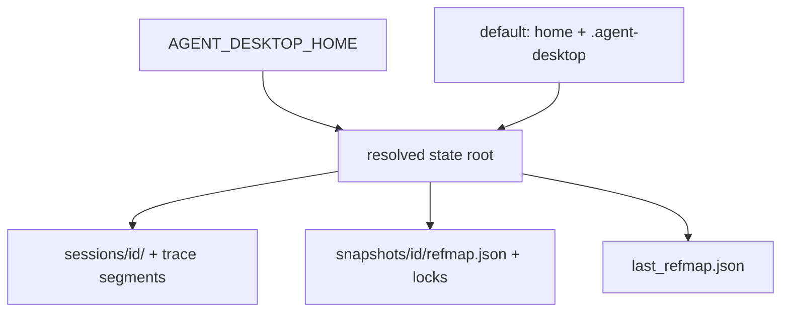
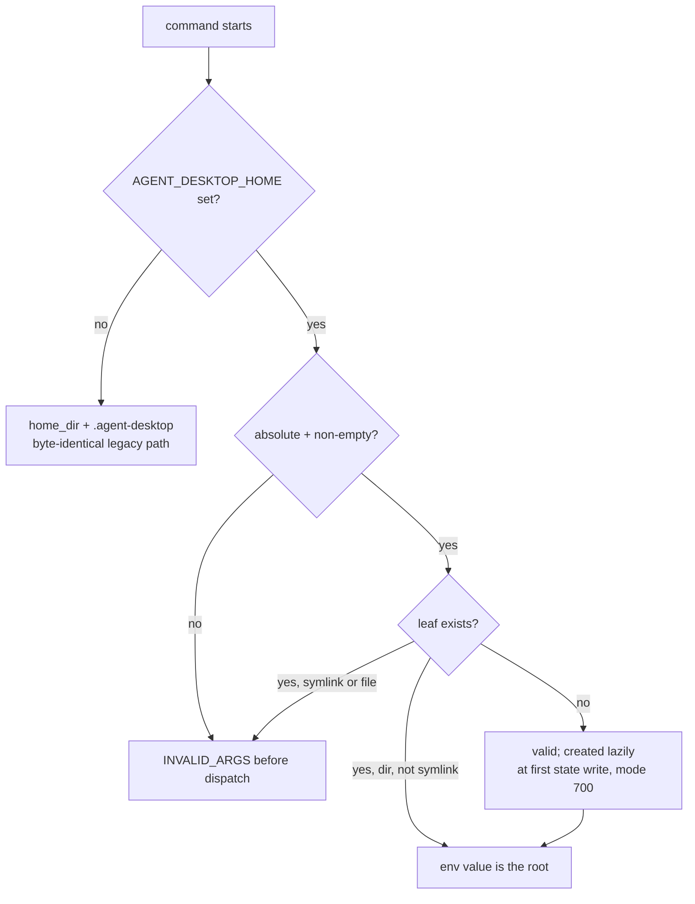

# AGENT_DESKTOP_HOME State Root Relocation - Plan

## Goal Capsule

- **Objective:** Add an `AGENT_DESKTOP_HOME` environment variable that relocates the CLI's entire persisted state root for every subcommand, resolved once in `agent-desktop-core` so behavior is identical on macOS, Windows, and Linux.
- **Product authority:** The invoking brief (VDA adapter integration design, CARGO_HOME pattern) plus this Product Contract.
- **Open blockers:** None.

---

## Product Contract

### Summary

An `AGENT_DESKTOP_HOME` environment variable relocates the whole state root. When set, everything the CLI persists — sessions, snapshot refmaps, trace segments, lock files — lives under that path. When unset, the default stays `~/.agent-desktop`, unchanged. The `status` command reports the resolved root so callers can detect the capability.

### Problem Frame

A sandboxed adapter (VDA) spawns `agent-desktop` per task and needs each spawn's state to live inside the task's sandbox root, so the sandbox wipe is the only cleanup. Today the root is fixed: core resolves the home directory in one helper and joins `.agent-desktop` at four call sites, with no override. The adapter side already composes env vars through an allowlist (the `PLAYWRIGHT_BROWSERS_PATH` precedent), so a fixed root is the only missing piece.

### Key Decisions

- KD1. **Environment variable, not a flag** (session-settled: user-directed — chosen over a per-invocation flag: it applies uniformly to every invocation without threading an injected flag through the model's argv space, and it composes with the existing env-allowlist mechanism). Governs R1, R2.
- KD2. **The env value IS the state root — no `.agent-desktop` suffix appended** (session-settled: user-directed — the acceptance example `/tmp/x/sessions/<id>/` pins this over a prefix-plus-suffix reading). Governs R1.
- KD3. **A future `--state-root` flag wins over the env; the flag itself is deferred** (session-settled: user-directed — env-only ships now; the precedence rule is recorded so the later flag does not need a breaking change). Governs the Scope Boundaries entry.
- KD4. **`status` reports the resolved `state_root`** (session-settled: user-approved — gives the adapter a positive capability signal after release instead of relying only on a version floor). Governs R6.
- KD5. **Validation checks the leaf path only, never ancestors** (session-settled: user-approved — on macOS `/tmp` is itself a symlink to `/private/tmp`, so an ancestor-resolving symlink check would reject the exact acceptance path). Governs R4.
- KD6. **Resolution precedence: test override, then `AGENT_DESKTOP_HOME`, then default home join.** The existing thread-local test hook must beat the env, or a developer with the variable exported in their shell leaks a real root into the test suite. Governs R3.

### Requirements

**Root resolution**

- R1. When `AGENT_DESKTOP_HOME` is set, that path is the state root itself, and every persisted artifact lives under it: sessions at `$AGENT_DESKTOP_HOME/sessions/<id>/`, snapshot refmaps and their lock files, trace segments, and the latest-snapshot inspection artifact. Nothing is written under `~/.agent-desktop` while the variable is set.
- R2. The variable applies to every subcommand with no per-command opt-in, including `session start`/`end`/`list`/`gc`, snapshot namespace lookup, and trace output. Explicit user-given output paths (`screenshot --out`, `--trace <path>`) stay verbatim and are not re-rooted.
- R3. When the variable is unset, path resolution is unchanged from today: home directory (HOME, then USERPROFILE) joined with `.agent-desktop`, behind the existing test override.

**Validation and creation**

- R4. A missing root is created with owner-only permissions where the platform supports it (mode 700 on Unix; default user-profile ACLs on Windows). An existing directory is used as-is with no permission tightening, but on Unix a pre-existing leaf owned by a different uid fails with `INVALID_ARGS`, mirroring the home-directory ownership check. Validation applies to the leaf path only and rejects a leaf that is a symlink or not a directory.
- R5. A relative or empty value fails with `INVALID_ARGS` before any command work runs, matching the empty-value precedent of `AGENT_DESKTOP_SESSION`.

**Observability**

- R6. `status` output includes the resolved `state_root` (the env value when set, otherwise the default path), so a caller can verify relocation without writing state.

**Platform agnosticism**

- R7. Resolution lives entirely in `agent-desktop-core`; no platform crate participates, and behavior is identical across macOS, Windows, and Linux. Any `#[cfg]` branch this adds to core must be executed by an existing CI lane, per `docs/solutions/best-practices/never-ship-platform-code-that-ci-cannot-execute.md`.

**Documentation**

- R8. User-facing docs that state the `~/.agent-desktop` layout (`skills/agent-desktop/`, `CLAUDE.md` ref-system section) name the variable and its semantics.

### Acceptance Examples

- AE1. **Covers R1, R2, R4.** **Given** `AGENT_DESKTOP_HOME=/tmp/x` on macOS (an ancestor-symlink path, since `/tmp` links to `/private/tmp`), **When** `agent-desktop session start` runs, **Then** `/tmp/x/sessions/<id>/session.json` exists, `/tmp/x` was created with owner-only permissions, and nothing new exists under `~/.agent-desktop`.
- AE2. **Covers R2.** **Given** the same environment, **When** `agent-desktop session list` runs, **Then** only session ids under `/tmp/x` resolve.
- AE3. **Covers R5.** **Given** `AGENT_DESKTOP_HOME=relative/path` or an empty value, **When** any command runs, **Then** the command exits 1 with error code `INVALID_ARGS` and writes no state.
- AE4. **Covers R3.** **Given** the variable unset, **When** any command runs, **Then** every state path is identical to today's behavior.
- AE5. **Covers R6.** **Given** `AGENT_DESKTOP_HOME=/tmp/x`, **When** `agent-desktop status` runs, **Then** the JSON body contains `"state_root": "/tmp/x"`.

### Scope Boundaries

- No `--state-root` flag now. When one is added later, the flag wins over the env (per KD3).
- No migration and no dual-root visibility: state under `~/.agent-desktop` is invisible while the variable points elsewhere. That isolation is the goal, not a defect.
- No new cleanup or GC behavior — the caller's sandbox wipe is the cleanup path.
- The VDA adapter side (env injection per spawn, version floor, capability detection) is the consumer's work and out of scope here.

### Sources / Research

- `crates/core/src/refs.rs:251` — `home_dir()`: thread-local test override, then HOME, then USERPROFILE; leaf symlink/directory validation.
- The four `.agent-desktop` join sites, all in core: `crates/core/src/refs_store.rs:38` and `:45` (session-scoped and default `RefStore` constructors), `crates/core/src/refs.rs:151`, `crates/core/src/session/mod.rs:44`.
- `crates/core/src/refs_lock.rs` and `crates/core/src/trace_artifact_budget.rs` — their `std::env::temp_dir()` uses are test-only; production lock files live next to the state they guard, so they relocate with the root.
- `crates/core/src/commands/screenshot.rs:21` — a file is written only when an output path is given; there is no home-derived `--out` default to change.
- `src/cli_args/session.rs` — `start`, `end`, `list`, `gc` all exist.
- `crates/core/src/commands/status.rs` — the `json!` body where `state_root` lands.
- `crates/core/src/session/mod.rs:67` — the `AGENT_DESKTOP_SESSION` empty-value error precedent behind R5 (`AppError::invalid_input_with_suggestion` → `INVALID_ARGS`).
- `crates/core/src/private_file_parent.rs` — `ensure_directory_path()` creates directory chains with mode 700 on Unix and `create_dir_all` on Windows; one of the two creation paths R4 reuses. Session start builds its tree with its own recursive mode-700 `DirBuilder` in `crates/core/src/session/mod.rs` and bypasses this helper.
- `crates/core/src/refs_test_support.rs` — `HomeGuard` test helper (temp home + thread-local override, auto-restore on drop).
- `crates/core/src/commands/status_tests.rs` — field-level `json` assertions; the test placement pattern for the new `state_root` field.
- `crates/core/src/output.rs:7` — envelope version `2.3`; additive `data` fields historically ship without a version bump (`session_id`/`tracing` precedent).
- `docs/solutions/best-practices/never-ship-platform-code-that-ci-cannot-execute.md` — governs the `cfg(unix)` permissions branch; core already carries CI-executed `cfg` branches in `private_file.rs` and `refs.rs`.

---

## Planning Contract

**Product Contract preservation:** changed: R4 — added the Unix uid-ownership rejection for pre-existing roots (security review); otherwise unchanged.

### Key Technical Decisions

- KTD1. **New core module `crates/core/src/state_root.rs` owns resolution; all four join sites call it.** One file per concern (`refs.rs` is near the 400-LOC limit). Both `RefStore` constructors in `refs_store.rs` (session-scoped and default), `refs.rs` (`last_refmap` path), and `session/mod.rs` (`agent_desktop_dir`) delegate to it. Covers R1, R3, R7.
- KTD2. **Resolution precedence: `HOME_OVERRIDE` test hook, then `AGENT_DESKTOP_HOME`, then `home_dir()` + `.agent-desktop`.** The env path must not route through `home_dir()` — a minimal sandbox can set the env with no `HOME`/`USERPROFILE` present, and resolution must still succeed. `HOME_OVERRIDE` is a private thread-local in `refs.rs`, so `refs.rs` gains a `pub(crate)` probe (e.g. `home_override_active()`) that the wrapper checks before it reads the env; the pure resolver takes override state, env value, and home fallback as explicit inputs. The env root's leaf validation mirrors `validate_home_dir`'s Unix uid-ownership rejection per R4 but never walks ancestors. Covers R1, R3, R4.
- KTD3. **The env value is read per invocation with `var_os` (no process-lifetime caching, no UTF-8 requirement).** Resolution stays dynamic; FFI hosts that change the env between calls see the new root on the next state-touching call. Covers R2, R7.
- KTD4. **Every value-side validation failure maps to `INVALID_ARGS` with a suggestion** (relative, empty, leaf symlink, leaf not a directory, foreign-uid leaf on Unix), following the `AGENT_DESKTOP_SESSION` pattern at `crates/core/src/session/mod.rs:67`. Unexpected IO after validation stays `INTERNAL`. (session-settled: user-approved — chosen over ancestor-resolving validation: macOS `/tmp` is a symlink; governs R4, R5.)
- KTD5. **The binary validates `AGENT_DESKTOP_HOME` once before command dispatch; creation stays lazy.** A set-but-invalid value fails every command (including `version` and whole batches) before any work, satisfying AE3 with one preflight in `src/main.rs`. The preflight does not create the root; first state write creates it through the existing owner-only creation paths — `ensure_directory_path()` for refmap writes, and session start's own recursive mode-700 `DirBuilder` tree (mode 700 on Unix, default ACLs on Windows). Read-only commands stay side-effect-free. Covers R2, R4, R5.
- KTD6. **`status` reports `state_root` verbatim — no canonicalization, no trailing-slash edits.** The adapter string-matches the value for capability detection; canonicalizing a symlinked path would break it. When the env is unset, the field carries the default absolute path; when default resolution fails (no HOME), the field is omitted. (session-settled: user-approved — chosen over version-floor-only detection; governs R6.)

### High-Level Technical Design

Directional guidance: the pure resolution function takes the override state, the env value, and a home fallback as explicit inputs so unit tests never touch process-global env vars; a thin wrapper reads the real environment and the override probe.

### Assumptions

Pipeline mode resolved these without a user checkpoint; each is recorded here instead of asked:

- AE3's "any command" is read strictly: `version`, `skills`, and read-only commands also fail on a set-but-invalid value, via the single preflight (KTD5).
- A batch invocation under an invalid value fails as one envelope before any entry runs.
- The FFI cdylib has no preflight surface; a bad value surfaces as `INVALID_ARGS` on the first state-touching call. This asymmetry is accepted.

---

## Implementation Units

### U1. Core state-root resolver

**Goal:** One core function resolves the state root; the three hardcoded join sites delegate to it.
**Requirements:** R1, R2, R3, R4, R5, R7 (KTD1, KTD2, KTD3, KTD4).
**Dependencies:** none.
**Files:** `crates/core/src/state_root.rs` (new), `crates/core/src/lib.rs`, `crates/core/src/refs.rs`, `crates/core/src/refs_store.rs`, `crates/core/src/session/mod.rs`.
**Approach:**
1. Add `state_root.rs`: a pure resolver (override state + env value + home fallback in, `Result<PathBuf>` out) plus a thin wrapper reading `AGENT_DESKTOP_HOME` via `var_os` and the new `pub(crate)` override probe in `refs.rs` (KTD2).
2. Validate per KTD4; checks stay leaf-only and include the Unix uid-ownership rejection for pre-existing leaves (R4).
3. Replace all four `.agent-desktop` joins — `refs_store.rs:38` and `refs_store.rs:45` (both `RefStore` constructors), `refs.rs:151`, `session/mod.rs:44` — with calls to the wrapper.
4. Leave creation to the existing `ensure_directory_path()` path per KTD5.
**Patterns to follow:** `home_dir()`/`validate_home_dir` in `crates/core/src/refs.rs`; `HomeGuard` in `refs_test_support.rs`; error construction at `session/mod.rs:64-69`.
**Test scenarios:**
- Covers AE1/AE2 (core half). Env set to an absolute temp path: session save and lookup paths land under it; nothing lands under the default root.
- Covers AE2. A session-scoped `RefStore::for_session` lookup and the session trace directory both resolve under the env root, never under `~/.agent-desktop`.
- Leaf directory owned by a different uid → `INVALID_ARGS` (Unix).
- Covers AE4. Env unset: resolved path equals `home_dir()` + `.agent-desktop` exactly.
- Relative value → `INVALID_ARGS`; empty value → `INVALID_ARGS`.
- Leaf symlink → `INVALID_ARGS`; leaf is a regular file → `INVALID_ARGS`.
- Path under a symlinked ancestor (e.g. a temp dir inside a symlinked parent) resolves successfully.
- `HOME_OVERRIDE` set and env set: override wins.
- Env set, home fallback absent: resolution still succeeds (pure fn with `None` home).
- Existing directory with unusual permissions is used as-is (no error, no tightening).
**Verification:** `cargo test --lib -p agent-desktop-core` green; new module under 400 LOC; no `unwrap()` outside tests.

### U2. Binary preflight and CLI contract

**Goal:** Every CLI invocation with a set-but-invalid `AGENT_DESKTOP_HOME` exits 1 with `INVALID_ARGS` before dispatch.
**Requirements:** R2, R5 (KTD5); AE3.
**Dependencies:** U1.
**Files:** `src/main.rs`, `src/tests/` (existing CLI contract test module).
**Approach:** After CLI parse and before the command match, call the core validation when the env is set. Convert the error through the existing `AppError` → JSON envelope path. Batch inherits the preflight for free.
**Patterns to follow:** existing `AGENT_DESKTOP_SESSION` resolution call in `src/main.rs:122`; existing binary-level contract tests under `src/tests/`.
**Test scenarios:**
- Covers AE3. Relative value + `version` → exit 1, `INVALID_ARGS`, no state written.
- Covers AE3. Empty value + `session start` → exit 1, `INVALID_ARGS`.
- Valid absolute value + `version` → exit 0 (preflight does not create the root).
- Batch JSON with invalid env → single error envelope, no entries run.
**Verification:** `cargo test -p agent-desktop` green.

### U3. `state_root` in status output

**Goal:** `status` reports the resolved state root verbatim.
**Requirements:** R6 (KTD6); AE5.
**Dependencies:** U1.
**Files:** `crates/core/src/commands/status.rs`, `crates/core/src/commands/status_tests.rs`.
**Approach:** Add the field to the `json!` body from the U1 resolver; omit when default resolution fails. No envelope version bump (additive-field precedent).
**Patterns to follow:** conditional field insertion for `artifacts` in `status.rs`; assertions in `status_tests.rs`.
**Test scenarios:**
- Covers AE5. With override/env root set: body contains `state_root` equal to the exact configured path.
- With defaults: `state_root` equals the default path.
**Verification:** `cargo test --lib -p agent-desktop-core` green; golden fixtures unaffected or regenerated intentionally.

### U4. Documentation

**Goal:** User-facing docs name the variable and its semantics.
**Requirements:** R8.
**Dependencies:** U1-U3 (documents shipped behavior).
**Files:** `skills/agent-desktop/SKILL.md` and/or `skills/agent-desktop/references/commands-system.md`, `CLAUDE.md` (Ref System section).
**Approach:** State: the env value is the root itself; applies to every subcommand; relative/empty errors; `status.state_root` is the detection signal. `CONCEPTS.md` already carries the State Root entry — keep terms consistent with it.
**Test scenarios:** Test expectation: none — documentation only.
**Verification:** docs mention `AGENT_DESKTOP_HOME` wherever the `~/.agent-desktop` layout is stated.

---

## Verification Contract

| Gate | Command | Applies to |
|---|---|---|
| Format | `cargo fmt --all -- --check` | all units |
| Lint | `cargo clippy --all-targets -- -D warnings` | all units |
| Tests | `cargo test --workspace` | U1-U3 |
| Core isolation | `cargo tree -p agent-desktop-core` contains no platform crate names | U1 |
| Cross-compile | `cargo check -p agent-desktop-core --all-targets --target x86_64-pc-windows-msvc` and `--target x86_64-unknown-linux-gnu` | U1 |
| Perf baseline | `bash scripts/perf-baseline-compare.sh` — latency deltas explainable | before merge |

---

## Definition of Done

- R1-R8 hold; AE1-AE5 each covered by at least one passing test.
- All Verification Contract gates green; release binary stays under 15MB.
- Behavior with the variable unset is unchanged (AE4), including error text.
- Docs updated per U4; `CONCEPTS.md` State Root entry stays accurate.
- No abandoned or experimental code remains in the diff.
