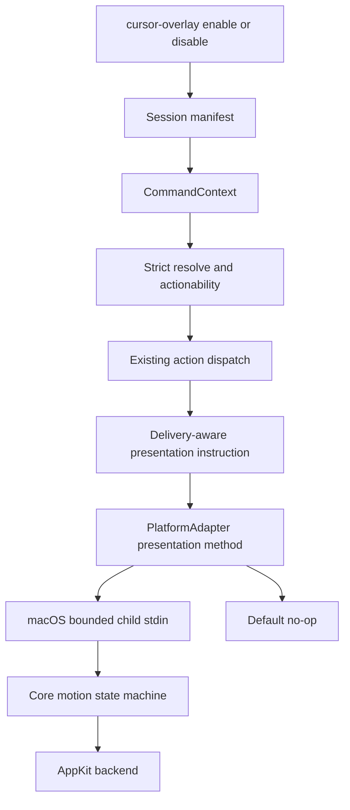
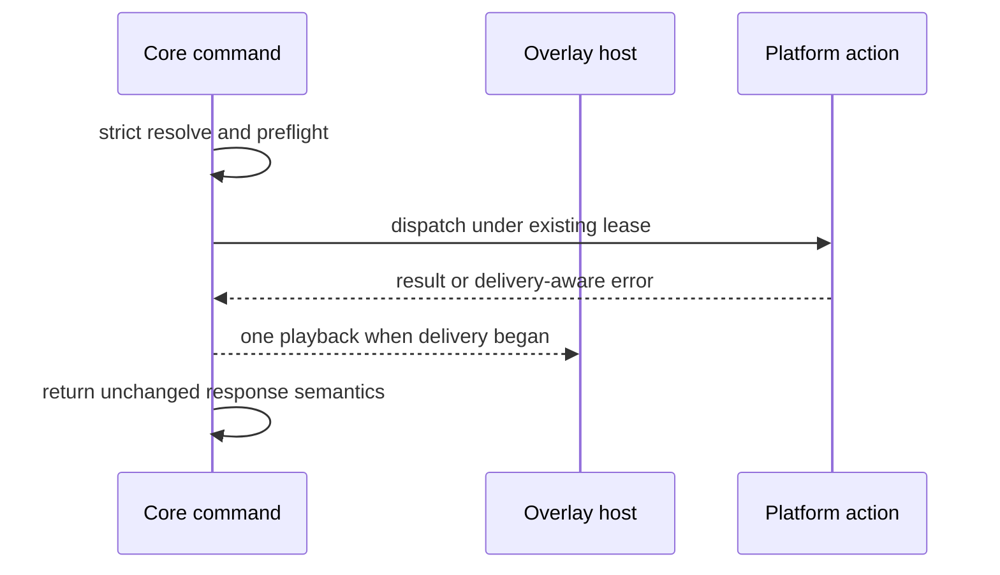
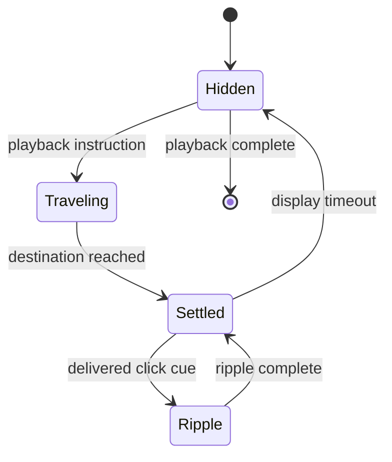

# Native Agent Cursor Overlay

## Goal Capsule

- **Objective:** Let an agent optionally show a smooth, expressive cursor and short intent label at action destinations without moving, replacing, or intercepting the user's OS pointer.
- **Means:** A deterministic shared presentation engine drives a short-lived native overlay host through a fail-soft event channel (KTD2, KTD3, KTD4).
- **Product authority:** The user's accepted cursor prototype direction, this Product Contract, and the existing Interaction Policy contract in `CONCEPTS.md`.
- **Execution profile:** Deep macOS delivery with a platform-neutral seam. Implement U1-U4 and U7 in dependency order; Windows and Linux retain a compiling no-op path until they add only their native renderer.
- **Stop conditions:** Stop if presentation changes action delivery, policy, response data, or native-pointer ownership; stop if macOS lacks executable behavior evidence or another target needs core, CLI, or dispatch changes to remain compatible.
- **Tail ownership:** LFG owns the open-PR and CI tail. It must not merge.

---

## Product Contract

### Summary

Agent Desktop gains an optional custom agent cursor that animates to verified action destinations while the real OS pointer remains untouched. The cursor uses subtle natural motion, compact click feedback, and an optional word-limited description that reveals and breathes without becoming visual noise.

**Product Contract preservation:** R15 and platform scope changed by the user's final direction: macOS ships now, while the shared contract must let Windows and Linux add only their native rendering part later.

### Problem Frame

Headless desktop actions are effective but visually opaque: a person watching the desktop cannot see what target the agent is acting on or what it intends to do next. Reusing the real pointer would make that feedback disruptive and would violate Agent Desktop's headless interaction contract.

The overlay must therefore communicate intent as presentation only. It cannot become a new input mechanism, a shortcut around strict ref resolution, or a reason to weaken delivery and retry semantics.

### Actors

- A1. **Agent caller:** Enables the overlay and may provide a short description for an action.
- A2. **Desktop user:** Sees the agent's visual intent while retaining full ownership of the real pointer and desktop focus.
- A3. **Platform renderer:** Presents the visual cursor without participating in action authority or delivery.

### Key Decisions

- KD1. **Use a separate visual cursor, never the OS pointer** (session-settled: user-directed — chosen over moving or commandeering the native cursor: the user must keep uninterrupted control). Governs R1, R2, R3.
- KD2. **Ship only the macOS renderer behind a platform-neutral seam** (session-settled: user-directed — chosen over implementing three native renderers now: shared motion, configuration, and dispatch stay portable, while Windows and Linux compile through a no-op and later supply only native presentation). Governs R4, R5, R15.
- KD3. **Use an eased minimum-jerk glide with a visible human swing, not spring motion** (session-settled: user-directed — the cursor must accelerate and settle naturally without a conspicuous spring-follow treatment). Governs R6, R7.
- KD4. **Use a compact recognizable pointer with no blue agent dot** (session-settled: user-directed — chosen over the rejected blue circular marker: the visual should read as a cursor without dominating the screen). Governs R8.
- KD5. **Represent clicks with a small neutral water ripple and a distinct pressed state** (session-settled: user-directed — chosen over a large blue click puck: click feedback should feel alive without becoming a spotlight). Governs R9, R10.
- KD6. **Make the nearby description optional, customizable, and word-limited** (session-settled: user-directed — chosen over a static or unbounded label: changing intent should reveal cleanly without producing a large text bubble). Governs R11, R12, R13.
- KD7. **Ship the overlay disabled by default and configure it once per session.** Existing commands keep their current visual behavior until the caller enables the session overlay. Governs R14, R16.
- KD8. **Preserve the current source-window resolution behavior.** The branch's fixed exact-window targeting is the base for overlay destinations, not work to redesign. Governs R5.

### Requirements

**Safety and action integrity**

- R1. The agent cursor is a click-through visual overlay that never moves, clicks, reads, replaces, hides, or intercepts the user's OS pointer.
- R2. Showing the overlay never focuses an application, raises an interaction permission, or changes the selected `InteractionPolicy`.
- R3. Overlay creation, animation, or teardown failure never changes action delivery, JSON output, exit code, retry disposition, or recovery guidance.
- R4. Portable configuration, motion rules, action-to-visual mapping, text bounds, and deterministic behavior belong to shared core code; native surface creation, coordinate conversion, frame scheduling, and drawing belong behind default no-op `PlatformAdapter` presentation methods.
- R5. A ref-targeted visual destination comes only from the live verified point produced by the existing resolve and preflight path, including the exact source-window behavior already fixed on this branch.

**Motion and presence**

- R6. Every overlay-enabled action with a verified screen destination that reaches dispatch animates the custom cursor to that point with a distance-aware minimum-jerk trajectory, clear ease-in/ease-out, and a restrained but visible swing curve.
- R7. Motion follows the display's available frame cadence up to 120 Hz, remains smooth at 60 Hz, and completes quickly enough to feel like action feedback rather than a blocking tutorial.
- R8. The cursor is compact, subtly tilted, immediately recognizable as a pointer, neutral in color, and free of a persistent agent dot or halo.
- R9. Click-family actions switch the arrow briefly into a distinct hand pointer and emit a small neutral ripple centered on the destination only after dispatch has begun.
- R10. The ripple uses short, fading concentric waves and never implies that the application verified the requested outcome.

**Description container**

- R11. The caller may omit the description entirely or provide explicit display text; Agent Desktop never derives display text from typed values, clipboard contents, element values, or other action payloads.
- R12. Description text is capped by a caller-selected maximum word count, defaults to six words, has a bounded hard maximum, and truncates overflow with an ellipsis.
- R13. The container prefers the cursor's bottom-right and uses a solid bright white surface with a 1.5px near-black border. Screen-edge placement may flip it to remain visible, and changed text reveals and breathes subtly.

**Control and coverage**

- R14. A dedicated CLI command enables, configures, or disables the overlay in the selected session manifest; action commands never accept or require a cursor-enable flag.
- R15. macOS ships the native behavior now. Windows and Linux compile against the same target-selected presentation contract through a default no-op, so adding either native renderer requires no core, CLI, batch, action-dispatch, or response-contract redesign.
- R16. Once enabled, every eligible command in the selected session, including batch entries scoped to that session, inherits the stored configuration until it is changed or disabled.
- R17. Existing physical `hover`, `drag`, and mouse commands retain their current headed policy and action meaning; the visual overlay mirrors eligible destinations but never turns a physical hover into a headless application interaction.
- R18. On macOS, the renderer follows the system Reduce Motion preference by replacing travel and breathing motion with a brief non-traveling appearance while preserving destination and click meaning.
- R19. Headed mode never shows the visual overlay because the real OS cursor already represents the action.

### Key Flows

- F1. **Overlay-enabled headless click**
  - **Trigger:** A1 runs a semantic click with the overlay enabled.
  - **Steps:** Agent Desktop strictly resolves the ref, verifies the live destination, dispatches using the existing policy, and then submits one delivery-aware custom-cursor playback without touching the native pointer.
  - **Outcome:** A2 sees where the agent acted while the command's delivery contract remains unchanged.
  - **Covered by:** R1, R2, R3, R5, R6, R9.
- F2. **Description appearance or change**
  - **Trigger:** An eligible action supplies a new explicit description.
  - **Steps:** The description is word-limited, positioned safely near the destination, and revealed with a fresh transition before settling into a subtle breath.
  - **Outcome:** A2 can read the agent's immediate intent without a persistent or oversized panel.
  - **Covered by:** R11, R12, R13.
- F3. **Overlay unavailable**
  - **Trigger:** The compositor, display, or native overlay surface is unavailable.
  - **Steps:** The renderer skips presentation and tears down any partial visual state without modifying the action response.
  - **Outcome:** Automation remains truthful and usable even when presentation is unavailable.
  - **Covered by:** R3, R15.
- F4. **Overlay disabled**
  - **Trigger:** The caller leaves the feature off or explicitly disables it.
  - **Steps:** Agent Desktop executes the existing command path with no renderer invocation.
  - **Outcome:** Behavior, latency, and output match the pre-overlay CLI.
  - **Covered by:** R14.

### Acceptance Examples

- AE1. **Covers R1, R2, R5, R6, R9.** **Given** an overlay-enabled strict headless click on a live ref, **When** dispatch has begun, **Then** the custom cursor glides to the verified point and emits its compact pressed ripple while the OS pointer position and application focus remain unchanged by the overlay.
- AE2. **Covers R3, R5, R9.** **Given** a stale, ambiguous, occluded, or otherwise preflight-rejected target, **When** the command fails before dispatch, **Then** no click ripple is shown and the original structured error is returned unchanged.
- AE3. **Covers R10.** **Given** dispatch begins but application-state verification later fails, **When** the ripple is shown, **Then** the command still reports the real unverified or failed outcome; the ripple is never treated as proof of success.
- AE4. **Covers R11, R12, R13.** **Given** the description `Opening the profile menu for this account now` with a five-word limit, **When** it appears, **Then** the visible text is `Opening the profile menu for…`, the container reveals again, and it remains clear of the destination and screen edges.
- AE5. **Covers R13.** **Given** one eligible action changes the visible description from the previous action, **When** the new text arrives, **Then** the container performs a fresh reveal instead of swapping text abruptly.
- AE6. **Covers R3, R15.** **Given** the macOS overlay cannot start, or the selected target has no native renderer, **When** an otherwise valid action runs, **Then** the command keeps its original JSON body, exit code, delivery semantics, and retry guidance.
- AE7. **Covers R14.** **Given** the overlay is disabled, **When** the same command runs, **Then** no visual surface is created and the command path is behaviorally identical to the current branch.
- AE8. **Covers R17.** **Given** a headless invocation of the existing physical `hover` command, **When** the overlay feature is enabled, **Then** the command still returns its existing policy denial rather than pretending the application was hovered.
- AE9. **Covers R18.** **Given** macOS Reduce Motion is enabled, **When** an eligible action presents the cursor, **Then** the cursor appears at the verified destination without traveling or breathing and any eligible click cue remains compact.
- AE10. **Covers R19.** **Given** a session with the overlay enabled, **When** an eligible command runs with `--headed`, **Then** only the real OS cursor is used and no overlay child starts.

### Success Criteria

- On a 60 Hz macOS display, the native renderer shows no visible frame skipping during a normal glide; on a 120 Hz display it can use the higher cadence without changing the motion shape.
- Enabling the overlay cannot be detected through OS pointer position, focus, interaction policy, action mechanism, or delivery semantics.
- Description changes and click feedback remain readable at normal desktop scale without obscuring the action target.
- macOS Reduce Motion produces no cursor travel or breathing animation.
- macOS has behavior-level evidence for click-through input handling, coordinate mapping, teardown, and native-pointer non-displacement. Shared tests prove the portable contract, and Windows/Linux builds prove the default no-op requires no integration changes.

### Scope Boundaries

**In scope**

- CLI and batch presentation for eligible verified action destinations.
- Shared motion, labeling, configuration, and fail-soft behavior.
- A platform-neutral presentation seam plus the macOS native transparent overlay surface.

**Deferred to follow-up work**

- FFI, language-binding, MCP, or plugin configuration parity.
- Native Windows and Linux renderer modules; their future scope is limited to target-specific surface, coordinate, frame, and drawing code behind the existing seam.
- Additional cursor or description-card themes beyond the fixed neutral treatment.
- Long-lived visualization history, recordings, trails, or multi-agent cursor identities.

**Outside this product's identity**

- Moving or synthesizing input through the custom cursor.
- Replacing the system cursor or hiding it from the user.
- Browser DOM injection or a browser-only cursor implementation.
- Treating visual feedback as verification that an application changed state.
- Reopening the branch's source-window resolution fix.

### Assumptions Deferred to Planning

- Planning may choose a bounded helper, short-lived native host, or self-contained playback lifecycle. The chosen approach must preserve smooth motion between actions where practical, avoid holding the interaction lease, and satisfy R3 and R7.
- Planning may finalize the dedicated command spelling and bounded maximum label size while preserving session-scoped opt-in, the disable path, and the six-word default required above.

### Sources / Research

- `docs/prototypes/2026-08-20-native-cursor-motion/decisions.md` — local-only accepted motion, cursor, click-ripple, description, and core/platform separation decisions; intentionally ignored by Git.
- `docs/prototypes/2026-08-20-native-cursor-motion/01-motion-comparison/` — local-only standalone Rust/AppKit prototype and reproduction instructions; intentionally ignored by Git.
- `CONCEPTS.md` — canonical Interaction Policy, Headless Ref Action, Coordinate Fallback, and exact source-window behavior.
- `docs/solutions/best-practices/macos-gesture-headless-capability-2026-06-10.md` — portable policy belongs in core while native capability belongs in platform adapters.
- `docs/solutions/best-practices/preserve-command-policy-semantics-during-refactor-2026-05-12.md` — shared mechanics must not flatten action-specific policy or verification.
- `docs/solutions/best-practices/playwright-grade-desktop-reliability-2026-06-02.md` — live resolution and preflight remain authoritative before dispatch.
- `docs/solutions/documentation-gaps/hover-drag-skip-the-actionability-battery.md` — physical pointer commands retain their dedicated headed reliability pipeline.
- `docs/solutions/best-practices/never-ship-platform-code-that-ci-cannot-execute.md` — every platform branch requires executable behavior evidence.

---

## Planning Contract

### Key Technical Decisions

- KTD1. **Persist presentation configuration in the existing session manifest.** A dedicated command updates it once; each selected session loads it into `CommandContext`, and batch entries inherit the configuration of their selected session. Action commands, FFI, and MCP remain unchanged. Governs R3, R11, R14, R16.
- KTD2. **Submit one fail-soft presentation instruction after action dispatch returns.** Strict resolution, actionability, and policy gates run first. Success or a delivery-aware result that confirms dispatch began may request playback; preflight and not-delivered failures request nothing. Submission errors are warning-only and never alter the action result. Governs R3, R5, R9, R10.
- KTD3. **Run one bounded overlay child through a hidden mode of the shipped executable.** The parent writes one bounded instruction to the child's inherited stdin, closes the pipe, and never waits on animation. This keeps rendering outside the Interaction Lease without a daemon, endpoint, token, second binary, or persistent state. Governs R2, R3, R7, R16.
- KTD4. **Extend the existing `PlatformAdapter` with default no-op presentation methods.** Core owns minimum-jerk travel, the restrained arc, reveal/breathe/ripple timing, bounds placement, action-to-cue mapping, and delivery-aware invocation. A platform override owns child startup, frame clocks, coordinate conversion, native surfaces, and drawing. Windows and Linux inherit the default without source changes. Governs R4, R6-R10, R13, R15.
- KTD5. **Implement only the macOS native surface now.** Extract the accepted AppKit/Core Animation prototype into the macOS adapter. Other adapters inherit the default no-op and gain no placeholder native code or dependencies. Governs R1-R3, R7, R13, R15.
- KTD6. **Expose dedicated session-scoped enable and disable commands.** `cursor-overlay enable` accepts an optional caller-authored label with a six-word default capped at twelve; `cursor-overlay disable` clears the session setting. No action or batch entry accepts a cursor flag. Governs R11-R14, R16, R19.

### Assumptions

- The overlay child exits after the final short playback; no cross-process cursor continuity is promised in this shipment.
- A single command's click cue stays attached to its verified destination. A later command owns a separate bounded playback.

### High-Level Technical Design

### System-Wide Impact

- **Command contracts:** The CLI gains one session-scoped cursor-overlay command. Action and batch-entry schemas, JSON success/error envelopes, Interaction Policy, action mechanisms, post-action waits, and FFI stay unchanged.
- **Process lifecycle:** An enabled macOS command may start one bounded child of the current executable and write one instruction through inherited stdin. Spawn, pipe, renderer, or teardown failure only skips presentation.
- **Privacy and security:** Labels never derive from action payloads, never enter child-process arguments, and are bounded before transport. The child accepts inherited stdin only; there is no listening endpoint or persistent credential.
- **Performance:** Disabled mode does not connect, spawn, allocate frames, or add adapter reads. Enabled submission is bounded and occurs outside animation work; the required performance baseline detects command-latency regression.

### Risks and Mitigations

- **A visual cue could overstate delivery.** Submit playback only after the result proves dispatch began and key the click cue to delivery semantics, never verification.
- **Future platform work could leak into shared layers.** Contract tests pin the adapter methods and default no-op; Windows/Linux renderer work is rejected if it changes core, CLI, batch, action dispatch, or response schemas.
- **Multiple rapid CLI processes can briefly overlap visuals.** Accept that bounded ceiling for the first macOS shipment; add cross-process coordination only if dogfood shows visible overlap.

---

## Implementation Units

### U1. Shared cursor contract and motion engine

- **Goal:** Add bounded configuration, event, frame, protocol, and deterministic motion types without platform dependencies.
- **Requirements:** R3, R4, R6-R13, R15, R18.
- **Dependencies:** None.
- **Files:** `crates/core/src/cursor_overlay/`, `crates/core/src/adapter/{actions,system}.rs`, `crates/core/src/lib.rs`, `crates/core/src/rect.rs`, `crates/core/src/cursor_overlay/tests.rs`.
- **Approach:** Implement the accepted minimum-jerk curve, 9% bounded swing arc, distance-aware duration, reveal/breathe/ripple state, word limiting, edge placement, and bounded stdin protocol. Keep each domain type in its own file.
- **Patterns to follow:** `crates/core/src/trace.rs` for bounded sanitized data and existing serde request types for strict protocol decoding.
- **Test scenarios:** Covers AE4/AE5: Unicode word limits and changed labels reveal again. At 60/120 Hz the same timestamps produce the same path and terminal point. Ripple begins only for a delivered-click event, and invalid/beyond-limit protocol input is rejected.
- **Verification:** Pure core tests prove deterministic positions, timing bounds, state transitions, label limits, the default no-op adapter contract, and no platform-crate dependency.

### U2. Session-scoped CLI and context configuration

- **Goal:** Add one persistent session-scoped enable/disable command and load that configuration for every selected-session command.
- **Requirements:** R11-R14, R16, R19.
- **Dependencies:** U1.
- **Files:** `src/cli_args/cursor_overlay.rs`, `src/cli_args/cursor_overlay_enable.rs`, `src/cli/mod.rs`, `src/dispatch/cursor_overlay.rs`, `crates/core/src/commands/cursor_overlay.rs`, `crates/core/src/session/manifest.rs`, `crates/core/src/session/mod.rs`, `crates/core/src/context.rs`, `src/cli/contract_tests.rs`, `src/batch/tests.rs`.
- **Approach:** Persist validated configuration in the selected session manifest through `cursor-overlay enable|disable`, then load it once into each `CommandContext`. Batch entries inherit the manifest of their selected session. Keep action schemas unchanged and suppress presentation whenever the context is headed.
- **Test scenarios:** Covers AE7/AE10: absent or disabled session settings create no presentation request, and headed mode suppresses an enabled session overlay. Enable accepts 1-12 words; zero or overflow fails as invalid input. Single commands and batch entries scoped to the same session load identical configuration.
- **Verification:** CLI help, clap parsing, serde denial of unknown fields, and batch context tests pin the public input contract.

### U3. Delivery-aware action integration

- **Goal:** Emit presentation events from verified ref-action destinations without changing action behavior.
- **Requirements:** R1-R3, R5, R9, R10, R16, R17; F1-F4.
- **Dependencies:** U1, U2.
- **Files:** `crates/core/src/ref_action.rs`, `crates/core/src/ref_action/presentation.rs`, `crates/core/src/actionability/report.rs`, and related tests.
- **Approach:** Carry a presentation point separately from physical-delivery hit-test evidence. Keep the near-limit ref-action file focused by placing event selection in its presentation submodule. Dispatch through the unchanged action path, then submit one move/label/click instruction only for success or a delivery-aware failure that confirms dispatch began. Ignore presentation errors after tracing a sanitized warning.
- **Test scenarios:** Covers AE1-AE3/AE8: stale, ambiguous, occluded, policy-denied, or not-delivered paths emit nothing; successful click emits one playback instruction without modifying policy; post-dispatch verification failure may emit a ripple when delivery began but keeps its original response. Headed and raw pointer commands use the real cursor and do not enter the overlay path.
- **Verification:** Mock backends assert exact event ordering and byte-equivalent command results with presentation enabled, disabled, and failing.

### U4. macOS native overlay child

- **Goal:** Productionize the accepted AppKit/Core Animation prototype as a click-through, no-focus renderer.
- **Requirements:** R1-R3, R6-R10, R13, R15, R18; AE1, AE4-AE7, AE9.
- **Dependencies:** U1-U3.
- **Files:** `crates/macos/src/system/cursor_overlay/`, `crates/macos/src/system/mod.rs`, `crates/macos/src/adapter.rs`, `src/cursor_overlay.rs`, `src/main.rs`, `crates/macos/src/system/cursor_overlay/tests.rs`, `tests/e2e/scenarios/interaction.sh`.
- **Approach:** Reuse the prototype's corrected pointer, neutral waves, AppKit window flags, screen clamping, display cadence, and native Reduce Motion preference. Override the existing adapter presentation methods. Route child mode before clap/tracing through the already target-selected adapter, read one instruction from inherited stdin, silence child stdout/stderr, and pump only the child's native event loop.
- **Test scenarios:** The fixture test records OS pointer and focus before/during/after playback, confirms both remain unchanged, verifies click-through against the underlying harmless target, and captures normal, reduced-motion, and edge-position screenshots. Renderer creation or child startup failure leaves the command response unchanged and cannot contaminate stdout JSON.
- **Verification:** macOS unit tests plus a permissioned release-binary fixture run provide behavior evidence; no user-data application is mutated.

### U7. Distribution, documentation, and release proof

- **Goal:** Make the hidden host and public flags shippable without regressing size, latency, or existing contracts.
- **Requirements:** R3, R7, R14-R18 and all Success Criteria.
- **Dependencies:** U1-U4.
- **Files:** `README.md`, `docs/json-output.md`, relevant release/package smoke tests; `.github/workflows/ci.yml` only if existing gates do not already execute the added tests.
- **Approach:** Keep the child mode inside the existing executable so archive layouts stay unchanged. Document the macOS capability and platform implementation seam, pin default no-op target wiring, and preserve size/performance gates; do not add overlay fields to JSON responses.
- **Test scenarios:** Release archives still contain the same required executables; default-off invocations have equivalent output and latency; enabled macOS playback meets 60/120 Hz frame-shape expectations; Windows/Linux compile without native cursor dependencies; every executable stays under 15 MB.
- **Verification:** CI, package smoke tests, macOS renderer evidence, cross-target no-op checks, and the repository performance baseline all pass on the final diff.

---

## Verification Contract

| Gate | Command or evidence | Proves |
|---|---|---|
| Format and lint | `cargo fmt --all -- --check`; `cargo clippy --all-targets -- -D warnings` | Repository style and zero warnings |
| Workspace tests | `cargo test --lib --workspace` | Shared, CLI, batch, and platform unit contracts |
| Dependency inversion | `cargo tree -p agent-desktop-core` | Core imports no platform crate |
| Native behavior | macOS fixture release run with normal and Reduce Motion settings | Click-through, no focus/pointer displacement, coordinates, teardown, accessibility, fail-soft behavior |
| Platform seam | Core mock/no-op tests plus existing Windows/Linux target checks | Future native modules need only implement target-specific presentation |
| Output compatibility | Golden CLI/batch success and error comparisons with cursor off/on/backend failure | R3 and default-off compatibility |
| Performance | `bash scripts/perf-baseline-compare.sh` against the merge-base | Disabled-path latency stays flat and enabled overhead is intentional |
| Distribution | Release/package smoke checks and 15 MB executable-size gates | Hidden child mode ships on macOS without archive drift; other targets remain unchanged |

---

## Definition of Done

- U1-U4 and U7 verification outcomes pass, and every Product Requirement has unit or gate coverage.
- Default-off commands perform no overlay connection, spawn, frame, or display work and keep existing JSON plus exit semantics.
- Enabled presentation never changes the native pointer, focus, Interaction Policy, delivery disposition, retry guidance, post-action wait, or trace sanitization.
- macOS has executable native evidence for click-through input handling, coordinate mapping, teardown, and pointer non-displacement; Windows/Linux retain compiling default no-op wiring without native implementation changes.
- Description text is caller-authored, bounded before transport, absent from child-process argv and unsanitized trace fields, and never derived from typed or clipboard values.
- macOS honors the system Reduce Motion preference without adding a second product setting.
- The final release binary remains under 15 MB, the performance comparison is reviewed, and abandoned prototype-only or dead-end production code is absent from the diff.
- A future Windows or Linux renderer can be added by overriding the target adapter's presentation methods without changing shared core behavior, CLI/batch parsing, action dispatch, binary routing, or response schemas.
- The source-window resolution behavior on this branch remains intact and covered; the implementation does not reopen it.
