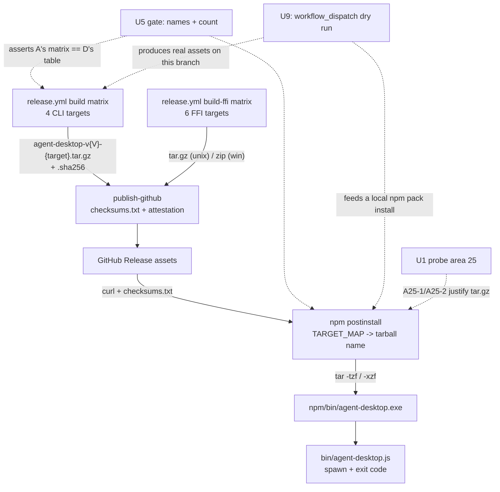

# FFI, npm, Release (Sub-phase 2.13) - Plan

## Goal Capsule

- **Objective:** Make the Windows adapter reachable through every distribution channel that already ships for macOS, and make the documents that describe it true. Everything this sub-phase makes reachable already works and is already unreachable: 2.2 through 2.12 shipped observation, semantic actions, input synthesis, process and window lifecycle, capture, clipboard, signals and a live e2e harness. The adapter is not *finished* — §2.14 still owes shell surfaces, notification management, tray, and launch by display name, and `A24-11` leaves unnamed Chromium content elements unresolvable through the semantic tier — which is why this sub-phase's hardest problem is saying exactly what "Windows is supported" means rather than writing the packaging code. `npm/scripts/postinstall.js:46` reads `const SUPPORTED_PLATFORMS = ['darwin'];` and prints *"Windows and Linux support is coming in Phase 2"* on every Windows install; `.github/workflows/release.yml:134-137` matrixes the CLI build over `aarch64-apple-darwin` and `x86_64-apple-darwin` only, so no Windows `.exe` has ever been published; `README.md:412-423` still says **Planned** in six rows that are shipped. This sub-phase is packaging and truth-telling, not adapter code — no `PlatformAdapter` method is added and no UIA call is written.
- **Authority hierarchy:** `docs/phases.md` §2.13 and §Release, Skill & Docs > `probes/windows/FINDINGS.md` > measured evidence gathered by this plan's probe area > vendor documentation cited here > this plan > implementer judgment. Where measured evidence contradicts a document, U10 amends the document in this same PR rather than planning around it.
- **Stop conditions:** Do not implement `list_surfaces`, notification management, or system tray on Windows (§2.14 owns all three). Do not implement Windows cursor-overlay rendering. Do not migrate npm distribution to `optionalDependencies` (KTD3). Do not sign binaries (KTD5). Do not touch `crates/macos`, and do not change any macOS release asset's name, shape, or contents. Do not add a `#[cfg(windows)]` to `crates/core`: CI pins the count at exactly two shims in `crates/core/src/private_file.rs` and fails on a third (`.github/workflows/ci.yml:363-390`). Do not carry 2.12's residual scroll-ladder and headed-double-click work — that is its own PR by the owner's decision.
- **Execution profile:** One PR from `feat/windows-2.13-ffi-npm-release` into `feat/windows-adapter`, never `main`. Workflow changes, npm package changes, one FFI test with its own fixture, one new skill package, README and `docs/phases.md` corrections, and probe area 25. Conventional Commits, authored by Lahfir, no co-authors. See §LOC Budget — the origin's `~1.2k LOC` estimate holds for product code once documentation and the probe corpus are counted separately, as this document's own delivery model directs.
- **Tail ownership:** The implementer opens the PR against `feat/windows-adapter` and reports the Verification Contract results, including the release dry-run's run URL and the artifacts it produced.

---

## Product Contract

### Summary

Three channels carry agent-desktop to a user: a GitHub Release asset, an npm package that downloads that asset, and an FFI cdylib for embedders. Windows is absent from the first, gated out of the second, and present-but-unproven in the third. The work is small in each channel and the risk is concentrated in one place: **every exit criterion this sub-phase's scope states is about published software, and nothing published is reachable from a sub-phase branch.** `npm publish` and `gh release create` fire from `main` (`.github/workflows/release.yml:3-8`), and Windows reaches `main` exactly once, at the end of Phase 2. A plan that writes *"`npm install -g` works on Windows"* as its gate writes a gate this PR cannot run, which is the shape this repository names as a defect in its own right (`docs/solutions/best-practices/a-test-that-cannot-fail-is-not-coverage.md`). So the design question is not *what to build* — the code is nearly obvious — it is *what proof is available before publication*, and every requirement below is stated in a form this PR can falsify.

The second theme is that the documents are the deliverable. `skills/agent-desktop-windows/SKILL.md` and the README platform table are read by agents and users as statements of fact about what the binary does. Six README rows are wrong in the pessimistic direction today, and three claims would be wrong in the optimistic direction if the table were flipped naively: `list-surfaces`, notification management, and cursor-overlay rendering do not work on Windows. Getting those three right is the difference between a truthful document and a marketing one.

### Problem Frame

**The gate that matters is unfalsifiable as `docs/phases.md` states it, and the fix is to restate it in pre-publication terms.** §2.13's exit criteria read *"`npm install -g` works on Windows; release dry-run artifacts verified."* The second half is already the right shape and the first half is not. `release.yml` runs on push to `main` or `workflow_dispatch`, and `build`, `build-ffi` and `ffi-release-gates` each carry `if: needs.release-please.outputs.release_created == 'true'` (`release.yml:127, 206, 365`), which a push only satisfies on a release commit on `main`; `publish-github` carries no condition of its own (`:415`) and is gated transitively by skip-propagation from those `needs`. This sub-phase therefore proves the chain in two verifiable halves that meet in the middle: a `workflow_dispatch` run of the build jobs on this branch produces the real Windows assets, and the npm package installs **from those artifacts** on this machine. What remains unproven at merge is only the GitHub-Release *hosting* of an asset the workflow demonstrably produced — a step whose Windows-specific content is zero, since `publish-github` globs `*.tar.gz` / `*.zip` and is target-agnostic (`release.yml:445-459`).

**The Windows environment already provides everything the existing macOS install path needs, which removes an entire branch this sub-phase would otherwise have to write.** `postinstall.js` downloads with `curl` (`:68-80`) and lists and extracts with `tar -tzf` / `tar -xzf` (`:126, :148`). The conventional assumption is that Windows needs a `.zip` and a Node-side unzip, because Node ships no archive support. Measured on the Windows Server 2019 box this plan was written on: `C:\Windows\System32\curl.exe` is curl 8.9.1 and `C:\Windows\System32\tar.exe` is bsdtar 3.5.2, both in `System32` and therefore always on `PATH`; a create-list-extract round trip of a gzip tarball containing `agent-desktop.exe` succeeds. Microsoft has shipped both in-box since Windows 10 build 17063, comfortably below the 1809 API floor this phase already requires (§Minimum OS Requirements). U1 records this as probe rows rather than leaving it as a paragraph, because the entire archive-format decision (KTD1) rests on it, and a decision resting on an unrecorded observation is a guess with a confident tone.

**The npm package holds the platform mapping three times, and this sub-phase adds a fourth platform to each.** `TARGET_MAP` and `BINARY_NAME_MAP` in `npm/scripts/postinstall.js:30-44`, `platformMap` in `npm/bin/agent-desktop.js:16-22`, and a `uname`-keyed `case` in `scripts/ci-npm-wrapper-smoke.sh:7-14` are three independently-maintained copies of one fact. They already disagree: postinstall's `SUPPORTED_PLATFORMS` gate refuses `win32` while both of its maps carry complete, unreachable `win32-x64` entries, and the wrapper's map carries the same entry with no gate at all — so a Windows user today gets *"binary not found"* from the wrapper rather than the *"macOS only"* message postinstall printed minutes earlier. This is `a-test-that-cannot-fail-is-not-coverage.md`'s hand-maintained-parallel-list shape, and adding `win32-arm64` to three lists is how three disagreements become four.

**Nothing checks that the asset name npm asks for is the asset name the release produces.** postinstall builds `agent-desktop-v${version}-${target}.tar.gz` (`:271`) and `release.yml:179` builds the same string from its matrix, and the agreement is a coincidence maintained by hand. `scripts/check-release-consistency.sh` enforces version equality across `Cargo.toml`, `npm/package.json`, `.release-please-manifest.json` and `Cargo.lock` (`:56-84`) and says nothing about asset names. `scripts/check-npm-package.js` verifies the packed file list, the `bin` entry, and `release.yml`'s npm-publish security properties (`:137-173`) and says nothing about targets. A Windows target added to one side and not the other produces a package that installs cleanly on macOS, passes every gate, and 404s on every Windows machine — discovered by users, after publication. U5 closes this, and it is the highest-value gate in the sub-phase because it is the only one that can fail *before* the thing it protects becomes unreachable.

**The FFI claim in `docs/phases.md` §2.13 is wrong in both halves, and the real gap is narrower and different.** The scope reads *"the stub-adapter tests already run cross-platform in CI, but the real `WindowsAdapter` behind the C ABI needs its own pass."* Neither clause holds. The stub passthrough job runs on `ubuntu-latest` only (`.github/workflows/ci.yml:689-713`, `--features stub-adapter --test c_abi_passthrough`), so it is not cross-platform. And the real `WindowsAdapter` already gets a pass: `stub-adapter` is not a default feature (`crates/ffi/Cargo.toml:9`), so `build_adapter` compiles in `agent_desktop_windows::WindowsAdapter` (`crates/ffi/src/adapter.rs:115-119`), and `ci.yml:427` runs `cargo test --locked -p agent-desktop-ffi --tests` on `windows-latest` against exactly that. Measured on this box: 182 lib tests and 91 integration tests pass on Windows with no stub feature. **Exactly one thing is actually missing, and this plan initially claimed two.** The first draft asserted that `-p agent-desktop-ffi --lib` never runs on a Windows lane, reasoning that the Windows lane's `--lib` invocation names only `-p agent-desktop-core -p agent-desktop-windows` (`ci.yml:411`). That is wrong, and the correction is recorded here rather than quietly dropped because it is the same mistake the origin document made: `cargo test --tests` builds and runs every target with `test = true`, **including the library's own unittest target**. Verified on this box — `cargo test --locked -p agent-desktop-ffi --tests --no-run` lists `Executable unittests src\lib.rs` alongside the twenty-three integration binaries — so `ci.yml:427` already executes all 182 lib tests on `windows-latest`. Had this plan shipped its first draft, U10 would have written a brand-new false statement into the document the next sub-phase's planner reads as fact. What remains true is the second gap: no test anywhere drives a **real window** through the C ABI. `c_abi_snapshot.rs` asserts envelope shape against whatever the desktop happens to contain, and `c_abi_execute_by_ref.rs`'s round-trip test is named `execute_by_ref_returns_error_envelope_when_no_refmap_exists` and deliberately never snapshots first. U10 corrects the origin document to name that one gap; U6 closes it, and pins the `--tests` coverage so a later flag change cannot silently narrow the lane back out.

**The Windows FFI release archive omits the MSVC import library, so a linking consumer gets nothing to link against.** `release.yml:294-306` stages `target/${target}/release-ffi/${lib_name}` and for Windows `lib_name` is `agent_desktop_ffi.dll`. Built on this box at the pinned profile, `cargo` also produces `agent_desktop_ffi.dll.lib` (26,298 bytes) and `agent_desktop_ffi.pdb`. `dlopen` / `ctypes` / `ffi-napi` consumers resolve by path and need neither, which is why this has gone unnoticed; a C++ or Rust consumer linking against the DLL on MSVC needs the `.lib` and cannot produce one from the shipped archive. The archive's own generated README already tells macOS linking consumers what they need (`release.yml:315-317`); the Windows equivalent is absent because the file is.

**Adding a skill directory on disk does not make the binary serve it.** `crates/core/src/commands/skills.rs:4-26` embeds every skill file through an individually-written `include_str!` and lists them in a static `SKILLS` array (`:92-107`); there is no directory walk. A `skills/agent-desktop-windows/SKILL.md` committed without a matching edit to that file is invisible to `agent-desktop skills list` and `skills get`, and **nothing detects it** — `crates/core/src/commands/skills_tests.rs` asserts only that the two currently-known skills exist. `scripts/check-no-phase-references.sh` already scans `skills/` for plan references (`:53-54`, `TOKEN_SCAN_MD_ROOTS="skills"`) precisely because those files are embedded, so the project has already reasoned once about this directory being part of the binary; the coverage half of that reasoning is missing. This is `an-enforcement-gate-must-cover-everything-the-binary-embeds.md` with the gate absent rather than mis-scoped, and U7 closes it.

**Flipping the README platform table naively would replace six pessimistic errors with three optimistic ones.** Against the adapter as it stands: `ObservationOps::list_surfaces` has no Windows override, so `list-surfaces` returns `PLATFORM_NOT_SUPPORTED`; the four notification methods have no Windows override, which is correct and §2.14's to change; and `update_cursor_overlay` is not overridden either, so Windows inherits core's `Ok(())` default and `cursor-overlay enable` reports success while nothing renders. The first two are honest refusals the CLI already surfaces. The third is the one shape the cross-cutting DoD singles out — *"the CLI surfaces `PLATFORM_NOT_SUPPORTED` honestly rather than a stub success"* — and it is worth being precise about why 2.13 does not close it, because "we chose not to" and "we could not" are different answers. **Overriding the adapter method would change nothing.** `src/dispatch/cursor_overlay.rs:34-39` calls `adapter.update_cursor_overlay` inside an `if let Err(...)` that logs a `tracing::warn!` and falls through to `Ok(value)` — the adapter's answer is swallowed by construction, so a Windows override returning `not_supported()` would produce the identical `ok: true` envelope with one more warning nobody reads. Making the command honest means changing the dispatch to propagate, which changes the contract on macOS too, for a command whose session-scoped setting genuinely *is* recorded correctly on both platforms. That is a decision about a shipped cross-platform command, not a Windows packaging question, and U10 writes it into §2.15's scope where a hardening review can weigh it. 2.13 handles all three by documentation: the capability tables it writes say what is true, and R20 makes that falsifiable.

**No row in `probes/windows/FINDINGS.md` names sub-phase 2.13**, so the cross-cutting row-disposition obligation is discharged by verification rather than by work — stated here because "no rows named this sub-phase" and "nobody checked" are indistinguishable in a report that omits it. The corpus runs to area 24 and `.github/workflows/windows-capability-probe.yml` registers areas 14-24, so 2.13's area is **25** and must be registered in the same PR, in both the `paths` filter and a run step.

### Requirements

Release assets:

- R1. **A Windows CLI release asset is produced for `x86_64-pc-windows-msvc` and `aarch64-pc-windows-msvc`**, named by the same `agent-desktop-v${VERSION}-${target}.tar.gz` template every existing target uses (`release.yml:179`). The macOS legs keep their current runner, steps, asset names and archive contents byte for byte.
- R2. **The Windows archive contains exactly one entry, `agent-desktop.exe`.** There is no Windows analogue of `agent-desktop-macos-helper`, so the archive shape differs from macOS by exactly that omission and by nothing else.
- R3. **Every new asset carries a SHA-256 line in `checksums.txt` and is covered by the existing provenance attestation.** `publish-github` concatenates `*.sha256` and attests `*.tar.gz` / `*.zip` / `checksums.txt` (`release.yml:431-459`), so this holds by construction provided the Windows leg emits a `.sha256` beside its archive in the format the concatenation expects.
- R4. **The 15 MB shipped-executable ceiling is enforced on the Windows release binaries by a check that executes on the Windows runner.** The macOS check is `stat -f%z`, which is BSD-specific (`release.yml:164-173`); the Windows form already exists and is proven in `ci.yml:502-512` (`Get-Item ... .Length`, `$limit = 15MB`).
- R5. **The release asset-count assertion is exact and derived, not a floor with a stale comment.** `publish-npm` currently checks `>= 8` against a comment enumerating a composition this sub-phase changes (`release.yml:486-494`).

npm distribution:

- R6. **`npm install -g agent-desktop` on `win32-x64` and `win32-arm64` downloads, checksum-verifies, and installs the matching binary, and the `bin` wrapper executes it.** The existing `curl` download, `checksums.txt` parse, SHA-256 comparison and atomic install path are reused unchanged (`postinstall.js:68-112, 280-289`).
- R7. **The platform mapping exists exactly once inside the npm package.** postinstall's two maps and the wrapper's third become one module both require, so a platform cannot be half-added.
- R8. **The archive-shape check is platform-correct rather than macOS-shaped.** `validateArchive` and `installArchive` both compare the listing against a literal `['agent-desktop', MACOS_HELPER_NAME]` (`:134, :149`); the expected set becomes a function of the platform, computed once and consumed by both call sites.
- R9. **The wrapper reports a non-zero exit status when the child is terminated by a signal.** `child.on('close', (code) => process.exit(code ?? 0))` (`bin/agent-desktop.js:107-109`) discards the `signal` argument, so a killed child is reported to the caller as success.
- R10. **postinstall names only skills that exist.** `promptSkillInstall` (`postinstall.js:199-214`) advertises `lahfir/agent-desktop-macos`, `lahfir/agent-desktop-windows` and `lahfir/agent-desktop-linux`; `skills/` contains `agent-desktop` and `agent-desktop-ffi`, and `publish-skills` publishes exactly the `skills/*` directories, so all three names are unpublished today.
- R11. **A gate fails when npm and the release workflow disagree about asset names or counts.** Every target in the package's platform table must appear as a target in `release.yml`'s CLI build matrix; the tarball template both sides construct must match; and `publish-npm`'s expected asset count must equal the count the workflow's own matrices imply.

FFI:

- R12. **The Windows lane's FFI coverage cannot narrow silently.** `ci.yml:427`'s `--tests` invocation already executes the crate's 182 lib unit tests as well as its integration binaries, which is not obvious from the flag and is exactly the kind of coverage a later "let me just run the one test I care about" edit removes without anyone noticing. The exact invocation is pinned by the static workflow check that already guards other lanes' wiring, so narrowing it fails a gate rather than passing review.
- R13. **A test drives the real `WindowsAdapter` through the C ABI end to end**: create an adapter, snapshot a window the test itself staged, take a ref out of the returned tree, execute a click against that ref, and confirm the click landed by reading the window's own state — never by reading the action's `ok` field.
- R14. **The Windows FFI release archive contains the MSVC import library** beside the DLL, and its generated README says what a linking consumer needs, as the macOS archive already does for `install_name`.
- R15. **The FFI cdylib is built and released for `aarch64-pc-windows-msvc`.**

ARM64:

- R16. **`aarch64-pc-windows-msvc` is compiled on every pull request, and the Windows unit suite runs on a native ARM64 lane** under the same live-staging opt-in the x64 lane uses. §2.13's scope states ARM64 validation is no longer deferred; a target built only at release time is not validated.
- R17. **The released ARM64 CLI binary is executed on the ARM64 runner before it is archived.** A binary that cannot start is not a release artifact, and the ARM64 runner is the only place this can be observed.

Documentation truth:

- R18. **`skills/agent-desktop-windows/` ships and `agent-desktop skills` serves it** — `list` names it, `get` returns its body, and `get --reference` returns each of its references.
- R19. **A test fails when a skill document on disk is not reachable from the embedding module.** Coverage is derived from the module's own source, never from a second hand-maintained list of the first.
- R20. **Every capability claim in the new and updated documents matches the adapter, and no shipped document instructs a Windows agent to use something that exists only on macOS.** `list-surfaces`, the four notification commands, and cursor-overlay rendering are documented as unavailable on Windows; every command documented as working is one `WindowsAdapter` implements; and `skills/agent-desktop/references/workflows.md`, which the binary embeds and serves on every platform, gains a Windows branch for its macOS-only first-time-setup instructions.
- R21. **`README.md`'s and `docs/faq.md`'s Platform Support tables, and the README's installation and permissions sections, state what is true on Windows** — six rows flip to **Yes**, two of them carrying a caveat because `list-surfaces` and `launch`-by-display-name do not work there, Notifications stays **Planned**, both copies of the table agree, and the macOS-only build and permission prose gains its Windows counterpart including a verification step for the manual download.

Evidence:

- R22. **Probe area 25 records the measurements this plan's decisions rest on**, is registered in `.github/workflows/windows-capability-probe.yml` in both the `paths` filter and a run step, and uploads its captures from the CI run.
- R23. **`docs/phases.md` reads true against what shipped**, including the two false clauses in §2.13's FFI scope that this plan's research disproved.

### Key Decisions

- **2.13 is planned as `docs/phases.md` defines it, with contradictions corrected rather than planned around.** (session-settled: user-directed — the standing instruction across this phase.) Research disproved both clauses of §2.13's FFI sentence and showed the primary exit criterion is unfalsifiable before publication. Governs R11, R12, R13, R23. See KTD10, U10.
- **A capability is documented as working only where the adapter implements it.** The README flip is the point of this sub-phase, and a table that overstates is worse than one that understates, because an agent reading it will attempt the command and receive a refusal it was told would not happen. Governs R20, R21. See U7, U8.
- **Publication is out of reach, so the gate moves to the artifact.** Every exit criterion is restated as something a `workflow_dispatch` run plus a local install can falsify on this branch. Governs R1-R6, R11. See KTD10, U9.

### Scope Boundaries

In scope: the CLI release build matrix, the FFI release matrix's ARM64 leg and archive contents, the npm package's platform support and its gates, the two real FFI Windows coverage gaps, the Windows skill package and its embedding, the README, `docs/phases.md` corrections, probe area 25, and the dogfood gate.

Not in scope, and not deferred by this sub-phase — already owned elsewhere in `docs/phases.md`:

- `list_surfaces`, notification management and system tray on Windows — §2.14.
- Windows cursor-overlay rendering — no sub-phase claims it; §2.15's hardening review is where a decision belongs, and 2.13 documents the current behaviour rather than changing it.
- The 2.12 residual scroll-ladder cap and headed-double-click legs — their own PR, by the owner's decision.

#### Deferred to Follow-Up Work

- **Windows code signing.** KTD5 records the decision and its evidence; it is a business/credential action, not an engineering deferral, and no sub-phase's exit criteria depend on it.

---

## Planning Contract

### Key Technical Decisions

- **KTD1. The Windows CLI release asset is a `.tar.gz`, identical in shape to the macOS asset minus the helper — no `.zip`, and no new extraction code in `postinstall.js`.** Measured: `C:\Windows\System32\tar.exe` is bsdtar 3.5.2 and `C:\Windows\System32\curl.exe` is curl 8.9.1, both in-box since Windows 10 build 17063, and a gzip-tarball create/list/extract round trip succeeds (U1 records this as `A25-1` and `A25-2`). The postinstall download and extraction path therefore works on Windows **unmodified**; the only Windows-specific change it needs is the expected-entries set (R8). **Rejected: a `.zip` asset with a Node-side unzip.** Node has no built-in archive support, so that path means either a new dependency in a zero-dependency package or shelling out to `tar`/`Expand-Archive` anyway — strictly more code to reach the same place. **Rejected: matching the FFI job's existing Windows `.zip`.** That archive is unpacked by a human reading a README; this one is unpacked programmatically by code that already speaks tar. Consistency between two archives with different consumers is not worth a branch in the consumer that has none. What this costs: the repository now ships `.zip` for the Windows FFI cdylib and `.tar.gz` for the Windows CLI. U8's release documentation states which is which so the difference is deliberate on the page rather than surprising in a download.
- **KTD2. ARM64 builds natively on the GitHub-hosted `windows-11-arm` runner; it is not cross-compiled from `windows-latest`.** GA for public repositories since 2025-08-07 and for private ones since 2026-01-29; the image ships a Rust toolchain and Visual Studio, and `rustup show` honours the repository's pinned `1.89.0`. Cross-compiling to `aarch64-pc-windows-msvc` from an x64 image requires the `MSVC v143 ARM64 build tools` component, which `actions/runner-images#14215` reports missing on the VS2026 Windows image — a live availability risk on an image GitHub is currently migrating. The decisive argument is not the linker, though: a cross-compiled binary cannot be **run** on the host that built it, and §2.13's scope says ARM64 validation is no longer deferred. Native building is what makes R16 and R17 possible at all. **Rejected: cross-compilation with a build-only exit criterion.** That is the shape `never-ship-platform-code-that-ci-cannot-execute.md` names. What this costs: `windows-11-arm` rolls over to a VS2026-based image between 2026-09-21 and 2026-09-30, so the lane may see a toolchain change shortly after this lands; U3 pins nothing beyond the label because pinning a transitional label is worse than following it.
- **KTD3. npm distribution keeps the postinstall-download model; it does not move to `optionalDependencies` per-platform packages.** The `optionalDependencies` pattern is the wider 2026 convention and has real advantages under `--ignore-scripts`, but adopting it means republishing every platform as its own package, rewriting the wrapper's resolution, changing what `release.yml` publishes, and re-verifying macOS — a distribution-model rewrite for all platforms inside a sub-phase whose job is to add one. **Rejected on scope, not on merit.** What this costs: a Windows user installing with `--ignore-scripts` gets no binary. The wrapper already fails loudly in that case with a "binary not found" path (`bin/agent-desktop.js:40-57`), and U4 makes that message name the cause rather than only the symptom.
- **KTD4. The npm package's platform table lives in one module, `npm/lib/platform.js`, required by both postinstall and the wrapper.** Three hand-maintained copies of one mapping already disagree in a user-visible way today. Extracting them is smaller than adding `win32-arm64` to three lists correctly, and it converts a class of silent divergence into a compile-time-adjacent one. `scripts/ci-npm-wrapper-smoke.sh` keeps its own `uname` case because it runs before the package is assembled and is macOS-only by construction; U5's gate covers the divergence that copy can cause. **Rejected: adding the fourth platform to three lists.** What this costs: `npm/package.json`'s `files` array and `scripts/check-npm-package.js`'s exact packed-file assertion both gain one entry; both are updated in U4 and the assertion stays exact rather than becoming a prefix match.
- **KTD5. Windows binaries ship unsigned, and the SmartScreen consequence is documented rather than engineered away.** Microsoft Defender SmartScreen's interactive warning is triggered by the Mark-of-the-Web on a downloaded file and fires on GUI launch through Explorer; command-line invocation — which is how npm's shim, and every real use of this CLI, starts the binary — is not interactively blocked. Azure Trusted Signing is now cheap enough (Basic tier, ~$10/month) that signing is a reasonable future step, but it requires an organisational identity and credential provisioning that no engineering unit can complete. **Rejected: making signing an exit criterion.** A gate nobody in the PR can satisfy blocks the sub-phase on an account application. What this costs is three things, not one, and U7's troubleshooting reference and U8's README section state all three: a browser download plus a double-click shows a warning (`A25-8` measures the marked file; `A25-5` covers only the unmarked npm path); Defender or a third-party scanner may quarantine a freshly downloaded unsigned executable, which is documented **unconditionally** rather than only if `A25-4` happens to observe it on one box, since the cause is being unsigned rather than anything this box does; and **Smart App Control**, on a clean Windows 11 install, blocks unknown unsigned executables at process creation regardless of how they are launched — the one control that reaches the command-line path this CLI actually uses. That last one is an accepted, unmeasured risk: no probe here runs on a Server 2019 host that has the feature at all, and the plan says so rather than implying the command-line path is clear.
- **KTD6. The Windows skill ships as its own top-level `skills/agent-desktop-windows/` package, embedded unconditionally.** `postinstall.js:202` already advertises `lahfir/agent-desktop-windows` as the per-platform skill name, `publish-skills` publishes each `skills/*` directory, and `scripts/link-skills.sh:12` globs `skills/*/` — three shipped consumers already expect a directory by that name. The alternative precedent, `skills/agent-desktop/references/macos.md` behind `#[cfg(target_os = "macos")]`, would put Windows guidance where those three consumers cannot reach it. Embedding is unconditional because a `cfg`-gated entry makes the coverage test in KTD7 platform-dependent for no benefit: the total skill corpus is well under the binary's 15 MB ceiling, and a macOS user asking for Windows guidance is a reasonable thing to be able to do. **Rejected: a `references/windows.md` under the existing skill.** What this costs: `skills/agent-desktop/references/macos.md` stays `cfg`-gated and asymmetric with the new package. That asymmetry is pre-existing and changing it would alter what a shipped macOS binary serves, which is outside this sub-phase.
- **KTD7. Skill-embedding coverage is enforced by a Rust test that compares the on-disk tree against the *served* set derived from the `SKILLS` table, not against `skills.rs`'s source text and not against a hand-maintained list.** The test walks `skills/` from `CARGO_MANIFEST_DIR` and asserts every `.md` it finds is a path the table actually serves — `skills/{canonical}/SKILL.md`, or `skills/{canonical}/{rel_path}` for each `SkillRef`. The weaker source-text version this plan first specified would pass a file that is `include_str!`'d into a constant and then never added to a `SkillRef` array, which is precisely the committed-but-not-served failure R19 exists to catch; deriving from the table closes it, and needs no companion list of the new skill's references. `skills/agent-desktop/references/macos.md` is the one documented exception, `cfg`-gated to macOS and named in the test as such. Reading the tree from `CARGO_MANIFEST_DIR` is established practice in this crate rather than a novelty: `crates/core/src/commands/ref_policy_tests.rs:349`, `is_check_vocabulary_tests.rs:13` and `trace_tests.rs:10` all do it. **Rejected: asserting the path appears in `skills.rs`'s source text.** It answers "is this file mentioned", and the question is "is this file reachable". **Rejected: a shell gate with MUST-CATCH/MUST-PASS fixtures.** The repository has that pattern for the e2e contract gate, and it is the right tool where the gate is itself a script; here a 25-line test runs on all three OS lanes already, with no portability surface and no fixture directory. What this costs: the test fails if `include_str!` is ever replaced by a build-script-generated list — at which point the test is deleted along with the problem it guarded.
- **KTD8. The real-window FFI test stages its own minimal Win32 window from `crates/ffi/tests/common/`, backed by a target-gated `dev-dependency` on `windows-sys`.** The windows crate's `LocalFixture` cannot be reused across the crate boundary for two independent reasons: `tree::fixture` and `tree::fixture_window` are declared `#[cfg(all(test, target_os = "windows"))]` (`crates/windows/src/tree/mod.rs:37-50`), and `cfg(test)` is not set when a crate is compiled as a dependency, so those modules are not present in the rlib the FFI tests link at all; and every item in them is `pub(crate)`, so they would be unnameable even if compiled. `HostedFixture` fails a third way — it re-executes `current_exe()` looking for a test named `tree::fixture::tests::fixture_host_process_entry`, which does not exist in the FFI test binary. **Rejected: promoting those modules to `pub` and removing their `cfg(test)` gate.** That ships test-only window-creation code inside the production `agent-desktop-windows` library to satisfy a different crate's test. **Also rejected, and for a different reason: a non-default `test-fixture` feature on `agent-desktop-windows`, enabled from `crates/ffi`'s dev-dependencies.** The ships-in-production argument does not apply to it — off by default the code is not compiled, the crate is `publish = false`, and `crates/ffi` already uses that idiom for `stub-adapter` and `panic-injection`. What rules it out is what the FFI test actually needs: a button whose clicks are *counted*, which `fixture_window.rs`'s `window_proc` does not do at all (`:95-113` handles `WM_CLOSE`, `WM_DESTROY` and one overlay message). So the feature would export 753 lines of fixture, none of which answers the test's question, and then still need the counter added — to a production crate, on a `WM_COMMAND` path that crate has no other use for. The FFI-local fixture is roughly 120 lines against 753 in the two files it would otherwise expose, needs a click counter neither of them has, and has a Cargo precedent (`crates/windows/Cargo.toml:34-52`) and an isolation precedent (`crates/ffi/tests/common/mod.rs:23-58`'s `IsolatedHome`, which already redirects `HOME` per test and is entered by `with_adapter`). What this costs: two small Win32 window fixtures exist in the workspace. They serve different crates and neither can see the other, which is the reason for the duplication rather than an argument against it.
- **KTD9. `publish-npm`'s asset check becomes an exact equality whose expected value is computed from the workflow's own matrices by U5's script, not a floor with a prose comment.** A `>= 8` floor passes for every count above 8, so it cannot detect the failure it exists to detect: a matrix leg that silently stopped producing an asset. **Rejected: raising the floor to 11.** What this costs: the check now fails when a target is added and the count is not updated — which is the point, and U5's script names the discrepancy and the correct number in its failure message.
- **KTD10. Release verification is a `workflow_dispatch` dry run on this branch plus a local install of the packed tarball against the artifacts that run produced.** `build`, `build-ffi` and `ffi-release-gates` are each gated on `release_created` (`release.yml:127, 206, 365`), so nothing builds on this branch without a dispatch — and a dispatch today would *publish*, because the manual path sets `release_created=true` unconditionally and both publish inputs default to `true` (`:60-82, :19, :24`). U3 therefore adds a `dry_run` input in the shape of the existing ones, defaulting to `false` so a real release is unchanged, and gates `publish-github` on it. The existing inputs are the shape this follows, not the mechanism it reuses. The npm half installs the packed package with the downloaded artifact placed where postinstall expects it, exercising `validateArchive`, `installArchive` and the wrapper against a genuine release archive rather than a hand-made one. **Rejected: asserting the exit criterion as written and marking it verified at Phase 2 close.** That defers the only proof to a merge nobody will re-open this PR for.
- **KTD11. `list-surfaces`, notification management and cursor-overlay rendering are documented as unavailable on Windows; none is implemented here.** The first two are §2.14's by scope. The third is left as core's `Ok(())` default because the adapter's answer is discarded by the dispatch either way (see Problem Frame) — an override would be a change with no observable effect, and the change that *would* have an effect is a cross-platform contract decision U10 assigns to §2.15. **Rejected: overriding `update_cursor_overlay` on Windows to return `not_supported()`.** It looks like honesty and produces the same `ok: true` envelope, which is worse than leaving the default: a reader of `crates/windows` would believe the command now refuses. Governed by R20 and enforced by U7's capability-table test.

### Error and Disposition Mapping

| Situation | Reported as | Why |
|---|---|---|
| Windows install on an unmapped platform key (e.g. `win32-ia32`) | postinstall logs the unsupported platform and its key, exits 0 | An unmappable platform is not an install failure of a package that supports others; the wrapper then fails loudly on first invocation with the same key named |
| Release asset 404 during postinstall | existing download failure path: manual-download instructions with the constructed URL, `process.exitCode = 1` | Unchanged from macOS; U5's gate exists so this is a network fault rather than a naming defect |
| Archive listing does not match the platform's expected entries | `Release archive has unexpected entries: <listing>` | Unchanged shape; the expected set is now platform-derived (R8) |
| Child terminated by signal | wrapper exits non-zero, naming the signal | A signal-killed child today exits 0 (R9) |
| `list-surfaces`, notification commands on Windows | `PLATFORM_NOT_SUPPORTED` from core's trait default | Already correct; U7 documents it rather than changing it |
| `cursor-overlay enable` on Windows | `ok: true`, setting recorded, nothing rendered | Core's `Ok(())` default; documented, not changed (KTD11) |

### High-Level Technical Design

The distribution chain and where each requirement's proof attaches:

The two dotted paths are the entire answer to "how is this verified before publication": U5 proves the two ends of the chain agree, and U9 runs the chain's producing half for real and hands its output to the consuming half.

### Assumptions

- The repository is public, so `windows-11-arm` minutes are free and unlimited. If it were private, the lane still works and bills normally — nothing in the design changes, only the cost.
- `workflow_dispatch` on `release.yml` is available to the implementer on this branch. The workflow file is present on `main`, which is what makes a dispatch trigger selectable, and the branch selector then chooses this branch's file.
- No consumer today links the Windows FFI cdylib at build time. U6's addition of the import library is therefore purely additive; nobody's build breaks either way.
- Nothing this sub-phase adds enters the dependency graph. `aarch64-pc-windows-msvc` is a new triple for crates already in `Cargo.lock`, not a new crate, and `windows-sys 0.61` is already there as a dependency of `agent-desktop-windows` — so U6's dev-dependency adds a lock entry for no new package. `deny.toml` declares no `[graph] targets` restriction, so `cargo-deny` already resolves every target in the graph; the supply-chain lane needs no change and `scripts/check-release-consistency.sh`'s six-package version check is unaffected. This is stated because "does the new target get audited" is the obvious question and the answer is that there is nothing new to audit.

---

## Implementation Units

Rows are listed in dependency order; U-IDs are stable identifiers, not sequence numbers.

| U-ID | Title | Key files | Depends on |
|---|---|---|---|
| U1 | Probe area 25 — measure the packaging environment | `probes/windows/25-packaging/`, `probes/windows/FINDINGS.md`, `.github/workflows/windows-capability-probe.yml` | — |
| U2 | One platform table in the npm package | `npm/lib/platform.js`, `npm/package.json`, `npm/scripts/postinstall.js`, `npm/bin/agent-desktop.js` | — |
| U3 | Windows targets in CI and release, x64 and ARM64 | `.github/workflows/release.yml`, `.github/workflows/ci.yml` | U1 |
| U4 | Windows install path in postinstall and the wrapper | `npm/scripts/postinstall.js`, `npm/bin/agent-desktop.js` | U2, U1 |
| U5 | The asset-name and asset-count contract gate | `scripts/check-npm-package.js` | U2, U3 |
| U6 | Real-adapter FFI coverage on Windows | `crates/ffi/Cargo.toml`, `crates/ffi/tests/common/`, `crates/ffi/tests/c_abi_windows_live_round_trip.rs`, `.github/workflows/ci.yml`, `.github/workflows/release.yml` | — |
| U7 | The Windows skill package, its embedding, and the coverage test | `skills/agent-desktop-windows/`, `crates/core/src/commands/skills.rs`, `crates/core/src/commands/skills_tests.rs`, `skills/agent-desktop/SKILL.md` | — |
| U8 | README platform truth | `README.md` | U7 |
| U9 | Release dry run and local install proof | evidence only — no source change | U3, U4, U5, U6 |
| U10 | `docs/phases.md` reads true | `docs/phases.md` | U1, U6 |
| U11 | Dogfood the shipped channels | `docs/dogfood-reports/2026-08-24-001-feat-windows-2-13-ffi-npm-release-dogfood.md` | U4, U6, U7, U9 |

### U1. Probe area 25 — measure the packaging environment

- **Goal:** Record, as ledger rows against committed captures, the environment facts this plan's decisions rest on. Two Key Technical Decisions rest on measurements taken while writing this plan, two more units rest on rows this area records, and a decision citing an unrecorded observation is indistinguishable from a decision citing an assumption.
- **Requirements:** R22, and the evidence under KTD1, KTD5.
- **Dependencies:** none.
- **Files:** `probes/windows/25-packaging/01-archive-and-download-tools.ps1`, `probes/windows/25-packaging/02-npm-global-install.ps1`, `probes/windows/25-packaging/03-motw-and-execution.ps1`, `probes/windows/25-packaging/04-cdylib-artifacts.ps1`, `probes/windows/25-packaging/captures/`, `probes/windows/FINDINGS.md`, `.github/workflows/windows-capability-probe.yml`.
- **Approach:**
  1. `01-archive-and-download-tools.ps1` resolves `tar.exe` and `curl.exe` by absolute `System32` path and by `PATH` order, records each one's version banner, then performs a create/list/extract round trip of a gzip tarball whose single entry is a stand-in `agent-desktop.exe`, recording the listing and the extracted set. Rows `A25-1` (in-box tool presence and versions, with the `PATH` order relative to a Git-for-Windows install) and `A25-2` (gzip-tarball round trip succeeds through the in-box tool).
  2. `02-npm-global-install.ps1` records `npm prefix -g`, the generated shim set for a `bin` entry (`.cmd`, `.ps1`, extensionless), and whether a postinstall-shaped write into the installed package directory succeeds, repeated enough times to distinguish a reliable write from an antivirus-timing flake. Rows `A25-3` (global prefix and shim triad) and `A25-4` (package-directory write outcome over N iterations).
  3. `03-motw-and-execution.ps1` measures **two** cases, because one of them cannot observe what KTD5 needs. `curl.exe` writes with plain file I/O and attaches no Mark-of-the-Web, so a probe that only curls a file and runs it records "no `Zone.Identifier`, runs from the shell" regardless of what SmartScreen would do — a measurement that cannot fail, describing the npm path and nothing else. Row `A25-5` records exactly that and is scoped to that claim: the postinstall download carries no MOTW, so no prompt is possible on the npm path. Row `A25-8` then writes a `Zone.Identifier` stream with `ZoneId=3` — the same stream a browser writes — and records command-line invocation and GUI-launch behaviour against a file that actually carries the mark. KTD5's README claim is about the browser-download path, so it must cite the row that measured that path.
  3b. Record the host's own control surface alongside both rows: this box is Windows Server 2019, where SmartScreen is off by default and Smart App Control does not exist. A row measured where the control cannot fire bounds nothing about a Windows 11 client, and saying so in the row is what stops a later reader treating it as a clean bill of health.
  4. `04-cdylib-artifacts.ps1` builds `-p agent-desktop-ffi --profile release-ffi` and records the produced artifact set with sizes. Row `A25-6` (`.dll`, `.dll.lib`, `.dll.exp`, `.pdb` are all produced; the import library is 26 KB), which is the row U6's archive change cites.
  5. Cost baseline, row `A25-7`: time a full `npm pack` plus install-from-local-artifact cycle using the probe corpus methodology — discarded warm-up, min of seven, reported as min with median and max beside it (`A15-13`, applied in `A18-7`). This is the sub-phase's performance vehicle; `scripts/perf-baseline-compare.sh` is structurally macOS-bound and does not run here.
  6. Register area 25 in `.github/workflows/windows-capability-probe.yml` in the `paths` filter, as run steps invoking each script with `-Label ci`, and in the capture-upload glob — matching how area 24 is registered at lines 22, 111-121 and 186.
- **Patterns to follow:** `probes/windows/24-fixture-e2e/01-fixture-toolchain.ps1` for the script shape, `-Label` handling and capture emission; `probes/windows/common.ps1` for shared helpers. Probe scripts are organised by measurement area and are exempt from the 400-line cap. Windows PowerShell 5.1 only: no ternary, no `??`, no `?.`, and never assign to an automatic variable.
- **Test scenarios:**
  - `scripts/check-capture-redaction.ps1` passes over every new capture — shapes and counts only, never a title, path, pid, machine name, user name, or message text.
  - `probes/windows/13-ledger-check.ps1` passes, including its row-versus-capture content audit for every new row that quotes a `field: value` pair.
  - Each new row's quoted numbers match its cited capture leaf exactly.
- **Verification:** the area runs end to end on this machine and in the capability-probe workflow, and every KTD that cites `A25-*` cites a row that exists and reads true against its capture.

### U2. One platform table in the npm package

- **Goal:** Collapse the three hand-maintained platform mappings inside the npm package into one module, before a fourth platform is added to any of them.
- **Requirements:** R7.
- **Dependencies:** none.
- **Files:** `npm/lib/platform.js` (new), `npm/package.json`, `npm/scripts/postinstall.js`, `npm/bin/agent-desktop.js`, `scripts/check-npm-package.js`, `tests/npm/postinstall.test.js`.
- **Approach:**
  1. `npm/lib/platform.js` exports one table keyed by `<platform>-<arch>` whose entries carry the Rust target triple, the installed binary filename, the archive's expected entry set, and a `released` flag (U4 explains why the flag is load-bearing). It also exports the tarball-name template as a function of version and target, so the string is constructed in exactly one place.
  1b. **The resolver takes platform and arch as arguments; it does not read the live OS.** `resolve(platform, arch)` is pure, and the two consumers pass `platform()` / `arch()` themselves. A module that keys itself on the running host at load time makes every entry except the host's untestable — and the entry this sub-phase most needs to get right, `win32-arm64`, can never be exercised on this x64 box or on any CI runner in the matrix. With an explicit-argument resolver, every row's target triple, binary filename and expected-entry set is assertable from macOS CI, which is where the npm suite already runs.
  2. `postinstall.js` and `bin/agent-desktop.js` require it and delete their local maps. Neither gains behaviour in this unit — this is a pure extraction, and the platform set it exports is exactly the union of what the three copies contain today, so `darwin`/`linux` behaviour is unchanged and `win32` remains gated by `SUPPORTED_PLATFORMS` until U4.
  3. `npm/package.json`'s `files` array gains `lib`; `scripts/check-npm-package.js`'s exact packed-file list gains `lib/platform.js` and stays an exact list rather than becoming a prefix match.
- **Non-goals for this unit:** no Windows support is enabled here. Keeping the extraction and the behaviour change in separate commits is what makes a regression in the macOS install path attributable.
- **Patterns to follow:** the package has no dependencies and must keep none; `lib/platform.js` is plain CommonJS like its two consumers. `tests/npm/postinstall.test.js` already drives `validateArchive` and `installArchive` directly and already runs in CI (`ci.yml:256`, `node --test tests/npm/*.test.js`) — it is the home for every assertion in this unit and U4, not a new harness.
- **Test scenarios:**
  - `node scripts/check-npm-package.js` passes: the packed file list is exactly `bin/agent-desktop.js`, `lib/platform.js`, `package.json`, `scripts/postinstall.js`, and `unpackedSize` remains under the existing ceiling.
  - `bash scripts/ci-npm-wrapper-smoke.sh` passes unchanged on macOS CI — the wrapper resolves the same binary name for `darwin-arm64` and `darwin-x64` after the extraction as before it.
  - `resolve()` returns the expected target triple, binary filename, expected-entry set and `released` flag for **every** table key, `win32-arm64` included, asserted from macOS CI because the resolver takes its arguments rather than reading the host.
  - The table's key set equals the union of the three pre-extraction maps, so the extraction cannot silently drop a platform.
- **Verification:** the macOS install path is byte-for-byte unchanged in behaviour while the mapping exists once, proven by the smoke script passing against a binary resolved through the new module.

### U3. Windows targets in CI and release, x64 and ARM64

- **Goal:** Produce, checksum and size-check a Windows CLI release asset for both Windows targets without changing anything about the macOS legs, and give `aarch64-pc-windows-msvc` a CI lane so it is validated rather than merely built.
- **Requirements:** R1, R2, R3, R4, R5, R16, R17, and the dry-run seam KTD10 needs.
- **Dependencies:** U1 (KTD1's archive-format evidence).
- **Files:** `.github/workflows/release.yml`, `.github/workflows/ci.yml`.
- **Approach:**
  1. Convert the `build` job's `strategy.matrix` from a bare `target` list to an `include` list carrying `target`, `runner`, and whether the macOS helper is built — the same shape `build-ffi` already uses (`release.yml:213-234`). Four legs: the two existing macOS targets on `macos-latest`, `x86_64-pc-windows-msvc` on `windows-latest`, `aarch64-pc-windows-msvc` on `windows-11-arm`. `runs-on` becomes `${{ matrix.runner }}`.
  2. Split the build, size-check and archive steps by `runner.os`, leaving the existing bash steps untouched behind `if: runner.os == 'macOS'` and adding `shell: pwsh` counterparts for Windows. The Windows build is `cargo build --locked --release -p agent-desktop --target ${{ matrix.target }}` and no helper. The Windows size check reuses the `Get-Item ... .Length` / `$limit = 15MB` form already proven at `ci.yml:502-512`.
  3. The Windows archive step runs the in-box `tar` to produce `agent-desktop-v${VERSION}-${target}.tar.gz` containing the single entry `agent-desktop.exe`, then writes `${TARBALL}.sha256` with `Get-FileHash -Algorithm SHA256`, lower-cased, in the two-space-separated `<hash>  <filename>` form `publish-github`'s `cat ./*.sha256 > checksums.txt` and postinstall's parser both expect (`postinstall.js:82-98`). The existing Windows FFI leg writes exactly this form at `release.yml:344-347` and is the pattern to copy. **The step then asserts its own archive's contents in-workflow** — the listing must equal exactly `agent-desktop.exe` — mirroring the macOS leg, which already greps its own tarball for the helper (`release.yml:337-339`). Without that line R2's only proof is a human reading a listing once during U9, after which the release could start shipping a stray entry and nothing would go red.
  4. Before archiving, the Windows legs run the freshly built binary once — `agent-desktop.exe version` — and fail if it does not emit a parseable envelope. On the ARM64 leg this is R17's proof and the only place the ARM64 binary can be executed; running it on both legs keeps the step uniform rather than special-cased.
  5. Add the dry-run seam. Three facts about `release.yml` make this the most dangerous step in the sub-phase, and all three must be handled or the seam is worse than no seam.
     - **A `workflow_dispatch` run publishes for real today.** The manual step emits `release_created=true` unconditionally after validating the version and tag (`release.yml:60-82`), and `publish_npm` / `publish_skills` both default to `true` (`:19, :24`).
     - **`publish-github` has no `if:` of its own** (`:415-418`); it skips only through `needs` skip-propagation. And `gh release upload --clobber` (`:445-447`) against an existing tag **overwrites a shipped release's assets and re-attests the replacements**. A dispatch naming a released version is destructive, not merely noisy.
     - **`publish-skills` needs only `release-please`** (`:512-515`), so it does not skip through the build jobs at all. Gating the build side leaves it running.
     So the seam is a `dry_run` boolean input defaulting to `false`, threaded through `release-please`'s outputs, applied as an **explicit deny condition on each of the three publish jobs** — `publish-github` gains its first `if:`, and `publish-npm` and `publish-skills` gain the clause alongside their existing ones. Transitive skipping is not relied on anywhere: three jobs, three conditions, because the reason each one skips today is different and only one of the three reasons survives relaxing the build gate.
  5b. **In dry-run mode the build jobs must check out this branch, not the dispatched tag.** `build` and `build-ffi` both check out `ref: ${{ needs.release-please.outputs.tag_name }}` (`release.yml:139-141, :236-238`), and `tag_name` is a required dispatch input validated to equal `v${VERSION}`. A dry run dispatched from this branch therefore runs *this branch's workflow file* against *that tag's source tree* — which on any existing tag is `main`, where `crates/windows` is the pre-Phase-2 stub. That build succeeds, passes the `version` smoke step, and produces an archive named exactly like a real Windows release asset containing a binary with no Windows adapter in it. U9 would then install it, verify its checksum, and bless it. The dry-run path resolves the checkout ref to `${{ github.sha }}` instead, and U9's snapshot scenario is what proves the resolution worked, because a stub-adapter build cannot return a non-zero `ref_count` against a real application.
  6. Move the asset check to `publish-github` and make it exact. It sits in `publish-npm` today, which is itself gated on `publish_npm == 'true'` (`release.yml:459-461`), so a release published without npm skips the only check that counts the assets — a guard that is absent exactly when a release is unusual. `publish-github` runs on every real release. After this unit and U6 the count is eleven: 4 CLI tarballs, 4 FFI tarballs, 2 FFI zips and `checksums.txt`. Replace the prose comment with the composition U5's gate recomputes from the matrices.
  5c. **The dry run dispatches an unreleased version.** `tag_name` must equal `v${VERSION}` and the repository is at `0.8.3`, whose tag exists — dispatching that version points `--clobber` at a shipped release. The dry run uses a version with no tag, and U9 records which. This matters even with the publish jobs gated off, because the gate is new code and the blast radius if it is wrong is a released artifact set.
  7. In `ci.yml`, add a fourth `platform-check` include entry — `platform: Windows ARM64`, `os: windows-11-arm`, `package: agent-desktop-windows` — so every PR compiles `aarch64-pc-windows-msvc` (`ci.yml:113-131` is already an include matrix, so this is one block and no restructuring).
  8. In `ci.yml`, add a `test-windows-arm` job on `windows-11-arm` running the Windows lane's unit suite — the isolated-`HOME` preamble, `cargo test --locked -p agent-desktop-core -p agent-desktop-windows --lib` under `AGENT_DESKTOP_LIVE_WPF: "1"`, and the profile-isolation guard that closes it. It does **not** duplicate the x64 lane's harness contract gates, fixture compile smoke, or release-binary build: those exercise scripts and toolchains, not the target architecture, and running them twice buys nothing. What this lane exists to answer is whether the adapter behaves the same on ARM64, and the unit suite with live staging is the shortest question that answers it. Two details the x64 preamble does not carry over unchanged: `windows-11-arm` also reports `runner.os == 'Windows'`, so copying `ci.yml:330, :337`'s cache keys verbatim makes both Windows lanes collide on one key — the key must carry the architecture. And the lane's test count must be compared against the x64 lane's rather than assumed equal: if the ARM image lacks the .NET desktop runtime the live WPF host needs, those tests skip silently and the lane reports green while proving less. A count mismatch is a finding to disposition, not a difference to accept.
  8b. **The ARM lane is also the only place `win32-arm64` can be proven.** R6 names both Windows keys, but this box is x64 and no other runner in any matrix is ARM64, so without a step here the ARM64 table entry's target triple, binary filename and expected-entry set ship on nothing but a careful read — a typo in any of them passes every gate and fails for the first ARM64 user. Add a step to `test-windows-arm` that builds the release binary, packs the npm package, installs it with `AGENT_DESKTOP_BINARY_PATH` pointing at that binary, and runs `agent-desktop version` through the npm shim. That exercises the `win32-arm64` resolution and the wrapper on real ARM64 hardware. It does not exercise the download, which needs a published asset — the same seam U9 draws on x64, drawn in the same place for the same reason.
- **Non-goals for this unit:** no change to `publish-github`'s upload globs or attestation step; `*.tar.gz` and `*.zip` already cover the new assets, and R3 holds by construction. No self-hosted runner is involved — `windows-e2e.yml` still has no registered runner and this unit does not change that.
- **Patterns to follow:** `release.yml:213-234` for the include-matrix shape and per-OS archive branching; `ci.yml:502-512` for the pwsh size check; `release.yml:344-347` for the pwsh checksum format; `ci.yml:287-411` for the Windows lane's `HOME`/`USERPROFILE` isolation preamble and live-staging opt-in, which the ARM lane copies rather than re-invents.
- **Test scenarios:**
  - `actionlint` passes over the modified workflow (already wired into `ci.yml`'s `fmt` job).
  - A `workflow_dispatch` dry run on this branch produces `agent-desktop-v<v>-x86_64-pc-windows-msvc.tar.gz` and `agent-desktop-v<v>-aarch64-pc-windows-msvc.tar.gz` with their `.sha256` files (U9 records the run).
  - Each Windows archive lists exactly one entry, `agent-desktop.exe`.
  - Each `.sha256` file's recorded hash matches the archive as downloaded, and its line format parses under `postinstall.js`'s `^([0-9a-fA-F]{64})\s+\*?(.+)$` regex.
  - The dry run's macOS archives match the latest **published** release's macOS assets entry for entry and name for name, modulo the version string. The obvious phrasing — "unchanged relative to the merge-base run" — names a baseline that cannot exist: the dry-run seam is new in this PR and real release runs fire only from `main`. This matters because U3 puts `if: runner.os == 'macOS'` guards on steps that are unconditional today, and a mistyped guard *skips* the helper build rather than failing it.
  - A deliberately oversized Windows binary fails the size step (invert-verified by lowering the limit on a scratch run rather than by inflating the binary).
  - `platform-check` on `windows-11-arm` fails when `aarch64-pc-windows-msvc` does not compile — invert-verified by introducing a target-gated compile error on a scratch commit.
  - `test-windows-arm` runs the same unit suite the x64 lane runs and reports the same test count; a failure there is a real ARM64 finding, dispositioned under the dogfood rules rather than skipped.
- **Verification:** the release chain's producing half runs for real on this branch for both Windows targets, its output is the input U9 hands to the npm half, and ARM64 is compiled and exercised on every PR rather than first meeting a compiler at release time.

### U4. Windows install path in postinstall and the wrapper

- **Goal:** Make `npm install -g agent-desktop` install and run on `win32-x64` and `win32-arm64`, and correct the three shipped inaccuracies the Windows path exposes.
- **Requirements:** R6, R8, R9, R10.
- **Dependencies:** U2 (the single platform table), U1 (KTD1's evidence that the existing download and extraction path works in-box).
- **Files:** `npm/scripts/postinstall.js`, `npm/bin/agent-desktop.js`, `npm/lib/platform.js`, `tests/npm/postinstall.test.js`.
- **Approach:**
  1. Add `win32-arm64` to the platform table with target `aarch64-pc-windows-msvc` and binary name `agent-desktop-win32-arm64.exe`; `win32-x64` already carries its entry. Give each `win32` entry an expected-archive-entry set of `['agent-desktop.exe']`, and each `darwin` entry `['agent-desktop', 'agent-desktop-macos-helper']`.
  2. Replace `SUPPORTED_PLATFORMS` with the table's `released` flag — **not** with "the platform has an entry". The distinction is a live regression, not a nicety: the table carries `linux-x64` and `linux-arm64` today (`postinstall.js:33-34`, `bin/agent-desktop.js:19-20`) and `release.yml`'s CLI matrix has never built a Linux target and still will not after U3. Defining support as mere presence would turn every Linux `npm install -g agent-desktop` from today's graceful exit-0 message into a download that 404s — a regression on a platform this sub-phase is not even about. So each entry carries `released: true|false`, set true for exactly the four targets U3's matrix builds; `postinstall` acts only on a released entry, and U5's rule reads the same flag. The unsupported-platform message names the resolved platform key and which keys are released, instead of the fixed "macOS only … coming in Phase 2" text. Phase 3 flips two booleans and its targets become both installable and gate-covered in one edit.
  3. Make the **whole** macOS-helper coupling platform-derived, not just the two obvious call sites. The helper is woven through six places, and fixing two of them leaves a Windows install that works but misbehaves on every run:
     - `validateArchive` (`:134`) and `installArchive` (`:149`) compare against the literal `['agent-desktop', MACOS_HELPER_NAME]` — these become the entry's expected set.
     - The already-installed fast path (`:262`) gates on the helper existing, so a Windows reinstall re-downloads the archive every time.
     - The `AGENT_DESKTOP_BINARY_PATH` branch throws `macOS helper not found` (`:246-249`) before doing anything, so the one supported override fails outright on Windows — and U9 depends on it.
     - The success and manual-recovery messages (`:293, :299-300`) name `agent-desktop-macos-helper` unconditionally, telling a Windows user to look for a file that does not exist.
     - `trashRecoverably` (`:52-62`) shells out to a `trash` command Windows does not have, so `installArchive`'s `mkdtempSync` staging directory — containing a second extracted copy of `agent-desktop.exe` — is **retained inside the package's `bin/` on every Windows install**, with a log line as the only trace. Use a plain recursive removal on `win32`; the recoverable-delete behaviour exists for macOS users' peace of mind about a directory in their home, and there is no equivalent affordance to preserve here.
     Extraction and listing continue to use `tar`, unchanged. The `chmodSync` calls become conditional on the expected set containing a helper.
  4. In `bin/agent-desktop.js`, forward signal termination: when `close` reports a non-null `signal`, exit non-zero and name the signal rather than exiting 0. Keep `spawn` with an argument array and `stdio: 'inherit'` — never a shell string, which is the quoting hazard on paths containing spaces.
  5. Correct the wrapper's binary-not-found message so it names the likely cause (`--ignore-scripts`, or a postinstall that failed) rather than only the missing path, which is the loud failure KTD3 accepts. In the same pass, give postinstall's manual-download fallback the verification step it currently omits: it prints a download URL and a placement path (`:293-300`) and never mentions `checksums.txt`, so a user who takes the fallback gets none of the integrity checking the automated path performs. Add the checksum line and the `gh attestation verify <file> --repo lahfir/agent-desktop` command `release.yml:449-451` already documents — surfacing a control the project publishes rather than inventing one.
  6. Correct `promptSkillInstall` to advertise only skills that exist: after U7 that is `agent-desktop`, `agent-desktop-ffi` and, on Windows, `agent-desktop-windows`. Do not advertise `agent-desktop-macos` or `agent-desktop-linux`.
- **Patterns to follow:** the existing download, checksum-parse, hash-compare and atomic-install helpers (`postinstall.js:68-112`) are reused untouched — this unit changes what is expected, not how it is fetched or verified.
- **Test scenarios:**
  - On this Windows machine, `validateArchive` and `installArchive` run against the U9 dry-run archive place `agent-desktop-win32-x64.exe` into a scratch `bin/`, and `agent-desktop version` through the packed npm shim returns a parseable envelope (U9 owns the staging; this is the assertion it proves).
  - A tampered archive — one whose listing carries an extra entry — is rejected with `Release archive has unexpected entries`, on both `win32` and `darwin` expected sets.
  - A checksum mismatch is rejected before installation, and no partial binary is left in `bin/`.
  - After a Windows install, `npm/bin/` contains the installed executable and **no `.extract-*` staging directory** — invert-verified by restoring the `trash` invocation and watching the directory survive.
  - `AGENT_DESKTOP_BINARY_PATH` succeeds on Windows rather than throwing `macOS helper not found`, and a second install with the binary already present skips the download instead of re-fetching.
  - The install-success and manual-recovery messages name no macOS helper on Windows.
  - `win32-ia32` (an unmapped key) logs the unsupported platform, names the key, and exits 0; the wrapper then fails on first invocation naming the same key.
  - A child killed by a signal produces a non-zero wrapper exit status; a child exiting `3` produces `3`. Invert-verified by restoring `process.exit(code ?? 0)` and watching the signal case report success.
  - `bash scripts/ci-npm-wrapper-smoke.sh` still passes on macOS CI.
- **Verification:** a real release archive produced by U3 installs and runs through the packaged wrapper on Windows, and the macOS path's behaviour is unchanged.

### U5. The asset-name and asset-count contract gate

- **Goal:** Make a disagreement between the npm package's platform table and the release workflow's build matrix fail a check, instead of failing a user after publication.
- **Requirements:** R11, R5.
- **Dependencies:** U2, U3.
- **Files:** `scripts/check-npm-package.js`.
- **Approach:**
  1. Parse `.github/workflows/release.yml` for the `build` job's matrix targets and the tarball template it constructs, and for the `build-ffi` matrix's targets and archive kinds.
  2. Assert every target the package will actually **install** appears among the CLI build matrix targets. The rule must be scoped to install-enabled platform keys — `darwin-*` and, after U4, `win32-*` — and must skip the table's `linux-x64` and `linux-arm64` entries, which `postinstall.js:33-34` and `bin/agent-desktop.js:19-20` already carry today and which `release.yml`'s CLI matrix does not build and will not build after U3. An unscoped rule fails on the finished tree, which is a gate that blocks CI on a mapping the package deliberately holds as an inert forward declaration for Phase 3. The scoping is derived from the same table — an entry is install-enabled when its platform key is one postinstall will act on — so enabling Linux later brings its target into the rule automatically rather than needing the gate edited.
  3. Assert the tarball name the package would construct for each released target equals the name the workflow constructs for that target — comparing templates rather than hand-written strings. **There are two workflow constructions after U3, not one:** the existing bash step builds the macOS names and a new `shell: pwsh` step builds the Windows ones. A parser that finds the bash construction and compares it against all four targets passes while the pwsh branch quietly builds something else — the exact divergence this gate exists to catch, reintroduced inside the gate. So the rule extracts one construction per matrix leg by matching each archive step's `runner.os` branch, asserts it found a construction for every leg before comparing any of them, and normalises across the two shell dialects and the JS template literal.
  4. Compute the expected release-asset count from the matrices — CLI archives, FFI archives, plus `checksums.txt` — and assert the number `publish-npm`'s check uses equals it.
  5. **The parse fails closed.** These rules read `release.yml` as text, as the script's existing `workflowViolations` already does — the package has no dependencies and adding a YAML parser to a 25 KB package to read four lines is not a trade worth making. Text-matching a matrix is brittle in one specific way: a restructured matrix stops matching, and a matcher that finds nothing must not be read as finding no violations. So every rule that extracts a set — matrix targets, the tarball template, the asset count — asserts it extracted a non-empty result first, and reports "could not locate the build matrix in release.yml" as a **failure** rather than silently passing. That inversion is itself one of the self-test's cases.
  6. Extend the script's existing `selfTest()` (`check-npm-package.js:76-133`) with fixtures for each new rule: a workflow text missing a target the table names, a divergent tarball template, a stale asset count, and a workflow whose matrix block has been restructured beyond recognition must each be caught, and a correct set must pass. The self-test drives the script's real functions, not a re-implementation of their patterns.
- **Patterns to follow:** `check-npm-package.js`'s existing `workflowViolations` / `selfTest` structure, which already reads `release.yml` as text and self-tests its own rules — this unit adds rules to a gate that already has the right shape.
- **Test scenarios:**
  - `node scripts/check-npm-package.js` passes on the finished tree.
  - Deleting the `x86_64-pc-windows-msvc` leg from the workflow's build matrix fails the gate, naming the target npm expects and the workflow does not build.
  - The gate passes on the finished tree **with** the table's inert `linux-x64` / `linux-arm64` entries present and no Linux leg in the CLI matrix — the case an unscoped rule gets wrong.
  - Changing the workflow's tarball template to `.zip` while the package still constructs `.tar.gz` fails the gate.
  - Adding a matrix leg without updating `publish-npm`'s count fails the gate, and the message states both the found and the expected count.
  - A `release.yml` whose build-matrix block has been restructured so no target is extracted **fails** the gate rather than passing it, and says it could not locate the matrix.
  - A self-test fixture in which **only the pwsh Windows branch's** template diverges is caught — the case a single-construction parser misses.
  - The self-test fails when any one of the new rules is disabled — invert-verified rule by rule.
- **Verification:** the gate runs where `check-npm-package.js` already runs — `ci.yml`'s macOS `test` job and `supply-chain.yml`'s `audit` job — so it fires on every PR on two runners, and each new rule has been observed failing.

### U6. Real-adapter FFI coverage on Windows

- **Goal:** Close the two real gaps in the FFI story on Windows: 182 lib tests that no Windows lane runs, and the absence of any test that drives the real adapter through the C ABI against a real window. Ship the ARM64 cdylib and the import library alongside.
- **Requirements:** R12, R13, R14, R15.
- **Dependencies:** none.
- **Files:** `.github/workflows/ci.yml`, `.github/workflows/release.yml`, `src/cli/contract_tests.rs`, `crates/ffi/Cargo.toml`, `crates/ffi/tests/common/win32_fixture.rs` (new), `crates/ffi/tests/common/mod.rs`, `crates/ffi/tests/c_abi_windows_live_round_trip.rs` (new).
- **Approach:**
  1. Pin the Windows lane's FFI invocation in the test that already exists for this. `ci.yml:427` already runs `cargo test --locked -p agent-desktop-ffi --tests`, and `--tests` covers the lib unittest target as well as the integration binaries — a fact worth enforcing precisely because it is not visible in the flag. `src/cli/contract_tests.rs:152`'s `ci_windows_lane_gates_the_full_package_surface` already pins that lane's cargo invocations as literal strings for exactly this reason; add the FFI invocation to its assertions so replacing `--tests` with a narrower selector fails a test rather than passing review. `never-ship-platform-code-that-ci-cannot-execute.md` names the move directly: pin the command string so a later flag change cannot narrow the lane back out. Do **not** add `-p agent-desktop-ffi` to the lane's `--lib` invocation — that would run the same 182 tests a second time and buy nothing.
  2. Add `[target.'cfg(target_os = "windows")'.dev-dependencies] windows-sys = { version = "0.61", features = [...] }` to `crates/ffi/Cargo.toml`, with the minimum feature set the fixture needs — `Win32_Foundation`, `Win32_System_LibraryLoader`, `Win32_UI_WindowsAndMessaging` — matching the version and target-gating precedent at `crates/windows/Cargo.toml:34-52`. It is a dev-dependency, so the shipped cdylib is unaffected, and the core-isolation check cannot see it: `ci.yml:177` runs `cargo tree --locked -p agent-desktop-core --edges normal,build`, which is both scoped to core and restricted to non-dev edges.
  3. `common/win32_fixture.rs` registers a uniquely-named window class, creates a top-level window with one `BUTTON` child, and pumps messages on its own thread, signalling readiness back through a channel before the test proceeds. Its `WM_COMMAND` / `BN_CLICKED` handler increments an atomic counter that the test reads directly — this counter is the independent observation R13 requires, and neither of the windows crate's fixtures has one. Teardown closes the window and joins the pump.
  4. `c_abi_windows_live_round_trip.rs` is `#![cfg(target_os = "windows")]`, enters `with_adapter` (which already redirects `HOME` per test through `IsolatedHome`, so the refmap lands in a temp directory and never in the developer's `~/.agent-desktop`), stages the fixture, calls `ad_snapshot` scoped to the fixture's own process, parses the returned envelope for the button's ref, calls `ad_execute_by_ref` with the click action, and then asserts **the fixture's click counter incremented** — not that the envelope said `ok`. It waits for the counter rather than sleeping a fixed span, so a loaded machine reports a real failure rather than a timing artifact.
  5. Stage `agent_desktop_ffi.dll.lib` beside the DLL in the Windows FFI archive (`release.yml`'s "Stage tarball contents" step), and have the Windows archive step assert its own zip contains `lib/agent_desktop_ffi.dll.lib` — the same in-workflow self-assertion U3 step 3 adds for the CLI tarball, and for the same reason. The generated archive README has **no Windows branch today**; it emits the macOS `install_name` paragraph unconditionally into every archive including the Windows zip (`release.yml:307-323`). Create that branch: say that `dlopen` / `ctypes` callers need only the DLL while an MSVC-linking consumer needs the import library, and stop telling Windows readers about `@rpath`. `A25-6` records that the file is produced.
  6. Add `aarch64-pc-windows-msvc` on `windows-11-arm` to the `build-ffi` matrix with `archive: zip` and `lib_name: agent_desktop_ffi.dll`, matching the existing Windows leg.
- **Non-goals for this unit:** the fixture is a click target, not a second fixture app — no text fields, no secure fields, no modal or menu staging. If a later sub-phase needs those through the C ABI, it extends this file then.
- **Patterns to follow:** `crates/windows/src/tree/fixture_window.rs` for class registration, the ready-signal channel and the pump loop, none of which can be reused directly (KTD8) but all of which show the correct shape, including why the ready signal exists; `crates/ffi/tests/c_abi_windows_bootstrap.rs` for the `#![cfg(target_os = "windows")]` integration-test shape and for reaching `agent_desktop_windows`'s public items from an FFI test; `crates/ffi/tests/common/mod.rs:23-58, 219-227` for `IsolatedHome` and `with_adapter`.
- **Test scenarios:**
  - The round-trip test passes: the fixture's counter is 0 before the C ABI click and 1 after it.
  - Removing the `ad_execute_by_ref` call makes the test fail on the counter, not on an envelope field — invert-verified, and it is the assertion that distinguishes this test from the envelope-shape tests already present.
  - Snapshotting with no fixture staged does not accidentally satisfy the test: a run that fails to find the button's ref fails with a message naming what it searched for.
  - `cargo test -p agent-desktop-ffi --tests` on Windows runs the lib unittest target as well as the integration binaries, confirmed by `--no-run` listing `unittests src/lib.rs`; replacing `--tests` with `--test c_abi_snapshot` in the workflow fails the pinning check — invert-verified.
  - `cargo test -p agent-desktop-ffi --tests` still passes on Windows and on macOS, and `--features stub-adapter --test c_abi_passthrough` still passes on Linux.
  - `cargo build --locked --profile release-ffi -p agent-desktop-ffi` produces `agent_desktop_ffi.dll.lib`, and the dry-run Windows FFI zip contains it under `lib/`.
  - `cbindgen --verify` still reports no header drift, so the dev-dependency and the new test changed no exported symbol.
- **Verification:** the real `WindowsAdapter`, reached only through `extern "C"` entrypoints, performs an observation-to-action round trip whose effect is confirmed by the window under test rather than by the product's own report.

### U7. The Windows skill package, its embedding, and the coverage test

- **Goal:** Ship `skills/agent-desktop-windows/`, make the binary serve it, make its capability claims true, and make a future unwired skill file fail a test.
- **Requirements:** R18, R19, R20.
- **Dependencies:** none.
- **Files:** `skills/agent-desktop-windows/SKILL.md`, `skills/agent-desktop-windows/references/permissions-and-elevation.md`, `skills/agent-desktop-windows/references/chromium-and-electron.md`, `skills/agent-desktop-windows/references/troubleshooting.md`, `crates/core/src/commands/skills.rs`, `crates/core/src/commands/skills_tests.rs`, `src/cli/contract_tests.rs`, `skills/agent-desktop/SKILL.md`, `skills/agent-desktop/references/workflows.md`.
- **Approach:**
  1. `SKILL.md` follows the frontmatter and section shape of `skills/agent-desktop/SKILL.md:1-21` — `name`, `version`, `tags`, `requirements`, folded `description` — and opens with a capability table stating, per command group, what works on Windows and what returns `PLATFORM_NOT_SUPPORTED`. The three honest negatives are named explicitly: `list-surfaces`, the four notification commands, and cursor-overlay rendering (recorded as a session setting, not drawn).
  2. `references/permissions-and-elevation.md` covers what a Windows agent must know before it acts: UIA needs no special permission for same-integrity targets; UIPI blocks `SendInput` and `PostMessage` from Medium to High integrity and detection is a token-integrity read rather than a `SendInput` return value (`A9-2`, `A9-3`, `A20-1`); window activation is the measured exception that succeeds across that boundary (`A24-16`); the blocked-combo list and why `ctrl+alt+delete` is deliberately absent from it; protected process names; and the cross-process interaction lease that serialises interactive work.
  3. `references/chromium-and-electron.md` covers the settle behaviour an agent will otherwise misread as an empty tree: Chromium 138+ exposes UIA without a flag, but a first-contact read returns far fewer nodes than a settled one and the gap can take 10-25 seconds on a cold launch (`A1-4`, `A1-5`, `A16-11`), which is what `--timeout-ms` is for; a covered window can hold at first-contact counts indefinitely (`A1-6`); WPF read too early binds the wrong provider permanently and only re-resolution recovers it (`A1-7`); and content elements with no accessible name are currently unresolvable through the semantic tier (`A24-11`, §2.14's to fix).
  4. `references/troubleshooting.md` maps symptom to cause: an empty or tiny tree, a `PERM_DENIED` with an `E_ACCESSDENIED` detail, a COM apartment error, DPI-scaled coordinates, and the SmartScreen note from KTD5 with `A25-5`'s measured behaviour.
  5. Wire all four files into `crates/core/src/commands/skills.rs` as `include_str!` constants and a third `SKILLS` entry with canonical name `agent-desktop-windows` and the alias `windows`, embedded unconditionally per KTD6.
  6. Add the coverage test KTD7 describes to `skills_tests.rs`: every `.md` under `skills/` must be a path the `SKILLS` table serves, with `references/macos.md`'s `cfg` gate as the single named exception. Make `SKILLS` reachable from the test module if it is not already.
  7. Update `skills/agent-desktop/SKILL.md`: add the Windows skill to the reference-files table, replace the macOS-only installation and permission prose with text that covers both platforms, and correct the Observation quick-reference so `list-surfaces` carries its macOS-only caveat.
  8. Update `skills/agent-desktop/references/workflows.md`, which is embedded in the binary as `SKILL_DESKTOP_REF_WORKFLOWS` and is therefore served to every agent on every platform. Its "First-Time Setup" section is macOS-only today — `agent-desktop permissions --request` followed by *"System Settings > Privacy & Security > Accessibility > enable your terminal"* (`workflows.md:9-18`) — so a Windows agent following the shipped guidance is sent to a menu that does not exist. Give the section a Windows branch, and add one Windows-specific workflow example, per the origin's Skill Update line. This file is the sharpest instance of the sub-phase's second theme: it is not merely absent on Windows, it is actively wrong there, and it ships inside the binary.
- **Non-goals for this unit:** no `references/windows.md` under the existing skill, and no change to the `cfg`-gating of `references/macos.md` (KTD6).
- **Patterns to follow:** `skills/agent-desktop/references/macos.md` for the per-platform reference voice and length; `skills/agent-desktop-ffi/` for a second top-level skill package's layout; `skills.rs:4-26, 92-107` for the embedding shape. `scripts/check-no-phase-references.sh` already scans `skills/`, so no plan or sub-phase id may appear in any of these files — probe row ids are exempt and are the correct way to cite evidence here.
- **Test scenarios:**
  - `agent-desktop skills list` names `agent-desktop-windows`; `skills get agent-desktop-windows` returns its body; `skills get agent-desktop-windows --reference permissions-and-elevation.md` returns that reference and an unknown reference name errors.
  - The coverage test fails when a new `.md` is added under `skills/` and not wired into `skills.rs` — invert-verified by adding a scratch file, watching the test fail, and removing it.
  - The coverage test fails when a file is `include_str!`'d but left out of its skill's `SkillRef` array — the wired-but-unserved case, which a source-text check would have passed. Invert-verified by removing one `SkillRef` entry while leaving its constant in place.
  - A capability-claim test asserts that every command the Windows skill's capability table marks as working reaches a `WindowsAdapter` implementation, and that `list-surfaces`, the four notification commands and cursor-overlay rendering are marked unavailable. **It lives in `src/cli/contract_tests.rs`, not in core.** Core cannot see `WindowsAdapter` at all — `ci.yml:177` fails `cargo tree -p agent-desktop-core` on any platform-crate edge — so a core-resident version could only degrade into the hand-maintained expected list KTD7 rejects two decisions earlier. The binary crate already depends on both, already keeps `ADAPTER_PASSTHROUGH_COMMANDS` (`contract_tests.rs:173`), and already runs on the Windows lane. The test parses the command names out of the embedded Windows `SKILL.md`'s capability table and resolves each against dispatch, so a claim and an adapter that disagree fail on the Windows lane. It fails if the adapter later implements one of the three without the document being updated.
  - No shipped skill document sends a Windows reader to a macOS-only affordance: a test asserts `workflows.md`'s setup section names both platforms, so the file cannot regress to single-platform instructions.
  - `bash scripts/check-no-phase-references.sh` passes with the new files in scope.
  - `bash scripts/link-skills.sh` picks up the new directory with no change to the script.
- **Verification:** the binary serves the new skill, its claims match the adapter under test rather than under description, and a future skill file that is committed but not embedded cannot pass CI.

### U8. README platform truth

- **Goal:** Make `README.md` state what is true about Windows for a reader deciding whether to install it.
- **Requirements:** R21.
- **Dependencies:** U7 (the capability table the README summarises).
- **Files:** `README.md`, `docs/faq.md`.
- **Approach:**
  1. Platform Support table (`README.md:412-422`): flip Accessibility tree, Click / type / keyboard, Mouse input, Screenshot, Clipboard, and App & window management to **Yes** for Windows. Notifications stays **Planned** — the four methods have no Windows override and §2.14 owns them.
  2. **Two of those six rows need a caveat, because a `Yes` in the cell beside macOS reads as parity and two of them do not have it.** "Accessibility tree" contains `list-surfaces`, which returns `PLATFORM_NOT_SUPPORTED` on Windows. "App & window management" contains `launch`, and the Windows launcher resolves only an absolute path or a bare name found under System32 or the Windows directory (`crates/windows/src/system/launch_path.rs:47-76`), so `launch "Google Chrome"` — which works on macOS — fails with `APP_NOT_FOUND`. Mark those two cells **Yes\*** with a footnote naming each limitation and the sub-phase that owns it.
  3. `docs/faq.md:33-41` carries a **second copy** of the same seven-row table, still reading **Planned** in every Windows row, and `README.md:435` sends readers to that file for platform support. Flip it identically. Leaving it stale would contradict the sub-phase's headline claim in the document the README itself points at — the same duplicate-table hazard KTD4 removes inside the npm package, left standing in the documentation this sub-phase exists to make true.
  4. Installation: npm is the same command on every platform and needs no per-OS instruction beyond saying so; add direct `.exe` download from GitHub Releases naming the two Windows assets and the archive format KTD1 chose — **with the `checksums.txt` verification step and the `gh attestation verify <file> --repo lahfir/agent-desktop` command** that `release.yml:449-451` already documents, so the manual path is not the one path with no integrity check; add the from-source requirements for Windows (Rust plus the MSVC toolchain) beside the existing macOS line.
  5. Permissions: today the section is entirely macOS TCC. Add the Windows counterpart — UIA needs no grant for same-integrity targets, elevated targets need an elevated agent and the reason (UIPI), and KTD5's three costs: SmartScreen on a browser download, AV quarantine, and Smart App Control on a clean Windows 11 install.
- **Test scenarios:**
  - A row may read **Yes** without a caveat only when **every** command in that row's group works on Windows — not merely one. The naive predicate ("some adapter method exists") is what would let `list-surfaces` and `launch`-by-display-name hide inside a green row.
  - `README.md` and `docs/faq.md`'s tables agree cell for cell.
  - The named release assets match the names U3's matrix produces — the same equality U5's gate enforces mechanically, checked here by reading.
- **Verification:** a reader following the README's Windows path reaches a working install, and no row promises a command that returns `PLATFORM_NOT_SUPPORTED` or that resolves an app name Windows cannot resolve.

### U9. Release dry run and local install proof

- **Goal:** Run the release chain's producing half for real on this branch, and feed its output to the consuming half, so the sub-phase's central claim is evidenced rather than asserted.
- **Requirements:** the pre-publication half of R1-R6, R11, R14, R15 and R17; KTD10.
- **Dependencies:** U3, U4, U5, U6.
- **Files:** `docs/dogfood-reports/2026-08-24-001-captures/release-dry-run.json` — the run URL, the dispatched version and input values, and every artifact's name, size and SHA-256. This unit produces no source change, but it must produce a **committed artifact**: R14, R15 and R17 have no test outside this run, so a unit whose only trace is a PR comment is a unit that can be skipped without anything in the tree going red.
- **Approach:**
  1. Dispatch `release.yml` on this branch with `dry_run: true`. Record the run URL, the artifact names, and each artifact's size and SHA-256, and record that the publish jobs were skipped — the dispatch path publishes by default and the record is what shows the seam worked.
  2. Download the `x86_64-pc-windows-msvc` CLI archive to this machine. Verify its checksum against the `.sha256` the workflow produced, list its entries, and confirm the single entry is `agent-desktop.exe`.
  2b. Download both Windows FFI archives from the same run. Confirm the x64 zip contains `lib/agent_desktop_ffi.dll.lib` beside the DLL (R14), and confirm the `aarch64-pc-windows-msvc` zip exists with its recorded size and checksum (R15). U6 changes what those archives contain; this is where the change is observed on a real artifact rather than in a build directory.
  3. Exercise the Windows-specific half of the install path against that genuine archive. `postinstall.js` has no download-base override — its only env seams are `AGENT_DESKTOP_SKIP_DOWNLOAD` and `AGENT_DESKTOP_BINARY_PATH` (`:217, :240`) — and **this unit does not add one**: an environment variable that redirects a download-and-execute is shipped attack surface bought to make a test convenient. So the proof is split along the line the code already draws. Drive `validateArchive` and `installArchive` directly against the downloaded archive with a scratch `binDir`, which is exactly the platform-dependent logic U4 changed, running against a real release artifact through the in-box `tar`.
  4. `npm pack` the package and install the resulting tarball globally on this machine with `AGENT_DESKTOP_BINARY_PATH` pointing at the binary step 3 installed, then run `agent-desktop version`, `agent-desktop snapshot --app <real app> -i`, and one interaction through the npm shim. This exercises packaging, the generated `.cmd` shim, the wrapper's binary resolution and its exit-code propagation against the real product.
  5. **State what this does not prove.** The `curl` fetch of a GitHub Release URL and of `checksums.txt` is not exercised here, because no Windows asset is published yet. That code is platform-agnostic, unchanged by this sub-phase, and exercised on every macOS install; the Windows-specific parts of the path — platform key resolution, expected-entry set, extraction, shim, wrapper — are all covered by steps 3 and 4. This split is recorded in the PR rather than glossed, because "verified end to end" and "verified except for the one step that needs publication" are different claims.
  6. Record the ARM64 archive's existence, size and checksum, and the ARM64 leg's `version` smoke output from the runner log. This machine is x64, so the ARM64 binary is not run here; R17 is satisfied on the runner and this unit records where.
  7. The origin's Release checklist also asks that the release notes document Windows support. Nothing in this PR writes that text: `release-please` composes the release body from Conventional Commit subjects, so the notes say what the commits say. Record in the PR description that this sub-phase's `feat:` subjects name Windows explicitly, which is the whole mechanism — there is no separate notes file to edit, and inventing one would add a surface the release pipeline does not read.
- **Test scenarios:**
  - The dry run's `publish-github`, `publish-npm` and `publish-skills` jobs are skipped, and no release or npm version appears. Invert-verified in reasoning only — dispatching without `dry_run` to watch it publish is not a test anyone may run.
  - The downloaded archive's SHA-256 matches its `.sha256` line, compared with the same lower-cased hex form postinstall's parser uses.
  - The Windows FFI x64 zip contains `lib/agent_desktop_ffi.dll.lib`; the ARM64 FFI zip is present in the same run.
  - `validateArchive` accepts the real Windows archive and rejects it when a second entry is added to a copy.
  - `installArchive` places `agent-desktop-win32-x64.exe` in the scratch `binDir` and the installed file's hash matches the archive member's.
  - The npm-installed binary reports the same version the release was dispatched for.
  - A snapshot through the installed binary returns a tree with a non-zero `ref_count` against a real application.
- **Verification:** the exit criterion "release dry-run artifacts verified" is met with a named run and reproducible hashes; every Windows-specific step of the install path is exercised against a genuine release artifact; and the one step that cannot be reached before publication is named rather than implied.

### U10. `docs/phases.md` reads true

- **Goal:** Correct in place every statement this sub-phase's research disproved, and record what it shipped, so the next sub-phase's planner reads fact.
- **Requirements:** R23.
- **Dependencies:** U1, U6.
- **Files:** `docs/phases.md`.
- **Approach:**
  1. §2.13's FFI scope line is false in both clauses and is rewritten to state the **one** real gap: no test drives the real adapter through the C ABI against a real window. The stub passthrough job runs on `ubuntu-latest` only (`ci.yml:689-713`), so it is not cross-platform; and the real `WindowsAdapter` already gets a pass, because `stub-adapter` is not a default feature and `ci.yml:427`'s `--tests` runs both the integration binaries and the 182 lib unit tests against it on `windows-latest`. Cite that evidence rather than annotating the history — and note that the second gap this plan first believed in did not exist either, which is why the corrected line names one.
  1b. §2.13's scope line reading "Release matrix: `.exe` zip + attestation" contradicts KTD1, which ships the Windows CLI asset as a `.tar.gz` on measured evidence that the in-box `tar` handles it. Correct the line to name the format that shipped and why, so the next planner does not read `zip` as a settled constraint. The Windows **FFI** archive remains a zip; the corrected line says which artifact is which.
  2. §2.13's exit criteria are restated in the pre-publication form KTD10 establishes, so a later reader does not re-derive that the original is unfalsifiable on a sub-phase branch.
  3. §Release, Skill & Docs: tick what shipped, and correct the npm line, which reads as though only a `postinstall.js` branch is required — the archive-shape check, the platform-table extraction and the asset-name gate are part of making that true.
  4. §Release, Skill & Docs's FFI line already says the Windows cdylib ships and Phase 2 adds ARM64; confirm it reads true after U6 and correct it if not.
  5. Record the import-library omission and its fix, since it is a released-artifact contract change a consumer could depend on.
  6. Register the capability facts this sub-phase documented but did not change, so §2.14 and §2.15 inherit them explicitly rather than rediscovering them. `list_surfaces` has no Windows override — §2.14 already owns it; confirm the scope says so. `launch` on Windows resolves only an absolute path or a System32/Windows bare name (`launch_path.rs:47-76`) while macOS resolves display names, so `launch "Google Chrome"` fails there; write that into §2.14 beside the shell-surface work, since it is the same class of app-identity gap.
  6b. Write the cursor-overlay item into §2.15's scope **with its fix named**, not as a pointer back to this PR. The statement of work is: on Windows, `cursor-overlay enable` returns `ok: true` and renders nothing, because `update_cursor_overlay` has no Windows override and both call sites — `src/dispatch/cursor_overlay.rs:34-39` and `crates/core/src/cursor_overlay/submit.rs:24` — log the adapter's error and return success regardless. A Windows-only adapter override therefore changes nothing observable. The candidate fix is to carry the adapter's answer into the response as a machine-readable field (a `rendered: false` on the success envelope) so the tool tells its caller the truth in the channel its caller actually reads, with the caveat that this changes a cross-platform command's response shape and so is a contract decision, not a Windows one. §2.15 is the right owner precisely because it is the sub-phase allowed to make that call.
  6c. Write into §2.15 the two accepted risks this sub-phase names but does not close, so they are inherited as decisions rather than oversights: the npm install path's checksum verification is same-origin and no consumer verifies the release's Sigstore provenance; and KTD3 rejected `optionalDependencies` on scope rather than merit, leaving `npm install --ignore-scripts` — a common corporate and CI setting — a permanent loud failure on every platform.
- **Test scenarios:**
  - `pwsh scripts/check-phases-ledger-citations.ps1` passes.
  - Every `A25-*` row this plan cites exists in `probes/windows/FINDINGS.md` and reads true against its capture.
  - No statement in §2.13 contradicts what the PR shipped, checked line by line at review.
- **Verification:** the document a future planner treats as fact contains no clause this sub-phase's research disproved, and the two capabilities left unimplemented are owned by a named sub-phase rather than by nobody.

### U11. Dogfood the shipped channels

- **Goal:** Consume this sub-phase's own output the way a user and an embedder would, against real software, and dispose of every finding.
- **Requirements:** the cross-cutting dogfood gate; contributes evidence to R6, R13, R18.
- **Dependencies:** U4, U6, U7, U9 — the npm-channel dogfood installs the artifact U9's dry run produced. Without that edge it would silently fall back to a hand-made archive, which is the substrate KTD10 exists to reject.
- **Files:** `docs/dogfood-reports/2026-08-24-001-feat-windows-2-13-ffi-npm-release-dogfood.md`, `docs/dogfood-reports/2026-08-24-001-captures/`.
- **Approach:**
  1. **The npm channel, as a user.** Install the packed package globally on this machine, then drive a real application — not the 2.12 fixture — entirely through the npm-installed binary: snapshot, find an element, act on it, read the effect back. Use an application with a genuinely awkward tree, which on this box means a Chromium or Electron host, since that is where the settle behaviour U7 documents actually bites.
  2. **The FFI channel, as an embedder.** Load `agent_desktop_ffi.dll` from a host language — Python `ctypes` is the shortest path and `tests/ffi-python/smoke.py` shows the shape — against the **real** adapter rather than the stub, and perform an observation-to-action round trip on a real window. This is the first time the real Windows cdylib is exercised from outside Rust, and it is the leg most likely to produce findings.
  3. **The documentation channel, as an agent.** Read `skills get agent-desktop-windows` from the built binary and follow its own instructions literally against a real application. An instruction that does not work as written is a finding, and this is the only way the document's accuracy gets tested by something other than its author.
  4. Judge every finding and give it exactly one disposition: *fixed here*, naming the test that fails without the fix and confirming the invert-verification was performed; *owned elsewhere*, written into the receiving sub-phase's scope in `docs/phases.md` in this same PR; or *accepted*, with the reason stated. "Recorded" is not a disposition.
- **Test scenarios:** the dogfood report is itself the artifact; each *fixed here* finding contributes a named regression test to the Verification Contract before this unit closes.
- **Verification:** a committed judged report exists, it contains findings, and every finding carries one of the three dispositions. A report with no findings is a failed dogfood and is re-scoped against harder targets rather than accepted.

---

## Verification Contract

Every requirement maps to at least one test that fails if the requirement is violated. Gates are package-scoped — bare and workspace `cargo` fail on this box.

| Requirement | Test that fails if violated | Unit |
|---|---|---|
| R1 | dry-run produces both Windows CLI archives under the shared name template; U5's gate fails if a table target has no matrix leg | U3, U5, U9 |
| R2 | the Windows archive step asserts its own listing equals exactly `agent-desktop.exe` on every release run; `validateArchive` rejects any other listing | U3, U4 |
| R3 | each Windows `.sha256` parses under postinstall's regex and matches the downloaded archive | U3, U9 |
| R4 | Windows size step fails when the limit is lowered below the built binary | U3 |
| R5 | U5's gate fails when a matrix leg is added and `publish-npm`'s count is not updated | U5 |
| R6 | `npm pack` install yields a working `agent-desktop version` through the npm shim — on x64 in U9, and on real ARM64 hardware in the `test-windows-arm` lane, so both Windows keys are exercised | U4, U3, U9 |
| R7 | the table's key set equals the union of the three pre-extraction maps; a platform present in one consumer and not the other is unrepresentable | U2 |
| R8 | an archive with an unexpected entry is rejected on both the `win32` and `darwin` expected sets | U4 |
| R9 | a signal-killed child produces a non-zero wrapper exit status | U4 |
| R10 | postinstall's advertised skill names are a subset of the `skills/` directory names | U4, U7 |
| R11 | removing a Windows leg from the build matrix, or diverging the tarball template, fails `check-npm-package.js`; each rule fails when disabled | U5 |
| R12 | narrowing `ci.yml:427`'s `--tests` to a single `--test` selector fails the pinning check | U6 |
| R13 | the fixture's click counter reads 1 after a C ABI click and 0 without one | U6 |
| R14 | the Windows FFI archive step asserts its own zip contains `lib/agent_desktop_ffi.dll.lib` on every release run | U6, U9 |
| R15 | the `build-ffi` ARM64 Windows leg produces its zip in the dry run | U6, U9 |
| R16 | `platform-check` fails on `windows-11-arm` when `aarch64-pc-windows-msvc` does not compile; `test-windows-arm` fails when the unit suite does | U3 |
| R17 | the ARM64 leg's `version` smoke step fails if the built binary does not start | U3, U9 |
| R18 | `skills list` / `get` / `get --reference` return the new skill and each reference | U7 |
| R19 | a `.md` under `skills/` that the `SKILLS` table does not serve fails the coverage test, including the wired-but-unserved case | U7 |
| R20 | the capability-claim test fails when a documented-working command is not implemented, or a documented-unavailable one is; the setup-section test fails when a shipped skill document names only one platform | U7, U8 |
| R21 | a row reads **Yes** uncaveated only when every command in its group works on Windows; the two tables agree cell for cell | U8 |
| R22 | `13-ledger-check.ps1` and `check-capture-redaction.ps1` pass over area 25 | U1 |
| R23 | `check-phases-ledger-citations.ps1` passes; no §2.13 clause contradicts what shipped | U10 |

**Invert-verification is required, not optional.** For each of the following, break the guarded line, watch the named test fail, restore it, and `touch` the file so the next `cargo` run does not reuse a stale binary:

1. R9's signal forwarding — restore `process.exit(code ?? 0)` and watch the signal case report success.
2. R11's three new gate rules — disable each in turn and watch `selfTest()` fail on that rule alone.
3. R13's independent observation — remove the `ad_execute_by_ref` call and watch the counter assertion fail, confirming the test does not pass on the envelope.
4. R19's coverage test — once by adding a scratch `.md` under `skills/`, once by deleting an existing `include_str!` line.
5. R20's capability-claim test — mark a documented-unavailable command as working and watch it fail.
6. R4's size ceiling — lower the limit on a scratch run and watch the Windows step fail.

**Gates.** The PR must pass, on this machine and in CI: `cargo fmt --all -- --check`; `cargo clippy --locked -p agent-desktop-core -p agent-desktop-windows -p agent-desktop -p agent-desktop-ffi --all-targets -- -D warnings`; `cargo test --locked -p agent-desktop-core -p agent-desktop-windows --lib`; `cargo test --locked -p agent-desktop-ffi --lib`; `cargo test --locked -p agent-desktop-ffi --tests`; `cargo test --locked -p agent-desktop`; `cargo check -p agent-desktop-core --all-targets --target x86_64-unknown-linux-gnu`; `bash scripts/check-rust-file-size.sh`; `bash scripts/check-no-phase-references.sh`; `bash scripts/check-release-consistency.sh`; `node scripts/check-npm-package.js`; `node --test tests/npm/*.test.js`; `bash scripts/ci-npm-wrapper-smoke.sh` (macOS CI); `pwsh scripts/check-capture-redaction.ps1`; `pwsh scripts/check-phases-ledger-citations.ps1`; `probes/windows/13-ledger-check.ps1`; `actionlint` over the modified workflows; and `cbindgen --verify` header drift.

**Performance.** The vehicle is the probe corpus cost methodology, not `scripts/perf-baseline-compare.sh`, which is structurally macOS-bound. `A25-7` reports the pack-and-install cycle as min of seven with a discarded warm-up, median and max beside it (`A15-13`, applied in `A18-7`). No hot path changes in this sub-phase, so no adapter baseline is required.

---

## Definition of Done

1. A Windows CLI release asset exists for both Windows targets, produced by a dispatched dry run on this branch that built **this branch's** commit and skipped every publish job, with matching checksums and a single `agent-desktop.exe` entry, recorded in a committed evidence file; and the macOS assets match the latest published release's.
2. The 15 MB ceiling is enforced on both Windows release binaries by a check that ran on the Windows runner, and the ARM64 binary was executed on the ARM64 runner before it was archived.
3. `npm install -g` of the packed package installs and runs on this Windows machine against a real release archive, and the macOS install path is unchanged.
4. The npm package holds its platform mapping exactly once, and a disagreement between that table and the release matrix — in target set, name template, or asset count — fails `check-npm-package.js`, with each rule observed failing.
5. The Windows lane's FFI invocation is pinned so its coverage cannot narrow silently, and a test drives the real `WindowsAdapter` through the C ABI against a window it staged, confirming the click by the window's own state rather than by the returned envelope.
6. The Windows FFI archive carries the MSVC import library, the ARM64 cdylib is built and released, and `cbindgen --verify` reports no drift.
7. `aarch64-pc-windows-msvc` compiles on every PR, the Windows unit suite runs on a native ARM64 lane with its test count compared against the x64 lane's, and the `win32-arm64` npm entry is exercised on that hardware.
8. `skills/agent-desktop-windows/` ships, the binary serves it, every capability claim in it matches the adapter, the embedded `workflows.md` no longer sends a Windows agent to a macOS-only menu, and a skill document committed without being embedded fails a test.
9. `README.md`'s and `docs/faq.md`'s Platform Support tables agree and state what is true on Windows — with Notifications still **Planned**, and the two rows containing `list-surfaces` and `launch`-by-display-name caveated rather than claiming parity — and the README's installation and permissions sections cover Windows, including how to verify a manual download.
10. Probe **area 25** is committed with rows written against their captures, and is registered in `.github/workflows/windows-capability-probe.yml` in both the `paths` filter and a run step, with its captures uploading from the CI run.
11. **Every `FINDINGS.md` row whose action column names this sub-phase is disposed of.** Verified at planning time: no row names 2.13, so the obligation is discharged by re-verification at close rather than by work.
12. **The dogfood gate, in its strict form:** a committed judged report driving real software through the npm channel, the FFI channel and the documentation channel; **a report with no findings is a failed dogfood** and is re-scoped rather than accepted; every finding carries exactly one of *fixed here* (naming an invert-verified test), *owned elsewhere* (written into that sub-phase's scope in `docs/phases.md` in this PR), or *accepted* (with a stated reason). **"Recorded" is not a disposition.**
13. Every requirement R1-R23 maps to at least one test that fails if it is violated, per the Verification Contract table, and every invert-verification listed there has been performed.
14. `docs/phases.md` reads true against what shipped: §2.13's false FFI clauses corrected, its exit criteria restated in pre-publication form, the Release/Skill/Docs checklist ticked where it shipped, and the two documented-but-unimplemented capabilities written into a named sub-phase's scope.
15. All gates green; zero `unwrap()`/`expect()` outside tests; no non-doc comments in `crates/**` or `src/**`; no file over 400 lines; no delivery-plan references in shipped source or in `skills/`; Conventional Commits authored by Lahfir with no co-authors.
16. The PR is opened against `feat/windows-adapter`, never `main`.

---

## LOC Budget

The origin estimates ~1.2k LOC. Counted the way this document's delivery model directs — hand-written product code, excluding committed evidence artifacts and the probe corpus:

| Area | Estimate | Counts against the cap |
|---|---|---|
| `release.yml` matrix, per-OS steps, dry-run seam, archive self-assertions | ~150 | yes |
| `ci.yml` ARM64 `platform-check` leg and `test-windows-arm` with its npm step | ~110 | yes |
| `npm/lib/platform.js` plus the two consumers' edits | ~180 | yes |
| `tests/npm/postinstall.test.js` additions | ~90 | yes |
| `scripts/check-npm-package.js` rules and self-test | ~150 | yes |
| FFI Win32 fixture and round-trip test | ~250 | yes |
| `skills.rs` wiring, the coverage test, and the capability-claim test in `contract_tests.rs` | ~110 | yes |
| **Product code total** | **~1,040** | **yes** |
| `skills/agent-desktop-windows/` (4 documents) plus the `agent-desktop` skill's Windows branches | ~850 | documentation |
| `README.md`, `docs/faq.md`, `docs/phases.md` | ~110 | documentation |
| Probe area 25 (4 scripts) plus captures and rows | ~500 | evidence, exempt |

Product code lands inside the ~2,000-line sub-phase guidance and slightly below the origin's `~1.2k` estimate; the total diff is larger because the documentation *is* the deliverable here. The number grew from an earlier `~810` during review, and the growth is almost entirely tests and self-assertions rather than features — the in-workflow archive checks, the two-construction template rule, the pure resolver's per-key assertions, the ARM64 npm step, and the capability-claim test. That is the trade this sub-phase is making: it ships very little behaviour and a great deal of proof, because the behaviour is small and the claims it enables are large.

---

## Risks & Dependencies

- **`windows-11-arm` rolls to a VS2026-based image between 2026-09-21 and 2026-09-30.** A toolchain change on the ARM lane shortly after this lands is plausible. Mitigation: the lane runs on every PR (R16), so a break is caught by the next PR rather than at release time, and the failure is attributable to the image rather than to a code change.
- **The ARM64 unit lane is new territory and may surface real failures.** That is the point of R16 — §2.13's scope says ARM64 validation is no longer deferred. Any failure it finds is a 2.13 finding, dispositioned like any other; if a failure is genuinely an ARM64 platform limitation rather than a defect, it is *accepted* with its reason and written into §2.15.
- **The `workflow_dispatch` dry run depends on the workflow file's presence on `main` for the trigger to be selectable.** It is present. **If dispatch turns out to be unavailable, the sub-phase does not close.** R14, R15 and R17 have no test outside that run, and this box is x64 and cannot build or execute the ARM64 legs, so a local x64-only build is not a weaker pass — it is three requirements with no evidence at all, which is "Recorded" wearing a different word. That case is escalated to the owner as a blocker rather than absorbed by the implementer.
- **A `workflow_dispatch` run without `dry_run: true` publishes a real release and a real npm version.** This is true of `release.yml` today, before this sub-phase touches it, because the manual path emits `release_created=true` unconditionally and both publish inputs default to `true`. U3 adds the seam and U9 is the first consumer, so the window in which the hazard exists and the implementer is dispatching the workflow is exactly this PR. The mitigation is ordering: U3 lands the `dry_run` gate before U9 dispatches anything, and U9's record names the flag it passed.
- **Antivirus interference with a postinstall write into the global package directory is a known Windows failure mode** with no first-party fix. `A25-4` measures it on this box over repeated iterations. If it proves flaky here, the finding is *accepted* with the measured rate and documented in the troubleshooting reference, not papered over with a retry that hides it.
- **The npm install path's integrity check is same-origin, and no consumer verifies the provenance the release produces.** `postinstall.js` fetches `checksums.txt` from the same GitHub release as the tarball, so the comparison catches transport corruption but not a compromised or clobbered release; the Sigstore attestation `publish-github` produces is verified by nothing in the install chain. This is pre-existing and unchanged from macOS, and it is **accepted** here rather than fixed — but this sub-phase doubles the platforms on that path, so it is named so §2.15's hardening review inherits the decision instead of rediscovering it. U4 and U8 do surface `gh attestation verify` to users taking the manual path, which is the cheap half.
- **Depends on 2.2 through 2.11 for a working adapter** (as §2.13 states) and on 2.12 for the fixture-and-harness context the dogfood uses. It does not depend on 2.12.1, whose schema change is orthogonal to packaging.

## Open Questions

None. Every decision this sub-phase needs is settled in Key Technical Decisions, each against evidence cited above. Three questions the review surfaced are answered rather than left open: the Linux entries in the npm platform table are carried but not installable, resolved by the `released` flag (U4) so R7 and R11 no longer pull against each other; `win32-arm64` is proven on the ARM64 lane (U3) rather than left to a careful read; and the capabilities this sub-phase documents but does not change are written into §2.14 and §2.15 with their fixes named (U10), which is ownership, not deferral.

## Sources & Research

- `docs/phases.md` §Phase 2 sub-phase 2.13, §2.12.1, §Cross-cutting sub-phase DoD, §Release Skill & Docs, §Minimum OS Requirements, §New Dependencies, §Platform Delivery Model.
- Repository ground truth read directly at planning time: `.github/workflows/release.yml` (build and build-ffi matrices, staging, checksums, attestation, publish gating), `.github/workflows/ci.yml` (the `test-windows`, `platform-check`, `ffi-*` jobs and their exact cargo invocations), `.github/workflows/windows-capability-probe.yml` (area registration shape), `npm/package.json`, `npm/scripts/postinstall.js`, `npm/bin/agent-desktop.js`, `scripts/check-npm-package.js`, `scripts/check-release-consistency.sh`, `scripts/ci-npm-wrapper-smoke.sh`, `scripts/check-no-phase-references.sh`, `scripts/link-skills.sh`, `crates/ffi/Cargo.toml`, `crates/ffi/src/adapter.rs`, `crates/ffi/tests/common/mod.rs`, `crates/ffi/tests/c_abi_windows_bootstrap.rs`, `crates/core/src/commands/skills.rs`, `crates/core/src/adapter/{actions,input,observation,system}.rs`, `crates/windows/src/adapter.rs`, `crates/windows/src/system/adapter.rs`, `crates/windows/src/system/launch_path.rs`, `crates/windows/src/tree/{fixture,fixture_window}.rs`, `src/cli/contract_tests.rs`, `src/dispatch/cursor_overlay.rs`, `crates/core/src/cursor_overlay/submit.rs`, `tests/npm/postinstall.test.js`, `README.md`, `docs/faq.md`.
- Measured on this machine while planning: in-box `curl.exe` 8.9.1 and `tar.exe` (bsdtar 3.5.2) in `System32` with a successful gzip-tarball round trip; `cargo test -p agent-desktop-ffi` passing 182 lib and 91 integration tests against the real `WindowsAdapter` with no stub feature; `cargo build --profile release-ffi -p agent-desktop-ffi` producing `agent_desktop_ffi.dll`, `agent_desktop_ffi.dll.lib` (26,298 bytes), `.dll.exp` and `.pdb`. U1 converts each of these into a committed probe row rather than leaving it as a claim in this document.
- `probes/windows/FINDINGS.md`: `A1-4`, `A1-5`, `A1-6`, `A1-7`, `A4-4`, `A4-5`, `A9-2`, `A9-3`, `A10-3`, `A10-4`, `A14-10`, `A15-13`, `A16-11`, `A18-7`, `A20-1`, `A23-5`, `A24-11`, `A24-14`, `A24-15`, `A24-16` — cited by U7's references and by the performance methodology. **Verified at planning time: no row names 2.13**, so the cross-cutting row-disposition obligation is a re-verification at close, not work.
- External, verified 2026-08-24 with dates: GitHub Actions ARM64 hosted runners — public-preview 2025-04-14, GA for public repositories 2025-08-07, available in private repositories 2026-01-29, VS2026 ARM image GA 2026-08-20 with the `windows-11-arm` label rolling over 2026-09-21 to 2026-09-30 (GitHub Changelog). `aarch64-pc-windows-msvc` is a Tier 2 Rust target (rustc platform-support docs); the ARM64 MSVC build-tools component is reported missing on the VS2026 x64 image (`actions/runner-images#14215`), which is the cross-compilation risk KTD2 avoids. `actions/attest-build-provenance` v4.2.2 requires `id-token: write` and `attestations: write` and accepts both path separators on Windows. In-box `tar` and `curl` since Windows 10 build 17063. SmartScreen's interactive block is a Mark-of-the-Web plus GUI-launch behaviour and does not fire on command-line invocation; Azure Trusted Signing Basic is ~$10/month (Microsoft Learn, vendor writeups) — the evidence behind KTD5.
- **Document review changed this plan materially, and the corrections are recorded rather than smoothed over** — three of them were this plan committing the class of error it exists to prevent. It asserted an FFI coverage gap that does not exist (`cargo test --tests` builds the lib unittest target, verified here with `--no-run`) and would have written that false statement into `docs/phases.md`. It would have defined npm support as "the platform has a table entry", regressing every Linux install from a graceful message to a 404, because the table already carries Linux entries the release does not build. And it pointed its central proof — the release dry run — at `release.yml`'s existing `ref: tag_name` checkout, so the run would have compiled `main`'s stub adapter and every downstream check would have passed against the wrong binary. Review also found that the dispatch path publishes by default and that `gh release upload --clobber` would overwrite a shipped release; that `publish-skills` does not skip transitively; that the skill-coverage test as first specified would pass a wired-but-unserved file; and that `A25-5` as first designed could not observe the SmartScreen condition KTD5 cites it for.
- **Institutional learnings applied.** `docs/solutions/best-practices/a-test-that-cannot-fail-is-not-coverage.md` (why the exit criteria are restated at KTD10, why the asset floor becomes an equality at KTD9, and the hand-maintained-parallel-list shape KTD4 removes); `never-ship-platform-code-that-ci-cannot-execute.md` (R16's ARM lane and R12's Windows FFI `--lib` addition); `an-enforcement-gate-must-cover-everything-the-binary-embeds.md` (the skill-embedding coverage test at KTD7); `a-verification-gate-is-code-and-needs-its-own-test.md` (U5's self-test extension and its per-rule invert-verification); `real-app-tests-are-the-platform-adapter-gate.md` (U11's shape and the independent-observation rule in R13); `fix-the-class-not-the-reported-instance.md` (why U2 extracts the mapping rather than adding one platform to three lists); `one-measurement-is-not-a-measurement.md` (`A25-4` and `A25-7`'s repetition methodology); `ffi-repr-c-struct-size-pinning.md` and `keep-ffi-action-policy-aligned-with-cli-2026-05-12.md` (checked and not triggered — this sub-phase adds no `repr(C)` struct and no FFI entrypoint, so neither obligation fires; stated because their absence should be a verified fact rather than an oversight).
