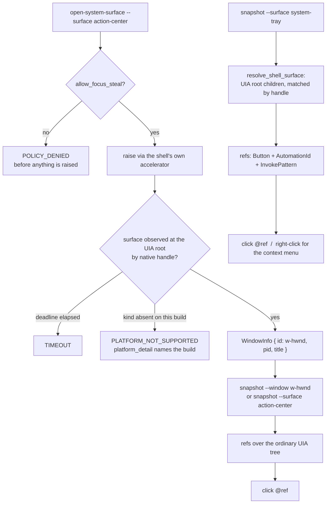

# Shell Surfaces & Notifications (Sub-phase 2.14) - Plan

## Goal Capsule

- **Objective.** Give an agent the Windows shell: open a shell surface and drive it by refs like any application window, list and act on notifications, and close the four cross-cutting platform questions §2.12 could not reach — so §2.15 inherits an adapter with no unanswered identity question.
- **Authority hierarchy.** `docs/phases.md` §2.14 settles scope and exit criteria; this plan settles how. Where planning measured `docs/phases.md` to be false, U2 corrects it in place in this PR and cites the probe row that disproved it. Where planning measured it to be **right**, nothing is corrected — see KTD3, which exists because a first planning pass got that backwards.
- **Stop conditions.** Stop and ask when a shell surface's shape differs from the Area 26 rows on the machine the implementer is using, when a pre-committed branch's evidence points at neither branch, or when closing a requirement would need `Win32_UI_Shell` (KTD12). Do not stop for a surface the running shell genuinely does not expose — R2 is the answer to that, and it is a shipped behaviour, not a blocker.
- **Execution profile.** Probe first, then correct the document, then build. Area 26's rows are the evidence every later unit and every `docs/phases.md` correction cites, so U1 lands before anything that reads from it. **Every UI Automation reading is taken on the UIA3 COM stack** (KTD3). The notification path is observation-verified: every mutating call re-reads the surface and proves the effect against the specific entry it targeted.
- **Tail ownership.** This sub-phase owns its dogfood, its probe rows, its `docs/phases.md` corrections and its skill-doc sync. It does **not** own the cross-platform contract questions its measurements feed — `launch` identifier parity, `type` and `press --app` divergence, and the `offscreen` and role/state splits all belong to §2.15, which reviews both adapters together.

---

## Product Contract

### Summary

Windows ships observation, semantic actions, input synthesis, lifecycle, capture and clipboard. It ships no shell. `list-surfaces` returns core's `PLATFORM_NOT_SUPPORTED` default, all four notification commands do the same, there is no way to reach the taskbar, the notification area or the Action Center, and `snapshot --surface` advertises three kinds while the signal path can emit a fourth it does not advertise. This sub-phase closes that, and closes the four platform questions §2.12's WinForms fixture and single dev box could not reach.

Planning measured the target surfaces directly rather than planning from the capability map — and then, after review, **re-measured them on the client stack the product actually uses**, which reversed two conclusions and removed a whole subsystem from the plan. The shipped surface is one new command, not four, because the measurement showed the shell's controls are ordinary automation elements that refs already address.

### Problem Frame

An agent driving Windows today can drive an application and nothing around it. It cannot see that an update notification is waiting, cannot dismiss it, cannot find out which background agents are running from the notification area, cannot open the Start menu, and cannot reach any surface the shell owns. Every one of those is routine desktop work, and on macOS every one already works.

Underneath that, four questions about *how Windows identifies things* are open, and all four govern behaviour far outside this sub-phase's own surfaces: what `focused_window` reports for a UWP-hosted application, whether the menu detector fires for WinUI and for Chromium hosts, and whether content with no accessible name can be clicked at all. §2.12 measured each as unreachable from a WinForms fixture on a box with no modern-shell population, and wrote them here. Planning found two of the four reachable on that same box.

### Requirements

- R1. **`open-system-surface --surface <kind>` opens the named shell surface and returns the identity of the window the surface actually presents.** Windows kinds are `start-menu`, `taskbar`, `system-tray`, `system-tray-overflow`, `action-center`, `quick-settings`. The returned identity is what `snapshot --window` consumes, so the round trip needs no second lookup.
- R2. **A surface the running shell does not expose returns `PLATFORM_NOT_SUPPORTED` with a `platform_detail` naming the build and the reason.** A bare refusal is not sufficient: `quick-settings` is absent on this build because Windows 11 split it out of the Action Center, and a caller told only "not supported" cannot tell that from "not implemented" and will not know to ask for `action-center` instead.
- R3. **`snapshot --surface <kind>` resolves a shell surface with no `--app`.** Today the answer is `PLATFORM_NOT_SUPPORTED` from `require_supported` (`crates/core/src/commands/snapshot.rs:78`), because Windows advertises only `[Window, Focused, Sheet]`. Once R4 advertises the shell kinds, the *next* obstacle appears: `crates/core/src/snapshot.rs:87`'s `resolve_window_for_surface` sends every non-`Window` surface through `list_windows` to find an owning application, and shell surfaces have none — and per R6 are not in that inventory anyway. Both layers have to move, which is why R3 and R4 land in one unit.
- R4. **The advertised surface set and the resolvable surface set are the same set.** Today Windows advertises `[Window, Focused, Sheet]` while `capture_signal_baseline` can emit a `Menu` signal, so `wait --event surface-appeared` can legitimately report a `menu` surface that `snapshot --surface menu` refuses. Advertising `Menu` without a `surface_root` arm that resolves it converts an honest asymmetry into a dishonest one in the other direction; both halves land together or neither does.
- R5. **`list-surfaces` returns the surfaces a named Windows process actually presents**, replacing core's `PLATFORM_NOT_SUPPORTED` default, with `item_count` populated where the surface has countable children.
- R6. **The shell-surface reach path is the UI Automation root element's children, not the Win32 top-level enumeration.** Measured with the Action Center open and frontmost: `EnumWindows` did not yield its handle, in the same walk that did yield `Shell_TrayWnd` — the positive control that makes the negative meaningful. On the UIA3 COM stack the desktop root's children went from 8 to 9 and the Action Center was among them, matched by `CurrentNativeWindowHandle`. An already-open surface is therefore discoverable without being raised, which is what makes R3 implementable.
- R7. **The notification area's items are ordinary refs, and the shell is driven by the generic command surface.** Measured on the UIA3 COM stack: each promoted and overflow notification-area item is a `Button` control with a stable GUID `AutomationId`, `InvokePattern` available, and positive-area bounds. No Windows-specific tray command ships, because `open-system-surface --surface system-tray` followed by `snapshot` and `click @ref` delivers the capability through the surface the product already has.
- R8. **A tray item's ref carries meaningful identity, so it never falls back to geometry.** Measured: all three promoted items carry a GUID `AutomationId`, which becomes `native_id`; in the overflow area only one of five does, and the other four carry a non-empty `Name` instead. `has_meaningful_identity` (`crates/core/src/ref_identity.rs`) accepts either, and `Role::Button` is not a mutable-value role, so a stable name qualifies. Both kinds resolve strictly; neither needs the fallback R20 covers.
- R9. **A tray item's context menu is reachable when its owning process has an addressable window.** A right-click at the item's bounds raises the menu, and `snapshot --surface menu --app <owner>` addresses it. A menu raised by a *windowless* background agent is **not** addressable in this sub-phase: core resolves a `menu` surface by first finding a window belonging to the owning process (`crates/core/src/snapshot.rs:87` → `select_surface_owner`), and such an agent has none. That limit is stated in the skill rather than discovered.
- R10. **`list-notifications` returns Action Center entries with app name, title, body and the names of the entry's action buttons**, matching the macOS JSON shape field for field, including 1-based indexing.
- R11. **`dismiss-notification` removes exactly the identified notification, and the removal is verified by re-reading the surface.** An invoke on an Action Center dismiss button can be accepted and ignored; a dismiss that reports success without re-reading is a check that cannot distinguish success from failure.
- R12. **`dismiss-all-notifications` verifies against the identity set captured before the clear, not against emptiness.** A re-read that still shows N entries is otherwise indistinguishable between "the clear was ignored" and "N entries were cleared and re-posted". Only pre-existing survivors are failures; entries outside the captured set are new arrivals.
- R13. **`notification-action` invokes the action button whose name the caller supplied**, on the identified notification, and fails with `ACTION_NOT_SUPPORTED` when that notification exposes no such action.
- R14. **`NotificationIdentity` is honoured on Windows exactly as on macOS: the index is not trusted as identity.** Every mutating call re-reads the surface, locates the entry at the requested index, and compares it against the caller's expected app and title before acting, returning `NOTIFICATION_NOT_FOUND` on a mismatch. The Action Center reorders as notifications arrive and expire, so an unverified index dismisses the wrong notification.
- R15. **The adapter does not consult `UserNotificationListener` at all, and the skill documents the measured behaviour rather than a cause.** Measured on this host: `UserNotificationListener.Current` activates, `GetAccessStatus()` returns `Denied`, and the machine's `userNotificationListener` consent store reads `Deny`. Two explanations fit — no package identity, or a machine-wide privacy consent a user could flip — and `RequestAccessAsync` was not called, so nothing claims a mechanism. No shipped code reads the listener, so there is nothing to test: A26-4 is the evidence, and U14 writes the observed behaviour into the skill.
- R16. **`wait --notification` works on Windows**, over the same listing path, within the caller's deadline, and inherits the same policy floor as the direct command.
- R17. **Every command in this sub-phase that raises shell chrome enforces the focus-steal floor, refusing before the surface is raised.** Two need new code and two do not: `dismiss-notification`, `dismiss-all-notifications` and `notification-action` already refuse in core via `mutation_policy` (`crates/core/src/commands/notification_policy.rs:6-16`) before any adapter call, while **`list-notifications`** (whose `list_with_foreground_lease` passes `lease: None` through and refuses nothing) and **`open-system-surface`** do not. The floor is added at those two, adapter-side, so macOS's conditional floor is unaffected.
- R18. **`focused_window` reports a determinate, documented identity when an `ApplicationFrameHost`-hosted application is frontmost.** Measured: `GetForegroundWindow` returns the `ApplicationFrameWindow` frame, whose pid is `ApplicationFrameHost`, while the application's own `Windows.UI.Core.CoreWindow` is a child of that frame at a different pid.
- R19. **`--app` scoping resolves a hosted application to the application, not to its frame host.** An agent that runs `snapshot --app Settings` and `focused-window` must not receive two different pids for one visibly focused application.
- R20. **A content leaf with no accessible name and no native id either resolves or is refused for a stated reason.** A24-11 measured `stale_rate: 0.75` (N=8) against refs from real, threshold-clearing Chromium content, with `entry_is_unverifiable` failing the ref closed before any candidate search ran.
- R21. **The WinUI/UWP arm of the menu detector is evaluated against a real UWP host and the result recorded**, with no `PLATFORM_NOT_SUPPORTED` hedge. If it cannot be evaluated, the still-open question is written into §2.15's scope in this PR rather than left implicit.
- R22. **The Chromium/Electron arm of the menu detector is evaluated against a real Chromium host and the result recorded.** A24-12 concluded no Chromium-family application was installed after searching for `edge`, `chrome`, `chrome_x86`, `brave`, `teams`, `vscode` and `slack`. Planning measured sixteen `Cursor.exe` processes on the same host; the search missed it.
- R23. **`launch` by-name/AUMID is a recorded decision not to take the capability, and `scripts/check-win32-ui-shell-exclusion.ps1` remains in force**, with the decision's reasoning and its receiving sub-phase written into `docs/phases.md`.
- R24. **Every measured claim this plan rests on is a committed probe row with a redacted capture beside it, and every UI Automation row records the client stack it was taken on.** A session measurement is not evidence the repository can check, and a managed-stack reading is not evidence about the product (KTD3).
- R25. **`docs/phases.md` reads true against what shipped**, with every correction keyed to a verbatim opening phrase rather than a line number, and every `FINDINGS.md` row whose action names this sub-phase disposed of.
- R26. **No committed artifact carries notification text, tray item names, window titles, user names, machine names, paths or pids** — captures, dogfood reports, and the `message`, `suggestion` and `platform_detail` strings of any error this sub-phase returns. The Action Center publishes message bodies and the notification area publishes the names and versions of installed security and remote-access products.

### Key Decisions

- **The shell is driven by the generic command surface.** `open-system-surface` exists only to make a surface addressable; everything after it is `snapshot`, `find`, `click` and `type` exactly as for an application window. This is `docs/phases.md`'s own stated preference — "No Windows-specific command bypasses refs for ordinary app controls" — and measurement (R7) showed it is available, so this sub-phase ships **one** new command rather than four. Governs R1, R7, R8, R9.
- **A surface the shell does not expose is a first-class, informative answer.** §2.14's exit criteria already sanction `PLATFORM_NOT_SUPPORTED` for the shell surfaces; R2 makes that answer carry its reason.
- **The four cross-cutting identity questions are not allowed that same hedge.** They govern behaviour outside this sub-phase's surfaces, so a hedge there leaves a load-bearing platform question unanswered rather than an optional surface unsupported. Where an answer genuinely cannot be reached, the open question is written into §2.15's scope in this PR — which is a disposition, not a hedge. Governs R18, R19, R20, R21, R22.
- **Windows `launch` stays path-or-system-image for Phase 2** (session-settled: user-directed — chosen over taking `Win32_UI_Shell` + `ShellExecuteExW`, and over a hand-declared `IApplicationActivationManager`: by-name launch appears in no §2.14 exit criterion, `docs/phases.md` pre-authorizes the recorded-decision branch, and the gate forbidding the feature was a supply-chain decision rather than a probe outcome). Governs R23.
- **This sub-phase ships past the `~2k LOC` estimate and says so up front** (session-settled: user-directed — chosen over splitting into §2.14 and §2.14.1: the exit criteria are one reviewable set, and macOS's notification implementation alone is ~1,700 LOC). See LOC Budget.

### Scope Boundaries

In scope: shell-surface open and snapshot, `list-surfaces` on Windows, the four notification commands and `wait --notification`, the advertised-surface-set correction, and the four cross-cutting identity items.

Out of scope, and deliberately so:

- **Bespoke tray commands.** Measurement removed the reason for them (R7). The capability ships through the generic surface; the commands do not.
- **Focus Assist / Do Not Disturb state.** `docs/phases.md`'s notification subsection lists it as best-effort diagnostics. It appears in no exit criterion, has no analogue in the shipped macOS surface, and no command reads it.
- **Virtual desktop detection.** A16-9 measured the blocker as a missing Rust binding for `IVirtualDesktopManager`, not a missing class, and §2.4 already dropped it.
- **Multi-monitor shell-surface placement.** This host presents one display; §2.15 owns the provision-or-ratify decision for a multi-monitor rig.
- **The cross-platform contract questions this sub-phase's measurements feed.** `launch` identifier parity, `type` and `press --app` divergence, `offscreen`, and the role/state split are §2.15's.

#### Deferred to Follow-Up Work

None. Every item in §2.14's scope and exit criteria has an implementation unit. Two outcomes are written into §2.15's scope in this PR rather than built here, and each is a decision or an unreachable measurement with its evidence, not work postponed for convenience: the by-name/AUMID launch decision (R23), and — **only if KTD9's second branch fires** — the still-unevaluated WinUI detector arm (R21, U2 item 12). Both carry actionable scope text in the receiving sub-phase.

#### Accepted, with reasons, rather than deferred

- **The notification and shell implementations are verified against one Windows build.** This host is Server 2019 Datacenter, build 17763, UBR 7434. The Action Center's XAML tree and the shell's window-class chain are version-specific. Accepted because the alternative is provisioning a second host, which §2.15 already owns as a gate; mitigated by R2 for an absent kind and by U9's landmark check for a present-but-different tree, so an unrecognised shell produces a named error rather than a silent wrong answer.
- **`quick-settings` is not implemented as a distinct surface on this build.** On Windows 11 the Action Center splits into a Win+N notification centre and a Win+A quick-settings flyout (C-5, C-10); on 1809 the quick actions are a pane inside the Action Center itself, measured as a `ScrollViewer` of `Microsoft.QuickAction.*` toggle buttons. The kind resolves to `PLATFORM_NOT_SUPPORTED` with a `platform_detail` naming `action-center`.
- **`macOS`'s half of `open-system-surface` is not built here** — `spotlight`, `dock` and `menu-bar-extras` keep the trait default. Accepted rather than deferred silently: U2 corrects P2-O14's status line so the objective does not read closed, and writes macOS ownership into §2.15's scope in this PR.
---

## Planning Contract

### Key Technical Decisions

- **KTD1. Two reach mechanisms, chosen per surface family, because the two families are unreachable for different measured reasons.** *The `Shell_TrayWnd` family* (`taskbar`, `system-tray`, `system-tray-overflow`) **is** yielded by `EnumWindows` — measured — but `passes_filter` (`crates/windows/src/system/window_ops.rs:16`) rejects it, because `Shell_TrayWnd` carries `WS_EX_TOOLWINDOW` (measured, along with `Progman` and the overflow window). It is reached by the Win32 class chain, which also reaches the overflow window while it is still hidden. *The immersive family* (`action-center`, `start-menu`) is not yielded by `EnumWindows` at all — measured, in the same walk that did yield `Shell_TrayWnd`, which is the positive control that makes the negative meaningful — and `FindWindowW("Windows.UI.Core.CoreWindow", null)` measured 0 for an open Action Center. It is reached through the UI Automation root element's children, matched by `CurrentNativeWindowHandle`: the root's children went from 8 to 9 when the Action Center opened and the ninth was it. **Rejected: changing `passes_filter` to admit tool windows.** Excluding the taskbar and the desktop from `list-windows` is correct behaviour, not a bug; shell surfaces are addressed by kind, and widening a general listing to reach two of them would put `Progman` in every `list-windows` result. **Rejected: one uniform mechanism.** The UIA root misses the overflow window while it is closed, and the class chain cannot reach the immersive surfaces at all — either alone leaves a kind unreachable. **What this costs:** two code paths in one module instead of one, each with the measurement that forces it cited beside it.

- **KTD2. The notification path is Action Center UI Automation traversal, and `UserNotificationListener` is not attempted on the hot path.** Measured shape, rooted at the `Windows.UI.Core.CoreWindow` titled "Action center": a `ListView` at `AutomationId` `MainListView`; one `ListViewHeaderItem` per source application carrying a `Title` `TextBlock` and a `DismissButton`; one `ListViewItem` per notification carrying `Invoke`, with `Title`, `Content` and `Attribution` `TextBlock` children at stable `AutomationId`s, plus `DismissButton`, `ExpandButton` and `VerbButton` children each carrying `Invoke`; and a top-level `ClearAllButton`. Every element this sub-phase needs is addressed by `AutomationId`, not by localized name. The listener path measured `GetAccessStatus() == Denied` with the machine's `userNotificationListener` consent store reading `Deny`. **The cause of that denial is deliberately not claimed.** Two explanations fit the evidence — no package identity to grant the capability against, or a machine-wide privacy consent a user could flip — and `RequestAccessAsync` was not called, so nothing shipped asserts a mechanism. What is decided is the behaviour: the listener is not consulted per call, because a shipped binary cannot depend on a per-machine consent state, and A26-4 records both readings so a later host can re-decide on evidence. **Rejected: attempting the listener first and falling back.** A fallback that fires on every call is not a fallback, it is a slower primary. **What this costs:** package-identity notification listening does not ship in Phase 2, and R15 documents the observed behaviour rather than a cause — which is weaker prose and honest evidence.

- **KTD3. Every UI Automation reading in this sub-phase is taken on the UIA3 COM stack, and a managed-stack reading is never authoritative.** This decision exists because a first planning pass violated it and reached two wrong conclusions. Readings taken through the managed `System.Windows.Automation` client reported the notification area's `ToolbarWindow32` as having zero children in both the control and raw views, and the UIA root as not containing the Action Center. Re-taken through the corpus's own hand-declared vtable shim (`probes/windows/08-uia3-com.cs`) bound to `CUIAutomation8` — the stack the Rust `uiautomation` crate wraps — the same toolbar reported **3 promoted and 5 overflow children**, and the root **did** contain the Action Center. `probes/windows/FINDINGS.md` already rules on exactly this: "where a `managed` row and a `uia3-com` row disagree, the COM row is the product-relevant one, because the Rust adapter wraps a UIA3 COM client", and A2-4 measured classic Notepad at 26 COM nodes against 3 managed while A3-3 recorded that `GetSupportedPatterns` "is also not a reliable negative". `ToolbarWindow32` is precisely the client-side-proxy-served classic control class where the two stacks were already known to disagree. **What this costs:** Area 26's probe scripts must bind the COM shim rather than use the one-line managed walker, and every Area 26 UIA row carries `stack: uia3-com` in the ledger's own column. What it buys is that this sub-phase does not write a false `CONTRADICTS` correction into the source of truth — which the first pass was one step away from doing.

- **KTD4. The notification area needs no bespoke commands, because its items are ordinary refs.** Measured on the COM stack, each promoted notification-area item is `ControlType` `Button` (50000) with a **stable GUID `AutomationId`** (for example `{7820AE81-23E3-4229-82C1-E41CB67D5B9C}`), `InvokePattern` available, and positive-area bounds; `Shell_TrayWnd` itself exposes 20 descendants including the taskbar's per-application buttons and a `Notification Chevron` button that opens the overflow. `button` is already in `INTERACTIVE_ROLES`, and an `AutomationId` is a `native_id`, which is meaningful identity — so these elements get refs, resolve strictly, and click through the shipped semantic tier with no new code at all. **Rejected: shipping `list-tray-items`, `click-tray-item` and `open-tray-menu`** as `docs/phases.md`'s P2-O18 table sketches. The same table states the governing rule — "No Windows-specific command bypasses refs for ordinary app controls. If a Windows workflow can be represented as `snapshot --app`, `snapshot --surface`, `find`, `click`, `type`, `press`, or `wait`, it uses the existing command surface" — and the measurement moved the tray from the exception into the rule. **Rejected: keeping them as thin conveniences.** Three commands, three registration walks, three adapter methods and a `TrayItem` type, all wrapping a `click @ref` an agent can already issue, is the over-engineering this sub-phase was asked to avoid. A right-click context menu needs no command either: `MouseButton::Right` already exists and the resulting popup is the `menu` surface KTD13 advertises. **What this costs:** an agent addresses a tray item by ref rather than by index, which is the same way it addresses everything else. U2 corrects the P2-O18 table row rather than implementing it.

- **KTD5. App-less surface resolution enters through a new `ObservationOps` method, not through a Windows special case in `crates/core/src/snapshot.rs`.** `resolve_window_for_surface` (`crates/core/src/snapshot.rs:87`) sends every non-`Window` surface through `windows_for_app` → `list_windows` → `select_surface_owner`, which cannot work for a surface with no owning application and no enumerable window (KTD1). The new method — `resolve_shell_surface(surface, deadline) -> Result<WindowInfo, AdapterError>`, defaulting to `not_supported()` — is consulted for the shell-surface kinds before the application path. **Rejected: a `#[cfg(target_os = "windows")]` branch in core.** `CLAUDE.md`'s core platform-conditional rule forbids it, and `docs/solutions/best-practices/never-ship-platform-code-that-ci-cannot-execute.md` records what it cost the last time. **Rejected: overloading `list_windows` with a synthetic shell entry.** It would place a window in the inventory that `close-app`, `focus-window` and every window operation would then have to special-case. **What this costs:** one more trait method, which macOS can later implement for `spotlight`, `dock` and `menu-bar-extras` through the same seam.

- **KTD6. Every mutating notification call re-reads the surface and proves the effect against the specific entry it targeted.** The Action Center accepts an invoke that does nothing — a dismiss button whose notification was already withdrawn by its source. macOS solved this shape: `crates/macos/src/notifications/dismiss_verify.rs` re-lists and confirms the matching entry vanished, and `actions.rs` verifies each strategy before accepting it. Windows mirrors the structure. **The `dismiss_all` case needs the same entry-level comparison, not an emptiness check** — a re-read showing N entries cannot distinguish an ignored `ClearAllButton` from N entries cleared and re-posted, so the pre-invoke identity set is captured and only its surviving members are failures. **Rejected: trusting `IUIAutomationInvokePattern::Invoke`'s `HRESULT`.** It reports that the pattern accepted the request, not that the provider acted. **What this costs:** every mutation is at least two round trips to a cross-process provider, which U16's baseline measures through the release binary.

- **KTD7. `focused_window` reports the frame, and a hosted window's `app`/`pid` are read from its `CoreWindow`.** Measured against a real `ApplicationFrameHost`-hosted target: with Settings frontmost, `GetForegroundWindow` returned the `ApplicationFrameWindow` (pid `ApplicationFrameHost`), whose children are `ApplicationFrameTitleBarWindow` (frame-host pid), `Windows.UI.Core.CoreWindow` (pid `SystemSettings`) and `ApplicationFrameInputSinkWindow`. The frame is what the desktop treats as the window — it carries the title, the position and the foreground — so its handle stays the window `id` and every window operation keeps working, while `app` and `pid` are read one level down, which is what A1-3 already told §2.4: "UWP targeting must descend to the CoreWindow rather than match the top-level window's ProcessId." **Rejected: reporting the `CoreWindow` as the focused window.** Its handle is not a top-level window, so `focus-window`, `move-window` and `resize-window` would all fail against the identity `focused_window` had just handed out. **What this costs:** a hosted target's window `id` is a handle owned by the frame host while its `app` and `pid` name the hosted application — a handle/pid split that is invisible to a caller using either field alone, and that §2.15 settles beside `offscreen` and the role/state split. It is **not** the pid mismatch R19 describes; U11 fixes that one.

- **KTD8. A16-2 is closed on this host, and `docs/phases.md`'s claim that it needs a modern-shell runner is wrong.** The document says the measurement "needs a host edition that carries WinUI/UWP hosts" and cites A10-7. A10-7's measured statement is narrower: Server 2019 carries no **WinUI3 or MSIX** population, and "the closest available modern target is the XAML Settings app hosted by `ApplicationFrameHost`, which is a UWP `CoreWindow` shape rather than WinUI3". The frame-versus-`CoreWindow` question is about exactly that UWP shape, and A1-3 measured it statically on this box; what was missing was the foreground reading, which planning took (KTD7). **What this costs:** nothing — it converts a hardware-blocked exit criterion into a closable one.

- **KTD9. The WinUI menu arm is evaluated against the UWP Settings host, and if it cannot be, the open question is written into §2.15 rather than declared closed.** A23-4 recorded `measurable: false` on the ground that no WinUI/UWP host exists in any measured session; half of that is wrong on this box (KTD8). **Pre-committed branches.** *Branch A:* a XAML `MenuFlyout` raised inside the Settings `CoreWindow` is evaluated through both shipped detector sources and the row records which fired — the exit criterion closes as evaluated. *Branch B:* the host raises no menu surface reachable by generic staging; the row records `measurable: false` narrowed to WinUI3/MSIX, **and U2 item 12 writes the unevaluated arm into §2.15's scope with the staging attempted and the host population searched.** Branch B is chosen deliberately over calling itself a closure: `docs/phases.md` grants the `measurable: false` escape to the Chromium arm only, and its WinUI clause requires evaluation with no hedge — so a branch-B run that claimed the criterion closed would be a deferral wearing a costume. Naming the receiving sub-phase in the same PR is what makes it a disposition instead.

- **KTD10. The Chromium menu arm gets a fourth staging attempt, because the search that concluded no host was installed missed the one that is.** A24-12 searched for `edge`, `chrome`, `chrome_x86`, `brave`, `teams`, `vscode` and `slack`. Planning measured sixteen `Cursor.exe` processes running from `AppData\Local\Programs\cursor`; Cursor is a VS Code fork and therefore Chromium/Electron. Measured at rest, its main window's subtree contains zero `Menu`, `MenuBar` or `MenuItem` elements, so the arm is genuinely open rather than trivially closed. **Pre-committed branches, both of which close the criterion** — §2.14's exit criteria name "either evaluated or recorded `measurable: false` with the search that established it" for this arm specifically: either a source fires against a staged Cursor menu and the row records the recipe, or neither fires after both an Alt tap and a content-area right-click with activation confirmed first, and the row records `measurable: false` with the corrected host population. The correction to A24-12's "none installed" claim lands either way.

- **KTD11. The zero-identity blocker is that allocation strips the entry's only identity, and the fix is to stop stripping it.** A first pass got this wrong and its test would have passed before the change. `provisional_geometry_candidate` (`crates/windows/src/tree/resolve_search.rs:171`) gates on `entry.geometry.bounds` — the **rect** — not on `bounds_hash`. `ref_alloc.rs:35-38` builds both from the live rect, and then `ref_alloc.rs:240-241` unconditionally drops the rect when `include_bounds` is false, leaving `bounds: None` with the hash still set (`crates/core/src/ref_alloc_tests.rs:274` pins exactly that). So in the A24-11 case the gate is already false and `entry_is_unverifiable` fires before any search runs. Everything downstream is already correct: `admit_node`'s `Incomplete if geometry_matches(..) => Collect` arm and `classify_search`'s `1 => Resolved(0)` already admit a single zero-identity candidate, and the role comparison is already `admit_node`'s first check. **The change is one condition:** strip the rect only when the entry has some other identity to be resolved by — `if !include_bounds && has_meaningful_identity(&entry)`. An entry whose bounds are its only identity keeps them. **Rejected: adding a `bounds_positive` field to `RefGeometry`.** It is a serialized core type, so that costs a field, a serde default, a migration concern and an edit to both adapters' predicates, to carry a fact the rect already carries. **Rejected: dropping the positive-area condition.** A17-7 measured offscreen and virtualized elements collapsing to shared zero-extent bounds that are structurally non-unique. **What this costs:** a refmap entry for a nameless element is slightly larger. No adapter changes at all — macOS gets the identical fix from the same line, with no macOS edit.

- **KTD12. `Win32_UI_Shell` stays out, and `scripts/check-win32-ui-shell-exclusion.ps1` stays in force.** By-name/AUMID launch through `ShellExecuteExW` requires `Win32_UI_Shell` **and** `Win32_System_Registry` (A21-8), and that gate scans both the manifest text and the resolved feature graph specifically to prevent it. `docs/phases.md` pre-authorizes "an explicit recorded decision not to take it"; by-name launch appears in §2.14's scope narrative but in none of its exit criteria. **Rejected: a hand-declared `IApplicationActivationManager`.** It avoids the manifest feature but reaches only packaged apps by AUMID, so it would not close the display-name parity gap it exists to close. **What this costs:** Windows `launch` stays path-or-system-image through Phase 2, which U2 writes into §2.15's scope. **This sub-phase adds no manifest feature at all** — KTD4 removed the only candidate.

- **KTD13. `Menu` joins the advertised surface set together with the `surface_root` arm that resolves it, and the detector's measured host coverage is documented beside it.** Advertising `Menu` alone would make `snapshot --surface menu` claim a capability `crates/windows/src/tree/surfaces.rs` refuses at its catch-all. The arm cannot reuse `menu_is_open` as it stands: `crates/windows/src/system/menu_state.rs` exposes only `bool`-returning entry points, and `probe_candidate` binds its `find_first` hit to `_` and drops it — **the element is found and discarded**. The arm therefore needs a sibling that returns the element it already locates, sharing the existing `menu_family_condition`; the file is at 277 lines, so it fits. But the detector's coverage is not universal — KTD10 measured zero menu-family elements in a Chromium host at rest and KTD9's arm may not close — so an open menu in an uncovered host family yields `WINDOW_NOT_FOUND`, which reads as "no menu is open" rather than "this host is not covered". U14 documents the measured coverage beside the surface so an agent is told which host families the detection is known to work for. **What this costs:** `status` gains a surface, and the capability table and `windows_capability_claims_tests.rs` move in the same commit.

- **KTD14. The redaction envelope is keyed to the shipped envelope's field names, fail-closed, and its fixtures are derived independently of the extension.** This sub-phase's surfaces publish exactly what the envelope forbids. The gate's field pattern today is `name|value|description|title`, which does **not** match `app_name` (the quote is followed by `app_`) and has no entry for `body` or the `actions[]` array — and `NotificationInfo` serializes as `app_name`, `title`, `body`, `actions`. **Rejected: a vendor and product substring needle list.** A denylist fails open for any vendor not enumerated, inverting the gate's own fail-closed rule (`Test-CliRedactionValueReduced` treats a value it cannot prove reduced as unreduced). **Rejected: deriving the MUST-CATCH fixtures from the same content-class list as the extension.** The implementer would write a fixture matching the extension they just wrote, and the invert-verification could not detect the field the extension missed — the check-that-cannot-fail shape this repository keeps finding. Fixtures are keyed to the serialized field names of `NotificationInfo`, one per field. **What this costs:** the extension is a field-name change to a shared gate rather than a probe-local rule, so it protects the dogfood report and the E2E artifacts too, which is where the content actually lands.

### Error and Disposition Mapping

| Condition | Code | Disposition | Notes |
|---|---|---|---|
| Surface kind the running shell does not expose | `PLATFORM_NOT_SUPPORTED` | not delivered, retry unsafe | `platform_detail` names the build and the surface carrying the capability instead (R2) |
| Surface kind no adapter implements | `PLATFORM_NOT_SUPPORTED` | not delivered, retry unsafe | core's `require_supported`, unchanged |
| Shell surface did not open within the deadline | `TIMEOUT` | not delivered, retry safe | distinct from the row above: absent on this build versus did not open |
| `snapshot --surface <shell kind>` with the surface closed | `WINDOW_NOT_FOUND` | not delivered, retry safe | `suggestion` names `open-system-surface --surface <kind>` (R3) |
| Shell surface opens but its expected root landmark is absent | `PLATFORM_NOT_SUPPORTED` | not delivered, retry unsafe | `platform_detail` names the build and the missing landmark; never an empty successful listing |
| Notification index out of range | `NOTIFICATION_NOT_FOUND` | not delivered, retry unsafe | matches macOS |
| Notification identity mismatch on re-read | `NOTIFICATION_NOT_FOUND` | not delivered, retry unsafe | R14 — the surface reordered under the caller |
| Named action absent on the identified notification | `ACTION_NOT_SUPPORTED` | not delivered, retry unsafe | R13 |
| Dismiss invoked, that entry still present on re-read | `ACTION_FAILED` | delivered unverified, retry unsafe | R11 / KTD6; never reported as success; core's `delivered_unverified()` cannot express "retry safe", and macOS's own dismiss-survival failure carries no retry stamp at all |
| `dismiss-all` invoked, members of the captured set survive | partial success | delivered, retry safe | R12 — survivors reported per entry; entries outside the set are new arrivals, not failures |
| Strict-headless caller, any chrome-raising command | `POLICY_DENIED` | not delivered, retry unsafe | R17; refused before the surface is raised |
| Zero-identity ref, exactly one geometry match | resolves | — | KTD11 |
| Zero-identity ref, two or more geometry matches | `AMBIGUOUS_TARGET` | not delivered, retry unsafe | KTD11 |
| Zero-identity ref, no geometry match | `STALE_REF` | not delivered, requires fresh snapshot | KTD11, unchanged from today |

**No error string carries target content.** For every condition above, the `message`, `suggestion` and `platform_detail` fields may name an index, a kind, a build, a landmark `AutomationId` or a caller-supplied action name — never a notification title, body, source-application name or tray item name. The redaction gate does not scan those keys (KTD14), so this is a rule the implementer holds rather than a gate that catches it; macOS sets the precedent, building its identity-mismatch message from the index alone (`crates/macos/src/notifications/actions.rs`).

### High-Level Technical Design

One reach path, because the measurement that suggested two was taken on the wrong client stack (KTD3). The shell's surfaces and their controls are ordinary automation elements; what is unusual is only that the Win32 enumeration cannot see the immersive ones.

The notification commands are the Action Center path with a semantic layer over the measured tree:

| Adapter method | Element it acts on | Verified by |
|---|---|---|
| `list_notifications` | `MainListView` → `ListViewHeaderItem` (app) → `ListViewItem` (entry) | the read itself; a missing `MainListView` is an error, never an empty list |
| `dismiss_notification` | that entry's `DismissButton` | re-read: that entry is gone |
| `dismiss_all_notifications` | top-level `ClearAllButton` | re-read against the pre-invoke identity set: no member survives |
| `notification_action` | that entry's `VerbButton` matching the requested name | re-read: the entry changed state or is gone |

### Assumptions

- The implementer runs on a host whose Action Center matches Area 26's recorded shape. U1's rows make that checkable, and U9's landmark check makes a mismatch a named error at runtime rather than an empty successful listing.
- `uiautomation` 0.25's `find_first`/`find_all` and `UIInvokePattern` are sufficient for every tree this sub-phase reads; no new dependency and **no new manifest feature** is required (KTD12).
- The notification-area items' GUID `AutomationId`s are stable for the lifetime of the icon's registration, which is what R8 relies on. A26-7 records them across a re-read within one session; stability across an owner restart is not claimed and nothing depends on it.
---

## Implementation Units

Rows are listed in dependency order; U-IDs are stable identifiers, not sequence numbers. **U7 and U8 are deliberately absent**: they held the three bespoke tray commands, which KTD4's measurement removed. The gap is preserved rather than renumbered.

| U-ID | Title | Key files | Depends on |
|---|---|---|---|
| U1 | Probe area 26 on the COM stack, captures, `FINDINGS.md` rows, redaction gate | `probes/windows/26-shell-surfaces/`, `probes/windows/FINDINGS.md`, `scripts/lib/capture-redaction-cli.psm1` | none |
| U11 | Menu-detector arms: WinUI and Chromium | `probes/windows/26-shell-surfaces/05-menu-arms.ps1`, `crates/windows/src/system/menu_state.rs` | U1 |
| U2 | `docs/phases.md` corrections and decision writes | `docs/phases.md` | U1, U11 |
| U3 | Shell-surface open and reach primitive | `crates/windows/src/system/shell_surface*.rs` (new), `window_ops.rs` | U1 |
| U5 | App-less surface resolution and the advertised surface set | `crates/core/src/adapter/observation.rs`, `crates/core/src/snapshot.rs`, `crates/windows/src/tree/surfaces.rs`, `crates/windows/src/adapter.rs` | U3, U11 |
| U4 | `open-system-surface`, end to end | `crates/core/src/commands/open_system_surface.rs` (new) and every registration point | U3, U5 |
| U6 | `list-surfaces` on Windows | `crates/windows/src/tree/surface_inventory.rs` (new) | U5 |
| U9 | Action Center notification adapter | `crates/windows/src/notifications/` (new module tree) | U3 |
| U10 | `wait --notification`, the session lifecycle and the policy floor | `crates/windows/src/notifications/`, `crates/core/src/adapter/system.rs` | U9 |
| U12 | `focused_window` frame identity and `--app` descent | `crates/windows/src/system/frame_identity.rs` (new), `window_ops.rs` | U1 |
| U13 | Zero-identity: persist the positive-area fact in core | `crates/core/src/ref_geometry.rs`, `ref_alloc.rs`, both adapters' `resolve_search.rs` | U1 |
| U14 | Skill docs, capability table, README sync | `skills/agent-desktop-windows/`, `README.md`, `src/cli/windows_capability_claims_tests.rs` | U4, U6, U9, U10, U12 |
| U15 | E2E scenarios for the shipped surfaces | `tests/e2e-windows/scenarios/ShellSurfaces.ps1` (new), `Run-E2E.ps1` | U4, U9 |
| U16 | Dogfood, cost baseline and dispositions | `docs/dogfood-reports/`, `docs/phases.md` | all |

### U1. Probe area 26 on the COM stack, captures, `FINDINGS.md` rows and the redaction gate

- **Goal:** Turn planning's measurements into evidence the repository can check, on the client stack the product uses, before any unit or any `docs/phases.md` correction cites them.
- **Requirements:** R24, R26.
- **Dependencies:** none. Cut first and alone because U2's corrections cite its row ids and `scripts/check-phases-ledger-citations.ps1` fails when `docs/phases.md` cites a row `FINDINGS.md` does not carry.
- **Files:** `probes/windows/26-shell-surfaces/{probe.ps1,02-notifications.ps1,03-tray.ps1,04-frame-identity.ps1,06-cost.ps1}` (new), `probes/windows/26-shell-surfaces/captures/` (new), `probes/windows/FINDINGS.md`, `scripts/lib/capture-redaction-cli.psm1`, `scripts/fixtures/` redaction fixtures, `.github/workflows/windows-capability-probe.yml`.
- **Approach:**
  1. **Every script binds the UIA3 COM shim, not the managed client** (KTD3). Compile against `probes/windows/08-uia3-com.cs`'s hand-declared `[ComImport]` interfaces bound to `CUIAutomation8`, the way area 8 already does. Every UIA row records `stack: uia3-com` in the ledger's own column. A managed reading, if taken at all, is committed only as a labelled non-authoritative cross-check.
  2. **Extend the redaction gate before writing a capture** (KTD14). In `capture-redaction-cli.psm1`, add `app_name`, `body` and `attribution` to `Get-CaptureCliRedactionViolationsFromText`'s field pattern (`:157`) and add an `actions[]` array walk modelled on the existing `path[]` handling via `Find-CliJsonArrayEnd`, requiring `Test-CliRedactionValueReduced` on each. Author one MUST-CATCH fixture for **each field the extension newly covers** — `app_name`, `body`, `actions[]`. **Not `title`**: the shipped pattern already matches it, so a `title` fixture passes before any change and proves nothing about this extension. `index` needs none either, being a number. Three fixtures, each keyed to a serialized `NotificationInfo` field the gate cannot see today.
  3. `probe.ps1` records the **reach** row A26-1 as a paired positive and negative: with a shell surface open, whether `EnumWindows` yields the surface's handle **and** whether it yields `Shell_TrayWnd` in the same walk (the control), plus the UIA root's child count and whether the surface's handle appears among the children's `CurrentNativeWindowHandle` values, open and closed. Membership, not totals — an unchanged total proves nothing, because A26-2 records that the window survives dismissal cloaked. A26-2 itself is the open/closed predicate: `WS_EX_TOOLWINDOW`, `DWMWA_CLOAKED` and `GetParent`, both states.
  4. `02-notifications.ps1` records the **Action Center shape** row A26-3 as counts and identifiers only: presence of the `MainListView` `AutomationId`, the number of `ListViewHeaderItem` groups and `ListViewItem` entries, and for one representative entry the *set of `AutomationId`s* on its children with each one's pattern set, plus the presence of `ClearAllButton`. **No `Name` from any notification element is written.** A26-4 records the listener readings: whether `UserNotificationListener.Current` activates, the `GetAccessStatus()` value, **and the machine's `userNotificationListener` consent-store value**, so KTD2's deliberate non-claim about cause is visible in the evidence rather than only in prose.
  5. `03-tray.ps1` records the notification-area rows on the COM stack: A26-5 is the child count of the promoted and overflow `ToolbarWindow32` **beside the managed-client count for the same window**, which is the row that documents the client-stack divergence rather than a platform absence; A26-6 is which overflow window class is present, corroborating C-5 first-party; A26-7 is, per child, the control type, whether an `AutomationId` is present and non-empty, the pattern-availability set, and whether bounds are positive-area — **counts, flags and control types only, never a name or an `AutomationId` value**, since the ids are machine-local and the names are the vendor inventory KTD14 exists to keep out. A26-7 also re-reads once within the session and records whether each id is unchanged, which is the stability R8 relies on.
  6. `04-frame-identity.ps1` records A26-8: with a UWP host frontmost, the foreground window's class, the class of each child of the frame, and which child's owning process differs from the frame's — processes classified as `frame_host`/`hosted_app`/`other` rather than named. A26-9 records the Start-menu surface: which shell host owns the surface the accelerator raises and the `AutomationId` set at its root, measured because on this build the accelerator raised a search surface rather than a tile surface.
  7. `06-cost.ps1` records A26-10 with the corpus methodology — one discarded warm-up, seven timed runs, min with median and max beside it (A15-13, applied in A18-7) — for the raw platform operations: raising a shell surface, one root-children resolution, one Action Center tree read, one tray enumeration. **A26-10 is labelled a pre-implementation platform-cost reference, not the shipped command's cost**; U16 takes the product baseline through the release binary once U3 and U9 exist.
  7b. **A26-13 measures the premise R20 depends on.** A24-11's own selector (`probes/windows/24-fixture-e2e/08-chromium-content.ps1:286-299`) filtered on role, offscreen state and available actions — it never read bounds, and could not, since its snapshot was taken without `--include-bounds`. So "a nameless **positive-area** content leaf" has never been measured. Read the live rectangle of a real A24-11-shape leaf and record whether it is positive-area, as a count of leaves in each class rather than any content. If they are zero-extent, U13's fix cannot reach them and R20's branch changes before a line is written.
  8. Register the area in `windows-capability-probe.yml`'s `paths:` filter with a step per script, keeping the redaction-gated upload ordering.
  9. Write the rows into a new `## Area 26` section following the existing eight-column contract. Verdicts come from the ledger's vocabulary; `UNKNOWN` is not in it.
- **Non-goals for this unit:** the menu-arm scripts and rows, which U11 owns entirely; any adapter code.
- **Patterns to follow:** `probes/windows/08-uia3-com.ps1` and `08-uia3-com.cs` for binding the COM shim; `probes/windows/24-fixture-e2e/` for the numbered-script layout and `-devbox`/`-ci` capture pairing; `probes/windows/common.ps1` for `Write-ProbeCapture` and `Protect-ProbeText`; the KTD9 canonicalized `.normalized` twin convention.
- **Test scenarios:**
  - `scripts/check-capture-redaction.ps1` passes over every new capture, and **each** of the four new MUST-CATCH fixtures fails the gate naming its rule — invert-verified one field at a time, because a single fixture would not have caught the `app_name` and `body` gaps the field pattern had.
  - Reverting the `actions[]` array walk lets a fixture carrying action-button names pass — invert-verified.
  - `probes/windows/13-ledger-check.ps1` accepts Area 26: eight columns per row, every verdict in the vocabulary, every UIA row carrying a `stack` value.
  - Deleting one Area 26 row makes `check-phases-ledger-citations.ps1` fail after U2 lands, naming the dangling citation.
  - A26-1's control leg reads true (`Shell_TrayWnd` is yielded) in the same walk whose surface leg reads false; a run where the control leg reads false fails the script rather than recording the negative.
  - Each script is re-runnable: a second run against an unchanged host produces a `.normalized` twin byte-identical to the first.
  - A capture is grepped for the literal strings a notification body and a tray vendor name would carry on this host; the grep finds nothing.
- **Verification:** every measured statement this plan makes is citable by row id from a committed capture that passes an extended gate, each UIA row names the stack it was taken on, and the gate can be shown to catch this sub-phase's own leak classes field by field.

### U11. Menu-detector arms: WinUI and Chromium

- **Goal:** Evaluate both open arms of the two-source detector against real hosts, record the outcome as **A26-11** (WinUI arm) and **A26-12** (Chromium arm) — the two Area 26 rows this unit owns and U1 does not create — and, for the WinUI arm's second branch, write the still-open question into §2.15 rather than declare it closed.
- **Requirements:** R21, R22.
- **Dependencies:** U1 (for the probe-area scaffolding and the COM shim binding).
- **Files:** `probes/windows/26-shell-surfaces/05-menu-arms.ps1` (new), `probes/windows/FINDINGS.md`, `crates/windows/src/system/menu_state.rs`, `crates/windows/src/system/menu_state_tests.rs`.
- **Approach:**
  1. **WinUI arm.** Launch the UWP Settings host, confirm activation and foreground **first** — an unconfirmed activation is why three previous Chromium attempts proved nothing — then stage a XAML context menu inside its `CoreWindow` and evaluate both shipped sources directly: `classic_menu_mode_active`'s `GetGUIThreadInfo` flags across the host's threads, and `uia_menu_reachable`'s menu-family search. Record which fired, plus an at-rest control reading. **A26-11** records which source fired and the at-rest control. Branch B (no reachable menu surface) records `measurable: false` narrowed to WinUI3/MSIX **and hands U2 item 12 its content**.
  2. **Chromium arm.** Same discipline against Cursor: activation confirmed, then an Alt tap and a content-area right-click, each evaluated through both sources, with an at-rest control. **A26-12** records which source fired, the at-rest control, and the corrected host-population search — A24-12's needle list **plus `cursor`** — as a count of Chromium-family images found, not their paths.
  3. **The detector changes only if a source is measured wrong.** If a source misses a menu that demonstrably exists, that is a third source and it lands here with its own test. If both arms fire through the existing sources, `menu_state.rs` is untouched.
  4. Report the measured host-family coverage to U14, which documents it beside the `Menu` surface (KTD13).
- **Non-goals for this unit:** recognising an application by name. A detector that special-cases Cursor is not a detector.
- **Patterns to follow:** `probes/windows/24-fixture-e2e/08-chromium-content.ps1` for reading the shipped detector's own sources directly and for activation-confirmed-first; `menu_state.rs`'s two-source composition if a third is added.
- **Test scenarios:**
  - The at-rest control reads false for both sources against both hosts, so a positive reading is attributable to the staging.
  - If a source fires: a `menu_state` test drives `menu_is_open` against the staged host and asserts false → true → false, matching how the existing two sources were verified.
  - If a third source is added: invert-verified by breaking its read and watching the staged-menu test fail, plus an at-rest test that it does not fire with no menu open.
  - If an arm does not fire: the row names the staging methods, the sources evaluated and the population searched, and `13-ledger-check.ps1` accepts it.
  - The probe's search-needle constant is asserted by a test to include `cursor`, so the correction to A24-12 cannot silently regress.
- **Verification:** both arms have a recorded outcome from an activation-confirmed attempt against a real host of the right family, and the WinUI arm's unreachable branch leaves a receiving sub-phase rather than a silence.

### U2. `docs/phases.md` corrections and decision writes

- **Goal:** Make the source of truth read true before the adapter is written. Note what this unit does **not** do: the tray subsection's List and Click bullets are **not** corrected, because re-measurement on the product's client stack showed them right (KTD3).
- **Requirements:** R23, R25.
- **Dependencies:** U1 (rows to cite), U11 (which branch fired, for items 6 and 12).
- **Files:** `docs/phases.md`, `scripts/check-phases-ledger-citations.ps1`.
- **Approach.** **Every correction is keyed to a verbatim opening phrase, never a line number** — this unit's own first edit changes §2.14's length. Corrections are made in place with a row citation and no changelog annotation. Before editing, grep each anchor phrase and confirm it occurs exactly once.
  1. The P2-O18 command-table rows beginning *"`list-tray-items` / `click-tray-item` / `open-tray-menu`"*. Correct to record that measurement moved the notification area into the table's own generic rule: its items are `Button` elements with stable `AutomationId`s and `InvokePattern`, so they carry refs and the table's stated preference applies. Cite A26-7. Keep the overflow-class sentence and cite A26-6 beside C-5, now measured first-party.
  2. The bullet beginning *"**Open menu:** after clicking a tray item, detect the resulting popup menu via UIA focus-changed events"*. Correct to the shipped path: a right-click at the item's bounds raises a popup addressed by the `menu` surface. Cite A26-7 and KTD13's advertised-set change.
  3. The exit-criterion clause *"tray list/click work through SNI-equivalent UIA traversal"*. It is satisfied — restate it to name the ref path that satisfies it, so the criterion can be ticked against what shipped rather than against commands that were not built.
  4. The bullets beginning *"**Primary list path:** `UserNotificationListener`"* and *"**Fallback list path:** open Action Center"*. Invert the ordering and correct the `PERM_DENIED` sentence, which describes a runtime denial no longer reached. **State the measured readings, not a cause** (KTD2). Cite A26-4 and A26-3.
  5. The bullet beginning *"**`focused_window`'s frame-vs-`CoreWindow` identity"*. Correct the claim that the measurement needs a WinUI/UWP-carrying host: A10-7 measured the absence of a WinUI3/MSIX population, and this question concerns the UWP `CoreWindow` shape this box presents. Cite A26-8 and A1-3.
  6. The §2.12 residual beginning *"§2.12 made a third, vault-configured staging attempt"* and §2.14's bullet beginning *"**The Chromium/Electron arm"*. Correct the host-population claim — the search that found none did not include `cursor` — and record which KTD10 branch fired. Cite A26-11.
  7. The `A23-4` closure claim that no modern-shell host is presented by any session. Narrow it to WinUI3/MSIX. Cite A26-8 and A26-12.
  8. The P2-O18 table row beginning *"| `open-system-surface --surface <kind>` | Opens an OS shell surface"* — the phrase `open-system-surface --surface <kind>` alone occurs twice, so the row is anchored on its full opening cell. Record the measured build dependency: on this build the quick actions are a pane inside the Action Center and `quick-settings` resolves to `PLATFORM_NOT_SUPPORTED` naming `action-center`. Cite A26-3 and C-10.
  9. The bullet beginning *"**Launching an installed app by display name or AUMID"*. Record the decision not to take the capability, with KTD12's ground. State it as a decision, not a deferral.
  10. §2.15's bullet beginning *"**Settle the Windows `launch` identifier contract"*. Write in that §2.14 recorded the decision, so §2.15 inherits a settled Windows side and decides only whether the portable contract normalizes or ratifies.
  11. **A new §2.15 bullet in the cross-platform-divergence cluster** — beside `offscreen` and the role/state split, **not** in the `cursor-overlay` bullet, which is about npm supply-chain risk and overlay truth and would bury an identity item where §2.15's planner would not look. Content: a UWP-hosted target's window `id` is a handle owned by `ApplicationFrameHost` while its `app` and `pid` name the hosted application (KTD7's residual, not the pid mismatch U12 fixes). Cite A26-8.
  12. **Conditional on KTD9 branch B:** write the unevaluated WinUI detector arm into §2.15's scope with the staging attempted and the host population searched, so R21's unreachable outcome has an owner. If branch A fired, this item is inert and says so.
  13. P2-O14's status line, and a §2.15 scope write for macOS's `open-system-surface` kinds (`spotlight`, `dock`, `menu-bar-extras`), so the objective does not read closed when only the Windows half shipped.
  14. §2.14's *"Depends on"* line, which names 2.4, 2.7 and 2.9. Add 2.11 (the menu detector and the signal path this sub-phase extends) and 2.12 (the harness and fixture U15 builds on).
  15. Tick §2.14's exit criteria against what shipped, and dispose of every `FINDINGS.md` row whose action names 2.14 — A21-8, A24-11, A24-12, A23-4, A16-2, C-5 and C-10.
- **Non-goals for this unit:** enlarging §2.14's scope. Corrections make the document true.
- **Patterns to follow:** the corrections already applied in §2.12 and §2.13 — in place, row-cited, no annotation; §2.12's U1 for verbatim-phrase anchoring.
- **Test scenarios:**
  - `check-phases-ledger-citations.ps1` passes: every `A26-<n>` cited exists, and every row whose closure names this sub-phase carries a disposition. **The gate cannot do that unmodified** — `check-phases-ledger-citations.ps1:82` hardcodes `NamesClosureAt212` as a literal `closure:\s*2\.12` match, so rule (b) can never fire for a `closure: 2.14` row such as A24-11's (`FINDINGS.md:427`). Generalize the predicate to the sub-phase under test before relying on it, and extend the script's hardcoded retired-stem array with this unit's stems. Invert-verified twice: a `closure: 2.14` row with no disposition must fail, and a reintroduced retired phrase must fail.
  - Reintroducing a retired phrase fails the retired-stem rule — invert-verified after adding this unit's retired stems to the declared list.
  - Every anchor phrase occurs exactly once before editing, checked by a grep per anchor, so a drifted phrase is caught before an edit lands somewhere unintended.
  - `bash scripts/check-no-phase-references.sh` still passes; these edits are in `docs/`, and no unit writes a phase reference into `crates/**`, `src/**` or `skills/**`.
- **Verification:** §2.14 and §2.15 read true against measurement; the three receiving-sub-phase writes (launch decision, frame-identity residual, macOS surface kinds) plus the conditional fourth carry actionable scope text; and no correction contradicts what re-measurement showed to be already right.

### U3. Shell-surface open and reach primitive

- **Goal:** One module that resolves each Windows shell surface through the UIA root, raises it when it is not already up, verifies by observation, refuses informatively for a kind this build lacks, and enforces the focus-steal floor before raising anything.
- **Requirements:** R1, R2, R6, R17.
- **Dependencies:** U1.
- **Files:** `crates/windows/src/system/shell_surface.rs` (new), `crates/windows/src/system/shell_surface_open.rs` (new), `crates/windows/src/system/shell_surface_tests.rs` (new), `crates/windows/src/system/window_ops.rs`, `crates/windows/src/system/mod.rs`.
- **Approach:**
  1. A kind table, one row per Windows kind, carrying its **root window**, its reach mechanism, its raise mechanism, and whether the kind exists on the running build. **The three tray-family kinds root at three different windows**, so no two advertised kinds return the same identity: `taskbar` roots at `Shell_TrayWnd` (measured: 21 UIA descendants, including the per-application task buttons); `system-tray` roots at the promoted notification area's `ToolbarWindow32` (measured: exactly the 3 item buttons); `system-tray-overflow` roots at the overflow window's own `ToolbarWindow32` (measured: 5 items). Rooting `system-tray` at `Shell_TrayWnd` would make it byte-identical to `taskbar` and leave R7's count assertion ambiguous between 21 and 3. **Three raise mechanisms, because measurement found three:** `taskbar` and `system-tray` are already up and need none; `start-menu` and `action-center` are raised by the shell's own accelerator; **`system-tray-overflow` is raised by invoking a control** — the tray's `Notification Chevron` at `AutomationId` `1502`, measured taking the overflow from hidden to visible, with Esc closing it again. `quick-settings` is a build-conditional row resolving to a refusal here.
  2. `resolve(kind) -> Option<WindowInfo>` reaches per family (KTD1): the Win32 class chain for the `Shell_TrayWnd` family — which walks to the exact root window each kind names in step 1 — and the UIA root's children matched by `CurrentNativeWindowHandle` for the immersive family. **The overflow resolves while still hidden** — measured: `ElementFromHandle` on the closed overflow window returned its five items with names, while the UIA root did not list it — so reading the overflow costs the user nothing and only interaction needs the raise. This is the read half, and it is what U5 calls.
  3. `open(kind, policy, deadline) -> Result<WindowInfo, AdapterError>`: **refuse first** — if `policy.allow_focus_steal` is false, return `POLICY_DENIED` naming the foreground requirement, before anything is raised (R17). Otherwise, if `resolve` already finds the surface, return it without raising. Otherwise raise, then poll `resolve` until it succeeds or the deadline elapses. **The open is never reported from the fact that the accelerator was sent** — the shell can simply decline.
  4. Refusal carries `platform_detail` with the build number, the requested kind and, where one exists, the kind that carries the capability on this build (`quick-settings` names `action-center`). A kind whose class never appears within the deadline is `TIMEOUT`, not a refusal: "this build lacks it" and "it did not open" are different answers and collapsing them tells a caller to stop retrying something a retry would fix.
  5. **`start-menu` resolves to whatever surface the accelerator actually raises**, which on this build is a search-hosted `CoreWindow` rather than a tile surface (A26-9). That satisfies R1 — the identity of the window the surface actually presents — and the divergence is recorded in the row and documented by U14. The kind refuses only if no surface takes the foreground at all.
  6. Closing is the inverse, used by tests and by U9's session teardown: send the dismiss accelerator, poll until the surface is no longer resolvable or its cloak attribute is non-zero (A26-2 records that the window survives dismissal cloaked, so "still open" reads the cloak, not handle validity).
  7. Class-name reading is new to this crate — `GetClassName` appears nowhere in `crates/windows/src` today. Add it beside the existing `GetWindowThreadProcessId` usage in `window_ops.rs`'s helpers rather than introducing a second Win32 wrapper module.
- **Non-goals for this unit:** command wiring, snapshot integration, notification semantics.
- **Patterns to follow:** `crates/windows/src/system/launch.rs`'s `observe_window` for poll-until-observed with a bounded interval rather than a fixed sleep; `crates/windows/src/tree/automation.rs`'s `automation_client` and `root_from_hwnd`; `crates/macos/src/notifications/actions.rs`'s `require_foreground_policy` for where a focus-steal floor belongs.
- **Test scenarios:**
  - `action-center` opens and the returned `WindowInfo.id` is a `w-<hwnd>` that `root_from_hwnd` roots; closing it makes the cloak attribute non-zero.
  - **`start-menu` opens and its returned identity roots a snapshot** — the round trip §2.14's exit criteria name for Start menu specifically, not only for `action-center`.
  - **`taskbar` resolves without an accelerator and its returned identity roots a snapshot** whose tree is non-empty — asserted on both the mechanism (foreground unchanged) and the result, since a mechanism assertion alone would pass for an identity nothing can use.
  - A strict-headless caller gets `POLICY_DENIED` **and the surface is not raised** — asserted on the foreground window being unchanged, since a refusal that already stole focus is not a refusal. Invert-verified by removing the early return and watching the foreground assertion fail.
  - `quick-settings` returns `PLATFORM_NOT_SUPPORTED` whose `platform_detail` contains the build number and the string `action-center` — asserted on the detail's content, because an empty detail satisfies a code-only assertion and is exactly what R2 exists to prevent.
  - A kind whose expected class never appears returns `TIMEOUT`, not `PLATFORM_NOT_SUPPORTED` — driven by pointing one table row at a class no window will have.
  - An already-open surface is returned without being raised, asserted by opening it twice and observing one accelerator send.
  - **For an immersive kind only**, the resolved surface's handle is absent from `enumerate_top_level` while the UIA root does yield it. For the `Shell_TrayWnd` family the opposite holds and is asserted separately: the handle **is** in `enumerate_top_level` and is rejected by `passes_filter` on the tool bit. Both halves are asserted per family, because a single blanket assertion is false for three of the six kinds.
  - The new modules carry non-Windows stubs whose entry points return `not_supported`. The crate's Linux compile failure is a pre-existing condition outside this sub-phase's files — measured 8 errors at the merge-base, in files this branch does not touch — and the same target still fails at this branch's HEAD, where the branch's own stub cross-references leave further items unresolved (14 errors when this plan was gate-validated, 17 on re-measurement); the cross-compile cleanup is owned in `docs/phases.md`'s integration-review scope beside the E2E re-baseline.
- **Verification:** each shell surface either yields an identity the observation stack can root — whether or not this process raised it — or refuses with a detail naming the build and the alternative, and a caller that asked not to have focus stolen never has it stolen.
### U5. App-less surface resolution and the advertised surface set

- **Goal:** Let `snapshot --surface <kind>` reach a shell surface with no `--app`, and make the advertised, resolvable and signal-emitted surface sets one set.
- **Requirements:** R3, R4, R7, R8, R9.
- **Dependencies:** U3 (the resolver), U11 (the detector's measured host coverage, which decides what U14 must document beside the `Menu` surface and confirms the arm can resolve at all).
- **Files:** `crates/core/src/adapter/observation.rs`, `crates/core/src/snapshot.rs`, `crates/core/src/snapshot_tests.rs`, `crates/windows/src/adapter.rs`, `crates/windows/src/system/adapter.rs`, `crates/windows/src/tree/surfaces.rs`, `crates/windows/src/tree/surfaces_tests.rs`.
- **Approach:**
  1. New `ObservationOps` method `resolve_shell_surface(&self, surface: SnapshotSurface, deadline: Deadline) -> Result<WindowInfo, AdapterError>`, defaulting to `not_supported`. It reads an already-open surface and never raises one, which is why it takes a deadline rather than a lease and sits in `observation.rs` rather than beside U4's method. The Windows body is U3's `resolve`. **The impl lands in `crates/windows/src/adapter.rs`**, which carries `impl ObservationOps`; `system/adapter.rs` carries `impl SystemOps` and takes only the `supported_surfaces()` edit.
  2. In `resolve_window_for_surface` (`crates/core/src/snapshot.rs:87`), add a shell-surface arm ahead of the application path: for kinds naming OS chrome rather than a window's own sub-surface, ask the adapter to resolve directly; on `not_supported`, fall through so no adapter changes shape by upgrading. The routed set is derived from the `SnapshotSurface` variant, not from a platform check, so the seam stays platform-neutral.
  3. When the shell arm finds no open surface, the `WINDOW_NOT_FOUND` it returns carries a `suggestion` naming `open-system-surface --surface <kind>`. The existing message and recovery guidance are about application windows, and an agent told only "window not found" will retry the same call or fall back to `--app`, neither of which can work for a surface no application owns.
  4. Extend Windows's `supported_surfaces()` with the shell kinds it can resolve plus `Menu`, and extend `surface_root`'s match with the corresponding arms. **The two edits are one commit** (KTD13). The `Menu` arm needs a function that does not exist yet: `menu_state.rs` returns only booleans, and `probe_candidate` discards the element its `find_first` already located. Add a sibling that returns that element, reusing the existing `menu_family_condition`, and have the arm return it — or `WINDOW_NOT_FOUND` when no menu is open, the shape the `Sheet` arm already uses.
  5. `quick-settings` is **not** in `supported_surfaces()` on this build, so `snapshot --surface quick-settings` refuses in core with the standard shape — correct, since nothing can root it. `open-system-surface --surface quick-settings` does not consult that list (U4 step 2) and returns U3's refusal naming the build and `action-center`. Two different questions, two different answers, and neither one is dead code.
- **Non-goals for this unit:** `list-surfaces` (U6); any macOS surface change.
- **Patterns to follow:** `crates/core/src/snapshot.rs:87-107`'s existing surface branch for the fall-through shape; `crates/windows/src/tree/surfaces.rs`'s `Sheet` arm for a conditionally-resolving surface.
- **Test scenarios:**
  - `snapshot --surface action-center` with no `--app` produces a tree containing the `MainListView` `AutomationId`.
  - The same command with the surface closed returns `WINDOW_NOT_FOUND` whose `suggestion` contains `open-system-surface` — asserted on the suggestion's content, mirroring U3's assertion on `platform_detail`.
  - **Advertised equals resolvable, proven against a live surface**: a test enumerates `supported_surfaces()` and asserts each kind resolves to a rootable element **with that surface actually present** — the `Menu` arm against the fixture with its menu open, the shell kinds against the live shell. Asserting merely that `surface_root` returns something other than `not_supported("surface")` would be satisfied forever by a stub arm returning `WINDOW_NOT_FOUND`, which is the failure R4 exists to prevent. Invert-verified by stubbing the `Menu` arm and watching the live assertion fail.
  - **Emitted implies advertised**: a test enumerates the kinds `capture_signal_baseline` can construct and asserts each is advertised — invert-verified by removing `Menu`. Without this half the asymmetry R4 describes could silently return.
  - An adapter that does not implement `resolve_shell_surface` behaves exactly as before, proven against the mock adapter with the existing surface tests unchanged.
  - `cargo check -p agent-desktop-core --all-targets` passes for both the Linux and MSVC targets — the core change is a trait method, a match arm and an error suggestion, with no platform-conditional code.
- **Verification:** a shell surface snapshots by kind with no application named, a closed surface tells the caller how to open it, and all three directions of the advertise/resolve/emit relationship are pinned by tests that fail when they diverge.

### U4. `open-system-surface`, end to end

- **Goal:** Ship the one new command through every registration point the repository enforces, so the surface an agent asks for is reachable from CLI and batch with identical semantics.
- **Requirements:** R1, R2, R17.
- **Dependencies:** U3, **U5** — the command validates against `supported_surfaces()` via `require_supported`, and Windows advertises only `[Window, Focused, Sheet]` until U5 extends it, so built in the other order the headline test refuses in core before the adapter is reached.
- **Files:** `crates/core/src/commands/open_system_surface.rs` (new), `crates/core/src/commands/open_system_surface_tests.rs` (new), `crates/core/src/commands/mod.rs`, `crates/core/src/lib.rs`, `crates/core/src/adapter/system.rs`, `src/cli/mod.rs`, `src/cli_args/system.rs`, `src/dispatch/mod.rs`, `src/command_policy/mod.rs`, `src/batch/mod.rs`, `src/cli/contract_tests.rs`, `crates/windows/src/system/adapter.rs`.
- **Approach:**
  1. New `SystemOps` method `open_system_surface(&self, surface: SnapshotSurface, policy: InteractionPolicy, lease: &InteractionLease) -> Result<WindowInfo, AdapterError>`, defaulting to `not_supported`. It takes a lease because it mutates OS chrome and takes the foreground, and it takes the policy explicitly because the lease does not carry the focus-steal refusal (R17).
  2. The command answers from U3's kind table, **not** from `surface_scope::require_supported`. The two ask different questions — `supported_surfaces()` says which kinds `snapshot` can root, while opening a shell surface depends on what the running build exposes, which is knowledge only the kind table has. Routing the command through `require_supported` would let core refuse `quick-settings` with a bare `PLATFORM_NOT_SUPPORTED` carrying no `platform_detail` (it has neither the build number nor the alternative), which is exactly the answer R2 forbids, and would make U3's informative refusal unreachable dead code.
  3. JSON `data`: `{"surface": "<kind>", "window": {…WindowInfo…}}`, the same window shape `focused-window` and `list-windows` emit, so an agent pipes it into `snapshot --window` unchanged.
  4. CLI: `--surface` reuses the existing `Surface` `ValueEnum` in `src/cli_args/mod.rs`, so accepted tokens are the kebab-case spellings already shared with `snapshot --surface` and the JSON spelling stays the snake_case `as_str()` form. No second surface vocabulary.
  5. Registration walk, each point with a test or a compile error behind it: `commands/mod.rs`; the `lib.rs` re-export; the `Commands` variant with its `#[command(about = …)]`; the `dispatch()` arm; `command_policy`'s exhaustive `match cmd`, a **compile** failure if missed; the batch string-to-variant arm; `contract_tests.rs`'s `coverage_names()` and `ADAPTER_PASSTHROUGH_COMMANDS`. The command-count literal is **59** today and becomes **60**, asserted at **two** sites in `macos_capability_count_includes_restored_notifications` (`src/cli/contract_tests.rs:247-260`) — both move, and a single-site edit fails the other assertion.
  6. **`src/cli/contract_tests.rs` is at 399 of 400 lines.** It receives this command's coverage entries and U14's capability assertions. Split it along an existing seam — a sibling `contract_command_surface_tests.rs` — as the first edit, rather than discovering the cap after the registration walk is written.
  7. macOS keeps the trait default. That is honest: its kinds are real work, named in §2.14's table as macOS's half, covered by no §2.14 exit criterion, and U2 item 13 writes their ownership into §2.15.
- **Non-goals for this unit:** the macOS implementation; any kind outside the Windows table.
- **Patterns to follow:** `git show` the `list-displays` addition for the full registration walk; `crates/core/src/commands/focus_window.rs` for a lease-taking command and `WindowInfo` serialization.
- **Test scenarios:**
  - `open-system-surface --surface action-center` returns a window object whose `id` is accepted by `snapshot --window` in the same test — the R1 round trip asserted end to end.
  - The same for `--surface start-menu` and `--surface taskbar`, which are the other kinds §2.14's exit criteria name.
  - A surface the adapter does not advertise refuses in core before the adapter is called, proven with a mock whose `open_system_surface` panics if reached.
  - A strict-headless caller receives `POLICY_DENIED` from this command, not only from the notification commands.
  - Batch and CLI produce byte-identical envelopes for the same request.
  - Removing the `command_policy` arm fails to compile; removing the `coverage_names()` entry fails `every_cli_subcommand_has_explicit_test_coverage_classification`; removing the core module fails `every_cli_subcommand_has_core_command_module` — each invert-verified one at a time.
  - macOS still passes with the trait default: `open-system-surface --surface dock` returns `PLATFORM_NOT_SUPPORTED`.
  - `--surface` rejects an unknown token at the clap layer with exit code 2, matching `snapshot --surface`.
- **Verification:** the command exists at every mechanically-checkable registration point, its output feeds `snapshot --window` without transformation, all three exit-criterion surfaces round-trip, and neither the macOS lane nor the Linux `cargo check` notices it.

### U6. `list-surfaces` on Windows

- **Goal:** Replace core's `PLATFORM_NOT_SUPPORTED` default with a real per-process surface inventory — the capability the shipped skill currently documents as unavailable.
- **Requirements:** R5.
- **Dependencies:** U5.
- **Files:** `crates/windows/src/tree/surface_inventory.rs` (new), `crates/windows/src/tree/surface_inventory_tests.rs` (new), `crates/windows/src/tree/mod.rs`, `crates/windows/src/adapter.rs`.
- **Approach:**
  1. For the named process, enumerate its top-level windows through the existing inventory and classify what each presents: every window is a `window` surface; the foreground one is also `focused`; a window whose `WindowIsModal` reads true is a `sheet`; a process with an open menu (the `menu_state` detector) presents a `menu`.
  2. Build `SurfaceInfo` per surface with `id` set to the addressing identity, `kind` to the `as_str()` spelling, `title` where one exists, and `item_count` where the surface has countable children — omitted otherwise, since `SurfaceInfo` skips `None`.
  3. Shell surfaces are **not** in a per-process inventory. `list-surfaces` takes an application and reports what that application presents; folding the shell in would make every process appear to own the taskbar.
- **Non-goals for this unit:** a shell-wide inventory, which is `open-system-surface`'s kind table.
- **Patterns to follow:** `crates/macos/src/system/signals.rs`'s `supported_surfaces_impl`; `crates/windows/src/tree/surfaces.rs`'s `window_is_modal_sheet`, reused rather than reimplemented.
- **Test scenarios:**
  - Against the live WinForms fixture, at least the fixture's own window is returned as a `window` surface and its `id` snapshots.
  - With the fixture's modal staged, a `sheet` surface appears with an `id` differing from the parent window's.
  - With the fixture's menu open, a `menu` surface appears with an `item_count` matching the number of items the fixture staged — asserted against the fixture's own count, not a literal, so a fixture change cannot make it pass vacuously.
  - A process with no windows returns an empty list and `ok: true`, not `PLATFORM_NOT_SUPPORTED` and not an error.
  - Every `kind` string round-trips back into a `SnapshotSurface` — invert-verified by returning a hand-written string.
  - `list-surfaces` on macOS is unchanged.
- **Verification:** the capability the Windows skill documents as unavailable returns real, usable surface identities, and the sheet and menu classifications are shared with the surface path rather than reimplemented.

### U9. Action Center notification adapter

- **Goal:** Implement the four `SystemOps` notification methods against the Action Center, matching the macOS JSON contract, with every mutation verified against the entry it targeted and every shape mismatch reported rather than swallowed.
- **Requirements:** R10, R11, R12, R13, R14, R15, R17.
- **Dependencies:** U3.
- **Files:** `crates/windows/src/notifications/{mod,session,read,list,actions,verify}.rs` (new) and their `_tests.rs` siblings, `crates/windows/src/lib.rs`, `crates/windows/src/system/adapter.rs`.
- **Approach:**
  1. `session.rs` opens and closes the Action Center around **one** call, built on U3. It records whether the surface was already open on entry and restores that state on exit, and teardown runs regardless of the wrapped result so a session is never leaked on an error path. Scope is one call, exactly as macOS's `nc_session` works — the wait polls through the same path rather than holding a session open, so no lifecycle spans the poll loop and nothing is added to the adapter trait for it.
  2. `read.rs` walks the measured tree: `MainListView` by `AutomationId`; `ListViewHeaderItem` children are per-application groups whose `Title` `TextBlock` gives `app_name`; each group's `ListViewItem` children are notifications, whose `Title` and `Content` give `title` and `body` and whose `VerbButton` names give `actions`. Elements are located by `AutomationId`, never by name — the names are localized and this host runs es-ES.
  3. **A missing `MainListView` is an error, not an empty list.** The surface opening successfully says nothing about its tree matching this build's shape; on a host whose Action Center differs, silently returning zero entries while ten are displayed is the wrong answer this plan condemns elsewhere. Return `PLATFORM_NOT_SUPPORTED` with a `platform_detail` naming the build and the missing landmark.
  4. `list.rs` builds `Vec<NotificationInfo>` with 1-based indices in tree order, applies the filter's app, text and limit — **limit after filtering** — and keeps a `pub(super)` variant returning live elements alongside the info structs, so mutating paths act on the same read that produced the identity they verified against.
  5. `actions.rs` implements the three mutations. Each acquires a session, re-lists, locates the entry at the requested index, calls `verify_identity` against the caller's `NotificationIdentity` (`NOTIFICATION_NOT_FOUND` on mismatch), invokes, then verifies. **`dismiss_all` captures the identity set present before invoking `ClearAllButton`** and reports only surviving members of that set as failures; entries outside it are new arrivals, not failures (R12, KTD6).
  6. `verify.rs` answers one question per mutation against the specific entry: is it gone (dismiss), did every captured member vanish (dismiss-all), did it change state or disappear (action).
  7. **The focus-steal floor is returned by this adapter, not by core** (R17). `crates/core/src/commands/notification_policy.rs`'s `list_with_foreground_lease` refuses nothing today — it passes `lease: None` through when `allow_focus_steal` is false — so expressing the floor there would break macOS strict-headless listing, whose own floor is adapter-side and conditional. Mirror `crates/macos/src/notifications/actions.rs`'s `require_foreground_policy`.
  9. File-size discipline: macOS's `actions.rs` sits at the 400-line cap and this module has the same shape plus a session. Split along the seams from the start — session, read, list, act, verify — rather than later under pressure.
- **Non-goals for this unit:** `wait --notification` (U10); Focus Assist; any packaged-identity listener path.
- **Patterns to follow:** `crates/macos/src/notifications/` throughout — `list.rs`'s shared `list_entries`, `actions.rs`'s verify-each-strategy discipline and `require_foreground_policy`, `dismiss_verify.rs`'s entry-specific verification, `nc_session.rs`'s unconditional teardown. The macOS strategy *ladder* is not copied: the Action Center exposes a real dismiss button at a stable `AutomationId`, so there is one strategy and a verification.
- **Test scenarios:**
  - `list_notifications` returns a count matching the number of `ListViewItem` elements the tree carries — asserted against the tree, so a filter bug that drops entries fails here.
  - A tree with no `MainListView` returns `PLATFORM_NOT_SUPPORTED` naming the landmark, **not** `ok: true` with zero entries — invert-verified by returning an empty list and watching the assertion fail. This is the test that keeps a Windows 11 host from getting a silent wrong answer.
  - `app`, `text` and `limit` each reduce the result, and `limit` applies after filtering — checked by a case where the two orders differ.
  - `dismiss_notification` with a mismatched identity returns `NOTIFICATION_NOT_FOUND` and the entry survives — invert-verified by removing `verify_identity` and watching the wrong entry get dismissed.
  - A dismiss whose invoke is accepted but whose entry survives returns `ACTION_FAILED`, driven by pointing verification at a deliberately different entry.
  - `dismiss_all` with an entry re-posted during the clear reports zero failures, while `dismiss_all` whose `ClearAllButton` is ignored reports every captured member as a failure — the two cases that an emptiness check cannot tell apart, asserted separately.
  - `notification_action` with an unknown name returns `ACTION_NOT_SUPPORTED` and leaves the notification unchanged.
  - A strict-headless caller receives `POLICY_DENIED` and the Action Center is not opened — asserted on the surface's state.
  - macOS's notification tests are unchanged and still pass, which is what proves the floor did not move into core.
  - A session opened on an already-open Action Center leaves it open; one opened on a closed Action Center leaves it closed — invert-verified by removing the restore.
  - The Windows `list-notifications` JSON deserializes into `NotificationInfo` **with every field populated as macOS populates it** — asserted field by field, since the type is core-owned and a shape-only check would pass on empty strings.
- **Verification:** the four methods work against the real Action Center, every mutation is confirmed against the entries it targeted rather than a count, an unrecognised tree is an error rather than an empty answer, and the surface is left as the caller found it.

### U10. `wait --notification` and the policy floor

- **Goal:** Make `wait --notification` work on Windows and inherit the same focus-steal floor as the direct command. There is no new abstraction here, and deliberately so.
- **Requirements:** R16, R17.
- **Dependencies:** U9.
- **Files:** `crates/windows/src/notifications/wait_tests.rs` (new).
- **Approach:**
  1. `wait --notification` is not a separate command and needs no new code: `crates/core/src/commands/wait.rs:280-317`'s `wait_for_notification` already polls `list_with_foreground_lease` and diffs a `NotificationFingerprint` multiset. Windows inherits it the moment `list_notifications` works. **This unit's deliverable is the tests that prove it does**, plus the confirmation that the floor is inherited.
  2. The session stays scoped to one `list_notifications` call (U9 step 1), so the wait opens and closes the Action Center per poll — the same thing macOS does through `nc_session`. **Rejected: a `begin_notification_watch`/`end_notification_watch` trait pair** to hold one session across the loop. It adds two adapter methods and a core-side hook exactly one platform would use, to buy an optimisation nothing has measured as needed; the core wait carries no such hook today, and KTD5 refuses core-side seams that exist for one platform. If U16's baseline shows the per-poll cost matters, that is a measured follow-up with a number behind it, not an abstraction designed in advance.
  3. The floor for listing is the adapter's (U9 step 7), so the wait inherits it: the first `list_notifications` inside the loop refuses, and a strict-headless wait fails at policy immediately rather than after its full deadline. The three mutating notification commands already refuse in core and need nothing here.
- **Non-goals for this unit:** event-subscription-based waiting. `docs/phases.md` names it "where supported"; the listener path that would supply it is not consulted (R15), so the poll is the path.
- **Patterns to follow:** `crates/core/src/commands/wait.rs:263-365`, reused entirely unchanged; `crates/macos/src/notifications/nc_session.rs` for a per-call session under a polling wait.
- **Test scenarios:**
  - `wait --notification` returns a notification that appears during the wait and not one already present at its start — the baseline half a naive implementation gets wrong.
  - A wait that times out returns `TIMEOUT` and leaves the Action Center in its entry state.
  - A strict-headless `wait --notification` refuses at policy on the first poll — asserted on elapsed time as well as on the code, since a refusal that burns the whole deadline is a different bug wearing the same envelope.
  - macOS's wait tests are unchanged and still pass, which is what proves nothing moved into core.
- **Verification:** an agent can block until a notification arrives on Windows, the behaviour comes from the existing core loop with no new adapter surface, and a caller that asked not to have focus stolen is refused promptly.
### U12. `focused_window` frame identity and `--app` descent

- **Goal:** Close A16-2 with shipped behaviour: a determinate identity for a UWP-hosted target, and `--app` resolving to the application rather than its frame host.
- **Requirements:** R18, R19.
- **Dependencies:** U1.
- **Files:** `crates/windows/src/system/frame_identity.rs` (new), `crates/windows/src/system/frame_identity_tests.rs` (new), `crates/windows/src/system/window_ops.rs`, `crates/windows/src/system/window_identity.rs`.
- **Approach:**
  1. `frame_identity.rs` answers one question: given a top-level handle, is it an application frame host, and if so which child carries the hosted application's process? Detection requires **both** the class `ApplicationFrameWindow` **and** a child of class `Windows.UI.Core.CoreWindow` whose owning process differs from the frame's. The class alone is insufficient — planning measured an `ApplicationFrameWindow` owned by `explorer.exe` with no hosted `CoreWindow` beneath it, and treating that as hosted would attribute a phantom application to the desktop.
  2. `focused_window` and `list_windows` keep reporting the frame's handle as `id` (KTD7). What changes is `app` and `pid` for a hosted window: read from the hosted `CoreWindow`'s process. `list-windows` then shows the application rather than `ApplicationFrameHost`, and every window operation keeps working against the frame handle.
  3. `--app` matching needs no second code path: `WindowFilter { app: Some(..) }` compares against the corrected field. Special-casing the filter instead would leave `list-windows` still displaying the frame host while only `--app` knew better — two answers to one question.
  4. Non-hosted windows are untouched: detection runs only when the class matches, and the class is read inside the existing inventory pass rather than as a second enumeration.
- **Non-goals for this unit:** changing the observation root to descend into the `CoreWindow`. §2.4 routes tree-building through the frame; A1-3's guidance is about matching identity, which is what this fixes.
- **Patterns to follow:** `crates/windows/src/system/window_ops.rs`'s `process_facts`; `window_identity.rs`'s `live_window_title` for a lazily-read per-window attribute.
- **Test scenarios:**
  - With a UWP host frontmost, `focused_window` returns the frame's handle **and** the hosted application's name and pid — both halves asserted together.
  - `snapshot --app <hosted>` and `focused-window` report the same pid — R19 as an equality, which is what an agent's confusion reduces to.
  - `focus-window` against the identity `focused_window` returned succeeds, proving KTD7's reason for reporting the frame.
  - An `ApplicationFrameWindow` with no hosted `CoreWindow` keeps its own process identity — invert-verified by dropping the second condition and watching the phantom-application assertion fail. This case was measured on this host, so the test is grounded rather than hypothetical.
  - An ordinary Win32 window's `app` and `pid` are unchanged, checked against the WinForms fixture.
  - The class read adds no second enumeration pass, asserted by counting `enumerate_top_level` invocations across a `list_windows` call.
- **Verification:** a UWP-hosted application reports one identity to every command that names it, window operations still work against the handle it carries, and the phantom-frame case is excluded by construction.

### U13. Zero-identity: stop stripping an entry's only identity

- **Goal:** Make the A24-11 content shape resolvable by changing the one line that causes it, rather than extending a gate that is already false in that case.
- **Requirements:** R20.
- **Dependencies:** U1.
- **Files:** `crates/core/src/ref_alloc.rs`, `crates/core/src/ref_alloc_tests.rs`, `crates/windows/src/tree/resolve_search_tests.rs`.
- **Approach:**
  1. `ref_alloc.rs:35-38` builds `bounds` and `bounds_hash` from the live rect. `ref_alloc.rs:240-241` then drops the rect whenever `include_bounds` is false. `provisional_geometry_candidate` (`crates/windows/src/tree/resolve_search.rs:171`) gates on that rect, so a nameless element snapshotted without `--include-bounds` is unresolvable by construction — which is the A24-11 mechanism.
  2. **The change is the stripping condition:** drop the rect only when the entry has some other identity to be resolved by, i.e. when `has_meaningful_identity(&entry)` holds. An entry whose bounds are its only identity keeps them.
  3. **Nothing else changes.** No new type, no serde default, no adapter edit, no macOS edit — both adapters' predicates already read the rect, so macOS receives the identical fix from this one line. `admit_node`'s single-candidate admission, `classify_search`'s `1 => Resolved(0)`, `should_stop_collecting`'s ambiguity rule and the role check are all already correct and are not touched.
- **Non-goals for this unit:** changing `has_meaningful_identity`, or touching either adapter's resolution code. If either seems necessary, the diagnosis is wrong and it is worth re-reading `ref_alloc.rs:240` before writing anything.
- **Patterns to follow:** `ref_alloc.rs:240-241` itself — read the surrounding post-processing pass before editing, since the condition guards a size optimisation and the change narrows it rather than removing it.
- **Test scenarios:**
  - **A ref allocated with `include_bounds: false` from a nameless positive-area element resolves.** This test **fails before the change** — confirm that first; a version of this unit whose test passed beforehand is what this rewrite replaced.
  - `allocate_refs_keeps_bounds_hash_when_snapshot_hides_bounds` gains a sibling asserting that an entry *with* meaningful identity still has its rect stripped — the size optimisation is narrowed, not removed, and without this assertion the change could silently keep every rect.
  - A zero-area nameless element is still not admitted, preserving A17-7's exclusion, since the predicate's positive-area test is unchanged.
  - Two candidates matching hash and role still return `AMBIGUOUS_TARGET`; zero still return `STALE_REF`.
  - Refs carrying meaningful identity take exactly today's path, asserted against the existing resolution tests unchanged.
  - The refmap size guard still passes for a large snapshot, since only nameless entries retain a rect.
- **Verification:** the content A24-11 measured at a 75% stale rate resolves and acts; the refmap keeps its size optimisation for every entry that does not need bounds to be identified; and the fix reaches both adapters without either adapter being edited.
### U14. Skill docs, capability table and README sync

- **Goal:** Make the shipped documentation true about what Windows can now do, in the places a test can check and the places an agent actually reads.
- **Requirements:** R2, R7, R15, R17, R18, R25, R26.
- **Dependencies:** U4, U6, U9, U10, U12.
- **Files:** `skills/agent-desktop-windows/SKILL.md`, `skills/agent-desktop-windows/references/troubleshooting.md`, `skills/agent-desktop/references/commands-observation.md`, `skills/agent-desktop/references/commands-system.md`, `README.md`, `src/cli/windows_capability_claims_tests.rs`, `crates/core/src/commands/skills.rs`.
- **Approach:**
  1. Flip the rows that are no longer true. `| Surfaces | list-surfaces | Unavailable — returns PLATFORM_NOT_SUPPORTED |` becomes a Works row; the Notifications row becomes a Works row naming the Action Center path and the foreground requirement. **The third cell must contain the literal substring `Works`** for the parser at `windows_capability_claims_tests.rs:72`, and the same commit must remove those names from `MUST_STAY_UNAVAILABLE_ON_WINDOWS` — the set-equality assertion at `:57` fails if the table and the constant disagree in either direction.
  2. Add a row for `open-system-surface`. Its name must also be dispatchable, which the same test asserts, so a documented-but-unregistered command fails here rather than in a terminal.
  3. `cursor-overlay` stays in `MUST_STAY_UNAVAILABLE_ON_WINDOWS`; §2.15 owns it.
  4. Document the behaviours an agent would otherwise discover the hard way:
     - Notification commands and `open-system-surface` take the foreground and are refused under strict headless (R17).
     - `wait --notification` opens and closes the Action Center per poll, exactly as on macOS: each poll runs in its own one-call session that adopts an already-present center and restores the entry state afterwards (R16).
     - `focused_window` on a UWP-hosted target returns the frame's handle while `app` and `pid` name the hosted application (R18/R19).
     - `quick-settings` is absent on pre-Windows-11 builds, with `action-center` carrying the quick actions (R2).
     - `start-menu` resolves to the surface the shell's accelerator actually raises, which on pre-Windows-11 builds is search-hosted (A26-9).
     - **The `menu` surface's detection coverage**, as U11 measured it by host family, so an agent driving an uncovered family is told the menu is not detected there rather than that no menu is open (KTD13).
     - **A data-sensitivity note**: the notification-area surface returns the shell-published names of installed background agents, including security and remote-access products, and `list-notifications` returns notification titles and bodies verbatim. Both are ordinary output for the driving agent and neither is redacted at the command layer, so a caller routing this output onward should treat it as sensitive (R26's operator-facing half).
  5. Register any new skill document in `crates/core/src/commands/skills.rs`'s `SkillRef` table; a document not listed there is not shipped.
  6. **No delivery-plan references.** `scripts/check-no-phase-references.sh` covers `skills/`, so no sub-phase number, `KTD<n>` or `U<n>` appears. Probe row ids are permitted and are the right way to cite a measured behaviour.
- **Non-goals for this unit:** documenting macOS behaviour changes; U13's shared fix is a bug fix with no contract change to describe.
- **Patterns to follow:** the existing capability-table rows for cell shape; `references/chromium-and-electron.md` for a platform caveat written for an agent rather than a maintainer.
- **Test scenarios:**
  - `windows_skill_capability_claims_resolve_against_dispatch` passes: every claimed command is dispatchable and the documented-unavailable set exactly equals the accounted set.
  - Flipping the `list-surfaces` row to Works **without** removing it from `MUST_STAY_UNAVAILABLE_ON_WINDOWS` fails — invert-verified, proving the lockstep is enforced rather than remembered.
  - `windows_adapter_still_refuses_what_the_skill_marks_unavailable` is updated: the notification and `list-surfaces` refusal assertions are removed because they now succeed, and `cursor-overlay` stays pinned. **A now-passing refusal assertion left in place fails loudly**, which is the desired direction.
  - `bash scripts/check-no-phase-references.sh` passes over `skills/`.
  - The skills coverage test passes with any new document registered.
  - Every command name in a capability-table row is one `cli_command_names()` returns.
- **Verification:** the shipped table and the shipped adapter agree in both directions under a set-equality assertion, and every behaviour most likely to surprise an agent — including the two that carry sensitive output — is written where an agent reads.

### U15. E2E scenarios for the shipped surfaces

- **Goal:** Prove the shell surfaces work against the real desktop through the release binary, with every effect confirmed by an observation the binary did not perform — and cover the notification path only as far as it can be covered deterministically.
- **Requirements:** R1, R7, R10.
- **Dependencies:** U4, U9.
- **Files:** `tests/e2e-windows/scenarios/ShellSurfaces.ps1` (new), `tests/e2e-windows/Run-E2E.ps1`.
- **Approach:**
  1. One new scenario file, **explicitly registered**: a dot-source line and a sequence entry in `Run-E2E.ps1`. The harness does not auto-discover scenarios, so an unregistered file is a silently skipped test.
  2. Open the Action Center, assert the returned identity snapshots and carries the expected root landmark, find a ref inside it, assert the surface closes. Then snapshot `--surface system-tray` and assert the ref count matches a count the harness takes itself through the COM shim — `Assert-Effect`'s contract is that the read side is independent of the command under test, so a count read through the same binary would not qualify.
  3. **No notification is staged into the E2E scenario.** The `ToastNotificationManager` route under the well-known PowerShell AUMID works while the Action Center is held open (A26-3) — a staging module (`toast_support.rs`) ships in the notification adapter over exactly that route, and the dogfood stages through it — but a toast posted while the center sits closed never joins it, and a closed center is precisely the state an E2E leg would have to stage into; staged entries also have short retention on this build (the 2026-08-28 dogfood's F4). Registering a harness-owned AUMID via a Start Menu shortcut is the remaining option for a closed-center stage, and it is `IShellLink` plus `IPropertyStore` plumbing that may still not deliver — speculative infrastructure for one test leg.
  4. **What covers the notification mutations instead:** the verification logic is unit-tested in U9 against trees the test constructs, where the ignored-`ClearAllButton` and re-posted-entry cases can be driven deterministically; and the live mutation path is exercised in U16's dogfood against the notifications this machine actually carries, judged by re-observation. The E2E leg asserts the **read** path against the real shell with an independent observation, which is the part it can prove honestly. This gap is stated rather than papered over: a scenario that ran only when the machine happened to hold a notification would be the silent skip the harness exists to prevent.
  5. The scenario obeys the contract rules: targets via `Find-Target` (rule04), no direct envelope field access outside `Lib.psm1`/`LibEnvelope.psm1` (rule05), `Register-Legs` and skip tokens up front (rule08), every desktop-touching leg inside `Enter-Stage` (rule09), the binary only through `Invoke-GuardedAgent` (rule10), status reads via `--property` (rule12), under 400 lines (rule13), no automatic-variable assignment (rule14).
  6. Shell surfaces take the foreground, so the scenario acquires the desktop lease and foreground stage in the documented lock order (`DesktopLease → ForegroundStage → MenuStage`). Opening the Action Center outside `Enter-Stage` would race every other scenario.
  7. **`Lib.psm1` is at 400 lines.** Any new helper goes in a new module, never into `Lib.psm1`.
- **Non-goals for this unit:** a notification staging mechanism (step 3); running the live suite in CI, which §2.15 owns.
- **Patterns to follow:** `tests/e2e-windows/scenarios/Surfaces.ps1` for an existing surface scenario; `Lib.psm1`'s `Assert-Effect` for the read-act-reread contract; `LibVerdict.psm1`'s leg ledger.
- **Test scenarios:**
  - `scripts/check-e2e-windows-contract.ps1 -SelfTest` passes over the new file, including rule17's file-set equality with `git ls-files`.
  - Every registered leg is reached; an unreached registered leg is a declared test that never ran and the verdict ledger reports it.
  - `Run-E2E.ps1 -SelfTestSeedFailure` still exits non-zero, proving the new sequence entry did not break failure propagation.
  - The tray count assertion fails when the binary reports a count the harness's own COM read contradicts — invert-verified by seeding an off-by-one, which proves the observation is independent.
  - The Action Center leg fails when the landmark assertion is removed and the surface is replaced by an unrelated window — so the leg tests the surface, not merely that something opened.
  - The scenario file is under 400 lines.
- **Verification:** the shell surfaces are driven through the real binary against the real desktop with a read the binary did not perform, and the one thing this harness cannot stage deterministically is named, with the coverage that replaces it pointed at explicitly.
### U16. Dogfood, cost baseline and dispositions

- **Goal:** Drive this sub-phase's shipped surfaces against real software, judge what breaks, and dispose of every finding.
- **Requirements:** R24, R25, R26.
- **Dependencies:** all.
- **Files:** `docs/dogfood-reports/2026-<date>-001-feat-windows-2-14-shell-surfaces-notifications-dogfood.md` (new) and its `-captures/` sibling, `docs/phases.md`, plus whatever the findings touch.
- **Approach:**
  1. Drive real software, not the fixture: open the Action Center and act on the machine's actual notifications; snapshot the notification-area surface and click a real tray item by ref; open the Start menu surface and snapshot it; run `list-surfaces` against a real application; drive a UWP-hosted target through `focused-window` and `--app`; exercise the zero-identity fix against real Chromium content, which is the A24-11 shape.
  2. **Take the product cost baseline here, through the release binary**, with the corpus methodology — one discarded warm-up, seven timed runs, min reported with median and max beside it (A15-13, applied in A18-7). A26-10 is a pre-implementation platform reference and is not the shipped path's cost; this is. `scripts/perf-baseline-compare.sh` is structurally macOS-bound and is not the vehicle.
  3. **Every finding takes exactly one of three dispositions:** *fixed here*, naming an invert-verified test; *owned elsewhere*, written into the receiving sub-phase's scope in `docs/phases.md` **in this PR**; or *accepted*, with a stated reason. **"Recorded" is not a disposition.** A report with no findings is a failed dogfood and is re-scoped rather than accepted.
  4. The report carries the safety-envelope statement and passes `scripts/check-capture-redaction.ps1`. This is the highest-leakage report in the corpus so far: it drives surfaces whose entire content is notification text and security-product names. It describes what was driven and what happened in shapes, counts and outcomes — never a notification's text or a tray item's name.
  5. Close the loop on `docs/phases.md`: tick §2.14's exit criteria against what shipped, confirm every `FINDINGS.md` row naming 2.14 is disposed of, and confirm all of U2's §2.15 writes are present — including item 12's, if KTD9's second branch fired.
- **Non-goals for this unit:** fixing anything a finding shows to belong to §2.15. Those are written into §2.15's scope, which is a disposition.
- **Patterns to follow:** `docs/dogfood-reports/2026-08-24-001-feat-windows-2-13-ffi-npm-release-dogfood.md` for the structure — binary identity, legs table, cost baseline, findings with dispositions, safety envelope, Verification Contract result checklist.
- **Test scenarios:** documentation and judgement, plus the gates that keep it honest: `check-capture-redaction.ps1` over the report and its captures; `check-phases-ledger-citations.ps1` over the corrected `docs/phases.md`; and every test named by a *fixed here* disposition invert-verified before the report claims it.
- **Verification:** the shipped surfaces have been driven against real software by someone trying to break them, the cost numbers are the product's rather than a probe's, every finding has one of the three dispositions with nothing merely recorded, and the two documents that outlive this PR agree with what shipped.

---

## Verification Contract

Every requirement maps to at least one test that fails if the requirement is violated. Gates are package-scoped — bare and workspace `cargo` fail on this box.

| Requirement | Test that fails if violated | Unit |
|---|---|---|
| R1 | `open-system-surface` for `action-center`, `start-menu` and `taskbar` each return an id that `snapshot --window` roots in the same test | U3, U4, U15 |
| R2 | the `quick-settings` refusal's `platform_detail` is asserted to contain the build number and `action-center`; an empty detail fails | U3, U4, U14 |
| R3 | `snapshot --surface action-center` with no `--app` finds `MainListView`; closed, it returns `WINDOW_NOT_FOUND` whose `suggestion` names `open-system-surface` | U5 |
| R4 | three set assertions: advertised ⊆ resolvable, resolvable ⊆ advertised, and every signal-emittable kind advertised | U5 |
| R5 | `list-surfaces` returns the fixture's window, sheet and menu surfaces with ids that snapshot | U6 |
| R6 | per family: an immersive surface's handle is absent from `enumerate_top_level` but present among the UIA root's children; a tray-family handle is present in `enumerate_top_level` and rejected by `passes_filter` | U1, U3 |
| R7 | `snapshot --surface system-tray` yields exactly the notification area's item refs, count matched against the harness's own independent COM read | U3, U5, U15 |
| R8 | a tray item's ref carries either a non-empty `native_id` or a stable name, and resolves without the geometry path | U1, U15 |
| R9 | probe A26-7 and the dogfood 2026-08-28 legs carry the measurement — the right-click raise was not re-staged live this session (menu staging skipped; no harmless tray context menu; no tray click delivered), so the menu path rides the receiving sub-phase's tray repair | U5, U15 |
| R10 | the Windows `list-notifications` JSON populates every `NotificationInfo` field as macOS populates it, asserted field by field | U9, U15 |
| R11 | a dismiss whose entry survives the re-read returns `ACTION_FAILED` | U9 |
| R12 | an ignored `ClearAllButton` reports every captured member as a failure, while a re-post during the clear reports none | U9 |
| R13 | an unknown action name returns `ACTION_NOT_SUPPORTED` and leaves the notification unchanged | U9 |
| R14 | a mismatched `NotificationIdentity` returns `NOTIFICATION_NOT_FOUND` and the entry survives | U9 |
| R15 | no shipped code reads the listener; A26-4 records the access status and the consent value, and U14's skill text matches them | U1, U14 |
| R16 | `wait --notification` returns only a notification that appears during the wait; a strict-headless wait refuses on the first poll | U10 |
| R17 | strict-headless `open-system-surface` and `list-notifications` both return `POLICY_DENIED` **with the foreground window unchanged** | U3, U4, U9, U14 |
| R18 | with a UWP host frontmost, `focused_window` returns the frame handle with the hosted application's name and pid | U12, U14 |
| R19 | `snapshot --app <hosted>` and `focused-window` report the same pid | U12 |
| R20 | a ref allocated with `include_bounds: false` from a nameless positive-area element resolves — and this test fails before U13's change | U13 |
| R21 | the WinUI row carries a ledger-vocabulary verdict with an at-rest control; on branch B, §2.15 carries the arm | U11, U2 |
| R22 | the Chromium row carries the same, and the probe's search-needle constant is asserted to include `cursor` | U11 |
| R23 | `scripts/check-win32-ui-shell-exclusion.ps1` passes over both the manifest text and the resolved feature graph | U2 |
| R24 | `13-ledger-check.ps1` accepts Area 26 with a `stack` value on every UIA row; a deleted row fails the citation gate | U1, U16 |
| R25 | `check-phases-ledger-citations.ps1` passes, including the retired-stem rule | U2, U16 |
| R26 | each of the four MUST-CATCH fixtures — one per serialized `NotificationInfo` field — fails the gate naming its rule | U1, U16 |

**Invert-verification is required, not optional.** For each of the following, break the guarded line, watch the named test fail, restore it, and `touch` the file so the next `cargo` run does not reuse a stale binary:

1. R4's advertise→resolve equality — add a variant to `supported_surfaces()` with no `surface_root` arm.
2. R4's emit→advertise equality — remove `Menu` from `supported_surfaces()`.
3. R17's early refusal — move the focus-steal check after the raise and watch the foreground-unchanged assertion fail.
4. R11's dismiss verification — return success without the re-read.
5. R12's captured-set comparison — verify emptiness instead and watch the re-post case report false failures.
6. R14's identity check — remove `verify_identity` and watch a mismatched request dismiss the wrong entry.
7. U9's session restore — remove the restore and watch the entry-state assertion fail.
8. R16's prompt refusal — let the strict-headless wait fall through to the poll loop and watch the elapsed-time assertion fail.
9. U9's landmark check — return an empty list for a tree with no `MainListView` and watch the assertion fail.
10. R20's blocker — **run the new resolution test before U13's change and confirm it fails**; a test that passes first is the defect this unit exists to correct.
11. R20's narrowed optimisation — strip the rect unconditionally again and watch the nameless-element test fail, then keep every rect and watch the still-stripped-when-identified assertion fail.
12. R20's ambiguity guard — relax the single-candidate check and watch two candidates resolve.
13. R18's phantom-frame exclusion — drop the hosted-`CoreWindow` condition and watch an `explorer`-owned `ApplicationFrameWindow` be classified as a hosted application.
14. R26's redaction — run the gate against each of the four field fixtures **one at a time** and watch each name its rule; a single fixture would not have caught the `app_name` and `body` gaps.
15. U9's landmark check — return an empty list for a tree with no `MainListView` and watch the assertion fail.
16. U14's lockstep — flip the `list-surfaces` row to Works without editing `MUST_STAY_UNAVAILABLE_ON_WINDOWS`.
17. U15's independent observation — seed an off-by-one in the harness's own COM read and watch the tray count assertion fail.
18. U4's registration walk — remove the `command_policy` arm (compile failure), the `coverage_names()` entry, and the core module, one at a time.

**Gates.** The PR must pass, on this machine and in CI: `cargo fmt --all -- --check`; `cargo clippy --locked -p agent-desktop-core -p agent-desktop-windows -p agent-desktop -p agent-desktop-ffi --all-targets -- -D warnings`; `cargo test --locked -p agent-desktop-core -p agent-desktop-windows --lib`; `cargo test --locked -p agent-desktop`; `cargo test --locked -p agent-desktop-ffi --tests`; **`cargo test --locked -p agent-desktop-macos --lib` on the macOS lane, which is what covers U13's shared change**; `cargo check -p agent-desktop-core --all-targets` for the Linux and MSVC targets; `cargo tree --locked -p agent-desktop-core --edges normal,build` with zero platform crate names; `bash scripts/check-rust-file-size.sh`; `bash scripts/check-no-phase-references.sh`; `pwsh scripts/check-win32-ui-shell-exclusion.ps1`; `pwsh scripts/check-e2e-windows-contract.ps1 -SelfTest`; `pwsh scripts/check-capture-redaction.ps1`; `pwsh scripts/check-phases-ledger-citations.ps1`; `probes/windows/13-ledger-check.ps1`; and the binary size check.

**Performance.** The vehicle is the probe corpus cost methodology, not `scripts/perf-baseline-compare.sh`, which is structurally macOS-bound. **U16's baseline, taken through the release binary, is this sub-phase's cost record**; A26-10 is a pre-implementation platform reference explicitly labelled as not the shipped path's cost. Both are min of seven with a discarded warm-up, median and max beside it (A15-13, applied in A18-7). The verified-mutation round trip is the number most worth having, because it is the one a reviewer would otherwise assume is a single call.

---

## Definition of Done

1. `open-system-surface` opens each shell surface this build exposes and returns an identity `snapshot --window` consumes — proven for `action-center`, `start-menu` and `taskbar`, the surfaces §2.14's exit criteria name — and refuses each it does not with a `platform_detail` naming the build and the alternative.
2. `snapshot --surface <kind>` round-trips for the shell surfaces with no `--app`; a closed surface tells the caller how to open it; and the advertised, resolvable and signal-emittable surface sets are pinned equal in all three directions.
3. `list-surfaces` returns real surfaces on Windows, and the skill's capability table says so.
4. The notification area is listable **through refs and the generic command surface**, promoted and overflow both — the promoted toolbar's `Button`s ref through `snapshot --surface taskbar` and `snapshot --surface system-tray-overflow` refs its five items — with no Windows-specific tray command shipped. A tray **click** did not deliver on this host: the dedicated `system-tray` surface's promoted read returned zero items while the taskbar path ref'd the same toolbar, the overflow raise never made the flyout visible so every overflow ref failed the actionability occlusion check, and a taskbar-rooted tray click refused on agent visibility — no route delivered a tray click. The repair is owned by the receiving sub-phase (§2.15's "Repair the tray click path" bullet), and `docs/phases.md`'s P2-O18 table is corrected to record why.
5. The four notification commands work against the Action Center, matching the macOS JSON contract field by field, with every mutation verified against the entries it targeted, an unrecognised tree reported rather than returned as empty, and `wait --notification` working through the existing core loop with no new adapter surface.
6. The focus-steal floor is enforced by every chrome-raising command in this sub-phase, refusing **before** the surface is raised, and adapter-side so macOS is unaffected.
7. **`focused_window`'s frame-versus-`CoreWindow` identity is measured against a real `ApplicationFrameHost`-hosted target and shipped as behaviour, with no `PLATFORM_NOT_SUPPORTED` hedge** — a hosted application reports one identity to every command that names it.
8. **The WinUI arm of the menu detector is evaluated against a real UWP host with no hedge — or, if it cannot be staged, the unevaluated arm is written into §2.15's scope in this PR** with the staging attempted and the population searched. The branch actually taken is stated; both branches are dispositions, and neither is silence.
9. **The Chromium/Electron arm is evaluated, or recorded `measurable: false` with the corrected host-population search that established it** — the branch §2.14's exit criteria name for this arm — and the correction to the earlier "none installed" claim lands either way.
10. A ref from nameless positive-area content resolves because allocation no longer strips its only identity, with the narrowed size optimisation and the zero-area guard each invert-verified. **macOS is untouched and needs nothing**: its `provisional_geometry_candidate` (`crates/macos/src/tree/resolve_search.rs:330-333`) has no rect clause at all, so the allocation change cannot alter its behaviour — a fact worth stating, because a symmetric-sounding core edit invites a symmetric adapter edit that would silently import Windows's zero-area exclusion into a platform that never measured it.
11. Windows `launch` by-name/AUMID is a recorded decision with its ground, `check-win32-ui-shell-exclusion.ps1` is still in force, **no manifest feature was added at all**, and §2.15's scope carries the decision it inherits.
12. **Every `FINDINGS.md` row whose action column names this sub-phase is disposed of** — A21-8, A24-11, A24-12, A23-4, A16-2, C-5 and C-10.
13. **The dogfood gate, in its strict form:** a committed judged report driving the shell and notification surfaces against real software; **a report with no findings is a failed dogfood** and is re-scoped rather than accepted; every finding carries exactly one of *fixed here* (naming an invert-verified test), *owned elsewhere* (written into that sub-phase's scope in `docs/phases.md` in this PR), or *accepted* (with a stated reason). **"Recorded" is not a disposition.**
14. Every requirement R1–R26 maps to at least one test that fails if it is violated, per the Verification Contract table, and every invert-verification listed there has been performed — including item 10, which requires observing R20's test fail *before* the change.
15. `docs/phases.md` reads true against what shipped: the P2-O18 tray rows corrected to the ref path, the tray open-menu bullet corrected, the notification ordering inverted **without asserting a cause**, the modern-shell-runner claim narrowed to WinUI3/MSIX, the Chromium host-population claim corrected, the `quick-settings` and `start-menu` build dependencies recorded, the launch decision recorded, the `Depends on` line completed, and all §2.15 writes present — each keyed to a verbatim opening phrase, none to a line number. **Nothing that re-measurement showed to be already right was "corrected".**
16. Area 26 is committed with redacted captures, **every UIA row naming the `uia3-com` stack it was taken on**, its rows cited from `docs/phases.md`, its scripts registered in `windows-capability-probe.yml`, and the redaction gate extended field by field with a MUST-CATCH fixture per serialized `NotificationInfo` field.
17. All gates green; zero `unwrap()`/`expect()` outside tests; no non-doc comments in `crates/**` or `src/**`; no file over 400 lines; no delivery-plan references in shipped source or in `skills/`; Conventional Commits authored by Lahfir with no co-authors.
18. The PR is opened against `feat/windows-adapter`, never `main`.

---

## LOC Budget

The origin estimates `~2k LOC`. Counted the way this document's delivery model directs — hand-written product code, excluding committed evidence artifacts and the probe corpus:

| Area | Estimate | Counts against the cap |
|---|---|---|
| Shell-surface resolve/open primitive and its tests | ~500 | yes |
| `open-system-surface` command, its registration walk, and the `contract_tests.rs` split | ~300 | yes |
| App-less surface resolution, advertised-set correction, the three set assertions | ~350 | yes |
| `list-surfaces` inventory and tests | ~300 | yes |
| Action Center notification module (session, read, list, actions, verify) and tests | ~1,700 | yes |
| `wait --notification` tests (no new adapter surface) | ~80 | yes |
| Frame identity and `--app` descent | ~350 | yes |
| Zero-identity: one condition in `ref_alloc.rs`, plus tests on both lanes | ~90 | yes |
| Menu-detector third source, if an arm measures one as needed | ~200 | yes |
| E2E shell-surface scenario and harness wiring | ~350 | yes |
| **Product code total** | **~4,220** | **yes** |
| `skills/agent-desktop-windows/`, `skills/agent-desktop/`, `README.md`, `docs/phases.md` | ~500 | documentation |
| Probe area 26 (five scripts in U1, one in U11) plus captures, rows and redaction fixtures | ~900 | evidence, exempt |

**`docs/phases.md` sanctions an overage only when the plan says so explicitly — this paragraph is that statement.** Product code is forecast at roughly **2.1x** the origin's `~2k`, taken deliberately (session-settled: user-directed, chosen over splitting into §2.14 and §2.14.1).

The forecast fell by roughly **1,600 lines** across two revisions, and none of it was scope being cut — every capability in the exit criteria still ships. Re-measuring on the product's own client stack removed a subsystem: KTD4's three tray commands, their registration walks, a `TrayItem` core type, an MSAA module and a manifest feature all disappeared, replaced by one sentence in `docs/phases.md`. A second pass then removed three abstractions that existed only in this document's imagination: a `bounds_positive` field on a serialized core type became one condition on an existing line, a `begin_notification_watch` trait pair became nothing at all, and a notification-staging module became a measured statement that the route does not work here. That is the most useful number in this table — most of what was cut was work the plan had invented, not work the platform required.

The estimate is now dominated by one row: the Action Center module at ~1,700, which is what macOS's notification package actually measures across six files. Notification management is not small on either platform, and the origin's `~2k` was written for the whole sub-phase before either half had been measured.

Two forecasting cautions, stated because §2.12 measured ~14,600 against a ~4,900 estimate and the gap is the useful part:

- **The test and E2E lines are the ones that historically grow.** §2.13's growth was "almost entirely tests and self-assertions rather than features", and this plan asks for eighteen invert-verifications and three set-equality assertions. Expect any overage there rather than in the adapter.
- **The menu-detector third source is conditional** — ~200 if an arm measures an existing source as insufficient, 0 otherwise. KTD9 and KTD10 pre-commit both branches, so the uncertainty costs a number rather than a decision.

---

## Risks & Dependencies

- **The shell's shape is version-specific and only one version is available.** Every measurement behind KTD1, KTD2 and KTD4 was taken on Server 2019 build 17763. A Windows 11 host presents a different Action Center, a different overflow class, and a `quick-settings` surface that exists. **Mitigation, in two layers, because R2 alone does not cover it:** R2 handles a kind the build lacks, and U9's landmark check handles a kind that opens but whose tree differs — the case R2 cannot see, since on Windows 11 `action-center` opens fine and only its contents differ. Without the second layer the single-host risk would read as mitigated when it was not.
- **Re-measurement changed three decisions, and the same trap can recur.** The first version of this plan took its UIA readings on the managed client stack and reached two wrong conclusions, one of which would have written a false correction into the source of truth. KTD3 is the standing rule that prevents it; A26-5 records both stacks' readings side by side so the divergence is visible in the ledger rather than only in this plan's history.
- **Notification staging in E2E is the leg most likely to degrade into a silent skip.** **Mitigation:** U15 names the AUMID/`ToastNotificationManager` mechanism rather than asserting one, and adds a precondition leg that fails when staging produces nothing — so a machine where the route does not work reports a failure instead of a pass.
- **Four files this plan edits are at or near the 400-line cap**: `src/cli/contract_tests.rs` at 399 (U4, U14), `crates/windows/src/tree/resolve_search.rs` at 384 (U13), `crates/windows/src/system/adapter.rs` at 360 and receiving several new impls (U4, U5, U9, U10), and `tests/e2e-windows/Lib.psm1` at 400 (U15). **Mitigation:** U4 splits `contract_tests.rs` as its *first* edit rather than after the registration walk; U13 pre-authorizes `resolve_geometry.rs`; U15 requires new helpers in a new module. The cap is a structural rule, not a budget.
- **U13 changes a core type both adapters consume.** A Windows sub-phase editing shared resolution behaviour is exactly what §2.15 usually owns. **Accepted with reason:** R20 is one of §2.14's own exit criteria and cannot be closed without it, the change is one field and one predicate, and the Definition of Done requires it proven on the macOS lane rather than assumed.
- **`crates/core/src/trace_sanitize.rs` does not redact `body` or `actions`.** Notification bodies therefore reach on-disk trace segments and the FFI log callback. **Pre-existing, not introduced here** — macOS already emits both fields — but this sub-phase roughly doubles the surface producing them. It is not silently inherited: U16 surfaces it as a dogfood finding and disposes of it, either fixed here or written into §2.15's scope.
- **The command count literal moves 59 → 60 at two assertion sites.** **Mitigation:** U4 names both sites; editing one leaves the other failing, which is the desired direction.
- **The live E2E suite has no CI runner.** `windows-e2e.yml` targets labels no runner claims; §2.15 owns registration. **Accepted:** U15's scenarios run locally and are reported in U16, the same position §2.12's are in. The structural gate does run on every PR, so the scenarios are checked for shape even though they are not executed.
- **Depends on:** §2.4 (observation), §2.7 (semantic actions), §2.9 (`launch_app`), §2.11 (the menu detector and signal path), §2.12 (the E2E harness and fixture). All merged. U2 item 14 corrects the origin's `Depends on` line, which names only the first three.

---

## Open Questions

**None.** Every fork is closed in this document:

- The two decisions that were genuinely the owner's — by-name/AUMID launch, and the LOC overage versus a split — were asked and answered before this plan was written, and are recorded as session-settled Key Decisions with their rejected alternatives.
- The questions `docs/phases.md` recorded as unmeasurable were re-examined against the actual host. The frame-versus-`CoreWindow` identity is measured and closed (KTD7, KTD8). The two menu arms are staging attempts whose outcome cannot be known before they run, so KTD9 and KTD10 pre-commit both branches — **and for the one branch that would not satisfy its exit criterion, KTD9's branch B, the plan names the receiving sub-phase and the U2 item that writes it there.** A pre-committed branch is a decision taken in advance; a pre-committed branch that also names who inherits an unreachable measurement is what keeps it from being a deferral in costume.
- The question this plan could have left to the implementer — whether the shell's controls are reachable, and through which API — was settled by measurement twice (KTD3, KTD4), the second time because the first answer was taken on the wrong client stack.

---

## Sources & Research

**Probe ledger.** A1-3 (UWP frame/`CoreWindow` static shape), A2-4 and A3-3 (COM-versus-managed client-stack divergence, and `GetSupportedPatterns` as an unreliable negative — the rows KTD3 rests on), A10-7 (no WinUI3/MSIX population — read precisely, it is narrower than `docs/phases.md` uses it), A15-13 and A18-7 (cost methodology), A16-2 (foreground reading unanswered on this box), A16-9 (`IVirtualDesktopManager` binding absent), A17-7 (zero-extent bounds are structurally non-unique — the reason KTD11 keeps the positive-area condition), A21-1 and A21-8 (`CreateProcessW` identifiers; `ShellExecuteExW` binding and its feature cost), A22-1 (a build-number predicate measured lying on this host), A23-3/A24-6/A24-12 (three Chromium staging attempts and the host-population search that missed `cursor`), A23-4 (WinUI arm recorded unmeasurable), A24-11 (`stale_rate: 0.75`, N=8, traced to `entry_is_unverifiable`), C-5 and C-10 (overflow class rename at build 22623; the Windows 11 Action Center split). `FINDINGS.md`'s own rule that a `uia3-com` row outranks a `managed` row is the ledger line KTD3 cites.

**Repository.** `docs/phases.md` §2.14 and §2.15; `crates/core/src/snapshot.rs:87`; `crates/core/src/snapshot_surface.rs`; `crates/core/src/ref_geometry.rs` and `ref_alloc_tests.rs:274` (the bounds-hidden allocation that KTD11 turns on); `crates/core/src/commands/surface_scope.rs`, `notification_policy.rs`, `wait.rs:263-365`; `crates/core/src/adapter/{observation,system}.rs`; `crates/macos/src/notifications/` (U9's structural reference, and `require_foreground_policy` for where a floor belongs); `crates/windows/src/{system,tree}/…`; `probes/windows/08-uia3-com.cs` (the hand-declared COM shim U1 binds); `src/cli/{contract_tests,windows_capability_claims_tests}.rs`; `tests/e2e-windows/`; `scripts/check-win32-ui-shell-exclusion.ps1`, `check-phases-ledger-citations.ps1`, `check-capture-redaction.ps1`, `lib/capture-redaction-cli.psm1`, `check-e2e-windows-contract.ps1`.

**Institutional learnings.** `docs/solutions/best-practices/never-ship-platform-code-that-ci-cannot-execute.md` (why KTD5 refuses a `#[cfg]` branch in core); `docs/solutions/logic-errors/a-path-resolved-tool-is-not-the-tool-you-measured.md` — which is this plan's own story twice over: a probe that measures one thing while the product uses another produces evidence that does not cover the code, whether the mismatch is `tar` on `PATH` or a UI Automation client stack.

**Planning measurements, committed by U1 as Area 26.** Taken live on this host and cited as the ground for KTD1–KTD4 and KTD7–KTD10: the shell-surface reach on both the Win32 and UIA3 paths with a positive control, the Action Center tree shape, the `UserNotificationListener` access status **and consent-store value**, the notification area's per-item control type, `AutomationId` presence and pattern availability on the COM stack beside the managed count for the same window, the `ApplicationFrameHost` foreground identity, the Start-menu surface host, and the Chromium host population. **None is citable evidence until U1 commits it** — which is why U1 has no dependencies and everything else depends on it.
