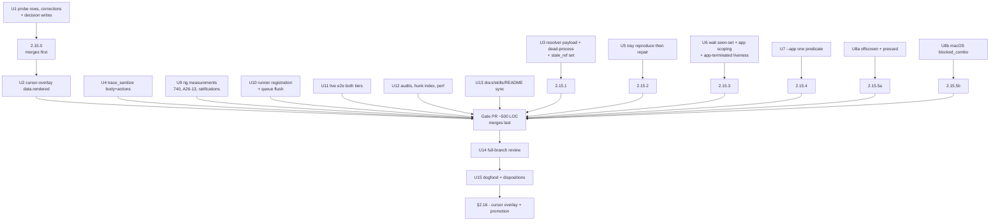
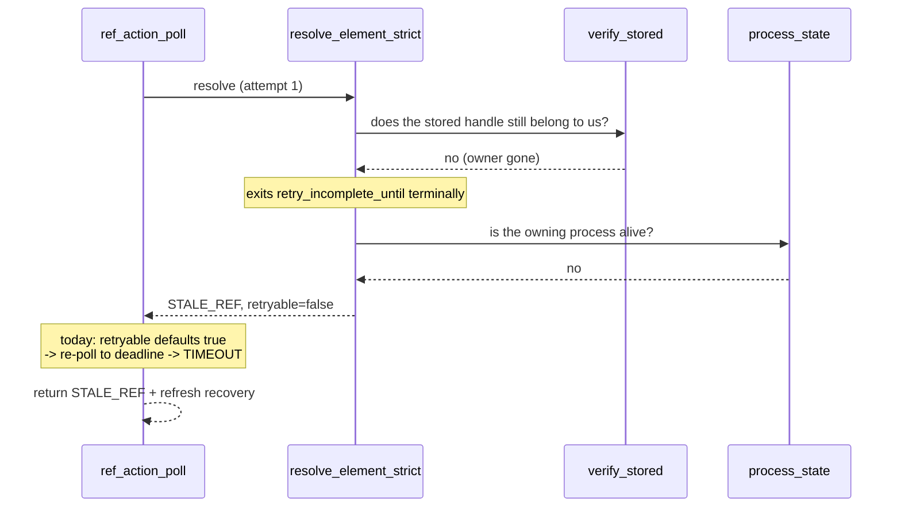

# Hardening & Integration Review (Sub-phase 2.15) - Plan

## Goal Capsule

- **Objective.** Prove the assembled `feat/windows-adapter` branch is production-grade as a whole, and hand §2.16 an adapter with no unsettled cross-platform contract question. This gate decides; it does not discover.
- **Authority hierarchy.** `docs/phases.md` §2.15 settles scope and exit criteria; this plan settles how. Planning re-measured §2.15's load-bearing claims and found **twenty-two that need correcting** — ten of them outright false about the code, the rest stale counts, wrong paths, incomplete lists or a self-contradiction. U1 corrects each in place in this PR and cites the measurement that disproved it. Where planning measured the document **right**, nothing is corrected.
- **Every "Settle X" bullet is decided here, not at implementation time.** §2.15's scope carries twenty of them, and each answer changes the PR topology (a normalization spawns its own PR, a ratification does not), so leaving one open would leave the shape of the sub-phase unknown. Every one is a numbered Key Technical Decision below with its evidence, its rejected alternatives and its landing target. There are no open questions in this plan.
- **Stop conditions.** Stop and ask when a reproduction contradicts a measurement recorded here (U5's tray reproduction is the one unit built around that possibility), when the full-branch review surfaces a defect whose fix would change a contract this plan settled, or when a ratification's stated reason turns out to be false on the implementer's host. Do **not** stop for a rig item this plan already ratified as out of reach — the ratification is the answer.
- **Execution profile.** Correct the document first, then land the small decisions, then register the runner, then run the live gate, then review, then dogfood. The gate PR stays near §2.15's ~500 LOC estimate; every shipped-behaviour normalization lands as a named satellite PR before the gate merges (KTD2).
- **Tail ownership.** This gate owns the decisions, the record of them, the runner, the live gate, the audits and the dogfood. It does **not** own the promotion to `main` — §2.16 does, and U1 corrects the three places §2.15 still claims it.

---

## Product Contract

### Summary

Fourteen sub-phases have merged into `feat/windows-adapter`. Each answered its own question and pushed the questions that needed both adapters in view onto this gate, which is why §2.15's scope is forty-five bullets long and twenty of them start with "Settle" or "Decide". That accumulation is the deliverable: a platform phase closes by saying what its two adapters promise, not by leaving the next platform to infer it.

Planning re-measured every load-bearing claim in that scope against the current branch rather than planning from the document. Twenty-two need correcting, and ten of those are outright false about the code. Two rig items the document called blocked are measurable on this box today. Two "what closes it" prescriptions describe fixes to code that already does the thing. One defect is one line, not the resolver rewrite the document describes. The corrections are the first implementation unit, because every later unit and every decision below reads from the corrected text.

The shipped result is a small gate PR — document corrections, four narrow code fixes, the runner, the audits — plus `2.15.0` for the corrections and six review-scoped PRs carrying the shipped-behaviour normalizations, and a `docs/phases.md` that a Linux planner can read as fact.

### Problem Frame

Three problems, in the order they bite.

**The source of truth contradicts itself, and the contradiction is about who merges.** §2.15's Goal says the promotion to `main` moved to §2.16. Its last scope bullet still says "Merge `feat/windows-adapter` → `main`", its exit criteria still say "`main` gains Windows support in one commit", and its Est. PR size still says "audits and the merge". §2.16 says Phase 2 promotes when *it* merges. A reader cannot tell which sub-phase ships the platform.

**Twenty contract questions are open, and every one of them is a promise an agent already relies on.** `offscreen` means two different things. The same toggle control is `button`+`pressed` on one adapter and `switch`+`checked` on the other. `--app notepad` works for one Windows command and fails for another on the same host. A `wait --event app-terminated` fires while the application is alive in the tray. None of these is a Windows defect that a Windows sub-phase could have fixed; each needs both adapters in review, which is what this gate is.

**The branch has never been proven live.** §2.12 shipped the self-hosted runner's workflow, refusal guard, runbook and trigger policy with no runner registered against them — five queued or cancelled runs and no green one. Nothing on this branch has run its full e2e gate in a headed interactive session.

### Requirements

| ID | Requirement |
|---|---|
| R1 | Every claim in `docs/phases.md` that planning or implementation measured false is corrected in place in this PR, citing the measurement, and the promotion contradiction is resolved in §2.15's favour of §2.16. |
| R2 | §2.15's exit criteria enumerate every capability its scope names, per the Cross-cutting sub-phase DoD. |
| R3 | `cursor-overlay` on Windows reports in its success envelope whether the overlay rendered, in a field named here that §2.16 consumes without inventing a second one. |
| R4 | The per-action cursor-overlay path stays fail-soft: an adapter that cannot render never fails an action. |
| R5 | The two resolution errors both adapters duplicate have one core-owned constructor pair, called by macOS and Windows alike, with the payload keys and their retryability consequence pinned by a core test that fails when a key is renamed or dropped. |
| R6 | A ref action whose owning process no longer exists answers terminally on the first attempt — `STALE_REF` / `not_delivered` with the refresh recovery strategy — rather than exhausting its budget into `TIMEOUT`. |
| R7 | No call site on any platform passes `AdapterError::stale_ref` anything but a ref id, pinned by a test. |
| R8 | Trace sanitization covers every serialized `NotificationInfo` field name, verified per field. |
| R9 | The tray read path is reproduced on the shipped release binary before any fix is designed, and the reproduction's outcome is recorded as a ledger row. |
| R10 | Either the tray read and click path work end to end, or the contract states which surface's refs are click-legal and why the others are not. |
| R11 | Every Windows command accepts the same `--app` identifier set as every other Windows command. |
| R12 | `APP_NOT_FOUND` and `AMBIGUOUS_TARGET` from `--app` resolution carry a suggestion naming a recovery the command can actually perform. |
| R13 | A `wait --event` catches a disappearance-class event for an entity that both appeared and disappeared inside the wait. |
| R14 | An `--app`-scoped wait for an appearance-class event honours its timeout rather than refusing `APP_NOT_FOUND` before the loop starts. |
| R15 | `app-terminated` is not reported for a process that is provably still alive. |
| R16 | `offscreen` carries one documented meaning across adapters. |
| R17 | The toggle control's role and state carry one documented meaning across adapters. |
| R18 | Dangerous-shortcut matching answers "is this combo dangerous" by one rule on both adapters. |
| R19 | Every remaining cross-platform divergence §2.15's scope names is settled — normalized or ratified — and recorded in `docs/phases.md`, not only in this plan. |
| R20 | A self-hosted interactive Windows runner is registered against `[self-hosted, Windows, agent-desktop-e2e]`, its trigger policy re-ratified against what the workflow actually declares, its ephemeral-versus-persistent choice recorded, and the accumulated queue flushed. |
| R21 | The full live e2e gate is green in both headless and headed tiers on that runner. |
| R22 | The two legs that fail identically at the branch's merge-base are re-baselined against an occluder the harness owns rather than the operator's console. |
| R23 | Each provision-or-ratify item is measured on a host that can produce the condition, or ratified as out of reach with the reason stated and the evidence cited. |
| R24 | `ERROR_ELEVATION_REQUIRED` (740) is observed live from a Medium-integrity caller on this box, closing A21-2. |
| R25 | The `agent-desktop-windows` non-Windows-target build status is recorded as a decision with its reason, and nothing claims a lane that does not exist. |
| R26 | `probes/windows/13-ledger-check.ps1` accepts a closure sub-phase of 2.16, and the `docs/phases.md` hunk-index invariant reads true against what it enforces. |
| R27 | A performance baseline is taken by the Windows vehicle and its deltas are explained. |
| R28 | `cargo tree -p agent-desktop-core` names zero platform crates and the release binary stays under 15MB, measured on this branch. |
| R29 | `docs/phases.md`, `skills/agent-desktop-windows/` and the README agree with what shipped, including the npm install-path guidance §2.13 left half-done. |
| R30 | The whole assembled branch — not this sub-phase's diff — gets a multi-agent review before merge. |
| R31 | The gate dogfoods its own surface against real software and every finding takes exactly one of the three dispositions. |
| R32 | A shell surface's returned identity has one stated scope, and a caller who passes it to a window-rooted snapshot is told where to go instead. |
| R33 | `wait --notification`'s per-poll cost is decided and its measured value is documented as the poll floor. |
| R34 | The Windows-only lifecycle envelope set is recorded with the entry §2.12 disproved removed and the protected-process pair corrected. |
| R35 | Every `probes/windows/FINDINGS.md` row whose action column names 2.15 is disposed of — implemented, or re-assigned in `docs/phases.md` with its reason. |

### Key Decisions

- **The promotion is §2.16's.** §2.15 proves the branch; §2.16 ships the last capability and merges. *Governs R1, R2.*
- **A ratification is only a disposition when it is written into `docs/phases.md`.** The Cross-cutting DoD says "Recorded" is not a disposition, and a decision that lives only in this plan is recorded, not disposed. Every KTD below that ratifies a divergence names the `docs/phases.md` text U1 writes for it. *Governs R19, R23, R25.*
- **A measurement beats a prescription.** Where §2.15 says "what closes it is X" and planning measured that X already ships, the document is corrected and the unit is re-scoped around the real defect. This happened three times (C12, C16, C18 in Sources). *Governs R1, R6, R9.*

### Scope Boundaries

**In scope.** Every bullet of §2.15's scope, taken as either a decision, a code change, a measurement or a ratification; the runner and the live gate; the audits; the full-branch review; the dogfood.

**Explicitly not in scope.**

- The merge to `main`. §2.16 owns it. U1 corrects the three fragments that still claim it here.
- The Windows cursor overlay renderer. §2.16 owns it. This gate ships only the field that reports whether it rendered.
- Re-litigating any sub-phase's own settled decisions. A finding against a shipped decision is a review finding with a disposition, not a re-open.

### Deferred to Follow-Up Work

- **macOS keeps the trait default for `spotlight`, `dock` and `menu-bar-extras`** — ratified, not deferred, per the disposition §2.15 authorizes. KTD17 names the blocker (an interactive macOS host, which has never existed for this line) so it is not an open promise.
- **Multi-monitor `list_displays` verification, mixed-DPI bounds, per-display capture, RDP/locked/Session-0 degradation, and live WGC pixel success** are ratified as out of reach within Phase 2 on the hosts available to it. KTD16 states each reason; U1 records them.
- **The WinUI3/MSIX menu-detector arm** stays `measurable: false` narrowed to WinUI3/MSIX. KTD16 records the population search that establishes it.
- **The macOS performance baseline for this gate's macOS-touching changes is not taken, and moves to Phase 5.** KTD20 states the reason — no interactive macOS host exists for this line — and what constrains the risk in the meantime. U1 writes it into Phase 5's scope in this PR.

---

## Planning Contract

### Key Technical Decisions

- **KTD1. A macOS-side change is isolated into its own PR with a release note; it is never a reason to prefer a worse answer.** `main` is the macOS GA line for the whole platform phase and Windows has never shipped, so a change to macOS behaviour reaches existing users and a change to Windows behaviour does not. That asymmetry governs **how a change ships** — KTD12's blocked-combo change lands alone as `2.15.5b` so an input-safety reviewer sees it — and nothing else. **It is explicitly not a tie-break for which adapter a divergence is closed on.** An earlier draft of this plan used it that way and reached a worse answer twice: it was cited to justify closing `offscreen` on Windows alone, which left the token meaning two things (KTD10 now closes it in core), and it was cited for the role/state divergence, where the evidence had already settled the question in the opposite direction (KTD11). **Rejected: a standing "normalize on the pre-GA adapter" rule.** "Changing macOS costs more" is a cost argument, and `CLAUDE.md` names cost as exactly the class of reason that does not justify leaving work undone. Each divergence below is decided on its own evidence and says what that evidence is.

- **KTD2. The corrections land first as `2.15.0`, the normalizations land as review-scoped PRs, and the gate PR merges last.** `docs/phases.md` states the term — a normalization "lands as its own sub-phase PR into `feat/windows-adapter` — verified there against both adapters — before this gate merges" — and §2.15's ~500 LOC estimate was always the gate PR's, not the sum. **Ordering, which an earlier draft had inverted.** Every normalization below depends on U1's corrections, and U1 was placed in the gate PR, which merges last — so a satellite's reviewer would have read a `docs/phases.md` that still described the toggle divergence wrongly and still claimed fourteen `stale_ref` sites. U1 therefore lands **first, as its own PR `2.15.0`**, before any satellite opens. **Then:** `2.15.1` the resolver/`stale_ref` cluster, `2.15.2` the tray repair, `2.15.3` the wait-event semantics, `2.15.4` the `--app` identifier collapse, `2.15.5a` the `offscreen` and `pressed` normalizations, `2.15.5b` the macOS blocked-combo change alone (KTD1). The gate PR merges last. **These are review-scoped PRs, not sub-phases, and U1 corrects the document to say so.** The Cross-cutting DoD binds a *sub-phase* to its own review, its own dogfood and its own perf baseline; §2.12.1 is a real sub-phase with its own `docs/phases.md` section on those terms. Attaching that to a 70-line matcher change would be ceremony, and it would also be *weaker*: U14 reviews the whole assembled branch including every satellite, U12's baseline measures their merged result, and U15 dogfoods the merged surface — one pass over what actually ships beats six partial passes over intermediate states. U1 rewrites the document's loose "sub-phase PR" wording to "a separate reviewable PR" so the phrase stops implying an obligation it did not intend. **Rejected: one PR for everything.** A 3,000-line PR mixing a macOS GA behaviour change with runner registration cannot be reviewed as either. **Rejected: treating each satellite as a numbered sub-phase.** Six reviews, six dogfoods and six baselines for roughly 1,400 lines. **What this costs:** eight PRs — `2.15.0`, six normalizations and the gate — each small enough to review.

- **KTD3. `cursor-overlay` gains `data.rendered`, a boolean, and nothing else.** The trait method's default is `Ok(())` (`crates/core/src/adapter/system.rs:11-13`), which is the root of the lie: an adapter that does nothing reports success, and both call sites then discard even that. The change is three edits. (a) The default becomes `Err(AdapterError::not_supported("update_cursor_overlay"))`, so an adapter that has not implemented the overlay says so; macOS overrides and is unaffected. (b) `src/dispatch/cursor_overlay.rs` stops discarding the result and sets `data.rendered` from `is_ok()` — the call currently runs *after* the response value exists and returns `Ok(value)` untouched, so the field is injected there. (c) `crates/core/src/cursor_overlay/submit.rs` **keeps warning and continuing**, because it sits on the per-action path and an adapter that cannot draw a cursor must never fail a click (R4). **The field is a sibling of `session_id` and `cursor_overlay` under `data`, not a member of the `cursor_overlay` object**, because that object is a projection of the session manifest and the render outcome is not manifest state. **`data.rendered` is emitted for `cursor-overlay enable` only** — a `disable` has nothing to render, so the field is absent there rather than carrying an undefined meaning. **§2.16 consumes `data.rendered` by that name**, and U1 writes the name into §2.16's scope so the next planner reads it as fact rather than as "whatever field that gate defined". **Rejected: a `not_supported` Windows override with no field.** §2.13 already established it changes nothing observable while both call sites discard. **Rejected: making the command fail on Windows.** `cursor-overlay enable` succeeding with `rendered: false` is a true answer; failing is a different, wrong one — the session's overlay preference genuinely was recorded. **What this costs:** `crates/core/src/adapter/system_tests.rs:22-33`'s `default_cursor_overlay_is_a_successful_no_op` is replaced by a test asserting the default refuses, and the Linux stub's overlay call starts returning an error it previously swallowed — honest, and recorded in U1.

- **KTD4. The resolver payload promotion, the dead-process classification and the `stale_ref` message set are one edit under one review, and the dead-process half is one call site, not a resolver rewrite.** `docs/phases.md` already argues the first and third belong together (the promotion opens `resolve_errors.rs` and `resolve.rs` on both adapters, and those two macOS files carry four of the fourteen macOS-and-core `stale_ref` sites, with the rest spread across four more macOS files and three core ones). Planning added the second, and corrected its mechanism. **The promotion:** `identity_unknown_error` (`crates/windows/src/tree/resolve_search.rs:57-69`) and `identity_unknown` (`crates/macos/src/tree/resolve_errors.rs:15-27`) were measured byte-identical in message, suggestion and details payload; `mark_deadline_elapsed` is line-for-line identical in both adapters' `resolve.rs`. One core-owned constructor pair replaces both copies, and a core test pins `kind`/`complete`/`retryable` against `Retryability::from_details`. **The dead-process fix is not what the document describes.** §2.15 says the ref is "still retried by `resolve_element_strict`'s `retry_incomplete_until` loop"; it is not — a dead owner fails `verify_stored()` and exits that loop terminally with `STALE_REF`. The retry is one layer up: `crates/windows/src/tree/resolve_match.rs:144-152` stamps that `STALE_REF` with `retryable: permits_retry_by_default()`, which reads `Unspecified` → `true` because nothing stamped it, so `crates/core/src/ref_action_poll.rs:86-96` re-invokes resolution to the outer deadline and the caller sees `TIMEOUT`. **The fix is to stamp it `false` when the owning process is genuinely gone**, distinguished from a transient handle-ownership change by one liveness read. **It lands in `crates/windows/src/tree/resolve.rs`, not in `resolve_match.rs`:** `stale_ref_error` and `stale_evidence_error` take neither a `Deadline` nor an adapter, so there is nothing there to run a budgeted check with. The only site holding both the entry and the deadline at the `verify_stored()` failure is `resolve_window_root` (`crates/windows/src/tree/resolve.rs:325-356`, at its `stale_ref_error` mapping around `:349`). The capability needs no trait plumbing: `crates/windows/src/system/process_state.rs`'s `process_state_impl(ProcessIdentity, Deadline)` is a plain crate-internal function and `ProcessIdentity` is constructible from the entry's stored process. So this is a new sibling constructor invoked from `resolve.rs`, not a one-line edit. **Rejected: classifying every `STALE_REF` non-retryable.** A window recreated mid-redraw is a legitimate retry. **Rejected: a resolver rewrite.** The document asked for one; the measurement says the resolver's control flow is already correct and only its retryability stamp is wrong. **What this costs:** one extra process-state read on the failure path only, and `docs/phases.md`'s description of the defect is rewritten rather than implemented.

- **KTD5. Trace sanitization needs two field names, not four, and one of the four does not exist.** `NotificationInfo` (`crates/core/src/notification_info.rs:4-12`) serializes `index`, `app_name`, `title`, `body`, `actions`. There is no `attribution` field. `trace_sanitize` does not match keys literally — `trace_key_tokens` splits on case and non-alphanumeric boundaries and matches any token, so `app_name` yields `[app, name]` and `name` is already in `SENSITIVE_KEYS`: **`app_name` is covered today**. `title` is covered. The real gap is `body` and `actions`, and because `sanitize_trace_value` replaces a matched key's whole value (`crates/core/src/trace_sanitize.rs:20` recurses into arrays but line 85 replaces the matched node), adding `actions` redacts the array wholesale rather than element-wise, which is what the envelope wants. **The test shapes differ and the plan says so:** `body` and `actions` get invert-verifiable tests — they fail before the change and pass after. **`app_name` gets a regression pin that passes today and cannot be invert-verified**, and it is labelled as a pin in the test's own name so a reviewer does not read it as a check that cannot fail. **Rejected: adding `attribution`.** Adding a key for a field that does not exist is a guard against nothing, and it would have shipped straight from the document. **What this costs:** `docs/phases.md`'s four-field claim is corrected to two, with the token-matching mechanism cited beside it.

- **KTD6. The tray unit reproduces before it fixes, and both of the document's prescriptions are wrong.** Three of §2.15's tray statements do not survive measurement. (a) "an HWND-rooted-walk versus tree-descent divergence" — both `taskbar` and `system-tray` resolve through `SurfaceFamily::Win32Class` chains (`crates/windows/src/system/shell_surface_kinds.rs:139-157`), a 1-hop chain to `Shell_TrayWnd` and a 3-hop chain to the promoted `ToolbarWindow32`; neither descends a tree, so there is no walk-versus-descent divergence to fix. (b) "an overflow raise that verifies visibility after the invoke" — that verification already ships: `crates/windows/src/system/shell_surface_open.rs:52-121` never accepts the invoke's return and polls `surface_presented` until observed, with a doc comment at `:75-84` saying exactly that. (c) the zero-children read itself is **unconfirmed**: A26-5 measured the same promoted toolbar through the shipped COM stack at `com_direct_children: 3`, and the zero reading in the corpus was the *managed* stack, which `FINDINGS.md` already rules non-authoritative. **So U5 reproduces first**, on the release binary, with the COM-stack control beside it, and records the outcome as a ledger row before a fix is designed. **Pre-committed branches.** *Branch A:* the zero read reproduces — the fix is designed against whatever the reproduction shows and lands in `2.15.2`, and the overflow's `surface_presented` predicate is examined in the same reproduction since it reported presented while an independent Win32 poll did not. *Branch B:* the read does not reproduce on the release binary — the dogfood observation is recorded as stack- or session-specific, `2.15.2` carries only the click-legality contract (R10), and the ledger row says so. **Rejected: designing the fix from the dogfood report.** The dogfood measured an outcome; the document then asserted a mechanism, and the mechanism is refuted. Building on it would ship a fix for a cause that was never measured. **What this costs:** the tray unit cannot state its own diff size in advance, which the LOC budget reflects as a range.

- **KTD7. `--app` collapses onto one predicate, and that predicate tolerates a trailing `.exe`.** The measured inconsistency is not the cross-platform one the document describes. macOS uses `app_name_matches` everywhere including its `list_windows`. Windows inherits core's exact-match `list_apps_scoped` **and** adds a second, ad-hoc substring predicate of its own (`crates/windows/src/system/window_ops.rs:158,176`, `to_ascii_lowercase().contains()`), which is the whole reason `list-windows --app notepad` succeeds while `list-surfaces --app notepad` refuses. Two changes: `window_ops.rs`'s filter calls `app_name_matches` like every other site, and `app_name_matches` gains one rule — a candidate matches when it equals the expected string **or** when it equals the expected string plus a `.exe` suffix, compared case-insensitively. That rule is platform-neutral in code and inert on macOS, where `NSRunningApplication.localizedName` never carries the suffix, so no macOS behaviour changes. **Rejected: a Windows override of `list_apps_scoped`.** §2.11 rejected it for blast radius and was right; this change is smaller and lands in the one predicate rather than adding a fourth semantics. **Rejected: removing the substring predicate and accepting only `notepad.exe`.** It makes Windows internally consistent by taking away the form that works, when the form that works is the one an agent written against macOS would try. **Rejected: `#[cfg(target_os = "windows")]` in the predicate.** `CLAUDE.md` forbids core platform-conditional code and the repo has the scar. **What this costs:** an application genuinely named `foo` on a host that also runs `foo.exe` becomes `AMBIGUOUS_TARGET`, which is the correct answer, and `docs/phases.md`'s three-site trace is corrected to four sites over two semantics.

- **KTD8. The wait's baseline gains a seen-set for disappearance-class events only, and that one change closes the batch pre-seed too.** `wait_for_event` seeds a baseline from the first capture and never advances it (`crates/core/src/commands/wait_event.rs:65-67`), so an entity that both appears and disappears inside one wait is absent from the baseline and absent from the current capture and `diff_signals` sees nothing. **Appearance-class events keep the fixed baseline** — a wait answers "what appeared since I started", and advancing it would redefine every appearance event, which is exactly the objection `docs/phases.md` raises. **Disappearance-class events diff against a running seen-set** — the baseline union everything observed in any poll — so `window-closed`, `app-terminated` and `surface-dismissed` catch a transient lifecycle. **The batch pre-seed needs no separate change.** `src/batch/execution.rs:44-87` takes the baseline before dispatching the preceding entry, which helps `[launch, wait window-opened]` and defeated `[launch, wait window-closed]` because the window was absent from both endpoints; with the seen-set the window is observed in an early poll and its departure is caught. U6's test asserts that batch sequence directly, so the claim is proved rather than reasoned. **Rejected: advancing the whole baseline per poll.** It redefines appearance events and the document pre-rejects it. **Rejected: moving the batch seed for disappearance-class events.** Two changes where one suffices, and it leaves the non-batch case broken. **What this costs:** one `HashSet` carried across polls in a loop that already allocates a capture per poll.

- **KTD9. `app-terminated` is confirmed against process liveness, and the confirmation fails open.** Windows's `list_apps` population is the distinct owning processes of admitted top-level windows (`crates/windows/src/system/app_ops.rs:142-186`), and `capture_signal_baseline` matches it deliberately so the two agree about what an app is. A close-to-tray process hides its last visible window, fails `passes_filter`'s `visible` check, leaves the population while fully alive, and `diff_apps` — which keys purely on `(pid, process_instance)` set membership — reports a genuine `app-terminated`. **The fix is one adapter call at the one place it matters:** before `wait_event` reports an `AppTerminated`, it reads `SystemOps::process_state` for that identity, which is already on the trait with a `not_supported` default and both adapters overriding it, and `wait_event.rs:16` already holds `&dyn PlatformAdapter`. **The confirmation suppresses the event only when the process is proved alive.** An error, a `not_supported` default, or any ambiguous read emits the event exactly as today — a liveness check that fails closed would silently eat real terminations, which is worse than the bug it fixes. **Rejected: changing the apps population to the process table.** `app-launched` would then fire for every background service start. **Rejected: ratifying and documenting that `app-terminated` means "stopped owning a window".** The event's name is cross-platform and would then be true on neither adapter's terms. **What this costs:** one process-state read per reported termination, on macOS too, where it always passes.

- **KTD10. `offscreen` becomes one core-owned geometric predicate that both adapters call, and the UIA provider value stops feeding it.** An earlier draft proposed keeping macOS as-is and having Windows emit *geometry OR the provider's `IsOffscreen`*. That is not a normalization: an identical virtualized row would still be `offscreen` on Windows and not on macOS, so the token would keep meaning two things while costing a Windows change and a review. Worse, the sentence that draft proposed writing into `docs/phases.md` — "not presently within its window's visible viewport" — does not describe what macOS computes: `crates/macos/src/tree/state_reader.rs:89-97` tests **full disjointness** from the window rectangle, so a half-overlapping element is not offscreen there. Implementing that sentence would have produced a third meaning. **What ships instead:** macOS's predicate moves to core unchanged as a shared function, macOS calls it (a refactor with no behaviour change), and Windows calls the same function instead of reading `IsOffscreen` (`crates/windows/src/tree/states.rs:101-103`). One predicate, one meaning, both adapters. **Dropping the provider value is what the evidence supports, not a concession:** A14-8 measured a UIA `IsOffscreen` contradicting itself within one window — a minimized top level reporting true while every descendant reported false — which is why no adapter may propagate a container's value to its subtree, and an unreliable signal is a poor thing to union into a cross-platform token. **Rejected: normalizing to the provider value.** macOS has none to read. **Rejected: exposing the provider value as a separate Windows-only state token.** It adds vocabulary to carry a signal A14-8 measured as self-contradictory. **What this costs, stated rather than hidden:** a virtualized row that is scrolled out of view but geometrically inside its window is not flagged `offscreen` on either adapter. That is a known limit of one honest predicate, and U1 writes it into `docs/phases.md` so it is a documented boundary rather than a surprise.

- **KTD11. The role does not diverge at all, the state does, and closing it is one cached UIA property on Windows.** `docs/phases.md` describes this as "the same control surfaces as `switch` with state `checked` instead", implying macOS reports a genuine switch as a button. It does not: `crates/macos/src/tree/roles.rs:8` maps `AXSwitch` and `AXToggle` to `"switch"`, so **a genuine switch is `switch` on both adapters** and there is no role divergence to settle. macOS's `pressed` line fires only when `role == "button"` (`crates/macos/src/tree/state_reader.rs:57-59`) — a toolbar toggle button, not a switch. **What measurement found on this box, on the UIA3 COM stack:** all nine Settings toggle switches present as `ControlType` 50000 with `LocalizedControlType` `"toggle switch"`, `ClassName` `"ToggleSwitch"`, `TogglePattern` available and `LegacyIAccessible` state carrying `STATE_SYSTEM_CHECKED` when on — so Windows's reclassification is **accurate on every control that reached it** and does not false-positive. WordPad's toolbar toggle button presents as `ControlType` 50000 with `LocalizedControlType` `"button"`, **no `TogglePattern` at all**, `Invoke` + `LegacyIAccessible` only, and `LegacyIAccessible` state `STATE_SYSTEM_PRESSED`. It therefore never reaches `button_role`'s toggle arm and correctly stays `button`. **So the one true divergence is narrow: Windows has the pressed-state information and does not read it.** The fix is smaller than it looks, because the adapter already has the information. `TreeProperty::LegacyState` is already in `WALK_SET` (`crates/windows/src/tree/property_ids.rs:155`), already in `READ_HEALTH_PROBES`, and already read by `push_legacy_state` for `haspopup` and `busy`, so nothing joins the cache request and there is no extra round trip to argue about. **The change is one bit check on a value already in hand:** emit `pressed` for a node whose role resolved to `button` and whose `LegacyIAccessible` state carries `STATE_SYSTEM_PRESSED`. `crates/windows/src/tree/states.rs:53-72`'s doc comment is rewritten from "deliberately unproduced" to what produces it. `button_role` is untouched. **Rejected: narrowing `button_role` on `LocalizedControlType`.** It is localized text, and §2.14's KTD4 already established that this adapter addresses controls by `AutomationId` rather than by localized name. **Rejected: narrowing it on `ClassName == "ToggleSwitch"`.** That string is XAML-specific and would misclassify a switch from any other framework — a rule designed against a false-positive nobody has observed. **Rejected: normalizing macOS.** There is nothing to normalize; macOS already agrees. **What this costs:** one more property in a request that is already batched, and `docs/phases.md`'s description of this divergence is rewritten in place — it was wrong about the role and right that `pressed` was unproduced.

- **KTD12. macOS adopts Windows's superset matching for dangerous shortcuts — the one macOS GA behaviour change this gate ships.** Windows matches a blocked combo when the key matches and the pressed modifiers are a superset of the entry's (`crates/windows/src/input/blocked_combo.rs:34-43`), because `alt+shift+tab` steals the foreground exactly as `alt+tab` does. macOS compares canonical strings for equality and covers the same ground by enumerating variants — it lists `cmd+q` and `cmd+shift+q` separately. Both are honest; only one cannot miss a variant nobody listed. Under superset matching macOS's list reduces to three entries — `cmd+q`, `cmd+alt+esc`, `cmd+shift+delete` — because **both** `cmd+shift+q` and `ctrl+cmd+q` are already covered: the rule is that the *pressed* modifier set contains the entry's, and `{cmd,shift}` and `{ctrl,cmd}` each contain `{cmd}`. An earlier draft kept `ctrl+cmd+q` on a rationale that was simply backwards, and it would have been written into `docs/phases.md` as settled contract text — the false-correction failure this plan exists to police, caught by review rather than by measurement. **The evidence decides it, not a rule about which adapter is cheaper to change:** an enumeration cannot cover a variant nobody listed, and adopting the enumeration on Windows would install that hole rather than close it. **Rejected: ratifying the divergence.** "Is this combo dangerous" answered by two rules means a combo blocked on one platform and delivered on the other, which is a safety difference, not a formatting one. **What this costs:** a macOS user who previously could send `cmd+ctrl+shift+q` now gets it blocked. It ships **alone** as satellite `2.15.5b` with a release note, and it is the single most visible thing this gate changes for an existing user.

- **KTD13. Nine divergences are ratified rather than normalized, each because normalizing is either infeasible on Windows or would remove a capability that works.** Each is recorded in `docs/phases.md` by U1 with the reason and evidence; a ratification that lives only in this plan is "Recorded", which the DoD rejects.
  1. **`type` has no semantic-headless path on Windows.** macOS writes `AXSelectedText` (`crates/macos/src/actions/type_text.rs`); UIA exposes no insert-at-selection — `ValuePattern.SetValue` replaces the whole value (that is `set-value`) and `TextPattern` is read-only for insertion. Windows `type` is physical synthesis gated on `allow_focus_steal` (`crates/windows/src/actions/physical_target.rs:38-46`), so strict-headless `type` returns `POLICY_DENIED`. **Ratified as: `type` is semantic where the platform exposes insert-at-selection and physical otherwise, with the per-platform policy floor documented.** Infeasible to normalize; the contract is normalized instead of the behaviour.
  2. **`press --app` has no semantic accelerator path and no headless background delivery on Windows.** macOS walks `AXMenuBar` for a matching `AXMenuItemCmdChar`/`AXMenuItemCmdModifiers` and presses via `AXPress`, and its headless arm delivers pid-targeted regardless of foreground; `SendInput` has no per-pid targeting (§2.8 KTD2), so Windows fails closed when the target is not frontmost (`crates/windows/src/system/key_dispatch.rs:82-94`). **The third arm — a non-interactive *caller* — is ratified and documented too:** `press escape --app` from a background job failed in 4 of 4 reproductions while the identical command from the interactive console succeeded every time; `delivered_unverified` is the correct disposition and the reach limit is what was undocumented.
  3. **`launch` identifiers are path-or-system-image on Windows, display-name-or-bundle-id on macOS.** §2.14 recorded the `Win32_UI_Shell` gate and the AUMID-only reach of `IApplicationActivationManager` (A21-8); the Windows side arrived here settled. KTD7's `.exe` tolerance narrows the practical gap without reopening the gate.
  4. **The UWP-hosted window identity split is documented, not normalized.** The frame's handle is the window `id` because the frame is what the desktop treats as the window; `app` and `pid` are read from the `CoreWindow` (A26-8, A1-3). Normalizing would hand out an identity `focus-window`, `move-window` and `resize-window` would then fail against.
  5. **The mutation-path delivery classifier stays adapter-local.** Planning measured the pairing sets **not** identical — Windows carries `ActionFailed`+`NotDelivered` for `UIA_E_ELEMENTNOTENABLED` and `Timeout`+`DeliveryUncertain` for `UIA_E_TIMEOUT`, neither of which macOS has a branch for — so a shared core type would have to model two genuinely different failure spaces. **What ships instead is a conformance test** asserting both adapters' classifiers land only in the shared `ErrorCode`/`DeliveryDisposition` vocabulary core already owns, which is the guard without the abstraction.
  6. **Windowless `close-app` and the window-derived app population are ratified**, with the one wrong answer they produced fixed separately by KTD9. Windows's `list_apps` means window-owning processes; macOS's means running applications minus `ActivationPolicy::Prohibited`. The Windows close path already has its windowless fallback (`crates/windows/src/system/close.rs:151-169`) — it is `resolve_app` that refuses first, and changing `resolve_app` changes every command's resolution. The UWP-hosted instance closes through the frame-descent identity §2.14 shipped and needs no separate rule.
  7. **Launcher-style child-pid attach keeps the pid-exact rule.** `observe_window` requires the window's pid to equal the launched pid and otherwise returns `Ok(None)` after polling — a false negative, not an error. Walking child processes for the first accessible window is a heuristic with no measured population to validate against (A21-1 recorded one instance).
  8. **`AMBIGUOUS_TARGET` is the ratified answer for a multi-row image match on the attach path**, and `--no-attach`'s already-running `ACTION_FAILED` stands. **One thing is fixed rather than ratified:** the attach branch never reads `options.args`, so `launch explorer.exe <folder>` silently drops the folder. When args are supplied, the attach path is not taken — passing arguments is a distinct intent from attaching to what is already running.
  9. **`renderer` and `presentation` stay macOS-only.** Both are bundle-derived metadata Windows has no equivalent source for at launch time. `crates/windows/src/tree/chromium.rs` recognises Chromium by window class, but a launch may report no window at all, so the signal is not available where `LaunchResult` is built. `launch --cdp` itself is platform-neutral and verified working on Windows; what does not cross is the *unprompted* nudge. **The nudge's absence is documented in `skills/agent-desktop-windows/`** so an agent is told to ask for `--cdp` against an Electron target on Windows rather than discovering the dense tree.

- **KTD14. `agent-desktop-windows` is Windows-only by design, and the exclusion is recorded rather than the 25 errors fixed.** The crate does not compile for `x86_64-unknown-linux-gnu` — 25 errors at HEAD, all unresolved items behind `#[cfg(target_os = "windows")]`, up from the 8 `docs/phases.md` records at the merge-base. `docs/phases.md` pre-authorizes "a recorded exclusion with its reason", and the reason is that **nothing consumes it**: the binary and the FFI crate take the windows crate through target-gated dependencies, `agent-desktop-macos` not compiling off macOS is already accepted in the same document (phases.md:2699), and `ci.yml`'s Windows lane already `cargo check`s the crate on its own platform. The repo learning it is measured against — never ship platform code that CI cannot execute — is about **core** carrying platform code; core passes the Linux target check today. **Two things ship with the exclusion rather than being noted.** `docs/phases.md:1407` offers "a lane ... **or a recorded exclusion with its reason**" but then adds "plus the stub repairs the check surfaces" — a clause that is vacuous once no check surfaces anything, so U1 rewrites it so the document does not contradict the shipped decision. And the genuine incoherence is fixed rather than described: §2.14's stub modules carry non-Windows entry points while the crate has no non-Windows story, so the crate is gated consistently at the module level. That is a bounded tidy-up of gating attributes, not a Linux facade. **Rejected: fixing the 25 errors.** Building a non-Windows facade for a crate no non-Windows target links is the over-engineering this sub-phase was asked to avoid. **Rejected: adding the lane.** A lane whose only purpose is to make a facade compile is the same work with a yellow badge on it.

- **KTD15. `focus-window` across the integrity boundary is ratified, and `docs/phases.md`'s §2.9 scope is corrected — no code changes.** §2.15 says §2.9 "shipped an integrity comparison meant to fail a strictly-higher-integrity `focus-window` closed as `PERM_DENIED`" and asks for a fix or a ratification. The code was never meant to fail closed: `crates/windows/src/system/window_activate.rs:47-70` computes `strictly_higher` **only to pick the error label**, `raise_with_budget:127-149` attempts unconditionally and returns `Ok` as soon as the target owns the foreground, and the function's own doc at `:42-46` reads "Cross-integrity targets are attempt-and-verify (A21-7)". The genuine fail-closed gate (`crates/windows/src/input/elevation.rs:37-44`) is called only from `actions/physical_target.rs:35` and `system/key_dispatch.rs:54` — input dispatch, never activation — which is exactly the boundary §2.12 measured: `SetForegroundWindow` is gated by the foreground-lock heuristic, not by Mandatory Integrity Control, while UIPI covers `SendInput`/`PostMessage`. **Ratified as: window activation crosses the integrity boundary, input delivery does not.** **Rejected: adding the pre-check.** It would refuse an operation measured to work, to make the code match a sentence in a document that was wrong about the code. **What this costs:** three documents are corrected — §2.9's scope, §2.15's class-(b) envelope list and §2.12's scope — and nothing ships.

- **KTD16. Four rig items are ratified as out of reach and two the document called blocked are measured here.** The measurements are planning's, taken on this box and committed as U1's Area 27 ledger rows.
  - **`ERROR_ELEVATION_REQUIRED` (740) is measured here, and §2.15's "infrastructure that does not exist" is false.** A9-1 already confirms Medium-integrity manufacture on this box by `CreateRestrictedToken` + `SetTokenInformation`, verified by token read-back; A24-4 already records CONTRADICTS — "stageable on this dev box with no runner, no rig and no privilege the caller lacks"; and the `requireAdministrator` fixture already exists (`probes/windows/scratch/lifecycle-helpers/requireAdmin.manifest`, compiled `bin/LifecycleHelpers.elev.exe`). `CreateProcessW` does not elevate — it returns 740 synchronously — so the missing piece was instrumentation, not hardware. U9 measures it and closes A21-2.
  - **The A26-13 Chromium exposure-floor classification is attemptable here.** `Cursor` is running with `Chrome_WidgetWin_1` and `Obsidian` is installed, so a settled content tree above the 34-node floor is a session away rather than a host away. U9 attempts it with pre-committed branches: a settled tree above the floor closes the positive-area-versus-zero-extent classification; a third failure to settle records `measurable: false` with the two prior attempts and this one named.
  - **Multi-monitor, mixed-DPI and per-display capture are ratified out of reach.** This box is a VMware VM presenting one 1639x732 display at 96 DPI through a single virtual adapter. A22-8 already measured a software second display `manufacturable: false` on this class of box, and planning re-confirmed the single-adapter shape.
  - **RDP, locked-desktop and Session-0 degradation are ratified out of reach, and the reason is sharper than "no host".** RDP inbound is disabled on this box (`fDenyTSConnections=1`) and there is exactly one interactive console session — the one the harness itself runs in. Enabling RDP and connecting as the same user takes that session over; locking it cannot be undone from inside it. A failed reattach strands the box mid-run. Closing this needs a second, disposable interactive host, which is the "dependent on infrastructure that does not exist yet" ground `CLAUDE.md` names. 2.0's `A10-2` rides the same ratification.
  - **Live WGC pixel success is ratified out of reach.** The build is 17763, the same host class where A22-1 measured `IsSupported: true` with interop failing. §2.12's Deferred item 5 pre-committed both branches; this is the not-proven arm, and it needs a host whose WGC interop works.
  - **The WinUI3/MSIX menu arm stays `measurable: false`, narrowed.** All 28 Appx packages on this box are inbox Server 2019 system packages — no `Microsoft.UI.Xaml`, no `WindowsAppRuntime`, no third-party WinUI3 family — which confirms A10-7 rather than extending it. §2.14 already evaluated the UWP half through both shipped detector sources at rest.
  **Rejected across all six: provisioning hardware inside this gate.** Buying or building a second host, a second monitor and a WGC-capable box is not a sub-phase's decision to take; `CLAUDE.md` puts scope reduction and scope expansion alike with the owner. What the gate owes is the measurement where it is possible and the ratification with its reason where it is not.

- **KTD17. macOS stays without the three `open-system-surface` kinds, ratified — the disposition `docs/phases.md` already authorizes.** P2-O14's macOS half — `spotlight`, `dock`, `menu-bar-extras` — kept the trait default through the Windows run; `resolve_shell_surface` is platform-neutral and macOS has never implemented it. §2.15's own bullet offers "**or ratify that macOS stays without them**", and that is what ships. **The reason, named precisely:** what is missing is not a macOS host — `ci.yml`'s macOS `test` job runs on every PR into `feat/windows-adapter` and gives compile, clippy and unit tests — it is an **interactive** macOS host. `native-e2e.yml` has zero runs in the repository's history, so macOS live e2e has never executed, and three shell-surface implementations verified only against a mock is platform code no lane genuinely exercises, which is the repo learning this gate is supposed to uphold. **Rejected: deferring them to Phase 5.** An earlier draft did that, and it was worse than ratifying: Phase 5 inherits the identical unnamed blocker, so the deferral would have claimed work on exactly the terms that stop it today. A ratification is honest now; a deferral is a promise nobody can keep. **Rejected: implementing them blind.** **What this costs:** `open-system-surface` is Windows-only when Phase 2 closes, stated in `docs/phases.md` with the interactive-host blocker named, so whoever provisions one knows what it unblocks.

- **KTD18. The runner is persistent, launched from a Task Scheduler task at log-on, and its trigger policy is re-ratified against what the workflow actually declares.** §2.12 shipped `windows-e2e.yml`, `scripts/run-windows-e2e-ci.ps1` with its two-condition refusal guard, and `docs/runbooks/windows-self-hosted-runner.md`; the runbook's own last section is "What §2.15 still owes". A service-mode runner has no desktop and cannot see UIA, so the runner runs inside a real interactive session. **Persistent, not ephemeral/JIT:** a JIT runner re-registers per job, and the interactive session it needs is the session a human logged into — there is nothing to recreate per job, and workspace hygiene between runs is the runbook's existing procedure. **The trigger policy re-ratifies to what is declared and no more:** `workflow_dispatch` plus a paths-scoped `push` on `feat/windows-adapter`, never `pull_request`. **§2.15's instruction to "set the fork-PR approval policy" is moot and U1 corrects it** — the workflow has no `pull_request` trigger at all, so there is no fork PR for a policy to gate; the runbook's fork-PR section stays as the rule that applies if a `pull_request` trigger is ever added. **The queue is flushed at registration:** five runs exist, four cancelled and one queued as of 2026-08-30, and `cancel-in-progress: false` means the queued one would claim the runner the moment it registers, on a commit that is not the one under test. It is cancelled before registration completes.

- **KTD19. The hunk index keeps the two invariants that carry value and retires the completeness half, and the closure range extends to 2.16.** `probes/windows/13-ledger-check.ps1` measures `docs/phases.md` hunks against `main`, which under the platform delivery model is an entire platform phase behind the integration branch — so the measured count grows with every merged sub-phase while the index only gains what someone remembered to add. Live: 124 measured, 66 indexed, shortfall 58, exit 0. The half that carries the value already fails the build: every indexed hunk names a ledger row that exists, and every `CONTRADICTS` row is backed by a hunk. **Completeness is retired with its reason recorded in the script and in `docs/phases.md`**, because a bijection against a base that is a phase behind is a count of the branch's age, not of anyone's diligence. **Two repairs ship with it:** line 142's closure-sub-phase range becomes `2.0-2.16`, which today would fail any DEFERRED row naming §2.16, and `probes/windows/FINDINGS.md:557`'s "reports 43 hunks" prose is corrected to defer to the measurement. **Rejected: bringing the index current.** 58 rows for hunks written by fourteen sub-phases, indexed by this one, is one gate answering for every earlier gate's doc edits — which is exactly why §2.11 reported the shortfall instead of enforcing it.

- **KTD20. The performance vehicle is the probe corpus cost methodology, and the macOS baseline is explicitly not taken.** `scripts/perf-baseline-compare.sh` is structurally macOS-bound — it opens the `.app` fixture bundle — so the Windows vehicle is min-of-seven with the warm-up discarded, reported as min with median and max beside it (A15-13, applied in A18-7). **The macOS side of this gate's changes gets no perf baseline, and that is stated rather than skipped:** KTD4's resolver promotion and KTD12's blocked-combo change both touch macOS, the first on the resolution hot path, and no macOS host exists for this line (KTD17). What ships instead is the constraint that made it acceptable — the promotion moves a constructor without changing what it constructs, pinned by the core test in U3, and the blocked-combo change is a matcher on a five-entry list, not a hot path. U1 records the untaken baseline as a known gap against Phase 5.

- **KTD21. A shell surface's identity is surface-kind-scoped, and the corrections are to the wording and to one error's suggestion.** `open-system-surface` returns a `w-<hwnd>` identity and `snapshot --window-id` refuses it `WINDOW_NOT_FOUND` — measured live at §2.14's dogfood against the promoted tray toolbar's handle — because the window inventory deliberately excludes shell windows, which is §2.14 KTD1's correct behaviour rather than a defect. **Ratified: shell identities are surface-kind-scoped and reached through `snapshot --surface <kind>`.** Rooting them through the shell resolver would let `snapshot --window-id` accept a handle `list-windows` never returns and `focus-window`, `move-window`, `resize-window` and `close-app` would then each have to special-case — the same objection §2.14's KTD5 raised against putting a synthetic shell entry in `list_windows`. **Two things are fixed rather than only ratified.** §2.14's exit-criterion clause implying a shell identity is consumable by a window-rooted snapshot is corrected — §2.15 quotes it as "an identity `snapshot --window` consumes", and planning could not locate that string verbatim in §2.14, so the implementer identifies the real clause before editing it. And `snapshot --window-id` given a handle that resolves to a known shell class returns its `WINDOW_NOT_FOUND` with a suggestion naming `--surface <kind>`, so the identity is a dead end that says where to go. **Rejected: not returning the identity at all.** It is useful for correlating an `open-system-surface` call with a later snapshot in a trace, and removing it would break that for no gain. **What this costs:** an agent holds an identity it can log but not root, and the tool says so at the point of failure instead of in a document.

- **KTD22. `wait --notification` keeps per-poll open/close, and the measured cost becomes the documented poll floor.** The condition §2.14's wait decision pre-committed has fired: §2.14's cost baseline measured `list-notifications --headed` at min 1243.5 ms, median 1254.2 ms, taken through the release binary against an empty center, so every poll pays a full raise-read-close cycle. **Ratified: per-poll open/close stays.** A held-open watch session would keep the Action Center visible on the user's desktop for the whole duration of the wait — a visible artifact the agent's caller did not ask for and cannot see coming — and would need its own teardown-on-abort path for a surface the shell can close underneath it at any moment, which is a second failure mode traded for latency on a command that is inherently slow. Each poll running in its own one-call session is also exactly what macOS does, so this is the shape that already agrees across adapters. **What ships instead is the number:** `skills/agent-desktop-windows/` states the measured per-poll cost beside `wait --notification`, so a caller sizing a timeout knows a 5-second wait buys roughly four polls rather than discovering it. **Rejected: the held-open session.** **Rejected: widening the poll interval to hide the cost.** It makes the wait less responsive without making it cheaper. **What this costs:** a notification that appears and is dismissed inside one poll interval is missed, which the documented floor now makes predictable rather than surprising.

- **KTD23. The class-(b) Windows-only lifecycle envelope set is recorded as-is, with one entry deleted and one corrected.** §2.15 asks only whether any of these pairs should be renamed. None should — each already reads true against the envelope contract. **The set:** a windowless graceful-close escalation returns `ACTION_FAILED` / `not_delivered`; a `CreateProcessW` invalid name returns `INVALID_ARGS` / `not_delivered`. **The UIPI activation entry is deleted**, because §2.12 measured live that `focus-window` against a strictly-higher-integrity target succeeds rather than exhausting a budget into `PERM_DENIED` (KTD15). **The protected-process close refusal is corrected in place**: it is shared across platforms and ships as `INVALID_ARGS` / `not_delivered` through `crates/core/src/commands/close_app.rs`'s `invalid_input_with_suggestion`, not `PERM_DENIED` (dogfood J2). U1 writes the corrected set into `docs/phases.md` and this plan's Error and Disposition Mapping carries the same rows, so the two cannot drift.

### Error and Disposition Mapping

| Condition | Code | Disposition | Notes |
|---|---|---|---|
| Ref action whose owning process is gone | `STALE_REF` | not delivered, retry safe | with `recovery.strategy: refresh_snapshot_then_retry_original`; today it is `TIMEOUT` with `recovery: null` (KTD4) |
| Ref action whose window handle changed owner but process is alive | `STALE_REF` | not delivered, retry safe | unchanged — the poll loop still retries to the deadline |
| Strict resolution with indeterminate identity | `APP_UNRESPONSIVE` | not delivered, retry safe | payload from the core constructor pair, `retryable: true` (R5) |
| `--app` value matching no application | `APP_NOT_FOUND` | not delivered, retry unsafe | gains a suggestion naming the accepted identifier forms (R12) |
| `--app` value matching several applications | `AMBIGUOUS_TARGET` | not delivered, retry unsafe | suggestion names `--pid` where the command accepts one, and otherwise names the candidates rather than refs and snapshots (R12) |
| `cursor-overlay enable` on an adapter with no renderer | none — `ok: true` | delivered | `data.rendered: false` (KTD3) |
| Per-action overlay update on an adapter with no renderer | none — the action's own result | unchanged | fail-soft, warn only (R4) |
| Strict-headless `type` on Windows | `POLICY_DENIED` | not delivered, retry unsafe | ratified divergence, documented policy floor (KTD13.1) |
| Headless `press --app` against a non-foreground Windows target | `POLICY_DENIED` | not delivered, retry unsafe | ratified (KTD13.2) |
| `focus-window` against a strictly-higher-integrity target | none — `ok: true` when the shell grants foreground | delivered | ratified attempt-and-verify (KTD15) |
| `launch <image>` with args while an instance is running | proceeds to launch | delivered | args suppress the attach path (KTD13.8) |
| `launch <image>` attach with several matching rows | `AMBIGUOUS_TARGET` | not delivered, retry unsafe | ratified (KTD13.8) |
| Windowless graceful-close escalation | `ACTION_FAILED` | not delivered, retry safe | class-(b) Windows-only, recorded unchanged (KTD23) |
| `CreateProcessW` invalid name | `INVALID_ARGS` | not delivered, retry unsafe | class-(b) Windows-only, recorded unchanged (KTD23) |
| Protected-process close refusal | `INVALID_ARGS` | not delivered, retry unsafe | shared across platforms, **not** `PERM_DENIED`; corrects the class-(b) list (KTD23) |
| `snapshot --window-id` given a shell-surface handle | `WINDOW_NOT_FOUND` | not delivered, retry unsafe | suggestion names `--surface <kind>` (KTD21) |

### High-Level Technical Design

The gate's PR topology — what the ~500 LOC estimate covers and what it does not.

The dead-process fix, corrected from the document's description to what the code actually does.

### Assumptions

- **The implementer's host is the box these measurements were taken on** — a VMware VM running Windows Server 2019 Datacenter 1809, build 17763, one 1639x732 display at 96 DPI, one interactive console session. Every ratification in KTD16 is scoped to that host and names it. On a different host, the ratifications are re-decided rather than inherited.
- **CI on a PR into `feat/windows-adapter` runs `ci.yml` in full**, including the macOS `test` job that owns `clippy -D warnings`, the `cargo tree` isolation check and the 15MB cap. This is how the macOS half of U3 and U8 is verified; it is compile, lint and unit tests, not live behaviour, and KTD17 and KTD20 record what that does not cover.
- **The user is the owner for three decisions this plan takes on their behalf and flags rather than defers:** KTD12's macOS GA behaviour change, KTD16's six ratifications, and KTD17's ratification that macOS stays without the three shell-surface kinds. Each is stated with its reason and is reversible at review.

---

## Implementation Units

Each unit carries a **landing target** per KTD2: `2.15.0` (which merges first), one of the six normalization PRs, or the gate PR (which merges last). All eight merge into `feat/windows-adapter`.

### U1. Area 27 probe rows, `docs/phases.md` corrections and decision writes

- **Landing target:** its own PR, **`2.15.0`, merged before any other PR in this gate opens** — every later unit and every KTD reads from the corrected text, and a reviewer of `2.15.1` must not be reading a `docs/phases.md` that still claims fourteen `stale_ref` sites (KTD2).
- **Goal:** commit the measurements planning took as a new `probes/windows/` evidence area, then correct every `docs/phases.md` claim they disproved, in place, and write every decision this plan takes into the document so a Phase 3 or Phase 5 planner reads them as fact.
- **Requirements:** R1, R2, R19, R23, R25, R32, R33, R34, R35.
- **Dependencies:** none.
- **Files:** `probes/windows/27-contract-decisions.ps1` (new), `probes/windows/27-contract-decisions.cs` (new, binds the corpus's existing `08-uia3-com.cs` shim), `probes/windows/captures/27-contract-decisions/` (new), `probes/windows/FINDINGS.md`, `docs/phases.md`, `.github/workflows/windows-capability-probe.yml`, `probes/windows/13-ledger-check.ps1`.
- **Approach:**
  1. **Area 27 rows.** Every measurement this plan cites that is not already a ledger row becomes one, each carrying `stack: uia3-com` where a UI Automation reading is involved: the toggle-control presentation census (nine Settings switches and the WordPad toolbar toggle button, with control type, `LocalizedControlType`, `ClassName`, pattern availability and `LegacyIAccessible` state — **shapes and counts only, never control names or window titles**); the rig census (session type, display count and DPI, integrity and UAC state, OS build, Appx package count and family classes, Chromium host presence by window class); the shell-surface resolution mechanism for `taskbar` and `system-tray` (both `Win32Class` chains, refuting the walk-versus-descent claim); and the `13-ledger-check` live counts. **U5's tray reproduction is deliberately a separate area 28**, scoped by measurement subject the way the rest of the corpus is, so a later reader looking for the tray evidence finds it by name rather than inside a decision-census script.
  2. **Register areas 27 and 28** in `.github/workflows/windows-capability-probe.yml` — both the `paths` filter and a run step — in this same PR, per the Cross-cutting DoD.
  3. **`13-ledger-check.ps1` repairs.** Line 142's closure-sub-phase range becomes `2.0-2.16`; the completeness half is retired with its reason stated in the script's own message (KTD19); `RequiredAreaIds` gains the areas that exist and are not listed.
  4. **The promotion contradiction (C1).** Delete §2.15's final scope bullet "Merge `feat/windows-adapter` → `main`"; rewrite the exit criteria's "`main` gains Windows support in one commit" as the handoff to §2.16; rewrite Est. PR size's "audits and the merge" as "audits and the handoff to §2.16", and restate the ~500 LOC figure as the **gate PR's**, with the satellites named.
  5. **The exit criteria are rewritten to enumerate** (R2): the tray outcome, `data.rendered`, the resolver constructor pair, the fifteen `stale_ref` sites, `body`/`actions` sanitization, the `--app` predicate collapse, the wait seen-set, the `app-terminated` confirmation, `offscreen`, `pressed`, the blocked-combo rule, each ratified divergence, the Linux-target exclusion, the hunk-index decision, the runner, both live tiers, each rig measurement or ratification, the perf baseline and the audits. "**both** cross-platform contract decisions" is replaced by the enumerated list.
  6. **Twenty-two corrections, applied in place**, each citing its area-27 row or the file and line that disproved it. **Ten of them refute a claim about the code** — C6, C11, C12, C14, C16, C17, C18, C21, C22 and the toggle-role item — and the rest correct stale counts, wrong paths or incomplete lists: C3 (fourteen → fifteen `stale_ref` sites, plus the Windows site and the third ref-id caller, with drifted lines corrected), C4 (four sanitization fields → two, with the token-matching mechanism and the non-existent `attribution` named), C5 (8 → 25 Linux-target errors, and the exclusion decision), C6/C7/C8/C9 (`matches_identifier` does reach `list_apps_scoped`; `process_from_baseline`'s real path; four predicate sites over two semantics; the Windows-only substring predicate as the real cause), C10 (macOS `type_text.rs` path), C11 (no walk-versus-descent divergence), C12 (the overflow raise already verifies visibility), C14 (`mark_deadline_elapsed` does not re-derive `retryable`), C16 (the dead-process retry is a stamp, not the resolver loop), C17 (the mutation pairing sets are not identical), C18 (§2.9's activation was never meant to fail closed — corrects §2.9's scope, §2.12's scope and §2.15's class-(b) envelope list), C19 (the fork-PR approval instruction is moot), C20 (hunk counts in §2.15 and in `FINDINGS.md:557`), C21 (740 is not blocked on absent infrastructure), C22 (the windowless close blocker is `resolve_app`, not the close path), C13 (the zero-children read is unconfirmed on the shipped stack, so §2.15 states as measured something that was not), C15 (the retryability consumer list is materially incomplete), and the role half of the toggle divergence (macOS maps `AXSwitch` → `switch`, so only the state token diverged). C1 is corrected by step 4 above.
  7. **Decision writes.** Each of KTD10, KTD11, KTD12, KTD13's nine ratifications, KTD14, KTD15, KTD16's six rig outcomes, KTD19 and KTD20's untaken macOS baseline is written into `docs/phases.md` as settled contract text — not as a plan reference. `data.rendered` is written into **§2.16's scope by name** so its implementer consumes a named field. KTD17's ratification is written into §2.15's own text with the blocker named — an interactive macOS host, which has never existed for this line — and P2-O14 is corrected to read closed on the ratified terms rather than on work that did not ship.
  8. **The 2.15-assigned ledger sweep.** List every `probes/windows/FINDINGS.md` row whose action column names 2.15 and dispose of each — implemented by a unit here, or re-assigned in `docs/phases.md` with its reason. Listing them is mechanical and belongs in `13-ledger-check.ps1`; judging whether each was honoured is the reviewer's obligation at close, which is exactly what the Cross-cutting DoD says. This is the check that would have caught A1-3 assigning the UWP descent to §2.4 six sub-phases before anyone noticed.
  9. **Three wording corrections the decisions above make necessary.** The "lands as its own sub-phase PR" phrase becomes "a separate reviewable PR", so it stops implying the Cross-cutting DoD's per-sub-phase review, dogfood and baseline obligations for a 70-line matcher change (KTD2). The Linux-target bullet's "plus the stub repairs the check surfaces" clause is rewritten, because with the exclusion recorded there is no check to surface anything and the clause would leave the document contradicting the shipped decision (KTD14). And `offscreen`'s new single predicate is written with its limit named — a virtualized row scrolled out of view but geometrically inside its window is not flagged on either adapter (KTD10).
  10. **Three more decision writes, each answering a scope bullet that would otherwise have no owner.** KTD21's shell-identity scope, with the §2.14 exit-criterion clause corrected — §2.15 quotes it as "an identity `snapshot --window` consumes" and planning could not locate that string verbatim in §2.14, so the real clause is identified before it is edited. KTD22's ratified per-poll notification cost with its measured number. KTD23's class-(b) Windows-only lifecycle envelope set, with the UIPI activation entry **deleted** (§2.12 measured the opposite) and the protected-process pair corrected to `INVALID_ARGS`/`not_delivered`.
- **Patterns to follow:** §2.14's U2 (`docs/plans/2026-08-26-001-...-plan.md`) for correction-in-place style; `probes/windows/FINDINGS.md`'s existing area tables for row shape; §2.14's redaction discipline for what a capture may contain.
- **Test scenarios:**
  1. `probes/windows/13-ledger-check.ps1` exits 0 with zero failures after the edits, and its summary names area 27.
  2. A synthetic ledger row whose action cell reads `closure: 2.16` passes the range check; the same row reading `closure: 2.17` fails it. (Invert-verifies the range repair.)
  3. `scripts/check-phases-ledger-citations.ps1` exits 0 — every `CONTRADICTS` row added here is backed by a hunk and every indexed hunk names an existing row.
  4. `scripts/check-capture-redaction.ps1` passes over `probes/windows/captures/27-contract-decisions/`, and a deliberately poisoned capture carrying a control name fails it. (Invert-verified.)
  5. A grep of §2.15's text for `Merge .feat/windows-adapter`, "`main` gains Windows", and "and the merge" returns nothing.
  6. A grep of §2.15's exit criteria for each capability named in its scope returns a hit for every one. Encoded as a check in `scripts/check-e2e-windows-contract.ps1`'s doc-rules module so it cannot silently rot.
  7b. `13-ledger-check.ps1` lists every row naming 2.15, and each listed row is either closed or carries a re-assignment naming a different sub-phase. A row still naming 2.15 with no disposition fails the check.
  7. The class-(b) envelope list in `docs/phases.md` carries no UIPI activation entry and names `INVALID_ARGS` for the protected-process refusal, and the same three rows appear in this plan's Error and Disposition Mapping. **The two are asserted against each other**, so a later edit to one without the other fails.
- **Verification:** the ledger check, the citation check and the redaction gate are green; §2.16's scope names `data.rendered`; §2.15's own text carries KTD17's ratification with its blocker named; Phase 5's scope names the untaken macOS perf baseline; no §2.15 text claims the merge.

### U2. `cursor-overlay` reports whether it rendered

- **Landing target:** gate PR.
- **Goal:** make `cursor-overlay enable` tell its caller the truth on Windows, in the field §2.16 consumes (KTD3).
- **Requirements:** R3, R4.
- **Dependencies:** U1 (writes the field name into §2.16's scope).
- **Files:** `crates/core/src/adapter/system.rs`, `crates/core/src/adapter/system_tests.rs`, `src/dispatch/cursor_overlay.rs`, `crates/core/src/commands/cursor_overlay.rs`, `src/cli/windows_capability_claims_tests.rs`, `src/tests/` (a binary-level envelope test), `skills/agent-desktop-windows/`.
- **Approach:**
  1. `SystemOps::update_cursor_overlay`'s default body becomes `Err(AdapterError::not_supported("update_cursor_overlay"))`. macOS overrides and is unaffected; the Linux stub now surfaces an error it previously swallowed, which U1 records.
  2. `src/dispatch/cursor_overlay.rs` captures the call's result instead of discarding it and injects `data.rendered` — a sibling of `session_id` and `cursor_overlay`, **not** a member of the `cursor_overlay` object, because that object projects session-manifest state and the render outcome is not manifest state.
  3. `crates/core/src/cursor_overlay/submit.rs` is **not changed**. It is the per-action path and must stay fail-soft (R4). **One consequence of the default flip has to be handled here:** on an adapter with no renderer the call now returns `Err` on *every* ref action, so the existing `tracing::warn!` would become per-action log noise on Windows and Linux. Confirm the call is already skipped when the session has no overlay enabled; if it is not, skip it there, so an honest default does not buy a warning on every click.
  4. **Two tests pin the behaviour being removed, not one.** `crates/core/src/adapter/system_tests.rs:22-33`'s `default_cursor_overlay_is_a_successful_no_op` is replaced by a test asserting the default refuses. And `src/cli/windows_capability_claims_tests.rs:86-130`'s `windows_adapter_still_refuses_what_the_skill_marks_unavailable` builds a real `WindowsAdapter` and asserts `update_cursor_overlay` returns `Ok(())` - it passes today **because** of the default, so its assertion and its docstring flip to expect `PLATFORM_NOT_SUPPORTED`. It is a live-adapter test, so missing it would fail CI rather than pass silently, but a unit whose whole job is finding callers that treat `Ok(())` as load-bearing has to name it.
- **Patterns to follow:** the existing optional-field injection in the same dispatch file for `next` / `activation`.
- **Test scenarios:**
  1. With an adapter that does not override `update_cursor_overlay`, `cursor-overlay enable` returns `ok: true` with `data.rendered == false`.
  2. With an adapter that overrides it successfully, the same command returns `data.rendered == true`.
  2b. `cursor-overlay disable` carries no `rendered` field at all, on either adapter.
  3. With an adapter whose override returns an error, `data.rendered == false` and the command still succeeds — the session preference was genuinely recorded.
  4. A ref action (click) against an adapter with no overlay support still succeeds and returns its normal `ActionResult`, proving `submit.rs` stayed fail-soft. **This is the R4 guard and it fails if an implementer threads the error through.**
  5. The trait default returns `not_supported`, asserted directly.
- **Verification:** the four envelope assertions above hold, and a click on Windows is unaffected.

### U3. Resolver payload promotion, dead-process classification and the `stale_ref` message set

- **Landing target:** satellite **2.15.1**. Touches the macOS crate, so it reviews as a cross-platform change on its own.
- **Goal:** one core-owned constructor pair for the two duplicated resolution errors; a terminal answer when the owning process is gone; and `stale_ref` receiving only ref ids (KTD4).
- **Requirements:** R5, R6, R7.
- **Dependencies:** U1.
- **Files:** `crates/core/src/adapter_error.rs`, `crates/core/src/resolve_errors.rs` (new, the constructor pair), `crates/core/src/resolve_errors_tests.rs` (new), `crates/core/src/retryability.rs`, `crates/macos/src/tree/resolve_errors.rs`, `crates/macos/src/tree/resolve.rs`, `crates/macos/src/tree/query/mod.rs`, `crates/macos/src/tree/renderer_probe.rs`, `crates/macos/src/actions/post_state.rs`, `crates/macos/src/actions/physical_click.rs`, `crates/windows/src/tree/resolve_search.rs`, `crates/windows/src/tree/resolve.rs`, `crates/windows/src/tree/resolve_match.rs`, `crates/windows/src/actions/physical_target.rs`, `crates/core/src/ref_action.rs`, `crates/core/src/headed_focus.rs`, `crates/core/src/renderer_accessibility.rs`, `crates/core/src/snapshot_ref.rs`, `crates/core/src/commands/pointer_action_tests.rs`, `crates/core/src/live_locator/resolve_query_hydration_tests.rs`.
- **Approach:**
  1. **The constructor pair** moves to core: the identity-unknown constructor and the deadline-elapsed marker, both taking the platform-neutral inputs the two copies already use. Both adapters call them; the duplicate bodies are deleted. The resolver behaviour that legitimately differs — which errors each adapter's own retry loop classifies as retryable — stays adapter-side.
  2. **A core test pins the payload contract:** `kind`, `complete` and `retryable` are asserted by name, and the resulting `Retryability` is asserted through `AdapterError::with_details`, so renaming or dropping a key fails the test rather than silently flipping a retryable incomplete into an unretried failure on one OS.
  3. **The dead-process stamp.** `crates/windows/src/tree/resolve.rs`'s `resolve_window_root` calls `process_state_impl` for the stored identity once, on the `verify_stored()` failure path only, and picks between the existing `stale_ref_error` and a new sibling that stamps the terminal answer. A process proved gone stamps `retryable: false` and attaches `recovery.strategy: refresh_snapshot_then_retry_original`; anything else keeps today's behaviour, so a window recreated mid-redraw is still retried.
  4. **The fifteen sentence-passing sites** build their errors directly as `AdapterError::new(ErrorCode::StaleRef, message)` with the snapshot-refresh suggestion and the not-delivered disposition, exactly as `crates/windows/src/tree/resolve_match.rs`'s `stale_evidence_error` already does. Ten are macOS, four core, **one Windows** (`crates/windows/src/actions/physical_target.rs:91`, which §2.15's count missed). `stale_ref` is left to its three genuine ref-id callers.
  5. **The misuse guard is a scoped call-site check, not a runtime assertion.** An earlier draft proposed a whitespace `debug_assert!` inside the constructor; it would have panicked two existing tests that pass sentences today (`crates/core/src/commands/pointer_action_tests.rs:119` passes `"terminal target"`, and `crates/core/src/live_locator/resolve_query_hydration_tests.rs:32` does the same), and it would have been absent from release builds anyway. **What ships instead:** those two tests are corrected alongside the production sites — the same defect, in tests — and a check counts non-test callers **per constructor**, because there are two: `AdapterError::stale_ref` and `AppError::stale_ref` are distinct and an undifferentiated repository-wide count would sweep roughly a dozen test callers and fail on day one. A unit test pins the message format against a ref-id argument.
- **Execution note:** the macOS half compiles and unit-tests only on CI's macOS lane. Do not attempt local verification on Windows; open the satellite PR and read the lane.
- **Patterns to follow:** `crates/windows/src/tree/resolve_match.rs`'s existing direct construction and its recorded rationale.
- **Test scenarios:**
  1. Both adapters' identity-unknown errors deserialize to the same `kind`/`complete`/`retryable` triple — one core test, both call paths.
  2. Renaming `retryable` in the core constructor fails the pinning test. (Invert-verified.)
  3. `mark_deadline_elapsed` over a non-object details payload nests the prior value under `evidence` and leaves the error's stamped retryability unchanged — pinning the behaviour C14 corrected.
  4. A ref action against a killed owning process returns `STALE_REF` / `not_delivered` with `recovery.strategy: refresh_snapshot_then_retry_original` on the **first** attempt, in well under the default budget. Asserted on elapsed time as well as on code, because the defect was a budget exhaustion.
  5. A ref action whose window handle changed owner while the process is alive still retries to the deadline — the guard that the fix did not over-reach.
  6. `stale_ref` called with a ref id formats `"{ref_id} not found in current RefMap"`, pinned directly — and the two test files that pass it a sentence today (`crates/core/src/commands/pointer_action_tests.rs:119`, `crates/core/src/live_locator/resolve_query_hydration_tests.rs:32`) build their errors the same way the production sites now do.
  7. A check counts non-test callers **separately for `AdapterError::stale_ref` and `AppError::stale_ref`**, excluding `*_tests.rs`, and fails if either grows. Counting them together, or counting tests, fails on day one and would have to be weakened until it guarded nothing.
- **Verification:** CI's macOS lane green; the elapsed-time assertion in scenario 4 holds on a Windows host; the call-site count check passes.

### U4. Trace sanitization covers the notification envelope

- **Landing target:** gate PR.
- **Goal:** close the two genuinely uncovered `NotificationInfo` field names before any trace site emits a payload (KTD5).
- **Requirements:** R8.
- **Dependencies:** U1 (corrects the four-field claim to two).
- **Files:** `crates/core/src/trace_sanitize.rs`, `crates/core/src/trace_sanitize_tests.rs`.
- **Approach:** add `body` and `actions` to `SENSITIVE_KEYS`. `app_name` and `title` are already covered — `app_name` through `trace_key_tokens` yielding `name`. Because a matched key's whole value is replaced, `actions` redacts the array wholesale, which is what the envelope wants. **The collateral is real and is stated rather than assumed away:** token matching is not scoped to `NotificationInfo`, so `actions` also redacts the `actions` diagnostic boolean in `crates/core/src/live_locator/hydrate.rs`'s `locator_selected_evidence_incomplete` payload, which becomes `{"redacted": true}` in a trace. That costs a little debuggability on a locator failure and buys fail-closed coverage of every notification body — the right side of that trade for a redaction gate, and the sort of blast radius the earlier draft asserted without checking.
- **Test scenarios:**
  1. A trace value carrying `body` is redacted. **Invert-verifiable** — fails before the change.
  2. A trace value carrying `actions: ["…","…"]` is redacted as a whole, not element-wise. **Invert-verifiable.**
  3. A trace value carrying `app_name` is redacted. **This is a regression pin, not an invert-verifiable test** — it passes today through token matching, and its test name says so, so a reviewer does not read it as a check that cannot fail.
  4. A trace value carrying `title` is redacted — same pin classification.
  5. `index` is **not** redacted, so the sanitizer stays a redactor rather than a blanket.
- **Verification:** the two new fields fail before the change and pass after; the two pins are labelled as pins in their test names.

### U5. Reproduce the tray read, then repair what the reproduction shows

- **Landing target:** satellite **2.15.2**.
- **Goal:** establish what actually happens on the shipped release binary before designing a fix, then close the tray path or state its limits (KTD6).
- **Requirements:** R9, R10, R32.
- **Dependencies:** U1.
- **Files:** `probes/windows/28-tray-reproduction.ps1` (new), `probes/windows/captures/28-tray-reproduction/` (new), `probes/windows/FINDINGS.md`, `.github/workflows/windows-capability-probe.yml`, then — branch-dependent — `crates/windows/src/system/shell_surface.rs`, `crates/windows/src/system/shell_surface_kinds.rs`, `crates/windows/src/system/shell_surface_open.rs`, `crates/windows/src/tree/surfaces.rs`, `skills/agent-desktop-windows/`.
- **Approach:**
  1. **Reproduce first.** In one session, run the release binary's `snapshot --surface system-tray` and `snapshot --surface taskbar` back to back and record each one's ref count and the promoted toolbar's descendant count, with a COM-stack control reading of the same toolbar's `com_direct_children` beside them. A26-5 measured that control at 3; the dogfood's zero came from the managed stack, which `FINDINGS.md` already rules non-authoritative.
  2. **Reproduce the overflow leg the same way.** `open-system-surface --surface system-tray-overflow`, then an independent Win32 visibility poll of the flyout, then an actionability preflight on one of the five refs. `shell_surface_open.rs`'s `poll_until_observed` already gates the open on `surface_presented`; if it reports presented while the independent poll does not, the reproduction has isolated `surface_presented`'s predicate as the defect.
  3. **Branch A — the divergence reproduces.** The fix is designed against what the reproduction shows and lands here, with the ledger row naming the mechanism. The `surface_presented` predicate is examined in the same pass.
  4. **Branch B — it does not reproduce.** Non-reproduction is only ratified after **three captures taken in separate sessions**, because UI Automation is session- and timing-sensitive and this plan already refuses to trust a single reading elsewhere. Three clean captures record the dogfood observation as stack- or session-specific with all three beside it, and this satellite carries only R10's click-legality contract. Fewer than three, or any capture that reproduces, is Branch A.
  5. **KTD21's one code change, independent of the branch.** `snapshot --window-id` given a handle whose window class is a known shell class returns its `WINDOW_NOT_FOUND` with a suggestion naming `--surface <kind>`. The identity stays returned by `open-system-surface` for trace correlation; it simply stops being a silent dead end.
  6. **R10 either way.** The contract states which surface's refs are click-legal: a ref taken from `snapshot --surface taskbar` targets a window deliberately outside the agent window inventory (§2.14 KTD1), which is why a click through it refuses `WINDOW_NOT_FOUND`; refs taken from a `--surface` snapshot are actioned through that same surface. The wording lands in `skills/agent-desktop-windows/` and in `docs/phases.md`.
- **Execution note:** this unit's diff size is unknown until step 1 runs. That is deliberate — see KTD6 and the LOC budget's range.
- **Test scenarios:**
  1. An E2E scenario asserts `snapshot --surface system-tray` and `snapshot --surface taskbar` agree about the promoted toolbar's item count in one session. Fails today if Branch A holds; passes trivially if Branch B holds, and the ledger row says which.
  2. An E2E scenario asserts that after `open-system-surface --surface system-tray-overflow` reports success, an independent Win32 visibility poll sees the flyout. **This is the honest form of the assertion** — it fails if `surface_presented` is weaker than reality.
  3. A ref taken from a `--surface system-tray` snapshot passes the actionability preflight (not occluded) and clicks, verified by observation of the item's own state rather than by the command's `ok`.
  4. A ref taken from `--surface taskbar` and clicked returns the documented refusal with a suggestion naming the surface-scoped route.
  5. `snapshot --window-id <handle returned by open-system-surface>` returns `WINDOW_NOT_FOUND` **with a non-empty suggestion naming `--surface`**. Fails today, where the suggestion is absent.
  6. `13-ledger-check.ps1` accepts the area-28 reproduction rows and finds no `UNKNOWN` verdict among them — the reproduction has to land on a verdict, not on a shrug.
- **Verification:** the reproduction row is committed before any adapter file is touched; the E2E scenarios run on U10's runner.

### U6. Wait-event semantics: seen-set, `--app` scoping, and the `app-terminated` liveness confirmation

- **Landing target:** satellite **2.15.3**. Platform-neutral core, reached identically on macOS.
- **Goal:** a wait catches a transient disappearance, an `--app`-scoped wait honours its timeout, and `app-terminated` is not reported for a live process (KTD8, KTD9).
- **Requirements:** R13, R14, R15.
- **Dependencies:** U1.
- **Files:** `crates/core/src/commands/wait_event.rs`, `crates/core/src/signals.rs`, `crates/core/src/signals_tests.rs`, `src/batch/execution.rs` (**read only — asserted, not changed**), `src/tests/`.
- **Approach:**
  1. **The seen-set.** `wait_for_event` keeps its fixed baseline for **appearance-class** events (`app-launched`, `window-opened`, `surface-presented`) — a wait answers "what appeared since I started". It carries an additional running set, the baseline union everything observed in any poll, and **disappearance-class** events (`app-terminated`, `window-closed`, `surface-dismissed`) diff against that. Scoping it to disappearance-class is the whole point: advancing the baseline wholesale would redefine every appearance event, which is the objection `docs/phases.md` pre-raises.
  2. **The batch pre-seed is not changed.** `src/batch/execution.rs` takes the baseline before dispatching the preceding entry, which the seen-set now makes correct for both directions. U6 asserts that rather than reasoning about it.
  3. **`--app` scoping.** Appearance-class events defer `--app` resolution into the poll loop rather than resolving before it, so racing a concurrent launch spends the timeout the caller asked for instead of refusing `APP_NOT_FOUND` in under 100 ms. Disappearance-class events treat an unresolvable target as their answer rather than an error — the application existed and its disappearance is what broke the lookup.
  4. **The liveness confirmation, and the one step that makes it real.** `UiEvent` carries `pid` but **no `process_instance`** (`crates/core/src/signals.rs:116-124`), while `ProcessIdentity` needs both, and the instance comparison answers "not the same instance" for a wrong or placeholder instance, which reads as *exited*. That would make the whole check a no-op that leaves the close-to-tray bug in place while looking fixed. So the instance is **recovered from the retained baseline** by matching `pid` against the baseline's app entries before the read, and an identity that cannot be recovered emits the event rather than suppressing it. Only then does `wait_event` read `SystemOps::process_state` for that identity: `wait_event.rs:16` already holds the adapter, and `diff_signals` needs no signature change. **It suppresses the event only when the process is proved alive.** An error, a `not_supported` default, or any ambiguous read emits the event as today — a check that failed closed would silently eat real terminations.
- **Test scenarios:**
  1. A window opened and closed entirely inside one wait produces `window-closed`. **The measured failure — 0 of 4 discriminating trials — is the invert-verification.**
  2. A pre-existing window closed during a wait still produces `window-closed` — the guard that the seen-set did not break the working case.
  3. An application launched 2 s into a 14 s wait and terminated 3 s later produces `app-terminated`, not `TIMEOUT`.
  4. A window opened during a wait still produces `window-opened` exactly once — appearance semantics unchanged.
  5. The batch sequence `[launch, wait window-closed]` reports the close rather than running its full timeout with `baseline_counts.apps: 0`. **Asserts KTD8's claim that the seen-set subsumes the batch pre-seed defect.**
  6. `wait --event app-launched --app <not-yet-running>` spends its timeout and reports the launch when it happens, instead of returning `APP_NOT_FOUND` immediately.
  7. `wait --event app-terminated --app <running>` where the target dies mid-resolution reports the termination rather than `APP_NOT_FOUND`.
  8. A process that hides its last window mid-wait does **not** produce `app-terminated`, and a process that genuinely exits does. Both trials in one test, because either alone can pass for the wrong reason. **This is also the guard against a placeholder `process_instance`** - a wrong instance makes every liveness read answer *exited*, the suppression never fires, and the first trial fails.
  9. With an adapter whose `process_state` returns `not_supported`, a genuine termination still produces `app-terminated`. **The fail-open guard — it fails if an implementer makes the check authoritative.**
- **Verification:** scenarios 1, 3 and 5 fail on the current code and pass after; scenarios 2, 4 and 9 pass both before and after and are labelled as regression guards.

### U7. One `--app` predicate, and error envelopes that name a real recovery

- **Landing target:** satellite **2.15.4**.
- **Goal:** every Windows command accepts the same identifier set, and a failed `--app` says what form it wanted (KTD7).
- **Requirements:** R11, R12.
- **Dependencies:** U1.
- **Files:** `crates/core/src/app_info.rs` (which carries its tests inline, so the predicate's new rule is tested there rather than in a new file), `crates/core/src/app_lookup.rs`, `crates/core/src/adapter_error.rs`, `crates/windows/src/system/window_ops.rs`, `crates/windows/src/system/window_ops_tests.rs`, `src/tests/`.
- **Approach:**
  1. `app_name_matches` gains one rule: a candidate matches when it equals the expected string, **or** when it equals the expected string plus a `.exe` suffix, compared case-insensitively with the existing bidirectional-control filtering intact. Platform-neutral in code and inert on macOS, where `NSRunningApplication.localizedName` never carries the suffix.
  2. `crates/windows/src/system/window_ops.rs`'s app filter calls `app_name_matches` instead of its own `to_ascii_lowercase().contains()`, collapsing Windows onto the one predicate macOS already uses everywhere.
  3. `APP_NOT_FOUND` from `--app` resolution gains a suggestion naming the accepted forms — an application name as `list-apps` reports it, with or without a `.exe` suffix on Windows.
  4. `AMBIGUOUS_TARGET`'s suggestion stops naming refs and snapshots, which `wait` and `list-surfaces` do not have, and instead names the candidate pids its own `details.candidates` already carries.
- **Test scenarios:**
  1. `--app notepad` and `--app notepad.exe` resolve to the same application through `list_apps_scoped`. **Invert-verifiable** — the stem form fails today.
  2. `list-windows --app <stem>` and `list-surfaces --app <stem>` return consistent results for the same host — the inter-command divergence closes.
  3. `list-windows --app note` (a genuine substring, not a stem) no longer matches `notepad.exe`. **The guard that the ad-hoc substring predicate is actually gone**, not merely renamed.
  4. On a macOS-shaped fixture, `--app TextEdit` resolves and `--app TextEd` does not — no macOS behaviour change.
  5. Two applications named `foo` and `foo.exe` on one host produce `AMBIGUOUS_TARGET`, and its suggestion names their pids.
  6. `APP_NOT_FOUND` from a bad `--app` carries a non-empty suggestion naming the accepted forms. Fails today.
- **Verification:** scenarios 1, 3 and 6 fail before and pass after; scenario 4 is the macOS non-regression, read from CI's macOS lane.

### U8. `offscreen`, `pressed`, and superset shortcut matching

- **Landing target:** **two** satellites. `offscreen` and `pressed` are tree-state work landing as **2.15.5a**. `pressed` is Windows-only; `offscreen` moves macOS's predicate into core and has macOS call it, which is a refactor with no behaviour change on the GA line — verified by CI's macOS lane, and deliberately not bundled with `2.15.5b`, which does change macOS behaviour. The macOS blocked-combo change lands **alone** as **2.15.5b** with its release note. Bundling the one GA behaviour change behind a heading that also says "offscreen" would hide the only part of this unit that needs an input-safety reviewer.
- **Goal:** the three divergences this gate normalizes rather than ratifies (KTD10, KTD11, KTD12).
- **Requirements:** R16, R17, R18.
- **Dependencies:** U1.
- **Files:** `crates/core/src/offscreen.rs` (new — the shared geometric predicate), `crates/macos/src/tree/state_reader.rs`, `crates/windows/src/tree/states.rs`, `crates/windows/src/tree/states_tests.rs`, `crates/macos/src/input/blocked_combo.rs`, `crates/macos/src/input/blocked_combo_tests.rs`, `skills/agent-desktop-windows/`, `README.md`.
- **Approach:**
  1. **`offscreen`.** macOS's predicate moves to core unchanged and macOS calls it — a refactor with no behaviour change, verified by CI's macOS lane. Windows calls the same function and stops reading `IsOffscreen`. A14-8's ban stands and is now structural: there is no provider value left to propagate.
  2. **`pressed`.** `TreeProperty::LegacyState` is already cached and already read by `push_legacy_state`, so this adds no property and no round trip: `resolve_states` emits `pressed` for a node whose role resolved to `button` and whose already-read `LegacyIAccessible` state carries the `STATE_SYSTEM_PRESSED` bit. `button_role` is untouched — measurement found its reclassification accurate on every control that reached it, and macOS already maps `AXSwitch` to `switch`, so the role never diverged. `states.rs:53-72`'s doc comment is rewritten from "deliberately unproduced" to what produces it.
  3. **Superset shortcut matching on macOS.** `crates/macos/src/input/blocked_combo.rs` adopts Windows's rule — the key matches and the **pressed** modifiers are a superset of the entry's. The list reduces to three entries — `cmd+q`, `cmd+alt+esc`, `cmd+shift+delete` — because both `cmd+shift+q` and `ctrl+cmd+q` are supersets of `cmd+q`'s single `cmd` modifier and are covered by it (KTD12).
- **Execution note:** the blocked-combo change is user-visible on the GA line and is the single most visible thing this gate changes for an existing macOS user. It ships **as its own PR** (2.15.5b) with a release note, reviewed on macOS input safety rather than alongside two Windows tree-state changes.
- **Test scenarios:**
  1. A Windows element geometrically outside its window bounds with `IsOffscreen` false emits `offscreen`. **Invert-verifiable.**
  2. A Windows element geometrically inside its window with `IsOffscreen` true does **not** emit `offscreen`, and the identical geometry on macOS gives the identical answer. **This is the R16 assertion** — the two adapters answering the same question the same way — and it fails on today's Windows code.
  3. The shared predicate returns the same answer for the same rectangles regardless of which adapter calls it, asserted once in core against the boundary cases macOS's disjointness test already covers.
  4. A Windows `button` whose `LegacyIAccessible` state carries `STATE_SYSTEM_PRESSED` emits `pressed`. **Invert-verifiable.**
  5. A Windows `Button` advertising `ToggleAvailable` still resolves to `switch` with `checked` — the guard that `button_role` was not touched.
  6. macOS `cmd+shift+ctrl+q` is blocked. **Invert-verifiable — it is delivered today.**
  7. macOS `cmd+q` is still blocked and `cmd+w` is still delivered — the guard that superset matching did not over-block.
  8. The role/state conformance suite passes on both adapters with the vocabulary unchanged.
- **Verification:** scenarios 1, 4 and 6 fail before and pass after; CI's macOS lane carries 6 and 7.

### U9. Rig measurements and ratifications

- **Landing target:** gate PR.
- **Goal:** measure what this box can measure, ratify what it cannot with the reason stated, and close A21-2 (KTD16).
- **Requirements:** R23, R24.
- **Dependencies:** U1.
- **Files:** `probes/windows/27-contract-decisions.ps1`, `probes/windows/captures/27-contract-decisions/`, `probes/windows/FINDINGS.md`, `docs/phases.md`.
- **Approach:**
  1. **`ERROR_ELEVATION_REQUIRED` (740), measured.** Stage a Medium-integrity caller through the same `CreateRestrictedToken` + `SetTokenInformation` + `CreateProcessAsUser` chain `tests/e2e-windows/StagedProcess.psm1` already uses, confirm its integrity by token read-back rather than by the launcher's return value, and have it call `CreateProcessW` against the existing `probes/windows/scratch/lifecycle-helpers/bin/LifecycleHelpers.elev.exe`. Record the raw error and its `HRESULT_FROM_WIN32` mapping. This closes A21-2 and disproves §2.15's "infrastructure that does not exist".
  2. **A26-13's Chromium classification, attempted.** With `Cursor` or `Obsidian` frontmost and settled, record the content tree's node and ref counts against A24-11's 262-ref precondition and the 34-node exposure floor. *Pre-committed branches:* above the floor, take the positive-area-versus-zero-extent count of nameless content leaves and close the classification; below it after 60 s of settling, record `measurable: false` naming all three attempts — A26-13's own, §2.14's dogfood, and this one.
  3. **Four ratifications, each with its measurement.** Multi-monitor and mixed-DPI (one 1639x732 display at 96 DPI through a single VMware SVGA 3D adapter; A22-8's `manufacturable: false` re-confirmed). RDP, locked-desktop and Session-0 degradation, closing 2.0's A10-2 as ratified (RDP inbound disabled, one interactive console session — the session the harness runs in; taking it over strands the box mid-run). Live WGC pixel success (build 17763, the host class A22-1 measured `IsSupported: true` with failing interop). The WinUI3/MSIX menu arm (28 Appx packages, all inbox Server 2019 system packages, no `Microsoft.UI.Xaml` and no `WindowsAppRuntime`).
- **Test scenarios:**
  1. The 740 leg records a non-zero error code and its mapping, with the caller's integrity confirmed by token read-back **in the same capture**. A leg whose caller reads High integrity is a failed measurement, not a passing one.
  2. A control leg from the already-High caller against the same fixture succeeds, proving the 740 came from the integrity boundary and not from the fixture.
  3. `13-ledger-check.ps1` accepts every new row's shape and finds no `UNKNOWN` verdict.
  4. Each ratified row names the measurement that establishes it and a `DEFERRED` closure sub-phase inside `2.0-2.16` or an explicit out-of-phase receiver.
  5. `scripts/check-capture-redaction.ps1` passes over the new captures — shapes and counts only, no machine or user names.
- **Verification:** A21-2's row moves from deferred to closed with its measurement; four rows carry ratifications with reasons; `docs/phases.md` reads true against all five.

### U10. Register the self-hosted interactive Windows runner

- **Landing target:** gate PR.
- **Goal:** a runner exists, its trigger policy matches what the workflow declares, and the accumulated queue is cleared (KTD18).
- **Requirements:** R20.
- **Dependencies:** U1 (corrects the moot fork-PR instruction).
- **Files:** `docs/runbooks/windows-self-hosted-runner.md`, `docs/phases.md`, `.github/workflows/windows-e2e.yml` (only if the re-ratification changes it).
- **Approach:**
  1. **Flush the queue before registering.** One run is queued as of 2026-08-30 and four are cancelled; `cancel-in-progress: false` means the queued run claims the runner the moment it appears, on a commit that is not the one under test. Cancel it first.
  2. **Register against `[self-hosted, Windows, agent-desktop-e2e]`**, launched from a Task Scheduler task triggered at log-on inside a real interactive session. A service-mode runner has no desktop and cannot see UIA.
  3. **Persistent, not ephemeral/JIT**, recorded as a choice with its rationale: the interactive session a JIT runner would need is the session a human logged into, so there is nothing to recreate per job. Workspace and credential hygiene between runs follows the runbook's existing procedure.
  4. **Re-ratify the trigger policy against what is declared:** `workflow_dispatch` plus a paths-scoped `push` on `feat/windows-adapter`, never `pull_request`. The fork-PR approval policy is **not** set, because there is no `pull_request` trigger for it to gate; the runbook's fork-PR section is retained as the rule that applies if one is ever added, and §2.15's instruction to set it is corrected by U1.
  5. **Fill the runbook's "What §2.15 still owes" section** with what was actually done.
- **Test scenarios:**
  1. A `workflow_dispatch` run of `windows-e2e.yml` is claimed by the runner and reaches `run-windows-e2e-ci.ps1`.
  2. The refusal guard fires when `AGENT_DESKTOP_NATIVE_E2E_RUNNER` is unset — exit 2, no cargo work. **Invert-verified by unsetting it deliberately once.**
  3. `gh api` reports zero queued runs for the workflow after registration.
  4. A run triggered from a path outside the workflow's `paths` filter does not start.
- **Verification:** one green `workflow_dispatch` run; the queue is empty; the runbook's owed section is filled.

### U11. Live e2e in both tiers, and the two re-baselined legs

- **Landing target:** gate PR.
- **Goal:** discharge the half of §2.12's live-gate exit criterion that had no runner (R21), and stop blaming this branch for two legs that fail at its merge-base (R22).
- **Requirements:** R21, R22.
- **Dependencies:** U10, and every satellite that changes behaviour the harness asserts (U3, U5, U6, U7, U8).
- **Files:** `tests/e2e-windows/scenarios/Interaction.ps1`, `tests/e2e-windows/ChromiumStage.psm1` or a new stage module, `tests/e2e-windows/Lib.psm1`, `scripts/run-windows-e2e-ci.ps1`.
- **Approach:**
  1. **Re-baseline `headed-double-click` and `interaction-scroll-to-visibility`.** Both fail identically when this branch's diff is stashed, so neither is introduced here. The dogfood independently observed the occlusion half live: a tray-click preflight's hit-tests were occluded by the driving console's own window. The repair is a harness stage whose occluder is the harness's own topmost fixture rather than the operator's console, so the leg measures occlusion by something it controls.
  2. **Run the full gate in both headless and headed tiers** on U10's runner.
- **Test scenarios:**
  1. `headed-double-click` passes on the runner with the harness-owned occluder staged.
  2. The same leg with the occluder deliberately absent still detects the occlusion condition — the guard that the stage did not simply remove the check.
  3. `interaction-scroll-to-visibility` passes.
  4. Every other e2e scenario that passed at the merge-base still passes.
  5. Both tiers report green in one run of `scripts/run-windows-e2e-ci.ps1`.
- **Verification:** a green `windows-e2e.yml` run covering both tiers, with the two re-baselined legs green in it.

### U12. Audits, hunk index and the performance baseline

- **Landing target:** gate PR.
- **Goal:** the mechanical gates the whole branch has to pass (KTD19, KTD20).
- **Requirements:** R26, R27, R28.
- **Dependencies:** U1 (ships the `13-ledger-check.ps1` edits), and every code unit (the baseline measures their result).
- **Files:** `probes/windows/FINDINGS.md`, `docs/phases.md`, `probes/windows/captures/27-contract-decisions/cost-baseline.json` (new).
- **Approach:**
  1. **Perf baseline by the Windows vehicle**: min-of-seven with the warm-up discarded, reported as min with median and max beside it (A15-13, A18-7), taken through the release binary against the merge-base and this branch's tip, on the commands this gate's changes touch — `snapshot`, a ref action against a live target, a ref action against a dead one, `list-apps`, `list-windows`, `wait --event`.
  2. **The macOS baseline is not taken, and that is recorded, not skipped.** KTD20 states why and what constrains the risk.
  3. **`cargo tree -p agent-desktop-core`** names zero platform crates; the release binary is under 15MB, measured on this branch on Windows.
  4. **Rust file-size cap** holds for every file this gate touches (`scripts/check-rust-file-size.sh`).
- **Test scenarios:**
  1. `cargo tree -p agent-desktop-core` output contains none of `agent-desktop-macos`, `agent-desktop-windows`, `agent-desktop-linux`.
  2. The release binary is under 15MB.
  3. No hand-written `.rs` file exceeds 400 lines.
  4. `scripts/check-no-phase-references.sh` passes — no `2.15`, `KTD`, or `U<n>` string in `crates/**`, `src/**` or `skills/**`.
  5. The dead-process ref action's measured latency drops by at least an order of magnitude against the merge-base, which is U3's fix showing up in the baseline rather than only in a unit test.
  6. Every other measured command's median is within an explained delta of the merge-base.
- **Verification:** all four gates green; the baseline JSON committed; every delta explained in the plan's own terms or in the dogfood report.

### U13. Docs, skills and README sync

- **Landing target:** gate PR.
- **Goal:** the shipped documentation agrees with what shipped, including the npm install-path guidance §2.13 left half-done (R29).
- **Requirements:** R29, R33.
- **Dependencies:** every code unit.
- **Files:** `skills/agent-desktop-windows/`, `skills/agent-desktop/`, `README.md`, `docs/phases.md`.
- **Approach:**
  1. **The capability table and per-command reference** gain: `data.rendered` on `cursor-overlay`; the `--app` identifier forms Windows accepts; the ratified `type` and `press --app` policy floors, including the non-interactive-caller reach limit; the click-legality contract U5 settles; the measured host coverage of the menu detector; the absence of the `--cdp` nudge on Windows, with the instruction to ask for `--cdp` against an Electron target rather than walk the tree. **And `wait --notification`'s measured per-poll cost** — min 1243.5 ms, median 1254.2 ms — stated beside the command so a caller sizing a timeout knows what a poll costs (KTD22).
  2. **The two accepted npm risks from §2.13 are closed as documentation.** The README states that `checksums.txt` verification is same-origin and shows `gh attestation verify` for a manually downloaded artifact; and it publishes the `allowScripts` configuration, since npm 12.0.1's install-scripts allowlist blocks the postinstall even with `--allow-scripts=agent-desktop` passed, making the wrapper's loud binary-not-found failure the first thing a Windows user sees. The `optionalDependencies` per-platform-package alternative stays rejected, and U1 records that it was rejected on scope rather than merit.
- **Test scenarios:**
  1. `windows_capability_claims_tests.rs` passes — every claim in the capability table matches an implemented adapter method.
  2. `scripts/check-e2e-windows-contract.ps1` passes.
  3. A doc-rules check asserts the README's install section names both `gh attestation verify` and the `allowScripts` configuration.
  3b. `windows_capability_claims_tests.rs` (or the skill-doc check) asserts the `wait --notification` entry carries a numeric per-poll cost, so the ratification cannot ship without the number that justifies it.
  4. `scripts/check-no-phase-references.sh` passes over `skills/**`.
- **Verification:** all four green; a reader of `skills/agent-desktop-windows/` can predict every behaviour this gate settled.

### U14. Full-branch multi-agent review

- **Landing target:** gate PR.
- **Goal:** review the assembled branch, not this sub-phase's diff (R30).
- **Requirements:** R30.
- **Dependencies:** U1 through U13.
- **Files:** none — the output is findings and their dispositions.
- **Approach:** review `feat/windows-adapter` against `main` — the whole platform phase — rather than `feat/windows-2.15-...` against `feat/windows-adapter`. Every finding takes exactly one of the three dispositions; a finding against a contract this plan settled is a finding with a disposition, not a re-open, and if its fix would change a settled contract it is a stop condition.
- **Test scenarios:** *Test expectation: none — this unit produces findings, and each finding disposed as fixed carries its own invert-verified test in whichever unit fixes it.*
- **Verification:** every finding carries one of the three dispositions; none reads "recorded".

### U15. Dogfood and dispositions

- **Landing target:** gate PR. **Merges last.**
- **Goal:** drive this gate's own surface against real software and dispose of every finding (R31).
- **Requirements:** R31.
- **Dependencies:** U1 through U14.
- **Files:** `docs/dogfood-reports/2026-XX-XX-001-feat-windows-2-15-hardening-integration-review-dogfood.md` and its captures directory.
- **Approach:** drive the surfaces this gate changed against real software — a Chromium host (`Cursor`, `Obsidian`), the shell surfaces, a dead-process ref action, an `--app` resolution by stem and by image name, a transient-lifecycle wait, a close-to-tray application, `cursor-overlay enable`. **A report with no findings is a failed dogfood** and is re-scoped against harder targets. Every finding takes *fixed here* with a named invert-verified test, *owned elsewhere* with the receiving sub-phase updated in `docs/phases.md` in this same PR, or *accepted* with its reason. Captures carry shapes and counts only.
- **Test scenarios:** *Test expectation: none for the unit itself — each finding disposed as fixed names its own test, and the disposition rule is what this unit is verified against.*
- **Verification:** the report exists, has findings, and every finding carries exactly one of the three dispositions with the receiving sub-phase named where it is *owned elsewhere*.

---

## Verification Contract

Every requirement maps to at least one test that fails if the requirement is violated.

| Req | Test that fails if violated | Unit |
|---|---|---|
| R1 | `scripts/check-phases-ledger-citations.ps1`; the grep in U1 scenario 5 | U1 |
| R2 | U1 scenario 6 — the scope-to-exit-criteria coverage check | U1 |
| R3 | U2 scenarios 1-3, 2b, 5 | U2 |
| R4 | U2 scenario 4 — a click still succeeds with no overlay support | U2 |
| R5 | U3 scenarios 1-3 — the core payload pin, invert-verified by renaming a key | U3 |
| R6 | U3 scenario 4 (code, recovery strategy **and** elapsed time) and scenario 5 (no over-reach) | U3 |
| R7 | U3 scenarios 6-7 — the message-format pin and the per-constructor call-site count | U3 |
| R8 | U4 scenarios 1-2 invert-verifiable; 3-4 labelled regression pins; 5 the non-redaction guard | U4 |
| R9 | U5 scenario 6 — the committed area-28 rows carry a verdict the ledger check accepts | U5 |
| R10 | U5 scenarios 3-4 | U5 |
| R11 | U7 scenarios 1-3 | U7 |
| R12 | U7 scenarios 5-6 | U7 |
| R13 | U6 scenarios 1-3, 5 | U6 |
| R14 | U6 scenarios 6-7 | U6 |
| R15 | U6 scenarios 8-9 | U6 |
| R16 | U8 scenarios 1-3 | U8 |
| R17 | U8 scenarios 4-5, 8 | U8 |
| R18 | U8 scenarios 6-7 | U8 |
| R19 | `scripts/check-phases-ledger-citations.ps1` plus U1 scenario 6 — a ratification with no `docs/phases.md` text fails the enumeration check | U1 |
| R20 | U10 scenarios 1-4 | U10 |
| R21 | U11 scenario 5 — both tiers green in one run | U11 |
| R22 | U11 scenarios 1-2 — the leg passes, and still detects occlusion without the stage | U11 |
| R23 | U9 scenarios 3-4 — every ratified row names its measurement and a valid closure | U9 |
| R24 | U9 scenarios 1-2 — the 740 leg with its integrity read-back and its control | U9 |
| R25 | U1's correction plus U12 scenario 1 — core stays isolated and nothing claims a lane that does not exist | U1, U12 |
| R26 | U1 scenarios 1-3, including the `closure: 2.16` invert-verification | U1 |
| R27 | U12 scenarios 5-6 | U12 |
| R28 | U12 scenarios 1-2 | U12 |
| R29 | U13 scenarios 1-4 | U13 |
| R30 | U14's disposition rule — a finding reading "recorded" fails review | U14 |
| R31 | U15's disposition rule — a report with no findings fails the gate | U15 |
| R32 | U5 scenario 5 — the suggestion is absent today | U5, U1 |
| R33 | U13 scenario 3b — the ratification cannot ship without its number | U13 |
| R34 | U1 scenario 7 — the plan's table and `docs/phases.md` are asserted against each other | U1 |
| R35 | U1 scenario 7b — an undisposed row naming 2.15 fails the ledger check | U1 |

**Gates that must be green before the gate PR merges:**

- `cargo fmt --all -- --check`; `cargo clippy --all-targets -- -D warnings`; `cargo test --lib --workspace`; `cargo test -p agent-desktop`.
- `cargo check -p agent-desktop-core --all-targets` for both `x86_64-pc-windows-msvc` and `x86_64-unknown-linux-gnu`.
- `scripts/check-rust-file-size.sh`, `scripts/check-no-phase-references.sh`, `scripts/check-win32-ui-shell-exclusion.ps1`, `scripts/check-capture-redaction.ps1`, `scripts/check-e2e-windows-contract.ps1`, `scripts/check-phases-ledger-citations.ps1`, `probes/windows/13-ledger-check.ps1`.
- `cargo tree -p agent-desktop-core` naming zero platform crates; release binary under 15MB.
- `windows-e2e.yml` green in both tiers on the registered runner.
- `2.15.0` merged first, then all six normalization PRs, all into `feat/windows-adapter` before the gate PR.

---

## Definition of Done

- Every requirement R1-R35 is met and mapped to a test above.
- Every claim in `docs/phases.md` that this plan measured false is corrected in place, citing the evidence; §2.15's exit criteria enumerate every capability its scope names; no §2.15 text claims the merge.
- Every one of the twenty "Settle" and "Decide" bullets is settled — normalized with its satellite merged, or ratified with its text in `docs/phases.md`. **A ratification recorded only in this plan does not count.**
- Every deferral is written into its receiving sub-phase or phase in this same PR: KTD20's untaken macOS perf baseline into Phase 5, and anything U14 or U15 disposes as *owned elsewhere*.
- Every `probes/windows/FINDINGS.md` row whose action column names 2.15 is disposed of — implemented, or re-assigned in `docs/phases.md` with its reason.
- Area 27 is registered in `.github/workflows/windows-capability-probe.yml` in this same PR.
- The self-hosted runner is registered, its queue flushed, its policy re-ratified, and the full live gate is green in both tiers on it.
- The dogfood report exists, has findings, and every finding carries exactly one of *fixed here* (with a named, invert-verified test), *owned elsewhere* (with `docs/phases.md` updated here), or *accepted* (with its reason).
- The performance baseline is taken by the Windows vehicle and every delta is explained; the untaken macOS baseline is recorded as a known gap rather than omitted.
- `2.15.0` merged before any normalization PR opened, and all six normalization PRs merged before the gate PR merges.
- Commits follow Conventional Commits, authored by Lahfir, with no co-author or attribution trailer.

---

## LOC Budget

| Unit | Landing | Forecast |
|---|---|---|
| U1 probe rows, corrections, decision writes | **2.15.0** | 700 (≈460 doc, ≈240 probe + ledger-check) |
| U2 `cursor-overlay` `data.rendered` | gate | 60 |
| U3 resolver payload + dead process + `stale_ref` | 2.15.1 | 420 |
| U4 `trace_sanitize` | gate | 45 |
| U5 tray reproduce then repair | 2.15.2 | 120-450 (Branch B - Branch A; see KTD6) |
| U6 wait-event semantics | 2.15.3 | 300 |
| U7 one `--app` predicate | 2.15.4 | 180 |
| U8a `offscreen` (core + both adapters), `pressed` | 2.15.5a | 230 |
| U8b superset blocked combos (macOS) | 2.15.5b | 70 |
| U9 rig measurements and ratifications | gate | 320 (probe + ledger + doc) |
| U10 runner registration | gate | 90 (runbook + doc) |
| U11 live e2e and re-baselined legs | gate | 220 |
| U12 audits, hunk index, perf baseline | gate | 110 |
| U13 docs, skills, README | gate | 240 |
| U14 full-branch review | gate | 0 |
| U15 dogfood | gate | 300 (report + captures) |
| **Gate PR total** | | **≈1,385** |
| **`2.15.0` + satellites total** | | **≈2,020-2,350** |
| **Everything** | | **≈3,405-3,735** |

§2.15's "~500 LOC on top of a large verification effort" describes the gate PR's **Rust** content, which is U2 plus U4 — about 105 lines. The gate PR's bulk is documentation, probe evidence, the dogfood report and the runbook, none of which the estimate counted. U1 corrects the estimate to name both halves.

---

## Risks & Dependencies

| Risk | Likelihood | Impact | Mitigation |
|---|---|---|---|
| The tray divergence does not reproduce on the release binary, and the dogfood's observation was stack- or session-specific | medium | low | KTD6 pre-commits both branches; Branch B still ships R10's click-legality contract, so the unit closes either way |
| U3's macOS half breaks something no unit test covers, and no macOS host exists to catch it | medium | high | the promotion moves a constructor without changing what it constructs, pinned by a core test asserting both call paths produce the same payload; CI's macOS lane carries compile, clippy and unit tests; KTD20 records the untaken perf baseline as a known gap against Phase 5 |
| The superset blocked-combo change blocks a combo a macOS user relies on | low | medium | the list is three entries and the change is scoped to modifier supersets of them; U8 scenario 7 pins that `cmd+w` still delivers; it ships with a release note and is named in the plan as the one GA behaviour change |
| The registered runner claims the queued run before the intended one | high if unmitigated | medium | U10 flushes the queue **before** registering; `cancel-in-progress: false` makes this deterministic rather than racy |
| The `.exe`-tolerant predicate creates a new ambiguity on a host running both `foo` and `foo.exe` | low | low | `AMBIGUOUS_TARGET` is the correct answer and U7 scenario 5 pins it, with the candidates' pids in the suggestion |
| The `app-terminated` liveness confirmation suppresses a real termination | low | high | KTD9 fails open by construction — only a proof of life suppresses; U6 scenario 9 pins that a `not_supported` `process_state` still emits |
| A satellite lands after the gate PR, so the gate merges claiming a normalization that is not in | low | high | the DoD lists `2.15.0` and all six normalization PRs as merge preconditions; U14 reviews the assembled branch, which would show the gap |
| A normalization PR opens before `2.15.0` merges, so its reviewer reads uncorrected text | medium if unmitigated | medium | KTD2 makes `2.15.0` a merge precondition for opening any other PR, which is the ordering an earlier draft had inverted |
| A rig ratification is false on the implementer's host | low | medium | every ratification names the host it was measured on; the Goal Capsule's stop conditions require re-deciding rather than inheriting |

**Dependencies:** every normalization PR depends on `2.15.0` having merged; U11 depends on U10 and on every behaviour-changing satellite; U12 depends on every code unit; U14 and U15 depend on everything. §2.16 depends on this gate for `data.rendered` and for the response-shape decision, and merges the platform.

---

## Open Questions

None. All twenty "Settle" and "Decide here" bullets in §2.15's scope are answered as a numbered Key Technical Decision above, with its evidence, its rejected alternatives and its landing target. Three of those answers are the user's to reverse and are flagged rather than buried — KTD12's macOS GA behaviour change, KTD16's six rig ratifications, and KTD17's ratification that macOS stays without the three shell-surface kinds.

---

## Sources & Research

All measurements below were taken during planning on 2026-08-30 against `feat/windows-2.15-hardening-integration-review`, on a VMware VM running Windows Server 2019 Datacenter 1809 (build 17763) with one 1639x732 display at 96 DPI and one interactive console session. Every UI Automation reading was taken on the UIA3 COM stack through the corpus's `probes/windows/08-uia3-com.cs` shim; managed-stack readings are not authoritative (`probes/windows/FINDINGS.md`).

**`docs/phases.md` §2.15 claims measured false** (each becomes a U1 correction citing the evidence in parentheses). The identifiers are planning's own working labels; **C2 is absent because it was folded into R2** — the exit criteria failing the DoD's enumerate-do-not-gesture rule is a requirement of this plan rather than a claim to correct:

- C1 — the promotion contradiction, three fragments (§2.15 Goal vs. its scope, exit criteria and Est. PR size; §2.16 Sequencing).
- C3 — fifteen `stale_ref` sentence sites, not fourteen; the missed one is `crates/windows/src/actions/physical_target.rs:91`. Three ref-id callers, not two; the missed one is `crates/core/src/snapshot_ref.rs:59`. Drifted lines: `ref_action.rs:65`, `snapshot_ref.rs:145`, `refs_store.rs:76`.
- C4 — `NotificationInfo` (`crates/core/src/notification_info.rs:4-12`) has no `attribution` field, and `app_name` is already covered because `trace_key_tokens` splits it to `[app, name]`. The gap is `body` and `actions`.
- C5 — 25 Linux-target errors at HEAD, not 8; `agent-desktop-core` passes the same target.
- C6/C7/C8/C9 — `matches_identifier` does reach `list_apps_scoped` (`crates/core/src/adapter/observation.rs:61`, the core default Windows inherits unmodified); `process_from_baseline` is `crates/core/src/commands/wait_event.rs:138-156`; four predicate sites over two semantics; the Windows-only substring filter at `crates/windows/src/system/window_ops.rs:158,176` is the real cause.
- C10 — macOS's semantic `type` is `crates/macos/src/actions/type_text.rs`.
- C11 — `taskbar` and `system-tray` are both `Win32Class` chains (`crates/windows/src/system/shell_surface_kinds.rs:139-157`); there is no walk-versus-descent divergence.
- C12 — the overflow raise already verifies visibility (`crates/windows/src/system/shell_surface_open.rs:52-121`, doc at `:75-84`).
- C13 — the zero-children read is unconfirmed on the shipped stack; A26-5 measured `com_direct_children: 3` for the same toolbar.
- C14 — `mark_deadline_elapsed`'s fallback nests under `evidence` but does not re-derive `retryable`; `Retryability::from_details` returns `Unspecified` and `with_details`'s guard leaves the prior stamp intact.
- C15 — the retryability consumer list is materially incomplete; it also includes `core/ref_resolve_deadline.rs:31`, `core/window_focus.rs:42`, three macOS system-inventory files, and both adapters' resolvers.
- C16 — the dead-process retry is `crates/windows/src/tree/resolve_match.rs:144-152`'s default `retryable` stamp feeding `crates/core/src/ref_action_poll.rs:86-96`, not `retry_incomplete_until`.
- C17 — the mutation pairing sets are not identical; Windows carries `ActionFailed`+`NotDelivered` (`UIA_E_ELEMENTNOTENABLED`) and `Timeout`+`DeliveryUncertain` (`UIA_E_TIMEOUT`), which macOS has no branch for.
- C18 — `crates/windows/src/system/window_activate.rs:47-70` uses `strictly_higher` only for the error label; `raise_with_budget:127-149` is attempt-and-verify, as its own doc at `:42-46` states. The fail-closed gate (`crates/windows/src/input/elevation.rs:37-44`) is reached only from `actions/physical_target.rs:35` and `system/key_dispatch.rs:54`.
- C19 — `windows-e2e.yml` has no `pull_request` trigger, so the fork-PR approval instruction is moot.
- C20 — hunk index live counts: 124 measured, 66 indexed, shortfall 58, exit 0; `probes/windows/FINDINGS.md:557`'s "43" is stale.
- C21 — 740 is measurable on this box; A9-1 and A24-4 already say so, and the `requireAdministrator` fixture exists at `probes/windows/scratch/lifecycle-helpers/`.
- C22 — the windowless-close blocker is `resolve_app`, not `crates/windows/src/system/close.rs:151-169`, which already has the fallback.
- The role half of the toggle divergence — `crates/macos/src/tree/roles.rs:8` maps `AXSwitch`/`AXToggle` to `switch`, so a genuine switch is `switch` on both adapters and only the `pressed` token diverged.

**Live measurements taken during planning** (committed as area 27 by U1):

- Toggle presentation census, UIA3 COM: nine Settings toggle switches at `ControlType` 50000, `LocalizedControlType` `"toggle switch"`, `ClassName` `"ToggleSwitch"`, `TogglePattern` available, `LegacyIAccessible` `STATE_SYSTEM_CHECKED` tracking the UI. WordPad's toolbar toggle button at `ControlType` 50000, `LocalizedControlType` `"button"`, **no `TogglePattern`**, `LegacyIAccessible` `STATE_SYSTEM_PRESSED`. UIA exposes no Switch control type; `LegacyIAccessible` role is `ROLE_SYSTEM_PUSHBUTTON` for both and does not distinguish them.
- Rig census: console session id 1, `SM_REMOTESESSION` 0, RDP inbound disabled; one display at 96 DPI on a single VMware SVGA 3D adapter; caller High integrity and elevated with `EnableLUA=1`; build 17763; `Cursor` running with `Chrome_WidgetWin_1` and `Obsidian` installed; 28 Appx packages, all inbox.
- CI census: `native-e2e.yml` has zero runs in repository history; `windows-e2e.yml` has five, four cancelled and one queued as of 2026-08-30; `ci.yml` runs in full on a PR into `feat/windows-adapter`, including the macOS `test` job that owns clippy, the isolation check and the size cap, while a push to that branch triggers only `windows-e2e.yml`.

**Repository sources consulted:** `docs/phases.md` §2.9, §2.11, §2.12, §2.14, §2.15, §2.16, Cross-cutting sub-phase DoD and Platform Delivery Model; `probes/windows/FINDINGS.md` A1-3, A9-1, A10-7, A14-8, A15-13, A16-4, A18-7, A21-1, A21-2, A21-7, A21-8, A22-1, A22-8, A24-4, A24-11, A24-12, A26-3, A26-5, A26-8, A26-11, A26-13; `docs/plans/2026-08-26-001-feat-windows-2-14-shell-surfaces-notifications-plan.md` KTD1-KTD14; `docs/dogfood-reports/` for §2.11, §2.12 and §2.14; `docs/runbooks/windows-self-hosted-runner.md`; `docs/solutions/best-practices/never-ship-platform-code-that-ci-cannot-execute.md`; `CLAUDE.md`.
