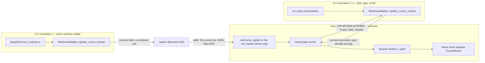
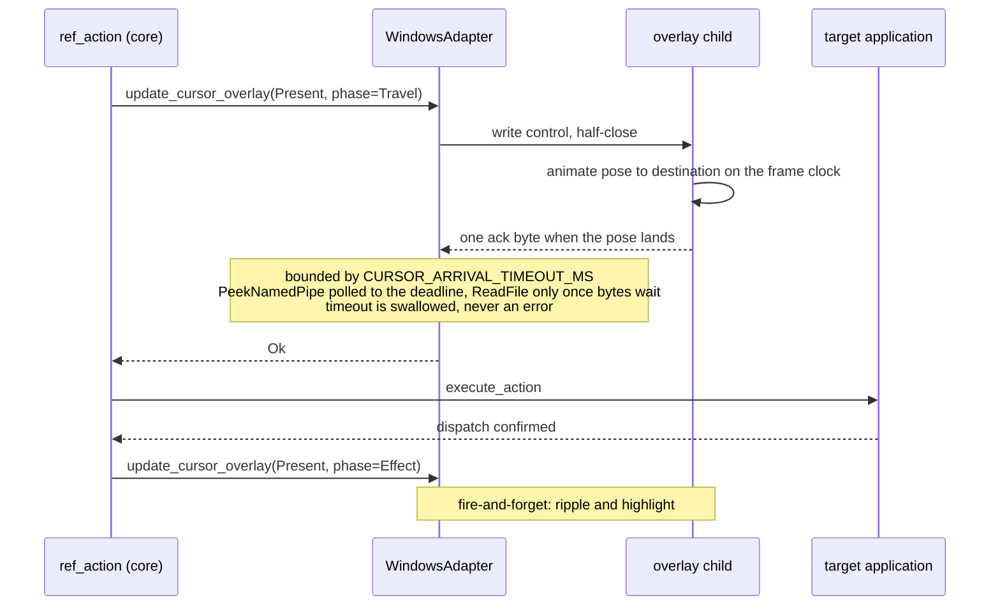
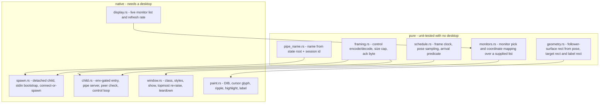

# Cursor Overlay (Sub-phase 2.16) - Plan

## Goal Capsule

- **Objective.** Close Phase 2. Make `cursor-overlay` render on Windows so the command's answer is true rather than merely honest, discharge the nine defects and four probe rows §2.15 handed forward, settle the one remaining cross-platform contract question, and leave `feat/windows-adapter` in a state whose only remaining step is the promotion.
- **Authority hierarchy.** `docs/phases.md` §2.16 settles scope and exit criteria; this plan settles how. Planning re-measured the renderer's mechanism rather than assuming it: `probes/windows/29-cursor-overlay.ps1` and ledger rows **A29-1 … A29-8** were taken before this document was written. **Not every mechanism decision rests on one, and the ones that do not are named rather than implied:** the probe measured focus, paint cost, z-order, click-through, transport and the display reads, but it never staged an impersonation, never made a GDI raster or text call into a layered surface, and never spawned a detached child. KTD4, KTD13, KTD16, KTD19 and KTD22 therefore rest on reasoning and on the macOS implementation, and each says so where it stands. Planning also re-verified all nine inherited defects against the branch — **all nine are still present at `de90dc0b`**, none has drifted, and each unit below names the exact site.
- **There are no open questions in this plan.** §2.16 leaves exactly one contract undecided — what `get --property text` means — and KTD9 decides it. Every other fork the scope names is a numbered decision below with its evidence and its rejected alternative.
- **Stop conditions.** Stop and ask if a reproduction contradicts a measurement recorded here; if the renderer cannot satisfy arrival-before-dispatch inside `CURSOR_ARRIVAL_TIMEOUT_MS` on a real target after U14 lands; or if the dogfood surfaces a defect whose fix would change a contract this plan settled. Do **not** stop for the promotion — it is sequenced, not executed (KTD3).
- **Execution profile.** The ten defect-and-contract units land first, each its own commit with its own invert-verified test, then the renderer in five units, then teardown, docs, e2e and the dogfood. A reviewer can walk the PR commit by commit and reach the renderer having already banked every low-risk fix.
- **Tail ownership.** This sub-phase owns the overlay, the inherited defects, the `text` contract, the dogfood and the promotion **checklist**. It does not own the promotion **merge**.

---

## Product Contract

### Summary

Phase 2 leaves the cursor overlay in a state no other capability is left in. It renders on macOS and does nothing on Windows. §2.15 shipped the honesty half — the adapter default now refuses and `cursor-overlay enable` reports the adapter's answer as `data.rendered` — so today the command tells the truth about drawing nothing. This sub-phase makes it draw.

Riding with it are the findings §2.15's full-branch review could not fix inside its own gate: a clipboard worker that outlives its deadline while holding the Win32 clipboard open, two predicates that disagree about whether a menu is open, two places where a read fault is indistinguishable from a genuine absence, an action advertised on a control that will refuse it, a timeout that discards what it already delivered, a key synthesis that ignores the layout, an inventory that throws away what it collected, five e2e legs that cannot fail, and one generally-available command whose default property is a byte-identical copy of another.

The through-line is not "overlay plus miscellany". Seven of the ten defect units are the same defect class this branch has been correcting all phase: **a check that cannot distinguish success from failure** (U2, U3, U4, U5, U6, U8 and U10). An eighth, U7, is that class one level out - its defect is a discarded byte, but the test guarding it passes on every layout and so cannot see the discard. The repository already carries four of these shapes as named learnings. The overlay is designed against that same standard — its "did it draw" oracle is a screen pixel, not the command's own return.

### Problem Frame

**The overlay is the last capability that is platform-conditional by accident rather than by measurement.** Everything else Windows does not do, it refuses. `cursor-overlay enable` on Windows returns `ok: true` with `rendered: false` — honest, and useless to an operator who enabled it to watch the agent work.

**The nine findings are cheap to fix and expensive to leave.** Each is small — most are under thirty lines — but each is a live wrong answer in shipped code, and three of them (the clipboard worker, the SET_VALUE advertisement, the discarded chain steps) mislead a caller into a retry that cannot work. Leaving them makes the promotion to `main` a promotion of known defects.

**One contract question is genuinely undecided and a reviewer found it by reading.** `get --property text` and `--property value` are byte-identical reads. `text` is the *default* property, so it is the first thing a caller reaches for, and on a button — a control with a label and no value — it answers empty. No dogfood and no stranger run ever hit it. §2.16 assigns the decision here and requires the macOS delta stated whichever way it lands.

**The renderer's mechanism was unknown and is now measured.** Whether a layered window can satisfy arrival-before-dispatch without stealing focus was the question §2.16 said to measure rather than assume. It is measured, in both directions, and two of the eight rows changed the design rather than confirming it (A29-7, A29-8).

### Requirements

| ID | Requirement |
| --- | --- |
| R1 | Every one of the nine inherited findings is fixed here, and each fix carries a named test that fails when the fix is reverted. |
| R2 | Within one invocation, a clipboard operation requested while a previous read's worker is still parked in a Win32 call is refused rather than allowed to contend, and the refusal says so in the envelope. The guard is process-scoped by construction and the plan says so: an abandoned worker dies with its process and releases the clipboard, so a retry from a fresh invocation neither needs the guard nor is affected by it. |
| R3 | `snapshot --surface menu` and `wait --event surface-appeared --surface menu` answer the same predicate, or the doc comment claiming they must is deleted and the divergence documented. |
| R4 | A read fault is structurally distinguishable from a genuine absence in `first_native_hwnd` and in `list_displays_live`; neither returns a success value that means "nothing here" when the truth is "the read failed". |
| R5 | `SET_VALUE` is not advertised on a range control whose provider reports it read-only, and an unreadable read-only flag does not fail open. |
| R6 | A chain whose budget expires after a rung already delivered reports the disposition those steps imply, not `unknown`. |
| R7 | A character key the active keyboard layout requires Shift to produce is synthesized with Shift. |
| R8 | `list-surfaces` reports the surfaces it did collect for a process when one of that process's windows is unresponsive. |
| R9 | Each of the five e2e legs fails when the property its name claims is violated, and the fixture's invoke provider marshals its mutation to the UI thread. |
| R10 | `get --property text` returns the text a human reads on the control: the value where the role's value is the content, the accessible name otherwise, falling back across when the preferred one is empty. |
| R11 | `cursor-overlay enable` on Windows draws the overlay, and `data.rendered` reports `true` only when the renderer confirmed it created and showed its window. |
| R12 | The overlay's cursor reaches its destination before the action dispatches, acknowledged by the renderer within `CURSOR_ARRIVAL_TIMEOUT_MS`, and a renderer that does not answer never fails the action. |
| R13 | The overlay never takes the foreground - at window creation, show, paint, move, and teardown. All five moments are observed, not four. |
| R14 | The overlay never intercepts input intended for the application beneath it. |
| R15 | `cursor-overlay disable` and `session end` leave no residual window, timer or thread, verified by observation independent of the disable call's own return. |
| R16 | The Windows overlay draws the same visual vocabulary as macOS: the cursor glyph in the session's style, the click ripple, the target-element highlight held for its documented duration, and the label bubble placed by core's own layout. |
| R17 | The four probe rows carrying `closure: 2.16` are each closed by measurement or explicitly ratified as out of reach, with the reason recorded. |
| R18 | The per-platform overlay contract — including every place Windows behaves differently from macOS — is stated in the Windows skill and the README. |
| R19 | The dogfood is run as a stranger against the shipped skill and the built binary, and every finding takes exactly one of *fixed here*, *owned elsewhere*, or *accepted*. |
| R20 | The Phase 2 promotion has a written, ordered checklist that a later session can execute without reading this plan. |
| R21 | The sub-phase states its own latency delta - an overlaid semantic action against an unoverlaid one - measured by the probe corpus methodology, satisfying the repository's performance-baseline gate on the vehicle Windows can actually run. |
| R22 | A renderer whose session ends without a `disable` - a crashed agent, a `session gc`, an operator who simply stops - tears itself down rather than leaving a topmost animated overlay with no in-product way to remove it. |

### Key Decisions

- **The overlay draws over the Windows shell's own topmost chrome, and this is now settled by measurement rather than assumed either way.** §2.16 asked the question about the §2.14 KTD1 surfaces; A29-3 answers it. A cursor travelling to a taskbar-adjacent destination is not clipped. *(Governs R16.)*
- **The Windows renderer does not read the OS animation preference.** *(session-settled: user-approved — chosen over collapsing motion the way macOS collapses it under reduce-motion: the one signal Windows offers reports motion suppressed on a stock Windows Server host nobody configured for accessibility, measured on a console session, so honouring it would disable the feature by default on an entire class of host.)* **The cost of the choice is stated plainly rather than only the cost of the alternative: a user who has turned Windows' animation setting off for genuine motion-sensitivity reasons still sees the overlay's full animation, because no Windows signal separates that user from the Server performance default this was measured against.** That sentence ships in the Windows skill and the README, not only here. *(Governs R16, R18.)*
- **`get --property text` becomes role-conditional.** *(session-settled: user-approved — chosen over name-preferring, name-then-value, and retiring `text` as an alias for `value`: the first two flip a labelled textfield's default property from its content to its label, and the third leaves the default property empty on every button.)* *(Governs R10.)*

### Scope Boundaries

- The overlay renders for **headless** semantic actions only. `crates/core/src/cursor_overlay/submit.rs` returns early when `context.is_headed()`, and that gating is core's, unchanged here.
- The per-action path stays fail-soft. An adapter that cannot draw never fails an action; `submit` logs and returns.
- `cursor-overlay disable` carries no `rendered` field, because a disable has nothing to render. §2.15 settled that and this sub-phase does not revisit it.
- No second honesty field is invented. `data.rendered` is the channel.
- `CursorOverlayControl` has five variants, not three. `src/dispatch/mod.rs` sends `Hide` before and `Show` after every mutating command in a *headed* overlay-enabled session, so the renderer handles both even though it draws for headless actions only. The control loop matches the enum exhaustively so a variant cannot be silently unhandled.

### Ratified Out of Scope — settled here, not postponed

- **Authoring a security descriptor for the control pipe.** `crates/windows/src/system/private_file/mod.rs` records that descriptor authoring and DACL validation are deliberately absent from this crate, because the deleted v0.5.0 layer sank on `AceSize` handling, and a test pins the ACL/ACE symbol family out of that module. The pipe is protected by authenticating its peer instead (KTD13), which uses only the token API family the crate already calls.
- **The Medium-to-elevated UAC boundary (A27-4).** Measured shut: this rig manufactures integrity levels, not UAC elevations, and the probe records the negative result with its mechanism. Ratified as out of reach for Phase 2 (U11).

### Deferred to Follow-Up Work

- **The promotion merge itself.** The checklist lands here (U20); the merge is a separate release-noted `feat!` after this PR merges.
- **Live observation of the overlay on a multi-monitor, mixed-DPI desktop.** A29-6 records this host as one monitor at one scale, so there is no arrangement here to observe against, and `CLAUDE.md` calls work blocked on infrastructure that does not exist a deferral rather than a ratification - which means it needs a named receiver, not a shrug. **The receiver is the Phase 2 promotion checklist (U20)**, whose live e2e pass already gates the merge to `main`. What lands here is the half that is verifiable without the hardware: monitor selection and coordinate mapping are pure functions over a supplied monitor list, unit-tested against a scaled two-monitor arrangement this desktop cannot present (U15). The seam between that logic and Win32's own reporting is what the promotion observes.

---

## Planning Contract

### Key Technical Decisions

**KTD1 — One sub-branch, one plan, one PR into `feat/windows-adapter`.** *(session-settled: user-directed — chosen over splitting into 2.16a and 2.16b: the owner directed a single sub-branch and a single PR.)* This PR will exceed the repository's ~2,000-LOC sub-phase cap, materially: twenty units, ten of them defect fixes and five of them a new renderer. That is an owner decision recorded here, not a quiet deviation. The mitigation is commit topology — every unit is its own commit with its own test, so review is incremental even though the PR is not.

**KTD2 — The ten defect-and-contract units are U1…U10 and the renderer follows.** *(session-settled: user-approved — chosen over renderer-first: the low-risk fixes must not be hostage to the renderer if review stalls.)*

**KTD3 — The Phase 2 promotion is sequenced after this PR merges, never inside it.** *(session-settled: user-approved — chosen over promoting within this PR: `CLAUDE.md` forbids PR'ing a sub-phase into `main`, and the promotion is gated on full-branch review, live e2e and a perf baseline.)*

**KTD4 — The Windows overlay is a detached child of the same binary, reached over a named pipe.** *(session-settled: user-approved — chosen over an in-process render thread: the CLI is stateless per invocation, so the renderer must outlive the process that started it.)* The child is guarded exactly as macOS guards its own — it spawns only when `std::env::current_exe()`'s file stem is `agent-desktop`, so an FFI host, whose `current_exe()` is the host process, never forks one. The first control reaches the child over its inherited stdin, and later controls over the pipe, matching the macOS bootstrap so a connect race against a pipe that does not exist yet cannot occur.
  **The spawn is `std::process::Command` with `CommandExt::creation_flags`, not this crate's existing `CreateProcessW` path.** `system/launch.rs::create_process` exists to start *user applications* with a caller-supplied environment block and working directory, and has no stdin plumbing; the bootstrap needs a piped stdin, which `Command` gives without hand-built inheritable handles. Reusing `launch.rs` would mean adding pipe creation and handle inheritance to the app-launch path for a caller that is not launching an app.
  **The stdin bootstrap starts the child; it never answers `rendered`.** stdin is one-way and the child's stdout and stderr are null, so the first Enable has no return path down the channel that carried it. The child therefore creates its **pipe first** — claiming the singleton, and withdrawing before anything is drawn if it loses that race — then creates and shows its window, and only then acknowledges an Enable. **A child whose `CreateWindowEx` or `ShowWindow` fails exits immediately, closing its pipe handle before acknowledging anything** — otherwise it would sit holding the singleton name forever while never drawing, and every later Enable would connect, classify present-but-unreachable, decline to spawn a replacement, burn the full budget and answer `rendered: false` for the rest of the session. The window-first draft had that recovery by accident; pipe-first has to state it. A parent already connected sees `ERROR_BROKEN_PIPE` and answers `rendered: false`, which is the honest outcome for that invocation, and the next one finds the name free. The parent, having written the bootstrap, polls `CreateFileW` on the pipe name within `CURSOR_ARRIVAL_TIMEOUT_MS`, writes its Enable over the connection like any other client, and reads the acknowledgement. **The acknowledgement byte is the readiness signal, not connectability.** An earlier draft of this decision put the window first so that connectability itself would prove the window existed; that ordering made a losing child create and show a topmost window before discovering it had lost, which contradicts KTD12's guarantee that a duplicate never draws. Binding the acknowledgement to the Enable control rather than to connection order also removes the case where a concurrent invocation connects first and swallows the byte the spawner is waiting for.
  **Only an `Enable` or a `Present` control may bring a renderer into existence.** `Enable` is its own variant and is what `cursor-overlay enable` and `session start --cursor` send, so a guard written against `Present` alone would leave R11's central command answering `rendered: false` forever. After a failed connect, a `Disable`, `Hide` or `Show` returns without spawning, mirroring `crates/macos/src/system/cursor_overlay/spawn.rs`, which refuses on `is_disable() || (is_transient() && !is_travel())` — a predicate that lets `Enable` through. Without that refusal `cursor-overlay disable` would spawn a renderer in order to tell it to stop, and - worse - `src/dispatch/mod.rs` sends `Hide` before and `Show` after **every** mutating command in a headed overlay-enabled session, so a headed session would fork a detached renderer per command.
  **A failed connect is classified before it is acted on.** `ERROR_FILE_NOT_FOUND` means no renderer and spawns. `ERROR_PIPE_BUSY` means a live renderer that has not yet re-armed `ConnectNamedPipe`, so the caller waits on `WaitNamedPipeW` within the control's budget and retries; treating it as absence would fork a duplicate, drop the control it carried, and then answer `rendered: false` while an overlay is drawing. **Every other failure is present-but-unreachable**: never spawn, answer `rendered: false`, and carry the Win32 code in `platform_detail`. `ERROR_ACCESS_DENIED` is the concrete case this design creates for itself — a foreign same-name pipe whose descriptor excludes us surfaces as a connect failure, not as the SID mismatch KTD13 anticipates — and without a default arm an implementer picks one, both choices being defects.
  **One environmental claim here is unmeasured and is measured before it is documented.** A parent inside a job object carrying `JOB_OBJECT_LIMIT_KILL_ON_JOB_CLOSE` - which CI runners and some agent harnesses use - takes a "detached" child down with it, so "the child outlives every CLI invocation" holds only outside such a job. U12 measures this on the dogfood host and the shipped docs state whichever way it lands.

**KTD5 — The window style set is `WS_EX_LAYERED`, `WS_EX_TRANSPARENT`, `WS_EX_TOOLWINDOW`, `WS_EX_NOACTIVATE` and `WS_EX_TOPMOST`, shown with `SW_SHOWNOACTIVATE`, every `SetWindowPos` carrying `SWP_NOACTIVATE`, and the child spawned `DETACHED_PROCESS | CREATE_NO_WINDOW`.** *(session-settled: user-approved — chosen over dropping `WS_EX_NOACTIVATE`.)* **Evidence A29-1**, measured in both directions: with the flag the overlay took the foreground at none of create, show, paint and move; without it, at three of the four. The console flags matter for the same reason — a child that gets a console window takes the foreground with it. `CREATE_NO_WINDOW` is documented as ignored when combined with `DETACHED_PROCESS`, so `DETACHED_PROCESS` is the flag doing the work and the second is belt-and-braces, not a second mechanism.

**KTD6 — Painting is `UpdateLayeredWindow` with a premultiplied 32bpp top-down DIB, on a small surface that follows the pose.** *(session-settled: user-approved — chosen over `SetLayeredWindowAttributes`, which is constant-alpha and colour-key only and cannot draw an anti-aliased cursor, and over one virtual-screen-spanning window.)* **Evidence A29-2**: cost tracks pixel count almost linearly — 19.1× the pixels for 19.5× the time — so a 256×256 follower stays under 0.1 ms while a three-monitor 4K virtual screen would cost roughly 11 ms per frame at the same rate.

**KTD7 — Refresh rate comes from `GetDeviceCaps(GetDC(NULL), VREFRESH)`.** *(session-settled: user-approved — chosen over `EnumDisplaySettings(NULL, ENUM_CURRENT_SETTINGS)`.)* **Evidence A29-7**: the obvious call fails on this host and leaves its frequency at 0, which a renderer would take as a silent zero timestep. `GetDeviceCaps` returns 64 with no device name needed. The frame clock is a floor and a cap around that reading, never a bare division by it.

**KTD8 — "The overlay is on screen" is proved by a screen pixel, never by hit-test and never by the command's own return.** *(session-settled: user-approved.)* **Evidence A29-4**: `WS_EX_TRANSPARENT` — the same flag that makes the overlay safe — makes it invisible to `WindowFromPoint`, so hit-testing cannot be the oracle. **A29-3** shows the pixel oracle working in both directions, including that teardown restores the pixel exactly.

**KTD9 — `get --property text` returns the value for roles whose value *is* the content a human reads, and the accessible name otherwise, falling back across when the preferred one is empty.** *(session-settled: user-approved — chosen over name-preferring, name-then-value, and retiring `text` as an alias for `value`.)* The settled shape stands. **What does not survive contact with the code is the instruction to reuse `is_mutable_value_role`, and that conflict is reported here rather than worked around.** That predicate (`crates/core/src/roles.rs:88-100`) answers a *volatility* question — its own doc comment says "roles whose `value` changes during normal interaction and must not be treated as stable ref identity" — and its true-branch includes `checkbox`, `radiobutton`, `switch`, `slider` and `incrementor`. Reusing it would make a checked checkbox named "Show hidden files" answer `1` for the default property, and a slider named "Volume" answer a number: the exact disappointment this change exists to remove, relocated from buttons to a role class at least as common. macOS stringifies a numeric `AXValue` into the value slot, so the cross-fallback does not rescue either case. **The partition is therefore defined for `text` on its own terms:** `textfield`, `combobox`, `listbox`, `datefield` and `timefield` prefer the value, because their value is the content; every other role prefers the accessible name and falls back to the value. It is written as an **exhaustive `match` over the `Role` enum**, not a list — so a role added later fails to compile until someone decides which side it belongs on. That is the mitigation for the second-list drift `docs/solutions/best-practices/a-test-that-cannot-fail-is-not-coverage.md` records, and it is strictly stronger than reusing a predicate that answers a different question.
  **The name comes from the stored `entry.identity.name`, not from a live read.** There is no `get_live_name` on the adapter; the only live name is `get_live_element(...).identity.name`, a tri-state `LocatorField`. `--property title` already answers from the stored name, so `text` staying symmetric with it is the smaller change and keeps one meaning for "the accessible name" across the command.
  **macOS delta: none, and that is the problem to disclose rather than the reassurance it sounds like.** `get` is a core command with no platform branch, so both adapters change identically — which makes this a **breaking change to the default property of a generally-available command**. Under `CLAUDE.md`'s pre-1.0 policy a `BREAKING CHANGE` cuts a minor, so U9's commit carries the footer. release-please runs on `main`, so the footer surfaces in the **promotion's** release notes; that is precisely why it has to be on the commit and not only in prose.

**KTD10 — No `Co-Authored-By`, AI-attribution or "Generated with" trailers on any commit or PR body.** *(session-settled: user-directed — chosen over the session's attribution reminder: `CLAUDE.md` states this as an override.)*

**KTD11 — The renderer does not consult the OS animation preference; the session opt-in is the preference.** The overlay is not ambient shell chrome — it is drawn only because a caller enabled it on a session, and `CursorOverlayStyle` already carries per-session `ripple` and `highlight` knobs the operator can turn off. **Evidence A29-7 and A29-8**: `SPI_GETCLIENTAREAANIMATION` reports animations disabled on this host while `SPI_GETUIEFFECTS` reports effects enabled, and `SM_REMOTESESSION` is 0 — so the reading is a stock Windows Server best-performance default on a console session, not a remote-bandwidth artifact and not an accessibility choice, and no API separates the two. Rejected: honouring it unconditionally, which disables the feature by default on every Server host including the one this phase's own dogfood runs on; and gating it on session kind, which A29-8 disproved before it was built. The delta from macOS is stated in the Windows skill and the README (U17).

**KTD12 — The pipe is the singleton lock.** `CreateNamedPipeW` with `FILE_FLAG_FIRST_PIPE_INSTANCE` fails when an instance of the name already exists, which is exactly the race a separate lock would guard. Rejected: a named mutex mirroring macOS's `flock`, which adds a second object whose lifetime must then be reasoned about against the pipe's. A child that loses that race exits **before creating its window**, so a duplicate never draws — which is why the pipe is claimed first (KTD4). Its parent then retries the connect, sends its Enable, and reads the winning renderer's acknowledgement before answering `rendered`. This is the one place the design does not simply copy macOS, which re-sends under its `flock` before spawning; the pipe's own first-instance semantics do that work here, but only because the losing child is required to withdraw silently. **The re-send is kept, not dropped with the lock:** the control the losing parent wrote to its child's stdin dies with that child, so the parent re-sends its own control over the winner's pipe and reads the acknowledgement for *that* write — never a byte the winner raised for somebody else's Enable, which would leave the session's style unapplied while `rendered` reported success.

**KTD13 — The pipe authenticates its peer in both directions, instead of carrying a descriptor.** Rejected: authoring an owner-only DACL — `crates/windows/src/system/private_file/mod.rs` records descriptor authoring as deliberately absent from this crate after the deleted v0.5.0 ACL layer, and a test pins the ACL/ACE symbol family out of that module. Peer authentication uses only the token APIs the crate already calls; the SID comparison reuses `owner.rs`'s `SidBuffer`, promoted from `pub(super)` to `pub(crate)` so it is shared rather than duplicated. `PIPE_REJECT_REMOTE_CLIENTS` is set.
  **Server side, and the mechanism is not the obvious one.** `ImpersonateNamedPipeClient` adopts "the security context of the last message read from the pipe" — with nothing read there is no context and the call fails, so an impersonate-before-read check would reject every connection including legitimate ones. The server instead resolves the peer with `GetNamedPipeClientProcessId`, opens that process with `PROCESS_QUERY_LIMITED_INFORMATION`, reads its `TokenUser` SID and compares. That keeps the no-payload-read property the impersonation route only appeared to offer.
  **Client side, which the first draft of this decision omitted entirely.** Authentication ran in one direction, so a connect success was treated as proof that our renderer was on the other end. It is not: the pipe name is a deterministic function of the state root and session id, so a local process that wins the creation race receives every control the session sends — coordinates and label text — and can return the one ack byte, which under KTD15 makes `data.rendered` report `true` while nothing is drawn. That is a **new lie in the field §2.15 added for honesty**, which is the reason this is fixed here rather than noted. After connecting, the client resolves the server with `GetNamedPipeServerProcessId` and compares its `TokenUser` SID to its own by the same helper; on mismatch it closes the handle, sends nothing, and answers `rendered: false`. SIDs are compared, never the server image against the client's own `current_exe()`, which an FFI host would fail legitimately. The server's image **file stem** is checked against `agent-desktop` — the same stem the spawn guard already tests — read through `QueryFullProcessImageNameW` on the handle the SID check already holds.
  **What this does not close is stated rather than implied.** Every agent host here is single-user, so a same-user process running the real binary and winning the pipe name passes both checks. It would receive coordinates and label text and could return the ack byte. That residual is why the "Ratified Out of Scope" entry on the security descriptor is a decision taken *against a known gap*, not against a closed hole, and the Windows reference says so: `data.rendered` is trustworthy to the extent that no same-user process is racing the pipe name.
  **This decision cites no A29 row and says so.** The probe staged no impersonation and no second-principal peer; the mechanism rests on the documented API contract and on the crate's existing token code, not on a measurement taken here.

**KTD14 — The acknowledgement read never parks a thread in a blocking OS call.** This is the same defect the clipboard unit fixes in U2 and the same shape `docs/solutions/logic-errors/a-deadline-cannot-interrupt-a-blocking-os-call.md` records; the renderer does not reintroduce it. **The mechanism that shipped is not the one this decision first named, and the property is what mattered.** The plan said `FILE_FLAG_OVERLAPPED` with an overlapped `ReadFile`, a bounded `WaitForSingleObject` and `CancelIoEx` on expiry. What shipped polls `PeekNamedPipe` to the deadline and calls `ReadFile` only once bytes are already waiting, so no call is ever entered that could outlast the caller's budget — the property the overlapped route was chosen for, reached with no `OVERLAPPED` lifetime to get wrong and no cancellation semantics to get subtly wrong. `crates/windows/src/system/cursor_overlay/transport.rs` states the same reasoning at its head. The consequence for KTD18 is recorded there: the overlapped route's feature module is not needed and is not enabled.

**KTD15 — `data.rendered` is `true` only on an Enable acknowledged by the child after `CreateWindowEx` and `ShowWindow` both succeeded.** A spawn that starts a process which then fails to create its window must report `false`, or §2.15's honesty field lies in a new way. This follows `docs/solutions/logic-errors/emit-state-on-a-positive-claim-never-on-a-default.md`. **Where this forces a divergence from macOS, it takes it:** macOS's `spawn::update` returns `Ok(())` when its guard refuses to spawn, and `src/dispatch/cursor_overlay.rs` turns `Ok` into `rendered: true` — so adopting that return verbatim would report a rendered overlay for a spawn that never happened. A guard-refused spawn therefore returns `Err` on Windows. The refusals that are *correct* outcomes rather than failures — a `Disable`, `Hide` or `Show` with no renderer running (KTD4) — still return `Ok(())`, and neither carries a `rendered` field, so no positive claim is made from a default on either path.

**KTD16 — The cursor glyph, ripple and highlight are rasterized per-pixel into the premultiplied DIB; GDI is used only for the label bubble's text, whose inset rectangle is alpha-corrected afterwards.** **The alpha problem is not confined to text, which the first draft of this decision got wrong.** Every GDI raster primitive — `Ellipse`, `Polygon`, `FillRect`, `DrawTextW` alike — writes RGB with alpha 0 into a 32bpp DIB, so a glyph or ripple drawn through GDI is invisible under `ULW_ALPHA`. Forcing alpha across a rectangle rescues an opaque bubble; it cannot rescue an anti-aliased edge or a soft ripple ring, because those need per-pixel coverage, which is the thing being destroyed. So the glyph, the ripple and the highlight outline are composited directly into the premultiplied buffer with computed coverage, and GDI draws only the bubble's text on an already-opaque ground. Rejected: DirectWrite or GDI+, either of which adds a rendering dependency for one text run; and `SetLayeredWindowAttributes`, whose constant-alpha/colour-key model cannot express per-pixel coverage at all — a rejection that only holds *because* the DIB carries real per-pixel alpha, which is what this decision is about producing. **The bubble body is composited per-pixel like the glyph and the ripple**, because the ported constants give it a 10-pixel corner radius and a 1.5-pixel border: forcing alpha across its bounding rectangle would paint opaque square corners and the Windows bubble would read visibly unlike the reference R16 measures it against. The alpha correction applies only to the **text rectangle inset within** that already-opaque body. `DrawTextW` is clipped to exactly that inset rectangle with `DT_END_ELLIPSIS`, so no glyph can land outside the corrected region and vanish; a label near core's twelve-word cap truncates visibly instead of overflowing. The font is created with `ANTIALIASED_QUALITY`, not ClearType, because subpixel anti-aliasing composited through `UpdateLayeredWindow` against transparency fringes with colour. The crate has **no** text-drawing primitive today — `DrawText`, `TextOut`, GDI+ and DirectWrite appear nowhere in `crates/windows/src/` — so this is the first. **This decision cites no A29 row and says so:** the probe filled its DIB with a memory copy and made no GDI raster or text call, so the alpha behaviour above is read from the documented API contract, and U13 verifies it by pixel on first contact rather than assuming it.

**KTD17 — Frame pacing is time-parameterized, not frame-counted.** Core's `CursorMotion::pose(elapsed_ms)` is a function of elapsed time, so the render loop samples the clock rather than assuming its own cadence. A dropped frame changes smoothness, never the arrival instant, and the arrival ack fires on reaching the destination pose rather than on a frame count.

**KTD18 — Two `windows-sys` feature modules are added: `Win32_System_Pipes` and `Win32_System_IO`.** Everything else the renderer needs is already enabled — `Win32_Graphics_Gdi`, `Win32_UI_WindowsAndMessaging`, `Win32_UI_HiDpi`, `Win32_Foundation`, `Win32_Security`, `Win32_System_Threading`, `Win32_System_LibraryLoader`, `Win32_Storage_FileSystem`. `Win32_System_Pipes` carries `CreateNamedPipeW`, `ConnectNamedPipe`, `WaitNamedPipeW`, `PIPE_REJECT_REMOTE_CLIENTS` and both `GetNamedPipeClientProcessId` and `GetNamedPipeServerProcessId`, so KTD13's two-directional check needs no third module.

**`Win32_System_IO` is required, but not for the reason this decision first gave.** It was listed to carry `CancelIoEx`, `OVERLAPPED` and `GetOverlappedResult` for KTD14's overlapped acknowledgement read — a mechanism that did not ship. Removing it on that basis breaks the build, which is how this was established rather than assumed: `ReadFile`, `WriteFile` and `ConnectNamedPipe` are themselves gated behind it, because their declarations take an `OVERLAPPED` pointer whether or not a caller passes one. So the feature stays, and the entry in `docs/phases.md`'s New Dependencies table stays with it; only the stated reason was wrong.

**The child is spawned with a raw `CreateProcessW`, not `std::process::Command`.** This decision named `Command` with `CommandExt::creation_flags`, and that is wrong for a detached child: `Command` passes `bInheritHandles = TRUE` whenever it configures stdio and does not restrict what is inherited, so the renderer inherited its caller's stdout and held that pipe open for its whole life — every shell reading the command's output blocked until the overlay was torn down. Measured, not reasoned. `CreateProcessW` with `bInheritHandles = 0` is what ships, matching `launch.rs` next door, and it needs no feature either.

**KTD19 — The pipe name and the child's env marker both carry a protocol generation.** macOS hashes `PROTOCOL_VERSION` into its socket path and retires the previous generation's endpoint on spawn; the first draft of the pipe name hashed only the state root and session id, and claimed parity it did not have. Without the generation a renderer left running by an earlier build keeps serving a rebuilt binary's controls — which happens on any rebuild during a live session, including this branch's own e2e runs. The child rejects a marker whose value is not the current generation, so a stale child is subtly wrong no longer.
  **Unreachable is not good enough on its own, and saying so is the point.** A renderer left by the previous build keeps drawing while the new pipe name routes every control past it, so `cursor-overlay disable` cannot address it and KTD22's manifest poll does not fire because the session has not ended — the same "nothing in the product can remove it" state KTD22 exists to close, reached by another door. **The generation list is therefore a ledger, not a single constant**: `PROTOCOL_GENERATIONS` holds every generation the protocol has ever had, oldest first, and `PROTOCOL_GENERATION` is its last entry. Bumping is an append, and the append hands the displaced generation to the retirement sweep in the same edit, so a maintainer cannot bump the generation and forget the renderer still drawing under the old one. Today the ledger has one entry, so the retired set is empty and the sweep is a measured no-op; that is the correct state for a protocol that has never changed and it is stated in the source rather than left to be discovered.
  The sweep derives each retired generation's pipe name — a pure function of root, session and generation — and sends it a `Disable` on a 300 ms budget. It runs on the **enable** path, ahead of the reach that decides `data.rendered`, rather than only before a spawn: a sweep confined to the spawn path would miss precisely the case that motivates it, where the current generation is already serving and the stale one is drawing beside it.
  **A `Disable` alone would not be enough, which is why the sweep can also end the process.** A stale generation exists exactly when the wire format changed, so the renderer may be unable to decode the current `Disable` at all — it would read an illegible payload, disconnect, and keep drawing. When nothing usable comes back inside the budget, the sweep resolves the pipe's server with `GetNamedPipeServerProcessId`, refuses its own pid, opens that process once with `PROCESS_QUERY_LIMITED_INFORMATION | PROCESS_TERMINATE`, and terminates it only after confirming on **that same handle** that it runs as this user and runs this tool's image. One handle rather than a check-then-reopen, because reopening between the check and the kill is a pid-reuse window. The OS destroys the layered window with the process.
  **Rejected: enumerating command lines**, which this decision originally prescribed. Reading another process's argv means walking its PEB through `NtQueryInformationProcess` and `ReadProcessMemory`, a COM query to WMI, or shelling out — hundreds of milliseconds and a great deal of unsafe code, on a path that runs before every overlay is enabled, to discover something the ledger already knows. It also would not have helped where it matters: whatever finds the stale renderer, a `Disable` it cannot parse is still a `Disable` it cannot parse. The child's argv keeps carrying its generation, but for the e2e reaper, which has no other way to recognise the process. macOS does the narrower version of the sweep — `retire_legacy` addresses only the unversioned endpoint — so this remains a deliberate extension, not a copy.

**KTD20 — The overlay's geometry and typography are ported from the macOS bridge as named constants, not invented.** R16 claims the same visual vocabulary as macOS, and a claim like that needs numbers to fail against. `crates/macos/src/system/cursor_overlay_bridge.m` and `cursor_overlay_chrome_bridge.m` hardcode the cursor glyph box and its tip anchor, the bubble's size, corner radius, border width and font size, and the ripple's diameter; core shares the *motion*, the style and the label placement, but none of those dimensions. They are carried across as Windows constants scaled by `CursorOverlayStyle::size`, and U13 asserts the rendered surface's proportions against them. macOS also gives every element a drop shadow, for which GDI has no free equivalent: the Windows renderer composites an equivalent soft edge in the same per-pixel pass as the glyph, because dropping it silently would make the overlay read flatter than the reference it is measured against.

**KTD21 — The target highlight animates in and out; it does not blink on and off.** macOS plays an opacity keyframe and a scale "pop" across `CURSOR_HIGHLIGHT_HOLD_MS`. Saying only that the highlight is "held" for that duration would yield an instant-on, instant-off box — a visibly more abrupt cue than the reference. `schedule.rs` therefore exposes a highlight progress sample alongside the ripple's, so the curve is pure and unit-testable, and `paint.rs` reads it. Rejected: a static outline, which is cheaper and wrong for the same reason a teleporting cursor would be.

**KTD22 — The child ends itself when its session does, without waiting to be told.** A session can end without a `Disable` — a crashed agent, a `session gc`, an operator who simply stops — and the child has no console, no taskbar entry and no Alt-Tab presence, so an abandoned renderer would be a topmost animated overlay with no in-product way to remove it. The child re-reads its session manifest on its idle tick — `CURSOR_IDLE_REST_MS / 4`, so 1,500 ms at that constant's 6,000 ms, a cadence chosen because it is also the display-topology re-probe cadence — and since two consecutive readings are required the reclaim bound is **two ticks — roughly three seconds**. Stating the number rather than the mechanism is the point: a reader who is told "one idle tick" plans against half the real latency, and a reader who is told only "bounded by `CURSOR_IDLE_REST_MS`" plans against four times it. It tears down when `ended_at` is set, when the manifest is gone, **or when the manifest's `cursor_overlay` config is disabled**, which reclaims a renderer that a `Present` racing a `Disable` brought back.
  **It does not use core's `read_manifest`, and the reason is this sub-phase's own through-line.** That function routes every non-`NotFound` error and every parse failure through `ignore_unreadable_manifest` into `Ok(None)` — a fault and a deleted session share one value. Polling it would tear a live overlay down on a transient file error, which is exactly the defect class R4 and U4 exist to remove, reintroduced by the mechanism added to close a different hole. The child instead reads the manifest path directly from the Windows crate, treats **only** `ErrorKind::NotFound` as gone, treats every other error and every parse failure as unknown-and-keep-drawing, and requires two consecutive gone-or-ended readings before it tears down. Core is untouched by this, so the Risks table's claim that U9 is the only core edit still holds.
  Rejected: a wall-clock lifetime, which would kill a healthy long session; and doing nothing, which leaves the only recovery path outside the product.

### Error and Disposition Mapping

| Situation | Code | Delivery | Retry |
| --- | --- | --- | --- |
| Clipboard operation requested **in the same invocation** while a prior worker is still outstanding | `APP_UNRESPONSIVE` | `not_delivered` | `unsafe` while this process holds an outstanding worker |
| Clipboard read whose own worker outlives the deadline | `TIMEOUT` | `not_delivered` | `unsafe` (unchanged in code, but now truthful because the next call refuses) |
| `snapshot --surface menu` where the menu is a Chromium DOM menu the surface cannot root | `WINDOW_NOT_FOUND` | n/a | `safe` after a fresh wait |
| `first_native_hwnd` climb faulted rather than reaching the root | not surfaced directly; the caller's own error keeps its code, and the fault no longer reads as "not foreground" | unchanged | unchanged |
| `EnumDisplayMonitors` enumeration failed | `INTERNAL` with the Win32 error in `platform_detail` | n/a | `unsafe` |
| Chain budget expiry after a rung delivered unverified | `TIMEOUT` | `delivered_unverified` | `unsafe` |
| `list-surfaces` where one window's pump probe failed | `ok` with the surfaces collected | n/a | n/a |
| Overlay child cannot create its window | command succeeds with `rendered: false` | n/a | n/a |
| Overlay travel ack does not arrive within `CURSOR_ARRIVAL_TIMEOUT_MS` | no error — the action proceeds | unchanged | unchanged |
| `cursor-overlay disable` where the child does not acknowledge within its budget | command succeeds with the adapter's error logged | n/a | n/a |

### High-Level Technical Design

**Process and transport.** Three processes are in play, and only one of them is long-lived.

**Arrival before dispatch.** The travel control is a blocking round trip with a hard ceiling, not a computed sleep. The overlay is allowed to be slow; it is not allowed to make the action slow.

**Module split, chosen against the 400-LOC cap before any code is written.** The left column is desktop-free and unit-tested on any host; the right column needs a window.

### Assumptions

- The overlay child inherits the CLI's per-monitor-v2 DPI awareness only if it establishes its own; it calls `dpi::ensure_per_monitor_v2()` before creating its window, because a fresh process does not inherit the parent's awareness context.
- `notepad.exe` remains available on the dogfood host as a foreground-holding target. A29's probe already depends on this and it held across four runs.
- The Windows live suite is load-sensitive (A28-6). Every verification gate below that reads it requires a quiesced desktop and treats a single failing run as unproven rather than as a regression.

---

## Implementation Units

### U1. Correct `docs/phases.md` §2.16 and write the settled contracts into it

**Goal.** The document a Linux planner reads next says what shipped, including the two contract answers this sub-phase produced.

**Requirements.** R10, R16, R18.

**Dependencies.** None.

**Files.** `docs/phases.md`.

**Approach.**
1. Replace §2.16's `~1.5k LOC` estimate with a figure that reflects twenty units including ten defect fixes, and state that the single-PR shape is an owner decision that exceeds the sub-phase cap (KTD1).
2. Write the `get --property text` answer into the document as settled, with the macOS delta stated (KTD9).
3. Answer the shell-chrome question §2.16 poses, citing A29-3: the overlay draws over the shell's topmost chrome and its teardown restores the pixel.
4. Record the animation-preference decision and its evidence (KTD11, A29-7, A29-8).
5. Update the New Dependencies feature table with `Win32_System_Pipes` and `Win32_System_IO`, since the table claims to match the shipped manifest (KTD18).
6. **Rewrite §2.16's Sequencing and Exit criteria so they stop claiming this PR performs the promotion.** They still read "the Phase 2 promotion itself — `feat/windows-adapter` merged to `main` as one release-noted `feat!`, which is what closes the phase", which contradicts KTD3 and makes this plan's own Definition of Done ("`docs/phases.md` and this plan agree") unmeetable while it stands. The replacement says this sub-phase delivers the promotion **checklist**, and the merge is a separate, later `feat!`.
7. Fold the two still-unchecked release boxes under §Release — the `ad_*` FFI entrypoint coverage and the Windows-support release notes — into that checklist, or close them here, so the Goal Capsule's "only remaining step" claim is true.
8. Add the corresponding hunk-index rows so `13-ledger-check.ps1` still passes.

**Patterns to follow.** §2.15's U1 corrected in place and cited what disproved each line; `CLAUDE.md` forbids annotating corrections as history.

**Test scenarios.**
- `powershell -File probes/windows/13-ledger-check.ps1` passes with the new hunk-index rows, and fails if a cited hunk is removed.
- `scripts/check-phases-ledger-citations.ps1` passes.

**Verification.** Both gates green; no `NOTE:` or "previously said" annotation anywhere in the diff.

---

### U2. A clipboard operation refuses while a previous worker still holds the clipboard

**Goal.** A timed-out clipboard read stops inviting a retry that will contend with its own abandoned worker.

**Requirements.** R1, R2.

**Dependencies.** None.

**Files.** `crates/windows/src/input/clipboard.rs`, a new `crates/windows/src/input/clipboard_worker_state.rs`, `crates/windows/src/input/clipboard_tests.rs`.

**Approach.**
1. `read_format_bytes_on_worker` (`clipboard.rs:204-233`) records an outstanding-worker marker before `thread::spawn` and the worker clears it when its closure returns — which is precisely what a parked worker never does.
2. Every clipboard entry point consults the marker first. When a worker is outstanding, refuse with `APP_UNRESPONSIVE`, `not_delivered`, and a message naming the cause and the fact that it clears when the previous read's owner answers.
3. The marker is process-scoped state in its own module, so the counting logic is testable without a clipboard.
4. `ensure_owner_responsive()` is unchanged; it rules out a hung pump, which is a different fact, and its doc comment is corrected to say so rather than to imply it covers this.
5. **The guard's reach is stated, not implied.** It is process-scoped, so it governs a second clipboard operation inside one invocation — a batch entry, or a command that reads twice. A retry from a *fresh* invocation is unaffected, and does not need to be: the abandoned worker died with the process that spawned it and Windows released the clipboard on exit. The envelope message and the shipped docs say this, because a refusal that implied a wider reach would be its own indistinguishable-check defect.

**Execution note.** A thread blocked in a Win32 call cannot be cancelled; do not attempt it. The deliverable is refusal and honesty, per `docs/solutions/logic-errors/a-deadline-cannot-interrupt-a-blocking-os-call.md`.

**Patterns to follow.** `crates/windows/src/input/release_state.rs` is the crate's existing armed-and-counted guard with a delivery report.

**Test scenarios.**
- With no worker outstanding, a clipboard read proceeds — the guard does not refuse the ordinary path.
- With a marker armed, `get_clipboard_content` returns `APP_UNRESPONSIVE` with `not_delivered` and a message naming the outstanding worker.
- A worker that completes clears the marker, and the next read proceeds.
- A worker that is abandoned leaves the marker armed, and the refusal persists.
- The existing `hung_delay_owner_returns_app_unresponsive` still passes — the pre-probe path is unchanged.
- Invert check: removing the marker arm makes the refusal test fail.

**Verification.** `cargo test -p agent-desktop-windows --lib input::clipboard` green; the refusal test fails when the arming line is deleted.

---

### U3. `snapshot --surface menu` and the menu wait answer the same predicate

**Goal.** An agent that waits for a menu and then asks for it stops getting `WINDOW_NOT_FOUND`.

**Requirements.** R1, R3.

**Dependencies.** None.

**Files.** `crates/windows/src/system/menu_state_locate.rs`, `crates/windows/src/system/menu_state.rs`, `crates/windows/src/tree/surfaces.rs`, `crates/windows/src/system/menu_state_tests.rs`.

**Approach.**
1. Extend `locate_menu` to resolve the Chromium DOM menu source that `menu_is_open` already consults through `chromium_dom_menu_reachable`, so a menu the detector reports open is a menu the surface can root.
2. Where a source genuinely cannot yield a rootable element — a classic Win32 system menu with no reachable UIA element under a tool window — the divergence is real and must not be claimed away: the doc comment at `menu_state_locate.rs:51-57` is rewritten to state exactly which source can report open without being locatable, and `snapshot --surface menu`'s `WINDOW_NOT_FOUND` message names that case so a caller can tell it from "no menu is open".
3. A test drives both predicates against the same staged state and asserts they agree on every source the fix covers, and asserts the documented, named disagreement for the one it does not.

**Execution note.** The false doc comment is the defect of record. Whichever way the code lands, the comment must become true — a fix that leaves it asserting more than the code delivers has not closed this finding.

**Test scenarios.**
- A source that reports the menu open through the Chromium path is locatable, so `locate_menu` returns `Some`.
- A source that reports open through the classic path with no reachable element yields the named, documented refusal — not a bare `WINDOW_NOT_FOUND`.
- The two predicates agree on a state where no menu is open.
- Invert check: reverting `locate_menu`'s new source makes the agreement test fail.

**Verification.** `cargo test -p agent-desktop-windows --lib menu_state` green; the agreement test fails with the new source removed.

---

### U4. A read fault stops reading as a genuine absence

**Goal.** Two places where a failure and an empty answer are the same value become structurally distinct.

**Requirements.** R1, R4.

**Dependencies.** None.

**Files.** `crates/windows/src/tree/hit_test_corroborate.rs`, `crates/windows/src/actions/physical_target.rs`, `crates/windows/src/system/display.rs`, `crates/windows/src/system/display_tests.rs`, plus the hit-test tests.

**Approach.**
1. `first_native_hwnd` returns `Result<Option<isize>, BudgetExpired>` in the shape `nearest_scroll_viewport` already established (`crates/windows/src/tree/walker_source.rs:19-27,67-94`): `Ok(None)` for a climb that reached the root, `Err(BudgetExpired)` for a faulted or budget-truncated climb. Both callers — `element_root_hwnd` and `physical_target.rs`'s `host_window_handle` — are updated so a fault no longer reads as "this element is not foreground".
2. `list_displays_live` reads `EnumDisplayMonitors`'s `BOOL` and returns `INTERNAL` with the Win32 error in `platform_detail` when enumeration failed, instead of `Ok(vec![])`. An empty success stays reserved for a genuinely display-less system.

**Patterns to follow.** `walker_source.rs`'s `BudgetExpired` marker and its doc comment explaining why the two causes share one shape distinct from `Ok(None)`. `docs/solutions/logic-errors/tri-state-evidence-collapses-under-negation.md` and `docs/solutions/logic-errors/a-zero-success-value-is-not-the-answer-you-asked-for.md` both record this class.

**Test scenarios.**
- A climb that reaches the root returns `Ok(None)`; a climb whose parent read faults returns `Err`.
- `host_window_handle`'s caller treats `Err` differently from `Ok(None)` — a fault does not silently refuse physical input as "not foreground".
- A failed `EnumDisplayMonitors` yields `INTERNAL` carrying the Win32 error, not an empty success.
- A genuine zero-monitor enumeration still yields an empty success.
- Invert check: collapsing either `Err` arm back into the absence arm makes its test fail.

**Verification.** `cargo test -p agent-desktop-windows --lib` green for `tree::hit_test` and `system::display`; both invert checks confirmed.

---

### U5. `SET_VALUE` is not advertised on a read-only range control

**Goal.** A ref is not allocated on an advertised action that fails at execution.

**Requirements.** R1, R5.

**Dependencies.** None.

**Files.** `crates/windows/src/tree/property_ids.rs`, `crates/windows/src/tree/actions.rs`, `crates/windows/src/tree/actions_tests.rs`.

**Approach.**
1. Add `RangeValueIsReadOnly` to `TreeProperty` in all four places the enum requires: the variant, the `WALK_SET` batch entry, the `as_str()` arm and the `uia_property()` mapping.
2. Pair it in `gate()` with `RangeValueAvailable`, mirroring the `ValueIsReadOnly` → `ValueAvailable` pairing.
3. Gate the `RangeValueAvailable` arm of `resolve_actions` on `gated_flag(RangeValueIsReadOnly) == Some(false)`, exactly as the adjacent `ValueAvailable` arm is gated.
4. Correct `property_ids.rs`'s doc comment, which currently names `RangeValueIsReadOnly` among the properties deliberately not requested.

**Execution note.** Use `gated_flag`, never `!is_true`. `docs/solutions/logic-errors/tri-state-evidence-collapses-under-negation.md` records that negating the boolean-flavoured predicate fails open on an unreadable flag, which is this exact arm's neighbour.

**Test scenarios.**
- A range control reporting `RangeValueIsReadOnly` false advertises `SET_VALUE`.
- A range control reporting it true does not.
- A range control whose read-only flag is unreadable does **not** advertise it — the unreadable case fails closed.
- The batch read requests the new property, so a provider that implements it is asked.
- Invert check: removing the gate makes the read-only test fail.

**Verification.** `cargo test -p agent-desktop-windows --lib tree::actions` green; the fails-closed case is asserted separately from the reports-true case.

---

### U6. A chain budget expiry carries the disposition its delivered steps imply

**Goal.** A timeout after a delivered-unverified write stops reporting `unknown`.

**Requirements.** R1, R6.

**Dependencies.** None.

**Files.** `crates/windows/src/actions/chain.rs`, `crates/windows/src/actions/chain_tests.rs`.

**Approach.** Replace the bare `ensure_budget(deadline)?` at the top of `execute_chain`'s loop with the same treatment the rung-error path already carries: on expiry, attach `exhaustion_disposition(&steps)` to the timeout error so the accumulated steps are reflected rather than discarded.

**Test scenarios.**
- A budget expiry with no prior delivery reports `not_delivered`.
- A budget expiry after a rung delivered unverified reports `delivered_unverified`, not `unknown`.
- The rung-error path's existing behaviour is unchanged.
- Invert check: restoring the bare `?` makes the delivered-unverified case fail.

**Verification.** `cargo test -p agent-desktop-windows --lib actions::chain` green; the invert check confirmed.

---

### U7. Key synthesis honours the layout's shift requirement

**Goal.** `press --key 5` sends `5` on a layout where the digit row requires Shift.

**Requirements.** R1, R7.

**Dependencies.** None.

**Files.** `crates/windows/src/input/keyboard_map.rs`, `crates/windows/src/input/keyboard_event.rs`, `crates/windows/src/input/keyboard_map_tests.rs`.

**Approach.**
1. `vk_key_scan` returns the virtual key **and** the shift-state byte instead of masking it away, and `character_key_vk` carries that through to a small resolved-key type rather than a bare `u16`.
2. `synthesize_key` unions the layout-required modifiers with the caller's own before building the chord, so a caller-supplied modifier is never dropped and a layout-required one is never omitted.
3. The mapping is pure: the test supplies a scan result rather than a live layout, because this rig is US-layout and A29-style honesty applies — the live case cannot be reproduced here and the plan does not pretend otherwise.

**Execution note.** The existing digit test passes on any layout because the ASCII fallback and the US low byte coincide. Rewrite it so it distinguishes them rather than adding a second test beside a tautology — `docs/solutions/best-practices/a-test-that-cannot-fail-is-not-coverage.md` records this shape.

**Test scenarios.**
- A scan result carrying the Shift bit produces a chord containing the Shift virtual key.
- A scan result with no shift bits produces the caller's modifiers only.
- A caller-supplied modifier plus a layout-required Shift produces both, without duplication.
- A scan result of `-1` (no mapping) still falls back to the ASCII path.
- Invert check: restoring the `& 0x00FF` mask makes the Shift-bit test fail.

**Verification.** `cargo test -p agent-desktop-windows --lib input::keyboard_map` green; the shift-bit test fails with the mask restored.

---

### U8. `list-surfaces` reports what it collected when one window is unresponsive

**Goal.** One hung window stops erasing a process's responsive windows from the inventory.

**Requirements.** R1, R8.

**Dependencies.** None.

**Files.** `crates/windows/src/tree/surface_inventory.rs`, `crates/windows/src/tree/surface_inventory_tests.rs`.

**Approach.** Collect per-window failures instead of propagating the first one. A window whose `is_modal_sheet` probe faults contributes no sheet surface and does not remove the `Window` and `Focused` surfaces already recorded for it or for its siblings, mirroring how `finish_observation` reports an honest partial rather than a discard.

**Test scenarios.**
- Three windows where the second's sheet probe faults: the inventory carries surfaces for all three, minus only the second's sheet.
- A process whose every window faults still returns the window-level surfaces.
- A genuinely empty process returns an empty inventory, distinct from the partial case.
- The menu leg after the loop still runs after a per-window fault.
- Invert check: restoring the `?` makes the three-window test fail.

**Verification.** `cargo test -p agent-desktop-windows --lib tree::surface_inventory` green; the invert check confirmed.

---

### U9. `get --property text` returns what a human reads on the control

**Goal.** The default property stops answering empty on every button.

**Requirements.** R1, R10.

**Dependencies.** None.

**Files.** `crates/core/src/commands/get.rs`, `crates/core/src/commands/get_tests.rs`, a new `crates/core/src/role_text.rs` and its test sibling, `crates/core/src/lib.rs` (the module declaration and its re-export), `skills/agent-desktop/references/commands-observation.md`, `src/cli_args/mod.rs`.

**Approach.**
1. The `Text` arm branches on a new predicate written for this question — **not** on `is_mutable_value_role`, which answers a different one (KTD9). `textfield`, `combobox` and `listbox` prefer the live-or-stored value and fall back to the stored name; every other role prefers the stored name and falls back to the value. Empty strings count as absent, matching how `ref_identity` already treats meaningless text.
2. The predicate is an **exhaustive `match` over the `Role` enum** in the new `crates/core/src/role_text.rs`, distinguished in its doc comment from `roles.rs`'s `is_mutable_value_role`, so a role added later fails to compile until someone decides which side it belongs on.
3. The `Value` arm is unchanged — it stays the raw value read, so a caller who wants the value specifically still has it.
4. Rewrite, do not delete, `text_reads_the_value_and_title_reads_the_name_as_the_reference_states` so it pins both directions.
5. Update the property table and the prose beneath it in `commands-observation.md`, and the `--property` help in `src/cli_args/mod.rs`. State that the change is identical on macOS and Windows because `get` has no platform branch, **and that it is a breaking change to the default property**.
6. The commit carries a `BREAKING CHANGE:` footer per `CLAUDE.md`'s pre-1.0 policy. release-please runs on `main`, so the footer surfaces in the promotion's release notes rather than at this PR's merge — which is why it belongs on the commit and not only in the docs.

**Execution note.** Do **not** reuse `is_mutable_value_role` — it answers a volatility question, not a readability one (KTD9). Write the new predicate as one exhaustive `match` over the `Role` enum, so a role added later cannot drift: `docs/solutions/best-practices/a-test-that-cannot-fail-is-not-coverage.md` records a second hand-maintained list drifting from the first as a live failure mode in this repo, and an exhaustive match is the version of that lesson the compiler enforces. **`Role` has 80 variants and `crates/core/src/roles.rs` is already 225 lines, so the predicate and its tests take their own module** rather than pushing that file past the 400-LOC cap.

**Test scenarios.**
- A `button` with name `Close` and no value answers `Close` for `text`, `Close` for `title`, and empty for `value`.
- A `textfield` with name `Search` and value `kittens` answers `kittens` for `text`, `Search` for `title`, `kittens` for `value`.
- A `textfield` with a name and an empty value answers its name for `text` — the cross-fallback fires.
- A `button` with neither name nor value answers empty for `text` rather than erroring.
- **A checked `checkbox` named `Show hidden files` answers `Show hidden files`, not `1`** — the counterexample that disqualified the reused predicate.
- **A `slider` named `Volume` with value `40` answers `Volume`** for `text` and `40` for `value`.
- A `cell` whose content is exposed as its value and whose name is empty answers the content through the cross-fallback.
- A `link` and a `treeitem` each answer their name.
- The predicate's `match` is exhaustive: adding a `Role` variant without classifying it fails to compile, asserted by the match having no catch-all arm.
- A live value read that succeeds takes precedence over the stored value on a mutable-value role.
- A live value read that is unsupported falls back to the stored value without erroring.
- Invert check: making the `Text` arm identical to `Value` again makes the button case fail.

**Verification.** `cargo test -p agent-desktop-core --lib commands::get` green; the shipped reference's wording and the test agree, and changing one without the other fails.

---

### U10. Five e2e legs assert what they claim, and the fixture marshals to its UI thread

**Goal.** A leg named for a rate fails when the rate is zero.

**Requirements.** R1, R9.

**Dependencies.** None.

**Files.** `tests/e2e-windows/scenarios/Acceptance.ps1`, `tests/e2e-windows/scenarios/Chromium.ps1`, `tests/e2e-windows/scenarios/SplitIntegrity.ps1`, `tests/e2e-windows/scenarios/Reliability.ps1`, `tests/fixture-app-windows/FixtureControlTypeOverrideHost.cs`, `scripts/check-e2e-windows-contract.ps1`, `scripts/lib/e2e-windows-contract-rules-misc.psm1`, `scripts/fixtures/e2e-windows-contract/`.

**Approach.**
1. `contended-focus-steal-rate` gates on `$landed`, not only on `$completed`, with a stated threshold and the observed rate in the failure message.
2. `chromium-menu-attempt-bounded` asserts on the four probe readings it already takes, so a change in what the probes observe changes the leg's verdict.
3. `split-integrity-capture-recorded` gates on `$pixelsProduced`, so a success envelope with a zero-byte PNG fails.
4. `reliability-wait-enabled-delayed-button` re-reads the button's actual enabled state independently after the wait and asserts a minimum elapsed time, following the discipline its own sibling leg and `Acceptance.ps1`'s auto-wait legs already use.
5. `FixtureControlTypeOverrideHost.cs`'s `Invoke` marshals through `InvokeRequired`/`BeginInvoke` exactly as `FixtureExpandCollapseHost.cs` and `FixtureToggleHost.cs` do. The fixture compiles under the in-box `csc.exe` at `/langversion:5`, so the guard uses `MethodInvoker` and an explicit delegate, never string interpolation or an expression-bodied member.
6. The class is closed by **a new rule in the existing harness contract gate**, not a second gate. `scripts/check-e2e-windows-contract.ps1` already enforces fourteen structural rules, already self-tests against MUST-CATCH and MUST-PASS fixtures before it scans the real tree, and already fails a rule that executes zero checks. The new rule flags a leg that reaches `Add-Pass` on every path, and ships with its own fixture pair. Building a parallel script would duplicate that self-test machinery and leave two gates to keep in step.

**Patterns to follow.** `Add-Pass` / `Add-Fail` live in `tests/e2e-windows/LibVerdict.psm1`; a repaired leg keeps using them rather than introducing a new disposition verb. The gate's existing rules in `scripts/lib/e2e-windows-contract-rules-misc.psm1` show the rule-plus-fixture shape.

**Execution note.** Each repaired leg must be shown failing before it is shown passing: break the property, watch the leg fail, restore. A leg repaired without that demonstration is the same defect wearing a new assertion.

**Test scenarios.**
- The new rule's MUST-CATCH fixture — a leg whose `Add-Pass` is unconditional — is flagged; its MUST-PASS sibling, a leg whose pass is guarded, is not.
- The new rule executes at least one check against the real tree, so the gate's existing zero-checks guard is satisfied rather than silently bypassed.
- Each of the four repaired legs fails when its measured property is forced to the failing value, and passes when it is not.
- The fixture's invoke provider mutates its control from a non-UI thread without throwing, and the `menu-fire` leg is stable across repeated runs.
- Invert check: reverting any one leg's new assertion makes the repaired leg pass where it should fail, caught by that leg's forced-failure demonstration.

**Verification.** `powershell -File scripts/check-e2e-windows-contract.ps1` passes, its fixture self-test having run first; each repaired leg demonstrated failing and then passing.

---

### U11. Close or ratify the four probe rows carrying `closure: 2.16`

**Goal.** No probe row leaves Phase 2 pointing at a sub-phase that has ended.

**Requirements.** R17.

**Dependencies.** None.

**Files.** `probes/windows/FINDINGS.md`, `probes/windows/30-tray-and-content-closure.ps1` (new), `probes/windows/13-ledger-check.ps1`, `probes/windows/13-ledger-content.ps1`.

**Approach.**
1. **A28-2** — resolve and enumerate in one process: hold the resolved toolbar handle and enumerate the same parent in the same breath, which is the observation A28-2 says is missing, and record whichever of the two candidate explanations the reading supports. If neither is distinguishable, record that with its mechanism rather than choosing one.
2. **A28-3 / A26-13** — partition the Chromium content leaves this host now exposes into positive-area and zero-extent, which is the classification A26-13 actually needs and A28-3 established is reachable here.
3. **A27-4** — ratify: the rig manufactures integrity levels, not UAC elevations, and the probe already records the negative result with its mechanism. Move `A21-2`'s closure out of Phase 2 explicitly rather than letting it point at a closed sub-phase.
4. **A28-6** — record as a standing gate rule in `probes/windows/README.md` and in the Verification Contract below: a single green run of the Windows live suite is not proof and a single red run is not a regression.
5. **The ledger gate has no vocabulary for step 3 and gains one.** `13-ledger-check.ps1` requires every `DEFERRED` row to name a closure inside `2.0`–`2.16`, so re-pointing `A21-2` out of Phase 2 would fail the very gate this unit must pass. Add a `closure: post-phase-2` token accepted alongside the range, with its own MUST-CATCH and MUST-PASS fixtures. **The closure check is an inline regex in the scan loop today and no fixture can drive it, so it is first extracted into a callable predicate** in the shared program text that `Invoke-LedgerContentSelfTest` already runs before the real scan. The gate is code and needs its own test, which is why the token does not ship without one — and why making the check testable comes before changing it.

**Execution note.** Measure before recording. A row closed by assertion is worse than a row left open, and `docs/solutions/best-practices/one-measurement-is-not-a-measurement.md` records why.

**Test scenarios.**
- `13-ledger-check.ps1` passes with the new area registered and **no row still carrying `closure: 2.16`**.
- The new `post-phase-2` token is accepted where it is valid and rejected where it is not, proved by the gate's own fixture pair before the real scan runs.
- `check-capture-redaction.ps1` passes on the new captures.
- The new probe is picked up by `run-all.ps1`'s enumeration without a registration edit.

**Verification.** Both gates green; no row carries `closure: 2.16`. Rows naming already-merged sub-phases are **not** in scope — R17 scopes this unit to the four rows closing here, and roughly twenty older rows legitimately name merged sub-phases as the place their evidence was taken.

---

### U12. The overlay child, its transport, and the pure protocol logic

**Goal.** A Windows process can become the overlay renderer, and a later CLI process can reach it.

**Requirements.** R11, R12.

**Dependencies.** U1.

**Files.** `crates/windows/src/system/cursor_overlay/mod.rs`, `pipe_name.rs`, `framing.rs`, `spawn.rs`, `child.rs`, and their test siblings; `crates/windows/src/system/private_file/owner.rs` (visibility promotion only); `crates/windows/Cargo.toml`.

**Approach.**
1. `pipe_name.rs` derives `\\.\pipe\agent-desktop-cursor-<digest>` from the state root, the session id **and the protocol generation** (KTD19), as a pure function — the three inputs macOS hashes into its socket path, not the two the first draft named.
2. `framing.rs` encodes and decodes `CursorOverlayControl` as JSON under the same size cap macOS uses, and owns the single acknowledgement byte, which is emitted for **Enable**, travel, hide and disable. Pure.
3. `spawn.rs` tries to connect first, classifies a failure before acting on it, and spawns only for an `Enable` or a `Present` control (KTD4): not-found spawns, busy waits and retries, and a `Disable`, `Hide` or `Show` returns `Ok(())` without spawning. Spawning is additionally guarded on `current_exe()`'s file stem being `agent-desktop`; that guard returns `Err`, not `Ok`, so a refusal cannot become `rendered: true` (KTD15). The child is spawned `DETACHED_PROCESS | CREATE_NO_WINDOW` with the env marker carrying the protocol generation and the pipe name, the first control written to its stdin, and stdout/stderr null so the child can never contaminate the JSON envelope.
3a. After a spawn, the parent polls `CreateFileW` on the pipe name within `CURSOR_ARRIVAL_TIMEOUT_MS`, writes its Enable over that connection, and reads the acknowledgement — the bootstrap's stdin is one-way and cannot answer `rendered` (KTD4). Teardown acknowledgements use the longer budget macOS uses for the same purpose.
3c. **The three test seams land here, not in U16, because `spawn.rs` and `child.rs` are this unit's files.** (i) The spawn entry point takes an injectable executable path defaulting to `current_exe()`, and the file-stem guard reads the injected value so its FFI-host purpose survives. (ii) The child's window-creation outcome is stubbable **through the same env marker it already reads before clap** — the child is a separate detached process, so the marker is the only channel the design already has, and an in-process seam could not reach it. (iii) The peer-SID comparison takes an override on the same channel, since KTD13 records that this rig staged no second principal. **Seam (i)'s injected path is both what the spawn launches and the stem KTD13's client-side check expects**, or a test-driven child would launch and then be rejected by the image-stem check, leaving `rendered: true` unreachable in any unit test. All three are `pub(crate)` within the Windows crate — never a new `lib.rs` re-export, which `CLAUDE.md` reserves — and `src/dispatch/cursor_overlay.rs` reaches them through the adapter it already holds.
3b. On a successful connect the client authenticates the server before it writes anything: `GetNamedPipeServerProcessId`, then a `TokenUser` SID comparison against its own, closing the handle and answering `rendered: false` on mismatch (KTD13).
4. `child.rs` is entered from `run_cursor_overlay_child` before clap parsing, rejects a marker whose generation is not current, reads its bootstrap control from stdin, **creates its pipe first** with `FILE_FLAG_FIRST_PIPE_INSTANCE | PIPE_REJECT_REMOTE_CLIENTS` (KTD12), then creates and shows its window, and acknowledges **every** Enable it accepts once that window exists. A child that loses the first-instance race exits before creating a window, so a duplicate never draws — and a child whose window creation fails exits too, releasing the pipe name so the next Enable can spawn a replacement (KTD4). On each connection it resolves the peer with `GetNamedPipeClientProcessId` and compares `TokenUser` SIDs before reading the payload (KTD13). The control loop matches `CursorOverlayControl` exhaustively, so `Show` and `Hide` cannot be silently unhandled.
5. The **Enable**, travel, hide and disable acknowledgements are each read by polling `PeekNamedPipe` to the deadline and calling `ReadFile` only once bytes are already waiting (KTD14) — the Enable included, or a child that connects and then hangs parks the CLI thread. **This is a stated divergence from macOS**, whose send path returns without reading an ack for anything that is not a travel, hide or disable.
6. `owner.rs`'s `SidBuffer` and its comparison move from `pub(super)` to `pub(crate)` so the SID check is shared rather than duplicated. No ACL or ACE symbol is introduced anywhere.
7. `Win32_System_Pipes` and `Win32_System_IO` are added to `windows-sys` (KTD18).
8. **Retire a stale generation on every enable.** `retire.rs` derives a pipe name for each entry of `PROTOCOL_GENERATIONS` but the last, sends it a `Disable` on a 300 ms budget, and — when nothing usable answers — ends the pipe's server after confirming same-user and same-image on the single handle it will terminate with (KTD19). It runs from `spawn::update` on the enable path, **not** only before a spawn: a renderer at the current generation answering the reach is exactly the case where a stale one may still be drawing beside it. `retirement_targets` is pure, so what the sweep aims at is asserted without a renderer to aim at, and the promotion rule is proved against a synthetic multi-entry ledger since the shipped one has one entry.
9. **Measure, do not assume, that the child survives its parent.** A parent inside a job object with `JOB_OBJECT_LIMIT_KILL_ON_JOB_CLOSE` takes a detached child down with it. Measure it on the dogfood host in both directions — inside such a job and outside one — and record the reading as a ledger row before any doc claims the child outlives the invocation.

**Execution note.** The pure files come first and are tested before any window exists. The ack read must never be a plain blocking `ReadFile` — that is the defect U2 is fixing in this same PR.

**Patterns to follow.** `crates/macos/src/system/cursor_overlay/{spawn,child,endpoint}.rs` for the observable behaviour: connect-then-spawn, stdin bootstrap, one ack byte, a short budget for travel and a long one for teardown.

**Test scenarios.**
- The pipe name is stable for the same state root and session id and differs for a different session.
- A control round-trips through encode and decode unchanged, and an oversized control is refused rather than truncated.
- The ack byte is emitted for enable, travel, hide and disable, and not for a fire-and-forget effect control.
- A connection rejected by the peer check does not consume an Enable acknowledgement: the child re-arms and acknowledges the next legitimate client.
- The spawn guard refuses when `current_exe()`'s stem is not `agent-desktop`, so a test binary and an FFI host never fork a renderer.
- A second child that finds the pipe name taken exits rather than racing.
- A peer whose token user differs from the server's is disconnected before its payload is read.
- An acknowledgement that never arrives is abandoned by the bounded wait, and the calling thread is not parked.
- **An Enable is acknowledged**, and the acknowledgement arrives only after the window exists — a child stubbed to fail window creation never sends it.
- A `Disable`, a `Hide` and a `Show` against a dead pipe each create **no** child process.
- After a stubbed window failure the pipe name is claimable again by a fresh `CreateNamedPipeW` with `FILE_FLAG_FIRST_PIPE_INSTANCE`, so a failed renderer does not wedge the session.
- A connect failing busy waits and retries; a connect failing not-found spawns. The two are not conflated.
- A client that finds a server owned by a different token user writes nothing and answers `rendered: false`.
- Two protocol generations resolve to different pipe names, and a child at a non-current generation is **disabled before the new one spawns** rather than left drawing where nothing can address it.
- The control loop handles all five `CursorOverlayControl` variants, asserted by the `match` having no catch-all arm.
- A **second Enable** for a session already being served is idempotent: it is acknowledged and changes only the style, and never creates a second window.
- A **Present arriving mid-teardown** — after a Disable is acknowledged and the window destroyed, while the process is exiting — is refused by a closed pipe, so its caller classifies not-found and, being a Present, spawns a fresh renderer rather than writing into a dying one.
- Invert check: removing the `FILE_FLAG_FIRST_PIPE_INSTANCE` flag makes the second-child test fail; removing the client-side SID check makes the foreign-server test fail.

**Verification.** The pure files (`pipe_name.rs`, `framing.rs`) and every no-spawn refusal scenario are green on a host with no desktop interaction. **The scenarios that need a window — the Enable acknowledgement, the second-child race and the mid-teardown Present — cannot run until U13 delivers `window.rs`, and they land in that commit rather than this one.** Saying so matters under A28-6: a real failure read as flake, or a leg that silently never ran, are the two outcomes this split prevents. `cargo check -p agent-desktop-core --all-targets --target x86_64-unknown-linux-gnu` stays clean, proving nothing leaked into core.

---

### U13. The layered window and its paint

**Goal.** The overlay appears on screen, in the session's style, without taking the foreground or intercepting input.

**Requirements.** R11, R13, R14, R16.

**Dependencies.** U12.

**Files.** `crates/windows/src/system/cursor_overlay/window.rs`, `paint.rs`, `geometry.rs`, `display.rs`, and their test siblings.

**Approach.**
1. `window.rs` registers a class, creates the window with the KTD5 style set, shows it `SW_SHOWNOACTIVATE`, re-issues `SetWindowPos(HWND_TOPMOST, SWP_NOACTIVATE)` on each present so the shell's own topmost chrome does not permanently outrank it (A29-3), and pumps messages without letting the pipe reader block the loop.
2. `paint.rs` builds a premultiplied 32bpp top-down DIB and calls `UpdateLayeredWindow` (KTD6). The cursor glyph, the click ripple scaled by `CursorPose.ripple`, the highlight outline and their soft edges are **composited per-pixel into the buffer**, never through a GDI raster call, because every GDI primitive writes alpha 0 and would render them invisible (KTD16). `DrawTextW` draws only the label, clipped to the alpha-corrected **inset text rectangle** with `DT_END_ELLIPSIS`, in an `ANTIALIASED_QUALITY` font; the bubble body around it, with its ported corner radius and border, is composited per-pixel like the glyph (KTD16).
2a. Geometry and typography are the macOS constants carried across and scaled by `CursorOverlayStyle::size` — the glyph box and tip anchor, the bubble size and font size, the ripple diameter — so R16's parity claim has numbers to fail against (KTD20).
3. `geometry.rs` computes the follower surface's rectangle from the pose, the target rectangle and the label rectangle `place_label` returns — pure, and sized so the ripple at full extent is never clipped.
4. `display.rs` supplies the live monitor list and reads the refresh rate through `GetDeviceCaps` (KTD7). The child calls `dpi::ensure_per_monitor_v2()` before creating its window.

**Execution note.** Verify by pixel, never by hit-test — `WS_EX_TRANSPARENT` makes the window invisible to `WindowFromPoint` by design (A29-4).

**Test scenarios.**
- The follower rectangle contains the cursor glyph, the ripple at full extent, and the label rectangle, for a pose at each screen corner.
- A label whose preferred placement would leave the monitor is clamped inside it.
- The DIB's alpha is 255 across the label's **inset text rectangle** after a text draw, while the bubble's rounded corners keep their per-pixel coverage and the glyph's own alpha is preserved outside it.
- The glyph and the ripple carry **intermediate** alpha values at their edges — proof the per-pixel path ran rather than a GDI call that would have left alpha 0.
- The rendered glyph box, tip anchor, bubble and ripple match the ported constants at style size 1.0, and scale with it.
- A label at core's twelve-word cap truncates with an ellipsis inside the bubble rather than painting outside the corrected rectangle.
- A style with `ripple` false produces no ripple pixels; with `highlight` false, no outline.
- Live: the foreground window is unchanged across create, show, paint and move — asserted by reading the foreground before and after each.
- Live: a screen pixel inside the overlay changes when it paints and returns to its prior value when it is destroyed.
- Live: `WindowFromPoint` inside the overlay returns the window beneath it, not the overlay.
- Invert check: dropping `WS_EX_NOACTIVATE` makes the foreground test fail; dropping the alpha correction makes the bubble test fail.

**Verification.** Pure tests green anywhere; live tests green on a quiesced desktop, and each invert check confirmed by breaking the flag and watching the named test fail.

---

### U14. Frame scheduling, motion sampling and the arrival acknowledgement

**Goal.** The cursor arrives before the action dispatches, and a slow renderer never slows the action past its ceiling.

**Requirements.** R12, R16.

**Dependencies.** U13.

**Files.** `crates/windows/src/system/cursor_overlay/schedule.rs`, `child.rs`, and their test siblings.

**Approach.**
1. `schedule.rs` is pure: given a start pose, a destination, a refresh reading and a clock, it yields the sample instants and answers whether the pose has arrived. The refresh reading is clamped between a floor and a cap so a zero or absurd value cannot produce a zero timestep (KTD7).
2. The child samples `CursorMotion::pose(elapsed_ms)` on that schedule (KTD17) and emits the acknowledgement when the arrival predicate is true, not on a frame count.
3. The effect phase — ripple and highlight — is fire-and-forget after dispatch. `schedule.rs` exposes a **highlight progress sample** beside the ripple's, so the outline fades and pops in and out across `CURSOR_HIGHLIGHT_HOLD_MS` rather than blinking on and off (KTD21).
4. With no instruction for `CURSOR_IDLE_REST_MS`, the overlay rests. The first present with no prior pose starts from the primary monitor's work-area midpoint.

**Test scenarios.**
- A refresh reading of 0 produces the floor timestep, not a division by zero and not an infinite frame rate.
- A refresh reading of 240 is capped rather than producing a frame budget the paint cannot meet.
- The arrival predicate is false before the motion's duration elapses and true at or after it.
- A motion whose distance is below the still threshold arrives immediately, so a click on the cursor's current position does not wait.
- The ripple's phase advances only after arrival, matching `CursorMotion::pose`.
- The highlight's progress is 0 at its start, peaks, and returns to 0 at `CURSOR_HIGHLIGHT_HOLD_MS` — a static outline fails this.
- Two effect controls arriving closer together than the hold duration produce one coherent highlight rather than two overlapping ones; the replace rule is stated and tested.
- Live: an overlaid click's dispatch happens after the cursor's pixel has reached the destination region, measured by sampling the screen rather than by reading the command's return.
- Live: a renderer that never acknowledges delays the action by at most `CURSOR_ARRIVAL_TIMEOUT_MS` and does not fail it.
- Invert check: removing the refresh clamp makes the zero-reading test fail.

**Verification.** Pure tests green anywhere; the arrival ordering measured by pixel on a quiesced desktop.

---

### U15. Monitor selection and coordinate mapping, testable without the arrangement

**Goal.** The overlay lands on the right monitor at the right pixel, on desktops this host cannot present.

**Requirements.** R11, R16.

**Dependencies.** U13.

**Files.** `crates/windows/src/system/cursor_overlay/monitors.rs` and its test sibling.

**Approach.** Monitor selection and coordinate mapping are pure functions over a supplied monitor list — bounds, work area and scale per monitor — so a test can present a scaled two-monitor arrangement A29-6 records as unmeasurable on this rig. `display.rs` supplies the live list; nothing in `monitors.rs` calls Win32.
  **Where that list comes from is a decision, not an oversight.** Core's `DisplayInfo` carries `id`, `bounds`, `is_primary` and `scale` and no work area, and `system/display.rs::list_displays_live` discards `MONITORINFO.rcWork` when it builds it — yet the overlay needs the work area to place a bubble and to pick a resting point. `cursor_overlay/display.rs` therefore populates a **crate-local** monitor record from `GetMonitorInfoW`'s `rcMonitor` and `rcWork`, and `system/display.rs` is deliberately not reused. Extending `DisplayInfo` was rejected: it would change `list-displays` output on both platforms, which no unit here covers. This is the one duplication the plan accepts, and it is named as a decision precisely so it does not read as the drift U9's execution note warns about.

**Execution note.** A29-6 records this host as one monitor at one scale. The plan does not claim the mixed-DPI case is verified live; it makes the logic verifiable without the hardware, and the shipped docs say which half is measured.

**Test scenarios.**
- A point inside the second monitor's bounds selects that monitor, not the primary.
- A point in the gap between two non-adjacent monitors selects the nearest, deterministically.
- A monitor at 150% scale maps a logical point to the expected physical pixel, and back.
- A negative-origin monitor — left of or above the primary — maps correctly, since the virtual screen origin is not necessarily zero.
- An empty monitor list yields a stated failure, not a panic and not a silent primary.
- Invert check: hard-coding the primary monitor makes the second-monitor test fail.

**Verification.** `cargo test -p agent-desktop-windows --lib system::cursor_overlay::monitors` green; no Win32 call in the module, asserted by a source scan in the test the way the crate already pins the ACL-symbol absence.

---

### U16. Adapter wiring and the `rendered` answer

**Goal.** `cursor-overlay enable` on Windows reports `rendered: true` only when the renderer confirmed it drew.

**Requirements.** R11, R15.

**Dependencies.** U12, U13, U14.

**Files.** `crates/windows/src/system/adapter.rs`, `crates/windows/src/adapter.rs`, `src/cli/windows_capability_claims_tests.rs`.

**Approach.**
1. Implement `SystemOps::update_cursor_overlay` and `run_cursor_overlay_child` on the Windows adapter.
2. The Enable acknowledgement is emitted by the child only after `CreateWindowEx` and `ShowWindow` both succeeded, so `data.rendered` reflects a window that exists (KTD15).
3. `src/cli/windows_capability_claims_tests.rs:121-134` currently pins Windows as `PlatformNotSupported` for this method; it moves with the override, in the same commit.
4. **The `rendered` tests drive U12's seams; they do not introduce their own.** `cargo test -p agent-desktop --lib` runs from a test binary whose `current_exe()` stem is not `agent-desktop`, so an unseamed spawn guard refuses — the same refusal U12 asserts as correct — and both central scenarios here would silently exercise the guard instead of the feature.
5. `session start --cursor` reaches the same adapter call through `src/dispatch/session.rs::show_default_cursor` and is a **second enable path**. It is named here, tested here, and its asymmetry — it swallows the adapter error and emits no `rendered` field — is documented in U18 rather than left for a stranger to discover.

**Test scenarios.**
- A spawn whose child fails to create its window yields `rendered: false`, not `true`.
- A spawn refused by the `current_exe()` guard yields `rendered: false` — it returns `Err`, diverging from macOS's `Ok(())`, which `src/dispatch/cursor_overlay.rs` would otherwise turn into a positive claim (KTD15).
- `session start --cursor` brings up exactly one renderer, and a second call does not fork another.
- A successful enable yields `rendered: true`.
- `cursor-overlay disable` carries no `rendered` field, unchanged.
- The capability claims test asserts the new answer and fails if the override is removed.
- Invert check: acknowledging Enable before `ShowWindow` makes the failed-window test fail.

**Verification.** `cargo test -p agent-desktop --lib` and `cargo test -p agent-desktop-windows --lib` green; the claims test moved rather than deleted.

---

### U17. Teardown and session scoping, proved by observation

**Goal.** Disabling the overlay leaves nothing behind, and the proof is not the disable call's own return.

**Requirements.** R15, R22.

**Dependencies.** U16.

**Files.** `crates/windows/src/system/cursor_overlay/child.rs`, `spawn.rs`, and a live test sibling.

**Approach.** On `Disable` for its own session the child destroys its window, closes the pipe, acknowledges, and exits. `session end` already sends the same control. **And because a session can end without either** — a crashed agent, a `session gc`, an operator who simply stops — the child re-reads its session manifest on its idle tick and tears down on any of KTD22's three conditions — `ended_at` set, the manifest gone, or its `cursor_overlay` config disabled — after two consecutive such readings, which bounds reclaim at two ticks of 1,500 ms, so roughly three seconds. Without that, an abandoned renderer is a topmost animated overlay with no console, no taskbar entry and no Alt-Tab presence: nothing in the product could remove it. Teardown is asserted by three independent observations: the child process is gone, the pipe name is connectable again by a fresh server, and the screen pixel under the overlay has returned to its pre-overlay value (A29-3 showed this oracle working).

**Execution note.** The disable path's own `ok` is not evidence. This is the criterion §2.16 words as "verified by observation after teardown rather than by the disable call returning `ok`".

**Test scenarios.**
- After `cursor-overlay disable`, no child process with the overlay's marker remains.
- After disable, a fresh `CreateNamedPipeW` on the same name succeeds with `FILE_FLAG_FIRST_PIPE_INSTANCE`, proving no server holds it.
- After disable, the screen pixel under the overlay matches its pre-enable value.
- After `session end`, the same three observations hold.
- A disable for a different session id does not tear down this session's renderer.
- **Ending a session out-of-band** — the manifest marked ended without a `disable` ever being sent — leaves no child and no overlay pixel within **two** idle ticks — roughly three seconds — the bound KTD22's two-reading rule implies.
- A single unreadable-manifest tick does **not** tear down a live overlay — the fault-versus-absence distinction KTD22 exists to preserve. Pinned by the `EndWatch` and `classify` unit tests rather than staged live: suspending a detached process’s manifest read at a chosen instant is not something this harness can do deterministically, and a racy live test would be worse than the unit one.
- A `Present` that raced an acknowledged `Disable` and spawned a fresh renderer is reclaimed by the disabled-config condition within the same bound. Pinned the same way and for the same reason. **That condition is an *absent* `cursor_overlay` key, not `"enabled": false`** — the config default is not serialized, so switching the overlay off removes the key entirely; a fixture written the other way asserts a shape the product never produces, which is exactly how this condition shipped unable to fire.
- The foreground window is unchanged across the overlay's destroy and the child's exit, read before and after — R13's fifth moment, which the create/show/paint/move observations do not cover.
- Invert check: skipping the window destroy makes the pixel observation fail.

**Verification.** All three observations asserted in one live test on a quiesced desktop; the invert check confirmed.

---

### U18. Docs, skills and README sync

**Goal.** The per-platform overlay contract is stated where an agent will read it.

**Requirements.** R18.

**Dependencies.** U16, U17.

**Files.** `skills/agent-desktop-windows/SKILL.md`, `skills/agent-desktop/references/commands-system.md`, `skills/agent-desktop/references/commands-interaction.md`, `README.md`.

**Approach.** State what Windows does, and every place it differs from macOS: that the overlay draws only for headless semantic actions; that it draws over the shell's topmost chrome (A29-3); that it does not collapse under the OS animation preference, with the reason (KTD11); that mixed-DPI mapping is unit-verified but not verified live on the phase's rig (A29-6); and the measured per-action transport cost (A29-5). Remove the Windows skill's statement that `cursor-overlay enable` returns `rendered: false` while nothing renders.

**Execution note.** Every example in these files is executed verbatim in PowerShell before the docs are committed, because the dogfood will do exactly that and an example that cannot run as written is a defect of the same weight as a broken command.

**Test scenarios.**
- `Test expectation: none` for prose, except: every code example in the changed sections runs verbatim in `powershell.exe` and its output matches what the surrounding prose claims.
- `scripts/check-no-phase-references.sh` passes on `skills/**`.

**Verification.** Every changed example executed and its output recorded in the dogfood report.

---

### U19. e2e overlay legs and the cost statement

**Goal.** The overlay's properties are asserted by the harness, and the sub-phase states its latency delta.

**Requirements.** R12, R13, R14, R15, R21.

**Dependencies.** U17, U10.

**Files.** `tests/e2e-windows/scenarios/CursorOverlay.ps1` (new), `tests/e2e-windows/Run-E2E.ps1`, `tests/e2e-windows/NativeDesktop.psm1`, `tests/e2e-windows/ChromiumNative.psm1`, `tests/e2e-windows/skip-allowlist.psd1`, `probes/windows/FINDINGS.md`.

**Approach.**
1. New legs: the overlay paints (pixel), it does not take the foreground (foreground read before and after), it does not intercept input — **and that leg synthesizes its click through the harness's own input-synthesis primitives — `mouse_event` and `SetCursorPos`, which live in `ChromiumNative.psm1` and `LibShell.psm1`, not in the observation-only `NativeDesktop.psm1` — while the overlay is shown, not through an `agent-desktop` command**, because a headless action sends no pointer input at all and a headed one is preceded by the `Hide` dispatch sends before every mutating command, either of which would let the leg pass with `WS_EX_TRANSPARENT` dropped, the cursor is at its destination after a bounded action (`cursor-overlay-at-destination-after-bounded-action`: the destination pixel does not carry the overlay's colour before the command and does after it, the action's own effect landed, and the round trip stayed inside a bound) — **not** that the arrival preceded the dispatch, which a black-box CLI harness cannot observe inside one synchronous invocation and which the leg is named not to claim — and teardown leaves nothing (U17's three observations).
2. **The harness has no pixel primitive today** — `SplitIntegrity.ps1` checks only that a PNG is non-empty. Add a screen-pixel sampler to `NativeDesktop.psm1`, which is already the harness's independent-observation module, using a screen-DC `BitBlt` with `CAPTUREBLT` so a layered window is included in the read. `probes/windows/29-cursor-overlay.ps1` already contains a working implementation to port.
3. Register the scenario in `Run-E2E.ps1`'s scenario sequence. That array is hardcoded, so a file that is dot-sourced but not listed silently never runs — which would make the whole unit a leg that cannot fail.
4. Each leg registers through `Register-Legs`, wraps its body in `Enter-Stage`, and declares any capability token it skips on in `skip-allowlist.psd1`, or the run fails on an undeclared token.
5. The perf statement uses the probe corpus methodology — min-of-seven with the warm-up discarded — not `scripts/perf-baseline-compare.sh`, which is structurally macOS-bound. A29-2 and A29-5 already carry the paint and transport figures; this unit adds the end-to-end delta of an overlaid click against an unoverlaid one. **It states which delta it reports:** A29-5 measured a client that was already running, so it excludes the first enable's process spawn and window creation. Both are reported — the steady-state per-action delta and the one-time enable cost — because collapsing them into one number would understate the first and overstate the rest.
6. **Detached children are reaped between legs.** A live test or leg that fails can leave a child behind, and a survivor holding a stable test session id changes the next run's connect-or-spawn outcome — a test that passes because of the previous run's leftovers. **The child is spawned with a fixed argv token carrying its session id and protocol generation** (the same token KTD19's retirement enumerates), because the env marker cannot serve here: PowerShell 5.1 cannot read another process's environment block, and `Win32_Process` exposes only the command line — which for this child would otherwise be a bare executable with no arguments. Teardown enumerates command lines for that token — matching on session id at any generation, so a stale-generation survivor is reaped too — and reaps only the run's own children, and the suite fails if one survives. Without the token the reaper matches nothing and becomes a teardown that cannot fail, which is the class this sub-phase exists to correct. The token costs nothing because KTD4 already gates the child entry ahead of clap.

**Test scenarios.**
- Each new leg fails when its property is forced to the failing value and passes when it is not.
- The pixel sampler reads a known colour under a staged layered window and the prior colour after it is destroyed — the sampler itself is proved in both directions before any leg relies on it.
- The scenario appears in `Run-E2E.ps1`'s sequence, and removing it from that array is caught rather than silently skipping the file.
- The overlaid-versus-unoverlaid delta is reported as min with median and max beside it, over seven runs with the warm-up discarded.

**Verification.** `powershell -File scripts/check-e2e-windows-contract.ps1` passes with the new scenario included and subject to every structural rule; the delta recorded as a ledger row.

---

### U20. Review, stranger dogfood, dispositions, and the promotion checklist

**Goal.** The sub-phase closes to the Cross-cutting DoD, and the promotion has a checklist a later session can execute.

**Requirements.** R19, R20.

**Dependencies.** every prior unit.

**Files.** `docs/dogfood-reports/2026-09-01-001-windows-2-16-cursor-overlay-dogfood.md`, `docs/phases.md`.

**Approach.**
1. Multi-agent review of the assembled branch, one reviewer per subsystem.
2. **Dogfood run as a stranger.** The operator gets the shipped skill and the built binary and nothing else — not the source, not this plan. A subagent doing it is told so and denied the repo. Every example the shipped docs contain is executed verbatim in PowerShell. Reaching for any flag, variable or ordering the skill does not document ends the run as a finding.
3. The run is **headless**, because `submit()` returns early when `context.is_headed()` and the overlay therefore draws only for headless semantic actions. A `--headed` run reporting "no cursor" is not a finding.
4. The oracle for "the cursor appeared" is a screenshot region diff around the destination, taken before enable and during the action, checked for accent and fill pixels — **never** the command's own `rendered: true` (KTD8). Both directions: with the overlay disabled, the same diff must find nothing.
4a. Both enable paths are exercised: `cursor-overlay enable` and `session start --cursor`. The second reports no `rendered` field, so the pixel oracle is the only evidence it drew — which is exactly why a run that only tried the first would miss a failure there.
4b. The label, the ripple and the target highlight each get their own observation. "The cursor appeared" passing while the highlight never drew is the kind of partial success this gate exists to catch.
5. Every finding takes exactly one of *fixed here* with a named invert-verified test, *owned elsewhere* with the receiving sub-phase updated in `docs/phases.md` in this same PR, or *accepted* with a stated reason. A report with no findings is a failed dogfood.
6. Write the promotion checklist into `docs/phases.md`: the ordered steps, the gates each depends on, and the fact that it is a separate release-noted `feat!` merge of the whole integration branch after this PR merges.

**Execution note.** Do not report a failure confirmed only once. Wait with the tool's own wait primitives, never a fixed sleep followed by a check. Measure any behavioural claim in both directions before writing it down.

**Test scenarios.**
- The pixel oracle detects the overlay when enabled and detects nothing when disabled — measured both ways before any finding is written.
- Every shipped example runs verbatim in PowerShell.

**Verification.** A committed report with at least one finding, every finding carrying one of the three dispositions, and every *owned elsewhere* item present in `docs/phases.md` in this PR.

---

## Verification Contract

| Gate | Command | Passes when |
| --- | --- | --- |
| Format | `cargo fmt --all -- --check` | clean |
| Lint | `cargo clippy --locked -p agent-desktop-core -p agent-desktop-windows -p agent-desktop -p agent-desktop-ffi --all-targets -- -D warnings` | zero warnings. **Package-scoped deliberately:** a bare `cargo clippy` resolves through the workspace's `default-members`, which include `agent-desktop-macos`, and that crate does not compile on Windows — so the unscoped form fails on this host for a reason unrelated to the change. `.githooks/pre-commit` and the CI Windows lane already scope; this row was the one that had not carried the pattern across |
| Core unit | `cargo test --lib -p agent-desktop-core` | green |
| Windows unit | `cargo test --lib -p agent-desktop-windows` | green on a **quiesced** desktop; per A28-6 a single red run is re-run before it is called a regression, and a single green run is not by itself proof |
| Binary | `cargo test -p agent-desktop` | green |
| Core isolation | `cargo tree -p agent-desktop-core` | no platform crate name appears |
| Core portability | `cargo check -p agent-desktop-core --all-targets --target x86_64-unknown-linux-gnu` | clean — the renderer must not leak into core |
| File size | `bash scripts/check-rust-file-size.sh` | every hand-written `.rs` under 400 lines |
| Phase references | `bash scripts/check-no-phase-references.sh` | clean across `crates/**`, `src/**`, `skills/**` |
| Stale-ref constructors | `bash scripts/check-stale-ref-constructor-misuse.sh` | self-test runs first, then the scan passes |
| E2E harness contract | `powershell -File scripts/check-e2e-windows-contract.ps1` | fixture self-test runs first, every rule executes at least one real check, and the new rule finds no leg reaching `Add-Pass` unconditionally |
| Ledger | `powershell -File probes/windows/13-ledger-check.ps1` | complete, zero `UNKNOWN` verdicts, every `DEFERRED` row naming a valid closure, and **no row still carrying `closure: 2.16`**. Rows naming already-merged sub-phases are correct and in scope for nobody: that is where their evidence was taken |
| Redaction | `powershell -File scripts/check-capture-redaction.ps1` | clean |
| Live overlay | `tests/e2e-windows/scenarios/CursorOverlay.ps1` | every leg passes, and each fails when its property is forced to fail |
| Perf | probe corpus min-of-seven, warm-up discarded | the overlaid-versus-unoverlaid delta is stated with min, median and max |

## Definition of Done

- Every requirement R1…R22 maps to at least one test that fails if the requirement is violated.
- Every new or repaired test is invert-verified: break the guarded line, watch that test fail, restore, and re-run after touching the file so a stale binary is not mistaken for a pass.
- Every gate in the Verification Contract passes.
- The dogfood report is committed, carries at least one finding, and every finding carries exactly one of the three dispositions. "Recorded" is not a disposition.
- Every *owned elsewhere* disposition is written into the receiving sub-phase's scope in `docs/phases.md` in this PR.
- `docs/phases.md` and this plan agree with each other and with the code.
- No commit or PR body carries an attribution trailer (KTD10).
- The promotion checklist exists in `docs/phases.md`, and the promotion itself is **not** performed by this PR.

## LOC Budget

| Group | Units | Estimate |
| --- | --- | --- |
| Defect fixes and the contract decision | U2…U9 | ~700 including tests |
| E2E legs, fixture, and the new gate | U10 | ~350 |
| Probe closures | U11 | ~400 (probe scripts are outside the 400-LOC cap) |
| Renderer | U12…U16 | ~2,000 including tests — grown by the document review: per-pixel rasterization for the glyph, ripple and highlight rather than GDI calls; two-directional pipe peer authentication; the connect classification; and the ported geometry constants |
| Teardown, docs, e2e, dogfood | U17…U20 | ~450 |
| Document corrections | U1 | ~120 |

**Total ~4,000 LOC, which exceeds the repository's ~2,000-LOC sub-phase cap by roughly a factor of two.** This is recorded as an owner decision (KTD1), not a quiet deviation. The mitigation is commit topology: twenty units, each its own commit with its own test.

## Risks & Dependencies

| Risk | Likelihood | Mitigation |
| --- | --- | --- |
| The overlay cannot acknowledge arrival within 900 ms for a long travel on a slow host | low | A29-2 puts a frame at under 0.1 ms and A29-5 puts the transport at 0.25 ms; core's own `HandPath::duration_ms` caps a travel at 320 ms. If it still misses, the timeout is swallowed and the action proceeds — R12 requires exactly that. |
| A layered window over a full-screen exclusive application is not composited | medium | Out of the measured set; the dogfood exercises windowed targets. If it appears, it is a finding taking one of the three dispositions, not a silent gap. |
| The Windows live suite's load sensitivity (A28-6) masks or invents a regression during U12…U17 | high | The Verification Contract states the rule: quiesce, and re-run before calling a failure a regression. |
| The new e2e gate flags a legitimate leg | medium | The gate ships with a self-test carrying both a must-catch and a must-not-flag fixture. |
| The renderer's Win32 surface leaks into core | low | `cargo check` against the Linux target is a gate, and `docs/solutions/best-practices/never-ship-platform-code-that-ci-cannot-execute.md` records the 1,062-LOC precedent. The only core edit in this sub-phase is U9's pure `get.rs` branch. |
| Two sessions enabled at once produce two renderers drawing two cursors, each re-raising itself topmost | medium | Session-scoped disable implies this is reachable, so the intended behaviour is stated rather than left implied: each renderer owns its own session's pipe and window, and U19 observes the z-order interaction rather than assuming it settles. |
| A renderer that is connectable but hung costs every action the full arrival timeout, and a stateless CLI cannot accumulate a circuit breaker | medium | The ceiling is the mitigation — `CURSOR_ARRIVAL_TIMEOUT_MS` bounds each action and the timeout is swallowed. Named here so a slow session is diagnosed rather than mistaken for a slow adapter. |
| `paint.rs` outgrows the 400-LOC cap once per-pixel rasterization lands | medium | macOS spreads the same work over 528 lines of Objective-C. If it does, the glyph, ripple and highlight rasterizers split into their own files — the split is by responsibility and was chosen before any code was written for exactly this reason. |

## Open Questions

None. §2.16's one undecided contract is settled by KTD9; every mechanism fork is settled by a numbered decision, each citing either a measurement taken this session or — where no measurement exists — saying so explicitly (KTD4, KTD13, KTD16, KTD19, KTD22).

The document review raised eleven further questions across seven reviewers and each is answered in the text above rather than parked here: whether the child creates its pipe before or after its window (**before**, KTD4 — the acknowledgement byte, not connectability, is the readiness signal); whether a second Enable is idempotent (yes, U12); what a Present arriving mid-teardown does (U12); whether `DisplayInfo` gains a work-area field (no — a crate-local record, U15); whether the ledger gains an out-of-Phase-2 disposition here (yes, U11); whether the SID check precedes parsing (it does, and without impersonation, KTD13); whether `session start --cursor` gains a `rendered` field (no — the asymmetry is documented, U16 and U18); whether the overlay's geometry becomes explicit constants (yes, KTD20); and whether highlight animation parity is in scope (yes, KTD21).

**Three claims this plan makes are not yet measured and say so**, rather than being written as settled: that a detached child survives a parent inside a job object (U12 measures it), that GDI raster primitives zero the alpha of a layered DIB (U13 verifies by pixel on first contact), and that the two-directional peer check behaves as the API contract describes (U12 tests it). Each is read from documented behaviour today; none is asserted as an observation this corpus took.

## Sources & Research

- `docs/phases.md` §2.16 and the Cross-cutting sub-phase DoD — the product contract for this sub-phase.
- `probes/windows/FINDINGS.md` **A29-1 … A29-8** — measured this session by `probes/windows/29-cursor-overlay.ps1`; each mechanism decision cites one. **A27-4, A28-2, A28-3, A28-6** — the rows closing here.
- `crates/macos/src/system/cursor_overlay/**` and `crates/macos/src/system/cursor_overlay_*.m` — the behavioural reference, not the mechanism.
- `crates/core/src/cursor_overlay/**` — already platform-agnostic and complete; the Windows work implements against it and does not fork it.
- `docs/solutions/logic-errors/a-deadline-cannot-interrupt-a-blocking-os-call.md` — U2 and KTD14.
- `docs/solutions/logic-errors/tri-state-evidence-collapses-under-negation.md` — U4 and U5.
- `docs/solutions/logic-errors/a-zero-success-value-is-not-the-answer-you-asked-for.md` — U4.
- `docs/solutions/logic-errors/emit-state-on-a-positive-claim-never-on-a-default.md` — KTD15.
- `docs/solutions/best-practices/a-test-that-cannot-fail-is-not-coverage.md` — U7, U9 and U10.
- `docs/solutions/best-practices/a-verification-gate-is-code-and-needs-its-own-test.md` — U10's new gate.
- `docs/solutions/best-practices/one-measurement-is-not-a-measurement.md` — U11 and the A28-6 rule.
- `docs/solutions/best-practices/never-ship-platform-code-that-ci-cannot-execute.md` — the core-portability gate.
- `crates/windows/src/system/private_file/mod.rs` and its banned-symbol test — the constraint behind KTD13.
- `docs/plans/2026-08-30-001-feat-windows-2-15-hardening-integration-review-plan.md` — the shape and quality bar for a sub-phase plan in this repository.
