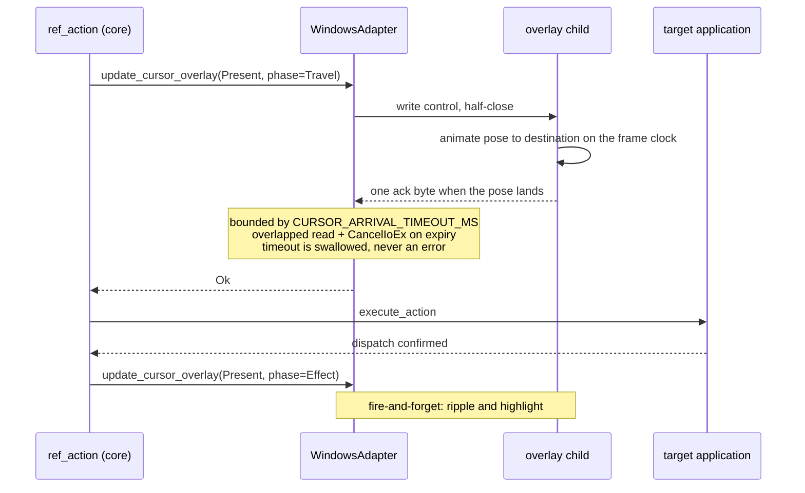
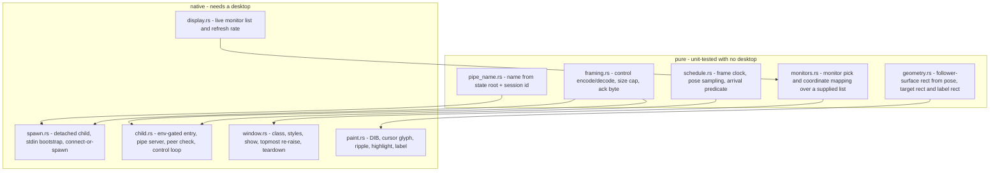

# Cursor Overlay (Sub-phase 2.16) - Plan

## Goal Capsule

- **Objective.** Close Phase 2. Make `cursor-overlay` render on Windows so the command's answer is true rather than merely honest, discharge the nine defects and four probe rows §2.15 handed forward, settle the one remaining cross-platform contract question, and leave `feat/windows-adapter` in a state whose only remaining step is the promotion.
- **Authority hierarchy.** `docs/phases.md` §2.16 settles scope and exit criteria; this plan settles how. Planning re-measured the renderer's mechanism rather than assuming it: `probes/windows/29-cursor-overlay.ps1` and ledger rows **A29-1 … A29-8** were taken before this document was written, and every mechanism decision below cites one. Planning also re-verified all nine inherited defects against the branch — **all nine are still present at `de90dc0b`**, none has drifted, and each unit below names the exact site.
- **There are no open questions in this plan.** §2.16 leaves exactly one contract undecided — what `get --property text` means — and KTD9 decides it. Every other fork the scope names is a numbered decision below with its evidence and its rejected alternative.
- **Stop conditions.** Stop and ask if a reproduction contradicts a measurement recorded here; if the renderer cannot satisfy arrival-before-dispatch inside `CURSOR_ARRIVAL_TIMEOUT_MS` on a real target after U14 lands; or if the dogfood surfaces a defect whose fix would change a contract this plan settled. Do **not** stop for the promotion — it is sequenced, not executed (KTD3).
- **Execution profile.** The ten defect-and-contract units land first, each its own commit with its own invert-verified test, then the renderer in four units, then teardown, docs, e2e and the dogfood. A reviewer can walk the PR commit by commit and reach the renderer having already banked every low-risk fix.
- **Tail ownership.** This sub-phase owns the overlay, the inherited defects, the `text` contract, the dogfood and the promotion **checklist**. It does not own the promotion **merge**.

---

## Product Contract

### Summary

Phase 2 leaves the cursor overlay in a state no other capability is left in. It renders on macOS and does nothing on Windows. §2.15 shipped the honesty half — the adapter default now refuses and `cursor-overlay enable` reports the adapter's answer as `data.rendered` — so today the command tells the truth about drawing nothing. This sub-phase makes it draw.

Riding with it are the findings §2.15's full-branch review could not fix inside its own gate: a clipboard worker that outlives its deadline while holding the Win32 clipboard open, two predicates that disagree about whether a menu is open, two places where a read fault is indistinguishable from a genuine absence, an action advertised on a control that will refuse it, a timeout that discards what it already delivered, a key synthesis that ignores the layout, an inventory that throws away what it collected, five e2e legs that cannot fail, and one generally-available command whose default property is a byte-identical copy of another.

The through-line is not "overlay plus miscellany". Eight of the ten defect units are the same defect class this branch has been correcting all phase: **a check that cannot distinguish success from failure.** The repository already carries four of them as named learnings. The overlay is designed against that same standard — its "did it draw" oracle is a screen pixel, not the command's own return.

### Problem Frame

**The overlay is the last capability that is platform-conditional by accident rather than by measurement.** Everything else Windows does not do, it refuses. `cursor-overlay enable` on Windows returns `ok: true` with `rendered: false` — honest, and useless to an operator who enabled it to watch the agent work.

**The nine findings are cheap to fix and expensive to leave.** Each is small — most are under thirty lines — but each is a live wrong answer in shipped code, and three of them (the clipboard worker, the SET_VALUE advertisement, the discarded chain steps) mislead a caller into a retry that cannot work. Leaving them makes the promotion to `main` a promotion of known defects.

**One contract question is genuinely undecided and a reviewer found it by reading.** `get --property text` and `--property value` are byte-identical reads. `text` is the *default* property, so it is the first thing a caller reaches for, and on a button — a control with a label and no value — it answers empty. No dogfood and no stranger run ever hit it. §2.16 assigns the decision here and requires the macOS delta stated whichever way it lands.

**The renderer's mechanism was unknown and is now measured.** Whether a layered window can satisfy arrival-before-dispatch without stealing focus was the question §2.16 said to measure rather than assume. It is measured, in both directions, and two of the eight rows changed the design rather than confirming it (A29-7, A29-8).

### Requirements

| ID | Requirement |
| --- | --- |
| R1 | Every one of the nine inherited findings is fixed here, and each fix carries a named test that fails when the fix is reverted. |
| R2 | A clipboard read whose worker is still parked in a Win32 call refuses a subsequent clipboard operation rather than contending with it, and the refusal says so in the envelope. |
| R3 | `snapshot --surface menu` and `wait --event surface-appeared --surface menu` answer the same predicate, or the doc comment claiming they must is deleted and the divergence documented. |
| R4 | A read fault is structurally distinguishable from a genuine absence in `first_native_hwnd` and in `list_displays_live`; neither returns a success value that means "nothing here" when the truth is "the read failed". |
| R5 | `SET_VALUE` is not advertised on a range control whose provider reports it read-only, and an unreadable read-only flag does not fail open. |
| R6 | A chain whose budget expires after a rung already delivered reports the disposition those steps imply, not `unknown`. |
| R7 | A character key the active keyboard layout requires Shift to produce is synthesized with Shift. |
| R8 | `list-surfaces` reports the surfaces it did collect for a process when one of that process's windows is unresponsive. |
| R9 | Each of the five e2e legs fails when the property its name claims is violated, and the fixture's invoke provider marshals its mutation to the UI thread. |
| R10 | `get --property text` returns the text a human reads on the control: the value where the role's value is the content, the accessible name otherwise, falling back across when the preferred one is empty. |
| R11 | `cursor-overlay enable` on Windows draws the overlay, and `data.rendered` reports `true` only when the renderer confirmed it created and showed its window. |
| R12 | The overlay's cursor reaches its destination before the action dispatches, acknowledged by the renderer within `CURSOR_ARRIVAL_TIMEOUT_MS`, and a renderer that does not answer never fails the action. |
| R13 | The overlay never takes the foreground, at window creation, show, paint, move or teardown. |
| R14 | The overlay never intercepts input intended for the application beneath it. |
| R15 | `cursor-overlay disable` and `session end` leave no residual window, timer or thread, verified by observation independent of the disable call's own return. |
| R16 | The Windows overlay draws the same visual vocabulary as macOS: the cursor glyph in the session's style, the click ripple, the target-element highlight held for its documented duration, and the label bubble placed by core's own layout. |
| R17 | The four probe rows carrying `closure: 2.16` are each closed by measurement or explicitly ratified as out of reach, with the reason recorded. |
| R18 | The per-platform overlay contract — including every place Windows behaves differently from macOS — is stated in the Windows skill and the README. |
| R19 | The dogfood is run as a stranger against the shipped skill and the built binary, and every finding takes exactly one of *fixed here*, *owned elsewhere*, or *accepted*. |
| R20 | The Phase 2 promotion has a written, ordered checklist that a later session can execute without reading this plan. |

### Key Decisions

- **The overlay draws over the Windows shell's own topmost chrome, and this is now settled by measurement rather than assumed either way.** §2.16 asked the question about the §2.14 KTD1 surfaces; A29-3 answers it. A cursor travelling to a taskbar-adjacent destination is not clipped. *(Governs R16.)*
- **The Windows renderer does not read the OS animation preference.** *(session-settled: user-approved — chosen over collapsing motion the way macOS collapses it under reduce-motion: the one signal Windows offers reports motion suppressed on a stock Windows Server host nobody configured for accessibility, measured on a console session, so honouring it would disable the feature by default on an entire class of host.)* *(Governs R16, R18.)*
- **`get --property text` becomes role-conditional.** *(session-settled: user-approved — chosen over name-preferring, name-then-value, and retiring `text` as an alias for `value`: the first two flip a labelled textfield's default property from its content to its label, and the third leaves the default property empty on every button.)* *(Governs R10.)*

### Scope Boundaries

- The overlay renders for **headless** semantic actions only. `crates/core/src/cursor_overlay/submit.rs` returns early when `context.is_headed()`, and that gating is core's, unchanged here.
- The per-action path stays fail-soft. An adapter that cannot draw never fails an action; `submit` logs and returns.
- `cursor-overlay disable` carries no `rendered` field, because a disable has nothing to render. §2.15 settled that and this sub-phase does not revisit it.
- No second honesty field is invented. `data.rendered` is the channel.

### Ratified Out of Scope — settled here, not postponed

- **Authoring a security descriptor for the control pipe.** `crates/windows/src/system/private_file/mod.rs` records that descriptor authoring and DACL validation are deliberately absent from this crate, because the deleted v0.5.0 layer sank on `AceSize` handling, and a test pins the ACL/ACE symbol family out of that module. The pipe is protected by authenticating its peer instead (KTD13), which uses only the token API family the crate already calls.
- **Mixed-DPI and multi-monitor coordinate mapping verified live.** A29-6 records this host as one monitor at one scale, so there is no arrangement here to verify against. The mitigation is structural, not deferred: monitor selection and coordinate mapping are pure functions over a monitor list, unit-tested with a scaled two-monitor arrangement this desktop cannot present (U15).
- **The Medium-to-elevated UAC boundary (A27-4).** Measured shut: this rig manufactures integrity levels, not UAC elevations, and the probe records the negative result with its mechanism. Ratified as out of reach for Phase 2 (U11).

### Deferred to Follow-Up Work

- **The promotion merge itself.** The checklist lands here (U20); the merge is a separate release-noted `feat!` after this PR merges.

---

## Planning Contract

### Key Technical Decisions

**KTD1 — One sub-branch, one plan, one PR into `feat/windows-adapter`.** *(session-settled: user-directed — chosen over splitting into 2.16a and 2.16b: the owner directed a single sub-branch and a single PR.)* This PR will exceed the repository's ~2,000-LOC sub-phase cap, materially: twenty units, ten of them defect fixes and four of them a new renderer. That is an owner decision recorded here, not a quiet deviation. The mitigation is commit topology — every unit is its own commit with its own test, so review is incremental even though the PR is not.

**KTD2 — The ten defect-and-contract units are U1…U10 and the renderer follows.** *(session-settled: user-approved — chosen over renderer-first: the low-risk fixes must not be hostage to the renderer if review stalls.)*

**KTD3 — The Phase 2 promotion is sequenced after this PR merges, never inside it.** *(session-settled: user-approved — chosen over promoting within this PR: `CLAUDE.md` forbids PR'ing a sub-phase into `main`, and the promotion is gated on full-branch review, live e2e and a perf baseline.)*

**KTD4 — The Windows overlay is a detached child of the same binary, reached over a named pipe.** *(session-settled: user-approved — chosen over an in-process render thread: the CLI is stateless per invocation, so the renderer must outlive the process that started it.)* The child is guarded exactly as macOS guards its own — it spawns only when `std::env::current_exe()`'s file stem is `agent-desktop`, so an FFI host, whose `current_exe()` is the host process, never forks one. The first control reaches the child over its inherited stdin, and later controls over the pipe, matching the macOS bootstrap so a connect race against a pipe that does not exist yet cannot occur.
  **The spawn is `std::process::Command` with `CommandExt::creation_flags`, not this crate's existing `CreateProcessW` path.** `system/launch.rs::create_process` exists to start *user applications* with a caller-supplied environment block and working directory, and has no stdin plumbing; the bootstrap needs a piped stdin, which `Command` gives without hand-built inheritable handles. Reusing `launch.rs` would mean adding pipe creation and handle inheritance to the app-launch path for a caller that is not launching an app.

**KTD5 — The window style set is `WS_EX_LAYERED`, `WS_EX_TRANSPARENT`, `WS_EX_TOOLWINDOW`, `WS_EX_NOACTIVATE` and `WS_EX_TOPMOST`, shown with `SW_SHOWNOACTIVATE`, every `SetWindowPos` carrying `SWP_NOACTIVATE`, and the child spawned `DETACHED_PROCESS | CREATE_NO_WINDOW`.** *(session-settled: user-approved — chosen over dropping `WS_EX_NOACTIVATE`.)* **Evidence A29-1**, measured in both directions: with the flag the overlay took the foreground at none of create, show, paint and move; without it, at three of the four. The console flags matter for the same reason — a child that gets a console window takes the foreground with it.

**KTD6 — Painting is `UpdateLayeredWindow` with a premultiplied 32bpp top-down DIB, on a small surface that follows the pose.** *(session-settled: user-approved — chosen over `SetLayeredWindowAttributes`, which is constant-alpha and colour-key only and cannot draw an anti-aliased cursor, and over one virtual-screen-spanning window.)* **Evidence A29-2**: cost tracks pixel count almost linearly — 19.1× the pixels for 19.5× the time — so a 256×256 follower stays under 0.1 ms while a three-monitor 4K virtual screen would cost roughly 11 ms per frame at the same rate.

**KTD7 — Refresh rate comes from `GetDeviceCaps(GetDC(NULL), VREFRESH)`.** *(session-settled: user-approved — chosen over `EnumDisplaySettings(NULL, ENUM_CURRENT_SETTINGS)`.)* **Evidence A29-7**: the obvious call fails on this host and leaves its frequency at 0, which a renderer would take as a silent zero timestep. `GetDeviceCaps` returns 64 with no device name needed. The frame clock is a floor and a cap around that reading, never a bare division by it.

**KTD8 — "The overlay is on screen" is proved by a screen pixel, never by hit-test and never by the command's own return.** *(session-settled: user-approved.)* **Evidence A29-4**: `WS_EX_TRANSPARENT` — the same flag that makes the overlay safe — makes it invisible to `WindowFromPoint`, so hit-testing cannot be the oracle. **A29-3** shows the pixel oracle working in both directions, including that teardown restores the pixel exactly.

**KTD9 — `get --property text` returns the value for roles whose value is the content, and the accessible name otherwise, falling back across when the preferred one is empty.** *(session-settled: user-approved — chosen over name-preferring, name-then-value, and retiring `text` as an alias for `value`.)* The predicate already exists and is reused rather than rewritten: `is_mutable_value_role` (`crates/core/src/roles.rs:88-100`, `pub`) is true for exactly `combobox`, `checkbox`, `incrementor`, `listbox`, `radiobutton`, `slider`, `switch`, `textfield` — the roles whose value is live content — and `ref_identity.rs` already builds `stable_name`/`stable_value` on it. **One clarification the settled wording did not carry, reported rather than worked around:** the predicate's true-branch is the *value-preferring* set, so `text` reads it in that direction; its name reads from ref-identity's concern (a volatile value is not stable identity), not from `get`'s. Same partition, opposite framing.
  **The name comes from the stored `entry.identity.name`, not from a live read.** There is no `get_live_name` on the adapter; the only live name is `get_live_element(...).identity.name`, a tri-state `LocatorField`. `--property title` already answers from the stored name, so `text` staying symmetric with it is the smaller change and the one that keeps a single meaning for "the accessible name" across the command.
  **macOS delta: none.** `get` is a core command with no platform branch — `src/dispatch/mod.rs` dispatches it unconditionally and `crates/core/src/commands/get.rs` contains no `#[cfg]`. Both adapters change identically, and that is stated in the shipped reference.

**KTD10 — No `Co-Authored-By`, AI-attribution or "Generated with" trailers on any commit or PR body.** *(session-settled: user-directed — chosen over the session's attribution reminder: `CLAUDE.md` states this as an override.)*

**KTD11 — The renderer does not consult the OS animation preference; the session opt-in is the preference.** The overlay is not ambient shell chrome — it is drawn only because a caller enabled it on a session, and `CursorOverlayStyle` already carries per-session `ripple` and `highlight` knobs the operator can turn off. **Evidence A29-7 and A29-8**: `SPI_GETCLIENTAREAANIMATION` reports animations disabled on this host while `SPI_GETUIEFFECTS` reports effects enabled, and `SM_REMOTESESSION` is 0 — so the reading is a stock Windows Server best-performance default on a console session, not a remote-bandwidth artifact and not an accessibility choice, and no API separates the two. Rejected: honouring it unconditionally, which disables the feature by default on every Server host including the one this phase's own dogfood runs on; and gating it on session kind, which A29-8 disproved before it was built. The delta from macOS is stated in the Windows skill and the README (U17).

**KTD12 — The pipe is the singleton lock.** `CreateNamedPipeW` with `FILE_FLAG_FIRST_PIPE_INSTANCE` fails when an instance of the name already exists, which is exactly the race a separate lock would guard. Rejected: a named mutex mirroring macOS's `flock`, which adds a second object whose lifetime must then be reasoned about against the pipe's.

**KTD13 — The pipe authenticates its peer instead of carrying a descriptor.** The server calls `ImpersonateNamedPipeClient`, reads the client's `TokenUser` SID, compares it to its own, reverts, and disconnects a mismatch without reading the payload. It also sets `PIPE_REJECT_REMOTE_CLIENTS`. Rejected: authoring an owner-only DACL — `crates/windows/src/system/private_file/mod.rs` records descriptor authoring as deliberately absent from this crate after the deleted v0.5.0 ACL layer, and a test pins the ACL/ACE symbol family out of that module. Peer authentication uses only the token APIs the crate already calls; the SID comparison reuses `owner.rs`'s `SidBuffer`, promoted from `pub(super)` to `pub(crate)` so it is shared rather than duplicated.

**KTD14 — The acknowledgement read never parks a thread in a blocking OS call.** The pipe is opened `FILE_FLAG_OVERLAPPED` and the ack is read with an overlapped `ReadFile`, a bounded `WaitForSingleObject`, and `CancelIoEx` on expiry. This is the same defect the clipboard unit is fixing in U2 and the same shape `docs/solutions/logic-errors/a-deadline-cannot-interrupt-a-blocking-os-call.md` records; the renderer does not reintroduce it.

**KTD15 — `data.rendered` is `true` only on an Enable acknowledged by the child after `CreateWindowEx` and `ShowWindow` both succeeded.** A spawn that starts a process which then fails to create its window must report `false`, or §2.15's honesty field lies in a new way. This follows `docs/solutions/logic-errors/emit-state-on-a-positive-claim-never-on-a-default.md`.

**KTD16 — The label bubble is drawn with GDI text into the layered DIB, and the bubble's rectangle is alpha-corrected after the draw.** GDI text writes RGB without alpha, so text drawn straight into a premultiplied 32bpp DIB is invisible under `ULW_ALPHA`. The bubble is opaque by design, so forcing alpha to 255 across the bubble rectangle after `DrawTextW` is correct rather than a workaround. Rejected: DirectWrite or GDI+, either of which adds a rendering dependency for one text run. The crate has **no** text-drawing primitive today — `DrawText`, `TextOut`, GDI+ and DirectWrite appear nowhere in `crates/windows/src/` — so this is the first, and the alpha correction is the whole of the subtlety a later reader would otherwise have to rediscover.

**KTD17 — Frame pacing is time-parameterized, not frame-counted.** Core's `CursorMotion::pose(elapsed_ms)` is a function of elapsed time, so the render loop samples the clock rather than assuming its own cadence. A dropped frame changes smoothness, never the arrival instant, and the arrival ack fires on reaching the destination pose rather than on a frame count.

**KTD18 — Two `windows-sys` feature modules are added: `Win32_System_Pipes` and `Win32_System_IO`.** Everything else the renderer needs is already enabled — `Win32_Graphics_Gdi`, `Win32_UI_WindowsAndMessaging`, `Win32_UI_HiDpi`, `Win32_Foundation`, `Win32_Security`, `Win32_System_Threading`, `Win32_System_LibraryLoader`, `Win32_Storage_FileSystem`. `docs/phases.md`'s New Dependencies table claims to match the shipped manifest, so it is updated in the same PR (U1). The child is spawned through `std::process::Command` with `CommandExt::creation_flags`, which needs no feature at all.

### Error and Disposition Mapping

| Situation | Code | Delivery | Retry |
| --- | --- | --- | --- |
| Clipboard operation requested while a prior worker is still outstanding | `APP_UNRESPONSIVE` | `not_delivered` | `unsafe` until the outstanding worker clears |
| Clipboard read whose own worker outlives the deadline | `TIMEOUT` | `not_delivered` | `unsafe` (unchanged in code, but now truthful because the next call refuses) |
| `snapshot --surface menu` where the menu is a Chromium DOM menu the surface cannot root | `WINDOW_NOT_FOUND` | n/a | `safe` after a fresh wait |
| `first_native_hwnd` climb faulted rather than reaching the root | not surfaced directly; the caller's own error keeps its code, and the fault no longer reads as "not foreground" | unchanged | unchanged |
| `EnumDisplayMonitors` enumeration failed | `INTERNAL` with the Win32 error in `platform_detail` | n/a | `unsafe` |
| Chain budget expiry after a rung delivered unverified | `TIMEOUT` | `delivered_unverified` | `unsafe` |
| `list-surfaces` where one window's pump probe failed | `ok` with the surfaces collected | n/a | n/a |
| Overlay child cannot create its window | command succeeds with `rendered: false` | n/a | n/a |
| Overlay travel ack does not arrive within `CURSOR_ARRIVAL_TIMEOUT_MS` | no error — the action proceeds | unchanged | unchanged |
| `cursor-overlay disable` where the child does not acknowledge within its budget | command succeeds with the adapter's error logged | n/a | n/a |

### High-Level Technical Design

**Process and transport.** Three processes are in play, and only one of them is long-lived.

**Arrival before dispatch.** The travel control is a blocking round trip with a hard ceiling, not a computed sleep. The overlay is allowed to be slow; it is not allowed to make the action slow.

**Module split, chosen against the 400-LOC cap before any code is written.** The left column is desktop-free and unit-tested on any host; the right column needs a window.

### Assumptions

- The overlay child inherits the CLI's per-monitor-v2 DPI awareness only if it establishes its own; it calls `dpi::ensure_per_monitor_v2()` before creating its window, because a fresh process does not inherit the parent's awareness context.
- `notepad.exe` remains available on the dogfood host as a foreground-holding target. A29's probe already depends on this and it held across four runs.
- The Windows live suite is load-sensitive (A28-6). Every verification gate below that reads it requires a quiesced desktop and treats a single failing run as unproven rather than as a regression.

---

## Implementation Units

### U1. Correct `docs/phases.md` §2.16 and write the settled contracts into it

**Goal.** The document a Linux planner reads next says what shipped, including the two contract answers this sub-phase produced.

**Requirements.** R10, R16, R18, R20.

**Dependencies.** None.

**Files.** `docs/phases.md`.

**Approach.**
1. Replace §2.16's `~1.5k LOC` estimate with a figure that reflects twenty units including ten defect fixes, and state that the single-PR shape is an owner decision that exceeds the sub-phase cap (KTD1).
2. Write the `get --property text` answer into the document as settled, with the macOS delta stated (KTD9).
3. Answer the shell-chrome question §2.16 poses, citing A29-3: the overlay draws over the shell's topmost chrome and its teardown restores the pixel.
4. Record the animation-preference decision and its evidence (KTD11, A29-7, A29-8).
5. Update the New Dependencies feature table with `Win32_System_Pipes` and `Win32_System_IO`, since the table claims to match the shipped manifest (KTD18).
6. Add the corresponding hunk-index rows so `13-ledger-check.ps1` still passes.

**Patterns to follow.** §2.15's U1 corrected in place and cited what disproved each line; `CLAUDE.md` forbids annotating corrections as history.

**Test scenarios.**
- `powershell -File probes/windows/13-ledger-check.ps1` passes with the new hunk-index rows, and fails if a cited hunk is removed.
- `scripts/check-phases-ledger-citations.ps1` passes.

**Verification.** Both gates green; no `NOTE:` or "previously said" annotation anywhere in the diff.

---

### U2. A clipboard operation refuses while a previous worker still holds the clipboard

**Goal.** A timed-out clipboard read stops inviting a retry that will contend with its own abandoned worker.

**Requirements.** R1, R2.

**Dependencies.** None.

**Files.** `crates/windows/src/input/clipboard.rs`, a new `crates/windows/src/input/clipboard_worker_state.rs`, `crates/windows/src/input/clipboard_tests.rs`.

**Approach.**
1. `read_format_bytes_on_worker` (`clipboard.rs:204-233`) records an outstanding-worker marker before `thread::spawn` and the worker clears it when its closure returns — which is precisely what a parked worker never does.
2. Every clipboard entry point consults the marker first. When a worker is outstanding, refuse with `APP_UNRESPONSIVE`, `not_delivered`, and a message naming the cause and the fact that it clears when the previous read's owner answers.
3. The marker is process-scoped state in its own module, so the counting logic is testable without a clipboard.
4. `ensure_owner_responsive()` is unchanged; it rules out a hung pump, which is a different fact, and its doc comment is corrected to say so rather than to imply it covers this.

**Execution note.** A thread blocked in a Win32 call cannot be cancelled; do not attempt it. The deliverable is refusal and honesty, per `docs/solutions/logic-errors/a-deadline-cannot-interrupt-a-blocking-os-call.md`.

**Patterns to follow.** `crates/windows/src/input/release_state.rs` is the crate's existing armed-and-counted guard with a delivery report.

**Test scenarios.**
- With no worker outstanding, a clipboard read proceeds — the guard does not refuse the ordinary path.
- With a marker armed, `get_clipboard_content` returns `APP_UNRESPONSIVE` with `not_delivered` and a message naming the outstanding worker.
- A worker that completes clears the marker, and the next read proceeds.
- A worker that is abandoned leaves the marker armed, and the refusal persists.
- The existing `hung_delay_owner_returns_app_unresponsive` still passes — the pre-probe path is unchanged.
- Invert check: removing the marker arm makes the refusal test fail.

**Verification.** `cargo test -p agent-desktop-windows --lib input::clipboard` green; the refusal test fails when the arming line is deleted.

---

### U3. `snapshot --surface menu` and the menu wait answer the same predicate

**Goal.** An agent that waits for a menu and then asks for it stops getting `WINDOW_NOT_FOUND`.

**Requirements.** R1, R3.

**Dependencies.** None.

**Files.** `crates/windows/src/system/menu_state_locate.rs`, `crates/windows/src/system/menu_state.rs`, `crates/windows/src/tree/surfaces.rs`, `crates/windows/src/system/menu_state_tests.rs`.

**Approach.**
1. Extend `locate_menu` to resolve the Chromium DOM menu source that `menu_is_open` already consults through `chromium_dom_menu_reachable`, so a menu the detector reports open is a menu the surface can root.
2. Where a source genuinely cannot yield a rootable element — a classic Win32 system menu with no reachable UIA element under a tool window — the divergence is real and must not be claimed away: the doc comment at `menu_state_locate.rs:51-57` is rewritten to state exactly which source can report open without being locatable, and `snapshot --surface menu`'s `WINDOW_NOT_FOUND` message names that case so a caller can tell it from "no menu is open".
3. A test drives both predicates against the same staged state and asserts they agree on every source the fix covers, and asserts the documented, named disagreement for the one it does not.

**Execution note.** The false doc comment is the defect of record. Whichever way the code lands, the comment must become true — a fix that leaves it asserting more than the code delivers has not closed this finding.

**Test scenarios.**
- A source that reports the menu open through the Chromium path is locatable, so `locate_menu` returns `Some`.
- A source that reports open through the classic path with no reachable element yields the named, documented refusal — not a bare `WINDOW_NOT_FOUND`.
- The two predicates agree on a state where no menu is open.
- Invert check: reverting `locate_menu`'s new source makes the agreement test fail.

**Verification.** `cargo test -p agent-desktop-windows --lib menu_state` green; the agreement test fails with the new source removed.

---

### U4. A read fault stops reading as a genuine absence

**Goal.** Two places where a failure and an empty answer are the same value become structurally distinct.

**Requirements.** R1, R4.

**Dependencies.** None.

**Files.** `crates/windows/src/tree/hit_test_corroborate.rs`, `crates/windows/src/actions/physical_target.rs`, `crates/windows/src/system/display.rs`, `crates/windows/src/system/display_tests.rs`, plus the hit-test tests.

**Approach.**
1. `first_native_hwnd` returns `Result<Option<isize>, BudgetExpired>` in the shape `nearest_scroll_viewport` already established (`crates/windows/src/tree/walker_source.rs:19-27,67-94`): `Ok(None)` for a climb that reached the root, `Err(BudgetExpired)` for a faulted or budget-truncated climb. Both callers — `element_root_hwnd` and `physical_target.rs`'s `host_window_handle` — are updated so a fault no longer reads as "this element is not foreground".
2. `list_displays_live` reads `EnumDisplayMonitors`'s `BOOL` and returns `INTERNAL` with the Win32 error in `platform_detail` when enumeration failed, instead of `Ok(vec![])`. An empty success stays reserved for a genuinely display-less system.

**Patterns to follow.** `walker_source.rs`'s `BudgetExpired` marker and its doc comment explaining why the two causes share one shape distinct from `Ok(None)`. `docs/solutions/logic-errors/tri-state-evidence-collapses-under-negation.md` and `docs/solutions/logic-errors/a-zero-success-value-is-not-the-answer-you-asked-for.md` both record this class.

**Test scenarios.**
- A climb that reaches the root returns `Ok(None)`; a climb whose parent read faults returns `Err`.
- `host_window_handle`'s caller treats `Err` differently from `Ok(None)` — a fault does not silently refuse physical input as "not foreground".
- A failed `EnumDisplayMonitors` yields `INTERNAL` carrying the Win32 error, not an empty success.
- A genuine zero-monitor enumeration still yields an empty success.
- Invert check: collapsing either `Err` arm back into the absence arm makes its test fail.

**Verification.** `cargo test -p agent-desktop-windows --lib` green for `tree::hit_test` and `system::display`; both invert checks confirmed.

---

### U5. `SET_VALUE` is not advertised on a read-only range control

**Goal.** A ref is not allocated on an advertised action that fails at execution.

**Requirements.** R1, R5.

**Dependencies.** None.

**Files.** `crates/windows/src/tree/property_ids.rs`, `crates/windows/src/tree/actions.rs`, `crates/windows/src/tree/actions_tests.rs`.

**Approach.**
1. Add `RangeValueIsReadOnly` to `TreeProperty` in all four places the enum requires: the variant, the `WALK_SET` batch entry, the `as_str()` arm and the `uia_property()` mapping.
2. Pair it in `gate()` with `RangeValueAvailable`, mirroring the `ValueIsReadOnly` → `ValueAvailable` pairing.
3. Gate the `RangeValueAvailable` arm of `resolve_actions` on `gated_flag(RangeValueIsReadOnly) == Some(false)`, exactly as the adjacent `ValueAvailable` arm is gated.
4. Correct `property_ids.rs`'s doc comment, which currently names `RangeValueIsReadOnly` among the properties deliberately not requested.

**Execution note.** Use `gated_flag`, never `!is_true`. `docs/solutions/logic-errors/tri-state-evidence-collapses-under-negation.md` records that negating the boolean-flavoured predicate fails open on an unreadable flag, which is this exact arm's neighbour.

**Test scenarios.**
- A range control reporting `RangeValueIsReadOnly` false advertises `SET_VALUE`.
- A range control reporting it true does not.
- A range control whose read-only flag is unreadable does **not** advertise it — the unreadable case fails closed.
- The batch read requests the new property, so a provider that implements it is asked.
- Invert check: removing the gate makes the read-only test fail.

**Verification.** `cargo test -p agent-desktop-windows --lib tree::actions` green; the fails-closed case is asserted separately from the reports-true case.

---

### U6. A chain budget expiry carries the disposition its delivered steps imply

**Goal.** A timeout after a delivered-unverified write stops reporting `unknown`.

**Requirements.** R1, R6.

**Dependencies.** None.

**Files.** `crates/windows/src/actions/chain.rs`, `crates/windows/src/actions/chain_tests.rs`.

**Approach.** Replace the bare `ensure_budget(deadline)?` at the top of `execute_chain`'s loop with the same treatment the rung-error path already carries: on expiry, attach `exhaustion_disposition(&steps)` to the timeout error so the accumulated steps are reflected rather than discarded.

**Test scenarios.**
- A budget expiry with no prior delivery reports `not_delivered`.
- A budget expiry after a rung delivered unverified reports `delivered_unverified`, not `unknown`.
- The rung-error path's existing behaviour is unchanged.
- Invert check: restoring the bare `?` makes the delivered-unverified case fail.

**Verification.** `cargo test -p agent-desktop-windows --lib actions::chain` green; the invert check confirmed.

---

### U7. Key synthesis honours the layout's shift requirement

**Goal.** `press --key 5` sends `5` on a layout where the digit row requires Shift.

**Requirements.** R1, R7.

**Dependencies.** None.

**Files.** `crates/windows/src/input/keyboard_map.rs`, `crates/windows/src/input/keyboard_event.rs`, `crates/windows/src/input/keyboard_map_tests.rs`.

**Approach.**
1. `vk_key_scan` returns the virtual key **and** the shift-state byte instead of masking it away, and `character_key_vk` carries that through to a small resolved-key type rather than a bare `u16`.
2. `synthesize_key` unions the layout-required modifiers with the caller's own before building the chord, so a caller-supplied modifier is never dropped and a layout-required one is never omitted.
3. The mapping is pure: the test supplies a scan result rather than a live layout, because this rig is US-layout and A29-style honesty applies — the live case cannot be reproduced here and the plan does not pretend otherwise.

**Execution note.** The existing digit test passes on any layout because the ASCII fallback and the US low byte coincide. Rewrite it so it distinguishes them rather than adding a second test beside a tautology — `docs/solutions/best-practices/a-test-that-cannot-fail-is-not-coverage.md` records this shape.

**Test scenarios.**
- A scan result carrying the Shift bit produces a chord containing the Shift virtual key.
- A scan result with no shift bits produces the caller's modifiers only.
- A caller-supplied modifier plus a layout-required Shift produces both, without duplication.
- A scan result of `-1` (no mapping) still falls back to the ASCII path.
- Invert check: restoring the `& 0x00FF` mask makes the Shift-bit test fail.

**Verification.** `cargo test -p agent-desktop-windows --lib input::keyboard_map` green; the shift-bit test fails with the mask restored.

---

### U8. `list-surfaces` reports what it collected when one window is unresponsive

**Goal.** One hung window stops erasing a process's responsive windows from the inventory.

**Requirements.** R1, R8.

**Dependencies.** None.

**Files.** `crates/windows/src/tree/surface_inventory.rs`, `crates/windows/src/tree/surface_inventory_tests.rs`.

**Approach.** Collect per-window failures instead of propagating the first one. A window whose `is_modal_sheet` probe faults contributes no sheet surface and does not remove the `Window` and `Focused` surfaces already recorded for it or for its siblings, mirroring how `finish_observation` reports an honest partial rather than a discard.

**Test scenarios.**
- Three windows where the second's sheet probe faults: the inventory carries surfaces for all three, minus only the second's sheet.
- A process whose every window faults still returns the window-level surfaces.
- A genuinely empty process returns an empty inventory, distinct from the partial case.
- The menu leg after the loop still runs after a per-window fault.
- Invert check: restoring the `?` makes the three-window test fail.

**Verification.** `cargo test -p agent-desktop-windows --lib tree::surface_inventory` green; the invert check confirmed.

---

### U9. `get --property text` returns what a human reads on the control

**Goal.** The default property stops answering empty on every button.

**Requirements.** R1, R10.

**Dependencies.** None.

**Files.** `crates/core/src/commands/get.rs`, `crates/core/src/commands/get_tests.rs`, `skills/agent-desktop/references/commands-observation.md`, `src/cli_args/mod.rs`.

**Approach.**
1. The `Text` arm branches on `is_mutable_value_role(&entry.identity.role)` (`crates/core/src/roles.rs:88-100`, already `pub`): true prefers the live-or-stored value and falls back to the stored name; false prefers the stored name and falls back to the value. Empty strings count as absent, matching how `ref_identity` already treats meaningless text.
2. The `Value` arm is unchanged — it stays the raw value read, so a caller who wants the value specifically still has it.
3. Rewrite, do not delete, `text_reads_the_value_and_title_reads_the_name_as_the_reference_states` so it pins both directions: a button answers its name through `text`, and a textfield answers its content.
4. Update the property table and the prose beneath it in `commands-observation.md`, and the `--property` help in `src/cli_args/mod.rs`. State that the change is identical on macOS and Windows because `get` has no platform branch.

**Execution note.** Reuse `is_mutable_value_role`; do not write a second role list. `docs/solutions/best-practices/a-test-that-cannot-fail-is-not-coverage.md` records a second hand-maintained list drifting from the first as a live failure mode in this repo.

**Test scenarios.**
- A `button` with name `Close` and no value answers `Close` for `text`, `Close` for `title`, and empty for `value`.
- A `textfield` with name `Search` and value `kittens` answers `kittens` for `text`, `Search` for `title`, `kittens` for `value`.
- A `textfield` with a name and an empty value answers its name for `text` — the cross-fallback fires.
- A `button` with neither name nor value answers empty for `text` rather than erroring.
- A live value read that succeeds takes precedence over the stored value on a mutable-value role.
- A live value read that is unsupported falls back to the stored value without erroring.
- Invert check: making the `Text` arm identical to `Value` again makes the button case fail.

**Verification.** `cargo test -p agent-desktop-core --lib commands::get` green; the shipped reference's wording and the test agree, and changing one without the other fails.

---

### U10. Five e2e legs assert what they claim, and the fixture marshals to its UI thread

**Goal.** A leg named for a rate fails when the rate is zero.

**Requirements.** R1, R9.

**Dependencies.** None.

**Files.** `tests/e2e-windows/scenarios/Acceptance.ps1`, `tests/e2e-windows/scenarios/Chromium.ps1`, `tests/e2e-windows/scenarios/SplitIntegrity.ps1`, `tests/e2e-windows/scenarios/Reliability.ps1`, `tests/fixture-app-windows/FixtureControlTypeOverrideHost.cs`, `scripts/check-e2e-windows-contract.ps1`, `scripts/lib/e2e-windows-contract-rules-misc.psm1`, `scripts/fixtures/e2e-windows-contract/`.

**Approach.**
1. `contended-focus-steal-rate` gates on `$landed`, not only on `$completed`, with a stated threshold and the observed rate in the failure message.
2. `chromium-menu-attempt-bounded` asserts on the four probe readings it already takes, so a change in what the probes observe changes the leg's verdict.
3. `split-integrity-capture-recorded` gates on `$pixelsProduced`, so a success envelope with a zero-byte PNG fails.
4. `reliability-wait-enabled-delayed-button` re-reads the button's actual enabled state independently after the wait and asserts a minimum elapsed time, following the discipline its own sibling leg and `Acceptance.ps1`'s auto-wait legs already use.
5. `FixtureControlTypeOverrideHost.cs`'s `Invoke` marshals through `InvokeRequired`/`BeginInvoke` exactly as `FixtureExpandCollapseHost.cs` and `FixtureToggleHost.cs` do. The fixture compiles under the in-box `csc.exe` at `/langversion:5`, so the guard uses `MethodInvoker` and an explicit delegate, never string interpolation or an expression-bodied member.
6. The class is closed by **a new rule in the existing harness contract gate**, not a second gate. `scripts/check-e2e-windows-contract.ps1` already enforces fourteen structural rules, already self-tests against MUST-CATCH and MUST-PASS fixtures before it scans the real tree, and already fails a rule that executes zero checks. The new rule flags a leg that reaches `Add-Pass` on every path, and ships with its own fixture pair. Building a parallel script would duplicate that self-test machinery and leave two gates to keep in step.

**Patterns to follow.** `Add-Pass` / `Add-Fail` live in `tests/e2e-windows/LibVerdict.psm1`; a repaired leg keeps using them rather than introducing a new disposition verb. The gate's existing rules in `scripts/lib/e2e-windows-contract-rules-misc.psm1` show the rule-plus-fixture shape.

**Execution note.** Each repaired leg must be shown failing before it is shown passing: break the property, watch the leg fail, restore. A leg repaired without that demonstration is the same defect wearing a new assertion.

**Test scenarios.**
- The new rule's MUST-CATCH fixture — a leg whose `Add-Pass` is unconditional — is flagged; its MUST-PASS sibling, a leg whose pass is guarded, is not.
- The new rule executes at least one check against the real tree, so the gate's existing zero-checks guard is satisfied rather than silently bypassed.
- Each of the four repaired legs fails when its measured property is forced to the failing value, and passes when it is not.
- The fixture's invoke provider mutates its control from a non-UI thread without throwing, and the `menu-fire` leg is stable across repeated runs.
- Invert check: reverting any one leg's new assertion makes the repaired leg pass where it should fail, caught by that leg's forced-failure demonstration.

**Verification.** `powershell -File scripts/check-e2e-windows-contract.ps1` passes, its fixture self-test having run first; each repaired leg demonstrated failing and then passing.

---

### U11. Close or ratify the four probe rows carrying `closure: 2.16`

**Goal.** No probe row leaves Phase 2 pointing at a sub-phase that has ended.

**Requirements.** R17.

**Dependencies.** None.

**Files.** `probes/windows/FINDINGS.md`, `probes/windows/30-tray-and-content-closure.ps1` (new), `probes/windows/13-ledger-check.ps1`.

**Approach.**
1. **A28-2** — resolve and enumerate in one process: hold the resolved toolbar handle and enumerate the same parent in the same breath, which is the observation A28-2 says is missing, and record whichever of the two candidate explanations the reading supports. If neither is distinguishable, record that with its mechanism rather than choosing one.
2. **A28-3 / A26-13** — partition the Chromium content leaves this host now exposes into positive-area and zero-extent, which is the classification A26-13 actually needs and A28-3 established is reachable here.
3. **A27-4** — ratify: the rig manufactures integrity levels, not UAC elevations, and the probe already records the negative result with its mechanism. Move `A21-2`'s closure out of Phase 2 explicitly rather than letting it point at a closed sub-phase.
4. **A28-6** — record as a standing gate rule in `probes/windows/README.md` and in the Verification Contract below: a single green run of the Windows live suite is not proof and a single red run is not a regression.

**Execution note.** Measure before recording. A row closed by assertion is worse than a row left open, and `docs/solutions/best-practices/one-measurement-is-not-a-measurement.md` records why.

**Test scenarios.**
- `13-ledger-check.ps1` passes with the new area registered and every `closure: 2.16` row either closed or re-pointed.
- `check-capture-redaction.ps1` passes on the new captures.
- The new probe is picked up by `run-all.ps1`'s enumeration without a registration edit.

**Verification.** Both gates green; no row in the ledger names a closure sub-phase that has already merged.

---

### U12. The overlay child, its transport, and the pure protocol logic

**Goal.** A Windows process can become the overlay renderer, and a later CLI process can reach it.

**Requirements.** R11, R12.

**Dependencies.** U1.

**Files.** `crates/windows/src/system/cursor_overlay/mod.rs`, `pipe_name.rs`, `framing.rs`, `spawn.rs`, `child.rs`, and their test siblings; `crates/windows/src/system/private_file/owner.rs` (visibility promotion only); `crates/windows/Cargo.toml`.

**Approach.**
1. `pipe_name.rs` derives `\\.\pipe\agent-desktop-cursor-<digest>` from the state root and the session id, as a pure function — the same inputs macOS hashes into its socket path.
2. `framing.rs` encodes and decodes `CursorOverlayControl` as JSON under the same size cap macOS uses, and owns the single acknowledgement byte. Pure.
3. `spawn.rs` tries to connect first and spawns only on failure, guarded on `current_exe()`'s file stem being `agent-desktop`. The child is spawned `DETACHED_PROCESS | CREATE_NO_WINDOW` with the env marker and the pipe name, the first control written to its stdin, and stdout/stderr null so the child can never contaminate the JSON envelope.
4. `child.rs` is entered from `run_cursor_overlay_child` before clap parsing, reads its bootstrap control from stdin, creates the pipe with `FILE_FLAG_FIRST_PIPE_INSTANCE | PIPE_REJECT_REMOTE_CLIENTS` (KTD12), and on each connection impersonates the peer, compares its `TokenUser` SID to its own, reverts, and disconnects a mismatch before reading the payload (KTD13).
5. The travel/hide/disable acknowledgement is read with overlapped I/O bounded by `WaitForSingleObject` and cancelled with `CancelIoEx` (KTD14).
6. `owner.rs`'s `SidBuffer` and its comparison move from `pub(super)` to `pub(crate)` so the SID check is shared rather than duplicated. No ACL or ACE symbol is introduced anywhere.
7. `Win32_System_Pipes` and `Win32_System_IO` are added to `windows-sys` (KTD18).

**Execution note.** The pure files come first and are tested before any window exists. The ack read must never be a plain blocking `ReadFile` — that is the defect U2 is fixing in this same PR.

**Patterns to follow.** `crates/macos/src/system/cursor_overlay/{spawn,child,endpoint}.rs` for the observable behaviour: connect-then-spawn, stdin bootstrap, one ack byte, a short budget for travel and a long one for teardown.

**Test scenarios.**
- The pipe name is stable for the same state root and session id and differs for a different session.
- A control round-trips through encode and decode unchanged, and an oversized control is refused rather than truncated.
- The ack byte is emitted for travel, hide and disable, and not for a fire-and-forget effect control.
- The spawn guard refuses when `current_exe()`'s stem is not `agent-desktop`, so a test binary and an FFI host never fork a renderer.
- A second child that finds the pipe name taken exits rather than racing.
- A peer whose token user differs from the server's is disconnected before its payload is read.
- An acknowledgement that never arrives is abandoned by the bounded wait, and the calling thread is not parked.
- Invert check: removing the `FILE_FLAG_FIRST_PIPE_INSTANCE` flag makes the second-child test fail.

**Verification.** `cargo test -p agent-desktop-windows --lib system::cursor_overlay` green on a host with no desktop interaction; `cargo check -p agent-desktop-core --all-targets --target x86_64-unknown-linux-gnu` still clean, proving nothing leaked into core.

---

### U13. The layered window and its paint

**Goal.** The overlay appears on screen, in the session's style, without taking the foreground or intercepting input.

**Requirements.** R11, R13, R14, R16.

**Dependencies.** U12.

**Files.** `crates/windows/src/system/cursor_overlay/window.rs`, `paint.rs`, `geometry.rs`, `display.rs`, and their test siblings.

**Approach.**
1. `window.rs` registers a class, creates the window with the KTD5 style set, shows it `SW_SHOWNOACTIVATE`, re-issues `SetWindowPos(HWND_TOPMOST, SWP_NOACTIVATE)` on each present so the shell's own topmost chrome does not permanently outrank it (A29-3), and pumps messages without letting the pipe reader block the loop.
2. `paint.rs` builds a premultiplied 32bpp top-down DIB and calls `UpdateLayeredWindow` (KTD6). It draws the cursor glyph in the style's fill and rim at the style's size, the click ripple in the accent scaled by `CursorPose.ripple`, the target-element highlight outline in the accent, and the label bubble — whose rectangle has its alpha forced to 255 after `DrawTextW` (KTD16).
3. `geometry.rs` computes the follower surface's rectangle from the pose, the target rectangle and the label rectangle `place_label` returns — pure, and sized so the ripple at full extent is never clipped.
4. `display.rs` supplies the live monitor list and reads the refresh rate through `GetDeviceCaps` (KTD7). The child calls `dpi::ensure_per_monitor_v2()` before creating its window.

**Execution note.** Verify by pixel, never by hit-test — `WS_EX_TRANSPARENT` makes the window invisible to `WindowFromPoint` by design (A29-4).

**Test scenarios.**
- The follower rectangle contains the cursor glyph, the ripple at full extent, and the label rectangle, for a pose at each screen corner.
- A label whose preferred placement would leave the monitor is clamped inside it.
- The DIB's alpha is 255 across the bubble rectangle after a text draw, and the glyph's own alpha is preserved outside it.
- A style with `ripple` false produces no ripple pixels; with `highlight` false, no outline.
- Live: the foreground window is unchanged across create, show, paint and move — asserted by reading the foreground before and after each.
- Live: a screen pixel inside the overlay changes when it paints and returns to its prior value when it is destroyed.
- Live: `WindowFromPoint` inside the overlay returns the window beneath it, not the overlay.
- Invert check: dropping `WS_EX_NOACTIVATE` makes the foreground test fail; dropping the alpha correction makes the bubble test fail.

**Verification.** Pure tests green anywhere; live tests green on a quiesced desktop, and each invert check confirmed by breaking the flag and watching the named test fail.

---

### U14. Frame scheduling, motion sampling and the arrival acknowledgement

**Goal.** The cursor arrives before the action dispatches, and a slow renderer never slows the action past its ceiling.

**Requirements.** R12, R16.

**Dependencies.** U13.

**Files.** `crates/windows/src/system/cursor_overlay/schedule.rs`, `child.rs`, and their test siblings.

**Approach.**
1. `schedule.rs` is pure: given a start pose, a destination, a refresh reading and a clock, it yields the sample instants and answers whether the pose has arrived. The refresh reading is clamped between a floor and a cap so a zero or absurd value cannot produce a zero timestep (KTD7).
2. The child samples `CursorMotion::pose(elapsed_ms)` on that schedule (KTD17) and emits the acknowledgement when the arrival predicate is true, not on a frame count.
3. The effect phase — ripple and highlight — is fire-and-forget after dispatch, and the highlight is held for `CURSOR_HIGHLIGHT_HOLD_MS`.
4. With no instruction for `CURSOR_IDLE_REST_MS`, the overlay rests. The first present with no prior pose starts from the primary monitor's work-area midpoint.

**Test scenarios.**
- A refresh reading of 0 produces the floor timestep, not a division by zero and not an infinite frame rate.
- A refresh reading of 240 is capped rather than producing a frame budget the paint cannot meet.
- The arrival predicate is false before the motion's duration elapses and true at or after it.
- A motion whose distance is below the still threshold arrives immediately, so a click on the cursor's current position does not wait.
- The ripple's phase advances only after arrival, matching `CursorMotion::pose`.
- Live: an overlaid click's dispatch happens after the cursor's pixel has reached the destination region, measured by sampling the screen rather than by reading the command's return.
- Live: a renderer that never acknowledges delays the action by at most `CURSOR_ARRIVAL_TIMEOUT_MS` and does not fail it.
- Invert check: removing the refresh clamp makes the zero-reading test fail.

**Verification.** Pure tests green anywhere; the arrival ordering measured by pixel on a quiesced desktop.

---

### U15. Monitor selection and coordinate mapping, testable without the arrangement

**Goal.** The overlay lands on the right monitor at the right pixel, on desktops this host cannot present.

**Requirements.** R11, R16.

**Dependencies.** U13.

**Files.** `crates/windows/src/system/cursor_overlay/monitors.rs` and its test sibling.

**Approach.** Monitor selection and coordinate mapping are pure functions over a supplied monitor list — bounds, work area and scale per monitor — so a test can present a scaled two-monitor arrangement A29-6 records as unmeasurable on this rig. `display.rs` supplies the live list; nothing in `monitors.rs` calls Win32.

**Execution note.** A29-6 records this host as one monitor at one scale. The plan does not claim the mixed-DPI case is verified live; it makes the logic verifiable without the hardware, and the shipped docs say which half is measured.

**Test scenarios.**
- A point inside the second monitor's bounds selects that monitor, not the primary.
- A point in the gap between two non-adjacent monitors selects the nearest, deterministically.
- A monitor at 150% scale maps a logical point to the expected physical pixel, and back.
- A negative-origin monitor — left of or above the primary — maps correctly, since the virtual screen origin is not necessarily zero.
- An empty monitor list yields a stated failure, not a panic and not a silent primary.
- Invert check: hard-coding the primary monitor makes the second-monitor test fail.

**Verification.** `cargo test -p agent-desktop-windows --lib system::cursor_overlay::monitors` green; no Win32 call in the module, asserted by a source scan in the test the way the crate already pins the ACL-symbol absence.

---

### U16. Adapter wiring and the `rendered` answer

**Goal.** `cursor-overlay enable` on Windows reports `rendered: true` only when the renderer confirmed it drew.

**Requirements.** R11, R15.

**Dependencies.** U12, U13, U14.

**Files.** `crates/windows/src/system/adapter.rs`, `crates/windows/src/adapter.rs`, `src/cli/windows_capability_claims_tests.rs`.

**Approach.**
1. Implement `SystemOps::update_cursor_overlay` and `run_cursor_overlay_child` on the Windows adapter.
2. The Enable acknowledgement is emitted by the child only after `CreateWindowEx` and `ShowWindow` both succeeded, so `data.rendered` reflects a window that exists (KTD15).
3. `src/cli/windows_capability_claims_tests.rs:121-134` currently pins Windows as `PlatformNotSupported` for this method; it moves with the override, in the same commit.

**Test scenarios.**
- A spawn whose child fails to create its window yields `rendered: false`, not `true`.
- A successful enable yields `rendered: true`.
- `cursor-overlay disable` carries no `rendered` field, unchanged.
- The capability claims test asserts the new answer and fails if the override is removed.
- Invert check: acknowledging Enable before `ShowWindow` makes the failed-window test fail.

**Verification.** `cargo test -p agent-desktop --lib` and `cargo test -p agent-desktop-windows --lib` green; the claims test moved rather than deleted.

---

### U17. Teardown and session scoping, proved by observation

**Goal.** Disabling the overlay leaves nothing behind, and the proof is not the disable call's own return.

**Requirements.** R15.

**Dependencies.** U16.

**Files.** `crates/windows/src/system/cursor_overlay/child.rs`, `spawn.rs`, and a live test sibling.

**Approach.** On `Disable` for its own session the child destroys its window, closes the pipe, acknowledges, and exits. `session end` already sends the same control. Teardown is asserted by three independent observations: the child process is gone, the pipe name is connectable again by a fresh server, and the screen pixel under the overlay has returned to its pre-overlay value (A29-3 showed this oracle working).

**Execution note.** The disable path's own `ok` is not evidence. This is the criterion §2.16 words as "verified by observation after teardown rather than by the disable call returning `ok`".

**Test scenarios.**
- After `cursor-overlay disable`, no child process with the overlay's marker remains.
- After disable, a fresh `CreateNamedPipeW` on the same name succeeds with `FILE_FLAG_FIRST_PIPE_INSTANCE`, proving no server holds it.
- After disable, the screen pixel under the overlay matches its pre-enable value.
- After `session end`, the same three observations hold.
- A disable for a different session id does not tear down this session's renderer.
- Invert check: skipping the window destroy makes the pixel observation fail.

**Verification.** All three observations asserted in one live test on a quiesced desktop; the invert check confirmed.

---

### U18. Docs, skills and README sync

**Goal.** The per-platform overlay contract is stated where an agent will read it.

**Requirements.** R18.

**Dependencies.** U16, U17.

**Files.** `skills/agent-desktop-windows/SKILL.md`, `skills/agent-desktop/references/commands-system.md`, `skills/agent-desktop/references/commands-interaction.md`, `README.md`.

**Approach.** State what Windows does, and every place it differs from macOS: that the overlay draws only for headless semantic actions; that it draws over the shell's topmost chrome (A29-3); that it does not collapse under the OS animation preference, with the reason (KTD11); that mixed-DPI mapping is unit-verified but not verified live on the phase's rig (A29-6); and the measured per-action transport cost (A29-5). Remove the Windows skill's statement that `cursor-overlay enable` returns `rendered: false` while nothing renders.

**Execution note.** Every example in these files is executed verbatim in PowerShell before the docs are committed, because the dogfood will do exactly that and an example that cannot run as written is a defect of the same weight as a broken command.

**Test scenarios.**
- `Test expectation: none` for prose, except: every code example in the changed sections runs verbatim in `powershell.exe` and its output matches what the surrounding prose claims.
- `scripts/check-no-phase-references.sh` passes on `skills/**`.

**Verification.** Every changed example executed and its output recorded in the dogfood report.

---

### U19. e2e overlay legs and the cost statement

**Goal.** The overlay's properties are asserted by the harness, and the sub-phase states its latency delta.

**Requirements.** R12, R13, R14, R15.

**Dependencies.** U17, U10.

**Files.** `tests/e2e-windows/scenarios/CursorOverlay.ps1` (new), `tests/e2e-windows/Run-E2E.ps1`, `tests/e2e-windows/NativeDesktop.psm1`, `tests/e2e-windows/skip-allowlist.psd1`, `probes/windows/FINDINGS.md`.

**Approach.**
1. New legs: the overlay paints (pixel), it does not take the foreground (foreground read before and after), it does not intercept input (a click through the overlay's rectangle reaches the target), the cursor arrives before dispatch (pixel then effect ordering), and teardown leaves nothing (U17's three observations).
2. **The harness has no pixel primitive today** — `SplitIntegrity.ps1` checks only that a PNG is non-empty. Add a screen-pixel sampler to `NativeDesktop.psm1`, which is already the harness's independent-observation module, using a screen-DC `BitBlt` with `CAPTUREBLT` so a layered window is included in the read. `probes/windows/29-cursor-overlay.ps1` already contains a working implementation to port.
3. Register the scenario in `Run-E2E.ps1`'s scenario sequence. That array is hardcoded, so a file that is dot-sourced but not listed silently never runs — which would make the whole unit a leg that cannot fail.
4. Each leg registers through `Register-Legs`, wraps its body in `Enter-Stage`, and declares any capability token it skips on in `skip-allowlist.psd1`, or the run fails on an undeclared token.
5. The perf statement uses the probe corpus methodology — min-of-seven with the warm-up discarded — not `scripts/perf-baseline-compare.sh`, which is structurally macOS-bound. A29-2 and A29-5 already carry the paint and transport figures; this unit adds the end-to-end delta of an overlaid click against an unoverlaid one.

**Test scenarios.**
- Each new leg fails when its property is forced to the failing value and passes when it is not.
- The pixel sampler reads a known colour under a staged layered window and the prior colour after it is destroyed — the sampler itself is proved in both directions before any leg relies on it.
- The scenario appears in `Run-E2E.ps1`'s sequence, and removing it from that array is caught rather than silently skipping the file.
- The overlaid-versus-unoverlaid delta is reported as min with median and max beside it, over seven runs with the warm-up discarded.

**Verification.** `powershell -File scripts/check-e2e-windows-contract.ps1` passes with the new scenario included and subject to every structural rule; the delta recorded as a ledger row.

---

### U20. Review, stranger dogfood, dispositions, and the promotion checklist

**Goal.** The sub-phase closes to the Cross-cutting DoD, and the promotion has a checklist a later session can execute.

**Requirements.** R19, R20.

**Dependencies.** every prior unit.

**Files.** `docs/dogfood-reports/2026-09-01-001-windows-2-16-cursor-overlay-dogfood.md`, `docs/phases.md`.

**Approach.**
1. Multi-agent review of the assembled branch, one reviewer per subsystem.
2. **Dogfood run as a stranger.** The operator gets the shipped skill and the built binary and nothing else — not the source, not this plan. A subagent doing it is told so and denied the repo. Every example the shipped docs contain is executed verbatim in PowerShell. Reaching for any flag, variable or ordering the skill does not document ends the run as a finding.
3. The run is **headless**, because `submit()` returns early when `context.is_headed()` and the overlay therefore draws only for headless semantic actions. A `--headed` run reporting "no cursor" is not a finding.
4. The oracle for "the cursor appeared" is a screenshot region diff around the destination, taken before enable and during the action, checked for accent and fill pixels — **never** the command's own `rendered: true` (KTD8). Both directions: with the overlay disabled, the same diff must find nothing.
5. Every finding takes exactly one of *fixed here* with a named invert-verified test, *owned elsewhere* with the receiving sub-phase updated in `docs/phases.md` in this same PR, or *accepted* with a stated reason. A report with no findings is a failed dogfood.
6. Write the promotion checklist into `docs/phases.md`: the ordered steps, the gates each depends on, and the fact that it is a separate release-noted `feat!` merge of the whole integration branch after this PR merges.

**Execution note.** Do not report a failure confirmed only once. Wait with the tool's own wait primitives, never a fixed sleep followed by a check. Measure any behavioural claim in both directions before writing it down.

**Test scenarios.**
- The pixel oracle detects the overlay when enabled and detects nothing when disabled — measured both ways before any finding is written.
- Every shipped example runs verbatim in PowerShell.

**Verification.** A committed report with at least one finding, every finding carrying one of the three dispositions, and every *owned elsewhere* item present in `docs/phases.md` in this PR.

---

## Verification Contract

| Gate | Command | Passes when |
| --- | --- | --- |
| Format | `cargo fmt --all -- --check` | clean |
| Lint | `cargo clippy --all-targets -- -D warnings` | zero warnings |
| Core unit | `cargo test --lib -p agent-desktop-core` | green |
| Windows unit | `cargo test --lib -p agent-desktop-windows` | green on a **quiesced** desktop; per A28-6 a single red run is re-run before it is called a regression, and a single green run is not by itself proof |
| Binary | `cargo test -p agent-desktop` | green |
| Core isolation | `cargo tree -p agent-desktop-core` | no platform crate name appears |
| Core portability | `cargo check -p agent-desktop-core --all-targets --target x86_64-unknown-linux-gnu` | clean — the renderer must not leak into core |
| File size | `bash scripts/check-rust-file-size.sh` | every hand-written `.rs` under 400 lines |
| Phase references | `bash scripts/check-no-phase-references.sh` | clean across `crates/**`, `src/**`, `skills/**` |
| Stale-ref constructors | `bash scripts/check-stale-ref-constructor-misuse.sh` | self-test runs first, then the scan passes |
| E2E harness contract | `powershell -File scripts/check-e2e-windows-contract.ps1` | fixture self-test runs first, every rule executes at least one real check, and the new rule finds no leg reaching `Add-Pass` unconditionally |
| Ledger | `powershell -File probes/windows/13-ledger-check.ps1` | complete, no row naming a merged closure sub-phase |
| Redaction | `powershell -File scripts/check-capture-redaction.ps1` | clean |
| Live overlay | `tests/e2e-windows/scenarios/CursorOverlay.ps1` | every leg passes, and each fails when its property is forced to fail |
| Perf | probe corpus min-of-seven, warm-up discarded | the overlaid-versus-unoverlaid delta is stated with min, median and max |

## Definition of Done

- Every requirement R1…R20 maps to at least one test that fails if the requirement is violated.
- Every new or repaired test is invert-verified: break the guarded line, watch that test fail, restore, and re-run after touching the file so a stale binary is not mistaken for a pass.
- Every gate in the Verification Contract passes.
- The dogfood report is committed, carries at least one finding, and every finding carries exactly one of the three dispositions. "Recorded" is not a disposition.
- Every *owned elsewhere* disposition is written into the receiving sub-phase's scope in `docs/phases.md` in this PR.
- `docs/phases.md` and this plan agree with each other and with the code.
- No commit or PR body carries an attribution trailer (KTD10).
- The promotion checklist exists in `docs/phases.md`, and the promotion itself is **not** performed by this PR.

## LOC Budget

| Group | Units | Estimate |
| --- | --- | --- |
| Defect fixes and the contract decision | U2…U9 | ~700 including tests |
| E2E legs, fixture, and the new gate | U10 | ~350 |
| Probe closures | U11 | ~400 (probe scripts are outside the 400-LOC cap) |
| Renderer | U12…U16 | ~1,600 including tests |
| Teardown, docs, e2e, dogfood | U17…U20 | ~450 |
| Document corrections | U1 | ~120 |

**Total ~3,600 LOC, which exceeds the repository's ~2,000-LOC sub-phase cap.** This is recorded as an owner decision (KTD1), not a quiet deviation. The mitigation is commit topology: twenty units, each its own commit with its own test.

## Risks & Dependencies

| Risk | Likelihood | Mitigation |
| --- | --- | --- |
| The overlay cannot acknowledge arrival within 900 ms for a long travel on a slow host | low | A29-2 puts a frame at under 0.1 ms and A29-5 puts the transport at 0.25 ms; core's own `HandPath::duration_ms` caps a travel at 320 ms. If it still misses, the timeout is swallowed and the action proceeds — R12 requires exactly that. |
| A layered window over a full-screen exclusive application is not composited | medium | Out of the measured set; the dogfood exercises windowed targets. If it appears, it is a finding taking one of the three dispositions, not a silent gap. |
| The Windows live suite's load sensitivity (A28-6) masks or invents a regression during U12…U17 | high | The Verification Contract states the rule: quiesce, and re-run before calling a failure a regression. |
| The new e2e gate flags a legitimate leg | medium | The gate ships with a self-test carrying both a must-catch and a must-not-flag fixture. |
| The renderer's Win32 surface leaks into core | low | `cargo check` against the Linux target is a gate, and `docs/solutions/best-practices/never-ship-platform-code-that-ci-cannot-execute.md` records the 1,062-LOC precedent. |

## Open Questions

None. §2.16's one undecided contract is settled by KTD9; every mechanism fork is settled by a numbered decision citing a measurement taken this session.

## Sources & Research

- `docs/phases.md` §2.16 and the Cross-cutting sub-phase DoD — the product contract for this sub-phase.
- `probes/windows/FINDINGS.md` **A29-1 … A29-8** — measured this session by `probes/windows/29-cursor-overlay.ps1`; each mechanism decision cites one. **A27-4, A28-2, A28-3, A28-6** — the rows closing here.
- `crates/macos/src/system/cursor_overlay/**` and `crates/macos/src/system/cursor_overlay_*.m` — the behavioural reference, not the mechanism.
- `crates/core/src/cursor_overlay/**` — already platform-agnostic and complete; the Windows work implements against it and does not fork it.
- `docs/solutions/logic-errors/a-deadline-cannot-interrupt-a-blocking-os-call.md` — U2 and KTD14.
- `docs/solutions/logic-errors/tri-state-evidence-collapses-under-negation.md` — U4 and U5.
- `docs/solutions/logic-errors/a-zero-success-value-is-not-the-answer-you-asked-for.md` — U4.
- `docs/solutions/logic-errors/emit-state-on-a-positive-claim-never-on-a-default.md` — KTD15.
- `docs/solutions/best-practices/a-test-that-cannot-fail-is-not-coverage.md` — U7, U9 and U10.
- `docs/solutions/best-practices/a-verification-gate-is-code-and-needs-its-own-test.md` — U10's new gate.
- `docs/solutions/best-practices/one-measurement-is-not-a-measurement.md` — U11 and the A28-6 rule.
- `docs/solutions/best-practices/never-ship-platform-code-that-ci-cannot-execute.md` — the core-portability gate.
- `crates/windows/src/system/private_file/mod.rs` and its banned-symbol test — the constraint behind KTD13.
- `docs/plans/2026-08-30-001-feat-windows-2-15-hardening-integration-review-plan.md` — the shape and quality bar for a sub-phase plan in this repository.
