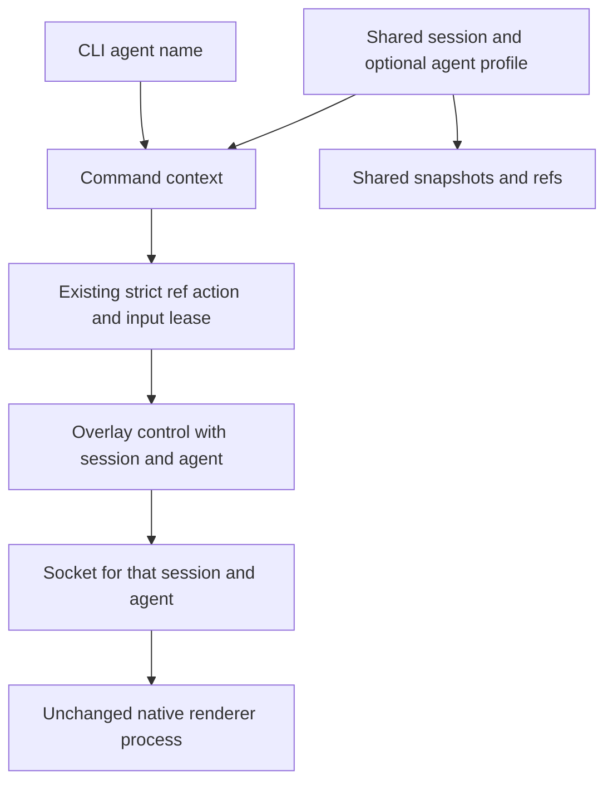
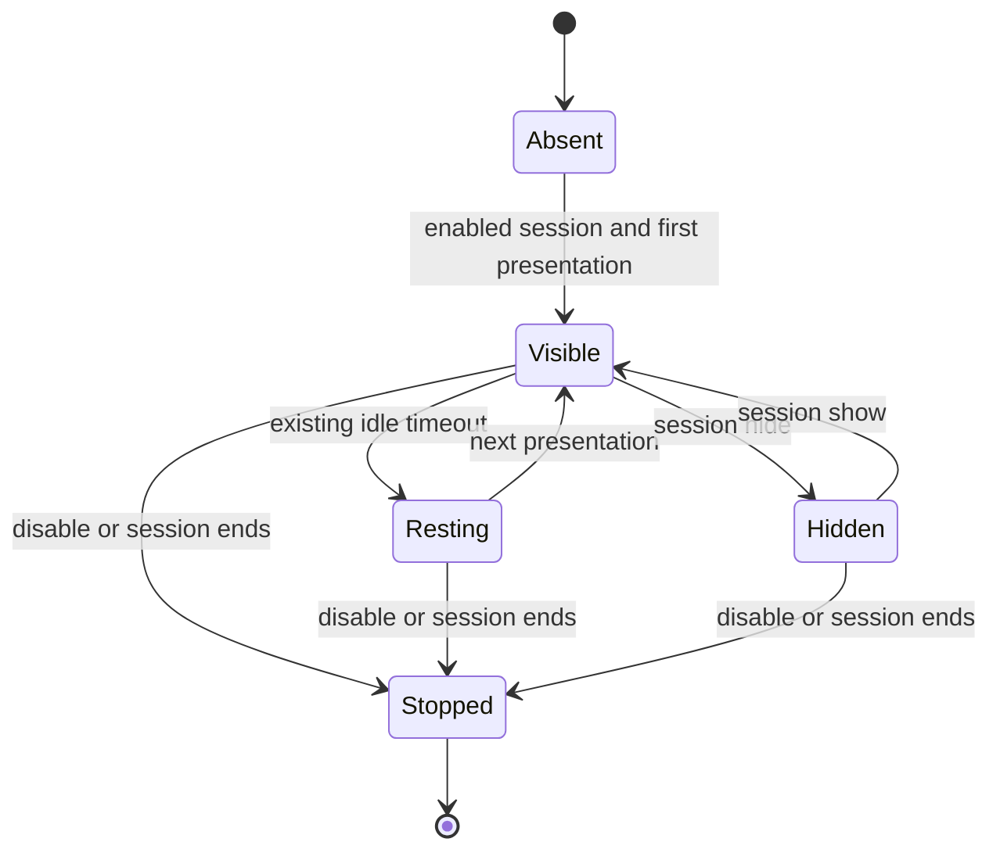

# Multi-agent cursors - Plan

## Goal Capsule

Give each named agent its own macOS cursor while agents share one session and its snapshots.
Preserve the shipped cursor renderer and keep the change limited to identity, configuration, and lifecycle routing.
The user authorizes implementation, inexpensive sub-agents, review, and the LFG shipping tail through an open PR; merging is excluded.
Work from the committed baseline in an isolated worktree because the original checkout contains unrelated edits.
Stop for an invalidated product constraint or unverifiable safety-critical behavior; ordinary implementation details remain executor decisions.

---

## Product Contract

### Summary and problem

The existing overlay has one persistent native child and one animation state per session.
Multiple agents therefore address the same cursor.
Named participants need independent visible cursors without changing shared observation or input coordination.

### Requirements

- R1. Three distinct agent names in an enabled session produce three independently positioned cursors after their first presentation.
- R2. Agent identity persists across CLI invocations through global `--agent-id` or `AGENT_DESKTOP_AGENT_ID`, with the explicit flag taking precedence.
- R3. Session cursor enablement automatically applies to named agents without registration; explicit multi-agent sessions require an agent ID for desktop actions, while ordinary sessions retain the default cursor.
- R4. Existing cursor styling and label options can configure a named agent without changing its peers or the session defaults.
- R5. Motion, fade, rest, description bubble, ripple, highlight, arrival acknowledgement, and reduced-motion behavior reuse the existing renderer.
- R6. Session-wide disable and session end stop every cursor in that session, including agents that never saved a custom profile.
- R7. Agent selection does not alter session IDs, snapshot/ref lookup, tracing schemas, interaction locks, delivery semantics, or the public C ABI.
- R8. Only macOS renders the additional cursors; other platform behavior remains unchanged.

### Scope and flows

A coordinator starts a session with `session start --cursor --multi-agent` and supplies the same session ID plus distinct agent names to its workers.
Each worker inherits the session style automatically; `cursor-overlay enable` with its agent name is optional and only saves a custom style.
The first verified action destination creates that agent's renderer lazily; later invocations reconnect to it.
Repeated use of the same name intentionally addresses the same cursor.
Multi-agent setup creates no default cursor.
Ordinary single-agent sessions keep the current greeting and unnamed cursor behavior.

Outside scope: launching agents, task scheduling, changing shared input serialization, new animation/design work, screenshot policy changes, and new platform implementations.

---

## Planning Contract

### Key technical decisions

- KTD1. Reuse the existing native drawing and animation code unchanged (session-settled: user-directed — chosen over redesigning animations: the user requires preservation of the current visuals). Covers R5.
- KTD2. Use one existing renderer process per session/agent pair. Native bridge globals and the synchronous animation loop in `crates/macos/src/system/cursor_overlay/child.rs` make process isolation much smaller than multiplexing AppKit state. Covers R1, R5.
- KTD3. Keep a validated optional agent ID in command context, independent of session scope. Preserve it when batch items change sessions and reload the destination session's profile. Missing identity selects the existing default route. Covers R2, R7.
- KTD4. Store optional complete `CursorOverlayConfig` profiles in `sessions/<session>/cursor-overlays/<agent>.json` using existing bounded private-file helpers. Session enablement remains the master gate. Missing profiles inherit session defaults; malformed profiles fail closed with a clear error. Named configuration requires an active cursor-enabled session. Covers R3, R4.
- KTD5. `cursor-overlay disable` remains session-wide even when an agent selector is inherited. Hide/Show with an agent ID target only that agent for explicit visibility controls; controls without an ID retain session-wide scope. Enable/Present/Hide/Show carry optional agent identity; legacy JSON remains valid. Covers R6, R7.
- KTD6. Discover live named sockets by a session-specific filename prefix, not profile files or a participant registry. Reuse the startup lock to serialize spawn against session-wide lifecycle controls. Before spawning, recheck session enablement so stale contexts cannot resurrect disabled cursors. Use a four-second aggregate lifecycle deadline and bounded socket reads/writes; report timeout rather than silently claiming teardown. On startup failure terminate and confirm child exit before releasing the startup lock; refuse replacement when exit cannot be confirmed. Covers R6.
- KTD7. Named children periodically check their session manifest and stop after disable, end, or manifest removal, including GC and core callers that bypass CLI teardown. Check at a coarse interval, not per animation frame. Keep native rendering math and timing unchanged. Covers R6.
- KTD8. Add an optional `multi_agent` boolean to the existing session cursor configuration, set by `session start --cursor --multi-agent` or unqualified `cursor-overlay enable --multi-agent`. This mode suppresses bootstrap/default rendering and rejects desktop action commands without `--agent-id` before dispatch; administrative commands remain usable without an ID. Named profiles cannot alter this master setting. Ordinary sessions retain default-route behavior. Covers R1, R3.

### High-level design

### Assumptions and risks

The caller assigns distinct stable names; the tool cannot infer logical agent identity from short-lived process IDs.
One process per agent has linear memory cost; measure a three-agent run before accepting this approach.
Native children must not hold session liveness leases indefinitely, which would prevent session GC.
Named-socket discovery must cover long state-root paths and must not match another session.
Concurrent configuration writes use separate agent files; this work does not redesign existing session-manifest write concurrency.
External research is unnecessary for the chosen approach because it reuses existing renderer, private-file, and socket code without new APIs or dependencies.

---

## Implementation Units

### U1. Agent identity and configuration

**Goal:** Route context and configuration by agent while preserving shared sessions.
**Requirements:** R2-R4, R7-R8; KTD3-KTD5.
**Dependencies:** None.
**Files:** `src/cli/root.rs`, `src/main.rs`, `src/cli_args/session.rs`, `src/cli_args/cursor_overlay_enable.rs`, `src/dispatch/session.rs`, `src/dispatch/mod.rs`, `src/dispatch/cursor_overlay.rs`, `crates/core/src/context.rs`, `crates/core/src/context/options.rs`, `crates/core/src/session/mod.rs`, a focused session cursor-profile module, `crates/core/src/cursor_overlay/config.rs`, `crates/core/src/cursor_overlay/control.rs`, `crates/core/src/cursor_overlay/submit.rs`, `src/cli/contract_tests.rs`, `crates/core/src/context_scope_tests.rs`, `crates/core/src/cursor_overlay/tests.rs`, and focused profile tests.
**Approach:** Reuse existing ID validation and bounded private-file persistence. Add optional identity to Enable/Present/Hide/Show and route configuration through command context. Split by responsibility only where the 400-line limit requires it.
**Test scenarios:**
1. Three names resolve the same session namespace but yield distinct identity-bearing presentation controls.
2. Explicit agent overrides environment; absent identity preserves legacy controls; empty, oversized, and path-like names fail validation.
3. A saved custom profile affects only that agent; missing profiles inherit defaults; disabled or ended sessions suppress all profiles.
4. Multi-agent setup creates no renderer; desktop UI actions without an ID fail before dispatch; lifecycle commands still work without an ID.
5. Batch session switching retains identity and loads the destination profile; malformed profile data cannot silently activate an overlay.
**Verification:** Focused core and CLI tests protect these contracts without changing C headers or action semantics.

### U2. Independent macOS renderer lifecycles

**Goal:** Give each agent independent state with session-wide teardown.
**Requirements:** R1, R5-R8; KTD1-KTD2, KTD5-KTD8.
**Dependencies:** U1.
**Files:** `crates/macos/src/system/cursor_overlay/endpoint.rs`, `spawn.rs`, `child.rs`, and focused routing/lifecycle tests in that directory.
**Approach:** Extend endpoint routing and discovery; reuse the child renderer and startup lock. Validate session and agent on received controls. Preserve old default endpoint compatibility; honor the explicit mode in KTD8 rather than retiring another caller heuristically.
**Test scenarios:**
1. Same session/different agents and same agent/different sessions produce distinct sockets, including long state-root fallback.
2. Concurrent first presentations for one agent create only one renderer; three agents preserve independent destinations and styles.
3. Session disable/end closes every discovered socket, while another session remains alive; a stale context cannot spawn after disable.
4. Missing/custom profiles do not affect socket cleanup; malformed or stalled clients have bounded reads and cannot freeze cleanup forever.
5. Failed startup confirms child exit before replacement; a child that never bound a socket cannot escape cleanup.
6. Existing motion endpoint, ripple, reduced-motion, and native styling checks remain valid without renderer edits.
**Verification:** Deterministic transport tests plus a live three-cursor probe establish isolation, visual preservation, and process/socket teardown.

### U3. Usage documentation and integration proof

**Goal:** Make the feature usable by independent agent processes and verify regressions.
**Requirements:** R1-R8.
**Dependencies:** U1, U2.
**Files:** `CONCEPTS.md`, `skills/agent-desktop/references/commands-system.md`, existing CLI help if needed, and a focused native integration probe under `tests/e2e/` or `scripts/` following current conventions.
**Approach:** Document coordinator setup, per-agent identity/style, shared qualified refs, and session-wide shutdown. Preserve current screenshot policy.
**Test scenarios:**
1. Three separate CLI workers share one session, present three styled cursors, then end the session with no surviving renderer.
2. Unnamed single-agent usage remains valid; headed and headless actions both present the selected agent’s overlay; session disable covers every cursor.
3. Record three-agent process memory and baseline latency compared with the merge base.
**Verification:** Run repository gates and review the performance report; state any unavailable live verification explicitly.

---

## Verification Contract

Run focused tests during each unit, then `cargo fmt --all -- --check`, `cargo clippy --all-targets -- -D warnings`, `cargo test --workspace`, and core dependency isolation.
Run the existing FFI header/contract checks if shared exported Rust changes affect their generation; the committed C ABI must remain identical.
Run `bash scripts/perf-baseline-compare.sh` and inspect its `report.html`; investigate material latency regressions before shipping.
Use isolated state roots for native probes and remove only this run's renderer state through supported teardown.
Record evidence separately for logical routing, live simultaneous cursors, visual behavior, and cleanup.

---

## Definition of Done

U1-U3 meet their scenarios, all required local checks pass, and three named agents have independently verified cursors in one shared session.
The Objective-C renderer, Rust motion functions, and animation constants remain unchanged; child lifecycle/routing edits are allowed.
Unrelated original-checkout edits remain untouched.
No new dependency, registry, scheduler, public C ABI change, or abandoned implementation remains.
The reviewed change is committed as Lahfir, pushed once local gates pass, and opened as a PR with exact-head CI and review feedback checked; it is not merged.

## Implementation verification

Implemented U1–U3 with the existing renderer and motion code unchanged. The CLI and bundled skill document session setup, stable agent IDs, optional profiles, qualified shared refs, and session-wide shutdown. Clipboard and administrative commands remain exempt from the UI-action identity gate.

The local review fixes make named style configuration profile-only, surface uncertain teardown after state persistence, and put long-path sockets in a private per-user directory. Local independent reviewers and a validator completed; the external adversarial review returned no usable result because authentication failed.

Workspace tests, clippy, formatting, Rust file limits, and core dependency isolation passed. The checked-in fixture probe verifies three cursors, profile-free lazy creation, repeated-ID reuse, shared refs, cross-session isolation with the same agent ID, and process/socket cleanup. The full native E2E runner skipped because the desktop was not exclusive.

The 10-round performance comparison against `8e390a4d` measured click p50 -3%, dense snapshot p50 +1%, and get +11 ms in the sample. Three existing renderer processes used approximately 94 MiB RSS in total. No no-agent context I/O or renderer dependencies were added.

### Headed parity follow-up

The user requires the same per-agent presentation in headed mode. Remove automatic headed suppression, present eligible physical pointer commands using the existing renderer, and retain the interaction lease for OS input. Verify named headed ref and raw-coordinate clicks create/reuse their cursors, preserve headless behavior, and update the installed skills and piano prompt.

Verified headed parity: full workspace tests and clippy pass; isolated live headed probe creates three ref-agent cursors plus a raw-click-only cursor and independently observes five clicks. Matching headless probe observes four clicks with three cursors. Both prove cleanup and cross-session isolation. Raw drag presentation covers its endpoints, retaining native physical drag delivery. Presentation remains ordered under the interaction lease, with a shared 900 ms Present budget; failure cleanup retains bounded child reaping.

### Live drag trail

User-directed extension: a bounded, acknowledged drag-start instruction arms the acting agent’s macOS renderer before mouse-down. Its existing idle loop follows the physical pointer and draws the observed path while held; release fades the trail and an explicit completion or cancellation ends tracking. The physical drag reuses CursorMotion, scaled to the requested duration. Global interaction leasing keeps other agents from interleaving physical drags. Existing ripple and Reduce Motion preferences apply; no event tap, per-step IPC, new setting, or public C ABI change.
